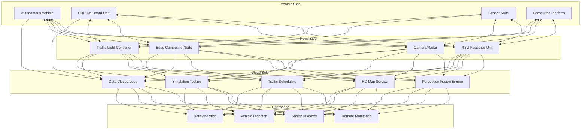
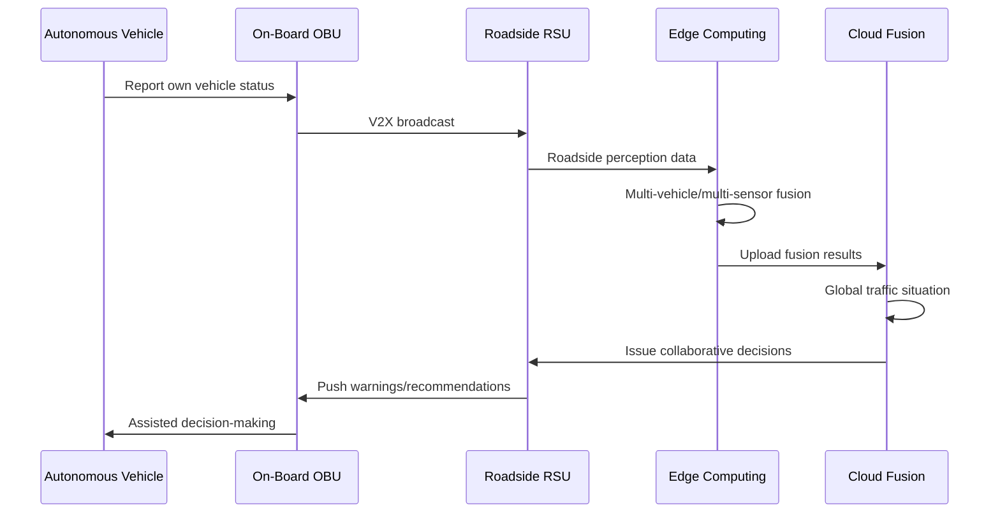
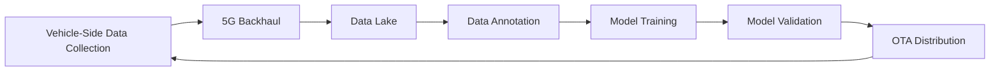

---title: Vehicle-Road Collaborative Autonomous Driving Architecture Design — Alibaba Cloud Perspective
description: 'title: Vehicle-Road Collaborative Autonomous Driving V2X Architecture Design'
summary: 'title: Vehicle-Road Collaborative Autonomous Driving V2X Architecture Design'
category: general
tags:
- architecture
- best-practice
- daemonset
- gpu
- nvidia
tier: supporting
created: '2026-05-23'
last_updated: 2026-05
difficulty: intermediate
reading_level: intermediate
audience:
- All Engineers
estimated_read_time: 5min
intent_queries:
- What is Vehicle-Road Collaborative Autonomous Driving Architecture Design — Alibaba Cloud Perspective
- How to Vehicle-Road Collaborative Autonomous Driving Architecture Design — Alibaba Cloud Perspective
- Kubernetes 20 application patterns best practices
trigger_keywords:
- Vehicle-Road Collaborative Autonomous Driving Architecture Design
- Alibaba Cloud Perspective
- application
- patterns
prerequisites:
- kubectl-basics
- prometheus-basics
- gpu-scheduling-basics
authors:
- name: Dillan Teagle
  role: contributor

---

> **Production Environment Safety Notice**
>
> This document contains directly executable operational commands. Before executing, please confirm: whether the current target cluster and Namespace are correct; whether you have sufficient RBAC permissions; whether you have validated in a non-production environment. Command risk levels are marked as: 🔴 High Risk (may cause data loss or service interruption), 🟡 Medium Risk (will modify cluster state, but generally reversible), 🟢 Low Risk/Read-Only (information gathering, no side effects).


title: Vehicle-Road Collaborative Autonomous Driving V2X Architecture Design
description: '# Vehicle-Road Collaborative Autonomous Driving Architecture Design — Alibaba Cloud Perspective'
category: application-architecture
tags:
- k8s
- architecture
- industry
- [[DaemonSet|daemonset]]
- gpu
- nvidia
last_updated: '2026-05-18'
difficulty: expert
reading_level: expert
audience:
- Autonomous Driving Architects
- V2X System Developers
- Edge Computing Engineers
- Alibaba Cloud Solution Architects
estimated_read_time: 5min
intent_queries:
- Vehicle-Road Collaborative V2X system architecture design
- Autonomous driving perception fusion K8s deployment
- RSU roadside unit edge computing
- High-definition map data closed loop
- V2X functional safety ASIL-D
trigger_keywords:
- V2X
- Vehicle-Road Collaboration
- Autonomous Driving
- Edge Computing
- Perception Fusion
- HD Map
- RSU
- OBU
- 5G
- ASIL-D
related_domains:
- domain-01-cluster-fundamentals
- domain-9-ai-ml
- domain-5-iot-edge-computing
- domain-03-networking-traffic
related_topics:
- domain-20-application-patterns/topic-application-architecture/80-tsn-network
- domain-20-application-patterns/topic-application-architecture/51-smart-manufacturing-mes
- domain-20-application-patterns/topic-application-architecture/47-smart-mining
- domain-02-workloads-applications/topic-functions/05-iot-edge-computing
k8s_versions:
- '1.28'
- '1.29'
- '1.30'
- '1.31'
- '1.32'
---

# Vehicle-Road Collaborative Autonomous Driving Architecture Design — Alibaba Cloud Perspective

> **Applicable Versions**: [[Kubernetes|Kubernetes]] v1.29 - v1.33 | **Last Updated**: 2026-04-24
> **Author**: Alibaba Cloud Solution Architects | **Tags**: `#Vehicle-Road-Collaboration` `#Autonomous-Driving` `#V2X` `#Alibaba-Cloud`

---

## Table of Contents

1. [Industry Background](#1-industry-background)
2. [Business Architecture](#2-business-architecture)
3. [Technical Architecture](#3-technical-architecture)
4. [Core Data Flows](#4-core-data-flow)
5. [Security and Compliance](#5-security-and-compliance)
6. [Observability](#6-observability)
7. [Alibaba Cloud Component Mapping](#7-alibaba-cloud-component-mapping)
8. [Production Checklist](#8-production-checklist)

---

## 1. Industry Background

### 1.1 Business Characteristics

Vehicle-road collaboration enhances autonomous driving capabilities through roadside infrastructure:

| Challenge | Description | Architectural Impact |
|:---|:---|:---|
| Ultra-Low Latency | Safety commands < 20ms | Edge computing + 5G |
| High-Precision Positioning | Centimeter-level positioning requirement | RTK + HD Map |
| Perception Fusion | Vehicle-side + road-side perception fusion | Multi-source data fusion |
| Safety Redundancy | Functional safety ASIL-D | Redundant architecture |
| Massive Data | Autonomous driving data upload | Data lake + annotation |

### 1.2 Core Scenarios

- **Collaborative Perception**: Roadside sensors extend vehicle perception range
- **Collaborative Decision-Making**: Intersection signal/pedestrian early warning
- **Collaborative Control**: Platooning / remote takeover
- **HD Map**: Real-time map updates and distribution
- **Data Closed Loop**: Data upload / annotation / model iteration

---

## 2. Business Architecture

### 2.1 Vehicle-Road Collaboration Panoramic Architecture


```mermaid
graph TB
    subgraph Vehicle Side
        V1[Autonomous Vehicle]
        V2[OBU On-Board Unit]
        V3[Sensor Suite]
        V4[Computing Platform]
    end

    subgraph Road Side
        R1[RSU Roadside Unit]
        R2[Camera/Radar]
        R3[Edge Computing Node]
        R4[Traffic Light Controller]
    end

    subgraph Cloud Side
        C1[Perception Fusion Engine]
        C2[HD Map Service]
        C3[Traffic Scheduling]
        C4[Data Closed Loop]
        C5[Simulation Testing]
    end

    subgraph Operations
        O1[Remote Monitoring]
        O2[Safety Takeover]
        O3[Vehicle Dispatch]
        O4[Data Analytics]
    end

    V1 & V2 & V3 & V4 <--> R1 & R2 & R3 & R4
    R1 & R2 & R3 & R4 --> C1 & C2 & C3 & C4 & C5
    C1 & C2 & C3 & C4 & C5 --> O1 & O2 & O3 & O4
    V1 & V2 --> C4
```

### 2.2 Collaborative Perception Sequence


```mermaid
sequenceDiagram
    participant VEHICLE as Autonomous Vehicle
    participant OBU as On-Board OBU
    participant RSU as Roadside RSU
    participant EDGE as Edge Computing
    participant CLOUD as Cloud Fusion

    VEHICLE->>OBU: Report own vehicle status
    OBU->>RSU: V2X broadcast
    RSU->>EDGE: Roadside perception data
    EDGE->>EDGE: Multi-vehicle/multi-sensor fusion
    EDGE->>CLOUD: Upload fusion results
    CLOUD->>CLOUD: Global traffic situation
    CLOUD->>RSU: Issue collaborative decisions
    RSU->>OBU: Push warnings/recommendations
    OBU->>VEHICLE: Assisted decision-making
```

---
## 3. Technical Architecture

### 3.1 K8s Deployment

```yaml
# Perception Fusion Engine GPU Deployment
apiVersion: apps/v1
kind: Deployment
metadata:
  name: perception-fusion
  namespace: v2x-autonomous
spec:
  replicas: 3
  selector:
    matchLabels:
      app: perception-fusion
  template:
    metadata:
      labels:
        app: perception-fusion
    spec:
      nodeSelector:
        accelerator: nvidia-a10
      runtimeClassName: nvidia
      containers:
        - name: fusion
          image: registry.cn-hangzhou.aliyuncs.com/v2x/perception-fusion:v2.0.0-gpu
          ports:
            - containerPort: 8080
          env:
            - name: FUSION_ALGORITHM
              value: "multi-sensor-kalman"
            - name: MAX_LATENCY_MS
              value: "50"
          resources:
            requests:
              nvidia.com/gpu: 1
              memory: "16Gi"
              cpu: "8000m"
            limits:
              nvidia.com/gpu: 1
              memory: "32Gi"
              cpu: "16000m"
```

```yaml
# Edge RSU Controller DaemonSet
apiVersion: apps/v1
kind: DaemonSet
metadata:
  name: rsu-controller
  namespace: v2x-autonomous
spec:
  selector:
    matchLabels:
      app: rsu-controller
  template:
    metadata:
      labels:
        app: rsu-controller
    spec:
      hostNetwork: true
      nodeSelector:
        node-type: roadside-edge
      containers:
        - name: rsu
          image: registry.cn-hangzhou.aliyuncs.com/v2x/rsu-controller:v1.5.0
          resources:
            requests:
              memory: "2Gi"
              cpu: "2000m"
            limits:
              memory: "4Gi"
              cpu: "4000m"
```

---

## 4. Core Data Flow

### 4.1 Data Closed-Loop Pipeline


```mermaid
flowchart LR
    A[Vehicle-Side Data Collection] --> B[5G Backhaul]
    B --> C[Data Lake]
    C --> D[Data Annotation]
    D --> E[Model Training]
    E --> F[Model Validation]
    F --> G[OTA Distribution]
    G --> A
```

---

## 5. Security and Compliance

- **Functional Safety**: ASIL-D level requirements
- **Cybersecurity**: V2X communication encryption
- **Data Security**: HD map data confidentiality

---

## 6. Observability

- **End-to-End Latency**: < 20ms
- **Perception Accuracy**: > 99.9%
- **System Availability**: 99.999%

---

## 7. Alibaba Cloud Component Mapping

| Functional Domain | **Alibaba Cloud Cloud-Native Solution** |
|:---|:---|
| Container Platform | **ACK Pro + ACK Edge** |
| GPU | **GN7/GN10 Instances** |
| IoT | **Alibaba Cloud IoT Platform** |
| 5G | **5G Private Network** |
| HD Map | **Alibaba Cloud HD Map** |
| Data Lake | **OSS + MaxCompute** |
| AI | **PAI** |
| Observability | **ARMS + SLS** |

---

## 8. Production Checklist

- [ ] V2X communication latency < 20ms
- [ ] Perception fusion accuracy validation
- [ ] Functional safety ASIL-D certification
- [ ] Remote takeover response < 100ms
- [ ] HD map data security

---

**Maintainer**: Alibaba Cloud Solutions Architect Team | **License**: MIT

---

## Obsidian Related Documents

- topic-application-architecture KUDIG Database — Global MOC
- [[domain-20-application-patterns/topic-application-architecture/README.md|Topic Application Layer Architecture Design Best Practices]]
- [[domain-20-application-patterns/topic-application-architecture/01-ecommerce-architecture.md|E-Commerce System Kubernetes Production Architecture Design]]
- [[domain-20-application-patterns/topic-application-architecture/02-mini-program-architecture.md|Mini Program Platform Architecture Design]]
- [[domain-20-application-patterns/topic-application-architecture/03-cms-architecture.md|Content Management System CMS Architecture Design]]
- [[domain-20-application-patterns/topic-application-architecture/04-im-rtc-architecture.md|Real-Time Communication IM/RTC Architecture Design]]
- [[domain-20-application-patterns/topic-application-architecture/05-online-education-architecture.md|Online Education Platform Kubernetes Production Architecture Design]]
- [[domain-20-application-patterns/topic-application-architecture/06-fintech-architecture.md|FinTech Kubernetes Production Architecture Design]]
- [[domain-20-application-patterns/topic-application-architecture/07-iot-platform-architecture.md|IoT Platform Architecture Design]]
- [[domain-20-application-patterns/topic-application-architecture/08-ai-ml-inference-architecture.md|AI/ML Inference Service Kubernetes Production Architecture Design]]
- [[domain-20-application-patterns/topic-application-architecture/09-gaming-backend-architecture.md|Gaming Backend Kubernetes Production Architecture Design]]
- [[domain-20-application-patterns/topic-application-architecture/10-social-media-architecture.md|Social Media Platform Kubernetes Production Architecture Design]]

## See Also

- 58-web3-gamefi
- 59-industrial-internet-platform
- 61-smart-grid
- 62-distributed-energy

## Related

- topic-application-architecture MOC — Cross-reference


<!-- risk-assessed -->
