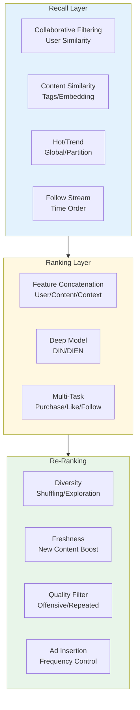
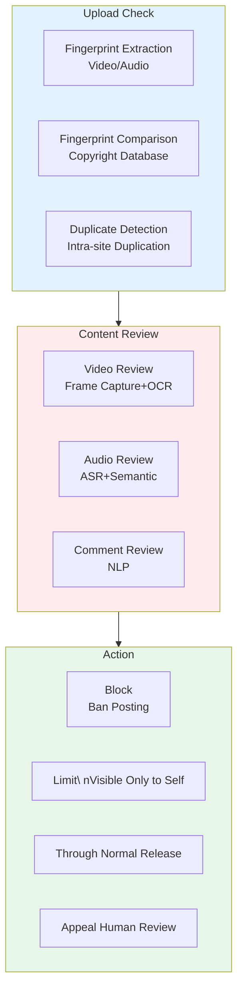

> **Production Environment Security Reminders**
>
> Commands included in this document are executable directly. Please confirm before execution: that the target cluster and Namespace are correct; that you have sufficient RBAC permissions; and that the commands have been validated in a non-production environment. Risk level annotations for commands: 🔴 High Risk (may result in data loss or service disruption), 🟡 Medium Risk (will modify cluster state but usually rollbackable), 🟢 Low Risk/Read-Only (information gathering with no side effects).


title: Audio-Video and Short Video Platform Architecture Design
description: '# Audio-Video and Short Video Platform [[Kubernetes|Kubernetes]] Production Architecture Design'
category: application-architecture
tags:
- k8s
- architecture
- industry
- docker
- redis
- hpa
- operator
- rag
last_updated: 2026-05-18
difficulty: advanced
reading_level: advanced
audience:
- Audio/Video Architect
- CDN Expert
- Recommendation System Engineer
estimated_read_time: 5min
intent_queries:
- High Availability Architecture for Short Video Platforms on Kubernetes
- Recall and Sorting for Video Recommendation System
- Live Streaming Push and CDN Distribution Architecture
- Video Transcoding Pipeline
- Alibaba Cloud Video On Demand (VOD)
trigger_keywords:
- Short Video Platform
- Video Recommendation
- Live Streaming Push
- CDN Distribution
- Video Transcoding
- Content Moderation
- Real-time Interaction
- Co-Mic Architecture
- WebRTC
- DRM Copyright Protection
related_domains:
- domain-03-networking-traffic
- domain-10-troubleshooting-diagnostics
related_topics:
- topic-video-streaming-architecture
- topic-content-platform-architecture
k8s_versions:
- '1.28'
- '1.29'
- '1.30'
- '1.31'
- '1.32'
---

# Audio-Video and Short Video Platform Kubernetes Production Architecture Design

> **Applicable Scenarios**: Video-sharing platform / Long video on-demand / Live interaction / Voice-video calls / Cloud editing / Digital humans  
> **Cloud Providers**: Alibaba Cloud ACK + Video cloud product system  
> **Applicable Versions**: Kubernetes v1.29 - v1.33  
> **Last Updated**: 2026-04-24  
> **Target Readers**: Video architecture engineers, CDN experts, Alibaba Cloud solution architects

---

## 📋 Table of Contents

- [One, Overall Architecture Panorama](#1-overall-architecture-overview)
- [Two, Video Production and Distribution Architecture](#2-short-video-production-and-distribution-architecture)
- [Three, Live Streaming Push and Pull Stream Architecture](#3-live-push-and-pull-stream-architecture)
- [Four, Audio and Video Processing Pipeline Architecture](#4-audio-video-processing-pipeline-architecture)
- [Five, Recommendation and Personalized Distribution Architecture](#5-recommendation-and-personalized-distribution-architecture)
- [Six, Real-time Interaction and Co-hosting Architecture](#video-processing-k8s-pipeline)
- [Seven, Copyright Protection and Content Review Architecture](#7-copyright-protection-and-content-review-architecture)
- [Eight, ACK Alibaba Cloud Deployment Architecture](#8-ack-alibaba-cloud-deployment-architecture)

---

## 1. Overall Architecture Overview

```mermaid
flowchart TB
    subgraph Creators["Creators"]
        UPLOADER["Video Upload<br">Mobile/PC"]
        LIVE_STREAMER["Streamer<br">OBS/Mobile"]
        EDITOR["Cloud Editing<br">Online Editing"]
    end

    subgraph MediaCloud["Media Cloud Services (Alibaba Cloud)"]
        VOD_PROC["On-Demand Processing<br">Transcoding/Watermarking/Encryption"]
        LIVE_PROC["Live Processing<br">RTS/Transcoding/Recording"]
        AI_MED["Media AI<br">Review/Label/Summary"]
        CDN_MED["CDN Distribution<br">Global Acceleration]
    end

    subgraph Platform["Platform Services (ACK)"]
        FEED_VIDEO["Feed Recommendation<br">Personalized"]
        COMMENT["Comment System<br">Barrage/Interactivity"]
        SOCIAL_VIDEO["Social<br">Follow/Private Message"]
        MONETIZE_VIDEO["Monetization<br">Advertising/E-commerce/Payments"]
    end

    subgraph Consumers["Consumers"]
        MOBILE_VIEWER["Mobile<br">App/Mini Program"]
        WEB_VIEWER["Web<br">PC/Tablet"]
        TV_VIEWER["TV<br">OTT/Screen Mirroring"]
    end

    Creators --> MediaCloud --> Platform --> Consumers

    style MediaCloud fill:#e3f2fd
    style Platform fill:#fff8e1
```

## Alibaba Cloud Product Mapping

| Architecture Layer | Alibaba Cloud Solution | Description |
|:---|:---|:---|
| Container Platform | **ACK Pro** | Service hosting |
| Video On-Demand | **Video On-Demand VOD** | Upload / Storage / Transcoding / Distribution |
| Live | **Video Live Stream Live** | Push / Pull / RTS / Recording |
| Real-time Audio-Video | **Real-time Audio-Video Communication RTC** | Co-hosting / Meetings / Interaction |
| CDN | **CDN** + **DDN** | Static + Dynamic acceleration |
| Media Processing | **Smart Media Service IMS** | AI audit / tags / summary |
| Object Storage | **OSS** | Asset storage |
| Message Queue | **RocketMQ** | Asynchronous processing |
| Big Data | **MaxCompute** + **PAI** | Recommendation / Analysis |

---

## 2. Short Video Production and Distribution Architecture

```mermaid
flowchart TB
    subgraph Production["Content Creation"]
        CAPTURE["Capture<br">Filters/Appearance]
        EDIT["Edit [Clip<br>Card Points/Subtitles/SFX]"]
        MUSIC["Music Copyright Music Library"]
        UPLOAD_VIDEO["Upload Resumable"]
    end

    subgraph Processing["Cloud Processing"]
        INSPECT["Content Inspection<BR>Automated+Manual"]
        TRANSCODE_VIDEO["Transcode Video[Convert to Multiple Clarity]"]
        EXTRACT["Feature Extraction<br">Tags/Covers/Fingerprints"]
        ENCRYPT_VIDEO["Encrypt Video"]
    end

    subgraph Distribution["Distribution"]
        REC_VIDEO["Recommend Engine<br">Interest Start-up"]
        CDN_PUSH["CDN Preheat <br> Hot Topic Push"]
        P2P["P2P Acceleration<br>Saving Bandwidth"]
    end

    Production --> Processing --> Distribution

    style Production fill:#e3f2fd
    style Processing fill:#fff8e1
    style Distribution fill:#e8f5e9
```

---

## 3. Live Push and Pull Stream Architecture

```mermaid
flowchart TB
    subgraph Publisher["Publisher"]
        OBS["OBS / Professional Equipment"]
        MOBILE_LIVE["Mobile Live"]
        WEB_LIVE["Web Stream <br>Whip"]
    end

    subgraph Ingestion["Ingestion Layer"]
        RTMP_INGEST["RTMP Ingest"]
        SRT_INGEST["SRT Ingest <br>Low Latency"]
        WEBRTC_INGEST["WebRTC Ingest <br>Ultra Low Latency"]
    end

    subgraph ProcessingLive["Processing Layer"]
        TRANSCODE_LIVE["Real-time Transcoding<br">Multi-bitrate"]
        RECORD_LIVE["Recording<br">Time-shift/Playback"]
        AI_LIVE["AI Processing<br">Beauty/Virtual Background"]
    end

    subgraph DistributionLive["Distribution Layer"]
        HLS_LIVE["HLS<br">iOS/General"]
        FLV_LIVE["HTTP-FLV<br">Low latency"]
        RTS_LIVE["RTS<br">Aliyun Ultra-low latency"]
        WEBRTC_LIVE["WebRTC<br"><1s Latency"]
    end

    Publisher --> Ingestion --> ProcessingLive --> DistributionLive

    style Ingestion fill:#e3f2fd
    style ProcessingLive fill:#fff8e1
    style DistributionLive fill:#e8f5e9
```

---

## 4. Audio-Video Processing Pipeline Architecture

```mermaid
flowchart TB
    subgraph Input["Input"]
        RAW_VIDEO["Raw Video"]
        RAW_AUDIO["Raw Audio"]
        SUBTITLE["Subtitle File"]
    end

    subgraph Pipeline["Processing Pipeline (Tekton)"]
        DEMUX["Demultiplexing<br">MP4/MKV/FLV"]
        VIDEO_ENCODE["Video Encoding<br">H.264/H.265/AV1"]
        AUDIO_ENCODE["Audio Encoding<br">AAC/OPUS"]
        PACKAGE["Package<br">DASH/HLS/MP4"]
        DRM["DRM Encryption<br">Widevine/FairPlay]
    end

    subgraph Output["Output"]
        MP4_OUT["MP4<br>Download"]
        HLS_OUT["HLS<br">iOS"]
        DASH_OUT["DASH<br">Android/Web"]
        AUDIO_ONLY["Pure Audio<br>Radio/Podcast"]
    end

    Input --> Pipeline --> Output

    style Pipeline fill:#e3f2fd
    style Output fill:#e8f5e9
```

## Video Processing K8s Pipeline

```yaml
apiVersion: tekton.dev/v1beta1
kind: Pipeline
metadata:
  name: video-processing-pipeline
  namespace: media-platform
spec:
  workspaces:
    - name: source
    - name: docker-config
  params:
    - name: input-url
      type: string
    - name: output-prefix
      type: string
  tasks:
    - name: download
      taskSpec:
        steps:
          - name: wget
            image: alpine
            script: |
              wget $(params.input-url) -O /workspace/source/input.mp4
      workspaces:
        - name: source
          workspace: source

    - name: transcode-multi-bitrate
      runAfter: [download]
      taskSpec:
        steps:
          - name: ffmpeg
            image: jrottenberg/ffmpeg:6.0-alpine
            script: |
              # 1080p
              ffmpeg -i /workspace/source/input.mp4 \
                -c:v libx264 -crf 23 -preset fast \
                -c:a aac -b:a 128k \
                -s 1920x1080 \
                /workspace/source/1080p.mp4
              # 720p
              ffmpeg -i /workspace/source/input.mp4 \
                -c:v libx264 -crf 26 -preset fast \
                -c:a aac -b:a 96k \
                -s 1280x720 \
                /workspace/source/720p.mp4
              # 480p
              ffmpeg -i /workspace/source/input.mp4 \
                -c:v libx264 -crf 28 -preset fast \
                -c:a aac -b:a 64k \
                -s 854x480 \
                /workspace/source/480p.mp4
      workspaces:
        - name: source
          workspace: source

    - name: package-hls
      runAfter: [transcode-multi-bitrate]
      taskSpec:
        steps:
          - name: hls-packager
            image: google/shaka-packager:latest
            script: |
              packager \
                'in=/workspace/source/1080p.mp4,stream=video,init_segment=1080p_init.mp4,segment_template=1080p_$Number$.m4s' \
                'in=/workspace/source/720p.mp4,stream=video,init_segment=720p_init.mp4,segment_template=720p_$Number$.m4s' \
                'in=/workspace/source/480p.mp4,stream=video,init_segment=480p_init.mp4,segment_template=480p_$Number$.m4s' \
                'in=/workspace/source/1080p.mp4,stream=audio,init_segment=audio_init.mp4,segment_template=audio_$Number$.m4s' \
                --mpd_output manifest.mpd \
                --hls_master_playlist_output master.m3u8
      workspaces:
        - name: source
          workspace: source

    - name: upload-to-oss
      runAfter: [package-hls]
      taskSpec:
        steps:
          - name: oss-upload
            image: registry.cn-hangzhou.aliyuncs.com/aliyun/ossutil:latest
            script: |
              ossutil cp -r /workspace/source/ \
                oss://media-bucket/processed/$(params.output-prefix)/
      workspaces:
        - name: source
          workspace: source
```

---

## 5. Recommendation and Personalized Distribution Architecture



---

## 6. Real-time Interaction and Co-hosting Architecture

```mermaid
flowchart TB
    subgraph Interaction["Interaction Forms"]
        DANMU_VIDEO["Emotion<br>Real-time Text"]
        GIFT["Gifts<br>Animations"]
        LIKE_ANI["Like<br>Animations"]
        CO_HOST["Live Room<br">Audience Mic Up"]
        PK["Battle<br">Cross Room"]
    end

    subgraph Signaling["Signaling"]
        WS_SIGNAL["WebSocket Status Synchronization"]
        ROOM_MGMT["Room Management\nto and from/Dining Table"]
        PERMISSION["Permission\ Silence/Kick"]
    end

    subgraph MediaMedia["Media"]
        MIXER["Mixing/Merging<br">Merge]
        EFFECT["Effects<br">Beauty/Voice Change]
        RECORD_INT["Recording<br">Highlights]
    end

    Interaction --> Signaling --> MediaMedia

    style Signaling fill:#e3f2fd
    style MediaMedia fill:#e8f5e9
```

---

## 7. Copyright Protection and Content Review Architecture



---

## 8. ACK Alibaba Cloud Deployment Architecture

```yaml
apiVersion: apps/v1
kind: Deployment
metadata:
  name: video-recommendation-service
  namespace: media-platform
spec:
  replicas: 20
  selector:
    matchLabels:
      app: video-recommendation
  template:
    metadata:
      labels:
        app: video-recommendation
    spec:
      affinity:
        podAntiAffinity:
          preferredDuringSchedulingIgnoredDuringExecution:
            - weight: 100
              podAffinityTerm:
                labelSelector:
                  matchExpressions:
                    - key: app
                      operator: In
                      values:
                        - video-recommendation
                topologyKey: kubernetes.io/hostname
      containers:
        - name: recommend
          image: registry.cn-hangzhou.aliyuncs.com/media/recommendation:v3.0
          ports:
            - containerPort: 8080
          env:
            - name: REDIS_CLUSTER
              value: "r-bp1xxxxxxxxx.redis.rds.aliyuncs.com:6379"
            - name: FEATURE_SERVICE_URL
              value: "http://feature-service:8080"
            - name: MODEL_PATH
              value: "/models/din_v3"
          resources:
            requests:
              cpu: "4"
              memory: "8Gi"
            limits:
              cpu: "16"
              memory: "32Gi"
---
# HPA Based on QPS Scale Up and Down
apiVersion: autoscaling/v2
kind: HorizontalPodAutoscaler
metadata:
  name: video-recommend-hpa
  namespace: media-platform
spec:
  scaleTargetRef:
    apiVersion: apps/v1
    kind: Deployment
    name: video-recommendation-service
  minReplicas: 20
  maxReplicas: 200
  metrics:
    - type: Pods
      pods:
        metric:
          name: http_requests_per_second
        target:
          type: AverageValue
          averageValue: "5000"
    - type: Resource
      resource:
        name: cpu
        target:
          type: Utilization
          averageUtilization: 60
```

---

## References

- [Alibaba Cloud Video On-Demand](https://www.aliyun.com/product/vod)
- [Alibaba Cloud Video Live Stream](https://www.aliyun.com/product/live)
- [Alibaba Cloud RTC](https://www.aliyun.com/product/rtc)
- [FFmpeg Documentation](https://ffmpeg.org/documentation.html)

---

## Obsidian Related Documentation

- topic-application-architecture KUDIG Database — Global MOC
- [[domain-20-application-patterns/topic-application-architecture/README.md|Topic Application Architecture Design Best Practices]]
- [[domain-20-application-patterns/topic-application-architecture/01-ecommerce-architecture.md|E-commerce System Kubernetes Production Architecture Design]]
- [[domain-20-application-patterns/topic-application-architecture/02-mini-program-architecture.md|Mini Program Platform Architecture Design]]
- [[domain-20-application-patterns/topic-application-architecture/03-cms-architecture.md|Content Management System CMS Architecture Design]]
- [[domain-20-application-patterns/topic-application-architecture/04-im-rtc-architecture.md|Real-Time Communication IM/RTC Architecture Design]]
- [[domain-20-application-patterns/topic-application-architecture/05-online-education-architecture.md|Online Education Platform Kubernetes Production Architecture Design]]
- [[domain-20-application-patterns/topic-application-architecture/06-fintech-architecture.md|Financial Technology FinTech Kubernetes Production Architecture Design]]
- [[domain-20-application-patterns/topic-application-architecture/07-iot-platform-architecture.md|Internet of Things IoT Platform Architecture Design]]
- [[domain-20-application-patterns/topic-application-architecture/08-ai-ml-inference-architecture.md|AI/ML Inference Service Kubernetes Production Architecture Design]]
- [[domain-20-application-patterns/topic-application-architecture/09-gaming-backend-architecture.md|Game Backend Kubernetes Production Architecture Design]]
- [[domain-20-application-patterns/topic-application-architecture/10-social-media-architecture.md|Social Media Platform Kubernetes Production Architecture Design]]

## See Also

- 14-smart-healthcare-architecture
- 15-energy-power-architecture
- 17-saas-multitenant-architecture
- 18-data-midplatform-architecture


<!-- risk-assessed -->
