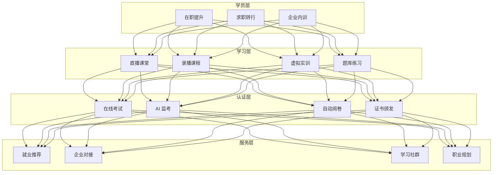
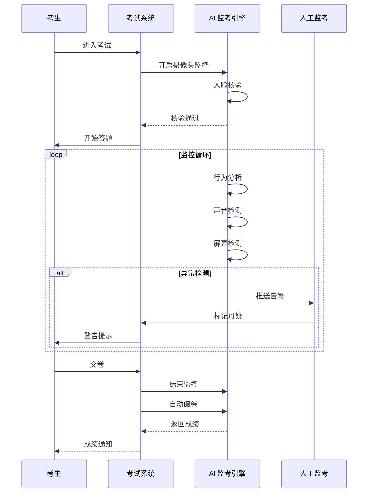
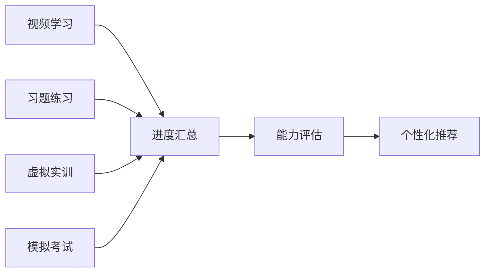

---title: 职业教育培训架构设计 — 阿里云视角
description: 'title: 职业教育培训架构设计'
summary: 'title: 职业教育培训架构设计'
category: general
tags:
- architecture
- best-practice
- statefulset
- gpu
- nvidia
tier: supporting
created: '2026-05-23'
last_updated: 2026-05
difficulty: intermediate
reading_level: intermediate
audience:
- 所有工程师
estimated_read_time: 5min
intent_queries:
- 职业教育培训架构设计 — 阿里云视角 是什么
- 如何 职业教育培训架构设计 — 阿里云视角
- Kubernetes 20 application patterns 最佳实践
trigger_keywords:
- 职业教育培训架构设计
- 阿里云视角
- application
- patterns
prerequisites:
- kubectl-basics
- prometheus-basics
- gpu-scheduling-basics
authors:
- name: Dillan Teagle
  role: contributor

---

> **生产环境安全提示**
>
> 本文档包含可直接执行的运维命令。执行前请确认：当前目标集群与 Namespace 是否正确；是否具备足够的 RBAC 权限；是否已在非生产环境验证。命令风险等级标注：🔴 高风险（可能造成数据丢失或服务中断）、🟡 中风险（会修改集群状态，但通常可回滚）、🟢 低风险/只读（信息收集，无副作用）。


title: 职业教育培训架构设计
description: '# 职业教育培训架构设计 — 阿里云视角'
category: application-architecture
tags:
- k8s
- architecture
- industry
- [[StatefulSet|statefulset]]
- gpu
- nvidia
last_updated: 2026-05-18
difficulty: intermediate
reading_level: intermediate
audience:
- 教育科技架构师
- 职业培训机构IT
- 在线教育开发者
- 虚拟实训工程师
estimated_read_time: 5min
intent_queries:
- vocational education [[Kubernetes|kubernetes]] architecture
- 职业教育K8s部署方案
- 在线考试防作弊系统
- 虚拟实训云桌面
- 区块链证书存证
trigger_keywords:
- 职业教育
- 技能培训
- 在线教育
- 虚拟实训
- AI监考
- 区块链证书
- 职业教育架构
- 考证培训
- 云桌面
- 培训平台K8s
related_domains:
- domain-01-cluster-fundamentals
- domain-10-troubleshooting-diagnostics
- domain-03-networking-traffic
related_topics:
- smart-elderly-care
- smart-restaurant
- digital-government-architecture
k8s_versions:
- '1.28'
- '1.29'
- '1.30'
- '1.31'
- '1.32'
---

# 职业教育培训架构设计 — 阿里云视角

> **适用版本**: Kubernetes v1.29 - v1.33 | **最后更新**: 2026-04-24
> **作者**: 阿里云解决方案架构师 | **标签**: `#职业教育` `#技能培训` `#考证` `#阿里云`

---

## 目录

1. [行业背景](#1-行业背景)
2. [业务架构](#2-业务架构)
3. [技术架构](#3-技术架构)
4. [核心数据流](#4-核心数据流)
5. [安全与合规](#5-安全与合规)
6. [可观测性](#6-可观测性)
7. [阿里云组件映射](#7-阿里云组件映射)
8. [生产检查清单](#8-生产检查清单)

---

## 1. 行业背景

### 1.1 业务特点

职业教育培训面向成人技能提升，强调实操与认证：

| 挑战 | 说明 | 架构影响 |
|:---|:---|:---|
| 碎片化学习 | 在职人员时间分散 | 微课 + 移动端优先 |
| 实操模拟 | 需要虚拟实训环境 | 云桌面/VR 实训 |
| 考试防作弊 | 在线考试公平性 | AI 监考 + 人脸识别 |
| 证书管理 | 职业技能等级证书 | 区块链存证 |
| 就业对接 | 培训与就业衔接 | 人才匹配平台 |

### 1.2 核心场景

- **在线课程**: 直播/录播/微课学习
- **虚拟实训**: 云桌面/VR 实操训练
- **在线考试**: AI 监考/自动阅卷
- **证书管理**: 职业技能证书颁发与查询
- **就业服务**: 企业招聘对接

---

## 2. 业务架构

### 2.1 职业教育全景架构



### 2.2 AI 监考时序



---

## 3. 技术架构

### 3.1 K8s 部署

```yaml
# 云桌面实训环境 StatefulSet
apiVersion: apps/v1
kind: StatefulSet
metadata:
  name: vdi-training
  namespace: vocational-edtech
spec:
  serviceName: vdi-training
  replicas: 10
  selector:
    matchLabels:
      app: vdi-training
  template:
    metadata:
      labels:
        app: vdi-training
    spec:
      nodeSelector:
        accelerator: nvidia-t4
      runtimeClassName: nvidia
      containers:
        - name: vdi
          image: registry.cn-hangzhou.aliyuncs.com/voced/vdi-base:v1.0.0-gpu
          ports:
            - containerPort: 3389
              name: rdp
          resources:
            requests:
              nvidia.com/gpu: 1
              memory: "8Gi"
              cpu: "4000m"
            limits:
              nvidia.com/gpu: 1
              memory: "16Gi"
              cpu: "8000m"
```

---

## 4. 核心数据流

### 4.1 学习进度追踪



---

## 5. 安全与合规

- **考试公平**: AI 监考 + 防作弊
- **证书可信**: 区块链证书存证
- **数据隐私**: 学员信息保护

---

## 6. 可观测性

- **视频流畅度**: > 98%
- **考试并发**: 支持 10万+
- **系统可用性**: 99.9%

---

## 7. 阿里云组件映射

| 功能域 | **阿里云云原生方案** |
|:---|:---|
| 容器平台 | **ACK Pro + GPU** |
| 直播 | **视频直播** |
| 云桌面 | **无影云电脑** |
| AI | **PAI / 视觉智能** |
| 数据库 | **PolarDB** |
| 区块链 | **蚂蚁链 BaaS** |
| 可观测性 | **ARMS + SLS** |

---

## 8. 生产检查清单

- [ ] 云桌面实训环境稳定性
- [ ] AI 监考准确率 > 95%
- [ ] 证书区块链存证验证
- [ ] 考试系统并发压测
- [ ] 学员隐私数据保护

---

**维护者**: 阿里云解决方案架构师团队 | **许可证**: MIT

---

## Obsidian 相关文档

- topic-application-architecture KUDIG Database — Global MOC
- [[domain-20-application-patterns/topic-application-architecture/README.md|Topic 应用层架构设计最佳实践]]
- [[domain-20-application-patterns/topic-application-architecture/01-ecommerce-architecture.md|电商系统 Kubernetes 生产架构设计]]
- [[domain-20-application-patterns/topic-application-architecture/02-mini-program-architecture.md|小程序平台架构设计]]
- [[domain-20-application-patterns/topic-application-architecture/03-cms-architecture.md|内容管理系统 CMS 架构设计]]
- [[domain-20-application-patterns/topic-application-architecture/04-im-rtc-architecture.md|实时通信 IM/RTC 架构设计]]
- [[domain-20-application-patterns/topic-application-architecture/05-online-education-architecture.md|在线教育平台 Kubernetes 生产架构设计]]
- [[domain-20-application-patterns/topic-application-architecture/06-fintech-architecture.md|金融科技FinTech Kubernetes生产架构设计]]
- [[domain-20-application-patterns/topic-application-architecture/07-iot-platform-architecture.md|物联网 IoT 平台架构设计]]
- [[domain-20-application-patterns/topic-application-architecture/08-ai-ml-inference-architecture.md|AI/ML 推理服务 Kubernetes 生产架构设计]]
- [[domain-20-application-patterns/topic-application-architecture/09-gaming-backend-architecture.md|游戏后端 Kubernetes 生产架构设计]]
- [[domain-20-application-patterns/topic-application-architecture/10-social-media-architecture.md|社交媒体平台Kubernetes生产架构设计]]

## See Also

- 46-satellite-internet
- 47-smart-mining
- 49-livestream-ecommerce
- 50-unmanned-retail


<!-- risk-assessed -->
