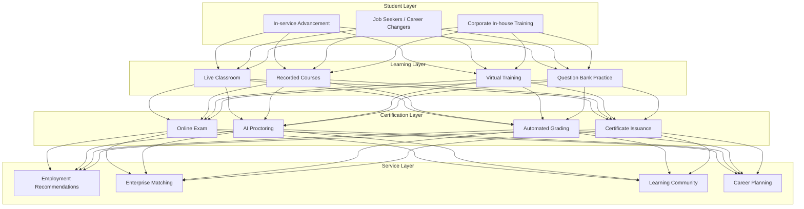
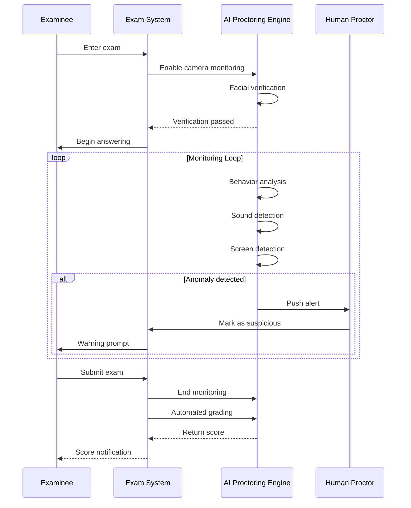
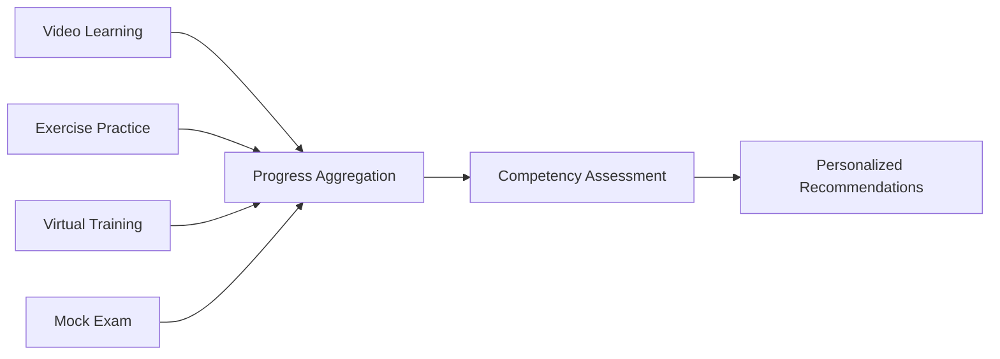

---title: Vocational Education Training Architecture Design — Alibaba Cloud Perspective
description: 'title: Vocational Education Training Architecture Design'
summary: 'title: Vocational Education Training Architecture Design'
category: general
tags:
- architecture
- best-practice
- statefulset
- gpu
- nvidia
tier: supporting
created: '2026-05-23'
last_updated: 2026-05
difficulty: intermediate
reading_level: intermediate
audience:
- All Engineers
estimated_read_time: 5min
intent_queries:
- What is Vocational Education Training Architecture Design — Alibaba Cloud Perspective
- How to Vocational Education Training Architecture Design — Alibaba Cloud Perspective
- Kubernetes 20 application patterns best practices
trigger_keywords:
- Vocational Education Training Architecture Design
- Alibaba Cloud Perspective
- application
- patterns
prerequisites:
- kubectl-basics
- prometheus-basics
- gpu-scheduling-basics
authors:
- name: Dillan Teagle
  role: contributor

---

> **Production Environment Safety Notice**
>
> This document contains directly executable operations commands. Before executing, please confirm: whether the current target cluster and Namespace are correct; whether you have sufficient RBAC permissions; whether you have validated in a non-production environment. Command risk levels are annotated as: 🔴 High risk (may cause data loss or service interruption), 🟡 Medium risk (will modify cluster state, but generally reversible), 🟢 Low risk / read-only (information gathering, no side effects).


title: Vocational Education Training Architecture Design
description: '# Vocational Education Training Architecture Design — Alibaba Cloud Perspective'
category: application-architecture
tags:
- k8s
- architecture
- industry
- [[StatefulSet|statefulset]]
- gpu
- nvidia
last_updated: 2026-05-18
difficulty: intermediate
reading_level: intermediate
audience:
- EdTech Architects
- Vocational Training Institution IT
- Online Education Developers
- Virtual Training Engineers
estimated_read_time: 5min
intent_queries:
- vocational education [[Kubernetes|kubernetes]] architecture
- Vocational Education K8s Deployment Solution
- Online exam anti-cheating system
- Virtual training cloud desktop
- Blockchain certificate storage
trigger_keywords:
- Vocational education
- Skills training
- Online education
- Virtual training
- AI proctoring
- Blockchain certificate
- Vocational education architecture
- Certification training
- Cloud desktop
- Training platform K8s
related_domains:
- domain-01-cluster-fundamentals
- domain-10-troubleshooting-diagnostics
- domain-03-networking-traffic
related_topics:
- smart-elderly-care
- smart-restaurant
- digital-government-architecture
k8s_versions:
- '1.28'
- '1.29'
- '1.30'
- '1.31'
- '1.32'
---

# Vocational Education Training Architecture Design — Alibaba Cloud Perspective

> **Applicable Versions**: Kubernetes v1.29 - v1.33 | **Last Updated**: 2026-04-24
> **Author**: Alibaba Cloud Solution Architect | **Tags**: `#VocationalEducation` `#SkillsTraining` `#Certification` `#AlibabaCloud`

---

## Table of Contents

1. [Industry Background](#1-industry-background)
2. [Business Architecture](#2-business-architecture)
3. [Technical Architecture](#3-technical-architecture)
4. [Core Data Flow](#4-core-data-flow)
5. [Security and Compliance](#5-security-compliance)
6. [Observability](#6-observability)
7. [Alibaba Cloud Component Mapping](#7-alibaba-cloud-component-mapping)
8. [Production Checklist](#8-production-checklist)

---

## 1. Industry Background

### 1.1 Business Characteristics

Vocational education and training targets adult skill development, emphasizing hands-on practice and certification:

| Challenge | Description | Architectural Impact |
|:---|:---|:---|
| Fragmented learning | Working professionals have scattered time | Micro-courses + mobile-first |
| Hands-on simulation | Requires virtual training environments | Cloud desktop / VR training |
| Exam anti-cheating | Fairness in online exams | AI proctoring + facial recognition |
| Certificate management | Vocational skill level certificates | Blockchain storage |
| Employment matching | Bridging training and employment | Talent matching platform |

### 1.2 Core Scenarios

- **Online courses**: Live / recorded / micro-course learning
- **Virtual training**: Cloud desktop / VR hands-on practice
- **Online exams**: AI proctoring / automated grading
- **Certificate management**: Vocational skill certificate issuance and lookup
- **Employment services**: Enterprise recruitment matching

---

## 2. Business Architecture

### 2.1 Vocational Education Panoramic Architecture


```mermaid
graph TB
    subgraph Student Layer
        S1[In-service Advancement]
        S2[Job Seekers / Career Changers]
        S3[Corporate In-house Training]
    end

    subgraph Learning Layer
        L1[Live Classroom]
        L2[Recorded Courses]
        L3[Virtual Training]
        L4[Question Bank Practice]
    end

    subgraph Certification Layer
        C1[Online Exam]
        C2[AI Proctoring]
        C3[Automated Grading]
        C4[Certificate Issuance]
    end

    subgraph Service Layer
        SVC1[Employment Recommendations]
        SVC2[Enterprise Matching]
        SVC3[Learning Community]
        SVC4[Career Planning]
    end

    S1 & S2 & S3 --> L1 & L2 & L3 & L4
    L1 & L2 & L3 & L4 --> C1 & C2 & C3 & C4
    C1 & C2 & C3 & C4 --> SVC1 & SVC2 & SVC3 & SVC4
```

### 2.2 AI Proctoring Sequence


```mermaid
sequenceDiagram
    participant STU as Examinee
    participant EXAM as Exam System
    participant AI as AI Proctoring Engine
    participant HUMAN as Human Proctor

    STU->>EXAM: Enter exam
    EXAM->>AI: Enable camera monitoring
    AI->>AI: Facial verification
    AI-->>EXAM: Verification passed
    EXAM->>STU: Begin answering
    loop Monitoring Loop
        AI->>AI: Behavior analysis
        AI->>AI: Sound detection
        AI->>AI: Screen detection
        alt Anomaly detected
            AI->>HUMAN: Push alert
            HUMAN->>EXAM: Mark as suspicious
            EXAM->>STU: Warning prompt
        end
    end
    STU->>EXAM: Submit exam
    EXAM->>AI: End monitoring
    EXAM->>AI: Automated grading
    AI-->>EXAM: Return score
    EXAM-->>STU: Score notification
```

---
## 3. Technical Architecture

### 3.1 K8s Deployment

```yaml
# Cloud Desktop Training Environment StatefulSet
apiVersion: apps/v1
kind: StatefulSet
metadata:
  name: vdi-training
  namespace: vocational-edtech
spec:
  serviceName: vdi-training
  replicas: 10
  selector:
    matchLabels:
      app: vdi-training
  template:
    metadata:
      labels:
        app: vdi-training
    spec:
      nodeSelector:
        accelerator: nvidia-t4
      runtimeClassName: nvidia
      containers:
        - name: vdi
          image: registry.cn-hangzhou.aliyuncs.com/voced/vdi-base:v1.0.0-gpu
          ports:
            - containerPort: 3389
              name: rdp
          resources:
            requests:
              nvidia.com/gpu: 1
              memory: "8Gi"
              cpu: "4000m"
            limits:
              nvidia.com/gpu: 1
              memory: "16Gi"
              cpu: "8000m"
```

---

## 4. Core Data Flow

### 4.1 Learning Progress Tracking


```mermaid
flowchart LR
    A[Video Learning] --> E[Progress Aggregation]
    B[Exercise Practice] --> E
    C[Virtual Training] --> E
    D[Mock Exam] --> E
    E --> F[Competency Assessment]
    F --> G[Personalized Recommendations]
```

---

## 5. Security & Compliance

- **Exam Integrity**: AI proctoring + anti-cheating measures
- **Certificate Trustworthiness**: Blockchain certificate notarization
- **Data Privacy**: Student information protection

---

## 6. Observability

- **Video Smoothness**: > 98%
- **Exam Concurrency**: Supports 100,000+
- **System Availability**: 99.9%

---

## 7. Alibaba Cloud Component Mapping

| Functional Domain | **Alibaba Cloud Native Solution** |
|:---|:---|
| Container Platform | **ACK Pro + GPU** |
| Live Streaming | **ApsaraVideo Live** |
| Cloud Desktop | **Wuying Cloud Computer** |
| AI | **PAI / Vision Intelligence** |
| Database | **PolarDB** |
| Blockchain | **Ant Chain BaaS** |
| Observability | **ARMS + SLS** |

---

## 8. Production Checklist

- [ ] Cloud desktop training environment stability
- [ ] AI proctoring accuracy > 95%
- [ ] Certificate blockchain notarization verification
- [ ] Exam system concurrency load testing
- [ ] Student privacy data protection

---

**Maintainer**: Alibaba Cloud Solutions Architect Team | **License**: MIT

---

## Obsidian Related Documents

- topic-application-architecture KUDIG Database — Global MOC
- [[domain-20-application-patterns/topic-application-architecture/README.md|Topic Application Layer Architecture Design Best Practices]]
- [[domain-20-application-patterns/topic-application-architecture/01-ecommerce-architecture.md|E-Commerce System Kubernetes Production Architecture Design]]
- [[domain-20-application-patterns/topic-application-architecture/02-mini-program-architecture.md|Mini Program Platform Architecture Design]]
- [[domain-20-application-patterns/topic-application-architecture/03-cms-architecture.md|Content Management System CMS Architecture Design]]
- [[domain-20-application-patterns/topic-application-architecture/04-im-rtc-architecture.md|Real-Time Communication IM/RTC Architecture Design]]
- [[domain-20-application-patterns/topic-application-architecture/05-online-education-architecture.md|Online Education Platform Kubernetes Production Architecture Design]]
- [[domain-20-application-patterns/topic-application-architecture/06-fintech-architecture.md|FinTech Kubernetes Production Architecture Design]]
- [[domain-20-application-patterns/topic-application-architecture/07-iot-platform-architecture.md|IoT Platform Architecture Design]]
- [[domain-20-application-patterns/topic-application-architecture/08-ai-ml-inference-architecture.md|AI/ML Inference Service Kubernetes Production Architecture Design]]
- [[domain-20-application-patterns/topic-application-architecture/09-gaming-backend-architecture.md|Gaming Backend Kubernetes Production Architecture Design]]
- [[domain-20-application-patterns/topic-application-architecture/10-social-media-architecture.md|Social Media Platform Kubernetes Production Architecture Design]]

## See Also

- 46-satellite-internet
- 47-smart-mining
- 49-livestream-ecommerce
- 50-unmanned-retail


<!-- risk-assessed -->
