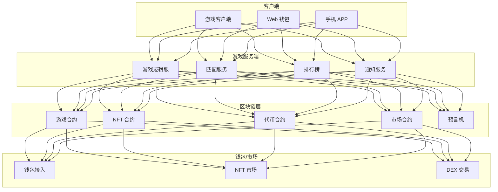
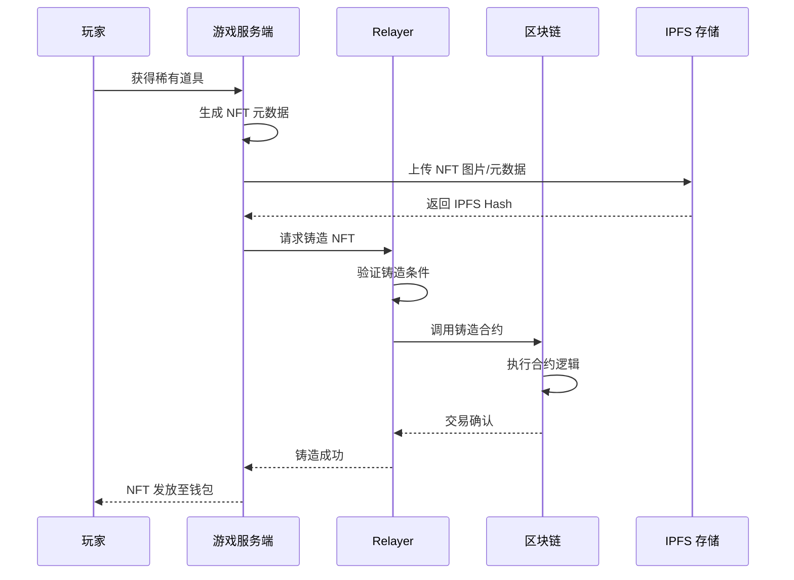
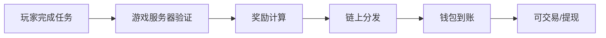

---title: Web3 GameFi 架构设计 — 阿里云视角
description: 'title: Web3 GameFi架构设计'
summary: 'title: Web3 GameFi架构设计'
category: general
tags:
- architecture
- best-practice
- redis
tier: supporting
created: '2026-05-23'
last_updated: 2026-05
difficulty: intermediate
reading_level: intermediate
audience:
- 所有工程师
estimated_read_time: 5min
intent_queries:
- Web3 GameFi 架构设计 — 阿里云视角 是什么
- 如何 Web3 GameFi 架构设计 — 阿里云视角
- Kubernetes 20 application patterns 最佳实践
trigger_keywords:
- Web3
- GameFi
- 架构设计
- 阿里云视角
- application
- patterns
prerequisites:
- kubectl-basics
- prometheus-basics
- redis-basics
authors:
- name: Dillan Teagle
  role: contributor

---

> **生产环境安全提示**
>
> 本文档包含可直接执行的运维命令。执行前请确认：当前目标集群与 Namespace 是否正确；是否具备足够的 RBAC 权限；是否已在非生产环境验证。命令风险等级标注：🔴 高风险（可能造成数据丢失或服务中断）、🟡 中风险（会修改集群状态，但通常可回滚）、🟢 低风险/只读（信息收集，无副作用）。


title: Web3 GameFi架构设计
description: '# Web3 GameFi 架构设计 — 阿里云视角'
category: application-architecture
tags:
- k8s
- architecture
- industry
- redis
last_updated: '2026-05-18'
difficulty: advanced
reading_level: advanced
audience:
- 区块链开发者
- GameFi架构师
- 智能合约工程师
- 阿里云解决方案架构师
estimated_read_time: 5min
intent_queries:
- Web3 GameFi游戏架构设计
- NFT游戏资产链上铸造
- GameFi Play-to-Earn经济模型
- 智能合约安全审计
- Web3钱包接入
trigger_keywords:
- Web3
- GameFi
- NFT
- 区块链游戏
- Play-to-Earn
- 智能合约
- DeFi
- 链游
- 加密资产
- 预言机
related_domains:
- domain-01-cluster-fundamentals
- domain-03-networking-traffic
- domain-7-observability
- domain-9-ai-ml
related_topics:
- domain-20-application-patterns/topic-application-architecture/25-quantitative-trading
- domain-20-application-patterns/topic-application-architecture/17-saas-multitenant-architecture
- domain-02-workloads-applications/topic-functions/04-high-concurrency-system
- domain-02-workloads-applications/topic-functions/09-data-security-privacy
k8s_versions:
- '1.28'
- '1.29'
- '1.30'
- '1.31'
- '1.32'
---

# Web3 GameFi 架构设计 — 阿里云视角

> **适用版本**: [[Kubernetes|Kubernetes]] v1.29 - v1.33 | **最后更新**: 2026-04-24
> **作者**: 阿里云解决方案架构师 | **标签**: `#Web3` `#GameFi` `#区块链游戏` `#NFT` `#阿里云`

---

## 目录

1. [行业背景](#1-行业背景)
2. [业务架构](#2-业务架构)
3. [技术架构](#3-技术架构)
4. [核心数据流](#4-核心数据流)
5. [安全与合规](#5-安全与合规)
6. [可观测性](#6-可观测性)
7. [阿里云组件映射](#7-阿里云组件映射)
8. [生产检查清单](#8-生产检查清单)

---

## 1. 行业背景

### 1.1 业务特点

GameFi 将游戏与 DeFi 结合，玩家通过游戏赚取加密资产：

| 挑战 | 说明 | 架构影响 |
|:---|:---|:---|
| 链上交互 | 游戏资产上链交易 | 链下计算 + 链上结算 |
| Gas 优化 | 高频交易 Gas 成本高 | Layer2 / 侧链 |
| 资产安全 | NFT/代币防盗 | 多重签名 + 冷钱包 |
| 经济平衡 | 防通胀/防死亡螺旋 | 经济模型设计 |
| 合规风险 | 各国监管政策不一 | 合规架构 |

### 1.2 核心场景

- **链游核心玩法**: Play-to-Earn 游戏机制
- **NFT 资产**: 游戏道具/角色/土地 NFT
- **代币经济**: 双代币/治理代币模型
- **交易市场**: NFT 二级市场交易
- **质押挖矿**: 游戏资产 Staking

---

## 2. 业务架构

### 2.1 GameFi 全景架构



### 2.2 游戏资产铸造时序



---

## 3. 技术架构

### 3.1 K8s 部署

```yaml
# 游戏逻辑服 Deployment
apiVersion: apps/v1
kind: Deployment
metadata:
  name: game-logic
  namespace: web3-gamefi
spec:
  replicas: 5
  selector:
    matchLabels:
      app: game-logic
  template:
    metadata:
      labels:
        app: game-logic
    spec:
      containers:
        - name: logic
          image: registry.cn-hangzhou.aliyuncs.com/web3/game-logic:v1.0.0
          ports:
            - containerPort: 8080
          env:
            - name: CHAIN_RPC_URL
              value: "https://chain-rpc.example.com"
            - name: RELAYER_URL
              value: "http://relayer:8080"
            - name: GAME_CONTRACT
              value: "0x..."
          resources:
            requests:
              memory: "2Gi"
              cpu: "1000m"
            limits:
              memory: "4Gi"
              cpu: "2000m"
```

---

## 4. 核心数据流

### 4.1 Play-to-Earn 奖励分发



---

## 5. 安全与合规

- **智能合约审计**: 合约漏洞排查
- **资产安全**: 热/冷钱包分离
- **合规风险**: 各国加密资产监管

---

## 6. 可观测性

- **链上交易确认**: < 30s
- **游戏延迟**: P99 < 100ms
- **资产安全事件**: 实时监控

---

## 7. 阿里云组件映射

| 功能域 | **阿里云云原生方案** |
|:---|:---|
| 容器平台 | **ACK Pro** |
| 区块链 | **蚂蚁链 BaaS** |
| 数据库 | **PolarDB** |
| 缓存 | **Redis 企业版** |
| 对象存储 | **OSS** |
| 可观测性 | **ARMS + SLS** |

---

## 8. 生产检查清单

- [ ] 智能合约安全审计
- [ ] 链上交易 Gas 优化
- [ ] 钱包安全策略验证
- [ ] 经济模型压力测试
- [ ] 合规风险评估

---

**维护者**: 阿里云解决方案架构师团队 | **许可证**: MIT

---

## Obsidian 相关文档

- topic-application-architecture KUDIG Database — Global MOC
- [[domain-20-application-patterns/topic-application-architecture/README.md|Topic 应用层架构设计最佳实践]]
- [[domain-20-application-patterns/topic-application-architecture/01-ecommerce-architecture.md|电商系统 Kubernetes 生产架构设计]]
- [[domain-20-application-patterns/topic-application-architecture/02-mini-program-architecture.md|小程序平台架构设计]]
- [[domain-20-application-patterns/topic-application-architecture/03-cms-architecture.md|内容管理系统 CMS 架构设计]]
- [[domain-20-application-patterns/topic-application-architecture/04-im-rtc-architecture.md|实时通信 IM/RTC 架构设计]]
- [[domain-20-application-patterns/topic-application-architecture/05-online-education-architecture.md|在线教育平台 Kubernetes 生产架构设计]]
- [[domain-20-application-patterns/topic-application-architecture/06-fintech-architecture.md|金融科技FinTech Kubernetes生产架构设计]]
- [[domain-20-application-patterns/topic-application-architecture/07-iot-platform-architecture.md|物联网 IoT 平台架构设计]]
- [[domain-20-application-patterns/topic-application-architecture/08-ai-ml-inference-architecture.md|AI/ML 推理服务 Kubernetes 生产架构设计]]
- [[domain-20-application-patterns/topic-application-architecture/09-gaming-backend-architecture.md|游戏后端 Kubernetes 生产架构设计]]
- [[domain-20-application-patterns/topic-application-architecture/10-social-media-architecture.md|社交媒体平台Kubernetes生产架构设计]]

## See Also

- 56-smart-elderly-care
- 57-digital-therapeutics
- 59-industrial-internet-platform
- 60-v2x-autonomous-driving

## Related

- topic-application-architecture MOC — Cross-reference


<!-- risk-assessed -->
