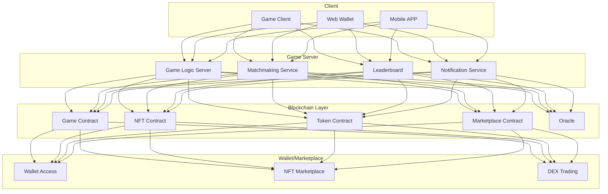
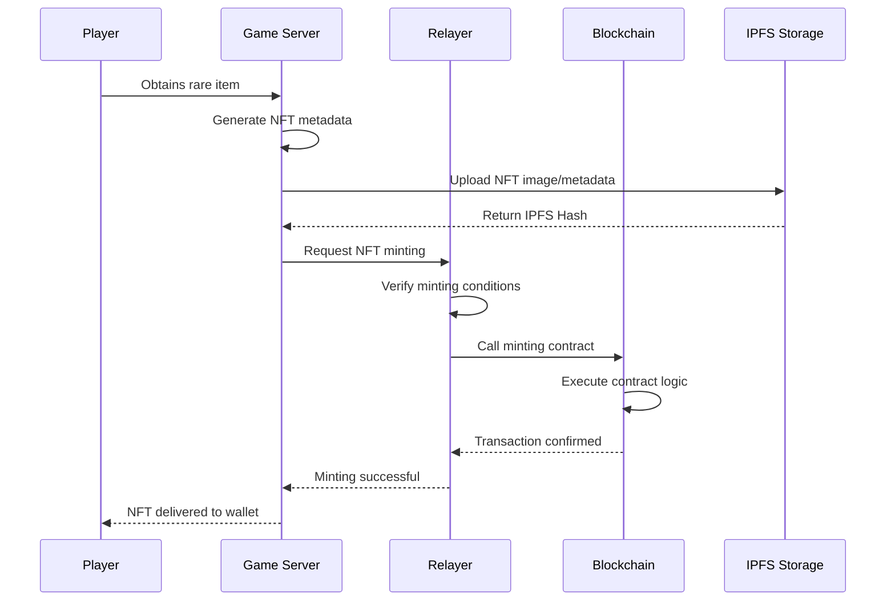
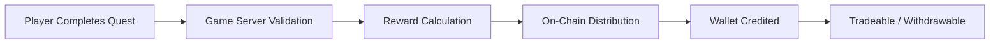

---title: Web3 GameFi Architecture Design — Alibaba Cloud Perspective
description: 'title: Web3 GameFi Architecture Design'
summary: 'title: Web3 GameFi Architecture Design'
category: general
tags:
- architecture
- best-practice
- redis
tier: supporting
created: '2026-05-23'
last_updated: 2026-05
difficulty: intermediate
reading_level: intermediate
audience:
- All Engineers
estimated_read_time: 5min
intent_queries:
- What is Web3 GameFi Architecture Design — Alibaba Cloud Perspective
- How to Web3 GameFi Architecture Design — Alibaba Cloud Perspective
- Kubernetes 20 application patterns best practices
trigger_keywords:
- Web3
- GameFi
- Architecture Design
- Alibaba Cloud Perspective
- application
- patterns
prerequisites:
- kubectl-basics
- prometheus-basics
- redis-basics
authors:
- name: Dillan Teagle
  role: contributor

---

> **Production Environment Safety Notice**
>
> This document contains operational commands that can be executed directly. Before executing, please confirm: whether the current target cluster and Namespace are correct; whether you have sufficient RBAC permissions; whether you have validated in a non-production environment. Command risk levels are marked as: 🔴 High Risk (may cause data loss or service interruption), 🟡 Medium Risk (will modify cluster state, but generally reversible), 🟢 Low Risk/Read-Only (information gathering, no side effects).


title: Web3 GameFi Architecture Design
description: '# Web3 GameFi Architecture Design — Alibaba Cloud Perspective'
category: application-architecture
tags:
- k8s
- architecture
- industry
- redis
last_updated: '2026-05-18'
difficulty: advanced
reading_level: advanced
audience:
- Blockchain Developers
- GameFi Architects
- Smart Contract Engineers
- Alibaba Cloud Solution Architects
estimated_read_time: 5min
intent_queries:
- Web3 GameFi game architecture design
- NFT game asset on-chain minting
- GameFi Play-to-Earn economic model
- Smart contract security audit
- Web3 wallet integration
trigger_keywords:
- Web3
- GameFi
- NFT
- Blockchain Games
- Play-to-Earn
- Smart Contract
- DeFi
- Chain Games
- Crypto Assets
- Oracle
related_domains:
- domain-01-cluster-fundamentals
- domain-03-networking-traffic
- domain-7-observability
- domain-9-ai-ml
related_topics:
- domain-20-application-patterns/topic-application-architecture/25-quantitative-trading
- domain-20-application-patterns/topic-application-architecture/17-saas-multitenant-architecture
- domain-02-workloads-applications/topic-functions/04-high-concurrency-system
- domain-02-workloads-applications/topic-functions/09-data-security-privacy
k8s_versions:
- '1.28'
- '1.29'
- '1.30'
- '1.31'
- '1.32'
---

# Web3 GameFi Architecture Design — Alibaba Cloud Perspective

> **Applicable Versions**: [[Kubernetes|Kubernetes]] v1.29 - v1.33 | **Last Updated**: 2026-04-24
> **Author**: Alibaba Cloud Solution Architect | **Tags**: `#Web3` `#GameFi` `#BlockchainGames` `#NFT` `#AlibabaCloud`

---
## Table of Contents

1. [Industry Background](#1-industry-background)
2. [Business Architecture](#2-business-architecture)
3. [Technical Architecture](#3-technical-architecture)
4. [Core Data Flow](#4-core-data-flow)
5. [Security and Compliance](#5-security-compliance)
6. [Observability](#6-observability)
7. [Alibaba Cloud Component Mapping](#7-alibaba-cloud-component-mapping)
8. [Production Checklist](#8-production-checklist)

---

## 1. Industry Background

### 1.1 Business Characteristics

GameFi combines gaming with DeFi, allowing players to earn crypto assets through gameplay:

| Challenge | Description | Architectural Impact |
|:---|:---|:---|
| On-chain Interaction | Game assets are traded on-chain | Off-chain computation + on-chain settlement |
| Gas Optimization | High-frequency transactions have high Gas costs | Layer2 / sidechain |
| Asset Security | NFT/token theft prevention | Multi-signature + cold wallet |
| Economic Balance | Anti-inflation / anti-death-spiral | Economic model design |
| Compliance Risk | Regulatory policies vary by country | Compliance architecture |

### 1.2 Core Scenarios

- **Blockchain Game Core Gameplay**: Play-to-Earn game mechanics
- **NFT Assets**: Game item / character / land NFTs
- **Token Economy**: Dual-token / governance token model
- **Trading Marketplace**: NFT secondary market trading
- **Staking Mining**: Game asset staking

---

## 2. Business Architecture

### 2.1 GameFi Panoramic Architecture


```mermaid
graph TB
    subgraph Client
        C1[Game Client]
        C2[Web Wallet]
        C3[Mobile APP]
    end

    subgraph Game Server
        G1[Game Logic Server]
        G2[Matchmaking Service]
        G3[Leaderboard]
        G4[Notification Service]
    end

    subgraph Blockchain Layer
        B1[Game Contract]
        B2[NFT Contract]
        B3[Token Contract]
        B4[Marketplace Contract]
        B5[Oracle]
    end

    subgraph Wallet/Marketplace
        W1[Wallet Access]
        W2[NFT Marketplace]
        W3[DEX Trading]
    end

    C1 & C2 & C3 --> G1 & G2 & G3 & G4
    G1 & G2 & G3 & G4 --> B1 & B2 & B3 & B4 & B5
    B1 & B2 & B3 & B4 --> W1 & W2 & W3
```

### 2.2 Game Asset Minting Sequence


```mermaid
sequenceDiagram
    participant PLAYER as Player
    participant GAME as Game Server
    participant RELAYER as Relayer
    participant CHAIN as Blockchain
    participant IPFS as IPFS Storage

    PLAYER->>GAME: Obtains rare item
    GAME->>GAME: Generate NFT metadata
    GAME->>IPFS: Upload NFT image/metadata
    IPFS-->>GAME: Return IPFS Hash
    GAME->>RELAYER: Request NFT minting
    RELAYER->>RELAYER: Verify minting conditions
    RELAYER->>CHAIN: Call minting contract
    CHAIN->>CHAIN: Execute contract logic
    CHAIN-->>RELAYER: Transaction confirmed
    RELAYER-->>GAME: Minting successful
    GAME-->>PLAYER: NFT delivered to wallet
```

---
## 3. Technical Architecture

### 3.1 K8s Deployment

```yaml
# Game Logic Server Deployment
apiVersion: apps/v1
kind: Deployment
metadata:
  name: game-logic
  namespace: web3-gamefi
spec:
  replicas: 5
  selector:
    matchLabels:
      app: game-logic
  template:
    metadata:
      labels:
        app: game-logic
    spec:
      containers:
        - name: logic
          image: registry.cn-hangzhou.aliyuncs.com/web3/game-logic:v1.0.0
          ports:
            - containerPort: 8080
          env:
            - name: CHAIN_RPC_URL
              value: "https://chain-rpc.example.com"
            - name: RELAYER_URL
              value: "http://relayer:8080"
            - name: GAME_CONTRACT
              value: "0x..."
          resources:
            requests:
              memory: "2Gi"
              cpu: "1000m"
            limits:
              memory: "4Gi"
              cpu: "2000m"
```

---

## 4. Core Data Flow

### 4.1 Play-to-Earn Reward Distribution


```mermaid
flowchart LR
    A[Player Completes Quest] --> B[Game Server Validation]
    B --> C[Reward Calculation]
    C --> D[On-Chain Distribution]
    D --> E[Wallet Credited]
    E --> F[Tradeable / Withdrawable]
```

---

## 5. Security & Compliance

- **Smart Contract Audit**: Contract vulnerability scanning
- **Asset Security**: Hot/cold wallet separation
- **Compliance Risk**: Crypto asset regulation across jurisdictions

---

## 6. Observability

- **On-Chain Transaction Confirmation**: < 30s
- **Game Latency**: P99 < 100ms
- **Asset Security Incidents**: Real-time monitoring

---

## 7. Alibaba Cloud Component Mapping

| Functional Domain | **Alibaba Cloud Cloud-Native Solution** |
|:---|:---|
| Container Platform | **ACK Pro** |
| Blockchain | **Ant Chain BaaS** |
| Database | **PolarDB** |
| Cache | **Redis Enterprise Edition** |
| Object Storage | **OSS** |
| Observability | **ARMS + SLS** |

---

## 8. Production Checklist

- [ ] Smart contract security audit
- [ ] On-chain transaction Gas optimization
- [ ] Wallet security policy validation
- [ ] Economic model stress testing
- [ ] Compliance risk assessment

---

**Maintainer**: Alibaba Cloud Solutions Architect Team | **License**: MIT

---
## Obsidian Related Documents

- topic-application-architecture KUDIG Database — Global MOC
- [[domain-20-application-patterns/topic-application-architecture/README.md|Topic Application Layer Architecture Design Best Practices]]
- [[domain-20-application-patterns/topic-application-architecture/01-ecommerce-architecture.md|E-commerce System Kubernetes Production Architecture Design]]
- [[domain-20-application-patterns/topic-application-architecture/02-mini-program-architecture.md|Mini Program Platform Architecture Design]]
- [[domain-20-application-patterns/topic-application-architecture/03-cms-architecture.md|Content Management System CMS Architecture Design]]
- [[domain-20-application-patterns/topic-application-architecture/04-im-rtc-architecture.md|Real-time Communication IM/RTC Architecture Design]]
- [[domain-20-application-patterns/topic-application-architecture/05-online-education-architecture.md|Online Education Platform Kubernetes Production Architecture Design]]
- [[domain-20-application-patterns/topic-application-architecture/06-fintech-architecture.md|FinTech Kubernetes Production Architecture Design]]
- [[domain-20-application-patterns/topic-application-architecture/07-iot-platform-architecture.md|IoT Platform Architecture Design]]
- [[domain-20-application-patterns/topic-application-architecture/08-ai-ml-inference-architecture.md|AI/ML Inference Service Kubernetes Production Architecture Design]]
- [[domain-20-application-patterns/topic-application-architecture/09-gaming-backend-architecture.md|Gaming Backend Kubernetes Production Architecture Design]]
- [[domain-20-application-patterns/topic-application-architecture/10-social-media-architecture.md|Social Media Platform Kubernetes Production Architecture Design]]

## See Also

- 56-smart-elderly-care
- 57-digital-therapeutics
- 59-industrial-internet-platform
- 60-v2x-autonomous-driving

## Related

- topic-application-architecture MOC — Cross-reference


<!-- risk-assessed -->
