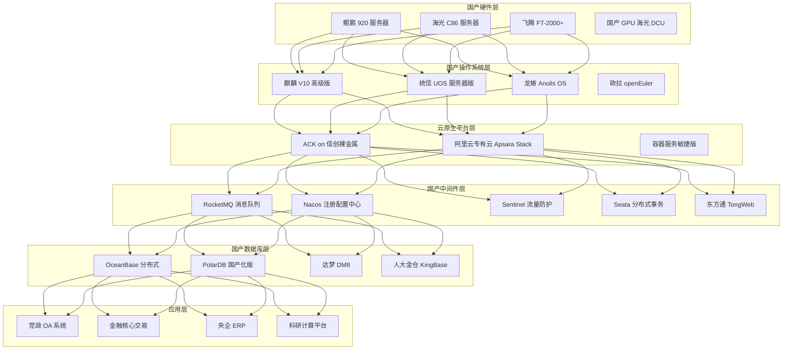
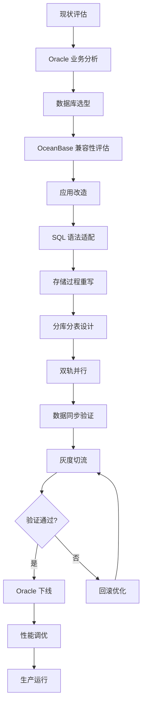
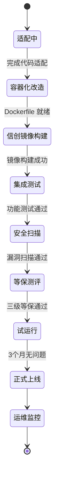
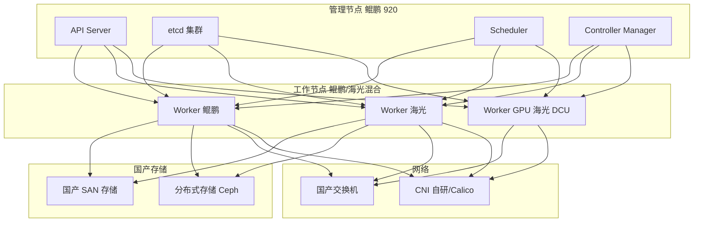
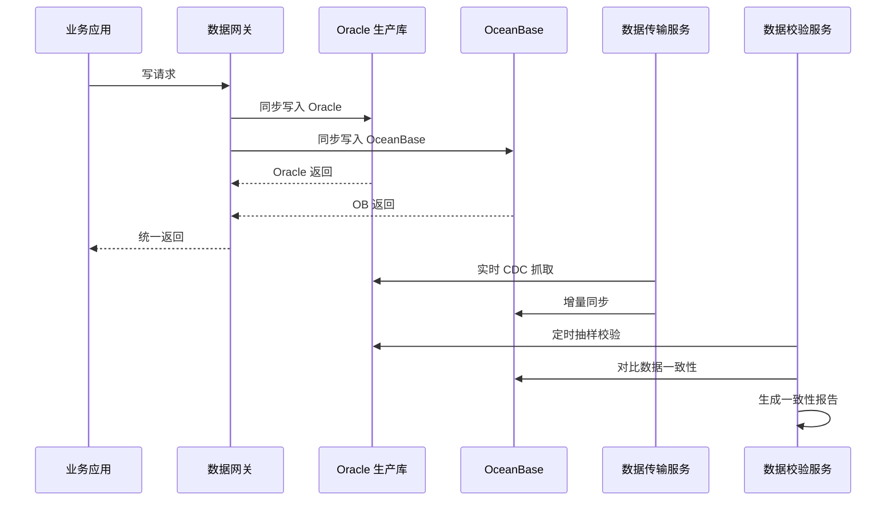
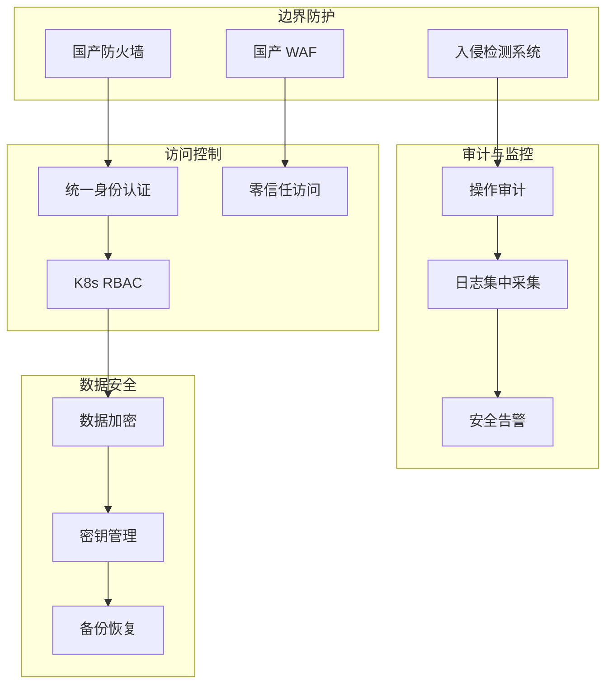

---title: 信创替代架构设计 — 阿里云视角
description: 'title: 信创替代架构设计'
summary: 'title: 信创替代架构设计'
category: general
tags:
- architecture
- best-practice
- etcd
- scheduler
- prometheus
- grafana
- calico
- docker
- ceph
- mysql
tier: supporting
created: '2026-05-23'
last_updated: 2026-05
difficulty: intermediate
reading_level: intermediate
audience:
- 所有工程师
estimated_read_time: 15min
intent_queries:
- 信创替代架构设计 — 阿里云视角 是什么
- 如何 信创替代架构设计 — 阿里云视角
- Kubernetes 20 application patterns 最佳实践
trigger_keywords:
- 信创替代架构设计
- 阿里云视角
- application
- patterns
prerequisites:
- kubectl-basics
- prometheus-basics
- monitoring-basics
- cni-basics
- etcd-basics
- mysql-basics
- gpu-scheduling-basics
authors:
- name: Dillan Teagle
  role: contributor

---

> **生产环境安全提示**
>
> 本文档包含可直接执行的运维命令。执行前请确认：当前目标集群与 Namespace 是否正确；是否具备足够的 RBAC 权限；是否已在非生产环境验证。命令风险等级标注：🔴 高风险（可能造成数据丢失或服务中断）、🟡 中风险（会修改集群状态，但通常可回滚）、🟢 低风险/只读（信息收集，无副作用）。


title: 信创替代架构设计
description: '# 信创替代架构设计 — 阿里云视角'
category: application-architecture
tags:
- k8s
- architecture
- industry
- [[etcd|etcd]]
- scheduler
- [[Prometheus|prometheus]]
- grafana
- calico
- docker
- ceph
last_updated: '2026-05-18'
difficulty: expert
reading_level: expert
audience:
- 信创架构师
- 国产化迁移工程师
- 阿里云解决方案架构师
- 数据库内核工程师
estimated_read_time: 5min
intent_queries:
- 信创替代架构设计
- 去IOE Oracle迁移OceanBase
- 鲲鹏920飞腾ARM架构K8s
- 等保三级国密算法
- 双轨并行迁移方案
trigger_keywords:
- 信创
- 国产化
- 自主可控
- 去IOE
- 鲲鹏
- 飞腾
- OceanBase
- 麒麟
- 等保三级
- 国密
related_domains:
- domain-01-cluster-fundamentals
- domain-03-networking-traffic
- domain-7-observability
- domain-9-ai-ml
related_topics:
- domain-20-application-patterns/topic-application-architecture/51-smart-manufacturing-mes
- domain-20-application-patterns/topic-application-architecture/14-smart-healthcare-architecture
- domain-02-workloads-applications/topic-functions/09-data-security-privacy
- topic-domain-01-cluster-fundamentals/05-compliance-auditing
k8s_versions:
- '1.28'
- '1.29'
- '1.30'
- '1.31'
- '1.32'
---

# 信创替代架构设计 — 阿里云视角

> **适用版本**: Kubernetes v1.29 - v1.33 | **最后更新**: 2026-04-24
> **作者**: 阿里云解决方案架构师 | **标签**: `#信创` `#国产化` `#自主可控` `#党政军` `#阿里云`

---

<!-- chunk: 目录 -->## 目录

1. [行业背景](#1-行业背景)
2. [业务架构](#2-业务架构)
3. [技术架构](#3-技术架构)
4. [核心数据流](#4-核心数据流)
5. [安全与合规](#5-安全与合规)
6. [可观测性](#6-可观测性)
7. [阿里云组件映射](#7-阿里云组件映射)
8. [生产检查清单](#8-生产检查清单)

---

<!-- chunk: 1. 行业背景 -->## 1. 行业背景

## 1.1 信创产业背景

信创（信息技术应用创新）是国家战略，目标实现核心技术自主可控：

| 层级 | 传统方案 | 信创替代方案 | 进展 |
|:---|:---|:---|:---:|
| 基础硬件 | Intel/AMD x86 | 鲲鹏/飞腾/海光/龙芯/兆芯 | 大规模应用 |
| 操作系统 | Windows Server | 麒麟/统信/欧拉/龙蜥 | 大规模应用 |
| 数据库 | Oracle/MySQL | 达梦/人大金仓/ OceanBase / PolarDB | 加速推进 |
| 中间件 | WebLogic/IBM MQ | 东方通/宝兰德/RocketMQ | 稳步推进 |
| 应用软件 | Office/ERP 国外厂商 | WPS/用友/金蝶/泛微 | 基本完成 |
| 云平台 | VMware/OpenStack | 阿里云飞天/华为云 Stack | 加速推进 |

## 1.2 核心场景

- **党政办公系统替代**: OA/邮件/公文系统全面国产化
- **金融核心系统下移**: 银行核心交易去 IOE
- **央企 ERP 替代**: SAP/Oracle ERP 国产化迁移
- **教育科研平台**: 科研计算平台自主可控
- **医疗信息系统**: HIS/PACS/EMR 国产化改造

---

<!-- chunk: 2. 业务架构 -->## 2. 业务架构

## 2.1 信创云整体架构



## 2.2 金融核心系统去 IOE 迁移流程



## 2.3 信创应用部署状态机



---

<!-- chunk: 3. 技术架构 -->## 3. 技术架构

## 3.1 信创 K8s 集群架构



## 3.2 K8s YAML 配置

```yaml
# 信创节点池配置
apiVersion: apps/v1
kind: Deployment
metadata:
  name: oa-system
  namespace: xinchuang
spec:
  replicas: 3
  selector:
    matchLabels:
      app: oa-system
  template:
    metadata:
      labels:
        app: oa-system
    spec:
      nodeSelector:
        kubernetes.io/arch: arm64  # 鲲鹏 ARM 架构
        os.type: kylin-v10         # 麒麟操作系统
      affinity:
        podAntiAffinity:
          requiredDuringSchedulingIgnoredDuringExecution:
            - labelSelector:
                matchExpressions:
                  - key: app
                    operator: In
                    values: [oa-system]
              topologyKey: kubernetes.io/hostname
      containers:
        - name: oa-app
          image: registry.cn-hangzhou.aliyuncs.com/xinchuang/oa-system:v2.1.0-arm64
          imagePullPolicy: Always
          ports:
            - containerPort: 8080
          env:
            - name: DB_TYPE
              value: "oceanbase"
            - name: DB_DRIVER
              value: "com.oceanbase.jdbc.Driver"
            - name: JVM_OPTS
              value: "-XX:+UseG1GC -Xms2g -Xmx2g"
          resources:
            requests:
              memory: "2Gi"
              cpu: "1000m"
            limits:
              memory: "4Gi"
              cpu: "2000m"
          livenessProbe:
            httpGet:
              path: /actuator/health
              port: 8080
            initialDelaySeconds: 60
            periodSeconds: 15
          readinessProbe:
            httpGet:
              path: /actuator/ready
              port: 8080
            initialDelaySeconds: 30
            periodSeconds: 5
          volumeMounts:
            - name: app-config
              mountPath: /app/config
            - name: tmp-volume
              mountPath: /tmp
      volumes:
        - name: app-config
          configMap:
            name: oa-system-config
        - name: tmp-volume
          emptyDir: {}
```

```yaml
# 信创场景下国产数据库 StatefulSet
apiVersion: apps/v1
kind: StatefulSet
metadata:
  name: oceanbase-cluster
  namespace: xinchuang
spec:
  serviceName: oceanbase
  replicas: 3
  selector:
    matchLabels:
      app: oceanbase
  template:
    metadata:
      labels:
        app: oceanbase
    spec:
      nodeSelector:
        kubernetes.io/arch: arm64
      containers:
        - name: oceanbase
          image: registry.cn-hangzhou.aliyuncs.com/xinchuang/oceanbase:4.2-arm64
          ports:
            - containerPort: 2881
              name: sql
            - containerPort: 2882
              name: rpc
          env:
            - name: OB_CLUSTER_NAME
              value: "xinchuang-cluster"
            - name: OB_ZONE
              valueFrom:
                fieldRef:
                  fieldPath: metadata.labels['zone']
          resources:
            requests:
              memory: "8Gi"
              cpu: "4000m"
            limits:
              memory: "16Gi"
              cpu: "8000m"
          volumeMounts:
            - name: ob-data
              mountPath: /data
            - name: ob-log
              mountPath: /log
  volumeClaimTemplates:
    - metadata:
        name: ob-data
      spec:
        accessModes: ["ReadWriteOnce"]
        storageClassName: local-volume-provisioner
        resources:
          requests:
            storage: 500Gi
    - metadata:
        name: ob-log
      spec:
        accessModes: ["ReadWriteOnce"]
        storageClassName: local-volume-provisioner
        resources:
          requests:
            storage: 200Gi
```

---

<!-- chunk: 4. 核心数据流 -->## 4. 核心数据流

## 4.1 双轨并行迁移数据流



---

<!-- chunk: 5. 安全与合规 -->## 5. 安全与合规

## 5.1 等保三级合规架构



---

<!-- chunk: 6. 可观测性 -->## 6. 可观测性

- **国产化监控栈**: Prometheus + Grafana（国产芯片编译版本）
- **日志采集**: SLS 或国产日志系统
- **链路追踪**: ARMS 或自研 SkyWalking
- **合规审计**: 等保要求的 6 个月日志保留

---

<!-- chunk: 7. 阿里云组件映射 -->## 7. 阿里云组件映射

| 功能域 | 国外方案 | **信创替代方案** | 阿里云方案 |
|:---|:---|:---|:---|
| 芯片 | Intel Xeon | 鲲鹏 920 / 海光 C86 | **ACK 信创裸金属** |
| 操作系统 | RHEL / CentOS | 麒麟 V10 / 龙蜥 | **龙蜥 Anolis OS** |
| 容器平台 | OpenShift | 阿里云飞天 | **ACK 信创版** |
| 数据库 | Oracle | 达梦 / 人大金仓 | **OceanBase / PolarDB** |
| 消息队列 | IBM MQ | RocketMQ 国产版 | **RocketMQ 5.0** |
| 注册中心 | Consul | Nacos | **MSE Nacos** |
| 中间件 | WebLogic | 东方通 TongWeb | **阿里云中间件** |
| 负载均衡 | F5 | 国产负载均衡 | **ALB 信创版** |
| 对象存储 | S3 | 国产分布式存储 | **OSS 信创版** |
| 可观测性 | Datadog | 自研监控 | **ARMS + SLS** |

---

<!-- chunk: 8. 生产检查清单 -->## 8. 生产检查清单

- [ ] 国产芯片兼容性测试通过（鲲鹏/海光/飞腾）
- [ ] 国产操作系统镜像验证（麒麟/统信/龙蜥）
- [ ] 国产数据库功能/性能对标测试完成
- [ ] 双轨并行数据一致性 99.99% 验证
- [ ] 等保三级测评报告获取
- [ ] 国密算法 SM2/SM3/SM4 全链路验证
- [ ] 应用容器化信创镜像构建成功
- [ ] 灾备演练：国产数据库故障切换 < 30s

---

**维护者**: 阿里云解决方案架构师团队 | **许可证**: MIT

---

<!-- chunk: Obsidian 相关文档 -->## Obsidian 相关文档

- topic-application-architecture MOC
- [[domain-20-application-patterns/topic-application-architecture/README.md|Topic 应用层架构设计最佳实践]]
- [[domain-20-application-patterns/topic-application-architecture/01-ecommerce-architecture.md|电商系统 Kubernetes 生产架构设计]]
- [[domain-20-application-patterns/topic-application-architecture/02-mini-program-architecture.md|小程序平台架构设计]]
- [[domain-20-application-patterns/topic-application-architecture/03-cms-architecture.md|内容管理系统 CMS 架构设计]]
- [[domain-20-application-patterns/topic-application-architecture/04-im-rtc-architecture.md|实时通信 IM/RTC 架构设计]]
- [[domain-20-application-patterns/topic-application-architecture/05-online-education-architecture.md|在线教育平台 Kubernetes 生产架构设计]]
- [[domain-20-application-patterns/topic-application-architecture/06-fintech-architecture.md|金融科技FinTech Kubernetes生产架构设计]]
- [[domain-20-application-patterns/topic-application-architecture/07-iot-platform-architecture.md|物联网 IoT 平台架构设计]]
- [[domain-20-application-patterns/topic-application-architecture/08-ai-ml-inference-architecture.md|AI/ML 推理服务 Kubernetes 生产架构设计]]
- [[domain-20-application-patterns/topic-application-architecture/09-gaming-backend-architecture.md|游戏后端 Kubernetes 生产架构设计]]
- [[domain-20-application-patterns/topic-application-architecture/10-social-media-architecture.md|社交媒体平台Kubernetes生产架构设计]]

## See Also

- 21-cross-border-ecommerce
- 22-nev-connected-vehicle
- 24-insurtech
- 25-quantitative-trading


<!-- risk-assessed -->
