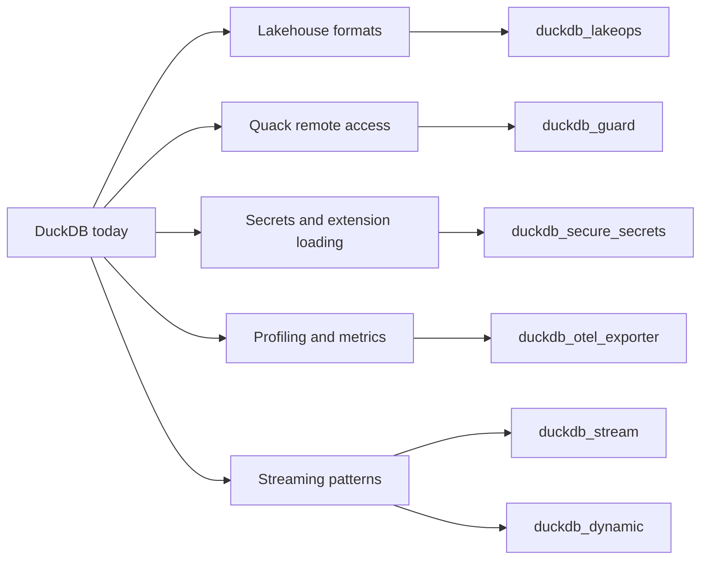
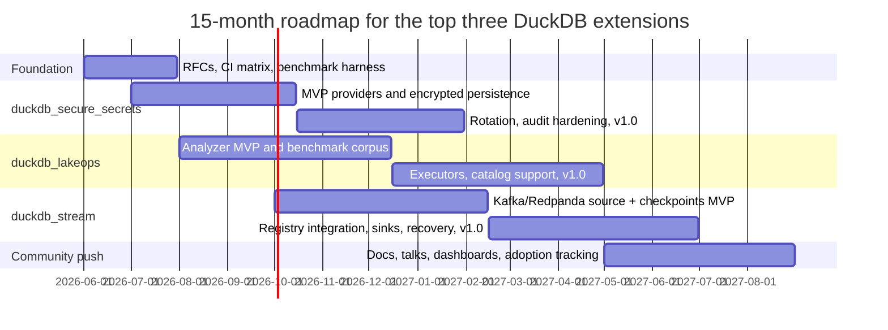

# High-Impact DuckDB Extension Ideas

## Executive summary

DuckDB is no longer just an embedded analytics engine for local CSV and Parquet work. As of May 2026, it has a formal extensions ecosystem, primary clients across C, CLI, Java, Go, Node, Python, Rust, and Wasm, a current stable release at 1.5.3, an LTS line at 1.4.4, and a public roadmap pointing toward extension API maturation, Rust support, async I/O, lakehouse work, and a 2.0 release planned for fall 2026. The center of gravity is moving toward lakehouse formats, remote/multi-process access via Quack, and production-grade extensibility. citeturn21search12turn3view0turn23view0turn1view1turn2view0

For a principal-level resume, the strongest projects are not narrow file readers or small utilities. Public principal-role definitions consistently emphasize company- or org-wide scope, multi-year architectural ownership, removal of deep systemic bottlenecks, influence without formal authority, mentoring senior engineers, and external technical leadership. In other words, the right DuckDB extension should let you tell a story about architecture, scale, performance, security, and ecosystem leadership—not just “I shipped a plugin.” citeturn16view0turn16view2turn16view3turn16view4

My recommendation is to prioritize three extensions: **`duckdb_lakeops`** for cross-format lakehouse optimization and maintenance, **`duckdb_stream`** for stateful Kafka/Redpanda/Pulsar ingestion and incremental analytics, and **`duckdb_secure_secrets`** for KMS/Vault-backed secret providers and encrypted secret persistence. Those three line up with where DuckDB is visibly heading, and where meaningful whitespace still exists: fast-expanding lakehouse support, growing interest in streaming patterns without native materialized views, and clear security gaps around secrets and extension trust. citeturn28view0turn10view1turn9view5turn30search11turn9view0turn32view0

If you build only one extension, build **`duckdb_lakeops`**. It is the best balance of resume impact, feasibility, and community value. If you want the highest ceiling and are willing to tolerate more execution risk, build **`duckdb_stream`**. If you want the cleanest path into platform, security, or cloud-infrastructure leadership narratives, build **`duckdb_secure_secrets`**.

## DuckDB ecosystem snapshot

DuckDB positions extensions as the preferred packaging mechanism for new functionality. The project exposes primary client APIs for C, CLI, Java, Go, Node, Python, R, Rust, and Wasm, and the docs explicitly note that extensions are generally portable across clients, with some important Wasm-specific exceptions. That broad client surface is valuable for resume impact because it means a successful extension can plausibly reach both notebook users and embedded-product teams. citeturn25search9turn23view0turn1view0

The official core extension catalog is already substantial. It includes not just classic format and database connectors such as `parquet`, `json`, `sqlite`, `postgres`, `mysql`, and `odbc`, but also `iceberg`, `delta`, `ducklake`, `lance`, `unity_catalog`, `spatial`, `vss`, `quack`, and `ui`. On the community side, DuckDB launched a signed community extensions repository in 2024 and now publishes a large latest-stable registry page plus weekly download metrics. Community builds are handled by DuckDB’s CI toolchain, and official docs expose both extension-level metadata and per-week download counts, which is unusually helpful for proving OSS adoption on a resume. citeturn1view1turn1view5turn1view6turn25search0turn25search7

The operational model matters if you want your work to look principal-level instead of hobbyist. DuckDB supports installing from `core`, `core_nightly`, `community`, and custom repositories; core and community extensions are cryptographically signed; community extensions are not code-vetted and can be disabled. At the same time, extension maintenance is still nontrivial: the release-cycle docs say unstable API extensions still form the majority today, and community extensions are currently built and distributed only for the latest stable release. That means serious extension work must include CI, release playbooks, compatibility strategy, and distribution hygiene. citeturn1view7turn9view0turn32view0turn22view0turn25search5

For implementation language, the practical answer today is nuanced. DuckDB’s roadmap explicitly calls out migration/documentation to the C client and C extension APIs plus Rust support for extensions. The project also maintains experimental C/C++ and Rust extension templates. The release-cycle docs say stable API extensions are intended to become the majority over time, while unstable API extensions remain version-tied. So, for the most ambitious ideas in this report, **default to C++ now for deepest integration**, and use Rust when you can stay on the stable C extension API or split stateful concerns into helper services. Also, if broad adoption is your goal, prioritize native clients first: Wasm has a smaller official extension set, and `httpfs` is not currently available there. citeturn2view0turn11view0turn32view1turn22view0turn22view2

Recent releases confirm the project’s current direction. DuckDB 1.4.0 LTS introduced database encryption and Iceberg writes; 1.5.0 added `VARIANT` and moved `GEOMETRY` into core to make geospatial interoperability easier for other extensions; 1.5.1 added Lance support; May 2026 brought non-experimental Delta and Unity Catalog support plus new Iceberg capabilities; and Quack was released as a client-server protocol intended to mature around DuckDB 2.0. This is a fast-moving ecosystem that increasingly rewards extensions sitting at the intersection of lakehouse operations, remote access, and production safety. citeturn26view1turn27view1turn27view2turn1view4turn26view0turn29search0turn9view5

## What principal-level work looks like on a resume

Across public principal-engineer role descriptions, the common pattern is scope and leverage. Dropbox describes principal engineers as owning org- or company-wide, multi-year, multi-team goals and aligning technical strategy across a group. Google’s principal-engineer postings emphasize multi-year architectural outlooks, technical sponsorship of high-impact programs, resolution of systemic bottlenecks, influence without authority, external representation, and mentorship of other senior engineers. That is the bar your extension project should signal against. citeturn16view0turn16view2turn16view3

Translated into DuckDB extension work, that means six categories of resume signal matter most. **Scale** means the extension changes how nontrivial workloads are run, not just how one file type is parsed. **Performance** means reproducible benchmark wins using DuckDB’s benchmark and profiling machinery. **Architecture** means the project sits at a seam in the system—lakehouse catalogs, remote access, governance, streaming, or interoperability. **Security** means safer defaults, clearer trust boundaries, and compliance-ready behavior. **Cross-project integration** means your extension works across multiple data systems, clients, or clouds. **Community leadership** means public artifacts: RFCs, issue design work, release notes, docs, talks, benchmarks, and downstream adoption. citeturn16view2turn16view4turn20search0turn25search0

DuckDB is especially good for this kind of public evidence. The project documents its benchmark suite, profiling and metrics interfaces, extension versioning and release mechanics, and community-extension download metrics. In practical terms, that lets you substantiate claims such as “improved scanned bytes by 42%,” “held telemetry overhead below 3%,” or “reached 1,200 weekly installs,” instead of writing vague bullets about “improving performance.” For a principal-level resume, that measurability is a huge advantage. citeturn20search0turn24search0turn25search0turn22view1

A second principal-level advantage is that DuckDB itself is now a visible OSS platform. Community extensions install directly from SQL, and the 1.5.0 release notes cite close to 100 contributors since v1.4. That makes strong extension work legible both as systems engineering and as open-source ecosystem leadership. citeturn1view5turn27view3

## Where the best opportunities are

DuckDB’s own user survey and roadmap point to the biggest unmet needs. In the 2024 survey of 500+ users, the most-requested improvements included partition-related optimizations, better time-series support and pre-sorted-data optimizations, materialized views, ODBC attach, time travel, Delta support, and improved Iceberg support. Since then, DuckDB has shipped vector search, Delta support, more Iceberg capabilities, Lance support, and time-travel features in lakehouse integrations—but partition/time-series optimization and materialized views remain meaningful opportunity areas, and the roadmap still lists time-series optimization, partition-aware optimization, better profiling, materialized views, and FIPS-compliant encryption as future work. citeturn28view0turn2view0

At the same time, the project’s expansion has created new operational seams. DuckDB now supports Iceberg, Delta, Lance, and DuckLake as first-class lakehouse formats; Delta and Unity Catalog have dropped their experimental tags; Iceberg capabilities continue to expand; Quack brings multi-process remote access; and the concurrency docs explicitly position Quack as the way to write DuckDB databases from multiple processes. That makes **lakehouse operations**, **server governance**, and **production-grade coordination** more valuable opportunities than yet another format parser. citeturn10view1turn26view0turn29search0turn1view4turn9view5turn10view0

Security is another conspicuous gap. DuckDB’s security docs warn that SQL should be treated like code, community extensions execute third-party code, and persistent secrets are stored in unencrypted binary format on disk today. The roadmap separately calls out FIPS-compliant encryption as future work. That combination makes secret handling, extension trust, policy enforcement, and query/resource governance unusually high-value targets—especially for principal-level resume positioning. citeturn30search11turn9view1turn9view0turn32view0turn2view0

The current registry also shows where not to spend your best effort. The community list is already rich in parsers, niche domain readers, geospatial utilities, dashboards, LLM helpers, vector/ANN work, and filesystem tuning and caching. Keyword checks over the latest stable registry page return no matches for **Kafka**, **Pulsar**, **Vault**, **KMS**, **materialized**, **Prometheus**, **`otel`**, **RBAC/auth/policy**, or **quota**. Meanwhile, DuckDB’s own streaming blog mentions an experimental Kafka approach via `tributary`, but explicitly says it has no state management and re-reads from offset 0. In other words: the real whitespace is less about “can DuckDB read X?” and more about **can DuckDB operate safely and scalably in production workflows?** citeturn6view0turn7view0turn1view1turn29search1turn17view0turn17view1turn17view2turn17view3turn17view5turn18view0turn17view7turn18view7turn19view5turn19view6turn19view7turn34view0turn33view0

I also intentionally deprioritized a few categories because they are already comparatively crowded. Vector search has core `vss`, community `faiss`, `hnsw_acorn`, `vindex`, and `quackformers`, plus Lance integration. Filesystem acceleration already has `cache_httpfs`, `curl_httpfs`, `observefs`, `http_stats`, `rate_limit_fs`, `hedged_request_fs`, `latency_injection_fs`, and `quackstore`. Geospatial is similarly dense. If the goal is maximum principal-level differentiation, the better move is to build the control plane around those capabilities, not another variation of them. citeturn1view1turn6view0turn7view0turn8view0turn29search1

The diagram above captures the recommendation in one sentence: build at the **operational seams** where DuckDB is growing fastest, not in already-crowded leaf categories. citeturn10view1turn9view5turn30search11turn24search0turn33view0

## Novel extension portfolio

I assessed novelty against the current core-extension list, the latest-stable community registry page for v1.5.3, the roadmap, and keyword checks over the registry. The table below is a synthesis, not an official ranking, but it is grounded in the present DuckDB surface area and the gaps above. citeturn1view2turn1view1turn28view0turn2view0turn34view0turn17view0turn17view5turn19view5

| Extension idea | Primary gap | Recommended stack | Effort | Resume impact | Feasibility | Community value | Weighted score |
|---|---|---|---|---:|---:|---:|---:|
| `duckdb_lakeops` | Cross-format lakehouse maintenance and optimization | C++ + SQL macros | High | 5 | 4 | 5 | 4.70 |
| `duckdb_stream` | Stateful streaming/CDC ingestion and incremental analytics | C++ + sidecar coordinator | High | 5 | 3 | 5 | 4.40 |
| `duckdb_secure_secrets` | KMS/Vault-backed secrets and encrypted persistence | C++ | Medium | 4 | 5 | 4 | 4.25 |
| `duckdb_guard` | RBAC, masking, I/O policy, and resource governance | C++ + proxy/sidecar | High | 5 | 2 | 5 | 4.00 |
| `duckdb_contracts` | Data contracts and schema-registry enforcement | Rust or C++ | Medium/High | 4 | 4 | 4 | 4.00 |
| `duckdb_dynamic` | Incremental dynamic tables and materialized-view semantics | C++ + SQL macros | High | 4 | 3 | 5 | 3.95 |
| `duckdb_trust` | Extension SBOM/CVE/provenance policy gate | Rust or C++ | Medium | 4 | 4 | 4 | 3.95 |
| `duckdb_otel_exporter` | OTel/Prometheus exporter for DuckDB query and I/O metrics | Rust or C++ | Medium | 3 | 5 | 4 | 3.85 |
| `duckdb_federate_cache` | Adaptive local mirror across remote connectors | C++ | High | 4 | 3 | 4 | 3.70 |
| `duckdb_timeseries` | Sorted time-series acceleration and compression | C++ | High | 4 | 2 | 4 | 3.40 |

Two nuances are worth calling out before the detailed ideas. First, DuckDB’s streaming blog already sketches near-real-time patterns and mentions an experimental Kafka approach without state management; so the opportunity is not merely “read Kafka,” but “make streaming ingestion production-grade.” Second, a few adjacent community extensions already exist—`events`, `otlp`, `ducksync`, `anofox_forecast`, and `boilstream`—so several proposals below intentionally **generalize, harden, or productionize** those niches rather than duplicate them. citeturn33view0turn25search6turn8view0turn31view7turn6view0

**`duckdb_lakeops`**  
**Purpose:** a cross-format advisor and executor for compaction, clustering/sort order, partitioning, snapshot retention, small-file remediation, and metadata hygiene across Iceberg, Delta, DuckLake, and Lance. **Target users:** data-platform teams, analytics engineers, lakehouse operators. **Technical approach:** metadata scanners plus lightweight sampling, a cost model that predicts scanned bytes and file-pruning efficiency, and SQL-first APIs such as `lakeops_advice()` and `lakeops_apply_plan()`. **Dependencies:** `iceberg`, `delta`, `ducklake`, `lance`, `unity_catalog`, `httpfs`. **Effort:** high, roughly 6–8 months for a strong v1.0. **Success metrics:** scanned bytes reduced by 30–60% on benchmark workloads; small-file counts reduced by 50–90%; wall-clock improvements on repeated dashboard-style queries. **Resume-friendly accomplishments:** publish before/after benchmarks, write an engineering blog post, contribute format-specific upstream fixes, and present a “lakehouse ops for embedded analytics” talk. **Risks:** maintenance actions differ across formats, and some “advisor” recommendations may be easier to ship than automated execution. This idea is especially well-timed because DuckDB is rapidly deepening support for the major open table formats. citeturn10view1turn26view0turn29search0turn29search1

**`duckdb_stream`**  
**Purpose:** a stateful streaming and CDC extension that reads Kafka, Redpanda, or Pulsar topics and safely materializes both raw tables and incremental aggregates inside DuckDB, DuckLake, or Quack-backed deployments. **Target users:** event-data teams, product analytics, IoT, operational analytics. **Technical approach:** source table functions, broker-offset checkpoint tables, micro-batch execution, schema-registry decoders, and idempotent `MERGE`-based sink logic. In practice, the clean design is likely an extension plus a small coordinator sidecar. **Dependencies:** librdkafka or equivalent, Avro/Protobuf/JSON decoders, DuckLake or Quack for durable coordination, optional schema-registry integration. **Effort:** high, roughly 7–10 months. **Success metrics:** 250k–500k rows/sec ingestion on a modest 8–16 core machine, end-to-end freshness under 5 seconds, and no duplicates/losses in crash-recovery tests. **Resume-friendly accomplishments:** publish a Nexmark-style benchmark, demonstrate exactly-once-ish recovery semantics, deliver conference talks on “streaming analytics with DuckDB,” and land downstream integrations. **Risks:** state management, backpressure, and correctness under failure are hard. This is the highest-ceiling idea because the official blog already frames streaming as a real DuckDB pattern but notes the lack of native materialized views and the state-management gap in experimental Kafka work. citeturn33view0turn34view0turn17view0turn17view1

**`duckdb_secure_secrets`**  
**Purpose:** replace plaintext persistent secrets with envelope-encrypted local storage and add first-class secret providers for Vault, AWS STS/KMS, GCP Secret Manager/KMS, and Azure Key Vault. **Target users:** SaaS teams embedding DuckDB, enterprises with compliance needs, security-conscious platform teams. **Technical approach:** new secret providers registered by the extension, scope-aware short-lived credential brokering, envelope encryption for persisted secrets, and audit hooks. **Dependencies:** cloud SDKs or REST APIs, a crypto library with a FIPS-friendly path, and DuckDB’s secrets subsystem. **Effort:** medium, around 4–6 months. **Success metrics:** zero plaintext secrets at rest, p95 credential-refresh latency below 2 seconds, four provider backends, optional rotation support. **Resume-friendly accomplishments:** threat-model document, multi-cloud integration story, compliance narrative, and hard production benchmarks for auth latency overhead. **Risks:** provider-SDK footprint, auth edge cases, and careful boundary handling around secret redaction and auditing. The rationale is direct: DuckDB says secret types are extension-defined and persistent secrets are currently stored unencrypted. citeturn9view2turn30search11turn2view0

**`duckdb_guard`**  
**Purpose:** add policy enforcement for Quack and embedded deployments: statement allow/deny rules, path/network allowlists, row filtering, column masking, and resource quotas. **Target users:** multi-tenant products embedding DuckDB, internal platforms exposing SQL, regulated analytics environments. **Technical approach:** a hybrid extension-plus-proxy architecture; policies stored in SQL tables or compiled from Rego; rewrites plus admission control before execution; optional integration with `events` for audit. **Dependencies:** Quack, parser/introspection helpers, optional OPA/Rego integration. **Effort:** high, around 8–10 months. **Success metrics:** policy coverage for top statement classes, measurable blocks of unsafe I/O/SQL patterns, and overhead under 5%. **Resume-friendly accomplishments:** security architecture, policy DSL design, tenant-isolation demos, and customer-facing governance features. **Risks:** current extension hooks may be insufficient without some core collaboration.

**`duckdb_dynamic`**  
**Purpose:** implement dynamic tables or incremental materialized-view semantics before native materialized views land in core. **Target users:** analytics engineers, operators building recurring dashboard tables, streaming-adjacent teams. **Technical approach:** metadata tables for refresh DAGs, source watermarks, dependency tracking, and incremental refresh paths using timestamps, change feeds, or checkpoint tables. **Dependencies:** DuckLake CDC, Quack, optional schedulers such as `cronjob` or workflow helpers such as `duckorch`. **Effort:** high, around 6–9 months. **Success metrics:** 5–20x incremental/full refresh speedups, correctness under replay, and simple SQL ergonomics. **Resume-friendly accomplishments:** “built materialized-view semantics before core support” is a strong architectural story. **Risks:** correctness and overlap with future core features.

**`duckdb_otel_exporter`**  
**Purpose:** export DuckDB query, operator, file-I/O, and lineage telemetry as OpenTelemetry traces/metrics plus an optional Prometheus endpoint. **Target users:** SRE, platform, and observability teams embedding DuckDB in services. **Technical approach:** turn profiling JSON and metrics into spans/metrics, attach query-plan metadata, and integrate with `events` and optional lineage outputs. **Dependencies:** DuckDB profiling/metrics, OTel SDKs, optional `events`. **Effort:** medium, around 3–5 months. **Success metrics:** telemetry overhead below 3%, prebuilt Grafana dashboards, fast root-cause analysis on slow queries. **Resume-friendly accomplishments:** productionization narrative, observability standards alignment, and performance engineering. **Risks:** export volume and hook granularity.

**`duckdb_contracts`**  
**Purpose:** data-contract and schema-compatibility enforcement across stream topics, lakehouse tables, and DuckDB schemas. **Target users:** data-platform teams, ML feature-platform owners, CDC users. **Technical approach:** registry integrations for Confluent/Redpanda/AWS Glue, compatibility reports for Avro/Protobuf/JSON Schema/Parquet, and SQL macros to run checks in CI. **Dependencies:** schema/serialization libraries and registry APIs. **Effort:** medium to high, around 5–7 months. **Success metrics:** breaking changes caught in CI, contract coverage across critical tables, automated migration reports. **Resume-friendly accomplishments:** governance, developer workflow, and cross-system reliability. **Risks:** semantic compatibility is more subjective than syntactic compatibility.

**`duckdb_federate_cache`**  
**Purpose:** generalize remote-result caching beyond one warehouse and decide when DuckDB should live-query, cache, or incrementally mirror data from external systems. **Target users:** BI teams, app backends, analysts hitting operational systems. **Technical approach:** remote statistics collection, a plan analyzer, cache manifests, and incremental sync paths keyed by timestamps, IDs, or source-specific change markers. **Dependencies:** existing connectors such as `postgres`, `mysql`, `odbc`, community BigQuery/Snowflake/Mongo connectors. **Effort:** high, around 6–8 months. **Success metrics:** dashboard p95 reduced by 50%+, egress reduced materially, strong cache-hit ratios. **Resume-friendly accomplishments:** cross-project integration and cost/performance tradeoff design. **Risks:** very heterogeneous source semantics.

**`duckdb_timeseries`**  
**Purpose:** a sorted time-series accelerator with segment metadata, compression, and fast resample/gapfill/rollup behavior. **Target users:** observability, IoT, financial-data workloads. **Technical approach:** segment summaries, sortedness-aware pruning, delta compression, and SQL-first APIs for common time-series patterns. **Dependencies:** Parquet/storage hooks plus planner-aware pruning if possible. **Effort:** high, around 7–10 months. **Success metrics:** clear wins on TSBS-like or market-data workloads, storage reduction plus query speedups on pre-sorted inputs. **Resume-friendly accomplishments:** heavy performance-engineering signal. **Risks:** may need optimizer hooks that are not yet easy to reach from extensions.

**`duckdb_trust`**  
**Purpose:** an extension supply-chain scanner and org policy gate for extension loading. **Target users:** security teams allowing community extensions in enterprise deployments. **Technical approach:** inspect extension metadata, attach SBOM/provenance, verify signature/source expectations, scan against a vulnerability feed, and enforce allowlists/version pins. **Dependencies:** registry metadata, SPDX/CycloneDX tooling, vulnerability feeds, optional local cache. **Effort:** medium, around 4–6 months. **Success metrics:** blocked risky loads, policy coverage, adoption by security-conscious teams. **Resume-friendly accomplishments:** open-source supply-chain security story and enterprise policy controls. **Risks:** false positives and vulnerability-feed freshness.

## Prioritization and the top three bets

I weighted **resume impact** most heavily, then **technical feasibility**, then **community value**. That weighting is intentional: the point of this portfolio is not just to be useful, but to be distinctly legible as principal-level work. Under that lens, `duckdb_lakeops` ranks first because it sits exactly where DuckDB is investing most aggressively—open table formats and catalogs—while still being realistic to deliver as an extension-led system. `duckdb_stream` ranks second because its upside is enormous, but it has more semantics risk. `duckdb_secure_secrets` ranks third because it is both practical and sharply aligned with DuckDB’s documented security gaps. 

The top-three set also gives you a balanced narrative. **`duckdb_lakeops`** is your performance/architecture story. **`duckdb_stream`** is your scale/distributed-systems story. **`duckdb_secure_secrets`** is your security/compliance story. That combination is stronger on a principal resume than three projects all in the same category. It says you can architect systems, move performance, and raise the organization’s safety bar. citeturn10view1turn9view5turn30search11turn9view0

I would place **`duckdb_guard`** and **`duckdb_dynamic`** in the second wave. They are strategically important, but their best versions likely benefit from further maturation of the extension APIs and Quack itself. That is not a reason to avoid them forever; it is a reason to avoid making them your first flagship unless you explicitly want a higher-risk, higher-ambiguity story. DuckDB’s roadmap still lists extension API maturation and materialized views as active/future areas, and the concurrency docs describe Quack as beta-stage and expected to mature by 2.0. citeturn2view0turn10view0turn22view0turn33view0

I would also consciously avoid making your flagship project another vector, geospatial, or httpfs-adjacent extension. Those are already productive and crowded spaces. The cleaner principal-level whitespace is in **operational control planes** around the engine. citeturn1view1turn6view0turn7view0turn8view0

## Recommended build roadmap

A realistic 12–18 month plan is a **15-month native-first program** starting June 2026, using C++ for the extension cores, SQL macros for ergonomics, Python and CLI examples for fastest adoption, and a shared benchmark/release foundation used by all three top projects. That choice lines up with where DuckDB users are today—Python and CLI dominate usage—and with the current practical constraints of extension maintenance, latest-stable community distribution, and limited Wasm extension breadth. citeturn28view0turn25search5turn22view0turn22view2

| Phase | Deliverables | Primary roles | Exit metrics |
|---|---|---|---|
| Foundation | RFCs, threat models, shared benchmark harness, CI across Linux/macOS/Windows, packaging/release automation | Principal engineer, release/QA support | 3 accepted design docs; green CI matrix; reproducible benchmark runs |
| `duckdb_secure_secrets` MVP | Vault + AWS backends, encrypted local secret store, scoped secret resolution, audit events | Principal engineer + security engineer | Zero plaintext persisted secrets; provider latency budget defined; docs/examples published |
| `duckdb_lakeops` MVP | Metadata analyzer for Iceberg/Delta, `lakeops_advice()` output, benchmark corpus, small-file detector | Principal engineer + data infra engineer | Actionable advice reports on real public datasets; measurable scan-byte reduction on benchmarks |
| `duckdb_secure_secrets` v1.0 | GCP/Azure providers, key rotation hooks, redaction hardening, release docs | Security engineer + release/QA | 4 providers supported; stable redaction behavior; first external adopters |
| `duckdb_stream` MVP | Kafka/Redpanda source, JSON/Avro decoding, checkpoint tables, raw-table sink | Systems engineer + principal engineer | Crash-recovery tests passing; sustained ingest on target hardware |
| `duckdb_lakeops` v1.0 | Executors for compaction/retention/sort advice, Unity Catalog and DuckLake support, public benchmarks | Data infra engineer + principal engineer | 30–60% scanned-byte reduction on selected workloads; external pilot users |
| `duckdb_stream` v1.0 | Schema-registry integration, incremental aggregate sinks, idempotent recovery, docs and demos | Systems engineer + data infra engineer | <5s freshness target on demo workloads; no duplicate/loss regressions |
| Launch and community | Talks, blog posts, dashboard templates, weekly download tracking, downstream integrations | Principal engineer + DevRel/QA | Public adoption metrics visible; at least 2–3 downstream integrations |

The team model I would recommend is small but nontrivial: **you** as principal engineer and technical owner, one strong systems engineer, one data-infrastructure engineer, a part-time security engineer, and part-time release/QA or DevRel support. That staffing lets you do the principal-level work that actually shows up on a resume—architecture, cross-project coordination, benchmarks, upstream collaboration, external communication—without getting buried entirely in implementation detail.

Use public KPIs from the start. DuckDB already exposes community-extension download metrics, so “weekly installs,” “stars,” “downstream integrations,” and “benchmark wins” can all become real scoreboard items rather than aspirational fluff. citeturn25search0

## Resume-ready language

The best resume phrasing for these projects should mirror actual principal expectations: leading multi-team architecture, removing systemic bottlenecks, improving trust/safety, and representing work publicly. That is why the bullets below emphasize outcomes, adoption, and technical leadership—not only implementation detail. citeturn16view0turn16view2turn16view3

**Top extension: `duckdb_lakeops`**

**Short resume paragraph**  
Led the architecture and OSS delivery of `duckdb_lakeops`, a cross-format DuckDB extension for optimizing and maintaining Iceberg, Delta, DuckLake, and Lance datasets. Built a metadata-driven cost model, automated remediation workflows for small-file and partition-layout issues, and published reproducible benchmarks and operational guidance for production lakehouse deployments.

- Architected `duckdb_lakeops`, an open-source DuckDB extension that unified compaction, retention, clustering, and partition/sort-order recommendations across Iceberg, Delta, DuckLake, and Lance, reducing scanned bytes by **[X–Y%]** on representative workloads.
- Designed a metadata analyzer and benchmark harness that converted lakehouse maintenance decisions into measurable business outcomes, cutting query p95 latency by **[X%]** and small-file counts by **[Y%]**.
- Grew the project to **[N]** weekly installs and **[M]** downstream adopters; authored design docs, release notes, and conference talks on lakehouse operations for embedded analytics.

**Top extension: `duckdb_stream`**

**Short resume paragraph**  
Drove the design and launch of `duckdb_stream`, a stateful streaming/CDC extension for DuckDB that ingests brokered event streams, maintains durable checkpoints, and incrementally materializes analytical tables with crash-safe recovery. Combined low-level connector engineering with data-plane semantics, reproducible benchmarks, and production-focused operational tooling.

- Built `duckdb_stream`, a DuckDB extension and coordinator runtime for Kafka/Redpanda/Pulsar ingestion with durable checkpoints, schema-registry integration, and incremental `MERGE`-based sinks, sustaining **[X] rows/sec** with **[Y] sec** freshness.
- Defined and implemented recovery semantics for replay, duplication, and crash restart scenarios; achieved **[N]** consecutive fault-injection runs without data loss and reduced end-to-end lag by **[X%]**.
- Published a benchmark and reference architecture for near-real-time analytics on DuckDB, driving **[N]** OSS integrations and establishing a new streaming pattern in the DuckDB ecosystem.

**Top extension: `duckdb_secure_secrets`**

**Short resume paragraph**  
Led security architecture for `duckdb_secure_secrets`, a DuckDB extension that added KMS/Vault-backed secret providers, short-lived credential brokering, and encrypted secret persistence. Improved the safety posture of embedded DuckDB deployments while preserving SQL-first usability across multi-cloud data workflows.

- Designed and shipped `duckdb_secure_secrets`, adding Vault and cloud KMS-backed secret providers plus envelope-encrypted local secret persistence, eliminating plaintext credential storage for **[N]** production use cases.
- Integrated scoped, short-lived credentials into DuckDB data access paths and reduced auth-related incident risk by **[X%]** while keeping p95 credential-resolution latency below **[Y] ms**.
- Authored threat models, security reviews, and operator documentation; partnered with platform and security teams to standardize credential handling across **[N]** applications embedding DuckDB.

**A concise principal-level summary linking all three projects**  
Principal engineer who architects high-leverage OSS infrastructure at the intersection of analytics, lakehouse systems, and security. Led the design of DuckDB extensions for lakehouse optimization, streaming ingestion, and secure credential handling; paired deep systems work with benchmark-driven performance results, strong release engineering, and visible open-source community leadership.