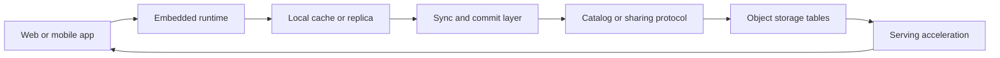
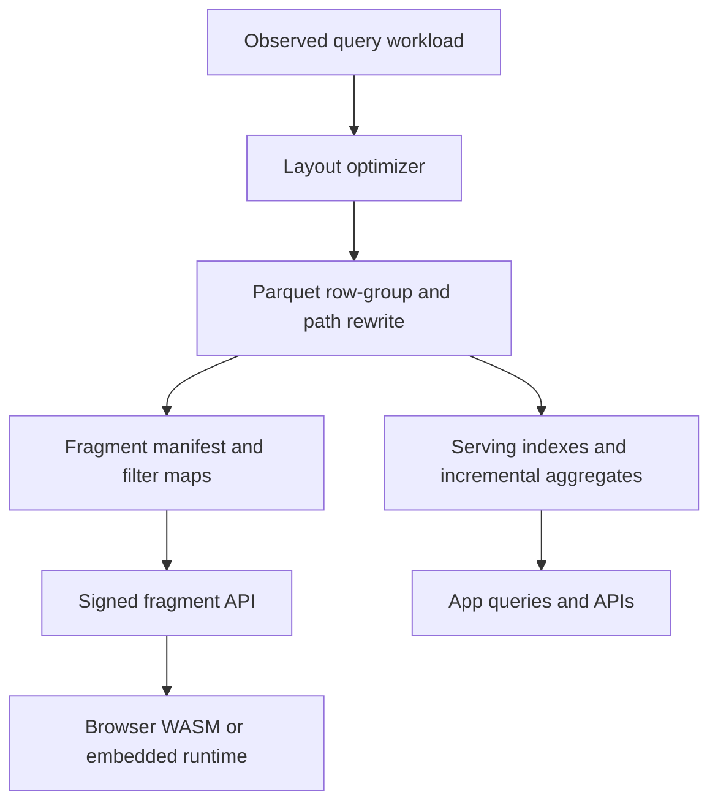

# Competitive Landscape for Local‑First Lakehouse Apps and Warehouse‑Native SaaS

## Executive summary

The market you described is no longer hypothetical. Multiple vendors are now building directly on open table formats, object storage, embedded databases, and warehouse governance layers rather than treating analytics stores as back-office systems. The strongest momentum is around five converging ideas: embedded/local execution with sync, object-storage optimization for analytics tables, serving indexes and incremental views on lakehouse data, open sharing and browser-side execution, and warehouse-native application frameworks. Official product materials from entity["company","MotherDuck","duckdb cloud"], entity["company","Snowflake","data cloud"], entity["company","Databricks","lakehouse platform"], and entity["company","Amazon Web Services","cloud platform"] all now explicitly position their products as app-building or open-lakehouse building blocks, not just analytics infrastructure. citeturn37search7turn24search3turn34search4turn25search3

The competition is unevenly distributed. It is dense in local-first sync and warehouse-native app frameworks, where products like Electric, PowerSync, InstantDB, Sigma, Hex, Snowflake Native Apps, and Databricks Apps are already shipping credible developer experiences. It is much thinner in the exact combination you described: **query-shaped object-storage views**, **lakehouse-native serving indexes**, and especially **browser-native Parquet delivery with signed fragments and predicate-aware fetches**. In that thin zone, the closest substitutes are lower-level protocols and libraries such as Delta Sharing, DuckDB-Wasm, hyparquet, parquet-wasm, and Iceberg REST catalogs, not full end-to-end products. citeturn20search16turn19search13turn18search13turn10search19turn13search2turn33search9turn34search1turn6search21turn7search6turn17view0turn7search1turn8search8

The most important strategic takeaway is that incumbents already cover most **single layers** of the stack, but almost nobody owns the **cross-layer product**. There is no dominant platform today that combines: local-first operational UX, Parquet/Iceberg-native object views optimized from real workload traces, serving-grade indexes for point and selective lookups, browser-safe signed fragment delivery, and cross-engine commit/sync semantics. That gap is the clearest invention space. This is an inference from the product set below rather than a single vendor claim, but it is strongly supported by the way vendors specialize: sync products still center on SQLite/Postgres; lakehouse products still center on batch scans and materialized views; browser-native products remain mostly libraries and sharing protocols. citeturn19search13turn35search1turn25search14turn24search0turn22view0turn22view1turn6search21turn17view0turn7search1

The strongest near-term invention opportunities are therefore not “another warehouse” or “another BI tool.” They are: a **local-first BI/ops runtime that treats Parquet as a first-class replica target**; a **view compiler that rewrites Parquet layout from observed query shapes**; **lakehouse serving indexes** that behave more like OLTP secondary indexes than warehouse clustering; a **signed-fragment API** that mixes row-group pruning, statistics, and browser WASM execution; and **commit/sync middleware** that normalizes semantics across Iceberg, Delta, and warehouse catalogs. citeturn37search12turn24search7turn4search5turn6search21turn8search6turn27view3

## The pattern shift shaping this market

A useful way to read the market is as a stack migration: from centralized warehouse query engines toward distributed, composable “data planes” where compute can run in the browser, on-device, at the edge, or in a warehouse account, while the durable truth lives in object storage or a governed warehouse catalog. That pattern shows up in MotherDuck’s dual execution model, Snowflake’s Open Catalog and Horizon Catalog, Databricks Apps and Delta Sharing, AWS S3 Tables, and the browser-first Parquet tools. citeturn37search12turn8search0turn8search3turn34search4turn6search18turn25search3turn17view0turn7search6

In practice, the products below cluster into three architectural families. First are **client-first sync systems** that keep state in SQLite, IndexedDB, or embedded Postgres and sync from Postgres or custom backends. Second are **lakehouse serving systems** that accelerate scans, filters, and aggregates over open data. Third are **warehouse-native application systems** that let vendors package governed apps in customer accounts. The market is mature at the edges of those families, but still immature in the middle, where all three need to work together. citeturn19search13turn18search17turn24search0turn25search14turn33search5turn34search2

## Featured competitor profiles

### Local-first, browser, and sync-oriented products

| Product | Company | Date marker | Description and primary use cases | Formats / protocols | Runtime | Pricing / maturity / traction | Strengths vs. your invention idea | Gaps and integration notes | Official sources |
|---|---|---:|---|---|---|---|---|---|---|
| MotherDuck | entity["company","MotherDuck","duckdb cloud"] | Current 2026 docs | Serverless DuckDB-based warehouse with local/cloud development flow; strongest for DuckDB-native analytics apps and customer-facing analytics. | DuckDB, Parquet, Iceberg; S3/HTTP via DuckDB ecosystem. | Cloud + local DuckDB client. | Free Lite tier; paid self-serve plans; positioned for BI and customer-facing analytics. | Closest commercial product to “local + cloud analytics app” workflow; dual execution is a meaningful distribution advantage. | Not a general local-first sync system; object-view optimization and serving-index layer are not its primary product surface. | citeturn37search7turn37search4turn37search1turn37search12 |
| DuckDB-Wasm | DuckDB Labs / DuckDB OSS | Stable client 1.5.2 in docs | Browser-native analytical runtime; ideal for in-browser Parquet exploration, offline BI, and embedded analytical features. | WASM, Arrow, Parquet, CSV, JSON, HTTP-backed files. | Browser, Node.js. | OSS; strong OSS adoption in DuckDB ecosystem. | Best commodity building block for browser-native SQL on Parquet. | No auth, sync, signed fragment protocol, or governance layer by itself. | citeturn7search6turn7search2 |
| Electric | entity["company","ElectricSQL","postgres sync"] | Current 2026 site | Postgres sync engine for partial replication, fan-out, and delivery; strongest for collaborative and agentic apps with live local data. | Postgres, HTTP, sync “shapes”; related OSS family includes PGlite and TanStack DB. | Cloud/self-host + web/mobile clients. | OSS family; repo/org shows strong community usage, with Electric and PGlite both heavily starred. | Very strong story for “query-shaped sync” and partial replication. | Sync is centered on Postgres and client caches, not Parquet/Iceberg object views. | citeturn20search16turn20search4turn20search12 |
| PGlite | Electric | GitHub organization snapshot 2026 | Embedded Postgres in the browser with reactive bindings; good for local-first app state with Postgres semantics. | Postgres-compatible SQL, WASM. | Browser, embedded. | OSS; Electric org page shows PGlite as one of the most adopted repos in its family. | Strong alternative to SQLite when Postgres compatibility matters on-device. | Still not a Parquet-native serving substrate; would need a sync and object-view layer around it. | citeturn20search4 |
| PowerSync | JourneyApps / PowerSync | Current 2026 docs | Syncs backend databases into in-app SQLite; best for responsive SaaS/mobile apps backed by Postgres, MySQL, MongoDB, or SQL Server. | SQLite client replicas; Postgres, MySQL, MongoDB, SQL Server on server side. | Cloud or self-host + mobile/web SDKs. | Public Cloud and self-host options; active multi-SDK OSS footprint. | Strongest “backend DB to in-app SQLite” productized sync story. | Tied to SQLite replicas; not built for Parquet or object-store views. | citeturn19search13turn19search14turn19search18 |
| InstantDB | entity["company","InstantDB","realtime backend"] | Current 2026 pricing/docs | Realtime backend with relational queries, optimistic updates, offline caching, and multiplayer-by-default UX. | Realtime database API; relational query model; backend uses Postgres in OSS server. | Cloud + frontend SDKs. | Free plan; Pro starts at $30/month; OSS repo shows 10.2k stars. | Very fast developer experience for multiplayer/local-feel SaaS apps. | Not open-table or Parquet oriented; better viewed as adjacent competition for app UX. | citeturn18search1turn18search13turn20search1turn18search16 |
| LiveStore | LiveStore / Overengineering Studio | v0.4.0-dev line in late 2025; docs 0.3.1 | Reactive SQLite plus built-in git-inspired sync via event sourcing; targets client-centric data layers for web/mobile. | SQLite, event sourcing, custom sync engine. | Web, mobile, embedded client. | Beta-stage OSS; GitHub org shows ~3.6k stars on pinned repo. | One of the most interesting architectural peers for local-first BI/ops UX. | Early-stage; not aligned to Parquet or object storage yet. | citeturn18search17turn20search2turn20search6turn20search10 |
| RxDB | pubkey / RxDB | Current 2026 docs | Local-first JavaScript database with replication and multiple storage adapters; useful for offline-capable SaaS frontends. | IndexedDB, OPFS, SQLite, replication adapters. | Browser, mobile, Node.js. | Open core; premium plugins for advanced features. | Mature client-local database layer with broad runtime support. | Still document-oriented and adapter-centric versus analytics-file-centric. | citeturn19search0turn19search8turn19search20 |
| Fireproof | Fireproof Storage | Current 2026 docs | Embedded, encrypted live-sync document database for browser apps. | Document DB, live sync, encrypted ledger. | Browser and JavaScript environments. | OSS with cloud/service layer; early but active. | Good benchmark for “zero-config collaboration in the browser.” | Document model, not columnar analytics; not a Parquet or lakehouse competitor directly. | citeturn18search3turn20search3turn20search7 |
| SQLite Sync | SQLite Cloud / SQLite AI | Current 2026 docs and pricing | CRDT-based local-first extension for SQLite with automatic synchronization and WASM quick starts. | SQLite, CRDT sync, WASM, REST/“Weblite” ecosystem. | Device, edge, cloud, browser. | Free tier; Dev $19/project/month; Pro $39/project/month. | One of the clearest local-first commercial products with browser/edge ambitions. | More operational-app than analytics-app today; Parquet and Iceberg still sit outside the core product. | citeturn35search1turn35search3turn36search0turn36search2turn36search4 |

### Lakehouse serving, open sharing, browser delivery, and interoperability products

| Product | Company / project | Date marker | Description and primary use cases | Formats / protocols | Runtime | Pricing / maturity / traction | Strengths vs. your invention idea | Gaps and integration notes | Official sources |
|---|---|---:|---|---|---|---|---|---|---|
| Databricks lakehouse stack | entity["company","Databricks","lakehouse platform"] | Databricks Apps GA on Jun 11, 2025 | Broadest integrated stack here: Delta Lake optimization, sharing, governance, and native apps. Best baseline incumbent for lakehouse-native SaaS. | Delta Lake, Iceberg via Unity ecosystem, Apps, SQL, sharing. | Cloud. | Consumption pricing; Apps billed by provisioned compute time; 20,000+ apps and 2,500+ customers for Apps since preview. | Broadest product surface and strongest ecosystem gravity. | Optimizes many layers, but not specifically browser-native Parquet fragment delivery or local-first sync. | citeturn34search1turn34search2turn34search4 |
| Snowflake open-lakehouse and app stack | entity["company","Snowflake","data cloud"] | Dynamic Iceberg updates Apr 2026; Open Catalog GA in Oct 2024 | Strongest warehouse-governed route to external Iceberg tables plus native app packaging and Streamlit. | Iceberg, Open Catalog, Horizon Catalog, Native Apps, Streamlit. | Cloud; external engines via Iceberg REST. | Consumption pricing; app monetization via marketplace pricing models; Open Catalog and Horizon tied to Snowflake account economics. | Best fit when governance and in-account distribution matter more than openness at the execution layer. | Less compelling for browser-native delivery or edge/local-first replicas. | citeturn24search0turn24search7turn8search0turn8search3turn8search7turn33search5turn10search0turn33search3 |
| Amazon S3 Tables | Amazon Web Services | Launched Dec 2024 | Storage-native Iceberg table buckets with automated maintenance; closest incumbent to “object storage as serving substrate.” | Iceberg, S3 table buckets, Athena/EMR/Spark interoperability. | Cloud object storage. | Public request/object/compaction pricing; claims up to 3x faster throughput and up to 10x higher TPS vs self-managed tables. | Most direct evidence that cloud object storage vendors are moving toward managed, workload-aware table serving. | AWS-scoped and Iceberg-scoped; not a browser or cross-engine app platform by itself. | citeturn25search7turn25search8turn25search3turn25search0turn25search4 |
| Dremio Reflections and Arctic catalog | entity["company","Dremio","lakehouse platform"] | Current 2026 docs/pricing | Query acceleration over open formats plus Iceberg cataloging; strong for open-lakehouse acceleration without full data copies. | Iceberg, REST catalog, reflections/accelerations. | Cloud and self-managed. | Standard pricing public; community, enterprise, and cloud editions. | Very close to query-shaped acceleration over object storage, especially for read-heavy BI. | Less opinionated than a serving-index product; not local-first or browser-native. | citeturn2search6turn2search7turn9search3turn9search7turn9search19 |
| StarRocks | entity["company","StarRocks","analytics database"] | Current 2026 repo/docs | Real-time SQL engine with primary-key updates and asynchronous materialized views; explicit lake query acceleration story. | MySQL protocol, ANSI SQL, data lake integrations, MVs. | Cloud, self-hosted. | OSS with 11.6k GitHub stars; commercial cloud/BYOC offerings. | One of the best current substitutes for lakehouse serving indexes and incremental aggregates. | Still an engine, not a neutral object-view layer or browser delivery platform. | citeturn23view0turn22view0turn3search12turn3search20 |
| RisingWave | entity["company","RisingWave Labs","streaming database"] | Current 2026 repo/docs | Incremental streaming SQL system that serves fresh materialized views with low latency; strong for “live views” on changing data. | Postgres-compatible SQL, Iceberg, Kafka/Pulsar/Kinesis, S3. | Cloud or self-hosted. | OSS with 9k GitHub stars; managed cloud available. | Best positioned for incremental aggregates and always-fresh derived views. | More streaming-centric than point-lookup-index-centric; not browser-delivery-oriented. | citeturn23view1turn22view1turn21search17 |
| ClickHouse | entity["company","ClickHouse","analytics database"] | Current 2026 docs | High-performance columnar engine with skip indexes, projections, and direct Iceberg/S3 integrations. | S3, Iceberg, projections, skip indexes, SQL. | Cloud and self-hosted. | Commercial cloud + OSS. | Excellent benchmark for selective-filter serving layers and index-based pruning on columnar data. | Native format remains faster than open-table access, so it is partly a substitute rather than a direct open-format solution. | citeturn4search0turn4search2turn4search1turn4search13turn4search18 |
| Materialize | entity["company","Materialize","streaming database"] | Current repo/release line | “Live data layer” that continually updates views from upstream operational data using SQL. | SQL, CDC, Kafka ecosystem, live views. | Cloud and deploy-anywhere. | Community edition free below resource threshold; cloud trial available; OSS repo has 6.3k stars. | Strongest comparison point for “incremental, always-correct app views” from operational systems. | Does not center on object storage or open-table layout optimization. | citeturn22view2turn23view2turn21search14 |
| Tinybird | entity["company","Tinybird","data APIs"] | Current 2026 docs/pricing | ClickHouse-based service for turning data pipelines into low-latency APIs and materialized views. | HTTP APIs, materialized views, event/streaming ingestion. | Cloud. | Developer from $49/month; custom SaaS/enterprise tiers. | Very strong substitute for “serving layer over analytics data” when the output is API-first. | Not Parquet/Iceberg-native and not browser-fragment-native. | citeturn5search0turn5search4turn5search8turn5search16 |
| Delta Sharing | Databricks / delta-io | Current 2026 docs | Open sharing protocol that uses bearer auth plus pre-signed URLs for direct cloud-storage access. | REST, pre-signed URLs, Delta Sharing clients, cloud object storage. | Any client/runtime with connector support. | Open protocol; commercial and OSS implementations exist. | Closest existing primitive to signed-fragment delivery for large tabular data. | Protocol is dataset/table sharing oriented, not a browser-native query-fragment API by itself. | citeturn6search0turn6search18turn6search21turn7search3 |
| Apache Polaris | Apache / Snowflake-origin project | Apache site current in 2026; open sourced Jul 2024 | Iceberg REST catalog focused on multi-engine interoperability; core cross-engine commit and auth surface. | Iceberg REST API, multi-engine interoperability. | OSS catalog service; managed equivalent via Snowflake Open Catalog. | OSS with ~open-source community adoption; managed version via Snowflake. | Strongest standards-aligned base layer for cross-engine commit/sync on Iceberg. | Iceberg-only; no universal multi-format commit semantics. | citeturn8search8turn8search20turn8search16turn14view1 |
| lakeFS | entity["company","Treeverse","lakeFS"] | Current 2026 docs | Git-like branching/version control over object storage; useful for WAP, rollback, and controlled publish flows. | S3-compatible API, object storage, Spark/Hive/Athena/DuckDB/Presto integrations. | Cloud or self-hosted. | OSS with 5.3k GitHub stars; enterprise/commercial tiers. | Excellent control plane for versioned lakehouse workflows and audit/publish patterns. | Not a query-aware serving layer; operates below SQL/application semantics. | citeturn28view1turn27view1turn9search13turn26search13 |
| Project Nessie | Project Nessie | Current 2026 docs | Transactional Iceberg catalog with Git-like branches/tags and cross-table transactions. | Iceberg catalog, Spark/Flink/Trino/Hive integrations. | Cloud-native OSS service, Docker, Kubernetes. | OSS with 1.5k GitHub stars. | Best for branchable multi-table commit semantics in open-lake workflows. | Narrower operational footprint than Polaris/Open Catalog; still Iceberg-centric. | citeturn9search0turn9search4turn9search8turn28view0 |
| Apache Gravitino | Apache | 1.1.1 release line in 2026 | Federated metadata lake for unified access across sources, regions, and engines. | Metadata lake, Iceberg catalogs, S3/HDFS/Hive/JDBC/REST backends. | OSS service. | OSS with 2.9k GitHub stars; Apache top-level graduation announced in 2025. | Good candidate for “meta-catalog” and federated discovery/governance across lakehouse systems. | More metadata/governance than commit-sync semantics; table management support is still narrower than full catalogs. | citeturn28view2turn27view2turn9search18turn26search10turn26search14 |
| hyparquet | hyparam | Current 2026 repo/site | Pure JavaScript Parquet parser for browser/HTTP use with range requests. | Parquet, HTTP range requests, TypeScript. | Browser and Node.js. | OSS with 809 GitHub stars. | Extremely close to the browser-side read primitive your idea needs. | No SQL engine, auth plane, or signed-fragment protocol. | citeturn17view0turn14view2 |
| parquet-wasm | kylebarron / OSS | v0.7.1 release in Oct 2025 | WASM bindings for reading and writing Parquet as Arrow in browser/JS contexts. | WASM, Parquet, Arrow. | Browser and JS runtimes. | OSS; lightweight and purpose-built. | Strong low-level piece for browser-side Parquet decode/encode. | Library only; no sharing or query orchestration layer. | citeturn7search1turn7search9 |

### Warehouse-native and embedded application frameworks

| Product | Company | Date marker | Description and primary use cases | Formats / protocols | Runtime | Pricing / maturity / traction | Strengths vs. your invention idea | Gaps and integration notes | Official sources |
|---|---|---:|---|---|---|---|---|---|---|
| Snowflake Native App Framework | entity["company","Snowflake","data cloud"] | Current GA docs | Build, distribute, and monetize apps that run in customer Snowflake accounts; best true warehouse-native SaaS packaging story. | Native Apps, Marketplace pricing models, Streamlit, Snowpark Container Services. | In customer Snowflake account. | Consumption + provider-defined listing prices; supports free or paid listings. | Deepest “run in the customer warehouse account” moat. | Best when customer is already on Snowflake; portability is limited. | citeturn11search1turn11search5turn33search5turn33search0turn33search3 |
| Databricks Apps | entity["company","Databricks","lakehouse platform"] | GA on Jun 11, 2025 | Native data/AI app hosting inside Databricks using frameworks like Dash, Shiny, Gradio, Streamlit, and Flask. | Apps, serverless compute, governed Databricks data access. | In Databricks workspace. | Compute-time billing; 20,000+ apps and 2,500+ customers since preview. | Strongest non-Snowflake warehouse-native app host right now. | Less marketplace/distribution-native than Snowflake’s app approach. | citeturn34search1turn34search2turn34search4 |
| Sigma | entity["company","Sigma Computing","analytics platform"] | Current 2026 docs | Warehouse-native analytics workspace with embedding, AI apps, and write-back via Input Tables. | Warehouse live query, embedding APIs/SDK, write-back. | Cloud + embedded in host apps. | Pricing not publicly rate-carded; embedding and AI app features are mature in official docs. | Strong for governed write-back and spreadsheet-like ops apps on warehouse data. | Not local-first and not open-table/browser-native. | citeturn10search19turn10search7turn13search0turn13search9turn11search3 |
| Hex | entity["company","Hex","analytics platform"] | Current 2026 pricing/docs | Data apps and dashboards from notebooks/code/no-code; strong for fast internal or embedded analytics products. | SQL warehouses, embedded analytics, app builder. | Cloud + embed into web apps. | Public plans from $36/editor/month. | Faster authoring than most native-app frameworks; good “data app as product surface” competitor. | Not truly local-first or object-storage-native. | citeturn10search2turn13search2turn13search6turn10search14 |
| Cube | entity["company","Cube","semantic layer"] | Current 2026 pricing/site | Semantic layer and headless/agentic analytics platform for AI, BI, and embedded apps. | Semantic layer APIs, caching, embedded analytics, wide warehouse support. | Cloud/self-hosted semantic layer. | Starter $40/developer/month, Premium $80/developer/month; OSS core with 19.9k stars. | Strongest semantic layer competitor for warehouse-native SaaS. | Not a storage/layout or sync product; depends on underlying engines. | citeturn12search1turn12search5turn12search9turn30search0 |
| Omni | entity["company","Omni","analytics platform"] | Current 2026 site | BI and embedded analytics platform with modeling, inputs, and AI. | Embedded analytics, semantic/modeling context, warehouse connectors. | Cloud + embedded. | Free trial on site; no public official price found in reviewed official pages. | Strong competitor for governed embedded analytics with SaaS-facing use cases. | More BI/embedding than app-runtime or sync layer. | citeturn13search3turn13search11turn12search0 |
| Evidence | entity["company","Evidence","business intelligence as code"] | Current 2026 site/pricing | Open-source “BI as code” for reports, data products, and embedded dashboards. | SQL + markdown, embedded dashboards, warehouse connectors, managed ClickHouse query engine in cloud offering. | Cloud and open-source/self-hosted. | Team $15/user/month, Pro $25/user/month; 5.8k GitHub stars and 17k weekly downloads on site. | Strong developer-first framework for lightweight warehouse-native SaaS and embedded delivery. | Less suited for heavy multi-tenant transactional workflows. | citeturn12search2turn14view3turn12search6turn12search14 |
| Lightdash | entity["company","Lightdash","open source BI"] | Latest release listed May 1, 2026 | dbt-native, open-source BI with embedding and cloud/self-host options. | dbt metrics, embedding, warehouse live query. | Cloud or self-hosted. | Embed pricing is public; GitHub repo shows 5.8k stars. | Good warehouse-native embedded BI option for teams standardized on dbt. | Less of a full application framework than Sigma/Hex/Snowflake Apps. | citeturn12search3turn12search7turn31view0 |

## Ranked competitors by invention area

### Local-first BI and ops apps on Parquet plus sync

| Rank | Product | Why it ranks here | Rationale on feasibility, moat, and fit | Sources |
|---|---|---|---|---|
| 1 | MotherDuck | Closest analytics-native dev loop with local/cloud execution. | Best fit for Parquet/DuckDB-centric app experiences, but not a full local-first sync system. | citeturn37search7turn37search12 |
| 2 | PowerSync | Most productized “backend DB to local SQLite” sync engine. | Strong moat in app responsiveness and state transfer; weaker on Parquet/open-table semantics. | citeturn19search13turn19search14 |
| 3 | Electric | Strong partial replication and query-shaped sync. | Best engineering fit if the invention chooses Postgres sync first and analytical views second. | citeturn20search16turn20search4 |
| 4 | SQLite Sync | Commercial CRDT-based local-first SQLite with browser/edge hooks. | Strong fit for offline ops apps; weaker fit for columnar analytics files. | citeturn35search1turn36search4turn36search0 |
| 5 | DuckDB-Wasm | Best browser analytics runtime. | Huge fit for local-first BI reads; no built-in sync moat. | citeturn7search6turn7search2 |
| 6 | InstantDB | Excellent realtime UX and optimistic multiplayer. | Great developer experience but not aimed at Parquet or warehouse-native analytics. | citeturn18search13turn20search1 |
| 7 | LiveStore | Most interesting client-centric architecture. | High architectural overlap with your desired UX; early commercial maturity. | citeturn20search6turn18search17 |
| 8 | PGlite | Embedded Postgres in browser. | Valuable if Postgres compatibility is the moat; weaker if Parquet is the primitive. | citeturn20search4 |
| 9 | RxDB | Mature local-first client database. | Good for offline web apps; less aligned to analytical files and serving indexes. | citeturn19search0turn19search8 |
| 10 | Fireproof | Browser-first, encrypted live sync. | Good substitute on “collab in browser,” but data model is far from lakehouse views. | citeturn18search3turn20search3 |

### Query-shaped object-storage views and workload-aware Parquet layout optimization

| Rank | Product | Why it ranks here | Rationale on feasibility, moat, and fit | Sources |
|---|---|---|---|---|
| 1 | Amazon S3 Tables | Storage-native automated maintenance on Iceberg. | Closest incumbent to object-storage as a serving substrate with maintenance built into storage. | citeturn25search7turn25search8turn25search3 |
| 2 | Databricks | Broad Delta optimization and app stack. | Strongest full-stack incumbent if layout optimization is coupled to compute and governance. | citeturn34search4turn34search1 |
| 3 | Snowflake dynamic Iceberg tables | Managed external Iceberg plus file-size/path controls. | Strong governed-object-view story, especially for Snowflake-managed Iceberg. | citeturn24search0turn24search7 |
| 4 | Dremio Reflections | Query acceleration over open formats. | Very strong substitute for workload-shaped cached/object views. | citeturn2search6turn9search3 |
| 5 | Apache Hudi table services | Clustering and compaction are explicit core services. | Great technical precedent for automated file-layout maintenance. | citeturn24search2turn24search6turn24search14 |
| 6 | ClickHouse | Projections and pruning on columnar data. | Strong technical overlap on layout-for-workload ideas, even if not purely open-format-first. | citeturn4search0turn4search2 |
| 7 | StarRocks | Async MVs for data-lake acceleration. | Strong substitute where materialized accelerations matter more than neutral object layouts. | citeturn3search12turn3search16 |
| 8 | Apache Doris | Lakehouse query acceleration with MVs and indexes. | Good alternative for read-mostly acceleration on open data. | citeturn22view3turn5search7 |
| 9 | RisingWave | Incremental refresh on object-store-connected data. | More about freshness than file layout, but relevant when views are derived continuously. | citeturn3search13turn22view1 |
| 10 | MotherDuck | Local/cloud DuckDB flow over open files. | Relevant because a future “query-shaped object views” product can pair well with DuckDB execution. | citeturn37search1turn37search12 |

### Lakehouse serving indexes

| Rank | Product | Why it ranks here | Rationale on feasibility, moat, and fit | Sources |
|---|---|---|---|---|
| 1 | StarRocks | Primary-key updates plus async MVs. | Closest current engine to a lakehouse serving layer with low-latency updates and serving semantics. | citeturn22view0turn3search20 |
| 2 | ClickHouse | Mature pruning, projections, and skip indexes. | Best benchmark on selective filters and serving-style read acceleration. | citeturn4search0turn4search2turn4search5 |
| 3 | RisingWave | Incremental materialized views. | Strongest for always-fresh incremental aggregates. | citeturn22view1turn3search21 |
| 4 | Materialize | Correct, continuously updated views from operational data. | High overlap with “lakehouse serving index” if the product leans operational and CDC-first. | citeturn22view2 |
| 5 | Apache Doris | Inverted indexes, Bloom/runtime filters, MVs. | Strong for mixed search and analytics filters. | citeturn5search3turn22view3 |
| 6 | StarTree / Apache Pinot | Strong indexing family including star-tree. | Best precedent for partial pre-aggregation and high-cardinality filter strategies. | citeturn5search9turn5search13turn5search17 |
| 7 | Tinybird | API-first real-time MVs. | Very strong commercial substitute if the output is an API rather than a generalized serving index. | citeturn5search8turn5search0 |
| 8 | Snowflake materialized views and search features | Serving acceleration inside governed warehouse. | Good substitute inside Snowflake estates, but less open and app-oriented. | citeturn3search15turn24search0 |
| 9 | Databricks serving stack | Broad platform solution, though not index-specialized. | Significant enterprise pull, but less explicit as a serving-index product than the engines above. | citeturn34search4turn34search1 |
| 10 | Dremio Reflections | Query acceleration rather than serving indexes per se. | Relevant competitor whenever precomputed accelerations beat bespoke serving structures. | citeturn2search6turn9search7 |

### Browser-native Parquet APIs and signed fragment delivery

| Rank | Product | Why it ranks here | Rationale on feasibility, moat, and fit | Sources |
|---|---|---|---|---|
| 1 | DuckDB-Wasm | Full SQL runtime in browser. | Best browser compute substrate today. | citeturn7search6turn7search2 |
| 2 | Delta Sharing | Open sharing with pre-signed direct cloud URLs. | Closest protocol precedent for signed fragment delivery. | citeturn6search21turn6search18 |
| 3 | hyparquet | Browser-HTTP Parquet reader with range requests. | Closest lightweight read primitive for fine-grained fetch. | citeturn17view0 |
| 4 | parquet-wasm | Browser-side Parquet read/write in WASM. | Strong low-level decoding/encoding building block. | citeturn7search1turn7search9 |
| 5 | Arrow Flight SQL | High-performance Arrow transport protocol. | Important substitute if the product favors Arrow flight streams over object fragments. | citeturn6search1turn6search10 |
| 6 | Snowflake Open Catalog and Horizon | Credentialed catalog access for external engines. | Relevant governance/auth pattern, though not browser-purpose-built. | citeturn8search0turn8search3 |
| 7 | Apache Polaris | Standardized Iceberg REST catalog surface. | Strong control-plane piece for browser-safe credential vending patterns. | citeturn8search8turn8search20 |
| 8 | MotherDuck plus DuckDB | Local/cloud execution around DuckDB. | Useful if browser work is paired with cloud pushdown and DuckDB clients. | citeturn37search12turn37search7 |
| 9 | SQLite Cloud Weblite and WASM surfaces | Browser-accessible edge/database pattern. | Good adjacent precedent for direct web access to database-backed logic. | citeturn36search2turn35search4 |
| 10 | ClickHouse Iceberg/S3 direct lake access | Not browser-first, but relevant as direct-open-data serving. | Useful substitute if fragments are served from an engine rather than storage. | citeturn4search1turn4search3turn4search18 |

### Cross-engine commit and sync tooling

| Rank | Product | Why it ranks here | Rationale on feasibility, moat, and fit | Sources |
|---|---|---|---|---|
| 1 | Apache Polaris | Most standards-aligned Iceberg REST catalog layer. | Best near-term base for multi-engine commit surfaces. | citeturn8search8turn8search20 |
| 2 | Snowflake Open Catalog | Managed Polaris service with governance. | Strongest commercial managed offering for Iceberg cross-engine access. | citeturn8search0turn29search18 |
| 3 | Project Nessie | Git-like branches and cross-table transactions. | Strongest “versioned data git” semantics in open lakehouse. | citeturn9search0turn9search4turn9search8 |
| 4 | lakeFS | Object-storage version control and publish flows. | Strong moat for WAP and promotion workflows around open data. | citeturn27view1turn9search13 |
| 5 | Apache Gravitino | Federated metadata layer. | Strong candidate when the problem is multi-catalog coordination and discovery. | citeturn27view2turn9search18 |
| 6 | Delta UniForm | Delta-to-Iceberg/Hudi compatibility bridge. | Important precedent for asynchronous metadata translation. | citeturn8search6turn8search18 |
| 7 | Apache XTable | Omni-directional conversion across open table formats. | Strongest open-source format conversion peer. | citeturn27view3turn26search11 |
| 8 | Dremio Arctic / enterprise catalog | Managed Iceberg catalog with multi-engine positioning. | Strong commercial option where governance and Dremio acceleration already exist. | citeturn2search7turn9search7 |
| 9 | Snowflake Horizon Catalog | External-engine read/write to Snowflake-managed Iceberg. | Important because it collapses warehouse and external-engine cataloging. | citeturn8search3turn8search7turn29search14 |
| 10 | Delta Sharing | Sharing rather than commit-sync, but cross-platform interop is proven. | Relevant fallback when write semantics are unnecessary and distribution is the real problem. | citeturn6search18turn6search21 |

### App frameworks for warehouse-native SaaS

| Rank | Product | Why it ranks here | Rationale on feasibility, moat, and fit | Sources |
|---|---|---|---|---|
| 1 | Snowflake Native App Framework | True “run in customer warehouse account” packaging and monetization. | Best fit if your product is a warehouse-native SaaS sold into Snowflake estates. | citeturn11search1turn33search5turn33search0 |
| 2 | Databricks Apps | Native governed data/AI app hosting. | Best fit for lakehouse-native SaaS on Databricks. | citeturn34search1turn34search2 |
| 3 | Sigma | Warehouse-native write-back and embedded AI apps. | Strong operational-app competitor with governed multi-user workflows. | citeturn10search19turn10search7turn13search0 |
| 4 | Hex | Fast app authoring and embedding over warehouse data. | Strong fit for analyst-created data apps and customer analytics surfaces. | citeturn13search2turn10search2 |
| 5 | Cube | Headless semantic layer for embedded and agentic analytics. | Strongest semantic/control-plane competitor rather than full app host. | citeturn12search9turn12search1 |
| 6 | Omni | Embedded analytics with modeling and inputs. | Strong fit where governed analytics UX is the product. | citeturn13search11turn12search0 |
| 7 | Evidence | Developer-first data-product framework. | Strongest lightweight “BI as code” competitor for embedded reports/data apps. | citeturn12search6turn14view3 |
| 8 | Lightdash | dbt-native embedded/open-source BI. | Strong substitute for warehouse-native embedded analytics in dbt shops. | citeturn31view0turn12search3 |
| 9 | Preset | Managed Superset with embedded dashboards. | Strong open-stack alternative for embedding, less opinionated as an app framework. | citeturn32search19turn32search1 |
| 10 | ThoughtSpot / Qrvey | Mature embedded analytics vendors. | Strong substitutes on embedded UX and packaging, but further from “warehouse-native local-first SaaS.” | citeturn32search18turn32search4turn32search10turn32search2 |

## Where incumbents are strong and where whitespace remains

The incumbents are strongest where one layer can be sold independently. Sync engines can sell “offline-first UX.” Warehouses can sell “governed native apps.” Lakehouse engines can sell “faster scans.” Embedded analytics vendors can sell “customer-facing dashboards.” Those are proven budgets, proven categories, and proven buyers. That is why PowerSync, Electric, Sigma, Hex, Snowflake Native Apps, Databricks Apps, StarRocks, ClickHouse, Dremio, and S3 Tables each have a crisp story. citeturn19search13turn20search16turn10search19turn13search2turn33search9turn34search4turn22view0turn4search15turn2search6turn25search3

The whitespace is where the category boundary itself is the pain. Your invention space looks most attractive in places where current users must stitch together two or three of those layers:

- **Local-first analytics apps:** today, teams usually combine a sync system around SQLite/Postgres with a separate analytical runtime around DuckDB/Parquet. The synthesis is not off-the-shelf. citeturn19search13turn35search1turn7search6turn37search7
- **Query-shaped object views:** storage vendors automate generic maintenance, but a neutral platform that rewrites Parquet row-group boundaries, clustering, manifests, or fragment maps from observed workload patterns remains largely unclaimed. citeturn25search4turn24search7turn24search14
- **Serving indexes for the lakehouse:** existing engines offer projections, skip indexes, star-tree indexes, MVs, or primary-key update models, but there is not yet a dominant **open-table serving-index layer** that sits above Parquet/Iceberg and below apps. citeturn4search5turn5search13turn22view0turn22view1
- **Browser-native signed fragments:** Delta Sharing proves pre-signed, direct object access; DuckDB-Wasm and hyparquet prove browser execution; but the combination into a standardized, predicate-aware browser fragment API is still missing. citeturn6search21turn7search6turn17view0
- **Cross-engine commit normalization:** Polaris, Nessie, UniForm, XTable, and Horizon are powerful, but the market is still fragmented across Iceberg-first, Delta-first, and warehouse-first approaches. citeturn8search8turn9search0turn8search6turn27view3turn8search3

A practical product thesis emerges from that gap map: build a **serving-oriented control plane** that treats object storage as the durable truth, local/browser runtimes as replicas, and catalogs/sharing protocols as exchange surfaces. The moat would not come from “another query engine.” It would come from better **layout intelligence**, better **distribution/security primitives**, and better **developer ergonomics across runtimes**. The closest analogs today are spread across S3 Tables for maintenance, Delta Sharing for transport, DuckDB-Wasm/hyparquet for browser compute, and Electric/PowerSync/SQLite Sync for client sync. No single vendor presently assembles all of them. citeturn25search4turn6search21turn7search6turn17view0turn20search16turn19search13turn35search1

If the goal is maximum defensibility, the least crowded path is a product that does all five of the following together: ingest workload traces from multiple engines; materialize query-shaped Parquet layouts and small selective indexes; vend signed fragments to browser or edge runtimes; expose commit metadata through an open catalog; and optionally sync a local operational subset into SQLite/PGlite/DuckDB replicas. That is the part of the map where competitors remain adjacent rather than direct. citeturn4search5turn6search21turn8search8turn19search13turn7search6

## Open questions and limitations

Some vendors do not publish simple public pricing, and several older products do not expose a clean “launch date” or dated major-release page in their official materials. In those cases, I used the most recent official milestone I could verify, such as a GA announcement, release page, or current dated documentation. Pricing is therefore exact where vendors publish it openly, and marked as non-public where they do not. citeturn34search1turn36search0turn12search1turn11search3

A few areas are still moving fast enough that this landscape should be treated as a **May 1, 2026 snapshot** rather than a timeless market map, especially Databricks Apps, Snowflake Horizon/Open Catalog features, S3 Tables, and browser-native OSS components. citeturn34search1turn8search7turn25search6turn7search9