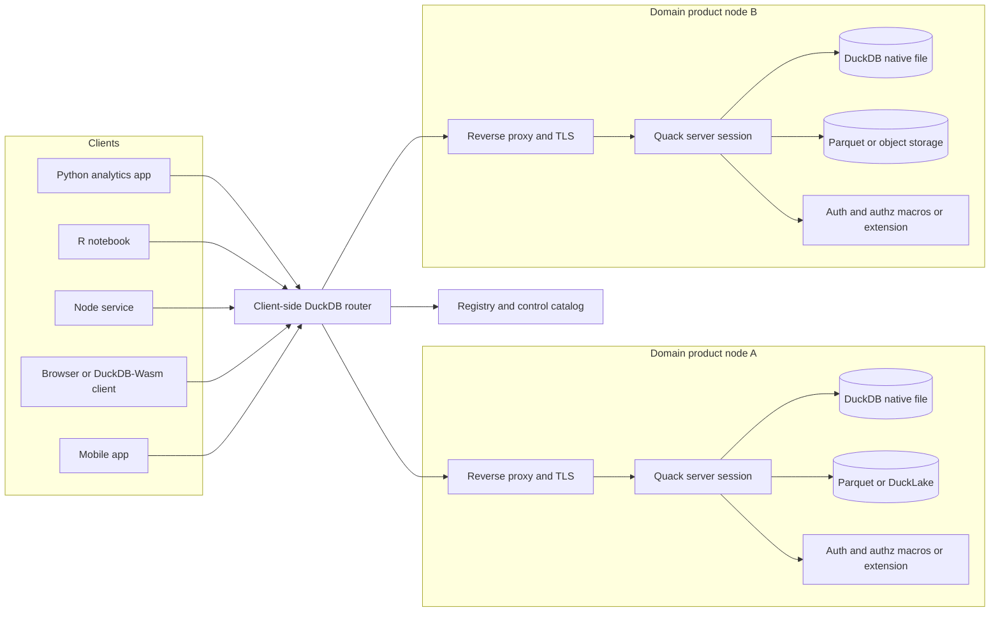
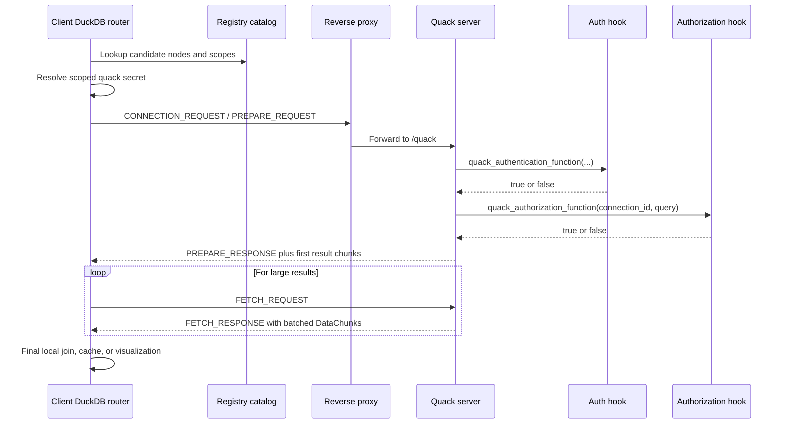

# Designing a New Analytics Paradigm with DuckDB and Quack

## Executive summary

Quack is no longer “unspecified.” As of May 2026, it has official DuckDB documentation, an announcement post, and a public repository. Officially, Quack turns DuckDB into an HTTP-based client-server system: the protocol is client-driven, uses DuckDB’s own `application/duckdb` serialization, can execute a query in a single request–response round trip after connection setup, and streams large results through follow-up `FETCH` requests. It is still beta in DuckDB v1.5.3, is not yet considered production-ready, and the DuckDB team explicitly says distributed query processing is not currently supported. citeturn23view2turn6view0turn7view2turn25view2turn29search14

The most defensible new paradigm is not “replace the warehouse with a magical distributed SQL fabric.” It is a **remote-embedded analytics mesh**: each DuckDB process remains an embeddable analytical runtime, but can optionally be published as a network-addressable, policy-controlled data product over Quack. That framing fits DuckDB’s original embedded-analytics mission, its portability across Python/R/Node/browser/mobile environments, and Quack’s ability to expose an attached remote catalog that behaves like a local one, including remote DDL/DML and forwarded transactions. citeturn38view1turn38view3turn5view7turn37view0turn25view0

In practical terms, this paradigm works best for edge analytics, queryable data products, browser/mobile analytics against central state, and centralized append-heavy analytics such as observability or event telemetry. It works less well for native pub/sub, true decentralized federation with optimizer-driven cross-node planning, or cryptographic secure multi-party analytics without substantial external machinery, because Quack is client-initiated, does not push from server to client, and does not yet provide distributed query processing. citeturn6view3turn25view2turn22view4

The architecture I recommend is therefore conservative and explicit: a TLS-terminating reverse proxy in front of each Quack server, a dedicated DuckDB serving session per data product, SQL-macro or extension-based authentication and authorization, a registry/control plane built in DuckDB itself, and a **client-side DuckDB router** that performs fan-out and final aggregation. Use `quack_query` when you want stateless remote execution; use `ATTACH` only when you need session state, temporary remote artifacts, or transaction boundaries. citeturn5view2turn6view10turn25view4turn30view0

## What the official sources establish

DuckDB’s core identity is still that of an **embedded, in-process analytical database**. The project’s own “Why DuckDB” page says DuckDB is embedded within a host process rather than run as separate server software, and that this design improves data transfer to and from the database. That same page also emphasizes portability across major operating systems and architectures, and notes APIs for C, C++, Go, Python, R, Rust, Java, Node.js, and other languages, plus deployment in browsers through DuckDB-Wasm and even on mobile phones. The original SIGMOD demonstration paper frames DuckDB’s niche as embeddable analytical data management for interactive analysis and edge computing. citeturn38view1turn38view3

On the execution side, DuckDB uses a **vectorized query engine**. Official internals documentation says execution is organized around `Vector` and `DataChunk`, that operators are optimized for vectors of fixed size, and that the default `STANDARD_VECTOR_SIZE` is 2048 tuples. DuckDB’s internals overview also describes a push-based vectorized model. At the systems boundary, the C API exposes vectors and data chunks directly, and DuckDB documents the data-chunk interface and appender as the most efficient ways to read from and write to DuckDB from external code. citeturn5view6turn1search10turn20view6turn20view5

On storage and interchange, DuckDB’s own format is organized in **row groups**, which the storage internals page says are used for features such as parallelism and compression. DuckDB also reads and writes Parquet efficiently and pushes filters and projections into Parquet scans; JSON is well-supported but explicitly described in the docs as not very efficient for tabular data; the `httpfs` extension enables HTTP(S) reads and S3-style reads/writes; and DuckDB can query Arrow tables, Arrow datasets, Arrow scanners, and Arrow `RecordBatchReader`s directly. The ADBC client further shows that DuckDB can move data over Arrow-based interfaces rather than row-oriented JDBC/ODBC-style paths. citeturn5view5turn12view2turn12view3turn12view1turn20view3turn20view7

DuckDB’s transaction and concurrency model is also important for any Quack-based design. The SQL documentation states that DuckDB supports ACID transactions with `BEGIN`, `COMMIT`, and `ROLLBACK`; the concurrency docs describe optimistic concurrency control; and the 2024 concurrency deep dive explains DuckDB’s analytics-optimized MVCC and WAL design. Critically, the concurrency documentation now says that **multiple-process writing to DuckDB’s native format is supported through Quack**, which is exactly the capability the user is asking us to exploit architecturally. citeturn20view0turn20view1turn12view8turn5view4

Extensibility is another enabling pillar. DuckDB’s extension system supports dynamic loading, explicit `INSTALL`/`LOAD`, autoloading for many core extensions, and signed community extensions; DuckDB’s Python client supports Python UDFs through `create_function`; and the Node Neo client is an official primary client, although its roadmap still lists user-defined types and functions as not yet complete. That asymmetry matters: it means Python is strong for local UDF experimentation, but the most robust system-wide Quack policy hooks should be implemented as SQL macros or native extensions, not ad hoc per-connection Python or Node UDFs. citeturn14view1turn14view2turn5view9turn12view5

Quack itself now has a clear official shape. The overview documentation says Quack is HTTP-based, client-driven, uses `application/duckdb` serialization, and is optimized for a single query round trip after setup, with chunked `FETCH` for large results. The reference defines `quack_serve`, `quack_query`, `quack_query_by_name`, `quack_identify`, `whoami()`, authentication and authorization settings, `quack_fetch_batch_chunks`, and dedicated Quack/HTTP logs. The FAQ says Quack supports the full DuckDB SQL dialect by default, but **does not yet support distributed query processing**. The security docs stress that Quack exposes the full SQL surface of the underlying DuckDB session, which is why the defaults are conservative: localhost binding, random token generation, and a recommendation to put TLS at a reverse proxy rather than expose Quack directly. citeturn23view2turn17search2turn25view2turn5view2

## Integration surfaces

The right way to think about Quack is as a **DuckDB-native remote data plane**, not as a generic event bus and not as a warehouse federation layer. The official docs explicitly say that every interaction is initiated by the client and that the server does not push. They also say that large results come back through follow-up `FETCH` requests. That means Quack is naturally good at **query shipping**, **stateful remote catalog attachment**, and **high-throughput result return**; it is not, by itself, a native pub/sub substrate. If you need push semantics, you must layer them on top via polling, a sidecar event broker, or an application-specific notification mechanism. That conclusion is an inference from the documented protocol behavior, not a hidden feature the docs forgot to mention. citeturn6view3turn6view1turn7view2

For networking and RPC, Quack has two primary modes. `quack_query(uri, query)` is the stateless mode. `ATTACH 'quack:host' AS name` is the stateful mode that presents the remote as a full catalog. The overview docs show that once attached, remote tables “look and behave like local ones,” including remote DDL, remote writes, and forwarded transactions. The deployment docs add an important operational detail: `ATTACH` preserves remote temp tables and `SET` variables across calls. The architectural implication is straightforward: **use `quack_query` by default for elastic, fan-out, easy-to-scale access; use `ATTACH` only when you intentionally want server-side session state**. Because `ATTACH` preserves state across calls, any load-balanced deployment should maintain affinity for that session path; that is a direct design inference from the documented statefulness. citeturn25view4turn25view0turn30view0

For serialization, Quack’s official advantage is that it uses DuckDB’s own `application/duckdb` format and the same internal serialization primitives used in the WAL path. This is a strong design signal: the Quack data plane should be the **internal/high-performance control and execution path**, while Arrow and Parquet should remain the **external interop path**. Arrow is especially useful at orchestration boundaries because DuckDB already queries and emits Arrow objects directly, and Arrow `RecordBatchReader` is explicitly documented as useful for streaming binary IPC between runtimes. In other words: use Quack for remote DuckDB-to-DuckDB semantics, and Arrow/Parquet at system boundaries where non-DuckDB tooling also matters. citeturn6view0turn20view3turn20view7

For metadata and discovery, Quack already has a small but useful primitive set. `quack_identify(...)` and `whoami()` expose identity, provider, hostname, region, start time, and JSON metadata. The Secrets Manager supports a dedicated `quack` secret type, with scoping by URI prefix. Together, those primitives are enough to build a lightweight registry-driven mesh: store node URIs and capabilities in one DuckDB catalog, let each node self-identify, and let clients resolve secrets and placement rules through URI scope. citeturn6view8turn20view4

For authentication and authorization, the official documentation is unusually strong and unusually programmable. Quack’s default authentication is token-based; authorization is permissive by default; both hooks are overridable; and those hooks can be plain SQL macros or scalar functions provided by extensions. The security page is also explicit that these callbacks run in a fresh transient server-side connection, which is why Python UDFs registered on a local connection cannot serve as Quack auth hooks. That is a crucial architectural constraint: **policy code that must govern all Quack sessions should live as SQL macros or extension-level scalar UDFs, not in connection-local Python glue**. Also note the Secrets Manager warning that persistent secrets are stored unencrypted on disk. citeturn6view10turn6view11turn20view4

The table below captures the most important mode choice for architecture. The “best for” and “caveat” columns are analytical judgments; the capabilities they rely on come from the cited official docs.

| Access pattern | Best for | Why it fits | Main caveat |
|---|---|---|---|
| `quack_query` | Fan-out federation, dashboards, control-plane actions, serverless-style access | Stateless remote execution is simpler to scale and easier to route through proxies | No remote session state, so temp tables and `SET`-based state do not persist across calls |
| `ATTACH` | Interactive notebooks, stateful workflows, transaction-scoped remote work, session-local remote artifacts | Remote catalog behaves like a local one; temp tables, settings, and transactions can be preserved | Stateful behavior implies stronger routing discipline and tighter security boundaries |

Those two modes are documented directly by the Quack overview and deployment docs. citeturn25view4turn30view0

## Paradigm options

The design space is broad, but not uniform. Some ideas align directly with what DuckDB and Quack officially provide; others require large layers around them. The comparison below is therefore intentionally opinionated. “Capability fit,” “complexity,” and “risk” are my analytical assessments based on the cited constraints and affordances.

| Paradigm option | Capability fit | Complexity | Main strengths | Main risks | Required components |
|---|---|---:|---|---|---|
| Edge analytic sentinels | Very high | Medium | Compute stays near devices or local files; bandwidth and privacy improve; easy to publish a selected local catalog upward | Operational sprawl across many nodes; remote policy hygiene becomes critical | DuckDB on edge, Quack servers, reverse proxy/TLS, central registry, fan-out router |
| Queryable data-product mesh | Very high | Medium | Natural mapping from “DuckDB session” to “published data product”; strong fit for domain-owned analytics | Governance failure if teams publish overly broad sessions | Dedicated serving sessions, Quack auth/authz, registry, naming and schema contracts |
| Client-orchestrated decentralized federation | Medium | High | Works today without waiting for distributed SQL in Quack | No native distributed planner; final joins/aggregations must be orchestrated manually | Router DuckDB, node registry, result staging, retry/error policy |
| Real-time stream-query hybrid | Medium | High | Good for append-heavy analytics and central observability | Quack is not native pub/sub; must add event or polling layer | Ingest service, append path, polling/query layer, optional broker |
| Offline-first mobile or browser analytics | Medium to high | High | DuckDB-Wasm/mobile make local-first analytics realistic; Quack can provide reconnection to central state | No built-in sync/changefeed model; application must manage oplogs and conflict handling | DuckDB-Wasm or mobile client, local tables, sync protocol, Quack hub |
| Governed multi-party analytics enclaves | Medium | Very high | Policy-controlled remote execution is possible | This is not cryptographic MPC by default; requires extra trust or TEE/MPC layers | Quack policy hooks, enclave/TEE or MPC runtime, strict schemas, audit system |

The best-aligned options are the first two. DuckDB’s original papers explicitly identify embedded analytics and edge computing as central use cases, while Quack’s FAQ says it is useful when data is on a server, when multiple writers need access to the same database, and when computation should move closer to data. Quack also supports the full DuckDB SQL dialect remotely, which makes “queryable data product” publishing more realistic than with a thin scanning API. citeturn38view3turn36view0turn25view2

The weakest options are the ones that pretend Quack already does things the docs say it does not do. The FAQ explicitly states that DuckDB with Quack does **not** support distributed query processing, so decentralized federation must be orchestrated at the client or control plane. Likewise, because the server does not push and all interactions are client-initiated, any true pub/sub or changefeed paradigm needs an added component outside Quack. And “secure multi-party analytics” should be interpreted rigorously: Quack gives you governance hooks and isolation opportunities, not cryptographic MPC out of the box. citeturn25view2turn6view3

## Recommended architecture

I recommend formalizing the new paradigm as a **remote-embedded analytics mesh**.

The core idea is simple: a DuckDB process remains local, embeddable, and opinionated about analytical execution, but selected sessions become network-addressable catalogs through Quack. Each published node is not “a general database server” in the classical sense. It is a **curated analytical session** exposing exactly the tables, views, files, lakehouse attachments, and extensions that its product owner intends to publish. That design follows directly from the Quack overview, which says that everything the serving session can see becomes reachable over the remote protocol. citeturn23view2

That single sentence has major architectural consequences. You should not turn your admin shell into your public data plane. Instead, create **dedicated serving sessions** with explicit attached objects, explicit macros, and explicit authorization functions. This turns Quack from “remote shell access to a DuckDB process” into “network publication of a curated analytical context.” That is the conceptual leap that makes a real paradigm possible.



This architecture is source-aligned in five ways. It keeps DuckDB embedded and portable; it respects Quack’s reverse-proxy/TLS model; it uses `ATTACH` or `quack_query` rather than inventing a second protocol; it leverages `whoami()` and scoped secrets for discovery and credentials; and it leaves true federation and final aggregation in a client-side DuckDB, which is necessary because official Quack documentation says distributed query processing is not yet present. citeturn38view1turn5view2turn25view4turn6view8turn20view4turn25view2

The runtime query flow should likewise stay explicit.



The official reference shows the Quack and HTTP logs, the `/quack` endpoint, batched `FETCH`, server-issued connection IDs, and the auth/authz callback contract. Those features make the protocol observable enough to support serious production-style benchmarking even before the protocol becomes formally stable. citeturn7view2turn7view3turn6view10

## Prototype design and implementation

A useful prototype has four components: a registry catalog, one or more serving nodes, a client-side router, and a local-first browser/mobile option.

A simple registry schema can live in DuckDB itself:

```sql
CREATE TABLE mesh_nodes (
    node_uri VARCHAR PRIMARY KEY,
    node_name VARCHAR,
    provider VARCHAR,
    region VARCHAR,
    labels LIST(VARCHAR),
    capabilities JSON,
    auth_scope VARCHAR,
    status VARCHAR,
    freshness_slo_seconds INTEGER,
    updated_at TIMESTAMP
);
```

That schema is my design, but it is intentionally keyed to official Quack metadata such as `whoami_name`, `whoami_provider`, `whoami_region`, and `whoami_meta`, which Quack exposes through `quack_identify(...)` and `whoami()`. citeturn6view8

For the serving node, the official docs already provide almost all of the SQL you need. The following example combines Quack’s documented token-table authentication pattern, read-only authorization macro, node identity, and serving function into a data-product node:

```sql
INSTALL quack;
LOAD quack;

CREATE TABLE quack_tokens (
    auth_token VARCHAR PRIMARY KEY,
    user_name  VARCHAR,
    role_name  VARCHAR
);

INSERT INTO quack_tokens VALUES
    ('alice-key-123', 'alice', 'reader'),
    ('bob-key-456',   'bob',   'reader');

CREATE MACRO check_token(sid, client_token, server_token) AS (
    EXISTS (
        SELECT 1
        FROM quack_tokens
        WHERE auth_token = client_token
    )
);

CREATE MACRO read_only(sid, query) AS
    regexp_matches(
        upper(trim(query)),
        '^(SELECT|FROM|WITH|EXPLAIN|DESCRIBE|SHOW)\b'
    );

SET GLOBAL quack_authentication_function = 'check_token';
SET GLOBAL quack_authorization_function  = 'read_only';

CALL quack_identify(
    name     := 'edge-boston-01',
    provider := 'ec2',
    region   := 'us-east-1',
    meta     := '{"datasets":["sensor_readings"],"tier":"edge"}'
);

CALL quack_serve(
    'quack:0.0.0.0:9494',
    allow_other_hostname := true
);
```

Everything in that snippet except the particular metadata payload is directly grounded in official documentation: `quack_serve`, `quack_identify`, the auth-token table pattern, the read-only authorization macro shape, and the need for global auth settings. If this node is reachable beyond localhost, the official security guidance is to place it behind a TLS-terminating reverse proxy rather than expose Quack directly. citeturn6view10turn6view11turn23view2turn5view2

For the client-side router, the important point is **manual federation**. Because Quack does not yet support distributed query processing, the router must decide which query parts execute remotely and which final aggregation happens locally. The logic below is deliberately written as Python-oriented pseudocode, but the SQL layer is real DuckDB/Quack syntax:

```python
import duckdb

con = duckdb.connect("mesh_router.duckdb")
con.execute("INSTALL quack; LOAD quack;")

nodes = [
    {"alias": "bos", "uri": "quack:bos-gw:443", "token": "alice-key-123"},
    {"alias": "nyc", "uri": "quack:nyc-gw:443", "token": "alice-key-123"},
]

for node in nodes:
    con.execute(f"""
        CREATE OR REPLACE SECRET {node['alias']}_secret (
            TYPE quack,
            SCOPE '{node["uri"]}',
            TOKEN '{node["token"]}'
        );
    """)
    con.execute(f"ATTACH '{node['uri']}' AS {node['alias']} (TYPE quack)")

# fan out remote subqueries explicitly
for alias in ["bos", "nyc"]:
    con.execute(f"""
        CREATE OR REPLACE TEMP TABLE stage_{alias} AS
        FROM {alias}.query(
            'SELECT device_id, temp_c, ts
               FROM sensor_readings
              WHERE ts >= now() - INTERVAL 5 MINUTE'
        );
    """)

# final aggregation is local
result = con.execute("""
    SELECT device_id,
           avg(temp_c) AS avg_temp_c,
           max(ts)     AS latest_ts
    FROM (
        SELECT * FROM stage_bos
        UNION ALL
        SELECT * FROM stage_nyc
    )
    GROUP BY device_id
""").fetchall()
```

This pattern is not an attempt to “fake distributed SQL.” It is a **router pattern**: push predicate-heavy scanning and early aggregation to the nodes; pull compact intermediate results back; finish the merge locally. That choice aligns with Quack’s high-throughput result transport and with the current absence of native distributed query processing. Scoped `quack` secrets, `ATTACH`, and attached-catalog `query(...)` are all officially documented. citeturn20view4turn25view0turn25view4

For JavaScript, the safest recommendation is to separate **Node server orchestration** from **browser local-first analytics**.

An illustrative Node pattern, based on the official Node Neo client’s connection model, looks like this:

```js
// illustrative Node-oriented pseudocode
import { DuckDBConnection } from '@duckdb/node-api';

const con = await DuckDBConnection.create();

await con.run(`
  INSTALL quack;
  LOAD quack;

  CREATE SECRET quack_prod (
    TYPE quack,
    SCOPE 'quack:mesh-gateway:443',
    TOKEN '${process.env.QUACK_TOKEN}'
  );

  ATTACH 'quack:mesh-gateway:443' AS prod (TYPE quack);
`);

const rows = await con.run(`
  FROM prod.query(
    'SELECT product_id, score
       FROM recommendations
      WHERE model_version = ''2026-05'''
  )
`);
```

That example is intentionally pseudocode around the JavaScript method calls, because the official Node docs in current form establish the supported connection model and roadmap but do not, in the sources reviewed here, spell out a complete Quack example. The important source-backed fact is that the Node Neo client is an official primary client, while user-defined functions in Node Neo are still marked incomplete on the roadmap. citeturn12view5

A browser/mobile path is also viable, but only with the right expectations. DuckDB-Wasm supports in-browser analytical SQL, local and remote file access, and extension loading; Quack’s announcement explicitly says DuckDB-Wasm can speak Quack natively; and DuckDB’s own benchmarks show serious analytical workloads running on modern phones. That makes an **offline-first local analytical cache with Quack-based reconnection** plausible. It does **not** mean Quack already provides a built-in sync protocol. For that, you still need an application-managed oplog or snapshot-and-merge strategy. citeturn12view12turn22view2turn14view3turn37view0

## Tradeoffs, validation, and open questions

The performance case for Quack is real, but it must be interpreted correctly. In the official Quack benchmark, a 60 million row bulk transfer completed in 4.94 seconds for Quack versus 17.40 seconds for Arrow Flight SQL and 158.37 seconds for PostgreSQL in the tested setup. In the same announcement, small single-row append transactions reached about 5,434 tx/s at 8 threads, with the authors noting that Quack outperformed PostgreSQL up to that point but then hit a current DuckDB limitation on concurrent insertions into the same table. Those results strongly support the use of Quack for **analytical result transfer** and **medium-rate transactional append paths**, but not yet as a blanket replacement for specialized OLTP systems at every scale point. citeturn22view0turn22view1turn22view3

The security case is equally strong, and equally conditional. Official Quack security guidance says the server exposes the full SQL surface of the underlying DuckDB instance, ships with conservative defaults, and should not be exposed directly to the internet. The default model is random authentication token plus localhost binding, with TLS terminated at a reverse proxy. The docs also show that authorization is permissive by default, so safe multi-tenant or semi-public deployments require custom authz logic. That is why the remote-embedded mesh should publish only **curated serving sessions**, not arbitrary local working environments. citeturn5view2turn6view10

There are also several subtle operational tradeoffs. Persistent secrets are stored unencrypted on disk, which makes them convenient but not equivalent to a hardened secrets vault. `ATTACH` preserves server-side state, which is useful for interactive work but complicates routing and failover. Quack’s reference also shows server-side `FETCH` batching via `quack_fetch_batch_chunks`, which gives you a concrete tuning knob when large-result transport dominates latency. On the database side, DuckDB gives you practical instrumentation through Quack logs, HTTP logs, `EXPLAIN ANALYZE`, and even Mermaid-format plan export. citeturn20view4turn30view0turn7view3turn7view2turn32search0turn32search1

A serious prototype should therefore benchmark four things separately: remote subquery execution time, remote result transfer time, local final aggregation time, and policy overhead. It should also use DuckDB’s own testing and benchmarking discipline. DuckDB’s testing docs say the project uses an extended `sqllogictest` framework for SQL-level tests, while the benchmark suite documentation provides a dedicated harness for benchmark files. For a Quack prototype, that means you can define SQL-level correctness tests for routing, authorization, and retry semantics, and a repeatable benchmark suite for fan-out, bulk transfer, append throughput, and auth-hook overhead. citeturn34search0turn34search1

The main open questions are mostly not theoretical; they are already visible in official docs and official repo activity. Quack is still beta and expected to change before DuckDB v2.0. The FAQ explicitly says production readiness is not there yet. The FAQ also says distributed query processing is absent. Meanwhile, current official GitHub issues raise questions around cache isolation in multi-user servers, lack of path-prefix support in `quack:` URIs for reverse-proxy routing, and the absence of a native read-only token model. Those are precisely the kinds of issues that matter for turning today’s Quack into tomorrow’s full-fledged analytical mesh substrate. citeturn25view2turn27view0turn27view1turn27view2

My bottom-line judgment is therefore this:

DuckDB plus Quack can legitimately found a new paradigm, but the paradigm should be named and scoped correctly. The right new paradigm is **remote-embedded analytics**: embeddable analytical runtimes that can be selectively published as secure, networked catalogs and orchestrated from another DuckDB. That is a strong paradigm for edge analytics, queryable data meshes, and local-first analytics with central state. It is not yet a complete replacement for a distributed SQL engine, an eventing backbone, or a cryptographic MPC system. If you build with that distinction in mind, Quack is already useful. If you ignore it, you will over-architect against capabilities the official sources do not yet claim. citeturn38view3turn23view2turn25view2turn36view0

## References

- DuckDB documentation, **Quack Remote Protocol** overview. citeturn23view2
- DuckDB documentation, **Quack Reference**. citeturn17search2
- DuckDB documentation, **Quack Security**. citeturn5view2
- DuckDB documentation, **Deploying Quack**. citeturn30view0
- DuckDB website, **FAQ for Quack**. citeturn36view0
- DuckDB engineering blog, **Quack: The DuckDB Client-Server Protocol**. citeturn22view0turn22view1turn22view4
- DuckDB documentation, **Why DuckDB**. citeturn38view1
- DuckDB documentation, **Execution Format** and **Storage Versions and Format**. citeturn5view6turn5view5
- DuckDB documentation, **Transaction Management** and **Concurrency**. citeturn20view0turn20view1turn5view4
- DuckDB engineering blog, **Analytics-Optimized Concurrent Transactions** and **Changing Data with Confidence and ACID**. citeturn12view8turn12view9
- DuckDB documentation, **Extensions**, **Python Function API**, **Node.js Client**, and **Secrets Manager**. citeturn14view1turn5view9turn12view5turn20view4
- DuckDB documentation, **SQL on Apache Arrow**, **ADBC Client**, **Parquet**, **JSON**, and **httpfs**. citeturn20view3turn20view7turn12view2turn12view3turn12view1
- DuckDB-Wasm paper and DuckDB docs on WebAssembly and mobile execution. citeturn12view12turn37view0turn12view6turn12view7
- DuckDB SIGMOD demonstration paper, **DuckDB: an Embeddable Analytical Database**. citeturn38view3
- Official Quack repository and currently open official issues relevant to routing, token semantics, and cache isolation. citeturn26search0turn27view0turn27view1turn27view2