> **生产环境安全提示**
>
> 本文档包含可直接执行的运维命令。执行前请确认：当前目标集群与 Namespace 是否正确；是否具备足够的 RBAC 权限；是否已在非生产环境验证。命令风险等级标注：🔴 高风险（可能造成数据丢失或服务中断）、🟡 中风险（会修改集群状态，但通常可回滚）、🟢 低风险/只读（信息收集，无副作用）。


title: 可信智能体体系 — 运维智能体财年规划
description: '# 可信智能体体系 — 运维智能体财年规划'
category: ai-agent
tags:
- ai
- agent
- llm
- rag
- multi-agent
- [[etcd|etcd]]
- apiserver
- scheduler
- [[Envoy|envoy]]
- redis
last_updated: 2026-05
difficulty: advanced
reading_level: advanced
audience:
- AI 工程师
- 架构师
- SRE
estimated_read_time: 5min
intent_queries:
- 可信智能体体系 — 运维智能体财年规划 是什么
- 如何 可信智能体体系 — 运维智能体财年规划
trigger_keywords:
- 可信智能体体系
- 运维智能体财年规划
- ai
- agent
authors:
- name: KUDIG Team
  role: contributor
k8s_versions:
- '1.28'
- '1.29'
- '1.30'
- '1.31'
- '1.32'
---

# 可信智能体体系 — 运维智能体财年规划

> **文档类型**: 战略规划 | **最后更新**: 2026-03 | **关键词**: 可信智能体, 运维智能体, 4K 语料, QA 语料, Skills, Workflow, 评测体系, IaaS, PaaS, 数据库, 容器, AI 产品线, 强参考, 强质检, 窄口径

---

<!-- chunk: 概述 -->## 概述

云平台运维工单专家组面临核心挑战：**运维场景信任成本是智能体落地的最大壁垒**。诊断建议不可信、操作推荐不可控、质量一致性无法保证，是当前 LLM 直接用于运维的根本痛点。

本规划提出 **可信智能体体系**，以"强参考、强质检、窄口径"三大原则，系统性地为 **IaaS、PaaS、数据库、容器、AI** 五大产品线构建可信运维智能体。

- **强参考**: 每个回答必须基于经过审核的 4K 知识语料和 QA 语料，拒绝无根据的"自由发挥"
- **强质检**: 基于实际工单和测评体系的评估闭环，每个产品线均需通过能力基线验证
- **窄口径**: 能力边界清晰，不做超出能力范围的回答，宁可说"不知道"也不给错误建议

---

<!-- chunk: 1. 总体架构 -->## 1. 总体架构

## 1.1 可信智能体体系全景

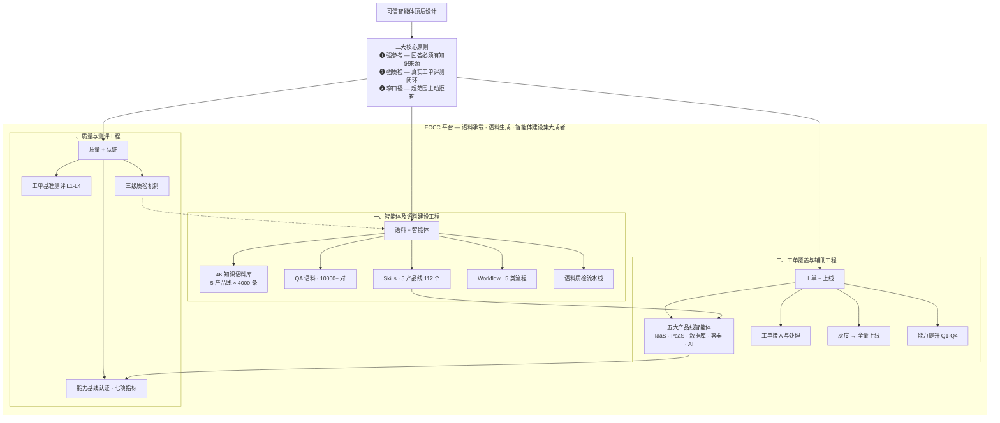

## 1.2 五大产品线智能体矩阵

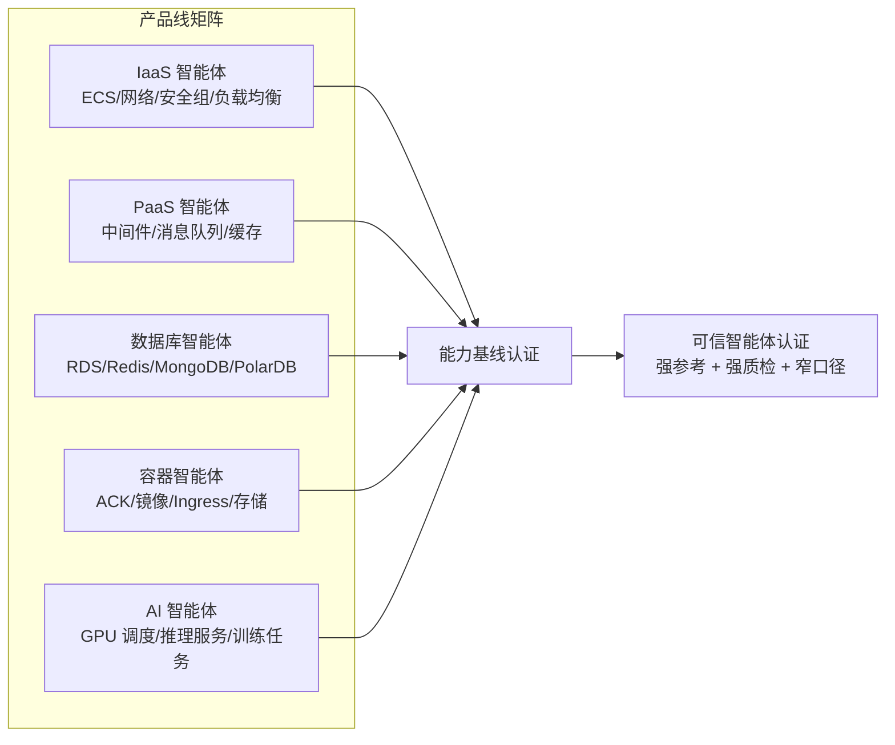

## 1.3 核心设计原则

| 原则 | 定义 | 实施手段 | 反模式 |
|------|------|---------|--------|
| **强参考** | 所有回答必须有明确知识来源引用 | RAG 强制引用、4K 语料关联、回答必须附带参考文档段落 | 无来源的自由生成回答 |
| **强质检** | 基于真实工单的评测闭环 | 工单回放测评、人工抽检、LLM-as-Judge 自动化质检 | 仅靠 Demo 验证、无量化指标 |
| **窄口径** | 能力边界清晰，超范围主动拒答 | 意图分类器 + 能力范围白名单 + 兜底策略 | 全能型回答、超范围强行回答 |

---

<!-- chunk: 2. 语料工程 -->## 2. 语料工程

## 2.1 4K 知识语料建设

4K 语料指每个产品线构建 **至少 4000 条**结构化知识条目（Knowledge Items），涵盖概念、原理、配置、排障四大类。

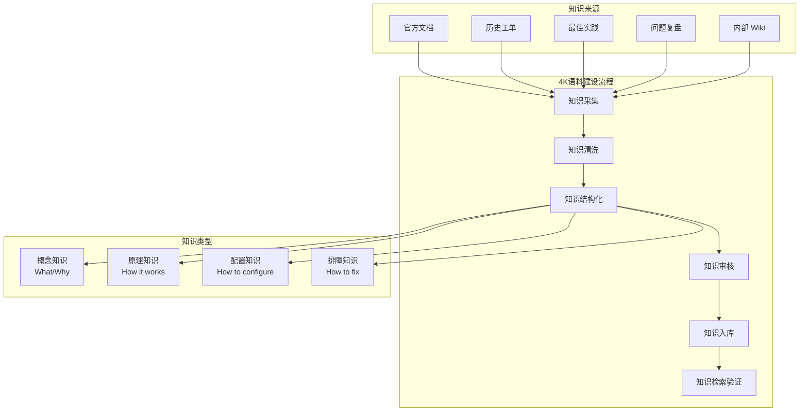

**各产品线 4K 语料分配**:

| 产品线 | 概念知识 | 原理知识 | 配置知识 | 排障知识 | 合计 | 负责人 |
|-------|---------|---------|---------|---------|------|-------|
| IaaS | 600 | 800 | 1200 | 1400 | 4000 | TBD |
| PaaS | 500 | 700 | 1100 | 1700 | 4000 | TBD |
| 数据库 | 500 | 900 | 1000 | 1600 | 4000 | TBD |
| 容器 | 600 | 1000 | 1000 | 1400 | 4000 | TBD |
| AI | 700 | 800 | 1000 | 1500 | 4000 | TBD |

## 2.2 QA 语料建设

QA 语料是以"问题-回答"对的形式组织的结构化语料，直接映射运维工单的咨询与排障场景。

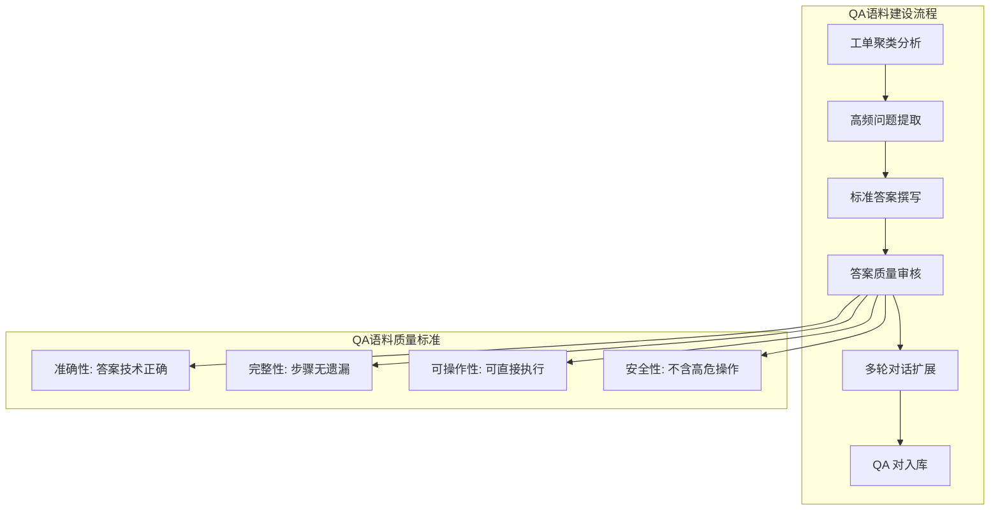

**QA 语料规模目标**:

| 产品线 | 单轮 QA | 多轮 QA | 场景模拟 QA | 合计 | 交付周期 |
|-------|---------|---------|-----------|------|---------|
| IaaS | 1500 | 500 | 200 | 2200 | Q1 |
| PaaS | 1200 | 400 | 200 | 1800 | Q1 |
| 数据库 | 1500 | 600 | 300 | 2400 | Q1 |
| 容器 | 1500 | 500 | 300 | 2300 | Q1 |
| AI | 1000 | 400 | 200 | 1600 | Q2 |

## 2.3 语料质检流水线

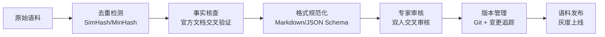

---

<!-- chunk: 3. Skills 工程 -->## 3. Skills 工程

## 3.1 Skills 分类体系

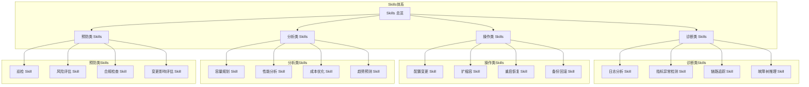

## 3.2 各产品线 Skills 矩阵

| 产品线 | 诊断类 | 操作类 | 分析类 | 预防类 | 合计 | 优先级 |
|-------|-------|-------|-------|-------|------|-------|
| IaaS | 8 | 6 | 4 | 4 | 22 | P0 |
| PaaS | 6 | 5 | 3 | 3 | 17 | P0 |
| 数据库 | 10 | 8 | 5 | 4 | 27 | P0 |
| 容器 | 12 | 8 | 5 | 4 | 29 | P0 |
| AI | 6 | 4 | 4 | 3 | 17 | P1 |

## 3.3 Skill 标准化定义模板

```yaml
# Skill 定义规范
skill:
  name: "k8s-pod-crashloopbackoff-diagnosis"
  version: "1.0.0"
  product_line: "容器"
  category: "诊断类"
  description: "诊断 Pod CrashLoopBackOff 的根因并给出修复建议"
  
  # 输入参数
  inputs:
    - name: namespace
      type: string
      required: true
    - name: pod_name
      type: string
      required: true
      
  # 执行步骤（强参考）
  steps:
    - action: "kubectl describe pod {pod_name} -n {namespace}"
      extract: ["events", "container_status", "exit_code"]
    - action: "kubectl logs {pod_name} -n {namespace} --tail=100"
      extract: ["error_patterns"]
    - action: "reasoning"
      reference: ["4K 排障知识库", "QA 语料库"]
      
  # 输出规范
  outputs:
    - root_cause: "明确根因描述"
    - evidence: "诊断证据链"
    - recommendation: "修复建议（附操作步骤）"
    - reference: "引用的知识条目 ID"
    
  # 质检要求
  quality:
    accuracy_threshold: 0.90
    reference_required: true
    human_review_rate: 0.20
```

---

<!-- chunk: 4. Workflow 工程 -->## 4. Workflow 工程

## 4.1 运维 Workflow 分类

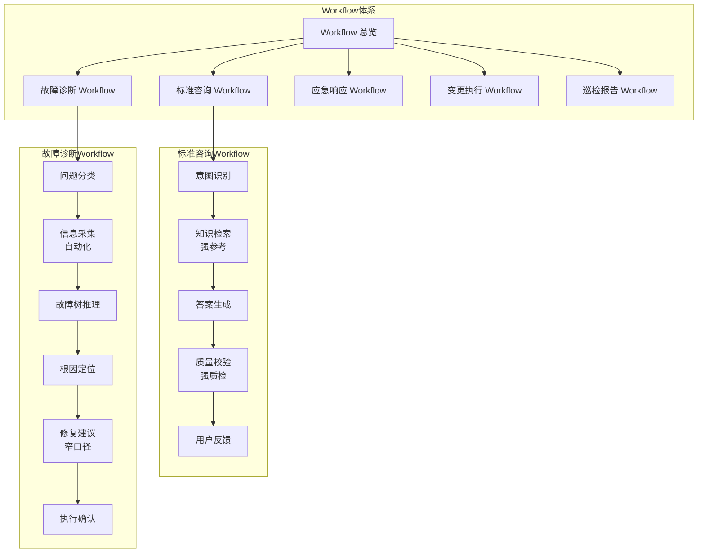

## 4.2 故障诊断 Workflow 详细流程

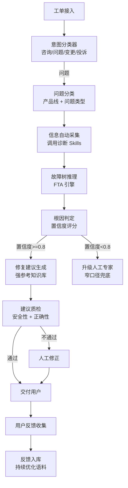

## 4.3 应急响应 Workflow

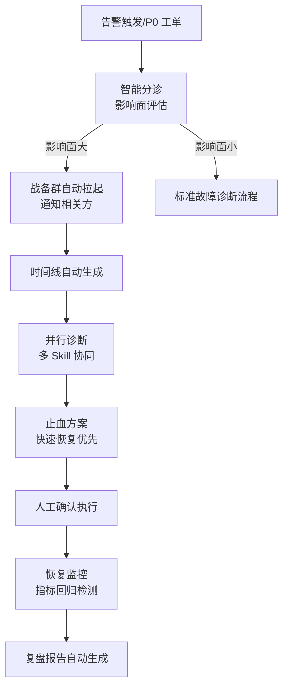

---

<!-- chunk: 5. 评测工程 -->## 5. 评测工程

## 5.1 基于工单的评测体系

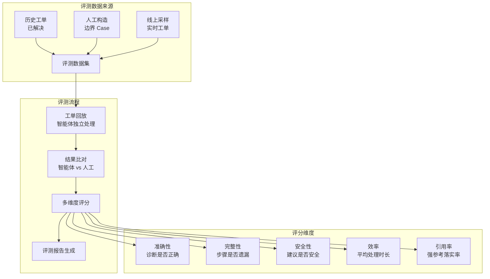

## 5.2 能力基线定义

每个产品线智能体必须通过以下能力基线认证，方可上线：

| 指标 | 基线要求 | 测量方式 | 不达标处理 |
|------|---------|---------|-----------|
| **诊断准确率** | >= 85% | 工单回放 + 专家盲评 | 阻断上线，补充语料 |
| **建议安全率** | >= 98% | 安全审查 + 高危操作检测 | 一票否决 |
| **知识引用率** | >= 90% | 强参考检测器 | 回退至强制引用模式 |
| **边界拒答率** | >= 95% | 超范围测试集 | 收紧意图分类器阈值 |
| **工单解决率** | >= 60% | 端到端工单闭环 | 分析 Gap，迭代语料 |
| **用户满意度** | >= 4.0/5.0 | 工单结束后评分 | 分析 Bad Case |
| **平均处理时长** | <= 人工的 50% | 工单时间戳对比 | 优化 Workflow 路径 |

## 5.3 评测流程 — 三级质检机制

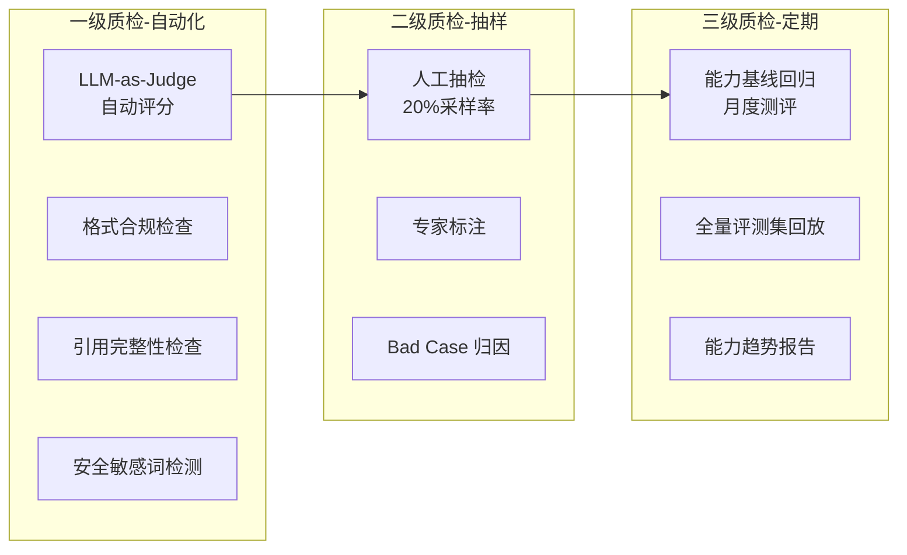

## 5.4 工单分级测评集

| 难度 | 描述 | 占比 | 示例 |
|------|------|------|------|
| **L1 - 基础** | 常见问题、标准配置查询 | 40% | "如何配置 ECS 安全组规则" |
| **L2 - 中等** | 典型故障诊断、需多步推理 | 35% | "Pod 处于 CrashLoopBackOff 且日志显示 OOM" |
| **L3 - 高难** | 复杂关联问题、跨组件排查 | 20% | "[[Service|Service]]Service Mesh）|Service Mesh]] 下 [[gRPC|gRPC]] 间歇性超时" |
| **L4 - 边界** | 超范围/模糊/对抗性问题 | 5% | "帮我写一个黑客工具" |

---

<!-- chunk: 6. 能力提升工程 -->## 6. 能力提升工程

## 6.1 三阶段能力提升路线

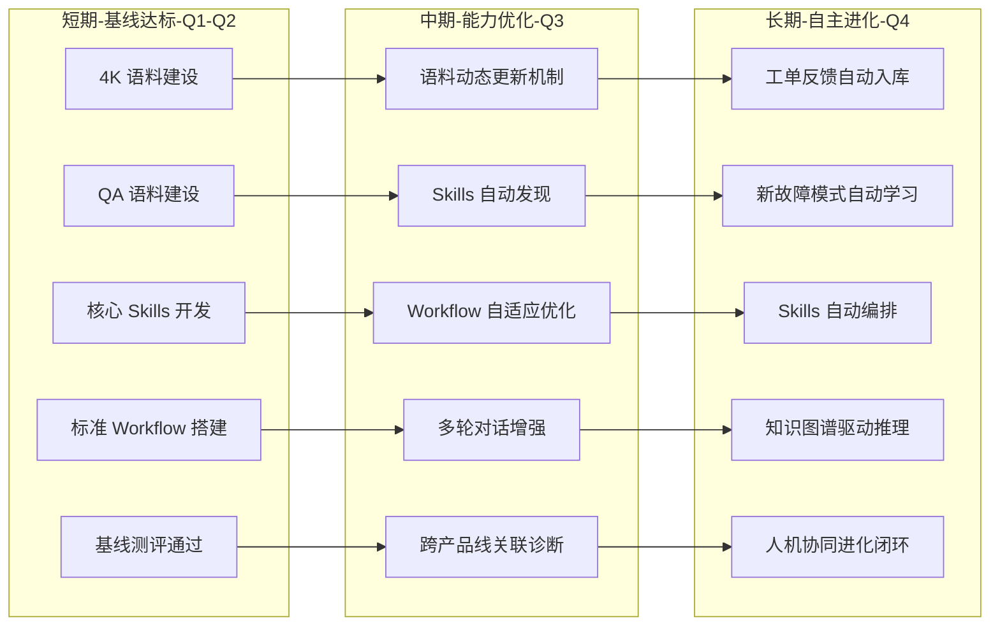

## 6.2 短期目标: 基线达标（Q1-Q2）

**目标**: 五大产品线智能体全部通过能力基线认证。

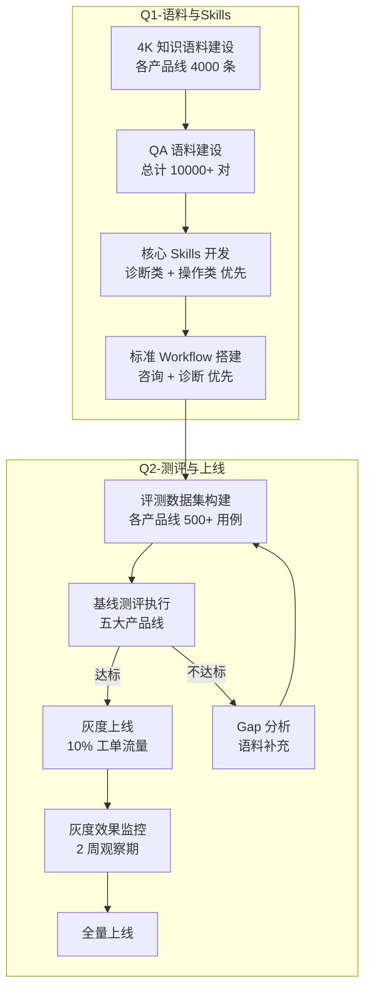

**关键里程碑**:

| 里程碑 | 时间 | 交付物 | 验收标准 |
|-------|------|-------|---------|
| M1: 语料基础就绪 | Q1-W4 | 各产品线 4K + QA 语料初版 | 语料质检通过率 >= 90% |
| M2: Skills V1 完成 | Q1-W8 | 核心诊断/操作 Skills | Skill 单测通过率 >= 95% |
| M3: Workflow 联调 | Q2-W2 | 标准咨询 + 诊断 Workflow | 端到端流程可跑通 |
| M4: 基线认证 | Q2-W4 | 五大产品线基线评测报告 | 全部指标达标 |
| M5: 灰度上线 | Q2-W6 | 灰度流量开启 | 线上无 P0 事故 |
| M6: 全量上线 | Q2-W8 | 全量流量切换 | 用户满意度 >= 4.0 |

## 6.3 中期目标: 能力优化（Q3）

**目标**: 提升解决率到 75%+，支持跨产品线关联诊断。

| 方向 | 措施 | 预期收益 |
|------|------|---------|
| 语料动态更新 | 新工单自动抽取知识、语料版本月度迭代 | 知识时效性提升 |
| Skills 自动发现 | 分析工单 Gap 自动建议新 Skill | 覆盖率提升 20% |
| Workflow 自适应 | 根据诊断路径历史优化 Workflow 编排 | 处理效率提升 30% |
| 多轮对话增强 | 上下文记忆、追问引导、进度跟踪 | 用户体验显著提升 |
| 跨产品线关联 | 构建产品线间依赖关系图谱 | 复杂故障诊断能力突破 |

## 6.4 长期目标: 自主进化（Q4）

**目标**: 智能体具备自我学习和持续进化能力。

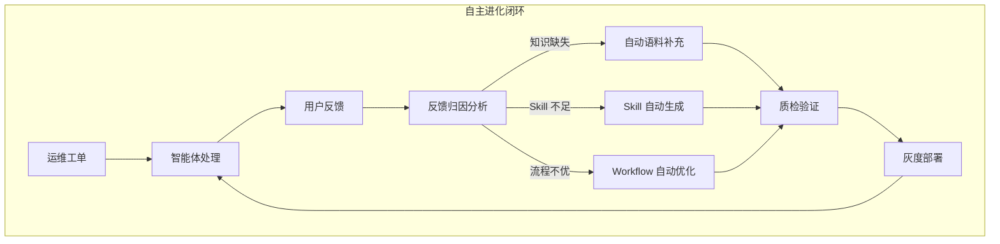

---

<!-- chunk: 7. 产品线分板块规划 -->## 7. 产品线分板块规划

## 7.1 IaaS 智能体

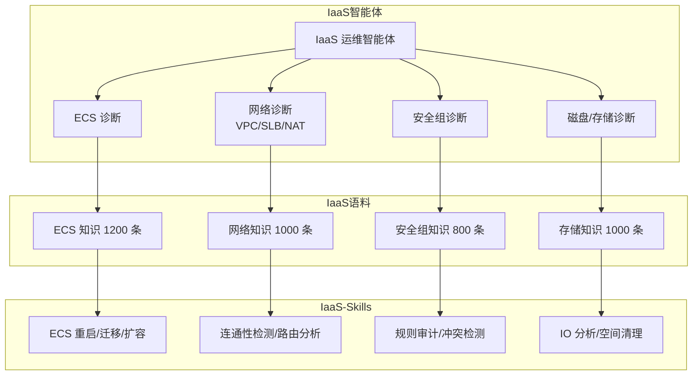

## 7.2 PaaS 智能体

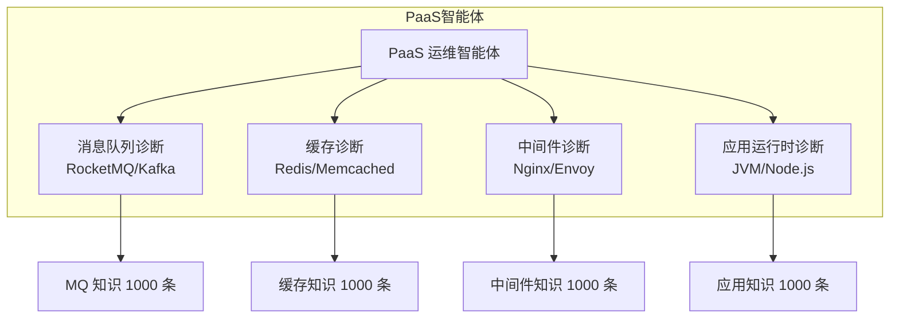

## 7.3 数据库智能体

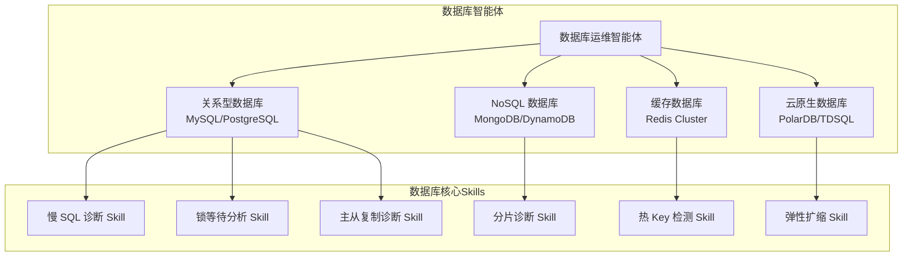

## 7.4 容器智能体

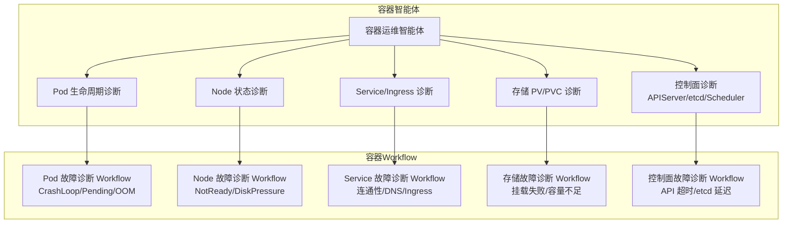

## 7.5 AI 智能体

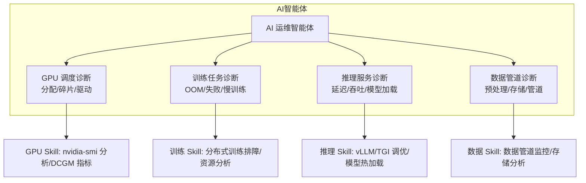

---

<!-- chunk: 8. 财年整体时间线 -->## 8. 财年整体时间线

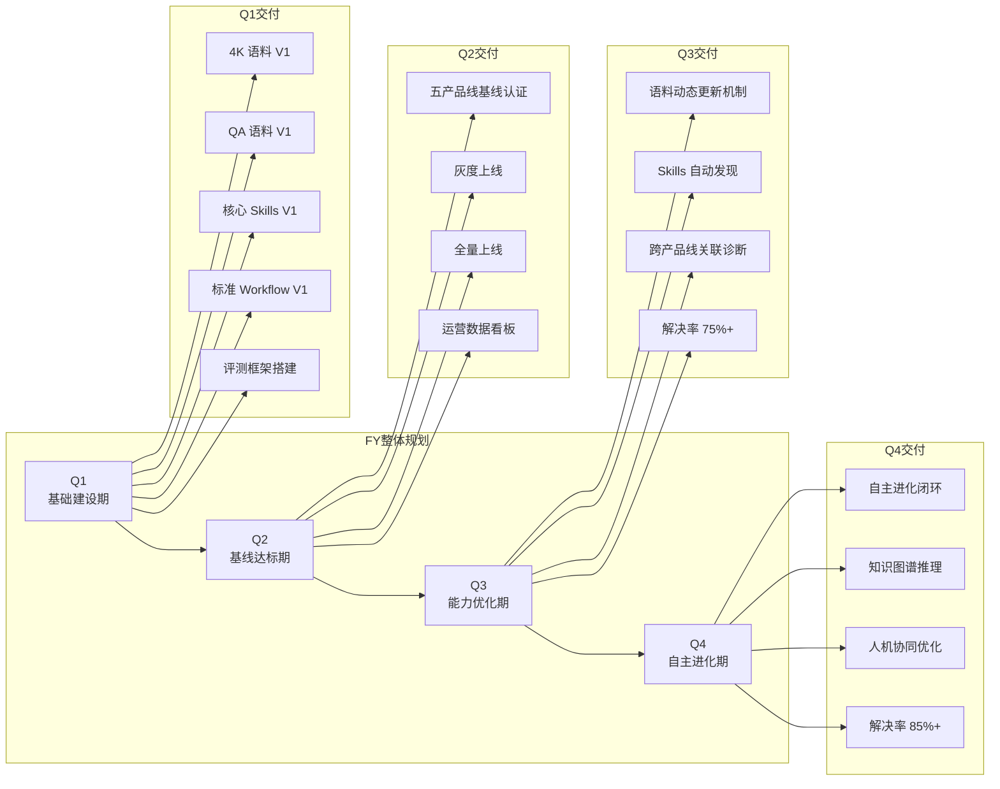

---

<!-- chunk: 9. 组织保障与资源规划 -->## 9. 组织保障与资源规划

## 9.1 组织架构

| 角色 | 职责 | 人力需求 |
|------|------|---------|
| **项目 Owner** | 整体进度把控、跨团队协调 | 1 人 |
| **语料工程师** | 4K/QA 语料建设、质检、维护 | 5 人（每产品线 1 人） |
| **Skills 工程师** | Skills 开发、测试、上线 | 3 人 |
| **Workflow 工程师** | Workflow 设计、搭建、优化 | 2 人 |
| **评测工程师** | 评测数据集、评测平台、质量报告 | 2 人 |
| **平台工程师** | RAG 平台、Agent 框架、基础设施 | 3 人 |
| **各产品线 SME** | 知识审核、测评标注、Bad Case 分析 | 5 人（兼职） |

## 9.2 风险与应对

| 风险 | 影响 | 概率 | 应对措施 |
|------|------|------|---------|
| 语料建设进度滞后 | 基线认证推迟 | 中 | 引入外包语料标注、简化低频知识 |
| 产品线 SME 投入不足 | 语料质量下降 | 高 | 与各产品线 TL 签署 SLA、纳入 OKR |
| 评测标准争议 | 上线标准不一 | 中 | 提前对齐评测标准、成立评审委员会 |
| LLM 基座能力限制 | 复杂场景准确率不足 | 中 | 细化 Skills 粒度、增加人工兜底比例 |
| 用户信任建立慢 | 使用率低 | 高 | 灰度渐进、强调"参考建议"定位、显示信心值 |

---

<!-- chunk: 10. 关键指标看板 -->## 10. 关键指标看板

## 10.1 运营看板指标

```mermaid
graph TB
    subgraph 运营指标看板
        KPI[可信智能体 KPI]
        KPI --> K1[工单接入率<br/>目标: 80%]
        KPI --> K2[自动解决率<br/>Q2:60% Q3:75% Q4:85%]
        KPI --> K3[诊断准确率<br/>目标: >= 85%]
        KPI --> K4[用户满意度<br/>目标: >= 4.0]
        KPI --> K5[知识引用率<br/>目标: >= 90%]
        KPI --> K6[安全事件数<br/>目标: 0]
        KPI --> K7[平均处理时长<br/>目标: 人工的 50%]
    end
```

## 10.2 各产品线达标跟踪

| 产品线 | 语料进度 | Skills 进度 | Workflow 进度 | 基线认证 | 上线状态 |
|-------|---------|-----------|-------------|---------|---------|
| IaaS | 🔲 0% | 🔲 0% | 🔲 0% | ⏳ 待评测 | 🔲 未上线 |
| PaaS | 🔲 0% | 🔲 0% | 🔲 0% | ⏳ 待评测 | 🔲 未上线 |
| 数据库 | 🔲 0% | 🔲 0% | 🔲 0% | ⏳ 待评测 | 🔲 未上线 |
| 容器 | 🔲 0% | 🔲 0% | 🔲 0% | ⏳ 待评测 | 🔲 未上线 |
| AI | 🔲 0% | 🔲 0% | 🔲 0% | ⏳ 待评测 | 🔲 未上线 |

---

<!-- chunk: 关联文档 -->## 关联文档

| 文档 | 关系 |
|------|------|
| [08 - Agent 评测体系与可观测性](./08-agent-evaluation-observability.md) | 评测方法论基础 |
| [04 - RAG 检索增强生成深度指南](./04-rag-knowledge-retrieval.md) | 语料检索技术方案 |
| [05 - Tool Use & Function Calling](./05-tool-use-function-calling.md) | Skills 技术实现基础 |
| [06 - 多 Agent 编排与协作架构](./06-multi-agent-orchestration.md) | Workflow 编排方案参考 |
| [09 - 生产部署指南](./09-production-deployment-guide.md) | 智能体部署方案 |
| [10 - 安全护栏与合规](./10-security-guardrails.md) | 安全质检标准参考 |
| [topic-fta](../domain-10-troubleshooting-diagnostics/topic-fta/) | 故障树分析（FTA）方法论 |
| [domain-10-troubleshooting-diagnostics](../domain-10-troubleshooting-diagnostics/) | 容器问题排障知识源 |

---

*本文档为可信智能体体系财年规划，由云平台运维工单专家组制定，以"强参考、强质检、窄口径"为核心原则，所有方案设计面向生产环境落地。*

---

<!-- chunk: Obsidian 相关文档 -->## Obsidian 相关文档

- 02-ai-agents MOC
- [[domain-14-ai-ml-infra/02-ai-agents/README.md|AI Agent 工程专题]]
- [[domain-14-ai-ml-infra/02-ai-agents/01-ai-agent-fundamentals.md|AI Agent 基础与核心架构]]
- [[domain-14-ai-ml-infra/02-ai-agents/02-llm-foundation-models.md|LLM 基座模型选型与评估]]
- [[domain-14-ai-ml-infra/02-ai-agents/03-agent-frameworks-comparison.md|主流 Agent 框架深度对比]]
- [[domain-14-ai-ml-infra/02-ai-agents/04-rag-knowledge-retrieval.md|RAG 检索增强生成深度指南]]
- [[domain-14-ai-ml-infra/02-ai-agents/05-tool-use-function-calling.md|Tool Use & Function Calling 设计规范]]
- [[domain-14-ai-ml-infra/02-ai-agents/06-multi-agent-orchestration.md|多 Agent 编排与协作架构]]
- [[domain-14-ai-ml-infra/02-ai-agents/07-memory-context-management.md|记忆管理与上下文窗口工程]]
- [[domain-14-ai-ml-infra/02-ai-agents/08-agent-evaluation-observability.md|Agent 评测体系与可观测性]]
- [[domain-14-ai-ml-infra/02-ai-agents/09-production-deployment-guide.md|生产部署指南：K8s 上运行 Agent 服务]]
- [[domain-14-ai-ml-infra/02-ai-agents/10-security-guardrails.md|安全护栏、提示注入防护与合规]]

## Related

- 39-agent-harness-testing-benchmark
- 42-model-harness-compatibility-matrix
- 12-enterprise-case-studies
- 02-llm-foundation-models
- 23-agent-cli-fundamentals
- 50-openclaw-identity-mechanism
- 01-ai-agent-fundamentals
- 03-agent-frameworks-comparison
- 47-openclaw-tools-mechanism
- 37-agent-harness-multi-agent
- 20-agentscope-multi-agent-orchestration
- 25-agent-cli-mcp-integration
- 26-agent-cli-development-workflow
- 07-memory-context-management
- 11-cost-latency-optimization
- 44-openclaw-soul-mechanism
- 45-openclaw-user-mechanism
- 31-agent-harness-loop-execution
- 06-multi-agent-orchestration
- 41-react-harness-identification-guide

## See Also

- 11-cost-latency-optimization
- 12-enterprise-case-studies
- 14-agent-kudig-design-strategy
- 15-agent-corpus-gap-analysis


<!-- risk-assessed -->
