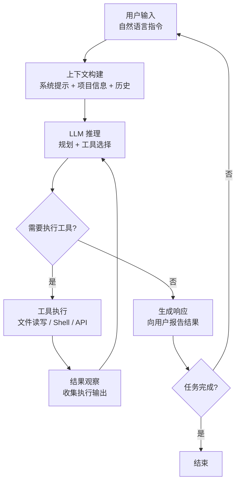
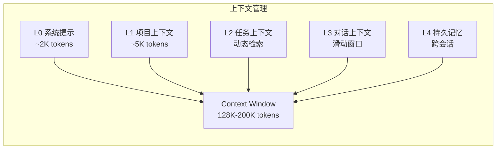

> **生产环境安全提示**
>
> 本文档包含可直接执行的运维命令。执行前请确认：当前目标集群与 Namespace 是否正确；是否具备足够的 RBAC 权限；是否已在非生产环境验证。命令风险等级标注：🔴 高风险（可能造成数据丢失或服务中断）、🟡 中风险（会修改集群状态，但通常可回滚）、🟢 低风险/只读（信息收集，无副作用）。


title: Agent CLI 基础概念与架构模式
description: '# Agent CLI 基础概念与架构模式'
category: ai-agent
tags:
- ai
- agent
- llm
- rag
- multi-agent
- docker
last_updated: 2026-05
difficulty: advanced
reading_level: advanced
audience:
- AI 工程师
- 架构师
- SRE
estimated_read_time: 5min
intent_queries:
- Agent CLI 基础概念与架构模式 是什么
- 如何 Agent CLI 基础概念与架构模式
trigger_keywords:
- Agent
- CLI
- 基础概念与架构模式
- ai
- agent
authors:
- name: KUDIG Team
  role: contributor
k8s_versions:
- '1.28'
- '1.29'
- '1.30'
- '1.31'
- '1.32'
---

# Agent CLI 基础概念与架构模式

> **文档类型**: 基础概念专题 | **最后更新**: 2026-03 | **关键词**: Agent CLI, Terminal Agent, REPL Loop, MCP, Agentic Coding, CLI Architecture

---

## 概述

**Agent CLI（命令行智能体）** 是 2025–2026 年 AI 工程领域最具影响力的范式转变之一。它将 LLM 的推理能力与终端的执行能力深度融合，使开发者能够在命令行环境中以自然语言驱动代码生成、项目重构、故障排查和系统运维等复杂任务。

与 GUI 形态的 AI 助手相比，Agent CLI 具备更强的**自动化集成能力**（CI/CD、脚本调度）、更灵活的**工具链扩展性**（MCP 协议、自定义工具）以及更低的**环境依赖**（无需 IDE，SSH 可达即可用）。本文系统梳理 Agent CLI 的核心概念、架构模式和关键技术。

---

## 1. Agent CLI 的定义与分类

### 1.1 什么是 Agent CLI

Agent CLI 是运行在终端（Terminal）环境中的 AI 智能体，具备以下核心能力：

- **自然语言交互**：接受自然语言指令，理解开发者意图
- **代码读写**：自主读取项目文件、生成和修改代码
- **工具调用**：执行 shell 命令、调用 API、操作文件系统
- **规划与推理**：将复杂任务分解为步骤序列，迭代执行并自我校验
- **上下文感知**：理解项目结构、代码依赖关系和运行时状态

```
┌─────────────────────────────────────────────────────┐
│                  Agent CLI 系统                      │
│                                                     │
│  ┌─────────┐   ┌──────────┐   ┌─────────────────┐  │
│  │ 用户输入 │──▶│ LLM 推理 │──▶│ Tool Execution  │  │
│  │ (NL/指令)│   │ (规划/生成)│   │ (文件/Shell/API)│  │
│  └─────────┘   └──────────┘   └─────────────────┘  │
│       ▲              │                   │          │
│       │              ▼                   ▼          │
│  ┌─────────┐   ┌──────────┐   ┌─────────────────┐  │
│  │ 交互反馈 │◀──│ 结果评估 │◀──│ Context Manager │  │
│  │ (确认/修正)│  │ (成功/失败)│  │ (项目/文件/历史)│  │
│  └─────────┘   └──────────┘   └─────────────────┘  │
└─────────────────────────────────────────────────────┘
```

### 1.2 Agent CLI 分类体系

| 分类维度 | 类型 | 典型代表 | 特征 |
|---------|------|---------|------|
| **交互模式** | 交互式 (Interactive) | Claude Code, Aider | 人在回路，实时确认 |
| | 无头模式 (Headless) | Codex CLI `--quiet` | 全自动，CI/CD 集成 |
| **功能定位** | 编码助手 (Coding Agent) | Claude Code, Codex CLI, Aider | 聚焦代码生成与修改 |
| | 通用终端 Agent | Goose, Warp AI | 覆盖运维、部署等全场景 |
| | 领域专用 Agent | Amazon Q Developer CLI | 绑定特定云平台生态 |
| **模型绑定** | 单模型绑定 | Claude Code (Claude) | 与特定模型深度优化 |
| | 多模型支持 | Aider, Goose | 支持任意 LLM 后端 |
| **协议支持** | MCP 原生 | Claude Code, Goose | 原生支持 MCP 工具协议 |
| | API 集成 | Aider | 通过自定义适配集成 |

### 1.3 Agent CLI vs IDE Agent vs Web Agent

| 对比维度 | Agent CLI | IDE Agent (Copilot/Cursor) | Web Agent (ChatGPT/Dify) |
|---------|-----------|--------------------------|-------------------------|
| **运行环境** | Terminal / SSH | IDE 内嵌 | 浏览器 |
| **自动化能力** | ★★★★★ (CI/CD 原生) | ★★★☆☆ | ★★☆☆☆ |
| **工具扩展** | MCP / 自定义工具 | 插件体系 | Function Calling |
| **离线/SSH** | ✅ 支持 | ❌ 需要 GUI | ❌ 需要浏览器 |
| **多文件操作** | ★★★★★ | ★★★★☆ | ★★☆☆☆ |
| **交互形态** | 纯文本 | 图形 + 文本 | 图形 |
| **团队协作** | Git-native | IDE 依赖 | 平台依赖 |

---

## 2. 核心架构模式

### 2.1 Agent Loop（智能体循环）

Agent CLI 的核心运行机制是 **Agent Loop**——一个持续的「感知→推理→行动→观察」循环：



**关键设计要素**：

| 要素 | 说明 | 最佳实践 |
|------|------|---------|
| **迭代深度** | 单次任务最大循环次数 | 设置上限（如 50 轮），防止无限循环 |
| **工具权限** | 哪些工具可自动执行 | 读操作自动批准，写操作需确认 |
| **上下文窗口** | 累积上下文的 Token 管理 | 滑动窗口 + 摘要压缩 |
| **错误恢复** | 工具执行失败的处理 | 自动重试 + 替代方案 + 用户求助 |

### 2.2 工具系统架构

Agent CLI 的工具系统是其区别于普通聊天机器人的核心能力层：

```
┌──────────────────────────────────────────────────┐
│                 Agent CLI Tool System             │
│                                                  │
│  ┌──────────────────────────────────────────┐    │
│  │          Built-in Tools (内置工具)         │    │
│  │  file_read │ file_write │ shell_exec     │    │
│  │  search    │ grep       │ list_dir       │    │
│  └──────────────────────────────────────────┘    │
│                                                  │
│  ┌──────────────────────────────────────────┐    │
│  │          MCP Tools (MCP 协议工具)         │    │
│  │  ┌──────────┐ ┌──────────┐ ┌──────────┐ │    │
│  │  │ MCP      │ │ MCP      │ │ MCP      │ │    │
│  │  │ Server A │ │ Server B │ │ Server C │ │    │
│  │  │ (GitHub) │ │ (K8s)    │ │ (DB)     │ │    │
│  │  └──────────┘ └──────────┘ └──────────┘ │    │
│  └──────────────────────────────────────────┘    │
│                                                  │
│  ┌──────────────────────────────────────────┐    │
│  │      Custom Tools (自定义 / Hooks)        │    │
│  │  pre_commit_check │ lint │ test_runner   │    │
│  └──────────────────────────────────────────┘    │
└──────────────────────────────────────────────────┘
```

### 2.3 上下文管理架构

Agent CLI 面临的核心挑战之一是**有限的上下文窗口**与**海量项目信息**之间的矛盾：

**分层上下文策略**：

| 层级 | 内容 | 生命周期 | 管理策略 |
|------|------|---------|---------|
| **L0 — 系统提示** | 角色定义、安全规则、工具描述 | 永久 | 固定前缀 |
| **L1 — 项目上下文** | 项目结构、README、配置文件 | 会话级 | 启动时加载 |
| **L2 — 任务上下文** | 当前任务相关文件、代码片段 | 任务级 | 按需检索（语义搜索） |
| **L3 — 对话上下文** | 历史对话、工具调用结果 | 对话级 | 滑动窗口 + 摘要 |
| **L4 — 持久记忆** | 用户偏好、项目约定、过往决策 | 跨会话 | 向量存储 + 关键词索引 |



---

## 3. 关键协议与标准

### 3.1 MCP（Model Context Protocol）

MCP 是 Anthropic 于 2024 年底开源的协议，2025–2026 年已成为 Agent CLI 工具扩展的**事实标准**：

| 特性 | 说明 |
|------|------|
| **协议架构** | Client ↔ Server，基于 JSON-RPC 2.0 |
| **传输方式** | stdio（本地进程）/ SSE（远程 HTTP）/ Streamable HTTP |
| **核心能力** | Tools（工具调用）、Resources（资源读取）、Prompts（提示模板） |
| **认证方式** | OAuth 2.1（远程 MCP Server） |
| **发现机制** | 服务端声明能力列表，客户端动态注册 |

**MCP 工作流**：

```
开发者 ──▶ Agent CLI (MCP Client)
                │
                ├──stdio──▶ MCP Server (本地文件系统)
                ├──stdio──▶ MCP Server (Git 操作)
                ├──HTTP──▶  MCP Server (Kubernetes API)
                └──HTTP──▶  MCP Server (企业内部 API)
```

### 3.2 A2A（Agent-to-Agent Protocol）

Google 主导的 A2A 协议定义了 Agent 之间的互操作标准，使不同 Agent CLI 实例可以协作：

| 组件 | 作用 |
|------|------|
| **Agent Card** | 描述 Agent 能力的 JSON 元数据（/.well-known/agent.json） |
| **Task** | Agent 之间的协作单元，包含状态机（submitted → working → completed） |
| **Message/Part** | 结构化通信载体（TextPart, FilePart, DataPart） |
| **Streaming** | 基于 SSE 的实时进度推送 |

### 3.3 工具调用标准对比

| 标准 | 发起方 | 适用场景 | Agent CLI 支持度 |
|------|--------|---------|-----------------|
| **MCP** | Anthropic | CLI 工具扩展、资源访问 | ★★★★★ 广泛支持 |
| **A2A** | Google | Agent 间协作 | ★★★☆☆ 逐步采用 |
| **OpenAPI Function Calling** | OpenAI | LLM 原生工具调用 | ★★★★☆ 基础支持 |
| **Tool Use (Anthropic API)** | Anthropic | Claude 原生工具调用 | ★★★★★ 原生支持 |

---

## 4. 运行模式详解

### 4.1 交互模式（Interactive Mode）

最常见的使用模式，开发者与 Agent 实时对话：

```bash
# Claude Code 交互模式
$ claude
> 帮我重构 src/auth/ 目录下的认证模块，使用 JWT 替换 Session

# Codex CLI 交互模式
$ codex
> 查看当前项目的测试覆盖率，找出缺失测试的模块

# Aider 交互模式
$ aider --model claude-3.5-sonnet
> /add src/api/*.py
> 为所有 API endpoint 添加输入校验
```

**交互模式特征**：
- 人在回路（Human-in-the-Loop），写操作需确认
- 实时查看 Agent 推理过程和工具调用
- 支持中途修正和追加指令

### 4.2 无头模式（Headless Mode）

适用于 CI/CD 和自动化场景，Agent 独立完成任务：

```bash
# Claude Code 无头模式
$ claude -p "修复所有 ESLint 错误" --allowedTools "Edit,Write,Bash" --output-format json

# Codex CLI 无头模式
$ codex --quiet --approval-mode full-auto "为所有公开函数添加文档注释"

# Aider 无头模式
$ echo "添加 retry 逻辑到所有 HTTP 客户端调用" | aider --yes --model gpt-4o
```

**无头模式特征**：
- 全自动执行，无需人工确认
- 输出结构化结果（JSON/diff）
- 适合批量操作和流水线集成

### 4.3 管道模式（Pipe Mode）

将 Agent CLI 嵌入 Unix 管道，实现与其他工具的组合：

``` bash
# 🟢 低风险：只读/信息收集，通常无副作用
# 分析 Git diff 并生成 commit message
$ git diff --staged | claude -p "根据这些变更生成规范的 commit message"

# 分析日志并给出诊断
$ kubectl logs deployment/api-server --tail=200 | claude -p "分析这些日志，找出错误根因"

# 批量处理文件
$ find . -name "*.go" -exec grep -l "deprecated" {} \; | \
    claude -p "列出这些文件中已废弃的 API 调用并建议替代方案"
```
---

## 5. 核心技术栈

### 5.1 Agent CLI 技术栈全景

```
┌────────────────────────────────────────────────────┐
│                    用户交互层                        │
│   Terminal UI │ Rich Output │ Diff View │ Progress  │
├────────────────────────────────────────────────────┤
│                    推理引擎层                        │
│   LLM API │ Prompt Engineering │ Agent Loop │ CoT   │
├────────────────────────────────────────────────────┤
│                    工具执行层                        │
│   File I/O │ Shell │ MCP Client │ LSP │ Tree-sitter│
├────────────────────────────────────────────────────┤
│                    上下文管理层                      │
│   Embeddings │ Vector Store │ AST Parser │ Indexer  │
├────────────────────────────────────────────────────┤
│                    安全与权限层                      │
│   Sandbox │ Permission Model │ Audit Log │ Secrets  │
└────────────────────────────────────────────────────┘
```

### 5.2 关键依赖技术

| 技术 | 作用 | 典型实现 |
|------|------|---------|
| **Tree-sitter** | AST 解析，精确代码理解 | 被 Claude Code、Aider 广泛采用 |
| **LSP** | 语言服务器协议，提供补全/跳转/诊断 | 增强代码上下文理解 |
| **ripgrep** | 高性能代码搜索 | 作为 Agent 内置搜索工具 |
| **diff/patch** | 结构化代码变更表示 | unified diff, search-replace blocks |
| **Git** | 版本控制集成 | 自动 commit、分支管理、diff 分析 |
| **Vector DB** | 代码语义搜索 | 项目级代码索引与检索 |
| **Sandbox** | 安全执行环境 | macOS Seatbelt, Linux seccomp, Docker |

---

## 6. 2026 年 Agent CLI 发展趋势

### 6.1 关键趋势

| 趋势 | 现状 (2026 Q1) | 影响 |
|------|----------------|------|
| **MCP 生态爆发** | 10,000+ MCP Server 可用 | Agent CLI 能力边界大幅扩展 |
| **多模型路由** | Agent CLI 支持动态切换模型 | 简单任务用小模型，复杂任务用大模型，成本降低 60%+ |
| **团队协作模式** | 多人共享 Agent 会话、配置和记忆 | 从个人工具进化为团队基础设施 |
| **领域专用 Agent CLI** | K8s Agent CLI、DB Agent CLI 涌现 | 垂直场景体验大幅提升 |
| **自主编码能力** | 长任务自主执行，精度 >90% | 开发者角色从写代码转向审代码 |
| **合规与审计** | 企业级 SSO、审计日志、策略引擎 | 大型企业开始规模化部署 |

### 6.2 技术成熟度评估

| 能力 | 成熟度 | 生产可用性 |
|------|--------|-----------|
| 单文件代码生成 | ★★★★★ | ✅ 已大规模使用 |
| 多文件重构 | ★★★★☆ | ✅ 可生产使用 |
| 自动化测试生成 | ★★★★☆ | ✅ 可生产使用 |
| CI/CD 集成 | ★★★★☆ | ✅ 可生产使用 |
| 自主 Bug 修复 | ★★★☆☆ | ⚠️ 需人工审查 |
| 架构级重构 | ★★☆☆☆ | ⚠️ 需深度监督 |
| 全自动运维 | ★★☆☆☆ | ❌ 实验阶段 |

---

## 7. 小结与导航

Agent CLI 是 LLM 能力与开发者工作流深度融合的产物。其核心价值在于：

1. **降低认知负荷**：自然语言驱动，无需记忆复杂命令和 API
2. **提升自动化水平**：无头模式 + CI/CD 集成，实现端到端自动化
3. **扩展能力边界**：MCP 协议使 Agent 能力可无限扩展
4. **保持开发者控制**：Git-native 工作流，所有变更可审查、可回滚

**后续阅读**：
- [24 - 主流 Agent CLI 工具全景对比](./24-agent-cli-tools-comparison.md)：深入对比各工具特性
- [25 - Agent CLI 与 MCP 协议深度集成](./25-agent-cli-mcp-integration.md)：MCP 工具开发实战
- [05 - Tool Use & Function Calling](./05-tool-use-function-calling.md)：工具调用设计规范
- [09 - 生产部署指南](./09-production-deployment-guide.md)：K8s 上的 Agent 服务部署

---

*本文档为 kudig-database 项目原创内容，基于 2026 年 Q1 最新生态整理。*

---

## Obsidian 相关文档

- 02-ai-agents MOC
- [[domain-14-ai-ml-infra/02-ai-agents/README.md|AI Agent 工程专题]]
- [[domain-14-ai-ml-infra/02-ai-agents/01-ai-agent-fundamentals.md|AI Agent 基础与核心架构]]
- [[domain-14-ai-ml-infra/02-ai-agents/02-llm-foundation-models.md|LLM 基座模型选型与评估]]
- [[domain-14-ai-ml-infra/02-ai-agents/03-agent-frameworks-comparison.md|主流 Agent 框架深度对比]]
- [[domain-14-ai-ml-infra/02-ai-agents/04-rag-knowledge-retrieval.md|RAG 检索增强生成深度指南]]
- [[domain-14-ai-ml-infra/02-ai-agents/05-tool-use-function-calling.md|Tool Use & Function Calling 设计规范]]
- [[domain-14-ai-ml-infra/02-ai-agents/06-multi-agent-orchestration.md|多 Agent 编排与协作架构]]
- [[domain-14-ai-ml-infra/02-ai-agents/07-memory-context-management.md|记忆管理与上下文窗口工程]]
- [[domain-14-ai-ml-infra/02-ai-agents/08-agent-evaluation-observability.md|Agent 评测体系与可观测性]]
- [[domain-14-ai-ml-infra/02-ai-agents/09-production-deployment-guide.md|生产部署指南：K8s 上运行 Agent 服务]]
- [[domain-14-ai-ml-infra/02-ai-agents/10-security-guardrails.md|安全护栏、提示注入防护与合规]]

## See Also

- 21-agentscope-advanced-features
- 22-agentscope-production-deployment
- 24-agent-cli-tools-comparison
- 25-agent-cli-mcp-integration


<!-- risk-assessed -->
