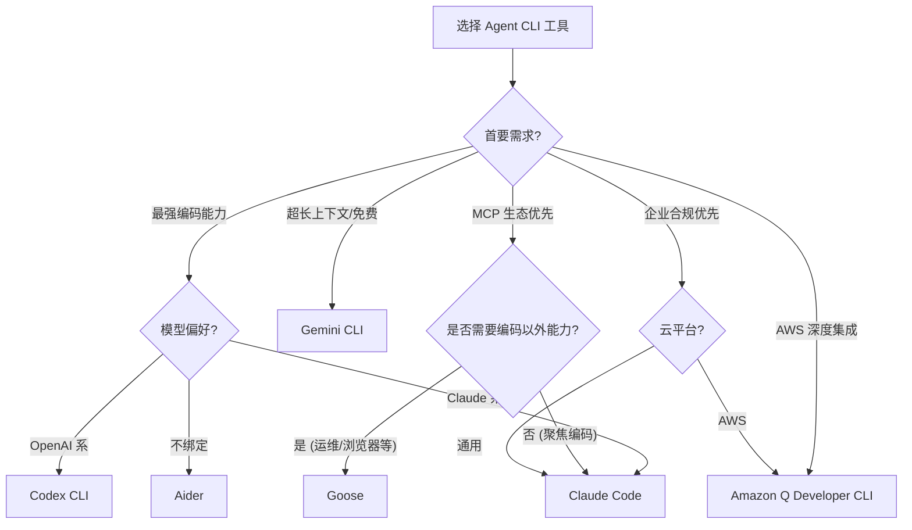

> **生产环境安全提示**
>
> 本文档包含可直接执行的运维命令。执行前请确认：当前目标集群与 Namespace 是否正确；是否具备足够的 RBAC 权限；是否已在非生产环境验证。命令风险等级标注：🔴 高风险（可能造成数据丢失或服务中断）、🟡 中风险（会修改集群状态，但通常可回滚）、🟢 低风险/只读（信息收集，无副作用）。


title: 主流 Agent CLI 工具全景对比
description: '**文档类型**: 选型对比专题 | **最后更新**: 2026-03 | **关键词**: Claude Code, Codex CLI,
  Aider, Goose, Amazon Q, Gemini CLI, Agent CLI 选型'
category: ai-agent
tags:
- ai
- agent
- llm
- rag
- multi-agent
last_updated: 2026-05
difficulty: advanced
reading_level: advanced
audience:
- AI 工程师
- 架构师
- SRE
estimated_read_time: 10min
intent_queries:
- 主流 Agent CLI 工具全景对比 是什么
- 如何 主流 Agent CLI 工具全景对比
trigger_keywords:
- 主流
- Agent
- CLI
- 工具全景对比
- ai
- agent
authors:
- name: KUDIG Team
  role: contributor
k8s_versions:
- '1.28'
- '1.29'
- '1.30'
- '1.31'
- '1.32'
---

# 主流 Agent CLI 工具全景对比

> **文档类型**: 选型对比专题 | **最后更新**: 2026-03 | **关键词**: Claude Code, Codex CLI, Aider, Goose, Amazon Q, Gemini CLI, Agent CLI 选型

---

## 概述

2025–2026 年，Agent CLI 工具经历了从"实验性玩具"到"核心开发基础设施"的快速进化。本文从**架构设计、模型支持、MCP 生态、交互体验、安全模型、企业特性、成本**七个维度，对当前主流 Agent CLI 工具进行深度对比，为团队选型提供决策依据。

> 本文所有信息基于 2026 年 Q1 各工具最新稳定版本。

---

## 1. 工具全景矩阵

### 1.1 核心工具概览

| 工具 | 开发商 | 开源 | 默认模型 | 多模型 | MCP 支持 | 首发时间 |
|------|--------|------|---------|--------|---------|---------|
| **Claude Code** | Anthropic | ✅ | Claude 4 Sonnet/Opus | ✅ | ✅ 原生 | 2025-02 |
| **Codex CLI** | OpenAI | ✅ | GPT-4.1 / o4-mini | ✅ | ✅ | 2025-04 |
| **Gemini CLI** | Google | ✅ | Gemini 2.5 Pro | ✅ | ✅ | 2025-06 |
| **Aider** | Paul Gauthier | ✅ | 多模型 (无默认) | ✅ | 🔧 社区 | 2023-06 |
| **Goose** | Block (Square) | ✅ | 多模型 | ✅ | ✅ 原生 | 2024-11 |
| **Amazon Q Developer CLI** | AWS | ❌ | Nova / Claude | ✅ | ✅ | 2024-04 |
| **GitHub Copilot CLI** | GitHub/Microsoft | ❌ | GPT-4o / Claude | ✅ | ✅ | 2025-05 |
| **Warp AI** | Warp | ❌ | 多模型 | ✅ | ❌ | 2024-03 |

### 1.2 能力雷达图（定性评估）

| 能力维度 | Claude Code | Codex CLI | Gemini CLI | Aider | Goose | Amazon Q |
|---------|:-----------:|:---------:|:----------:|:-----:|:-----:|:--------:|
| 代码生成质量 | ★★★★★ | ★★★★★ | ★★★★☆ | ★★★★☆ | ★★★☆☆ | ★★★★☆ |
| 多文件重构 | ★★★★★ | ★★★★☆ | ★★★★☆ | ★★★★★ | ★★★☆☆ | ★★★★☆ |
| MCP 生态 | ★★★★★ | ★★★★☆ | ★★★★☆ | ★★☆☆☆ | ★★★★★ | ★★★☆☆ |
| CI/CD 集成 | ★★★★★ | ★★★★★ | ★★★☆☆ | ★★★★☆ | ★★★☆☆ | ★★★★★ |
| 安全模型 | ★★★★★ | ★★★★★ | ★★★★☆ | ★★★☆☆ | ★★★☆☆ | ★★★★★ |
| 上下文能力 | ★★★★★ | ★★★★☆ | ★★★★★ | ★★★★☆ | ★★★☆☆ | ★★★★☆ |
| 成本效率 | ★★★☆☆ | ★★★★☆ | ★★★★★ | ★★★★★ | ★★★★★ | ★★★★☆ |

---

## 2. 深度对比分析

### 2.1 Claude Code

**核心优势**：
- 业界最强的 Agentic Coding 能力，SWE-bench 得分领先
- 原生 MCP 支持，生态最成熟
- 扩展记忆系统（CLAUDE.md 项目记忆 + 用户记忆）
- 精细的权限沙箱模型（macOS Seatbelt / Linux seccomp）
- 支持 Multi-turn 无头模式，CI/CD 深度集成

**架构特征**：
```
┌─────────────────────────────────────┐
│          Claude Code                │
│  ┌──────────┐  ┌────────────────┐  │
│  │ REPL     │  │ Tool System    │  │
│  │ Interface│  │ ┌────────────┐ │  │
│  │          │──│ │ Built-in   │ │  │
│  │ Terminal │  │ │ file/shell │ │  │
│  │ Rich UI  │  │ ├────────────┤ │  │
│  │          │  │ │ MCP Tools  │ │  │
│  └──────────┘  │ └────────────┘ │  │
│                └────────────────┘  │
│  ┌──────────────────────────────┐  │
│  │ Memory: CLAUDE.md + ~/.claude│  │
│  └──────────────────────────────┘  │
└─────────────────────────────────┘
```

**适用场景**：
- 大型项目多文件重构
- 需要 MCP 工具扩展的复杂场景
- 企业级 CI/CD 自动化

**定价模型（2026 Q1）**：
| 方案 | 价格 | Token 额度 |
|------|------|-----------|
| Pro | $20/月 | 包含基础用量 |
| Max 5x | $100/月 | 5 倍用量 |
| Max 20x | $200/月 | 20 倍用量 |
| API 按量 | 按 Token 计费 | 无上限 |

### 2.2 Codex CLI

**核心优势**：
- OpenAI 官方出品，与 GPT-4.1/o3/o4-mini 深度优化
- 全自动沙箱执行（每次任务在隔离网络环境中运行）
- 三级审批模式：suggest / auto-edit / full-auto
- 结构化 JSON 输出，CI/CD 友好

**架构特征**：
```
┌─────────────────────────────────────┐
│          Codex CLI                   │
│  ┌──────────┐  ┌────────────────┐  │
│  │ Sandbox  │  │ Approval Mode  │  │
│  │ (Network │  │ suggest        │  │
│  │  isolated│  │ auto-edit      │  │
│  │  per-task│  │ full-auto      │  │
│  │ )        │  │                │  │
│  └──────────┘  └────────────────┘  │
│  ┌──────────────────────────────┐  │
│  │ Instruction: AGENTS.md       │  │
│  └──────────────────────────────┘  │
└─────────────────────────────────┘
```

**适用场景**：
- 偏好 OpenAI 生态的团队
- 安全要求极高的企业环境（沙箱隔离）
- 需要推理能力（o3/o4-mini）的复杂问题

**定价模型**：
| 方案 | 价格 | 说明 |
|------|------|------|
| Pro | $20/月 | 包含 Codex CLI 使用额度 |
| Plus | $200/月 | 更高额度 |
| API 按量 | 按 Token | gpt-4.1 输入 $2/M, 输出 $8/M |

### 2.3 Gemini CLI

**核心优势**：
- 超长上下文窗口（1M tokens），大型代码库一次加载
- Google 搜索集成，实时获取最新文档和 API 参考
- 免费额度慷慨（Gemini 2.5 Pro 每分钟 60 请求）
- 原生多模态支持（截图分析、图片理解）

**适用场景**：
- 大型 monorepo 项目（需要超长上下文）
- 需要实时搜索最新信息的任务
- 预算敏感的团队和个人开发者

### 2.4 Aider

**核心优势**：
- 最早的 Agent CLI 工具之一，社区成熟
- 支持 20+ LLM 后端，不绑定任何供应商
- Git-native：每次变更自动 commit，带语义化 message
- 独创的 edit format 体系（whole / diff / udiff）
- 仓库地图（Repo Map）技术，高效利用上下文

**适用场景**：
- 多模型切换需求
- 偏好 Git-centric 工作流的团队
- 开源优先、避免供应商锁定

**定价模型**：免费开源（自付 LLM API 费用）

### 2.5 Goose

**核心优势**：
- Block (Square) 开源，100% MCP 原生架构
- 所有工具扩展通过 MCP Server 实现（含内置工具）
- 丰富的内置 Extension 生态（Jetbrains、K8s、GitHub 等）
- 支持会话记忆和自定义指令

**适用场景**：
- 需要深度 MCP 生态集成
- 多种开发工具协同（IDE + CLI + 浏览器）
- 通用终端自动化（不限于编码）

**定价模型**：免费开源（自付 LLM API 费用）

### 2.6 Amazon Q Developer CLI

**核心优势**：
- 与 AWS 服务深度集成（IAM、CloudFormation、CDK）
- 企业级 SSO 和权限管理
- 内置安全扫描和漏洞检测
- 自然语言生成 AWS CLI 命令

**适用场景**：
- 重度 AWS 用户
- 企业级合规要求
- 云基础设施自动化

---

## 3. 关键维度深度对比

### 3.1 编辑模式与代码变更表示

| 工具 | 编辑模式 | 变更格式 | 人工审查体验 |
|------|---------|---------|------------|
| **Claude Code** | Search-Replace blocks | 精确替换块 | ★★★★★ Diff 预览 + 确认 |
| **Codex CLI** | Patch/Diff | Unified diff | ★★★★☆ 沙箱内预览 |
| **Gemini CLI** | Inline edit | Diff view | ★★★★☆ 内置 diff |
| **Aider** | whole / diff / udiff | 多种格式可选 | ★★★★☆ Git diff 原生 |
| **Goose** | File write | 全文替换为主 | ★★★☆☆ 基础 diff |

### 3.2 上下文管理策略

| 工具 | 最大上下文 | 项目索引 | 记忆系统 | 指令文件 |
|------|-----------|---------|---------|---------|
| **Claude Code** | 200K | 自动索引 | CLAUDE.md + ~/.claude/memory | CLAUDE.md |
| **Codex CLI** | 200K | 沙箱内加载 | AGENTS.md | AGENTS.md |
| **Gemini CLI** | 1M | 全量加载 | GEMINI.md | GEMINI.md |
| **Aider** | 模型依赖 | Repo Map (tree-sitter) | .aider.conf.yml | .aider.conf.yml |
| **Goose** | 模型依赖 | MCP 工具 | 会话记忆 | .goosehints |

### 3.3 安全模型对比

| 工具 | 沙箱隔离 | 权限粒度 | 审批流 | 企业 SSO |
|------|---------|---------|--------|---------|
| **Claude Code** | macOS Seatbelt / seccomp | 工具级 allowedTools | 写操作确认 | ✅ |
| **Codex CLI** | 网络隔离容器 | 三级模式 | suggest/auto-edit/full-auto | ✅ |
| **Gemini CLI** | 基础沙箱 | 命令级 | 执行确认 | ✅ (Google Workspace) |
| **Aider** | 无内置沙箱 | 无 | 手动确认 | ❌ |
| **Goose** | 基础隔离 | MCP 权限 | 工具级 | ❌ |
| **Amazon Q** | AWS 安全模型 | IAM 策略 | 策略驱动 | ✅ (AWS SSO) |

### 3.4 CI/CD 集成能力

| 工具 | 无头模式 | GitHub Actions | GitLab CI | 结构化输出 |
|------|---------|---------------|-----------|-----------|
| **Claude Code** | ✅ `-p` flag | ✅ 官方 Action | ✅ | JSON stream |
| **Codex CLI** | ✅ `--quiet` | ✅ | ✅ | JSON |
| **Gemini CLI** | ✅ `-p` flag | ✅ | ✅ | Text/JSON |
| **Aider** | ✅ `--yes` | ✅ 社区 Action | ✅ | Text |
| **Goose** | ✅ `--headless` | 🔧 需配置 | 🔧 | Text |

---

## 4. 选型决策树



### 4.1 场景化推荐

| 场景 | 推荐工具 | 理由 |
|------|---------|------|
| **初创团队 / 全栈开发** | Aider + Claude API | 开源免费，模型灵活，Git-native |
| **大型企业 / 安全优先** | Claude Code (Max) 或 Codex CLI | 沙箱隔离，企业 SSO，审计日志 |
| **AWS 重度用户** | Amazon Q Developer CLI | AWS 原生集成，IAM 权限模型 |
| **大型 Monorepo** | Gemini CLI | 1M 上下文窗口 |
| **K8s 运维自动化** | Goose + K8s MCP Server | MCP 原生，工具扩展灵活 |
| **CI/CD 自动化** | Claude Code headless | 最成熟的无头模式和 GitHub Actions 支持 |
| **预算敏感** | Gemini CLI 或 Aider + DeepSeek | 免费额度慷慨 / 低成本 API |

---

## 5. 多工具协同策略

在实际生产中，团队往往不只使用单一工具。以下是推荐的组合策略：

### 5.1 推荐工具组合

```
┌─────────────────────────────────────────────────┐
│              开发者工作站                         │
│                                                 │
│  ┌─────────────┐    ┌─────────────────────┐     │
│  │ Claude Code │    │ IDE (Cursor/VS Code)│     │
│  │ (重型任务)   │    │ (轻量编辑)           │     │
│  │ 重构/架构    │    │ 补全/小改动          │     │
│  └──────┬──────┘    └──────────┬──────────┘     │
│         │                      │                │
│         ▼                      ▼                │
│  ┌──────────────────────────────────────┐       │
│  │          Git Repository               │       │
│  └──────────────────────────────────────┘       │
│         │                                       │
│         ▼                                       │
│  ┌──────────────────────────────────────┐       │
│  │   CI/CD (Claude Code Headless)       │       │
│  │   自动 Code Review / 测试生成 / 修复   │       │
│  └──────────────────────────────────────┘       │
└─────────────────────────────────────────────────┘
```

### 5.2 MCP Server 共享

不同 Agent CLI 工具可以共享同一套 MCP Server，形成统一的工具层：

```bash
# 统一的 MCP 配置 (mcp.json)
{
  "mcpServers": {
    "kubernetes": {
      "command": "mcp-server-kubernetes",
      "args": ["--context", "production"]
    },
    "github": {
      "command": "mcp-server-github",
      "env": { "GITHUB_TOKEN": "${GITHUB_TOKEN}" }
    },
    "postgres": {
      "url": "https://mcp.internal.company.com/postgres",
      "transport": "streamable-http"
    }
  }
}
```

---

## 6. 性能与成本基准测试

### 6.1 典型任务耗时对比（参考值）

| 任务 | Claude Code | Codex CLI | Gemini CLI | Aider |
|------|:-----------:|:---------:|:----------:|:-----:|
| 单函数生成（50行） | ~8s | ~10s | ~6s | ~12s |
| 多文件重构（5文件） | ~45s | ~60s | ~40s | ~90s |
| 测试套件生成（10文件） | ~120s | ~150s | ~100s | ~180s |
| Bug 诊断 + 修复 | ~60s | ~80s | ~50s | ~120s |

> 注：以上为参考值，实际耗时受模型选择、网络延迟、项目规模等因素影响。

### 6.2 月度成本估算（中型团队 10 人）

| 工具 | 订阅费 | API 费用（估算） | 月度总计 |
|------|--------|----------------|---------|
| Claude Code Max 5x | $1,000 (10人) | - | ~$1,000 |
| Codex CLI Pro | $200 (10人) | ~$500 | ~$700 |
| Gemini CLI | $0 | ~$200 (超出免费额度) | ~$200 |
| Aider + Claude API | $0 | ~$800 | ~$800 |
| Goose + GPT-4o | $0 | ~$600 | ~$600 |

---

## 7. 迁移与共存指南

### 7.1 从 IDE Agent 迁移到 Agent CLI

| 迁移步骤 | 操作 | 注意事项 |
|---------|------|---------|
| 1. 环境准备 | 安装 Agent CLI + 配置 API Key | 确保终端环境变量正确 |
| 2. 项目配置 | 创建项目指令文件 (CLAUDE.md 等) | 迁移 IDE 中的自定义规则 |
| 3. MCP 配置 | 配置常用 MCP Server | 复用 IDE 中已有的 MCP 配置 |
| 4. 工作流适配 | 从 GUI 操作转为命令行指令 | 建立常用命令别名和脚本 |
| 5. 团队推广 | 制定团队使用规范 | 统一指令文件和 MCP 配置 |

### 7.2 指令文件对照表

| Claude Code | Codex CLI | Aider | Goose | 用途 |
|------------|-----------|-------|-------|------|
| CLAUDE.md | AGENTS.md | .aider.conf.yml | .goosehints | 项目级指令 |
| ~/.claude/CLAUDE.md | ~/.codex/instructions.md | ~/.aider.conf.yml | ~/.config/goose/ | 用户级偏好 |
| .claude/settings.json | - | - | - | 权限配置 |
| claude_mcp_config.json | - | - | - | MCP 配置 |

---

## 8. 小结

**核心选型建议**：

1. **追求最佳编码体验** → Claude Code 或 Codex CLI
2. **预算敏感 + 灵活性** → Gemini CLI 或 Aider
3. **工具扩展 + 运维场景** → Goose（MCP 原生）
4. **AWS 绑定** → Amazon Q Developer CLI
5. **多工具协同** → Claude Code (主力) + Gemini CLI (辅助) + 共享 MCP Server

Agent CLI 工具仍在快速迭代中，建议每季度重新评估一次选型。

**后续阅读**：
- [23 - Agent CLI 基础概念与架构](./23-agent-cli-fundamentals.md)：理解底层架构
- [25 - Agent CLI 与 MCP 协议深度集成](./25-agent-cli-mcp-integration.md)：MCP 实战
- [26 - Agent CLI 开发工作流最佳实践](./26-agent-cli-development-workflow.md)：日常使用指南
- [03 - 主流 Agent 框架对比](./03-agent-frameworks-comparison.md)：SDK/框架层对比

---

*本文档为 kudig-database 项目原创内容，基于 2026 年 Q1 各工具最新版本。*

---

## Obsidian 相关文档

- 02-ai-agents MOC
- [[domain-14-ai-ml-infra/02-ai-agents/README.md|AI Agent 工程专题]]
- [[domain-14-ai-ml-infra/02-ai-agents/01-ai-agent-fundamentals.md|AI Agent 基础与核心架构]]
- [[domain-14-ai-ml-infra/02-ai-agents/02-llm-foundation-models.md|LLM 基座模型选型与评估]]
- [[domain-14-ai-ml-infra/02-ai-agents/03-agent-frameworks-comparison.md|主流 Agent 框架深度对比]]
- [[domain-14-ai-ml-infra/02-ai-agents/04-rag-knowledge-retrieval.md|RAG 检索增强生成深度指南]]
- [[domain-14-ai-ml-infra/02-ai-agents/05-tool-use-function-calling.md|Tool Use & Function Calling 设计规范]]
- [[domain-14-ai-ml-infra/02-ai-agents/06-multi-agent-orchestration.md|多 Agent 编排与协作架构]]
- [[domain-14-ai-ml-infra/02-ai-agents/07-memory-context-management.md|记忆管理与上下文窗口工程]]
- [[domain-14-ai-ml-infra/02-ai-agents/08-agent-evaluation-observability.md|Agent 评测体系与可观测性]]
- [[domain-14-ai-ml-infra/02-ai-agents/09-production-deployment-guide.md|生产部署指南：K8s 上运行 Agent 服务]]
- [[domain-14-ai-ml-infra/02-ai-agents/10-security-guardrails.md|安全护栏、提示注入防护与合规]]

## See Also

- 22-agentscope-production-deployment
- 23-agent-cli-fundamentals
- 25-agent-cli-mcp-integration
- 26-agent-cli-development-workflow


<!-- risk-assessed -->
