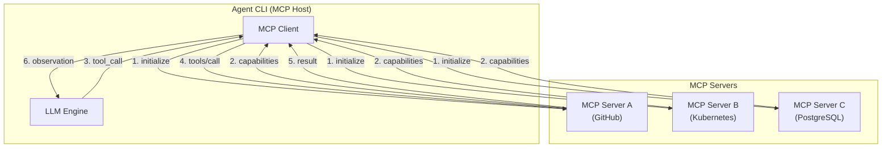

> **生产环境安全提示**
>
> 本文档包含可直接执行的运维命令。执行前请确认：当前目标集群与 Namespace 是否正确；是否具备足够的 RBAC 权限；是否已在非生产环境验证。命令风险等级标注：🔴 高风险（可能造成数据丢失或服务中断）、🟡 中风险（会修改集群状态，但通常可回滚）、🟢 低风险/只读（信息收集，无副作用）。


title: Agent CLI 与 MCP 协议深度集成
description: '# Agent CLI 与 MCP 协议深度集成'
category: ai-agent
tags:
- ai
- agent
- llm
- rag
- multi-agent
- postgresql
- gateway
- rbac
last_updated: 2026-05
difficulty: advanced
reading_level: advanced
audience:
- AI 工程师
- 架构师
- SRE
estimated_read_time: 5min
intent_queries:
- Agent CLI 与 MCP 协议深度集成 是什么
- 如何 Agent CLI 与 MCP 协议深度集成
trigger_keywords:
- Agent
- CLI
- MCP
- 协议深度集成
- ai
- agent
authors:
- name: KUDIG Team
  role: contributor
k8s_versions:
- '1.28'
- '1.29'
- '1.30'
- '1.31'
- '1.32'
---

# Agent CLI 与 MCP 协议深度集成

> **文档类型**: 工程实践专题 | **最后更新**: 2026-03 | **关键词**: MCP, Model Context Protocol, MCP Server, MCP Client, Tool Registry, Remote MCP, OAuth 2.1

---

<!-- chunk: 概述 -->## 概述

**MCP（Model Context Protocol）** 是 Anthropic 于 2024 年 11 月开源、2025–2026 年迅速成为行业标准的 Agent 工具扩展协议。它为 Agent CLI 提供了一个**标准化的工具发现、注册和调用机制**，使 Agent 的能力可以通过"安装 MCP Server"的方式无限扩展——如同为 Agent 安装 App。

本文深入剖析 MCP 协议的架构设计，并以 Agent CLI 为上下文，详解 MCP Server 的开发、配置、安全加固和生产部署最佳实践。

---

<!-- chunk: 1. MCP 协议架构 -->## 1. MCP 协议架构

## 1.1 协议分层

```
┌──────────────────────────────────────────────┐
│              MCP Protocol Stack               │
│                                              │
│  ┌────────────────────────────────────────┐  │
│  │       Capability Layer (能力层)         │  │
│  │  Tools │ Resources │ Prompts │ Sampling │  │
│  ├────────────────────────────────────────┤  │
│  │       Message Layer (消息层)            │  │
│  │  JSON-RPC 2.0 Request / Response       │  │
│  │  Notification (单向通知)                │  │
│  ├────────────────────────────────────────┤  │
│  │       Transport Layer (传输层)          │  │
│  │  stdio │ SSE │ Streamable HTTP         │  │
│  └────────────────────────────────────────┘  │
└──────────────────────────────────────────────┘
```

## 1.2 核心概念

| 概念 | 定义 | 类比 |
|------|------|------|
| **MCP Host** | 发起连接的应用程序（如 Claude Code） | 浏览器 |
| **MCP Client** | Host 内管理与 Server 连接的组件 | HTTP Client |
| **MCP Server** | 暴露工具/资源的服务端程序 | Web Server / API |
| **Tools** | Server 暴露的可调用函数 | REST API Endpoint |
| **Resources** | Server 暴露的只读数据源 | 文件系统 / 数据库视图 |
| **Prompts** | Server 提供的提示词模板 | API 文档模板 |
| **Sampling** | Server 请求 Host 的 LLM 进行推理 | 反向调用 |

## 1.3 通信流程



---

<!-- chunk: 2. 传输方式详解 -->## 2. 传输方式详解

## 2.1 三种传输方式对比

| 传输方式 | 协议 | 场景 | 优势 | 限制 |
|---------|------|------|------|------|
| **stdio** | 标准输入/输出 | 本地进程 | 零网络延迟，最简配置 | 仅限本地 |
| **SSE** | HTTP + Server-Sent Events | 远程服务 | 兼容性好 | 单向流，需轮询 |
| **Streamable HTTP** | HTTP POST + SSE | 远程服务（推荐） | 双向流，支持无状态 | 较新，部分工具待支持 |

## 2.2 stdio 传输（本地 MCP Server）

最常用的本地集成方式，Agent CLI 通过 spawn 子进程启动 MCP Server：

```json
{
  "mcpServers": {
    "filesystem": {
      "command": "npx",
      "args": ["-y", "@modelcontextprotocol/server-filesystem", "/path/to/workspace"],
      "env": {}
    }
  }
}
```

**生命周期**：
1. Agent CLI 启动时 spawn MCP Server 子进程
2. 通过 stdin/stdout 进行 JSON-RPC 通信
3. Agent CLI 退出时终止子进程

## 2.3 Streamable HTTP（远程 MCP Server）

适用于团队共享、集中管理的 MCP Server：

```json
{
  "mcpServers": {
    "enterprise-k8s": {
      "url": "https://mcp.internal.company.com/kubernetes",
      "transport": "streamable-http",
      "headers": {
        "Authorization": "Bearer ${MCP_TOKEN}"
      }
    }
  }
}
```

**认证流程（OAuth 2.1）**：
```
Agent CLI ──▶ MCP Server: GET /mcp (无认证)
MCP Server ──▶ Agent CLI: 401 + WWW-Authenticate header
Agent CLI ──▶ OAuth Provider: Authorization Request
OAuth Provider ──▶ Agent CLI: Access Token
Agent CLI ──▶ MCP Server: GET /mcp (Bearer Token)
MCP Server ──▶ Agent CLI: 200 OK, 建立连接
```

---

<!-- chunk: 3. MCP Server 开发实战 -->## 3. MCP Server 开发实战

## 3.1 TypeScript MCP Server 开发

以开发一个 **Kubernetes Pod 管理 MCP Server** 为例：

```typescript
import { McpServer } from "@modelcontextprotocol/sdk/server/mcp.js";
import { StdioServerTransport } from "@modelcontextprotocol/sdk/server/stdio.js";
import { z } from "zod";
import * as k8s from "@kubernetes/client-node";

const server = new McpServer({
  name: "kubernetes-pod-manager",
  version: "1.0.0",
  capabilities: { tools: {} }
});

// 工具 1: 列出 Pod
server.tool(
  "list-pods",
  "列出指定命名空间的 Pod 列表及状态",
  {
    namespace: z.string().default("default").describe("Kubernetes 命名空间"),
    labelSelector: z.string().optional().describe("标签选择器, 如 app=nginx")
  },
  async ({ namespace, labelSelector }) => {
    const kc = new k8s.KubeConfig();
    kc.loadFromDefault();
    const k8sApi = kc.makeApiClient(k8s.CoreV1Api);
    
    const res = await k8sApi.listNamespacedPod(
      namespace, undefined, undefined, undefined,
      undefined, labelSelector
    );
    
    const pods = res.body.items.map(pod => ({
      name: pod.metadata?.name,
      status: pod.status?.phase,
      restarts: pod.status?.containerStatuses?.[0]?.restartCount ?? 0,
      node: pod.spec?.nodeName,
      age: pod.metadata?.creationTimestamp
    }));

    return {
      content: [{
        type: "text",
        text: JSON.stringify(pods, null, 2)
      }]
    };
  }
);

// 工具 2: 获取 Pod 日志
server.tool(
  "get-pod-logs",
  "获取指定 Pod 的日志",
  {
    name: z.string().describe("Pod 名称"),
    namespace: z.string().default("default"),
    tailLines: z.number().default(100).describe("返回最近 N 行日志"),
    container: z.string().optional().describe("容器名称(多容器 Pod)")
  },
  async ({ name, namespace, tailLines, container }) => {
    const kc = new k8s.KubeConfig();
    kc.loadFromDefault();
    const k8sApi = kc.makeApiClient(k8s.CoreV1Api);
    
    const res = await k8sApi.readNamespacedPodLog(
      name, namespace, container,
      undefined, undefined, undefined,
      undefined, undefined, tailLines
    );

    return {
      content: [{ type: "text", text: res.body }]
    };
  }
);

// 启动 Server
const transport = new StdioServerTransport();
await server.connect(transport);
```

## 3.2 Python MCP Server 开发

```python
from mcp.server.fastmcp import FastMCP
import subprocess
import json

mcp = FastMCP("kubectl-helper")

@mcp.tool()
def kubectl_get(resource: str, namespace: str = "default", output: str = "json") -> str:
    """执行 kubectl get 命令获取 Kubernetes 资源信息
    
    Args:
        resource: 资源类型 (pods, deployments, services 等)
        namespace: 命名空间
        output: 输出格式 (json/yaml/wide)
    """
    cmd = ["kubectl", "get", resource, "-n", namespace, "-o", output]
    result = subprocess.run(cmd, capture_output=True, text=True, timeout=30)
    
    if result.returncode != 0:
        return f"Error: {result.stderr}"
    return result.stdout

@mcp.tool()
def kubectl_describe(resource: str, name: str, namespace: str = "default") -> str:
    """执行 kubectl describe 获取资源详细信息
    
    Args:
        resource: 资源类型
        name: 资源名称
        namespace: 命名空间
    """
    cmd = ["kubectl", "describe", resource, name, "-n", namespace]
    result = subprocess.run(cmd, capture_output=True, text=True, timeout=30)
    
    if result.returncode != 0:
        return f"Error: {result.stderr}"
    return result.stdout

@mcp.resource("uri://k8s/contexts")
def get_k8s_contexts() -> str:
    """获取可用的 Kubernetes 上下文列表"""
    result = subprocess.run(
        ["kubectl", "config", "get-contexts", "-o", "name"],
        capture_output=True, text=True
    )
    return result.stdout

if __name__ == "__main__":
    mcp.run(transport="stdio")
```

## 3.3 MCP Server 最佳实践

| 实践 | 说明 | 示例 |
|------|------|------|
| **工具描述清晰** | 使用自然语言描述工具用途、参数含义 | "列出指定命名空间的 Pod 列表及状态" |
| **参数校验严格** | 使用 Zod / Pydantic 定义参数 schema | `z.string().min(1).describe(...)` |
| **错误处理完善** | 返回结构化错误信息 | `{ isError: true, content: [...] }` |
| **超时控制** | 为外部调用设置超时 | `timeout=30` |
| **幂等设计** | 工具调用应尽量幂等 | GET 操作天然幂等，写操作需防重 |
| **最小权限** | MCP Server 仅暴露必要能力 | K8s Server 不暴露 delete 操作 |
| **日志记录** | 记录工具调用日志 | 审计追踪 |

---

<!-- chunk: 4. Agent CLI 中的 MCP 配置 -->## 4. Agent CLI 中的 MCP 配置

## 4.1 各工具配置方式

**Claude Code**：
```bash
# 添加 MCP Server
claude mcp add kubernetes-manager \
  -s user \
  -- npx -y mcp-server-kubernetes

# 查看已配置的 MCP Server
claude mcp list

# 配置文件位置
# 项目级: .claude/mcp.json
# 用户级: ~/.claude/mcp.json
```

**Codex CLI**：
```bash
# 配置文件: ~/.codex/mcp.json
{
  "mcpServers": {
    "kubernetes": {
      "command": "npx",
      "args": ["-y", "mcp-server-kubernetes"]
    }
  }
}
```

**Goose**：
```yaml
# ~/.config/goose/config.yaml
extensions:
  kubernetes:
    type: stdio
    command: npx
    args: ["-y", "mcp-server-kubernetes"]
    enabled: true
    
  github:
    type: stdio
    command: mcp-server-github
    env:
      GITHUB_TOKEN: "${GITHUB_TOKEN}"
    enabled: true
```

## 4.2 MCP Server 发现与安装

**2026 年主流 MCP Server 注册表**：

| 注册表 | URL | 数量 | 特点 |
|--------|-----|------|------|
| **MCP Registry (官方)** | registry.modelcontextprotocol.io | 3,000+ | Anthropic 官方维护 |
| **Smithery** | smithery.ai | 5,000+ | 社区最大 |
| **Composio** | composio.dev | 2,000+ | 企业级集成 |
| **Glama** | glama.ai/mcp | 1,500+ | 精选高质量 |
| **npm / PyPI** | npmjs.com / pypi.org | 分散 | 包管理器安装 |

**常用 MCP Server 推荐**：

| MCP Server | 功能 | 安装命令 |
|-----------|------|---------|
| **@modelcontextprotocol/server-filesystem** | 文件系统操作 | `npx -y @modelcontextprotocol/server-filesystem` |
| **@modelcontextprotocol/server-github** | GitHub API 操作 | `npx -y @modelcontextprotocol/server-github` |
| **mcp-server-kubernetes** | Kubernetes 管理 | `npx -y mcp-server-kubernetes` |
| **@modelcontextprotocol/server-postgres** | PostgreSQL 查询 | `npx -y @modelcontextprotocol/server-postgres` |
| **mcp-server-fetch** | HTTP 请求 | `npx -y @modelcontextprotocol/server-fetch` |
| **mcp-server-playwright** | 浏览器自动化 | `npx -y @anthropic/mcp-server-playwright` |
| **mcp-server-memory** | 持久化记忆 | `npx -y @modelcontextprotocol/server-memory` |

---

<!-- chunk: 5. 企业级 MCP 架构 -->## 5. 企业级 MCP 架构

## 5.1 远程 MCP Server 网关

企业环境中推荐通过 **MCP Gateway** 集中管理 MCP Server：

```
┌──────────────────────────────────────────────────────┐
│                  企业 MCP 架构                        │
│                                                      │
│  ┌─────────┐  ┌─────────┐  ┌─────────┐              │
│  │开发者 A  │  │开发者 B  │  │ CI/CD   │              │
│  │Claude   │  │Codex    │  │Pipeline │              │
│  │Code     │  │CLI      │  │         │              │
│  └────┬────┘  └────┬────┘  └────┬────┘              │
│       │            │            │                    │
│       ▼            ▼            ▼                    │
│  ┌──────────────────────────────────────┐            │
│  │         MCP Gateway (集中网关)        │            │
│  │  ┌──────────────────────────────┐    │            │
│  │  │ OAuth 2.1 │ Rate Limit │ Audit│   │            │
│  │  └──────────────────────────────┘    │            │
│  └──┬──────────┬──────────┬─────────┘   │            │
│     │          │          │                          │
│     ▼          ▼          ▼                          │
│  ┌──────┐  ┌──────┐  ┌──────┐                       │
│  │K8s   │  │GitHub│  │ DB   │                       │
│  │Server│  │Server│  │Server│                       │
│  └──────┘  └──────┘  └──────┘                       │
└──────────────────────────────────────────────────────┘
```

## 5.2 安全加固清单

| 安全措施 | 实施方式 | 优先级 |
|---------|---------|--------|
| **认证** | OAuth 2.1 + 企业 SSO | P0 |
| **授权** | 基于角色的工具访问控制 (RBAC) | P0 |
| **传输加密** | TLS 1.3 (远程 MCP) | P0 |
| **输入校验** | Server 端严格参数校验 | P0 |
| **速率限制** | 每用户/每工具速率限制 | P1 |
| **审计日志** | 记录所有工具调用及参数 | P1 |
| **网络隔离** | MCP Server 运行在隔离网络 | P1 |
| **凭据管理** | 使用 Vault/KMS 管理 Server 凭据 | P1 |
| **DLP** | 防止敏感数据通过工具泄露 | P2 |

## 5.3 高可用部署

```yaml
# K8s 部署 MCP Gateway
apiVersion: apps/v1
kind: Deployment
metadata:
  name: mcp-gateway
  namespace: ai-platform
spec:
  replicas: 3
  selector:
    matchLabels:
      app: mcp-gateway
  template:
    metadata:
      labels:
        app: mcp-gateway
    spec:
      containers:
      - name: gateway
        image: company/mcp-gateway:v1.2.0
        ports:
        - containerPort: 8080
        env:
        - name: OAUTH_ISSUER
          value: "https://sso.company.com"
        - name: BACKEND_K8S_URL
          value: "http://mcp-k8s-server:8080"
        - name: BACKEND_GITHUB_URL
          value: "http://mcp-github-server:8080"
        resources:
          requests:
            cpu: 100m
            memory: 256Mi
          limits:
            cpu: 500m
            memory: 512Mi
        livenessProbe:
          httpGet:
            path: /healthz
            port: 8080
---
apiVersion: v1
kind: Service
metadata:
  name: mcp-gateway
spec:
  selector:
    app: mcp-gateway
  ports:
  - port: 443
    targetPort: 8080
  type: ClusterIP
```

---

<!-- chunk: 6. MCP 调试与可观测性 -->## 6. MCP 调试与可观测性

## 6.1 MCP Inspector

MCP 官方提供的调试工具：

```bash
# 启动 MCP Inspector
npx @modelcontextprotocol/inspector

# 连接到 MCP Server 进行测试
# Inspector 会启动 Web UI，可以：
# - 列出所有可用工具
# - 手动调用工具并查看结果
# - 检查 JSON-RPC 消息流
```

## 6.2 日志与追踪

```bash
# Claude Code MCP 调试日志
claude --mcp-debug

# 日志位置
# macOS: ~/Library/Logs/Claude/mcp*.log
# Linux: ~/.local/share/claude/logs/mcp*.log

# 查看 MCP 通信日志
tail -f ~/Library/Logs/Claude/mcp-server-kubernetes.log
```

## 6.3 常见问题排查

| 问题 | 症状 | 排查步骤 |
|------|------|---------|
| Server 启动失败 | 工具列表为空 | 1. 检查命令是否可执行 2. 查看 stderr 日志 |
| 工具调用超时 | Agent 等待无响应 | 1. Server 端增加超时日志 2. 检查网络连通性 |
| 认证失败 | 401/403 错误 | 1. 检查 Token 有效性 2. 验证 OAuth 配置 |
| 参数不匹配 | Invalid params 错误 | 1. 检查 schema 定义 2. 对比请求参数 |
| 内存泄漏 | Server 进程内存增长 | 1. 检查连接池 2. 确认资源释放 |

---

<!-- chunk: 7. 小结与导航 -->## 7. 小结与导航

MCP 协议为 Agent CLI 提供了一个**可扩展、安全、标准化**的工具集成框架。掌握 MCP 的开发与部署，是释放 Agent CLI 全部潜力的关键。

**核心要点**：
1. MCP 遵循 Client-Server 架构，基于 JSON-RPC 2.0
2. 三种传输方式：stdio（本地）、SSE（远程兼容）、Streamable HTTP（远程推荐）
3. 企业环境推荐 MCP Gateway 模式集中管理
4. 安全是重中之重：认证、授权、审计、加密缺一不可

**后续阅读**：
- [23 - Agent CLI 基础概念与架构](./23-agent-cli-fundamentals.md)：Agent CLI 底层架构
- [26 - Agent CLI 开发工作流最佳实践](./26-agent-cli-development-workflow.md)：日常开发实战
- [18 - AgentScope 工具系统与 MCP 集成](./18-agentscope-tool-system.md)：AgentScope 中的 MCP
- [05 - Tool Use & Function Calling](./05-tool-use-function-calling.md)：通用工具调用设计

---

*本文档为 kudig-database 项目原创内容，基于 MCP 协议 2025-11-05 规范及 2026 Q1 生态。*

---

<!-- chunk: Obsidian 相关文档 -->## Obsidian 相关文档

- 02-ai-agents KUDIG Database — Global MOC
- [[domain-14-ai-ml-infra/02-ai-agents/README.md|AI Agent 工程专题]]
- [[domain-14-ai-ml-infra/02-ai-agents/01-ai-agent-fundamentals.md|AI Agent 基础与核心架构]]
- [[domain-14-ai-ml-infra/02-ai-agents/02-llm-foundation-models.md|LLM 基座模型选型与评估]]
- [[domain-14-ai-ml-infra/02-ai-agents/03-agent-frameworks-comparison.md|主流 Agent 框架深度对比]]
- [[domain-14-ai-ml-infra/02-ai-agents/04-rag-knowledge-retrieval.md|RAG 检索增强生成深度指南]]
- [[domain-14-ai-ml-infra/02-ai-agents/05-tool-use-function-calling.md|Tool Use & Function Calling 设计规范]]
- [[domain-14-ai-ml-infra/02-ai-agents/06-multi-agent-orchestration.md|多 Agent 编排与协作架构]]
- [[domain-14-ai-ml-infra/02-ai-agents/07-memory-context-management.md|记忆管理与上下文窗口工程]]
- [[domain-14-ai-ml-infra/02-ai-agents/08-agent-evaluation-observability.md|Agent 评测体系与可观测性]]
- [[domain-14-ai-ml-infra/02-ai-agents/09-production-deployment-guide.md|生产部署指南：K8s 上运行 Agent 服务]]
- [[domain-14-ai-ml-infra/02-ai-agents/10-security-guardrails.md|安全护栏、提示注入防护与合规]]

## See Also

- 23-agent-cli-fundamentals
- 24-agent-cli-tools-comparison
- 26-agent-cli-development-workflow
- 27-agent-cli-security-governance


<!-- risk-assessed -->
