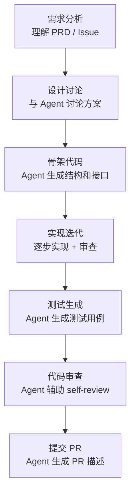

> **生产环境安全提示**
>
> 本文档包含可直接执行的运维命令。执行前请确认：当前目标集群与 Namespace 是否正确；是否具备足够的 RBAC 权限；是否已在非生产环境验证。命令风险等级标注：🔴 高风险（可能造成数据丢失或服务中断）、🟡 中风险（会修改集群状态，但通常可回滚）、🟢 低风险/只读（信息收集，无副作用）。


title: Agent CLI 开发工作流与最佳实践
description: '# Agent CLI 开发工作流与最佳实践'
category: ai-agent
tags:
- ai
- agent
- llm
- rag
- multi-agent
- [[ArgoCD|argocd]]
- hpa
- gateway
- rbac
last_updated: 2026-05
difficulty: advanced
reading_level: advanced
audience:
- AI 工程师
- 架构师
- SRE
estimated_read_time: 5min
intent_queries:
- Agent CLI 开发工作流与最佳实践 是什么
- 如何 Agent CLI 开发工作流与最佳实践
trigger_keywords:
- Agent
- CLI
- 开发工作流与最佳实践
- ai
- agent
authors:
- name: KUDIG Team
  role: contributor
k8s_versions:
- '1.28'
- '1.29'
- '1.30'
- '1.31'
- '1.32'
---

# Agent CLI 开发工作流与最佳实践

> **文档类型**: 工程实践专题 | **最后更新**: 2026-03 | **关键词**: Agent CLI Workflow, Prompt Engineering, Custom Instructions, Context Management, Git Integration, 开发最佳实践

---

<!-- chunk: 概述 -->## 概述

掌握 Agent CLI 的工具功能只是起点，真正的生产力提升来自于**将 Agent CLI 融入日常开发工作流**。本文基于大量真实项目经验，系统总结 Agent CLI 在编码、调试、测试、代码审查、文档编写等典型场景下的最佳实践，帮助开发者从"偶尔使用"进化为"深度融合"。

---

<!-- chunk: 1. 项目配置与自定义指令 -->## 1. 项目配置与自定义指令

## 1.1 项目指令文件（Custom Instructions）

项目指令文件是 Agent CLI 生产力的**最大杠杆点**——它将团队约定、架构决策和代码规范"灌输"给 Agent，避免重复解释。

**指令文件命名约定**：

| Agent CLI | 文件名 | 位置 | 作用 |
|-----------|--------|------|------|
| Claude Code | `CLAUDE.md` | 项目根目录 | 项目级指令 |
| Claude Code | `CLAUDE.md` | 子目录 | 目录级指令（自动追加） |
| Claude Code | `~/.claude/CLAUDE.md` | 用户目录 | 全局个人偏好 |
| Codex CLI | `AGENTS.md` | 项目根目录 | 项目级指令 |
| Aider | `.aider.conf.yml` | 项目根目录 | 项目配置 |
| Goose | `.goosehints` | 项目根目录 | 项目提示 |

## 1.2 高效指令文件模板

以下是一个经过生产验证的 CLAUDE.md 模板：

```markdown
# 项目指令

<!-- chunk: 项目概述 -->## 项目概述
- 项目名称: kudig-api-server
- 语言: Go 1.22 + TypeScript 5.4
- 架构: 微服务 (gRPC + REST Gateway)
- 部署: Kubernetes (ACK) + ArgoCD

<!-- chunk: 代码规范 -->## 代码规范
- Go: 遵循 Effective Go + uber-go/guide
- TypeScript: ESLint + Prettier, 严格模式
- 提交信息: Conventional Commits (feat/fix/chore/docs)
- 分支策略: trunk-based development

<!-- chunk: 架构约定 -->## 架构约定
- API 层 → Service 层 → Repository 层, 禁止跨层调用
- 错误处理: 使用自定义 error codes, 不暴露内部错误
- 配置: 通过环境变量注入, 不硬编码

<!-- chunk: 测试要求 -->## 测试要求
- 单元测试覆盖率 > 80%
- 使用 table-driven tests (Go)
- Mock 外部依赖, 不访问真实数据库

<!-- chunk: 构建与运行 -->## 构建与运行
- `make build` — 构建
- `make test` — 测试
- `make lint` — 代码检查
- `make dev` — 本地开发环境
```

## 1.3 指令文件分层策略

```
# 🟢 低风险：只读/信息收集，通常无副作用
项目根目录/
├── CLAUDE.md                    # 全局规范 (架构/代码风格)
├── src/
│   ├── CLAUDE.md                # src 目录级补充 (前端特定规范)
│   ├── api/
│   │   └── CLAUDE.md            # API 层特定规范 (REST 约定)
│   └── services/
│       └── CLAUDE.md            # Service 层规范 (事务/错误处理)
└── infrastructure/
    └── CLAUDE.md                # 基础设施规范 (Terraform/K8s)
```
**加载规则**（Claude Code）：
- Agent 在某目录工作时，自动加载该目录到根目录路径上的所有 CLAUDE.md
- 子目录 CLAUDE.md 内容追加到父级之后
- 冲突时以最近的（更具体的）为准

---

<!-- chunk: 2. 典型开发场景工作流 -->## 2. 典型开发场景工作流

## 2.1 新功能开发



**实战示例**：

```bash
# Step 1: 需求分析
> 阅读 docs/PRD-user-auth.md, 总结核心需求和技术要点

# Step 2: 方案讨论
> 我们需要实现 OAuth2.0 + JWT 的认证模块,
> 请给出 3 种方案并对比优劣, 考虑:
> 1. Token 刷新策略
> 2. 多端登录控制
> 3. 与现有 RBAC 系统的集成

# Step 3: 生成骨架代码
> 按方案 B 实现, 先生成目录结构和接口定义,
> 不要写具体实现

# Step 4: 逐步实现
> 现在实现 TokenService, 包含:
> - GenerateAccessToken
> - GenerateRefreshToken
> - ValidateToken
> - RevokeToken

# Step 5: 生成测试
> 为 TokenService 生成 table-driven 测试,
> 覆盖: 正常流程、Token 过期、无效签名、已撤销 Token
```

## 2.2 Bug 修复

**高效 Bug 修复工作流**：

```bash
# 提供上下文
> 用户反馈: 当并发创建订单时偶尔出现库存超卖
> 相关错误日志:
> [ERROR] stock_service.go:142 optimistic lock failed: version mismatch
> 
> 请分析根因并给出修复方案

# Agent 会自动:
# 1. 搜索相关代码文件
# 2. 分析并发控制逻辑
# 3. 定位根因
# 4. 提出修复方案
# 5. 实施修改
# 6. 生成回归测试
```

**Bug 修复 Prompt 模板**：

```
Bug 信息:
- 复现步骤: [步骤描述]
- 期望行为: [期望结果]
- 实际行为: [实际结果]
- 错误日志: [日志片段]
- 影响范围: [P0/P1/P2]

请:
1. 分析可能的根因 (列出 Top 3 可能)
2. 定位具体代码位置
3. 提出修复方案
4. 实施最小化修复
5. 添加回归测试用例
```

## 2.3 代码重构

```bash
# 大范围重构指令示例
> 将 src/services/ 下所有直接数据库调用迁移到 Repository 模式:
> 1. 为每个 Service 创建对应的 Repository 接口
> 2. 提取数据库操作到 Repository 实现
> 3. Service 通过接口依赖 Repository
> 4. 更新所有测试, Mock Repository 接口
> 
> 要求:
> - 每次只重构一个 Service, 确认无误后继续下一个
> - 保持向后兼容
> - 每个 Service 重构后运行测试确认
```

## 2.4 代码审查辅助

```bash
# 审查 Git diff
> 审查当前分支相对于 main 的所有变更:
> git diff main...HEAD
> 
> 重点关注:
> 1. 安全漏洞 (SQL 注入、XSS、认证绕过)
> 2. 性能问题 (N+1 查询、内存泄漏)
> 3. 错误处理缺失
> 4. 测试覆盖缺口

# 审查特定 PR
> 审查 PR #142 的变更,  按团队 Code Review 清单检查
```

---

<!-- chunk: 3. Prompt Engineering for Agent CLI -->## 3. Prompt Engineering for Agent CLI

## 3.1 高效 Prompt 原则

| 原则 | 说明 | 示例 |
|------|------|------|
| **具体化** | 避免模糊指令，明确期望 | ❌ "优化这段代码" ✅ "将 O(n²) 排序改为 O(n log n)" |
| **约束化** | 设定边界和限制 | "只修改 auth 模块，不动其他代码" |
| **分步化** | 复杂任务拆分为步骤 | "先分析，再设计，最后实现" |
| **示例化** | 提供输入/输出示例 | "参考 UserService 的实现模式" |
| **可验证** | 定义成功标准 | "修改后所有现有测试仍然通过" |

## 3.2 常用 Prompt 模板

**架构分析**：
```
分析 [目录/模块] 的代码架构:
1. 绘制组件依赖关系图
2. 识别核心抽象和设计模式
3. 指出潜在的架构问题
4. 给出改进建议 (按优先级排序)
```

**性能优化**：
```
分析 [函数/模块] 的性能:
1. 识别性能瓶颈 (时间复杂度和空间复杂度)
2. 使用 benchmark 数据量化当前性能
3. 提出优化方案 (至少 2 种)
4. 实施最优方案并运行 benchmark 对比
```

**安全审计**：
```
对 [模块] 进行安全审计:
1. 检查 OWASP Top 10 风险点
2. 验证输入校验的完整性
3. 检查敏感数据处理 (加密、脱敏)
4. 审查认证/授权逻辑
5. 输出安全审计报告 (按风险等级排序)
```

## 3.3 反模式与避坑

| 反模式 | 问题 | 改进 |
|--------|------|------|
| "帮我写代码" | 太模糊，Agent 无从下手 | 明确写什么、在哪里、什么规范 |
| "重写整个项目" | 范围太大，容易失控 | 分模块逐步重构 |
| 不提供上下文 | Agent 需要反复提问 | 主动提供相关文件、日志、约定 |
| 不审查结果 | 盲目信任 Agent 输出 | 每次变更都 review，运行测试 |
| 一次性大任务 | Token 消耗大，容易走偏 | 拆分为 3-5 步的小任务 |

---

<!-- chunk: 4. 上下文管理技巧 -->## 4. 上下文管理技巧

## 4.1 高效传递上下文

```bash
# 方式 1: 指定文件
> 阅读 src/auth/jwt.go 和 src/middleware/auth.go,
> 然后修改 JWT 过期时间从 24h 改为 2h

# 方式 2: 管道输入
$ git log --oneline -20 | claude -p "总结最近 20 个 commit 的主题"

# 方式 3: 使用 @file 引用 (部分工具支持)
> 参考 @docs/api-spec.yaml 的定义,
> 实现对应的 Handler

# 方式 4: 让 Agent 自己搜索
> 找到项目中所有处理用户认证的代码,
> 列出文件和关键函数
```

## 4.2 长会话管理

| 策略 | 适用场景 | 操作 |
|------|---------|------|
| **定期总结** | 会话超过 20 轮 | "总结到目前为止的所有变更" |
| **新会话继承** | 任务需要分多次完成 | 将上次总结作为新会话的开头 |
| **任务拆分** | 复杂任务 | 每个子任务独立会话 |
| **检查点** | 关键节点 | "确认当前状态，列出已完成和待完成的工作" |

## 4.3 利用 Agent 记忆

```bash
# Claude Code: 利用 CLAUDE.md 作为持久记忆
# Agent 会在完成任务后自动更新 CLAUDE.md

# 手动添加记忆
> 请记住: 本项目的数据库迁移使用 golang-migrate,
> 迁移文件在 db/migrations/ 目录

# 查看当前记忆
> 列出你当前了解的项目信息和约定
```

---

<!-- chunk: 5. Git 集成工作流 -->## 5. Git 集成工作流

## 5.1 分支管理

```bash
# 基于 Issue 创建分支
> 为 Issue #42 创建 feature 分支并开始开发:
> Issue 标题: 实现用户邮箱验证功能
> 要求: 分支名遵循 feat/42-email-verification 格式

# 交互式 rebase 辅助
> 整理当前分支的 commit 历史:
> - 合并相关的小 commit
> - 确保每个 commit 都能独立编译
> - 重写 commit message 为 Conventional Commits 格式
```

## 5.2 Commit Message 生成

```bash
# 自动生成 commit message
$ git diff --staged | claude -p "根据 Conventional Commits 规范生成 commit message, 包含:
> 1. type(scope): subject
> 2. 空行
> 3. body (列出关键变更)
> 4. 如有 breaking change, 添加 BREAKING CHANGE footer"

# 示例输出:
# feat(auth): implement JWT token refresh mechanism
#
# - Add RefreshToken endpoint in auth handler
# - Implement token rotation with grace period
# - Add refresh token family tracking for reuse detection
# - Update auth middleware to handle expired access tokens
```

## 5.3 PR 描述生成

```bash
# 生成 PR 描述
> 为当前分支生成 PR 描述:
> - 基于 git diff main...HEAD
> - 包含: 变更摘要、动机、技术方案、测试说明、截图（如有 UI 变更）
> - 使用团队 PR 模板格式
```

---

<!-- chunk: 6. 团队协作规范 -->## 6. 团队协作规范

## 6.1 Agent CLI 团队使用规范

| 规范项 | 要求 | 理由 |
|--------|------|------|
| **指令文件** | 统一维护 CLAUDE.md / AGENTS.md | 确保 Agent 行为一致 |
| **MCP 配置** | 团队共享 MCP Server 配置 | 避免工具碎片化 |
| **代码审查** | Agent 生成代码必须经过人工 Review | 质量保障底线 |
| **测试验证** | Agent 修改后必须运行相关测试 | 防止引入回归 |
| **commit 标记** | 可选标记 Agent 辅助的 commit | 可追溯性 |
| **敏感数据** | 禁止在 Prompt 中包含密钥/密码 | 安全要求 |

## 6.2 知识沉淀与共享

```
┌──────────────────────────────────────────┐
│           团队知识循环                     │
│                                          │
│  开发者实践 ──▶ 提炼最佳实践              │
│       ▲              │                    │
│       │              ▼                    │
│  Agent 辅助  ◀── 更新指令文件              │
│  开发          (CLAUDE.md)               │
│       │              │                    │
│       ▼              ▼                    │
│  新的实践  ──▶ 团队 Code Review           │
│                审查 Agent 产出             │
└──────────────────────────────────────────┘
```

---

<!-- chunk: 7. 性能优化技巧 -->## 7. 性能优化技巧

## 7.1 减少 Token 消耗

| 技巧 | 节省效果 | 实施方式 |
|------|---------|---------|
| **精准指定文件** | ~30% | 避免让 Agent 全局搜索 |
| **分步执行** | ~20% | 小任务消耗更少 Token |
| **利用指令文件** | ~15% | 减少重复上下文 |
| **及时结束会话** | ~25% | 避免过长历史累积 |

## 7.2 提升响应速度

```bash
# 技巧 1: 预加载上下文
> 先阅读以下文件, 后续我会基于它们提问:
> src/auth/service.go
> src/auth/repository.go
> src/auth/handler.go

# 技巧 2: 使用 /compact (Claude Code)
> /compact    # 压缩当前对话历史, 减少上下文大小

# 技巧 3: 对简单任务使用小模型
# Claude Code: 自动在 Haiku 和 Sonnet 之间切换
# Aider: --model deepseek-chat (成本低、速度快)
```

---

<!-- chunk: 8. 实战场景集锦 -->## 8. 实战场景集锦

## 8.1 K8s 运维场景

```bash
# 场景: Pod CrashLoopBackOff 诊断
> Pod api-server-7b8f9c7d-x2k4p 状态为 CrashLoopBackOff,
> 请执行诊断:
> 1. 获取 Pod Events
> 2. 查看容器日志 (当前 + 上一次)
> 3. 检查资源限制配置
> 4. 分析根因并给出修复方案

# 场景: HPA 不生效排查
> 生产环境 HPA 配置了 CPU 80% 扩容阈值,
> 但 CPU 已到 95% 仍未扩容. 请排查:
> 1. 检查 metrics-server 状态
> 2. 验证 HPA 配置
> 3. 检查是否触及 maxReplicas 或资源配额
```

## 8.2 数据库迁移场景

```bash
# 场景: 数据库 Schema 迁移
> 需要为 users 表添加 email_verified_at 字段:
> 1. 生成迁移文件 (golang-migrate 格式)
> 2. 更新 Go struct 和 SQL 查询
> 3. 更新相关的 API 响应
> 4. 生成测试
> 5. 确保 Up/Down 迁移都可执行
```

## 8.3 API 开发场景

```bash
# 场景: 根据 OpenAPI Spec 生成代码
> 阅读 api/openapi.yaml 中的 /users 相关 endpoint 定义,
> 生成:
> 1. Go Handler (gin framework)
> 2. Request/Response DTO
> 3. Input validation
> 4. 集成测试
> 5. 更新路由注册
```

---

<!-- chunk: 9. 小结与导航 -->## 9. 小结与导航

Agent CLI 的最佳实践可归纳为三个层次：

1. **配置层**：精心编写项目指令文件，统一团队约定
2. **交互层**：掌握高效 Prompt 技巧，精准传递意图
3. **流程层**：将 Agent CLI 无缝嵌入开发流程的每个环节

**关键收益**：
- 新功能开发效率提升 **2-5x**
- Bug 修复平均耗时降低 **50-70%**
- 代码审查覆盖面扩大 **3x**
- 测试编写时间减少 **60-80%**

**后续阅读**：
- [27 - Agent CLI 安全治理与权限模型](./27-agent-cli-security-governance.md)：安全最佳实践
- [28 - Agent CLI 企业级自动化与 CI/CD](./28-agent-cli-enterprise-automation.md)：CI/CD 集成
- [24 - 主流 Agent CLI 工具全景对比](./24-agent-cli-tools-comparison.md)：工具选型
- [08 - Agent 评测体系与可观测性](./08-agent-evaluation-observability.md)：评测方法

---

*本文档为 kudig-database 项目原创内容，所有实践经生产环境验证。*

---

<!-- chunk: Obsidian 相关文档 -->## Obsidian 相关文档

- 02-ai-agents MOC
- [[domain-14-ai-ml-infra/02-ai-agents/README.md|AI Agent 工程专题]]
- [[domain-14-ai-ml-infra/02-ai-agents/01-ai-agent-fundamentals.md|AI Agent 基础与核心架构]]
- [[domain-14-ai-ml-infra/02-ai-agents/02-llm-foundation-models.md|LLM 基座模型选型与评估]]
- [[domain-14-ai-ml-infra/02-ai-agents/03-agent-frameworks-comparison.md|主流 Agent 框架深度对比]]
- [[domain-14-ai-ml-infra/02-ai-agents/04-rag-knowledge-retrieval.md|RAG 检索增强生成深度指南]]
- [[domain-14-ai-ml-infra/02-ai-agents/05-tool-use-function-calling.md|Tool Use & Function Calling 设计规范]]
- [[domain-14-ai-ml-infra/02-ai-agents/06-multi-agent-orchestration.md|多 Agent 编排与协作架构]]
- [[domain-14-ai-ml-infra/02-ai-agents/07-memory-context-management.md|记忆管理与上下文窗口工程]]
- [[domain-14-ai-ml-infra/02-ai-agents/08-agent-evaluation-observability.md|Agent 评测体系与可观测性]]
- [[domain-14-ai-ml-infra/02-ai-agents/09-production-deployment-guide.md|生产部署指南：K8s 上运行 Agent 服务]]
- [[domain-14-ai-ml-infra/02-ai-agents/10-security-guardrails.md|安全护栏、提示注入防护与合规]]

## See Also

- 24-agent-cli-tools-comparison
- 25-agent-cli-mcp-integration
- 27-agent-cli-security-governance
- 28-agent-cli-enterprise-automation


<!-- risk-assessed -->
