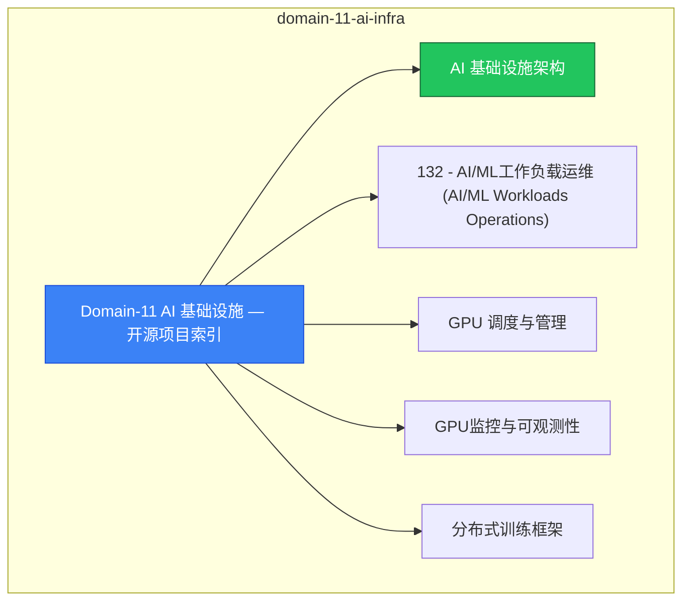

> **生产环境安全提示**
>
> 本文档包含可直接执行的运维命令。执行前请确认：当前目标集群与 Namespace 是否正确；是否具备足够的 RBAC 权限；是否已在非生产环境验证。命令风险等级标注：🔴 高风险（可能造成数据丢失或服务中断）、🟡 中风险（会修改集群状态，但通常可回滚）、🟢 低风险/只读（信息收集，无副作用）。

# domain-11-ai-infra MOC

> **MOC 版本**: 1.0
> **知识域**: domain-11-ai-infra
> **文档数量**: 39 篇
> **最后更新**: 2026-05-21
> **用途**: 本知识域的导航入口，汇总所有相关文档、关联领域、和场景入口

---

## 领域概述

AI 基础设施 — GPU 调度、CUDA、Model Serving、LLM 部署

### 知识域定位

| 维度 | 说明 |
|---|---|
| **知识域** | domain-11-ai-infra |
| **文档数量** | 39 篇 |
| **难度分布** | 入门 0 / 进阶 0 / 高级 3 / 专家 0 |

---

## 文档清单

| # | 文档 | 难度 | 标签 | 估计阅读时间 |
|---|---|---|---|---|
| 1 | Domain-11 AI 基础设施 — 开源项目索引 |  | k8s, ai, gpu |  |
| 2 | AI 基础设施架构 | 高级 | k8s, ai, gpu | 5min |
| 3 | 132 - AI/ML工作负载运维 (AI/ML Workloads Operations) |  | k8s, ai, gpu |  |
| 4 | GPU 调度与管理 | 高级 | k8s, gpu, nvidia | 5min |
| 5 | GPU监控与可观测性 |  | k8s, ai, gpu |  |
| 6 | 分布式训练框架 | 高级 | k8s, ai, distributed-training | 5min |
| 7 | AI数据处理Pipeline与特征工程 |  | k8s, ai, gpu |  |
| 8 | AI实验管理与MLOps平台 |  | k8s, ai, gpu |  |
| 9 | AutoML与超参数调优 |  | k8s, ai, gpu |  |
| 10 | AI模型注册中心与版本管理 |  | k8s, ai, gpu |  |
| 11 | AI模型部署与生命周期管理 |  | k8s, ai, gpu |  |
| 12 | AI安全与模型保护 |  | k8s, ai, gpu |  |
| 13 | 141 - AI成本分析与FinOps实践 (AI Cost Analysis & FinOps) |  | k8s, ai, gpu |  |
| 14 | AI平台可观测性体系 |  | k8s, ai, gpu |  |
| 15 | AI平台故障排查与性能优化 |  | k8s, ai, gpu |  |
| 16 | 142 - LLM训练数据Pipeline与管理 (LLM Data Pipeline & Management) |  | k8s, ai, gpu |  |
| 17 | 143 - LLM微调技术与实践 (LLM Fine-tuning Techniques & Practices) |  | k8s, ai, gpu |  |
| 18 | 144 - LLM推理服务部署 |  | k8s, ai, gpu |  |
| 19 | LLM模型Serving架构与推理优化 |  | k8s, ai, gpu |  |
| 20 | 146 - LLM模型量化技术 |  | k8s, ai, gpu |  |
| 21 | 147 - 向量数据库与RAG架构 |  | k8s, ai, gpu |  |
| 22 | 21 - 多模态模型融合与部署 |  | k8s, ai, gpu |  |
| 23 | LLM 隐私与安全 |  | k8s, ai, gpu |  |
| 24 | LLM 成本监控与 FinOps |  | k8s, ai, gpu |  |
| 25 | 24 - LLM模型版本管理与治理 |  | k8s, ai, gpu |  |
| 26 | 25 - LLM可观测性与监控体系 |  | k8s, ai, gpu |  |
| 27 | 26 - AI基础设施成本优化概览 |  | k8s, ai, gpu |  |
| 28 | 成本管理与 FinOps |  | k8s, ai, gpu |  |
| 29 | 28 - AI绿色计算与可持续发展 |  | k8s, ai, gpu |  |
| 30 | 15 - 阿里云特定集成表 |  | k8s, ai, gpu |  |
| 31 | AI平台安全加固与合规 |  | k8s, ai, gpu |  |
| 32 | 31 - AI平台治理框架 |  | k8s, ai, gpu |  |
| 33 | 32 - MLOps端到端流水线 |  | k8s, ai, gpu |  |
| 34 | 33 - 模型可解释性与透明度 |  | k8s, ai, gpu |  |
| 35 | 34 - 联邦学习与分布式协同训练 |  | k8s, ai, gpu |  |
| 36 | 35 - 模型漂移监控与预警 |  | k8s, ai, gpu |  |
| 37 | 36 - AI平台增强可观测性 |  | k8s, ai, gpu |  |
| 38 | AI Agent 沙箱安全架构 |  | k8s, ai, gpu |  |
| 39 | Kubeflow AI 平台部署与实践指南 |  | k8s, ai, gpu |  |

---

## 知识图谱

---

## 关联入口

| 入口 | 说明 |
|---|---|
| FTA 故障树 | domain-11-ai-infra 相关故障树分析 |
| Skills 技能 | domain-11-ai-infra 相关操作技能 |
| 深度研究入口 | 语料库索引与向量检索 |

---

## 统计信息

| 指标 | 数值 |
|---|---|
| 文档总数 | 39 |
| 覆盖 K8s 版本 | v1.25 - v1.32 |

---

*本文档由 scripts/generate-mocs.py 自动生成，最后更新 2026-05-21。*

<!-- risk-assessed -->
