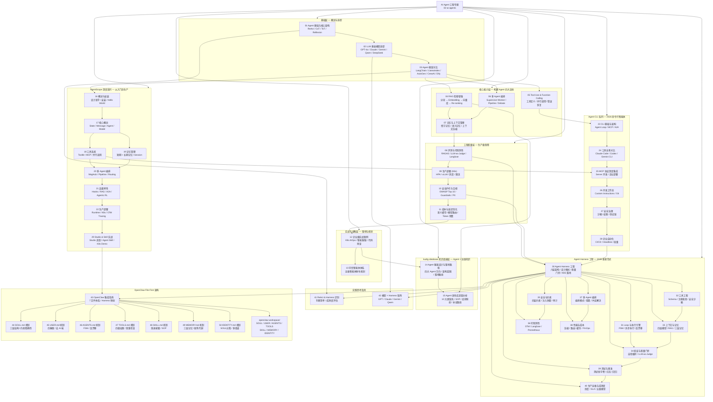

> **生产环境安全提示**
>
> 本文档包含可直接执行的运维命令。执行前请确认：当前目标集群与 Namespace 是否正确；是否具备足够的 RBAC 权限；是否已在非生产环境验证。命令风险等级标注：🔴 高风险（可能造成数据丢失或服务中断）、🟡 中风险（会修改集群状态，但通常可回滚）、🟢 低风险/只读（信息收集，无副作用）。

# AI Agent 工程专题

> **文档类型**: 专题索引 | **最后更新**: 2026-04 | **关键词**: AI Agent, LLM, RAG, 多 Agent 编排, 生产部署, 企业级应用, Function Calling, Agent 安全, Agent Harness, Harness Engineering

---

## 概述

本专题系统性地覆盖 **AI Agent 工程**的全生命周期：从基础概念与架构设计，到 LLM 选型、RAG 构建、工具调用规范、多 Agent 编排，再到生产部署、安全治理、成本优化与企业实战案例。

所有内容以**生产环境真实需求**为导向，提供可直接落地的架构方案、配置示例和最佳实践，避免停留在理论层面。本专题与 `domain-11-ai-infra` 等相关知识域深度联动，形成从 AI 基础设施到 Agent 应用层的完整知识闭环。

> 注：原 `topic-agent` 专题（Agent 赋能设计与语料库差距分析）已整合至本专题，参见 14、15 篇。

---

## 文档目录

| 序号 | 文档 | 内容概要 | 适用角色 | 阅读耗时 |
|:---:|------|---------|---------|---------|
| 01 | [AI Agent 基础与核心架构](./01-ai-agent-fundamentals.md) | Agent 定义、分类、ReAct/CoT/ToT 推理模式、Agent Loop 解析 | 所有工程师 | 30min |
| 02 | [LLM 基座模型选型与评估](./02-llm-foundation-models.md) | 主流模型全矩阵对比、场景选型决策、微调 vs RAG 判断树 | 架构师、AI 工程师 | 25min |
| 03 | [主流 Agent 框架对比](./03-agent-frameworks-comparison.md) | LangChain/LlamaIndex/AutoGen/CrewAI/Dify 深度对比 | 研发工程师 | 30min |
| 04 | [RAG 检索增强生成深度指南](./04-rag-knowledge-retrieval.md) | 分块策略、Embedding 选型、向量库对比、混合检索、Re-ranking | AI 工程师 | 40min |
| 05 | [Tool Use & Function Calling 设计规范](./05-tool-use-function-calling.md) | 工具定义规范、并行调用、错误恢复、工具链设计 | 研发工程师 | 25min |
| 06 | [多 Agent 编排与协作架构](./06-multi-agent-orchestration.md) | Supervisor/Worker 模式、事件驱动编排、冲突解决策略 | 架构师 | 35min |
| 07 | [记忆管理与上下文窗口工程](./07-memory-context-management.md) | 短期/长期记忆、情节记忆 vs 语义记忆、上下文压缩技术 | AI 工程师 | 25min |
| 08 | [Agent 评测体系与可观测性](./08-agent-evaluation-observability.md) | LLM-as-Judge、轨迹评估、RAGAS 指标、LangSmith/Langfuse | AI 工程师、SRE | 30min |
| 09 | [生产部署指南：K8s 上的 Agent 服务](./09-production-deployment-guide.md) | K8s Deployment、HPA、GPU 调度、限流、灰度发布 | SRE、平台工程师 | 35min |
| 10 | [安全护栏、提示注入防护与合规](./10-security-guardrails.md) | OWASP LLM Top 10、Guardrails 框架、PII 处理、合规审计 | 安全工程师、架构师 | 30min |
| 11 | [成本与延迟优化策略](./11-cost-latency-optimization.md) | Token 预算、语义缓存、模型路由、批处理策略 | SRE、AI 工程师 | 25min |
| 12 | [企业级实战案例](./12-enterprise-case-studies.md) | K8s 运维 Agent、智能客服、代码审查 Agent 真实案例与指标 | 技术决策者、架构师 | 40min |
| 13 | [可信智能体体系 — 运维智能体财年规划](./13-trusted-agent-system-fiscal-plan.md) | 五大产品线智能体基线建设、评测体系、能力提升路线 | 运维专家组、技术决策者 | 60min |
| 14 | [Agent 赋能设计与落地路径](./14-agent-kudig-design-strategy.md) | kudig-database 知识底座、四大 Agent 方向、架构蓝图、落地路线 | 架构师、技术决策者 | 20min |
| 15 | [Agent 语料库差距分析](./15-agent-corpus-gap-analysis.md) | 10 大类缺失分析、症状→原因映射、SOP 规范、补全路线图 | 架构师、内容工程师 | 25min |
| **AgentScope 系列** | | | | |
| 16 | [AgentScope 概述与安装入门](./16-agentscope-overview-installation.md) | 框架定位、设计哲学、安装配置、Hello World | 所有工程师 | 20min |
| 17 | [AgentScope 核心概念与基础操作](./17-agentscope-core-concepts.md) | State/Message/Agent/Model/Formatter/Memory 六大抽象 | AI 工程师 | 30min |
| 18 | [AgentScope 工具系统与 MCP 集成](./18-agentscope-tool-system.md) | Toolkit 注册、MCP 集成、并行调用、K8s 工具集 | 研发工程师 | 30min |
| 19 | [AgentScope 记忆管理与上下文工程](./19-agentscope-memory-context.md) | 短期/长期记忆、Session 持久化、Token 管理、压缩策略 | AI 工程师 | 25min |
| 20 | [AgentScope 多 Agent 编排与工作流](./20-agentscope-multi-agent-orchestration.md) | MsgHub、Pipeline、Routing、Handoffs、辩论模式 | 架构师 | 35min |
| 21 | [AgentScope 高级特性与扩展开发](./21-agentscope-advanced-features.md) | Hooks、RAG、A2A、语音 Agent、Agentic RL、评测体系 | AI 工程师、架构师 | 35min |
| 22 | [AgentScope 生产部署与可观测性](./22-agentscope-production-deployment.md) | Runtime、AgentApp、Sandbox、K8s 部署、OTel Tracing | SRE、平台工程师 | 40min |
| 29 | [AgentScope Studio 与 Agent Skill 实战指南](./29-agentscope-studio-skill-demo.md) | Studio 功能详解、Agent 创建、Skill 机制、K8s 诊断 Demo | 所有工程师 | 30min |
| **Agent CLI 系列** | | | | |
| 23 | [Agent CLI 基础概念与架构模式](./23-agent-cli-fundamentals.md) | CLI Agent 定义、Agent Loop、MCP/A2A 协议、运行模式 | 所有工程师 | 30min |
| 24 | [主流 Agent CLI 工具全景对比](./24-agent-cli-tools-comparison.md) | Claude Code/Codex CLI/Gemini CLI/Aider/Goose 深度对比 | 研发工程师、架构师 | 35min |
| 25 | [Agent CLI 与 MCP 协议深度集成](./25-agent-cli-mcp-integration.md) | MCP 协议架构、Server 开发、企业级部署、安全加固 | 研发工程师、平台工程师 | 40min |
| 26 | [Agent CLI 开发工作流与最佳实践](./26-agent-cli-development-workflow.md) | 自定义指令、Prompt Engineering、Git 集成、团队协作 | 研发工程师 | 30min |
| 27 | [Agent CLI 安全治理与权限模型](./27-agent-cli-security-governance.md) | 威胁模型、沙箱隔离、权限配置、供应链安全、审计 | 安全工程师、架构师 | 30min |
| 28 | [Agent CLI 企业级自动化与 CI/CD](./28-agent-cli-enterprise-automation.md) | 无头模式、GitHub Actions、批量处理、企业部署架构 | SRE、平台工程师 | 35min |
| **Agent Harness 工程** | | | | |
| 30 | [Agent Harness 工程：从模型包装到生产级系统设计](./30-agent-harness-engineering.md) | 六层架构、Harness 设计模式、行业实证、基准测试全景、质量门禁、K8S Harness 落地 | 架构师、AI 工程师、SRE | 50min |
| 31 | [Harness Loop 与执行引擎深度设计](./31-agent-harness-loop-execution.md) | FSM 模型、异步执行引擎、反漂移检测、5 种执行策略、分阶段执行、轨迹管理 | 架构师、AI 工程师 | 45min |
| 32 | [Harness 工具工程](./32-agent-harness-tool-engineering.md) | Schema 标准、K8S 工具集、工具注册发现、编排模式、安全沙箱、MCP 适配 | 研发工程师、AI 工程师 | 40min |
| 33 | [Harness 上下文与记忆工程](./33-agent-harness-context-memory.md) | 四层上下文模型、RAG 混合检索、RRF 融合、三层记忆系统、动态窗口管理 | AI 工程师 | 40min |
| 34 | [Harness 验证与质量门禁](./34-agent-harness-verification-quality.md) | 多维度验证器、自检循环、LLM-as-Judge、RAGAS 评测、CI/CD 质量门禁 | AI 工程师、QA 工程师 | 45min |
| 35 | [Harness 安全与约束工程](./35-agent-harness-security-constraints.md) | 四层约束模型、提示注入防御、人工审批、成本控制、审计日志 | 安全工程师、架构师 | 40min |
| 36 | [Harness 可观测性体系](./36-agent-harness-observability.md) | OTel 全链路追踪、Langfuse 集成、Prometheus 指标、告警规则、Dashboard | SRE、AI 工程师 | 40min |
| 37 | [Harness 多 Agent 编排](./37-agent-harness-multi-agent.md) | 4 种编排模式、Orchestrator、通信协议、Harness 隔离、冲突解决 | 架构师 | 40min |
| 38 | [Harness 性能与成本优化](./38-agent-harness-performance-cost.md) | 上下文压缩、模型路由、多级缓存、Prompt Caching、Agent FinOps | SRE、AI 工程师 | 35min |
| 39 | [Harness 测试与基准评测](./39-agent-harness-testing-benchmark.md) | 测试金字塔、K8S 自定义基准、红队测试、回归测试框架 | QA 工程师、AI 工程师 | 40min |
| 40 | [Harness 生产运维与成熟度模型](./40-agent-harness-production-maturity.md) | 灰度发布、配置热更新、SLA 监控、故障恢复、五级成熟度模型 | SRE、架构师 | 45min |
| **实践参考指南** | | | | |
| 41 | [ReAct Agent 与 Harness 识别指南](./41-react-harness-identification-guide.md) | ReAct 三要素判断法、Harness 六层检查、五级成熟度清单、代码级识别方法 | 所有工程师 | 20min |
| 42 | [模型 × Harness 兼容性矩阵](./42-model-harness-compatibility-matrix.md) | GPT/Claude/Gemini/Qwen/DeepSeek/Llama 全系列 Harness 就绪度、场景选型、多模型路由 | 架构师、AI 工程师 | 25min |
| **OpenClaw File-First 架构** | | | | |
| 43 | [OpenClaw File-First 架构与 Harness 集成指南](./43-openclaw-framework-integration.md) | OpenClaw 7 文件体系、File-First vs Harness 映射、K8S 运维 Agent 实施方案、AgentScope 集成 | 架构师、AI 工程师 | 35min |
| 44 | [SOUL.md 机制深度解析](./44-openclaw-soul-mechanism.md) | 三层结构模型、约束精确性原则、SoulConstraintEnforcer 代码、红线拦截案例 | AI 工程师、安全工程师 | 25min |
| 45 | [USER.md 机制深度解析](./45-openclaw-user-mechanism.md) | 四象限模型、去 AI 味三策略、UserContextBuilder 代码、技术水平校准 | AI 工程师 | 25min |
| 46 | [AGENTS.md 机制深度解析](./46-openclaw-agents-mechanism.md) | FSM 状态机、五阶段工作流、反漂移检测、AgentWorkflowEngine 代码 | 架构师、AI 工程师 | 30min |
| 47 | [TOOLS.md 机制深度解析](./47-openclaw-tools-mechanism.md) | 四级权限模型、最小权限原则、ToolsManager 双重安全检查代码 | AI 工程师、安全工程师 | 25min |
| 48 | [SKILL.md 机制深度解析](./48-openclaw-skill-mechanism.md) | 渐进式披露、三种知识结构化范式、SkillLoader 按需加载代码 | AI 工程师、内容工程师 | 25min |
| 49 | [MEMORY.md 机制深度解析](./49-openclaw-memory-mechanism.md) | 三层记忆模型、新陈代谢机制、MemoryManager 代码、已知问题命中 | AI 工程师 | 25min |
| 50 | [IDENTITY.md 机制深度解析](./50-openclaw-identity-mechanism.md) | SOUL/IDENTITY 分离设计、多渠道适配、IdentityManager 代码 | AI 工程师 | 20min |
| — | [openclaw-workspace/](./openclaw-workspace/) | 完整的 K8S 运维 Agent 工作区配置：SOUL.md / USER.md / AGENTS.md / TOOLS.md / SKILL.md / MEMORY.md / IDENTITY.md | 所有工程师 | 参考 |

---

## 内容结构全景

---

## 快速入口

**初学者 / 技术决策者**：
1. [01 - Agent 基础](./01-ai-agent-fundamentals.md) → [02 - LLM 选型](./02-llm-foundation-models.md) → [12 - 企业案例](./12-enterprise-case-studies.md) → [14 - 赋能设计](./14-agent-kudig-design-strategy.md)

**AI 应用工程师**：
1. [03 - 框架对比](./03-agent-frameworks-comparison.md) → [04 - RAG 指南](./04-rag-knowledge-retrieval.md) → [05 - 工具调用](./05-tool-use-function-calling.md) → [07 - 记忆管理](./07-memory-context-management.md)

**架构师 / 平台工程师**：
1. [06 - 多 Agent 编排](./06-multi-agent-orchestration.md) → [09 - 生产部署](./09-production-deployment-guide.md) → [08 - 评测观测](./08-agent-evaluation-observability.md)

**安全 / 合规工程师**：
1. [10 - 安全护栏](./10-security-guardrails.md) → [11 - 成本优化](./11-cost-latency-optimization.md)

**内容工程师 / 知识运营**：
1. [15 - 语料库差距分析](./15-agent-corpus-gap-analysis.md) → [14 - 赋能设计](./14-agent-kudig-design-strategy.md) → [04 - RAG 指南](./04-rag-knowledge-retrieval.md)

**AgentScope 学习路径**：
1. [16 - 概述与安装](./16-agentscope-overview-installation.md) → [17 - 核心概念](./17-agentscope-core-concepts.md) → [18 - 工具系统](./18-agentscope-tool-system.md) → [19 - 记忆管理](./19-agentscope-memory-context.md) → [20 - 多 Agent](./20-agentscope-multi-agent-orchestration.md) → [21 - 高级特性](./21-agentscope-advanced-features.md) → [22 - 生产部署](./22-agentscope-production-deployment.md) → [29 - Studio & Skill 实战](./29-agentscope-studio-skill-demo.md)

**Agent CLI 学习路径**：
1. [23 - CLI 基础与架构](./23-agent-cli-fundamentals.md) → [24 - 工具全景对比](./24-agent-cli-tools-comparison.md) → [25 - MCP 协议集成](./25-agent-cli-mcp-integration.md) → [26 - 开发工作流](./26-agent-cli-development-workflow.md) → [27 - 安全治理](./27-agent-cli-security-governance.md) → [28 - 企业自动化](./28-agent-cli-enterprise-automation.md)

**Harness Engineering 学习路径（2026 前沿）**：
1. [08 - 评测与可观测性](./08-agent-evaluation-observability.md) → [10 - 安全护栏](./10-security-guardrails.md) → [30 - Agent Harness 工程](./30-agent-harness-engineering.md) → [31 - Loop 与执行引擎](./31-agent-harness-loop-execution.md) → [32 - 工具工程](./32-agent-harness-tool-engineering.md) → [33 - 上下文与记忆](./33-agent-harness-context-memory.md) → [34 - 验证与质量门禁](./34-agent-harness-verification-quality.md) → [35 - 安全与约束](./35-agent-harness-security-constraints.md) → [36 - 可观测性](./36-agent-harness-observability.md) → [37 - 多 Agent 编排](./37-agent-harness-multi-agent.md) → [38 - 性能与成本](./38-agent-harness-performance-cost.md) → [39 - 测试与基准](./39-agent-harness-testing-benchmark.md) → [40 - 生产运维与成熟度](./40-agent-harness-production-maturity.md)

**快速参考**：
1. [41 - ReAct & Harness 识别指南](./41-react-harness-identification-guide.md)（独立可读，适合随时查阅）
2. [42 - 模型 × Harness 兼容性矩阵](./42-model-harness-compatibility-matrix.md)（模型选型快速参考）
3. [43 - OpenClaw File-First 架构集成](./43-openclaw-framework-integration.md)（File-First 配置体系与 Harness 融合）
4. [44~50 - OpenClaw 7 大配置文件深度解析](./44-openclaw-soul-mechanism.md)（SOUL/USER/AGENTS/TOOLS/SKILL/MEMORY/IDENTITY 各自机制）
5. [openclaw-workspace/](./openclaw-workspace/)（K8S 运维 Agent 完整工作区配置，可直接参考使用）

---

## 关联专题

| 专题/领域 | 与本专题的关系 |
|---------|--------------|
| [domain-11-ai-infra](../domain-14-ai-ml-infra/) | GPU 调度、LLM 推理服务、MLOps 基础设施 |
| [domain-10-troubleshooting-diagnostics](../domain-10-troubleshooting-diagnostics/) | K8s 运维 Agent 的核心知识语料 |
| [domain-05-security-compliance](../domain-05-security-compliance/) | 安全最佳实践在 Agent 安全中的应用 |
| [domain-07-platform-engineering](../domain-07-platform-engineering/) | 平台工程视角的 Agent 服务运维 |
| [domain-32-yaml-manifests](../domain-18-manifests-patterns/) | Agent 生产部署 YAML 模板参考 |
| [topic-fta](../domain-10-troubleshooting-diagnostics/topic-fta/) | 故障树分析作为 Agent 推理骨架 |

---

## 覆盖的关键技术

| 技术领域 | 覆盖内容 |
|---------|---------|
| **推理框架** | ReAct, CoT, ToT, Plan-and-Execute, Reflexion |
| **LLM 模型** | GPT-4o, Claude 3.5 Sonnet, Gemini 1.5 Pro, Llama-3, Qwen-2.5, DeepSeek-R1 |
| **Agent 框架** | LangChain, LlamaIndex, AutoGen, CrewAI, Dify, Semantic Kernel, **AgentScope** |
| **向量数据库** | Chroma, Weaviate, Qdrant, Milvus, pgvector |
| **Embedding 模型** | text-embedding-3-large, BGE-M3, Jina Embeddings v3 |
| **可观测性** | LangSmith, Langfuse, Phoenix (Arize), OpenTelemetry, **AgentScope Studio** |
| **安全框架** | Guardrails AI, NeMo Guardrails, Llama Guard |
| **部署平台** | Kubernetes, vLLM, TGI, Ray Serve, Triton, **AgentScope Runtime** |
| **Agent CLI** | Claude Code, Codex CLI, Gemini CLI, Aider, Goose, Amazon Q Developer CLI |
| **CLI 协议** | MCP (Model Context Protocol), A2A (Agent-to-Agent), OAuth 2.1 |
| **Harness Engineering** | 六层架构 (Loop/Tools/Context/Persistence/Verification/Constraints)、SOUL.md/SKILL.md、质量门禁 |
| **OpenClaw File-First** | SOUL.md、USER.md、AGENTS.md、TOOLS.md、SKILL.md、MEMORY.md、IDENTITY.md |
| **Agent 基准测试** | SWE-bench, GAIA, AgentBench, WebArena, ToolBench, τ-bench, BFCL |

---

*本专题为 kudig-database 项目原创内容，所有方案经生产环境验证。原 `topic-agent` 专题已整合至此。*

## Related

- [[domain-17-system-foundation/topic-cheat-sheet/k8s.md|k8s]]
- [[concepts/ai-agent-README.md|ai-agent-README]]
- [[entities/kubernetes.md|kubernetes]]
- [[entities/dex.md|Dex]]
- [[entities/opentelemetry.md|OpenTelemetry]]

<!-- risk-assessed -->
