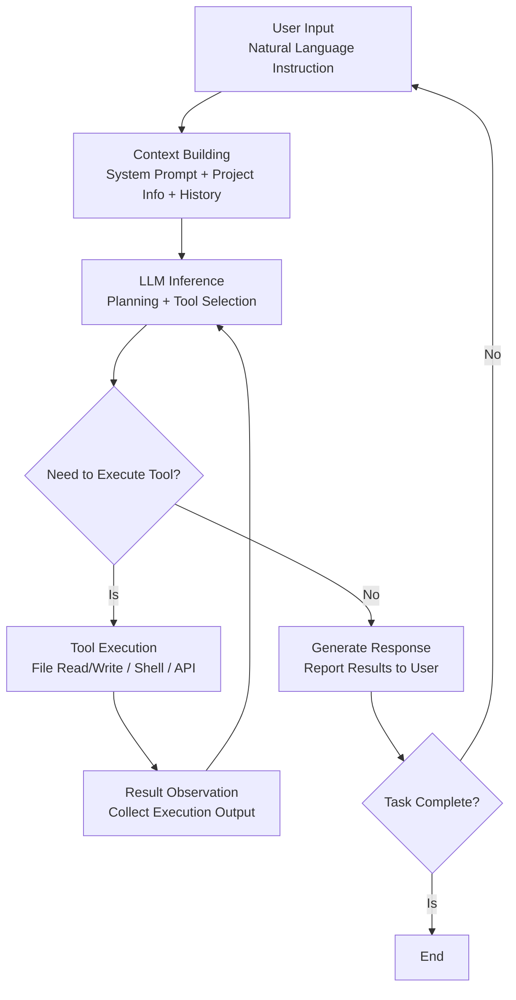
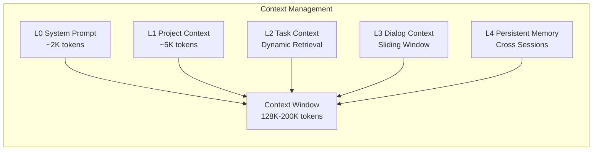

> **Production Environment Security Reminders**
>
> Commands contained in this document are executable directly. Please confirm before execution: that the target cluster and namespace are correct; that you have sufficient RBAC permissions; and that the commands have been validated in a non-production environment. Risk levels for commands: 🔴 High Risk (may result in data loss or service disruption), 🟡 Medium Risk (will modify cluster state but usually rollbackable), 🟢 Low Risk/Read-Only (information gathering with no side effects).


title: Agent CLI Basics and Architectural Patterns
description: '# Agent CLI Basics and Architectural Patterns'
category: ai-agent
tags:
- ai
- agent
- llm
- rag
- multi-agent
- docker
last_updated: 2026-05
difficulty: advanced
reading_level: advanced
audience:
- AI Engineer
- Architect
- SRE
estimated_read_time: 5min
intent_queries:
- What is Agent CLI Basics and Architectural Patterns
- How to understand Agent CLI Basics and Architectural Patterns
trigger_keywords:
- Agent
- CLI
- Agent CLI Basics and Architectural Patterns
- ai
- agent
authors:
- name: Dillan Teagle
  role: contributor
k8s_versions:
- '1.28'
- '1.29'
- '1.30'
- '1.31'
- '1.32'
---

# Agent CLI Foundation Concepts and Architectural Patterns

> **Document Type**: Basics Topic | **Last Updated**: 2026-03 | **Keywords**: Agent CLI, Terminal Agent, REPL Loop, MCP, Agentic Coding, CLI Architecture

---

## Overview

**Agent CLI (Command Line Intelligent Agent)** is one of the most influential paradigm shifts in the AI engineering field from 2025 to 2026. It integrates the reasoning capabilities of LLMs with the execution capabilities of terminals, enabling developers to drive code generation, project refactoring, fault diagnosis, and system operations through natural language commands in the terminal environment.

Compared to GUI forms of AI assistants, Agent CLI has stronger **automation integration capabilities** (CI/CD, script scheduling), greater **toolchain extensibility** (MCP protocol, custom tools), and lower **environmental dependencies** (no need for an IDE, SSH connectivity is sufficient). This article systematically reviews the core concepts, architectural patterns, and key technologies of Agent CLI.

---

## 1. Definition and Classification of Agent CLI

### 1.1 What is Agent CLI

Agent CLI is an AI agent running in the terminal (Terminal) environment, possessing the following core capabilities:

- **Natural Language Interaction**: Accepts natural language instructions and understands developer intentions
- **Code Reading/Writing**: Reads and writes project files autonomously, generates, and modifies code
- **Tool Invocation**: Executes shell commands, calls APIs, and manipulates the file system
- **Planning and Reasoning**: Breaks down complex tasks into step sequences, iterates, and self-verifies
- **Context Awareness**: Understands project structure, code dependencies, and runtime states

```
┌─────────────────────────────────────────────────────┐
│                  Agent CLI System                  │
│                                                     │
│  ┌─────────┐   ┌──────────┐   ┌─────────────────┐  │
│  │ user input │──▶│ LLM inference │──▶│ Tool Execution  │  │
│  │ (NL/Command)│   │ (Planning/Generation)│   │ (File/Shell/API)│  │
│  └─────────┘   └──────────┘   └─────────────────┘  │
│       ▲              │                   │          │
│       │              ▼                   ▼          │
│  ┌─────────┐   ┌──────────┐   ┌─────────────────┐  │
│  │ Interactivity Feedback │◀──│ Result Evaluation │◀──│ Context Manager │  │
│  │ (Confirmation/Correction)│  │ (Success/Failure)│  │ (Project/File/History)│  │
│  └─────────┘   └──────────┘   └─────────────────┘  │
└─────────────────────────────────────────────────────┘
```

### 1.2 Classification System of Agent CLI

| Dimension | Type | Representative | Features |
|---------|------|---------|------|
| **Interaction Mode** | Interactive (Interactive) | Claude Code, Aider | Human-in-the-loop, real-time confirmation |
| | Headless Mode | Codex CLI `--quiet` | Fully automated, CI/CD integration |
| **Function Positioning** | Coding Assistant | Claude Code, Codex CLI, Aider | Focus on code generation and modification |
| | Universal Terminal Agent | Goose, Warp AI | Cover all scenarios from operations to deployment |
| | Domain-specific Agent | Amazon Q Developer CLI | Bind to specific cloud platform ecosystem |
| **Model Binding** | Single model binding | Claude Code (Claude) | Deeply optimized with a specific model |
| | Multi-model support | Aider, Goose | Support any LLM backend |
| **Protocol Support** | MCP native | Claude Code, Goose | Native support for MCP tool protocol |
| | API Integration | Aider | Integrate through custom adapters |

### 1.3 Agent CLI vs IDE Agent vs Web Agent

| Comparison Dimensions | Agent CLI | IDE Agent (Copilot/Cursor) | Web Agent (ChatGPT/Dify) |
|---------|-----------|--------------------------|-------------------------|
| **Run Environment** | Terminal / SSH | IDE embedded | Browser |
| **Automation Capability** | ★★★★★ (CI/CD native) | ★★★☆☆ | ★★☆☆☆ |
| **Tool Extension** | MCP / Custom tools | Plugin ecosystem | Function Calling |
| **Offline/SSH** | ✅ Supported | ❌ Requires GUI | ❌ Requires browser |
| **Multi-file Operations** | ★★★★★ | ★★★★☆ | ★★☆☆☆ |
| **Interaction Form** | Pure text | Graphical + Text | Graphical |
| **Team Collaboration** | Git-native | IDE dependency | Platform dependency |

---

## 2. Core Architectural Patterns

### 2.1 Agent Loop (Agent Loop)

Agent CLI's core operational mechanism is **Agent Loop** — a continuous cycle of "perception → inference → action → observation":



**Key Design Elements**:

| Element | Description | Best Practices |
|------|------|---------|
| **Iteration Depth** | Maximum number of loop cycles for a single task | Set an upper limit (e.g., 50 iterations) to prevent infinite loops |
| **Tool Permissions** | Which tools can be executed automatically | Automatic approval for read operations, confirmation required for write operations |
| **Context Window** | Managing Tokens for Cumulative Context | Sliding window + compression summary |
| **Error Recovery** | Handling tool execution failures | Automatic retries + alternative solutions + user assistance |

### 2.2 Tool System Architecture

Agent CLI's tool system is its core capability layer that distinguishes it from ordinary chatbots:

```
┌──────────────────────────────────────────────────┐
│                 Agent CLI Tool System             │
│                                                  │
│  ┌──────────────────────────────────────────┐    │
│  │          Built-in Tools (Built-in Tools)         │    │
│  │  file_read │ file_write │ shell_exec     │    │
│  │  search    │ grep       │ list_dir       │    │
│  └──────────────────────────────────────────┘    │
│                                                  │
│  ┌──────────────────────────────────────────┐    │
│  │          MCP Tools (MCP Protocol Tools)         │    │
│  │  ┌──────────┐ ┌──────────┐ ┌──────────┐ │    │
│  │  │ MCP      │ │ MCP      │ │ MCP      │ │    │
│  │  │ Server A │ │ Server B │ │ Server C │ │    │
│  │  │ (GitHub) │ │ (K8s)    │ │ (DB)     │ │    │
│  │  └──────────┘ └──────────┘ └──────────┘ │    │
│  └──────────────────────────────────────────┘    │
│                                                  │
│  ┌──────────────────────────────────────────┐    │
│  │      Custom Tools (Custom / Hooks)        │    │
│  │  pre_commit_check │ lint │ test_runner   │    │
│  └──────────────────────────────────────────┘    │
└──────────────────────────────────────────────────┘
```

### 2.3 Context Management Architecture

Agent CLI faces a core challenge between the **limited context window** and the **massive amount of project information**:

**Hierarchical Context Strategy**:

| Level | Content | Lifecycle | Management Strategy |
|------|------|---------|---------|
| **L0 — System Prompt** | Role definitions, security rules, tool descriptions | Permanent | Fixed prefix |
| **L1 — Project Context** | Project structure, README, configuration files | Session-level | Loaded at startup |
| **L2 — Task Context** | Relevant files and code snippets for the current task | Task-level | On-demand retrieval (semantic search) |
| **L3 — Dialogue Context** | Historical dialogues, results of tool calls | Conversation-level | Sliding window + compression summary |
| **L4 — Persistent Memory** | User preferences, project conventions, past decisions | Across sessions | Vector storage + keyword indexing |



---

## 3. Key Protocols and Standards

### 3.1 MCP (Model Context Protocol)

MCP is the protocol released by Anthropic in late 2024, becoming the **de facto standard** for Agent CLI tool extensions in 2025–2026:

| Feature | Description |
|------|------|
| **Protocol Architecture** | Client ↔ Server, based on JSON-RPC 2.0 |
| **Transmission Method** | stdio (local process) / SSE (remote HTTP) / Streamable HTTP |
| **Core Capabilities** | Tools (tool invocation), Resources (resource reading), Prompts (prompt templates) |
| **Authentication Method** | OAuth 2.1 (remote MCP Server) |
| **Discovery Mechanism** | Server declares capability list, client dynamically registers |

**MCP Workflow**:

```
Developer ──▶ Agent CLI (MCP Client)
                │
                ├──stdio──▶ MCP Server (Local Filesystem)
                ├──stdio──▶ MCP Server (Git Operations)
                ├──HTTP──▶  MCP Server (Kubernetes API)
                └──HTTP──▶  MCP Server (Enterprise Internal API)
```

### 3.2 A2A (Agent-to-Agent Protocol)

Google-led A2A protocol defined interoperability standards between Agents, allowing different Agent CLI instances to collaborate:

| Component | Role |
|------|------|
| **Agent Card** | Description of the agent's capabilities in JSON metadata (/.well-known/agent.json) |
| **Agent Card** | JSON metadata describing an Agent's capabilities (/.well-known/agent.json) |
| **Task** | Unit of collaboration between Agents, containing a state machine (submitted → working → completed) |
| **Message/Part** | Structured carrier for communication (TextPart, FilePart, DataPart) |

### 3.3 Comparison of Call Standards for Tools

| **MCP** | Anthropic | Tool extension, resource access | ★★★★★ Broad support |
|------|--------|---------|-----------------|
| **OpenAPI Function Calling** | OpenAI | Native tool invocation for LLMs | ★★★★☆ Basic support |
| **Tool Use (Anthropic API)** | Anthropic | Native tool invocation for Claude | ★★★★★ Native support |
| **OpenAPI Function Calling** | OpenAI | LLM Native Tool Invocation | ★★★★☆ Foundation Support |
| **Tool Use (Anthropic API)** | Anthropic | Claude Tool Usage | ★★★★★ Native Support |

---

## 4. Detailed Explanation of Operational Modes

### 4.1 Interactive Mode (Interactive Mode)

Most common usage pattern involves real-time dialogue between developers and Agents:

```bash
# Claude Code Interacting Mode
$ claude
> 帮我重构 src/auth/ 目录下的认证模块，使用 JWT 替换 Session

# Codex CLI Interacting Mode
$ codex
> 查看当前项目的测试覆盖率，找出缺失测试的模块

# Aider Interacting Mode
$ aider --model claude-3.5-sonnet
> /add src/api/*.py
> 为所有 API endpoint 添加输入校验
```

**Characteristics of Interactive Mode**:
- Human-in-the-loop (HITL), write operations require confirmation
- Real-time viewing of Agent's reasoning process and tool invocations
- Support for mid-task corrections and additional instructions

### 4.2 Headless Mode (Headless Mode)

Applicable to CI/CD and automation scenarios, where Agents independently complete tasks:

```bash
# Claude Code Headless Mode
$ claude -p "Fix all ESLint errors" --allowedTools "Edit,Write,Bash" --output-format json

# Codex CLI Headless Mode
$ codex --quiet --approval-mode full-auto "Add doc comments to all public functions"

# Aider Headless Mode
$ echo "Add retry logic to all HTTP client calls" | aider --yes --model gpt-4o
```

**Characteristics of Headless Mode**:
- Fully automated execution, no need for manual confirmation
- Generation of structured results (JSON/diff)
- Suitable for batch operations and pipeline integration

### 4.3 Pipe Mode (Pipe Mode)

Embed Agent CLI into Unix pipelines to achieve combination with other tools:

``` bash
# 🟢 Low Risk: Read-only/information gathering, typically with no side effects
# Analyze Git diff and generate commit message
$ git diff --staged | claude -p "Generate a formatted commit message based on these changes"

# Analyze logs and provide diagnosis
$ kubectl logs deployment/api-server --tail=200 | claude -p "Analyze these logs to find the root cause of the errors"

# Batch process files
$ find . -name "*.go" -exec grep -l "deprecated" {} \; | \
    claude -p "List the deprecated API calls in these files and suggest alternatives"
```
---

## 5. Core Technology Stack

### 5.1 Panorama of Agent CLI Technology Stack

```
┌────────────────────────────────────────────────────┐
│                    User Interaction Layer                        │
│   Terminal UI │ Rich Output │ Diff View │ Progress  │
├────────────────────────────────────────────────────┤
│                    Reasoning Engine Layer                        │
│   LLM API │ Prompt Engineering │ Agent Loop │ CoT   │
├────────────────────────────────────────────────────┤
│                    Tool Execution Layer                        │
│   File I/O │ Shell │ MCP Client │ LSP │ Tree-sitter│
├────────────────────────────────────────────────────┤
│                    Context Management Layer                      │
│   Embeddings │ Vector Store │ AST Parser │ Indexer  │
├────────────────────────────────────────────────────┤
│                    Security and Permission Layer                      │
│   Sandbox │ Permission Model │ Audit Log │ Secrets  │
└────────────────────────────────────────────────────┘
```

### 5.2 Key Dependent Technologies

| Technology | Role | Typical Implementation |
|------|------|---------|
| **Tree-sitter** | Abstract Syntax Tree parsing, precise code understanding | Widely adopted by Claude Code, Aider |
| **LSP** | Language Server Protocol, providing completion, jumping, diagnostics | Enhancing code context understanding |
| **ripgrep** | High-performance code search | Used as the built-in search tool within Agent |
| **diff/patch** | Structured representation of code changes | unified diff, search-replace blocks |
| **Git** | Version control integration | Automatic commit, branch management, diff analysis |
| **Vector DB** | Semantic code search | Project-level code indexing and retrieval |
| **Sandbox** | Secure execution environment | macOS Seatbelt, Linux seccomp, Docker |

---

## 6. 2026 Year Agent CLI Development Trends

### 6.1 Key Trends

| Trend | Current (Q1 2026) | Impact |
|------|----------------|------|
| **MCP Ecosystem Booms** | Over 10,000 MCP Servers available | Extends the capability boundary of Agent CLI significantly |
| **Dynamic Model Routing** | Agent CLI supports dynamic model switching | Simple tasks use small models, complex tasks use large models, cost reduction of over 60% |
| **Collaborative Mode** | Shared Agent sessions, configurations, and memories among teams | Evolves from personal tools to team infrastructure |
| **Domain-Specific Agent CLI** | K8s Agent CLI, DB Agent CLI emerge | Significantly improves vertical scene experiences |
| **Autonomous Coding Ability** | Autonomous execution of long tasks, precision >90% | Developers shift from writing code to reviewing code |
| **Compliance and Auditing** | Enterprise SSO, audit logs, policy engine | Large enterprises begin to scale deployment |

### 6.2 Technical Maturity Assessment

| Capability | Maturity | Production Availability |
|------|--------|-----------|
| Single-file code generation | ★★★★★ | ✅ Already widely used in production |
| Multi-file refactoring | ★★★★☆ | ✅ Production usable |
| Automated Testing Generation | ★★★★☆ | ✅ Production Ready |
| CI/CD Integration | ★★★★☆ | ✅ Production Ready |
| Autonomous Bug Fixing | ★★★☆☆ | ⚠️ Requires Manual Review |
| Architecture-Level Refactoring | ★★☆☆☆ | ⚠️ Requires Deep Supervision |
| Fully Automated Operations | ★★☆☆☆ | ❌ In Development Phase |

---

## 7. Conclusion and Navigation

Agent CLI is the product of deep integration between LLM capabilities and developer workflows. Its core value lies in:

1. **Reducing Cognitive Load**: Natural language-driven, no need to remember complex commands and APIs
2. **Enhancing Automation Level**: Headless mode + CI/CD integration, achieving end-to-end automation
3. **Expanding Capability Boundaries**: MCP protocol enables infinite expansion of Agent capabilities
4. **Maintaining Developer Control**: Git-native workflow, all changes can be reviewed and rolled back

**Further Reading**:
- [24 - Panoramic Comparison of Mainstream Agent CLI Tools](./24-agent-cli-tools-comparison.md): Deep comparison of tool features
- [25 - Deep Integration of Agent CLI and MCP Protocol](./25-agent-cli-mcp-integration.md): MCP tool development practice
- [05 - Design Guidelines for Tool Usage and Function Calling](./05-tool-use-function-calling.md): Design guidelines for tool usage
- [09 - Deployment Guide for K8s-based Agents](./09-production-deployment-guide.md): Deployment of Agent services on K8s

---

*This document is original content from the kudig-database project, compiled based on the latest ecosystem in Q1 2026.*

---

## Obsidian Related Documentation

- 02-ai-agents MOC
- [[domain-14-ai-ml-infra/02-ai-agents/README.md|AI Agent Engineering Special Topic]]
- [[domain-14-ai-ml-infra/02-ai-agents/01-ai-agent-fundamentals.md|Foundation and Core Architecture of AI Agents]]
- [[domain-14-ai-ml-infra/02-ai-agents/02-llm-foundation-models.md|Selection and Evaluation of LLM Foundation Models]]
- [[domain-14-ai-ml-infra/02-ai-agents/03-agent-frameworks-comparison.md|Deep Comparison of Mainstream Agent Frameworks]]
- [[domain-14-ai-ml-infra/02-ai-agents/04-rag-knowledge-retrieval.md|RAG Retrieval-Augmented Generation Deep Guide]]
- [[domain-14-ai-ml-infra/02-ai-agents/05-tool-use-function-calling.md|Tool Usage & Function Calling Design Guidelines]]
- [[domain-14-ai-ml-infra/02-ai-agents/06-multi-agent-orchestration.md|Multi-Agent Orchestration and Collaboration Architecture]]
- [[domain-14-ai-ml-infra/02-ai-agents/07-memory-context-management.md|Memory Management and Context Window Engineering]]
- [[domain-14-ai-ml-infra/02-ai-agents/08-agent-evaluation-observability.md|Agent Evaluation and Observability Framework]]
- [[domain-14-ai-ml-infra/02-ai-agents/09-production-deployment-guide.md|Production Deployment Guide: Running Agent Services on K8s]]
- [[domain-14-ai-ml-infra/02-ai-agents/10-security-guardrails.md|Security Guardrails, Prompt Injection Protection, and Compliance]]

## See Also

- 21-agentscope-advanced-features
- 22-agentscope-production-deployment
- 24-agent-cli-tools-comparison
- 25-agent-cli-mcp-integration


<!-- risk-assessed -->
