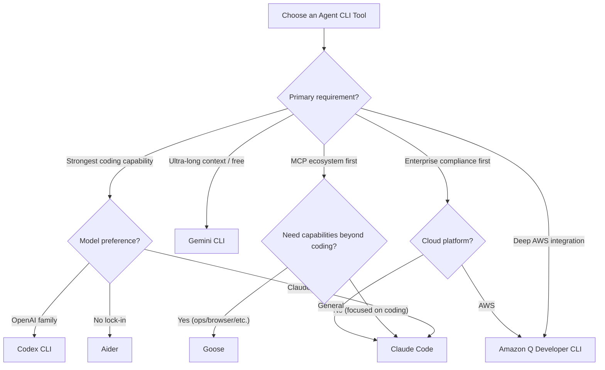

---title: Comprehensive Comparison of Mainstream Agent CLI Tools (domain-14-ai-ml-infra)
description: 'description: ''**Document Type**: Selection Comparison Topic | **Last Updated**: 2026-03 | **Keywords**: Claude
  Code, Codex CLI,'
summary: 'description: ''**Document Type**: Selection Comparison Topic | **Last Updated**: 2026-03 | **Keywords**: Claude Code,
  Codex CLI,'
category: general
tags:
- ai
- ai-agent
- llm
- rag
- agent
tier: supporting
created: '2026-05-23'
last_updated: 2026-05
difficulty: intermediate
reading_level: intermediate
audience:
- All Engineers
estimated_read_time: 15min
intent_queries:
- What is the Comprehensive Comparison of Mainstream Agent CLI Tools
- How to do the Comprehensive Comparison of Mainstream Agent CLI Tools
- Kubernetes 14 ai ml infra best practices
trigger_keywords:
- mainstream
- Agent
- CLI
- comprehensive comparison of tools
- ai
- ml
- infra
prerequisites:
- kubectl-basics
authors:
- name: Dillan Teagle
  role: contributor

---

> **Production Environment Safety Notice**
>
> This document contains directly executable operations commands. Before executing, please confirm: whether the current target cluster and Namespace are correct; whether you have sufficient RBAC permissions; whether you have verified in a non-production environment. Command risk levels are marked as: 🔴 High Risk (may cause data loss or service interruption), 🟡 Medium Risk (will modify cluster state, but generally reversible), 🟢 Low Risk/Read-Only (information gathering, no side effects).


title: Comprehensive Comparison of Mainstream Agent CLI Tools
description: '**Document Type**: Selection Comparison Topic | **Last Updated**: 2026-03 | **Keywords**: Claude Code, Codex CLI,
  Aider, Goose, Amazon Q, Gemini CLI, Agent CLI Selection'
category: ai-agent
tags:
- ai
- agent
- llm
- rag
- multi-agent
last_updated: 2026-05
difficulty: advanced
reading_level: advanced
audience:
- AI Engineers
- Architects
- SRE
estimated_read_time: 10min
intent_queries:
- What is the Comprehensive Comparison of Mainstream Agent CLI Tools
- How to do the Comprehensive Comparison of Mainstream Agent CLI Tools
trigger_keywords:
- mainstream
- Agent
- CLI
- comprehensive comparison of tools
- ai
- agent
authors:
- name: Dillan Teagle
  role: contributor
k8s_versions:
- '1.28'
- '1.29'
- '1.30'
- '1.31'
- '1.32'
---

# Comprehensive Comparison of Mainstream Agent CLI Tools

> **Document Type**: Selection Comparison Topic | **Last Updated**: 2026-03 | **Keywords**: Claude Code, Codex CLI, Aider, Goose, Amazon Q, Gemini CLI, Agent CLI Selection

---

## Overview

From 2025 to 2026, Agent CLI tools underwent a rapid evolution from "experimental toys" to "core development infrastructure." This article conducts an in-depth comparison of current mainstream Agent CLI tools across seven dimensions: **architectural design, model support, MCP ecosystem, interaction experience, security model, enterprise features, and cost**, providing decision-making reference for team selection.

> All information in this article is based on the latest stable versions of each tool as of Q1 2026.

---
## 1. Tool Landscape Matrix

### 1.1 Core Tools Overview

| Tool | Developer | Open Source | Default Model | Multi-Model | MCP Support | Launch Date |
|------|-----------|-------------|---------------|-------------|-------------|-------------|
| **Claude Code** | Anthropic | ✅ | Claude 4 Sonnet/Opus | ✅ | ✅ Native | 2025-02 |
| **Codex CLI** | OpenAI | ✅ | GPT-4.1 / o4-mini | ✅ | ✅ | 2025-04 |
| **Gemini CLI** | Google | ✅ | Gemini 2.5 Pro | ✅ | ✅ | 2025-06 |
| **Aider** | Paul Gauthier | ✅ | Multi-model (no default) | ✅ | 🔧 Community | 2023-06 |
| **Goose** | Block (Square) | ✅ | Multi-model | ✅ | ✅ Native | 2024-11 |
| **Amazon Q Developer CLI** | AWS | ❌ | Nova / Claude | ✅ | ✅ | 2024-04 |
| **GitHub Copilot CLI** | GitHub/Microsoft | ❌ | GPT-4o / Claude | ✅ | ✅ | 2025-05 |
| **Warp AI** | Warp | ❌ | Multi-model | ✅ | ❌ | 2024-03 |

### 1.2 Capability Radar Chart (Qualitative Assessment)

| Capability Dimension | Claude Code | Codex CLI | Gemini CLI | Aider | Goose | Amazon Q |
|----------------------|:-----------:|:---------:|:----------:|:-----:|:-----:|:--------:|
| Code Generation Quality | ★★★★★ | ★★★★★ | ★★★★☆ | ★★★★☆ | ★★★☆☆ | ★★★★☆ |
| Multi-file Refactoring | ★★★★★ | ★★★★☆ | ★★★★☆ | ★★★★★ | ★★★☆☆ | ★★★★☆ |
| MCP Ecosystem | ★★★★★ | ★★★★☆ | ★★★★☆ | ★★☆☆☆ | ★★★★★ | ★★★☆☆ |
| CI/CD Integration | ★★★★★ | ★★★★★ | ★★★☆☆ | ★★★★☆ | ★★★☆☆ | ★★★★★ |
| Security Model | ★★★★★ | ★★★★★ | ★★★★☆ | ★★★☆☆ | ★★★☆☆ | ★★★★★ |
| Context Capability | ★★★★★ | ★★★★☆ | ★★★★★ | ★★★★☆ | ★★★☆☆ | ★★★★☆ |
| Cost Efficiency | ★★★☆☆ | ★★★★☆ | ★★★★★ | ★★★★★ | ★★★★★ | ★★★★☆ |

---

## 2. In-Depth Comparative Analysis

### 2.1 Claude Code

**Core Strengths**:
- Industry-leading Agentic Coding capability, top SWE-bench scores
- Native MCP support with the most mature ecosystem
- Extended memory system (CLAUDE.md project memory + user memory)
- Fine-grained permission sandbox model (macOS Seatbelt / Linux seccomp)
- Supports multi-turn headless mode with deep CI/CD integration

**Architectural Characteristics**:
```
┌─────────────────────────────────────┐
│          Claude Code                │
│  ┌──────────┐  ┌────────────────┐  │
│  │ REPL     │  │ Tool System    │  │
│  │ Interface│  │ ┌────────────┐ │  │
│  │          │──│ │ Built-in   │ │  │
│  │ Terminal │  │ │ file/shell │ │  │
│  │ Rich UI  │  │ ├────────────┤ │  │
│  │          │  │ │ MCP Tools  │ │  │
│  └──────────┘  │ └────────────┘ │  │
│                └────────────────┘  │
│  ┌──────────────────────────────┐  │
│  │ Memory: CLAUDE.md + ~/.claude│  │
│  └──────────────────────────────┘  │
└─────────────────────────────────┘
```

**Applicable Scenarios**:
- Multi-file refactoring in large projects
- Complex scenarios requiring MCP tool extensions
- Enterprise-grade CI/CD automation

**Pricing Model (2026 Q1)**:
| Plan | Price | Token Quota |
|------|-------|-------------|
| Pro | $20/month | Includes basic usage |
| Max 5x | $100/month | 5× usage |
| Max 20x | $200/month | 20× usage |
| API Pay-as-you-go | Billed per token | Unlimited |

### 2.2 Codex CLI

**Core Strengths**:
- Official OpenAI product, deeply optimized for GPT-4.1/o3/o4-mini
- Fully automatic sandbox execution (each task runs in an isolated network environment)
- Three-level approval modes: suggest / auto-edit / full-auto
- Structured JSON output, CI/CD friendly

**Architectural Characteristics**:
```
┌─────────────────────────────────────┐
│          Codex CLI                   │
│  ┌──────────┐  ┌────────────────┐  │
│  │ Sandbox  │  │ Approval Mode  │  │
│  │ (Network │  │ suggest        │  │
│  │  isolated│  │ auto-edit      │  │
│  │  per-task│  │ full-auto      │  │
│  │ )        │  │                │  │
│  └──────────┘  └────────────────┘  │
│  ┌──────────────────────────────┐  │
│  │ Instruction: AGENTS.md       │  │
│  └──────────────────────────────┘  │
└─────────────────────────────────┘
```

**Applicable Scenarios**:
- Teams that prefer the OpenAI ecosystem
- Enterprise environments with extremely high security requirements (sandbox isolation)
- Complex problems requiring reasoning capabilities (o3/o4-mini)

**Pricing Model**:
| Plan | Price | Description |
|------|-------|-------------|
| Pro | $20/month | Includes Codex CLI usage quota |
| Plus | $200/month | Higher quota |
| API Pay-as-you-go | Per token | gpt-4.1 input $2/M, output $8/M |

### 2.3 Gemini CLI

**Core Strengths**:
- Ultra-long context window (1M tokens), load large codebases in a single pass
- Google Search integration for real-time access to the latest documentation and API references
- Generous free tier (60 requests per minute for Gemini 2.5 Pro)
- Native multimodal support (screenshot analysis, image understanding)

**Applicable Scenarios**:
- Large monorepo projects (requiring ultra-long context)
- Tasks that need real-time search for up-to-date information
- Budget-conscious teams and individual developers

### 2.4 Aider

**Core Strengths**:
- One of the earliest Agent CLI tools with a mature community
- Supports 20+ LLM backends, not locked into any vendor
- Git-native: automatically commits every change with semantic messages
- Proprietary edit format system (whole / diff / udiff)
- Repo Map technology for efficient context utilization

**Applicable Scenarios**:
- Multi-model switching requirements
- Teams that prefer a Git-centric workflow
- Open-source first, avoiding vendor lock-in

**Pricing Model**: Free and open source (pay your own LLM API costs)

### 2.5 Goose

**Core Strengths**:
- Open source by Block (Square), 100% MCP-native architecture
- All tool extensions implemented via MCP Server (including built-in tools)
- Rich built-in Extension ecosystem (JetBrains, K8s, GitHub, etc.)
- Supports session memory and custom instructions

**Applicable Scenarios**:
- Deep MCP ecosystem integration requirements
- Multiple development tool collaboration (IDE + CLI + browser)
- General terminal automation (not limited to coding)

**Pricing Model**: Free and open source (pay your own LLM API costs)

### 2.6 Amazon Q Developer CLI

**Core Strengths**:
- Deep integration with AWS services (IAM, CloudFormation, CDK)
- Enterprise-grade SSO and permission management
- Built-in security scanning and vulnerability detection
- Natural language generation of AWS CLI commands

**Applicable Scenarios**:
- Heavy AWS users
- Enterprise-grade compliance requirements
- Cloud infrastructure automation

---
## 3. In-Depth Comparison of Key Dimensions

### 3.1 Edit Modes and Code Change Representation

| Tool | Edit Mode | Change Format | Manual Review Experience |
|------|---------|---------|------------|
| **Claude Code** | Search-Replace blocks | Precise replacement blocks | ★★★★★ Diff preview + confirmation |
| **Codex CLI** | Patch/Diff | Unified diff | ★★★★☆ In-sandbox preview |
| **Gemini CLI** | Inline edit | Diff view | ★★★★☆ Built-in diff |
| **Aider** | whole / diff / udiff | Multiple formats available | ★★★★☆ Native Git diff |
| **Goose** | File write | Full-file replacement primarily | ★★★☆☆ Basic diff |

### 3.2 Context Management Strategies

| Tool | Max Context | Project Indexing | Memory System | Instruction File |
|------|-----------|---------|---------|---------|
| **Claude Code** | 200K | Auto-indexed | CLAUDE.md + ~/.claude/memory | CLAUDE.md |
| **Codex CLI** | 200K | Loaded in sandbox | AGENTS.md | AGENTS.md |
| **Gemini CLI** | 1M | Full load | GEMINI.md | GEMINI.md |
| **Aider** | Model-dependent | Repo Map (tree-sitter) | .aider.conf.yml | .aider.conf.yml |
| **Goose** | Model-dependent | MCP tools | Session memory | .goosehints |

### 3.3 Security Model Comparison

| Tool | Sandbox Isolation | Permission Granularity | Approval Flow | Enterprise SSO |
|------|---------|---------|--------|---------|
| **Claude Code** | macOS Seatbelt / seccomp | Tool-level allowedTools | Write-operation confirmation | ✅ |
| **Codex CLI** | Network-isolated container | Three-tier mode | suggest/auto-edit/full-auto | ✅ |
| **Gemini CLI** | Basic sandbox | Command-level | Execution confirmation | ✅ (Google Workspace) |
| **Aider** | No built-in sandbox | None | Manual confirmation | ❌ |
| **Goose** | Basic isolation | MCP permissions | Tool-level | ❌ |
| **Amazon Q** | AWS security model | IAM policies | Policy-driven | ✅ (AWS SSO) |

### 3.4 CI/CD Integration Capabilities

| Tool | Headless Mode | GitHub Actions | GitLab CI | Structured Output |
|------|---------|---------------|-----------|-----------|
| **Claude Code** | ✅ `-p` flag | ✅ Official Action | ✅ | JSON stream |
| **Codex CLI** | ✅ `--quiet` | ✅ | ✅ | JSON |
| **Gemini CLI** | ✅ `-p` flag | ✅ | ✅ | Text/JSON |
| **Aider** | ✅ `--yes` | ✅ Community Action | ✅ | Text |
| **Goose** | ✅ `--headless` | 🔧 Requires configuration | 🔧 | Text |

---

## 4. Tool Selection Decision Tree



### 4.1 Scenario-Based Recommendations

| Scenario | Recommended Tool | Rationale |
|------|---------|------|
| **Startup / Full-Stack Development** | Aider + Claude API | Open-source and free, flexible model choice, Git-native |
| **Large Enterprise / Security-First** | Claude Code (Max) or Codex CLI | Sandbox isolation, enterprise SSO, audit logging |
| **Heavy AWS Users** | Amazon Q Developer CLI | Native AWS integration, IAM permission model |
| **Large Monorepo** | Gemini CLI | 1M context window |
| **K8s Operations Automation** | Goose + K8s MCP Server | MCP-native, flexible tool extension |
| **CI/CD Automation** | Claude Code headless | Most mature headless mode and GitHub Actions support |
| **Budget-Sensitive** | Gemini CLI or Aider + DeepSeek | Generous free tier / low-cost API |

---

## 5. Multi-Tool Collaboration Strategy

In real-world production environments, teams often use more than a single tool. The following are recommended combination strategies:

### 5.1 Recommended Tool Combinations

```
┌─────────────────────────────────────────────────┐
│              Developer Workstation               │
│                                                 │
│  ┌─────────────┐    ┌─────────────────────┐     │
│  │ Claude Code │    │ IDE (Cursor/VS Code)│     │
│  │ (Heavy tasks)│   │ (Lightweight editing)│    │
│  │ Refactor/   │    │ Completion / small  │     │
│  │ Architecture│    │ changes             │     │
│  └──────┬──────┘    └──────────┬──────────┘     │
│         │                      │                │
│         ▼                      ▼                │
│  ┌──────────────────────────────────────┐       │
│  │          Git Repository               │       │
│  └──────────────────────────────────────┘       │
│         │                                       │
│         ▼                                       │
│  ┌──────────────────────────────────────┐       │
│  │   CI/CD (Claude Code Headless)       │       │
│  │   Automated Code Review / Test       │       │
│  │   Generation / Fixes                 │       │
│  └──────────────────────────────────────┘       │
└─────────────────────────────────────────────────┘
```

### 5.2 MCP Server Sharing

Different Agent CLI tools can share the same set of MCP Servers, forming a unified tool layer:

```bash
# Unified MCP configuration (mcp.json)
{
  "mcpServers": {
    "kubernetes": {
      "command": "mcp-server-kubernetes",
      "args": ["--context", "production"]
    },
    "github": {
      "command": "mcp-server-github",
      "env": { "GITHUB_TOKEN": "${GITHUB_TOKEN}" }
    },
    "postgres": {
      "url": "https://mcp.internal.company.com/postgres",
      "transport": "streamable-http"
    }
  }
}
```

---
## 6. Performance and Cost Benchmarks

### 6.1 Typical Task Duration Comparison (Reference Values)

| Task | Claude Code | Codex CLI | Gemini CLI | Aider |
|------|:-----------:|:---------:|:----------:|:-----:|
| Single function generation (50 lines) | ~8s | ~10s | ~6s | ~12s |
| Multi-file refactoring (5 files) | ~45s | ~60s | ~40s | ~90s |
| Test suite generation (10 files) | ~120s | ~150s | ~100s | ~180s |
| Bug diagnosis + fix | ~60s | ~80s | ~50s | ~120s |

> Note: The above are reference values; actual duration is affected by factors such as model selection, network latency, and project size.

### 6.2 Monthly Cost Estimate (Mid-sized Team of 10)

| Tool | Subscription Fee | API Cost (Estimated) | Monthly Total |
|------|-----------------|---------------------|--------------|
| Claude Code Max 5x | $1,000 (10 users) | - | ~$1,000 |
| Codex CLI Pro | $200 (10 users) | ~$500 | ~$700 |
| Gemini CLI | $0 | ~$200 (beyond free tier) | ~$200 |
| Aider + Claude API | $0 | ~$800 | ~$800 |
| Goose + GPT-4o | $0 | ~$600 | ~$600 |

---

## 7. Migration and Coexistence Guide

### 7.1 Migrating from IDE Agent to Agent CLI

| Migration Step | Action | Notes |
|---------------|--------|-------|
| 1. Environment Setup | Install Agent CLI + configure API Key | Ensure terminal environment variables are correct |
| 2. Project Configuration | Create project instruction files (CLAUDE.md, etc.) | Migrate custom rules from the IDE |
| 3. MCP Configuration | Configure commonly used MCP Servers | Reuse existing MCP configurations from the IDE |
| 4. Workflow Adaptation | Transition from GUI operations to command-line instructions | Establish common command aliases and scripts |
| 5. Team Rollout | Establish team usage guidelines | Standardize instruction files and MCP configurations |

### 7.2 Instruction File Comparison Table

| Claude Code | Codex CLI | Aider | Goose | Purpose |
|------------|-----------|-------|-------|---------|
| CLAUDE.md | AGENTS.md | .aider.conf.yml | .goosehints | Project-level instructions |
| ~/.claude/CLAUDE.md | ~/.codex/instructions.md | ~/.aider.conf.yml | ~/.config/goose/ | User-level preferences |
| .claude/settings.json | - | - | - | Permission configuration |
| claude_mcp_config.json | - | - | - | MCP configuration |

---

## 8. Summary

**Core Selection Recommendations**:

1. **Best coding experience** → Claude Code or Codex CLI
2. **Budget-conscious + flexibility** → Gemini CLI or Aider
3. **Tool extensibility + DevOps scenarios** → Goose (MCP-native)
4. **AWS-bound** → Amazon Q Developer CLI
5. **Multi-tool collaboration** → Claude Code (primary) + Gemini CLI (auxiliary) + shared MCP Server

Agent CLI tools are still iterating rapidly; it is recommended to re-evaluate your selection every quarter.

**Further Reading**:
- [23 - Agent CLI Fundamentals and Architecture](./23-agent-cli-fundamentals.md): Understanding the underlying architecture
- [25 - Agent CLI and MCP Protocol Deep Integration](./25-agent-cli-mcp-integration.md): MCP in practice
- [26 - Agent CLI Development Workflow Best Practices](./26-agent-cli-development-workflow.md): Daily usage guide
- [03 - Mainstream Agent Framework Comparison](./03-agent-frameworks-comparison.md): SDK/framework-level comparison

---

*This document is original content from the kudig-database project, based on the latest versions of each tool as of Q1 2026.*

---

## Obsidian Related Documents

- 02-ai-agents MOC
- [[domain-14-ai-ml-infra/02-ai-agents/README.md|AI Agent Engineering Topic]]
- [[domain-14-ai-ml-infra/02-ai-agents/01-ai-agent-fundamentals.md|AI Agent Fundamentals and Core Architecture]]
- [[domain-14-ai-ml-infra/02-ai-agents/02-llm-foundation-models.md|LLM Foundation Model Selection and Evaluation]]
- [[domain-14-ai-ml-infra/02-ai-agents/03-agent-frameworks-comparison.md|Mainstream Agent Framework In-Depth Comparison]]
- [[domain-14-ai-ml-infra/02-ai-agents/04-rag-knowledge-retrieval.md|RAG Retrieval-Augmented Generation In-Depth Guide]]
- [[domain-14-ai-ml-infra/02-ai-agents/05-tool-use-function-calling.md|Tool Use & Function Calling Design Specification]]
- [[domain-14-ai-ml-infra/02-ai-agents/06-multi-agent-orchestration.md|Multi-Agent Orchestration and Collaboration Architecture]]
- [[domain-14-ai-ml-infra/02-ai-agents/07-memory-context-management.md|Memory Management and Context Window Engineering]]
- [[domain-14-ai-ml-infra/02-ai-agents/08-agent-evaluation-observability.md|Agent Evaluation Framework and Observability]]
- [[domain-14-ai-ml-infra/02-ai-agents/09-production-deployment-guide.md|Production Deployment Guide: Running Agent Services on K8s]]
- [[domain-14-ai-ml-infra/02-ai-agents/10-security-guardrails.md|Security Guardrails, Prompt Injection Protection, and Compliance]]

## See Also

- 22-agentscope-production-deployment
- 23-agent-cli-fundamentals
- 25-agent-cli-mcp-integration
- 26-agent-cli-development-workflow


<!-- risk-assessed -->
