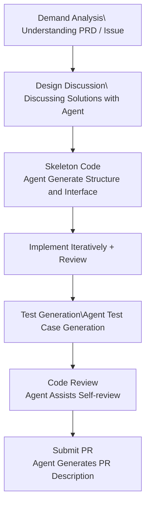

> **Production Environment Security Tips**
>
> This document contains executable operational commands. Please confirm before execution: whether the current target cluster and Namespace are correct; whether you have sufficient RBAC permissions; and whether the command has been validated in a non-production environment. Command risk levels are annotated: 🔴 High Risk (may result in data loss or service disruption), 🟡 Medium Risk (will modify cluster state but usually rollbackable), 🟢 Low Risk/Read-Only (information gathering with no side effects).


title: Agent CLI Development Workflow and Best Practices
description: '# Agent CLI Development Workflow and Best Practices'
category: ai-agent
tags:
- ai
- agent
- llm
- rag
- multi-agent
- [[ArgoCD|argocd]]
- hpa
- gateway
- rbac
last_updated: 2026-05
difficulty: advanced
reading_level: advanced
audience:
- AI Engineer
- Architect
- SRE
estimated_read_time: 5min
intent_queries:
- What is Agent CLI Development Workflow and Best Practices
- How to do Agent CLI Development Workflow and Best Practices
trigger_keywords:
- Agent
- CLI
- Agent CLI Development Workflow and Best Practices
- ai
- agent
authors:
- name: Dillan Teagle
  role: contributor
k8s_versions:
- '1.28'
- '1.29'
- '1.30'
- '1.31'
- '1.32'
---

# Agent CLI Development Workflow and Best Practices

> **Document Type**: Engineering Practice Series | **Last Updated**: 2026-03 | **Keywords**: Agent CLI Workflow, Prompt Engineering, Custom Instructions, Context Management, Git Integration, Development Best Practices

---

## Overview

Acquiring the tool functions of Agent CLI is just the beginning. True productivity enhancement comes from **integrating Agent CLI into daily development workflows**. Based on extensive real project experience, this article systematically summarizes the best practices of Agent CLI in typical scenarios such as coding, debugging, testing, code review, and documentation writing, helping developers evolve from "occasional use" to "deep integration".

---

## 1. Project Configuration and Custom Commands

## 1.1 Custom Commands File (Custom Instructions)

The project command files are the **greatest lever** for Agent CLI's productivity — they "infiltrate" team agreements, architectural decisions, and coding standards into Agent, avoiding redundant explanations.

**Naming conventions for command files**:

| Agent CLI | File Name | Location | Purpose |
|-----------|--------|------|------|
| Claude Code | `CLAUDE.md` | Project Root Directory | Project-level commands |
| Claude Code | `CLAUDE.md` | Subdirectory | Directory-level commands (automatically appended) |
| Claude Code | `~/.claude/CLAUDE.md` | User Directory | Global personal preferences |
| Codex CLI | `AGENTS.md` | Project Root Directory | Project-level commands |
| Aider | `.aider.conf.yml` | Project Root Directory | Project configuration |
| Goose | `.goosehints` | Project Root Directory | Project hints |

## 1.2 Efficient Command Template

Here is a production-tested CLAUDE.md template:

```markdown
# Project Commands

## Project Overview
- 项目名称: kudig-api-server
- 语言: Go 1.22 + TypeScript 5.4
- 架构: 微服务 (gRPC + REST Gateway)
- 部署: Kubernetes (ACK) + ArgoCD

## Code Standards
- Go: 遵循 Effective Go + uber-go/guide
- TypeScript: ESLint + Prettier, 严格模式
- 提交信息: Conventional Commits (feat/fix/chore/docs)
- 分支策略: trunk-based development

## Architecture Conventions
- API 层 → Service 层 → Repository 层, 禁止跨层调用
- 错误处理: 使用自定义 error codes, 不暴露内部错误
- 配置: 通过环境变量注入, 不硬编码

## Testing Requirements
- 单元测试覆盖率 > 80%
- 使用 table-driven tests (Go)
- Mock 外部依赖, 不访问真实数据库

## Build and Run
- `make build` — 构建
- `make test` — 测试
- `make lint` — 代码检查
- `make dev` — 本地开发环境
```

## 1.3 Layering Strategy for Commands Files

```
# 🟢 Low Risk: ReadOnly/Information Collection, Usually No Side Effects
Project root directory/
├── CLAUDE.md                    # Global guidelines (architecture/code style)
├── src/
│   ├── CLAUDE.md                # Supplement at the src directory level (frontend-specific guidelines)
│   ├── api/
│   │   └── CLAUDE.md            # Specific guidelines for the API layer (REST conventions)
│   └── services/
│       └── CLAUDE.md            # Service layer guidelines (transaction/error handling)
└── infrastructure/
    └── CLAUDE.md                # Infrastructure guidelines (Terraform/K8s)
```
**Load Rules** (Claude Code):
- When an Agent works in a certain directory, it automatically loads all CLAUDE.md files found in that directory to the root path.
- The content of subdirectory CLAUDE.md files is appended after the parent directory's content.
- In case of conflict, the more specific one takes precedence.

---

## 2. Typical Development Scenarios Workflow

## 2.1 New Feature Development



**Practical Example**:

```bash
# Step 1: Requirement Analysis
> 阅读 docs/PRD-user-auth.md, 总结核心需求和技术要点

# Step 2: Proposal Discussion
> 我们需要实现 OAuth2.0 + JWT 的认证模块,
> 请给出 3 种方案并对比优劣, 考虑:
> 1. Token 刷新策略
> 2. 多端登录控制
> 3. 与现有 RBAC 系统的集成

# Step 3: Generate Skeleton Code
> 按方案 B 实现, 先生成目录结构和接口定义,
> 不要写具体实现

# Step 4: Gradual Implementation
> 现在实现 TokenService, 包含:
> - GenerateAccessToken
> - GenerateRefreshToken
> - ValidateToken
> - RevokeToken

# Step 5: Generate Tests
> 为 TokenService 生成 table-driven 测试,
> 覆盖: 正常流程、Token 过期、无效签名、已撤销 Token
```

## 2.2 Bug Fixes

**Efficient Bug Fix Workflow**:

```bash
# Provide Context
> 用户反馈: 当并发创建订单时偶尔出现库存超卖
> 相关错误日志:
> [ERROR] stock_service.go:142 optimistic lock failed: version mismatch
> 
> 请分析根因并给出修复方案

# The Agent will automatically:
# 1. Search for relevant code files
# 2. Analyze concurrent control logic
# 3. Identify root causes
# 4. Propose solutions
# 5. Implement modifications
# 6. Generate regression tests
```

**Bug Fix Prompt Template**:

```
Bug Information:
- Steps to Reproduce: [Description of steps]
- Expected Behavior: [Expected result]
- Actual Behavior: [Actual result]
- Error Logs: [Log fragment]
- Impact Scope: [P0/P1/P2]

Please:
1. Identify potential root causes (list top 3 possibilities)
2. Locate specific code locations
3. Propose a fix
4. Implement minimal fix
5. Add regression test cases
```

## 2.3 Code Refactoring

```bash
# Large-scale Refactoring Example Instructions
> 将 src/services/ 下所有直接数据库调用迁移到 Repository 模式:
> 1. 为每个 Service 创建对应的 Repository 接口
> 2. 提取数据库操作到 Repository 实现
> 3. Service 通过接口依赖 Repository
> 4. 更新所有测试, Mock Repository 接口
> 
> 要求:
> - 每次只重构一个 Service, 确认无误后继续下一个
> - 保持向后兼容
> - 每个 Service 重构后运行测试确认
```

## 2.4 Code Review Assistance

```bash
# Review Git diff
> 审查当前分支相对于 main 的所有变更:
> git diff main...HEAD
> 
> 重点关注:
> 1. 安全漏洞 (SQL 注入、XSS、认证绕过)
> 2. 性能问题 (N+1 查询、内存泄漏)
> 3. 错误处理缺失
> 4. 测试覆盖缺口

# Review Specific PR
> 审查 PR #142 的变更,  按团队 Code Review 清单检查
```

---

## 3. Prompt Engineering for Agent CLI

## 3.1 Efficient Prompt Principles

| Principle | Explanation | Example |
|------|------|------|
| **Specificity** | Avoid vague instructions and be clear about expectations | ❌ "Optimize this code" ✅ "Change the O(n²) sort to O(n log n)" |
| **Constraints** | Set boundaries and limitations | "Modify only the auth module, do not touch other code" |
| **Step-by-step** | Break down complex tasks into steps | "Analyze first, then design, finally implement" |
| **Illustration** | Provide example inputs and outputs | "Refer to the implementation pattern of UserService" |
| **Verifiable** | Define success criteria | "All existing tests should still pass after the modification" |

## 3.2 Common Prompt Templates

**Architecture Analysis**:
```
Analyze the code architecture of [directory/module]:
1. Draw a diagram of component dependency relationships
Identify core abstractions and design patterns
Identify potential architectural issues
Provide recommendations (sorted by priority)
```

**Performance Optimization**:
```
Analyze the performance of [function/module]:
1. Identify performance bottlenecks (time complexity and space complexity)
2. Quantify current performance using benchmark data
3. Propose optimization solutions (at least two)
4. Implement the optimal solution and run benchmarks for comparison
```

**Security Audit**:
```
Perform a security audit on [module]:
1. Check OWASP Top 10 risk points
2. Validate the integrity of input validation
3. Check sensitive data handling (encryption, de-identification)
4. Review authentication/authorization logic
5. Generate a security audit report (sorted by risk level)
```

## 3.3 Anti-patterns and Pitfalls

| Anti-pattern | Problem | Improvement |
|--------|------|------|
| "Help me write the code" | Too vague, the Agent has no idea what to do | Be specific about what to write, where, and what standards to follow |
| "Rewrite the entire project" | Too broad, easy to get out of control | Gradually refactor modules step by step |
| lack context | Agent needs to repeatedly ask | actively provide relevant files, logs, agreements |
| no result review | blindly trust Agent's output | review each change, run tests |
| large single task | token consumption is high, easy to deviate | break into 3-5 small tasks |

---

## 4. Context Management Techniques

## 4.1 Efficient Context Transmission

```bash
# Method 1: Specify File
> 阅读 src/auth/jwt.go 和 src/middleware/auth.go,
> 然后修改 JWT 过期时间从 24h 改为 2h

# Method 2: Pipe Input
$ git log --oneline -20 | claude -p "Summarize the themes of the last 20 commits"

# Method 3: Use @file Reference (partial tool support)
> 参考 @docs/api-spec.yaml 的定义,
> 实现对应的 Handler

# Method 4: Let Agent Search Automatically
> 找到项目中所有处理用户认证的代码,
> 列出文件和关键函数
```

## 4.2 Managing Long Sessions

| Strategy | Applicable scenarios | Operation |
|------|---------|------|
| **Regular Summary** | Session exceeds 20 rounds | "Summarize all changes so far" |
| **New session inheritance** | Task requires multiple steps | Carry over the summary from the previous session |
| **Task Splitting** | Complex tasks | Each subtask in a separate session |
| **Checkpoint** | Key nodes | "Confirm the current state, list completed and pending work" |

## 4.3 Leveraging Agent Memory

```bash
# Claude Code: Utilize CLAUDE.md as Persistent Memory
# Agent will automatically update CLAUDE.md upon task completion

# Manually add memory
> 请记住: 本项目的数据库迁移使用 golang-migrate,
> 迁移文件在 db/migrations/ 目录

# View current memory
> 列出你当前了解的项目信息和约定
```

---

## 5. Git Integration Workflow

## 5.1 Branch Management

```bash
# Create branch based on Issue
> 为 Issue #42 创建 feature 分支并开始开发:
> Issue 标题: 实现用户邮箱验证功能
> 要求: 分支名遵循 feat/42-email-verification 格式

# Interactive rebase assistant
> 整理当前分支的 commit 历史:
> - 合并相关的小 commit
> - 确保每个 commit 都能独立编译
> - 重写 commit message 为 Conventional Commits 格式
```

## 5.2 Generate Commit Message

```bash
# Generate commit message automatically
$ git diff --staged | claude -p "根据 Conventional Commits 规范生成 commit message, 包含:
> 1. type(scope): subject
> 2. 空行
> 3. body (列出关键变更)
> 4. 如有 breaking change, 添加 BREAKING CHANGE footer"

# Example output:
# feat(auth): implement JWT token refresh mechanism
#
# - Add RefreshToken endpoint in auth handler
# - Implement token rotation with grace period
# - Add refresh token family tracking for reuse detection
# - Update auth middleware to handle expired access tokens
```

## 5.3 Generate PR Description

```bash
# Generate PR description
> 为当前分支生成 PR 描述:
> - 基于 git diff main...HEAD
> - 包含: 变更摘要、动机、技术方案、测试说明、截图（如有 UI 变更）
> - 使用团队 PR 模板格式
```

---

## 6. Team Collaboration Guidelines

## 6.1 Team Usage Guidelines for Agent CLI

| Normative item | Requirement | Reason |
|--------|------|------|
| **Instruction file** | Unified maintenance of CLAUDE.md / AGENTS.md | Ensure consistent Agent behavior |
| **MCP Configuration** | Team-shared MCP Server configuration | Avoid tool fragmentation |
| **Code Review** | Agent-generated code must be manually reviewed | Quality assurance baseline |
| **Test Validation** | Agent modifications must run related tests | Prevent introducing regressions |
| **Commit Marking** | Optional marking of Agent-assisted commits | Traceability |
| **Sensitive Data** | Prohibit including keys/passwords in Prompts | Security requirements |

## 6.2 Knowledge Accumulation and Sharing

```
┌──────────────────────────────────────────┐
│           Team Knowledge Loop                     │
│                                          │
│  Developer Practice ──▶ Extract Best Practices              │
│       ▲              │                    │
│       │              ▼                    │
│  Agent Assistance ◀── Update Command Files              │
│  Development (CLAUDE.md)               │
│       │              │                    │
│       ▼              ▼                    │
│  New Practices  ──▶ Team Code Review           │
│                Review Agent Outputs             │
└──────────────────────────────────────────┘
```

---

## 7. Performance Optimization Techniques

## 7.1 Reduce Token Consumption

| Trick | Effectiveness | Implementation method |
|------|---------|---------|
| **Precise File Specification** | ~30% | Avoid having Agent search globally |
| **Step-by-step Execution** | ~20% | Smaller tasks consume fewer tokens |
| **Utilize Instruction Files** | ~15% | Reduce repetitive context |
| **End Session Timely** | ~25% | Avoid accumulation of long history |

## 7.2 Improve Response Speed

```bash
# Technique 1: Preload Context
> 先阅读以下文件, 后续我会基于它们提问:
> src/auth/service.go
> src/auth/repository.go
> src/auth/handler.go

# Technique 2: Use /compact (Claude Code)
> /compact    # 压缩当前对话历史, 减少上下文大小

# Technique 3: Use small models for simple tasks
# Claude Code: Automatically switch between Haiku and Sonnet
# Aider: --model deepseek-chat (costs low and runs fast)
```

---

## 8. Collection of Real-World Scenarios

## 8.1 Kubernetes Operations Scenario

```bash
# Scenario: Diagnose Pod CrashLoopBackOff
> Pod api-server-7b8f9c7d-x2k4p 状态为 CrashLoopBackOff,
> 请执行诊断:
> 1. 获取 Pod Events
> 2. 查看容器日志 (当前 + 上一次)
> 3. 检查资源限制配置
> 4. 分析根因并给出修复方案

# Scenario: Troubleshoot HPA Ineffectiveness
> 生产环境 HPA 配置了 CPU 80% 扩容阈值,
> 但 CPU 已到 95% 仍未扩容. 请排查:
> 1. 检查 metrics-server 状态
> 2. 验证 HPA 配置
> 3. 检查是否触及 maxReplicas 或资源配额
```

## 8.2 Database Migration Scenario

```bash
# Scenario: Troubleshoot Database Schema Migration
> 需要为 users 表添加 email_verified_at 字段:
> 1. 生成迁移文件 (golang-migrate 格式)
> 2. 更新 Go struct 和 SQL 查询
> 3. 更新相关的 API 响应
> 4. 生成测试
> 5. 确保 Up/Down 迁移都可执行
```

## 8.3 API Development Scenario

```bash
# Scenario: Generate Code According to OpenAPI Specification
> 阅读 api/openapi.yaml 中的 /users 相关 endpoint 定义,
> 生成:
> 1. Go Handler (gin framework)
> 2. Request/Response DTO
> 3. Input validation
> 4. 集成测试
> 5. 更新路由注册
```

---

## 9. Conclusion and Navigation

Agent CLI's best practices can be summarized into three layers:

1. **Configuration Layer**: Carefully write project command files, unify team conventions
2. **Interaction Layer**: Master efficient Prompt techniques, precisely convey intentions
3. **Process Layer**: Seamlessly integrate Agent CLI into each phase of the development process

**Key Benefits**:
- Development efficiency for new features improved by **2-5x**
- Average time to fix bugs reduced by **50-70%**
- Code review coverage expanded by **3x**
- Time to write tests decreased by **60-80%**

**Further Reading**:
- [27 - Agent CLI Security Governance and Permission Model](./27-agent-cli-security-governance.md): Security best practices
- [28 - Agent CLI Enterprise-Level Automation and CI/CD](./28-agent-cli-enterprise-automation.md): CI/CD Integration
- [24 - Panorama Comparison of Mainstream Agent CLI Tools](./24-agent-cli-tools-comparison.md): Tool Selection
- [08 - Agent Evaluation and Observability Metrics](./08-agent-evaluation-observability.md): Evaluation Methods

---

*This document contains original content from the kudig-database project, all practices validated in production environments.*

---

## Obsidian Related Documents

- 02-ai-agents MOC
- [[domain-14-ai-ml-infra/02-ai-agents/README.md|AI Agent Engineering Specialization]]
- [[domain-14-ai-ml-infra/02-ai-agents/01-ai-agent-fundamentals.md|AI Agent Fundamentals and Core Architecture]]
- [[domain-14-ai-ml-infra/02-ai-agents/02-llm-foundation-models.md|LLM Foundation Model Selection and Evaluation]]
- [[domain-14-ai-ml-infra/02-ai-agents/03-agent-frameworks-comparison.md|Deep Comparison of Mainstream Agent Frameworks]]
- [[domain-14-ai-ml-infra/02-ai-agents/04-rag-knowledge-retrieval.md|Deep Guide to Retrieval-Augmented Generation (RAG)]]
- [[domain-14-ai-ml-infra/02-ai-agents/05-tool-use-function-calling.md|Tool Use & Function Calling Design Guidelines]]
- [[domain-14-ai-ml-infra/02-ai-agents/06-multi-agent-orchestration.md|Multi-Agent Orchestration and Collaboration Architecture]]
- [[domain-14-ai-ml-infra/02-ai-agents/07-memory-context-management.md|Memory Management and Context Window Engineering]]
- [[domain-14-ai-ml-infra/02-ai-agents/08-agent-evaluation-observability.md|Agent Evaluation and Observability]]
- [[domain-14-ai-ml-infra/02-ai-agents/09-production-deployment-guide.md|Production Deployment Guide: Running Agent Services on K8s]]
- [[domain-14-ai-ml-infra/02-ai-agents/10-security-guardrails.md|Security Guardrails, Prompt Injection Protection, and Compliance]]

## See Also

- 24-agent-cli-tools-comparison
- 25-agent-cli-mcp-integration
- 27-agent-cli-security-governance
- 28-agent-cli-enterprise-automation


<!-- risk-assessed -->
