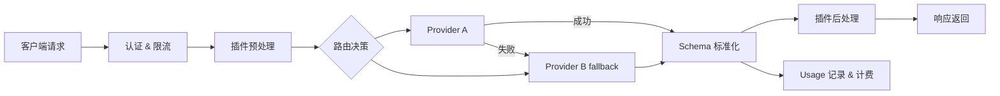
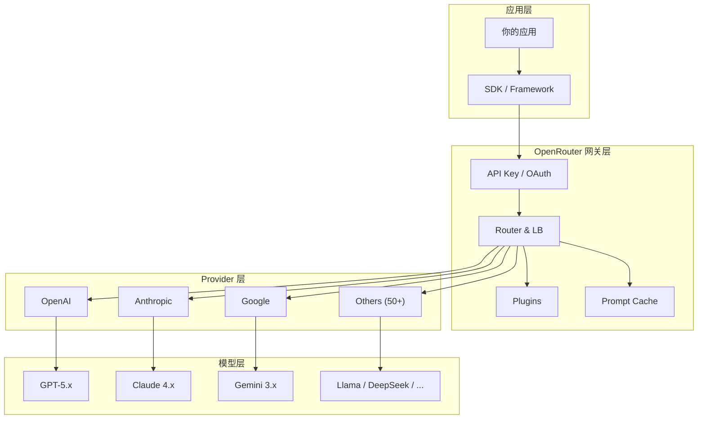

> **生产环境安全提示**
>
> 本文档包含可直接执行的运维命令。执行前请确认：当前目标集群与 Namespace 是否正确；是否具备足够的 RBAC 权限；是否已在非生产环境验证。命令风险等级标注：🔴 高风险（可能造成数据丢失或服务中断）、🟡 中风险（会修改集群状态，但通常可回滚）、🟢 低风险/只读（信息收集，无副作用）。


# OpenRouter 概述与核心架构

> **文档类型**: 概念与架构 | **最后更新**: 2026-03 | **关键词**: OpenRouter, Unified LLM API, AI Gateway, Provider Routing, Architecture, Multi-Model

---

## 概述

**OpenRouter** 是全球最大的统一 LLM API 网关平台，通过单一 API 端点 (`/api/v1/chat/completions`) 提供对 400+ AI 模型的访问，完全兼容 OpenAI SDK。本文介绍 OpenRouter 的项目定位、核心能力矩阵、统一网关架构、请求生命周期、核心设计原则以及与主流竞品的对比分析。

---

## 1. OpenRouter 是什么

**OpenRouter** 是全球最大的统一 LLM API 网关平台，通过单一 API 端点提供对 **400+ AI 模型** 的访问。它充当应用与 LLM Provider 之间的智能代理层，自动处理负载均衡、故障转移、成本优化和 Provider 差异标准化。

### 核心价值主张

| 维度 | 说明 |
|------|------|
| **统一接口** | 一个 API 端点 (`/api/v1/chat/completions`) 访问所有模型，完全兼容 OpenAI SDK |
| **透明定价** | 直通 Provider 原始定价，无推理加价（仅充值时收取 5.5% 手续费） |
| **高可用** | 自动故障转移 + 多 Provider 负载均衡，单 Provider 问题对应用透明 |
| **智能路由** | 基于价格/吞吐量/延迟的智能排序，支持性能阈值和自动模型选择 |
| **零迁移成本** | OpenAI SDK 直接兼容，仅需更改 `baseURL` 即可接入 |

---

## 2. 核心能力矩阵

| 能力类别 | 具体功能 | 状态 |
|---------|---------|------|
| **模型访问** | 400+ 模型、文本/图像/音频/Embedding 多模态 | GA |
| **智能路由** | Price-Based LB、Throughput Sort、Latency Sort、Auto Router | GA |
| **Model Fallback** | 多模型备选、Advanced Sorting with Partition | GA |
| **Prompt Caching** | OpenAI/Anthropic/DeepSeek/Gemini/Groq 缓存 + Sticky Routing | GA |
| **Structured Outputs** | JSON Schema 强制约束、json_object 模式 | GA |
| **Tool Calling** | OpenAI 兼容 Function Calling、Parallel Tool Calls | GA |
| **Web Search** | Native/Exa/Firecrawl/Parallel 四引擎、域名过滤 | GA |
| **Streaming** | SSE 实时传输、Stream Cancellation、Mid-stream Error Handling | GA |
| **多模态输入** | 图像（URL/Base64）、PDF（URL/Base64）、音频 | GA |
| **插件体系** | web / file-parser / response-healing / context-compression | GA |
| **BYOK** | 自带 Provider API Key，首 100 万次/月免费 | GA |
| **企业功能** | Provisioning Keys、EU Data Residency、Zero Data Retention | GA |
| **SDK 生态** | OpenRouter SDK (Beta)、OpenAI SDK、LangChain、Vercel AI 等 | GA |

---

## 3. 架构设计

### 3.1 统一网关架构

```
┌─────────────────────────────────────────────────────────────┐
│                      客户端应用层                              │
│  OpenAI SDK │ OpenRouter SDK │ LangChain │ Vercel AI │ curl │
└──────────────────────┬──────────────────────────────────────┘
                       │ HTTPS (OpenAI-compatible API)
                       ▼
┌─────────────────────────────────────────────────────────────┐
│                    OpenRouter Gateway                        │
│  ┌─────────┐  ┌──────────┐  ┌──────────┐  ┌─────────────┐ │
│  │ Auth &   │  │ Router & │  │ Plugin   │  │ Cache &     │ │
│  │ Rate     │  │ Load     │  │ Engine   │  │ Sticky      │ │
│  │ Limiter  │  │ Balancer │  │ (Web/PDF)│  │ Routing     │ │
│  └────┬─────┘  └────┬─────┘  └────┬─────┘  └─────┬───────┘ │
│       │              │              │               │         │
│  ┌────┴──────────────┴──────────────┴───────────────┴──────┐ │
│  │              Schema Normalizer & Transformer             │ │
│  │       (OpenAI ↔ Anthropic ↔ Google ↔ Custom Format)     │ │
│  └──────────────────────┬──────────────────────────────────┘ │
└─────────────────────────┼───────────────────────────────────┘
                          │
          ┌───────────────┼───────────────┐
          ▼               ▼               ▼
┌──────────────┐ ┌──────────────┐ ┌──────────────┐
│   OpenAI     │ │  Anthropic   │ │   Google     │
│   Provider   │ │  Provider    │ │   Provider   │
└──────────────┘ └──────────────┘ └──────────────┘
          ▼               ▼               ▼
┌──────────────┐ ┌──────────────┐ ┌──────────────┐
│  DeepSeek /  │ │  Meta /      │ │  Mistral /   │
│  xAI / Groq  │ │  Fireworks   │ │  Cohere ...  │
└──────────────┘ └──────────────┘ └──────────────┘
```

### 3.2 请求生命周期



### 3.3 核心设计原则

| 原则 | 实现方式 |
|------|---------|
| **OpenAI 兼容** | `/api/v1/chat/completions` 完全兼容 OpenAI 请求/响应 Schema |
| **Provider 透明** | Schema Normalizer 自动转换不同 Provider 的私有格式 |
| **价格直通** | 无推理加价，按 Provider 原始定价计费 |
| **缓存亲和** | Provider Sticky Routing 最大化 Prompt Cache 命中率 |
| **渐进增强** | 插件体系 (web/file-parser/response-healing) 按需启用 |
| **故障隔离** | 30 秒滑动窗口检测异常 Provider，自动降级 |

---

## 4. 与竞品对比

### 4.1 LLM API 网关对比

| 特性 | OpenRouter | Bifrost (Maxim) | Helicone | LiteLLM | Portkey |
|------|-----------|-----------------|----------|---------|---------|
| **类型** | 托管 SaaS | 自托管/托管 | 托管 SaaS | 开源/自托管 | 托管 SaaS |
| **模型数量** | 400+ | 1000+ (配置) | N/A (代理) | 100+ (配置) | 250+ |
| **定价模型** | 直通 + 充值手续费 | 自选 Provider | 直通 + 订阅 | 免费（自托管） | 直通 + 订阅 |
| **智能路由** | 价格/吞吐/延迟 LB | Go 高性能 LB | Rust 代理 | 简单 fallback | 智能路由 |
| **Auto Router** | NotDiamond 驱动 | 自适应 LB | 无 | 无 | 有 |
| **Prompt Caching** | 多 Provider 原生支持 | 语义缓存 | 无 | 无 | 有 |
| **Web Search** | 4 引擎插件 | 无 | 无 | 无 | 无 |
| **BYOK** | 支持（首 1M 免费） | 支持 | 支持 | 支持 | 支持 |
| **OpenAI 兼容** | 完全兼容 | 完全兼容 | 完全兼容 | 完全兼容 | 完全兼容 |
| **EU Residency** | 企业支持 | 自托管 | 无 | 自托管 | 有 |

### 4.2 OpenRouter 的独特优势

1. **最大模型市场**：400+ 模型一站式访问，包含免费模型变体
2. **零代码迁移**：OpenAI SDK `baseURL` 替换即用
3. **内置插件生态**：Web Search、PDF 解析、Response Healing、Context Compression
4. **Provider Sticky Routing**：为 Prompt Caching 优化的会话级亲和路由
5. **Auto Router**：NotDiamond 驱动的智能模型选择
6. **社区排行榜**：App Attribution 系统，应用可参与社区排名

---

## 5. 核心概念模型

### 5.1 概念层次



### 5.2 关键实体关系

| 实体 | 说明 | 示例 |
|------|------|------|
| **Model** | 具体的 AI 模型 | `openai/gpt-5.2`、`anthropic/claude-sonnet-4.6` |
| **Provider** | 模型推理服务商 | OpenAI、Anthropic、Fireworks、Together |
| **Variant** | 模型变体修饰符 | `:free`（免费）、`:nitro`（高吞吐）、`:online`（Web 搜索） |
| **Plugin** | 请求增强插件 | `web`、`file-parser`、`response-healing`、`context-compression` |
| **Credit** | OpenRouter 账户余额 | 预充值美元，按 token 使用量扣减 |
| **API Key** | 认证凭证 | Bearer Token，支持设置额度限制和重置策略 |

---

## 6. 适用场景

| 场景 | 为什么选择 OpenRouter | 关键特性 |
|------|---------------------|---------|
| **多模型 A/B 测试** | 一个端点切换模型，无需代码变更 | Model 参数动态切换 |
| **成本优化** | 同一模型多 Provider 比价 + 自动选择最低价 | `:floor` 变体、Price Sort |
| **高可用生产系统** | 自动故障转移，无单点问题 | Model Fallback、Provider LB |
| **快速原型** | 免费模型变体 (`:free`) + 内置 Web Search | Free Models、Plugins |
| **企业合规** | EU Data Residency + Zero Data Retention | ZDR、EU Routing |
| **Agent 工具后端** | 为 Aider、Cline、OpenCode 等 Agent 提供统一 LLM 后端 | OpenAI 兼容、BYOK |

---

## 关联文档

| 文档 | 关系 |
|------|------|
| [02 - 快速接入与环境配置](./02-openrouter-quickstart-setup.md) | 下一步：安装 SDK 并发送首次请求 |
| [04 - 智能路由与 Provider 选择](./04-openrouter-provider-routing.md) | 深入路由架构 |
| [08 - Prompt Caching 与成本优化](./08-openrouter-prompt-caching-optimization.md) | 深入缓存与成本控制 |
| [topic-coding/03](../topic-coding/03-opencode-providers-models.md) | OpenCode 中配置 OpenRouter Provider |

---

*本文档基于 OpenRouter 官方文档（openrouter.ai/docs）和高质量社区实践整理。*


<!-- risk-assessed -->
