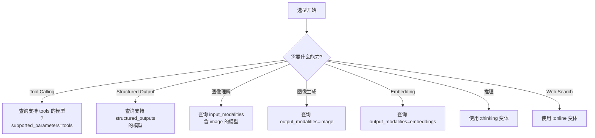

> **生产环境安全提示**
>
> 本文档包含可直接执行的运维命令。执行前请确认：当前目标集群与 Namespace 是否正确；是否具备足够的 RBAC 权限；是否已在非生产环境验证。命令风险等级标注：🔴 高风险（可能造成数据丢失或服务中断）、🟡 中风险（会修改集群状态，但通常可回滚）、🟢 低风险/只读（信息收集，无副作用）。


# 模型与 Provider 生态

> **文档类型**: 功能详解 | **最后更新**: 2026-03 | **关键词**: OpenRouter, Models, Providers, Model API, Pricing, Variants, Multimodal, Embeddings

---

## 概述

OpenRouter 是目前覆盖模型最广的统一 API 网关，支持 400+ 模型、50+ Provider。本文详细覆盖模型生态、元数据 API、模型变体系统（:free / :nitro / :online）、定价结构、模型选型策略以及支持的参数参考。

---

## 1. 模型生态概览

OpenRouter 是目前覆盖模型最广的统一 API 网关，截至 2026 年 3 月：

| 维度 | 数据 |
|------|------|
| **总模型数** | 400+ |
| **Provider 数** | 50+ |
| **输出模态** | text / image / audio / embeddings |
| **免费模型** | 20+ (`:free` 变体) |
| **推理模型** | 支持 (`:thinking` 变体) |

---

## 2. 主要 Provider 与模型

### 2.1 头部 Provider

| Provider | 代表模型 | 特点 |
|---------|---------|------|
| **OpenAI** | `openai/gpt-5.2`、`openai/gpt-5.1`、`openai/gpt-5-mini` | 旗舰通用模型，支持 Tool Calling |
| **Anthropic** | `anthropic/claude-opus-4.6`、`anthropic/claude-sonnet-4.6`、`anthropic/claude-haiku-4.5` | 长上下文、代码、推理 |
| **Google** | `google/gemini-3-pro-preview`、`google/gemini-3-flash-preview` | 多模态强、成本优 |
| **Meta** | `meta-llama/llama-3.3-70b-instruct` | 开源旗舰 |
| **DeepSeek** | `deepseek/deepseek-v3.2`、`deepseek/deepseek-r1` | 高性价比推理 |
| **xAI** | `x-ai/grok-4.1-fast` | Web + X Search 原生支持 |
| **Mistral** | `mistralai/mistral-large` | 欧洲合规首选 |
| **Cohere** | `cohere/command-r-plus` | 企业 RAG 场景 |

### 2.2 推理服务商（多模型宿主）

| Provider | 说明 |
|---------|------|
| **Fireworks** | 开源模型高性能推理 |
| **Together** | 开源模型生态 |
| **Groq** | 超低延迟推理（LPU） |
| **DeepInfra** | 经济型推理 |
| **Novita** | 多模型推理 |
| **AWS Bedrock** | 企业级托管 |
| **Azure OpenAI** | 企业合规 |
| **Google Vertex** | GCP 生态 |

---

## 3. Models API

### 3.1 获取模型列表

```bash
# 默认返回文本模型
curl https://openrouter.ai/api/v1/models

# 仅返回图像生成模型
curl "https://openrouter.ai/api/v1/models?output_modalities=image"

# 文本 + 图像模型
curl "https://openrouter.ai/api/v1/models?output_modalities=text,image"

# 所有模型（含所有模态）
curl "https://openrouter.ai/api/v1/models?output_modalities=all"

# 支持 Tool Calling 的模型
curl "https://openrouter.ai/api/v1/models?supported_parameters=tools"
```

### 3.2 模型对象 Schema

每个模型返回以下标准化字段：

| 字段 | 类型 | 说明 |
|------|------|------|
| `id` | string | 模型 ID（如 `openai/gpt-5.2`） |
| `canonical_slug` | string | 永久不变的模型标识 |
| `name` | string | 人类可读名称 |
| `created` | number | 添加时间（Unix 时间戳） |
| `description` | string | 模型能力描述 |
| `context_length` | number | 最大上下文窗口（tokens） |
| `architecture` | object | 输入/输出模态、tokenizer 类型 |
| `pricing` | object | 最低价格信息 |
| `top_provider` | object | 主要 Provider 的配置详情 |
| `supported_parameters` | string[] | 支持的 API 参数列表 |
| `expiration_date` | string/null | 模型下线日期 |

### 3.3 Architecture 对象

```json
{
  "input_modalities": ["file", "image", "text"],
  "output_modalities": ["text"],
  "tokenizer": "openai",
  "instruct_type": null
}
```

### 3.4 Pricing 对象

所有价格单位为 **USD per token/request/unit**：

```json
{
  "prompt": "0.0000025",
  "completion": "0.00001",
  "request": "0",
  "image": "0.003",
  "web_search": "0.004",
  "internal_reasoning": "0.0000025",
  "input_cache_read": "0.00000125",
  "input_cache_write": "0.000003125"
}
```

---

## 4. 模型变体系统

OpenRouter 支持通过后缀修饰符改变模型行为：

### 4.1 静态变体

| 变体 | 说明 | 示例 |
|------|------|------|
| `:free` | 免费使用，低 Rate Limit | `openai/gpt-oss-20b:free` |
| `:extended` | 超长上下文版本 | `anthropic/claude-sonnet-4.5:extended` |
| `:thinking` | 默认启用推理 | `anthropic/claude-sonnet-4.6:thinking` |

### 4.2 动态变体

| 变体 | 说明 | 等价配置 |
|------|------|---------|
| `:online` | 启用 Web 搜索 | `plugins: [{ id: "web" }]` |
| `:nitro` | 按吞吐量排序 Provider | `provider: { sort: "throughput" }` |
| `:floor` | 按价格排序 Provider | `provider: { sort: "price" }` |
| `:exacto` | 优化 Tool Calling 质量排序 | 质量优先信号排序 |

### 4.3 变体组合

变体可以叠加使用：

```bash
# 免费 + Web 搜索
"model": "openai/gpt-oss-20b:free:online"

# 高吞吐 + 推理
"model": "anthropic/claude-sonnet-4.6:thinking:nitro"
```

---

## 5. 定价体系

### 5.1 定价模型

| 计费项 | 说明 | 示例 |
|--------|------|------|
| **Prompt Tokens** | 输入 token 单价 | $2.50 / 1M tokens |
| **Completion Tokens** | 输出 token 单价 | $10.00 / 1M tokens |
| **Per Request** | 固定请求费用 | $0（大多数模型） |
| **Image Input** | 图像输入费用 | $0.003 / image |
| **Web Search** | Web 搜索费用 | $0.004 / search |
| **Reasoning Tokens** | 推理 token 费用 | 与 prompt 同价 |
| **Cache Read** | 缓存读取费用 | 0.1x~0.5x prompt 价 |
| **Cache Write** | 缓存写入费用 | 1x~2x prompt 价 |

### 5.2 费用结构

```
总费用 = 推理费用 + 充值手续费

推理费用 = Provider 原始定价（零加价直通）
充值手续费 = 5.5%（最低 $0.80）
加密货币支付 = 5% 手续费
BYOK 费用 = 首 1M 次/月免费，之后 5% 等价费用
```

### 5.3 模型价格对比示例

| 模型 | Prompt ($/1M) | Completion ($/1M) | 上下文 |
|------|:------------:|:-----------------:|:------:|
| `openai/gpt-5.2` | $2.50 | $10.00 | 128K |
| `anthropic/claude-sonnet-4.6` | $3.00 | $15.00 | 200K |
| `google/gemini-3-flash-preview` | $0.075 | $0.30 | 1M |
| `meta-llama/llama-3.3-70b-instruct` | $0.40 | $0.40 | 128K |
| `deepseek/deepseek-v3.2` | $0.27 | $1.10 | 128K |
| `openai/gpt-oss-20b:free` | $0 | $0 | 128K |

> 价格会随时间变化，请以 [Models API](https://openrouter.ai/api/v1/models) 返回的实时数据为准。

---

## 6. 模型选型策略

### 6.1 按场景选型

| 场景 | 推荐模型 | 原因 |
|------|---------|------|
| **通用对话** | `openai/gpt-5.2` | 综合能力最强 |
| **代码生成** | `anthropic/claude-sonnet-4.6` | 代码质量领先 |
| **快速原型** | `openai/gpt-oss-20b:free` | 零成本快速验证 |
| **长文档处理** | `google/gemini-3-pro-preview` | 1M token 上下文 |
| **高吞吐** | `meta-llama/llama-3.3-70b-instruct:nitro` | 开源 + Nitro 加速 |
| **最低成本** | `deepseek/deepseek-chat:floor` | 高性价比 + Floor 变体 |
| **推理任务** | `anthropic/claude-sonnet-4.6:thinking` | 内置推理能力 |
| **Web 增强** | `openai/gpt-5.2:online` | 实时 Web 搜索 |
| **自动选择** | `openrouter/auto` | NotDiamond 智能路由 |

### 6.2 按能力选型



---

## 7. 模型数量查询

```bash
# 查询模型总数
curl "https://openrouter.ai/api/v1/models/count"

# 按模态查询数量
curl "https://openrouter.ai/api/v1/models/count?output_modalities=image"
```

---

## 8. Supported Parameters 参考

模型的 `supported_parameters` 字段表明支持哪些 API 参数：

| 参数 | 说明 |
|------|------|
| `tools` | Function Calling |
| `tool_choice` | Tool 选择控制 |
| `max_tokens` | 响应长度限制 |
| `temperature` | 随机性控制 |
| `top_p` | Nucleus Sampling |
| `reasoning` | 内部推理模式 |
| `include_reasoning` | 在响应中包含推理过程 |
| `structured_outputs` | JSON Schema 强制 |
| `response_format` | 输出格式规范 |
| `stop` | 自定义停止序列 |
| `frequency_penalty` | 频率惩罚 |
| `presence_penalty` | 存在惩罚 |
| `seed` | 确定性输出 |

---

## 关联文档

| 文档 | 关系 |
|------|------|
| [02 - 快速接入](./02-openrouter-quickstart-setup.md) | 模型切换快速入门 |
| [04 - 智能路由](./04-openrouter-provider-routing.md) | Provider 选择与路由策略 |
| [08 - Prompt Caching](./08-openrouter-prompt-caching-optimization.md) | 模型级缓存与成本优化 |
| [12 - 企业级高级实践](./12-openrouter-enterprise-advanced.md) | 成本控制策略 |

---

*本文档基于 OpenRouter 官方文档（openrouter.ai/docs/models）整理。*


<!-- risk-assessed -->
