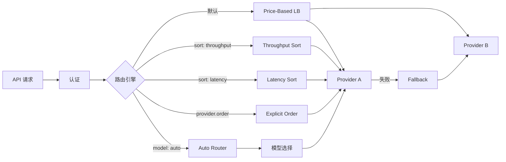
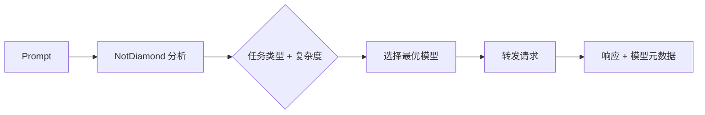

> **生产环境安全提示**
>
> 本文档包含可直接执行的运维命令。执行前请确认：当前目标集群与 Namespace 是否正确；是否具备足够的 RBAC 权限；是否已在非生产环境验证。命令风险等级标注：🔴 高风险（可能造成数据丢失或服务中断）、🟡 中风险（会修改集群状态，但通常可回滚）、🟢 低风险/只读（信息收集，无副作用）。


# 智能路由与 Provider 选择

> **文档类型**: 架构深度 | **最后更新**: 2026-03 | **关键词**: OpenRouter, Provider Routing, Load Balancing, Fallback, Auto Router, Throughput, Latency, Performance Threshold

---

## 概述

OpenRouter 的智能路由系统是其核心竞争力，负责将每个请求路由到最佳 Provider。本文详细覆盖 Price-Based 负载均衡（默认策略）、Provider 排序模式、性能阈值配置、Model Fallback、Auto Router（NotDiamond 驱动）、隐式路由行为以及生产场景路由策略选型指南。

---

## 1. 路由系统概述

OpenRouter 的智能路由系统是其核心竞争力，负责将每个请求路由到最佳 Provider：



---

## 2. 默认路由策略：Price-Based Load Balancing

OpenRouter 的默认行为是在可用 Provider 间进行基于价格的加权负载均衡：

### 2.1 默认策略流程

1. **优先稳定 Provider**：排除最近 30 秒内出现显著问题的 Provider
2. **价格加权选择**：在稳定 Provider 中按价格反平方权重随机选择
3. **Fallback 备份**：将不稳定 Provider 作为最后兜底

### 2.2 价格加权算法

权重计算公式：`weight = 1 / price²`

**示例**：Provider A ($1/M)、B ($2/M)、C ($3/M)，B 近期有问题：

| Provider | 价格 | 权重 (1/p²) | 首选概率 | 顺序 |
|----------|------|:----------:|:--------:|------|
| A | $1 | 1.0 | 90% | 第一 |
| C | $3 | 0.11 | 10% | 第二 |
| B (不稳定) | $2 | - | - | 兜底 |

> 设置 `sort` 或 `provider.order` 后，负载均衡将被禁用。

---

## 3. Provider 排序

### 3.1 三种排序模式

| 排序模式 | 说明 | 快捷方式 |
|---------|------|---------|
| `"price"` | 按价格升序 | `:floor` 变体 |
| `"throughput"` | 按吞吐量降序 | `:nitro` 变体 |
| `"latency"` | 按延迟升序 | - |

```typescript
// 按吞吐量排序
const completion = await openRouter.chat.send({
  model: 'meta-llama/llama-3.3-70b-instruct',
  messages: [{ role: 'user', content: 'Hello' }],
  provider: {
    sort: 'throughput',
  },
  stream: false,
});

// 等价写法：使用 :nitro 快捷方式
const fast = await openRouter.chat.send({
  model: 'meta-llama/llama-3.3-70b-instruct:nitro',
  messages: [{ role: 'user', content: 'Hello' }],
  stream: false,
});
```

---

## 4. Provider 偏好配置

`provider` 对象是路由控制的核心，支持以下字段：

| 字段 | 类型 | 默认值 | 说明 |
|------|------|--------|------|
| `order` | string[] | - | 指定 Provider 尝试顺序 |
| `allow_fallbacks` | boolean | true | 是否允许备选 Provider |
| `require_parameters` | boolean | false | 仅使用支持所有请求参数的 Provider |
| `data_collection` | "allow"/"deny" | "allow" | 控制是否使用可能存储数据的 Provider |
| `zdr` | boolean | - | 仅使用 Zero Data Retention Provider |
| `only` | string[] | - | 白名单 Provider |
| `ignore` | string[] | - | 黑名单 Provider |
| `quantizations` | string[] | - | 量化级别过滤 (int4/int8) |
| `sort` | string/object | - | 排序策略 |
| `preferred_min_throughput` | number/object | - | 首选最低吞吐量 (tokens/sec) |
| `preferred_max_latency` | number/object | - | 首选最大延迟 (seconds) |
| `max_price` | object | - | 最大价格限制 |

### 4.1 指定 Provider 顺序

```json
{
  "model": "anthropic/claude-sonnet-4.6",
  "provider": {
    "order": ["anthropic", "aws-bedrock", "google-vertex"],
    "allow_fallbacks": true
  }
}
```

### 4.2 仅使用特定 Provider

```json
{
  "model": "meta-llama/llama-3.3-70b-instruct",
  "provider": {
    "only": ["fireworks", "together"],
    "ignore": ["novita"]
  }
}
```

### 4.3 量化级别过滤

```json
{
  "model": "meta-llama/llama-3.3-70b-instruct",
  "provider": {
    "quantizations": ["int8", "fp16"]
  }
}
```

---

## 5. 性能阈值

### 5.1 吞吐量阈值

```json
{
  "provider": {
    "preferred_min_throughput": 50
  }
}
```

### 5.2 延迟阈值

```json
{
  "provider": {
    "preferred_max_latency": 2.0
  }
}
```

### 5.3 百分位阈值（精确控制）

OpenRouter 基于 5 分钟滚动窗口跟踪性能指标：

```json
{
  "provider": {
    "preferred_min_throughput": {
      "p50": 40,
      "p90": 25
    },
    "preferred_max_latency": {
      "p50": 1.0,
      "p90": 3.0,
      "p99": 5.0
    }
  }
}
```

| 百分位 | 含义 |
|--------|------|
| **p50** | 50% 请求优于此值（中位数） |
| **p75** | 75% 请求优于此值 |
| **p90** | 90% 请求优于此值（推荐用于 SLA） |
| **p99** | 99% 请求优于此值（极端场景） |

> 性能阈值是"首选"而非"强制"——不满足阈值的 Provider 被降级但不被排除。

### 5.4 价格上限

```json
{
  "provider": {
    "max_price": {
      "prompt": "0.000005",
      "completion": "0.00002"
    }
  }
}
```

> `max_price` 是硬限制——如果没有 Provider 满足价格要求，请求将失败。

---

## 6. Model Fallback

### 6.1 基本 Fallback

```json
{
  "models": [
    "anthropic/claude-sonnet-4.6",
    "openai/gpt-5.2",
    "google/gemini-3-pro-preview"
  ],
  "route": "fallback"
}
```

### 6.2 Advanced Sorting with Partition

| 字段 | 默认值 | 说明 |
|------|--------|------|
| `sort.by` | - | 排序策略 (price/throughput/latency) |
| `sort.partition` | "model" | 分组方式："model"（默认按模型分组）或 "none"（全局排序） |

**场景一：路由到最高吞吐量的模型/Provider**

```typescript
const completion = await openRouter.chat.send({
  models: [
    'anthropic/claude-sonnet-4.5',
    'openai/gpt-5-mini',
    'google/gemini-3-flash-preview',
  ],
  messages: [{ role: 'user', content: 'Hello' }],
  provider: {
    sort: {
      by: 'throughput',
      partition: 'none',  // 跨模型全局排序
    },
  },
  stream: false,
});
```

> `partition: "none"` 移除模型分组限制，允许在所有模型的所有 Provider 中全局排序。

---

## 7. Auto Router

Auto Router (`openrouter/auto`) 由 **NotDiamond** 驱动，自动分析 prompt 并选择最优模型：

### 7.1 基本使用

```typescript
const completion = await openRouter.chat.send({
  model: 'openrouter/auto',
  messages: [
    { role: 'user', content: 'Explain quantum entanglement' },
  ],
});

// 查看实际使用的模型
console.log('Model used:', completion.model);
```

### 7.2 工作原理



### 7.3 限制 Auto Router 模型范围

```typescript
const completion = await openRouter.chat.send({
  model: 'openrouter/auto',
  messages: [{ role: 'user', content: 'Hello' }],
  plugins: [
    {
      id: 'auto-router',
      allowed_models: ['anthropic/*', 'openai/gpt-5.1'],
    },
  ],
});
```

**通配符模式**：

| 模式 | 匹配 |
|------|------|
| `anthropic/*` | 所有 Anthropic 模型 |
| `openai/gpt-5*` | 所有 GPT-5 变体 |
| `*/claude-*` | 任何 Provider 的 Claude 模型 |

---

## 8. 隐式路由行为

OpenRouter 还有一些自动路由行为：

| 场景 | 自动行为 |
|------|---------|
| 请求包含 `tools`/`tool_choice` | 仅路由到支持 Tool Calling 的 Provider |
| 设置 `max_tokens` | 仅路由到支持该长度响应的 Provider |
| 请求包含 `response_format` | 仅路由到支持 Structured Outputs 的 Provider |
| `require_parameters: true` | 仅路由到支持所有请求参数的 Provider |

---

## 9. 路由策略选型指南

| 场景 | 推荐配置 |
|------|---------|
| **一般生产** | 默认 Price-Based LB（无需配置） |
| **延迟敏感** | `sort: "latency"` + `preferred_max_latency` |
| **高吞吐批处理** | `sort: "throughput"` 或 `:nitro` |
| **最低成本** | `sort: "price"` 或 `:floor` |
| **合规要求** | `zdr: true` + `data_collection: "deny"` |
| **特定 Provider** | `only: ["anthropic"]` |
| **智能选模型** | `model: "openrouter/auto"` |
| **跨模型最快** | Fallback + `sort: { by: "throughput", partition: "none" }` |

---

## 关联文档

| 文档 | 关系 |
|------|------|
| [03 - 模型与 Provider 生态](./03-openrouter-models-providers.md) | Provider 与模型元数据 |
| [05 - API 参考](./05-openrouter-api-reference.md) | provider 参数详解 |
| [08 - Prompt Caching](./08-openrouter-prompt-caching-optimization.md) | Sticky Routing 与缓存亲和 |
| [11 - 安全与隐私](./11-openrouter-[[domain-05-security-compliance/README.md|security]]-privacy.md) | ZDR 与数据治理路由 |

---

*本文档基于 OpenRouter 官方文档（openrouter.ai/docs/guides/routing）整理。*


<!-- risk-assessed -->
