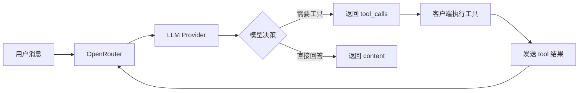

> **生产环境安全提示**
>
> 本文档包含可直接执行的运维命令。执行前请确认：当前目标集群与 Namespace 是否正确；是否具备足够的 RBAC 权限；是否已在非生产环境验证。命令风险等级标注：🔴 高风险（可能造成数据丢失或服务中断）、🟡 中风险（会修改集群状态，但通常可回滚）、🟢 低风险/只读（信息收集，无副作用）。


# Structured Outputs 与 Tool Calling

> **文档类型**: 功能详解 | **最后更新**: 2026-03 | **关键词**: OpenRouter, Structured Outputs, JSON Schema, Tool Calling, Function Calling, Response Healing, Parallel Tools

---

## 概述

OpenRouter 支持 **Structured Outputs**（JSON Schema 强制约束输出）和 **Tool Calling**（函数调用）两大核心能力。本文覆盖 json_object 与 json_schema 两种模式、Response Healing 插件、Tool Calling 完整流程、tool_choice 控制、并行工具调用、跨 Provider 兼容性以及最佳实践。

---

## 1. Structured Outputs

### 1.1 概述

Structured Outputs 允许你强制模型按照指定的 JSON Schema 格式生成响应，解决以下问题：

- 确保响应格式一致、类型安全
- 避免解析错误和字段幻觉
- 简化应用端的响应处理逻辑

### 1.2 两种模式

| 模式 | 说明 | 适用场景 |
|------|------|---------|
| `json_object` | 基本 JSON 模式，保证输出有效 JSON | 简单 JSON 响应 |
| `json_schema` | 严格 Schema 模式，输出精确匹配 Schema | 结构化数据提取 |

### 1.3 使用示例

```typescript
import { OpenRouter } from '@openrouter/sdk';

const openRouter = new OpenRouter({ apiKey: process.env.OPENROUTER_API_KEY });

const response = await openRouter.chat.send({
  model: 'openai/gpt-5.2',
  messages: [
    { role: 'user', content: 'What is the weather like in London?' },
  ],
  responseFormat: {
    type: 'json_schema',
    jsonSchema: {
      name: 'weather',
      strict: true,
      schema: {
        type: 'object',
        properties: {
          location: {
            type: 'string',
            description: 'City or location name',
          },
          temperature: {
            type: 'number',
            description: 'Temperature in Celsius',
          },
          conditions: {
            type: 'string',
            description: 'Weather conditions description',
          },
        },
        required: ['location', 'temperature', 'conditions'],
        additionalProperties: false,
      },
    },
  },
  stream: false,
});

const weather = JSON.parse(response.choices[0].message.content);
// { location: "London", temperature: 18, conditions: "Partly cloudy" }
```

### 1.4 支持的模型

| Provider | 支持情况 |
|---------|---------|
| **OpenAI** | GPT-4o 及更高版本 |
| **Anthropic** | Claude Sonnet 4.5+、Opus 4.1+ |
| **Google Gemini** | Gemini 模型 |
| **开源模型** | 大多数开源模型 |
| **Fireworks** | 所有 Fireworks 提供的模型 |

### 1.5 确保使用支持的 Provider

```json
{
  "model": "openai/gpt-5.2",
  "provider": {
    "require_parameters": true
  },
  "response_format": {
    "type": "json_schema",
    "json_schema": { "..." }
  }
}
```

> `require_parameters: true` 确保仅路由到支持 Structured Outputs 的 Provider。

### 1.6 Streaming + Structured Outputs

Structured Outputs 支持流式响应，模型会流式输出合法的 JSON 片段：

```json
{
  "stream": true,
  "response_format": {
    "type": "json_schema",
    "json_schema": { "..." }
  }
}
```

---

## 2. Response Healing

### 2.1 概述

Response Healing 插件自动验证和修复模型返回的格式错误 JSON：

| 修复类型 | 输入示例 | 修复后 |
|---------|---------|--------|
| 缺少括号 | `{"name": "Alice", "age": 30` | `{"name": "Alice", "age": 30}` |
| Markdown 包裹 | `` ```json{"name": "Bob"}``` `` | `{"name": "Bob"}` |
| 混合文本 | `Here's the data:{"name": "Charlie"}` | `{"name": "Charlie"}` |
| 尾随逗号 | `{"name": "David",}` | `{"name": "David"}` |
| 未引用键 | `{name: "Eve"}` | `{"name": "Eve"}` |

### 2.2 启用 Response Healing

```json
{
  "model": "openai/gpt-5.2",
  "messages": [
    { "role": "user", "content": "Generate a product listing" }
  ],
  "response_format": {
    "type": "json_schema",
    "json_schema": {
      "name": "Product",
      "schema": {
        "type": "object",
        "properties": {
          "name": { "type": "string" },
          "price": { "type": "number" }
        },
        "required": ["name", "price"]
      }
    }
  },
  "plugins": [
    { "id": "response-healing" }
  ]
}
```

### 2.3 限制

- 仅适用于**非流式**请求
- 被 `max_tokens` 截断的 JSON 无法修复
- 严重格式错误仍可能无法修复

---

## 3. Tool Calling 深度指南

### 3.1 架构原理



### 3.2 完整 Tool Calling 流程

**Step 1：定义工具并发送请求**

```typescript
const response = await openRouter.chat.send({
  model: 'openai/gpt-5.2',
  messages: [
    { role: 'user', content: 'What is the weather in Tokyo and London?' },
  ],
  tools: [
    {
      type: 'function',
      function: {
        name: 'get_weather',
        description: 'Get current weather for a location',
        parameters: {
          type: 'object',
          properties: {
            location: { type: 'string', description: 'City name' },
            unit: {
              type: 'string',
              enum: ['celsius', 'fahrenheit'],
              description: 'Temperature unit',
            },
          },
          required: ['location'],
        },
      },
    },
  ],
  tool_choice: 'auto',
  parallel_tool_calls: true,  // 允许并行调用
  stream: false,
});
```

**Step 2：处理 Tool Calls**

```typescript
const toolCalls = response.choices[0].message.tool_calls;

// 模型可能返回多个并行 tool_calls
for (const call of toolCalls) {
  console.log(`Tool: ${call.function.name}`);
  console.log(`Args: ${call.function.arguments}`);
}
```

**Step 3：返回工具结果**

```typescript
const followUp = await openRouter.chat.send({
  model: 'openai/gpt-5.2',
  messages: [
    { role: 'user', content: 'What is the weather in Tokyo and London?' },
    response.choices[0].message, // 包含 tool_calls 的 assistant 消息
    {
      role: 'tool',
      tool_call_id: toolCalls[0].id,
      content: JSON.stringify({ temp: 22, condition: 'Sunny' }),
    },
    {
      role: 'tool',
      tool_call_id: toolCalls[1].id,
      content: JSON.stringify({ temp: 15, condition: 'Cloudy' }),
    },
  ],
  tools: [/* same tools */],
  stream: false,
});
```

### 3.3 Tool Choice 控制

| 值 | 行为 |
|----|------|
| `"none"` | 禁止使用任何工具 |
| `"auto"` | 模型自行决定是否调用（默认） |
| `"required"` | 必须调用至少一个工具 |
| `{ type: "function", function: { name: "xxx" } }` | 强制调用指定工具 |

### 3.4 Parallel Tool Calls

```json
{
  "parallel_tool_calls": true
}
```

当设为 `true`（默认），模型可以在单次响应中同时调用多个工具。设为 `false` 则强制串行调用。

### 3.5 跨 Provider 兼容性

| Provider | 原生支持 | OpenRouter 处理 |
|---------|---------|----------------|
| **OpenAI** | 完全原生 | 直通 |
| **Anthropic** | 原生（格式略不同） | 自动转换为 OpenAI 格式 |
| **Google** | 原生 | 自动转换 |
| **开源模型** | 部分支持 | 转换为 YAML 模板 |

> OpenRouter 统一将所有 Provider 的 Tool Calling 格式标准化为 OpenAI Schema。

---

## 4. Tool Calling 质量优化

### 4.1 使用 :exacto 变体

```json
{
  "model": "openai/gpt-5.2:exacto"
}
```

`:exacto` 变体使用质量优先信号排序 Provider，专门优化 Tool Calling 的可靠性。

### 4.2 确保 Provider 支持

```json
{
  "provider": {
    "require_parameters": true
  },
  "tools": [{ "..." }]
}
```

当请求包含 `tools` 时，OpenRouter 自动仅路由到支持 Tool Calling 的 Provider。

---

## 5. 最佳实践

| 实践 | 说明 |
|------|------|
| **Schema 添加 description** | 为每个属性添加清晰描述，引导模型理解 |
| **启用 strict mode** | Structured Outputs 中总是设置 `strict: true` |
| **搭配 Response Healing** | 非流式请求可同时启用以增强可靠性 |
| **使用 require_parameters** | 确保路由到支持所需能力的 Provider |
| **Function 命名清晰** | 工具名和描述应明确表达功能 |
| **限制参数复杂度** | 避免过于嵌套的 JSON Schema |
| **处理空 content** | Tool Calling 响应中 `content` 可能为 `null` |

---

## 关联文档

| 文档 | 关系 |
|------|------|
| [05 - API 参考](./05-openrouter-api-reference.md) | Tool Calling 请求/响应 Schema |
| [07 - 插件与 Web Search](./07-openrouter-plugins-web-search.md) | Response Healing 插件详解 |
| [09 - 框架集成](./09-openrouter-frameworks-integrations.md) | LangChain/LlamaIndex Tool 集成 |
| [03 - 模型与 Provider](./03-openrouter-models-providers.md) | 模型能力与参数支持 |

---

*本文档基于 OpenRouter 官方文档（openrouter.ai/docs/guides/features）整理。*


<!-- risk-assessed -->
