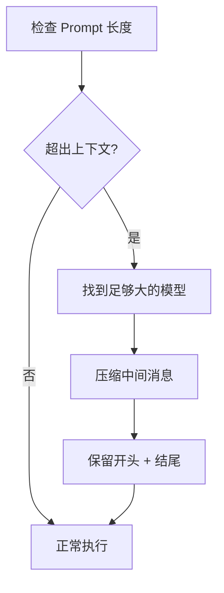

> **生产环境安全提示**
>
> 本文档包含可直接执行的运维命令。执行前请确认：当前目标集群与 Namespace 是否正确；是否具备足够的 RBAC 权限；是否已在非生产环境验证。命令风险等级标注：🔴 高风险（可能造成数据丢失或服务中断）、🟡 中风险（会修改集群状态，但通常可回滚）、🟢 低风险/只读（信息收集，无副作用）。


# 插件体系与 Web Search

> **文档类型**: 功能详解 | **最后更新**: 2026-03 | **关键词**: OpenRouter, Plugins, Web Search, Exa, Firecrawl, Parallel, File Parser, Context Compression, Domain Filtering

---

## 概述

OpenRouter 提供四个内置插件（web / file-parser / response-healing / context-compression），按需启用以增强模型能力。本文详细覆盖 Web Search 插件（5 种搜索引擎选择）、File Parser 插件（PDF 解析）、Response Healing（JSON 修复）、Context Compression（上下文压缩）、域名过滤、定价以及插件组合场景。

---

## 1. 插件体系概览

OpenRouter 提供四个内置插件，按需启用以增强模型能力：

| 插件 ID | 功能 | 说明 |
|---------|------|------|
| `web` | Web 搜索 | 为模型注入实时 Web 搜索结果 |
| `file-parser` | 文件解析 | PDF 文档解析与内容提取 |
| `response-healing` | 响应修复 | 自动修复格式错误的 JSON 响应 |
| `context-compression` | 上下文压缩 | 压缩超出模型上下文长度的 prompt |

### 启用插件

```json
{
  "model": "openai/gpt-5.2",
  "plugins": [
    { "id": "web" },
    { "id": "response-healing" }
  ],
  "messages": [{ "role": "user", "content": "..." }]
}
```

---

## 2. Web Search 插件

### 2.1 快速启用

**方式一：`:online` 变体（最简）**

```json
{
  "model": "openai/gpt-5.2:online"
}
```

**方式二：Plugin 显式配置**

```json
{
  "model": "openai/gpt-5.2",
  "plugins": [{ "id": "web" }]
}
```

> `:online` 变体完全等价于 `plugins: [{ id: "web" }]`，支持与 `:free` 叠加使用：`openai/gpt-oss-20b:free:online`。

### 2.2 搜索引擎选择

| 引擎 | 说明 | 定价 |
|------|------|------|
| **native** | Provider 原生搜索（OpenAI/Anthropic/Perplexity/xAI） | Provider 直通 |
| **exa** | Exa 搜索 API（关键词 + 嵌入混合搜索） | $4/1000 结果 |
| **firecrawl** | Firecrawl BYOK 搜索 | 使用 Firecrawl Credits |
| **parallel** | Parallel 搜索 API | $4/1000 结果 |
| 未指定 | 有原生则用原生，否则 Exa | 视实际引擎 |

### 2.3 引擎配置

```json
{
  "model": "openai/gpt-5.2",
  "plugins": [
    {
      "id": "web",
      "engine": "exa",
      "max_results": 3,
      "search_prompt": "以下是相关 Web 搜索结果，请在回答中引用：",
      "include_domains": ["arxiv.org", "*.github.com"],
      "exclude_domains": ["reddit.com"]
    }
  ]
}
```

| 参数 | 类型 | 默认值 | 说明 |
|------|------|--------|------|
| `engine` | string | 自动 | native/exa/firecrawl/parallel |
| `max_results` | number | 5 | 最大搜索结果数 |
| `search_prompt` | string | 内置模板 | 搜索结果注入提示词 |
| `include_domains` | string[] | - | 域名白名单（支持通配符） |
| `exclude_domains` | string[] | - | 域名黑名单 |

### 2.4 域名过滤兼容性

| 引擎 | include_domains | exclude_domains | 备注 |
|------|:--------------:|:--------------:|------|
| **Exa** | 支持 | 支持 | 可同时使用 |
| **Parallel** | 支持 | 支持 | 互斥，不可同时 |
| **Native (Anthropic)** | 支持 | 支持 | 互斥 |
| **Native (OpenAI)** | 支持 | 忽略 | 仅支持 include |
| **Native (xAI)** | 支持 | 支持 | 互斥，最多 5 个域 |
| **Firecrawl** | 不支持 | 不支持 | 设置会返回 400 |

### 2.5 原生搜索 Provider

对于以下 Provider，默认使用原生搜索：

| Provider | 原生能力 |
|---------|---------|
| **OpenAI** | Web Search |
| **Anthropic** | Web Search |
| **Perplexity** | Web Search |
| **xAI** | Web Search + X (Twitter) Search |

### 2.6 X Search 过滤（xAI 专属）

```json
{
  "model": "x-ai/grok-4.1-fast",
  "plugins": [{ "id": "web" }],
  "x_search_filter": {
    "allowed_x_handles": ["OpenRouterAI"],
    "from_date": "2025-01-01",
    "to_date": "2025-12-31",
    "enable_image_understanding": true,
    "enable_video_understanding": false
  }
}
```

### 2.7 搜索结果解析

所有搜索结果（包括原生）统一为 OpenAI 标注格式：

```json
{
  "message": {
    "role": "assistant",
    "content": "Here's the latest news...",
    "annotations": [
      {
        "type": "url_citation",
        "url_citation": {
          "url": "https://example.com/article",
          "title": "Article Title",
          "content": "Relevant excerpt...",
          "start_index": 100,
          "end_index": 200
        }
      }
    ]
  }
}
```

### 2.8 搜索上下文大小

```json
{
  "model": "openai/gpt-5.2",
  "web_search_options": {
    "search_context_size": "high"
  }
}
```

| 级别 | 说明 |
|------|------|
| `low` | 最少搜索上下文，适合简单查询 |
| `medium` | 适中搜索上下文 |
| `high` | 最多搜索上下文，适合深度研究 |

### 2.9 Web Search 定价

| 引擎 | 费用 |
|------|------|
| **Exa** | $4/1000 结果 ≈ $0.02/请求（默认 5 结果） |
| **Parallel** | $4/1000 结果（同 Exa） |
| **Firecrawl** | 使用 Firecrawl Credits |
| **Native** | Provider 直通定价 |

> 使用 `:free` 模型 + `:online` 仍会产生搜索费用。

---

## 3. Context Compression 插件

### 3.1 工作原理

当 prompt 超出模型上下文限制时，自动压缩中间部分内容：

```json
{
  "plugins": [{ "id": "context-compression" }],
  "messages": [/* 超长对话 */],
  "model": "openai/gpt-5.2"
}
```

### 3.2 压缩策略



- **压缩位置**：中间部分（LLM 对中间内容注意力最低）
- **模型选择**：优先选择上下文 ≥ 所需 token 50% 的模型
- **消息数限制**：Anthropic 最多 1000 条消息，超出时自动保留首尾各半

### 3.3 默认行为

> 上下文 ≤ 8K token 的端点默认启用 Context Compression。

禁用方式：

```json
{
  "plugins": [{ "id": "context-compression", "enabled": false }]
}
```

---

## 4. File Parser 插件

PDF 和其他文件可通过 URL 或 Base64 编码发送，File Parser 自动提取内容：

```json
{
  "model": "openai/gpt-5.2",
  "plugins": [{ "id": "file-parser" }],
  "messages": [
    {
      "role": "user",
      "content": [
        { "type": "text", "text": "Summarize this document" },
        {
          "type": "image_url",
          "image_url": {
            "url": "https://example.com/document.pdf"
          }
        }
      ]
    }
  ]
}
```

> File Parser 插件使 **任何模型** 都能处理 PDF，不限于原生支持 PDF 的模型。

---

## 5. 插件组合使用

插件可以自由组合：

```json
{
  "model": "openai/gpt-5.2",
  "plugins": [
    { "id": "web", "max_results": 3 },
    { "id": "response-healing" },
    { "id": "context-compression" }
  ],
  "response_format": {
    "type": "json_schema",
    "json_schema": { "..." }
  }
}
```

| 组合 | 场景 |
|------|------|
| web + response-healing | Web 增强 + 结构化 JSON 输出 |
| file-parser + context-compression | 长 PDF 处理 |
| web + context-compression | 大量搜索结果 + 长对话 |

---

## 6. 插件配置管理

### 6.1 API 请求级配置

每个请求可独立配置插件，优先级最高。

### 6.2 全局默认配置

在 OpenRouter 的 **Settings → Plugins** 中可配置默认值，适用于所有请求（除非被请求级覆盖）。

---

## 关联文档

| 文档 | 关系 |
|------|------|
| [06 - Structured Outputs](./06-openrouter-structured-outputs-tools.md) | Response Healing 与工具调用 |
| [05 - API 参考](./05-openrouter-api-reference.md) | plugins 请求参数详解 |
| [08 - Prompt Caching](./08-openrouter-prompt-caching-optimization.md) | 成本优化策略 |
| [10 - 流式传输](./10-openrouter-streaming-multimedia.md) | 插件与流式的配合 |

---

*本文档基于 OpenRouter 官方文档（openrouter.ai/docs/guides/features）整理。*


<!-- risk-assessed -->
