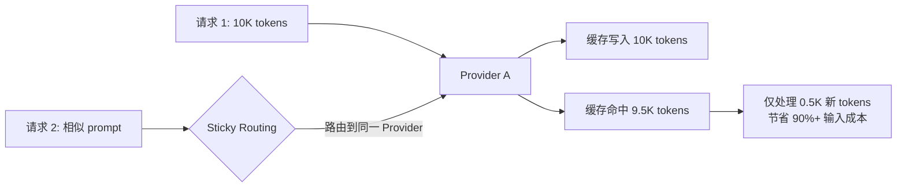
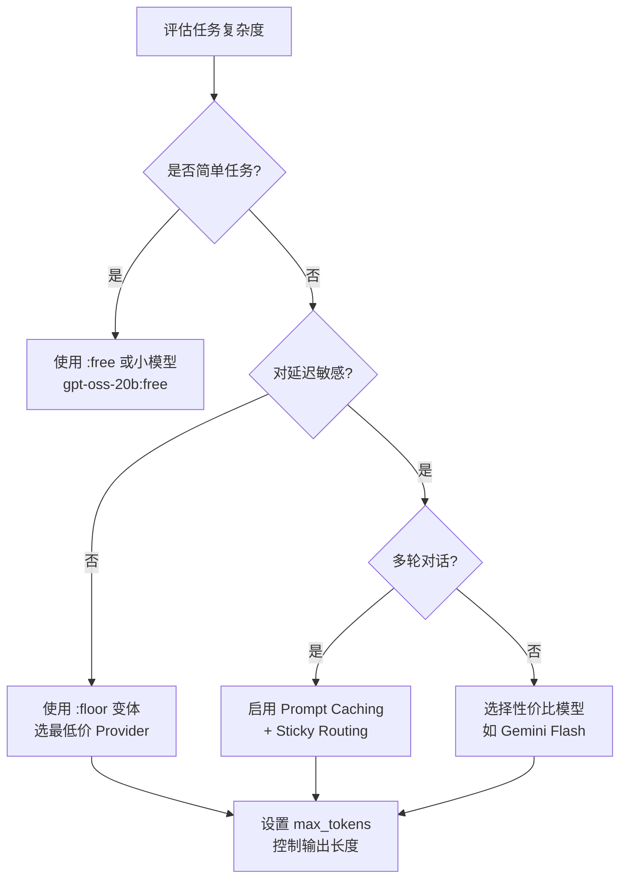

> **生产环境安全提示**
>
> 本文档包含可直接执行的运维命令。执行前请确认：当前目标集群与 Namespace 是否正确；是否具备足够的 RBAC 权限；是否已在非生产环境验证。命令风险等级标注：🔴 高风险（可能造成数据丢失或服务中断）、🟡 中风险（会修改集群状态，但通常可回滚）、🟢 低风险/只读（信息收集，无副作用）。


# Prompt Caching 与成本优化

> **文档类型**: 架构与优化 | **最后更新**: 2026-03 | **关键词**: OpenRouter, Prompt Caching, Sticky Routing, Cache TTL, Cost Optimization, Anthropic Cache, OpenAI Cache, DeepSeek, Credits

---

## 概述

Prompt Caching 是降低 LLM 推理成本的核心机制。OpenRouter 统一管理各 Provider 的缓存策略，并通过 **Provider Sticky Routing** 最大化缓存命中率。本文覆盖 Provider 级缓存策略对比、Sticky Routing 机制、Anthropic/OpenAI 缓存深度配置、缓存效果检查以及综合成本优化策略。

---

## 1. Prompt Caching 概述

Prompt Caching 通过重用先前请求中已处理的 token 来降低推理成本。OpenRouter 统一管理各 Provider 的缓存机制，并通过 **Provider Sticky Routing** 最大化缓存命中率。



---

## 2. Provider 缓存策略对比

| Provider | 缓存写入费 | 缓存读取费 | 自动/手动 | 最小 Prompt 长度 |
|---------|:----------:|:--------:|:---------:|:---------------:|
| **OpenAI** | 免费 | 0.25x~0.5x | 自动 | 1024 tokens |
| **Anthropic** | 1.25x (5min) / 2x (1h) | 0.1x | 手动/自动 | 1024~4096 tokens |
| **DeepSeek** | 1x (原价) | 0.1x | 自动 | - |
| **Google Gemini** | 自动 | 优惠价 | 自动 | - |
| **Groq** | 免费 | 0.5x | 自动 | - |
| **xAI (Grok)** | 免费 | 0.25x | 自动 | - |
| **Moonshot** | 免费 | 0.25x | 自动 | - |

> `0.1x` 表示缓存读取费用仅为正常输入价格的 10%。

---

## 3. Provider Sticky Routing

### 3.1 工作原理

为最大化缓存命中，OpenRouter 自动将后续请求路由到同一 Provider：

| 步骤 | 说明 |
|------|------|
| 1 | 首次请求，OpenRouter 记录服务 Provider |
| 2 | 后续相似请求自动路由到同一 Provider |
| 3 | 仅在缓存读取比原价便宜时启用 |
| 4 | Sticky Provider 不可用时自动回退 |

### 3.2 会话识别

Sticky Routing 通过 **哈希第一条系统消息 + 第一条非系统消息** 识别会话：

- 相同开头的对话会路由到同一 Provider
- 不同对话自然分散到不同 Provider（负载均衡）
- 粒度：**账户级 × 模型级 × 会话级**

### 3.3 与手动 Provider 顺序的交互

> 设置 `provider.order` 时，Sticky Routing 被禁用——手动排序优先。

---

## 4. Anthropic 缓存详解

Anthropic 是缓存策略最灵活的 Provider，支持自动和手动两种模式：

### 4.1 自动缓存（推荐用于多轮对话）

```json
{
  "model": "anthropic/claude-sonnet-4.6",
  "cache_control": { "type": "ephemeral" },
  "messages": [
    {
      "role": "system",
      "content": "You are a historian... HUGE TEXT BODY"
    },
    {
      "role": "user",
      "content": "What triggered the collapse?"
    }
  ]
}
```

随着对话增长，缓存断点自动前移覆盖更多内容。

### 4.2 1 小时 TTL

```json
{
  "cache_control": { "type": "ephemeral", "ttl": "1h" }
}
```

| TTL | 写入费 | 读取费 | 适用场景 |
|-----|:------:|:------:|---------|
| 5 分钟（默认） | 1.25x | 0.1x | 短会话 |
| 1 小时 | 2x | 0.1x | 长会话，减少重复写入 |

### 4.3 手动缓存断点

```json
{
  "messages": [
    {
      "role": "system",
      "content": [
        { "type": "text", "text": "Instructions..." },
        {
          "type": "text",
          "text": "HUGE REFERENCE TEXT",
          "cache_control": { "type": "ephemeral" }
        }
      ]
    }
  ]
}
```

- 最多 4 个手动断点
- 推荐用于大文本块（角色卡、CSV、RAG 数据、书籍章节）

### 4.4 支持的 Claude 模型

| 模型 | 最小缓存长度 |
|------|:-----------:|
| Claude Opus 4.6 / 4.5 | 4096 tokens |
| Claude Sonnet 4.6 | 2048 tokens |
| Claude Sonnet 4.5 / Opus 4.1 / 4 / Sonnet 4 | 1024 tokens |
| Claude Haiku 4.5 | 4096 tokens |
| Claude Haiku 3.5 | 2048 tokens |

### 4.5 Provider 兼容性

| 模式 | Anthropic 直连 | AWS Bedrock | Google Vertex |
|------|:------------:|:----------:|:------------:|
| 自动 (top-level cache_control) | 支持 | 不支持 | 不支持 |
| 手动 (per-block cache_control) | 支持 | 支持 | 支持 |

> 使用自动缓存时，OpenRouter 仅路由到 Anthropic 直连，不走 Bedrock/Vertex。

---

## 5. 缓存效果检查

### 5.1 API 响应中的 Usage

```json
{
  "usage": {
    "prompt_tokens": 10339,
    "completion_tokens": 60,
    "total_tokens": 10399,
    "prompt_tokens_details": {
      "cached_tokens": 10318,
      "cache_write_tokens": 0
    }
  }
}
```

| 字段 | 说明 |
|------|------|
| `cached_tokens` | 缓存命中 token 数（> 0 表示命中） |
| `cache_write_tokens` | 缓存写入 token 数（首次请求） |

### 5.2 其他检查方式

1. **Activity 页面**：在 OpenRouter Dashboard 点击请求详情查看 `cache_discount`
2. **Generation API**：`/api/v1/generation` 端点查询历史请求缓存信息

---

## 6. 成本优化策略

### 6.1 综合策略矩阵

| 策略 | 预期节省 | 实施难度 | 适用场景 |
|------|:-------:|:-------:|---------|
| **Prompt Caching** | 50~90% | 低 | 多轮对话、重复 System Prompt |
| **`:floor` 变体** | 20~50% | 零 | 对延迟不敏感的场景 |
| **`:free` 模型** | 100% | 零 | 原型开发、低频场景 |
| **Context Compression** | 30~60% | 低 | 超长对话 |
| **模型降级** | 50~80% | 低 | 简单任务用小模型 |
| **max_tokens 限制** | 10~30% | 零 | 控制输出长度 |
| **BYOK** | 5%+ | 中 | 已有 Provider Key |

### 6.2 成本优化流程



### 6.3 月度成本控制

```json
// API Key 级别限制
{
  "label": "production-key",
  "limit": 500,                  // $500/月上限
  "limit_reset": "monthly",     // 每月重置
  "include_byok_in_limit": false // BYOK 不计入
}
```

### 6.4 实时监控

```typescript
// 查询实时用量
const keyInfo = await openRouter.apiKeys.getCurrent();
console.log('Monthly usage:', keyInfo.data.usage_monthly);
console.log('Remaining:', keyInfo.data.limit_remaining);
```

---

## 7. 免费模型策略

| 条件 | Rate Limit |
|------|-----------|
| 购买 < 10 Credits | 50 次/天 |
| 购买 ≥ 10 Credits | 1000 次/天 |
| 所有用户 | 20 次/分钟 |

> **注意**：账户余额为负时，即使 `:free` 模型也会返回 402 错误。

---

## 关联文档

| 文档 | 关系 |
|------|------|
| [04 - 智能路由](./04-openrouter-provider-routing.md) | Sticky Routing 与路由策略 |
| [03 - 模型与 Provider](./03-openrouter-models-providers.md) | 模型定价与成本比较 |
| [12 - 企业级实践](./12-openrouter-enterprise-advanced.md) | Credits 管理与生产最佳实践 |
| [11 - 安全与隐私](./11-openrouter-[[domain-05-security-compliance/README.md|security]]-privacy.md) | BYOK 与数据治理 |

---

*本文档基于 OpenRouter 官方文档（openrouter.ai/docs/guides/features/prompt-caching）整理。*


<!-- risk-assessed -->
