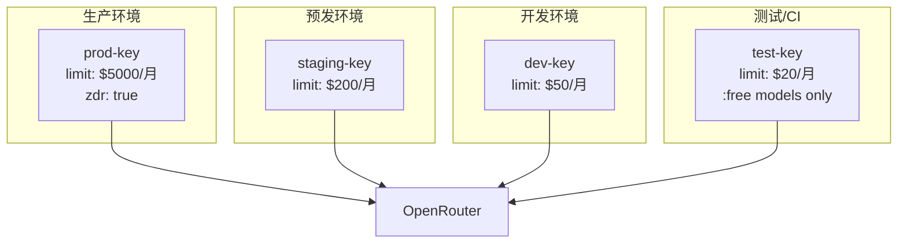

> **生产环境安全提示**
>
> 本文档包含可直接执行的运维命令。执行前请确认：当前目标集群与 Namespace 是否正确；是否具备足够的 RBAC 权限；是否已在非生产环境验证。命令风险等级标注：🔴 高风险（可能造成数据丢失或服务中断）、🟡 中风险（会修改集群状态，但通常可回滚）、🟢 低风险/只读（信息收集，无副作用）。


# 企业级高级实践

> **文档类型**: 进阶指南 | **最后更新**: 2026-03 | **关键词**: OpenRouter, Enterprise, Provisioning, Credits, Rate Limits, App Attribution, Best Practices, Cost Management, Architecture

---

## 概述

本文覆盖 OpenRouter 的生产级进阶话题：Credits 管理与自动充值、Rate Limits 体系、App Attribution 排名系统、多环境 / 多团队 Key 管理、生产架构设计、可靠性 / 成本 / 性能最佳实践、从 OpenAI/Anthropic 直连迁移指南以及常见故障排查。

---

## 1. Credits 管理

### 1.1 Credits 体系

| 维度 | 说明 |
|------|------|
| **基础货币** | 美元 (USD) |
| **充值方式** | Stripe（信用卡）、加密货币 |
| **充值手续费** | 5.5%（最低 $0.80）、加密 5% |
| **推理加价** | 无（Provider 原始定价直通） |
| **过期策略** | 购买后 1 年内未使用可能过期 |
| **自动充值** | 支持设置阈值自动充值 |

### 1.2 自动充值配置

在 Dashboard → Credits → Auto Top Up：

- **Threshold**：余额低于此值时触发充值
- **Amount**：每次自动充值金额
- **Payment Method**：绑定的支付方式

### 1.3 用量监控

```typescript
const keyInfo = await openRouter.apiKeys.getCurrent();
const { data } = keyInfo;

console.log(`All-time usage: $${data.usage}`);
console.log(`Daily usage: $${data.usage_daily}`);
console.log(`Weekly usage: $${data.usage_weekly}`);
console.log(`Monthly usage: $${data.usage_monthly}`);
console.log(`Remaining: $${data.limit_remaining ?? 'unlimited'}`);

// BYOK 用量
console.log(`BYOK monthly: $${data.byok_usage_monthly}`);
```

---

## 2. Rate Limits

### 2.1 限制类型

| 类型 | 条件 | 限制 |
|------|------|------|
| **Free Model (:free)** | 购买 < 10 Credits | 50 次/天 |
| **Free Model (:free)** | 购买 ≥ 10 Credits | 1000 次/天 |
| **Free Model (:free)** | 所有用户 | 20 次/分钟 |
| **DDoS 保护** | Cloudflare | 自动限流 |
| **负余额** | Credits < 0 | 402 错误（含 :free） |

### 2.2 重要说明

- 创建多个账户/Key **不会**增加 Rate Limit（全局管控）
- 不同模型有独立限制，可通过切换模型分散负载
- 付费模型的 Rate Limit 取决于 Provider 自身限制

### 2.3 应对 Rate Limit

| 策略 | 说明 |
|------|------|
| **Model Fallback** | 配置多模型，自动切换 |
| **Provider 分散** | 使用 `only`/`ignore` 控制负载分布 |
| **BYOK** | 使用自有 Provider Key，独立 Rate Limit |
| **指数退避** | 429 错误后递增等待时间重试 |
| **队列管理** | 应用层面限流 + 排队 |

---

## 3. App Attribution

### 3.1 排行榜系统

OpenRouter 维护应用排行榜，通过 HTTP Headers 参与：

| Header | 说明 |
|--------|------|
| `HTTP-Referer` | 应用 URL，用于排名和识别 |
| `X-OpenRouter-Title` | 应用名称，排行榜显示 |
| `X-OpenRouter-Categories` | 应用分类标签 |

### 3.2 配置示例

```typescript
const openRouter = new OpenRouter({
  apiKey: process.env.OPENROUTER_API_KEY,
  defaultHeaders: {
    'HTTP-Referer': 'https://your-app.com',
    'X-OpenRouter-Title': 'My AI App',
    'X-OpenRouter-Categories': 'coding,productivity',
  },
});
```

---

## 4. 企业架构模式

### 4.1 多环境 Key 管理



### 4.2 多团队 Key 管理

```
组织级 Credits 账户
├── team-frontend-key    (limit: $500/月, models: openai/*)
├── team-backend-key     (limit: $1000/月)
├── team-data-key        (limit: $2000/月, BYOK: anthropic)
├── team-research-key    (limit: $300/月)
└── ci-cd-key            (limit: $100/月, :free only)
```

### 4.3 生产架构推荐

```mermaid
graph TB
    subgraph App["应用层"]
        FE[前端] --> API[API 服务]
    end

    subgraph Middleware["中间件层"]
        API --> CACHE[应用层缓存]
        CACHE --> QUEUE[请求队列]
        QUEUE --> RETRY[重试 + 退避]
    end

    subgraph OR["OpenRouter"]
        RETRY --> LB[智能路由]
        LB --> P1[Provider A]
        LB --> P2[Provider B fallback]
    end

    subgraph [[domain-06-observability/README.md|observability]]["可观测性"]
        RETRY --> LANGFUSE[Langfuse 追踪]
        RETRY --> MONITOR[用量监控]
        MONITOR --> ALERT[告警]
    end
```

---

## 5. 生产最佳实践

### 5.1 可靠性

| 实践 | 配置 |
|------|------|
| **Model Fallback** | `models: ["claude", "gpt", "gemini"], route: "fallback"` |
| **Provider LB** | 默认启用，无需配置 |
| **超时设置** | 客户端设置合理超时（30-60s） |
| **流式超时检测** | 监听 SSE 心跳，超时重连 |
| **幂等请求** | 相同 `seed` + 相同 prompt 获得一致结果 |

### 5.2 成本控制

| 实践 | 说明 |
|------|------|
| **Key Credit Limit** | 每个 Key 设置硬限制 |
| **Monthly Reset** | 启用月度重置 |
| **Prompt Caching** | 多轮对话必须启用 |
| **模型分级** | 简单任务用小/免费模型，复杂任务用旗舰 |
| **max_tokens** | 总是设置输出上限 |
| **用量告警** | 日/周/月维度监控 |

### 5.3 性能优化

| 实践 | 说明 |
|------|------|
| **流式传输** | 始终使用 `stream: true` 降低 TTFT |
| **`:nitro` 变体** | 延迟敏感场景用吞吐优先路由 |
| **Predicted Output** | 使用 `prediction` 参数降低延迟 |
| **连接池** | SDK 内置，无需额外配置 |
| **Context Compression** | 长对话自动压缩 |

---

## 6. 迁移指南

### 6.1 从 OpenAI 直连迁移

```diff
- import OpenAI from 'openai';
+ import OpenAI from 'openai';

  const client = new OpenAI({
-   apiKey: process.env.OPENAI_API_KEY,
+   baseURL: 'https://openrouter.ai/api/v1',
+   apiKey: process.env.OPENROUTER_API_KEY,
+   defaultHeaders: {
+     'HTTP-Referer': 'https://your-app.com',
+   },
  });

  const response = await client.chat.completions.create({
-   model: 'gpt-4o',
+   model: 'openai/gpt-5.2',
    messages: [{ role: 'user', content: 'Hello' }],
  });
```

### 6.2 从 Anthropic 直连迁移

```diff
- import Anthropic from '@anthropic-ai/sdk';
+ import OpenAI from 'openai';

- const client = new Anthropic({
-   apiKey: process.env.ANTHROPIC_API_KEY,
- });
+ const client = new OpenAI({
+   baseURL: 'https://openrouter.ai/api/v1',
+   apiKey: process.env.OPENROUTER_API_KEY,
+ });

- const response = await client.messages.create({
+ const response = await client.chat.completions.create({
-   model: 'claude-sonnet-4.5',
+   model: 'anthropic/claude-sonnet-4.6',
-   max_tokens: 1024,
+   max_tokens: 1024,
    messages: [{ role: 'user', content: 'Hello' }],
  });
```

---

## 7. 故障排查

| 问题 | 原因 | 解决方案 |
|------|------|---------|
| 401 Unauthorized | API Key 无效 | 检查 Key 是否正确、是否已删除 |
| 402 Payment Required | 余额不足或为负 | 充值 Credits |
| 429 Rate Limited | 超出频率限制 | 减少频率或使用 Fallback |
| 502 Bad Gateway | Provider 返回错误 | 启用 `allow_fallbacks: true` |
| 503 No Providers | 无可用 Provider | 放宽 `provider` 限制 |
| 响应截断 | `max_tokens` 太低 | 增加 `max_tokens` 或不设置 |
| JSON 格式错误 | 模型输出不规范 | 启用 `response-healing` 插件 |
| 缓存未命中 | 不同 Provider 路由 | 检查 Sticky Routing 是否生效 |
| 搜索无结果 | 引擎不兼容 | 切换 Web Search 引擎 |
| 工具未被调用 | Provider 不支持 | 设置 `require_parameters: true` |

---

## 8. 运维监控

### 8.1 关键指标

| 指标 | 数据源 | 告警阈值建议 |
|------|--------|-------------|
| **日用量** | `/api/v1/key` → `usage_daily` | > 日预算 80% |
| **月用量** | `/api/v1/key` → `usage_monthly` | > 月预算 80% |
| **剩余额度** | `/api/v1/key` → `limit_remaining` | < 总额 20% |
| **缓存命中率** | `usage.prompt_tokens_details.cached_tokens` | < 50% |
| **Error Rate** | 应用层统计 4xx/5xx | > 5% |

### 8.2 Langfuse 集成监控

```python
from langfuse.openai import OpenAI

client = OpenAI(
    base_url="https://openrouter.ai/api/v1",
    api_key="sk-or-v1-xxx",
)

# 所有请求自动追踪到 Langfuse
# 包括：延迟、token、成本、模型、Provider
```

---

## 关联文档

| 文档 | 关系 |
|------|------|
| [01 - 概述与架构](./01-openrouter-overview-architecture.md) | 架构基础 |
| [04 - 智能路由](./04-openrouter-provider-routing.md) | 生产路由策略 |
| [08 - Prompt Caching](./08-openrouter-prompt-caching-optimization.md) | 成本优化深入 |
| [11 - 安全与隐私](./11-openrouter-security-privacy.md) | 安全加固与合规 |
| [topic-coding/03](../topic-coding/03-opencode-providers-models.md) | OpenCode 配置 OpenRouter Provider |
| [02-ai-agents](../domain-14-ai-ml-infra/02-ai-agents/) | Agent CLI 统一 LLM 后端 |
| [domain-14-ai-ml-infra/17](../domain-14-ai-ml-infra/17-llm-inference-serving.md) | LLM 推理服务层 |
| [domain-03-networking-traffic](../domain-03-networking-traffic/) | 云原生 Gateway 模式 |

---

*本文档基于 OpenRouter 官方文档（openrouter.ai/docs）和生产实践整理。*


<!-- risk-assessed -->
