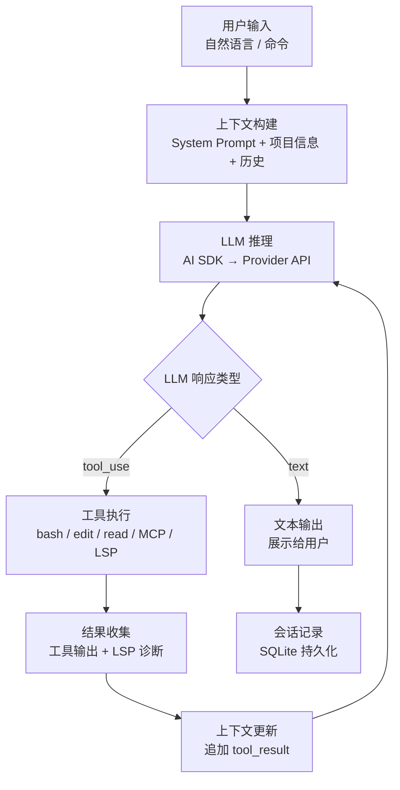

> **生产环境安全提示**
>
> 本文档包含可直接执行的运维命令。执行前请确认：当前目标集群与 Namespace 是否正确；是否具备足够的 RBAC 权限；是否已在非生产环境验证。命令风险等级标注：🔴 高风险（可能造成数据丢失或服务中断）、🟡 中风险（会修改集群状态，但通常可回滚）、🟢 低风险/只读（信息收集，无副作用）。


# OpenCode 概述与核心架构

> **文档类型**: 基础概念专题 | **最后更新**: 2026-03 | **关键词**: OpenCode, AI Coding Agent, Client/Server Architecture, Agent Loop, Bubble Tea, Bun, Hono, AI SDK

---

## 概述

**OpenCode** 是当前最具影响力的开源 AI 编程智能体（AI Coding Agent），提供 Terminal TUI、Desktop App 和 IDE Extension 三种形态。它将 LLM 的推理能力与终端的执行能力深度融合，使开发者能够在命令行环境中以自然语言驱动代码生成、项目重构、故障排查等复杂任务。

OpenCode 由 **Anomaly**（原 SST / ion 团队）主导开发，采用 **100% 开源** 策略，是 Claude Code 的核心替代方案。它支持 75+ LLM Provider、30+ 内置 LSP Server、20+ 内置 Formatter，具备完整的 MCP 协议支持、Agent [[SKILL|Skill]] 体系和 GitHub CI/CD 集成能力。

---

## 1. 核心功能矩阵

### 1.1 功能全景

| 功能类别 | 核心能力 | 说明 |
|---------|---------|------|
| **交互式 TUI** | Bubble Tea 终端 UI | Vim 风格编辑器、会话管理、模型切换、文件变更追踪 |
| **多 Provider 支持** | 75+ LLM Provider | OpenAI、Anthropic、Google、AWS Bedrock、Groq、Azure、GitHub Copilot、OpenRouter 等 |
| **Agent 系统** | Build / Plan / Subagent | 主 Agent 切换、子 Agent 并行、自定义 Agent（JSON/Markdown） |
| **工具集成** | 14 个内置工具 | bash、edit、write、read、grep、glob、list、patch、lsp、webfetch、websearch、todo、question、skill |
| **MCP 集成** | Local / Remote / OAuth | 外部工具协议支持，Sentry / Linear / Notion / GitHub 等 |
| **LSP 集成** | 30+ 语言 LSP | 代码诊断、定义跳转、引用查找、自动启动 |
| **自动格式化** | 20+ Formatter | Prettier、Biome、gofmt、rustfmt、ruff 等，写入后自动格式化 |
| **Skill 系统** | SKILL.md 规范 | 可复用行为定义，全局/项目级作用域 |
| **Custom Command** | 自定义命令 | 模板化提示词、参数传递、shell 输出注入 |
| **Server 模式** | HTTP API + OpenAPI 3.1 | 无头服务、SDK 生成、多客户端接入 |
| **GitHub 集成** | GitHub App + Actions | Issue 处理、PR 审查、代码修复、定时任务 |
| **Session 管理** | 会话持久化 | SQLite 存储、会话分叉、共享、导出 |
| **Auto Compact** | 上下文自动压缩 | 接近上下文窗口限制时自动摘要，无缝继续 |

### 1.2 与竞品对比

| 对比维度 | OpenCode | Claude Code | Codex CLI | Aider | Gemini CLI |
|---------|----------|-------------|-----------|-------|------------|
| **开源** | ✅ 100% 开源 | ❌ 闭源 | ✅ 开源 | ✅ 开源 | ✅ 开源 |
| **多 Provider** | ✅ 75+ | ❌ 仅 Claude | ❌ 仅 OpenAI | ✅ 多模型 | ❌ 仅 Gemini |
| **TUI 质量** | ★★★★★ | ★★★★★ | ★★★☆☆ | ★★★☆☆ | ★★★☆☆ |
| **MCP 支持** | ✅ Local + Remote + OAuth | ✅ | ❌ | ❌ | ✅ |
| **LSP 集成** | ✅ 30+ 语言 | ❌ | ❌ | ❌ | ❌ |
| **Custom Agent** | ✅ JSON + Markdown | ❌ | ❌ | ❌ | ❌ |
| **Custom Tools** | ✅ TypeScript | ❌ | ❌ | ❌ | ❌ |
| **GitHub CI/CD** | ✅ 原生集成 | ✅ | ❌ | ❌ | ❌ |
| **Server API** | ✅ OpenAPI 3.1 | ❌ | ❌ | ❌ | ❌ |
| **Skill 系统** | ✅ SKILL.md | ❌ | ❌ | ❌ | ❌ |
| **自动格式化** | ✅ 20+ Formatter | ❌ | ❌ | ❌ | ❌ |

---

## 2. 核心架构

### 2.1 Client/Server 架构

OpenCode 采用 **Client/Server 分离架构**，这是其区别于其他 Agent CLI 的核心设计亮点：

```
┌──────────────────────────────────────────────────────────┐
│                    OpenCode 系统架构                       │
│                                                          │
│  ┌────────────────┐     HTTP/SSE      ┌───────────────┐  │
│  │   Go TUI 客户端  │◄──────────────►│  Bun HTTP 服务端 │  │
│  │  (Bubble Tea)   │                 │  (Hono Server) │  │
│  └────────────────┘                  └───────┬───────┘  │
│                                              │          │
│  ┌────────────────┐                  ┌───────▼───────┐  │
│  │  Desktop App    │◄──────────────►│   AI SDK       │  │
│  │  (Tauri/Web)    │                 │  (Multi-LLM)   │  │
│  └────────────────┘                  └───────┬───────┘  │
│                                              │          │
│  ┌────────────────┐                  ┌───────▼───────┐  │
│  │  IDE Extension  │◄──────────────►│  Tool Runtime  │  │
│  │  (VS Code etc.) │                 │ (MCP/LSP/Bash) │  │
│  └────────────────┘                  └───────┬───────┘  │
│                                              │          │
│  ┌────────────────┐                  ┌───────▼───────┐  │
│  │  外部 HTTP 客户端 │◄──────────────►│  SQLite 存储   │  │
│  │  (SDK/脚本/App) │                 │  (会话/消息)    │  │
│  └────────────────┘                  └───────────────┘  │
└──────────────────────────────────────────────────────────┘
```

**架构要点**：

| 组件 | 技术栈 | 职责 |
|------|--------|------|
| **HTTP Server** | Bun + Hono | 核心引擎，暴露 OpenAPI 3.1 端点，处理 LLM 交互、工具执行、会话管理 |
| **TUI Client** | Go + Bubble Tea | 终端用户界面，通过 HTTP/SSE 与 Server 通信 |
| **AI SDK** | Vercel AI SDK | LLM Provider 抽象层，统一 OpenAI/Anthropic/Gemini 等调用接口 |
| **Tool Runtime** | Bun 原生 | 执行 bash、file I/O、MCP 调用、LSP 查询等 |
| **[[domain-04-storage-data/README.md|[[Kubernetes 存储配置最佳实践|storage]]]]** | SQLite | 持久化会话、消息、文件变更历史 |
| **SDK Generation** | Stainless | 从 OpenAPI Spec 自动生成类型安全的客户端 SDK |

### 2.2 Agent Loop 原理

OpenCode 的核心运行机制是 **Agent Loop**——一个持续的「感知→推理→行动→观察」循环：



**关键机制**：

- **System Prompt 分 Provider 定制**：每个 Provider（Anthropic/OpenAI/Gemini）有独立优化的 System Prompt
- **工具调用透明性**：LLM 输出 `tool_use` 块 → Agent 执行工具 → 结果作为 `tool_result` 回传 → LLM 继续推理
- **LSP 诊断反馈**：文件修改后自动触发 LSP `textDocument/didChange`，收集诊断信息回传 LLM，实现编辑→诊断→修复闭环
- **Auto Compact**：当 token 使用接近上下文窗口 95% 时，自动触发摘要压缩，创建新会话继续工作

### 2.3 Provider 无关性

OpenCode 通过 **AI SDK** 实现 Provider 抽象，使用统一的函数调用和参数格式与不同 LLM Provider 交互：

```
┌───────────────────────────────────────────┐
│              OpenCode Agent               │
│                                           │
│  ┌─────────────────────────────────────┐  │
│  │           AI SDK 抽象层              │  │
│  │  generateText() / streamText()      │  │
│  └─────────┬──────┬──────┬──────┬─────┘  │
│            │      │      │      │        │
│     ┌──────▼┐ ┌───▼──┐ ┌▼────┐ ┌▼────┐  │
│     │OpenAI │ │Claude│ │Gemini│ │Groq │  │
│     │GPT-4.1│ │Sonnet│ │ 2.5 │ │Llama│  │
│     └───────┘ └──────┘ └─────┘ └─────┘  │
└───────────────────────────────────────────┘
```

---

## 3. 核心概念模型

### 3.1 五层概念架构

| 层次 | 概念 | 说明 |
|------|------|------|
| **Provider 层** | Provider + Model | LLM 服务商与模型，格式 `provider/model-id` |
| **Agent 层** | Primary Agent + Subagent | Build/Plan 主 Agent + General/Explore 子 Agent，可自定义 |
| **Tool 层** | Built-in + Custom + MCP | 14 内置工具 + TypeScript 自定义工具 + MCP Server 外部工具 |
| **Intelligence 层** | LSP + Formatter + Skill | 代码诊断/格式化/可复用行为定义 |
| **Platform 层** | Server + GitHub + CLI | HTTP API / GitHub App / 非交互模式 |

### 3.2 配置层级与优先级

OpenCode 的配置采用多层合并机制（后者覆盖前者）：

```
Remote Config (.well-known/opencode)     ← 组织级默认
    ↓
Global Config (~/.config/opencode/)       ← 用户级偏好
    ↓
Custom Config (OPENCODE_CONFIG env)       ← 自定义覆盖
    ↓
Project Config (./opencode.json)          ← 项目级配置（最高优先级）
    ↓
.opencode/ directories                    ← Agent/Command/Skill/Tool 定义
    ↓
Inline Config (OPENCODE_CONFIG_CONTENT)   ← 运行时覆盖
```

### 3.3 会话（Session）模型

```
Session
├── Messages[]                  # 消息列表
│   ├── User Message            # 用户输入
│   ├── Assistant Message       # LLM 回复
│   │   ├── Text Parts          # 文本内容
│   │   └── Tool Use Parts      # 工具调用
│   └── Tool Result             # 工具执行结果
├── Files[]                     # 文件变更追踪
├── Todo[]                      # 任务列表
├── Children[]                  # 子 Agent 会话
└── Metadata                    # 标题、时间戳、状态
```

---

## 4. 技术栈详解

| 技术组件 | 选型 | 用途 |
|---------|------|------|
| **Runtime** | Bun | JavaScript/TypeScript 运行时，HTTP Server 宿主 |
| **HTTP Framework** | Hono | 轻量级 Web 框架，暴露 OpenAPI 端点 |
| **TUI Framework** | Bubble Tea (Go) | 终端 UI 框架，Vim 风格交互 |
| **LLM Abstraction** | AI SDK (Vercel) | Multi-Provider LLM 调用统一抽象 |
| **Model Registry** | Models.dev | 75+ Provider 模型发现与管理 |
| **Storage** | SQLite | 会话、消息、文件变更持久化 |
| **SDK Generation** | Stainless | 从 OpenAPI Spec 自动生成客户端 SDK |
| **File Search** | ripgrep | grep/glob/list 工具底层引擎 |
| **Code Intelligence** | LSP Client | 30+ 语言的 Language Server Protocol 客户端 |
| **Formatting** | 各语言 Formatter | 20+ 内置 Formatter，写入后自动格式化 |
| **MCP Client** | MCP SDK | Model Context Protocol 客户端，支持 Local/Remote/OAuth |

---

## 5. 为什么选择 Coding Agent

### 5.1 从 Chat 到 Agent 的范式转变

传统 LLM Chat（如 ChatGPT）需要手动复制粘贴代码片段和错误信息，而 Coding Agent：

- **直接访问项目文件系统**：自主读取、修改、创建文件
- **执行 Shell 命令**：运行测试、安装依赖、Git 操作
- **LSP 诊断闭环**：修改代码 → LSP 返回错误 → Agent 自动修复
- **MCP 工具扩展**：连接 Sentry、Linear、数据库等外部服务
- **无人值守执行**：Headless 模式下完成任务后自动退出

### 5.2 OpenCode 的差异化优势

1. **100% 开源**：无厂商锁定，完全可控
2. **Provider 无关**：同一工具切换任意 LLM，避免单一模型依赖
3. **Server API**：唯一提供完整 HTTP API 的 Agent CLI，可被任意客户端/脚本/平台调用
4. **LSP 原生**：30+ 语言的代码诊断反馈，其他 Agent CLI 均不具备
5. **Custom Tools**：TypeScript 定义自定义工具，扩展 Agent 能力边界
6. **Agent Skill**：SKILL.md 规范定义可复用行为，项目级 + 全局级

---

## 关联文档

| 文档 | 关系 |
|------|------|
| [02 - 安装部署与快速入门](./02-opencode-installation-quickstart.md) | 下一步：安装并开始使用 |
| [04 - Agent 系统深度指南](./04-opencode-agents-system.md) | 深入 Agent 架构 |
| [10 - Server 模式与 HTTP API](./10-opencode-server-api.md) | 深入 Client/Server 架构 |
| [domain-14-ai-ml-infra/02-ai-agents/23](../domain-14-ai-ml-infra/02-ai-agents/23-agent-cli-fundamentals.md) | Agent CLI 通用理论框架 |

---

*本文档基于 OpenCode 官方文档（opencode.ai/docs）和源码分析整理。*


<!-- risk-assessed -->
