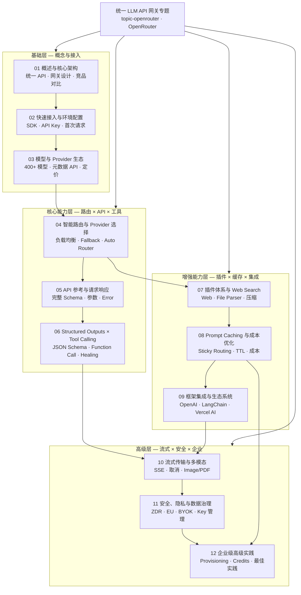

> **生产环境安全提示**
>
> 本文档包含可直接执行的运维命令。执行前请确认：当前目标集群与 Namespace 是否正确；是否具备足够的 RBAC 权限；是否已在非生产环境验证。命令风险等级标注：🔴 高风险（可能造成数据丢失或服务中断）、🟡 中风险（会修改集群状态，但通常可回滚）、🟢 低风险/只读（信息收集，无副作用）。

# AI 编程与 LLM 网关专题 — OpenRouter & OpenCode 全量指南

> **文档类型**: 专题索引 | **最后更新**: 2026-04 | **关键词**: OpenRouter, OpenCode, Unified LLM API, AI Coding, AI Gateway, Provider Routing, Model Fallback, Prompt Caching, MCP, Agent CLI, BYOK, Enterprise

---

## 概述

本专题系统性地覆盖两大核心领域：

1. **OpenRouter** —— 当前最大的统一 LLM API 网关平台，覆盖从核心架构与快速接入，到模型与 Provider 管理、智能路由策略、完整 API 参考、Structured Outputs / Tool Calling、插件体系、Prompt Caching、主流框架集成，再到流式传输、安全隐私、企业级高级实践。

2. **OpenCode** —— 强大的 AI 编程助手与 Agent CLI 工具，支持 75+ LLM Provider（包括 OpenRouter），提供智能代码补全、LSP 集成、MCP 工具调用、GitHub 自动化、自定义 Skills 等企业级开发能力。

所有内容以 **2026 年最新官方文档和高质量社区实践** 为基础，提供可直接落地的配置示例、架构方案和最佳实践。本专题与 `02-ai-agents`（Agent CLI 系列）深度联动，形成从 LLM 基础设施到上层智能体的完整知识闭环。

> **OpenRouter** 提供统一 API 访问 400+ AI 模型，支持 OpenAI SDK 兼容接口、智能 Provider 路由与自动故障转移、Prompt Caching、Web Search 插件、Structured Outputs、BYOK（Bring Your Own Key）等企业级能力。作为 LLM 应用的"中间件层"，OpenRouter 已成为 AI 应用开发者最核心的基础设施之一。
>
> **OpenCode** 是一款面向专业开发者的 AI 编程助手，基于 TypeScript 构建，支持多 Provider 架构、MCP（Model Context Protocol）工具生态、LSP 语言服务器集成、自定义 Skills 扩展、强大的 TUI 界面，以及完整的 GitHub 自动化工作流。

---

## 文档目录

### OpenRouter 系列 (01-12)

| 序号 | 文档 | 内容概要 | 适用角色 | 阅读耗时 |
|:---:|------|---------|---------|---------|
| 01 | OpenRouter 概述与核心架构](./01-openrouter-overview-architecture.md) | 项目定位、核心能力矩阵、统一网关架构、与竞品对比 | 所有工程师 | 25min |
| 02 | 快速接入与环境配置](./02-openrouter-quickstart-setup.md) | SDK 安装、API Key 配置、首次请求、OpenAI SDK 兼容 | 所有工程师 | 15min |
| 03 | 模型与 Provider 生态](./03-openrouter-models-providers.md) | 400+ 模型矩阵、模型元数据 API、模型变体、定价体系 | AI 工程师、架构师 | 25min |
| 04 | 智能路由与 Provider 选择](./04-openrouter-provider-routing.md) | 负载均衡、Provider 排序、性能阈值、Model Fallback、Auto Router | 架构师、SRE | 30min |
| 05 | [API 参考与请求/响应规范](./05-openrouter-api-reference.md) | 完整请求 Schema、响应格式、参数详解、Error Handling | 研发工程师 | 30min |
| 06 | [Structured Outputs 与 Tool Calling](./06-openrouter-structured-outputs-tools.md) | JSON Schema 约束、Tool/Function Calling、Response Healing | 研发工程师 | 20min |
| 07 | [插件体系与 Web Search](./07-openrouter-plugins-web-search.md) | Web 搜索插件、File Parser、Context Compression、引擎选择 | 研发工程师 | 25min |
| 08 | [Prompt Caching 与成本优化](./08-openrouter-prompt-caching-optimization.md) | Provider 级缓存策略、Sticky Routing、TTL 配置、成本分析 | 架构师、AI 工程师 | 25min |
| 09 | [框架集成与生态系统](./09-openrouter-frameworks-integrations.md) | OpenAI SDK、Vercel AI、LangChain、LlamaIndex、Aider/Cline | 研发工程师 | 20min |
| 10 | [流式传输与多模态输入](./10-openrouter-streaming-multimedia.md) | SSE Streaming、Stream Cancellation、Image/PDF/Audio 输入 | 研发工程师 | 20min |
| 11 | [安全、隐私与数据治理](./11-openrouter-security-privacy.md) | 数据收集策略、Zero Data Retention、EU 合规、BYOK、API Key 管理 | 安全工程师、架构师 | 25min |
| 12 | [企业级高级实践](./12-openrouter-enterprise-advanced.md) | Provisioning Keys、Credits 管理、Rate Limits、App Attribution、最佳实践 | SRE、平台工程师 | 30min |

### OpenCode 系列 (21-32)

| 序号 | 文档 | 内容概要 | 适用角色 | 阅读耗时 |
|:---:|------|---------|---------|---------|
| 21 | [OpenCode 概述与核心架构](./21-opencode-overview-architecture.md) | 项目定位、核心能力、系统架构、与竞品对比 | 所有工程师 | 25min |
| 22 | [安装与快速开始](./22-opencode-installation-quickstart.md) | 多平台安装、配置初始化、首次使用、Hello World | 所有工程师 | 15min |
| 23 | [Provider 与模型配置](./23-opencode-providers-models.md) | 75+ Provider 支持、API Key 配置、模型选择、本地模型 | AI 工程师 | 20min |
| 24 | [Agent 系统架构](./24-opencode-agents-system.md) | Agent 模式、多 Agent 协作、上下文管理、记忆系统 | 研发工程师 | 30min |
| 25 | [工具与权限管理](./25-opencode-tools-permissions.md) | 内置工具、权限控制、确认模式、安全策略 | 研发工程师 | 25min |
| 26 | [MCP 集成指南](./26-opencode-mcp-integration.md) | MCP 协议、Servers 配置、Stdio/SSE 传输、工具发现 | 研发工程师 | 30min |
| 27 | [LSP 与代码格式化](./27-opencode-lsp-formatters.md) | LSP 支持、Diagnostics、Formatter 配置、代码修复 | 研发工程师 | 20min |
| 28 | [Skills 与自定义命令](./28-opencode-skills-commands.md) | 内置 Skills、自定义 Skill 开发、命令系统、快捷键 | 研发工程师 | 25min |
| 29 | [TUI 界面与定制](./29-opencode-tui-customization.md) | 终端界面、主题配置、布局定制、交互模式 | 所有工程师 | 20min |
| 30 | [Server 模式与 API](./30-opencode-server-api.md) | HTTP Server、WebSocket、API 端点、远程连接 | 架构师、SRE | 25min |
| 31 | [GitHub 自动化](./31-opencode-github-automation.md) | PR 创建、Issue 管理、代码审查、CI/CD 集成 | 研发工程师 | 25min |
| 32 | [高级主题与最佳实践](./32-opencode-advanced-topics.md) | 性能优化、调试技巧、故障排查、企业部署 | 架构师、SRE | 30min |

---

## 内容结构全景

---

## 快速入口

**初学者 / 新手上路**：
1. [01 - 概述与架构](./01-openrouter-overview-architecture.md) → [02 - 快速接入](./02-openrouter-quickstart-setup.md) → [03 - 模型与 Provider](./03-openrouter-models-providers.md)

**AI 应用工程师**：
1. [05 - API 参考](./05-openrouter-api-reference.md) → [06 - Structured Outputs](./06-openrouter-structured-outputs-tools.md) → [07 - 插件与 Web Search](./07-openrouter-plugins-web-search.md) → [10 - 流式与多模态](./10-openrouter-streaming-multimedia.md)

**架构师 / SRE**：
1. [04 - 智能路由](./04-openrouter-provider-routing.md) → [08 - Prompt Caching](./08-openrouter-prompt-caching-optimization.md) → [11 - 安全隐私](./11-openrouter-security-privacy.md) → [12 - 企业高级](./12-openrouter-enterprise-advanced.md)

**框架集成开发者**：
1. [09 - 框架集成](./09-openrouter-frameworks-integrations.md) → [06 - Tool Calling](./06-openrouter-structured-outputs-tools.md) → [07 - Web Search](./07-openrouter-plugins-web-search.md)

---

## 关联专题

| 专题/领域 | 与本专题的关系 |
|---------|--------------|
| [02-ai-agents](../domain-14-ai-ml-infra/02-ai-agents/) | Agent CLI 系列，OpenRouter 是主流 Agent 工具的统一 LLM 后端 |
| [domain-11-ai-infra](../domain-14-ai-ml-infra/) | AI 基础设施，OpenRouter 作为 LLM 推理服务的统一接入层 |
| [domain-40-cloud-native-api-gateway](../domain-03-networking-traffic/) | 云原生 API 网关，OpenRouter 是 LLM 领域的 API Gateway 实践 |

---

## 覆盖的关键技术

### OpenRouter 技术栈

| 技术领域 | 覆盖内容 |
|---------|---------|
| **核心架构** | 统一 LLM API Gateway、OpenAI 兼容接口、Provider Proxy、自动故障转移 |
| **模型生态** | 400+ 模型、OpenAI/Anthropic/Google/Meta/DeepSeek 等、模型变体 (:free/:nitro/:online) |
| **智能路由** | Price-Based Load Balancing、Throughput/Latency Sort、Performance Thresholds、Auto Router |
| **API 能力** | Chat Completions、Structured Outputs、Tool Calling、Streaming SSE、Assistant Prefill |
| **插件体系** | Web Search (Native/Exa/Firecrawl/Parallel)、File Parser (PDF)、Response Healing、Context Compression |
| **成本优化** | Prompt Caching (OpenAI/Anthropic/DeepSeek/Gemini)、Provider Sticky Routing、Cache TTL、Free Models |
| **框架集成** | OpenAI SDK、Vercel AI SDK、LangChain、LlamaIndex、Mastra、PydanticAI、Aider/Cline/RooCode |
| **安全治理** | Zero Data Retention、EU Data Residency、BYOK、Provisioning Keys、OAuth PKCE |

### OpenCode 技术栈

| 技术领域 | 覆盖内容 |
|---------|---------|
| **核心架构** | Agent-based AI Coding、多 Provider 架构、MCP 协议、LSP 集成 |
| **Provider 支持** | OpenRouter、OpenAI、Anthropic、Google、Azure、Ollama、LM Studio 等 75+ |
| **Agent 系统** | Multi-Agent 协作、上下文管理、记忆系统、ReAct 模式 |
| **工具生态** | MCP (Model Context Protocol)、内置工具、自定义 Skills、权限控制 |
| **代码能力** | LSP 语言服务器、Diagnostics、Formatter、代码补全、重构 |
| **DevOps 集成** | GitHub Automation、PR 管理、Issue 追踪、CI/CD 工作流 |
| **部署模式** | CLI 交互模式、Server/API 模式、WebSocket 远程连接 |
| **扩展机制** | Custom Skills、Keybindings、Themes、Layout Customization |

---

*本专题为 kudig-database 项目原创内容，基于 OpenRouter 官方文档（openrouter.ai/docs）、OpenCode 官方文档（opencode.ai）和高质量社区实践整理。*

## Related

- Domain-34: CNCF Landscape 开源项目 — Cross-reference
- [[entities/release-notes-networking.md|发布说明索引 — 网络]] — Cross-reference
- domain-03-networking-traffic MOC — Cross-reference
- Topic 应用层架构设计最佳实践 — Cross-reference
- topic-application-architecture MOC — Cross-reference
- [[concepts/bp-common-best-practices.md|Kubernetes 通用最佳实践参考]] — Cross-reference
- [[concepts/KUDIG Knowledge Base Architecture.md|KUDIG Knowledge Base Architecture]] — Cross-reference
- [[domain-14-ai-ml-infra/01-ai-infra/03-gpu-scheduling-management.md|GPU 调度与管理]] — Cross-reference
- [[domain-14-ai-ml-infra/01-ai-infra/05-distributed-training-frameworks.md|分布式训练框架]] — Cross-reference
- domain-08-release-change-management MOC — Cross-reference
- [[skills/learn-decision-tree-mermaid.md|故障排查决策树 - Mermaid 可视化版]] — Cross-reference
- [[skills/skill-22-daemonset-failure.md|DaemonSet 故障诊断与修复 / DaemonSet Failure Diagnosis & Remediation]] — Cross-reference
- [[domain-07-platform-engineering/operate/06-monitoring-alerting-system.md|监控告警体系]] — Cross-reference
- Domain 30: 企业级灾备与业务连续性 (Enterprise Disaster Recovery & Business Continuity) — Cross-reference
- [[entities/ecosystem-changelog.md|生态组件变更日志索引]] — Cross-reference
- [[domain-19-landscape-references/topic-index/cluster-index.md|Cluster 集群知识图谱索引]]
- [[domain-19-landscape-references/topic-index/pvc-index.md|PVC 知识图谱索引]]
- [[domain-19-landscape-references/topic-index/terway-index.md|Terway 知识图谱索引]]
- [[domain-19-landscape-references/topic-index/nginx-ingress-index.md|nginx-ingress-controller 知识图谱索引]]
- [[domain-19-landscape-references/topic-index/higress-index.md|Higress 知识图谱索引]]
- [[domain-14-ai-ml-infra/topic-ai-coding/06-openrouter-structured-outputs-tools.md|06-openrouter-structured-outputs-tools]]
- [[domain-14-ai-ml-infra/topic-ai-coding/01-openrouter-overview-architecture.md|01-openrouter-overview-architecture]]
- [[domain-14-ai-ml-infra/topic-ai-coding/09-openrouter-frameworks-integrations.md|09-openrouter-frameworks-integrations]]
- [[domain-14-ai-ml-infra/topic-ai-coding/10-openrouter-streaming-multimedia.md|10-openrouter-streaming-multimedia]]
- [[domain-14-ai-ml-infra/topic-ai-coding/29-opencode-tui-customization.md|29-opencode-tui-customization]]
- [[domain-14-ai-ml-infra/topic-ai-coding/03-openrouter-models-providers.md|03-openrouter-models-providers]]
- [[domain-14-ai-ml-infra/topic-ai-coding/07-openrouter-plugins-web-search.md|07-openrouter-plugins-web-search]]
- [[domain-14-ai-ml-infra/topic-ai-coding/02-openrouter-quickstart-setup.md|02-openrouter-quickstart-setup]]
- [[domain-14-ai-ml-infra/topic-ai-coding/23-opencode-providers-models.md|23-opencode-providers-models]]

<!-- risk-assessed -->
