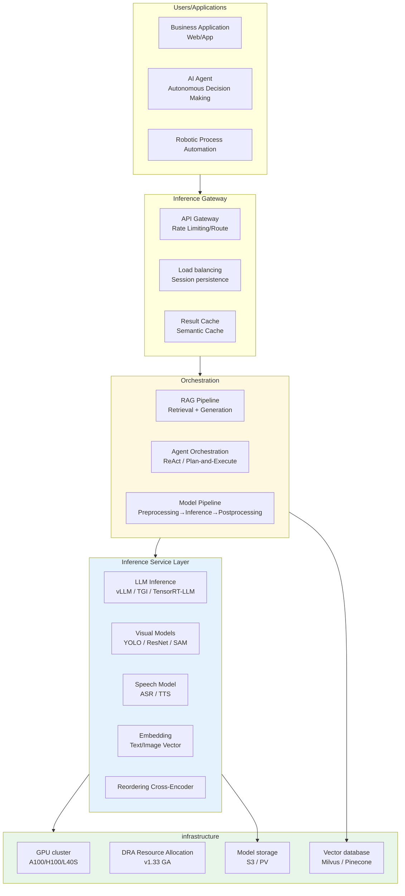
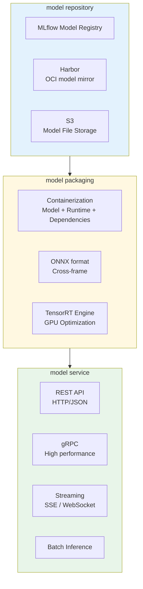
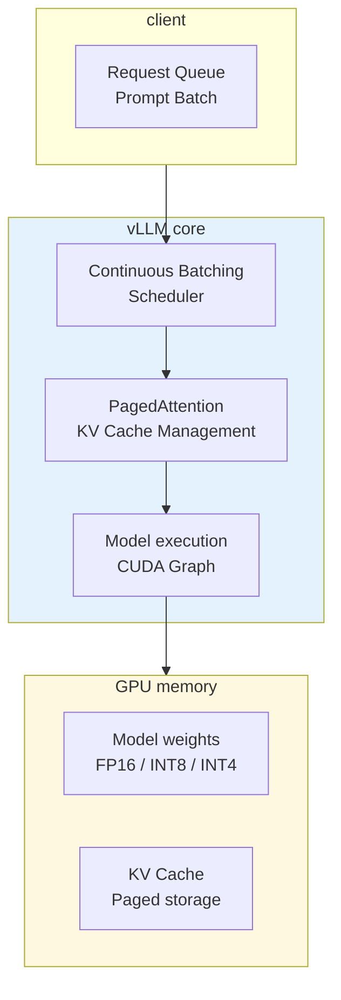
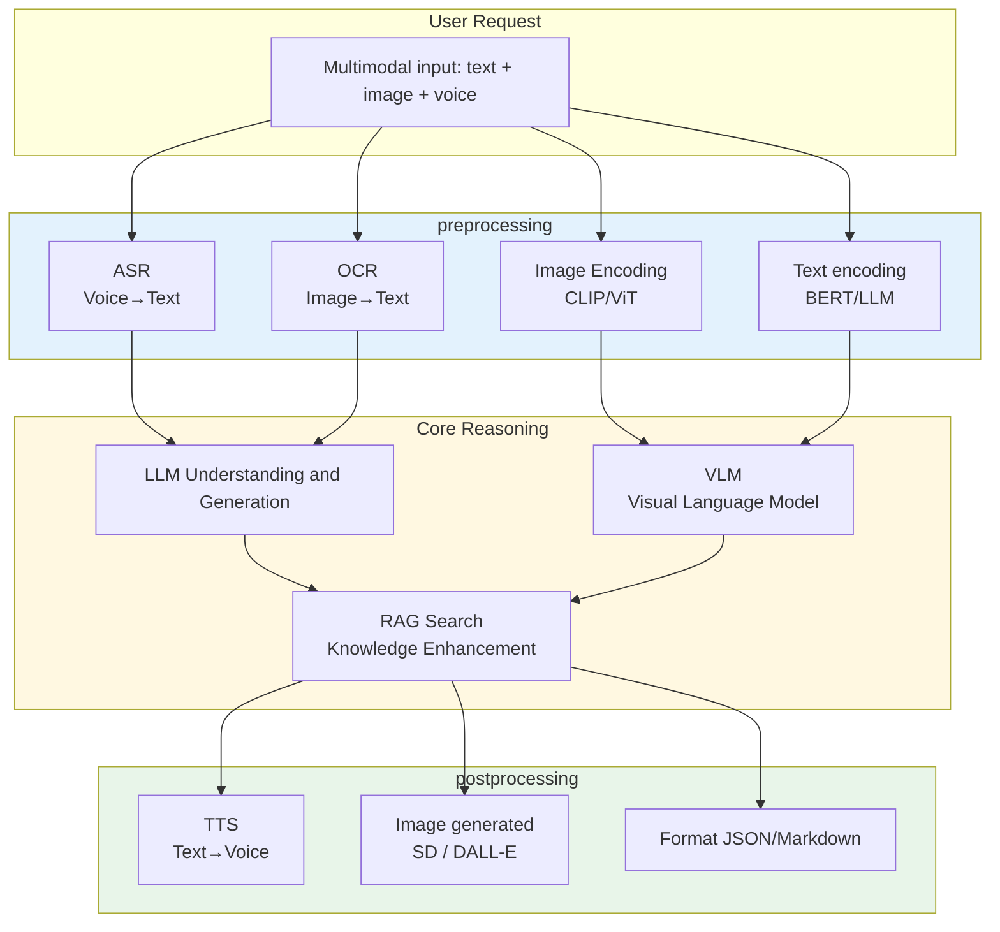
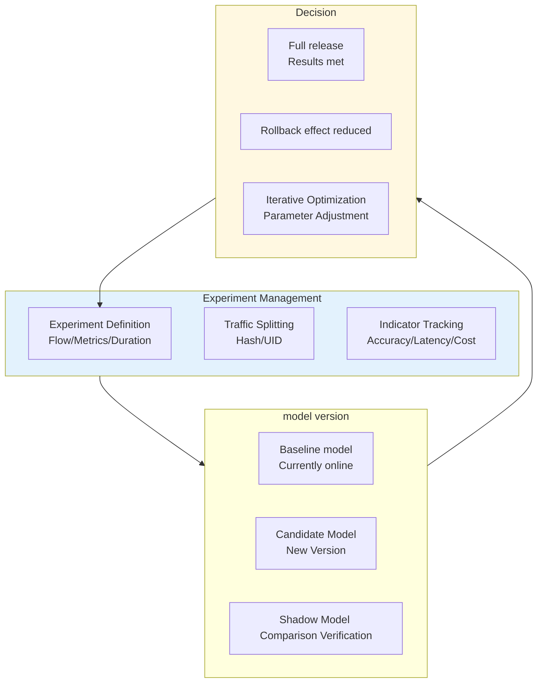
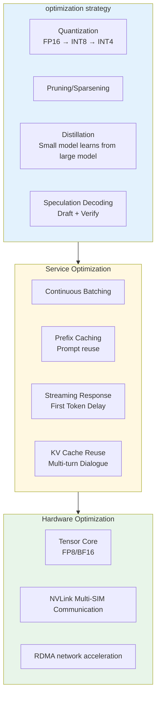

# AI/ML Inference Service Kubernetes Production Architecture Design

**Applicable Scenarios:** LLM large-model inference / Image recognition / Speech synthesis / Recommendation systems / Intelligent customer service / Autonomous driving perception  
**Applicable Versions:** Kubernetes v1.29 - v1.33  
Last updated: 2026-04-24  
**Target Audience:** MLOps engineers, AI platform architects, algorithm engineers (TLs)



---

<!-- chunk: II. Model Service Architecture --> ## II. Model Service Architecture



## KServe Model Service Configuration

```yaml
apiVersion: serving.kserve.io/v1beta1
kind: InferenceService
metadata:
  name: sentiment-classifier
  namespace: ai-platform
  annotations:
    serving.kserve.io/deploymentMode: Serverless
spec:
  predictor:
    model:
      modelFormat:
        name: sklearn
      storageUri: s3://ai-models/sentiment/v2/
      resources:
        requests:
          cpu: "1"
          memory: "2Gi"
        limits:
          cpu: "4"
          memory: "8Gi"
    minReplicas: 2
    maxReplicas: 10
    containerConcurrency: 100
    timeout: 30
---
apiVersion: serving.kserve.io/v1beta1
kind: InferenceService
metadata:
  name: image-classifier
  namespace: ai-platform
spec:
  predictor:
    model:
      modelFormat:
        name: pytorch
      storageUri: s3://ai-models/vision/resnet50/
      runtime: kserve-triton
      resources:
        requests:
          cpu: "2"
          memory: "8Gi"
          nvidia.com/gpu: "1"
        limits:
          cpu: "8"
          memory: "32Gi"
          nvidia.com/gpu: "1"
    nodeSelector:
      node-type: gpu
    tolerations:
      - key: nvidia.com/gpu
        operator: Exists
        effect: NoSchedule
```

---

<!-- chunk: III. GPU Cluster Scheduling Architecture --> ## III. GPU Cluster Scheduling Architecture

```mermaid
flowchart TB
    subgraph SchedulerExt["Scheduler Extension"]
        K8S_SCHED["kube-scheduler"]
        GPU_SCHED["GPU Scheduler<br/>NVIDIA / Volcano"]
        DRA_SCHED["DRA Plugin<br/>v1.33 GA"]
        GANG["Gang Scheduling<br">All-or-Nothing"]
    end

    subgraph NodePool["node pool"]
        GPU_A100["A100 node pool<br/>80GB VRAM"]
        GPU_H100["H100 node pool<br/>80GB VRAM"]
        GPU_L40S["L40S node pool<br/>48GB VRAM"]
        GPU_T4["T4 node pool<br/>16GB VRAM<br/>Dedicated to inference"]
    end

    subgraph Workloads["Workloads"]
        TRAIN["Training Job<br/>Multi-GPU Parallel Processing"]
        INFER["Inference Service<br/>High Throughput"]
        FINETUNE["Fine-tuning Job LoRA / QLoRA"]
    end

    SchedulerExt --> NodePool --> Workloads

    style SchedulerExt fill:#e3f2fd
    style NodePool fill:#fff8e1
```

## DRA GPU Resource Allocation

```yaml
apiVersion: resource.k8s.io/v1beta1
kind: ResourceClaimTemplate
metadata:
  name: gpu-llm-claim-template
  namespace: ai-platform
spec:
  spec:
    resourceClassName: nvidia.com/gpu
    parametersRef:
      apiGroup: resource.nvidia.com
      kind: GpuConfig
      name: llm-gpu-params
---
apiVersion: resource.nvidia.com/v1alpha1
kind: GpuConfig
metadata:
  name: llm-gpu-params
  namespace: ai-platform
spec:
  memory: "80Gi"
  computeMode: "default"
  multiNodeEnabled: false
---
apiVersion: apps/v1
kind: Deployment
metadata:
  name: llm-inference-service
  namespace: ai-platform
spec:
  replicas: 2
  selector:
    matchLabels:
      app: llm-inference
  template:
    metadata:
      labels:
        app: llm-inference
    spec:
      containers:
        - name: vllm
          image: vllm/vllm-openai:v0.4.0
          args:
            - --model
            - /models/llama-3-70b
            - --tensor-parallel-size
            - "2"
            - --max-model-len
            - "8192"
          ports:
            - containerPort: 8000
              name: http
          resources:
            claims:
              - name: gpu
          volumeMounts:
            - name: model-storage
              mountPath: /models
      resourceClaims:
        - name: gpu
          source:
            resourceClaimTemplateName: gpu-llm-claim-template
      volumes:
        - name: model-storage
          persistentVolumeClaim:
            claimName: llm-model-pvc
```

---

<!-- chunk: IV. LLM Large Model Inference Architecture --> ## IV. LLM Large Model Inference Architecture

## vLLM Inference Service Architecture



## vLLM K8s Deployment

```yaml
apiVersion: apps/v1
kind: Deployment
metadata:
  name: vllm-llama3-70b
  namespace: ai-platform
spec:
  replicas: 1
  selector:
    matchLabels:
      app: vllm-llama3-70b
  template:
    metadata:
      labels:
        app: vllm-llama3-70b
    spec:
      nodeSelector:
        node-type: gpu-a100
      tolerations:
        - key: nvidia.com/gpu
          operator: Exists
          effect: NoSchedule
      containers:
        - name: vllm
          image: vllm/vllm-openai:v0.4.0
          command:
            - python
            - -m
            - vllm.entrypoints.openai.api_server
          args:
            - --model
            - /models/Meta-Llama-3-70B-Instruct
            - --tensor-parallel-size
            - "2"
            - --pipeline-parallel-size
            - "1"
            - --max-num-seqs
            - "256"
            - --max-model-len
            - "8192"
            - --quantization
            - "awk"
            - --gpu-memory-utilization
            - "0.95"
            - --dtype
            - "half"
          ports:
            - containerPort: 8000
              name: http
          resources:
            requests:
              nvidia.com/gpu: "2"
              memory: "160Gi"
              cpu: "16"
            limits:
              nvidia.com/gpu: "2"
              memory: "160Gi"
              cpu: "32"
          volumeMounts:
            - name: model-storage
              mountPath: /models
            - name: shm
              mountPath: /dev/shm
          livenessProbe:
            httpGet:
              path: /health
              port: 8000
            initialDelaySeconds: 300
            periodSeconds: 30
          readinessProbe:
            httpGet:
              path: /health
              port: 8000
            initialDelaySeconds: 60
            periodSeconds: 10
      volumes:
        - name: model-storage
          persistentVolumeClaim:
            claimName: llama3-70b-pvc
        - name: shm
          emptyDir:
            medium: Memory
            sizeLimit: 32Gi
---
# Model Loading and Warming Job
apiVersion: batch/v1
kind: Job
metadata:
  name: model-preload
  namespace: ai-platform
spec:
  template:
    spec:
      nodeSelector:
        node-type: gpu-a100
      containers:
        - name: preload
          image: vllm/vllm-openai:v0.4.0
          command:
            - python
            - -c
            - |
              from vllm import LLM
              llm = LLM("/models/Meta-Llama-3-70B-Instruct",
                        tensor_parallel_size=2,
                        quantization="awq")
              print("Model preloaded successfully")
          resources:
            requests:
              nvidia.com/gpu: "2"
              memory: "160Gi"
      restartPolicy: Never
```

---

<!-- chunk: V. Multimodal Service Orchestration Architecture-->## V. Multimodal Service Orchestration Architecture



---

<!-- chunk: VI. A/B Testing and Model Iteration Architecture --> ## VI. A/B Testing and Model Iteration Architecture



---

<!-- chunk: VII. Inference Performance Optimization Architecture --> ## VII. Inference Performance Optimization Architecture



---

<!-- chunk: VIII. Kubernetes Deployment Architecture --> ## VIII. Kubernetes Deployment Architecture

## GPU Node Pools and Automatic Scaling

```yaml
apiVersion: karpenter.sh/v1
kind: NodePool
metadata:
  name: gpu-inference-pool
spec:
  template:
    spec:
      requirements:
        - key: node.kubernetes.io/instance-type
          operator: In
          values: ["p4d.24xlarge", "p5.48xlarge"]
        - key: karpenter.sh/capacity-type
          operator: In
          values: ["on-demand"]
        - key: nvidia.com/gpu.present
          operator: In
          values: ["true"]
      taints:
        - key: nvidia.com/gpu
          value: "true"
          effect: NoSchedule
      nodeClassRef:
        group: karpenter.k8s.aws
        kind: EC2NodeClass
        name: gpu-class
  limits:
    cpu: 1000
    memory: 4000Gi
    nvidia.com/gpu: 100
---
# KEDA Automatic Resizing Inference Service Based on Queue Length
apiVersion: keda.sh/v1alpha1
kind: ScaledObject
metadata:
  name: llm-inference-scaler
  namespace: ai-platform
spec:
  scaleTargetRef:
    name: vllm-llama3-70b
  minReplicaCount: 1
  maxReplicaCount: 10
  triggers:
    - type: prometheus
      metadata:
        serverAddress: http://prometheus.monitoring:9090
        metricName: vllm_gpu_cache_usage_perc
        threshold: "80"
        query: |
          avg(vllm_gpu_cache_usage_perc)
    - type: prometheus
      metadata:
        serverAddress: http://prometheus.monitoring:9090
        metricName: vllm_request_queue_time
        threshold: "5000"
        query: |
          histogram_quantile(0.99,
            sum(rate(vllm_request_queue_time_bucket[1m])) by (le)
          )
```

## Inference Service Monitoring Alerts

```yaml
apiVersion: monitoring.coreos.com/v1
kind: PrometheusRule
metadata:
  name: ai-inference-alerts
  namespace: monitoring
spec:
  groups:
    - name: inference-quality
      rules:
        - alert: LLMHighQueueTime
          expr: |
            histogram_quantile(0.99,
              sum(rate(vllm_request_queue_time_bucket[5m])) by (le)
            ) > 10000
          for: 2m
          labels:
            severity: critical
          annotations:
            Summary: "LLM inference queue P99 latency exceeds 10s, requires expansion"

        - alert: GPUOutOfMemory
          expr: |
            nvidia_gpu_memory_used_bytes / nvidia_gpu_memory_total_bytes > 0.95
          for: 1m
          labels:
            severity: critical
          annotations:
            Summary: "GPU memory usage exceeds 95%"

        - alert: ModelLoadFailure
          expr: |
            kube_deployment_status_replicas_unavailable{deployment=~"vllm-.*"} > 0
          for: 5m
          labels:
            severity: warning
          annotations:
            Summary: "LLM inference service model loading failed"
```

---

<!-- chunk: Reference Links-->## Reference Links

- [vLLM documentation](https://docs.vllm.ai/)
- [KServe Documentation](https://kserve.github.io/website/)
- [NVIDIA Triton Inference Server](https://docs.nvidia.com/deeplearning/triton-inference-server/)
- [TensorRT-LLM](https://github.com/NVIDIA/TensorRT-LLM)
- [Kubernetes DRA](https://kubernetes.io/docs/concepts/scheduling-eviction/dynamic-resource-allocation/)

---

<!-- chunk: Multi-cloud deployment solution comparison-->## Multi-cloud deployment solution comparison

## Cloud Services → Multi-Cloud Mapping Table

| Capability Domains | AWS | GCP | Azure | Description |
|:---|:---|:---|:---|:---|
| Kubernetes Container Orchestration | **EKS** | **GKE** | **AKS** | This document is based on native Kubernetes and can be deployed on various clouds. |
| GPU Instance (A100) | **p4d.24xlarge** | **a2-ultragpu-8g** | **ND A100 v4** | GPU model and specifications may differ |
| GPU Instance (H100) | **p5.48xlarge** | **a3-highgpu-8g** | **ND H100 v5** | H100 availability is subject to supply constraints |
| GPU Instance (T4 Inference) | **g4dn.xlarge** | **n1-standard + T4** | **NC T4 v3** | Dedicated to inference, high cost-performance ratio |
| Object Storage (Model) | **S3** | **GCS** | **Blob Storage** | Model file storage, using S3 compatible API |
| Image Repository | **ECR** | **Artifact Registry** | **ACR** | Model Container Image Storage |
| Node Auto-Scaling | **Karpenter** | **GKE Autopilot** | **Karpenter / Virtual Nodes** | GPU Node Elastic Scaling |
| ML Platforms | **SageMaker** | **Vertex AI** | **Azure ML** | Optional, KServe can also be used as an alternative |
| Inference Services | **SageMaker Endpoints** | **Vertex AI Endpoints** | **Azure ML Endpoints** | This document uses KServe and is not cloud-dependent. |
| Logs/Monitoring | **CloudWatch** | **Cloud Monitoring** | **Monitor** | This document uses Prometheus + Grafana |
| Spot Instances | Preemptible VMs | Spot VMs | GPU Spot Instances can reduce costs by 60-90% |
Network Acceleration (RDMA) | **EFA** | **gVNIC** | **InfiniBand** | Multi-card/Multi-node Communication Acceleration |

## Multi-cloud deployment considerations

1. **GPU Availability**: The availability of GPU instance models, memory specifications, and supply varies across different cloud platforms. H100/A100 instances may be out of stock in some cloud regions; it is necessary to assess the GPU inventory of the target region in advance.
2. **Karpenter Compatibility**: This document uses the `karpenter.k8s.aws` EC2NodeClass for KarpenterNodePool, which is specific to AWS. GCP uses GKE Autopilot or the Karpenter GCP Provider, and Azure uses the Karpenter Azure Provider or the Karpenter AKS Provider. The NodeClass CRD needs to be modified according to the target cloud.
3. **Model Storage**: Model files are recommended to be stored in S3-compatible object storage (various cloud-native S3 APIs or MinIO). KServe's storageUri supports protocols such as s3://, gs://, and azblob://, but the configuration methods differ and adaptation is required.
4. **GPU Communication**: Multi-GPU inference (Tensor Parallelism) relies on NVLink/NVSwitch. Cross-cloud, multi-node inference requires an RDMA network, which is usually not feasible across clouds; it is recommended to complete it within a single cloud.
5. **Quantization and Optimization:** The quantization models (AWQ/GPTQ) of vLLM/TensorRT-LLM are tied to the GPU architecture. The quantization support for A100 (Ampere) and H100 (Hopper) differs, requiring requantization during migration.
6. **Cost Management**: GPU instance costs vary significantly. AWS p4d.24xlarge ($32/h) vs GCP a2-ultragpu ($35/h) vs Azure ND A100 ($30/h), TCO needs to be evaluated. Spot/preempted instances are key to cost reduction, but outages need to be addressed.

## Cloud Neutral Solutions (Open Source Alternatives)

| Capability Domain | Open Source Solution | Description |
|:---|:---|:---|
| Container Orchestration | **Kubernetes** + **Karpenter** (Multi-Cloud) | Karpenter already supports AWS/GCP/Azure |
| Inference Services | **KServe** / **vLLM** / **TGI** | This document is in use and is completely cloud-neutral |
| Model Format | **ONNX** / **SafeTensors** | Cross-framework, cross-hardware universal format |
Model Registration | **MLflow** (Model Registry) | This document has already mentioned it |
| Model Image | **Harbor** (OCI Artifact) | Supports OCI Artifact Storage Model |
| Object Storage | **MinIO** | S3 Compatible, Self-built Cluster Storage Model File |
| GPU Scheduling | **Volcano** / **Kueue** | Gang Scheduling, Multi-GPU Parallelism |
| Auto-scaling | **KEDA** | This document uses auto-scaling based on metrics |
| Monitoring | **Prometheus** + **Grafana** | This document has used |
| GPU Monitoring | **DCGM Exporter** | Export NVIDIA GPU metrics to Prometheus |
| Vector Databases | **Milvus** / **Qdrant** / **Weaviate** | RAG Scenarios, Not Cloud-Bonded |
| Observability | **OpenTelemetry** | Unified trace/metric/log collection |
| GPU Sharing | **NVIDIA MIG** / **vGPU** / **Time-slicing** | Single Card Multi-Model Sharing |

## See Also

- 06-fintech-architecture
- 07-iot-platform-architecture
- 09-gaming-backend-architecture
- 10-social-media-architecture
