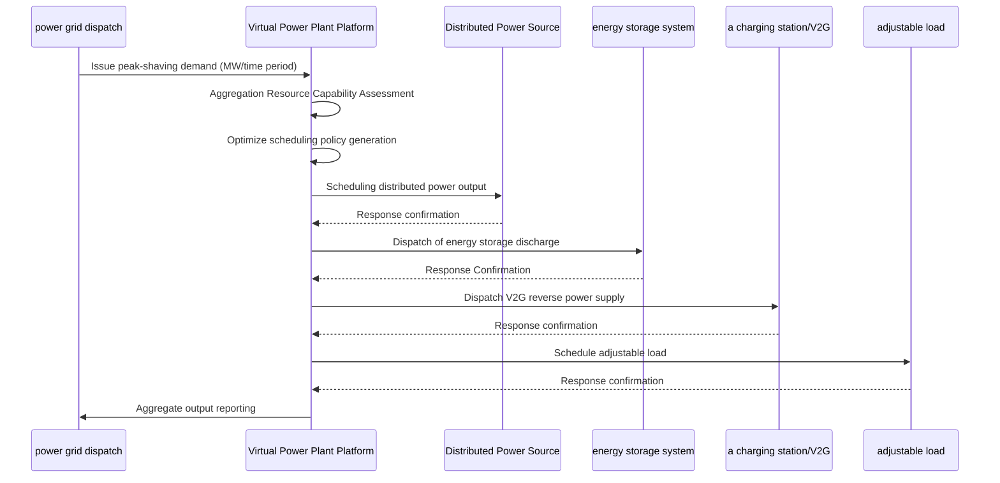

# Energy and Power Kubernetes Production Architecture Design

**Applicable Scenarios:** Smart grid / New energy power generation / Virtual power plant / Carbon asset management / Electricity trading / Charging pile operation
**Cloud Provider:** Alibaba Cloud ACK+ Product System (Power Monitoring System Security Protection Regulations/Information Security Level Compliance 2.0)
**Applicable Versions:** Kubernetes v1.29 - v1.33
Last updated: 2026-05-18
**Target Audience:** Energy industry architects, power system engineers, Alibaba Cloud solution architects

---

<!-- chunk: directory-->## directory

1. [Industry Overview](#1-Industry Overview)
2. [Business Scenarios](#2-Business Scenarios)
3. [Architecture Design](#3-Architecture Design)
4. [Core Technology Stack](#4-Core Technology Stack)
5. [Kubernetes Deployment Solution](#5-Kubernetes-Deployment Solution)
6. [Data Architecture](#6-Data Architecture)
7. [AI/ML Components](#7-aiml-components)
8. [Security Compliance](#8-Security Compliance)
9. [Best Practices](#9-Best Practices)
10. [Anti-pattern](#10-Anti-pattern)
11. [Reference Resources](#11-Reference Resources)

---

<!-- chunk: 1. Industry Overview-->## 1. Industry Overview

## 1.1 Industry Background

The energy and power industry is the lifeblood of the national economy and is undergoing a profound transformation from traditional fossil fuels to clean energy. China's "dual carbon" goals (peak carbon by 2030 and carbon neutrality by 2060) are driving a comprehensive upgrade of the power system: the installed capacity of new energy sources continues to grow (wind power + photovoltaic power exceeds 1 billion kilowatts), the construction of ultra-high-voltage transmission networks is accelerating, the market-oriented reform of the power sector is being deepened, and new business models such as virtual power plants, energy storage, and electric vehicles are flourishing. The informatization of the energy and power industry is evolving from traditional SCADA/EMS systems to cloud-native, big data, and AI-driven smart energy platforms.

The core IT requirements of the energy and power platform encompass: new energy power forecasting (short-term 72-hour/ultra-short-term 4-hour), virtual power plant resource aggregation and optimized scheduling, electricity spot market trading (day-ahead/real-time dual markets), charging pile operation and management (millions of devices connected), carbon asset accounting and trading, and distribution automation and fault self-healing. These requirements place extremely high demands on computing resources (AI inference + optimization solver), storage resources (time-series data from hundreds of millions of meter measurement points), and real-time performance (millisecond-level protection and control). The power industry also faces stringent regulatory compliance requirements: security protection regulations for power monitoring systems (security zoning/dedicated networks/horizontal isolation/vertical authentication), Level 3 of the Information Security Protection Standard 2.0, and protection of critical information infrastructure.

## 1.2 Industry Challenges

| Challenges | Explanation | Architectural Impact |
|:---|:---|:---|
| New Energy Volatility | Large Forecasting Errors in Wind and Solar Power Output | AI Prediction + Energy Storage Scheduling + Backup Optimization |
| Widening load peak-valley difference | Extreme weather/electric vehicle charging exacerbates peak-valley difference | Demand response + virtual power plants for peak shaving and valley filling |
Massive Distributed Access | Million-Level Distributed PV/Energy Storage Grid Connection | Edge Computing + Plug-and-Play Protocols |
| Power Network Security | Power Monitoring Systems Face National-Level Cyber ​​Threats | Zero Trust + Security Partitioning + Defense in Depth |
| Real-time balancing requirements | Frequency stability requirement 50±0.2Hz | Millisecond-level AGC + automatic safety devices |
| Electricity Marketization | High Complexity of Real-Time Clearing in the Spot Market | High-Concurrency Trading Engine + Risk Control |
| Massive Data Scale | Data collected from hundreds of millions of electricity meters in 15 minutes, petabyte-scale time-series data | Lindorm Time Series + Data Lake |
| Strict compliance and regulation | Power monitoring security protection + Information security compliance + Confidentiality assessment | Private cloud/physical isolation + National cryptographic standards |

## 1.3 Market Structure

China's energy and power industry is dominated by two major state-owned enterprises, State Grid and China Southern Power Grid, covering 26 and 5 provinces respectively, with annual investments exceeding 500 billion yuan. Traditional power equipment companies such as NARI Group, XJ Electric, and Pinggao Electric are the main forces driving information technology development. Cloud service providers like Alibaba Cloud, Huawei Cloud, and Tencent Cloud are leveraging their cloud-native and AI capabilities to penetrate the energy sector, providing smart grid solutions. Numerous innovative companies have emerged in niche sectors such as virtual power plants, power trading, integrated energy services, and charging operations, including TELD, Star Charge, Guoneng Rixin, and Langxin Technology.

---

<!-- chunk: 2. Business Scenarios -->## 2. Business Scenarios

## 2.1 Smart Grid Dispatch

Grid dispatching is a core function of the power system, responsible for maintaining real-time balance between power generation and consumption. The dispatching system includes SCADA (Supervisory Control and Data Acquisition), EMS (Energy Management System), DMS (Distribution Management System), and WAMS (Wide Area Measurement System). The next-generation dispatching system needs to support functions such as economic dispatching, safety verification, Automatic Generation Control (AGC), and Automatic Voltage Control (AVC) in scenarios involving large-scale renewable energy integration. The real-time requirements of the dispatching system are extremely high: the AGC control cycle is 4 seconds, and the protection action response time is < 100ms. The system needs to support multi-level dispatching coordination (national dispatch center - grid dispatch center - provincial dispatch center - regional dispatch center - county dispatch center).

## 2.2 Monitoring of New Energy Power Generation

Remote monitoring and power prediction for centralized and distributed renewable energy power plants. Core functions include: equipment status monitoring (real-time data acquisition from wind turbines/inverters), power prediction (based on NWP numerical weather prediction + AI models), health management (early warning and diagnosis of equipment problems), and production management (power generation statistics/reports/benchmarking). Renewable energy power plants are typically located in remote areas, requiring data transmission to the central control center via dedicated lines or 5G networks. Edge computing nodes are deployed within the power plants to achieve local monitoring and autonomous operation even during network outages.

## 2.3 Virtual Power Plant (VPP)

Virtual power plants (VPPs) aggregate resources such as distributed power sources, energy storage, and adjustable loads through communication technologies, allowing them to participate as a whole in grid dispatch and the electricity market. The core functions of a VPP platform include: resource registration and capacity assessment, real-time status monitoring and aggregated capacity calculation, generation of optimized dispatch strategies (optimal economy/optimal response speed), command issuance and execution tracking, and revenue settlement and sharing. VPPs need to coordinate tens of thousands to hundreds of thousands of distributed resources, placing extremely high demands on the platform's concurrent processing and optimization capabilities.

## 2.4 Charging Pile Operation

An operation and management platform for electric vehicle charging stations. China has over 8 million charging stations, covering AC slow charging, DC fast charging, supercharging stations (480kW+), and battery swapping stations. Core functions include: device access and management (OCPP/custom protocol adaptation), charging order management (start/stop/billing/payment), intelligent navigation and reservation (finding charging stations/queuing/reserving charging), operation monitoring (equipment issues/utilization/revenue analysis), and interconnectivity (interfacing with major automakers/map platforms). The charging station platform needs to support concurrent connections of millions of devices and handle peak order surges.

## 2.5 Carbon Asset Management

Enterprise carbon emission accounting, carbon quota management, and carbon trading. Core functions include: emission accounting (scope 1/2/3 greenhouse gas emission calculation), emission reduction project management (CCER/green electricity/green certificates), carbon inventory (annual carbon emission verification), carbon target management (carbon peaking/carbon neutrality path planning), and carbon market trading (CEA quota trading/CCER offsetting). The carbon asset management platform needs to interface with the enterprise's energy management system and production management system to automatically collect energy consumption data and calculate carbon emissions.

---

<!-- chunk: 3. Architecture Design-->## 3. Architecture Design

## 3.1 Energy and Power Panorama Architecture

```mermaid
flowchart TB
    subgraph generation ["power generation side"]
        COAL ["Flexibility Retrofitting of Thermal Power Plants"]
        WIND ["Onshore/Offshore Wind Power"]
        SOLAR["Distributed/Centralized Photovoltaics"]
        HYDRO (pumped storage hydroelectric power)
        STORAGE_E["Energy Storage Electrochemistry/Compressed Air"]
    end

    subgraph Transmission["Power Transmission and Transformation"]]
        UHV ["Ultra-high voltage ±1100kV"]
        SUBSTATION ["Intelligent Transformer for Substations"]
        GRID_DIST["Distribution Network Automation/FA"]
    end

    subgraph Consumption ["Electricity Consumption Side"]
        INDUSTRY ["Industrial Large User Demand Response"]
        COMMERCIAL ["Commercial Buildings/Parks"]
        RESIDENTIAL ["Residential Solar PV"]
        EV ["V2G electric vehicle"]
    end

    subgraph Platform["Energy Platform ACK"]
        SCADA_CLOUD["SCADA Cloud Monitoring"]
        EMS_P["EMS Energy Management and Dispatch"]
        VPP_P["VPP Virtual Power Plant"]
        TRADING_P["Power Trading Platform"]
        CARBON_P["Carbon Asset Management"]
        CHARGE_P["Charging Operation Platform"]
    end

    subgraph DataEnergy ["Data Intelligence"]
        FORECAST ["Power Prediction AI"]
        OPTIMIZE ["MILP Optimization Solver"]
        TWIN ["Digital Twin Power Grid Simulation"]
        ANALYTICS ["Operations Analysis BI"]
    end

    Generation --> Transmission --> Consumption
    Generation & Transmission & Consumption --> Platform --> DataEnergy

    style Platform fill:#e3f2fd
    style DataEnergy fill:#e8f5e9
```

## 3.2 Virtual Power Plant Scheduling Sequence



## 3.3 Charging Pile Operation Platform

```mermaid
flowchart TB
    subgraph Piles ["charging piles"]
        AC charging station (7kW slow charging)
        DC fast charging pile 120kW
        SUPER ["Supercharging Station 480kW+"]
        SWAP ["Battery swap station in 3 minutes"]
    end

    subgraph Platform_C["Charging Platform ACK"]
        CONNECT_C["Device connected to OCPP"]
        ORDER_C["Charging order billing"]
        PAY_C["Payment in advance/Pay later"]
        NAVI_C["Navigation Reservation"]
    end

    subgraph Ops["Operations Management"]
        MONITOR_C["Monitoring problem alert"]
        MAINT_C["Operations, Maintenance, Inspection, and Upkeep"]
        ANALYSIS_C["Analysis utilization/revenue"]
        SETTLE_C["Settlement and Reconciliation"]
    end

    Piles --> Platform_C --> Ops
```

---

<!-- chunk: 4. Core Technology Stack --> ## 4. Core Technology Stack

| Category | Open Source Tools | Alibaba Cloud Solution | Description |
|:---|:---|:---|:---|
| Time Series Databases | InfluxDB, TDengine | Lindorm Time Series Engine | High-Frequency Data Acquisition for Hundreds of Millions of Measurement Points |
Real-time Computing | Flink, Kafka Streams | Real-time Computing with Flink | Real-time Power/Load Computing |
Offline computing | Spark, Hive | MaxCompute | Historical data analysis |
| AI Prediction | Prophet, Transformer | PAI | Power/Load Prediction |
| Optimization Solution | Pyomo, Gurobi | E-HPC | MILP Scheduling Optimization |
| Edge Computing | [[KubeEdge|KubeEdge]], [[OpenYurt|OpenYurt]] | ACK@Edge | Power Station/Substation Edge |
| IoT Access | EMQX, Mosquitto | Alibaba Cloud IoT Platform | Device Protocol Adaptation |
| Protocol Conversion | IEC 61850, IEC 104, Modbus | Self-developed Protocol Gateway | Power Equipment Communication |
Digital Twin | Unity, Cesium | DataV + 3D Visualization | Panoramic Power Grid Display |
| Blockchain | Fabric, FISCO BCOS | AntChain BaaS | Carbon Trading Evidence Storage |
| Container Platform | Kubernetes | ACK Pro/Dedicated Edition | Security and Compliance Deployment |

---

<!-- chunk: 5. Kubernetes Deployment Solution-->## 5. Kubernetes Deployment Solution

## 5.1 SCADA Data Acquisition Unit

```yaml
apiVersion: apps/v1
kind: Deployment
metadata:
  name: scada-data-collector
  namespace: energy-platform
spec:
  replicas: 5
  selector:
    matchLabels:
      app: scada-collector
  template:
    metadata:
      labels:
        app: scada-collector
    spec:
      affinity:
        podAntiAffinity:
          preferredDuringSchedulingIgnoredDuringExecution:
            - weight: 100
              podAffinityTerm:
                labelSelector:
                  matchExpressions:
                    - key: app
                      operator: In
                      values:
                        - scada-collector
                topologyKey: kubernetes.io/hostname
      containers:
        - name: collector
          image: registry.cn-hangzhou.aliyuncs.com/energy/scada-collector:v1.0
          ports:
            - containerPort: 8080
            - containerPort: 2404
              name: iec104
          env:
            - name: PROTOCOL_ADAPTERS
              value: "iec104,modbus,mqtt"
            - name: LINDORM_URL
              valueFrom:
                secretKeyRef:
                  name: energy-db-secret
                  key: lindorm-url
            - name: POINTS_BATCH_SIZE
              value: "5000"
            - name: WRITE_INTERVAL_MS
              value: "1000"
          resources:
            requests:
              cpu: "2"
              memory: "4Gi"
            limits:
              cpu: "8"
              memory: "16Gi"
```

## 5.2 Power Prediction GPU Service

```yaml
apiVersion: apps/v1
kind: Deployment
metadata:
  name: power-forecast-ai
  namespace: energy-platform
spec:
  replicas: 2
  selector:
    matchLabels:
      app: power-forecast
  template:
    metadata:
      labels:
        app: power-forecast
    spec:
      nodeSelector:
        node-type: gpu
      tolerations:
        - key: nvidia.com/gpu
          operator: Exists
          effect: NoSchedule
      containers:
        - name: forecast
          image: registry.cn-hangzhou.aliyuncs.com/energy/power-forecast:v2.0
          ports:
            - containerPort: 8080
          env:
            - name: MODEL_PATH
              value: "/models/wind-power-forecast-v3"
            - name: FORECAST_HORIZON
              value: "72"
            - name: RESOLUTION
              value: "15min"
            - name: LINDORM_URL
              valueFrom:
                secretKeyRef:
                  name: energy-db-secret
                  key: lindorm-url
          resources:
            requests:
              cpu: "4"
              memory: "16Gi"
              nvidia.com/gpu: "1"
            limits:
              cpu: "16"
              memory: "64Gi"
              nvidia.com/gpu: "1"
          volumeMounts:
            - name: model-storage
              mountPath: /models
      volumes:
        - name: model-storage
          persistentVolumeClaim:
            claimName: forecast-model-pvc
```

## 5.3 Charging Pile Equipment Connection

```yaml
apiVersion: apps/v1
kind: Deployment
metadata:
  name: charge-station-gateway
  namespace: energy-platform
spec:
  replicas: 10
  selector:
    matchLabels:
      app: charge-gateway
  template:
    metadata:
      labels:
        app: charge-gateway
    spec:
      containers:
        - name: gateway
          image: registry.cn-hangzhou.aliyuncs.com/energy/charge-gateway:v3.0.0
          ports:
            - containerPort: 8080
            - containerPort: 1883
              name: mqtt
          env:
            - name: PROTOCOL
              value: "ocpp2.0"
            - name: MAX_DEVICES
              value: "100000"
            - name: MQTT_BROKER
              value: "mqtt-broker:1883"
            - name: DB_URL
              valueFrom:
                secretKeyRef:
                  name: energy-db-secret
                  key: polardb-url
          resources:
            requests:
              cpu: "2"
              memory: "4Gi"
            limits:
              cpu: "4"
              memory: "8Gi"
```

---

<!-- chunk: 6. Data Architecture --> ## 6. Data Architecture

## 6.1 Data Layering

```mermaid
flowchart TB
    Subgraph acquisition layer ["Data acquisition"]
        M1["Smart meter 15min/hundred million level"]
        M2["PMU Synchronization Phasor μs Level"]
        M3["Weather data NWP 1h"]
        M4["Real-time charging station data"]
    end

    Subgraph storage layer ["Data storage"]
        S1["Lindorm time series measurement data"]
        S2["PolarDB Business Transactions/Assets"]
        S3["OSS Archived Historical Data"]
        S4["Redis Real-time State Cache"]
    end

    Subgraph analysis layer ["data analysis"]
        A1["Flink Real-time Power/Load"]
        A2["MaxCompute Offline History Analysis"]
        A3["PAI AI Prediction Training"]
        A4["Hologres OLAP Ad-hoc Queries"]
    end

    Acquisition layer --> Storage layer --> Analysis layer
```

## 6.2 Storage Strategy

| Data type | Storage scheme | Retention strategy | Write frequency | Data volume |
|:---|:---|:---|:---|:---|
| Electricity meter data acquisition | Lindorm time series | 3 years of hot data + 7 years of cold data | 15 minutes | Hundreds of millions of measurement points |
| PMU Phasor | Lindorm Timing | 1 Month Hot + 1 Year Cold | Milliseconds | TB/day |
| Weather Forecast | PolarDB + OSS | 1 Year | 1 Hour | GB/Day |
| Transaction Data | PolarDB MySQL | Permanent | Second-level | GB/day |
Charging Pile Data | Lindorm Time Series | 3 Years | Second-Level | TB/Month |
Carbon emission data | PolarDB MySQL | Permanent | Daily | GB level |

---

<!-- chunk: 7. AI/ML Components-->## 7. AI/ML Components

## 7.1 AI Application Matrix

| AI Scenarios | Model/Algorithm | Input | Output | Description |
|:---|:---|:---|:---|:---|
| Wind Power Forecast | Transformer + CNN | NWP + Historical Power | 72-hour Power Curve | Accuracy > 85% |
| Photovoltaic Power Prediction | LSTM + Attention | Irradiance + Cloud Mapping | 72h Power Curve | Accuracy > 90% |
| Load Forecasting | DeepAR + Prophet | Historical Load + Weather | 96-Point Load Curve | Accuracy > 95% |
| VPP Optimized Scheduling | MILP Solver | Resource State + Constraints | Scheduling Scheme | Minute-Level Solution |
Equipment Failure Prediction | LSTM Anomaly Detection | Vibration/Temperature/Current | Problem Early Warning | 24-Hour Advance |
| Line Loss Analysis | XGBoost | Measurement Data | Line Loss Rate/Anomalies | Monthly Analysis |
| Carbon Emission Calculation | Rule Engine + ML | Energy Consumption Data | Carbon Emissions | Real-time Calculation |

---

<!-- chunk: 8. Security Compliance-->## 8. Security Compliance

## 8.1 Security Partition Architecture

The power monitoring system is divided into four security zones according to the principles of "security zoning, dedicated network, horizontal isolation, and vertical authentication":

| Security Zone | Functionality | Network Requirements | Deployment Plan |
|:---|:---|:---|:---|
| Zone I (Control Zone) | Real-time Control/Protection | Physical Isolation | Private Cloud/Bare Metal |
| Zone II (Non-Control Zone) | Scheduling Management/Monitoring | Logical Isolation | Private Cloud/ACK Dedicated Edition |
| Zone III (Management Area) | Production Management/OA | Network Gateway Isolation | ACK Pro |
| Zone IV (Information Zone) | External Services/Internet | Firewall Isolation | ACK Pro + WAF |

## 8.2 Compliance Framework

- **Security Protection Regulations for Power Monitoring Systems**: Security Zones/Dedicated Networks/Horizontal Isolation/Vertical Authentication
- **Level 3 of Cybersecurity Classified Protection 2.0: Critical Information Infrastructure Protection for Power Industry**
- **Regulations on the Protection of Critical Information Infrastructure**: Power CII Security Protection
- **National Cryptographic Compliance**: Application of SM2/SM3/SM4 cryptographic algorithms
- **Data Security Law: Classification and Grading Management of Electricity Data**

---

<!-- chunk: 9. Best Practices-->## 9. Best Practices

- **Guaranteed Prediction Accuracy:** Wind power prediction accuracy > 85%, solar power > 90%, improved through multi-model ensemble learning.
- **Scheduling Real-Time Performance**: VPP scheduling command end-to-end latency < 100ms, using Redis to cache real-time resource status.
- **Edge Autonomy**: Substation/plant edge nodes operate independently for 24 hours after network outages, ensuring basic monitoring and control functions.
- **Data Quality**: Establish a data quality assessment system for measurement points to automatically identify bad data (communication interruption/sensor drift/data jump).
- **Elastic Scaling**: Computational elasticity for extreme weather and unforeseen events, using HPA + preheating strategies to handle computational surges.
- **Automated Carbon Accounting**: Automatically calculates carbon emissions by integrating with energy consumption data, supporting carbon inventory checks and carbon trading data reporting.

---

<!-- chunk: 10. Anti-pattern -->## 10. Anti-pattern

## 10.1 Security Partition Violation

The production control area (Area I/II) and the management information area (Area III/IV) are deployed on the same network plane.

**Solution**: Strictly implement the security zoning principle. Zones I/II are deployed in a private cloud or physical data center, while Zones III/IV are deployed in ACK Pro. Different zones are physically isolated through network gateways.

## 10.2 No Autonomy at the Edge

Edge nodes rely entirely on the cloud, and substations/sites lose monitoring capabilities when the network is interrupted.

**Solution:** Deploy ACK@Edge on edge nodes. Critical monitoring and control logic is executed locally, and data is automatically synchronized to the cloud after network recovery.

## 10.3 Ignoring Protocol Compatibility

It only supports MQTT protocol access devices, ignoring the IEC 61850/IEC 104/Modbus protocol widely used in the power industry.

**Solution:** Deploy a protocol adaptation gateway that supports multiple power communication protocols such as IEC 61850 (substation), IEC 104 (telecontrol), Modbus (equipment), and MQTT (IoT).

---

<!-- chunk: 11. Reference Resources -->## 11. Reference Resources

## 11.1 Alibaba Cloud Component Mapping

| Functional Domain | Alibaba Cloud Solution | Description |
|:---|:---|:---|
| Container Platform | **ACK Pro** | Security Partition Compliance Deployment |
| Edge Computing | **ACK@Edge** | Substation/Site Edge Nodes |
| Time Series Database | **Lindorm** | Time Series Data with Hundreds of Millions of Measurement Points |
Real-time Calculation | **Flink** | Real-time Power/Load Calculation |
Offline Computing | **MaxCompute** | Historical Data Analysis |
| AI Platform | **PAI** | Power Prediction Model Training and Inference |
| IoT Platform | **Alibaba Cloud IoT** | Device Access Protocol Adaptation |
Digital Twin | **DataV + 3D** | Panoramic Visualization of Power Grids |
Object Storage | **OSS** | Historical Data Archiving |
| Blockchain | AntChain BaaS | Carbon Trading/Green Certificate Storage |
| Observability | **ARMS + SLS** | End-to-end monitoring and auditing |
| Cryptography Services | **Alibaba Cloud KMS + HSM** | National Cryptographic Algorithm/Key Management |

## 11.2 Production Inspection Checklist

- [ ] Validation of the accuracy of new energy prediction models (wind power > 85%, photovoltaic > 90%)
- [ ] End-to-end testing of virtual power plant resource aggregation and scheduling
- [ ] Power grid security and stability constraint verification passed
- [ ] Edge monitoring and control real-time performance verification < 100ms
- [ ] Compliance audit of Level 3 Information Security Protection for Power Monitoring Systems
- [ ] Security zone gateway isolation verification
- [ ] Charging pile equipment access stress test (100,000 concurrent users)
- [ ] Verification of the accuracy of carbon emission accounting
- [ ] 24-hour test of edge node autonomous capability during network outage
- [ ] Compliance verification of national cryptographic algorithms

---


## See Also

- digital-government-architecture
- smart-healthcare-architecture
- video-shortform-architecture
- saas-multitenant-architecture
