> **Production Safety Notice**
>
> This document contains operational commands that can be executed directly. Before running them, confirm: the target cluster and Namespace are correct; you have sufficient RBAC permissions; and the commands have been validated in a non-production environment. Command risk levels: 🔴 High risk (may cause data loss or service interruption), 🟡 Medium risk (modifies cluster state, usually rollbackable), 🟢 Low risk / read-only (information gathering, no side effects).


# [[Cilium|Cilium]] CNI Architecture and Deployment

> **Document Version**: v1.0 | **Applies to**: Cilium 1.15/1.16 | **Last Updated**: 2026-03  
> **CNCF Status**: Graduated (October 2023) | **License**: Apache 2.0

---

<!-- chunk: Table of Contents -->## Table of Contents

1. [Cilium Overview and CNCF Graduated Status](#1-cilium-overview-and-cncf-graduated-status)
2. [Cilium Core Component Architecture](#2-cilium-core-component-architecture)
3. [eBPF Data Path Explained](#3-ebpf-data-path-explained)
4. [kube-proxy Replacement Mode](#4-kube-proxy-replacement-mode)
5. [Cilium Deployment Methods](#5-cilium-deployment-methods)
6. [Migrating from a Traditional CNI to Cilium](#6-migrating-from-a-traditional-cni-to-cilium)
7. [Multi-Cluster Cluster Mesh Configuration](#7-multi-cluster-cluster-mesh-configuration)
8. [Cilium and the [[Kubernetes|Kubernetes]] Networking Model](#8-cilium-and-the-kubernetes-networking-model)
9. [Troubleshooting and Diagnostics](#9-troubleshooting-and-diagnostics)
10. [What's New in 2026](#10-whats-new-in-2026)

---

<!-- chunk: 1. Cilium Overview and CNCF Graduated Status -->## 1. Cilium Overview and CNCF Graduated Status

## 1.1 What is Cilium

Cilium is an open-source networking, security, and observability platform built on **eBPF (extended Berkeley Packet Filter)** technology, designed specifically for cloud-native environments (especially Kubernetes). It transparently inserts security visibility and control logic at the Linux kernel level, without requiring any changes to application or container configuration.

**Core Value Proposition**:

| Feature Dimension | Traditional CNI (iptables/ipvs) | Cilium (eBPF) |
|---------|--------------------------|---------------|
| Data plane technology | iptables / IPVS | eBPF kernel programs |
| Policy granularity | L3/L4 (IP/Port) | L3/L4/L7 (HTTP/gRPC/Kafka) |
| Performance overhead | O(n) rule-chain traversal | O(1) hash map lookup |
| Observability | Limited connection tracking | Full network flow visibility |
| kube-proxy replacement | Not supported | Full replacement, supports DSR |
| Multi-cluster | Requires additional tooling | Native Cluster Mesh |
| Service mesh | Requires a dedicated sidecar | Sidecar-free kernel-level approach |

## 1.2 CNCF Graduation Journey

```
Timeline:
2016 ──► Cilium project released on GitHub
2021 ──► Joined CNCF Sandbox
2022 ──► Promoted to CNCF Incubating
2023-10 ──► Officially CNCF Graduated ✅
2024 ──► Cilium 1.15 released, Gateway API GA
2025 ──► Cilium 1.16, enhanced Service Mesh Ambient integration
2026 ──► Cilium 1.17, multi-tenant policy and AI workload optimizations
```

**Why It Achieved Graduated Status**:
- Deployed in over **5,000+ production clusters** (including Adobe, Bell Canada, Google, Datadog)
- Completed a full security audit (CNCF Security Audit 2023)
- An active maintainer community (50+ core maintainers from Isovalent/Cisco, Google, AWS)
- A mature governance model (GOVERNANCE.md, Technical Steering Committee)

## 1.3 Cilium Ecosystem

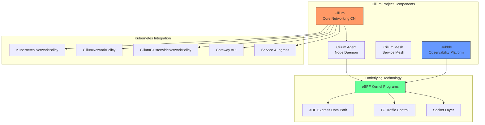

---

<!-- chunk: 2. Cilium Core Component Architecture -->## 2. Cilium Core Component Architecture

## 2.1 Overall Architecture

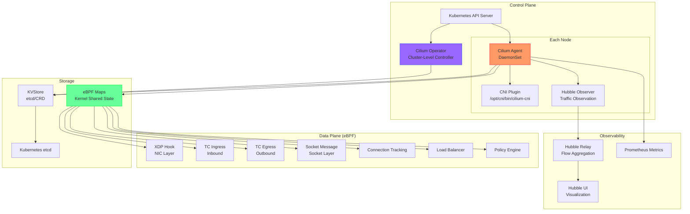

## 2.2 Cilium Agent (Per-Node DaemonSet)

The Cilium Agent is the core component of the entire system, running as a DaemonSet on every Kubernetes node.

## 2.2.1 Agent Responsibilities

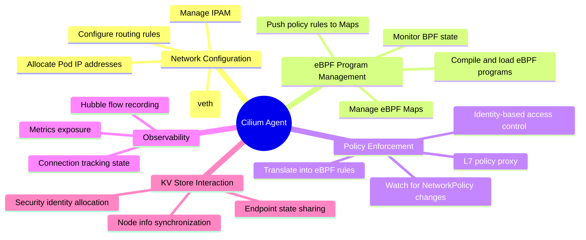

## 2.2.2 Agent DaemonSet Configuration Example

```yaml
# cilium-agent-daemonset.yaml
apiVersion: apps/v1
kind: DaemonSet
metadata:
  name: cilium
  namespace: kube-system
  labels:
    k8s-app: cilium
spec:
  selector:
    matchLabels:
      k8s-app: cilium
  updateStrategy:
    type: RollingUpdate
    rollingUpdate:
      maxUnavailable: 2
  template:
    metadata:
      labels:
        k8s-app: cilium
    spec:
      # Critical: requires hostNetwork to access the node's network
      hostNetwork: true
      hostPID: false
      priorityClassName: system-node-critical
      serviceAccountName: cilium
      
      # Init container: installs the CNI plugin binary and config
      initContainers:
      - name: install-cni-binaries
        image: quay.io/cilium/cilium:v1.16.0
        command: ["/install-plugin.sh"]
        securityContext:
          capabilities:
            add:
            - NET_ADMIN
            - SYS_ADMIN
            drop:
            - ALL
        volumeMounts:
        - name: cni-path
          mountPath: /host/opt/cni/bin
        - name: etc-cni-netd
          mountPath: /host/etc/cni/net.d
      
      - name: clean-cilium-state
        image: quay.io/cilium/cilium:v1.16.0
        command: ["/init-container.sh"]
        env:
        - name: CILIUM_WAIT_BPF_MOUNT
          valueFrom:
            configMapKeyRef:
              name: cilium-config
              key: wait-bpf-mount
              optional: true
        securityContext:
          privileged: true
      
      containers:
      - name: cilium-agent
        image: quay.io/cilium/cilium:v1.16.0
        imagePullPolicy: IfNotPresent
        
        # Key privileges required by the Cilium Agent
        securityContext:
          privileged: true
          # Or use more fine-grained capabilities (recommended)
          # capabilities:
          #   add:
          #   - NET_ADMIN
          #   - NET_RAW
          #   - SYS_MODULE
          #   - SYS_ADMIN
          #   - SYS_RESOURCE
          #   - IPC_LOCK
        
        env:
        - name: K8S_NODE_NAME
          valueFrom:
            fieldRef:
              fieldPath: spec.nodeName
        - name: CILIUM_K8S_NAMESPACE
          valueFrom:
            fieldRef:
              fieldPath: metadata.namespace
        - name: CILIUM_CNI_CHAINED
          valueFrom:
            configMapKeyRef:
              name: cilium-config
              key: cni-chaining-mode
              optional: true
        
        # Key mount points
        volumeMounts:
        - name: bpf-maps
          mountPath: /sys/fs/bpf
          mountPropagation: Bidirectional
        - name: cilium-run
          mountPath: /var/run/cilium
        - name: cni-path
          mountPath: /host/opt/cni/bin
        - name: etc-cni-netd
          mountPath: /host/etc/cni/net.d
        - name: lib-modules
          mountPath: /lib/modules
          readOnly: true
        - name: xtables-lock
          mountPath: /run/xtables.lock
        - name: clustermesh-secrets
          mountPath: /var/lib/cilium/clustermesh
          readOnly: true
        
        # Health probes
        livenessProbe:
          httpGet:
            host: "127.0.0.1"
            path: /healthz
            port: 9879
            scheme: HTTP
          periodSeconds: 30
          successThreshold: 1
          failureThreshold: 10
          timeoutSeconds: 5
        
        readinessProbe:
          httpGet:
            host: "127.0.0.1"
            path: /healthz
            port: 9879
            scheme: HTTP
          periodSeconds: 30
          successThreshold: 1
          failureThreshold: 3
          timeoutSeconds: 5
        
        resources:
          requests:
            cpu: 100m
            memory: 512Mi
          limits:
            cpu: "4"
            memory: 4Gi
      
      volumes:
      - name: bpf-maps
        hostPath:
          path: /sys/fs/bpf
          type: DirectoryOrCreate
      - name: cilium-run
        hostPath:
          path: /var/run/cilium
          type: DirectoryOrCreate
      - name: cni-path
        hostPath:
          path: /opt/cni/bin
          type: DirectoryOrCreate
      - name: etc-cni-netd
        hostPath:
          path: /etc/cni/net.d
          type: DirectoryOrCreate
      - name: lib-modules
        hostPath:
          path: /lib/modules
      - name: xtables-lock
        hostPath:
          path: /run/xtables.lock
          type: FileOrCreate
      - name: clustermesh-secrets
        secret:
          secretName: cilium-clustermesh
          optional: true
      
      tolerations:
      - operator: Exists
      
      nodeSelector:
        kubernetes.io/os: linux
```

## 2.2.3 Key Agent ConfigMap Settings

```yaml
# cilium-config.yaml
apiVersion: v1
kind: ConfigMap
metadata:
  name: cilium-config
  namespace: kube-system
data:
  # ============================================
  # Basic network configuration
  # ============================================
  
  # Tunnel mode: vxlan, geneve, disabled (native routing)
  tunnel: "vxlan"
  
  # IPAM mode: cluster-pool, kubernetes, eni, azure
  ipam: "cluster-pool"
  
  # Pod CIDR pool
  cluster-pool-ipv4-cidr: "10.0.0.0/8"
  cluster-pool-ipv4-mask-size: "24"
  
  # Enable IPv6
  enable-ipv6: "false"
  
  # ============================================
  # kube-proxy replacement
  # ============================================
  
  # Fully replace kube-proxy
  kube-proxy-replacement: "true"
  
  # NodePort range
  node-port-range: "30000,32767"
  
  # Load balancing algorithm: random, maglev
  load-balancer-algorithm: "maglev"
  
  # Enable DSR (Direct Server Return)
  enable-node-port: "true"
  
  # ============================================
  # Security policy
  # ============================================
  
  # Policy audit mode (does not block, only records)
  policy-audit-mode: "false"
  
  # Allow all traffic (disable policy enforcement)
  enable-policy: "default"
  
  # ============================================
  # Hubble observability
  # ============================================
  
  # Enable Hubble
  enable-hubble: "true"
  
  # Hubble gRPC listen address
  hubble-listen-address: ":4244"
  
  # Hubble flow buffer size
  hubble-flow-buffer-size: "4096"
  
  # Hubble metrics
  hubble-metrics-server: ":9965"
  hubble-metrics: >-
    dns:query;ignoreAAAA
    drop
    tcp
    flow
    icmp
    http
  
  # ============================================
  # Performance tuning
  # ============================================
  
  # BPF Map sizes (affects the number of supported concurrent connections)
  bpf-ct-global-tcp-max: "524288"
  bpf-ct-global-any-max: "262144"
  bpf-lb-map-max: "65536"
  bpf-policy-map-max: "16384"
  
  # XDP acceleration (requires NIC driver support)
  enable-xdp-prefilter: "false"
  
  # Enable BBR congestion control
  enable-bbr: "true"
  
  # ============================================
  # Debugging
  # ============================================
  debug: "false"
  debug-verbose: ""
  monitor-aggregation: "medium"
  monitor-aggregation-interval: "5s"
```

## 2.3 Cilium Operator (Cluster Controller)

The Cilium Operator runs as a Deployment (typically 1-2 replicas) and is responsible for **cluster-level** operations; it does not handle node-level details.

## 2.3.1 Core Operator Responsibilities

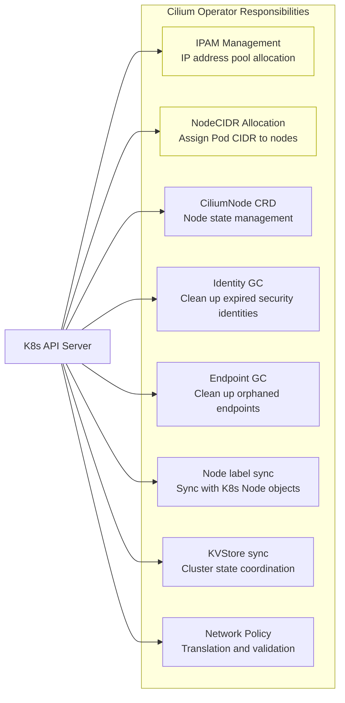

## 2.3.2 Operator Deployment

```yaml
# cilium-operator-deployment.yaml
apiVersion: apps/v1
kind: Deployment
metadata:
  name: cilium-operator
  namespace: kube-system
  labels:
    io.cilium/app: operator
spec:
  replicas: 2  # 2 replicas recommended in production for HA
  selector:
    matchLabels:
      io.cilium/app: operator
  strategy:
    type: RollingUpdate
    rollingUpdate:
      maxSurge: 1
      maxUnavailable: 1
  template:
    metadata:
      labels:
        io.cilium/app: operator
    spec:
      priorityClassName: system-cluster-critical
      serviceAccountName: cilium-operator
      
      # The Operator needs to be scheduled onto different nodes (HA)
      affinity:
        podAntiAffinity:
          requiredDuringSchedulingIgnoredDuringExecution:
          - labelSelector:
              matchLabels:
                io.cilium/app: operator
            topologyKey: kubernetes.io/hostname
      
      containers:
      - name: cilium-operator
        image: quay.io/cilium/operator-generic:v1.16.0
        
        args:
        - --config-dir=/tmp/cilium/config-map
        
        env:
        - name: K8S_NODE_NAME
          valueFrom:
            fieldRef:
              fieldPath: spec.nodeName
        - name: CILIUM_K8S_NAMESPACE
          valueFrom:
            fieldRef:
              fieldPath: metadata.namespace
        
        # Use Leader Election to ensure a single active instance
        - name: CILIUM_OPERATOR_NAMESPACE
          valueFrom:
            fieldRef:
              fieldPath: metadata.namespace
        
        livenessProbe:
          httpGet:
            host: "127.0.0.1"
            path: /healthz
            port: 9234
          initialDelaySeconds: 60
          periodSeconds: 10
          timeoutSeconds: 3
        
        volumeMounts:
        - name: cilium-config-path
          mountPath: /tmp/cilium/config-map
          readOnly: true
        
        resources:
          requests:
            cpu: 15m
            memory: 128Mi
          limits:
            cpu: "1"
            memory: 1Gi
      
      volumes:
      - name: cilium-config-path
        configMap:
          name: cilium-config
      
      tolerations:
      - key: node.kubernetes.io/not-ready
        effect: NoSchedule
      - key: node-role.kubernetes.io/control-plane
        effect: NoSchedule
```

## 2.4 CNI Plugin (Container Network Interface)

The CNI Plugin is a **binary program** (`/opt/cni/bin/cilium-cni`) invoked by the container runtime when a Pod is created or deleted; it is not a long-running process.

## 2.4.1 CNI Invocation Flow

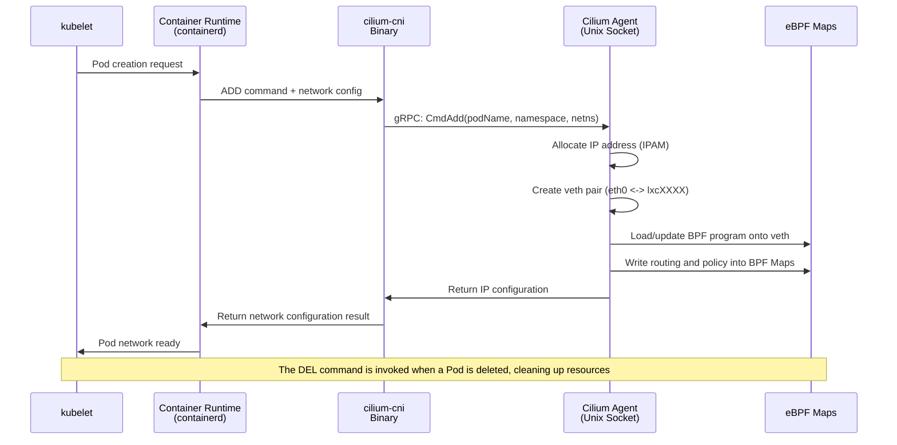

## 2.4.2 CNI Configuration File

```json
// /etc/cni/net.d/05-cilium.conflist
{
  "cniVersion": "0.3.1",
  "name": "cilium",
  "plugins": [
    {
      "type": "cilium-cni",
      "enable-debug": false,
      "log-file": "/var/run/cilium/cilium-cni.log"
    }
  ]
}
```

## 2.5 Hubble (Observability Component)

Hubble is Cilium's built-in **network observability** platform. Based on eBPF, it captures all network events at the kernel level, without needing to modify applications or inject sidecars.

## 2.5.1 Hubble Architecture

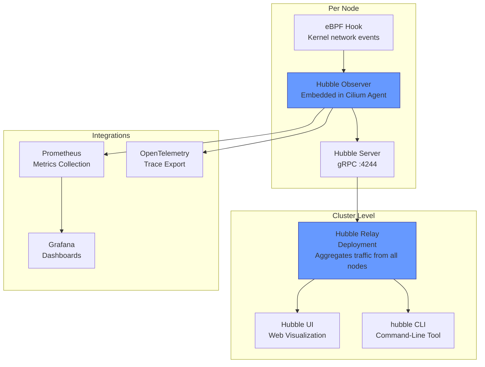

## 2.5.2 Hubble Relay and UI Deployment

```yaml
# hubble-relay-deployment.yaml
apiVersion: apps/v1
kind: Deployment
metadata:
  name: hubble-relay
  namespace: kube-system
spec:
  replicas: 1
  selector:
    matchLabels:
      k8s-app: hubble-relay
  template:
    metadata:
      labels:
        k8s-app: hubble-relay
    spec:
      containers:
      - name: hubble-relay
        image: quay.io/cilium/hubble-relay:v1.16.0
        args:
        - relay
        - --hubble-listen-address=:4244
        - --dial-timeout=5s
        - --retry-timeout=30s
        ports:
        - name: grpc
          containerPort: 4245
        - name: prometheus
          containerPort: 9966
        volumeMounts:
        - name: hubble-tls
          mountPath: /var/lib/hubble-relay/tls
          readOnly: true
        - name: config
          mountPath: /etc/hubble-relay
          readOnly: true
        resources:
          requests:
            cpu: 10m
            memory: 64Mi
          limits:
            cpu: "1"
            memory: 1Gi
      volumes:
      - name: config
        configMap:
          name: hubble-relay-config
          items:
          - key: config.yaml
            path: config.yaml
      - name: hubble-tls
        projected:
          sources:
          - secret:
              name: hubble-relay-client-certs
              items:
              - key: tls.crt
                path: client.crt
              - key: tls.key
                path: client.key
              - key: ca.crt
                path: hubble-server-ca.crt
---
# hubble-ui-deployment.yaml
apiVersion: apps/v1
kind: Deployment
metadata:
  name: hubble-ui
  namespace: kube-system
spec:
  replicas: 1
  selector:
    matchLabels:
      k8s-app: hubble-ui
  template:
    metadata:
      labels:
        k8s-app: hubble-ui
    spec:
      containers:
      - name: frontend
        image: quay.io/cilium/hubble-ui:v0.13.0
        ports:
        - name: http
          containerPort: 8081
        resources:
          requests:
            cpu: 10m
            memory: 64Mi
          limits:
            cpu: "1"
            memory: 1Gi
      - name: backend
        image: quay.io/cilium/hubble-ui-backend:v0.13.0
        env:
        - name: EVENTS_SERVER_PORT
          value: "8090"
        - name: FLOWS_API_ADDR
          value: "hubble-relay:443"
        - name: TLS_TO_RELAY_ENABLED
          value: "true"
        ports:
        - name: grpc
          containerPort: 8090
```

---

<!-- chunk: 3. eBPF Data Path Explained -->## 3. eBPF Data Path Explained

## 3.1 How eBPF is Used in Cilium

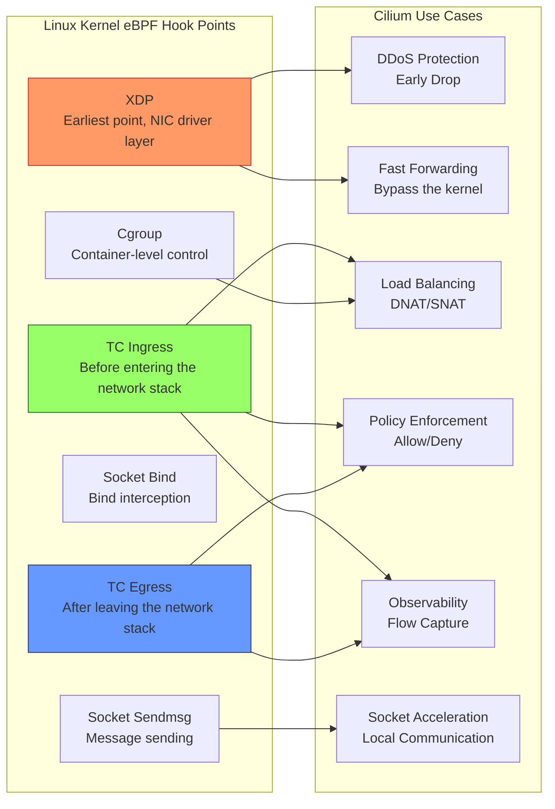

## 3.2 Pod-to-Pod Data Path

## Same Node Communication

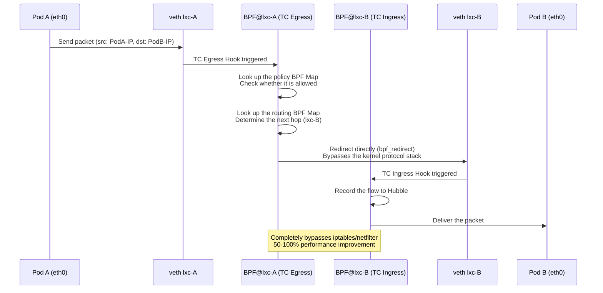

## Cross-Node Communication - VXLAN Mode

```
Packet path (VXLAN Tunnel Mode):

Pod A (Node1)
    │ eth0
    ▼
veth lxc-podA
    │ TC Egress BPF
    │ ┌─────────────────────────────┐
    │ │ 1. Policy check              │
    │ │ 2. Look up Node2's tunnel    │
    │ │    endpoint                  │
    │ │ 3. VXLAN encapsulation       │
    │ │    Outer: src=Node1-IP       │
    │ │           dst=Node2-IP       │
    │ │    VXLAN Header: VNI=1       │
    │ │    Inner: src=PodA-IP        │
    │ │           dst=PodB-IP        │
    │ └─────────────────────────────┘
    │
    ▼
cilium_vxlan interface (UDP 8472)
    │
    ▼
Node1 physical NIC (eth0)
    │
    ▼ (physical network)
    │
Node2 physical NIC (eth0)
    │
    ▼
cilium_vxlan interface
    │ TC Ingress BPF
    │ ┌─────────────────────────────┐
    │ │ 1. VXLAN decapsulation       │
    │ │ 2. Verify source node        │
    │ │    identity                  │
    │ │ 3. Look up the target Pod    │
    │ │    (lxc-podB)                │
    │ └─────────────────────────────┘
    │
    ▼
veth lxc-podB
    │
    ▼
Pod B (Node2)
```

## 3.3 eBPF Maps in Detail

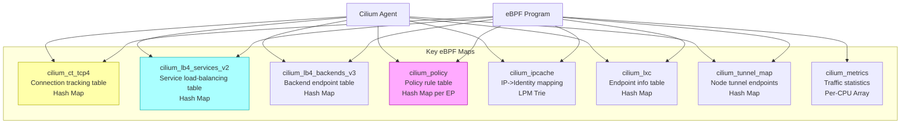

## Key Map Inspection Commands

```bash
# List all BPF Maps
cilium bpf map list

# View the connection tracking table
cilium bpf ct list global

# View the IP Cache (IP-to-security-identity mapping)
cilium bpf ipcache list

# View the Service load-balancing table
cilium bpf lb list

# View the policy Map
cilium bpf policy get --all

# View tunnel endpoints
cilium bpf tunnel list

# Monitor BPF events in real time
cilium monitor --type drop
cilium monitor --type trace
```

## 3.4 Security Identity

One of Cilium's core innovations is an **identity-based** security model, rather than the traditional IP-based model.

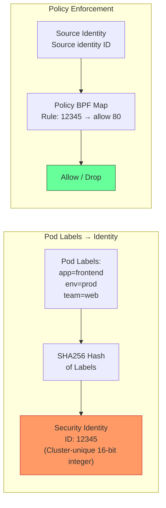

```bash
# View all security identities
cilium identity list

# Example output:
# ID      LABELS
# 1       reserved:host
# 2       reserved:world
# 3       reserved:unmanaged
# 4       reserved:health
# 12345   k8s:app=frontend;k8s:env=prod;k8s:io.kubernetes.pod.namespace=default

# View the identity of a specific endpoint
cilium endpoint list
```

---

<!-- chunk: 4. kube-proxy Replacement Mode -->## 4. kube-proxy Replacement Mode

## 4.1 Why Replace kube-proxy

```
Problems with traditional kube-proxy:
┌─────────────────────────────────────────────────┐
│  kube-proxy (iptables mode)                      │
│                                                  │
│  Number of Services: 10,000                     │
│  Number of iptables rules: ~100,000+            │
│  Rule update time: O(n) full update             │
│  CPU overhead: High (kernel frequently walks     │
│  the rule chain)                                 │
│  Connection tracking table: Easily overflows     │
│  NAT overhead: Every packet requires NAT         │
│  processing                                      │
└─────────────────────────────────────────────────┘

Cilium kube-proxy replacement:
┌─────────────────────────────────────────────────┐
│  Cilium BPF (kube-proxy replacement)            │
│                                                  │
│  Number of Services: 10,000                     │
│  BPF Map lookup: O(1) hash table                │
│  Rule update time: microsecond-level incremental │
│  updates                                         │
│  CPU overhead: Very low (kernel BPF JIT          │
│  execution)                                      │
│  Direct Server Return: supported (reduces NAT    │
│  hops)                                           │
│  Maglev consistent hashing: no connection-state   │
│  disruption                                      │
└─────────────────────────────────────────────────┘
```

## 4.2 DSR (Direct Server Return) Mode

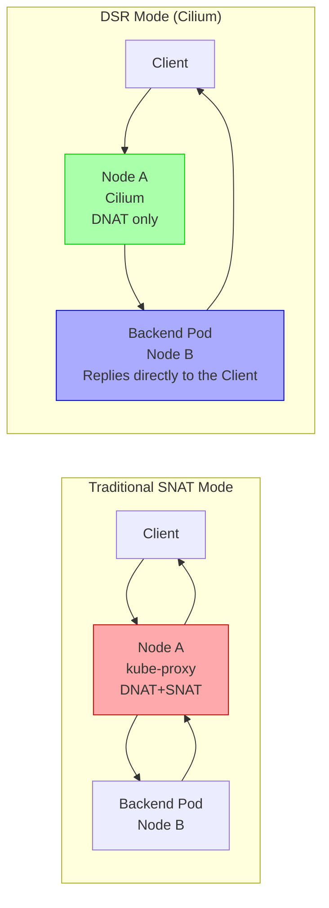

**DSR Configuration**:

```yaml
# values.yaml (Helm)
loadBalancer:
  mode: dsr
  dsrDispatch: opt  # Use an IP option to carry the original destination

# Or in the ConfigMap
data:
  kube-proxy-replacement: "true"
  node-port-mode: "dsr"
  node-port-acceleration: "native"  # Requires NIC support for XDP
```

## 4.3 Maglev Consistent Hashing

Google's Maglev algorithm ensures that when backends change, existing connections are unaffected (minimizing connection reassignment).

```yaml
# Enable Maglev load balancing
data:
  load-balancer-algorithm: "maglev"
  # Maglev table size (a prime number; larger means a more even distribution)
  bpf-lb-maglev-table-size: "16381"
```

## 4.4 Complete kube-proxy-free Configuration

```yaml
# helm/values-kubeproxyfree.yaml
kubeProxyReplacement: "true"

# Make sure the K8s API Server address is configured correctly
k8sServiceHost: "10.0.0.1"  # Your API Server IP
k8sServicePort: "6443"

# NodePort configuration
nodePort:
  enabled: true
  range: "30000,32767"
  acceleration: "native"  # native=XDP, best-effort=falls back after XDP, disabled
  mode: "dsr"  # hybrid, snat, dsr

# Enable HostPort support (replaces the hostport CNI plugin)
hostPort:
  enabled: true

# ExternalIPs support
externalIPs:
  enabled: true

# Load balancing
loadBalancer:
  algorithm: "maglev"
  mode: "dsr"
  
# sessionAffinity support
sessionAffinity: true
```

```bash
# Verify kube-proxy replacement status
cilium status --verbose | grep "KubeProxyReplacement"

# Output:
# KubeProxyReplacement: True
#   - NodePort:     Enabled (Range: 30000-32767)
#   - LoadBalancer: Enabled
#   - ExternalIPs:  Enabled
#   - HostPort:     Enabled

# View Service load-balancing details
cilium service list
```

---

<!-- chunk: 5. Cilium Deployment Methods -->## 5. Cilium Deployment Methods

## 5.1 Deploying with cilium-cli

## 5.1.1 Installing cilium-cli

```bash
# macOS
brew install cilium-cli

# Linux (AMD64)
CILIUM_CLI_VERSION=$(curl -s https://raw.githubusercontent.com/cilium/cilium-cli/main/stable.txt)
CLI_ARCH=amd64
curl -L --fail --remote-name-all \
  https://github.com/cilium/cilium-cli/releases/download/${CILIUM_CLI_VERSION}/cilium-linux-${CLI_ARCH}.tar.gz{,.sha256sum}
sha256sum --check cilium-linux-${CLI_ARCH}.tar.gz.sha256sum
sudo tar xzvfC cilium-linux-${CLI_ARCH}.tar.gz /usr/local/bin
rm cilium-linux-${CLI_ARCH}.tar.gz{,.sha256sum}
```

## 5.1.2 Quick Install

``` bash
# 🟢 Low risk: read-only/information gathering, generally no side effects
# Basic install (auto-detects the K8s environment)
cilium install --version 1.16.0

# Specify Helm values
cilium install \
  --version 1.16.0 \
  --set kubeProxyReplacement=true \
  --set hubble.relay.enabled=true \
  --set hubble.ui.enabled=true \
  --set prometheus.enabled=true \
  --set operator.prometheus.enabled=true

# Verify the installation
cilium status --wait

# Run the connectivity test
cilium connectivity test
```
## 5.2 Deploying with Helm

## 5.2.1 Add the Helm Repository

``` bash
# 🟢 Low risk: read-only/information gathering, generally no side effects
helm repo add cilium https://helm.cilium.io/
helm repo update
```
## 5.2.2 Production-Grade values.yaml

```yaml
# production-values.yaml

# ============================================
# Image configuration
# ============================================
image:
  repository: quay.io/cilium/cilium
  tag: v1.16.0
  pullPolicy: IfNotPresent

# Private registry (optional)
# image:
#   repository: your-registry.example.com/cilium/cilium
#   tag: v1.16.0

# ============================================
# Cluster configuration
# ============================================
cluster:
  name: production-cluster
  id: 1  # Requires a unique ID (1-255) when using Cluster Mesh

# ============================================
# Network configuration
# ============================================
ipam:
  mode: cluster-pool
  operator:
    clusterPoolIPv4PodCIDRList:
    - 10.0.0.0/8
    clusterPoolIPv4MaskSize: 24

# Routing mode
routingMode: tunnel  # tunnel or native
tunnelProtocol: vxlan  # vxlan or geneve

# Native routing (BGP environments)
# routingMode: native
# autoDirectNodeRoutes: true
# bgpControlPlane:
#   enabled: true

# ============================================
# kube-proxy replacement
# ============================================
kubeProxyReplacement: true
k8sServiceHost: "10.0.0.1"  # API Server VIP
k8sServicePort: "6443"

nodePort:
  enabled: true
  acceleration: best-effort

loadBalancer:
  algorithm: maglev
  mode: hybrid  # Use hybrid for environments not compatible with DSR

# ============================================
# Resource limits
# ============================================
resources:
  requests:
    cpu: 100m
    memory: 512Mi
  limits:
    cpu: "4"
    memory: 4Gi

operator:
  resources:
    requests:
      cpu: 15m
      memory: 128Mi
    limits:
      cpu: "1"
      memory: 1Gi
  
  replicas: 2  # HA

  affinity:
    podAntiAffinity:
      requiredDuringSchedulingIgnoredDuringExecution:
      - labelSelector:
          matchLabels:
            io.cilium/app: operator
        topologyKey: kubernetes.io/hostname

# ============================================
# Hubble observability
# ============================================
hubble:
  enabled: true
  
  tls:
    auto:
      enabled: true
      method: helm
  
  relay:
    enabled: true
    replicas: 2
    resources:
      requests:
        cpu: 10m
        memory: 64Mi
      limits:
        cpu: "1"
        memory: 512Mi
  
  ui:
    enabled: true
    replicas: 1
    
    ingress:
      enabled: true
      annotations:
        kubernetes.io/ingress.class: nginx
      hosts:
      - hubble.example.com
      tls:
      - secretName: hubble-ui-tls
        hosts:
        - hubble.example.com
  
  metrics:
    enabled:
    - dns:query;ignoreAAAA
    - drop
    - tcp
    - flow
    - icmp
    - http:labelsContext=source_namespace\,destination_namespace
    serviceMonitor:
      enabled: true  # Requires the Prometheus Operator

# ============================================
# Prometheus metrics
# ============================================
prometheus:
  enabled: true
  serviceMonitor:
    enabled: true

# ============================================
# Security policy
# ============================================
policyEnforcementMode: "default"

# L7 policy proxy (Envoy)
envoy:
  enabled: true

# ============================================
# TLS encryption (WireGuard)
# ============================================
encryption:
  enabled: true
  type: wireguard
  nodeEncryption: true

# ============================================
# High availability and scheduling
# ============================================
tolerations:
- operator: Exists

priorityClassName: system-node-critical

# BPF Map tuning (large clusters)
bpf:
  ctTcpMax: 524288
  ctAnyMax: 262144
  lbMapMax: 65536
  policyMapMax: 16384
  monitorAggregation: medium
  monitorInterval: "5s"
```

> ⚠️ **🟡 Medium-Risk Change** — Modifies cluster resource state; a `--dry-run` or diff check beforehand is recommended
> - `helm upgrade/install`: deploys/upgrades a release

``` bash
# 🟡 Medium risk: modifies cluster/resource state, confirm target, scope, and authorization before executing
# Install command
helm install cilium cilium/cilium \
  --version 1.16.0 \
  --namespace kube-system \
  --values production-values.yaml

# Upgrade
helm upgrade cilium cilium/cilium \
  --version 1.16.1 \
  --namespace kube-system \
  --values production-values.yaml \
  --reuse-values

# View the currently installed configuration
helm get values cilium -n kube-system
```
## 5.3 Deployment on Different K8s Distributions

## 5.3.1 EKS (AWS)

``` bash
# 🟢 Low risk: read-only/information gathering, generally no side effects
# EKS requires enabling ENI IPAM mode (optional, or use overlay)
cilium install \
  --version 1.16.0 \
  --helm-set eni.enabled=true \
  --helm-set ipam.mode=eni \
  --helm-set egressMasqueradeInterfaces=eth0 \
  --helm-set routingMode=native

# Values to use with ENI IPAM
# ipam:
#   mode: eni
# eni:
#   enabled: true
#   subnetTagsFilter:
#   - "kubernetes.io/cluster/<cluster-name>=owned"
```
## 5.3.2 GKE (Google Cloud)

> ⚠️ **🟡 Medium-Risk Change** — Modifies cluster resource state; a `--dry-run` or diff check beforehand is recommended
> - `helm upgrade/install`: deploys/upgrades a release

``` bash
# 🟡 Medium risk: modifies cluster/resource state, confirm target, scope, and authorization before executing
# GKE requires special configuration (DatapathV2 is Cilium's commercial variant)
helm install cilium cilium/cilium \
  --version 1.16.0 \
  --namespace kube-system \
  --set nodeinit.enabled=true \
  --set nodeinit.reconfigureKubelet=true \
  --set nodeinit.removeCbrBridge=true \
  --set cni.binPath=/home/kubernetes/bin \
  --set gke.enabled=true \
  --set ipam.mode=kubernetes \
  --set ipv4.enabled=true \
  --set nodePort.directRoutingDevice=eth0
```
## 5.3.3 Kind (Local Development)

``` bash
# 🟢 Low risk: read-only/information gathering, generally no side effects
# Create a Kind cluster (disable the default CNI)
cat <<EOF > kind-config.yaml
kind: Cluster
apiVersion: kind.x-k8s.io/v1alpha4
nodes:
- role: control-plane
- role: worker
- role: worker
networking:
  disableDefaultCNI: true
  podSubnet: "10.244.0.0/16"
EOF

kind create cluster --config kind-config.yaml

# Install Cilium
cilium install \
  --version 1.16.0 \
  --helm-set routingMode=tunnel \
  --helm-set tunnelProtocol=vxlan \
  --helm-set kubeProxyReplacement=false  # keep kube-proxy in kind

cilium status --wait
cilium connectivity test
```
---

<!-- chunk: 6. Migrating from a Traditional CNI to Cilium -->## 6. Migrating from a Traditional CNI to Cilium

## 6.1 Pre-Migration Assessment

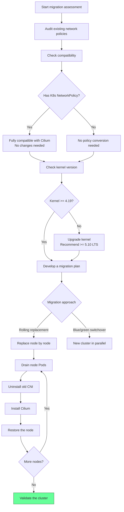

## 6.2 Migrating from Flannel

> ⚠️ **🔴 Disaster-Class Operation** — Contains irreversible commands; requires a change window + two-person review + prior backup + rollback plan before executing
> - `kubectl delete namespace`: permanently deletes a namespace and all its resources; unrecoverable
> - `rm -rf (system/data path)`: deletes system or data files; may destroy the node or cause total data loss
> - `kubectl cordon`: marks a node unschedulable
> - `kubectl drain`: evicts all Pods on a node, impacting live traffic

> **🔴 High-Risk Operation Warning**
>
> The commands below are irreversible or high-impact. Before executing, confirm:
> - Critical data and configuration have been backed up
> - You are within an approved change window
> - Authorization has been obtained from the relevant owners
> - A rollback or recovery plan is ready
> - The target cluster, Namespace, and node/resource names are correct

``` bash
# 🔴 High risk: may cause data loss or service interruption; requires backup, change approval, and a rollback plan before executing
# Step 1: Back up the current Flannel configuration
kubectl get configmap kube-flannel-cfg -n kube-flannel -o yaml > flannel-backup.yaml
kubectl get pods -n kube-flannel -o yaml > flannel-pods-backup.yaml

# Step 2: Prevent new Pods from being scheduled onto a node
kubectl cordon node-1

# Step 3: Drain the node's Pods
kubectl drain node-1 \
  --ignore-daemonsets \
  --delete-emptydir-data \
  --force \
  --timeout=300s

# Step 4: SSH into the node and clean up Flannel
# Run on the node:
# sudo rm -f /etc/cni/net.d/10-flannel.conflist
# sudo ip link delete flannel.1 2>/dev/null || true
# sudo rm -rf /run/flannel/  # ⚠️ deletes system/data files

# Step 5: Install Cilium (if this is the first node)
helm install cilium cilium/cilium \
  --namespace kube-system \
  --version 1.16.0 \
  --values production-values.yaml

# Step 6: Restore scheduling on the node
kubectl uncordon node-1

# Repeat Steps 2-6 until all nodes are migrated

# Step 7: Delete the Flannel DaemonSet
kubectl delete daemonset kube-flannel-ds -n kube-flannel
kubectl delete namespace kube-flannel  # ⚠️ irreversible: permanently deletes the namespace and all its resources
```
## 6.3 CNI Chaining Mode

For scenarios where a full replacement is not supported, Cilium can act as a chained CNI plugin:

```yaml
# Chaining mode example (inserting Cilium after Flannel)
# /etc/cni/net.d/05-cilium.conflist
{
  "name": "generic-veth",
  "cniVersion": "0.3.1",
  "plugins": [
    {
      "type": "flannel",
      "delegate": {
        "hairpinMode": true,
        "isDefaultGateway": true
      }
    },
    {
      "type": "portmap",
      "capabilities": {
        "portMappings": true
      }
    },
    {
      "type": "cilium-cni",
      "chaining-mode": "flannel",
      "log-file": "/var/run/cilium/cilium-cni.log"
    }
  ]
}
```

```yaml
# Helm values for chaining mode
cni:
  chainingMode: "flannel"
  # Note: some features are limited in chaining mode
  # - kube-proxy replacement is not supported
  # - Cluster Mesh is not supported
  # But you can still use:
  # - NetworkPolicy (L3/L4/L7)
  # - Hubble observability
```

---

<!-- chunk: 7. Multi-Cluster Cluster Mesh Configuration -->## 7. Multi-Cluster Cluster Mesh Configuration

## 7.1 Cluster Mesh Architecture

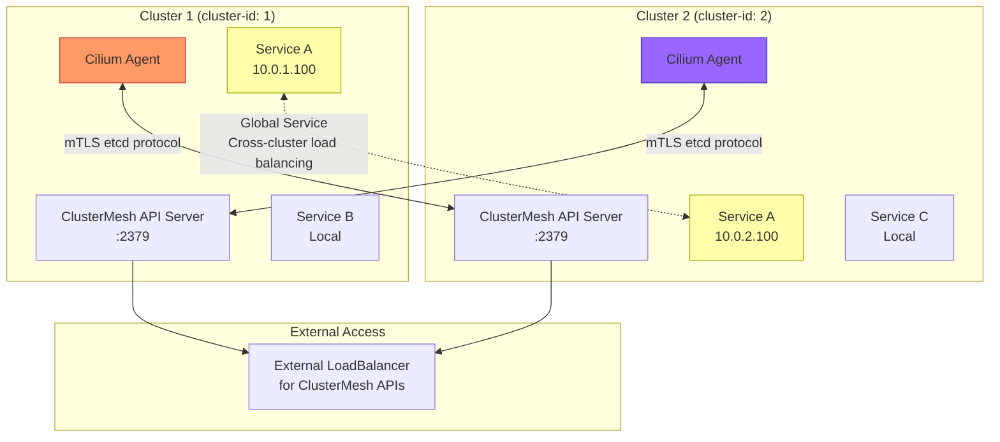

## 7.2 Cluster Mesh Deployment Steps

> ⚠️ **🟡 Medium-Risk Change** — Modifies cluster resource state; a `--dry-run` or diff check beforehand is recommended
> - `helm upgrade/install`: deploys/upgrades a release

``` bash
# 🟡 Medium risk: modifies cluster/resource state, confirm target, scope, and authorization before executing
# ============================================
# Prerequisites:
# - Each cluster has a unique cluster ID (1-255)
# - Each cluster has a unique name
# - Pod CIDRs do not overlap
# - Node CIDRs do not overlap
# ============================================

# Cluster 1 configuration
helm upgrade cilium cilium/cilium \
  --namespace kube-system \
  --reuse-values \
  --set cluster.name=cluster-1 \
  --set cluster.id=1

# Cluster 2 configuration
helm upgrade cilium cilium/cilium \
  --namespace kube-system \
  --reuse-values \
  --set cluster.name=cluster-2 \
  --set cluster.id=2

# Enable the Cluster Mesh API Server
# On Cluster 1
cilium clustermesh enable \
  --service-type LoadBalancer  # or NodePort

# On Cluster 2
cilium clustermesh enable \
  --service-type LoadBalancer

# Wait for Cluster Mesh to be ready
cilium clustermesh status --wait

# Connect the two clusters
# Run from Cluster 1 (requires Cluster 2's kubeconfig)
cilium clustermesh connect \
  --context cluster-1 \
  --destination-context cluster-2

# Verify the connection
cilium clustermesh status
```
## 7.3 Global Service Configuration

```yaml
# Create Services with the same name in both clusters, and add the Global annotation
apiVersion: v1
kind: Service
metadata:
  name: my-service
  namespace: default
  annotations:
    # Mark as a global Service (cross-cluster load balancing)
    service.cilium.io/global: "true"
    # Optional: only route to other clusters if this cluster fails
    service.cilium.io/shared: "true"
    # Optional: this cluster does not serve external traffic (only accepts inbound traffic)
    # service.cilium.io/global: "true"
    # service.cilium.io/shared: "false"
spec:
  selector:
    app: my-app
  ports:
  - port: 80
    targetPort: 8080
  type: ClusterIP
```

## 7.4 Cluster Mesh Network Policy

```yaml
# Allow access from a specific Pod in cluster-2
apiVersion: "cilium.io/v2"
kind: CiliumNetworkPolicy
metadata:
  name: allow-from-cluster2
  namespace: production
spec:
  endpointSelector:
    matchLabels:
      app: backend
  ingress:
  - fromEndpoints:
    - matchLabels:
        app: frontend
        io.cilium.k8s.policy.cluster: cluster-2  # Specify the source cluster
```

---

<!-- chunk: 8. Cilium and Kubernetes Networking Model -->## 8. Cilium and the Kubernetes Networking Model

## 8.1 IPAM Mode Comparison

| IPAM Mode | Use Case | Characteristics |
|-----------|---------|------|
| `cluster-pool` | General purpose (default) | Cilium manages the IP pool; nodes get a /24 |
| `kubernetes` | Uses the K8s-native CIDR | Follows K8s --pod-cidr configuration |
| `eni` | AWS EKS | Uses real AWS ENI IPs, no overlay |
| `azure` | Azure AKS | Integrates with Azure CNI |
| `gke` | GKE | Integrates with GKE networking |
| `alibabacloud-eni` | Alibaba Cloud ACK | Uses Alibaba Cloud ENI |
| `multi-pool` | Multiple IP pools | Supports assigning different CIDRs per namespace |

## 8.1.1 Multi-Pool IPAM Configuration

```yaml
# Use different IP pools for different namespaces/Pods
apiVersion: "cilium.io/v2alpha1"
kind: CiliumPodIPPool
metadata:
  name: pool-blue
spec:
  ipv4:
    cidrs:
    - "10.10.0.0/16"
    maskSize: 24
---
apiVersion: "cilium.io/v2alpha1"
kind: CiliumPodIPPool
metadata:
  name: pool-red
spec:
  ipv4:
    cidrs:
    - "10.20.0.0/16"
    maskSize: 24
---
# Assign an IP pool to a namespace
apiVersion: v1
kind: Namespace
metadata:
  name: team-blue
  annotations:
    ipam.cilium.io/ip-pool: pool-blue
---
apiVersion: v1
kind: Namespace
metadata:
  name: team-red
  annotations:
    ipam.cilium.io/ip-pool: pool-red
```

## 8.2 BGP Integration

```yaml
# Enable the BGP control plane (replaces overlay tunneling)
# values.yaml
bgpControlPlane:
  enabled: true

routingMode: native
autoDirectNodeRoutes: true
ipv4NativeRoutingCIDR: "10.0.0.0/8"
```

```yaml
# CiliumBGPPeeringPolicy
apiVersion: "cilium.io/v2alpha1"
kind: CiliumBGPPeeringPolicy
metadata:
  name: bgp-peering-policy
spec:
  nodeSelector:
    matchLabels:
      kubernetes.io/os: linux
  virtualRouters:
  - localASN: 65001
    exportPodCIDR: true
    neighbors:
    - peerAddress: "192.168.0.1/32"
      peerASN: 65000
      connectRetryTimeSeconds: 120
      holdTimeSeconds: 90
      keepAliveTimeSeconds: 30
      gracefulRestart:
        enabled: true
        restartTimeSeconds: 120
    serviceSelector:
      matchLabels:
        expose-via-bgp: "true"
```

## 8.3 WireGuard Transparent Encryption

```yaml
# Automatically encrypt inter-node traffic
# values.yaml
encryption:
  enabled: true
  type: wireguard
  nodeEncryption: true
  wireguard:
    userspaceFallback: false  # Use kernel WireGuard

# Verify encryption status
# cilium encrypt status
# Output:
# Encryption: Wireguard
# Decryption interface(s): cilium_wg0
# Wireguard peers:
#   • node-2: 192.168.1.2 (last handshake: 5s ago)
#   • node-3: 192.168.1.3 (last handshake: 8s ago)
```

---

<!-- chunk: 9. Troubleshooting and Diagnostics -->## 9. Troubleshooting and Diagnostics

## 9.1 Diagnostic Toolkit

> ⚠️ **🟡 Medium-Risk Change** — Modifies cluster resource state; a `--dry-run` or diff check beforehand is recommended
> - `kubectl exec`: enters a container to run a command, may alter container state

``` bash
# 🟡 Medium risk: modifies cluster/resource state, confirm target, scope, and authorization before executing
# ============================================
# Basic status checks
# ============================================

# 1. Overall Cilium status
cilium status
cilium status --verbose

# 2. View all endpoint states
cilium endpoint list

# 3. Inspect a specific endpoint
cilium endpoint get <endpoint-id>

# 4. View Cilium logs
kubectl logs -n kube-system -l k8s-app=cilium --tail=100

# 5. Exec into the Cilium Agent Pod to run a command
CILIUM_POD=$(kubectl get pods -n kube-system -l k8s-app=cilium -o jsonpath='{.items[0].metadata.name}')
kubectl exec -it -n kube-system $CILIUM_POD -- cilium status
```
## 9.2 Network Connectivity Troubleshooting

```bash
# ============================================
# Connectivity testing
# ============================================

# Run the full connectivity test suite
cilium connectivity test

# Test networking from a specific Pod
cilium connectivity test \
  --test-namespace cilium-test \
  --flow-validation disabled

# Check the policy between two Pods
cilium policy trace \
  --src-k8s-pod default/frontend-xxx \
  --dst-k8s-pod default/backend-xxx \
  --dport 8080

# Example output:
# Resolving ingress policy for identity [reserved:world]
# * Rule {"matchLabels":{"app":"backend"}}: selected
#   Allows from labels {"app":"frontend"}: port 8080/TCP ✓

# Monitor network events in real time
cilium monitor
cilium monitor --type l7  # L7 events only
cilium monitor --type drop  # drop events only
cilium monitor --from-pod default/frontend-xxx  # a specific Pod

# Hubble flow queries
hubble observe
hubble observe --namespace default
hubble observe --pod default/frontend-xxx
hubble observe --verdict DROPPED  # only show dropped traffic
hubble observe --http-method GET --http-path "/api/*"  # HTTP filtering
```

## 9.3 Common Issues

```mermaid
flowchart TD
    ISSUE[Network issue] --> TYPE{Issue type}
    
    TYPE -->|Pod fails to start| POD_START[Check the CNI]
    POD_START --> CNI_LOG[View cilium-cni logs<br/>journalctl -u kubelet | grep CNI]
    CNI_LOG --> IP_EXHAUST{IP addresses exhausted?}
    IP_EXHAUST -->|Yes| EXPAND_POOL[Expand the IP pool<br/>or increase the node mask]
    IP_EXHAUST -->|No| AGENT_STATUS[Check Agent status]
    
    TYPE -->|Pods can't communicate| POD_COMM[Check policy]
    POD_COMM --> POLICY_TRACE[cilium policy trace]
    POLICY_TRACE --> POLICY_DROP{Policy dropping packets?}
    POLICY_DROP -->|Yes| FIX_POLICY[Fix the NetworkPolicy]
    POLICY_DROP -->|No| CHECK_ENDPOINT[cilium endpoint list]
    CHECK_ENDPOINT --> EP_STATUS{Endpoint status?}
    EP_STATUS -->|not-ready| RESTART_EP[Restart the affected Pod]
    EP_STATUS -->|ok| ROUTE_ISSUE[Check the routing table]
    
    TYPE -->|Service unreachable| SVC_ISSUE[Check the Service]
    SVC_ISSUE --> LB_LIST[cilium service list]
    LB_LIST --> BACKEND{Backend exists?}
    BACKEND -->|No| EP_ISSUE[Check the Endpoint and Pod]
    BACKEND -->|Yes| KPR{kube-proxy-free?}
    KPR -->|Yes| BPF_LB[cilium bpf lb list]
    KPR -->|No| KUBE_PROXY[Check kube-proxy]
    
    style EXPAND_POOL fill:#ffd,stroke:#aa0
    style FIX_POLICY fill:#ffd,stroke:#aa0
```

## 9.4 Performance Diagnostics

```bash
# ============================================
# BPF performance metrics
# ============================================

# View eBPF program statistics
cilium bpf perf list

# View connection tracking table usage
cilium bpf ct list global | wc -l
# Compare against the bpf-ct-global-tcp-max setting

# View BPF Map usage
cilium bpf map list

# Check whether any Map is close to its limit (can cause packet drops)
# If used/max > 80%, the Map size needs to be increased

# ============================================
# Node-level network performance
# ============================================

# Check whether XDP is enabled (better performance once enabled)
ip link show | grep xdp

# Check NIC queue settings
ethtool -l eth0

# ============================================
# Hubble traffic analysis
# ============================================

# View the top-traffic Pods
hubble observe --output json | \
  jq -r '.flow | select(.verdict=="FORWARDED") | .source.pod_name' | \
  sort | uniq -c | sort -rn | head -20

# View dropped connections (helps troubleshoot policy issues)
hubble observe --verdict DROPPED --output json | \
  jq -r '[.flow.source.pod_name, .flow.destination.pod_name, 
          .flow.destination.port, .flow.drop_reason] | @tsv'
```

## 9.5 Collecting Diagnostic Info with sysdump

```bash
# Collect a complete Cilium diagnostic bundle (for filing an issue)
cilium sysdump

# Specify the output directory
cilium sysdump --output-filename cilium-sysdump-$(date +%Y%m%d)

# The bundle includes:
# - Cilium Agent logs
# - Cilium Operator logs
# - eBPF Map contents
# - Network policy state
# - Endpoint state
# - Node information
# - K8s events
```

---

<!-- chunk: 10. What's New in 2026 -->## 10. What's New in 2026

## 10.1 Gateway API GA

Cilium 1.15+ provides a complete implementation of the Kubernetes Gateway API, replacing Ingress.

```yaml
# Install the Gateway API CRDs
kubectl apply -f https://github.com/kubernetes-sigs/gateway-api/releases/download/v1.1.0/standard-install.yaml

# Create a GatewayClass
apiVersion: gateway.networking.k8s.io/v1
kind: GatewayClass
metadata:
  name: cilium
spec:
  controllerName: io.cilium/gateway-controller
---
# Create a Gateway
apiVersion: gateway.networking.k8s.io/v1
kind: Gateway
metadata:
  name: prod-gateway
  namespace: production
spec:
  gatewayClassName: cilium
  listeners:
  - name: http
    protocol: HTTP
    port: 80
  - name: https
    protocol: HTTPS
    port: 443
    tls:
      certificateRefs:
      - name: prod-tls-secret
---
# HTTPRoute - advanced traffic routing
apiVersion: gateway.networking.k8s.io/v1
kind: HTTPRoute
metadata:
  name: api-route
  namespace: production
spec:
  parentRefs:
  - name: prod-gateway
    namespace: production
  hostnames:
  - "api.example.com"
  rules:
  # Path-based routing
  - matches:
    - path:
        type: PathPrefix
        value: /api/v2
    filters:
    - type: URLRewrite
      urlRewrite:
        path:
          type: ReplacePrefixMatch
          replacePrefixMatch: /api
    backendRefs:
    - name: api-v2-service
      port: 8080
      weight: 90
    - name: api-v2-canary
      port: 8080
      weight: 10  # 10% canary rollout
  
  # Header-based routing
  - matches:
    - headers:
      - name: X-Canary
        value: "true"
    backendRefs:
    - name: api-canary-service
      port: 8080
```

## 10.2 Sidecar-Free Service Mesh

Cilium uses eBPF to deliver service-mesh capabilities without requiring sidecar injection:

```yaml
# Enable Cilium Service Mesh (Sidecar-Free)
# values.yaml
ingressController:
  enabled: true

# Enable the Envoy proxy (for L7 policy, but not in sidecar mode)
envoy:
  enabled: true

# mTLS implemented via WireGuard at the eBPF layer
encryption:
  enabled: true
  type: wireguard

# L7 observability (no sidecar required)
hubble:
  enabled: true
  metrics:
    enabled:
    - http:labelsContext=source_namespace\,destination_namespace\,source_pod\,destination_pod
    - dns
    - tcp
```

## 10.3 New Features in Cilium 1.16/1.17

```
Cilium 1.16 (2024 Q4 - 2025 Q1):
├── Full Gateway API v1.1 support (GRPCRoute, TCPRoute)
├── BFD (BPF-based BFD) integration
├── Enhanced Multi-Pool IPAM
├── Hot-reload of Envoy configuration
└── Improved WireGuard performance

Cilium 1.17 (2025 Q3 - Q4):
├── Full AdminNetworkPolicy (ANP) support
├── Improved AI/ML workload network optimization
│   └── RDMA over eBPF (experimental)
├── Enhanced cross-cluster Cluster Mesh IPAM
├── Fine-grained L7 policy auditing
└── Built-in network policy visualization tool

Cilium 1.17 (2026 roadmap):
├── eBPF-native QUIC/HTTP3 support
├── More complete sidecar-free mTLS
├── AI-driven anomaly detection integration
└── Improved IPv6-only cluster support
```

## 10.4 CiliumEndpointSlice (Performance Optimization)

```yaml
# Enable CiliumEndpointSlice (performance optimization for large-scale clusters)
# values.yaml
operator:
  endpointSlice:
    enabled: true
    
# CiliumEndpointSlice shards endpoint information,
# reducing synchronization pressure between the Operator and Agents
# Effects are significant in clusters with 1,000+ nodes
```

## 10.5 Network Policy Editor

``` bash
# 🟡 Medium risk: modifies cluster/resource state, confirm target, scope, and authorization before executing
# In 2026, Cilium introduced a built-in policy editor and visualization tool
# Integrated through the Hubble UI

# Access the Hubble UI (includes policy visualization)
kubectl port-forward -n kube-system svc/hubble-ui 8080:80
# Open http://localhost:8080

# Use the Cilium policy generation tool (CLI)
cilium policy generate \
  --namespace production \
  --from deployment/frontend \
  --to service/backend \
  --port 8080/TCP \
  --output yaml

# Policy impact analysis
cilium policy impact \
  --policy-file new-policy.yaml \
  --namespace production
```
---

<!-- chunk: Appendix A: Cilium Version Compatibility Matrix -->## Appendix A: Cilium Version Compatibility Matrix

| Cilium Version | K8s Version | Minimum Kernel | Recommended Kernel | Status |
|------------|---------|---------|---------|------|
| 1.17.x | 1.28 - 1.32 | 4.19.57 | 5.15+ LTS | Latest |
| 1.16.x | 1.27 - 1.31 | 4.19.57 | 5.15+ LTS | Stable |
| 1.15.x | 1.26 - 1.30 | 4.19.57 | 5.10+ LTS | Maintenance |
| 1.14.x | 1.25 - 1.29 | 4.19.57 | 5.10+ LTS | EOL |

<!-- chunk: Appendix B: Key Kernel Feature Requirements -->## Appendix B: Key Kernel Feature Requirements

| Feature | Minimum Kernel Version | Notes |
|------|------------|------|
| Basic eBPF | 4.8 | Core BPF functionality |
| BPF LRU Map | 4.10 | Connection tracking performance |
| kube-proxy replacement | 4.19 | Maglev, NodePort |
| WireGuard encryption | 5.6 | Kernel WireGuard module |
| BPF CO-RE | 5.2 | Cross-kernel-version compatibility |
| BTF (BPF Type Format) | 5.2 | Debugging and portability |
| XDP native mode | Depends on NIC | High-performance forwarding |
| Socket Level LB | 4.17 | Local service acceleration |

<!-- chunk: Appendix C: Common Cilium Command Reference -->## Appendix C: Common Cilium Command Reference

```bash
# Status and health
cilium status                          # Overall status
cilium health                          # Node connectivity health
cilium version                         # Version information

# Endpoint management
cilium endpoint list                   # List all endpoints
cilium endpoint get <id>               # Endpoint details
cilium endpoint healthz                # Endpoint health

# Policy
cilium policy get                      # View all policies
cilium policy trace ...                # Policy tracing
cilium policy import policy.json       # Import a policy

# BPF Maps
cilium bpf map list                    # List all BPF Maps
cilium bpf lb list                     # Service load-balancing table
cilium bpf ct list global              # Connection tracking table
cilium bpf ipcache list                # IP Cache
cilium bpf tunnel list                 # Tunnel endpoints

# Monitoring
cilium monitor                         # Real-time event monitoring
cilium monitor --type drop             # Drop events only
cilium monitor --type l7               # L7 events only

# Hubble
hubble observe                         # Real-time flow observation
hubble observe --verdict DROPPED       # Dropped flows
hubble status                          # Hubble status

# Diagnostics
cilium sysdump                         # Collect diagnostic info
cilium connectivity test               # Connectivity test
cilium debuginfo                       # Debug information
```

---

*Document maintained by: Dillan Teagle | Reference: Cilium official documentation docs.cilium.io | Last updated: 2026-03*

---

<!-- chunk: Obsidian Related Documents -->## Obsidian Related Documents

- domain-35-ebpf-technology MOC
- [[domain-03-networking-traffic/README.md|Domain 03: eBPF Technology Stack]]
- Domain-35 eBPF Technology — Open Source Project Index
- eBPF Architecture Fundamentals and Program Types
- eBPF Map Types and Data Structures
- Cilium Network Policy L3/L4/L7
- Cilium Service Mesh Sidecar-Free Architecture
- Tetragon Runtime Security
- Hubble Network Observability
- bcc and bpftrace Tools
- eBPF Performance Optimization Practice
- eBPF Security Applications and Use Cases

## See Also

- 01-ebpf-architecture-fundamentals
- 02-ebpf-map-types-data-structures
- 04-cilium-network-policy
- 05-cilium-service-mesh

Domain 03: eBPF Technology Stack — [domain-03-networking-traffic/README.md](../README.md)

<!-- risk-assessed -->
