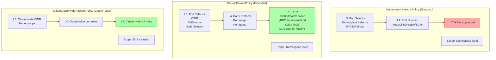
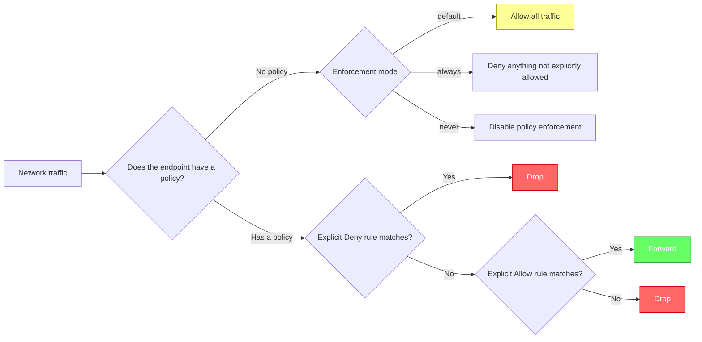
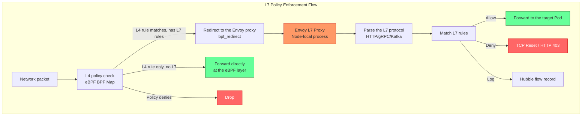
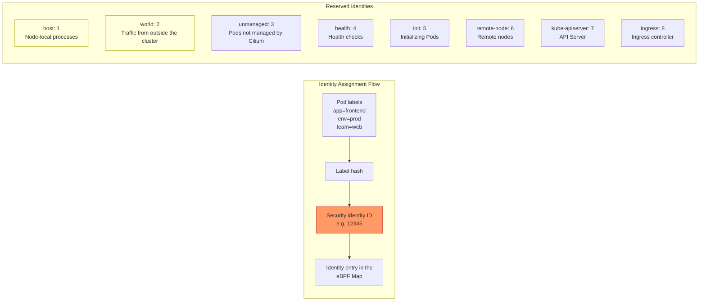
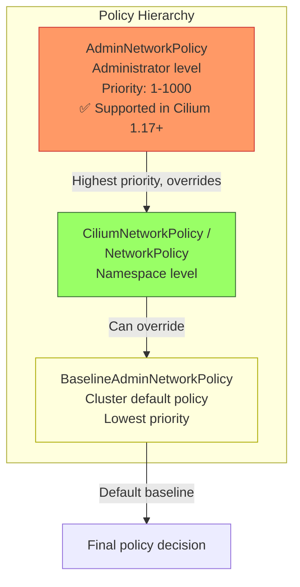
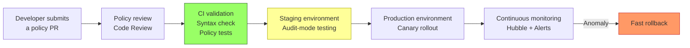
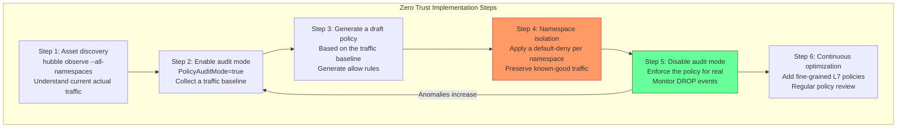

> **Production Safety Notice**
>
> This document contains operational commands that can be executed directly. Before running them, confirm: the target cluster and Namespace are correct; you have sufficient RBAC permissions; and the commands have been validated in a non-production environment. Command risk levels: 🔴 High risk (may cause data loss or service interruption), 🟡 Medium risk (modifies cluster state, usually rollbackable), 🟢 Low risk / read-only (information gathering, no side effects).

# [[Cilium|Cilium]] Network Policy L3/L4/L7

> **Document Version**: v1.0 | **Applies to**: Cilium 1.15/1.16/1.17 | **Last Updated**: 2026-03  
> **Policy Layers**: L3 (IP/CIDR) → L4 (Port/Protocol) → L7 (HTTP/gRPC/Kafka/DNS)

---

<!-- chunk: Table of Contents -->## Table of Contents

1. [Kubernetes NetworkPolicy vs CiliumNetworkPolicy](#1-kubernetes-networkpolicy-vs-ciliumnetworkpolicy)
2. [L3 Policy - IP/CIDR Rules](#2-l3-policy---ipcidr-rules)
3. [L4 Policy - Port/Protocol Rules](#3-l4-policy---portprotocol-rules)
4. [L7 Policy In-Depth](#4-l7-policy-in-depth)
5. [CiliumClusterwideNetworkPolicy](#5-ciliumclusterwidenetworkpolicy)
6. [Identity-Based Policies](#6-identity-based-policies)
7. [Policy Visualization and Auditing](#7-policy-visualization-and-auditing)
8. [AdminNetworkPolicy Integration](#8-adminnetworkpolicy-integration)
9. [Policy Priority and Conflict Resolution](#9-policy-priority-and-conflict-resolution)
10. [Enterprise Policy Management Best Practices](#10-enterprise-policy-management-best-practices)

---

<!-- chunk: 1. Kubernetes NetworkPolicy vs CiliumNetworkPolicy -->## 1. Kubernetes NetworkPolicy vs CiliumNetworkPolicy

## 1.1 Policy Capability Comparison



## 1.2 Core Differences

| Feature | Kubernetes NetworkPolicy | CiliumNetworkPolicy |
|------|--------------------------|---------------------|
| L7 policy support | ❌ Not supported | ✅ HTTP/gRPC/Kafka/DNS |
| Policy scope | Within a Namespace | Namespace or cluster-wide |
| DNS-based rules | ❌ | ✅ FQDN matching |
| Port ranges | ❌ (single port only) | ✅ Ranges supported |
| Deny rules | ❌ (allow-list only) | ✅ Explicit deny |
| Node access control | ❌ | ✅ Node Selector |
| Policy trace/debugging | ❌ | ✅ cilium policy trace |
| Cross-cluster policy | ❌ | ✅ Cluster Mesh |

## 1.3 CiliumNetworkPolicy CRD Structure

```yaml
apiVersion: "cilium.io/v2"
kind: CiliumNetworkPolicy
metadata:
  name: example-policy
  namespace: default
spec:
  # Selects the target endpoints this policy applies to (Pod selector)
  endpointSelector:
    matchLabels:
      app: backend
    matchExpressions:
    - key: version
      operator: In
      values: ["v1", "v2"]
  
  # Ingress rules: who can access this Pod
  ingress:
  - fromEndpoints:    # Which Pods
    - matchLabels:
        app: frontend
    fromCIDR:         # Which CIDRs
    - "10.0.0.0/8"
    fromCIDRSet:      # From a CIDR (with subnet exclusions)
    - cidr: "172.16.0.0/12"
      except:
      - "172.16.0.0/16"
    fromEntities:     # From special entities
    - world            # From outside the cluster
    - host             # From the node
    fromRequires:     # AND condition (all "from" conditions must match)
    - matchLabels:
        env: production
    toPorts:          # Allowed ports
    - ports:
      - port: "8080"
        protocol: TCP
      rules:          # L7 rules (optional)
        http:
        - method: GET
          path: "/api/.*"
  
  # Egress rules: where this Pod can access
  egress:
  - toEndpoints:
    - matchLabels:
        app: database
    toPorts:
    - ports:
      - port: "5432"
        protocol: TCP
  
  # Ingress deny rules (take priority over ingress)
  ingressDeny:
  - fromEndpoints:
    - matchLabels:
        malicious: "true"
  
  # Egress deny rules
  egressDeny:
  - toEndpoints:
    - matchLabels:
        app: restricted
```

## 1.4 Policy Enforcement Model



```bash
# View the current policy enforcement mode
cilium config | grep PolicyEnforcement

# Change the enforcement mode
cilium config PolicyEnforcement=always   # Force enforcement of all policies
cilium config PolicyEnforcement=default  # Enforce only when a policy exists
cilium config PolicyEnforcement=never    # Disable
```

---

<!-- chunk: 2. L3 Policy - IP/CIDR Rules -->## 2. L3 Policy - IP/CIDR Rules

## 2.1 Pod Selector Rules

```yaml
# Scenario: only allow frontend Pods to access backend Pods

apiVersion: "cilium.io/v2"
kind: CiliumNetworkPolicy
metadata:
  name: backend-access-policy
  namespace: production
spec:
  endpointSelector:
    matchLabels:
      app: backend
      tier: api
  
  ingress:
  # Rule 1: allow frontend Pods in the same namespace to access
  - fromEndpoints:
    - matchLabels:
        app: frontend
  
  # Rule 2: allow Prometheus in the monitoring namespace to access (scrape metrics)
  - fromEndpoints:
    - matchLabels:
        app: prometheus
      # Note: fromEndpoints matchLabels include the namespace label by default in Cilium
      # If crossing namespaces, add a namespace selector
    
  # Rule 3: select by label from a specific set of namespaces
  - fromEndpoints:
    - matchExpressions:
      - key: "io.kubernetes.pod.namespace"
        operator: In
        values:
        - monitoring
        - observability
      matchLabels:
        app: prometheus
```

## 2.2 Namespace-Based L3 Rules

```yaml
# Scenario: allow all Pods from a specific namespace to access

apiVersion: "cilium.io/v2"
kind: CiliumNetworkPolicy
metadata:
  name: cross-namespace-policy
  namespace: backend
spec:
  endpointSelector:
    matchLabels:
      app: api-server
  
  ingress:
  # Allow all Pods from the frontend namespace
  - fromEndpoints:
    - matchLabels:
        io.kubernetes.pod.namespace: frontend
  
  # Allow Pods from any namespace with a specific label (via namespace labels)
  - fromEndpoints:
    - matchLabels:
        io.kubernetes.pod.namespace.labels.team: platform
  
  # Allow health checks from kube-system
  - fromEndpoints:
    - matchLabels:
        io.kubernetes.pod.namespace: kube-system
        k8s-app: kube-proxy
```

## 2.3 CIDR-Based L3 Rules

```yaml
# Scenario 1: only allow specific IP ranges access (external access control)

apiVersion: "cilium.io/v2"
kind: CiliumNetworkPolicy
metadata:
  name: cidr-ingress-policy
  namespace: default
spec:
  endpointSelector:
    matchLabels:
      app: internal-api
  
  ingress:
  # Allow the corporate internal network
  - fromCIDR:
    - "10.0.0.0/8"      # Internal network
    - "172.16.0.0/12"   # VPN
    - "192.168.0.0/16"  # Local
  
  # Allow specific external IPs (e.g. CI/CD systems)
  - fromCIDR:
    - "203.0.113.10/32"   # Jenkins
    - "203.0.113.20/32"   # GitHub Actions runner
---
# Scenario 2: outbound access restriction (prevent SSRF, data exfiltration)

apiVersion: "cilium.io/v2"
kind: CiliumNetworkPolicy
metadata:
  name: cidr-egress-policy
  namespace: default
spec:
  endpointSelector:
    matchLabels:
      app: user-service
  
  egress:
  # Allow access to internal services
  - toCIDR:
    - "10.0.0.0/8"
  
  # Allow access to a specific external service IP (e.g. payment API)
  - toCIDR:
    - "54.239.28.0/24"  # payment-provider.com IP range
  
  # Allow DNS queries
  - toEndpoints:
    - matchLabels:
        io.kubernetes.pod.namespace: kube-system
        k8s-app: kube-dns
    toPorts:
    - ports:
      - port: "53"
        protocol: UDP
---
# Scenario 3: CIDR exclusion (allow a broad range but exclude specific subnets)

apiVersion: "cilium.io/v2"
kind: CiliumNetworkPolicy
metadata:
  name: cidr-except-policy
  namespace: default
spec:
  endpointSelector:
    matchLabels:
      app: web-scraper
  
  egress:
  - toCIDRSet:
    - cidr: "0.0.0.0/0"    # Allow access to all IPs
      except:
      - "10.0.0.0/8"        # but exclude the internal network
      - "172.16.0.0/12"     # exclude the VPN
      - "192.168.0.0/16"    # exclude local
      - "169.254.0.0/16"    # exclude link-local (prevents SSRF)
      - "100.64.0.0/10"     # exclude shared address space
```

## 2.4 Node Selector Rules

```yaml
# Allow traffic from specific nodes (used for system-level DaemonSets)

apiVersion: "cilium.io/v2"
kind: CiliumNetworkPolicy
metadata:
  name: node-selector-policy
  namespace: monitoring
spec:
  endpointSelector:
    matchLabels:
      app: node-metrics-receiver
  
  ingress:
  # Allow traffic from nodes with a specific label
  - fromNodes:
    - matchLabels:
        node-role.kubernetes.io/worker: ""
  
  # Allow traffic from the host network (node processes)
  - fromEntities:
    - host
```

---

<!-- chunk: 3. L4 Policy - Port/Protocol Rules -->## 3. L4 Policy - Port/Protocol Rules

## 3.1 Basic Port Rules

```yaml
# A complete L4 policy example

apiVersion: "cilium.io/v2"
kind: CiliumNetworkPolicy
metadata:
  name: l4-comprehensive-policy
  namespace: production
spec:
  endpointSelector:
    matchLabels:
      app: multi-port-service
  
  ingress:
  # Rule 1: allow HTTP/HTTPS
  - fromEndpoints:
    - matchLabels:
        role: frontend
    toPorts:
    - ports:
      - port: "80"
        protocol: TCP
      - port: "443"
        protocol: TCP
  
  # Rule 2: allow a specific port range
  - fromEndpoints:
    - matchLabels:
        role: internal-service
    toPorts:
    - ports:
      - port: "8000"   # Range start
        protocol: TCP
      - port: "8080"
        protocol: TCP
      - port: "8443"
        protocol: TCP
  
  # Rule 3: allow UDP (e.g. DNS, statsd)
  - fromEndpoints:
    - matchLabels:
        app: metrics-collector
    toPorts:
    - ports:
      - port: "8125"   # statsd
        protocol: UDP
      - port: "9999"   # custom UDP
        protocol: UDP
  
  # Rule 4: allow SCTP (e.g. telecom signaling)
  - fromEndpoints:
    - matchLabels:
        app: telecom-gateway
    toPorts:
    - ports:
      - port: "3868"   # Diameter
        protocol: SCTP
  
  egress:
  # Allow access to the database
  - toEndpoints:
    - matchLabels:
        app: postgres
    toPorts:
    - ports:
      - port: "5432"
        protocol: TCP
  
  # Allow access to Redis (multiple ports: primary/replica)
  - toEndpoints:
    - matchLabels:
        app: redis
    toPorts:
    - ports:
      - port: "6379"   # Redis primary
        protocol: TCP
      - port: "6380"   # Redis replica
        protocol: TCP
      - port: "26379"  # Redis Sentinel
        protocol: TCP
```

## 3.2 Named Port Rules

```yaml
# Use port names instead of numbers (recommended, easier to maintain)

# First define named ports on the Service/Pod
apiVersion: v1
kind: Service
metadata:
  name: my-service
  namespace: production
spec:
  selector:
    app: my-app
  ports:
  - name: http-api      # Named port
    port: 80
    targetPort: 8080
  - name: grpc          # gRPC port
    port: 9090
    targetPort: 9090
  - name: metrics       # Prometheus metrics
    port: 9091
    targetPort: 9091
---
# Reference the named port in the policy
apiVersion: "cilium.io/v2"
kind: CiliumNetworkPolicy
metadata:
  name: named-port-policy
  namespace: production
spec:
  endpointSelector:
    matchLabels:
      app: my-app
  
  ingress:
  - fromEndpoints:
    - matchLabels:
        role: api-consumer
    toPorts:
    - ports:
      - port: "http-api"    # Reference the named port
        protocol: TCP
      - port: "grpc"        # gRPC named port
        protocol: TCP
  
  - fromEndpoints:
    - matchLabels:
        app: prometheus
    toPorts:
    - ports:
      - port: "metrics"     # Only allow the metrics port
        protocol: TCP
```

## 3.3 Protocol Restriction Examples

```yaml
# Scenario: enforce TCP-only (prevent UDP tunneling bypass)

apiVersion: "cilium.io/v2"
kind: CiliumNetworkPolicy
metadata:
  name: tcp-only-policy
  namespace: secure-zone
spec:
  endpointSelector:
    matchLabels:
      security-zone: high
  
  ingress:
  - fromEndpoints:
    - matchLabels:
        io.kubernetes.pod.namespace: production
    toPorts:
    - ports:
      - port: "443"
        protocol: TCP
      # Note: UDP 443 (QUIC/HTTP3) is not allowed here
      # To allow QUIC, add an additional UDP 443 rule
  
  egress:
  # Only allow TCP outbound
  - toCIDR:
    - "10.0.0.0/8"
    toPorts:
    - ports:
      - port: "1-65535"  # Cilium 1.16+ supports port ranges
        protocol: TCP
  
  # Allow DNS (UDP)
  - toEndpoints:
    - matchLabels:
        io.kubernetes.pod.namespace: kube-system
    toPorts:
    - ports:
      - port: "53"
        protocol: UDP
      - port: "53"
        protocol: TCP  # DNS over TCP (large responses)
```

---

<!-- chunk: 4. L7 Policy In-Depth -->## 4. L7 Policy In-Depth

## 4.1 How L7 Policy Works



## 4.2 HTTP L7 Policy

## 4.2.1 HTTP Method and Path Matching

```yaml
# Fine-grained control of an HTTP REST API

apiVersion: "cilium.io/v2"
kind: CiliumNetworkPolicy
metadata:
  name: http-l7-policy
  namespace: production
spec:
  endpointSelector:
    matchLabels:
      app: api-server
  
  ingress:
  # Allow frontend Pods to perform GET/POST operations (with path restrictions)
  - fromEndpoints:
    - matchLabels:
        app: frontend
    toPorts:
    - ports:
      - port: "8080"
        protocol: TCP
      rules:
        http:
        # Allow GET /api/products and its sub-paths
        - method: "GET"
          path: "/api/products.*"
        # Allow POST /api/orders
        - method: "POST"
          path: "/api/orders"
        # Allow GET /health (health check)
        - method: "GET"
          path: "/health"
        - method: "GET"
          path: "/ready"
  
  # Allow the admin backend to perform all operations (but restrict paths)
  - fromEndpoints:
    - matchLabels:
        app: admin-service
    toPorts:
    - ports:
      - port: "8080"
        protocol: TCP
      rules:
        http:
        # Admin interface (all methods)
        - path: "/admin/.*"
        # All APIs (no method restriction)
        - path: "/api/.*"
  
  # Allow Prometheus to scrape metrics (only GET /metrics)
  - fromEndpoints:
    - matchLabels:
        app: prometheus
        io.kubernetes.pod.namespace: monitoring
    toPorts:
    - ports:
      - port: "9091"
        protocol: TCP
      rules:
        http:
        - method: "GET"
          path: "/metrics"
```

## 4.2.2 HTTP Header Matching

```yaml
# Access control based on HTTP headers

apiVersion: "cilium.io/v2"
kind: CiliumNetworkPolicy
metadata:
  name: http-header-policy
  namespace: production
spec:
  endpointSelector:
    matchLabels:
      app: api-gateway
  
  ingress:
  - fromEntities:
    - world  # From outside the cluster
    toPorts:
    - ports:
      - port: "443"
        protocol: TCP
      rules:
        http:
        # Require an Authorization header (mandatory auth)
        - headers:
          - "Authorization: Bearer .*"
          method: ".*"
          path: "/api/private/.*"
        
        # Allow a specific API version
        - headers:
          - "X-API-Version: v2"
          method: "GET"
          path: "/api/.*"
        
        # Internal services identify themselves via a header
        - headers:
          - "X-Internal-Service: .*"
          - "X-Request-ID: .*"
          method: "POST"
          path: "/internal/.*"
        
        # Public path (no header required)
        - method: "GET"
          path: "/api/public/.*"
        - method: "GET"
          path: "/health"
```

## 4.2.3 Comprehensive HTTP Example - Microservice API Protection

```yaml
# A complete microservice API protection policy set

---
# User service policy
apiVersion: "cilium.io/v2"
kind: CiliumNetworkPolicy
metadata:
  name: user-service-policy
  namespace: ecommerce
spec:
  endpointSelector:
    matchLabels:
      app: user-service
  ingress:
  # The API Gateway can perform all operations
  - fromEndpoints:
    - matchLabels:
        app: api-gateway
    toPorts:
    - ports:
      - port: "8080"
        protocol: TCP
      rules:
        http:
        - method: "GET"
          path: "/users/.*"
        - method: "POST"
          path: "/users"
        - method: "PUT"
          path: "/users/[0-9]+"
        - method: "DELETE"
          path: "/users/[0-9]+"
        - method: "GET"
          path: "/health"
  
  # The Order Service can only read user information
  - fromEndpoints:
    - matchLabels:
        app: order-service
    toPorts:
    - ports:
      - port: "8080"
        protocol: TCP
      rules:
        http:
        - method: "GET"
          path: "/users/[0-9]+"
        - method: "GET"
          path: "/users/[0-9]+/addresses"
  
  # The Notification Service can only read notification preferences
  - fromEndpoints:
    - matchLabels:
        app: notification-service
    toPorts:
    - ports:
      - port: "8080"
        protocol: TCP
      rules:
        http:
        - method: "GET"
          path: "/users/[0-9]+/preferences"
  
  egress:
  # Access the database
  - toEndpoints:
    - matchLabels:
        app: user-db
    toPorts:
    - ports:
      - port: "5432"
        protocol: TCP
  
  # Access the Redis cache
  - toEndpoints:
    - matchLabels:
        app: redis-cache
    toPorts:
    - ports:
      - port: "6379"
        protocol: TCP
  
  # DNS
  - toEndpoints:
    - matchLabels:
        io.kubernetes.pod.namespace: kube-system
        k8s-app: kube-dns
    toPorts:
    - ports:
      - port: "53"
        protocol: UDP
```

## 4.3 gRPC Policy

## 4.3.1 Filtering gRPC Services and Methods

```yaml
# Service-level access control for gRPC

apiVersion: "cilium.io/v2"
kind: CiliumNetworkPolicy
metadata:
  name: grpc-policy
  namespace: microservices
spec:
  endpointSelector:
    matchLabels:
      app: grpc-server
  
  ingress:
  # Allow clients to call a specific gRPC service
  - fromEndpoints:
    - matchLabels:
        app: grpc-client
    toPorts:
    - ports:
      - port: "9090"
        protocol: TCP
      rules:
        # gRPC rules (based on the HTTP/2 path /<ServiceFQDN>/<Method>)
        http:
        # Allow all methods on ProductService
        - path: "/mycompany.ProductService/.*"
          method: POST  # gRPC uses HTTP POST
        
        # Only allow CreateOrder and GetOrder on OrderService
        - path: "/mycompany.OrderService/CreateOrder"
          method: POST
        - path: "/mycompany.OrderService/GetOrder"
          method: POST
        
        # Allow HealthCheck (gRPC health-check protocol)
        - path: "/grpc.health.v1.Health/Check"
          method: POST
        - path: "/grpc.health.v1.Health/Watch"
          method: POST
  
  # Internal admin services can access all gRPC services
  - fromEndpoints:
    - matchLabels:
        role: internal-admin
    toPorts:
    - ports:
      - port: "9090"
        protocol: TCP
      rules:
        http:
        - path: "/.*"
          method: POST
```

## 4.3.2 Cross-Namespace gRPC Policy

```yaml
# Scenario: a service in the frontend namespace calls a backend gRPC service

apiVersion: "cilium.io/v2"
kind: CiliumNetworkPolicy
metadata:
  name: cross-ns-grpc-policy
  namespace: backend  # Policy applied in the backend namespace
spec:
  endpointSelector:
    matchLabels:
      app: inventory-grpc-service
  
  ingress:
  # From the BFF service in the frontend namespace
  - fromEndpoints:
    - matchLabels:
        app: bff-service
        io.kubernetes.pod.namespace: frontend
    toPorts:
    - ports:
      - port: "9090"
        protocol: TCP
      rules:
        http:
        # BFF can only query inventory, not modify it
        - path: "/inventory.InventoryService/GetItem"
          method: POST
        - path: "/inventory.InventoryService/ListItems"
          method: POST
        - path: "/inventory.InventoryService/CheckAvailability"
          method: POST
  
  # From the order processor in the order namespace
  - fromEndpoints:
    - matchLabels:
        app: order-processor
        io.kubernetes.pod.namespace: order
    toPorts:
    - ports:
      - port: "9090"
        protocol: TCP
      rules:
        http:
        # The order service can modify inventory
        - path: "/inventory.InventoryService/ReserveItem"
          method: POST
        - path: "/inventory.InventoryService/ReleaseItem"
          method: POST
        - path: "/inventory.InventoryService/DeductItem"
          method: POST
```

## 4.4 Kafka Policy

## 4.4.1 Kafka Topic and ClientID Policies

```yaml
# Kafka access control - topic level

apiVersion: "cilium.io/v2"
kind: CiliumNetworkPolicy
metadata:
  name: kafka-policy
  namespace: data-platform
spec:
  endpointSelector:
    matchLabels:
      app: kafka-broker
  
  ingress:
  # Producers: can only write to specific Topics
  - fromEndpoints:
    - matchLabels:
        role: kafka-producer
    toPorts:
    - ports:
      - port: "9092"
        protocol: TCP
      rules:
        kafka:
        # Allow producing messages to order-related topics
        - role: "produce"
          topic: "orders"
        - role: "produce"
          topic: "orders-dlq"
        - role: "produce"
          topic: "order-events"
  
  # Consumer groups: can only read specific Topics
  - fromEndpoints:
    - matchLabels:
        role: kafka-consumer
        consumer-group: "order-processor"
    toPorts:
    - ports:
      - port: "9092"
        protocol: TCP
      rules:
        kafka:
        # Can only consume the orders topic
        - role: "consume"
          topic: "orders"
        # Can access consumer group management APIs
        - apiKey: 0   # Produce
        - apiKey: 1   # Fetch
        - apiKey: 2   # ListOffsets
        - apiKey: 3   # Metadata
        - apiKey: 8   # OffsetCommit
        - apiKey: 9   # OffsetFetch
        - apiKey: 10  # FindCoordinator
        - apiKey: 11  # JoinGroup
        - apiKey: 12  # Heartbeat
        - apiKey: 13  # LeaveGroup
        - apiKey: 14  # SyncGroup
  
  # Admin tooling: can perform Topic administration
  - fromEndpoints:
    - matchLabels:
        app: kafka-admin
    toPorts:
    - ports:
      - port: "9092"
        protocol: TCP
      rules:
        kafka:
        # Allow creating/deleting Topics
        - apiKey: 19  # CreateTopics
        - apiKey: 20  # DeleteTopics
        - apiKey: 3   # Metadata
        - apiKey: 17  # AlterConfigs
        - apiKey: 32  # DescribeConfigs
  
  # Analytics service: read-only access to specific business Topics
  - fromEndpoints:
    - matchLabels:
        team: analytics
    toPorts:
    - ports:
      - port: "9092"
        protocol: TCP
      rules:
        kafka:
        - role: "consume"
          topic: "user-events"
        - role: "consume"
          topic: "page-views"
        - role: "consume"
          topic: "purchase-events"
```

## 4.4.2 Kafka clientID Filtering

```yaml
# Fine-grained control based on Kafka clientID

apiVersion: "cilium.io/v2"
kind: CiliumNetworkPolicy
metadata:
  name: kafka-clientid-policy
  namespace: data-platform
spec:
  endpointSelector:
    matchLabels:
      app: kafka-broker
  
  ingress:
  # Allow producers matching a specific clientID pattern
  - fromEndpoints:
    - matchLabels:
        app: payment-service
    toPorts:
    - ports:
      - port: "9092"
        protocol: TCP
      rules:
        kafka:
        - role: "produce"
          topic: "payment-events"
          clientID: "payment-producer-.*"  # Regex supported
```

## 4.5 DNS Policy

## 4.5.1 FQDN Filtering (Egress DNS Policy)

```yaml
# Scenario: restrict a Pod to only reach specific domains (prevent data exfiltration)

apiVersion: "cilium.io/v2"
kind: CiliumNetworkPolicy
metadata:
  name: dns-egress-policy
  namespace: production
spec:
  endpointSelector:
    matchLabels:
      app: payment-service
  
  egress:
  # 1. First allow DNS queries (must come first)
  - toEndpoints:
    - matchLabels:
        io.kubernetes.pod.namespace: kube-system
        k8s-app: kube-dns
    toPorts:
    - ports:
      - port: "53"
        protocol: UDP
      - port: "53"
        protocol: TCP
      rules:
        # DNS resolution L7 filtering
        dns:
        - matchName: "payment-api.example.com"
        - matchName: "stripe.com"
        - matchName: "api.stripe.com"
        - matchPattern: "*.stripe.com"  # Wildcard
        - matchName: "paypal.com"
        - matchPattern: "*.paypal.com"
        # Internal services
        - matchPattern: "*.svc.cluster.local"
        - matchPattern: "*.production.svc.cluster.local"
  
  # 2. Allow access to the IPs resolved via DNS (based on FQDN)
  - toFQDNs:
    - matchName: "payment-api.example.com"
    - matchName: "api.stripe.com"
    - matchPattern: "*.stripe.com"
    toPorts:
    - ports:
      - port: "443"
        protocol: TCP
  
  # 3. Allow access to internal Kubernetes services
  - toEndpoints:
    - matchLabels:
        io.kubernetes.pod.namespace: database
        app: postgres
    toPorts:
    - ports:
      - port: "5432"
        protocol: TCP
---
# A stricter DNS policy: a full DNS allow-list

apiVersion: "cilium.io/v2"
kind: CiliumNetworkPolicy
metadata:
  name: strict-dns-policy
  namespace: secure-ns
spec:
  endpointSelector:
    matchLabels:
      security: restricted
  
  egress:
  # Only allow resolving allow-listed domains
  - toEndpoints:
    - matchLabels:
        io.kubernetes.pod.namespace: kube-system
    toPorts:
    - ports:
      - port: "53"
        protocol: UDP
      rules:
        dns:
        # Only allow queries for the following domains (everything else is denied)
        - matchPattern: "*.svc.cluster.local"
        - matchPattern: "*.cluster.local"
        - matchName: "api.trusted-vendor.com"
  
  # Allow access to the IPs corresponding to allow-listed domains
  - toFQDNs:
    - matchPattern: "*.svc.cluster.local"
    - matchName: "api.trusted-vendor.com"
    toPorts:
    - ports:
      - port: "443"
        protocol: TCP
      - port: "80"
        protocol: TCP
```

## 4.5.2 DNS Policy Debugging

```bash
# View the DNS policy cache (resolved FQDN -> IP mappings)
cilium fqdn cache list

# Clear the FQDN cache (for debugging)
cilium fqdn cache clean --endpoint <endpoint-id>

# View DNS proxy status
cilium dns proxy list

# Observe DNS traffic via Hubble
hubble observe --protocol dns
hubble observe --fqdn "*.stripe.com"
```

---

<!-- chunk: 5. CiliumClusterwideNetworkPolicy -->## 5. CiliumClusterwideNetworkPolicy

## 5.1 Cluster-Wide Policy Overview

`CiliumClusterwideNetworkPolicy` (CCNP) is a **cluster-level policy** that is not restricted to a Namespace. It is typically used by cluster administrators to establish a global security baseline.

```mermaid
graph TB
    subgraph "Permission Hierarchy"
        ADMIN[Platform Administrator<br/>CiliumClusterwideNetworkPolicy]
        TEAM[Team/Namespace Administrator<br/>CiliumNetworkPolicy]
        DEV[Developer<br/>Kubernetes NetworkPolicy]
    end
    
    ADMIN -->|Overrides and takes priority| TEAM
    TEAM -->|Within its namespace| DEV
    
    subgraph "CCNP Use Cases"
        USE1[Global ingress/egress restrictions]
        USE2[Compliance requirements (PCI DSS, HIPAA)]
        USE3[Defensive policy (Zero Trust baseline)]
        USE4[Protecting cluster-level components]
        USE5[Global DDoS protection]
    end
    
    ADMIN --> USE1 & USE2 & USE3 & USE4 & USE5
    
    style ADMIN fill:#f96,stroke:#c33
    style TEAM fill:#9f6,stroke:#363
    style DEV fill:#69f,stroke:#336
```

## 5.2 Cluster Baseline Policies

```yaml
# ============================================================
# Baseline policy 1: deny access to the Kubernetes cloud metadata service (prevent SSRF)
# ============================================================

apiVersion: "cilium.io/v2"
kind: CiliumClusterwideNetworkPolicy
metadata:
  name: deny-metadata-service
spec:
  description: "Prevent Pods from accessing cloud-provider metadata services (prevents credential theft)"
  
  endpointSelector:
    matchExpressions:
    # Exclude Pods in system namespaces
    - key: "io.kubernetes.pod.namespace"
      operator: NotIn
      values:
      - kube-system
      - cilium-system
  
  egressDeny:
  # Block access to AWS/GCP/Azure metadata services
  - toCIDR:
    - "169.254.169.254/32"  # AWS/GCP metadata
    - "100.100.100.200/32"  # Alibaba Cloud metadata
  
  # Block access to link-local addresses
  - toCIDR:
    - "169.254.0.0/16"
---
# ============================================================
# Baseline policy 2: prevent Pods from directly accessing etcd
# ============================================================

apiVersion: "cilium.io/v2"
kind: CiliumClusterwideNetworkPolicy
metadata:
  name: deny-direct-etcd-access
spec:
  description: "Only kube-apiserver may access etcd directly"
  
  endpointSelector:
    matchExpressions:
    - key: "io.kubernetes.pod.namespace"
      operator: NotIn
      values:
      - kube-system
  
  egressDeny:
  - toCIDR:
    - "10.0.0.0/8"  # Adjust to your etcd IP range
    toPorts:
    - ports:
      - port: "2379"
        protocol: TCP
      - port: "2380"
        protocol: TCP
---
# ============================================================
# Baseline policy 3: enforce namespace isolation
# ============================================================

apiVersion: "cilium.io/v2"
kind: CiliumClusterwideNetworkPolicy
metadata:
  name: enforce-namespace-isolation
spec:
  description: "Deny cross-namespace communication by default unless explicitly allowed"
  
  endpointSelector: {}  # Matches all Pods
  
  ingress:
  # Allow access from within the same namespace (via the namespace label)
  - fromEndpoints:
    - matchExpressions:
      - key: "io.kubernetes.pod.namespace"
        operator: In
        values: []  # Note: this needs dynamic handling, usually implemented per-namespace
  
  # Allow access from system namespaces
  - fromEndpoints:
    - matchLabels:
        io.kubernetes.pod.namespace: kube-system
  - fromEntities:
    - host
    - health
---
# ============================================================
# Baseline policy 4: protect the Kubernetes API Server
# ============================================================

apiVersion: "cilium.io/v2"
kind: CiliumClusterwideNetworkPolicy
metadata:
  name: protect-api-server
spec:
  description: "Only allow known sources to access the API Server"
  
  nodeSelector:
    matchLabels:
      node-role.kubernetes.io/control-plane: ""
  
  ingress:
  # Allow other control-plane nodes
  - fromNodes:
    - matchLabels:
        node-role.kubernetes.io/control-plane: ""
    toPorts:
    - ports:
      - port: "6443"
        protocol: TCP
  
  # Allow worker nodes (kubelet communication)
  - fromNodes:
    - matchLabels:
        node-role.kubernetes.io/worker: ""
    toPorts:
    - ports:
      - port: "6443"
        protocol: TCP
  
  # Allow CI/CD system IPs
  - fromCIDR:
    - "203.0.113.0/24"  # Jenkins/GitLab Runner IP range
    toPorts:
    - ports:
      - port: "6443"
        protocol: TCP
```

## 5.3 Compliance Policies

```yaml
# PCI DSS compliance: cardholder data isolation

apiVersion: "cilium.io/v2"
kind: CiliumClusterwideNetworkPolicy
metadata:
  name: pci-dss-cardholder-isolation
  labels:
    compliance: pci-dss
    version: "4.0"
spec:
  description: "PCI DSS v4.0: Cardholder Data Environment (CDE) isolation"
  
  # Protects all Pods in the CDE namespace
  endpointSelector:
    matchLabels:
      io.kubernetes.pod.namespace.labels.pci-scope: "in-scope"
  
  ingress:
  # Only allow access from an authenticated payment service
  - fromEndpoints:
    - matchLabels:
        app: payment-gateway
        compliance/pci: "true"
    toPorts:
    - ports:
      - port: "443"
        protocol: TCP
  
  # Deny all other ingress (explicit, higher priority)
  ingressDeny:
  - fromEndpoints:
    - matchExpressions:
      - key: "compliance/pci"
        operator: DoesNotExist
  
  egress:
  # Allow access to the payment processing network
  - toFQDNs:
    - matchPattern: "*.visa.com"
    - matchPattern: "*.mastercard.com"
    - matchName: "api.stripe.com"
    toPorts:
    - ports:
      - port: "443"
        protocol: TCP
  
  # Allow the internal database
  - toEndpoints:
    - matchLabels:
        app: payment-db
        compliance/pci: "true"
    toPorts:
    - ports:
      - port: "5432"
        protocol: TCP
  
  # DNS
  - toEndpoints:
    - matchLabels:
        io.kubernetes.pod.namespace: kube-system
    toPorts:
    - ports:
      - port: "53"
        protocol: UDP
```

---

<!-- chunk: 6. Identity-Based Policies -->## 6. Identity-Based Policies

## 6.1 Security Identity Mechanism



## 6.2 Policies Using Reserved Identities

```yaml
# Control special traffic using reserved identities

apiVersion: "cilium.io/v2"
kind: CiliumNetworkPolicy
metadata:
  name: reserved-identity-policy
  namespace: production
spec:
  endpointSelector:
    matchLabels:
      app: web-server
  
  ingress:
  # Allow HTTP/HTTPS from outside the cluster (the internet)
  - fromEntities:
    - world
    toPorts:
    - ports:
      - port: "80"
        protocol: TCP
      - port: "443"
        protocol: TCP
  
  # Allow node health checks (kubelet)
  - fromEntities:
    - host
    toPorts:
    - ports:
      - port: "8080"
        protocol: TCP
  
  # Allow all Pods within the same cluster (but not external)
  - fromEntities:
    - cluster
    toPorts:
    - ports:
      - port: "8080"
        protocol: TCP
  
  egress:
  # Allow access outside the cluster
  - toEntities:
    - world
    toPorts:
    - ports:
      - port: "443"
        protocol: TCP
  
  # Allow access to the Kubernetes API Server
  - toEntities:
    - kube-apiserver
    toPorts:
    - ports:
      - port: "443"
        protocol: TCP
      - port: "6443"
        protocol: TCP
```

## 6.3 Cross-Cluster Identity Policy

```yaml
# A cross-cluster policy for a Cluster Mesh scenario

apiVersion: "cilium.io/v2"
kind: CiliumNetworkPolicy
metadata:
  name: cross-cluster-policy
  namespace: production
spec:
  endpointSelector:
    matchLabels:
      app: shared-service
  
  ingress:
  # Allow frontend Pods from cluster-1
  - fromEndpoints:
    - matchLabels:
        app: frontend
        io.cilium.k8s.policy.cluster: cluster-1
  
  # Allow frontend Pods from cluster-2
  - fromEndpoints:
    - matchLabels:
        app: frontend
        io.cilium.k8s.policy.cluster: cluster-2
  
  # Deny traffic from cluster-3 (an untrusted cluster)
  ingressDeny:
  - fromEndpoints:
    - matchLabels:
        io.cilium.k8s.policy.cluster: cluster-3
```

## 6.4 Identity-Aware Load Balancing

```yaml
# Provide different service tiers to different sources

apiVersion: "cilium.io/v2"
kind: CiliumNetworkPolicy
metadata:
  name: tiered-access-policy
  namespace: api
spec:
  endpointSelector:
    matchLabels:
      app: rate-limited-api
  
  ingress:
  # High priority: internal services (no rate-limited endpoint)
  - fromEndpoints:
    - matchLabels:
        tier: internal
    toPorts:
    - ports:
      - port: "8080"
        protocol: TCP
      rules:
        http:
        - path: "/api/.*"
          method: ".*"
  
  # Standard access: external partners
  - fromEndpoints:
    - matchLabels:
        tier: partner
    toPorts:
    - ports:
      - port: "8080"
        protocol: TCP
      rules:
        http:
        - path: "/api/v2/.*"
          method: "GET"
        - path: "/api/v2/.*"
          method: "POST"
          headers:
          - "X-Partner-ID: .*"
  
  # Restricted access: public API consumers
  - fromEntities:
    - world
    toPorts:
    - ports:
      - port: "8080"
        protocol: TCP
      rules:
        http:
        - path: "/api/v1/public/.*"
          method: "GET"
```

---

<!-- chunk: 7. Policy Visualization and Auditing -->## 7. Policy Visualization and Auditing

## 7.1 Hubble Policy Visualization

```bash
# ============================================
# Real-time traffic observation
# ============================================

# View all dropped traffic (policy violations)
hubble observe --verdict DROPPED

# View traffic in a specific namespace
hubble observe \
  --namespace production \
  --output json | jq '
    .flow | {
      src: .source.pod_name,
      dst: .destination.pod_name,
      port: .destination.port,
      verdict: .verdict,
      reason: .drop_reason_desc
    }
  '

# View HTTP L7 events
hubble observe \
  --namespace production \
  --protocol http \
  --output json | jq '
    .flow | {
      src: .source.pod_name,
      dst: .destination.pod_name,
      method: .l7.http.method,
      url: .l7.http.url,
      status: .l7.http.code,
      verdict: .verdict
    }
  '

# Aggregate DROP events (identify frequently blocked traffic)
hubble observe \
  --verdict DROPPED \
  --output json | \
  jq -r '[.flow.source.pod_name, .flow.destination.pod_name, 
          (.flow.destination.port|tostring)] | join(" -> ")' | \
  sort | uniq -c | sort -rn | head -20
```

## 7.2 Policy Tracing

```bash
# ============================================
# Policy tracing and analysis
# ============================================

# Check connectivity from frontend to backend (from a policy perspective)
cilium policy trace \
  --src-k8s-pod default/frontend-7d9f4b8-xxx \
  --dst-k8s-pod default/backend-5c9d6f7-yyy \
  --dport 8080 \
  --verbose

# Example output:
# Resolving ingress policy for identity [app=backend]
# * Rule {"matchLabels":{"app":"backend"}}: selected
#   Allows from labels {"app":"frontend"}: port 8080/TCP ✓
# Policy verdict: ALLOWED

# Check a label-based policy
cilium policy trace \
  --src-identity 12345 \
  --dst-identity 67890 \
  --dport 443/TCP

# Check access from an external CIDR to a Pod
cilium policy trace \
  --src-cidr "203.0.113.0/24" \
  --dst-k8s-pod production/web-server-xxx \
  --dport 443

# Bulk-validate policies (export to JSON for analysis)
cilium endpoint list --output json | \
  jq -r '.[] | [.id, .labels["k8s:app"], .policy["realized"]["allowed-ingress-identities"]] | @tsv'
```

## 7.3 Policy Audit Mode

``` bash
# 🟢 Low risk: read-only/information gathering, generally no side effects
# Enable audit mode (does not actually block, only records)
cilium config PolicyAuditMode=true

# Or configure it in Helm values
# policyAuditMode: true

# Observe the traffic that "would be blocked" while in audit mode
hubble observe \
  --verdict AUDIT \
  --output json | jq '
    .flow | {
      src: .source.pod_name,
      dst: .destination.pod_name,
      port: .destination.port,
      verdict: .verdict,
      reason: .drop_reason_desc
    }
  '

# Aggregate audit violations (helps validate policy before enabling it for real)
hubble observe --verdict AUDIT --output json | \
  jq -r '.flow | "\(.source.namespace)/\(.source.pod_name) -> \(.destination.namespace)/\(.destination.pod_name):\(.destination.port)"' | \
  sort | uniq -c | sort -rn
```
## 7.4 Generating Policy Reports

``` bash
# 🟢 Low risk: read-only/information gathering, generally no side effects
# Export all CiliumNetworkPolicy resources
kubectl get ciliumnetworkpolicies --all-namespaces -o yaml > all-cnp-backup.yaml

# Export all CiliumClusterwideNetworkPolicy resources
kubectl get ciliumclusterwidenetworkpolicies -o yaml > all-ccnp-backup.yaml

# Count the number of policies per namespace
kubectl get ciliumnetworkpolicies --all-namespaces | \
  awk 'NR>1 {count[$1]++} END {for (ns in count) print count[ns], ns}' | \
  sort -rn

# Validate the policy state of all endpoints
cilium endpoint list --output json | jq '
  .[] | {
    id: .id,
    pod: "\(.labels["io.kubernetes.pod.namespace"])/\(.labels["io.kubernetes.pod.name"])",
    policy_enabled: .policy["realized"]["policy-enabled"],
    allowed_ingress: (.policy["realized"]["allowed-ingress-identities"] | length),
    allowed_egress: (.policy["realized"]["allowed-egress-identities"] | length)
  }
'

# Find endpoints with no policy protection (high risk)
cilium endpoint list --output json | jq '
  .[] | select(.policy["realized"]["policy-enabled"] == "none") | {
    id: .id,
    pod: "\(.labels["io.kubernetes.pod.namespace"])/\(.labels["io.kubernetes.pod.name"])"
  }
'
```
---

<!-- chunk: 8. AdminNetworkPolicy Integration -->## 8. AdminNetworkPolicy Integration

## 8.1 AdminNetworkPolicy Overview

`AdminNetworkPolicy` (ANP) is a new standard API defined by Kubernetes SIG Network (beta in K8s 1.32) that provides **cluster-administrator-level** network policy. It is fully supported starting with Cilium 1.17+.



## 8.2 AdminNetworkPolicy Example

```yaml
# A platform-level AdminNetworkPolicy: enforcing global security rules

apiVersion: policy.networking.k8s.io/v1alpha1
kind: AdminNetworkPolicy
metadata:
  name: platform-security-baseline
spec:
  # Priority (lower numbers match first, range 1-1000)
  priority: 10
  
  # Applies to all Pods
  subject:
    pods: {}  # Matches all Pods in all namespaces
  
  ingress:
  # Rule 1: allow access from system components (Pass = defer to the next policy layer)
  - name: "allow-system-components"
    action: Allow
    from:
    - namespaces:
        matchLabels:
          kubernetes.io/metadata.name: kube-system
  
  # Rule 2: deny access from the quarantine zone
  - name: "deny-from-quarantine"
    action: Deny
    from:
    - namespaces:
        matchLabels:
          security/quarantine: "true"
  
  egress:
  # Rule 1: allow all Pods to access DNS
  - name: "allow-dns"
    action: Allow
    to:
    - namespaces:
        matchLabels:
          kubernetes.io/metadata.name: kube-system
    ports:
    - portNumber:
        protocol: UDP
        port: 53
    - portNumber:
        protocol: TCP
        port: 53
  
  # Rule 2: deny access to cloud metadata services
  - name: "deny-cloud-metadata"
    action: Deny
    to:
    - networks:
      - cidr: "169.254.169.254/32"
---
# BaselineAdminNetworkPolicy: the default behavior when no other policy applies

apiVersion: policy.networking.k8s.io/v1alpha1
kind: BaselineAdminNetworkPolicy
metadata:
  name: default
spec:
  subject:
    pods: {}  # Matches all Pods
  
  ingress:
  # Default: allow communication within the same namespace
  - name: "default-allow-same-namespace"
    action: Allow
    from:
    - sameNamespace: {}
  
  # Default: deny cross-namespace traffic (must be explicitly allowed by a NetworkPolicy)
  - name: "default-deny-cross-namespace"
    action: Deny
    from:
    - namespaces:
        matchExpressions:
        - key: kubernetes.io/metadata.name
          operator: Exists
  
  egress:
  # Default: allow egress within the same namespace
  - name: "default-allow-same-namespace-egress"
    action: Allow
    to:
    - sameNamespace: {}
```

## 8.3 Using ANP and CiliumNetworkPolicy Together

```yaml
# Scenario: ANP sets the baseline, CNP allows additional access

# Step 1: the platform administrator sets an ANP (deny cross-namespace by default)
apiVersion: policy.networking.k8s.io/v1alpha1
kind: AdminNetworkPolicy
metadata:
  name: deny-cross-namespace-default
spec:
  priority: 100
  subject:
    pods: {}
  ingress:
  - name: "allow-intra-namespace"
    action: Allow
    from:
    - sameNamespace: {}
  - name: "deny-cross-namespace"
    action: Deny
    from:
    - namespaces:
        matchExpressions:
        - key: kubernetes.io/metadata.name
          operator: Exists
---
# Step 2: the team explicitly allows the required cross-namespace traffic in a CNP
# (the ANP's Pass action lets lower-layer policies take effect)
apiVersion: "cilium.io/v2"
kind: CiliumNetworkPolicy
metadata:
  name: allow-monitoring
  namespace: production
spec:
  endpointSelector:
    matchLabels:
      app: my-service
  ingress:
  - fromEndpoints:
    - matchLabels:
        app: prometheus
        io.kubernetes.pod.namespace: monitoring
    toPorts:
    - ports:
      - port: "9091"
        protocol: TCP
```

---

<!-- chunk: 9. Policy Priority and Conflict Resolution -->## 9. Policy Priority and Conflict Resolution

## 9.1 Policy Priority Rules

```mermaid
flowchart TD
    PACKET[Packet arrives] --> ANP_CHECK{AdminNetworkPolicy<br/>rule matches?}
    
    ANP_CHECK -->|Deny| DROP1[❌ Drop]
    ANP_CHECK -->|Allow| ALLOW1[✅ Allow]
    ANP_CHECK -->|Pass| CNP_CHECK{CiliumNetworkPolicy /<br/>NetworkPolicy<br/>rule matches?}
    ANP_CHECK -->|No match| BANP_CHECK{BaselineAdminNetworkPolicy<br/>rule matches?}
    
    CNP_CHECK -->|Deny (explicit)| DROP2[❌ Drop]
    CNP_CHECK -->|Allow| L7_CHECK{Has L7 rules?}
    CNP_CHECK -->|No match| BANP_CHECK
    
    L7_CHECK -->|Yes| ENVOY[Envoy L7 check]
    L7_CHECK -->|No| ALLOW2[✅ Allow]
    
    ENVOY -->|L7 matches| ALLOW3[✅ Allow]
    ENVOY -->|L7 does not match| DROP3[❌ Drop]
    
    BANP_CHECK -->|Deny| DROP4[❌ Drop]
    BANP_CHECK -->|Allow| ALLOW4[✅ Allow]
    BANP_CHECK -->|No match| DEFAULT{Default policy}
    
    DEFAULT -->|always mode| DROP5[❌ Drop]
    DEFAULT -->|default mode| ALLOW5[✅ Allow]
    
    style DROP1 fill:#f66,stroke:#c00,color:#fff
    style DROP2 fill:#f66,stroke:#c00,color:#fff
    style DROP3 fill:#f66,stroke:#c00,color:#fff
    style DROP4 fill:#f66,stroke:#c00,color:#fff
    style DROP5 fill:#f66,stroke:#c00,color:#fff
    style ALLOW1 fill:#6f6,stroke:#060,color:#fff
    style ALLOW2 fill:#6f6,stroke:#060,color:#fff
    style ALLOW3 fill:#6f6,stroke:#060,color:#fff
    style ALLOW4 fill:#6f6,stroke:#060,color:#fff
    style ALLOW5 fill:#6f6,stroke:#060,color:#fff
```

## 9.2 Merging Multiple Policies on the Same Endpoint

```yaml
# Example: a single Pod covered by multiple CiliumNetworkPolicy resources; the rules are unioned

# Policy A (created by Team A)
apiVersion: "cilium.io/v2"
kind: CiliumNetworkPolicy
metadata:
  name: allow-frontend-access
  namespace: production
spec:
  endpointSelector:
    matchLabels:
      app: shared-api
  ingress:
  - fromEndpoints:
    - matchLabels:
        app: frontend
    toPorts:
    - ports:
      - port: "8080"
---
# Policy B (created by Team B)
apiVersion: "cilium.io/v2"
kind: CiliumNetworkPolicy
metadata:
  name: allow-monitoring-access
  namespace: production
spec:
  endpointSelector:
    matchLabels:
      app: shared-api
  ingress:
  - fromEndpoints:
    - matchLabels:
        app: prometheus
    toPorts:
    - ports:
      - port: "9091"

# Result: the effective policy for the shared-api Pod = Policy A ∪ Policy B
# - frontend can access :8080 ✅
# - prometheus can access :9091 ✅
# - all other sources → DENY ❌ (because a policy exists)
```

## 9.3 Deny Rule Priority

```yaml
# Important: ingressDeny/egressDeny take priority over ingress/egress

apiVersion: "cilium.io/v2"
kind: CiliumNetworkPolicy
metadata:
  name: deny-takes-precedence
  namespace: production
spec:
  endpointSelector:
    matchLabels:
      app: sensitive-service
  
  # Deny rules are checked first
  ingressDeny:
  - fromEndpoints:
    - matchLabels:
        compromised: "true"  # A Pod flagged as compromised
  
  # Allow rules are checked next
  ingress:
  - fromEndpoints:
    - matchLabels:
        app: frontend
    toPorts:
    - ports:
      - port: "8080"

# Note: if a frontend Pod is labeled compromised=true,
# ingressDeny will take precedence even though the ingress rule allows it
```

## 9.4 Policy Debugging Best Practices

> ⚠️ **🟡 Medium-Risk Change** — Modifies cluster resource state; a `--dry-run` or diff check beforehand is recommended
> - `kubectl apply/create/replace`: creates/modifies cluster resources

``` bash
# 🟡 Medium risk: modifies cluster/resource state, confirm target, scope, and authorization before executing
# ============================================
# 1. Validate the policy in audit mode first
# ============================================
cilium config PolicyAuditMode=true
# Observe for 2-24 hours, collecting all expected traffic
hubble observe --verdict AUDIT 2>&1 | tee audit-log.txt
# Analyze the results, then disable audit mode
cilium config PolicyAuditMode=false

# ============================================
# 2. Tighten the policy incrementally (don't switch to deny-all at once)
# ============================================
# Step 1: deploy the policy but keep a broad allow-all
# Step 2: observe Hubble to understand real traffic patterns
# Step 3: gradually narrow the allow scope
# Step 4: add deny rules

# ============================================
# 3. Use policy trace to validate the intended policy
# ============================================
# Run policy trace for each key traffic path
for src_pod in $(kubectl get pods -n production -l app=frontend -o name); do
  for dst_pod in $(kubectl get pods -n production -l app=backend -o name); do
    echo "Checking: $src_pod -> $dst_pod"
    cilium policy trace \
      --src-k8s-pod "production/${src_pod#pod/}" \
      --dst-k8s-pod "production/${dst_pod#pod/}" \
      --dport 8080
  done
done

# ============================================
# 4. Monitor the impact of policy changes
# ============================================
# Compare DROP counts before and after applying a new policy
before=$(hubble observe --verdict DROPPED --namespace production 2>&1 | wc -l)
kubectl apply -f new-policy.yaml
sleep 60
after=$(hubble observe --verdict DROPPED --namespace production 2>&1 | wc -l)
echo "DROP count change: $before -> $after"
```
---

<!-- chunk: 10. Enterprise Policy Management Best Practices -->## 10. Enterprise Policy Management Best Practices

## 10.1 Policy as Code



## GitOps Policy Management Structure

```
network-policies/
├── README.md
├── base/                           # Base policies (all environments)
│   ├── kustomization.yaml
│   ├── deny-metadata-service.yaml   # Blocks cloud metadata access
│   ├── deny-etcd-direct.yaml        # Blocks direct etcd access
│   └── allow-dns.yaml               # Allows DNS
├── environments/
│   ├── staging/
│   │   ├── kustomization.yaml       # References base + overrides
│   │   └── audit-mode-patch.yaml    # Enables audit mode in staging
│   └── production/
│       ├── kustomization.yaml
│       └── strict-policy-patch.yaml # Strict mode for production
├── namespaces/
│   ├── frontend/
│   │   ├── ingress-policy.yaml
│   │   └── egress-policy.yaml
│   ├── backend/
│   │   ├── api-policy.yaml
│   │   └── db-egress-policy.yaml
│   └── data-platform/
│       └── kafka-policy.yaml
└── compliance/
    ├── pci-dss-policies.yaml        # PCI compliance policies
    └── hipaa-policies.yaml          # HIPAA compliance policies
```

## 10.2 Policy Templates and Reuse

```yaml
# A generic microservice policy template (Kustomize base)

# base/microservice-policy-template.yaml
apiVersion: "cilium.io/v2"
kind: CiliumNetworkPolicy
metadata:
  name: REPLACE_APP_NAME-policy
  namespace: REPLACE_NAMESPACE
spec:
  endpointSelector:
    matchLabels:
      app: REPLACE_APP_NAME
  
  ingress:
  # Allow access from other services in the same namespace
  - fromEndpoints:
    - matchLabels:
        io.kubernetes.pod.namespace: REPLACE_NAMESPACE
    toPorts:
    - ports:
      - port: "REPLACE_HTTP_PORT"
        protocol: TCP
  
  # Allow monitoring access
  - fromEndpoints:
    - matchLabels:
        app: prometheus
        io.kubernetes.pod.namespace: monitoring
    toPorts:
    - ports:
      - port: "REPLACE_METRICS_PORT"
        protocol: TCP
  
  egress:
  # Allow DNS
  - toEndpoints:
    - matchLabels:
        io.kubernetes.pod.namespace: kube-system
        k8s-app: kube-dns
    toPorts:
    - ports:
      - port: "53"
        protocol: UDP
  
  # Allow access to the database (if present)
  - toEndpoints:
    - matchLabels:
        app: REPLACE_DB_NAME
        io.kubernetes.pod.namespace: REPLACE_NAMESPACE
    toPorts:
    - ports:
      - port: "REPLACE_DB_PORT"
        protocol: TCP
---
# Templating a policy with Helm

# templates/cilium-network-policy.yaml
{{- if .Values.networkPolicy.enabled }}
apiVersion: "cilium.io/v2"
kind: CiliumNetworkPolicy
metadata:
  name: {{ include "app.fullname" . }}-policy
  namespace: {{ .Release.Namespace }}
  labels:
    {{- include "app.labels" . | nindent 4 }}
spec:
  endpointSelector:
    matchLabels:
      {{- include "app.selectorLabels" . | nindent 6 }}
  
  ingress:
  {{- range .Values.networkPolicy.ingress }}
  - fromEndpoints:
    - matchLabels:
        {{- toYaml .fromLabels | nindent 8 }}
    toPorts:
    - ports:
      - port: {{ .port | quote }}
        protocol: {{ .protocol | default "TCP" }}
    {{- if .httpRules }}
      rules:
        http:
        {{- toYaml .httpRules | nindent 8 }}
    {{- end }}
  {{- end }}
  
  egress:
  # Always allow DNS
  - toEndpoints:
    - matchLabels:
        io.kubernetes.pod.namespace: kube-system
        k8s-app: kube-dns
    toPorts:
    - ports:
      - port: "53"
        protocol: UDP
  {{- range .Values.networkPolicy.egress }}
  - toEndpoints:
    - matchLabels:
        {{- toYaml .toLabels | nindent 8 }}
    toPorts:
    - ports:
      - port: {{ .port | quote }}
        protocol: {{ .protocol | default "TCP" }}
  {{- end }}
{{- end }}
```

## 10.3 Policy Testing Framework

```yaml
# Use Cilium's connectivity test to validate policies

# connectivity-test-config.yaml
apiVersion: v1
kind: ConfigMap
metadata:
  name: policy-test-scenarios
  namespace: cilium-test
data:
  scenarios.yaml: |
    # Define connections that are expected to be allowed
    allowed:
    - from: "production/frontend"
      to: "production/backend"
      port: 8080
      protocol: TCP
    - from: "monitoring/prometheus"
      to: "production/backend"
      port: 9091
      protocol: TCP
    
    # Define connections that are expected to be denied
    denied:
    - from: "production/backend"
      to: "production/database"
      port: 22
      protocol: TCP
    - from: "test/attacker"
      to: "production/backend"
      port: 8080
      protocol: TCP
```

``` bash
# 🟢 Low risk: read-only/information gathering, generally no side effects
# An automated policy validation script

#!/bin/bash
# validate-policies.sh

NAMESPACE=${1:-production}
FAILED=0

echo "=== Policy Validation ===="

# Test connections expected to be allowed
echo "Testing allowed connections..."
FRONTEND_POD=$(kubectl get pod -n $NAMESPACE -l app=frontend -o jsonpath='{.items[0].metadata.name}')
BACKEND_POD=$(kubectl get pod -n $NAMESPACE -l app=backend -o jsonpath='{.items[0].metadata.name}')

# Check via policy trace
RESULT=$(cilium policy trace \
  --src-k8s-pod "$NAMESPACE/$FRONTEND_POD" \
  --dst-k8s-pod "$NAMESPACE/$BACKEND_POD" \
  --dport 8080 2>&1)

if echo "$RESULT" | grep -q "ALLOWED"; then
  echo "✅ frontend -> backend:8080 ALLOWED (expected)"
else
  echo "❌ frontend -> backend:8080 should be ALLOWED but is not!"
  FAILED=$((FAILED+1))
fi

# Test connections expected to be denied
echo "Testing denied connections..."
RESULT=$(cilium policy trace \
  --src-k8s-pod "$NAMESPACE/$FRONTEND_POD" \
  --dst-k8s-pod "$NAMESPACE/$BACKEND_POD" \
  --dport 22 2>&1)

if echo "$RESULT" | grep -q "DENIED"; then
  echo "✅ frontend -> backend:22 DENIED (expected)"
else
  echo "❌ frontend -> backend:22 should be DENIED but is not!"
  FAILED=$((FAILED+1))
fi

echo ""
if [ $FAILED -eq 0 ]; then
  echo "✅ All policy validations passed!"
  exit 0
else
  echo "❌ $FAILED policy validation(s) failed!"
  exit 1
fi
```
## 10.4 Prometheus Alerting Rules

```yaml
# prometheus-cilium-policy-alerts.yaml
apiVersion: monitoring.coreos.com/v1
kind: PrometheusRule
metadata:
  name: cilium-network-policy-alerts
  namespace: monitoring
spec:
  groups:
  - name: cilium-policy
    interval: 30s
    rules:
    
    # Alert: policy DROP rate suddenly increases
    - alert: CiliumHighPolicyDropRate
      expr: |
        rate(hubble_drop_total{
          namespace=~"production|staging"
        }[5m]) > 10
      for: 2m
      labels:
        severity: warning
        team: platform
      annotations:
        summary: "Elevated policy DROP rate in namespace {{ $labels.namespace }}"
        description: |
          The DROP rate caused by reason {{ $labels.reason }} in namespace
          {{ $labels.namespace }} is {{ $value }}/s, exceeding the 10/s threshold
        runbook_url: "https://wiki.example.com/cilium-policy-drops"
    
    # Alert: high L7 error rate on a critical service
    - alert: CiliumL7HighErrorRate
      expr: |
        rate(hubble_http_responses_total{
          http_status=~"4..|5..",
          destination_namespace="production"
        }[5m]) > 5
      for: 5m
      labels:
        severity: critical
      annotations:
        summary: "L7 policy is causing a high error rate on {{ $labels.destination }}"
        description: "{{ $labels.destination }} service L7 error rate is {{ $value }}/s"
    
    # Alert: DNS policy interception
    - alert: CiliumDNSPolicyDrop
      expr: |
        rate(hubble_drop_total{
          reason="POLICY_DENIED",
          l4_protocol="UDP",
          destination_port="53"
        }[5m]) > 1
      for: 1m
      labels:
        severity: warning
      annotations:
        summary: "DNS queries are being denied by policy (may cause service discovery failures)"
        description: "DNS DROP rate: {{ $value }}/s, check the DNS egress policy"
    
    # Recording rule: policy coverage
    - record: cilium:endpoint_with_policy:ratio
      expr: |
        count(cilium_endpoint_state{status="ready",policy_enabled="true"}) /
        count(cilium_endpoint_state{status="ready"})
    
    # Alert: low policy coverage
    - alert: CiliumLowPolicyCoverage
      expr: cilium:endpoint_with_policy:ratio < 0.8
      for: 10m
      labels:
        severity: warning
      annotations:
        summary: "Only {{ $value | humanizePercentage }} of endpoints are protected by a policy"
        description: "Review endpoints without policy protection and apply an appropriate network policy"
```

## 10.5 Zero Trust Network Architecture Implementation Guide



> ⚠️ **🟡 Medium-Risk Change** — Modifies cluster resource state; a `--dry-run` or diff check beforehand is recommended
> - `kubectl apply/create/replace`: creates/modifies cluster resources

``` bash
# 🟡 Medium risk: modifies cluster/resource state, confirm target, scope, and authorization before executing
# ============================================
# Zero Trust implementation script
# ============================================

# Step 1: discover all traffic
echo "=== Step 1: Traffic discovery ==="
hubble observe \
  --all-namespaces \
  --output json \
  --last 1h 2>/dev/null | \
  jq -r '.flow | 
    select(.verdict == "FORWARDED") |
    "\(.source.namespace)/\(.source.pod_name) -> \(.destination.namespace)/\(.destination.pod_name):\(.destination.port)"
  ' | sort -u > /tmp/observed-flows.txt

echo "Found $(wc -l < /tmp/observed-flows.txt) unique traffic paths"
cat /tmp/observed-flows.txt

# Step 2: enable audit mode
echo "=== Step 2: Enable audit mode ==="
cilium config PolicyAuditMode=true
kubectl apply -f - <<EOF
apiVersion: "cilium.io/v2"
kind: CiliumClusterwideNetworkPolicy
metadata:
  name: default-deny-all
spec:
  endpointSelector: {}
  ingress:
  - fromEntities:
    - host
    - health
  egress:
  - toEndpoints:
    - matchLabels:
        io.kubernetes.pod.namespace: kube-system
    toPorts:
    - ports:
      - port: "53"
        protocol: UDP
EOF

echo "Audit mode enabled, waiting 24 hours to collect data..."

# Step 5: enable strict mode after testing is complete
echo "=== Step 5: Enable strict mode ==="
cilium config PolicyAuditMode=false
echo "Policy is now strictly enforced, monitoring DROP events..."
hubble observe --verdict DROPPED --follow &
```
## 10.6 Multi-Tenant Policy Architecture

```yaml
# Multi-tenant environment: the platform team manages the baseline, tenant teams manage their own policies

# ============================================================
# 1. Platform team: cluster-level baseline policy (CCNP)
# ============================================================
apiVersion: "cilium.io/v2"
kind: CiliumClusterwideNetworkPolicy
metadata:
  name: platform-deny-lateral-movement
  labels:
    managed-by: platform-team
spec:
  description: "Prevent lateral movement between tenants"
  endpointSelector:
    matchExpressions:
    # Match all tenant namespaces (those with a tenant label)
    - key: "io.kubernetes.pod.namespace.labels.tenant"
      operator: Exists
  
  ingressDeny:
  # Deny access from other tenants
  - fromEndpoints:
    - matchExpressions:
      - key: "io.kubernetes.pod.namespace.labels.tenant"
        operator: Exists
      - key: "io.kubernetes.pod.namespace.labels.tenant"
        operator: NotIn
        values: []  # Dynamically populated with the current tenant's value by a controller
---
# ============================================================
# 2. Tenant team: policy within its own namespace (CNP)
# ============================================================
# Each tenant can only manage policies within its own namespace
apiVersion: "cilium.io/v2"
kind: CiliumNetworkPolicy
metadata:
  name: tenant-internal-policy
  namespace: tenant-alpha  # Tenant A's namespace
  labels:
    managed-by: tenant-alpha-team
    tenant: alpha
spec:
  endpointSelector:
    matchLabels:
      app: tenant-service
  
  ingress:
  # Free communication within Tenant A
  - fromEndpoints:
    - matchLabels:
        io.kubernetes.pod.namespace: tenant-alpha
  
  # Allow access via the shared API Gateway
  - fromEndpoints:
    - matchLabels:
        app: shared-api-gateway
        io.kubernetes.pod.namespace: platform
    toPorts:
    - ports:
      - port: "8080"
        protocol: TCP
```

---

<!-- chunk: Appendix A: Common Policy Pattern Reference -->## Appendix A: Common Policy Pattern Reference

## A.1 Default-Deny + Allow-List Pattern

```yaml
# The most common security pattern: explicitly deny everything, then allow specific traffic one rule at a time
apiVersion: "cilium.io/v2"
kind: CiliumNetworkPolicy
metadata:
  name: default-deny-with-allowlist
  namespace: production
spec:
  endpointSelector:
    matchLabels:
      app: my-app
  # Once ingress/egress rules exist,
  # Cilium automatically denies any traffic not listed
  ingress:
  - fromEndpoints:
    - matchLabels:
        app: allowed-client
    toPorts:
    - ports:
      - port: "8080"
  egress:
  - toEndpoints:
    - matchLabels:
        app: my-database
    toPorts:
    - ports:
      - port: "5432"
  # DNS must be explicitly allowed
  - toEndpoints:
    - matchLabels:
        io.kubernetes.pod.namespace: kube-system
        k8s-app: kube-dns
    toPorts:
    - ports:
      - port: "53"
        protocol: UDP
```

## A.2 Common Entity References

```yaml
# Reference for the various Entity types
spec:
  ingress:
  - fromEntities:
    - world           # All traffic from outside the cluster
    - cluster         # All Pods within the cluster
    - host            # The node's own processes
    - health          # Cilium health checks
    - remote-node     # Other K8s nodes
    - kube-apiserver  # K8s API Server
    - init            # Containers that are initializing
    - unmanaged       # Endpoints not managed by Cilium
    - ingress         # Ingress controller traffic
    - all             # All traffic (includes everything above)
```

## A.3 L7 HTTP Rule Matching Syntax

```yaml
# Complete reference for HTTP L7 rule syntax
rules:
  http:
  # Match everything (any request)
  - {}
  
  # Match only a specific method
  - method: "GET"
  
  # Method + path (regular expression)
  - method: "GET"
    path: "/api/v[0-9]+/.*"
  
  # Path prefix match
  - path: "/api/.*"
  
  # With header matching (AND condition)
  - method: "POST"
    path: "/secure/.*"
    headers:
    - "Authorization: Bearer .*"
    - "X-Request-ID: .*"
  
  # Host matching
  - headers:
    - "Host: api.example.com"
```

---

<!-- chunk: Appendix B: Policy CRD Field Reference -->## Appendix B: Policy CRD Field Reference

| Field | Type | Description |
|------|------|------|
| `endpointSelector` | LabelSelector | Selector for the target Pods |
| `ingress[].fromEndpoints` | []LabelSelector | Allowed source Pods |
| `ingress[].fromCIDR` | []CIDR | Allowed source CIDR |
| `ingress[].fromCIDRSet` | []CIDRRule | Allowed CIDR (with exclusions) |
| `ingress[].fromEntities` | []Entity | Allowed source entities |
| `ingress[].fromNodes` | []LabelSelector | Allowed source nodes |
| `ingress[].fromRequires` | []LabelSelector | AND-condition restriction |
| `ingress[].toPorts` | []PortRule | Allowed ports and L7 rules |
| `ingressDeny[].fromEndpoints` | []LabelSelector | Explicitly denied source Pods |
| `egress[].toEndpoints` | []LabelSelector | Allowed target Pods |
| `egress[].toCIDR` | []CIDR | Allowed target CIDR |
| `egress[].toFQDNs` | []FQDNSelector | Allowed target FQDN |
| `egress[].toEntities` | []Entity | Allowed target entities |
| `egress[].toNodes` | []LabelSelector | Allowed target nodes |
| `egress[].toPorts` | []PortRule | Allowed ports and L7 rules |
| `egressDeny[].toEndpoints` | []LabelSelector | Explicitly denied target Pods |

---

<!-- chunk: Appendix C: Hubble Filter Quick Reference -->## Appendix C: Hubble Filter Quick Reference

```bash
# Common Hubble CLI filters
hubble observe \
  --namespace <ns>              # Filter by namespace
  --pod <pod-name>              # Filter by Pod (src or dst)
  --from-pod <pod-name>         # Filter by source Pod
  --to-pod <pod-name>           # Filter by destination Pod
  --verdict <FORWARDED|DROPPED|AUDIT|ERROR>  # Filter by verdict
  --protocol <dns|http|tcp|udp> # Filter by protocol
  --port <port>                 # Filter by port
  --fqdn <name>                 # Filter by FQDN
  --http-method <GET|POST|...>  # Filter by HTTP method
  --http-path <path>            # Filter by HTTP path
  --http-status <code>          # Filter by HTTP status code
  --label <k=v>                 # Filter by label
  --type <drop|trace|l7>        # Filter by event type
  --last <duration>             # Last N duration (e.g. 1h, 30m)
  --output <json|table|dict>    # Output format
  --follow                      # Follow in real time (like -f)
```

---

*Document maintained by: kudig.io Technical Team | Reference: Cilium network policy documentation docs.cilium.io/en/stable/network/kubernetes/policy/ | Last updated: 2026-03*

---

<!-- chunk: Obsidian Related Documents -->## Obsidian Related Documents

- domain-35-ebpf-technology MOC
- [[domain-03-networking-traffic/README.md|Domain 03: eBPF Technology Stack]]
- Domain-35 eBPF Technology — Open Source Project Index
- eBPF Architecture Fundamentals and Program Types
- eBPF Map Types and Data Structures
- Cilium CNI Architecture and Deployment
- Cilium Service Mesh Sidecar-Free Architecture
- Tetragon Runtime Security
- Hubble Network Observability
- bcc and bpftrace Tools
- eBPF Performance Optimization Practice
- eBPF Security Applications and Use Cases

## See Also

- 02-ebpf-map-types-data-structures
- 03-cilium-cni-architecture
- 05-cilium-service-mesh
- 06-tetragon-runtime-security

Domain 03: eBPF Technology Stack — [domain-03-networking-traffic/README.md](../README.md)

<!-- risk-assessed -->
