> **Production Safety Notice**
>
> This document contains operational commands that can be executed directly. Before running them, confirm: the target cluster and Namespace are correct; you have sufficient RBAC permissions; and the commands have been validated in a non-production environment. Command risk levels: 🔴 High risk (may cause data loss or service interruption), 🟡 Medium risk (modifies cluster state, usually rollbackable), 🟢 Low risk / read-only (information gathering, no side effects).

# [[Cilium|Cilium]] Service Mesh Sidecar-less Architecture

> **Document Version**: v1.0 | **Applies to**: Cilium 1.14+ | **Last Updated**: 2026-03-03  
> **Keywords**: Cilium, eBPF, Service Mesh, Sidecar-less, mTLS, [[SPIFFE|SPIFFE]], Gateway API, L7 Traffic Management

---

<!-- chunk: Table of Contents -->## Table of Contents

1. [Service Mesh Evolution: Sidecar → Sidecar-less](#1-service-mesh-evolution-sidecar--sidecar-less)
2. [Cilium Service Mesh Architecture Overview](#2-cilium-service-mesh-architecture-overview)
3. [How eBPF Replaces Sidecar Proxies](#3-how-ebpf-replaces-sidecar-proxies)
4. [mTLS and Identity Authentication (SPIFFE/SPIRE)](#4-mtls-and-identity-authentication-spiffespire)
5. [L7 Traffic Management](#5-l7-traffic-management)
6. [Gateway API Integration](#6-gateway-api-integration)
7. [Ingress Controller Capabilities](#7-ingress-controller-capabilities)
8. [Comparison with Istio Ambient Mesh](#8-comparison-with-istio-ambient-mesh)
9. [Performance Benchmarks (vs Envoy Sidecar)](#9-performance-benchmarks-vs-envoy-sidecar)
10. [Migration Strategy and Best Practices](#10-migration-strategy-and-best-practices)

---

<!-- chunk: 1. Service Mesh Evolution: Sidecar → Sidecar-less -->## 1. Service Mesh Evolution: Sidecar → Sidecar-less

## 1.1 Service Mesh Evolution History

Since Linkerd's release in 2016, Service Mesh technology has undergone profound evolution: from the initial library integration pattern, to the Sidecar proxy pattern, and now to the Sidecar-less (no sidecar) pattern. Each evolution addresses pain points from the previous generation architecture.

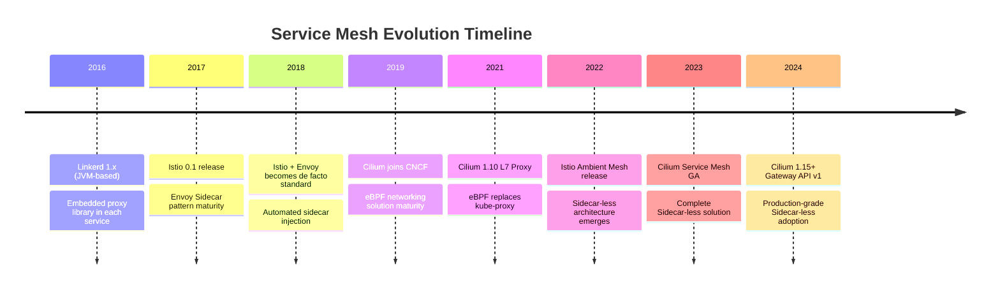

## 1.2 Sidecar Mode Pain Points

Traditional Sidecar architecture reveals the following core issues in large-scale production environments:

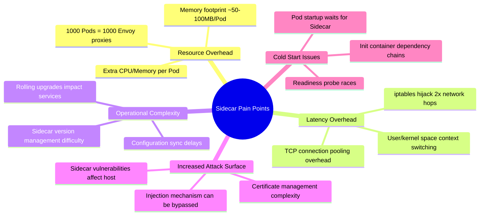

## Resource Consumption Quantified Comparison

| Scale | Sidecar Mode Memory | Sidecar-less Memory | Savings |
|-------|---------------------|---------------------|---------|
| 100 Pods | ~5-10 GB | ~200 MB | ~95% |
| 1000 Pods | ~50-100 GB | ~500 MB | ~99% |
| 10000 Pods | ~500-1000 GB | ~2 GB | ~99.8% |

> **Note**: Above data is based on Envoy default configuration. Actual consumption varies by workload and configuration.

## 1.3 Sidecar-less Architecture Core Philosophy

Sidecar-less architecture completely eliminates per-pod proxy overhead by pushing network proxy functionality down to the kernel layer (eBPF) or node layer (Node-level Proxy):

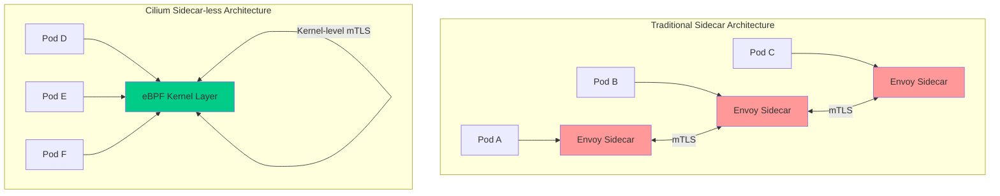

---

<!-- chunk: 2. Cilium Service Mesh Architecture Overview -->## 2. Cilium Service Mesh Architecture Overview

## 2.1 Overall Architecture Diagram

```mermaid
graph TB
    subgraph "Kubernetes Cluster"
        subgraph "Control Plane"
            CP[Cilium Operator]
            HM[Hubble Server]
            SPIRE[SPIRE Server]
            GW[Gateway Controller]
        end
        
        subgraph "Node 1"
            CA[Cilium Agent]
            subgraph "eBPF Data Plane"
                XDP[XDP Hook]
                TC[TC Hook]
                SK[Socket Hook]
                LWT[LWT Hook]
            end
            subgraph "Pod A"
                APP_A[Application A]
            end
            subgraph "Pod B"
                APP_B[Application B]
            end
            CA --> XDP
            CA --> TC
            CA --> SK
            CA --> LWT
        end
        
        subgraph "Node 2"
            CA2[Cilium Agent]
            subgraph "eBPF Data Plane 2"
                XDP2[XDP Hook]
                TC2[TC Hook]
            end
            subgraph "Pod C"
                APP_C[Application C]
            end
            CA2 --> XDP2
            CA2 --> TC2
        end
        
        CP -->|Config distribution| CA
        CP -->|Config distribution| CA2
        HM -->|Traffic observability| CA
        HM -->|Traffic observability| CA2
        SPIRE -->|Certificate issuance| CA
        SPIRE -->|Certificate issuance| CA2
    end
    
    USER[External Users] --> GW
    GW --> APP_A
    
    style CA fill:#00cc88
    style CA2 fill:#00cc88
    style "eBPF Data Plane" fill:#e8f5e9
    style "eBPF Data Plane 2" fill:#e8f5e9
```

## 2.2 Cilium Agent Core Components

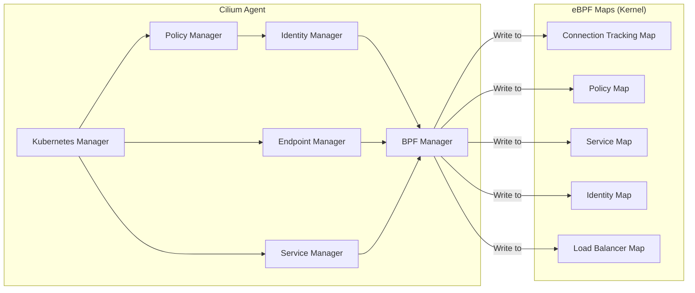

## 2.3 Deployment Modes Comparison

Cilium Service Mesh supports three deployment modes to fit different scenario requirements:

| Mode | Description | mTLS | L7 Policy | Latency Impact | Use Case |
|------|------|------|---------|---------|---------|
| **Pure eBPF Mode** | All functions implemented by eBPF | TLS termination in kernel | Limited | Lowest | High performance scenarios |
| **Per-node Proxy Mode** | One Envoy per node | Full mTLS | Full | Medium | Needs full L7 |
| **Hybrid Mode** | eBPF + on-demand Sidecar | Full mTLS | Full | Dynamic | Migration transition |

## 2.4 Quick Installation

```yaml
# cilium-values.yaml - Cilium Service Mesh enablement config
kubeProxyReplacement: "true"

# Enable Service Mesh features
serviceMonitor:
  enabled: true

# Enable Hubble observability
hubble:
  enabled: true
  relay:
    enabled: true
  ui:
    enabled: true
  metrics:
    enabled:
      - dns
      - drop
      - tcp
      - flow
      - icmp
      - http

# Enable Ingress Controller
ingressController:
  enabled: true
  default: true
  loadbalancerMode: dedicated

# Enable Gateway API
gatewayAPI:
  enabled: true

# Enable mTLS
authentication:
  mutual:
    spire:
      enabled: true
      install:
        enabled: true
        namespace: cilium-spire
        server:
          dataStorage:
            enabled: true
            size: 1Gi

# L7 proxy config
envoy:
  enabled: true
  securityContext:
    privileged: false

# Encryption config
encryption:
  enabled: true
  type: wireguard

# Bandwidth management
bandwidthManager:
  enabled: true
  bbr: true
```

> ⚠️ **🟡 Medium-risk change** — Modifies cluster resource state. Recommend --dry-run or diff validation first
> - `helm upgrade/install`: Deploy/upgrade release

``` bash
# 🟡 Medium risk: Modifies cluster/resource state, verify target, scope, and authorization first
# Deploy Cilium Service Mesh using Helm
helm repo add cilium https://helm.cilium.io/
helm repo update

# Install Cilium (with Service Mesh features enabled)
helm install cilium cilium/cilium \
  --version 1.15.0 \
  --namespace kube-system \
  --values cilium-values.yaml

# Verify installation status
cilium status --wait
cilium connectivity test

# Enable Hubble CLI
cilium hubble enable
hubble observe --follow
```
---

<!-- chunk: 3. How eBPF Replaces Sidecar Proxies -->## 3. How eBPF Replaces Sidecar Proxies

## 3.1 eBPF Hook Points and Network Processing Flow

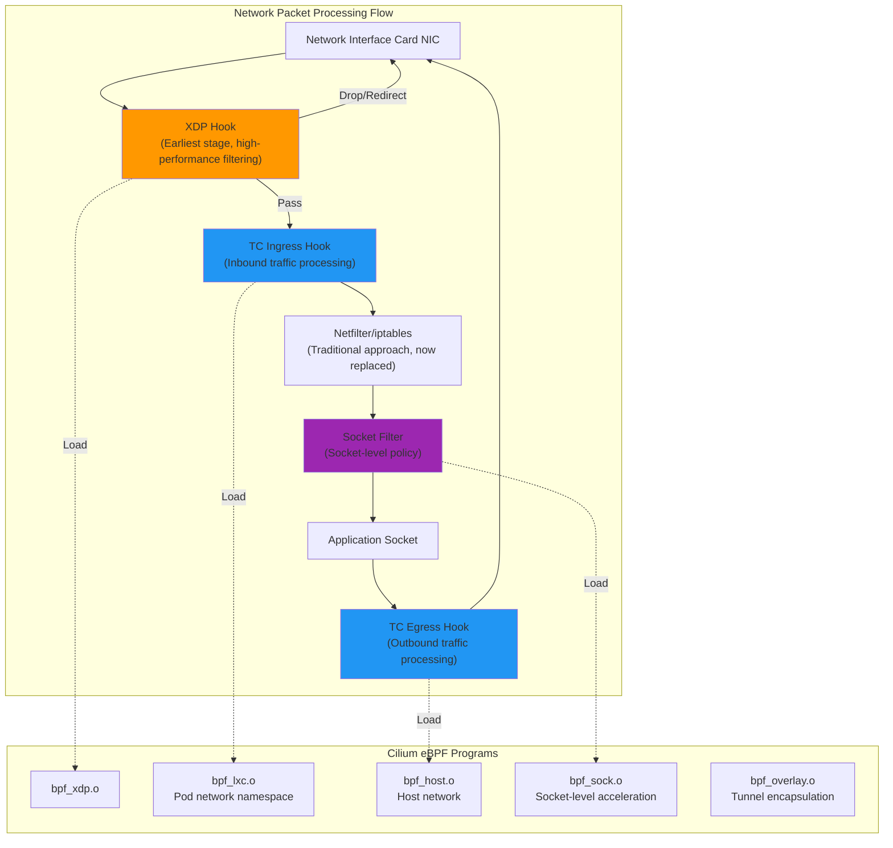

## 3.2 eBPF-based L4 Load Balancing

Cilium implements zero-overhead service load balancing through eBPF socket-level redirection, completely bypassing iptables:

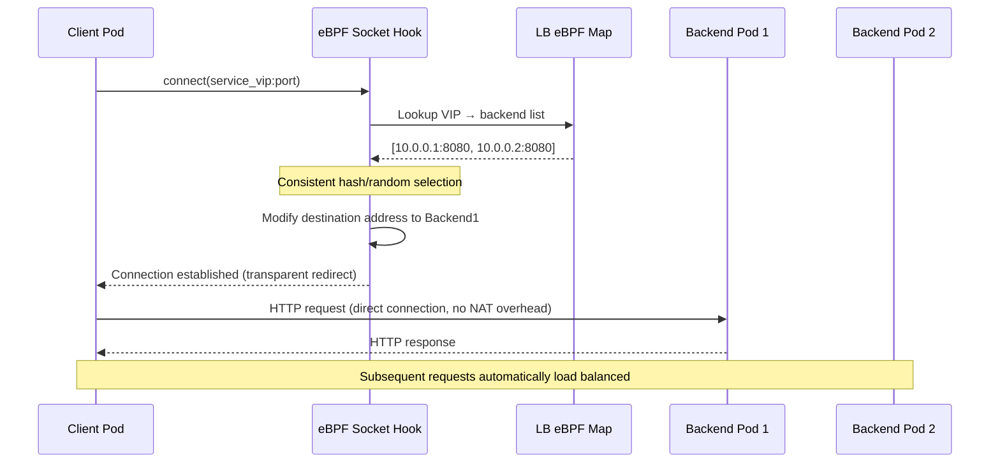

## 3.3 eBPF-based L7 Traffic Awareness

For scenarios requiring L7 awareness, Cilium uses Per-node Envoy instead of Per-pod Sidecar:

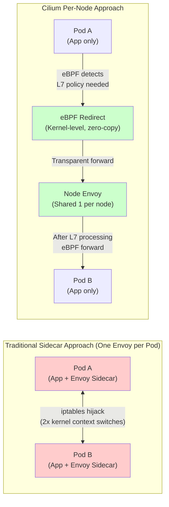

## 3.4 Cilium Network Policy to eBPF Mapping

```yaml
# CiliumNetworkPolicy - L7 HTTP policy example
apiVersion: "cilium.io/v2"
kind: CiliumNetworkPolicy
metadata:
  name: "l7-http-policy"
  namespace: production
spec:
  endpointSelector:
    matchLabels:
      app: backend-api
  ingress:
  - fromEndpoints:
    - matchLabels:
        app: frontend
    toPorts:
    - ports:
      - port: "8080"
        protocol: TCP
      rules:
        http:
        - method: "GET"
          path: "/api/v1/.*"
          headers:
          - "X-Api-Version: v1"
        - method: "POST"
          path: "/api/v1/users"
  egress:
  - toFQDNs:
    - matchPattern: "*.internal.company.com"
    toPorts:
    - ports:
      - port: "443"
        protocol: TCP
```

## 3.5 eBPF Map Data Structures

eBPF programs implement network policies through efficient kernel data structures:

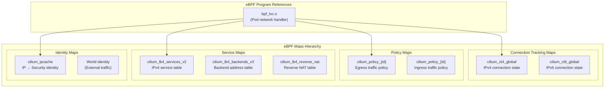

---

<!-- chunk: 4. mTLS and Identity Authentication (SPIFFE/SPIRE) -->## 4. mTLS and Identity Authentication (SPIFFE/SPIRE)

## 4.1 Cilium Identity Model

Cilium uses label-based Security Identity instead of traditional IP addresses to identify workloads:

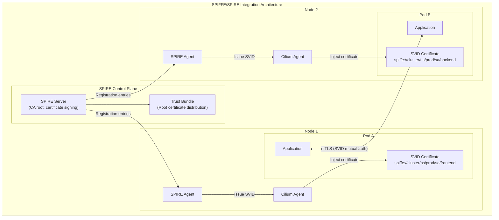

## 4.2 SPIFFE ID to Kubernetes Identity Mapping

```yaml
# SPIRE Server registration entry config
# Auto-register Kubernetes workloads
apiVersion: spire.spiffe.io/v1alpha1
kind: ClusterSPIFFEID
metadata:
  name: cilium-workload-identity
spec:
  spiffeIDTemplate: >-
    spiffe://{{ .TrustDomain }}/ns/{{ .PodMeta.Namespace }}/
    sa/{{ .PodSpec.ServiceAccountName }}
  podSelector:
    matchLabels:
      app.kubernetes.io/managed-by: cilium
  workloadSelectorTemplates:
  - "k8s:ns:{{ .PodMeta.Namespace }}"
  - "k8s:sa:{{ .PodSpec.ServiceAccountName }}"
  - "k8s:pod-uid:{{ .PodMeta.UID }}"
```

```yaml
# Cilium config to enable SPIRE integration
apiVersion: v1
kind: ConfigMap
metadata:
  name: cilium-config
  namespace: kube-system
data:
  # Enable mTLS
  enable-wireguard: "false"
  enable-node-encryption: "false"
  
  # SPIRE integration
  authentication-mutual-auth-listeners-port: "4244"
  
  # Identity allocation mode
  identity-allocation-mode: "crd"
  
  # Certificate lifecycle
  certificates-directory: "/var/lib/cilium/certs"
```

## 4.3 mTLS Handshake Flow

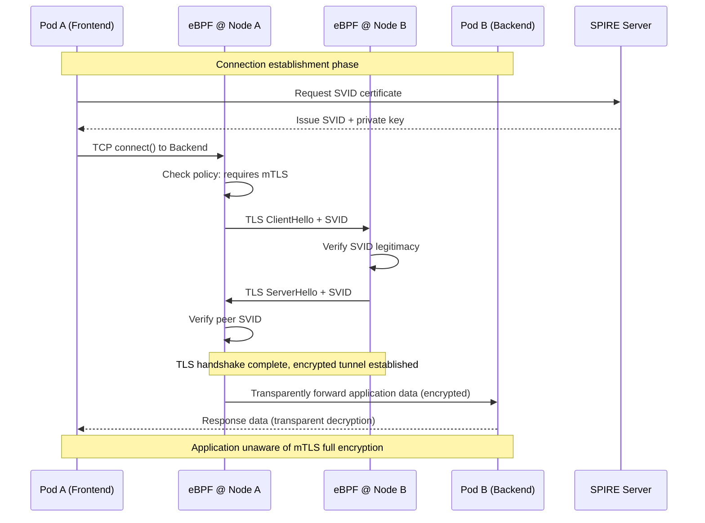

## 4.4 MutualAuthentication CRD Configuration

```yaml
# Enable namespace-level mTLS
apiVersion: cilium.io/v2alpha1
kind: CiliumNetworkPolicy
metadata:
  name: require-mutual-auth
  namespace: production
spec:
  endpointSelector:
    matchLabels:
      security: strict
  ingress:
  - fromEndpoints:
    - matchLabels:
        app.kubernetes.io/part-of: payment-system
    authentication:
      mode: "required"    # mTLS required
  - fromEndpoints:
    - matchLabels:
        monitoring: prometheus
    authentication:
      mode: "disabled"    # Prometheus scraping doesn't need mTLS
```

```yaml
# CiliumClusterwideNetworkPolicy - Cluster-level mTLS default policy
apiVersion: cilium.io/v2
kind: CiliumClusterwideNetworkPolicy
metadata:
  name: cluster-default-mtls
spec:
  endpointSelector:
    matchLabels:
      environment: production
  ingress:
  - fromEndpoints:
    - matchExpressions:
      - key: reserved:world
        operator: NotIn
        values:
        - "true"
    authentication:
      mode: "required"
  egress:
  - toEndpoints:
    - matchExpressions:
      - key: reserved:world
        operator: NotIn
        values:
        - "true"
    authentication:
      mode: "required"
```

---

<!-- chunk: 5. L7 Traffic Management -->## 5. L7 Traffic Management

## 5.1 L7 Traffic Management Architecture

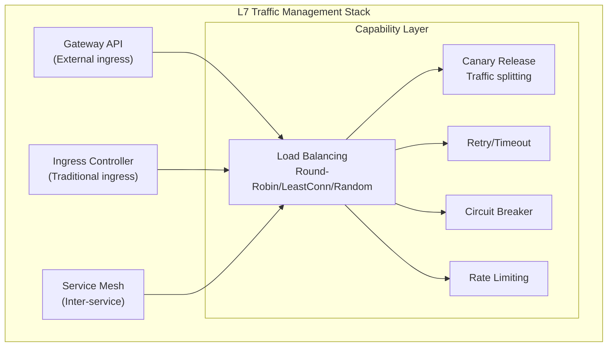

## 5.2 Load Balancing Strategies

## 5.2.1 Maglev Consistent Hashing

Cilium uses the Maglev algorithm by default to implement efficient consistent hashing load balancing:

```yaml
# CiliumLoadBalancerIPPool - IP pool config
apiVersion: "cilium.io/v2alpha1"
kind: CiliumLoadBalancerIPPool
metadata:
  name: production-pool
spec:
  cidrs:
  - cidr: "192.168.100.0/24"
  serviceSelector:
    matchLabels:
      environment: production
```

```yaml
# Service annotation config for load balancing algorithm
apiVersion: v1
kind: Service
metadata:
  name: payment-service
  namespace: production
  annotations:
    # Load balancing algorithm: maglev | random | first | source-ip
    service.cilium.io/lb-algorithm: "maglev"
    # Session affinity
    service.cilium.io/affinity: "client-ip"
    # Maglev table size (larger = more uniform, more memory)
    service.cilium.io/maglev-table-size: "16381"
    # Health check
    service.cilium.io/health-check-node-port: "10256"
spec:
  selector:
    app: payment
  ports:
  - port: 443
    targetPort: 8443
  type: LoadBalancer
  sessionAffinity: ClientIP
  sessionAffinityConfig:
    clientIP:
      timeoutSeconds: 3600
```

## 5.2.2 DSR (Direct Server Return) Mode

```yaml
# Enable DSR to reduce return traffic through LB nodes
# cilium-config ConfigMap
data:
  # Enable DSR mode (only supports NodePort/LoadBalancer)
  kube-proxy-replacement-healthz-bind-address: "0.0.0.0:10256"
  node-port-mode: "dsr"           # dsr | snat
  node-port-algorithm: "maglev"  # Used with Maglev
  node-port-acceleration: "native" # Use XDP acceleration
```

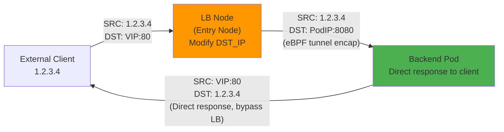

## 5.3 Canary Release and Traffic Splitting

```yaml
# HTTPRoute canary release - Weight-based traffic splitting
apiVersion: gateway.networking.k8s.io/v1
kind: HTTPRoute
metadata:
  name: product-service-canary
  namespace: production
spec:
  parentRefs:
  - name: prod-gateway
    namespace: ingress
  hostnames:
  - "api.example.com"
  rules:
  - matches:
    - path:
        type: PathPrefix
        value: /api/products
    backendRefs:
    # Stable version: 90% traffic
    - name: product-service-stable
      port: 8080
      weight: 90
    # Canary version: 10% traffic
    - name: product-service-canary
      port: 8080
      weight: 10
```

```yaml
# HTTPRoute header-based canary routing
apiVersion: gateway.networking.k8s.io/v1
kind: HTTPRoute
metadata:
  name: header-based-canary
  namespace: production
spec:
  parentRefs:
  - name: prod-gateway
  hostnames:
  - "api.example.com"
  rules:
  # Rule 1: Specific users route to canary version
  - matches:
    - headers:
      - name: "X-Canary-User"
        value: "true"
    - headers:
      - name: "X-User-Group"
        value: "beta-testers"
    backendRefs:
    - name: product-service-canary
      port: 8080
      weight: 100
  # Rule 2: Other users route to stable version
  - matches:
    - path:
        type: PathPrefix
        value: /api/products
    backendRefs:
    - name: product-service-stable
      port: 8080
      weight: 100
```

```yaml
# CiliumEnvoyConfig - Advanced traffic splitting (using Envoy xDS)
apiVersion: cilium.io/v2alpha1
kind: CiliumEnvoyConfig
metadata:
  name: advanced-traffic-split
  namespace: production
spec:
  services:
  - name: product-service
    namespace: production
  resources:
  - "@type": type.googleapis.com/envoy.config.route.v3.RouteConfiguration
    name: product-route-config
    virtual_hosts:
    - name: product-service
      domains:
      - product-service.production.svc.cluster.local
      routes:
      - matchers:
        - prefix: "/"
        - headers:
        - name: "content-type"
          string_match:
            exact: "application/json"
        route:
          weighted_clusters:
            clusters:
            - name: "product-stable"
              weight: 95
            - name: "product-canary"
              weight: 5
          retry_policy:
            retry_on: "5xx,connect-failure"
            num_retries: 3
```

## 5.4 Retry, Timeout, and Circuit Breaking

## 5.4.1 Retry Policy

```yaml
# HTTPRoute retry config
apiVersion: gateway.networking.k8s.io/v1
kind: HTTPRoute
metadata:
  name: api-with-retry
  namespace: production
spec:
  parentRefs:
  - name: prod-gateway
  rules:
  - matches:
    - path:
        type: PathPrefix
        value: /api
    backendRefs:
    - name: api-service
      port: 8080
    # Cilium implements retry via filter
    filters:
    - type: ExtensionRef
      extensionRef:
        group: cilium.io
        kind: RetryPolicy
        name: api-retry-policy
---
# RetryPolicy config (Cilium extension)
apiVersion: cilium.io/v1alpha1
kind: RetryPolicy
metadata:
  name: api-retry-policy
  namespace: production
spec:
  retryOn:
  - "5xx"
  - "connect-failure"
  - "retriable-4xx"
  numRetries: 3
  perTryTimeout: "5s"
  retryHostPredicate:
  - name: envoy.retry_host_predicates.previous_hosts
  hostSelectionRetryMaxAttempts: 5
  retriableStatusCodes:
  - 503
  - 504
```

## 5.4.2 Timeout Configuration

```yaml
# HTTPRoute timeout config
apiVersion: gateway.networking.k8s.io/v1
kind: HTTPRoute
metadata:
  name: api-with-timeout
  namespace: production
spec:
  parentRefs:
  - name: prod-gateway
  rules:
  - matches:
    - path:
        type: PathPrefix
        value: /api/slow-endpoint
    backendRefs:
    - name: slow-service
      port: 8080
    timeouts:
      # Overall request timeout (including retries)
      request: "30s"
      # Backend response timeout (single attempt)
      backendRequest: "10s"
```

## 5.4.3 Circuit Breaker Configuration

```yaml
# CiliumEnvoyConfig - Envoy circuit breaker config
apiVersion: cilium.io/v2alpha1
kind: CiliumEnvoyConfig
metadata:
  name: circuit-breaker-config
  namespace: production
spec:
  services:
  - name: external-payment-api
    namespace: production
  resources:
  - "@type": type.googleapis.com/envoy.config.cluster.v3.Cluster
    name: external-payment-api
    connect_timeout: "5s"
    # Circuit breaker config
    circuit_breakers:
      thresholds:
      - priority: DEFAULT
        max_connections: 1000        # Max connections
        max_pending_requests: 1000  # Max queued requests
        max_requests: 1000          # Max concurrent requests
        max_retries: 10             # Max retries
        track_remaining: true
      - priority: HIGH
        max_connections: 2000
        max_requests: 2000
    # Outlier detection (automatic circuit breaking)
    outlier_detection:
      consecutive_5xx: 5            # Consecutive 5xx errors trigger circuit break
      interval: "10s"
      base_ejection_time: "30s"     # Circuit break duration
      max_ejection_percent: 50      # Max 50% backends ejected
      success_rate_minimum_hosts: 3
      success_rate_request_volume: 100
      success_rate_stdev_factor: 1900
```

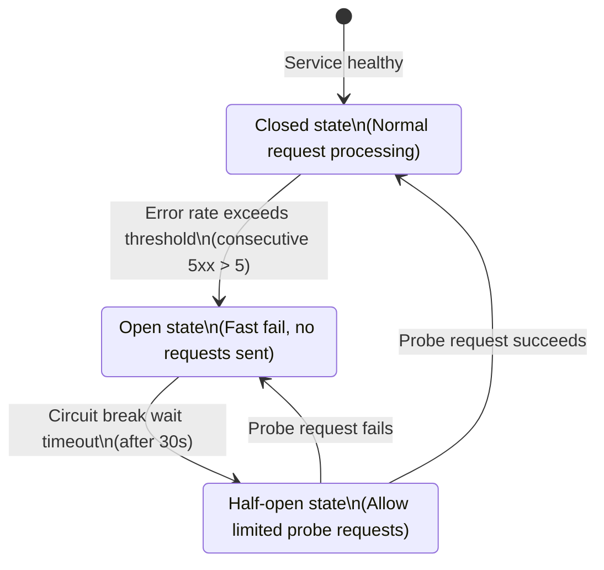

---

<!-- chunk: 6. Gateway API Integration -->## 6. Gateway API Integration

## 6.1 Cilium Gateway API Architecture

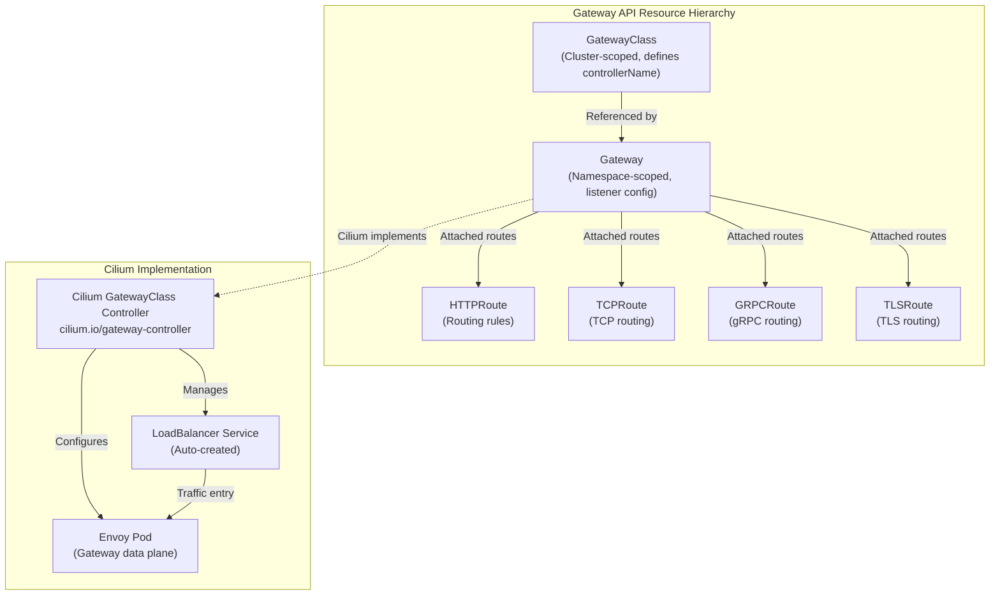

## 6.2 GatewayClass and Gateway Configuration

```yaml
# GatewayClass - Define Cilium as Gateway controller
apiVersion: gateway.networking.k8s.io/v1
kind: GatewayClass
metadata:
  name: cilium
spec:
  controllerName: io.cilium/gateway-controller
  description: "Cilium Gateway API implementation"
  parametersRef:
    group: cilium.io
    kind: CiliumGatewayConfiguration
    name: cilium-gateway-config
    namespace: kube-system
---
# Gateway - HTTP/HTTPS listeners
apiVersion: gateway.networking.k8s.io/v1
kind: Gateway
metadata:
  name: prod-gateway
  namespace: ingress
  annotations:
    # Request LoadBalancer IP
    service.beta.kubernetes.io/aws-load-balancer-type: "nlb"
    service.beta.kubernetes.io/aws-load-balancer-scheme: "internet-facing"
spec:
  gatewayClassName: cilium
  listeners:
  # HTTP listener (redirect to HTTPS)
  - name: http
    protocol: HTTP
    port: 80
    allowedRoutes:
      namespaces:
        from: Selector
        selector:
          matchLabels:
            gateway-access: "allowed"
  # HTTPS listener
  - name: https
    protocol: HTTPS
    port: 443
    tls:
      mode: Terminate
      certificateRefs:
      - name: prod-tls-secret
        namespace: ingress
    allowedRoutes:
      namespaces:
        from: Selector
        selector:
          matchLabels:
            gateway-access: "allowed"
  # gRPC listener
  - name: grpc
    protocol: HTTPS
    port: 8443
    tls:
      mode: Terminate
      certificateRefs:
      - name: grpc-tls-secret
```

## 6.3 Advanced HTTPRoute Configuration

```yaml
# HTTPRoute - Comprehensive feature example
apiVersion: gateway.networking.k8s.io/v1
kind: HTTPRoute
metadata:
  name: comprehensive-route
  namespace: production
spec:
  parentRefs:
  - name: prod-gateway
    namespace: ingress
    sectionName: https  # Specify listener
  hostnames:
  - "api.example.com"
  - "api-v2.example.com"
  rules:
  # Rule 1: Path rewrite + request header injection
  - name: api-v1-rewrite
    matches:
    - path:
        type: PathPrefix
        value: /v1/
    filters:
    - type: URLRewrite
      urlRewrite:
        hostname: api-internal.production.svc.cluster.local
        path:
          type: ReplacePrefixMatch
          replacePrefixMatch: /api/
    - type: RequestHeaderModifier
      requestHeaderModifier:
        add:
        - name: X-Gateway-Version
          value: "cilium-1.15"
        - name: X-Request-ID
          value: "$(request.id)"
        remove:
        - X-Internal-Token
    backendRefs:
    - name: api-service-v1
      port: 8080
  
  # Rule 2: Response header modification
  - name: api-v2-response-header
    matches:
    - path:
        type: PathPrefix
        value: /v2/
    filters:
    - type: ResponseHeaderModifier
      responseHeaderModifier:
        add:
        - name: X-API-Version
          value: "v2"
        - name: Strict-Transport-Security
          value: "max-age=31536000; includeSubDomains"
    backendRefs:
    - name: api-service-v2
      port: 8080
  
  # Rule 3: Request mirroring (traffic duplication)
  - name: traffic-mirror
    matches:
    - path:
        type: PathPrefix
        value: /api/orders
    filters:
    - type: RequestMirror
      requestMirror:
        backendRef:
          name: order-service-shadow
          port: 8080
    backendRefs:
    - name: order-service-prod
      port: 8080
```

## 6.4 TLSRoute and TCPRoute

```yaml
# TLSRoute - TLS passthrough (SNI routing)
apiVersion: gateway.networking.k8s.io/v1alpha2
kind: TLSRoute
metadata:
  name: database-tls-route
  namespace: production
spec:
  parentRefs:
  - name: prod-gateway
    namespace: ingress
    sectionName: tls-passthrough
  rules:
  - backendRefs:
    - name: postgres-service
      port: 5432
---
# TCPRoute - Pure TCP proxy
apiVersion: gateway.networking.k8s.io/v1alpha2
kind: TCPRoute
metadata:
  name: redis-tcp-route
  namespace: production
spec:
  parentRefs:
  - name: internal-gateway
    namespace: ingress
  rules:
  - backendRefs:
    - name: redis-service
      port: 6379
      weight: 100
```

---

<!-- chunk: 7. Ingress Controller Capabilities -->## 7. Ingress Controller Capabilities

## 7.1 Cilium Ingress Architecture

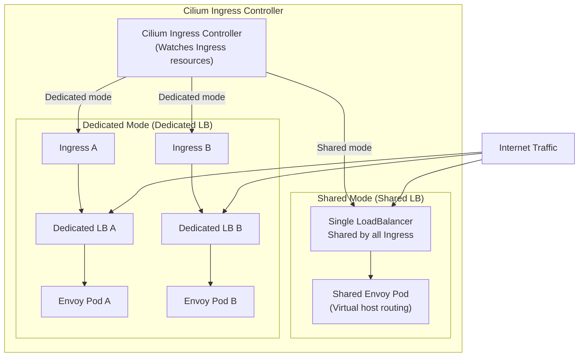

## 7.2 Ingress Resource Configuration

```yaml
# Ingress - Basic HTTP/HTTPS routing
apiVersion: networking.k8s.io/v1
kind: Ingress
metadata:
  name: web-ingress
  namespace: production
  annotations:
    # Specify Cilium as Ingress Controller
    kubernetes.io/ingress.class: "cilium"
    # Or use ingressClassName
    
    # Force HTTPS redirect
    ingress.cilium.io/force-https: "true"
    
    # Load balancer mode
    ingress.cilium.io/loadbalancer-mode: "dedicated"
    
    # Service type
    ingress.cilium.io/service-type: "LoadBalancer"
    
    # Timeout config
    ingress.cilium.io/idle-timeout-seconds: "300"
    ingress.cilium.io/request-timeout-seconds: "60"
    
    # Request body size limit
    ingress.cilium.io/max-request-body-size: "10485760"  # 10MB
spec:
  ingressClassName: cilium
  tls:
  - hosts:
    - www.example.com
    - api.example.com
    secretName: example-tls
  rules:
  - host: www.example.com
    http:
      paths:
      - path: /
        pathType: Prefix
        backend:
          service:
            name: frontend-service
            port:
              number: 80
  - host: api.example.com
    http:
      paths:
      - path: /v1
        pathType: Prefix
        backend:
          service:
            name: api-service-v1
            port:
              number: 8080
      - path: /v2
        pathType: Prefix
        backend:
          service:
            name: api-service-v2
            port:
              number: 8080
```

```yaml
# Ingress - gRPC support
apiVersion: networking.k8s.io/v1
kind: Ingress
metadata:
  name: grpc-ingress
  namespace: production
  annotations:
    kubernetes.io/ingress.class: "cilium"
    ingress.cilium.io/backend-protocol: "GRPC"
    ingress.cilium.io/grpc-web: "true"  # Enable gRPC-Web conversion
spec:
  ingressClassName: cilium
  tls:
  - hosts:
    - grpc.example.com
    secretName: grpc-tls
  rules:
  - host: grpc.example.com
    http:
      paths:
      - path: /
        pathType: Prefix
        backend:
          service:
            name: grpc-service
            port:
              number: 50051
```

---

<!-- chunk: 8. Comparison with Istio Ambient Mesh -->## 8. Comparison with Istio Ambient Mesh

## 8.1 Architecture Comparison Diagram

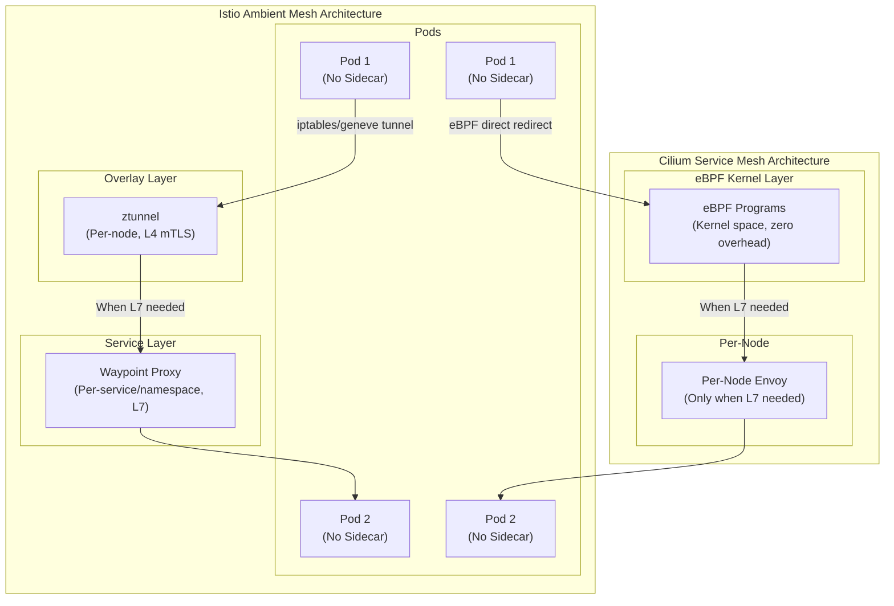

## 8.2 Detailed Feature Comparison Matrix

| Feature | Cilium Service Mesh | Istio Ambient Mesh | Istio Sidecar |
|------|--------------------|--------------------|---------------|
| **Data Plane Technology** | eBPF + Per-node Envoy | ztunnel + Waypoint Proxy | Per-pod Envoy |
| **L4 mTLS** | eBPF/WireGuard | ztunnel (Rust) | Envoy Sidecar |
| **L7 Capabilities** | Per-node Envoy | Waypoint Proxy | Envoy Sidecar |
| **Resource Overhead** | Extremely low (eBPF kernel) | Low (ztunnel ~50MB/node) | High (per Pod 100MB+) |
| **Network Latency** | Lowest (kernel-level) | Low (userspace, 1 hop) | Medium (2x iptables hops) |
| **CNCF Graduation Status** | Graduated (2023) | Graduated (2022) | Graduated (2022) |
| **Gateway API** | Full support (v1) | Full support | Via Istio API |
| **Observability** | Hubble (eBPF) | Prometheus + Kiali | Prometheus + Kiali |
| **Kubernetes Compatibility** | Runs as CNI | Overlay on CNI | Overlay on CNI |
| **Windows Nodes** | Not supported | Not supported | Limited support |
| **WireGuard Encryption** | Native support | Not supported | Not supported |
| **eBPF Requirements** | Required (kernel 4.19+) | Not required | Not required |
| **Learning Curve** | Medium (eBPF knowledge) | Medium | High (complex config) |
| **Community Activity** | Very active | Very active | Very active |

## 8.3 Performance Comparison Scenario Analysis

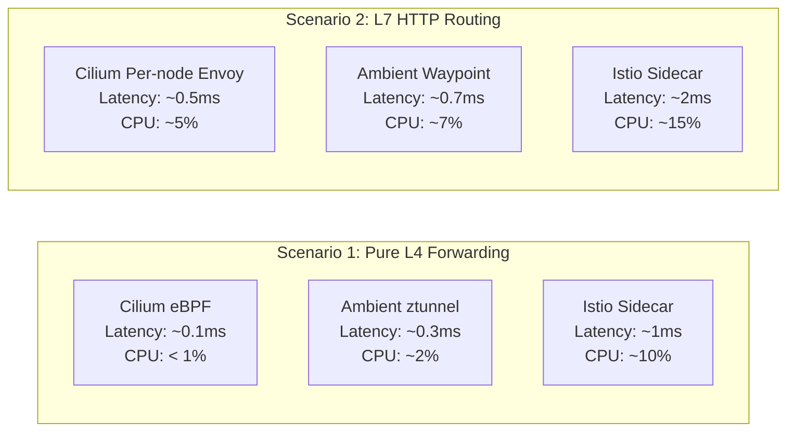

---

<!-- chunk: 9. Performance Benchmarks (vs Envoy Sidecar) -->## 9. Performance Benchmarks (vs Envoy Sidecar)

## 9.1 Test Environment and Methodology

```
# 🟢 Low risk: Read-only/informational, usually no side effects
Test cluster configuration:
- Kubernetes: 1.29
- Node type: c5.4xlarge (16 CPU, 32GB RAM)
- Node count: 10 worker nodes
- Network: AWS VPC CNI replaced with Cilium
- Test tools: wrk2, fortio, iperf3, netperf
- Test scenarios: Pod-to-Pod (same node/cross-node), Pod-to-Service
```
## 9.2 Throughput Comparison

```mermaid
xychart-beta
    title "HTTP Request Throughput (RPS, higher is better)"
    x-axis ["1 concurrent", "10 concurrent", "50 concurrent", "100 concurrent", "500 concurrent"]
    y-axis "Requests per second (RPS)" 0 --> 120000
    bar [45000, 78000, 95000, 105000, 110000]
    bar [38000, 65000, 82000, 88000, 90000]
    bar [22000, 42000, 58000, 65000, 68000]
```

| Concurrency | Cilium eBPF | Cilium Per-node Envoy | Istio Sidecar | Improvement |
|--------|------------|----------------------|---------------|---------|
| 1 | 45,000 RPS | 40,000 RPS | 22,000 RPS | **+104%** |
| 10 | 78,000 RPS | 70,000 RPS | 42,000 RPS | **+86%** |
| 50 | 95,000 RPS | 88,000 RPS | 58,000 RPS | **+64%** |
| 100 | 105,000 RPS | 98,000 RPS | 65,000 RPS | **+62%** |
| 500 | 110,000 RPS | 102,000 RPS | 68,000 RPS | **+62%** |

## 9.3 Latency Comparison

| Percentile | No Mesh (Baseline) | Cilium eBPF | Cilium Per-node | Istio Sidecar |
|--------|--------------|-------------|----------------|---------------|
| P50 | 0.8 ms | 1.0 ms (+25%) | 1.5 ms (+88%) | 3.2 ms (+300%) |
| P90 | 1.2 ms | 1.4 ms (+17%) | 2.1 ms (+75%) | 5.8 ms (+383%) |
| P99 | 2.5 ms | 2.8 ms (+12%) | 4.2 ms (+68%) | 12.4 ms (+396%) |
| P99.9 | 8.0 ms | 9.2 ms (+15%) | 13.5 ms (+69%) | 35.0 ms (+338%) |

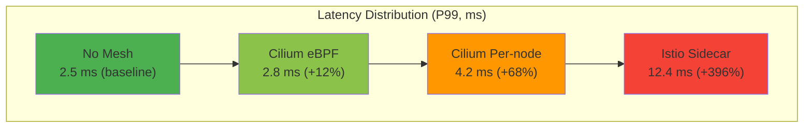

## 9.4 Resource Consumption Comparison

| Metric | Cilium eBPF | Cilium Per-node Envoy | Istio Sidecar (per Pod) |
|------|------------|----------------------|----------------------|
| **CPU (idle)** | ~0.5 CPU/node | ~0.5 CPU/node | ~50m CPU/Pod |
| **CPU (high load)** | ~1 CPU/node | ~2 CPU/node | ~200m CPU/Pod |
| **Memory (fixed)** | ~100 MB/node | ~200 MB/node | ~100 MB/Pod |
| **Startup Latency** | None (with cilium-agent) | None | ~3-5 seconds/Pod |
| **1000 Pod Cluster Total Overhead** | ~10 CPU, ~1 GB | ~20 CPU, ~2 GB | ~200 CPU, ~100 GB |

## 9.5 Network Bandwidth Testing

> ⚠️ **🟡 Medium-risk change** — Modifies cluster resource state. Recommend --dry-run or diff validation first
> - `kubectl label/annotate`: Metadata changes may affect selectors/controllers

``` bash
# 🟡 Medium risk: Modifies cluster/resource state, verify target, scope, and authorization first
# iperf3 cross-node TCP bandwidth test script
#!/bin/bash

echo "=== Test 1: No Cilium Service Mesh (baseline) ==="
kubectl run iperf-server --image=networkstatic/iperf3 -- -s
kubectl run iperf-client --image=networkstatic/iperf3 \
  -- -c iperf-server -t 30 -P 8 --json

echo "=== Test 2: Cilium eBPF mode ==="
# Ensure WireGuard encryption is off (pure forwarding test)
kubectl annotate node worker-1 \
  "cilium.io/nodeconfig=encrypt=false"
kubectl run iperf-client-cilium --image=networkstatic/iperf3 \
  -- -c iperf-server -t 30 -P 8 --json

echo "=== Test 3: WireGuard encryption mode ==="
kubectl annotate node worker-1 \
  "cilium.io/nodeconfig=encrypt=wireguard"
kubectl run iperf-client-wg --image=networkstatic/iperf3 \
  -- -c iperf-server -t 30 -P 8 --json
```
| Scenario | Bandwidth (Gbps) | CPU Utilization |
|------|-----------|-----------|
| Baseline (no encryption) | 9.8 | 15% |
| Cilium eBPF (no encryption) | 9.5 | 18% |
| Cilium WireGuard | 7.2 | 35% |
| Istio mTLS Sidecar | 5.8 | 52% |

---

<!-- chunk: 10. Migration Strategy and Best Practices -->## 10. Migration Strategy and Best Practices

## 10.1 Migration Path Planning

```mermaid
flowchart TD
    START["Existing Environment Assessment"] --> ASSESS{Assess current solution}
    
    ASSESS -->|"Using Istio + Envoy Sidecar"| ISTIO_PATH
    ASSESS -->|"Using other CNI (Flannel/Calico)"| CNI_PATH
    ASSESS -->|"No Service Mesh"| GREENFIELD
    
    subgraph ISTIO_PATH["Istio Migration Path"]
        I1["Phase 1: Install Cilium as CNI\n(Replace kube-proxy)"]
        I2["Phase 2: Enable Cilium network policies\n(Coexist with Istio)"]
        I3["Phase 3: Gradually migrate Ingress/Gateway to Cilium"]
        I4["Phase 4: Service-level migration\n(Disable Istio Sidecar Injection)"]
        I5["Phase 5: Remove Istio control plane"]
        I1 --> I2 --> I3 --> I4 --> I5
    end
    
    subgraph CNI_PATH["CNI Replacement Path"]
        C1["Phase 1: Validate Cilium in test cluster"]
        C2["Phase 2: Blue-green deploy new node pool\n(Running Cilium)"]
        C3["Phase 3: Rolling workload migration"]
        C4["Phase 4: Decommission old node pool"]
        C1 --> C2 --> C3 --> C4
    end
    
    subgraph GREENFIELD["Greenfield Deployment"]
        G1["Direct deploy Cilium Service Mesh"]
        G2["Configure Gateway API"]
        G3["Enable mTLS + Hubble"]
        G1 --> G2 --> G3
    end
```

## 10.2 Migration Steps from Istio

> ⚠️ **🔴 Catastrophic operation** — Contains irreversible commands. Must confirm before execution: change window + dual approval + pre-backup + rollback plan
> - `kubectl delete namespace`: Permanently deletes namespace and all resources, unrecoverable
> - `helm upgrade/install`: Deploy/upgrade release
> - `kubectl apply/create/replace`: Create/modify cluster resources
> - `kubectl label/annotate`: Metadata changes may affect selectors/controllers

> **🔴 High-risk Operation Warning**
>
> The following commands are irreversible or have high impact. Confirm before execution:
> - Critical data and configs are backed up
> - Within approved change window
> - Authorized by relevant owners
> - Rollback or recovery plan prepared
> - Target cluster, Namespace, node/resource names verified

``` bash
# 🔴 High risk: May cause data loss or service interruption, requires backup, change approval, and rollback plan
#!/bin/bash
# Istio → Cilium Service Mesh migration script

echo "=== Phase 1: Install Cilium (coexist with Istio) ==="

# Approach: Keep Istio, deploy Cilium on new nodes
helm install cilium cilium/cilium \
  --version 1.15.0 \
  --namespace kube-system \
  --set kubeProxyReplacement=true \
  --set ingressController.enabled=true \
  --set gatewayAPI.enabled=true \
  --set hubble.enabled=true \
  --set hubble.relay.enabled=true

echo "=== Phase 2: Verify Cilium running normally ==="
cilium status --wait
cilium connectivity test --test-namespace cilium-test

echo "=== Phase 3: Migrate Ingress resources ==="
# Convert existing Istio Ingress to Cilium Gateway API
kubectl get ingress -A -o yaml | \
  python3 migrate-to-gateway-api.py > gateway-routes.yaml
kubectl apply -f gateway-routes.yaml

echo "=== Phase 4: Per-namespace migration ==="
NAMESPACES=("frontend" "backend" "api-gateway")
for NS in "${NAMESPACES[@]}"; do
  echo "Migrating namespace: $NS"
  
  # Disable Istio Sidecar injection for this namespace
  kubectl label namespace $NS istio-injection=disabled --overwrite
  
  # Restart Pods to remove Sidecar
  kubectl rollout restart deployment -n $NS
  kubectl rollout status deployment -n $NS --timeout=300s
  
  echo "Namespace $NS migration complete"
  sleep 10
done

echo "=== Phase 5: Uninstall Istio ==="
istioctl uninstall --purge -y
kubectl delete namespace istio-system  # ⚠️ Irreversible: permanently deletes namespace and all resources
```
## 10.3 Policy Compatibility Configuration During Migration

```yaml
# Support both Istio and Cilium policies during migration
# CiliumNetworkPolicy - Allow Istio control plane communication
apiVersion: cilium.io/v2
kind: CiliumNetworkPolicy
metadata:
  name: allow-istio-controlplane
  namespace: default
spec:
  endpointSelector: {}  # Applies to all Pods
  ingress:
  # Allow Istio Pilot (istiod) communication
  - fromEndpoints:
    - matchLabels:
        app: istiod
        namespace: istio-system
    toPorts:
    - ports:
      - port: "15012"  # xDS
      - port: "15017"  # Webhook
        protocol: TCP
  # Allow Envoy Sidecar inter-communication (during migration)
  - fromEndpoints:
    - matchLabels:
        security.istio.io/tlsMode: "istio"
    toPorts:
    - ports:
      - port: "15001"  # Envoy Outbound
      - port: "15006"  # Envoy Inbound
        protocol: TCP
```

## 10.4 Production Environment Best Practices

## 10.4.1 Resource Configuration Recommendations

```yaml
# cilium-agent DaemonSet resource config
# Production environment recommended configuration
apiVersion: v1
kind: ConfigMap
metadata:
  name: cilium-production-tuning
  namespace: kube-system
data:
  # Connection tracking table size (adjust based on Pod density)
  # Formula: max(65536, 8*{max_pods})
  bpf-ct-global-tcp-max: "524288"
  bpf-ct-global-any-max: "262144"
  
  # NAT table size
  bpf-nat-global-max: "524288"
  
  # Policy map size (per Pod)
  bpf-policy-map-max: "65536"
  
  # LB map size
  bpf-lb-map-max: "65536"
  
  # Kernel memory lock limit
  bpf-map-dynamic-size-ratio: "0.0025"
  
  # Hubble buffer size (observability)
  hubble-event-buffer-capacity: "65535"
  hubble-event-queue-size: "50"
  
  # Envoy config
  envoy-log-level: "warning"
  
  # Monitoring sampling rate (reduce CPU overhead under high load)
  monitor-aggregation: "maximum"
  monitor-aggregation-interval: "5s"
  monitor-aggregation-flags: "all"
```

## 10.4.2 Node Kernel Parameter Tuning

> ⚠️ **🟠 High-risk operation** — Affects business traffic or node state, requires change ticket + impact assessment + planned rollback
> - `sysctl -w`: Live modify kernel parameters, globally effective

```bash
#!/bin/bash
# Production environment node kernel parameter tuning

# Increase network connection tracking table size
sysctl -w net.netfilter.nf_conntrack_max=2097152
sysctl -w net.netfilter.nf_conntrack_buckets=524288

# Increase socket buffers
sysctl -w net.core.rmem_max=134217728
sysctl -w net.core.wmem_max=134217728
sysctl -w net.core.netdev_max_backlog=10000

# TCP optimization
sysctl -w net.ipv4.tcp_congestion_control=bbr
sysctl -w net.core.default_qdisc=fq
sysctl -w net.ipv4.tcp_fastopen=3
sysctl -w net.ipv4.ip_local_port_range="1024 65535"

# eBPF memory unlock
ulimit -l unlimited

# Verify eBPF JIT
sysctl -w net.core.bpf_jit_enable=1
sysctl -w net.core.bpf_jit_harden=1

echo "Kernel parameter configuration complete"
```

## 10.4.3 Monitoring and Alerting Configuration

```yaml
# Cilium ServiceMonitor - Prometheus monitoring config
apiVersion: monitoring.coreos.com/v1
kind: ServiceMonitor
metadata:
  name: cilium-agent-monitor
  namespace: monitoring
spec:
  selector:
    matchLabels:
      k8s-app: cilium
  namespaceSelector:
    matchNames:
    - kube-system
  endpoints:
  - port: prometheus
    interval: 30s
    path: /metrics
    scheme: http
---
# PrometheusRule - Cilium alert rules
apiVersion: monitoring.coreos.com/v1
kind: PrometheusRule
metadata:
  name: cilium-alerts
  namespace: monitoring
spec:
  groups:
  - name: cilium.rules
    rules:
    # eBPF Map pressure alert
    - alert: CiliumBPFMapPressureHigh
      expr: |
        cilium_bpf_map_pressure{map_name=~"cilium_.*"} > 0.8
      for: 5m
      labels:
        severity: warning
      annotations:
        summary: "Cilium eBPF Map usage exceeds 80%"
        description: "Map {{ $labels.map_name }} usage: {{ $value | humanizePercentage }}"
    
    # Policy drop rate alert
    - alert: CiliumHighDropRate
      expr: |
        rate(cilium_drop_count_total[5m]) > 100
      for: 2m
      labels:
        severity: critical
      annotations:
        summary: "Cilium high packet drop rate"
        description: "Drop rate: {{ $value }} pkt/s, reason: {{ $labels.reason }}"
    
    # Envoy error rate alert
    - alert: CiliumEnvoyHighErrorRate
      expr: |
        rate(envoy_cluster_upstream_rq_5xx[5m]) / 
        rate(envoy_cluster_upstream_rq_total[5m]) > 0.05
      for: 3m
      labels:
        severity: warning
      annotations:
        summary: "Cilium Envoy error rate exceeds 5%"
```

## 10.5 Troubleshooting Guide

> ⚠️ **🟡 Medium-risk change** — Modifies cluster resource state. Recommend --dry-run or diff validation first
> - `kubectl exec`: Enter container to execute commands, may change container state

``` bash
# 🟡 Medium risk: Modifies cluster/resource state, verify target, scope, and authorization first
#!/bin/bash
# Cilium Service Mesh troubleshooting command set

echo "=== 1. Check Cilium Agent status ==="
cilium status --verbose
kubectl get pods -n kube-system -l k8s-app=cilium -o wide

echo "=== 2. Check eBPF program load status ==="
cilium bpf list
cilium bpf ct list global | head -20

echo "=== 3. Check network policy ==="
cilium policy get
cilium endpoint list

echo "=== 4. Traffic tracing (Hubble) ==="
# Observe specific Pod traffic
hubble observe --pod frontend/pod-xxx --follow --type=drop
hubble observe --namespace production --protocol http --verdict DROPPED

echo "=== 5. Service load balancing check ==="
cilium service list
cilium bpf lb list

echo "=== 6. Envoy status check ==="
kubectl exec -n kube-system cilium-xxx -- \
  curl -s localhost:9901/config_dump | jq '.configs[].dynamic_route_configs'

echo "=== 7. Connection tracking check ==="
cilium bpf ct list global | grep "10.0.0.1" | head -20

echo "=== 8. eBPF Map usage ==="
cilium bpf map list
for map in $(cilium bpf map list -o json | jq -r '.[].name'); do
  echo "Map: $map"
  cilium bpf map get $map 2>/dev/null | wc -l
done

echo "=== 9. Node connectivity test ==="
cilium connectivity test --test-namespace cilium-test --test=pod-to-pod

echo "=== 10. Collect diagnostic info ==="
cilium sysdump --output-filename cilium-sysdump-$(date +%Y%m%d)
```
## 10.6 Summary: Decision Tree

```mermaid
flowchart TD
    START["Need Service Mesh?"] --> Y{Yes}
    Y --> PERF{Performance is top priority?}
    
    PERF -->|"Yes"| CILIUM_CHECK{Already using Cilium CNI?}
    CILIUM_CHECK -->|"Yes"| CILIUM_MESH["Recommended: Cilium Service Mesh\n✅ Lowest latency\n✅ Lowest resource\n✅ No extra components"]
    CILIUM_CHECK -->|"No"| MIGRATE{Willing to replace CNI?}
    MIGRATE -->|"Yes"| CILIUM_MESH
    MIGRATE -->|"No"| AMBIENT["Consider: Istio Ambient Mesh\n✅ Low Sidecar overhead\n⚠️ Requires extra components"]
    
    PERF -->|"No"| L7_NEED{Need full L7 features?}
    L7_NEED -->|"Yes, and team familiar with Istio"| ISTIO["Consider: Istio (Traditional mode)\n✅ Mature ecosystem\n✅ Rich features\n⚠️ High resource overhead"]
    L7_NEED -->|"Yes, performance also important"| CILIUM_MESH
    L7_NEED -->|"Only need L4"| CILIUM_EBPF["Recommended: Cilium eBPF Only\n✅ Extremely low overhead\n✅ Kernel-level security"]
    
    style CILIUM_MESH fill:#4caf50,color:#fff
    style CILIUM_EBPF fill:#2196f3,color:#fff
    style AMBIENT fill:#ff9800,color:#fff
    style ISTIO fill:#9e9e9e,color:#fff
```

---

<!-- chunk: Appendix A: Complete Cilium Service Mesh Configuration Reference -->## Appendix A: Complete Cilium Service Mesh Configuration Reference

```yaml
# Complete production environment Cilium Helm Values
# cilium-production-values.yaml
kubeProxyReplacement: "true"
k8sServiceHost: "k8s-api.internal.company.com"
k8sServicePort: "6443"

# Routing mode
routingMode: "native"
autoDirectNodeRoutes: true
ipv4NativeRoutingCIDR: "10.0.0.0/8"

# Bandwidth management
bandwidthManager:
  enabled: true
  bbr: true

# High availability Operator
operator:
  replicas: 2
  resources:
    requests:
      cpu: 100m
      memory: 128Mi
    limits:
      cpu: 500m
      memory: 512Mi

# Hubble observability
hubble:
  enabled: true
  metrics:
    enabled:
    - dns:query;ignoreAAAA
    - drop
    - tcp
    - flow
    - icmp
    - http
    serviceMonitor:
      enabled: true
  relay:
    enabled: true
    replicas: 2
    resources:
      requests:
        cpu: 100m
        memory: 64Mi
  ui:
    enabled: true
    replicas: 1

# Service Mesh features
ingressController:
  enabled: true
  default: true
  loadbalancerMode: shared
  enforceHttps: true

gatewayAPI:
  enabled: true
  gatewayClass:
    create: auto

# mTLS / SPIRE
authentication:
  mutual:
    spire:
      enabled: true
      install:
        enabled: true
        namespace: cilium-spire
        agent:
          serviceAccountName: spire-agent
        server:
          serviceAccountName: spire-server
          dataStorage:
            enabled: true
            size: 5Gi
            storageClass: ssd-retain

# WireGuard node encryption
encryption:
  enabled: true
  type: wireguard
  nodeEncryption: true

# eBPF performance tuning
bpf:
  masquerade: true
  preallocateMaps: true
  mapDynamicSizeRatio: 0.0025
  ctTcpMax: 524288
  ctAnyMax: 262144
  natMax: 524288
  lbMapMax: 65536

# Envoy config
envoy:
  enabled: true
  resources:
    requests:
      cpu: 100m
      memory: 128Mi
    limits:
      cpu: 2000m
      memory: 1Gi

# Monitoring
prometheus:
  enabled: true
  serviceMonitor:
    enabled: true
```

---

<!-- chunk: Appendix B: Cilium CLI Quick Reference -->## Appendix B: Cilium CLI Quick Reference

```bash
# === Cilium Status Check ===
cilium status                          # Overall status
cilium status --verbose               # Detailed status
cilium connectivity test              # Connectivity test

# === Endpoint Management ===
cilium endpoint list                  # List all endpoints
cilium endpoint get <id>             # View endpoint details
cilium endpoint log <id>             # Endpoint logs

# === Network Policy ===
cilium policy get                     # View all policies
cilium policy trace --src-k8s-pod <ns>/<pod> --dst-k8s-pod <ns>/<pod>  # Policy trace

# === Service/Load Balancing ===
cilium service list                   # List all services
cilium bpf lb list                   # eBPF LB table

# === Hubble Observability ===
hubble observe --follow              # Real-time traffic observation
hubble observe --namespace <ns>     # Namespace filter
hubble observe --pod <ns/pod>       # Pod filter
hubble observe --verdict DROPPED    # View dropped traffic only
hubble observe --protocol http      # HTTP traffic
hubble status                        # Hubble status

# === eBPF Debugging ===
cilium bpf map list                  # eBPF Map list
cilium bpf ct list global           # Connection tracking table
cilium bpf nat list                  # NAT table
cilium bpf tunnel list              # Tunnel table

# === Diagnostics ===
cilium sysdump                       # Collect diagnostic info
cilium debuginfo                     # Debug info
```

---

*Document version: v1.0 | Last updated: 2026-03-03 | Maintained by: Platform Engineering*

---

<!-- chunk: Obsidian Related Documents -->## Obsidian Related Documents

- domain-35-ebpf-technology MOC
- [[domain-03-networking-traffic/README.md|Domain 03: eBPF Technology Stack]]
- Domain-35 eBPF Technology — Open Source Project Index
- eBPF Architecture Fundamentals and Program Types
- eBPF Map Types and Data Structures
- Cilium CNI Architecture and Deployment
- Cilium Network Policy L3/L4/L7
- Tetragon Runtime Security
- Hubble Network Observability
- bcc and bpftrace Tools
- eBPF Performance Optimization Practice
- eBPF Security Applications and Use Cases

## See Also

- 03-cilium-cni-architecture
- 04-cilium-network-policy
- 06-tetragon-runtime-security
- 07-hubble-network-observability


<!-- risk-assessed -->
