> **Production Safety Notice**
>
> This document contains operational commands that can be executed directly. Before running them, confirm: the target cluster and Namespace are correct; you have sufficient RBAC permissions; and the commands have been validated in a non-production environment. Command risk levels: 🔴 High risk (may cause data loss or service interruption), 🟡 Medium risk (modifies cluster state, usually rollbackable), 🟢 Low risk / read-only (information gathering, no side effects).

# Hubble Network Observability

> Hubble is a fully distributed network and security observability platform built on top of [[Cilium|Cilium]] and eBPF, enabling deep visibility into service communication behavior, network infrastructure, and application layer protocols in a completely transparent manner.

---

<!-- chunk: Table of Contents -->## Table of Contents

1. [Hubble Overview and Architecture](#1-hubble-overview-and-architecture)
2. [Hubble Components in Depth](#2-hubble-components-in-depth)
3. [L3/L4/L7 Traffic Visualization](#3-l3l4l7-traffic-visualization)
4. [Service Map and Dependency Graphs](#4-service-map-and-dependency-graphs)
5. [Network Policy Visualization](#5-network-policy-visualization)
6. [Prometheus Metrics Export](#6-prometheus-metrics-export)
7. [Hubble Deployment and Configuration (Helm)](#7-hubble-deployment-and-configuration-helm)
8. [Grafana Integration Dashboards](#8-grafana-integration-dashboards)
9. [Troubleshooting and Network Diagnostics](#9-troubleshooting-and-network-diagnostics)
10. [Enterprise Observability Practices](#10-enterprise-observability-practices)

---

<!-- chunk: 1. Hubble Overview and Architecture -->## 1. Hubble Overview and Architecture

## 1.1 What is Hubble

Hubble is a network and security observability tool for cloud-native workloads, deeply integrated into the Cilium ecosystem. Unlike traditional sidecar proxy-based observability solutions, Hubble leverages Linux kernel eBPF technology to gain complete network visibility **without modifying any application code or injecting sidecars**.

**Core Capabilities:**

| Capability Dimension | Description |
|---------|------|
| **Traffic Visibility** | Real-time capture of L3/L4/L7 network traffic events |
| **Service Dependency Mapping** | Automatically discover and visualize inter-service communication topology |
| **Network Policy Monitoring** | Real-time display of policy allow/deny decisions |
| **DNS Observation** | Capture DNS queries and responses |
| **HTTP/gRPC Analysis** | Parse application layer HTTP status codes, methods, paths |
| **Kafka Observation** | Track Kafka topic producers/consumers |
| **Metrics Export** | Prometheus-compatible metrics export |

## 1.2 Hubble Overall Architecture

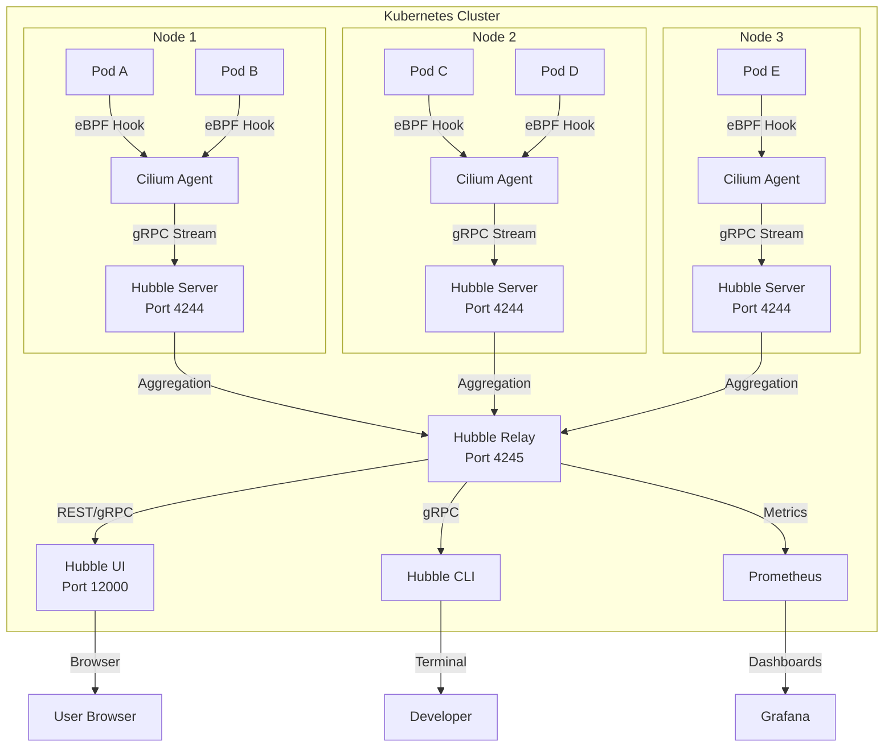

## 1.3 eBPF Data Collection Principle

Hubble's data collection relies entirely on eBPF, without requiring any sidecar:

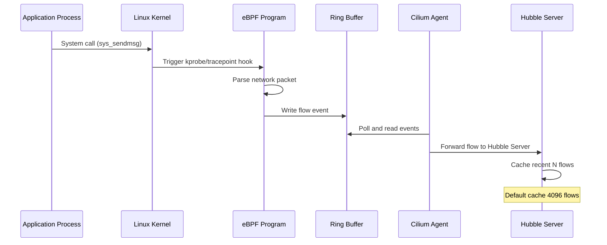

## 1.4 Comparison with Traditional Solutions

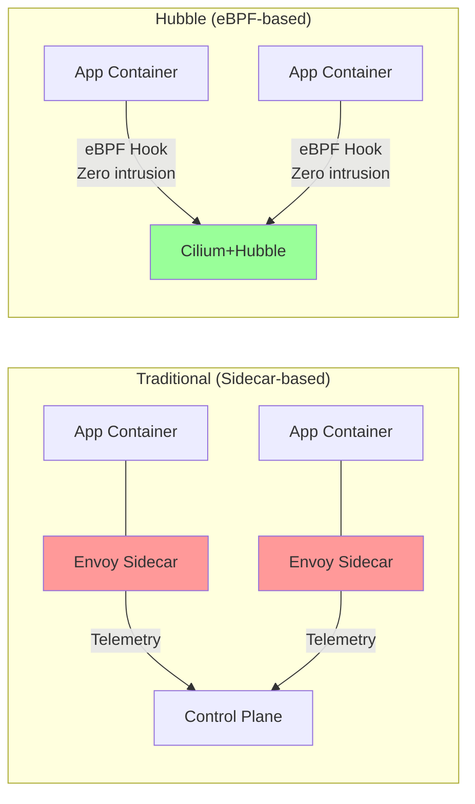

**Performance Comparison:**

| Solution | CPU Overhead | Memory Overhead | Latency Impact | Code Modification |
|------|---------|---------|---------|---------|
| Sidecar (Envoy) | High (~15%) | High (~50MB/pod) | Yes (~1ms) | No |
| eBPF (Hubble) | Very Low (~1%) | Low (~5MB/node) | Nearly None | No |
| Manual Instrumentation | None | None | None | **Required** |

---

<!-- chunk: 2. Hubble Components in Depth -->## 2. Hubble Components in Depth

## 2.1 Hubble Server (Per-Node Component)

Hubble Server runs as an embedded component of the Cilium Agent on each node, responsible for collecting raw flow data from eBPF.

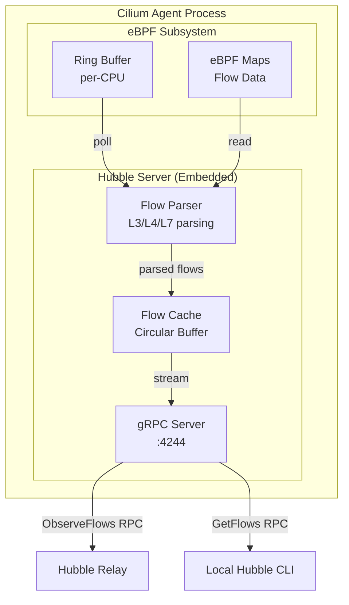

**Hubble Server Configuration Parameters:**

```yaml
# cilium-config ConfigMap configuration
apiVersion: v1
kind: ConfigMap
metadata:
  name: cilium-config
  namespace: kube-system
data:
  # Enable Hubble
  enable-hubble: "true"
  
  # Hubble Server listen address
  hubble-listen-address: ":4244"
  
  # Flow cache size (Ring Buffer capacity)
  hubble-flow-buffer-size: "4096"
  
  # metrics configuration
  hubble-metrics-server: ":9965"
  hubble-metrics: >-
    dns:query;ignoreAAAA
    drop
    tcp
    flow
    icmp
    http
  
  # TLS configuration
  hubble-tls-cert-file: /var/lib/cilium/tls/hubble/server.crt
  hubble-tls-key-file: /var/lib/cilium/tls/hubble/server.key
  hubble-tls-client-ca-files: /var/lib/cilium/tls/hubble/client-ca.crt
```

**Flow Buffer Tuning:**

> ⚠️ **🟡 Medium-risk change** — Modifies cluster resource state, recommend --dry-run or diff to confirm
> - `helm upgrade/install`: Deploy/upgrade release
> - `kubectl exec`: Enter container to execute commands, may change container state

``` bash
# 🟡 Medium risk: Modifies cluster/resource state, confirm target, impact scope and authorization before executing
# Check current Hubble Server status
kubectl exec -n kube-system ds/cilium -- hubble status

# Example output:
# Current/Max Flows:    4096/4096 (100.00%)
# Flows/s:              127.3
# Connected Nodes:      3/3

# Adjust flow buffer size (recommend increasing for high-traffic environments)
helm upgrade cilium cilium/cilium \
  --set hubble.enabled=true \
  --set hubble.bufferSize=16384
```
## 2.2 Hubble Relay (Cluster Aggregation Component)

Hubble Relay is an independently deployed service responsible for aggregating data streams from all node Hubble Servers, providing a unified cluster-level view.

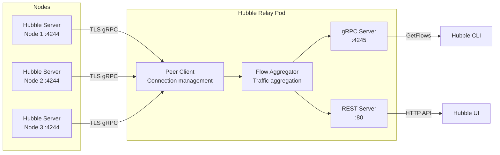

**Hubble Relay Deployment Configuration:**

```yaml
apiVersion: apps/v1
kind: Deployment
metadata:
  name: hubble-relay
  namespace: kube-system
spec:
  replicas: 1
  selector:
    matchLabels:
      k8s-app: hubble-relay
  template:
    metadata:
      labels:
        k8s-app: hubble-relay
    spec:
      containers:
      - name: hubble-relay
        image: quay.io/cilium/hubble-relay:v1.15.0
        args:
        - serve
        - --peer-service=unix:///var/run/cilium/hubble.sock
        - --listen-client-urls=0.0.0.0:4245
        ports:
        - containerPort: 4245
          name: grpc
        volumeMounts:
        - mountPath: /var/run/cilium
          name: hubble-sock-dir
          readOnly: true
        - mountPath: /var/lib/hubble-relay/tls
          name: tls
          readOnly: true
        resources:
          requests:
            cpu: 100m
            memory: 64Mi
          limits:
            cpu: 1000m
            memory: 512Mi
      volumes:
      - name: hubble-sock-dir
        hostPath:
          path: /var/run/cilium
          type: Directory
      - name: tls
        projected:
          sources:
          - secret:
              name: hubble-relay-client-certs
```

**Relay Service Exposure:**

```yaml
apiVersion: v1
kind: Service
metadata:
  name: hubble-relay
  namespace: kube-system
  labels:
    k8s-app: hubble-relay
spec:
  selector:
    k8s-app: hubble-relay
  ports:
  - name: grpc
    port: 80
    targetPort: 4245
    protocol: TCP
  type: ClusterIP
```

## 2.3 Hubble UI (Visualization Interface)

Hubble UI is a React-based frontend application that fetches data from Hubble Relay and provides intuitive service dependency graphs and traffic analysis interfaces.

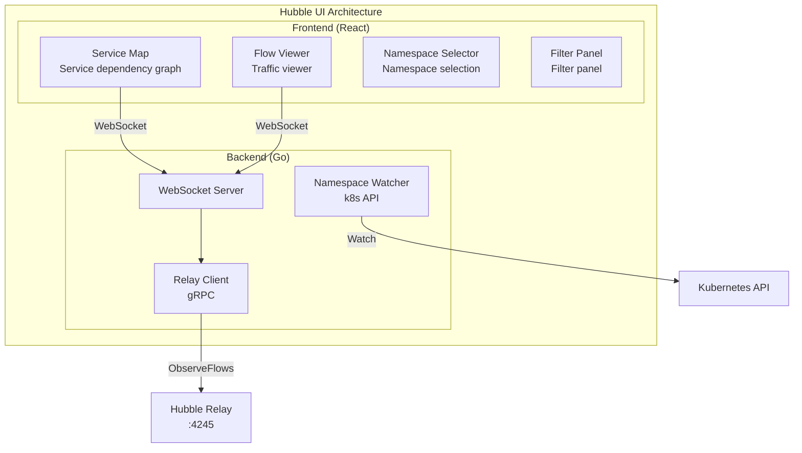

**Hubble UI Deployment:**

```yaml
# Helm values.yaml configuration
hubble:
  ui:
    enabled: true
    replicas: 1
    
    # Backend configuration
    backend:
      image:
        repository: quay.io/cilium/hubble-ui-backend
        tag: v0.13.0
      resources:
        limits:
          cpu: 1000m
          memory: 1024M
        requests:
          cpu: 100m
          memory: 64Mi
    
    # Frontend configuration
    frontend:
      image:
        repository: quay.io/cilium/hubble-ui
        tag: v0.13.0
      resources:
        limits:
          cpu: 1000m
          memory: 1024M
        requests:
          cpu: 100m
          memory: 64Mi
    
    # Ingress configuration
    ingress:
      enabled: true
      className: nginx
      hosts:
      - host: hubble.example.com
        paths:
        - path: /
          pathType: Prefix
      tls:
      - secretName: hubble-ui-tls
        hosts:
        - hubble.example.com
```

**Accessing Hubble UI:**

> ⚠️ **🟡 Medium-risk change** — Modifies cluster resource state, recommend --dry-run or diff to confirm
> - `kubectl edit/patch`: Modify running resources

``` bash
# 🟡 Medium risk: Modifies cluster/resource state, confirm target, impact scope and authorization before executing
# Method 1: Port Forward
kubectl port-forward -n kube-system svc/hubble-ui 12000:80 &
open http://localhost:12000

# Method 2: Via cilium CLI
cilium hubble ui

# Method 3: NodePort
kubectl patch svc hubble-ui -n kube-system \
  -p '{"spec":{"type":"NodePort","ports":[{"port":80,"nodePort":30080}]}}'
```
## 2.4 Hubble CLI (Command-Line Tool)

Hubble CLI is a powerful command-line tool supporting real-time traffic observation and historical traffic queries.

**Installing Hubble CLI:**

```bash
# macOS
brew install hubble

# Linux (amd64)
HUBBLE_VERSION=$(curl -s https://raw.githubusercontent.com/cilium/hubble/master/stable.txt)
HUBBLE_ARCH=amd64
curl -L --fail --remote-name-all \
  https://github.com/cilium/hubble/releases/download/$HUBBLE_VERSION/hubble-linux-${HUBBLE_ARCH}.tar.gz
tar xzvf hubble-linux-${HUBBLE_ARCH}.tar.gz
sudo mv hubble /usr/local/bin

# Verify installation
hubble version
```

**CLI Basic Usage:**

``` bash
# 🟡 Medium risk: Modifies cluster/resource state, confirm target, impact scope and authorization before executing
# Configure Hubble CLI connection
export HUBBLE_SERVER=localhost:4245

# Or via port-forward
kubectl port-forward -n kube-system svc/hubble-relay 4245:80 &

# Check Hubble status
hubble status
# Current/Max Flows:    4096/4096 (100.00%)
# Flows/s:              98.7
# Connected Nodes:      5/5
# Unavailable Nodes:    0

# Observe all traffic
hubble observe

# Follow traffic in real-time (like tail -f)
hubble observe --follow

# Filter by namespace
hubble observe --namespace default

# Filter by pod
hubble observe --pod frontend-xxx

# Filter by protocol
hubble observe --protocol http
hubble observe --protocol tcp

# Filter by label
hubble observe --label app=frontend

# View denied traffic
hubble observe --verdict DROPPED
hubble observe --verdict DENIED

# View HTTP traffic details
hubble observe --protocol http -o json | jq '.flow.l7.http'

# Control output format
hubble observe -o json       # JSON format
hubble observe -o dict       # Dictionary format
hubble observe -o compact    # Compact format (default)
hubble observe -o table      # Table format
```
**Advanced Filtering Examples:**

```bash
# View traffic between specific services
hubble observe \
  --from-label app=frontend \
  --to-label app=backend \
  --follow

# View traffic for specific IP
hubble observe --ip 10.0.0.100

# View DNS queries
hubble observe --protocol DNS

# View HTTP errors (4xx/5xx)
hubble observe --http-status-code 5 --protocol http

# Time range query
hubble observe --since 5m
hubble observe --until 2024-01-01T12:00:00

# Output to file
hubble observe --namespace production -o json > flows.json

# Statistics on traffic
hubble observe --namespace default --print-node-name --follow | \
  awk '{print $3}' | sort | uniq -c | sort -rn
```

---

<!-- chunk: 3. L3/L4/L7 Traffic Visualization -->## 3. L3/L4/L7 Traffic Visualization

## 3.1 Traffic Layer Model

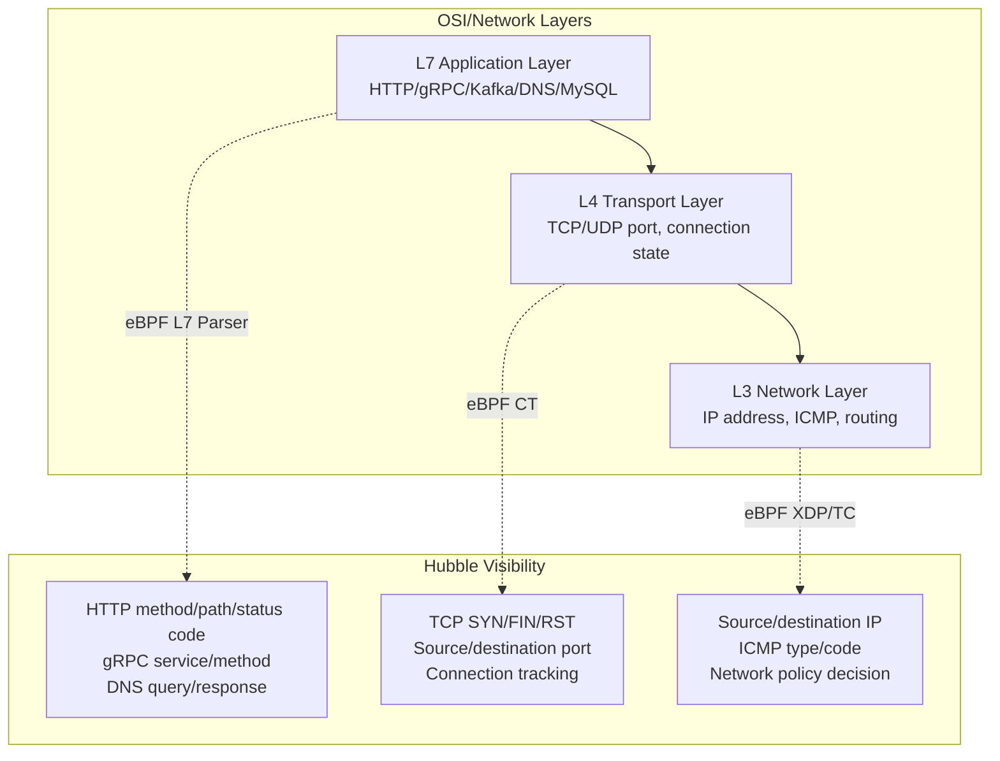

## 3.2 L3/L4 Flow Observation

```bash
# View TCP connection establishment
hubble observe --type trace --protocol tcp

# Typical output:
# Jan  1 10:00:01.000: default/frontend-xxx:41234 -> default/backend-yyy:8080
#   TCP Flags: SYN

# View network layer traffic
hubble observe --type trace:to-endpoint --protocol icmp

# View UDP traffic (DNS)
hubble observe --protocol udp --port 53

# View rejected connections
hubble observe --verdict DROPPED -o json | jq '{
  src: .flow.source.pod_name,
  dst: .flow.destination.pod_name,
  reason: .flow.drop_reason
}'
```

**L3/L4 Flow JSON Structure:**

```json
{
  "flow": {
    "time": "2024-01-01T10:00:01.000000000Z",
    "verdict": "FORWARDED",
    "ethernet": {
      "source": "aa:bb:cc:dd:ee:01",
      "destination": "aa:bb:cc:dd:ee:02"
    },
    "IP": {
      "source": "10.0.0.1",
      "destination": "10.0.0.2",
      "ipVersion": "IPv4"
    },
    "l4": {
      "TCP": {
        "source_port": 41234,
        "destination_port": 8080,
        "flags": {
          "SYN": true
        }
      }
    },
    "source": {
      "ID": 1234,
      "identity": 12345,
      "namespace": "default",
      "labels": ["app=frontend", "version=v1"],
      "pod_name": "frontend-xxx-yyy"
    },
    "destination": {
      "ID": 5678,
      "identity": 67890,
      "namespace": "default",
      "labels": ["app=backend", "version=v2"],
      "pod_name": "backend-aaa-bbb"
    },
    "Type": "L3_L4",
    "node_name": "node-1",
    "event_type": {
      "type": 4,
      "sub_type": 0
    }
  }
}
```

## 3.3 L7 Flow Observation

L7 visibility needs to be explicitly enabled in Cilium network policies:

```yaml
# Enable L7 HTTP visibility via CiliumNetworkPolicy
apiVersion: cilium.io/v2
kind: CiliumNetworkPolicy
metadata:
  name: l7-visibility-frontend
  namespace: default
spec:
  endpointSelector:
    matchLabels:
      app: frontend
  egress:
  - toEndpoints:
    - matchLabels:
        app: backend
    toPorts:
    - ports:
      - port: "8080"
        protocol: TCP
      rules:
        http:
        - method: "GET"
          path: "/api/.*"
```

**Or use CiliumClusterwideNetworkPolicy to globally enable L7 visibility:**

```yaml
# Global L7 visibility via annotation (recommended for production)
apiVersion: v1
kind: Pod
metadata:
  name: frontend
  annotations:
    # Enable L7 HTTP visibility for all egress
    policy.cilium.io/proxy-visibility: "<Egress/8080/TCP/HTTP>"
spec:
  containers:
  - name: frontend
    image: nginx:latest
```

**L7 HTTP Traffic Observation:**

```bash
# Observe HTTP traffic
hubble observe --protocol http --follow

# Typical output:
# Jan  1 10:00:01.000: default/frontend -> default/backend:8080
#   HTTP/1.1 GET /api/users -> 200 OK (3ms)

# View HTTP details in JSON format
hubble observe --protocol http -o json | jq '.flow.l7.http | {
  method: .method,
  url: .url,
  status: .code,
  headers: .headers
}'

# View HTTP errors
hubble observe --protocol http \
  --http-method GET \
  --verdict FORWARDED \
  -o json | jq 'select(.flow.l7.http.code >= 500)'
```

**L7 HTTP Flow JSON Structure:**

```json
{
  "flow": {
    "verdict": "FORWARDED",
    "l7": {
      "type": "REQUEST",
      "latency_ns": 3000000,
      "http": {
        "code": 200,
        "method": "GET",
        "url": "http://backend:8080/api/users",
        "protocol": "HTTP/1.1",
        "headers": [
          {"key": "Content-Type", "value": "application/json"},
          {"key": "X-Request-ID", "value": "abc-123"}
        ]
      }
    },
    "is_reply": false,
    "Type": "L7"
  }
}
```

## 3.4 gRPC Flow Observation

```yaml
# Enable gRPC L7 visibility
apiVersion: cilium.io/v2
kind: CiliumNetworkPolicy
metadata:
  name: grpc-visibility
  namespace: microservices
spec:
  endpointSelector:
    matchLabels:
      app: grpc-client
  egress:
  - toEndpoints:
    - matchLabels:
        app: grpc-server
    toPorts:
    - ports:
      - port: "50051"
        protocol: TCP
      rules:
        http:  # gRPC is based on HTTP/2
        - method: "POST"
          path: "/.*"
```

```bash
# Observe gRPC traffic
hubble observe --protocol grpc -o json | jq '.flow.l7.http | {
  service: (.url | split("/")[1]),
  method: (.url | split("/")[2]),
  status: .code
}'

# Typical gRPC flow output example:
# grpc-client -> grpc-server:50051
# POST /helloworld.Greeter/SayHello -> 0 (gRPC OK) (5ms)
```

## 3.5 DNS Flow Observation

```bash
# Observe all DNS queries
hubble observe --protocol dns --follow

# Typical output:
# Jan  1 10:00:01.000: default/frontend -> kube-system/kube-dns:53
#   DNS Query backend.default.svc.cluster.local. A

# Jan  1 10:00:01.001: kube-system/kube-dns -> default/frontend
#   DNS Response backend.default.svc.cluster.local. A 10.96.0.100

# View DNS response failures (NXDOMAIN)
hubble observe --protocol dns -o json | \
  jq 'select(.flow.l7.dns.rcode != null and .flow.l7.dns.rcode != 0) | {
    query: .flow.l7.dns.query,
    rcode: .flow.l7.dns.rcode,
    pod: .flow.source.pod_name
  }'
```

---

<!-- chunk: 4. Service Map and Dependency Graphs -->## 4. Service Map and Dependency Graphs

## 4.1 Service Map Concept

Service Map is a core feature of Hubble UI, automatically building service topology graphs from real-time traffic without manual configuration.

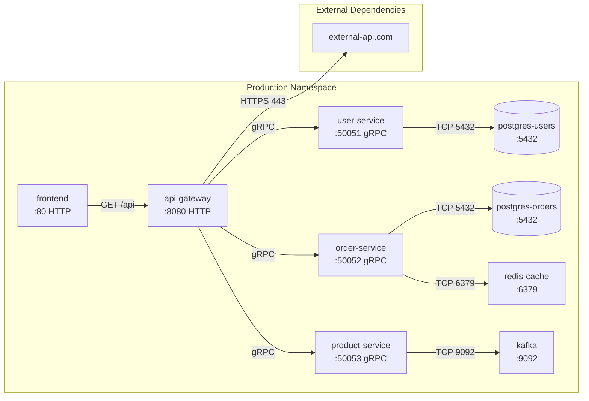

## 4.2 Hubble UI Service Map Operations

**Namespace Selector:**

```
Hubble UI Interface Workflow:
┌─────────────────────────────────────────────┐
│  Namespace: [production ▼]  [Refresh]       │
├─────────────────────────────────────────────┤
│                                             │
│    [frontend] ──────► [api-gateway]         │
│                            │                │
│                    ┌───────┼───────┐        │
│                    ▼       ▼       ▼        │
│               [user-svc] [order] [product]  │
│                    │       │               │
│                   [pg]   [pg] [redis]      │
│                                             │
├─────────────────────────────────────────────┤
│  Flow Details: frontend → api-gateway       │
│  HTTP GET /api/orders 200 OK (2ms)         │
└─────────────────────────────────────────────┘
```

## 4.3 CLI Dependency Analysis

```bash
# Extract inter-service communication relationships
hubble observe \
  --namespace production \
  --since 1h \
  -o json | \
  jq -r '[.flow.source.workload.name, .flow.destination.workload.name] | @csv' | \
  sort | uniq -c | sort -rn | head -20

# Example output:
# 1523 "frontend","api-gateway"
#  892 "api-gateway","user-service"
#  756 "api-gateway","order-service"
#  445 "order-service","postgres-orders"
#  312 "order-service","redis-cache"

# Generate DOT format dependency graph
hubble observe --namespace production --since 1h -o json | \
  jq -r '"\"" + .flow.source.workload.name + "\" -> \"" + 
         .flow.destination.workload.name + "\""' | \
  sort | uniq | \
  awk 'BEGIN{print "digraph G {"} {print "  " $0} END{print "}"}'

# Save as graph.dot, then:
dot -Tpng graph.dot -o service-map.png
```

## 4.4 Service Latency Analysis

```bash
# Analyze HTTP request latency distribution
hubble observe \
  --namespace production \
  --protocol http \
  --from-label app=api-gateway \
  --since 30m \
  -o json | \
  jq 'select(.flow.l7.http.code != null) | {
    service: .flow.destination.workload.name,
    latency_ms: (.flow.l7.latency_ns / 1000000),
    status: .flow.l7.http.code
  }' | \
  jq -s 'group_by(.service) | map({
    service: .[0].service,
    count: length,
    avg_ms: (map(.latency_ms) | add / length),
    p95_ms: (sort_by(.latency_ms) | .[length * 0.95 | floor].latency_ms),
    errors: map(select(.status >= 500)) | length
  })'
```

---

<!-- chunk: 5. Network Policy Visualization -->## 5. Network Policy Visualization

## 5.1 Policy Decision Visualization

Hubble displays policy decision results for each network flow in real-time:

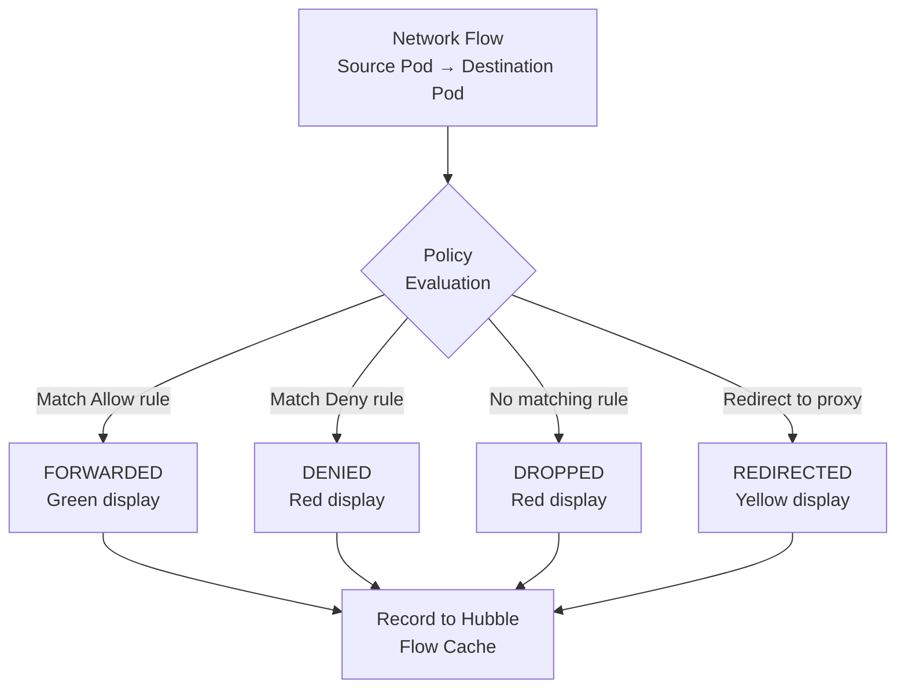

```bash
# View all denied traffic
hubble observe --verdict DROPPED --verdict DENIED --follow

# View denied traffic by namespace
hubble observe \
  --namespace production \
  --verdict DROPPED \
  -o json | \
  jq '{
    time: .flow.time,
    src: .flow.source.pod_name,
    dst: .flow.destination.pod_name,
    dst_port: .flow.l4.TCP.destination_port,
    drop_reason: .flow.drop_reason_desc
  }'

# Count top 10 denied flows
hubble observe --verdict DROPPED --since 1h -o json | \
  jq -r '[.flow.source.pod_name, .flow.destination.pod_name, 
          (.flow.l4.TCP.destination_port | tostring)] | join(" -> ")' | \
  sort | uniq -c | sort -rn | head -10
```

## 5.2 Policy Visualization Configuration

```yaml
# Enable audit mode (policy violations visible but not blocked)
apiVersion: cilium.io/v2
kind: CiliumClusterwideNetworkPolicy
metadata:
  name: audit-mode-policy
spec:
  endpointSelector: {}
  ingress:
  - fromEntities:
    - cluster
  policyAuditMode: true  # Record only, do not block
```

```bash
# View traffic "violating" in audit mode
hubble observe --verdict AUDIT -o json | \
  jq '{
    src: .flow.source.pod_name,
    dst: .flow.destination.pod_name,
    policy: .flow.policy_match_type
  }'
```

## 5.3 Policy Inference

```bash
# Automatically infer network policies based on observed traffic
# Use hubble observe + network-policy-editor

# Step 1: Collect actual traffic
hubble observe \
  --namespace production \
  --verdict FORWARDED \
  --since 24h \
  -o json > production-flows.json

# Step 2: Analyze which communications need to be allowed
cat production-flows.json | \
  jq -r '{
    src_ns: .flow.source.namespace,
    src_label: (.flow.source.labels | map(select(startswith("app="))) | .[0]),
    dst_ns: .flow.destination.namespace,
    dst_label: (.flow.destination.labels | map(select(startswith("app="))) | .[0]),
    dst_port: (.flow.l4.TCP.destination_port // .flow.l4.UDP.destination_port)
  }' | \
  jq -s 'unique_by([.src_label, .dst_label, .dst_port])'
```

## 5.4 Visual Policy Validation

```yaml
# Test traffic changes before and after network policy
apiVersion: cilium.io/v2
kind: CiliumNetworkPolicy
metadata:
  name: frontend-to-backend-only
  namespace: production
spec:
  endpointSelector:
    matchLabels:
      app: backend
  ingress:
  - fromEndpoints:
    - matchLabels:
        app: frontend
    toPorts:
    - ports:
      - port: "8080"
        protocol: TCP
```

> ⚠️ **🟡 Medium-risk change** — Modifies cluster resource state, recommend --dry-run or diff to confirm
> - `kubectl exec`: Enter container to execute commands, may change container state

``` bash
# 🟡 Medium risk: Modifies cluster/resource state, confirm target, impact scope and authorization before executing
# Validate policy effect: Access from frontend to backend should succeed
kubectl exec -n production deploy/frontend -- \
  curl -s http://backend:8080/health

# Validate policy effect: Access from other-service to backend should fail
kubectl exec -n production deploy/other-service -- \
  curl -s --max-time 3 http://backend:8080/health

# Verify in Hubble
hubble observe \
  --from-label app=frontend \
  --to-label app=backend \
  --verdict FORWARDED

hubble observe \
  --from-label app=other-service \
  --to-label app=backend \
  --verdict DROPPED
```
---

<!-- chunk: 6. Prometheus Metrics Export -->## 6. Prometheus Metrics Export

## 6.1 Hubble Metrics Overview

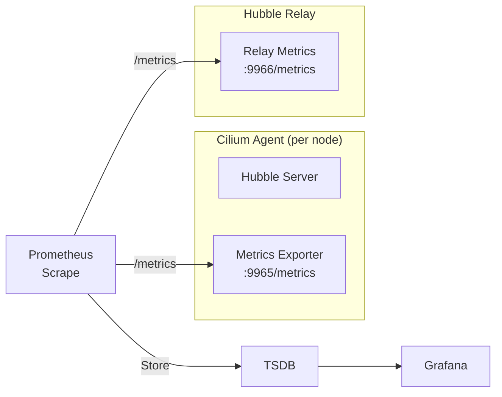

## 6.2 Enable Hubble Metrics

```yaml
# Helm values.yaml
hubble:
  metrics:
    enabled: true
    port: 9965
    serviceMonitor:
      enabled: true  # Automatically create ServiceMonitor
      labels:
        prometheus: kube-prometheus  # Match Prometheus Operator
    
    # Enable metrics list
    enableOpenMetrics: true
    
    config: |
      - name: dns
        includeFilters:
        - source_pod: ["{namespace}/{pod}"]
        denyFilters:
        - source_pod: ["kube-system/.*"]
        fieldMask:
        - source
        - destination
        - verdict
        
      - name: drop
        
      - name: tcp
        
      - name: flow
        includeFilters:
        - source_pod: ["production/.*"]
        
      - name: icmp
      
      - name: http
        includeFilters:
        - source_pod: ["production/.*"]
        labelsContext:
        - source_namespace
        - source_pod
        - destination_namespace
        - destination_pod
        - traffic_direction
```

## 6.3 Core Metrics Reference

**Traffic Metrics:**

```promql
# HTTP request total (by namespace, status code)
hubble_http_requests_total{
  namespace="production",
  status="200"
}

# HTTP request latency histogram
histogram_quantile(0.99,
  sum(rate(hubble_http_request_duration_seconds_bucket{
    namespace="production"
  }[5m])) by (le, destination)
)

# HTTP error rate
sum(rate(hubble_http_requests_total{status=~"5.."}[5m]))
  by (namespace, destination)
/
sum(rate(hubble_http_requests_total[5m]))
  by (namespace, destination)
```

**Network Policy Metrics:**

```promql
# Total dropped packets
sum(rate(hubble_drop_total[5m])) by (namespace, direction, reason)

# TCP connection state
hubble_tcp_flags_total{flag="SYN"} # New connections
hubble_tcp_flags_total{flag="RST"} # Connection resets (possible issue)

# DNS query statistics
sum(rate(hubble_dns_queries_total[5m])) by (namespace, qtypes)
sum(rate(hubble_dns_responses_total{rcode="Non-Existent Domain"}[5m])) 
  by (namespace) # NXDOMAIN errors
```

**Flows Metrics:**

```promql
# Flow events per second
rate(hubble_flows_processed_total[1m])

# Flows grouped by verdict
sum(rate(hubble_flows_processed_total[5m])) 
  by (verdict, protocol, direction)

# Hubble Ring Buffer utilization
hubble_drop_total / hubble_flows_processed_total
```

## 6.4 ServiceMonitor Configuration

```yaml
apiVersion: monitoring.coreos.com/v1
kind: ServiceMonitor
metadata:
  name: hubble-metrics
  namespace: monitoring
  labels:
    prometheus: kube-prometheus
spec:
  selector:
    matchLabels:
      k8s-app: cilium
  namespaceSelector:
    matchNames:
    - kube-system
  endpoints:
  - port: hubble-metrics
    path: /metrics
    interval: 30s
    honorLabels: true
    relabelings:
    - sourceLabels: [__meta_kubernetes_pod_node_name]
      targetLabel: node
      action: replace
---
apiVersion: monitoring.coreos.com/v1
kind: ServiceMonitor
metadata:
  name: hubble-relay-metrics
  namespace: monitoring
spec:
  selector:
    matchLabels:
      k8s-app: hubble-relay
  namespaceSelector:
    matchNames:
    - kube-system
  endpoints:
  - port: metrics
    path: /metrics
    interval: 30s
```

## 6.5 Alerting Rules

```yaml
apiVersion: monitoring.coreos.com/v1
kind: PrometheusRule
metadata:
  name: hubble-alerts
  namespace: monitoring
spec:
  groups:
  - name: hubble.network
    interval: 30s
    rules:
    
    # High drop rate alert
    - alert: HighNetworkDropRate
      expr: |
        sum(rate(hubble_drop_total[5m])) by (namespace) 
        / 
        sum(rate(hubble_flows_processed_total[5m])) by (namespace) > 0.05
      for: 5m
      labels:
        severity: warning
      annotations:
        summary: "Namespace {{ $labels.namespace }} network drop rate exceeds 5%"
        description: "Current drop rate: {{ $value | humanizePercentage }}"
    
    # HTTP error rate alert
    - alert: HighHTTPErrorRate
      expr: |
        sum(rate(hubble_http_requests_total{status=~"5.."}[5m])) 
          by (namespace, destination)
        /
        sum(rate(hubble_http_requests_total[5m])) 
          by (namespace, destination) > 0.01
      for: 3m
      labels:
        severity: critical
      annotations:
        summary: "Service {{ $labels.destination }} HTTP 5xx error rate exceeds 1%"
    
    # Hubble node connection lost
    - alert: HubbleNodeNotConnected
      expr: |
        hubble_relay_nodes_available != hubble_relay_nodes_expected
      for: 2m
      labels:
        severity: warning
      annotations:
        summary: "Hubble Relay partial node connection lost"
    
    # High DNS failure rate
    - alert: HighDNSFailureRate
      expr: |
        sum(rate(hubble_dns_responses_total{rcode!="No Error"}[5m]))
          by (namespace)
        /
        sum(rate(hubble_dns_queries_total[5m]))
          by (namespace) > 0.1
      for: 5m
      labels:
        severity: warning
      annotations:
        summary: "Namespace {{ $labels.namespace }} DNS failure rate exceeds 10%"
```

---

<!-- chunk: 7. Hubble Deployment and Configuration (Helm) -->## 7. Hubble Deployment and Configuration (Helm)

## 7.1 Minimal Deployment

> ⚠️ **🟡 Medium-risk change** — Modifies cluster resource state, recommend --dry-run or diff to confirm
> - `helm upgrade/install`: Deploy/upgrade release

``` bash
# 🟡 Medium risk: Modifies cluster/resource state, confirm target, impact scope and authorization before executing
# Add Cilium Helm repository
helm repo add cilium https://helm.cilium.io/
helm repo update

# Minimal deployment (enable Hubble Server + Relay only)
helm install cilium cilium/cilium \
  --namespace kube-system \
  --set hubble.enabled=true \
  --set hubble.relay.enabled=true \
  --set hubble.ui.enabled=false \
  --set hubble.metrics.enabled=true

# Verify deployment
kubectl -n kube-system get pods -l k8s-app=hubble-relay
kubectl -n kube-system get pods -l k8s-app=cilium
```
## 7.2 Full Production Configuration

```yaml
# hubble-production-values.yaml
hubble:
  enabled: true
  
  # Hubble Server (embedded in Cilium Agent)
  bufferSize: 16384          # Increase Ring Buffer
  listenAddress: ":4244"
  
  # TLS security configuration
  tls:
    enabled: true
    auto:
      enabled: true
      method: helm          # helm/cronJob/certmanager
    server:
      extraDnsNames:
      - "hubble-relay.kube-system.svc.cluster.local"
  
  # Relay configuration
  relay:
    enabled: true
    replicas: 2              # Production recommend 2 replicas
    
    resources:
      requests:
        cpu: 100m
        memory: 128Mi
      limits:
        cpu: 1000m
        memory: 1Gi
    
    affinity:
      podAntiAffinity:
        preferredDuringSchedulingIgnoredDuringExecution:
        - weight: 100
          podAffinityTerm:
            labelSelector:
              matchLabels:
                k8s-app: hubble-relay
            topologyKey: kubernetes.io/hostname
    
    # Relay service configuration
    service:
      type: ClusterIP
      port: 80
    
    # Dial timeout configuration
    dialTimeout: 5s
    retryTimeout: 30s
  
  # UI configuration
  ui:
    enabled: true
    replicas: 2
    
    backend:
      resources:
        requests:
          cpu: 50m
          memory: 64Mi
        limits:
          cpu: 500m
          memory: 512Mi
    
    frontend:
      resources:
        requests:
          cpu: 50m
          memory: 64Mi
        limits:
          cpu: 500m
          memory: 512Mi
    
    ingress:
      enabled: true
      annotations:
        kubernetes.io/ingress.class: nginx
        cert-manager.io/cluster-issuer: letsencrypt-prod
        nginx.ingress.kubernetes.io/auth-type: basic
        nginx.ingress.kubernetes.io/auth-secret: hubble-ui-auth
      hosts:
      - host: hubble.k8s.example.com
        paths:
        - path: /
          pathType: Prefix
      tls:
      - secretName: hubble-ui-tls
        hosts:
        - hubble.k8s.example.com
  
  # Metrics configuration
  metrics:
    enabled: true
    port: 9965
    
    serviceMonitor:
      enabled: true
      labels:
        release: prometheus
      interval: 30s
      scrapeTimeout: 10s
    
    # Detailed metrics configuration
    enableOpenMetrics: true
    
    config: |
      - name: dns
        denyFilters:
        - destination_pod: ["kube-system/coredns.*"]
      - name: drop
      - name: tcp
      - name: flow
      - name: port-distribution
      - name: icmp
      - name: httpV2
        labelsContext:
        - source_namespace
        - source_workload
        - destination_namespace
        - destination_workload
        - traffic_direction
        - protocol
```

> ⚠️ **🟡 Medium-risk change** — Modifies cluster resource state, recommend --dry-run or diff to confirm
> - `helm upgrade/install`: Deploy/upgrade release

``` bash
# 🟡 Medium risk: Modifies cluster/resource state, confirm target, impact scope and authorization before executing
# Apply full configuration
helm upgrade --install cilium cilium/cilium \
  --namespace kube-system \
  -f hubble-production-values.yaml \
  --version 1.15.0

# Wait for all components to be ready
kubectl wait --for=condition=ready pod \
  -l k8s-app=cilium \
  -n kube-system \
  --timeout=120s

kubectl wait --for=condition=ready pod \
  -l k8s-app=hubble-relay \
  -n kube-system \
  --timeout=60s
```
## 7.3 TLS Certificate Management

> ⚠️ **🟡 Medium-risk change** — Modifies cluster resource state, recommend --dry-run or diff to confirm
> - `helm upgrade/install`: Deploy/upgrade release
> - `kubectl apply/create/replace`: Create/modify cluster resources

``` bash
# 🟡 Medium risk: Modifies cluster/resource state, confirm target, impact scope and authorization before executing
# Method 1: Helm auto-manage (suitable for small clusters)
helm upgrade cilium cilium/cilium \
  --set hubble.tls.enabled=true \
  --set hubble.tls.auto.enabled=true \
  --set hubble.tls.auto.method=helm

# Method 2: cert-manager management (recommended for production)
# First install cert-manager
kubectl apply -f https://github.com/cert-manager/cert-manager/releases/latest/download/cert-manager.yaml

helm upgrade cilium cilium/cilium \
  --set hubble.tls.enabled=true \
  --set hubble.tls.auto.enabled=true \
  --set hubble.tls.auto.method=certmanager \
  --set hubble.tls.auto.certManagerIssuerRef.group=cert-manager.io \
  --set hubble.tls.auto.certManagerIssuerRef.kind=ClusterIssuer \
  --set hubble.tls.auto.certManagerIssuerRef.name=ca-issuer

# Method 3: CronJob automatic rotation
helm upgrade cilium cilium/cilium \
  --set hubble.tls.enabled=true \
  --set hubble.tls.auto.enabled=true \
  --set hubble.tls.auto.method=cronJob \
  --set hubble.tls.auto.schedule="0 0 1 */4 *"  # Rotate every 4 months
```
## 7.4 Multi-Cluster Hubble Configuration

```yaml
# Cluster Mesh configuration (multi-cluster scenario)
# cluster1-values.yaml
cluster:
  name: cluster1
  id: 1

clustermesh:
  useAPIServer: true

hubble:
  relay:
    enabled: true
  
  # Cross-cluster flow aggregation
  export:
    static:
      enabled: true
      filePath: /var/run/cilium/hubble/events.log
      fieldMask:
      - time
      - source
      - destination
      - verdict
      - drop_reason
      allowList:
      - '{"verdict":["DROPPED","AUDIT"]}'
```

---

<!-- chunk: 8. Grafana Integration Dashboards -->## 8. Grafana Integration Dashboards

## 8.1 Grafana DataSource Configuration

```yaml
# Grafana DataSource ConfigMap
apiVersion: v1
kind: ConfigMap
metadata:
  name: grafana-datasources
  namespace: monitoring
  labels:
    grafana_datasource: "1"
data:
  prometheus.yaml: |
    apiVersion: 1
    datasources:
    - name: Prometheus
      type: prometheus
      url: http://prometheus-operated:9090
      access: proxy
      isDefault: true
      jsonData:
        timeInterval: 30s
        exemplarTraceIdDestinations:
        - name: traceID
          datasourceUid: tempo
```

## 8.2 Core Grafana Dashboards

**Network traffic overview dashboard panel configuration:**

```json
{
  "dashboard": {
    "title": "Hubble - Network Overview",
    "uid": "hubble-overview",
    "panels": [
      {
        "title": "Flows per second",
        "type": "stat",
        "targets": [{
          "expr": "sum(rate(hubble_flows_processed_total[1m]))",
          "legendFormat": "Flows/s"
        }]
      },
      {
        "title": "HTTP request success rate",
        "type": "gauge",
        "targets": [{
          "expr": "sum(rate(hubble_http_requests_total{status=~\"2..\"}[5m])) / sum(rate(hubble_http_requests_total[5m])) * 100",
          "legendFormat": "Success Rate %"
        }],
        "fieldConfig": {
          "defaults": {
            "min": 0,
            "max": 100,
            "thresholds": {
              "steps": [
                {"color": "red", "value": 0},
                {"color": "yellow", "value": 95},
                {"color": "green", "value": 99}
              ]
            }
          }
        }
      },
      {
        "title": "Network drop rate by namespace",
        "type": "timeseries",
        "targets": [{
          "expr": "sum(rate(hubble_drop_total[5m])) by (namespace)",
          "legendFormat": "{{namespace}}"
        }]
      },
      {
        "title": "HTTP latency P99 by service",
        "type": "timeseries",
        "targets": [{
          "expr": "histogram_quantile(0.99, sum(rate(hubble_http_request_duration_seconds_bucket[5m])) by (le, destination))",
          "legendFormat": "{{destination}} P99"
        }]
      },
      {
        "title": "DNS resolution failures by namespace",
        "type": "timeseries",
        "targets": [{
          "expr": "sum(rate(hubble_dns_responses_total{rcode!=\"No Error\"}[5m])) by (namespace, rcode)",
          "legendFormat": "{{namespace}} - {{rcode}}"
        }]
      },
      {
        "title": "TCP RST connection resets",
        "type": "timeseries",
        "targets": [{
          "expr": "sum(rate(hubble_tcp_flags_total{flag=\"RST\"}[5m])) by (namespace)",
          "legendFormat": "{{namespace}}"
        }]
      }
    ]
  }
}
```

## 8.3 Using Official Hubble Grafana Dashboard

> ⚠️ **🟡 Medium-risk change** — Modifies cluster resource state, recommend --dry-run or diff to confirm
> - `kubectl apply/create/replace`: Create/modify cluster resources
> - `kubectl edit/patch`: Modify running resources

``` bash
# 🟡 Medium risk: Modifies cluster/resource state, confirm target, impact scope and authorization before executing
# Import official Hubble Dashboard (ID: 16611)
# In Grafana UI: + > Import > Enter Dashboard ID: 16611

# Or import via ConfigMap
kubectl create configmap hubble-grafana-dashboard \
  --from-file=hubble-overview.json \
  -n monitoring \
  --dry-run=client -o yaml | \
  kubectl apply -f -

kubectl patch configmap hubble-grafana-dashboard \
  -n monitoring \
  --type merge \
  -p '{"metadata":{"labels":{"grafana_dashboard":"1"}}}'
```
## 8.4 Service-Level Dashboard

```yaml
# Grafana Dashboard for production namespace example
# Core PromQL queries:

# 1. Service HTTP error rate heatmap
sum by (source_workload, destination_workload) (
  rate(hubble_http_requests_total{
    source_namespace="production",
    status=~"5.."
  }[5m])
)

# 2. Inter-service latency matrix
histogram_quantile(0.95,
  sum by (le, source_workload, destination_workload) (
    rate(hubble_http_request_duration_seconds_bucket{
      source_namespace="production"
    }[5m])
  )
)

# 3. Service connection count
sum by (destination_workload) (
  hubble_tcp_flags_total{
    destination_namespace="production",
    flag="SYN"
  }
)

# 4. Drop reason distribution
sum by (drop_reason) (
  rate(hubble_drop_total{
    namespace="production"
  }[5m])
)
```

## 8.5 Kube-Prometheus-Stack Integration

> ⚠️ **🟡 Medium-risk change** — Modifies cluster resource state, recommend --dry-run or diff to confirm
> - `helm upgrade/install`: Deploy/upgrade release

``` bash
# 🟡 Medium risk: Modifies cluster/resource state, confirm target, impact scope and authorization before executing
# Complete deployment with kube-prometheus-stack + Cilium/Hubble

# 1. Deploy kube-prometheus-stack
helm install prometheus-stack \
  prometheus-community/kube-prometheus-stack \
  --namespace monitoring \
  --create-namespace \
  --set prometheus.prometheusSpec.serviceMonitorSelectorNilUsesHelmValues=false \
  --set prometheus.prometheusSpec.podMonitorSelectorNilUsesHelmValues=false

# 2. Deploy Cilium with Hubble metrics + ServiceMonitor
helm upgrade --install cilium cilium/cilium \
  --namespace kube-system \
  --set hubble.enabled=true \
  --set hubble.relay.enabled=true \
  --set hubble.metrics.enabled=true \
  --set hubble.metrics.serviceMonitor.enabled=true \
  --set hubble.metrics.serviceMonitor.labels.release=prometheus-stack

# 3. Verify ServiceMonitor is recognized by Prometheus
kubectl get servicemonitor -n kube-system
kubectl get prometheusrule -n monitoring
```
---

<!-- chunk: 9. Troubleshooting and Network Diagnostics -->## 9. Troubleshooting and Network Diagnostics

## 9.1 Diagnostic Workflow

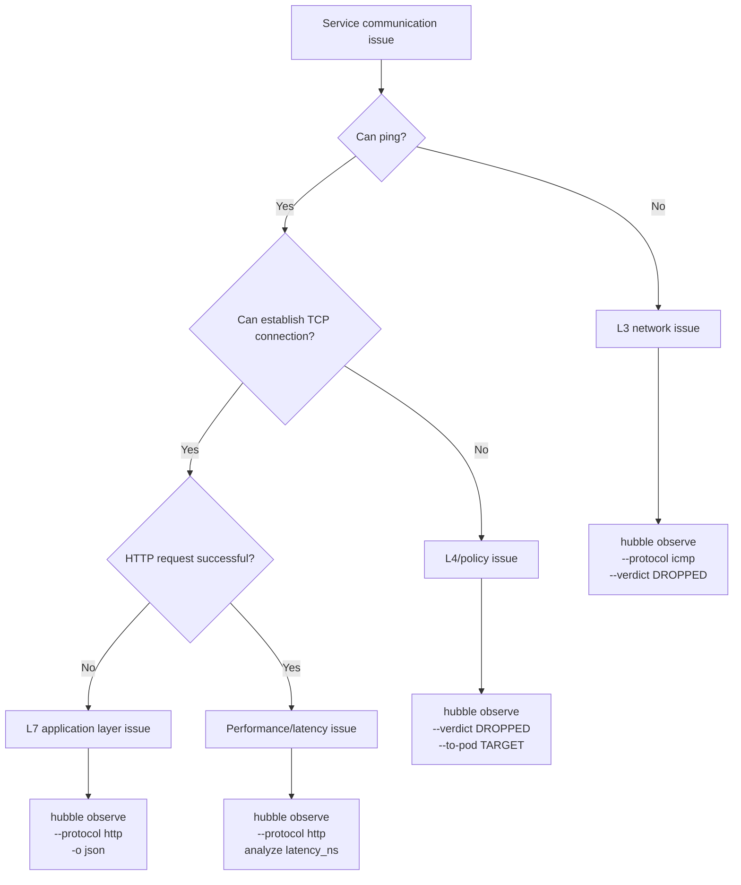

## 9.2 Common Issue Diagnosis

**Issue 1: Service Inaccessible**

```bash
# Step 1: Confirm if Hubble captured traffic
hubble observe \
  --from-pod default/client-pod \
  --to-pod default/server-pod \
  --follow

# If no output → network layer issue
# If has DROPPED → network policy issue

# Step 2: Check drop reason
hubble observe \
  --to-pod default/server-pod \
  --verdict DROPPED \
  -o json | jq '{
    time: .flow.time,
    src: .flow.source.pod_name,
    reason: .flow.drop_reason_desc,
    policy: .flow.traffic_direction
  }'

# Common drop_reason:
# - Policy denied  → Denied by network policy
# - Host unreachable → Routing issue
# - CT: Missing entry → Connection tracking issue
```

**Issue 2: Intermittent Timeouts**

```bash
# View TCP RST events
hubble observe \
  --namespace production \
  --protocol tcp \
  -o json | \
  jq 'select(.flow.l4.TCP.flags.RST == true) | {
    time: .flow.time,
    src: .flow.source.pod_name,
    dst: .flow.destination.pod_name,
    dst_port: .flow.l4.TCP.destination_port
  }'

# View HTTP 5xx errors
hubble observe \
  --namespace production \
  --protocol http \
  -o json | \
  jq 'select(.flow.l7.http.code >= 500) | {
    time: .flow.time,
    src: .flow.source.pod_name,
    dst: .flow.destination.pod_name,
    status: .flow.l7.http.code,
    path: .flow.l7.http.url,
    latency_ms: (.flow.l7.latency_ns / 1000000)
  }'
```

**Issue 3: DNS Resolution Failures**

```bash
# View DNS query failures
hubble observe \
  --namespace production \
  --protocol dns \
  -o json | \
  jq 'select(.flow.l7.dns.rcode != null and .flow.l7.dns.rcode != 0) | {
    time: .flow.time,
    pod: .flow.source.pod_name,
    query: .flow.l7.dns.query,
    rcode: .flow.l7.dns.rcode,
    qtypes: .flow.l7.dns.qtypes
  }'

# Common rcode:
# 0: No Error (success)
# 1: Format Error
# 2: Server Failure
# 3: Non-Existent Domain (NXDOMAIN)
# 5: Refused

# Count NXDOMAIN top 10 queries
hubble observe --protocol dns --since 1h -o json | \
  jq 'select(.flow.l7.dns.rcode == 3) | .flow.l7.dns.query' | \
  sort | uniq -c | sort -rn | head -10
```

## 9.3 Cilium Built-in Diagnostic Tools

> ⚠️ **🟡 Medium-risk change** — Modifies cluster resource state, recommend --dry-run or diff to confirm
> - `kubectl exec`: Enter container to execute commands, may change container state

``` bash
# 🟡 Medium risk: Modifies cluster/resource state, confirm target, impact scope and authorization before executing
# Use cilium CLI for diagnostics
# Install cilium CLI
curl -L --fail --remote-name-all \
  https://github.com/cilium/cilium-cli/releases/latest/download/cilium-linux-amd64.tar.gz
tar xzvf cilium-linux-amd64.tar.gz
sudo mv cilium /usr/local/bin

# Check overall Cilium status
cilium status --wait

# Diagnose specific pod connectivity
cilium connectivity test \
  --test-namespace default \
  --connect-timeout 10s

# View endpoint policies
kubectl exec -n kube-system ds/cilium -- \
  cilium endpoint list

# View policy rules for specific endpoint
ENDPOINT_ID=1234
kubectl exec -n kube-system ds/cilium -- \
  cilium endpoint get $ENDPOINT_ID -o json | \
  jq '.status.policy'

# View BPF connection tracking table
kubectl exec -n kube-system ds/cilium -- \
  cilium bpf ct list global | head -20

# Check identity information
kubectl exec -n kube-system ds/cilium -- \
  cilium identity list | grep "app=frontend"
```
## 9.4 Network Diagnostic Scripts

```bash
#!/bin/bash
# network-diagnose.sh - Quick network diagnostic script

NAMESPACE=${1:-default}
SRC_POD=${2}
DST_POD=${3}
DURATION=${4:-60}

echo "=== Hubble Network Diagnostic Report ==="
echo "Namespace: $NAMESPACE"
echo "Time range: ${DURATION}s"
echo ""

# 1. Overall traffic statistics
echo "--- 1. Overall Traffic Statistics ---"
hubble observe \
  --namespace $NAMESPACE \
  --since ${DURATION}s \
  -o json 2>/dev/null | \
  jq -r '.flow.verdict' | \
  sort | uniq -c

echo ""

# 2. Drop analysis
echo "--- 2. Drop Reason Analysis ---"
hubble observe \
  --namespace $NAMESPACE \
  --verdict DROPPED \
  --since ${DURATION}s \
  -o json 2>/dev/null | \
  jq -r '.flow.drop_reason_desc' | \
  sort | uniq -c | sort -rn | head -10

echo ""

# 3. HTTP error analysis
echo "--- 3. HTTP Error Analysis ---"
hubble observe \
  --namespace $NAMESPACE \
  --protocol http \
  --since ${DURATION}s \
  -o json 2>/dev/null | \
  jq 'select(.flow.l7.http.code >= 400) | 
    [.flow.source.workload.name, 
     .flow.destination.workload.name,
     (.flow.l7.http.code | tostring)] | join(" -> ")' | \
  sort | uniq -c | sort -rn | head -10

echo ""

# 4. DNS failure analysis
echo "--- 4. DNS Failed Queries ---"
hubble observe \
  --namespace $NAMESPACE \
  --protocol dns \
  --since ${DURATION}s \
  -o json 2>/dev/null | \
  jq 'select(.flow.l7.dns.rcode != null and .flow.l7.dns.rcode != 0) | 
    .flow.l7.dns.query' | \
  sort | uniq -c | sort -rn | head -10

echo ""
echo "=== Diagnostic Complete ==="
```

## 9.5 Common Errors and Solutions

| Error Symptom | Hubble Observation Command | Possible Cause | Solution |
|---------|--------------|---------|---------|
| Pod communication failure | `hubble observe --to-pod X --verdict DROPPED` | Network policy denial | Check and correct NetworkPolicy |
| Intermittent HTTP 503 | `hubble observe --protocol http -o json | jq 'select(.flow.l7.http.code==503)'` | Upstream service unavailable | Check target service health |
| Slow DNS resolution | `hubble observe --protocol dns -o json | jq '.flow.l7.latency_ns'` | CoreDNS overload | Increase CoreDNS replica count |
| Excessive TCP RST | `hubble observe --protocol tcp -o json | jq 'select(.flow.l4.TCP.flags.RST)'` | Connection timeout/kernel parameters | Adjust connection timeout config |
| Egress denied | `hubble observe --verdict DROPPED --traffic-direction EGRESS` | Egress policy too strict | Add necessary Egress rules |

---

<!-- chunk: 10. Enterprise Observability Practices -->## 10. Enterprise Observability Practices

## 10.1 Observability Maturity Model

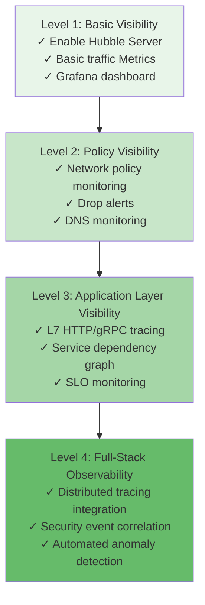

## 10.2 Production Environment Checklist

```yaml
# Production Hubble configuration best practices

# ✅ 1. High-availability Relay deployment
hubble:
  relay:
    replicas: 2
    podDisruptionBudget:
      enabled: true
      maxUnavailable: 1

# ✅ 2. Resource limit configuration
    resources:
      requests:
        cpu: 200m
        memory: 256Mi
      limits:
        cpu: 2000m
        memory: 2Gi

# ✅ 3. Increase Flow buffer (high-traffic environments)
  bufferSize: 32768

# ✅ 4. TLS encrypted communication
  tls:
    enabled: true
    auto:
      enabled: true
      method: certmanager

# ✅ 5. Complete Metrics configuration
  metrics:
    enabled: true
    serviceMonitor:
      enabled: true
    
    config: |
      - name: dns
      - name: drop
      - name: tcp
      - name: flow
      - name: httpV2
        labelsContext:
        - source_namespace
        - source_workload  
        - destination_namespace
        - destination_workload

# ✅ 6. Audit log export
  export:
    static:
      enabled: true
      filePath: /var/run/cilium/hubble/events.log
      allowList:
      - '{"verdict":["DROPPED","AUDIT"]}'
```

## 10.3 SLO Monitoring Configuration

```yaml
# SLO configuration based on Hubble Metrics
# Use Pyrra or Sloth tools to automatically generate SLO recording rules

# Example: production namespace API availability SLO
apiVersion: monitoring.coreos.com/v1
kind: PrometheusRule
metadata:
  name: hubble-slo-production
  namespace: monitoring
spec:
  groups:
  - name: slo.availability
    rules:
    # HTTP availability (5xx error rate < 1%)
    - record: slo:hubble_http_availability:ratio_rate5m
      expr: |
        1 - (
          sum(rate(hubble_http_requests_total{
            destination_namespace="production",
            status=~"5.."
          }[5m]))
          /
          sum(rate(hubble_http_requests_total{
            destination_namespace="production"
          }[5m]))
        )
    
    # HTTP latency SLO (P99 < 500ms)
    - record: slo:hubble_http_latency_p99:5m
      expr: |
        histogram_quantile(0.99,
          sum(rate(hubble_http_request_duration_seconds_bucket{
            destination_namespace="production"
          }[5m])) by (le)
        )
    
    # Alert: SLO violation
    - alert: ProductionSLOViolation
      expr: slo:hubble_http_availability:ratio_rate5m < 0.99
      for: 5m
      labels:
        severity: critical
        team: platform
      annotations:
        summary: "Production HTTP availability below 99% SLO"
        runbook: "https://wiki.internal/runbooks/slo-violation"
```

## 10.4 Multi-Tenant Observability

> ⚠️ **🟡 Medium-risk change** — Modifies cluster resource state, recommend --dry-run or diff to confirm
> - `kubectl apply/create/replace`: Create/modify cluster resources

``` bash
# 🟡 Medium risk: Modifies cluster/resource state, confirm target, impact scope and authorization before executing
# Isolate Hubble access permissions by team
# Use RBAC to control Hubble CLI access

# Create restricted Hubble access for dev-team
cat <<EOF | kubectl apply -f -
apiVersion: rbac.authorization.k8s.io/v1
kind: ClusterRole
metadata:
  name: hubble-observer-dev
rules:
- apiGroups: [""]
  resources: ["pods", "services", "namespaces"]
  verbs: ["get", "list", "watch"]
---
apiVersion: rbac.authorization.k8s.io/v1
kind: ClusterRoleBinding
metadata:
  name: hubble-observer-dev-binding
subjects:
- kind: Group
  name: dev-team
  apiGroup: rbac.authorization.k8s.io
roleRef:
  kind: ClusterRole
  name: hubble-observer-dev
  apiGroup: rbac.authorization.k8s.io
EOF

# dev-team can only observe traffic in their own namespace
hubble observe --namespace dev-namespace --follow
```
## 10.5 Distributed Tracing Integration

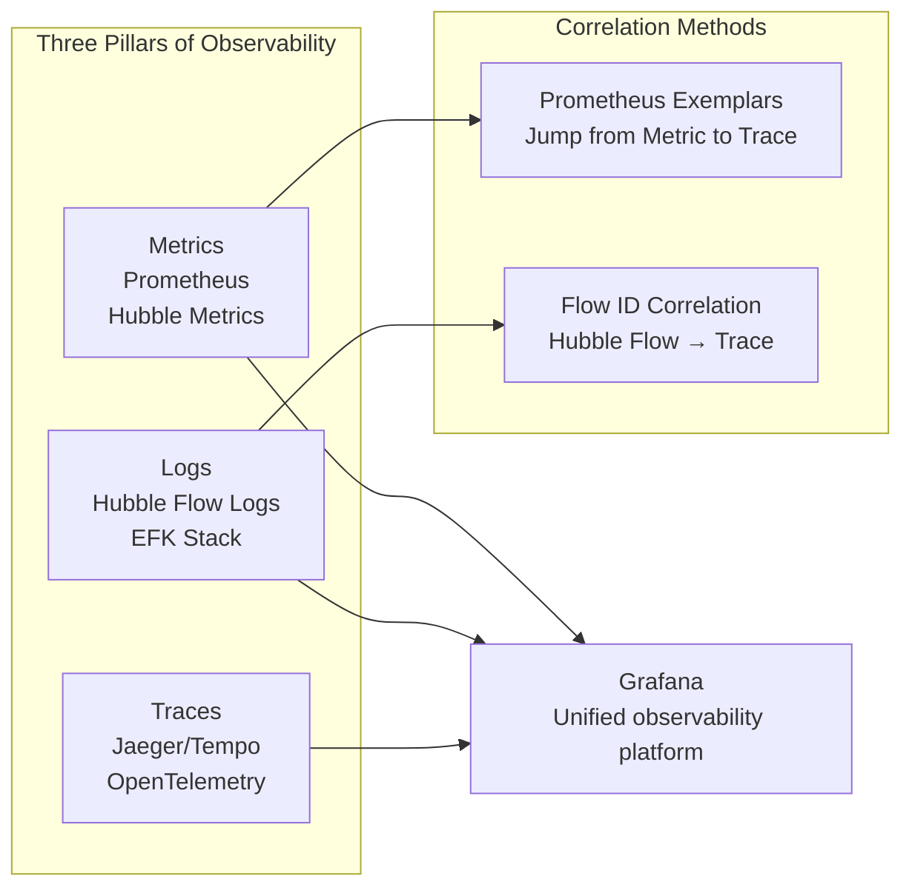

```yaml
# Export Hubble Flow logs to EFK
# Fluent Bit configuration to collect Hubble Flow logs
apiVersion: v1
kind: ConfigMap
metadata:
  name: fluent-bit-hubble
  namespace: kube-system
data:
  fluent-bit.conf: |
    [SERVICE]
        Flush     1
        
    [INPUT]
        Name              tail
        Path              /var/run/cilium/hubble/events.log
        Parser            json
        Tag               hubble.*
        DB                /var/log/flb_hubble.db
        
    [FILTER]
        Name              record_modifier
        Match             hubble.*
        Record            cluster ${CLUSTER_NAME}
        Record            log_type hubble_flow
        
    [OUTPUT]
        Name              es
        Match             hubble.*
        Host              elasticsearch-master
        Port              9200
        Index             hubble-flows
        Type              _doc
```

## 10.6 Capacity Planning Recommendations

> ⚠️ **🟡 Medium-risk change** — Modifies cluster resource state, recommend --dry-run or diff to confirm
> - `kubectl exec`: Enter container to execute commands, may change container state

``` bash
# 🟡 Medium risk: Modifies cluster/resource state, confirm target, impact scope and authorization before executing
# Guidelines for evaluating Hubble resource requirements

# 1. Estimate flows per second
# Typical: Each pod approximately 100-500 flows/s
# Formula: flows_per_second = pods * 300 (estimate)

# 2. Ring Buffer size
# bufferSize should hold ~10s of flows
# bufferSize = flows_per_second * 10

# 3. Relay memory
# Each active flow approximately 1KB
# relay_memory = peak_flows_per_second * 10 * 1KB

# 4. Prometheus storage
# Each metric series approximately 1-2 bytes per day
# Default retention 15 days
# hubble_series * 15 * 2 bytes

# Monitor Hubble's own resource usage
kubectl top pod -n kube-system -l k8s-app=cilium
kubectl top pod -n kube-system -l k8s-app=hubble-relay

# View Hubble internal statistics
kubectl exec -n kube-system ds/cilium -- hubble status --all-nodes
```
## 10.7 Security Hardening

```yaml
# Hubble security best practices

# 1. Enable mTLS
hubble:
  tls:
    enabled: true
    server:
      extraDnsNames:
      - "hubble-relay.kube-system.svc"
    
# 2. Restrict UI access
  ui:
    ingress:
      annotations:
        # Allow internal network only
        nginx.ingress.kubernetes.io/whitelist-source-range: "10.0.0.0/8"
        # Enable authentication
        nginx.ingress.kubernetes.io/auth-type: basic
        nginx.ingress.kubernetes.io/auth-secret: hubble-basic-auth

# 3. NetworkPolicy to protect Hubble Relay
---
apiVersion: networking.k8s.io/v1
kind: NetworkPolicy
metadata:
  name: hubble-relay-netpol
  namespace: kube-system
spec:
  podSelector:
    matchLabels:
      k8s-app: hubble-relay
  policyTypes:
  - Ingress
  ingress:
  - from:
    - podSelector:
        matchLabels:
          k8s-app: hubble-ui
    - namespaceSelector:
        matchLabels:
          kubernetes.io/metadata.name: monitoring
    ports:
    - protocol: TCP
      port: 4245

# 4. Sensitive data filtering
  export:
    static:
      allowList:
      # Export denied traffic only, not full content
      - '{"verdict":["DROPPED"]}'
      fieldMask:
      # Hide L7 layer data (may contain sensitive information)
      - time
      - source.namespace
      - destination.namespace
      - verdict
      - drop_reason
```

---

<!-- chunk: References -->## References

| Resource | Link |
|------|------|
| Hubble Official Documentation | https://docs.cilium.io/en/stable/observability/hubble/ |
| Hubble GitHub | https://github.com/cilium/hubble |
| Cilium Slack #hubble | https://cilium.io/slack |
| Grafana Dashboard (Official) | https://grafana.com/grafana/dashboards/16611 |
| Hubble API Proto | https://github.com/cilium/cilium/tree/master/api/v1 |
| eBPF Observability Blog | https://isovalent.com/blog/ |

---

*Document version: v1.0 | Applies to Cilium/Hubble version: >= 1.14 | Last updated: 2026-03-03*

---

<!-- chunk: Obsidian Related Documents -->## Obsidian Related Documents

- domain-35-ebpf-technology MOC
- [[domain-03-networking-traffic/README.md|Domain 03: eBPF Technology Stack]]
- Domain-35 eBPF Technology — Open Source Project Index
- eBPF Architecture Fundamentals and Program Types
- eBPF Map Types and Data Structures
- Cilium CNI Architecture and Deployment
- Cilium Network Policy L3/L4/L7
- Cilium Service Mesh Sidecar-less Architecture
- Tetragon Runtime Security
- bcc and bpftrace Tools
- eBPF Performance Optimization Practice
- eBPF Security Applications and Use Cases

## See Also

- 05-cilium-service-mesh
- 06-tetragon-runtime-security
- 08-bcc-bpftrace-tools
- 09-ebpf-performance-optimization


<!-- risk-assessed -->
