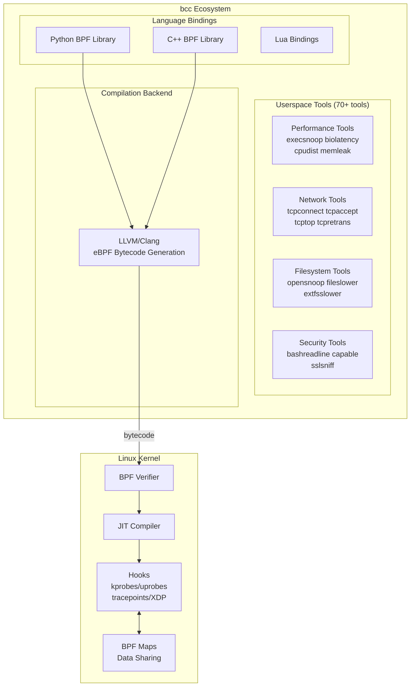
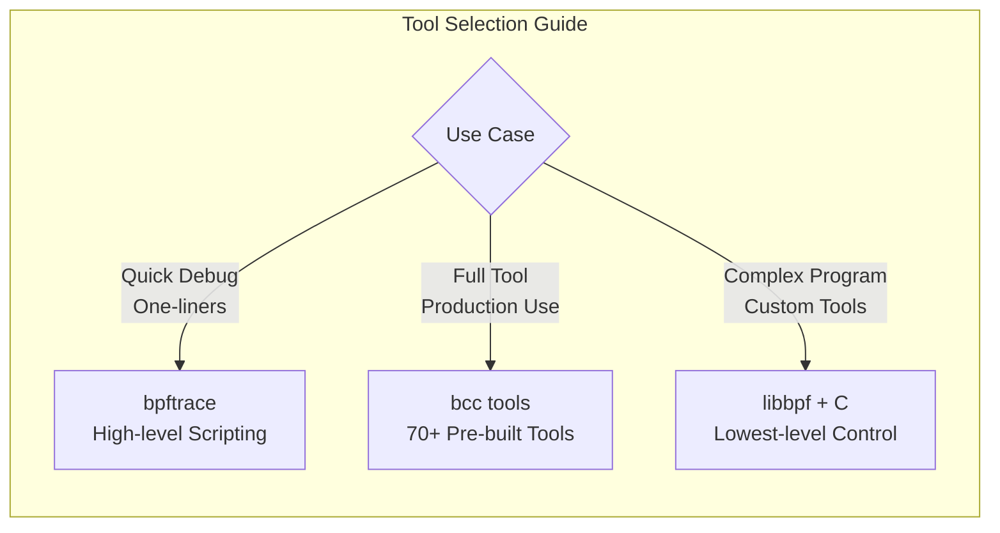
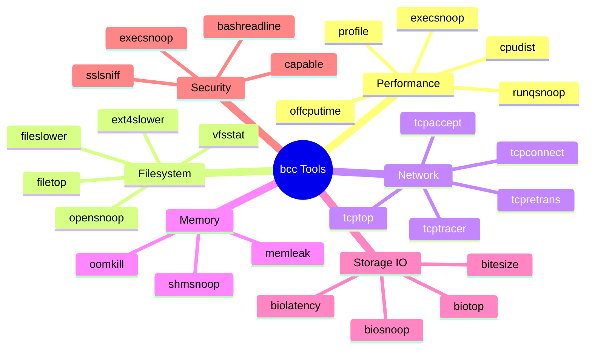
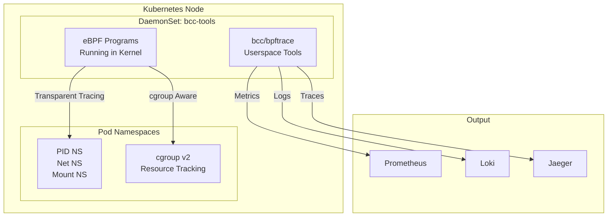
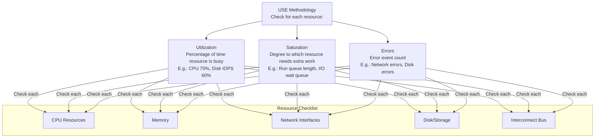
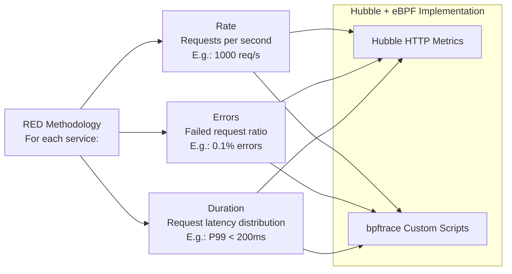
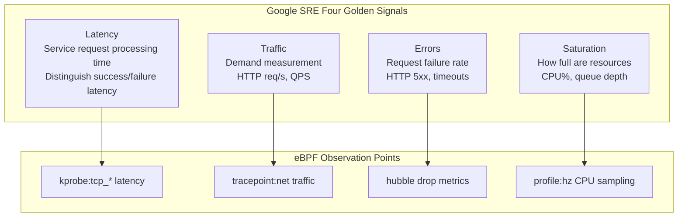
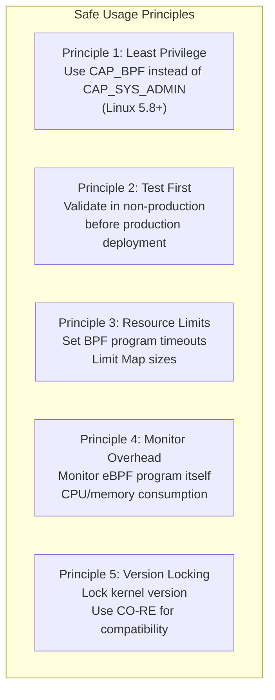

> **Production Safety Notice**
>
> This document contains operational commands that can be executed directly. Before running them, confirm: the target cluster and Namespace are correct; you have sufficient RBAC permissions; and the commands have been validated in a non-production environment. Command risk levels: 🔴 High risk (may cause data loss or service interruption), 🟡 Medium risk (modifies cluster state, usually rollbackable), 🟢 Low risk / read-only (information gathering, no side effects).


# bcc and bpftrace Tools

> bcc (BPF Compiler Collection) and bpftrace are two of the most important eBPF userspace tool chains, providing powerful dynamic tracing, performance analysis, and debugging capabilities for Linux systems. They are foundational tools for modern cloud-native observability.

---

<!-- chunk: Table of Contents -->## Table of Contents

1. [bcc Project Overview and Installation](#1-bcc-project-overview-and-installation)
2. [Common bcc Tools in Depth](#2-common-bcc-tools-in-depth)
3. [bpftrace Language Fundamentals](#3-bpftrace-language-fundamentals)
4. [bpftrace One-Liner Examples](#4-bpftrace-one-liner-examples)
5. [Developing Complex bpftrace Scripts](#5-developing-complex-bpftrace-scripts)
6. [eBPF Performance Analysis in Kubernetes](#6-ebpf-performance-analysis-in-kubernetes)
7. [Container-Aware eBPF Tools](#7-container-aware-ebpf-tools)
8. [Custom bcc/bpftrace Tool Development](#8-custom-bccbpftrace-tool-development)
9. [Performance Analysis Methodologies (USE/RED)](#9-performance-analysis-methodologies-usered)
10. [Production Best Practices](#10-production-best-practices)

---

<!-- chunk: 1. bcc Project Overview and Installation -->## 1. bcc Project Overview and Installation

## 1.1 bcc Ecosystem Overview

bcc (BPF Compiler Collection) is an LLVM/Clang-based eBPF program development toolkit that provides Python and C++ bindings, along with a large set of pre-built performance analysis tools.



## 1.2 bcc vs bpftrace Comparison



| Dimension | bcc | bpftrace |
|------|-----|---------|
| **Positioning** | Tool Collection + Development Framework | High-level Scripting Language |
| **Language** | Python/C++ Bindings | awk-like Scripting Language |
| **Learning Curve** | Medium | Low |
| **Use Cases** | Pre-built Tool Usage / Custom Tool Development | Quick One-liner Diagnostics / Small Scripts |
| **Performance Overhead** | Medium | Low |
| **Kernel Requirement** | 4.1+ | 4.9+ (recommended 5.8+) |
| **CO-RE Support** | Partial | Yes (bpftrace 0.16+) |
| **Dependencies** | LLVM/Clang Runtime | No Extra Dependencies (BTF Mode) |

## 1.3 Installing bcc

**Ubuntu/Debian:**

```bash
# Ubuntu 20.04+
sudo apt-get install -y \
  bpfcc-tools \
  libbpfcc \
  libbpfcc-dev \
  linux-headers-$(uname -r) \
  python3-bpfcc

# Verify installation
sudo execsnoop-bpfcc --help

# Install latest version (from source)
sudo apt-get install -y \
  cmake \
  flex \
  bison \
  libelf-dev \
  libfl-dev \
  libllvm14 \
  llvm-14-dev \
  libclang-14-dev \
  zlib1g-dev \
  libluajit-5.1-dev

git clone https://github.com/iovisor/bcc.git
mkdir bcc/build && cd bcc/build
cmake .. -DCMAKE_BUILD_TYPE=Release -DCMAKE_INSTALL_PREFIX=/usr
make -j$(nproc)
sudo make install
```

**RHEL/CentOS/Rocky Linux:**

```bash
# RHEL 8/9
sudo dnf install -y \
  bcc \
  bcc-tools \
  bcc-devel \
  python3-bcc \
  kernel-devel-$(uname -r)

# Tool location
ls /usr/share/bcc/tools/

# CentOS 7 (requires kernel upgrade)
sudo yum install -y \
  kernel-devel-$(uname -r) \
  bcc-tools
```

**Container Environment Installation:**

``` bash
# 🟢 Low risk: read-only / information gathering, usually no side effects
# Using bcc in a privileged container
docker run --rm -it \
  --privileged \
  --pid=host \
  --net=host \
  -v /sys:/sys:ro \
  -v /lib/modules:/lib/modules:ro \
  -v /usr/src:/usr/src:ro \
  quay.io/iovisor/bcc:latest \
  /bin/bash

# Deploy bcc tools via Kubernetes DaemonSet
# (see Chapter 6 for details)
```
## 1.4 Installing bpftrace

```bash
# Ubuntu 20.04+
sudo apt-get install -y bpftrace

# Install latest version from package manager
sudo snap install bpftrace

# Build from source (for latest features)
sudo apt-get install -y \
  cmake \
  libelf-dev \
  zlib1g-dev \
  libfl-dev \
  libclang-dev \
  llvm-dev \
  libgtest-dev

git clone https://github.com/iovisor/bpftrace.git
mkdir bpftrace/build && cd bpftrace/build
cmake .. -DCMAKE_BUILD_TYPE=Release
make -j$(nproc)
sudo make install

# Verify installation
bpftrace --version
# bpftrace v0.21.0

# List all available probe types
sudo bpftrace -l 'tracepoint:syscalls:*' | head -20
```

## 1.5 Environment Verification

```bash
# Verify kernel support
uname -r  # should be >= 4.9

# Verify BTF support (strongly recommended)
ls /sys/kernel/btf/vmlinux

# Verify bpf syscall availability
cat /proc/version

# Check eBPF program limits
cat /proc/sys/kernel/bpf_jit_limit
cat /proc/sys/net/core/bpf_jit_harden

# List loaded BPF programs
sudo bpftool prog list

# List BPF Maps
sudo bpftool map list
```

---

<!-- chunk: 2. Common bcc Tools in Depth -->## 2. Common bcc Tools in Depth

## 2.1 Tools Overview



## 2.2 execsnoop - Process Execution Tracing

execsnoop traces all new process creation on the system, extremely useful for discovering anomalous processes and debugging application startup issues.

> ⚠️ **🟡 Medium risk** — modifies cluster resource state, recommend --dry-run or diff first
> - `kubectl exec`: enters container to run commands, may change container state

``` bash
# 🟡 Medium risk: modifies cluster/resource state, confirm target, scope, and authorization before executing
# Basic usage - trace all new processes
sudo execsnoop

# Typical output:
# PCOMM            PID    PPID   RET ARGS
# ls               12345  1234     0 /usr/bin/ls -la
# sh               12346  12345    0 /bin/sh -c echo hello
# curl             12347  1234     0 /usr/bin/curl https://example.com

# Trace specific commands only
sudo execsnoop -n curl
sudo execsnoop -n "python|node|java"

# Trace failed exec (RET != 0)
sudo execsnoop -f

# Trace specific UID
sudo execsnoop -u 1000

# Trace specific process group
sudo execsnoop -P 12345

# Include timestamps
sudo execsnoop -t

# JSON output
sudo execsnoop --json

# Use in Kubernetes Pod
kubectl exec -n kube-system ds/node-exporter -- \
  /usr/share/bcc/tools/execsnoop
```
**execsnoop Advanced Usage - Detecting Anomalous Processes:**

```bash
# Monitor for potentially malicious process creation (continuous monitoring)
sudo execsnoop -t 2>/dev/null | \
  awk '
    /nc |netcat |ncat / {print "[ALERT] Suspicious network tool: " $0}
    /wget |curl / && /[0-9]{1,3}\.[0-9]{1,3}/ {print "[ALERT] Suspicious download: " $0}
    /python.*-c |perl.*-e |ruby.*-e / {print "[ALERT] Suspicious interpreter command: " $0}
  '

# Count most frequently started processes (1 minute)
sudo execsnoop -t 2>/dev/null | \
  awk 'NR>1 {print $1}' | \
  timeout 60 sort | uniq -c | sort -rn | head -10
```

## 2.3 opensnoop - File Open Tracing

```bash
# Trace all file open operations
sudo opensnoop

# Typical output:
# PID    COMM               FD ERR PATH
# 1234   nginx              5   0  /etc/nginx/nginx.conf
# 5678   java              12   0  /app/config/application.yml
# 9012   python3            3  -1  /tmp/nonexistent.txt (ENOENT)

# Trace failed open calls (find missing files)
sudo opensnoop -x

# Trace specific process
sudo opensnoop -p 1234

# Trace specific command
sudo opensnoop -n nginx

# Trace specific file path (regex)
sudo opensnoop -f "/etc/.*\.conf$"

# Include timestamps + process info
sudo opensnoop -Te

# Count which files are opened most frequently
sudo opensnoop 2>/dev/null | \
  awk 'NR>1 && $3>=0 {print $NF}' | \
  sort | uniq -c | sort -rn | head -20
```

**Diagnostic Scenario: Find Configuration Files Read by Application:**

```bash
# Trace all files nginx reads during startup
sudo opensnoop -n nginx | grep -v "ENOENT" 

# Example output:
# 1234   nginx              5   0  /etc/nginx/nginx.conf
# 1234   nginx              5   0  /etc/nginx/mime.types
# 1234   nginx              5   0  /etc/nginx/conf.d/default.conf
# 1234   nginx              5   0  /var/log/nginx/access.log
# 1234   nginx              5   0  /var/log/nginx/error.log
```

## 2.4 tcpconnect / tcpaccept - TCP Connection Tracing

```bash
# Trace all outbound TCP connections
sudo tcpconnect

# Typical output:
# PID    COMM         IP SADDR            DADDR            DPORT
# 1234   curl          4 10.0.0.1         93.184.216.34    443
# 5678   java          4 10.0.0.2         10.0.1.100       5432
# 9012   python3       6 ::1              ::1              8080

# Trace inbound TCP connections
sudo tcpaccept

# Typical output:
# PID    COMM         IP RADDR            RPORT LADDR            LPORT
# 1234   nginx         4 192.168.1.100    54321 10.0.0.1         80

# Trace specific ports only
sudo tcpconnect -P 443,5432,6379

# Trace specific process
sudo tcpconnect -p 1234

# Trace and resolve DNS
sudo tcpconnect -D

# Trace IPv4 only
sudo tcpconnect -4

# Include timestamps
sudo tcpconnect -t

# Count connections to most frequent targets (identify connection leaks)
sudo tcpconnect 2>/dev/null | \
  awk 'NR>1 {print $5 ":" $6}' | \
  sort | uniq -c | sort -rn | head -10
```

**Tracing TCP Retransmissions (Troubleshoot Network Quality):**

```bash
# tcpretrans: trace TCP retransmissions
sudo tcpretrans

# Typical output:
# TIME     PID    IP LADDR:LPORT          T> RADDR:RPORT          STATE
# 10:00:01 0       4 10.0.0.1:80         R> 192.168.1.100:54321   ESTABLISHED

# T column meanings:
# R = Retransmit
# L = TLP (tail loss probe)
# F = Fast Retransmit

# Count Top IPs with retransmits
sudo tcpretrans 2>/dev/null | \
  awk 'NR>1 {print $6}' | \
  cut -d: -f1 | \
  sort | uniq -c | sort -rn
```

## 2.5 biolatency - Block I/O Latency Analysis

biolatency is a powerful tool for analyzing disk I/O performance, displaying latency distribution as a histogram.

```bash
# Show I/O latency histogram (10 second stats)
sudo biolatency 10

# Typical output:
#      usecs           : count     distribution
#          0 -> 1      : 0        |                    |
#          2 -> 3      : 10       |*                   |
#          4 -> 7      : 156      |***********         |
#          8 -> 15     : 89       |*******             |
#         16 -> 31     : 23       |**                  |
#         32 -> 63     : 5        |                    |
#         64 -> 127    : 2        |                    |
#        128 -> 255    : 1        |                    |
#       4096 -> 8191   : 0        |                    |

# Group by disk
sudo biolatency -D 10

# Group by I/O type (read/write)
sudo biolatency -F 10

# Trace specific disk
sudo biolatency -d sdb 10

# Use millisecond units (for large latencies)
sudo biolatency -m 10

# Measure queue latency (includes queuing time)
sudo biolatency -Q 10
```

**biosnoop - Trace Each I/O Request:**

```bash
# Trace all block I/O requests
sudo biosnoop

# Typical output:
# TIME(s)  COMM           PID    DISK    T  SECTOR    BYTES  LAT(ms)
# 0.000004 java           1234   sda     R  12345678  4096   0.28
# 0.001234 postgres       5678   sdb     W  87654321  8192   1.23

# Trace only I/O exceeding latency threshold
sudo biosnoop -Q 10  # latency > 10ms

# Trace specific process
sudo biosnoop -P 1234

# Real-time ranking: biotop
sudo biotop  # similar to top, sorted by I/O

# Typical biotop output:
# Tracing... Output every 1 secs. Hit Ctrl-C to end
#
# 10:00:01 loadavg: 0.52 0.47 0.35
# PID    COMM             D MAJ MIN  I/Os  Kbytes  AVGms
# 5678   postgres         W 8   16   47    376     1.23
# 1234   java             R 8   0    23    184     0.45
```

## 2.6 funccount / funclatency - Function Call Analysis

```bash
# Count kernel function calls (5 seconds)
sudo funccount 'tcp_*' 5

# Typical output:
# Tracing 47 functions for "tcp_*"... Hit Ctrl-C to end.
# FUNC                          COUNT
# tcp_sendmsg                   8234
# tcp_recvmsg                   7891
# tcp_cleanup_rbuf              7891
# tcp_rcv_established           7234
# tcp_v4_do_rcv                 7123

# Count vfs layer function calls
sudo funccount 'vfs_*' 5

# Count userspace functions (libc)
sudo funccount 'c:malloc' 5

# Function latency analysis
sudo funclatency do_sys_open 10

# Typical output:
#      nsecs               : count     distribution
#        256 -> 511        : 0        |                    |
#        512 -> 1023       : 45       |****                |
#       1024 -> 2047       : 276      |***************************|
#       2048 -> 4095       : 134      |*************       |
#       4096 -> 8191       : 23       |**                  |
#       8192 -> 16383      : 5        |                    |

# Analyze Python function latency
sudo funclatency -l py:/* /usr/bin/python3 10

# Trace Java method latency (requires USDT probes)
sudo funclatency 'java:java.net.Socket:connect' 10
```

## 2.7 Other Important Tools

**CPU Performance Analysis:**

```bash
# profile: CPU sampling profiler (flamegraph foundation)
sudo profile -F 99 30  # 99Hz sampling, 30 seconds duration
sudo profile -F 99 30 -a  # include kernel stacks

# Generate flamegraph
sudo profile -F 99 30 -f > /tmp/cpu-stacks.txt
flamegraph.pl /tmp/cpu-stacks.txt > /tmp/cpu-flamegraph.svg

# cpudist: CPU on/off time distribution
sudo cpudist 10

# runqslower: trace tasks with scheduling latency > threshold
sudo runqslower 10000  # scheduling latency > 10ms

# offcputime: count process off-CPU time (blocking analysis)
sudo offcputime -p 1234 30
```

**Memory Analysis:**

```bash
# memleak: detect memory leaks
sudo memleak -p 1234 5  # 5 second memory growth analysis

# Typical output:
# [10:00:05] Top 5 stacks with outstanding allocations:
#   576 bytes in 6 allocations from stack:
#     alloc [/usr/lib/libc.so.6]
#     myapp [/opt/app/myapp]
#     main [/opt/app/myapp]

# oomkill: trace OOM Killer events
sudo oomkill

# shmsnoop: shared memory operation tracing
sudo shmsnoop
```

**Security Auditing:**

```bash
# capable: trace Linux capability usage
sudo capable
# Output: which process requested what capability

# bashreadline: trace bash command history
sudo bashreadline

# sslsniff: trace SSL/TLS plaintext (for debugging)
sudo sslsniff -p 1234

# trace: generic tracing framework
sudo trace 'sys_read (args->count > 4096) "large read: %d", args->count'
```

---

<!-- chunk: 3. bpftrace Language Fundamentals -->## 3. bpftrace Language Fundamentals

## 3.1 bpftrace Language Architecture

```mermaid
graph TB
    subgraph "bpftrace Program Structure"
        HEADER["probe_type:target:function\nProbe Specification"]
        FILTER["/ filter_expression /\nOptional Filter Condition"]
        ACTION["{ action_block }\nAction Code Block"]
    end
    
    subgraph "Data Types"
        INT[Integer\nint/uint 8/16/32/64]
        STR[String\nchar *]
        MAP[Map Type\n@ = count()]
        HIST[Histogram\n@h = hist(value)]
    end
    
    subgraph "Built-in Variables"
        PID[pid: Process ID]
        TID[tid: Thread ID]
        COMM[comm: Process Name]
        NS[nsecs: Nanosecond Timestamp]
        ARGS[args: Probe Arguments]
        RETVAL[retval: Return Value]
        KSTACK[kstack: Kernel Stack]
        USTACK[ustack: User Stack]
    end
    
    HEADER --> FILTER --> ACTION
```

## 3.2 Probe Types

```
Probe Type Overview:

kprobe:function_name       - kernel function entry
kretprobe:function_name    - kernel function return
uprobe:binary:function     - userspace function entry
uretprobe:binary:function  - userspace function return
tracepoint:subsys:name     - kernel tracepoint
usdt:binary:provider:name  - userspace static tracing point
profile:hz:freq            - periodic sampling
interval:s:N               - interval trigger
software:event:count       - software performance event
hardware:event:count       - hardware performance counter
BEGIN                      - script startup
END                        - script termination
```

```bash
# List all available tracepoints
sudo bpftrace -l 'tracepoint:*' | wc -l

# List syscall tracepoints
sudo bpftrace -l 'tracepoint:syscalls:*' | head -20

# View tracepoint parameter structure
sudo bpftrace -lv 'tracepoint:syscalls:sys_enter_openat'
# tracepoint:syscalls:sys_enter_openat
#     int __syscall_nr
#     int dfd
#     const char * filename
#     int flags
#     unsigned short mode

# List available kprobes
sudo bpftrace -l 'kprobe:tcp_*' | head -20

# List uprobe targets
sudo bpftrace -l 'uprobe:/usr/bin/python3:*' | head -10
```

## 3.3 Basic Syntax

```bpftrace
// Single-line comment
/* Multi-line comment */

// Basic structure example: trace open syscall
tracepoint:syscalls:sys_enter_openat
{
    // Built-in variables
    printf("pid: %d, comm: %s, file: %s\n",
           pid, comm, str(args->filename));
}

// With filter: trace specific process only
tracepoint:syscalls:sys_enter_openat
/ comm == "nginx" /
{
    printf("nginx opened: %s\n", str(args->filename));
}

// Function return value tracing
kretprobe:do_sys_openat2
{
    printf("fd = %d\n", retval);
}

// Map operations: count invocations
kprobe:tcp_sendmsg
{
    @[comm] = count();
}

// Histogram for latency statistics
kprobe:vfs_read
{
    @start[tid] = nsecs;
}

kretprobe:vfs_read
/ @start[tid] /
{
    @latency = hist(nsecs - @start[tid]);
    delete(@start[tid]);
}
```

## 3.4 Built-in Functions

```bpftrace
// String functions
str(ptr)           // C string pointer to bpftrace string
substr(str, start) // Substring
strcontains(str, needle) // String contains check

// Type conversion
(int32)expr        // Type cast

// Print functions
printf(fmt, ...)   // Formatted output
print(@map)        // Print Map
print(@map, top_n) // Print Top N
clear(@map)        // Clear Map

// Time functions
nsecs              // Nanosecond timestamp
elapsed            // Nanoseconds since script start
ktime              // Kernel time (nanoseconds)

// Process information
pid   tid   uid   gid   comm   curtask

// Kernel/user stacks
kstack  kstack(N)  // Kernel stack (N levels)
ustack  ustack(N)  // User stack (N levels)

// Memory access
*(addr)            // Dereference kernel address
*((datatype *)addr)// Typed dereference

// Aggregation functions (Map Actions)
count()            // Count
sum(expr)          // Sum
avg(expr)          // Average
min(expr)          // Minimum
max(expr)          // Maximum
hist(expr)         // Power-of-2 histogram
lhist(expr, min, max, step) // Linear histogram
stats(expr)        // count/avg/total statistics

// Control flow
if (cond) { } else { }
unroll(N) { }      // Compile-time loop unrolling
```

## 3.5 Map Operations Details

```bpftrace
// Map declaration (automatically created)
@map_name                    // Global Map
@map_name[key]               // Map indexed by key
@map_name[key1, key2]        // Multi-key Map

// Map type examples:

// 1. Counter Map
kprobe:tcp_sendmsg {
    @sends[comm] = count();
}

// 2. Histogram Map
kprobe:vfs_read {
    @size_hist = hist(args->count);
}

// 3. Time measurement Map
kprobe:sys_read {
    @ts[tid] = nsecs;
}
kretprobe:sys_read {
    @lat_ns = hist(nsecs - @ts[tid]);
    delete(@ts[tid]);
}

// Print results in END block
END {
    print(@sends);
    print(@lat_ns);
    clear(@ts);  // Clean up temporary Map
}
```

---

<!-- chunk: 4. bpftrace One-Liner Examples -->## 4. bpftrace One-Liner Examples

## 4.1 Syscall Analysis

```bash
# Count all syscalls (by process name)
sudo bpftrace -e '
tracepoint:raw_syscalls:sys_enter 
{ @[comm] = count(); }'

# Count top syscall types
sudo bpftrace -e '
tracepoint:raw_syscalls:sys_enter 
{ @[args->id] = count(); } 
END 
{ print(@, 10); }'

# Trace read call byte distribution
sudo bpftrace -e '
tracepoint:syscalls:sys_exit_read 
/ args->ret > 0 / 
{ @bytes = hist(args->ret); }'

# Trace write call sizes
sudo bpftrace -e '
tracepoint:syscalls:sys_enter_write 
{ @bytes_written[comm] = sum(args->count); }'

# Trace specific process syscalls
sudo bpftrace -e '
tracepoint:raw_syscalls:sys_enter 
/ pid == 1234 / 
{ @[args->id] = count(); }'
```

## 4.2 Filesystem Analysis

```bash
# Trace all file opens (like opensnoop)
sudo bpftrace -e '
tracepoint:syscalls:sys_enter_openat 
{ printf("%s %s\n", comm, str(args->filename)); }'

# Count file read latency
sudo bpftrace -e '
kprobe:vfs_read { @start[tid] = nsecs; }
kretprobe:vfs_read / @start[tid] / {
    @us = hist((nsecs - @start[tid]) / 1000);
    delete(@start[tid]);
}'

# Trace large file reads (> 1MB)
sudo bpftrace -e '
tracepoint:syscalls:sys_enter_read 
/ args->count > 1048576 / 
{ printf("LARGE READ: %s %d bytes\n", comm, args->count); }'

# Count most accessed directories
sudo bpftrace -e '
tracepoint:syscalls:sys_enter_openat
{ 
    $file = str(args->filename);
    if (strcontains($file, "/")) {
        @[comm] = count();
    }
}'

# Trace file deletions
sudo bpftrace -e '
tracepoint:syscalls:sys_enter_unlinkat 
{ printf("%s deleted: %s\n", comm, str(args->pathname)); }'
```

## 4.3 Network Analysis

```bash
# Trace TCP connection establishment
sudo bpftrace -e '
kprobe:tcp_connect 
{ 
    $sk = (struct sock *)arg0;
    printf("connect: %s -> %s:%d\n", 
           comm,
           ntop($sk->__sk_common.skc_daddr),
           $sk->__sk_common.skc_dport >> 8);
}'

# Count TCP sent bytes (by process)
sudo bpftrace -e '
kprobe:tcp_sendmsg 
{ @bytes[comm] = sum(arg2); }'

# Trace UDP packets
sudo bpftrace -e '
tracepoint:net:net_dev_xmit 
{ @pkts[comm] = count(); }'

# Trace DNS queries (UDP port 53)
sudo bpftrace -e '
kprobe:udp_sendmsg
{
    $sk = (struct sock *)arg0;
    $dport = $sk->__sk_common.skc_dport;
    if (($dport >> 8 | $dport << 8) == 53) {
        printf("DNS query from: %s (pid: %d)\n", comm, pid);
    }
}'

# Count network packets per second
sudo bpftrace -e '
tracepoint:net:netif_receive_skb { @rx = count(); }
tracepoint:net:net_dev_xmit { @tx = count(); }
interval:s:1 {
    printf("RX: %d/s, TX: %d/s\n", @rx, @tx);
    clear(@rx); clear(@tx);
}'
```

## 4.4 CPU and Scheduling Analysis

```bash
# CPU sampling profiler (99 Hz, 10 seconds)
sudo bpftrace -e '
profile:hz:99 
{ @[kstack] = count(); }
interval:s:10 { exit(); }'

# Trace context switches
sudo bpftrace -e '
tracepoint:sched:sched_switch 
{ @[args->prev_comm, args->next_comm] = count(); }'

# Count process scheduling latency
sudo bpftrace -e '
tracepoint:sched:sched_wakeup 
{ @ts[args->pid] = nsecs; }
tracepoint:sched:sched_switch 
/ @ts[args->next_pid] / {
    @sched_lat_us = hist((nsecs - @ts[args->next_pid]) / 1000);
    delete(@ts[args->next_pid]);
}'

# Trace CPU migration events
sudo bpftrace -e '
tracepoint:sched:sched_migrate_task 
{ 
    printf("%s migrated from CPU%d to CPU%d\n",
           args->comm, args->orig_cpu, args->dest_cpu); 
}'

# Count process off-CPU time (blocking analysis)
sudo bpftrace -e '
tracepoint:sched:sched_switch 
/ args->prev_state / {
    @off_start[args->prev_pid] = nsecs;
}
tracepoint:sched:sched_switch 
/ @off_start[args->next_pid] / {
    @off_time_ms[args->next_comm] = 
        sum((nsecs - @off_start[args->next_pid]) / 1000000);
    delete(@off_start[args->next_pid]);
}'
```

## 4.5 Memory Analysis

```bash
# Count malloc call size distribution
sudo bpftrace -e '
uprobe:/lib/x86_64-linux-gnu/libc.so.6:malloc 
{ @alloc_size = hist(arg0); }'

# Trace memory mappings
sudo bpftrace -e '
tracepoint:syscalls:sys_enter_mmap 
{ @mmap_size[comm] = sum(args->len); }'

# Trace OOM events
sudo bpftrace -e '
kprobe:oom_kill_process 
{ 
    printf("OOM killing: %s (pid: %d)\n", 
           ((struct task_struct *)arg1)->comm, 
           ((struct task_struct *)arg1)->pid); 
}'

# Trace page faults
sudo bpftrace -e '
tracepoint:exceptions:page_fault_user 
{ @faults[comm] = count(); }
interval:s:5 { print(@faults); clear(@faults); }'
```

---

<!-- chunk: 5. Developing Complex bpftrace Scripts -->## 5. Developing Complex bpftrace Scripts

## 5.1 HTTP Request Latency Tracer

```bpftrace
#!/usr/bin/env bpftrace
// http-latency.bt: trace HTTP server request latency
// Usage: sudo bpftrace http-latency.bt

// Trace accept4 syscall (HTTP server accepts connection)
tracepoint:syscalls:sys_enter_accept4
/ comm == "nginx" || comm == "httpd" || comm == "node" /
{
    @accept_ts[tid] = nsecs;
}

// Trace sendfile or write (response sent)
tracepoint:syscalls:sys_enter_sendfile64
/ @accept_ts[tid] /
{
    $latency_ms = (nsecs - @accept_ts[tid]) / 1000000;
    @http_latency_ms = hist($latency_ms);
    @http_latency_by_proc[comm] = hist($latency_ms);
    
    if ($latency_ms > 100) {
        printf("[SLOW] %s: %d ms (tid: %d)\n", 
               comm, $latency_ms, tid);
    }
    
    delete(@accept_ts[tid]);
}

END
{
    printf("\n=== HTTP Request Latency Distribution (ms) ===\n");
    print(@http_latency_ms);
    printf("\n=== Grouped by Process ===\n");
    print(@http_latency_by_proc);
}
```

## 5.2 Database Query Tracer

```bpftrace
#!/usr/bin/env bpftrace
// db-query-tracer.bt: trace PostgreSQL/MySQL query latency
// Uses USDT probes (requires database to enable DTrace support)

// PostgreSQL USDT probes
usdt:/usr/lib/postgresql/14/bin/postgres:postgresql:query__start
{
    @query_start[pid] = nsecs;
    printf("PG QUERY START [pid:%d]: %.100s\n", pid, str(arg0));
}

usdt:/usr/lib/postgresql/14/bin/postgres:postgresql:query__done
/ @query_start[pid] /
{
    $duration_ms = (nsecs - @query_start[pid]) / 1000000;
    @pg_query_latency_ms = hist($duration_ms);
    
    if ($duration_ms > 1000) {
        printf("[SLOW QUERY] pid:%d duration:%dms query:%.100s\n",
               pid, $duration_ms, str(arg0));
    }
    
    delete(@query_start[pid]);
}

// MySQL USDT probes (if available)
usdt:/usr/sbin/mysqld:mysql:query__start
{
    @mysql_start[pid] = nsecs;
}

usdt:/usr/sbin/mysqld:mysql:query__done
/ @mysql_start[pid] /
{
    @mysql_latency = hist((nsecs - @mysql_start[pid]) / 1000000);
    delete(@mysql_start[pid]);
}

interval:s:30
{
    printf("\n=== PostgreSQL Query Latency (30s) ===\n");
    print(@pg_query_latency_ms);
    clear(@pg_query_latency_ms);
    
    printf("\n=== MySQL Query Latency (30s) ===\n");
    print(@mysql_latency);
    clear(@mysql_latency);
}
```

## 5.3 TCP Connection Full Lifecycle Tracer

```bpftrace
#!/usr/bin/env bpftrace
// tcp-lifecycle.bt: fully trace TCP connection lifecycle

#include <net/tcp_states.h>
#include <linux/tcp.h>

// TCP connection establishment
kprobe:tcp_v4_connect
{
    $sk = (struct sock *)arg0;
    @tcp_start[tid] = nsecs;
    @tcp_sk[tid] = arg0;
}

kretprobe:tcp_v4_connect
/ retval == 0 && @tcp_start[tid] /
{
    $sk = (struct sock *)@tcp_sk[tid];
    $daddr = ntop($sk->__sk_common.skc_daddr);
    $dport = ($sk->__sk_common.skc_dport >> 8) | 
             (($sk->__sk_common.skc_dport & 0xFF) << 8);
    
    printf("CONNECT: %s (pid:%d) -> %s:%d [%d us]\n",
           comm, pid, $daddr, $dport,
           (nsecs - @tcp_start[tid]) / 1000);
    
    @connect_time[$daddr, $dport] = nsecs;
    delete(@tcp_start[tid]);
    delete(@tcp_sk[tid]);
}

// TCP connection close
kprobe:tcp_close
{
    $sk = (struct sock *)arg0;
    $daddr = ntop($sk->__sk_common.skc_daddr);
    $dport = ($sk->__sk_common.skc_dport >> 8) | 
             (($sk->__sk_common.skc_dport & 0xFF) << 8);
    
    if (@connect_time[$daddr, $dport]) {
        $duration_ms = (nsecs - @connect_time[$daddr, $dport]) / 1000000;
        printf("CLOSE: %s (pid:%d) -> %s:%d [connection lived %dms]\n",
               comm, pid, $daddr, $dport, $duration_ms);
        @conn_duration_ms = hist($duration_ms);
        delete(@connect_time[$daddr, $dport]);
    }
}

// TCP retransmission
kprobe:tcp_retransmit_skb
{
    $sk = (struct sock *)arg0;
    $daddr = ntop($sk->__sk_common.skc_daddr);
    @retrans[$daddr] = count();
    printf("RETRANSMIT: %s -> %s\n", comm, $daddr);
}

END
{
    printf("\n=== TCP Connection Duration Distribution (ms) ===\n");
    print(@conn_duration_ms);
    printf("\n=== Retransmits by Target IP ===\n");
    print(@retrans);
}
```

## 5.4 Memory Leak Detector

```bpftrace
#!/usr/bin/env bpftrace
// memleak-detect.bt: detect userspace memory leaks

uprobe:/lib/x86_64-linux-gnu/libc.so.6:malloc
/ pid == $1 /  // $1 is target PID parameter
{
    @alloc_size[tid] = arg0;
    @alloc_stack[tid] = ustack;
}

uretprobe:/lib/x86_64-linux-gnu/libc.so.6:malloc
/ @alloc_size[tid] /
{
    if (retval != 0) {
        @outstanding[retval] = @alloc_size[tid];
        @stacks[ustack] = sum(@alloc_size[tid]);
    }
    delete(@alloc_size[tid]);
    delete(@alloc_stack[tid]);
}

uprobe:/lib/x86_64-linux-gnu/libc.so.6:free
/ pid == $1 /
{
    $ptr = arg0;
    if (@outstanding[$ptr]) {
        delete(@outstanding[$ptr]);
    }
}

interval:s:10
{
    $total = 0;
    // Calculate total unreleased memory
    printf("\n=== Top 10 Call Stacks with Unreleased Memory (10s) ===\n");
    print(@stacks, 10);
    printf("\nTotal unreleased allocation count: %d\n", count(@outstanding));
}
```

## 5.5 Syscall Latency Tracer

```bpftrace
#!/usr/bin/env bpftrace
// syscall-latency.bt: syscall latency distribution analysis

BEGIN
{
    printf("Tracing syscall latency... Press Ctrl-C to stop\n");
    
    // Syscall name mapping (common syscalls)
    @syscall_name[0] = "read";
    @syscall_name[1] = "write";
    @syscall_name[2] = "open";
    @syscall_name[3] = "close";
    @syscall_name[8] = "lseek";
    @syscall_name[9] = "mmap";
    @syscall_name[21] = "access";
    @syscall_name[41] = "socket";
    @syscall_name[42] = "connect";
    @syscall_name[43] = "accept";
    @syscall_name[44] = "sendto";
    @syscall_name[45] = "recvfrom";
    @syscall_name[232] = "epoll_wait";
}

tracepoint:raw_syscalls:sys_enter
/ comm == str($1) /  // $1 is target process name
{
    @sys_start[tid, args->id] = nsecs;
}

tracepoint:raw_syscalls:sys_exit
/ @sys_start[tid, args->id] /
{
    $id = args->id;
    $lat = (nsecs - @sys_start[tid, args->id]) / 1000;
    
    // Record latency distribution
    @latency_us[$id] = hist($lat);
    
    // Record slow syscalls
    if ($lat > 10000) {  // > 10ms
        printf("[SLOW SYSCALL] %s syscall#%d: %d us\n",
               comm, $id, $lat);
    }
    
    delete(@sys_start[tid, args->id]);
}

interval:s:30
{
    printf("\n=== Syscall Latency Distribution (microseconds) ===\n");
    
    // Print latency histogram for each syscall
    print(@latency_us);
    
    printf("\n--- Next 30 second statistics period ---\n");
    clear(@latency_us);
}
```

---

<!-- chunk: 6. eBPF Performance Analysis in Kubernetes -->## 6. eBPF Performance Analysis in Kubernetes

## 6.1 K8s eBPF Analysis Architecture



## 6.2 Deploying eBPF Analysis Tools DaemonSet

```yaml
# ebpf-tools-daemonset.yaml
apiVersion: apps/v1
kind: DaemonSet
metadata:
  name: ebpf-tools
  namespace: monitoring
  labels:
    app: ebpf-tools
spec:
  selector:
    matchLabels:
      app: ebpf-tools
  template:
    metadata:
      labels:
        app: ebpf-tools
    spec:
      hostPID: true    # Access host PID namespace
      hostNetwork: true # Access host network
      
      tolerations:
      - effect: NoSchedule
        operator: Exists
      - effect: NoExecute
        operator: Exists
      
      containers:
      - name: ebpf-tools
        image: quay.io/iovisor/bcc:latest
        
        securityContext:
          privileged: true  # eBPF requires privilege
          capabilities:
            add:
            - SYS_ADMIN
            - SYS_PTRACE
            - NET_ADMIN
            - SYS_RESOURCE
        
        volumeMounts:
        - name: sys
          mountPath: /sys
          readOnly: true
        - name: modules
          mountPath: /lib/modules
          readOnly: true
        - name: src
          mountPath: /usr/src
          readOnly: true
        - name: debug
          mountPath: /sys/kernel/debug
        - name: bpffs
          mountPath: /sys/fs/bpf
        
        resources:
          requests:
            cpu: 100m
            memory: 128Mi
          limits:
            cpu: 2000m
            memory: 2Gi
        
        command: ["/bin/bash", "-c", "while true; do sleep 3600; done"]
      
      volumes:
      - name: sys
        hostPath:
          path: /sys
      - name: modules
        hostPath:
          path: /lib/modules
      - name: src
        hostPath:
          path: /usr/src
      - name: debug
        hostPath:
          path: /sys/kernel/debug
      - name: bpffs
        hostPath:
          path: /sys/fs/bpf
          type: DirectoryOrCreate
```

## 6.3 Container-Aware eBPF Tracing

``` bash
# 🟢 Low risk: read-only / information gathering, usually no side effects
# Find container's PID on host
CONTAINER_ID=$(kubectl get pod frontend-xxx -o jsonpath='{.status.containerStatuses[0].containerID}' | cut -d/ -f3)

# Method 1: Get PID via docker/containerd
HOST_PID=$(docker inspect --format '{{.State.Pid}}' $CONTAINER_ID 2>/dev/null || \
           crictl inspect --output json $CONTAINER_ID | jq '.info.pid')

echo "Container PID on host: $HOST_PID"

# Method 2: Via /proc filesystem
POD_UID=$(kubectl get pod frontend-xxx -o jsonpath='{.metadata.uid}')
find /proc -name "cgroup" 2>/dev/null | \
  xargs grep -l "$POD_UID" 2>/dev/null | \
  head -1 | cut -d/ -f3
```
> ⚠️ **🟡 Medium risk** — modifies cluster resource state, recommend --dry-run or diff first
> - `kubectl exec`: enters container to run commands, may change container state

``` bash
# 🟡 Medium risk: modifies cluster/resource state, confirm target, scope, and authorization before executing
# Trace syscalls in specific container on host
# First, execute in ebpf-tools DaemonSet Pod
kubectl exec -n monitoring ds/ebpf-tools -- \
  /usr/share/bcc/tools/opensnoop -p $HOST_PID

# Trace network connections for specific container
kubectl exec -n monitoring ds/ebpf-tools -- \
  /usr/share/bcc/tools/tcpconnect -p $HOST_PID

# Trace CPU usage for specific container
kubectl exec -n monitoring ds/ebpf-tools -- \
  /usr/share/bcc/tools/profile -p $HOST_PID 30
```
## 6.4 cgroup-Level Performance Analysis

```bpftrace
#!/usr/bin/env bpftrace
// k8s-container-io.bt: trace container I/O by cgroup

// cgroup v2 path format:
// /sys/fs/cgroup/kubepods/pod<uid>/<container_id>/...

kprobe:vfs_read
{
    $cgrp = cgroupid("/sys/fs/cgroup");  // Get current process cgroup ID
    @read_bytes[$cgrp, comm] = sum(arg2);
}

kprobe:vfs_write
{
    $cgrp = cgroupid("/sys/fs/cgroup");
    @write_bytes[$cgrp, comm] = sum(arg2);
}

interval:s:5
{
    printf("\n=== Container I/O Statistics (5s) ===\n");
    printf("READ:\n");
    print(@read_bytes, 10);
    printf("WRITE:\n");
    print(@write_bytes, 10);
    clear(@read_bytes);
    clear(@write_bytes);
}
```

``` bash
# 🟢 Low risk: read-only / information gathering, usually no side effects
# Trace network latency for specific Kubernetes Pod
# Step 1: Get Pod network namespace
POD_NS=$(kubectl get pod frontend-xxx -n production \
  -o jsonpath='{.metadata.uid}')

# Step 2: Enter network namespace using nsenter
NODE=$(kubectl get pod frontend-xxx -o jsonpath='{.spec.nodeName}')
kubectl debug node/$NODE -it --image=ubuntu -- \
  nsenter -t $HOST_PID -n -- \
  /usr/sbin/tcpdump -i any -nn 'port 8080' -c 100
```
## 6.5 Kubernetes Node Performance Diagnostic Script

``` bash
# 🟢 Low risk: read-only / information gathering, usually no side effects
#!/bin/bash
# k8s-node-profile.sh: Kubernetes node quick performance diagnostics

NODE=${1:-$(kubectl get nodes -o jsonpath='{.items[0].metadata.name}')}
DURATION=${2:-30}

echo "=== Kubernetes Node $NODE Performance Analysis ($DURATION seconds) ==="

# Run bpftrace on node
kubectl debug node/$NODE -it --image=quay.io/iovisor/bcc:latest -- \
  bash -c "
  echo '--- Top CPU Processes ---'
  timeout $DURATION /usr/share/bcc/tools/profile -F 99 $DURATION 2>/dev/null | \
    head -30
    
  echo '--- I/O Latency Distribution ---'
  timeout $DURATION /usr/share/bcc/tools/biolatency $DURATION 2>/dev/null
  
  echo '--- TCP Connection Statistics ---'
  timeout $DURATION /usr/share/bcc/tools/tcpconnect 2>/dev/null | \
    awk '{print \$5 \":\" \$6}' | sort | uniq -c | sort -rn | head -20
  
  echo '--- Syscall Latency ---'
  timeout $DURATION /usr/share/bcc/tools/syscount -L 2>/dev/null | head -20
  "
```
---

<!-- chunk: 7. Container-Aware eBPF Tools -->## 7. Container-Aware eBPF Tools

## 7.1 kubectl-trace Plugin

kubectl-trace is a kubectl plugin that can run bpftrace scripts directly on Kubernetes nodes.

``` bash
# 🟢 Low risk: read-only / information gathering, usually no side effects
# Install kubectl-trace
kubectl krew install trace

# Run bpftrace script on specific node
kubectl trace run node/node-1 -e "
kprobe:do_sys_open { printf(\"%s: %s\n\", comm, str(arg1)); }
"

# Run script file
kubectl trace run node/node-1 -f ./my-trace.bt

# Run in specific Pod
kubectl trace run pod/frontend-xxx -e "
uprobe:/proc/\$container_pid/root/usr/bin/python3:PyEval_EvalFrameEx {
    printf(\"Python frame: %s\n\", comm);
}"

# List running traces
kubectl trace get

# Stop trace
kubectl trace delete my-trace-xxx

# View trace output
kubectl trace logs my-trace-xxx
```
## 7.2 Inspektor Gadget (Container-Native eBPF Tool Suite)

``` bash
# 🟢 Low risk: read-only / information gathering, usually no side effects
# Install Inspektor Gadget
kubectl krew install gadget
kubectl gadget deploy

# Trace process execution in specific namespace
kubectl gadget trace exec --namespace production

# Trace file opens for specific Pod
kubectl gadget trace open --namespace production --podname frontend-xxx

# Trace TCP connections
kubectl gadget trace tcp --namespace production

# Trace DNS queries
kubectl gadget trace dns --namespace production

# Network policy recommendations (based on actual traffic)
kubectl gadget advise network-policy --namespace production

# Performance profiling: top processes (CPU)
kubectl gadget top file --namespace production

# top processes (I/O)
kubectl gadget top block-io --namespace production

# Block I/O latency histogram
kubectl gadget histogram block-io --namespace production
```
## 7.3 Container-Aware Network Tracing

```bpftrace
#!/usr/bin/env bpftrace
// container-net-trace.bt: container-aware network tracing script
// Can distinguish network traffic from different Pods/containers

#include <linux/socket.h>
#include <linux/net.h>

// Identify containers via cgroup
kprobe:tcp_sendmsg
{
    $sk = (struct sock *)arg0;
    $daddr = ntop($sk->__sk_common.skc_daddr);
    $dport = ($sk->__sk_common.skc_dport >> 8) | 
             (($sk->__sk_common.skc_dport & 0xFF) << 8);
    $len = arg2;
    
    // cgroup path contains Pod UID
    // Identify container via cgroup hierarchy
    @bytes_by_container[cgroup, comm, $daddr, $dport] = sum($len);
}

kprobe:tcp_recvmsg
{
    @recv_bytes[cgroup, comm] = sum(arg3);
}

interval:s:10
{
    printf("\n=== Container Network I/O (10s) ===\n");
    printf("Sent bytes (cgroup, comm, daddr, dport):\n");
    print(@bytes_by_container, 10);
    printf("\nReceived bytes (cgroup, comm):\n");
    print(@recv_bytes, 10);
    clear(@bytes_by_container);
    clear(@recv_bytes);
}
```

## 7.4 Pixie - Kubernetes Native eBPF Observability

```bash
# Install Pixie (automated Kubernetes eBPF observability)
# Requires Kubernetes 1.16+ and Linux 4.14+
bash -c "$(curl -fsSL https://withpixie.ai/install.sh)"

# View HTTP requests (automatic L7 parsing, no code changes needed)
px run px/http_data -- \
  -start_time '-5m' \
  -namespace production

# View service latency
px run px/service_stats -- \
  -start_time '-10m' \
  -namespace production

# View MySQL queries
px run px/mysql_data -- \
  -start_time '-5m'

# View pod network traffic
px run px/pod_network_stats -- \
  -start_time '-5m' \
  -namespace production \
  -pod frontend-xxx

# Custom PxL script (Pixie Query Language)
cat <<'EOF' > my-query.pxl
import px

df = px.DataFrame(table='http_events', start_time='-5m')
df = df[df.namespace == 'production']
df = df.groupby(['service', 'status_code']).agg(
    count=('latency_ns', px.count),
    p99_latency=('latency_ns', px.percentile(0.99)),
)
px.display(df)
EOF

px run -f my-query.pxl
```

---

<!-- chunk: 8. Custom bcc/bpftrace Tool Development -->## 8. Custom bcc/bpftrace Tool Development

## 8.1 bcc Python Development Framework

```python
#!/usr/bin/env python3
"""
custom-http-tracer.py: custom HTTP request latency tracer
Uses bcc Python API
"""

from bcc import BPF
import ctypes
import time
import signal
import sys

# eBPF C program
bpf_program = """
#include <uapi/linux/ptrace.h>
#include <net/sock.h>
#include <bcc/proto.h>

// Data structure definition
struct http_event_t {
    u32 pid;
    u64 latency_ns;
    char comm[16];
    char method[8];
    char path[128];
    u32 status_code;
};

// BPF Maps
BPF_HASH(start_time, u64, u64);
BPF_PERF_OUTPUT(http_events);

// Trace socket write (HTTP request start)
int trace_write_entry(struct pt_regs *ctx, 
                       struct socket *sock,
                       struct msghdr *msg, 
                       size_t size) {
    u64 tid = bpf_get_current_pid_tgid();
    u64 ts = bpf_ktime_get_ns();
    start_time.update(&tid, &ts);
    return 0;
}

// Trace socket read (HTTP response end)
int trace_read_return(struct pt_regs *ctx) {
    u64 tid = bpf_get_current_pid_tgid();
    u64 *start_ts = start_time.lookup(&tid);
    
    if (!start_ts) return 0;
    
    struct http_event_t event = {};
    event.pid = tid >> 32;
    event.latency_ns = bpf_ktime_get_ns() - *start_ts;
    bpf_get_current_comm(&event.comm, sizeof(event.comm));
    
    http_events.perf_submit(ctx, &event, sizeof(event));
    start_time.delete(&tid);
    
    return 0;
}
"""


class HTTPTracer:
    def __init__(self, comm_filter=None, threshold_ms=0):
        self.comm_filter = comm_filter
        self.threshold_ms = threshold_ms
        self.count = 0
        self.total_latency = 0
        
    def start(self):
        # Load eBPF program
        self.b = BPF(text=bpf_program)
        
        # Attach kprobes
        self.b.attach_kprobe(
            event="sock_sendmsg",
            fn_name="trace_write_entry"
        )
        self.b.attach_kretprobe(
            event="sock_recvmsg",
            fn_name="trace_read_return"
        )
        
        # Set perf event callback
        self.b["http_events"].open_perf_buffer(self.handle_event)
        
        print(f"Tracing HTTP latency... (threshold: {self.threshold_ms}ms)")
        print(f"{'TIME':10} {'PID':6} {'COMM':16} {'LAT(ms)':10}")
        print("-" * 50)
        
        # Main loop
        while True:
            try:
                self.b.perf_buffer_poll(timeout=100)
            except KeyboardInterrupt:
                self.print_summary()
                break
    
    def handle_event(self, cpu, data, size):
        event = self.b["http_events"].event(data)
        
        if self.comm_filter and \
           event.comm.decode('utf-8', 'replace') != self.comm_filter:
            return
        
        latency_ms = event.latency_ns / 1_000_000
        
        if latency_ms < self.threshold_ms:
            return
        
        self.count += 1
        self.total_latency += latency_ms
        
        ts = time.strftime("%H:%M:%S")
        comm = event.comm.decode('utf-8', 'replace')
        
        print(f"{ts:10} {event.pid:6} {comm:16} {latency_ms:10.2f}")
    
    def print_summary(self):
        print("\n=== Summary Statistics ===")
        print(f"Total traced events: {self.count}")
        if self.count > 0:
            print(f"Average latency: {self.total_latency / self.count:.2f}ms")


if __name__ == "__main__":
    import argparse
    
    parser = argparse.ArgumentParser(
        description='HTTP request latency tracer (based on bcc)'
    )
    parser.add_argument('-c', '--comm', 
                       help='Filter by process name')
    parser.add_argument('-m', '--min-ms',
                       type=float,
                       default=0,
                       help='Minimum latency threshold (ms)')
    
    args = parser.parse_args()
    
    tracer = HTTPTracer(
        comm_filter=args.comm,
        threshold_ms=args.min_ms
    )
    tracer.start()
```

## 8.2 bpftrace Development Best Practices

```bpftrace
#!/usr/bin/env bpftrace
// Best practices example: production-grade bpftrace script template

// 1. Always use BEGIN block for initialization and help text
BEGIN
{
    printf("=== Disk I/O Performance Analysis Tool ===\n");
    printf("Monitoring duration: %d seconds\n", $1 > 0 ? $1 : 30);
    printf("Tracing disk: %s\n", str($2) != "" ? str($2) : "all");
    printf("\nPress Ctrl-C to stop and view results\n\n");
}

// 2. Use filters to reduce overhead
kprobe:blk_account_io_start
{
    // Only trace valid requests
    @start[arg0] = nsecs;
}

kprobe:blk_account_io_done
/ @start[arg0] /
{
    $lat_us = (nsecs - @start[arg0]) / 1000;
    
    // 3. Use histograms instead of per-event printing
    @latency_us = hist($lat_us);
    @latency_by_comm[comm] = hist($lat_us);
    
    // 4. Record outliers but don't print excessively
    if ($lat_us > 10000) {  // > 10ms
        @slow_ios[comm] = count();
    }
    
    delete(@start[arg0]);
}

// 5. Use interval for periodic reporting
interval:s:10
{
    printf("\n--- 10 Second Statistics ---\n");
    printf("I/O latency distribution (us):\n");
    print(@latency_us);
    printf("Slow I/O (>10ms) by process:\n");
    print(@slow_ios);
    
    // 6. Clear temporary data to prevent memory growth
    clear(@latency_us);
    clear(@slow_ios);
}

// 7. END block prints final results
END
{
    printf("\n\n=== Final Analysis Results ===\n");
    printf("I/O latency distribution (by process):\n");
    print(@latency_by_comm);
    
    printf("\nIncomplete requests (possible issues):\n");
    print(@start);
    
    // 8. Clean up all Maps
    clear(@start);
    clear(@latency_by_comm);
}
```

## 8.3 eBPF CO-RE Tool Development

```c
/* libbpf CO-RE program example: tcp_monitor.c */
/* Supports cross-kernel version execution, no need to install LLVM on target machine */

#include <vmlinux.h>
#include <bpf/bpf_helpers.h>
#include <bpf/bpf_tracing.h>
#include <bpf/bpf_core_read.h>

/* Event structure */
struct tcp_event {
    __u32 pid;
    __u32 saddr;
    __u32 daddr;
    __u16 sport;
    __u16 dport;
    __u8  tcpflags;
    char  comm[16];
};

/* Ring Buffer */
struct {
    __uint(type, BPF_MAP_TYPE_RINGBUF);
    __uint(max_entries, 256 * 1024);  // 256KB ring buffer
} tcp_events SEC(".maps");

/* Trace TCP connect */
SEC("kprobe/tcp_v4_connect")
int BPF_KPROBE(trace_connect, struct sock *sk)
{
    struct tcp_event *event;
    
    event = bpf_ringbuf_reserve(&tcp_events, 
                                 sizeof(*event), 0);
    if (!event)
        return 0;
    
    /* CO-RE safe read: automatically handles structure offset differences across kernel versions */
    event->pid = bpf_get_current_pid_tgid() >> 32;
    event->saddr = BPF_CORE_READ(sk, __sk_common.skc_rcv_saddr);
    event->daddr = BPF_CORE_READ(sk, __sk_common.skc_daddr);
    event->sport = BPF_CORE_READ(sk, __sk_common.skc_num);
    event->dport = BPF_CORE_READ(sk, __sk_common.skc_dport);
    bpf_get_current_comm(&event->comm, sizeof(event->comm));
    
    bpf_ringbuf_submit(event, 0);
    return 0;
}

char LICENSE[] SEC("license") = "GPL";
```

---

<!-- chunk: 9. Performance Analysis Methodologies (USE/RED) -->## 9. Performance Analysis Methodologies (USE/RED)

## 9.1 USE Method

The USE (Utilization, Saturation, Errors) methodology was proposed by Brendan Gregg as a standard framework for system performance analysis.



**USE Method eBPF Implementation:**

```bash
# CPU Utilization
sudo bpftrace -e '
profile:hz:99 { @u[cpu] = count(); }
interval:s:1 {
    printf("CPU usage samples:\n");
    print(@u); clear(@u);
}'

# CPU Saturation (run queue length)
sudo bpftrace -e '
tracepoint:sched:sched_wakeup { @queue_depth = count(); }
interval:s:1 { print(@queue_depth); clear(@queue_depth); }'

# Memory Saturation (memory paging)
sudo bpftrace -e '
tracepoint:vmscan:mm_vmscan_direct_reclaim_begin {
    @reclaim[comm] = count();
}
interval:s:5 { print(@reclaim); clear(@reclaim); }'

# Disk I/O Utilization
sudo biolatency -m 10  # millisecond histogram, 10 second stats

# Disk Saturation (I/O queue depth)
sudo bpftrace -e '
kprobe:blk_mq_dispatch_rq_list { @queue = hist(arg1); }'

# Network Errors
sudo bpftrace -e '
tracepoint:net:net_dev_xmit_timeout { @net_errors[comm] = count(); }'
```

## 9.2 RED Method

The RED (Rate, Errors, Duration) methodology focuses on service/microservice layer performance analysis.



**RED Method eBPF + Hubble Implementation:**

```bash
# Rate: HTTP requests per second
# (via Hubble metrics)
# hubble_http_requests_total rate

# Errors: HTTP error rate
# sum(rate(hubble_http_requests_total{status=~"5.."}[1m])) 
# / sum(rate(hubble_http_requests_total[1m]))

# Duration: request latency
# histogram_quantile(0.99, 
#   sum(rate(hubble_http_request_duration_seconds_bucket[5m])) by (le))

# bpftrace implementation of RED monitoring
sudo bpftrace -e '
tracepoint:syscalls:sys_enter_write / comm == "nginx" / {
    @requests = count();
    @req_start[tid] = nsecs;
}
tracepoint:syscalls:sys_exit_write / @req_start[tid] / {
    @duration_us = hist((nsecs - @req_start[tid]) / 1000);
    delete(@req_start[tid]);
}
interval:s:1 {
    printf("Rate: %d req/s\n", @requests);
    clear(@requests);
}'
```

## 9.3 Four Golden Signals



## 9.4 Performance Analysis Checklist

```bash
#!/bin/bash
# perf-checklist.sh: quick performance analysis checklist

echo "=== System Performance Quick Check ==="

echo ""
echo "--- 1. CPU Status ---"
# uptime load
uptime

# CPU usage distribution (5 second sampling)
sudo bpftrace -e '
profile:hz:99 { @cpu[cpu] = count(); }
interval:s:5 { print(@cpu); exit(); }' 2>/dev/null

echo ""
echo "--- 2. Memory Status ---"
free -h
# Check memory paging
sudo bpftrace -e '
tracepoint:vmscan:mm_vmscan_direct_reclaim_begin { @reclaim = count(); }
interval:s:5 { printf("Memory direct reclaim events: %d\n", @reclaim); exit(); }' 2>/dev/null

echo ""
echo "--- 3. Disk I/O ---"
# I/O latency distribution
sudo biolatency -m 5 2>/dev/null

echo ""
echo "--- 4. Network Status ---"
# TCP retransmissions
sudo bpftrace -e '
kprobe:tcp_retransmit_skb { @retrans = count(); }
interval:s:5 { printf("TCP retransmits: %d/5s\n", @retrans); exit(); }' 2>/dev/null

echo ""
echo "--- 5. Process Status ---"
# Scheduling latency
sudo runqslower 5000 & # > 5ms scheduling latency
RUNQ_PID=$!
sleep 5
kill $RUNQ_PID 2>/dev/null

echo ""
echo "=== Check Complete ==="
```

---

<!-- chunk: 10. Production Best Practices -->## 10. Production Best Practices

## 10.1 Safe eBPF Usage



```bash
# Use least privilege (Linux 5.8+)
# Grant CAP_BPF instead of full CAP_SYS_ADMIN
sudo setcap cap_bpf,cap_perfmon+eip /usr/bin/bpftrace

# Run bpftrace without root (with CAP_BPF)
bpftrace -e 'tracepoint:syscalls:sys_enter_open { @[comm] = count(); }'

# Use least privilege in containers
securityContext:
  capabilities:
    add:
    - BPF        # Linux 5.8+ new capability
    - PERFMON    # Performance monitoring
    # Don't need SYS_ADMIN!
    drop:
    - ALL
```

## 10.2 Performance Overhead Control

```bash
# Measure bpftrace script CPU overhead
# Method 1: perf stat
sudo perf stat -p $(pgrep bpftrace) -e cycles,instructions sleep 10

# Method 2: top monitoring
top -p $(pgrep bpftrace)

# Method 3: bpftool view program runtime
sudo bpftool prog list
sudo bpftool prog show id <prog_id>
# Output includes run_time_ns (total runtime) and run_cnt (run count)

# Lower sampling frequency to reduce overhead
# High frequency (99Hz, ~1% CPU)
sudo bpftrace -e 'profile:hz:99 { @[kstack] = count(); }'

# Low frequency (9Hz, ~0.1% CPU, lower precision)
sudo bpftrace -e 'profile:hz:9 { @[kstack] = count(); }'

# Limit tracing duration
sudo bpftrace -e '
profile:hz:99 { @[comm] = count(); }
interval:s:10 { print(@); exit(); }'
# Automatically exits after 10 seconds

# Use efficient aggregation instead of per-event printing
# ❌ Inefficient (prints every event)
sudo bpftrace -e '
kprobe:tcp_sendmsg { 
    printf("%s sent data\n", comm); 
}'

# ✅ Efficient (aggregate then print)
sudo bpftrace -e '
kprobe:tcp_sendmsg { @[comm] = count(); }
interval:s:1 { print(@); clear(@); }'
```

## 10.3 Common Pitfalls and Avoidance

```bash
# Pitfall 1: Unbounded Map memory growth
# ❌ Wrong: never clean Map
bpftrace -e 'kprobe:do_sys_open { @ts[tid] = nsecs; }'
# @ts Map will grow indefinitely, because not all processes trigger kretprobe

# ✅ Correct: clean in kretprobe
bpftrace -e '
kprobe:do_sys_open { @ts[tid] = nsecs; }
kretprobe:do_sys_open {
    if (@ts[tid]) {
        $lat = nsecs - @ts[tid];
        @hist = hist($lat);
        delete(@ts[tid]);  // Must clean!
    }
}'

# Pitfall 2: Tracing high-frequency functions (e.g. network packet RX/TX)
# ❌ Dangerous: trace net_rx_action (triggers per packet received)
bpftrace -e 'kprobe:net_rx_action { printf("rx\n"); }'
# May trigger millions of times per second, printf overhead is huge!

# ✅ Safe: use aggregation counting
bpftrace -e '
kprobe:net_rx_action { @rx_count = count(); }
interval:s:1 { printf("RX: %d/s\n", @rx_count); clear(@rx_count); }'

# Pitfall 3: String read safety
# ❌ Unsafe: directly read userspace pointer
bpftrace -e 'kprobe:sys_open { printf("%s\n", arg0); }'

# ✅ Safe: use str() function
bpftrace -e 'kprobe:sys_open { printf("%s\n", str(arg0)); }'

# Pitfall 4: Race conditions
# ❌ May lose data
bpftrace -e '
kprobe:do_sys_open { @ts[pid] = nsecs; }  // using pid instead of tid
kretprobe:do_sys_open { @ = nsecs - @ts[pid]; delete(@ts[pid]); }'
# Multiple threads in same process will interfere!

# ✅ Use tid (thread ID)
bpftrace -e '
kprobe:do_sys_open { @ts[tid] = nsecs; }  // tid is thread-unique
kretprobe:do_sys_open { @ = nsecs - @ts[tid]; delete(@ts[tid]); }'
```

## 10.4 Production-Grade Tool Deployment

```yaml
# Production-grade eBPF monitoring DaemonSet
apiVersion: apps/v1
kind: DaemonSet
metadata:
  name: ebpf-monitor
  namespace: monitoring
spec:
  selector:
    matchLabels:
      app: ebpf-monitor
  template:
    metadata:
      labels:
        app: ebpf-monitor
      annotations:
        prometheus.io/scrape: "true"
        prometheus.io/port: "9090"
    spec:
      hostPID: true
      hostNetwork: true
      priorityClassName: system-node-critical  # High priority
      
      tolerations:
      - operator: Exists  # Run on all nodes including master
      
      containers:
      - name: ebpf-exporter
        # ebpf_exporter: converts bcc/bpftrace output to Prometheus metrics
        image: cloudflare/ebpf_exporter:v2.3.0
        
        args:
        - --config.dir=/etc/ebpf-exporter
        - --web.listen-address=:9090
        
        securityContext:
          privileged: false
          capabilities:
            add:
            - BPF
            - PERFMON
            - SYS_RESOURCE  # setrlimit for BPF
        
        ports:
        - containerPort: 9090
          name: metrics
        
        volumeMounts:
        - name: config
          mountPath: /etc/ebpf-exporter
        - name: sys-kernel-debug
          mountPath: /sys/kernel/debug
        - name: sys-fs-bpf
          mountPath: /sys/fs/bpf
        
        resources:
          requests:
            cpu: 50m
            memory: 64Mi
          limits:
            cpu: 500m
            memory: 512Mi
      
      volumes:
      - name: config
        configMap:
          name: ebpf-exporter-config
      - name: sys-kernel-debug
        hostPath:
          path: /sys/kernel/debug
      - name: sys-fs-bpf
        hostPath:
          path: /sys/fs/bpf
```

```yaml
# ebpf_exporter configuration (convert bpf data to Prometheus metrics)
apiVersion: v1
kind: ConfigMap
metadata:
  name: ebpf-exporter-config
  namespace: monitoring
data:
  bio-latency.yaml: |
    programs:
    - name: biolatency
      metrics:
        histograms:
        - name: bio_latency_seconds
          help: Block I/O latency histogram
          table: io_latency
          bucket_type: exp2
          bucket_min: 0
          bucket_max: 26
          bucket_multiplier: 0.000001  # microseconds to seconds
          labels:
          - name: device
            size: 32
            decoders:
            - name: string
          - name: operation
            size: 8
            decoders:
            - name: string
      code: |
        #include <uapi/linux/ptrace.h>
        #include <linux/blkdev.h>
        
        BPF_HASH(start, struct request *);
        BPF_HISTOGRAM(io_latency, u64, 27);
        
        void on_start(struct pt_regs *ctx, struct request *req) {
            u64 ts = bpf_ktime_get_ns();
            start.update(&req, &ts);
        }
        
        void on_done(struct pt_regs *ctx, struct request *req) {
            u64 *tsp = start.lookup(&req);
            if (!tsp) return;
            
            u64 lat = (bpf_ktime_get_ns() - *tsp) / 1000;
            io_latency.increment(bpf_log2l(lat));
            start.delete(&req);
        }
      kprobes:
        blk_account_io_start: on_start
        blk_account_io_done: on_done
```

## 10.5 eBPF Tool Performance Benchmarks

```bash
# Test bpftrace probe overhead for various probe types
echo "=== eBPF Probe Overhead Benchmarks ==="

# 1. kprobe overhead (~100ns per event)
echo "Testing kprobe overhead..."
sudo bpftrace -e '
kprobe:__x64_sys_getpid { @count = count(); }
interval:s:1 { 
    printf("kprobe events/s: %d\n", @count); 
    clear(@count); 
}
interval:s:10 { exit(); }' 

# 2. tracepoint overhead (~50ns per event, faster than kprobe)
echo "Testing tracepoint overhead..."
sudo bpftrace -e '
tracepoint:raw_syscalls:sys_enter { @count = count(); }
interval:s:1 { 
    printf("tracepoint events/s: %d\n", @count); 
    clear(@count); 
}
interval:s:10 { exit(); }'

# 3. uprobe overhead (~300ns per event, slowest)
echo "Testing uprobe overhead..."
sudo bpftrace -e '
uprobe:/lib/x86_64-linux-gnu/libc.so.6:malloc { @count = count(); }
interval:s:1 { 
    printf("uprobe events/s: %d\n", @count); 
    clear(@count); 
}
interval:s:10 { exit(); }'

# Overhead comparison summary:
# tracepoint: ~50-100ns/event (fastest, recommended)
# kprobe:     ~100-200ns/event (commonly used)
# uprobe:     ~200-500ns/event (slowest, use cautiously on high-frequency functions)
```

## 10.6 Troubleshooting Case Studies

**Case 1: Sudden CPU Usage Spike**

```bash
# Symptom: Node CPU 99%, no obvious process

# Step 1: Find hot functions
sudo profile -F 99 30 2>/dev/null | head -50

# Step 2: Determine if kernel or userspace
sudo bpftrace -e '
profile:hz:99 {
    if (curtask->flags & PF_KTHREAD) {
        @kernel[kstack] = count();
    } else {
        @user[ustack, comm] = count();
    }
}
interval:s:10 { 
    printf("Kernel hotspots:\n"); print(@kernel, 5);
    printf("\nUser hotspots:\n"); print(@user, 5);
    exit();
}'

# Step 3: Trace high-CPU process syscalls
HIGH_CPU_PID=$(ps aux --sort=-%cpu | awk 'NR==2{print $2}')
sudo syscount -p $HIGH_CPU_PID -i 1 5
```

**Case 2: Intermittent Application Latency Spikes**

```bash
# Symptom: P99 latency occasionally exceeds SLO

# Step 1: Check if related to GC (Java)
sudo bpftrace -e '
usdt:/usr/lib/jvm/java-17/lib/server/libjvm.so:hotspot:gc__begin {
    @gc_start[tid] = nsecs;
    printf("[GC] Start: %s (pid:%d)\n", comm, pid);
}
usdt:/usr/lib/jvm/java-17/lib/server/libjvm.so:hotspot:gc__end /
@gc_start[tid] / {
    $dur = (nsecs - @gc_start[tid]) / 1000000;
    printf("[GC] Complete: %dms\n", $dur);
    @gc_duration_ms = hist($dur);
    delete(@gc_start[tid]);
}
END { print(@gc_duration_ms); }'

# Step 2: Check if related to scheduling latency
sudo runqslower 5  # scheduling latency > 5ms

# Step 3: Check disk I/O latency
sudo biolatency -m 1 60  # millisecond units, 60 seconds
```

**Case 3: Network Connection Leak**

```bash
# Symptom: Connection count grows over time, not released

# Step 1: Trace TCP connect/close
sudo bpftrace -e '
kprobe:tcp_v4_connect {
    @connects = count();
}
kprobe:tcp_close {
    @closes = count();
}
interval:s:5 {
    printf("Connects: %d, Closes: %d, Difference: %d\n", 
           @connects, @closes, @connects - @closes);
    clear(@connects); clear(@closes);
}'

# Step 2: Find process with leak
sudo bpftrace -e '
kprobe:tcp_v4_connect { @connect_by_proc[comm] = count(); }
kprobe:tcp_close { @close_by_proc[comm] = count(); }
interval:s:30 {
    printf("\nOpened connections:\n"); print(@connect_by_proc);
    printf("\nClosed connections:\n"); print(@close_by_proc);
    clear(@connect_by_proc); clear(@close_by_proc);
}'

# Step 3: View specific socket status
ss -s  # socket statistics
ss -tnp | awk '{print $1}' | sort | uniq -c  # count by state
```

## 10.7 bcc/bpftrace Quick Reference

| Task | bcc Tool | bpftrace One-liner |
|------|---------|-------------|
| Trace process creation | `execsnoop` | `tracepoint:syscalls:sys_enter_execve { printf(...) }` |
| Trace file opens | `opensnoop` | `tracepoint:syscalls:sys_enter_openat { ... }` |
| TCP connection tracing | `tcpconnect` | `kprobe:tcp_v4_connect { ... }` |
| Block I/O latency | `biolatency` | `kprobe:blk_account_io_start/@/kretprobe:... { hist }` |
| CPU flamegraph | `profile -F 99` | `profile:hz:99 { @[kstack] = count(); }` |
| Memory leak | `memleak` | `uprobe:libc:malloc/@/uretprobe:libc:free` |
| Function call count | `funccount 'tcp_*'` | `kprobe:tcp_* { @[probe] = count(); }` |
| Function latency | `funclatency vfs_read` | `kprobe/kretprobe combination` |
| Scheduling latency | `runqslower` | `tracepoint:sched:sched_wakeup/switch combination` |
| Syscall stats | `syscount` | `tracepoint:raw_syscalls:sys_enter { @[args->id] = count(); }` |
| SSL traffic decrypt | `sslsniff` | `uprobe:libssl:SSL_write { str(arg1) }` |
| DNS tracing | `--` | `kprobe:udp_sendmsg with port 53 filter` |

---

<!-- chunk: References -->## References

| Resource | Link |
|------|------|
| bcc Official Documentation | https://github.com/iovisor/bcc |
| bpftrace Reference Guide | https://github.com/iovisor/bpftrace/blob/master/docs/reference_guide.md |
| BPF Performance Tools (Book) | Brendan Gregg, Addison-Wesley, 2019 |
| Systems Performance 2nd Ed | Brendan Gregg, Addison-Wesley, 2020 |
| Linux eBPF Documentation | https://ebpf.io/what-is-ebpf/ |
| bpftrace Tutorial | https://github.com/iovisor/bpftrace/blob/master/docs/tutorial_one_liners.md |
| Inspektor Gadget | https://www.inspektor-gadget.io/ |
| Pixie Official Documentation | https://docs.px.dev/ |
| ebpf_exporter | https://github.com/cloudflare/ebpf_exporter |
| kubectl-trace | https://github.com/iovisor/kubectl-trace |

---

*Document version: v1.0 | Applies to: Linux Kernel >= 5.4 | bcc >= 0.24 | bpftrace >= 0.16 | Last updated: 2026-03-03 | Maintained by: Platform Engineering*

---

<!-- chunk: Obsidian Related Documents -->## Obsidian Related Documents

- [[domain-35-ebpf-technology/README.md|Domain 03: eBPF Technology Stack]]
- [[domain-35-ebpf-technology/01-ebpf-architecture-fundamentals.md|eBPF Architecture Fundamentals and Program Types]]
- [[domain-35-ebpf-technology/02-ebpf-map-types.md|eBPF Map Types and Data Structures]]
- [[domain-35-ebpf-technology/03-cilium-cni-architecture.md|Cilium CNI Architecture and Deployment]]
- [[domain-35-ebpf-technology/04-cilium-network-policy.md|Cilium Network Policy L3/L4/L7]]
- [[domain-35-ebpf-technology/05-cilium-service-mesh.md|Cilium Service Mesh Sidecar-less Architecture]]
- [[domain-35-ebpf-technology/06-tetragon-runtime-security.md|Tetragon Runtime Security]]
- [[domain-35-ebpf-technology/07-hubble-network-observability.md|Hubble Network Observability]]
- [[domain-35-ebpf-technology/09-ebpf-performance-optimization.md|eBPF Performance Optimization Practice]]
- [[domain-35-ebpf-technology/10-ebpf-security-applications.md|eBPF Security Applications and Use Cases]]

## See Also

- 06-tetragon-runtime-security
- 07-hubble-network-observability
- 09-ebpf-performance-optimization
- 10-ebpf-security-applications


<!-- risk-assessed -->
