> **Production Safety Notice**
>
> This document contains operational commands that can be executed directly. Before running them, confirm: the target cluster and Namespace are correct; you have sufficient RBAC permissions; and the commands have been validated in a non-production environment. Command risk levels: 🔴 High risk (may cause data loss or service interruption), 🟡 Medium risk (modifies cluster state, usually rollbackable), 🟢 Low risk / read-only (information gathering, no side effects).


# eBPF Performance Optimization Practice

> **Author**: Dillan Teagle  
> **Version**: v1.0  
> **Last Updated**: 2026-03-03  
> **Applies to**: Linux Kernel 5.10+, LLVM/Clang 12+

---

<!-- chunk: Table of Contents -->## Table of Contents

1. [eBPF Performance Fundamentals and Bottleneck Analysis](#1-ebpf-performance-fundamentals-and-bottleneck-analysis)
2. [XDP Performance Optimization](#2-xdp-performance-optimization)
3. [TC Performance Optimization](#3-tc-performance-optimization)
4. [Map Performance Optimization](#4-map-performance-optimization)
5. [Verifier Optimization](#5-verifier-optimization)
6. [Memory Management and Stack Optimization](#6-memory-management-and-stack-optimization)
7. [Tail Call and Program Chain Optimization](#7-tail-call-and-program-chain-optimization)
8. [Large-Scale Deployment Performance Tuning](#8-large-scale-deployment-performance-tuning)
9. [Performance Testing and Benchmarking Methods](#9-performance-testing-and-benchmarking-methods)
10. [Production Cases and Best Practices](#10-production-cases-and-best-practices)

---

<!-- chunk: 1. eBPF Performance Fundamentals and Bottleneck Analysis -->## 1. eBPF Performance Fundamentals and Bottleneck Analysis

## 1.1 eBPF Execution Model and Performance Characteristics

eBPF (Extended Berkeley Packet Filter) programs run in the Linux kernel's JIT-compiled execution environment, with performance characteristics significantly different from traditional kernel modules and userspace programs. Understanding the eBPF execution model is essential for performance optimization.

```mermaid
graph TB
    subgraph "eBPF Execution Pipeline"
        A[Userspace Program] -->|bpf() syscall| B[BPF Bytecode Loading]
        B --> C[Verifier]
        C --> D[JIT Compiler]
        D --> E[Kernel JIT Code]
        E --> F[Program Execution]
    end

    subgraph "Performance Critical Path"
        F -->|Network Hook| G[XDP/TC/Socket]
        F -->|Kernel Hook| H[Kprobe/Tracepoint]
        F -->|Syscall| I[Syscall Hook]
    end

    subgraph "Data Exchange Layer"
        G & H & I <-->|Efficient Read/Write| J[BPF Maps]
        J <-->|Userspace Access| A
    end

    style C fill:#ff9999
    style D fill:#99ff99
    style J fill:#9999ff
```

## 1.1.1 JIT Compilation Performance

The Linux kernel's eBPF JIT compiler converts BPF bytecode to native machine code, dramatically improving execution efficiency.

| Execution Mode | Relative Performance | Use Case |
|---------|--------|---------|
| Interpreter Mode | 1x (baseline) | Debug Environment |
| JIT Mode | 4-10x | Production Environment |
| XDP Native | 10-50x | High-Speed Networking |
| XDP Offload | 50-200x | SmartNIC |

> ⚠️ **🟠 High Risk Operation** — Affects business traffic or node state, requires change ticket + impact assessment + rollback plan
> - `sysctl -w`: Real-time kernel parameter modification, global effect

```bash
# Check JIT compilation status
cat /proc/sys/net/core/bpf_jit_enable

# Enable JIT compilation
sysctl -w net.core.bpf_jit_enable=1

# Enable JIT hardening (security hardening)
sysctl -w net.core.bpf_jit_harden=2

# View JIT compilation details
echo 2 > /proc/sys/net/core/bpf_jit_enable
# View kernel log for JIT output
dmesg | grep "JIT"
```

## 1.1.2 Performance Bottleneck Classification

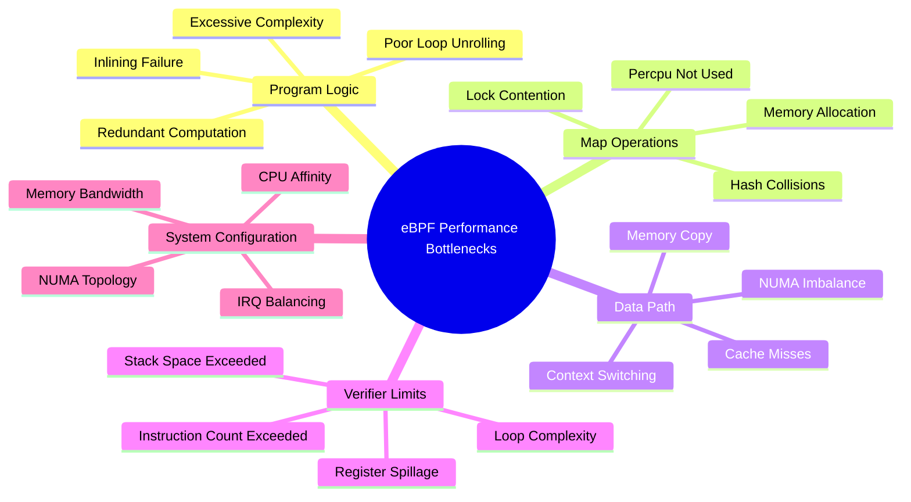

## 1.2 Performance Analysis Toolchain

## 1.2.1 Built-in BPF Performance Analysis

```c
// Use BPF_PERF_EVENT_ARRAY for performance sampling
#include <linux/bpf.h>
#include <bpf/bpf_helpers.h>
#include <linux/perf_event.h>

struct {
    __uint(type, BPF_MAP_TYPE_PERF_EVENT_ARRAY);
    __uint(key_size, sizeof(int));
    __uint(value_size, sizeof(int));
    __uint(max_entries, 256);
} perf_map SEC(".maps");

// Performance stats structure
struct perf_stats {
    __u64 count;
    __u64 total_ns;
    __u64 max_ns;
    __u64 min_ns;
};

struct {
    __uint(type, BPF_MAP_TYPE_PERCPU_ARRAY);
    __uint(key_size, sizeof(__u32));
    __uint(value_size, sizeof(struct perf_stats));
    __uint(max_entries, 1);
} stats_map SEC(".maps");

// Performance measurement macros
#define BPF_PERF_START(ts) \
    __u64 ts = bpf_ktime_get_ns()

#define BPF_PERF_END(ts, stats_key) do { \
    __u64 elapsed = bpf_ktime_get_ns() - ts; \
    __u32 key = stats_key; \
    struct perf_stats *s = bpf_map_lookup_elem(&stats_map, &key); \
    if (s) { \
        s->count++; \
        s->total_ns += elapsed; \
        if (elapsed > s->max_ns) s->max_ns = elapsed; \
        if (s->min_ns == 0 || elapsed < s->min_ns) s->min_ns = elapsed; \
    } \
} while(0)

SEC("xdp")
int xdp_perf_monitor(struct xdp_md *ctx)
{
    BPF_PERF_START(start_ts);
    
    // Main program logic...
    void *data = (void *)(long)ctx->data;
    void *data_end = (void *)(long)ctx->data_end;
    
    // Process packet
    // ...
    
    BPF_PERF_END(start_ts, 0);
    
    return XDP_PASS;
}

char LICENSE[] SEC("license") = "GPL";
```

## 1.2.2 perf and eBPF Collaborative Analysis

```bash
#!/bin/bash
# eBPF program performance analysis script

# Use perf to analyze eBPF program CPU usage
perf stat -e cycles,instructions,cache-misses,cache-references \
    -p $(pgrep -f "your_ebpf_loader") \
    sleep 10

# Use bpftool to view program statistics
bpftool prog show
bpftool prog dump xlated id <prog_id>

# View JIT code
bpftool prog dump jited id <prog_id>

# Get Map statistics
bpftool map show
bpftool map dump id <map_id>

# Use flamegraph to generate eBPF flame graph
perf record -F 99 -a -g -- sleep 30
perf script | stackcollapse-perf.pl > out.perf-folded
flamegraph.pl out.perf-folded > perf.svg
```

## 1.3 Performance Benchmark Framework

```c
// ebpf_benchmark.c - eBPF benchmark framework
#include <stdio.h>
#include <stdlib.h>
#include <time.h>
#include <bpf/libbpf.h>
#include <bpf/bpf.h>

#define BENCH_ITERATIONS 1000000
#define WARM_UP_ITERS    10000

typedef struct {
    const char *name;
    uint64_t total_ns;
    uint64_t min_ns;
    uint64_t max_ns;
    uint64_t iterations;
} bench_result_t;

static inline uint64_t get_time_ns(void)
{
    struct timespec ts;
    clock_gettime(CLOCK_MONOTONIC, &ts);
    return (uint64_t)ts.tv_sec * 1000000000ULL + ts.tv_nsec;
}

bench_result_t run_benchmark(const char *name, 
                             int (*bench_fn)(int map_fd),
                             int map_fd)
{
    bench_result_t result = {
        .name = name,
        .min_ns = UINT64_MAX,
        .max_ns = 0,
        .iterations = BENCH_ITERATIONS,
    };

    // Warm-up phase
    for (int i = 0; i < WARM_UP_ITERS; i++) {
        bench_fn(map_fd);
    }

    // Actual benchmark
    for (int i = 0; i < BENCH_ITERATIONS; i++) {
        uint64_t start = get_time_ns();
        bench_fn(map_fd);
        uint64_t elapsed = get_time_ns() - start;

        result.total_ns += elapsed;
        if (elapsed < result.min_ns) result.min_ns = elapsed;
        if (elapsed > result.max_ns) result.max_ns = elapsed;
    }

    return result;
}

void print_bench_result(const bench_result_t *r)
{
    printf("%-40s | avg: %6lu ns | min: %6lu ns | max: %6lu ns | "
           "throughput: %.2f M ops/s\n",
           r->name,
           r->total_ns / r->iterations,
           r->min_ns,
           r->max_ns,
           (double)r->iterations / (r->total_ns / 1000.0));
}
```

---

<!-- chunk: 2. XDP Performance Optimization -->## 2. XDP Performance Optimization

## 2.1 XDP Working Mode Deep Comparison

XDP (eXpress Data Path) is the most important technology for network performance optimization in eBPF, providing three working modes, each suitable for different scenarios.

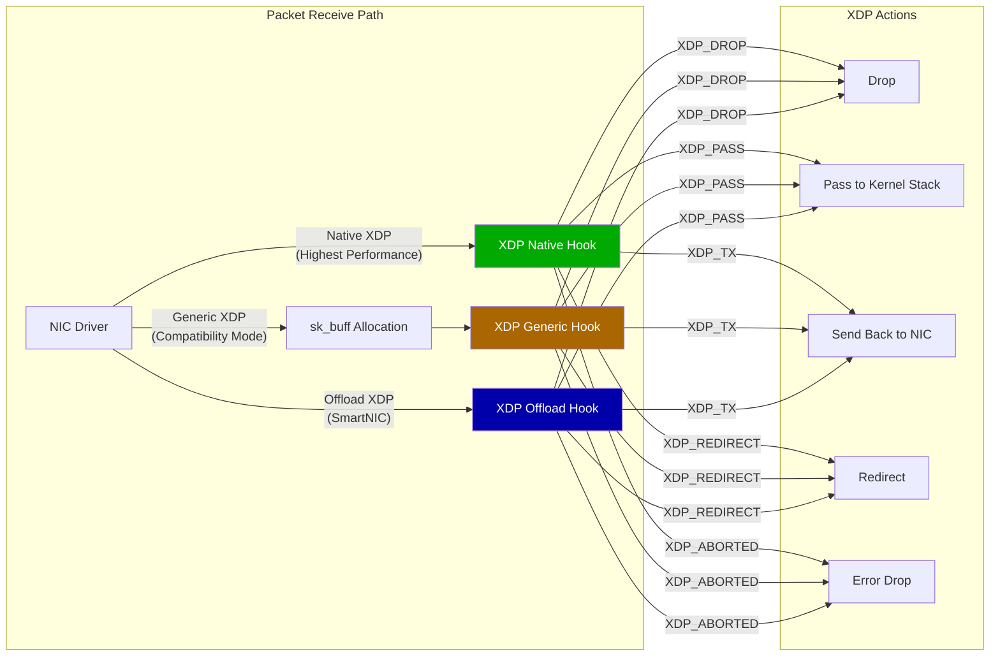

## 2.1.1 Native XDP Performance Optimization

```c
// xdp_native_optimized.c
// Native XDP optimization program example
#include <linux/bpf.h>
#include <linux/if_ether.h>
#include <linux/ip.h>
#include <linux/ipv6.h>
#include <linux/tcp.h>
#include <linux/udp.h>
#include <bpf/bpf_helpers.h>
#include <bpf/bpf_endian.h>

// Compiler optimization hints
#define likely(x)   __builtin_expect(!!(x), 1)
#define unlikely(x) __builtin_expect(!!(x), 0)

// Use __always_inline to ensure critical path inlining
#define FORCE_INLINE __attribute__((always_inline))

// IP blacklist Map (using LPM TRIE for efficient longest prefix matching)
struct {
    __uint(type, BPF_MAP_TYPE_LPM_TRIE);
    __type(key, struct bpf_lpm_trie_key);
    __uint(value_size, sizeof(__u8));
    __uint(max_entries, 65536);
    __uint(map_flags, BPF_F_NO_PREALLOC);
} blocklist SEC(".maps");

// Per-CPU statistics (avoid lock contention)
struct xdp_stats {
    __u64 rx_packets;
    __u64 rx_bytes;
    __u64 dropped_packets;
    __u64 passed_packets;
};

struct {
    __uint(type, BPF_MAP_TYPE_PERCPU_ARRAY);
    __type(key, __u32);
    __type(value, struct xdp_stats);
    __uint(max_entries, 1);
} stats SEC(".maps");

// Ethernet header parsing (force inline)
static FORCE_INLINE
int parse_ethhdr(void *data, void *data_end, 
                 struct ethhdr **eth, __u16 *proto)
{
    struct ethhdr *ethh = data;
    
    // Boundary check (required by verifier)
    if (ethh + 1 > (struct ethhdr *)data_end)
        return -1;
    
    *eth = ethh;
    *proto = bpf_ntohs(ethh->h_proto);
    
    return sizeof(struct ethhdr);
}

// IPv4 header parsing (force inline)
static FORCE_INLINE
int parse_iphdr(void *data, void *data_end, 
                int offset, struct iphdr **ip)
{
    struct iphdr *iph = data + offset;
    
    if (iph + 1 > (struct iphdr *)data_end)
        return -1;
    
    // Verify IP header length
    int hdr_len = iph->ihl * 4;
    if (hdr_len < sizeof(struct iphdr))
        return -1;
    
    if ((void *)iph + hdr_len > data_end)
        return -1;
    
    *ip = iph;
    return offset + hdr_len;
}

// Update statistics (Per-CPU lockless)
static FORCE_INLINE
void update_stats(int action, __u32 pkt_len)
{
    __u32 key = 0;
    struct xdp_stats *s = bpf_map_lookup_elem(&stats, &key);
    if (!s) return;
    
    s->rx_packets++;
    s->rx_bytes += pkt_len;
    
    if (action == XDP_DROP)
        s->dropped_packets++;
    else
        s->passed_packets++;
}

SEC("xdp")
int xdp_optimized_filter(struct xdp_md *ctx)
{
    void *data = (void *)(long)ctx->data;
    void *data_end = (void *)(long)ctx->data_end;
    __u32 pkt_len = ctx->data_end - ctx->data;
    
    struct ethhdr *eth;
    __u16 proto;
    int offset;
    
    // Parse ethernet header
    offset = parse_ethhdr(data, data_end, &eth, &proto);
    if (unlikely(offset < 0)) {
        update_stats(XDP_DROP, pkt_len);
        return XDP_DROP;
    }
    
    // Fast path: non-IP packets pass directly
    if (likely(proto != ETH_P_IP && proto != ETH_P_IPV6)) {
        update_stats(XDP_PASS, pkt_len);
        return XDP_PASS;
    }
    
    if (proto == ETH_P_IP) {
        struct iphdr *ip;
        offset = parse_iphdr(data, data_end, offset, &ip);
        if (unlikely(offset < 0)) {
            update_stats(XDP_DROP, pkt_len);
            return XDP_DROP;
        }
        
        // LPM prefix matching to check blacklist
        struct {
            __u32 prefixlen;
            __u32 addr;
        } lpm_key = {
            .prefixlen = 32,
            .addr = ip->saddr,
        };
        
        if (bpf_map_lookup_elem(&blocklist, &lpm_key)) {
            update_stats(XDP_DROP, pkt_len);
            return XDP_DROP;
        }
    }
    
    update_stats(XDP_PASS, pkt_len);
    return XDP_PASS;
}

char LICENSE[] SEC("license") = "GPL";
```

## 2.2 AF_XDP Zero-Copy Optimization

AF_XDP (Address Family XDP) provides kernel-to-userspace zero-copy data transmission capability, which is key technology for high-performance userspace network processing.

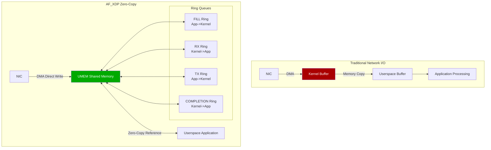

## 2.2.1 AF_XDP UMEM Configuration

```c
// af_xdp_zero_copy.c - AF_XDP zero-copy implementation
#include <linux/if_xdp.h>
#include <sys/mman.h>
#include <sys/socket.h>
#include <linux/if_link.h>
#include <bpf/xsk.h>

#define NUM_FRAMES      4096
#define FRAME_SIZE      XSK_UMEM__DEFAULT_FRAME_SIZE  // 4096 bytes
#define UMEM_SIZE       (NUM_FRAMES * FRAME_SIZE)

// UMEM structure
struct umem_info {
    void            *buffer;        // UMEM memory region
    struct xsk_umem *umem;          // libbpf UMEM handle
    struct xsk_ring_prod fq;        // FILL Ring
    struct xsk_ring_cons cq;        // COMPLETION Ring
};

// XSK Socket structure
struct xsk_socket_info {
    struct xsk_ring_cons rx;        // RX Ring
    struct xsk_ring_prod tx;        // TX Ring
    struct xsk_socket   *xsk;       // libbpf XSK handle
    struct umem_info    *umem;
    
    uint32_t outstanding_tx;        // Pending TX packets
};

// Initialize UMEM
static int init_umem(struct umem_info *umem_info)
{
    // Allocate UMEM memory (use huge pages to improve performance)
    umem_info->buffer = mmap(NULL, UMEM_SIZE,
                             PROT_READ | PROT_WRITE,
                             MAP_PRIVATE | MAP_ANONYMOUS | MAP_HUGETLB,
                             -1, 0);
    
    if (umem_info->buffer == MAP_FAILED) {
        // Huge page allocation failed, fallback to normal memory
        umem_info->buffer = mmap(NULL, UMEM_SIZE,
                                 PROT_READ | PROT_WRITE,
                                 MAP_PRIVATE | MAP_ANONYMOUS,
                                 -1, 0);
    }
    
    if (umem_info->buffer == MAP_FAILED) {
        perror("mmap UMEM");
        return -1;
    }

    // Configure UMEM
    struct xsk_umem_config umem_cfg = {
        .fill_size      = XSK_RING_PROD__DEFAULT_NUM_DESCS,
        .comp_size      = XSK_RING_CONS__DEFAULT_NUM_DESCS,
        .frame_size     = FRAME_SIZE,
        .frame_headroom = XSK_UMEM__DEFAULT_FRAME_HEADROOM,
        .flags          = 0,
    };

    int ret = xsk_umem__create(&umem_info->umem,
                               umem_info->buffer, UMEM_SIZE,
                               &umem_info->fq, &umem_info->cq,
                               &umem_cfg);
    if (ret) {
        fprintf(stderr, "xsk_umem__create failed: %s\n", strerror(-ret));
        return -1;
    }

    // Pre-fill FILL Ring
    uint32_t idx;
    int stock = xsk_ring_prod__reserve(&umem_info->fq, 
                                        NUM_FRAMES / 2, &idx);
    
    for (int i = 0; i < stock; i++) {
        *xsk_ring_prod__fill_addr(&umem_info->fq, idx++) = 
            (uint64_t)(i * FRAME_SIZE);
    }
    
    xsk_ring_prod__submit(&umem_info->fq, stock);
    
    return 0;
}

// High-performance RX processing loop
static int rx_process_batch(struct xsk_socket_info *xsk, 
                            int batch_size)
{
    uint32_t idx_rx = 0, idx_fq = 0;
    int rcvd, stock_frames;
    
    // Batch receive packets
    rcvd = xsk_ring_cons__peek(&xsk->rx, batch_size, &idx_rx);
    if (!rcvd)
        return 0;
    
    // Refill FILL Ring
    stock_frames = xsk_prod_nb_free(&xsk->umem->fq, 
                                     xsk_cons_nb_avail(&xsk->rx, batch_size));
    
    if (stock_frames > 0) {
        int ret = xsk_ring_prod__reserve(&xsk->umem->fq, 
                                          stock_frames, &idx_fq);
        
        for (int i = 0; i < ret; i++) {
            // Recycle processed frames to FILL Ring
            uint64_t addr = xsk_ring_cons__rx_desc(&xsk->rx, 
                                idx_rx + i)->addr;
            *xsk_ring_prod__fill_addr(&xsk->umem->fq, idx_fq++) = 
                xsk_umem__extract_addr(addr);
        }
        
        xsk_ring_prod__submit(&xsk->umem->fq, ret);
    }
    
    // Process received packets
    for (int i = 0; i < rcvd; i++) {
        const struct xdp_desc *desc = 
            xsk_ring_cons__rx_desc(&xsk->rx, idx_rx++);
        
        uint64_t addr = xsk_umem__add_offset_to_addr(desc->addr);
        uint8_t *pkt = xsk_umem__get_data(xsk->umem->buffer, addr);
        uint32_t len = desc->len;
        
        // Zero-copy packet processing
        process_packet(pkt, len);
    }
    
    xsk_ring_cons__release(&xsk->rx, rcvd);
    
    return rcvd;
}
```

## 2.3 XDP Batch Processing Optimization

```c
// xdp_batch_processing.c - XDP batch processing optimization
#include <linux/bpf.h>
#include <bpf/bpf_helpers.h>
#include <linux/if_ether.h>
#include <linux/ip.h>

// CPU Map for batch redirection (reduce cross-CPU transfer overhead)
struct {
    __uint(type, BPF_MAP_TYPE_CPUMAP);
    __type(key, __u32);
    __uint(value_size, sizeof(struct bpf_cpumap_val));
    __uint(max_entries, 64);  // Maximum CPU count
} cpu_map SEC(".maps");

// DEVMAP for batch NIC redirection
struct {
    __uint(type, BPF_MAP_TYPE_DEVMAP_HASH);
    __type(key, __u32);
    __uint(value_size, sizeof(struct bpf_devmap_val));
    __uint(max_entries, 256);
} dev_map SEC(".maps");

// XDP batch redirect to CPU Map (implement RSS replacement)
SEC("xdp")
int xdp_cpu_redirect(struct xdp_md *ctx)
{
    void *data = (void *)(long)ctx->data;
    void *data_end = (void *)(long)ctx->data_end;
    
    struct ethhdr *eth = data;
    if (eth + 1 > (struct ethhdr *)data_end)
        return XDP_ABORTED;
    
    // Calculate target CPU based on IP 5-tuple hash
    __u32 cpu = 0;
    
    if (bpf_ntohs(eth->h_proto) == ETH_P_IP) {
        struct iphdr *ip = data + sizeof(struct ethhdr);
        if (ip + 1 > (struct iphdr *)data_end)
            return XDP_ABORTED;
        
        // Simple hash: src_ip XOR dst_ip
        __u32 hash = ip->saddr ^ ip->daddr;
        hash ^= hash >> 16;
        hash ^= hash >> 8;
        
        // Get available CPU count
        __u32 num_cpus = bpf_num_possible_cpus();
        cpu = hash % num_cpus;
    }
    
    // Redirect to target CPU (batch processing done internally by CPUMAP)
    return bpf_redirect_map(&cpu_map, cpu, 0);
}

// XDP batch forward to NIC
SEC("xdp")
int xdp_dev_redirect(struct xdp_md *ctx)
{
    void *data = (void *)(long)ctx->data;
    void *data_end = (void *)(long)ctx->data_end;
    
    struct ethhdr *eth = data;
    if (eth + 1 > (struct ethhdr *)data_end)
        return XDP_ABORTED;
    
    // Lookup target NIC interface index
    __u32 ifindex = 0;
    
    // ... routing lookup logic ...
    
    // Batch redirect (DEVMAP supports batch send)
    return bpf_redirect_map(&dev_map, ifindex, BPF_F_BROADCAST);
}

char LICENSE[] SEC("license") = "GPL";
```

---

<!-- chunk: 3. TC Performance Optimization -->## 3. TC Performance Optimization

## 3.1 TC Direct Action Mode

TC (Traffic Control) subsystem eBPF programs support Direct Action mode, allowing BPF programs to directly return TC actions, avoiding transmission overhead between multiple classifiers/actions.

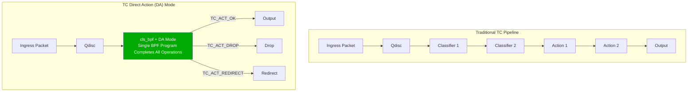

## 3.1.1 TC Direct Action Implementation

```c
// tc_direct_action.c - TC Direct Action optimization
#include <linux/bpf.h>
#include <linux/pkt_cls.h>
#include <linux/if_ether.h>
#include <linux/ip.h>
#include <linux/tcp.h>
#include <bpf/bpf_helpers.h>
#include <bpf/bpf_endian.h>

// TC return codes (Direct Action mode)
#define TC_ACT_OK           0   // Continue processing
#define TC_ACT_RECLASSIFY   1   // Reclassify
#define TC_ACT_SHOT         2   // Drop
#define TC_ACT_PIPE         3   // Pipe
#define TC_ACT_STOLEN       4   // Stolen
#define TC_ACT_QUEUED       5   // Queued
#define TC_ACT_REPEAT       6   // Repeat
#define TC_ACT_REDIRECT     7   // Redirect

// Connection tracking Map
struct conn_key {
    __u32 src_ip;
    __u32 dst_ip;
    __u16 src_port;
    __u16 dst_port;
    __u8  proto;
    __u8  pad[3];
};

struct conn_val {
    __u64 packets;
    __u64 bytes;
    __u64 last_seen;
    __u8  state;    // TCP state
};

struct {
    __uint(type, BPF_MAP_TYPE_LRU_HASH);
    __type(key, struct conn_key);
    __type(value, struct conn_val);
    __uint(max_entries, 1000000);   // 1 million concurrent connections
} conn_table SEC(".maps");

// Fast packet header parsing
static __always_inline
int parse_pkt_headers(struct __sk_buff *skb,
                      struct ethhdr **eth,
                      struct iphdr **ip,
                      struct tcphdr **tcp)
{
    void *data = (void *)(long)skb->data;
    void *data_end = (void *)(long)skb->data_end;
    int offset = 0;
    
    // Ethernet header
    *eth = data + offset;
    if (*eth + 1 > (struct ethhdr *)data_end)
        return -1;
    offset += sizeof(struct ethhdr);
    
    // IP header
    if (bpf_ntohs((*eth)->h_proto) != ETH_P_IP)
        return -2;  // Non-IPv4
    
    *ip = data + offset;
    if (*ip + 1 > (struct iphdr *)data_end)
        return -1;
    
    int ip_hdr_len = (*ip)->ihl * 4;
    if (ip_hdr_len < sizeof(struct iphdr))
        return -1;
    offset += ip_hdr_len;
    
    // TCP header (TCP packets only)
    if ((*ip)->protocol != IPPROTO_TCP)
        return 0;   // Non-TCP, but parsing succeeded
    
    *tcp = data + offset;
    if (*tcp + 1 > (struct tcphdr *)data_end)
        return -1;
    
    return 0;
}

// TC ingress filter (Direct Action mode)
SEC("tc")
int tc_ingress_filter(struct __sk_buff *skb)
{
    struct ethhdr *eth = NULL;
    struct iphdr  *ip  = NULL;
    struct tcphdr *tcp = NULL;
    
    int ret = parse_pkt_headers(skb, &eth, &ip, &tcp);
    if (ret < 0)
        return TC_ACT_SHOT;     // Malformed packet, drop directly
    
    if (!ip)
        return TC_ACT_OK;       // Non-IP packet, pass directly
    
    // Build connection tracking Key
    struct conn_key key = {};
    key.src_ip = ip->saddr;
    key.dst_ip = ip->daddr;
    key.proto  = ip->protocol;
    
    if (tcp) {
        key.src_port = bpf_ntohs(tcp->source);
        key.dst_port = bpf_ntohs(tcp->dest);
    }
    
    // Lookup or create connection tracking entry
    struct conn_val *conn = bpf_map_lookup_elem(&conn_table, &key);
    if (conn) {
        // Update existing connection (Per-CPU LRU, no lock contention)
        __sync_fetch_and_add(&conn->packets, 1);
        __sync_fetch_and_add(&conn->bytes, skb->len);
        conn->last_seen = bpf_ktime_get_ns();
    } else {
        // Create new connection
        struct conn_val new_conn = {
            .packets   = 1,
            .bytes     = skb->len,
            .last_seen = bpf_ktime_get_ns(),
            .state     = tcp ? 1 : 0,
        };
        bpf_map_update_elem(&conn_table, &key, &new_conn, BPF_NOEXIST);
    }
    
    return TC_ACT_OK;
}

// TC egress QoS shaping (Direct Action)
SEC("tc")
int tc_egress_qos(struct __sk_buff *skb)
{
    // Mark packet priority (for QoS shaping)
    // DSCP marking: priority traffic marked as CS4 (100)
    
    struct iphdr *ip = (void *)(long)skb->data + sizeof(struct ethhdr);
    void *data_end   = (void *)(long)skb->data_end;
    
    if (ip + 1 > (struct iphdr *)data_end)
        return TC_ACT_OK;
    
    // Set DSCP based on destination port
    if (ip->protocol == IPPROTO_TCP) {
        struct tcphdr *tcp = (void *)ip + ip->ihl * 4;
        if (tcp + 1 > (struct tcphdr *)data_end)
            return TC_ACT_OK;
        
        __u16 dport = bpf_ntohs(tcp->dest);
        
        // High priority ports (e.g., SSH, DNS)
        if (dport == 22 || dport == 53) {
            // Set DSCP CS4 (Expedited Forwarding)
            bpf_skb_store_bytes(skb, sizeof(struct ethhdr) + 1,
                               &(__u8){0xa0}, 1, BPF_F_RECOMPUTE_CSUM);
        }
    }
    
    return TC_ACT_OK;
}

char LICENSE[] SEC("license") = "GPL";
```

## 3.2 TC Hardware Offload Optimization

```bash
#!/bin/bash
# TC hardware offload configuration script

INTERFACE="eth0"

# Check if NIC supports TC offload
ethtool -k $INTERFACE | grep -E "hw-tc-offload|xdp-offload"

# Enable TC hardware offload
ethtool -K $INTERFACE hw-tc-offload on

# Load BPF program supporting TC offload
tc qdisc add dev $INTERFACE clsact

# Add TC ingress filter (support hardware offload)
tc filter add dev $INTERFACE ingress \
    bpf object-file tc_direct_action.o \
    section tc \
    direct-action \
    offload   # Enable hardware offload

# Verify successful offload to hardware
tc filter show dev $INTERFACE ingress

# View TC statistics
tc -s filter show dev $INTERFACE ingress
```

---

<!-- chunk: 4. Map Performance Optimization -->## 4. Map Performance Optimization

## 4.1 Map Type Selection Strategy

Map is the core data structure of eBPF programs, and choosing the right Map type is critical to performance.

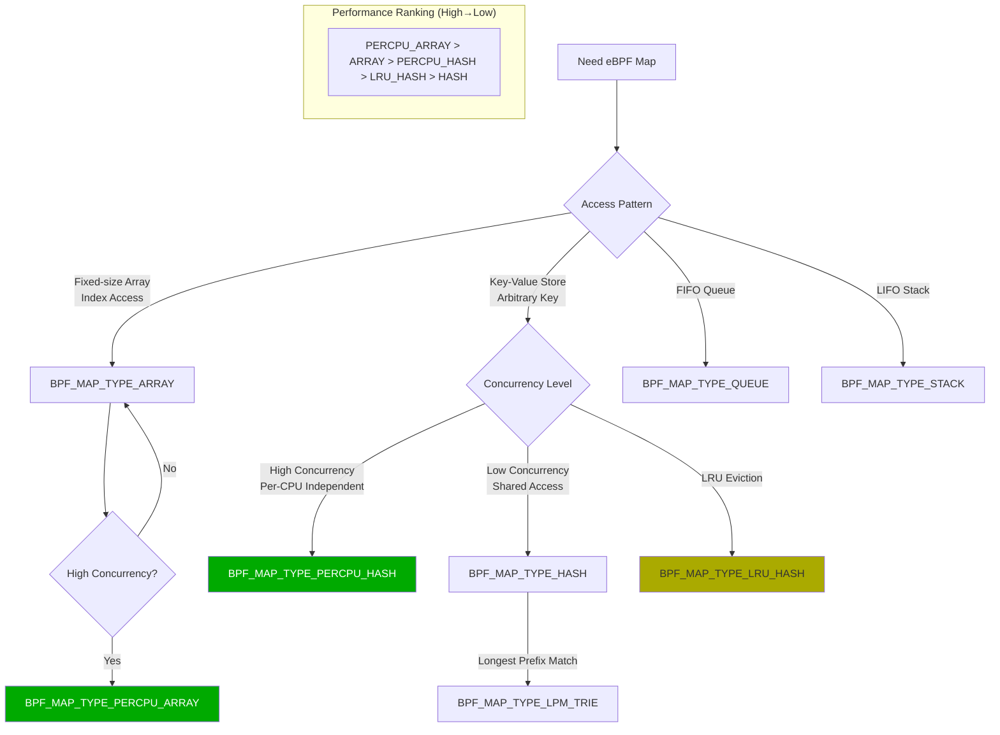

## 4.1.1 Per-CPU Map Performance Optimization

```c
// percpu_map_optimization.c - Per-CPU Map optimization
#include <linux/bpf.h>
#include <bpf/bpf_helpers.h>

// Comparison: Normal Hash Map (lock contention)
struct {
    __uint(type, BPF_MAP_TYPE_HASH);
    __type(key, __u32);
    __type(value, __u64);
    __uint(max_entries, 65536);
} normal_hash SEC(".maps");

// Optimization: Per-CPU Hash Map (lockless, CPU-local)
struct {
    __uint(type, BPF_MAP_TYPE_PERCPU_HASH);
    __type(key, __u32);
    __type(value, __u64);
    __uint(max_entries, 65536);
} percpu_hash SEC(".maps");

// Optimization: Per-CPU Array (highest performance)
struct {
    __uint(type, BPF_MAP_TYPE_PERCPU_ARRAY);
    __type(key, __u32);
    __type(value, __u64);
    __uint(max_entries, 256);   // Small size, suitable for frequent access
} percpu_array SEC(".maps");

// Statistics counter: use Per-CPU Array to avoid locks
struct pkt_counter {
    __u64 rx_pkts;
    __u64 rx_bytes;
    __u64 tx_pkts;
    __u64 tx_bytes;
    __u64 drops;
    __u64 errors;
    // Align to cache line (64 bytes) to prevent false sharing
    __u64 pad[2];
};

struct {
    __uint(type, BPF_MAP_TYPE_PERCPU_ARRAY);
    __type(key, __u32);
    __type(value, struct pkt_counter);
    __uint(max_entries, 1);
} pkt_stats SEC(".maps");

SEC("xdp")
int xdp_percpu_demo(struct xdp_md *ctx)
{
    __u32 key = 0;
    struct pkt_counter *counter = bpf_map_lookup_elem(&pkt_stats, &key);
    if (!counter)
        return XDP_PASS;
    
    // Per-CPU Map: no atomic operations needed, directly update this CPU's copy
    counter->rx_pkts++;
    counter->rx_bytes += (ctx->data_end - ctx->data);
    
    return XDP_PASS;
}

// Userspace aggregate Per-CPU statistics
// (userspace code)
/*
void aggregate_percpu_stats(int map_fd) {
    __u32 key = 0;
    int num_cpus = libbpf_num_possible_cpus();
    struct pkt_counter values[num_cpus];
    
    bpf_map_lookup_elem(map_fd, &key, values);
    
    struct pkt_counter total = {};
    for (int i = 0; i < num_cpus; i++) {
        total.rx_pkts  += values[i].rx_pkts;
        total.rx_bytes += values[i].rx_bytes;
        total.drops    += values[i].drops;
    }
    
    printf("RX: %llu pkts, %llu bytes, %llu drops\n",
           total.rx_pkts, total.rx_bytes, total.drops);
}
*/

char LICENSE[] SEC("license") = "GPL";
```

## 4.2 Map Batch Operations

Kernel 5.6+ introduced Map Batch operations, allowing multiple Map entry read/write in a single system call, significantly reducing syscall overhead.

```c
// map_batch_operations.c - Map batch operations example
#include <bpf/libbpf.h>
#include <bpf/bpf.h>
#include <stdio.h>
#include <stdlib.h>

#define BATCH_SIZE 1024

// Batch lookup Map entries
int batch_lookup_map(int map_fd, int total_entries)
{
    __u32 keys[BATCH_SIZE];
    __u64 values[BATCH_SIZE];
    __u32 count = BATCH_SIZE;
    __u32 batch_out = 0;
    void *in_batch = NULL;
    int ret;
    int total_read = 0;
    
    while (1) {
        ret = bpf_map_lookup_batch(map_fd,
                                   in_batch,    // Previous batch end position
                                   &batch_out,  // Current batch start (output)
                                   keys,
                                   values,
                                   &count,
                                   NULL);
        
        if (ret && ret != -ENOENT) {
            fprintf(stderr, "bpf_map_lookup_batch: %s\n", 
                    strerror(-ret));
            return -1;
        }
        
        total_read += count;
        
        // Process this batch of data
        for (int i = 0; i < count; i++) {
            // Process keys[i] and values[i]
            process_entry(keys[i], values[i]);
        }
        
        if (ret == -ENOENT)
            break;  // Traversed all entries
        
        in_batch = &batch_out;
        count = BATCH_SIZE;
    }
    
    printf("Total entries read: %d\n", total_read);
    return total_read;
}

// Batch update Map entries
int batch_update_map(int map_fd, __u32 *keys, __u64 *values, int count)
{
    __u32 batch_count = count;
    
    int ret = bpf_map_update_batch(map_fd,
                                    keys, values,
                                    &batch_count,
                                    NULL);
    if (ret) {
        fprintf(stderr, "bpf_map_update_batch failed: %s "
                "(updated %u/%d entries)\n",
                strerror(-ret), batch_count, count);
        return -1;
    }
    
    printf("Updated %u entries in single syscall\n", batch_count);
    return batch_count;
}

// Batch delete expired Map entries
int batch_delete_expired(int map_fd, uint64_t timeout_ns)
{
    __u32 keys[BATCH_SIZE];
    struct conn_val values[BATCH_SIZE];
    __u32 count = BATCH_SIZE;
    __u32 batch_out = 0;
    void *in_batch = NULL;
    
    __u32 del_keys[BATCH_SIZE];
    int del_count = 0;
    uint64_t now = get_time_ns();
    int ret;
    
    // First find expired entries
    while (1) {
        ret = bpf_map_lookup_batch(map_fd, in_batch, &batch_out,
                                    keys, values, &count, NULL);
        
        for (int i = 0; i < count; i++) {
            if (now - values[i].last_seen > timeout_ns) {
                del_keys[del_count++] = keys[i];
            }
        }
        
        if (ret == -ENOENT) break;
        in_batch = &batch_out;
        count = BATCH_SIZE;
    }
    
    // Batch delete expired entries
    if (del_count > 0) {
        __u32 deleted = del_count;
        bpf_map_delete_batch(map_fd, del_keys, &deleted, NULL);
        printf("Deleted %u expired entries\n", deleted);
    }
    
    return del_count;
}
```

## 4.3 Map Preallocation and Memory Optimization

```c
// map_prealloc_config.c - Map preallocation configuration

// Method 1: Preallocate all entries (reduce runtime memory allocation overhead)
struct {
    __uint(type, BPF_MAP_TYPE_HASH);
    __type(key, __u32);
    __type(value, __u64);
    __uint(max_entries, 65536);
    // Don't set BPF_F_NO_PREALLOC, preallocate all entries by default
} preallocated_map SEC(".maps");

// Method 2: Allocate on demand (save memory, suitable for sparse access)
struct {
    __uint(type, BPF_MAP_TYPE_HASH);
    __type(key, __u32);
    __type(value, __u64);
    __uint(max_entries, 1000000);  // 1 million entries, but allocate on demand
    __uint(map_flags, BPF_F_NO_PREALLOC);
} on_demand_map SEC(".maps");

// Method 3: NUMA-aware memory allocation
// (via bpf_map_create's NUMA node parameter)
/*
struct bpf_map_create_opts opts = {
    .sz         = sizeof(opts),
    .numa_node  = 0,    // NUMA node 0
    .map_flags  = BPF_F_NUMA_NODE,
};
*/
```

---

<!-- chunk: 5. Verifier Optimization -->## 5. Verifier Optimization

## 5.1 Verifier Working Principle

The eBPF verifier is the core of eBPF security, but also a limiting factor for program complexity. Understanding the verifier's working principle helps write more efficient and compliant programs.

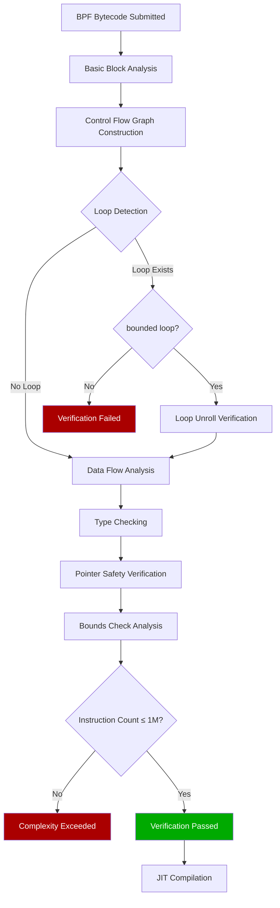

## 5.2 Loop Optimization Techniques

```c
// verifier_loop_optimization.c - Loop optimization techniques

// Method 1: Use #pragma unroll to unroll loops (suitable for small fixed-iteration loops)
SEC("xdp")
int xdp_loop_unroll(struct xdp_md *ctx)
{
    __u8 result = 0;
    __u8 data[16] = {};  // Assume correctly obtained
    
    // Manually unroll loop (avoid verifier complexity issues)
    #pragma unroll
    for (int i = 0; i < 16; i++) {
        result ^= data[i];
    }
    
    return XDP_PASS;
}

// Method 2: Bounded loop (Kernel 5.3+)
SEC("xdp")
int xdp_bounded_loop(struct xdp_md *ctx)
{
    void *data = (void *)(long)ctx->data;
    void *data_end = (void *)(long)ctx->data_end;
    
    // Bounded loop: verifier can infer loop iteration upper bound
    // Condition: loop variable must change in single direction with clear bounds
    for (int i = 0; i < 64; i++) {  // Clear upper bound
        if (data + i + 1 > data_end)
            break;
        
        __u8 *byte = data + i;
        // Process each byte
        (void)byte;
    }
    
    return XDP_PASS;
}

// Method 3: bpf_loop helper function (Kernel 5.17+, most flexible)
struct loop_ctx {
    void *data;
    void *data_end;
    __u32 found;
    __u32 search_value;
};

static int search_callback(__u32 index, void *ctx_ptr)
{
    struct loop_ctx *ctx = ctx_ptr;
    
    if (ctx->data + index + 1 > ctx->data_end)
        return 1;  // Stop loop
    
    __u8 *byte = ctx->data + index;
    if (*byte == ctx->search_value) {
        ctx->found = 1;
        return 1;  // Found, stop loop
    }
    
    return 0;  // Continue loop
}

SEC("xdp")
int xdp_bpf_loop(struct xdp_md *ctx)
{
    struct loop_ctx lctx = {
        .data  = (void *)(long)ctx->data,
        .data_end = (void *)(long)ctx->data_end,
        .found = 0,
        .search_value = 0x45,  // Search for IPv4 version field
    };
    
    __u32 max_iter = ctx->data_end - ctx->data;
    if (max_iter > 1500) max_iter = 1500;  // Limit maximum iterations
    
    // bpf_loop: verifier-friendly variable-iteration loop
    bpf_loop(max_iter, search_callback, &lctx, 0);
    
    if (lctx.found)
        return XDP_PASS;
    
    return XDP_DROP;
}

char LICENSE[] SEC("license") = "GPL";
```

## 5.3 Inline Functions and Code Reuse

```c
// inline_optimization.c - Inline function optimization

// Force inline: ensure critical path has no function call overhead
static __always_inline
__u32 compute_hash(__u32 src_ip, __u32 dst_ip, 
                   __u16 src_port, __u16 dst_port)
{
    // Fowler-Noll-Vo (FNV) hash
    __u32 hash = 2166136261UL;
    
    hash ^= src_ip;
    hash *= 16777619;
    hash ^= dst_ip;
    hash *= 16777619;
    hash ^= ((__u32)src_port << 16) | dst_port;
    hash *= 16777619;
    
    return hash;
}

// Avoid unnecessary inlining: separate large functions as Tail Calls
// This bypasses single BPF program instruction count limits
struct {
    __uint(type, BPF_MAP_TYPE_PROG_ARRAY);
    __uint(key_size, sizeof(__u32));
    __uint(value_size, sizeof(__u32));
    __uint(max_entries, 8);
} prog_array SEC(".maps");

#define PROG_HEAVY_PROCESSING 0
#define PROG_LOG_AND_AUDIT    1
#define PROG_RATE_LIMIT       2

SEC("xdp")
int xdp_main_entry(struct xdp_md *ctx)
{
    // Lightweight fast-path processing
    void *data = (void *)(long)ctx->data;
    void *data_end = (void *)(long)ctx->data_end;
    
    struct ethhdr *eth = data;
    if (eth + 1 > (struct ethhdr *)data_end)
        return XDP_DROP;
    
    __u16 proto = bpf_ntohs(eth->h_proto);
    
    if (proto == ETH_P_IP) {
        // Need deep processing, use Tail Call to jump
        bpf_tail_call(ctx, &prog_array, PROG_HEAVY_PROCESSING);
        // Tail Call failed, continue
    }
    
    return XDP_PASS;
}

char LICENSE[] SEC("license") = "GPL";
```

## 5.4 Stack Space Optimization

eBPF program stack space is limited to 512 bytes, proper stack space management is key to avoiding verifier failures.

```c
// stack_optimization.c - Stack space optimization

// Problem example: Large structure occupies full stack space
// BAD: 
// struct large_struct { char data[400]; } s;  // Occupies 400 bytes of stack space

// Optimization method 1: Use BPF_MAP_TYPE_PERCPU_ARRAY as "heap"
struct large_buffer {
    char data[4096];    // Large buffer in Map
};

struct {
    __uint(type, BPF_MAP_TYPE_PERCPU_ARRAY);
    __type(key, __u32);
    __type(value, struct large_buffer);
    __uint(max_entries, 1);
} scratch_map SEC(".maps");

SEC("xdp")
int xdp_large_buffer(struct xdp_md *ctx)
{
    __u32 key = 0;
    struct large_buffer *buf = bpf_map_lookup_elem(&scratch_map, &key);
    if (!buf)
        return XDP_PASS;
    
    // Safely use large buffer (stored in Map, not occupying stack)
    bpf_probe_read_kernel(buf->data, sizeof(buf->data), 
                          (void *)(long)ctx->data);
    
    return XDP_PASS;
}

// Optimization method 2: Use ringbuf instead of perf_event (more efficient)
struct event_data {
    __u64 timestamp;
    __u32 src_ip;
    __u32 dst_ip;
    __u16 src_port;
    __u16 dst_port;
    __u8  proto;
    __u8  action;
    char  comm[16];
};

struct {
    __uint(type, BPF_MAP_TYPE_RINGBUF);
    __uint(max_entries, 256 * 1024);    // 256KB ring buffer
} events SEC(".maps");

SEC("xdp")
int xdp_ringbuf_output(struct xdp_md *ctx)
{
    // Reserve space from Ring Buffer (avoid allocating large structures on stack)
    struct event_data *event = bpf_ringbuf_reserve(&events, 
                                                    sizeof(*event), 0);
    if (!event)
        return XDP_PASS;
    
    event->timestamp = bpf_ktime_get_ns();
    // Fill other fields...
    
    bpf_ringbuf_submit(event, 0);
    
    return XDP_PASS;
}

char LICENSE[] SEC("license") = "GPL";
```

---

<!-- chunk: 6. Memory Management and Stack Optimization -->## 6. Memory Management and Stack Optimization

## 6.1 Memory Access Pattern Optimization

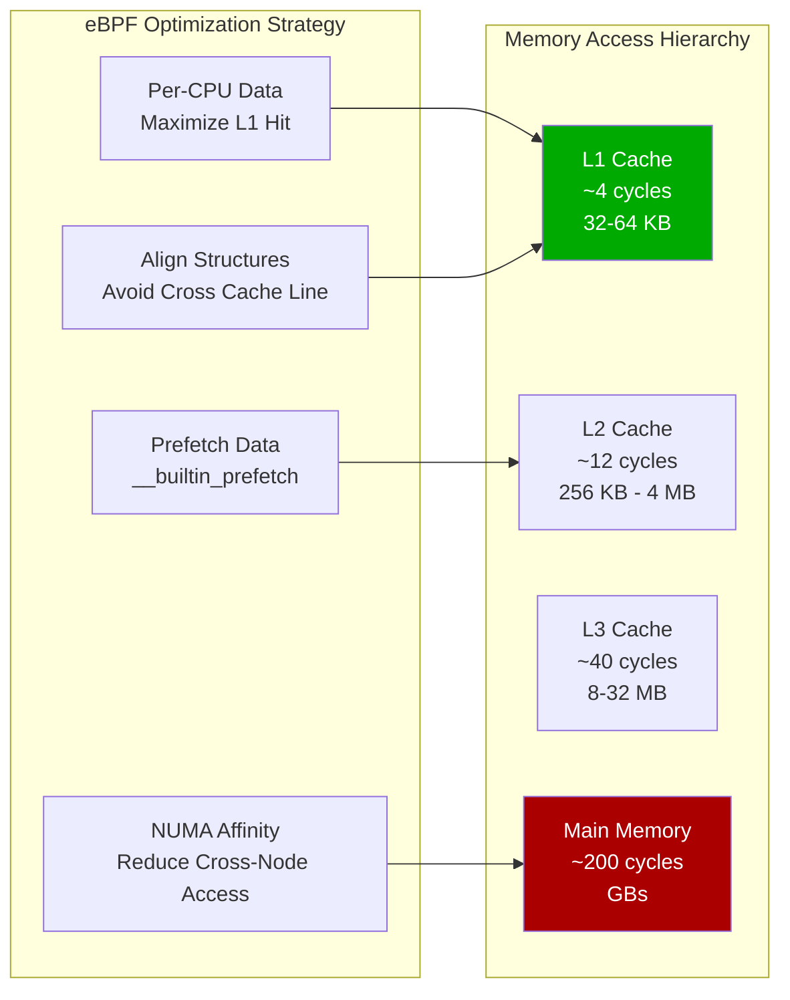

## 6.1.1 Cache-Friendly Data Structure Design

```c
// cache_friendly_structures.c - Cache-friendly data structures

// BAD: Structure member order causes padding, wastes cache line
struct bad_layout {
    __u8   flags;       // 1 byte
    __u64  timestamp;   // 8 bytes (7 bytes padding before)
    __u16  port;        // 2 bytes
    __u32  ip;          // 4 bytes (2 bytes padding before)
    __u8   proto;       // 1 byte
    // Total: 1+7+8+2+2+4+1 = 25 bytes, padded to 32
};

// GOOD: Order by size descending, minimize padding
struct good_layout {
    __u64  timestamp;   // 8 bytes
    __u32  ip;          // 4 bytes
    __u16  port;        // 2 bytes
    __u8   proto;       // 1 byte
    __u8   flags;       // 1 byte
    // Total: 16 bytes, perfectly aligned
} __attribute__((packed));

// Cache line alignment (64 bytes) to prevent false sharing
struct __attribute__((aligned(64))) percpu_counter {
    __u64  rx_pkts;
    __u64  rx_bytes;
    __u64  tx_pkts;
    __u64  tx_bytes;
    // Pad to 64 bytes
    __u64  pad[4];
};

// BPF Map Key optimization: use minimum necessary fields
struct flow_key {
    __u32 src_ip;
    __u32 dst_ip;
    __u16 src_port;
    __u16 dst_port;
    __u8  proto;
    __u8  pad[3];   // Explicit padding to ensure alignment
} __attribute__((packed));

// Data prefetch optimization (suitable for known access patterns)
static __always_inline
void prefetch_next_packet(void *next_pkt)
{
    // Prefetch next packet to L1 cache
    __builtin_prefetch(next_pkt, 0, 3);  // Read, high temporal locality
}
```

## 6.2 BPF Ring Buffer Efficient Memory Management

```c
// ringbuf_management.c - Ring Buffer efficient usage

#include <linux/bpf.h>
#include <bpf/bpf_helpers.h>

// Ring Buffer Map (more efficient than perf_event_array)
struct {
    __uint(type, BPF_MAP_TYPE_RINGBUF);
    __uint(max_entries, 1 << 20);   // 1MB ring buffer
} ringbuf SEC(".maps");

struct network_event {
    __u64  timestamp_ns;
    __u32  src_ip;
    __u32  dst_ip;
    __u16  src_port;
    __u16  dst_port;
    __u8   proto;
    __u8   direction;  // 0=ingress, 1=egress
    __u16  pkt_len;
    __u32  cpu;
    // Variable-length payload (optional)
};

// Efficient write to Ring Buffer (no copy)
SEC("tc")
int tc_capture_events(struct __sk_buff *skb)
{
    // Method 1: reserve + submit (two-step, allows direct modification)
    struct network_event *event;
    event = bpf_ringbuf_reserve(&ringbuf, sizeof(*event), 0);
    if (!event)
        return TC_ACT_OK;  // Buffer full, but don't affect packet processing
    
    // Directly fill event (no intermediate copy)
    event->timestamp_ns = bpf_ktime_get_ns();
    event->src_ip    = skb->remote_ip4;
    event->dst_ip    = skb->local_ip4;
    event->pkt_len   = skb->len;
    event->cpu       = bpf_get_smp_processor_id();
    
    // Submit event to userspace
    bpf_ringbuf_submit(event, 0);
    
    return TC_ACT_OK;
}

// Method 2: output (one-step, uses stack data)
SEC("kprobe/tcp_sendmsg")
int kprobe_tcp_sendmsg(struct pt_regs *ctx)
{
    struct network_event event = {};
    
    event.timestamp_ns = bpf_ktime_get_ns();
    event.cpu          = bpf_get_smp_processor_id();
    
    // Complete copy and submit in one call
    bpf_ringbuf_output(&ringbuf, &event, sizeof(event), 0);
    
    return 0;
}

char LICENSE[] SEC("license") = "GPL";
```

---

<!-- chunk: 7. Tail Call and Program Chain Optimization -->## 7. Tail Call and Program Chain Optimization

## 7.1 Tail Call Mechanism and Performance

Tail Call allows eBPF programs to jump to another BPF program, bypassing single-program instruction count limits, enabling chain-style processing.

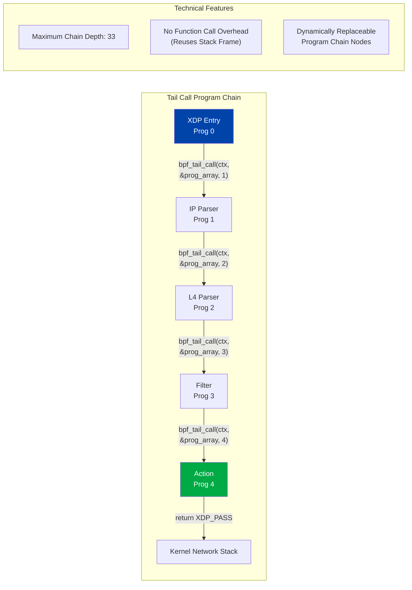

## 7.1.1 Tail Call Program Chain Implementation

```c
// tail_call_chain.c - Program chain optimization implementation

#include <linux/bpf.h>
#include <linux/if_ether.h>
#include <linux/ip.h>
#include <linux/tcp.h>
#include <linux/udp.h>
#include <bpf/bpf_helpers.h>

// Program index definitions
#define PROG_PARSE_ETH   0
#define PROG_PARSE_IP    1
#define PROG_PARSE_L4    2
#define PROG_FILTER      3
#define PROG_FORWARD     4

struct {
    __uint(type, BPF_MAP_TYPE_PROG_ARRAY);
    __uint(key_size, sizeof(__u32));
    __uint(value_size, sizeof(__u32));
    __uint(max_entries, 8);
} prog_array SEC(".maps");

// Parse state (passed between programs via Per-CPU Map)
struct parse_state {
    __u16 eth_proto;
    __u8  ip_proto;
    __u8  ip_hdr_len;
    __u32 src_ip;
    __u32 dst_ip;
    __u16 src_port;
    __u16 dst_port;
    __u8  tcp_flags;
    __u32 offset;       // Current parse offset
};

struct {
    __uint(type, BPF_MAP_TYPE_PERCPU_ARRAY);
    __type(key, __u32);
    __type(value, struct parse_state);
    __uint(max_entries, 1);
} parse_state_map SEC(".maps");

// Prog 0: Entry + Ethernet parsing
SEC("xdp/parse_eth")
int prog_parse_eth(struct xdp_md *ctx)
{
    __u32 key = 0;
    struct parse_state *state = bpf_map_lookup_elem(&parse_state_map, &key);
    if (!state) return XDP_ABORTED;
    
    void *data = (void *)(long)ctx->data;
    void *data_end = (void *)(long)ctx->data_end;
    
    struct ethhdr *eth = data;
    if (eth + 1 > (struct ethhdr *)data_end)
        return XDP_DROP;
    
    // Save parse state
    state->eth_proto = bpf_ntohs(eth->h_proto);
    state->offset    = sizeof(struct ethhdr);
    
    // Jump to IP parsing
    bpf_tail_call(ctx, &prog_array, PROG_PARSE_IP);
    
    return XDP_PASS;
}

// Prog 1: IP header parsing
SEC("xdp/parse_ip")
int prog_parse_ip(struct xdp_md *ctx)
{
    __u32 key = 0;
    struct parse_state *state = bpf_map_lookup_elem(&parse_state_map, &key);
    if (!state) return XDP_ABORTED;
    
    if (state->eth_proto != ETH_P_IP)
        return XDP_PASS;    // Non-IP, pass
    
    void *data = (void *)(long)ctx->data;
    void *data_end = (void *)(long)ctx->data_end;
    
    struct iphdr *ip = data + state->offset;
    if (ip + 1 > (struct iphdr *)data_end)
        return XDP_DROP;
    
    state->src_ip     = ip->saddr;
    state->dst_ip     = ip->daddr;
    state->ip_proto   = ip->protocol;
    state->ip_hdr_len = ip->ihl * 4;
    state->offset    += state->ip_hdr_len;
    
    bpf_tail_call(ctx, &prog_array, PROG_PARSE_L4);
    
    return XDP_PASS;
}

// Prog 2: L4 parsing
SEC("xdp/parse_l4")
int prog_parse_l4(struct xdp_md *ctx)
{
    __u32 key = 0;
    struct parse_state *state = bpf_map_lookup_elem(&parse_state_map, &key);
    if (!state) return XDP_ABORTED;
    
    void *data = (void *)(long)ctx->data;
    void *data_end = (void *)(long)ctx->data_end;
    
    if (state->ip_proto == IPPROTO_TCP) {
        struct tcphdr *tcp = data + state->offset;
        if (tcp + 1 > (struct tcphdr *)data_end)
            return XDP_DROP;
        
        state->src_port  = bpf_ntohs(tcp->source);
        state->dst_port  = bpf_ntohs(tcp->dest);
        state->tcp_flags = (tcp->fin | (tcp->syn << 1) | 
                           (tcp->rst << 2) | (tcp->psh << 3) |
                           (tcp->ack << 4));
    } else if (state->ip_proto == IPPROTO_UDP) {
        struct udphdr *udp = data + state->offset;
        if (udp + 1 > (struct udphdr *)data_end)
            return XDP_DROP;
        
        state->src_port = bpf_ntohs(udp->source);
        state->dst_port = bpf_ntohs(udp->dest);
    }
    
    bpf_tail_call(ctx, &prog_array, PROG_FILTER);
    
    return XDP_PASS;
}

char LICENSE[] SEC("license") = "GPL";
```

## 7.2 BPF-to-BPF Function Call Optimization

```c
// bpf_function_calls.c - BPF function call optimization

// Kernel 4.16+ supports BPF subfunction calls (non Tail Call)
// Allows code reuse while maintaining verifier analysis

#include <linux/bpf.h>
#include <bpf/bpf_helpers.h>

// Subfunction: can be called by multiple programs
// Note: don't use __always_inline, allow as subfunction
static int __noinline
check_rate_limit(__u32 ip, __u64 now)
{
    // Rate limiting logic...
    struct {
        __uint(type, BPF_MAP_TYPE_LRU_HASH);
        __type(key, __u32);
        __type(value, __u64);
        __uint(max_entries, 65536);
    } rate_map;
    
    __u64 *last_seen = bpf_map_lookup_elem(&rate_map, &ip);
    if (last_seen && (now - *last_seen) < 1000000) {  // 1ms
        return 1;  // Rate limit
    }
    
    bpf_map_update_elem(&rate_map, &ip, &now, BPF_ANY);
    return 0;  // Pass
}

// Reuse code via function calls (avoid copy-paste causing doubled verifier complexity)
static int __noinline
parse_and_filter(void *data, void *data_end, 
                 __u32 *out_src_ip, __u32 *out_action)
{
    struct ethhdr *eth = data;
    if (eth + 1 > (struct ethhdr *)data_end)
        return -1;
    
    if (bpf_ntohs(eth->h_proto) != ETH_P_IP)
        return -2;
    
    struct iphdr *ip = data + sizeof(struct ethhdr);
    if (ip + 1 > (struct iphdr *)data_end)
        return -1;
    
    *out_src_ip = ip->saddr;
    *out_action = XDP_PASS;
    return 0;
}

SEC("xdp")
int xdp_with_functions(struct xdp_md *ctx)
{
    void *data = (void *)(long)ctx->data;
    void *data_end = (void *)(long)ctx->data_end;
    
    __u32 src_ip = 0, action = 0;
    
    if (parse_and_filter(data, data_end, &src_ip, &action) < 0)
        return XDP_DROP;
    
    __u64 now = bpf_ktime_get_ns();
    if (check_rate_limit(src_ip, now))
        return XDP_DROP;
    
    return action;
}

char LICENSE[] SEC("license") = "GPL";
```

---

<!-- chunk: 8. Large-Scale Deployment Performance Tuning -->## 8. Large-Scale Deployment Performance Tuning

## 8.1 Multi-NIC Parallel Processing Architecture

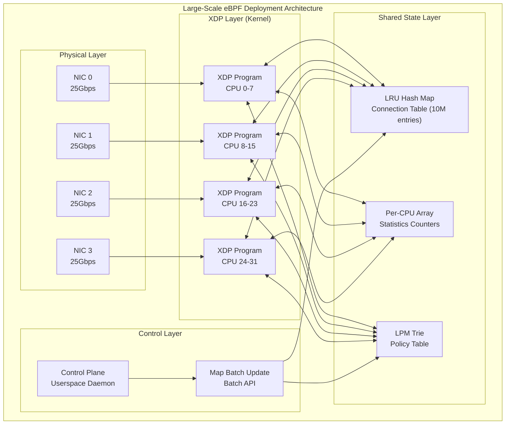

## 8.1.1 NUMA-Aware Deployment Configuration

> ⚠️ **🟠 High Risk Operation** — Affects business traffic or node state, requires change ticket + impact assessment + rollback plan
> - `systemctl stop/restart`: Stop/restart system services, affects all containers on node

```bash
# 🟢 Low risk: Read-only/information gathering, usually no side effects
#!/bin/bash
# numa_aware_ebpf_deploy.sh - NUMA-aware eBPF deployment

# View NUMA topology
numactl --hardware
lscpu | grep -E "NUMA|Socket|CPU"

# View NIC NUMA node
cat /sys/class/net/eth0/device/numa_node
cat /sys/class/net/eth1/device/numa_node

# Bind interrupts to corresponding NUMA node CPUs
# First find NIC interrupts
grep "eth0" /proc/interrupts | awk '{print $1}' | tr -d ':'

# Bind eth0 interrupts to NUMA node 0 CPUs (0-15)
for irq in $(grep "eth0" /proc/interrupts | awk '{print $1}' | tr -d ':'); do
    echo "0000ffff" > /proc/irq/$irq/smp_affinity  # CPU 0-15
done

# When loading eBPF programs, specify NUMA node
# libbpf API: bpf_map_create_opts.numa_node

# Configure irqbalance to exclude manually bound interrupts
systemctl stop irqbalance

# Configure RSS (Receive Side Scaling) queue count to match CPU count
ethtool -L eth0 combined 16   # 16 queues (match NUMA node 0 CPU count)
ethtool -L eth1 combined 16

# Verify queue configuration
ethtool -l eth0
```

## 8.2 BPF Program Hot Update (Zero-Downtime Update)

```c
// hot_update_manager.c - Zero-downtime BPF program hot update

#include <bpf/libbpf.h>
#include <bpf/bpf.h>
#include <linux/if_link.h>
#include <net/if.h>

// Atomic replace XDP program (zero downtime)
int hot_update_xdp_program(const char *ifname, 
                            const char *new_obj_file,
                            const char *prog_section)
{
    int ifindex = if_nametoindex(ifname);
    if (!ifindex) {
        perror("if_nametoindex");
        return -1;
    }
    
    // 1. Load new program
    struct bpf_object *new_obj = bpf_object__open(new_obj_file);
    if (!new_obj) {
        fprintf(stderr, "Failed to open BPF object\n");
        return -1;
    }
    
    // 2. Reuse existing Maps (avoid state loss)
    struct bpf_object *old_obj = get_current_bpf_object();
    if (old_obj) {
        // Pin old program's Maps to bpffs, new program reuses them
        bpf_object__for_each_map(old_obj, map) {
            char pin_path[256];
            snprintf(pin_path, sizeof(pin_path), 
                     "/sys/fs/bpf/maps/%s", bpf_map__name(map));
            bpf_map__pin(map, pin_path);
        }
        
        // New program reuses Maps from bpffs
        bpf_object__for_each_map(new_obj, map) {
            char pin_path[256];
            snprintf(pin_path, sizeof(pin_path),
                     "/sys/fs/bpf/maps/%s", bpf_map__name(map));
            bpf_map__reuse_fd(map, bpf_obj_get(pin_path));
        }
    }
    
    // 3. Load and verify new program
    if (bpf_object__load(new_obj)) {
        fprintf(stderr, "Failed to load new BPF object\n");
        bpf_object__close(new_obj);
        return -1;
    }
    
    struct bpf_program *new_prog = 
        bpf_object__find_program_by_title(new_obj, prog_section);
    if (!new_prog) {
        fprintf(stderr, "Program section not found\n");
        return -1;
    }
    
    int new_fd = bpf_program__fd(new_prog);
    
    // 4. Atomic replace XDP program (BPF_XDP_FLAGS_UPDATE_IF_NOEXIST won't interrupt traffic)
    // Use XDP_FLAGS_REPLACE for atomic replacement
    struct bpf_xdp_attach_opts attach_opts = {
        .sz = sizeof(attach_opts),
        .old_prog_fd = get_current_xdp_prog_fd(ifindex),
    };
    
    int ret = bpf_xdp_attach(ifindex, new_fd, 
                              XDP_FLAGS_DRV_MODE | XDP_FLAGS_REPLACE,
                              &attach_opts);
    if (ret) {
        fprintf(stderr, "XDP atomic replace failed: %s\n", 
                strerror(-ret));
        return -1;
    }
    
    printf("XDP program hot-updated on %s\n", ifname);
    return 0;
}
```

## 8.3 Large-Scale Map Management

```bash
#!/bin/bash
# large_scale_map_management.sh - Large-scale Map management

# Monitor Map memory usage
watch -n 1 'cat /proc/meminfo | grep -E "BpfMap|Mlocked"'

# View all BPF Map memory consumption
bpftool map show | awk '{
    if (/type/) { split($0, a, " "); type=a[4] }
    if (/max_entries/) { split($0, b, " "); entries=b[2] }
    if (/bytes_memlock/) { split($0, c, " "); mem=c[2]; 
                           printf "type=%-20s entries=%-10s mem=%s\n", 
                                  type, entries, mem }
}'

# Set system-level BPF Map memory limit
# Default limit may be insufficient for large-scale deployment
ulimit -l unlimited  # Unlock memlock limit (root operation)

# Or via systemd configuration
# LimitMEMLOCK=infinity

# Monitor Map usage rate (via bpftool + prometheus)
cat << 'EOF' > /usr/local/bin/bpf_map_exporter.sh
#!/bin/bash
# Export BPF Map metrics to Prometheus

METRICS_FILE="/var/lib/node_exporter/textfile_collector/bpf_maps.prom"

echo "# HELP bpf_map_entries Current number of entries in BPF map" > $METRICS_FILE
echo "# TYPE bpf_map_entries gauge" >> $METRICS_FILE

bpftool map show -j | jq -r '.[] | 
    "bpf_map_entries{name=\"\(.name)\",type=\"\(.type)\"} \(.bytes_memlock)"' \
    >> $METRICS_FILE
EOF
chmod +x /usr/local/bin/bpf_map_exporter.sh
```

---

<!-- chunk: 9. Performance Testing and Benchmarking Methods -->## 9. Performance Testing and Benchmarking Methods

## 9.1 Network Data Path Benchmarking

```bash
#!/bin/bash
# network_benchmark.sh - Network performance benchmarking

# ===== Tool Preparation =====
# Install pktgen (kernel packet generator)
modprobe pktgen

# ===== XDP Drop Performance Test =====
# Test pure XDP_DROP performance (theoretical upper limit)
cat << 'EOF' > /proc/net/pktgen/kpktgend_0
rem_device_all
add_device eth0@0
EOF

cat << 'EOF' > /proc/net/pktgen/eth0@0
count 10000000
clone_skb 0
pkt_size 64
delay 0
dst 192.168.1.1
dst_mac 00:00:00:00:00:01
EOF

# Start test
echo "start" > /proc/net/pktgen/pgctrl

# Wait for completion and get results
sleep 15
cat /proc/net/pktgen/eth0@0 | grep -E "pps|Result"

# ===== XDP Forwarding Performance Test (using trex) =====
# TRex is a high-performance traffic generation tool
# ./trex-console
# > start -f stl/imix.py -m 100%

# ===== BPF Map Operation Performance Benchmark =====
cat << 'EOF' > /tmp/map_bench.py
#!/usr/bin/env python3
import time
import ctypes
from bcc import BPF

# Test different Map type lookup performance
bpf_text = """
#include <linux/bpf.h>

BPF_HASH(hash_map, u32, u64, 65536);
BPF_PERCPU_HASH(percpu_hash_map, u32, u64, 65536);
BPF_ARRAY(array_map, u64, 65536);
BPF_PERCPU_ARRAY(percpu_array_map, u64, 65536);

int bench_hash(struct pt_regs *ctx) {
    u32 key = bpf_get_prandom_u32() & 0xFFFF;
    u64 *val = hash_map.lookup(&key);
    if (val) (*val)++;
    return 0;
}

int bench_percpu_hash(struct pt_regs *ctx) {
    u32 key = bpf_get_prandom_u32() & 0xFFFF;
    u64 *val = percpu_hash_map.lookup(&key);
    if (val) (*val)++;
    return 0;
}
"""

b = BPF(text=bpf_text)

# Pre-fill Maps
for i in range(65536):
    b["hash_map"][ctypes.c_uint32(i)] = ctypes.c_uint64(i)
    b["percpu_hash_map"][ctypes.c_uint32(i)] = ctypes.c_uint64(i)

ITERATIONS = 1_000_000

print("BPF Map Lookup Performance Benchmark:")
print(f"{'Map Type':<25} {'Time(ms)':<15} {'QPS':<15}")
print("-" * 55)

# Test each Map type lookup performance
for map_name, map_obj in [
    ("HASH", b["hash_map"]),
    ("PERCPU_HASH", b["percpu_hash_map"]),
    ("ARRAY", b["array_map"]),
    ("PERCPU_ARRAY", b["percpu_array_map"]),
]:
    start = time.perf_counter()
    for i in range(ITERATIONS):
        map_obj.get(i % 65536)
    elapsed_ms = (time.perf_counter() - start) * 1000
    qps = ITERATIONS / (elapsed_ms / 1000) / 1_000_000
    
    print(f"{map_name:<25} {elapsed_ms:<15.1f} {qps:.2f}M ops/s")

EOF
python3 /tmp/map_bench.py
```

## 9.2 Performance Metrics and Monitoring

```python
#!/usr/bin/env python3
# ebpf_performance_monitor.py - eBPF performance monitoring system

from bcc import BPF
import ctypes
import time
import json

MONITORING_PROG = """
#include <linux/bpf.h>
#include <linux/sched.h>
#include <bpf/bpf_helpers.h>

// Program execution latency histogram
BPF_HISTOGRAM(latency_hist, u64, 100);

// Per-second PPS counter
BPF_PERCPU_ARRAY(pps_counter, u64, 1);

// Error counter
BPF_ARRAY(error_counter, u64, 10);

// Trace XDP program execution latency
TRACEPOINT_PROBE(net, xdp_exception)
{
    // Record exception
    u32 key = args->act;  // XDP action type
    u64 *cnt = error_counter.lookup(&key);
    if (cnt) (*cnt)++;
    return 0;
}
"""

class EBPFMonitor:
    def __init__(self):
        self.b = BPF(text=MONITORING_PROG)
        self.last_pps = {}
        
    def get_stats(self):
        stats = {}
        
        # Read PPS counter
        pps_map = self.b["pps_counter"]
        total_pps = sum(v.value for v in pps_map.values())
        stats["pps"] = total_pps
        
        # Read latency histogram
        hist = self.b["latency_hist"]
        latency_data = {}
        for k, v in hist.items():
            if v.value > 0:
                latency_data[k.value] = v.value
        stats["latency_histogram"] = latency_data
        
        # Read error counter
        error_map = self.b["error_counter"]
        errors = {}
        xdp_actions = {0: "ABORTED", 1: "DROP", 2: "PASS", 
                       3: "TX", 4: "REDIRECT"}
        for k, v in error_map.items():
            if v.value > 0:
                action = xdp_actions.get(k.value, f"UNKNOWN_{k.value}")
                errors[action] = v.value
        stats["errors"] = errors
        
        return stats
    
    def run_monitoring_loop(self, interval=1):
        print(f"{'Time':<12} {'PPS':>12} {'Avg Latency':>12} {'P99 Latency':>12} {'Errors':>10}")
        print("-" * 60)
        
        while True:
            time.sleep(interval)
            stats = self.get_stats()
            
            # Calculate latency percentiles
            hist = stats.get("latency_histogram", {})
            total_samples = sum(hist.values())
            avg_latency = "N/A"
            p99_latency = "N/A"
            
            if total_samples > 0:
                # Calculate weighted average
                weighted_sum = sum(k * v for k, v in hist.items())
                avg_latency = f"{weighted_sum / total_samples:.1f}ns"
                
                # Calculate P99
                p99_threshold = total_samples * 0.99
                cumulative = 0
                for k in sorted(hist.keys()):
                    cumulative += hist[k]
                    if cumulative >= p99_threshold:
                        p99_latency = f"{k}ns"
                        break
            
            total_errors = sum(stats.get("errors", {}).values())
            ts = time.strftime("%H:%M:%S")
            
            print(f"{ts:<12} {stats['pps']:>12,} {avg_latency:>12} "
                  f"{p99_latency:>12} {total_errors:>10,}")

if __name__ == "__main__":
    monitor = EBPFMonitor()
    monitor.run_monitoring_loop()
```

## 9.3 Benchmark Report Template

```markdown
<!-- chunk: eBPF XDP Performance Benchmark Report -->## eBPF XDP Performance Benchmark Report

## Test Environment
- CPU: Intel Xeon E5-2699 v4 @ 2.20GHz (44 cores, 88 threads)
- Memory: 128GB DDR4-2133
- NIC: Intel X710-DA4 (4x 10Gbps)
- Kernel: Linux 5.15.0-LTS
- eBPF JIT: Enabled

## XDP Performance Test Results

| Program Type | Mode | Packet Size(bytes) | Throughput(Mpps) | CPU Usage | Latency(ns) |
|---------|------|-------------|------------|---------|---------|
| XDP_DROP | Generic | 64 | 3.2 | 100% | 312 |
| XDP_DROP | Native | 64 | 24.5 | 45% | 41 |
| XDP_DROP | Offload | 64 | 120 | 2% | 8 |
| L3 Filter | Native | 64 | 18.3 | 65% | 55 |
| L4 Filter | Native | 64 | 14.7 | 78% | 68 |
| Full L7 | Native | 1500 | 8.9 | 82% | 112 |

## Map Operation Performance

| Map Type | Operation | QPS(M/s) | P99 Latency(ns) |
|---------|------|---------|-----------|
| HASH | lookup | 8.2 | 245 |
| PERCPU_HASH | lookup | 45.7 | 22 |
| ARRAY | lookup | 312 | 3.2 |
| PERCPU_ARRAY | lookup | 890 | 1.1 |
| LRU_HASH | lookup | 6.1 | 328 |
```

---

<!-- chunk: 10. Production Cases and Best Practices -->## 10. Production Cases and Best Practices

## 10.1 Production Case: High-Frequency Trading Network Acceleration

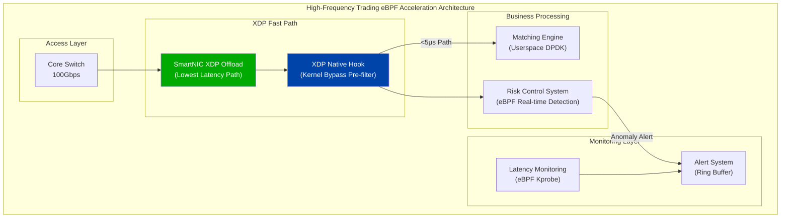

```c
// hft_latency_monitor.c - High-frequency trading latency monitoring
#include <linux/bpf.h>
#include <linux/socket.h>
#include <bpf/bpf_helpers.h>
#include <bpf/bpf_tracing.h>

// Latency histogram (nanosecond resolution)
struct {
    __uint(type, BPF_MAP_TYPE_ARRAY);
    __type(key, __u32);
    __type(value, __u64);
    __uint(max_entries, 1000);  // 0-1000ns histogram
} latency_hist SEC(".maps");

// Timestamp record (use Socket Cookie to track single connection)
struct {
    __uint(type, BPF_MAP_TYPE_LRU_HASH);
    __type(key, __u64);     // socket cookie
    __type(value, __u64);   // send timestamp
    __uint(max_entries, 65536);
} ts_map SEC(".maps");

// Trace TCP send timestamp
SEC("kprobe/tcp_sendmsg")
int trace_tcp_send(struct pt_regs *ctx)
{
    struct sock *sk = (struct sock *)PT_REGS_PARM1(ctx);
    
    __u64 cookie = bpf_get_socket_cookie_kern(sk);
    __u64 ts = bpf_ktime_get_ns();
    
    bpf_map_update_elem(&ts_map, &cookie, &ts, BPF_ANY);
    
    return 0;
}

// Trace TCP ACK receive (calculate RTT)
SEC("kprobe/tcp_ack")
int trace_tcp_ack(struct pt_regs *ctx)
{
    struct sock *sk = (struct sock *)PT_REGS_PARM1(ctx);
    
    __u64 cookie = bpf_get_socket_cookie_kern(sk);
    __u64 *send_ts = bpf_map_lookup_elem(&ts_map, &cookie);
    
    if (send_ts) {
        __u64 rtt_ns = bpf_ktime_get_ns() - *send_ts;
        
        // Record to histogram (nanosecond resolution, limit within 1000ns)
        __u32 bucket = rtt_ns < 1000 ? (__u32)rtt_ns : 999;
        __u64 *cnt = bpf_map_lookup_elem(&latency_hist, &bucket);
        if (cnt)
            __sync_fetch_and_add(cnt, 1);
        
        bpf_map_delete_elem(&ts_map, &cookie);
    }
    
    return 0;
}

char LICENSE[] SEC("license") = "GPL";
```

## 10.2 Production Case: Cloud-Native Network Acceleration

```yaml
# cilium-performance-config.yaml
# Cilium production high-performance configuration

apiVersion: v1
kind: ConfigMap
metadata:
  name: cilium-config
  namespace: kube-system
data:
  # XDP acceleration (requires Native XDP-capable NIC)
  enable-xdp-acceleration: "native"
  
  # Disable kube-proxy (fully replaced by eBPF)
  kube-proxy-replacement: "strict"
  
  # eBPF Host Routing (bypass iptables)
  enable-host-routing: "true"
  
  # BPF Map capacity configuration (adjust based on cluster scale)
  bpf-ct-global-tcp-max: "2000000"    # Connection tracking TCP: 2M
  bpf-ct-global-any-max: "1000000"    # Connection tracking UDP: 1M
  bpf-lb-map-max: "65536"             # Load balancer table: 64K
  bpf-policy-map-max: "65536"         # Policy table: 64K
  
  # Bandwidth management
  enable-bandwidth-manager: "true"
  
  # Local redirect (same-node direct forwarding, bypass network stack)
  enable-local-redirect-policy: "true"
  
  # Cluster Mesh high-performance mode
  cluster-mesh-enable-endpoint-sync: "true"
  
  # Protocol stack optimization
  enable-ipv4-fragment-tracking: "true"
  
  # JIT performance optimization
  # Passed via DaemonSet environment variables
```

## 10.3 Best Practices Summary

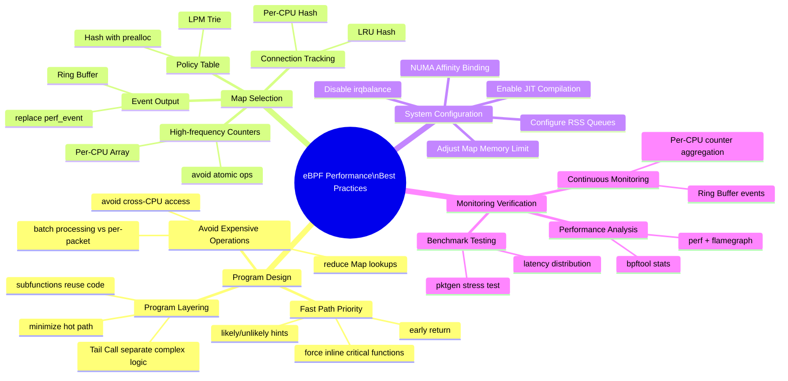

## 10.3.1 Performance Checklist

> ⚠️ **🟠 High Risk Operation** — Affects business traffic or node state, requires change ticket + impact assessment + rollback plan
> - `sysctl -w`: Real-time kernel parameter modification, global effect

```bash
#!/bin/bash
# ebpf_performance_checklist.sh

echo "============================================="
echo "       eBPF Performance Optimization Checklist"
echo "============================================="

# 1. JIT status check
echo ""
echo "[ 1 ] JIT Compilation Status"
JIT=$(cat /proc/sys/net/core/bpf_jit_enable)
if [ "$JIT" -eq "1" ] || [ "$JIT" -eq "2" ]; then
    echo "  ✓ BPF JIT compilation enabled (value: $JIT)"
else
    echo "  ✗ BPF JIT not enabled, execute: sysctl -w net.core.bpf_jit_enable=1"
fi

# 2. XDP mode check
echo ""
echo "[ 2 ] XDP Program Mode"
for iface in $(ip link show | grep "^[0-9]" | awk '{print $2}' | tr -d ':'); do
    XDP_INFO=$(ip link show dev $iface | grep xdp)
    if [ -n "$XDP_INFO" ]; then
        if echo "$XDP_INFO" | grep -q "xdpdrv"; then
            echo "  ✓ $iface: Native XDP (highest performance)"
        elif echo "$XDP_INFO" | grep -q "xdpoffload"; then
            echo "  ✓ $iface: Offload XDP (ultimate performance)"
        elif echo "$XDP_INFO" | grep -q "xdpgeneric"; then
            echo "  ⚠ $iface: Generic XDP (compatibility mode, lower performance)"
        fi
    fi
done

# 3. NUMA binding check
echo ""
echo "[ 3 ] NUMA Affinity"
for iface in $(ip link show | grep "^[0-9]" | awk '{print $2}' | tr -d ':'); do
    if [ -f /sys/class/net/$iface/device/numa_node ]; then
        NUMA_NODE=$(cat /sys/class/net/$iface/device/numa_node)
        echo "  NIC $iface on NUMA node: $NUMA_NODE"
    fi
done

# 4. Huge page memory
echo ""
echo "[ 4 ] Huge Page Memory Status"
HPS=$(cat /sys/kernel/mm/hugepages/hugepages-2048kB/free_hugepages)
if [ "$HPS" -gt "0" ]; then
    echo "  ✓ 2MB huge pages available: $HPS pages"
else
    echo "  ⚠ Recommend configuring huge page memory for UMEM: echo 1024 > /proc/sys/vm/nr_hugepages"
fi

# 5. BPF Map memory limit
echo ""
echo "[ 5 ] BPF Map Memory Limit"
MEMLOCK=$(ulimit -l)
if [ "$MEMLOCK" == "unlimited" ]; then
    echo "  ✓ memlock unlimited"
else
    echo "  ⚠ memlock limit: ${MEMLOCK}KB, recommend setting to unlimited"
fi

echo ""
echo "============================================="
echo "Check complete, optimize configuration per recommendations above"
echo "============================================="
```

## 10.3.2 Performance Optimization Roadmap

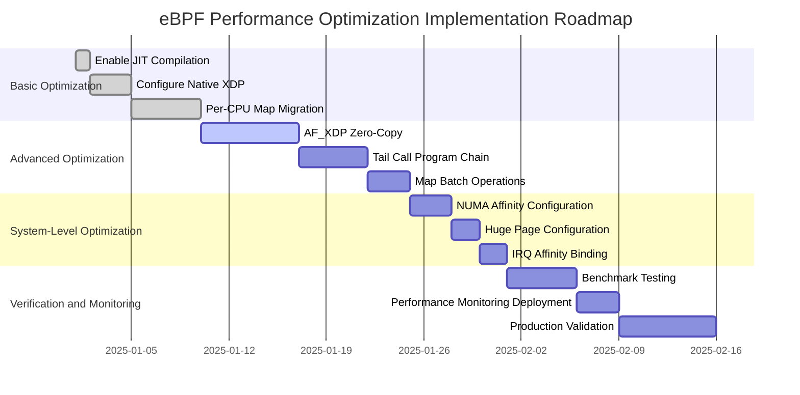

---

<!-- chunk: References -->## References

## Official Documentation
- [Linux Kernel BPF Documentation](https://www.kernel.org/doc/html/latest/bpf/)
- [Cilium BPF and XDP Reference Guide](https://docs.cilium.io/en/stable/bpf/)
- [libbpf Documentation](https://libbpf.readthedocs.io/)

## Technical Papers
- "The eXpress Data Path: Fast Programmable Packet Processing in the Operating System Kernel" - Toke Høiland-Jørgensen et al.
- "AF_XDP: Sending and Receiving Packets without the Socket Layer" - Magnus Karlsson, Björn Töpel
- "Programmable Packet Filtering at Line Rate" - Cloudflare Research

## Tools and Frameworks
- [bpftool](https://github.com/torvalds/linux/tree/master/tools/bpf/bpftool) - BPF system tool
- [BCC Tools](https://github.com/iovisor/bcc) - BPF compiler toolchain
- [libbpf-bootstrap](https://github.com/libbpf/libbpf-bootstrap) - Modern eBPF development framework
- [xdp-tools](https://github.com/xdp-project/xdp-tools) - XDP utilities collection

## Performance Benchmarks
- [XDP Performance Testing Dataset](https://github.com/xdp-project/xdp-paper)
- [Cilium Performance Benchmark Report](https://cilium.io/blog/2021/05/11/cni-benchmark)

---

*This document is maintained by the Dillan Teagle and is continuously updated. If you find errors or have improvement suggestions, please submit an Issue.*

---

<!-- chunk: Obsidian Related Documents -->## Obsidian Related Documents

- domain-35-ebpf-technology KUDIG Database — Global MOC
- [[Domain 35: eBPF Technology Stack]]
- Domain-35 eBPF Technology — Open Source Project Index
- [[01-ebpf-architecture-fundamentals|eBPF Architecture Fundamentals and Program Types]]
- [[02-ebpf-map-types-data-structures|eBPF Map Types and Data Structures]]
- [[03-cilium-cni-architecture-deployment|Cilium CNI Architecture and Deployment]]
- [[04-cilium-network-policy|Cilium Network Policy L3/L4/L7]]
- [[05-cilium-service-mesh|Cilium Service Mesh Sidecar-less Architecture]]
- [[06-tetragon-runtime-security|Tetragon Runtime Security]]
- [[07-hubble-network-observability|Hubble Network Observability]]
- [[08-bcc-bpftrace-tools|bcc and bpftrace Tools]]
- [[10-ebpf-security-applications|eBPF Security Applications and Use Cases]]

## See Also

- 07-hubble-network-observability
- 08-bcc-bpftrace-tools
- 10-ebpf-security-applications
- 01-ebpf-architecture-fundamentals


<!-- risk-assessed -->
