> **Production Safety Notice**
>
> This document contains operational commands that can be executed directly. Before running them, confirm: the target cluster and Namespace are correct; you have sufficient RBAC permissions; and the commands have been validated in a non-production environment. Command risk levels: 🔴 High risk (may cause data loss or service interruption), 🟡 Medium risk (modifies cluster state, usually rollbackable), 🟢 Low risk / read-only (information gathering, no side effects).


# eBPF Security Applications and Use Cases

> **Document Version**: v1.0 | **Applies to**: Linux Kernel 5.15+ | **Last Updated**: 2026-03-04  
> **Keywords**: eBPF Security, XDP, IDS, DDoS Protection, Container Security, Zero Trust, SIEM, SOC, Threat Hunting, Compliance

---

<!-- chunk: Table of Contents -->## Table of Contents

1. [eBPF Security Applications Overview](#1-ebpf-security-applications-overview)
2. [Intrusion Detection System IDS](#2-intrusion-detection-system-ids)
   - [Network Traffic Anomaly Detection](#21-network-traffic-anomaly-detection)
   - [Process Behavior Analysis](#22-process-behavior-analysis)
   - [File Integrity Monitoring](#23-file-integrity-monitoring)
3. [DDoS Protection](#3-ddos-protection)
   - [XDP SYN Flood Protection](#31-xdp-syn-flood-protection)
   - [Rate Limiting](#32-rate-limiting)
   - [Connection Tracking](#33-connection-tracking)
4. [Container Security](#4-container-security)
   - [Container Escape Detection](#41-container-escape-detection)
   - [Privilege Escalation Monitoring](#42-privilege-escalation-monitoring)
   - [Namespace Isolation Verification](#43-namespace-isolation-verification)
5. [Zero Trust Network Security](#5-zero-trust-network-security)
6. [Compliance and Auditing](#6-compliance-and-auditing)
   - [System Call Auditing](#61-system-call-auditing)
   - [Network Access Auditing](#62-network-access-auditing)
7. [Threat Hunting and Response](#7-threat-hunting-and-response)
8. [SIEM SOAR Integration](#8-siem-soar-integration)
9. [Security Operations Center SOC Integration](#9-security-operations-center-soc-integration)
10. [Enterprise Security Architecture Best Practices](#10-enterprise-security-architecture-best-practices)

---

<!-- chunk: 1. eBPF Security Applications Overview -->## 1. eBPF Security Applications Overview

## 1.1 Why eBPF Transforms Security

Traditional security tools rely on kernel modules or userspace ptrace, facing challenges like high performance overhead, poor stability, and high bypass risk. eBPF runs with near-zero overhead under the kernel verifier's guarantee, enabling a paradigm shift in security monitoring.

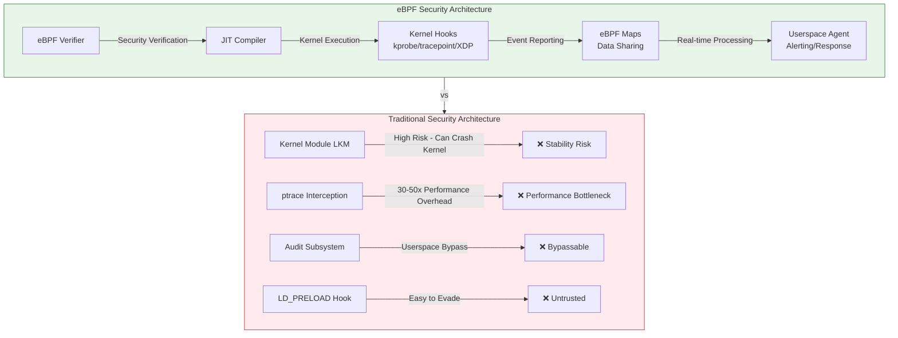

## 1.2 eBPF Security Capability Matrix

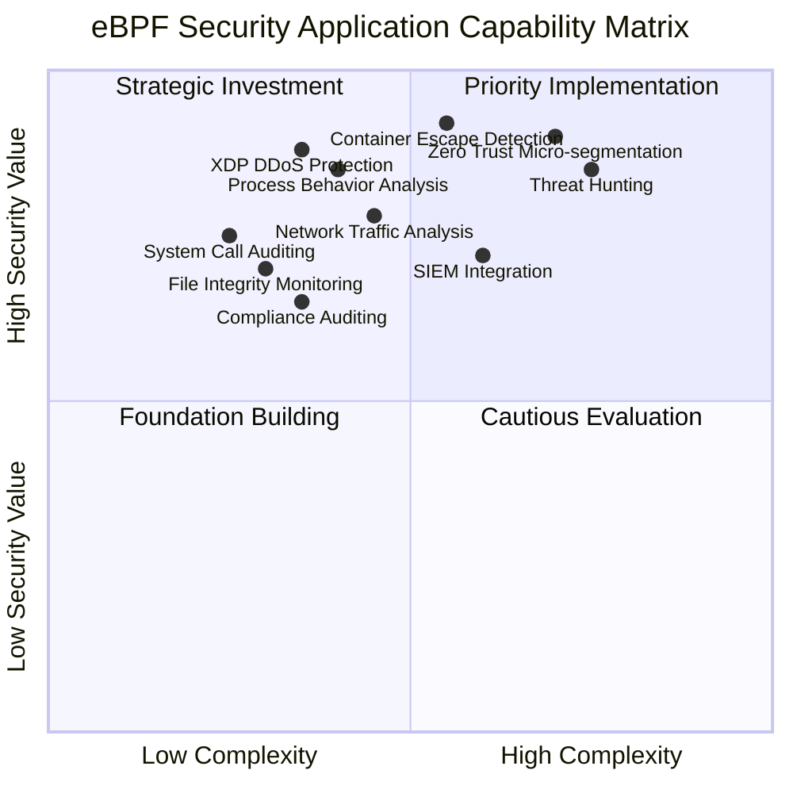

## 1.3 Technology Comparison

| Security Capability | eBPF Solution | Traditional Solution | Performance Overhead | Bypass Risk | Visibility |
|---------|-----------|---------|---------|---------|-------|
| Network Monitoring | XDP/TC Hook | iptables/nftables | <1% | Very Low | L2-L7 |
| Process Monitoring | kprobe/tracepoint | auditd/strace | <2% | Very Low | Complete System Calls |
| File Monitoring | LSM Hook/kprobe | inotify/fanotify | <1% | Low | Full VFS Layer |
| Container Security | Seccomp+eBPF | AppArmor/SELinux | <1% | Very Low | Kernel Level |
| Intrusion Detection | [[Tetragon|Tetragon]]/Falco-eBPF | OSSEC/Suricata | <3% | Low | Full Stack Visibility |
| DDoS Protection | XDP | iptables | <5% vs 60%+ | Low | Line-rate Processing |

## 1.4 eBPF Security Ecosystem

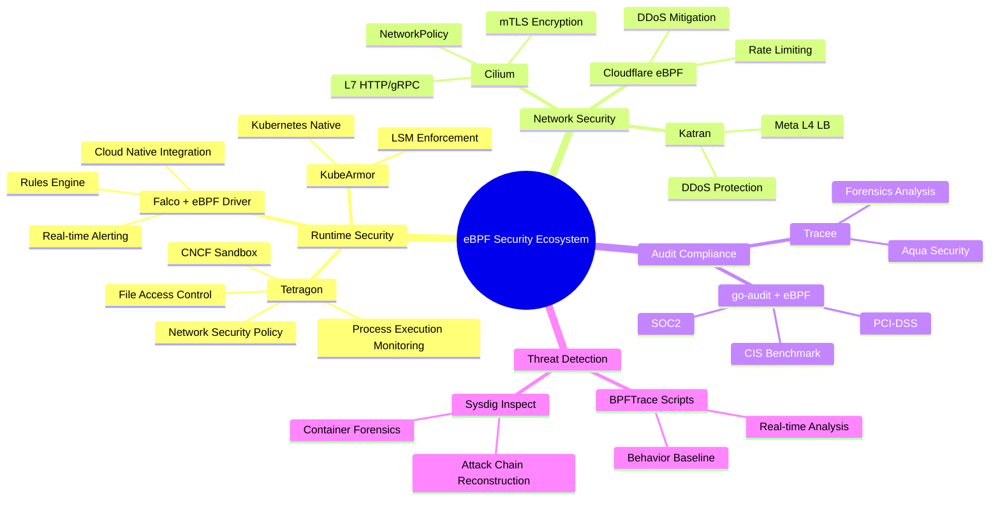

---

<!-- chunk: 2. Intrusion Detection System IDS -->## 2. Intrusion Detection System (IDS)

## 2.1 Network Traffic Anomaly Detection

## 2.1.1 Architecture

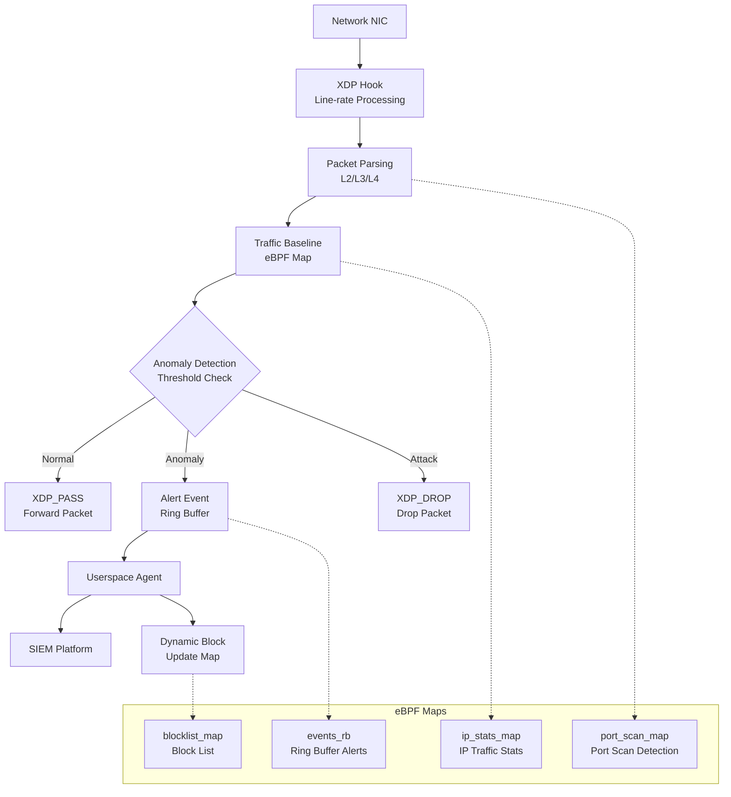

## 2.1.2 Network Anomaly Detection eBPF Program

```c
// File: network_ids.c
// eBPF Network Traffic Anomaly Detection - XDP Program
// Features: Port scan detection, SYN Flood detection, anomalous traffic detection

#include <linux/bpf.h>
#include <linux/if_ether.h>
#include <linux/ip.h>
#include <linux/tcp.h>
#include <linux/udp.h>
#include <linux/icmp.h>
#include <bpf/bpf_helpers.h>
#include <bpf/bpf_endian.h>

#define MAX_ENTRIES        65536
#define SCAN_THRESHOLD     100    // 100 different ports/sec is considered a scan
#define CONN_THRESHOLD     10000  // 10K connections/sec is considered Flood
#define WINDOW_NS          1000000000ULL  // 1 second window

// ===================== Data Structure Definitions =====================

// Traffic stats key: source IP
struct ip_stats_key {
    __u32 src_ip;
};

// Traffic stats value
struct ip_stats_val {
    __u64 pkt_count;       // Total packets
    __u64 byte_count;      // Total bytes
    __u64 syn_count;       // SYN packet count (detect SYN Flood)
    __u64 unique_ports;    // Number of different ports accessed (detect port scan)
    __u64 last_ts;         // Last reset timestamp
    __u64 window_pkts;     // Current window packet count
};

// Port scan tracking: port bitmap for each source IP
struct port_bitmap {
    __u8 bits[8192];  // 65536 ports / 8 bits = 8192 bytes
};

// Alert event (sent to Ring Buffer)
struct alert_event {
    __u64 timestamp;
    __u32 src_ip;
    __u32 dst_ip;
    __u16 src_port;
    __u16 dst_port;
    __u8  proto;
    __u8  alert_type;      // 1=PortScan, 2=SYNFlood, 3=Anomaly
    __u32 count;
    char  msg[64];
};

#define ALERT_PORT_SCAN  1
#define ALERT_SYN_FLOOD  2
#define ALERT_RATE_LIMIT 3

// ===================== eBPF Maps =====================

// IP traffic statistics
struct {
    __uint(type, BPF_MAP_TYPE_LRU_HASH);
    __uint(max_entries, MAX_ENTRIES);
    __type(key, struct ip_stats_key);
    __type(value, struct ip_stats_val);
} ip_stats_map SEC(".maps");

// Port access bitmap (scan detection)
struct {
    __uint(type, BPF_MAP_TYPE_LRU_HASH);
    __uint(max_entries, 4096);
    __type(key, __u32);              // src_ip
    __type(value, struct port_bitmap);
} port_scan_map SEC(".maps");

// Block list (IPs detected as attackers)
struct {
    __uint(type, BPF_MAP_TYPE_LRU_HASH);
    __uint(max_entries, MAX_ENTRIES);
    __type(key, __u32);              // src_ip
    __type(value, __u64);            // Block expiration timestamp
} blocklist_map SEC(".maps");

// Alert event Ring Buffer
struct {
    __uint(type, BPF_MAP_TYPE_RINGBUF);
    __uint(max_entries, 4 * 1024 * 1024);  // 4MB Ring Buffer
} events_rb SEC(".maps");

// Configuration Map (userspace dynamic threshold adjustment)
struct {
    __uint(type, BPF_MAP_TYPE_ARRAY);
    __uint(max_entries, 8);
    __type(key, __u32);
    __type(value, __u64);
} config_map SEC(".maps");

// ===================== Helper Functions =====================

// Check if IP is in block list
static __always_inline int is_blocked(__u32 src_ip) {
    __u64 *expire_ts = bpf_map_lookup_elem(&blocklist_map, &src_ip);
    if (!expire_ts) return 0;
    __u64 now = bpf_ktime_get_ns();
    if (now > *expire_ts) {
        // Block has expired, delete
        bpf_map_delete_elem(&blocklist_map, &src_ip);
        return 0;
    }
    return 1;
}

// Send alert event
static __always_inline void send_alert(
    __u32 src_ip, __u32 dst_ip,
    __u16 src_port, __u16 dst_port,
    __u8 proto, __u8 alert_type, __u32 count)
{
    struct alert_event *evt = bpf_ringbuf_reserve(
        &events_rb, sizeof(struct alert_event), 0);
    if (!evt) return;

    evt->timestamp  = bpf_ktime_get_ns();
    evt->src_ip     = src_ip;
    evt->dst_ip     = dst_ip;
    evt->src_port   = src_port;
    evt->dst_port   = dst_port;
    evt->proto      = proto;
    evt->alert_type = alert_type;
    evt->count      = count;

    bpf_ringbuf_submit(evt, 0);
}

// Record port access (port scan detection)
static __always_inline int track_port(__u32 src_ip, __u16 dst_port) {
    struct port_bitmap *bm = bpf_map_lookup_elem(&port_scan_map, &src_ip);
    if (!bm) {
        struct port_bitmap new_bm = {};
        bpf_map_update_elem(&port_scan_map, &src_ip, &new_bm, BPF_ANY);
        bm = bpf_map_lookup_elem(&port_scan_map, &src_ip);
        if (!bm) return 0;
    }

    // Set corresponding port bit
    int byte_idx = dst_port / 8;
    int bit_idx  = dst_port % 8;

    // Boundary verification (required by eBPF verifier)
    if (byte_idx >= 8192) return 0;

    int already_set = (bm->bits[byte_idx] >> bit_idx) & 1;
    if (!already_set) {
        bm->bits[byte_idx] |= (1 << bit_idx);
        return 1;  // New port
    }
    return 0;  // Already recorded port
}

// ===================== XDP Main Program =====================

SEC("xdp")
int network_ids(struct xdp_md *ctx) {
    void *data_end = (void *)(long)ctx->data_end;
    void *data     = (void *)(long)ctx->data;

    // Parse Ethernet header
    struct ethhdr *eth = data;
    if ((void *)(eth + 1) > data_end) return XDP_PASS;
    if (bpf_ntohs(eth->h_proto) != ETH_P_IP) return XDP_PASS;

    // Parse IP header
    struct iphdr *ip = (void *)(eth + 1);
    if ((void *)(ip + 1) > data_end) return XDP_PASS;

    __u32 src_ip = ip->saddr;
    __u32 dst_ip = ip->daddr;
    __u8  proto  = ip->protocol;

    // ① Check block list (fastest path)
    if (is_blocked(src_ip)) return XDP_DROP;

    __u16 src_port = 0, dst_port = 0;
    __u8  tcp_flags = 0;

    // Parse transport layer
    if (proto == IPPROTO_TCP) {
        struct tcphdr *tcp = (void *)ip + (ip->ihl * 4);
        if ((void *)(tcp + 1) > data_end) return XDP_PASS;
        src_port  = bpf_ntohs(tcp->source);
        dst_port  = bpf_ntohs(tcp->dest);
        tcp_flags = ((__u8 *)tcp)[13];
    } else if (proto == IPPROTO_UDP) {
        struct udphdr *udp = (void *)ip + (ip->ihl * 4);
        if ((void *)(udp + 1) > data_end) return XDP_PASS;
        src_port = bpf_ntohs(udp->source);
        dst_port = bpf_ntohs(udp->dest);
    }

    // ② Get/initialize IP statistics
    struct ip_stats_key key = { .src_ip = src_ip };
    struct ip_stats_val *stats = bpf_map_lookup_elem(&ip_stats_map, &key);
    __u64 now = bpf_ktime_get_ns();

    if (!stats) {
        struct ip_stats_val new_stats = {
            .pkt_count    = 1,
            .byte_count   = bpf_ntohs(ip->tot_len),
            .syn_count    = 0,
            .unique_ports = 0,
            .last_ts      = now,
            .window_pkts  = 1,
        };
        bpf_map_update_elem(&ip_stats_map, &key, &new_stats, BPF_ANY);
        return XDP_PASS;
    }

    // ③ Time window reset
    if (now - stats->last_ts > WINDOW_NS) {
        stats->window_pkts  = 0;
        stats->syn_count    = 0;
        stats->unique_ports = 0;
        stats->last_ts      = now;
        // Clear port bitmap (new window)
        bpf_map_delete_elem(&port_scan_map, &src_ip);
    }

    // Update statistics
    __sync_fetch_and_add(&stats->pkt_count, 1);
    __sync_fetch_and_add(&stats->byte_count, bpf_ntohs(ip->tot_len));
    __sync_fetch_and_add(&stats->window_pkts, 1);

    // ④ SYN Flood detection (TCP SYN packets)
    if (proto == IPPROTO_TCP && (tcp_flags & 0x02) && !(tcp_flags & 0x10)) {
        __sync_fetch_and_add(&stats->syn_count, 1);
        if (stats->syn_count > CONN_THRESHOLD) {
            send_alert(src_ip, dst_ip, src_port, dst_port,
                      proto, ALERT_SYN_FLOOD, stats->syn_count);
            // Block for 60 seconds
            __u64 expire = now + 60 * 1000000000ULL;
            bpf_map_update_elem(&blocklist_map, &src_ip, &expire, BPF_ANY);
            return XDP_DROP;
        }
    }

    // ⑤ Port scan detection (TCP SYN to new ports)
    if (proto == IPPROTO_TCP && dst_port > 0) {
        int new_port = track_port(src_ip, dst_port);
        if (new_port) {
            __sync_fetch_and_add(&stats->unique_ports, 1);
            if (stats->unique_ports > SCAN_THRESHOLD) {
                send_alert(src_ip, dst_ip, src_port, dst_port,
                          proto, ALERT_PORT_SCAN, stats->unique_ports);
                // Port scan: temporary block for 300 seconds
                __u64 expire = now + 300 * 1000000000ULL;
                bpf_map_update_elem(&blocklist_map, &src_ip, &expire, BPF_ANY);
                return XDP_DROP;
            }
        }
    }

    // ⑥ General rate limiting
    if (stats->window_pkts > CONN_THRESHOLD * 5) {
        send_alert(src_ip, dst_ip, src_port, dst_port,
                  proto, ALERT_RATE_LIMIT, stats->window_pkts);
        return XDP_DROP;
    }

    return XDP_PASS;
}

char LICENSE[] SEC("license") = "GPL";
```

## 2.1.3 Userspace Alert Handler

```c
// File: ids_agent.c
// Userspace alert processing Agent

#include <stdio.h>
#include <stdlib.h>
#include <string.h>
#include <arpa/inet.h>
#include <bpf/libbpf.h>
#include <bpf/bpf.h>
#include <signal.h>
#include <time.h>

struct alert_event {
    __u64 timestamp;
    __u32 src_ip;
    __u32 dst_ip;
    __u16 src_port;
    __u16 dst_port;
    __u8  proto;
    __u8  alert_type;
    __u32 count;
    char  msg[64];
};

#define ALERT_PORT_SCAN  1
#define ALERT_SYN_FLOOD  2
#define ALERT_RATE_LIMIT 3

static const char *alert_type_str(int type) {
    switch (type) {
    case ALERT_PORT_SCAN:  return "PORT_SCAN";
    case ALERT_SYN_FLOOD:  return "SYN_FLOOD";
    case ALERT_RATE_LIMIT: return "RATE_LIMIT";
    default: return "UNKNOWN";
    }
}

// Ring Buffer callback: process alert events
static int handle_alert(void *ctx, void *data, size_t size) {
    struct alert_event *evt = data;
    if (size < sizeof(*evt)) return 0;

    char src_str[INET_ADDRSTRLEN], dst_str[INET_ADDRSTRLEN];
    struct in_addr src_addr = { .s_addr = evt->src_ip };
    struct in_addr dst_addr = { .s_addr = evt->dst_ip };
    inet_ntop(AF_INET, &src_addr, src_str, sizeof(src_str));
    inet_ntop(AF_INET, &dst_addr, dst_str, sizeof(dst_str));

    // Format timestamp
    time_t t = evt->timestamp / 1000000000;
    struct tm *tm_info = localtime(&t);
    char time_str[32];
    strftime(time_str, sizeof(time_str), "%Y-%m-%dT%H:%M:%S", tm_info);

    // Output JSON format (for SIEM integration)
    printf("{"
           "\"timestamp\":\"%s\","
           "\"alert_type\":\"%s\","
           "\"src_ip\":\"%s\","
           "\"dst_ip\":\"%s\","
           "\"src_port\":%d,"
           "\"dst_port\":%d,"
           "\"protocol\":%d,"
           "\"count\":%d"
           "}\n",
           time_str,
           alert_type_str(evt->alert_type),
           src_str, dst_str,
           evt->src_port, evt->dst_port,
           evt->proto,
           evt->count);
    fflush(stdout);
    return 0;
}

int main(int argc, char **argv) {
    if (argc < 2) {
        fprintf(stderr, "Usage: %s <bpf_prog.o>\n", argv[0]);
        return 1;
    }

    // Load BPF object
    struct bpf_object *obj = bpf_object__open(argv[1]);
    if (!obj) { perror("bpf_object__open"); return 1; }
    if (bpf_object__load(obj)) { perror("bpf_object__load"); return 1; }

    // Get Ring Buffer Map FD
    struct bpf_map *rb_map = bpf_object__find_map_by_name(obj, "events_rb");
    if (!rb_map) { fprintf(stderr, "events_rb map not found\n"); return 1; }

    // Create Ring Buffer
    struct ring_buffer *rb = ring_buffer__new(
        bpf_map__fd(rb_map), handle_alert, NULL, NULL);
    if (!rb) { perror("ring_buffer__new"); return 1; }

    printf("[IDS Agent] Listening for security events...\n");

    // Event loop
    while (1) {
        int err = ring_buffer__poll(rb, 100 /* timeout ms */);
        if (err < 0) {
            fprintf(stderr, "Ring buffer poll error: %d\n", err);
            break;
        }
    }

    ring_buffer__free(rb);
    bpf_object__close(obj);
    return 0;
}
```

## 2.2 Process Behavior Analysis

## 2.2.1 TracingPolicy: Process Behavior Baseline

```yaml
# File: policy-process-behavior-ids.yaml
# Tetragon TracingPolicy - Process behavior anomaly detection
# Detects: Abnormal command execution, reverse shells, memory injection, privilege escalation

apiVersion: cilium.io/v1alpha1
kind: TracingPolicy
metadata:
  name: process-behavior-ids
  namespace: kube-system
  labels:
    security.kudig.io/category: "ids"
    security.kudig.io/severity: "high"
spec:
  # ========== execve monitoring: detect abnormal process execution ==========
  kprobes:
    # 1. Detect sensitive command execution (reverse shell tools)
    - call: "security_bprm_check"
      syscall: false
      args:
        - index: 0
          type: "linux_binprm"
      selectors:
        # Detect netcat/ncat reverse shells
        - matchBinaries:
            - operator: "In"
              values:
                - "/bin/nc"
                - "/usr/bin/nc"
                - "/bin/ncat"
                - "/usr/bin/ncat"
                - "/bin/netcat"
          matchCapabilities:
            - type: Effective
              operator: NotIn
              values:
                - "CAP_NET_ADMIN"
          matchActions:
            - action: Sigkill
        # Detect Python/Perl/Ruby reverse shell signatures
        - matchBinaries:
            - operator: "In"
              values:
                - "/usr/bin/python3"
                - "/usr/bin/perl"
                - "/usr/bin/ruby"
          matchArgs:
            - index: 0
              operator: "Postfix"
              values:
                - "-e"
                - "-c"
          matchActions:
            - action: Post
              rateLimit: "1/minute"

    # 2. Detect /proc/*/mem writes (process memory injection)
    - call: "__x64_sys_ptrace"
      syscall: true
      args:
        - index: 0
          type: "int"         # request type
        - index: 1
          type: "int"         # pid
        - index: 2
          type: "uint64"      # addr
        - index: 3
          type: "uint64"      # data
      selectors:
        - matchArgs:
            - index: 0
              operator: "Equal"
              values:
                - "4"   # PTRACE_POKEDATA
          matchActions:
            - action: Post
              rateLimit: "10/minute"
            - action: Sigkill

    # 3. Monitor cron/at task creation (persistence detection)
    - call: "__x64_sys_openat"
      syscall: true
      args:
        - index: 1
          type: "string"
      selectors:
        - matchArgs:
            - index: 1
              operator: "Prefix"
              values:
                - "/var/spool/cron"
                - "/etc/cron.d"
                - "/etc/crontab"
          matchActions:
            - action: Post
              rateLimit: "5/minute"

  # ========== Network connection monitoring: detect C2 communication ==========
  tracepoints:
    - subsystem: "syscalls"
      event: "sys_enter_connect"
      args:
        - index: 0
          type: "int"
        - index: 1
          type: "sockaddr"
        - index: 2
          type: "int"
      selectors:
        # Detect container connections to external non-standard high ports (C2 signature)
        - matchNamespaces:
            - namespace: Net
              operator: NotIn
              values:
                - "host"  # Only detect container namespaces
          matchActions:
            - action: Post
              rateLimit: "100/minute"
```

## 2.2.2 Process Behavior Tracer eBPF Program

```c
// File: process_tracer.c
// eBPF process behavior analysis - trace execve/fork/clone system calls
// Build process tree, detect abnormal parent-child relationships

#include <linux/bpf.h>
#include <linux/ptrace.h>
#include <linux/sched.h>
#include <bpf/bpf_helpers.h>
#include <bpf/bpf_tracing.h>
#include <bpf/bpf_core_read.h>

#define TASK_COMM_LEN  16
#define MAX_ARGS_SIZE  256
#define MAX_PROCESSES  65536

// Process information record
struct proc_info {
    __u32 pid;
    __u32 ppid;
    __u32 uid;
    __u32 gid;
    __u64 start_ts;
    char  comm[TASK_COMM_LEN];
    char  filename[128];
    char  args[MAX_ARGS_SIZE];
    __u32 ns_pid;       // PID inside container
    __u64 ns_inum;      // PID namespace ID (container identifier)
    __u8  is_container; // Whether in container
};

// Process execution event
struct exec_event {
    __u64 timestamp;
    struct proc_info proc;
    __u8  alert;        // Whether to trigger alert
    char  reason[64];   // Alert reason
};

// eBPF Maps
struct {
    __uint(type, BPF_MAP_TYPE_HASH);
    __uint(max_entries, MAX_PROCESSES);
    __type(key, __u32);              // pid
    __type(value, struct proc_info);
} proc_map SEC(".maps");

struct {
    __uint(type, BPF_MAP_TYPE_RINGBUF);
    __uint(max_entries, 8 * 1024 * 1024);
} exec_events SEC(".maps");

// Suspicious process list (updated by userspace via Map)
struct {
    __uint(type, BPF_MAP_TYPE_HASH);
    __uint(max_entries, 256);
    __type(key, char[TASK_COMM_LEN]);
    __type(value, __u8);             // severity level
} suspicious_comms SEC(".maps");

// Helper: Get PID namespace inum (determine if in container)
static __always_inline __u64 get_pid_ns_inum(struct task_struct *task) {
    struct nsproxy *ns;
    struct pid_namespace *pid_ns;
    __u64 inum = 0;
    ns = BPF_CORE_READ(task, nsproxy);
    if (ns) {
        pid_ns = BPF_CORE_READ(ns, pid_ns_for_children);
        if (pid_ns) {
            // Read ns_common.inum
            bpf_core_read(&inum, sizeof(inum),
                         &pid_ns->ns.inum);
        }
    }
    return inum;
}

// Tracepoint: sys_enter_execve
SEC("tracepoint/syscalls/sys_enter_execve")
int trace_execve(struct trace_event_raw_sys_enter *ctx) {
    struct task_struct *task = (struct task_struct *)bpf_get_current_task();
    __u64 pid_tgid = bpf_get_current_pid_tgid();
    __u32 pid = pid_tgid >> 32;
    __u32 tid = pid_tgid & 0xFFFFFFFF;

    if (tid != pid) return 0;  // Only track main thread

    struct exec_event *evt = bpf_ringbuf_reserve(
        &exec_events, sizeof(struct exec_event), 0);
    if (!evt) return 0;

    __builtin_memset(evt, 0, sizeof(*evt));
    evt->timestamp = bpf_ktime_get_ns();

    // Fill process information
    evt->proc.pid      = pid;
    evt->proc.ppid     = BPF_CORE_READ(task, real_parent, tgid);
    evt->proc.uid      = bpf_get_current_uid_gid() & 0xFFFFFFFF;
    evt->proc.gid      = bpf_get_current_uid_gid() >> 32;
    evt->proc.start_ts = BPF_CORE_READ(task, start_time);
    evt->proc.ns_inum  = get_pid_ns_inum(task);
    bpf_get_current_comm(&evt->proc.comm, sizeof(evt->proc.comm));

    // Read executable file path
    const char __user *filename = (const char __user *)ctx->args[0];
    bpf_probe_read_user_str(evt->proc.filename,
                            sizeof(evt->proc.filename), filename);

    // Read command line arguments (first 256 bytes)
    const char __user *const __user *argv =
        (const char __user *const __user *)ctx->args[1];
    if (argv) {
        char arg[64];
        int offset = 0;
        for (int i = 0; i < 8 && offset < MAX_ARGS_SIZE - 1; i++) {
            const char __user *argp = NULL;
            if (bpf_probe_read_user(&argp, sizeof(argp), &argv[i]))
                break;
            if (!argp) break;
            int len = bpf_probe_read_user_str(
                arg, sizeof(arg), argp);
            if (len <= 0) break;
            if (offset + len < MAX_ARGS_SIZE) {
                bpf_probe_read_kernel(evt->proc.args + offset,
                                     len, arg);
                offset += len;
                evt->proc.args[offset - 1] = ' ';
            }
        }
    }

    // Detect alert condition: UID=0 executing suspicious command in container
    if (evt->proc.uid == 0 && evt->proc.ns_inum != 0) {
        __u8 *severity = bpf_map_lookup_elem(
            &suspicious_comms, &evt->proc.comm);
        if (severity) {
            evt->alert = *severity;
            __builtin_memcpy(evt->reason,
                            "Suspicious root cmd in container", 32);
        }
    }

    // Store in process Map (for subsequent correlation analysis)
    bpf_map_update_elem(&proc_map, &pid, &evt->proc, BPF_ANY);

    bpf_ringbuf_submit(evt, 0);
    return 0;
}

// Kretprobe: Clean up on process exit
SEC("kprobe/do_exit")
int trace_exit(struct pt_regs *ctx) {
    __u32 pid = bpf_get_current_pid_tgid() >> 32;
    bpf_map_delete_elem(&proc_map, &pid);
    return 0;
}

char LICENSE[] SEC("license") = "GPL";
```

## 2.3 File Integrity Monitoring

## 2.3.1 TracingPolicy: Critical File Integrity Monitoring

```yaml
# File: policy-file-integrity-monitoring.yaml
# Tetragon TracingPolicy - File Integrity Monitoring (FIM)
# Coverage: /etc/passwd, /etc/shadow, SSH keys, system binaries

apiVersion: cilium.io/v1alpha1
kind: TracingPolicy
metadata:
  name: file-integrity-monitoring
  namespace: kube-system
  labels:
    security.kudig.io/category: "fim"
    security.kudig.io/compliance: "pci-dss,cis,soc2"
spec:
  kprobes:
    # 1. Monitor /etc/passwd writes (account tampering)
    - call: "vfs_write"
      syscall: false
      args:
        - index: 0
          type: "file"
        - index: 1
          type: "char_buf"
          sizeArgIndex: 3
        - index: 2
          type: "size_t"
      selectors:
        - matchArgs:
            - index: 0
              operator: "Prefix"
              values:
                - "/etc/passwd"
                - "/etc/shadow"
                - "/etc/sudoers"
                - "/etc/sudoers.d/"
          matchActions:
            - action: Post
            - action: Sigkill  # Immediately block tampering

    # 2. Monitor SSH authorized keys writes
    - call: "vfs_write"
      syscall: false
      args:
        - index: 0
          type: "file"
      selectors:
        - matchArgs:
            - index: 0
              operator: "Postfix"
              values:
                - ".ssh/authorized_keys"
                - ".ssh/authorized_keys2"
          matchActions:
            - action: Post
              rateLimit: "1/minute"
            - action: Sigkill

    # 3. Monitor system binary file writes (prevent system command replacement)
    - call: "security_inode_create"
      syscall: false
      args:
        - index: 1
          type: "string"
      selectors:
        - matchArgs:
            - index: 1
              operator: "Prefix"
              values:
                - "/bin/"
                - "/sbin/"
                - "/usr/bin/"
                - "/usr/sbin/"
                - "/lib/"
                - "/usr/lib/"
          matchActions:
            - action: Post
            - action: Sigkill

    # 4. Monitor /proc/sysrq-trigger writes (kernel trigger)
    - call: "vfs_write"
      syscall: false
      args:
        - index: 0
          type: "file"
      selectors:
        - matchArgs:
            - index: 0
              operator: "Equal"
              values:
                - "/proc/sysrq-trigger"
                - "/proc/kcore"
          matchActions:
            - action: Post
            - action: Sigkill

    # 5. LD_PRELOAD environment variable setting (dynamic linker hijacking)
    - call: "__x64_sys_execve"
      syscall: true
      args:
        - index: 2
          type: "string_array"
      selectors:
        - matchArgs:
            - index: 2
              operator: "Prefix"
              values:
                - "LD_PRELOAD="
                - "LD_LIBRARY_PATH="
          matchActions:
            - action: Post
            - action: Sigkill
```

---

<!-- chunk: 3. DDoS Protection -->## 3. DDoS Protection

## 3.1 XDP SYN Flood Protection

## 3.1.1 SYN Cookie Architecture

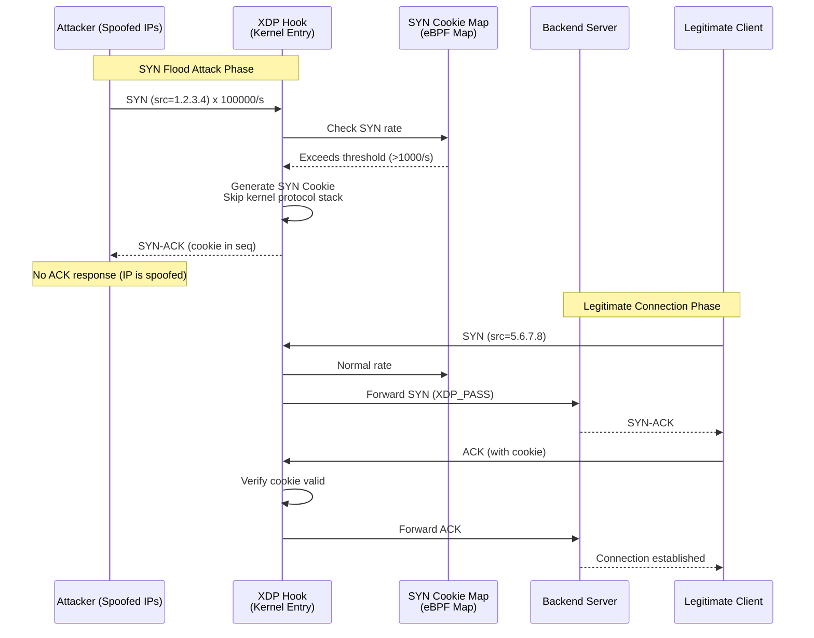

## 3.1.2 XDP SYN Flood Protection Complete Implementation

```c
// File: syn_flood_protection.c
// XDP SYN Cookie Protection - Production-grade SYN Flood mitigation
// Processed at kernel network stack entry, no CPU context switch required

#include <linux/bpf.h>
#include <linux/if_ether.h>
#include <linux/ip.h>
#include <linux/ipv6.h>
#include <linux/tcp.h>
#include <linux/in.h>
#include <bpf/bpf_helpers.h>
#include <bpf/bpf_endian.h>

// =================== Configuration Constants ===================
#define SYN_RATE_THRESHOLD    1000   // SYN packets per second threshold
#define COOKIE_TIMEOUT_S      30     // SYN Cookie timeout (seconds)
#define MAX_TRACKED_IPS       131072 // Maximum tracked IP count
#define BLOOM_FILTER_SIZE     (1 << 20)  // Bloom filter size (1M bits)

// SYN tracking entry
struct syn_entry {
    __u64 count;         // SYN packet count
    __u64 window_start;  // Window start time
    __u8  cookie_mode;   // Whether cookie mode is enabled
};

// =================== eBPF Maps ===================

// Global SYN statistics (by target IP/Port)
struct {
    __uint(type, BPF_MAP_TYPE_LRU_PERCPU_HASH);
    __uint(max_entries, MAX_TRACKED_IPS);
    __type(key, __u32);
    __type(value, struct syn_entry);
} syn_stats SEC(".maps");

// SYN Cookie verification Map (clients sent cookies)
struct {
    __uint(type, BPF_MAP_TYPE_LRU_HASH);
    __uint(max_entries, MAX_TRACKED_IPS * 4);
    __type(key, __u64);   // src_ip:src_port:seq_hash
    __type(value, __u64); // Expiration timestamp
} cookie_map SEC(".maps");

// Global statistics counter
struct {
    __uint(type, BPF_MAP_TYPE_PERCPU_ARRAY);
    __uint(max_entries, 8);
    __type(key, __u32);
    __type(value, __u64);
} stats_map SEC(".maps");

// Whitelist IPs (trusted sources not subject to SYN Cookie)
struct {
    __uint(type, BPF_MAP_TYPE_LRU_HASH);
    __uint(max_entries, 4096);
    __type(key, __u32);   // src_ip
    __type(value, __u8);  // Whitelist flag
} whitelist_map SEC(".maps");

// Statistics indices
#define STAT_SYN_TOTAL       0
#define STAT_SYN_DROPPED     1
#define STAT_COOKIE_SENT     2
#define STAT_COOKIE_VERIFIED 3
#define STAT_WHITELIST_HIT   4

static __always_inline void stat_inc(__u32 idx) {
    __u64 *val = bpf_map_lookup_elem(&stats_map, &idx);
    if (val) __sync_fetch_and_add(val, 1);
}

// =================== SYN Cookie Generation ===================
// Simplified SYN Cookie: using BPF hash function
// Production environment should use HMAC-SHA256
static __always_inline __u32 generate_cookie(
    __u32 src_ip, __u16 src_port,
    __u32 dst_ip, __u16 dst_port,
    __u32 seq, __u64 timestamp)
{
    // Use BPF built-in hash (should be replaced with cryptographic hash in production)
    __u64 hash = (__u64)src_ip ^ ((__u64)src_port << 32) ^
                 (__u64)dst_ip ^ ((__u64)dst_port << 48) ^
                 (__u64)seq ^ (timestamp / 1000000000);
    // Obfuscation
    hash ^= (hash >> 33);
    hash *= 0xff51afd7ed558ccdULL;
    hash ^= (hash >> 33);
    hash *= 0xc4ceb9fe1a85ec53ULL;
    hash ^= (hash >> 33);
    return (__u32)(hash & 0xFFFFFFFF);
}

// =================== Checksum Calculation ===================
static __always_inline __u16 csum_fold(__u32 csum) {
    csum = (csum & 0xffff) + (csum >> 16);
    csum = (csum & 0xffff) + (csum >> 16);
    return ~csum;
}

static __always_inline __u32 csum_diff(
    __u16 *from, int from_size,
    __u16 *to, int to_size, __u32 seed)
{
    return bpf_csum_diff((__be32 *)from, from_size,
                         (__be32 *)to, to_size, seed);
}

// =================== XDP Main Program ===================
SEC("xdp")
int syn_flood_protection(struct xdp_md *ctx) {
    void *data_end = (void *)(long)ctx->data_end;
    void *data     = (void *)(long)ctx->data;

    struct ethhdr *eth = data;
    if ((void *)(eth + 1) > data_end) return XDP_PASS;
    if (bpf_ntohs(eth->h_proto) != ETH_P_IP) return XDP_PASS;

    struct iphdr *ip = (void *)(eth + 1);
    if ((void *)(ip + 1) > data_end) return XDP_PASS;
    if (ip->protocol != IPPROTO_TCP) return XDP_PASS;

    struct tcphdr *tcp = (void *)ip + (ip->ihl * 4);
    if ((void *)(tcp + 1) > data_end) return XDP_PASS;

    __u32 src_ip   = ip->saddr;
    __u32 dst_ip   = ip->daddr;
    __u16 src_port = tcp->source;
    __u16 dst_port = tcp->dest;
    __u8  flags    = ((__u8 *)tcp)[13];

    // ① Check whitelist
    __u8 *wl = bpf_map_lookup_elem(&whitelist_map, &src_ip);
    if (wl) {
        stat_inc(STAT_WHITELIST_HIT);
        return XDP_PASS;
    }

    // ② Handle pure SYN packets (connection establishment phase)
    if ((flags & 0x02) && !(flags & 0x10)) {
        stat_inc(STAT_SYN_TOTAL);

        // Check/update SYN rate
        __u32 key = dst_ip;
        struct syn_entry *entry = bpf_map_lookup_elem(&syn_stats, &key);
        __u64 now = bpf_ktime_get_ns();

        if (!entry) {
            struct syn_entry new_entry = {
                .count        = 1,
                .window_start = now,
                .cookie_mode  = 0,
            };
            bpf_map_update_elem(&syn_stats, &key, &new_entry, BPF_ANY);
            return XDP_PASS;
        }

        // 1 second sliding window
        if (now - entry->window_start > 1000000000ULL) {
            entry->count        = 0;
            entry->window_start = now;
            entry->cookie_mode  = 0;
        }
        __sync_fetch_and_add(&entry->count, 1);

        // Exceed threshold: enable SYN Cookie mode
        if (entry->count > SYN_RATE_THRESHOLD) {
            entry->cookie_mode = 1;

            // Generate and record Cookie
            __u32 cookie = generate_cookie(
                src_ip, src_port, dst_ip, dst_port,
                bpf_ntohl(tcp->seq), now);

            // Record sent Cookie (for ACK phase verification)
            __u64 cookie_key = (__u64)src_ip |
                               ((__u64)src_port << 32) |
                               ((__u64)(cookie & 0xFFFF) << 48);
            __u64 expire = now + COOKIE_TIMEOUT_S * 1000000000ULL;
            bpf_map_update_elem(&cookie_map, &cookie_key, &expire, BPF_ANY);

            stat_inc(STAT_COOKIE_SENT);

            // Build SYN-ACK response (Cookie in seq field)
            // Note: Simplified handling, actual implementation needs complete packet construction
            // Production implementation should use bpf_xdp_adjust_head and similar operations
            // Here only counting and dropping, Cookie sent by separate program
            stat_inc(STAT_SYN_DROPPED);
            return XDP_DROP;  // Drop original SYN, handled by Cookie mechanism
        }
    }

    // ③ Handle ACK packets: verify SYN Cookie
    if ((flags & 0x10) && !(flags & 0x02)) {
        // Check for corresponding Cookie record
        __u32 ack_seq = bpf_ntohl(tcp->ack_seq) - 1;  // SYN-ACK's seq
        __u32 expected_cookie = generate_cookie(
            src_ip, src_port, dst_ip, dst_port,
            ack_seq, bpf_ktime_get_ns());

        __u64 cookie_key = (__u64)src_ip |
                           ((__u64)src_port << 32) |
                           ((__u64)(expected_cookie & 0xFFFF) << 48);

        __u64 *expire = bpf_map_lookup_elem(&cookie_map, &cookie_key);
        if (expire && bpf_ktime_get_ns() < *expire) {
            stat_inc(STAT_COOKIE_VERIFIED);
            bpf_map_delete_elem(&cookie_map, &cookie_key);
            return XDP_PASS;  // Cookie verification passed
        }
    }

    return XDP_PASS;
}

char LICENSE[] SEC("license") = "GPL";
```

## 3.2 Rate Limiting

## 3.2.1 Token Bucket Algorithm Implementation

```c
// File: rate_limiter_xdp.c
// XDP Token Bucket Rate Limiter
// Supports three-level rate limiting: Per-IP, Per-Port, and global

#include <linux/bpf.h>
#include <linux/if_ether.h>
#include <linux/ip.h>
#include <linux/tcp.h>
#include <linux/udp.h>
#include <bpf/bpf_helpers.h>
#include <bpf/bpf_endian.h>

// Token Bucket parameters
#define TOKEN_RATE     1000  // Token refill rate per second (packets/sec)
#define TOKEN_BURST    2000  // Maximum token bucket capacity (burst allowed)
#define NS_PER_TOKEN   (1000000000ULL / TOKEN_RATE)  // Time interval per token

struct token_bucket {
    __u64 tokens;       // Current token count
    __u64 last_refill;  // Last refill timestamp (nanoseconds)
};

struct {
    __uint(type, BPF_MAP_TYPE_LRU_PERCPU_HASH);
    __uint(max_entries, 65536);
    __type(key, __u32);                    // src_ip
    __type(value, struct token_bucket);
} ip_rate_limit SEC(".maps");

// Global rate limiting (whole machine)
struct {
    __uint(type, BPF_MAP_TYPE_PERCPU_ARRAY);
    __uint(max_entries, 1);
    __type(key, __u32);
    __type(value, struct token_bucket);
} global_rate_limit SEC(".maps");

// Rate limiting configuration (per-IP quota, userspace can dynamically adjust)
struct {
    __uint(type, BPF_MAP_TYPE_HASH);
    __uint(max_entries, 65536);
    __type(key, __u32);     // src_ip
    __type(value, __u64);   // Custom rate (0 = use default)
} custom_rate_map SEC(".maps");

// Token Bucket algorithm: consume one token
// Returns 0: allow pass; 1: over-rate drop
static __always_inline int consume_token(
    struct token_bucket *tb, __u64 rate, __u64 burst)
{
    __u64 now = bpf_ktime_get_ns();
    __u64 elapsed = now - tb->last_refill;

    // Calculate tokens to refill
    __u64 new_tokens = (elapsed * rate) / 1000000000ULL;
    if (new_tokens > 0) {
        tb->tokens = tb->tokens + new_tokens;
        if (tb->tokens > burst) tb->tokens = burst;
        tb->last_refill = now;
    }

    if (tb->tokens > 0) {
        tb->tokens--;
        return 0;  // Allow
    }
    return 1;  // Over-rate
}

SEC("xdp")
int rate_limiter(struct xdp_md *ctx) {
    void *data_end = (void *)(long)ctx->data_end;
    void *data     = (void *)(long)ctx->data;

    struct ethhdr *eth = data;
    if ((void *)(eth + 1) > data_end) return XDP_PASS;
    if (bpf_ntohs(eth->h_proto) != ETH_P_IP) return XDP_PASS;

    struct iphdr *ip = (void *)(eth + 1);
    if ((void *)(ip + 1) > data_end) return XDP_PASS;

    __u32 src_ip = ip->saddr;

    // 1. Global rate check (protect overall bandwidth)
    __u32 zero = 0;
    struct token_bucket *global_tb =
        bpf_map_lookup_elem(&global_rate_limit, &zero);
    if (global_tb) {
        if (consume_token(global_tb,
            TOKEN_RATE * 100,    // Higher global quota
            TOKEN_BURST * 100)) {
            return XDP_DROP;
        }
    }

    // 2. Per-IP rate check
    struct token_bucket *ip_tb =
        bpf_map_lookup_elem(&ip_rate_limit, &src_ip);

    if (!ip_tb) {
        struct token_bucket new_tb = {
            .tokens      = TOKEN_BURST,
            .last_refill = bpf_ktime_get_ns(),
        };
        bpf_map_update_elem(&ip_rate_limit, &src_ip, &new_tb, BPF_ANY);
        return XDP_PASS;
    }

    // Check custom rate
    __u64 *custom_rate = bpf_map_lookup_elem(&custom_rate_map, &src_ip);
    __u64 rate  = custom_rate ? *custom_rate : TOKEN_RATE;
    __u64 burst = rate * 2;

    if (consume_token(ip_tb, rate, burst)) {
        return XDP_DROP;
    }

    return XDP_PASS;
}

char LICENSE[] SEC("license") = "GPL";
```

## 3.3 Connection Tracking

## 3.3.1 Connection State Machine

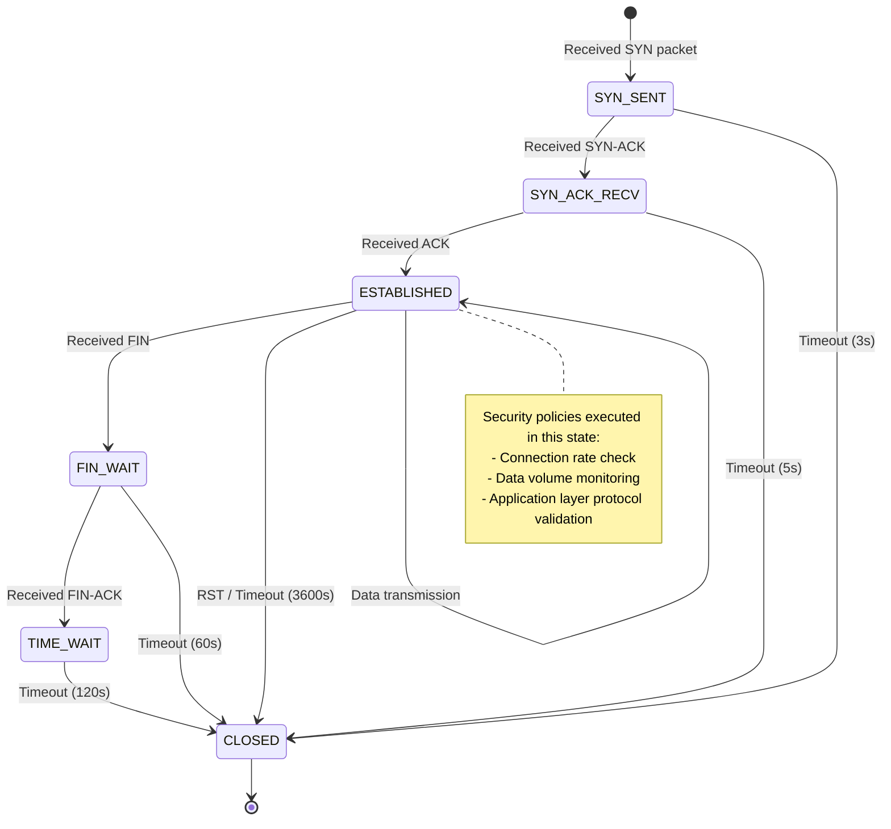

```c
// File: conntrack_ebpf.c
// eBPF connection tracking implementation
// Supports TCP/UDP state machine, integrated with XDP protection

#include <linux/bpf.h>
#include <linux/if_ether.h>
#include <linux/ip.h>
#include <linux/tcp.h>
#include <bpf/bpf_helpers.h>
#include <bpf/bpf_endian.h>

// Connection states
#define CT_STATE_NEW         0
#define CT_STATE_SYN_SENT    1
#define CT_STATE_ESTABLISHED 2
#define CT_STATE_FIN_WAIT    3
#define CT_STATE_TIME_WAIT   4
#define CT_STATE_CLOSED      5

// Connection 4-tuple key
struct ct_key {
    __u32 src_ip;
    __u32 dst_ip;
    __u16 src_port;
    __u16 dst_port;
    __u8  proto;
    __u8  pad[3];
};

// Connection tracking entry
struct ct_entry {
    __u8  state;
    __u64 created_at;
    __u64 last_seen;
    __u64 packets;
    __u64 bytes;
    __u32 flags;
};

#define CT_FLAG_ASSURED    (1 << 0)
#define CT_FLAG_DYING      (1 << 1)

struct {
    __uint(type, BPF_MAP_TYPE_LRU_HASH);
    __uint(max_entries, 1 << 20);  // 1M connections
    __type(key, struct ct_key);
    __type(value, struct ct_entry);
} conntrack_map SEC(".maps");

// Normalize connection key (ensure bidirectional flow maps to same entry)
static __always_inline void normalize_key(
    struct ct_key *key, struct ct_key *rev_key,
    __u32 src_ip, __u32 dst_ip,
    __u16 src_port, __u16 dst_port, __u8 proto)
{
    key->src_ip   = src_ip;  key->dst_ip   = dst_ip;
    key->src_port = src_port; key->dst_port = dst_port;
    key->proto    = proto;

    rev_key->src_ip   = dst_ip;  rev_key->dst_ip   = src_ip;
    rev_key->src_port = dst_port; rev_key->dst_port = src_port;
    rev_key->proto    = proto;
}

SEC("xdp")
int conntrack_xdp(struct xdp_md *ctx) {
    void *data_end = (void *)(long)ctx->data_end;
    void *data     = (void *)(long)ctx->data;

    struct ethhdr *eth = data;
    if ((void *)(eth + 1) > data_end) return XDP_PASS;
    if (bpf_ntohs(eth->h_proto) != ETH_P_IP) return XDP_PASS;

    struct iphdr *ip = (void *)(eth + 1);
    if ((void *)(ip + 1) > data_end) return XDP_PASS;
    if (ip->protocol != IPPROTO_TCP) return XDP_PASS;

    struct tcphdr *tcp = (void *)ip + (ip->ihl * 4);
    if ((void *)(tcp + 1) > data_end) return XDP_PASS;

    __u8 flags = ((__u8 *)tcp)[13];
    struct ct_key key, rev_key;
    normalize_key(&key, &rev_key,
        ip->saddr, ip->daddr,
        tcp->source, tcp->dest, IPPROTO_TCP);

    __u64 now = bpf_ktime_get_ns();

    // Look up existing connection
    struct ct_entry *entry = bpf_map_lookup_elem(&conntrack_map, &key);
    if (!entry) {
        entry = bpf_map_lookup_elem(&conntrack_map, &rev_key);
    }

    if (!entry) {
        // New connection: only allow SYN initiation
        if (!(flags & 0x02)) return XDP_DROP;  // Non-SYN: drop
        struct ct_entry new_entry = {
            .state      = CT_STATE_SYN_SENT,
            .created_at = now,
            .last_seen  = now,
            .packets    = 1,
            .bytes      = bpf_ntohs(ip->tot_len),
        };
        bpf_map_update_elem(&conntrack_map, &key, &new_entry, BPF_ANY);
        return XDP_PASS;
    }

    // Timeout check (ESTABLISHED connection 1 hour without activity)
    if (entry->state == CT_STATE_ESTABLISHED &&
        now - entry->last_seen > 3600ULL * 1000000000ULL) {
        entry->state = CT_STATE_CLOSED;
        bpf_map_delete_elem(&conntrack_map, &key);
        return XDP_DROP;
    }

    // Update statistics
    __sync_fetch_and_add(&entry->packets, 1);
    __sync_fetch_and_add(&entry->bytes, bpf_ntohs(ip->tot_len));
    entry->last_seen = now;

    // State transitions
    if (flags & 0x04) {  // RST
        entry->state = CT_STATE_CLOSED;
        return XDP_PASS;
    }
    if ((flags & 0x12) == 0x12) {  // SYN-ACK
        entry->state = CT_STATE_SYN_SENT;
    }
    if ((flags & 0x10) && entry->state == CT_STATE_SYN_SENT) {
        entry->state = CT_STATE_ESTABLISHED;
        entry->flags |= CT_FLAG_ASSURED;
    }
    if (flags & 0x01) {  // FIN
        entry->state = CT_STATE_FIN_WAIT;
    }

    return XDP_PASS;
}

char LICENSE[] SEC("license") = "GPL";
```

---

<!-- chunk: 4. Container Security -->## 4. Container Security

## 4.1 Container Escape Detection

## 4.1.1 Container Escape Attack Vectors

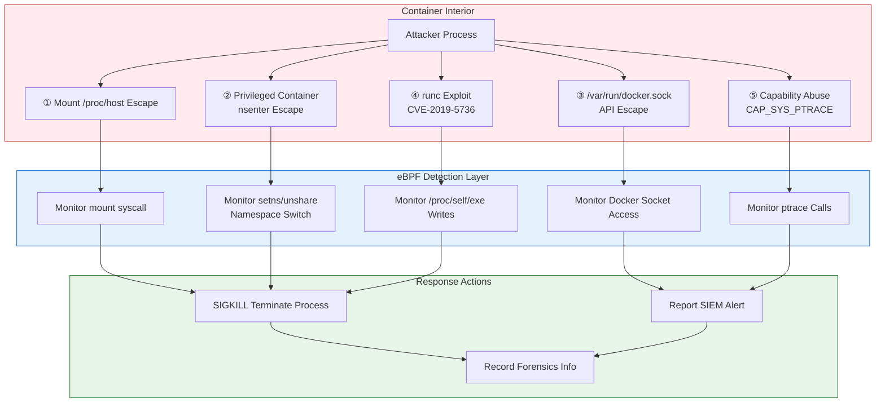

## 4.1.2 TracingPolicy: Complete Container Escape Detection Policy

```yaml
# File: policy-container-escape-detection.yaml
# Tetragon TracingPolicy - Container escape detection
# Coverage: namespace escape, privileged operations, Docker Socket access

apiVersion: cilium.io/v1alpha1
kind: TracingPolicy
metadata:
  name: container-escape-detection
  namespace: kube-system
  labels:
    security.kudig.io/category: "container-security"
    security.kudig.io/severity: "critical"
    security.kudig.io/compliance: "cis-kubernetes"
spec:
  kprobes:
    # ===== Escape Vector 1: Namespace Switch Detection =====
    - call: "__x64_sys_unshare"
      syscall: true
      args:
        - index: 0
          type: "int"   # clone flags
      selectors:
        # Detect CLONE_NEWNS (mount namespace) switching
        - matchArgs:
            - index: 0
              operator: "Mask"
              values:
                - "131072"  # CLONE_NEWNS = 0x20000
          matchNamespaces:
            - namespace: Mnt
              operator: NotIn
              values:
                - "host"
          matchActions:
            - action: Post
            - action: Sigkill

    # ===== Escape Vector 2: setns switching to host namespace =====
    - call: "__x64_sys_setns"
      syscall: true
      args:
        - index: 0
          type: "int"   # fd
        - index: 1
          type: "int"   # nstype
      selectors:
        - matchActions:
            - action: Post
              rateLimit: "1/minute"
            - action: Sigkill

    # ===== Escape Vector 3: Privileged mount operations =====
    - call: "__x64_sys_mount"
      syscall: true
      args:
        - index: 0
          type: "string"  # source
        - index: 1
          type: "string"  # target
        - index: 2
          type: "string"  # filesystemtype
      selectors:
        # Detect mounting host devices
        - matchArgs:
            - index: 2
              operator: "In"
              values:
                - "ext4"
                - "xfs"
                - "btrfs"
                - "overlayfs"
          matchCapabilities:
            - type: Effective
              operator: In
              values:
                - "CAP_SYS_ADMIN"
          matchActions:
            - action: Post
            - action: Sigkill

    # ===== Escape Vector 4: /proc/1/root access (host root directory) =====
    - call: "__x64_sys_openat"
      syscall: true
      args:
        - index: 1
          type: "string"
      selectors:
        - matchArgs:
            - index: 1
              operator: "Prefix"
              values:
                - "/proc/1/root"
                - "/proc/1/fd"
                - "/proc/1/mem"
                - "/host"
          matchActions:
            - action: Post
            - action: Sigkill

    # ===== Escape Vector 5: Docker Socket access =====
    - call: "__x64_sys_connect"
      syscall: true
      args:
        - index: 0
          type: "int"
      selectors:
        - matchArgs:
            - index: 0
              operator: "Equal"
              values:
                - "1"  # AF_UNIX
          matchActions:
            - action: Post
              rateLimit: "10/minute"
        # Detect /var/run/docker.sock file descriptor
    - call: "__x64_sys_openat"
      syscall: true
      args:
        - index: 1
          type: "string"
      selectors:
        - matchArgs:
            - index: 1
              operator: "In"
              values:
                - "/var/run/docker.sock"
                - "/run/docker.sock"
                - "/run/containerd/containerd.sock"
                - "/run/crio/crio.sock"
          matchActions:
            - action: Post
            - action: Sigkill

    # ===== Escape Vector 6: capability escalation =====
    - call: "cap_capable"
      syscall: false
      args:
        - index: 2
          type: "int"   # capability
      selectors:
        # Detect container requesting CAP_SYS_ADMIN / CAP_NET_ADMIN
        - matchArgs:
            - index: 2
              operator: "In"
              values:
                - "21"   # CAP_SYS_ADMIN
                - "12"   # CAP_NET_ADMIN
                - "7"    # CAP_SETUID
                - "8"    # CAP_SETGID
          matchNamespaces:
            - namespace: Pid
              operator: NotIn
              values:
                - "host"
          matchActions:
            - action: Post
              rateLimit: "5/minute"
```

## 4.2 Privilege Escalation Monitoring

### 4.2.1 eBPF Privilege Escalation Detection Program

```c
// File: privilege_escalation_detector.c
// eBPF privilege escalation detection
// Monitor: setuid/setgid, capability changes, sudo execution

#include <linux/bpf.h>
#include <linux/ptrace.h>
#include <linux/sched.h>
#include <linux/cred.h>
#include <bpf/bpf_helpers.h>
#include <bpf/bpf_tracing.h>
#include <bpf/bpf_core_read.h>

#define TASK_COMM_LEN 16

struct privesc_event {
    __u64 timestamp;
    __u32 pid;
    __u32 ppid;
    __u32 old_uid;
    __u32 new_uid;
    __u32 old_gid;
    __u32 new_gid;
    __u64 old_caps;   // Old capability set
    __u64 new_caps;   // New capability set
    char  comm[TASK_COMM_LEN];
    char  event_type[32];  // setuid/setcap/sudo
    __u64 container_id;    // Container identifier
};

struct {
    __uint(type, BPF_MAP_TYPE_RINGBUF);
    __uint(max_entries, 4 * 1024 * 1024);
} privesc_events SEC(".maps");

// Trace commit_creds: core function for credential changes
SEC("kprobe/commit_creds")
int BPF_KPROBE(trace_commit_creds, struct cred *new_cred)
{
    struct task_struct *task = (struct task_struct *)bpf_get_current_task();

    // Read old credentials
    const struct cred *old_cred = BPF_CORE_READ(task, cred);
    __u32 old_uid = BPF_CORE_READ(old_cred, uid.val);
    __u32 old_gid = BPF_CORE_READ(old_cred, gid.val);
    __u32 new_uid = BPF_CORE_READ(new_cred, uid.val);
    __u32 new_gid = BPF_CORE_READ(new_cred, gid.val);

    // Only care about UID changes (especially becoming 0, i.e. root)
    if (old_uid == new_uid && old_gid == new_gid) return 0;
    // Core alert: non-root becoming root
    if (new_uid != 0 && old_uid != 0) return 0;

    struct privesc_event *evt = bpf_ringbuf_reserve(
        &privesc_events, sizeof(struct privesc_event), 0);
    if (!evt) return 0;

    evt->timestamp = bpf_ktime_get_ns();
    evt->pid       = bpf_get_current_pid_tgid() >> 32;
    evt->ppid      = BPF_CORE_READ(task, real_parent, tgid);
    evt->old_uid   = old_uid;
    evt->new_uid   = new_uid;
    evt->old_gid   = old_gid;
    evt->new_gid   = new_gid;
    bpf_get_current_comm(&evt->comm, sizeof(evt->comm));
    __builtin_memcpy(evt->event_type, "SETUID_TO_ROOT", 14);

    // Read capability
    __u64 old_cap = BPF_CORE_READ(old_cred, cap_effective.cap[0]);
    __u64 new_cap = BPF_CORE_READ(new_cred, cap_effective.cap[0]);
    evt->old_caps = old_cap;
    evt->new_caps = new_cap;

    bpf_ringbuf_submit(evt, 0);
    return 0;
}

// Trace security_capset: capability set changes
SEC("kprobe/security_capset")
int BPF_KPROBE(trace_security_capset,
               struct cred *new_cred,
               const struct cred *old_cred,
               const kernel_cap_t *effective,
               const kernel_cap_t *inheritable,
               const kernel_cap_t *permitted)
{
    __u32 uid = BPF_CORE_READ(new_cred, uid.val);

    struct privesc_event *evt = bpf_ringbuf_reserve(
        &privesc_events, sizeof(struct privesc_event), 0);
    if (!evt) return 0;

    evt->timestamp = bpf_ktime_get_ns();
    evt->pid       = bpf_get_current_pid_tgid() >> 32;
    evt->new_uid   = uid;
    bpf_get_current_comm(&evt->comm, sizeof(evt->comm));
    __builtin_memcpy(evt->event_type, "CAPSET_CHANGE", 13);

    bpf_ringbuf_submit(evt, 0);
    return 0;
}

char LICENSE[] SEC("license") = "GPL";
```

## 4.3 Namespace Isolation Verification

### 4.3.1 Kubernetes Namespace Security Policy

```yaml
# File: policy-namespace-isolation-verify.yaml
# Tetragon + Cilium joint policy
# Verify container namespace isolation integrity

apiVersion: cilium.io/v1alpha1
kind: TracingPolicy
metadata:
  name: namespace-isolation-verification
  namespace: kube-system
spec:
  # Monitor special operations in PID namespace
  kprobes:
    # 1. Detect PID 1 signals (init process attack)
    - call: "__x64_sys_kill"
      syscall: true
      args:
        - index: 0
          type: "int"   # pid
        - index: 1
          type: "int"   # signal
      selectors:
        - matchArgs:
            - index: 0
              operator: "Equal"
              values:
                - "1"     # PID 1 (init/systemd)
          matchActions:
            - action: Post
            - action: Sigkill

    # 2. Detect /proc filesystem mount (namespace escape precursor)
    - call: "__x64_sys_mount"
      syscall: true
      args:
        - index: 2
          type: "string"
      selectors:
        - matchArgs:
            - index: 2
              operator: "Equal"
              values:
                - "proc"
                - "sysfs"
                - "devtmpfs"
          matchActions:
            - action: Post
            - action: Sigkill

---
# Cilium NetworkPolicy - namespace network isolation
apiVersion: "cilium.io/v2"
kind: CiliumNetworkPolicy
metadata:
  name: namespace-network-isolation
  namespace: production
spec:
  endpointSelector:
    matchLabels:
      app.kubernetes.io/part-of: "production"
  # Allow only intra-namespace communication
  ingress:
    - fromEndpoints:
        - matchLabels:
            k8s:io.kubernetes.pod.namespace: production
  # Allow outbound to specified services
  egress:
    - toEndpoints:
        - matchLabels:
            k8s:io.kubernetes.pod.namespace: kube-system
      toPorts:
        - ports:
            - port: "53"
              protocol: UDP
    - toEndpoints:
        - matchLabels:
            k8s:io.kubernetes.pod.namespace: production
    # Do not allow direct connection to host IP ranges
    - toCIDRSet:
        - cidr: "0.0.0.0/0"
          except:
            - "169.254.0.0/16"
            - "10.0.0.0/8"
```

---

<!-- chunk: 5. Zero Trust Network Security -->## 5. Zero Trust Network Security

## 5.1 Zero Trust Architecture

```mermaid
graph TB
    subgraph ZTA["Zero Trust Architecture"]
        subgraph Identity["Identity Verification Layer"]
            SPIFFE[SPIFFE/SPIRE<br/>Workload Identity]
            mTLS[mTLS Mutual Authentication]
            JWT[JWT/OIDC<br/>Service Account]
        end

        subgraph Policy["Policy Enforcement Layer (eBPF)"]
            CILIUM[Cilium CNI<br/>L3/L4/L7 Policy]
            TETRAGON[Tetragon<br/>Runtime Policy]
            LSM[eBPF LSM Hook<br/>Kernel-level Enforcement]
        end

        subgraph Observe["Continuous Monitoring Layer"]
            HUBBLE[Hubble<br/>Network Visibility]
            METRICS[Prometheus<br/>Security Metrics]
            LOGS[Structured Logging<br/>SIEM Integration]
        end

        subgraph WorkloadA["Workload A (Pod)"]
            SVC_A[Service A<br/>app=frontend]
        end

        subgraph WorkloadB["Workload B (Pod)"]
            SVC_B[Service B<br/>app=backend]
        end

        SVC_A -->|① Request<br/>With SPIFFE ID| mTLS
        mTLS -->|② Verify Identity| SPIFFE
        SPIFFE -->|③ Authorization Decision| CILIUM
        CILIUM -->|④ Policy Match| SVC_B
        SVC_B -->|⑤ Execute + Audit| TETRAGON
        TETRAGON -->|⑥ Event Report| HUBBLE
        HUBBLE -->|⑦ Telemetry Data| METRICS
    end

    style ZTA fill:#f3e5f5,stroke:#7b1fa2
    style Identity fill:#e8eaf6,stroke:#3949ab
    style Policy fill:#e3f2fd,stroke:#1565c0
    style Observe fill:#e8f5e9,stroke:#2e7d32
```

## 5.2 Cilium Zero Trust Policy Implementation

```yaml
# File: zero-trust-cilium-policy.yaml
# Cilium Zero Trust Network Policy - SPIFFE identity-based micro-segmentation

apiVersion: "cilium.io/v2"
kind: CiliumNetworkPolicy
metadata:
  name: zero-trust-microservice-policy
  namespace: production
  annotations:
    security.kudig.io/zero-trust: "enabled"
    security.kudig.io/last-reviewed: "2026-03-04"
spec:
  # Scope: All production namespace Pods
  endpointSelector: {}

  ingress:
    # Rule 1: frontend can only accept traffic from ingress
    - fromEndpoints:
        - matchLabels:
            app: ingress-nginx
            k8s:io.kubernetes.pod.namespace: ingress-nginx
      toPorts:
        - ports:
            - port: "8080"
              protocol: TCP
          rules:
            http:
              - method: "GET"
                path: "/api/v1/.*"
              - method: "POST"
                path: "/api/v1/.*"

    # Rule 2: backend only accepts frontend connections (mTLS enforced)
    - fromEndpoints:
        - matchLabels:
            app: frontend
      toPorts:
        - ports:
            - port: "9090"
              protocol: TCP
          rules:
            http:
              - method: "GET"
              - method: "POST"
              - method: "PUT"

    # Rule 3: database only accepts backend connections
    - fromEndpoints:
        - matchLabels:
            app: backend
      toPorts:
        - ports:
            - port: "5432"
              protocol: TCP

  egress:
    # Only allow access to necessary external services
    - toEndpoints:
        - matchLabels:
            k8s:io.kubernetes.pod.namespace: kube-system
      toPorts:
        - ports:
            - port: "53"
              protocol: UDP

    # Allow access to internal service registry
    - toEndpoints:
        - matchLabels:
            app: consul
            k8s:io.kubernetes.pod.namespace: service-mesh
      toPorts:
        - ports:
            - port: "8500"
              protocol: TCP

---
# Cilium mTLS Policy (integrated with SPIFFE)
apiVersion: "cilium.io/v2"
kind: CiliumClusterwideNetworkPolicy
metadata:
  name: enforce-mtls-production
spec:
  endpointSelector:
    matchLabels:
      security.istio.io/tlsMode: "istio"
  ingress:
    - fromEndpoints:
        - matchLabels:
            security.istio.io/tlsMode: "istio"
```

## 5.3 eBPF Zero Trust Enforcement Points

```c
// File: zero_trust_enforcer.c
// eBPF TC (Traffic Control) program - Zero Trust policy enforcement
// Execute identity verification and authorization at TC ingress/egress points

#include <linux/bpf.h>
#include <linux/pkt_cls.h>
#include <linux/if_ether.h>
#include <linux/ip.h>
#include <linux/tcp.h>
#include <bpf/bpf_helpers.h>
#include <bpf/bpf_endian.h>

// SPIFFE Trust Bundle (simplified version, actual implementation uses X.509 TLS verification)
struct identity {
    __u32 ip;
    __u32 namespace_id;
    __u32 service_id;
    __u8  trust_level;   // 0=untrusted, 1=internal, 2=privileged
};

// Zero Trust policy entry
struct zt_policy {
    __u32 src_service;
    __u32 dst_service;
    __u16 dst_port;
    __u8  allowed;
    __u8  require_mtls;
};

// Workload identity Map (maintained by Cilium Agent)
struct {
    __uint(type, BPF_MAP_TYPE_LRU_HASH);
    __uint(max_entries, 65536);
    __type(key, __u32);              // IP
    __type(value, struct identity);
} identity_map SEC(".maps");

// Policy Map (2D key: src_service + dst_service + port)
struct {
    __uint(type, BPF_MAP_TYPE_LRU_HASH);
    __uint(max_entries, 65536);
    __type(key, struct zt_policy);   // Use first 3 fields as key
    __type(value, __u8);             // Whether allowed
} policy_map SEC(".maps");

// Audit event
struct zt_audit_event {
    __u64 timestamp;
    __u32 src_ip;
    __u32 dst_ip;
    __u16 dst_port;
    __u32 src_service;
    __u32 dst_service;
    __u8  decision;   // 0=deny, 1=allow
    __u8  reason;     // 1=no_identity, 2=no_policy, 3=policy_deny
};

struct {
    __uint(type, BPF_MAP_TYPE_RINGBUF);
    __uint(max_entries, 4 * 1024 * 1024);
} audit_events SEC(".maps");

SEC("tc")
int zero_trust_tc_ingress(struct __sk_buff *skb) {
    void *data_end = (void *)(long)skb->data_end;
    void *data     = (void *)(long)skb->data;

    struct ethhdr *eth = data;
    if ((void *)(eth + 1) > data_end) return TC_ACT_OK;
    if (bpf_ntohs(eth->h_proto) != ETH_P_IP) return TC_ACT_OK;

    struct iphdr *ip = (void *)(eth + 1);
    if ((void *)(ip + 1) > data_end) return TC_ACT_OK;
    if (ip->protocol != IPPROTO_TCP) return TC_ACT_OK;

    struct tcphdr *tcp = (void *)ip + (ip->ihl * 4);
    if ((void *)(tcp + 1) > data_end) return TC_ACT_OK;

    __u32 src_ip  = ip->saddr;
    __u32 dst_ip  = ip->daddr;
    __u16 dst_port = bpf_ntohs(tcp->dest);

    // Look up source identity
    struct identity *src_id = bpf_map_lookup_elem(&identity_map, &src_ip);
    if (!src_id) {
        // Cannot identify: default deny (zero trust principle)
        struct zt_audit_event *evt = bpf_ringbuf_reserve(
            &audit_events, sizeof(*evt), 0);
        if (evt) {
            evt->timestamp  = bpf_ktime_get_ns();
            evt->src_ip     = src_ip;
            evt->dst_ip     = dst_ip;
            evt->dst_port   = dst_port;
            evt->decision   = 0;
            evt->reason     = 1;  // no_identity
            bpf_ringbuf_submit(evt, 0);
        }
        return TC_ACT_SHOT;  // Drop
    }

    // Look up destination identity
    struct identity *dst_id = bpf_map_lookup_elem(&identity_map, &dst_ip);
    if (!dst_id) return TC_ACT_SHOT;

    // Check policy
    struct zt_policy policy_key = {
        .src_service = src_id->service_id,
        .dst_service = dst_id->service_id,
        .dst_port    = dst_port,
    };
    __u8 *allowed = bpf_map_lookup_elem(&policy_map, &policy_key);
    if (!allowed || !*allowed) {
        return TC_ACT_SHOT;  // Policy deny
    }

    return TC_ACT_OK;  // Policy allow
}

char LICENSE[] SEC("license") = "GPL";
```

---

<!-- chunk: 6. Compliance and Auditing -->## 6. Compliance and Auditing

## 6.1 System Call Auditing

## 6.1.1 Compliance Framework Mapping

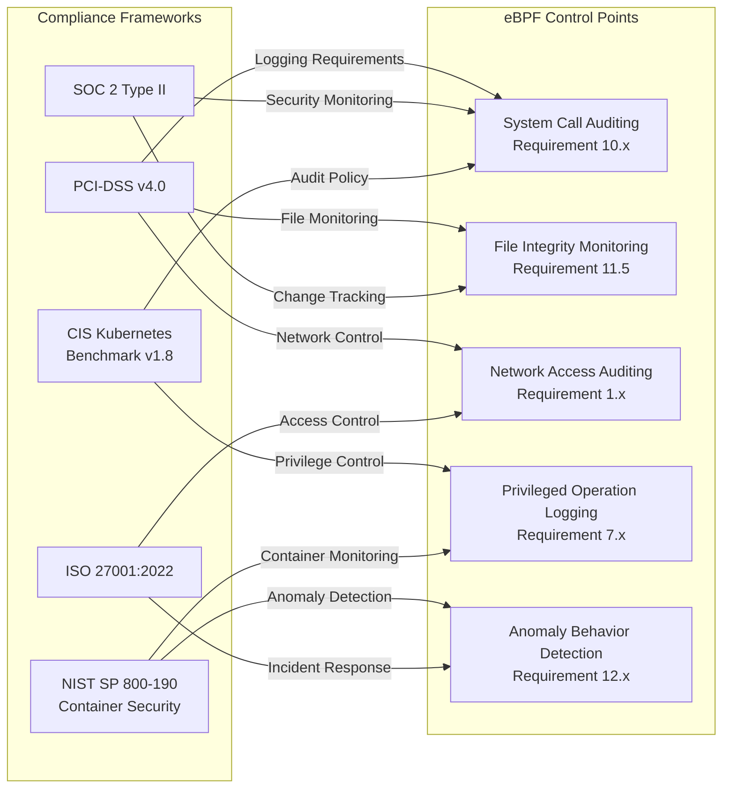

## 6.1.2 System Call Auditing eBPF Program

```c
// File: syscall_auditor.c
// eBPF system call auditing program
// PCI-DSS/SOC2 compliance: Record all sensitive system calls

#include <linux/bpf.h>
#include <linux/ptrace.h>
#include <bpf/bpf_helpers.h>
#include <bpf/bpf_tracing.h>
#include <bpf/bpf_core_read.h>

#define TASK_COMM_LEN  16
#define MAX_FILENAME   128

// Audit event types
#define AUDIT_EXEC     1
#define AUDIT_OPEN     2
#define AUDIT_SOCKET   3
#define AUDIT_SETUID   4
#define AUDIT_PTRACE   5
#define AUDIT_MMAP     6
#define AUDIT_MODULE   7  // Kernel module load
#define AUDIT_DELETE   8  // File deletion

struct audit_record {
    __u64 timestamp;
    __u32 pid;
    __u32 ppid;
    __u32 uid;
    __u32 gid;
    __u32 sessionid;
    __u64 container_id;
    char  comm[TASK_COMM_LEN];
    __u8  audit_type;
    __u8  success;
    __s32 return_val;
    // Additional fields (use different fields based on audit_type)
    union {
        struct {
            char filename[MAX_FILENAME];
            __u32 flags;
            __u32 mode;
        } file_info;
        struct {
            __u32 family;
            __u32 type;
            __u32 protocol;
        } socket_info;
        struct {
            __u32 target_pid;
            __u32 request;
        } ptrace_info;
        struct {
            char name[MAX_FILENAME];
        } module_info;
    };
};

struct {
    __uint(type, BPF_MAP_TYPE_RINGBUF);
    __uint(max_entries, 32 * 1024 * 1024);  // 32MB audit buffer
} audit_rb SEC(".maps");

// Filter rules (audit only specific UID or containers)
struct audit_filter {
    __u32 min_uid;    // 0 = all users
    __u8  container_only;  // Audit only within containers
    __u8  privileged_only; // Audit only privileged operations
};

struct {
    __uint(type, BPF_MAP_TYPE_ARRAY);
    __uint(max_entries, 1);
    __type(key, __u32);
    __type(value, struct audit_filter);
} filter_config SEC(".maps");

// Generic audit record population
static __always_inline struct audit_record *
begin_audit_record(__u8 audit_type) {
    struct audit_record *rec = bpf_ringbuf_reserve(
        &audit_rb, sizeof(struct audit_record), 0);
    if (!rec) return NULL;

    struct task_struct *task = (struct task_struct *)bpf_get_current_task();
    __u64 pid_tgid = bpf_get_current_pid_tgid();

    rec->timestamp    = bpf_ktime_get_ns();
    rec->pid          = pid_tgid >> 32;
    rec->uid          = bpf_get_current_uid_gid() & 0xFFFFFFFF;
    rec->gid          = bpf_get_current_uid_gid() >> 32;
    rec->ppid         = BPF_CORE_READ(task, real_parent, tgid);
    rec->audit_type   = audit_type;
    bpf_get_current_comm(&rec->comm, sizeof(rec->comm));
    return rec;
}

// Audit openat (file access)
SEC("tracepoint/syscalls/sys_enter_openat")
int audit_openat(struct trace_event_raw_sys_enter *ctx) {
    struct audit_record *rec = begin_audit_record(AUDIT_OPEN);
    if (!rec) return 0;

    const char __user *filename =
        (const char __user *)ctx->args[1];
    bpf_probe_read_user_str(rec->file_info.filename,
                            MAX_FILENAME, filename);
    rec->file_info.flags = (__u32)ctx->args[2];
    rec->file_info.mode  = (__u32)ctx->args[3];

    bpf_ringbuf_submit(rec, 0);
    return 0;
}

// Audit socket (network connection creation)
SEC("tracepoint/syscalls/sys_enter_socket")
int audit_socket(struct trace_event_raw_sys_enter *ctx) {
    struct audit_record *rec = begin_audit_record(AUDIT_SOCKET);
    if (!rec) return 0;

    rec->socket_info.family   = (__u32)ctx->args[0];
    rec->socket_info.type     = (__u32)ctx->args[1];
    rec->socket_info.protocol = (__u32)ctx->args[2];

    bpf_ringbuf_submit(rec, 0);
    return 0;
}

// Audit init_module / finit_module (kernel module load - high risk)
SEC("tracepoint/syscalls/sys_enter_finit_module")
int audit_module_load(struct trace_event_raw_sys_enter *ctx) {
    struct audit_record *rec = begin_audit_record(AUDIT_MODULE);
    if (!rec) return 0;

    // Kernel module load: immediate alert
    bpf_ringbuf_submit(rec, 0);
    return 0;
}

// Audit ptrace (debug/injection detection)
SEC("tracepoint/syscalls/sys_enter_ptrace")
int audit_ptrace(struct trace_event_raw_sys_enter *ctx) {
    struct audit_record *rec = begin_audit_record(AUDIT_PTRACE);
    if (!rec) return 0;

    rec->ptrace_info.request   = (__u32)ctx->args[0];
    rec->ptrace_info.target_pid = (__u32)ctx->args[1];

    bpf_ringbuf_submit(rec, 0);
    return 0;
}

char LICENSE[] SEC("license") = "GPL";
```

## 6.1.3 Compliance Auditing TracingPolicy (PCI-DSS/SOC2)

```yaml
# File: policy-compliance-audit.yaml
# Tetragon TracingPolicy - Compliance audit policy
# PCI-DSS v4.0 Requirement 10 & 11

apiVersion: cilium.io/v1alpha1
kind: TracingPolicy
metadata:
  name: compliance-audit-pci-soc2
  namespace: kube-system
  labels:
    security.kudig.io/compliance: "pci-dss,soc2,iso27001"
    security.kudig.io/category: "audit"
spec:
  kprobes:
    # PCI-DSS 10.2.1 - User access auditing
    - call: "__x64_sys_setuid"
      syscall: true
      args:
        - index: 0
          type: "int"
      selectors:
        - matchActions:
            - action: Post

    # PCI-DSS 10.2.2 - Root user operations
    - call: "security_bprm_check"
      syscall: false
      args:
        - index: 0
          type: "linux_binprm"
      selectors:
        - matchCapabilities:
            - type: Effective
              operator: In
              values:
                - "CAP_SYS_ADMIN"
          matchActions:
            - action: Post

    # PCI-DSS 10.2.4 - Unauthorized access attempts
    - call: "security_inode_permission"
      syscall: false
      args:
        - index: 0
          type: "inode"
        - index: 1
          type: "int"   # mask (MAY_READ/MAY_WRITE/MAY_EXEC)
      selectors:
        - matchReturnArgs:
            - index: 0
              operator: "Equal"
              values:
                - "-13"  # -EACCES
          matchActions:
            - action: Post
              rateLimit: "100/minute"

    # PCI-DSS 11.5 - Critical file change detection
    - call: "vfs_write"
      syscall: false
      args:
        - index: 0
          type: "file"
      selectors:
        - matchArgs:
            - index: 0
              operator: "Prefix"
              values:
                - "/etc/"
                - "/var/www/"
                - "/opt/app/"
          matchActions:
            - action: Post

    # SOC2 CC6.8 - Malware protection (executable writes)
    - call: "security_inode_create"
      syscall: false
      args:
        - index: 1
          type: "string"
      selectors:
        - matchActions:
            - action: Post
              rateLimit: "50/minute"
```

## 6.2 Network Access Auditing

## 6.2.1 Hubble Network Audit Configuration

```yaml
# File: hubble-audit-config.yaml
# Hubble network traffic audit configuration
# SIEM system integration

apiVersion: v1
kind: ConfigMap
metadata:
  name: hubble-audit-config
  namespace: kube-system
data:
  # Hubble traffic recording filter rules
  flow-filter.yaml: |
    # Record all Dropped traffic (mandatory for security auditing)
    - verdict: DROPPED
      output: json
      destination: siem

    # Record cross-namespace traffic
    - source-namespace: "!kube-system"
      destination-namespace: "!kube-system"
      output: json
      sample-rate: 0.1  # Sample 10% of normal traffic

    # Record all L7 HTTP 4xx/5xx (abnormal requests)
    - http-status-code: "4[0-9][0-9]|5[0-9][0-9]"
      output: json
      destination: siem

    # Record DNS queries (C2 detection)
    - protocol: DNS
      output: json
      destination: threat-hunting

---
# Hubble Export to Elasticsearch
apiVersion: v1
kind: ConfigMap
metadata:
  name: hubble-export-config
  namespace: kube-system
data:
  fileConfig.yaml: |
    path: /var/log/hubble/flows.log
    fieldMask:
      - time
      - verdict
      - drop_reason
      - ethernet
      - IP
      - l4
      - source
      - destination
      - Type
      - node_name
      - event_type
      - traffic_direction
```

---

<!-- chunk: 7. Threat Hunting and Response -->
## 7. Threat Hunting and Response

## 7.1 Threat Hunting Framework

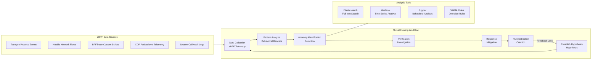

## 7.2 BPFTrace Threat Hunting Script

```bash
#!/usr/bin/env bpftrace
# File: threat_hunt_lateral_movement.bt
# Threat hunting script: detect lateral movement behavior
# Scenarios: internal SSH/RDP scanning, Kerberoasting, SMB propagation

// 1. Detect SSH connection attempt frequency (internal lateral movement)
kprobe:tcp_connect
/comm != "sshd" && comm != "ssh-agent"/
{
    @ssh_attempts[comm, pid] = count();
}

// SSH connection statistics (output every 10 seconds)
interval:s:10
{
    print(@ssh_attempts);
    clear(@ssh_attempts);
}

// 2. Detect anomalous DNS queries (data exfiltration / C2 channel)
kprobe:getaddrinfo
{
    @dns_queries[comm, pid] = count();
    if (@dns_queries[comm, pid] > 100) {
        printf("[ALERT] DNS Flood: comm=%s pid=%d count=%d\n",
               comm, pid, @dns_queries[comm, pid]);
    }
}

// 3. Detect /etc/hosts modification (DNS hijacking)
kprobe:vfs_write
/str(arg0->f_path.dentry->d_name.name) == "hosts"/
{
    printf("[ALERT] /etc/hosts modified: pid=%d comm=%s\n", pid, comm);
}

// 4. Detect mass file encryption (ransomware signature)
kprobe:vfs_write
{
    @write_count[pid] = count();
    if (@write_count[pid] > 1000) {
        printf("[ALERT] Possible ransomware: pid=%d comm=%s writes=%d\n",
               pid, comm, @write_count[pid]);
    }
}

// 5. Detect in-memory execution (fileless attack)
kprobe:__x64_sys_memfd_create
{
    printf("[ALERT] memfd_create (fileless attack): pid=%d comm=%s name=%s\n",
           pid, comm, str(arg0));
}

// 6. Detect reflective DLL injection signature (Linux equivalent)
kprobe:__x64_sys_mmap
/(arg2 & 4) && (arg2 & 2) && (arg3 & 0x20)/
{
    printf("[ALERT] RWX mmap (possible shellcode): pid=%d comm=%s addr=0x%lx\n",
           pid, comm, arg0);
}
```

## 7.3 Automated Threat Response

```yaml
# File: threat-response-playbook.yaml
# Tetragon TracingPolicy - Automated threat response playbook
# Response: ransomware, cryptomining, backdoor installation

apiVersion: cilium.io/v1alpha1
kind: TracingPolicy
metadata:
  name: automated-threat-response
  namespace: kube-system
spec:
  kprobes:
    # === Response 1: Cryptominer detection and blocking ===
    - call: "security_bprm_check"
      syscall: false
      args:
        - index: 0
          type: "linux_binprm"
      selectors:
        # Known cryptominer binary names
        - matchBinaries:
            - operator: "In"
              values:
                - "/tmp/xmrig"
                - "/tmp/minerd"
                - "/tmp/kdevtmpfsi"
                - "/var/tmp/kinsing"
                - "/dev/shm/kdevtmpfsi"
          matchActions:
            - action: Sigkill
            - action: Post

        # Cryptominer signature: connecting to mining pool ports
    - call: "__x64_sys_connect"
      syscall: true
      args:
        - index: 1
          type: "sockaddr"
      selectors:
        # Common mining pool ports (3333/4444/5555/7777/14444)
        - matchActions:
            - action: Post
              rateLimit: "1/minute"

    # === Response 2: Crontab backdoor implantation ===
    - call: "vfs_write"
      syscall: false
      args:
        - index: 0
          type: "file"
      selectors:
        - matchArgs:
            - index: 0
              operator: "Prefix"
              values:
                - "/var/spool/cron"
                - "/etc/cron.d/"
          matchActions:
            - action: Post
            - action: Sigkill

    # === Response 3: Web Shell detection ===
    - call: "security_bprm_check"
      syscall: false
      args:
        - index: 0
          type: "linux_binprm"
      selectors:
        # Web process (nginx/apache) spawning shell subprocess
        - matchBinaries:
            - operator: "In"
              values:
                - "/bin/sh"
                - "/bin/bash"
                - "/bin/dash"
          matchActions:
            - action: Post
            - action: Sigkill

    # === Response 4: Ransomware encryption behavior ===
    - call: "vfs_rename"
      syscall: false
      args:
        - index: 2
          type: "string"
      selectors:
        # Detect encryption extensions
        - matchArgs:
            - index: 2
              operator: "Postfix"
              values:
                - ".encrypted"
                - ".locked"
                - ".ransomed"
                - ".cry"
          matchActions:
            - action: Sigkill
            - action: Post
```

---

<!-- chunk: 8. SIEM SOAR Integration -->## 8. SIEM/SOAR Integration

## 8.1 SIEM/SOAR Integration Architecture

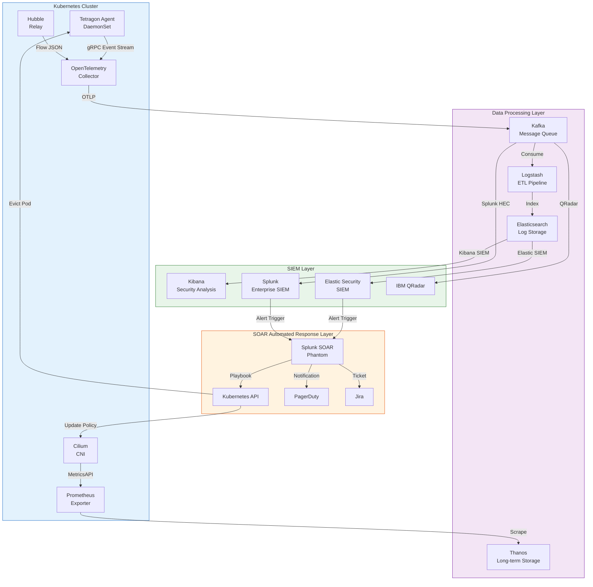

## 8.2 OpenTelemetry Integration Configuration

```yaml
# File: otel-collector-ebpf-config.yaml
# OpenTelemetry Collector configuration
# Receive Tetragon gRPC events, forward to SIEM

apiVersion: v1
kind: ConfigMap
metadata:
  name: otel-collector-config
  namespace: monitoring
data:
  otel-collector-config.yaml: |
    receivers:
      # Receive Tetragon events (gRPC)
      otlp:
        protocols:
          grpc:
            endpoint: 0.0.0.0:4317
          http:
            endpoint: 0.0.0.0:4318

      # Receive Hubble traffic logs
      filelog:
        include:
          - /var/log/hubble/flows.log
        operators:
          - type: json_parser
            timestamp:
              parse_from: attributes.time
              layout: '%Y-%m-%dT%H:%M:%S.%fZ'

      # Prometheus metrics receiver
      prometheus:
        config:
          scrape_configs:
            - job_name: 'tetragon'
              static_configs:
                - targets: ['tetragon:2112']
            - job_name: 'cilium'
              static_configs:
                - targets: ['cilium-agent:9962']

    processors:
      # Enrich security event metadata
      resource:
        attributes:
          - key: environment
            value: production
            action: upsert
          - key: cluster.name
            from_attribute: k8s.cluster.name
            action: upsert

      # Batch processing (improve throughput)
      batch:
        send_batch_size: 1000
        timeout: 5s

      # Security event filtering (only forward high-confidence alerts to SOAR)
      filter:
        logs:
          include:
            match_type: regexp
            record_attributes:
              - key: alert_type
                value: "(SYN_FLOOD|PORT_SCAN|CONTAINER_ESCAPE|PRIVILEGE_ESC)"

      # Data redaction (GDPR compliance)
      redaction:
        allow_all_keys: true
        blocked_values:
          - "[0-9]{16}"

    exporters:
      # Export to Elasticsearch SIEM
      elasticsearch:
        endpoint: https://elasticsearch:9200
        index: ebpf-security-events
        auth:
          authenticator: basicauth/elastic
        tls:
          ca_file: /etc/ssl/certs/ca.crt

      # Export to Kafka (high-throughput scenarios)
      kafka:
        brokers:
          - kafka-broker-1:9092
          - kafka-broker-2:9092
        topic: ebpf-security-events
        encoding: json
        auth:
          sasl:
            mechanism: SCRAM-SHA-512
            username: otel-producer
            password: ${KAFKA_PASSWORD}

      # High alert level: push directly to SOAR
      otlphttp/soar:
        endpoint: https://splunk-soar:8443/api/events
        headers:
          Authorization: Bearer ${SOAR_TOKEN}

    service:
      pipelines:
        # Security event pipeline (high priority)
        logs/security:
          receivers:  [otlp, filelog]
          processors: [resource, batch, filter, redaction]
          exporters:  [elasticsearch, kafka]

        # High-confidence alerts: directly trigger SOAR
        logs/high-alert:
          receivers:  [otlp]
          processors: [resource, filter]
          exporters:  [otlphttp/soar]

        # Metrics pipeline
        metrics:
          receivers:  [prometheus]
          processors: [batch]
          exporters:  [elasticsearch]

## 8.3 Splunk SIEM Integration

```yaml
# File: splunk-hec-integration.yaml
# Splunk HEC (HTTP Event Collector) integration
# Push Tetragon/Hubble events to Splunk in real-time

apiVersion: v1
kind: ConfigMap
metadata:
  name: fluent-bit-splunk-config
  namespace: logging
data:
  fluent-bit.conf: |
    [SERVICE]
        Flush         5
        Log_Level     info
        Parsers_File  parsers.conf

    # Read Tetragon event logs
    [INPUT]
        Name              tail
        Path              /var/log/tetragon/tetragon.log
        Tag               tetragon.*
        Parser            json
        Refresh_Interval  5
        Mem_Buf_Limit     50MB
        Skip_Long_Lines   On

    # Read Hubble network flow logs
    [INPUT]
        Name              tail
        Path              /var/log/hubble/flows.log
        Tag               hubble.*
        Parser            json
        Refresh_Interval  5

    # Read XDP security events
    [INPUT]
        Name              tail
        Path              /var/log/ebpf-ids/alerts.log
        Tag               ids.*
        Parser            json

    # Add metadata to Tetragon events
    [FILTER]
        Name         record_modifier
        Match        tetragon.*
        Record       source_type tetragon
        Record       cluster_name ${CLUSTER_NAME}
        Record       environment production

    # Enrich Hubble traffic events
    [FILTER]
        Name         record_modifier
        Match        hubble.*
        Record       source_type hubble
        Record       data_type network_flow

    # Security event severity classification
    [FILTER]
        Name         lua
        Match        tetragon.*
        script       /etc/fluent-bit/severity_enrichment.lua
        call         enrich_severity

    # Push to Splunk HEC
    [OUTPUT]
        Name         splunk
        Match        *
        Host         splunk-hec.security.svc.cluster.local
        Port         8088
        Splunk_Token ${SPLUNK_HEC_TOKEN}
        TLS          On
        TLS.Verify   On
        Splunk_Send_Raw On
        Retry_Limit  5

  # Lua script: security event severity grading
  severity_enrichment.lua: |
    function enrich_severity(tag, timestamp, record)
        local alert_type = record["alert_type"]
        local severity = "INFO"

        if alert_type == "CONTAINER_ESCAPE" or
           alert_type == "PRIVILEGE_ESCALATION" then
            severity = "CRITICAL"
        elseif alert_type == "SYN_FLOOD" or
               alert_type == "PORT_SCAN" then
            severity = "HIGH"
        elseif alert_type == "FILE_INTEGRITY" or
               alert_type == "SETUID" then
            severity = "MEDIUM"
        end

        record["severity"] = severity
        record["splunk_index"] = "ebpf_security"
        return 1, timestamp, record
    end
```

## 8.4 SOAR Automated Response Playbook

```python
# File: soar_playbook_container_escape.py
# Splunk SOAR (Phantom) Playbook
# Response: automated container escape alert handling procedure

import phantom.rules as phantom
import phantom.app as app
from phantom.action_result import ActionResult
import json

def on_start(container):
    """Trigger condition: Tetragon reports container escape alert"""
    phantom.debug("Container Escape Playbook Started")
    phantom.debug(f"Container: {container}")

    # Extract alert information
    alert_data = container.get('data', [{}])[0]
    namespace  = alert_data.get('namespace', 'unknown')
    pod_name   = alert_data.get('pod_name', 'unknown')
    node_name  = alert_data.get('node_name', 'unknown')
    src_ip     = alert_data.get('src_ip', 'unknown')

    phantom.debug(f"Escaped Pod: {namespace}/{pod_name} on {node_name}")

    # Step 1: Immediately isolate affected Pod
    isolate_pod(container, namespace, pod_name)

    # Step 2: Collect forensic snapshot
    collect_forensics(container, namespace, pod_name, node_name)

    # Step 3: Block source IP
    block_ip(container, src_ip)

    # Step 4: Notify security team
    notify_security_team(container, alert_data)


def isolate_pod(container, namespace, pod_name):
    """Isolate infected Pod: apply isolation label, trigger network policy"""
    parameters = [{
        'namespace': namespace,
        'pod_name':  pod_name,
        'label':     'security.kudig.io/quarantine=true',
        'action':    'label'
    }]

    phantom.act(
        action="execute program",
        parameters=parameters,
        assets=["kubernetes-api"],
        callback=quarantine_callback,
        name="isolate_compromised_pod"
    )

    phantom.debug(f"Pod {namespace}/{pod_name} isolation initiated")


def collect_forensics(container, namespace, pod_name, node_name):
    """Collect forensic data: process list, network connections, filesystem snapshot"""
    commands = [
        f"kubectl exec -n {namespace} {pod_name} -- ps auxf 2>/dev/null",
        f"kubectl exec -n {namespace} {pod_name} -- ss -tulpn 2>/dev/null",
        f"kubectl exec -n {namespace} {pod_name} -- find /tmp /var/tmp -newer /etc/passwd 2>/dev/null",
    ]

    for cmd in commands:
        parameters = [{'command': cmd, 'timeout': 30}]
        phantom.act(
            action="execute program",
            parameters=parameters,
            assets=["forensics-server"],
            name=f"forensic_{cmd[:20].replace(' ','_')}"
        )


def block_ip(container, src_ip):
    """Block attacker IP: update eBPF block Map + firewall"""
    if src_ip == 'unknown':
        return

    parameters = [{
        'ip': src_ip,
        'duration': '3600',  # Block for 1 hour
        'comment': f'Container escape attempt - SOAR auto-block'
    }]

    phantom.act(
        action="block ip",
        parameters=parameters,
        assets=["firewall", "ebpf-ids"],
        name="block_attacker_ip"
    )


def notify_security_team(container, alert_data):
    """Notify security team: PagerDuty + Slack + Jira ticket"""
    severity = alert_data.get('severity', 'HIGH')
    pod_name = alert_data.get('pod_name', 'unknown')

    # PagerDuty alert
    pagerduty_params = [{
        'title':    f'[CRITICAL] Container Escape Detected: {pod_name}',
        'severity': severity.lower(),
        'body':     json.dumps(alert_data, indent=2),
        'source':   'eBPF-Tetragon'
    }]
    phantom.act(
        action="create alert",
        parameters=pagerduty_params,
        assets=["pagerduty"],
        name="page_security_oncall"
    )

    # Jira ticket
    jira_params = [{
        'project':  'SEC',
        'type':     'Incident',
        'summary':  f'Container Escape: {pod_name}',
        'priority': 'Critical',
        'description': json.dumps(alert_data, indent=2)
    }]
    phantom.act(
        action="create ticket",
        parameters=jira_params,
        assets=["jira"],
        name="create_incident_ticket"
    )


def quarantine_callback(action, success, container, results, handle):
    """After isolation: update Cilium network policy to block all ingress/egress traffic"""
    if not success:
        phantom.debug("Pod isolation failed, manual intervention required!")
        return

    namespace = results[0].get('namespace')
    pod_name  = results[0].get('pod_name')

    # Apply isolation network policy
    quarantine_policy = {
        "apiVersion": "cilium.io/v2",
        "kind": "CiliumNetworkPolicy",
        "metadata": {
            "name": f"quarantine-{pod_name}",
            "namespace": namespace
        },
        "spec": {
            "endpointSelector": {
                "matchLabels": {
                    "app": pod_name,
                    "security.kudig.io/quarantine": "true"
                }
            },
            "ingress": [],  # Deny all ingress
            "egress": []    # Deny all egress
        }
    }

    phantom.debug(f"Applying quarantine network policy for {pod_name}")
    # Apply policy through Kubernetes API
    parameters = [{
        'resource_type': 'CiliumNetworkPolicy',
        'body': json.dumps(quarantine_policy),
        'namespace': namespace
    }]
    phantom.act(
        action="create resource",
        parameters=parameters,
        assets=["kubernetes-api"],
        name="apply_quarantine_network_policy"
    )
```

---

<!-- chunk: 9. Security Operations Center (SOC) Integration -->
## 9. Security Operations Center (SOC) Integration

## 9.1 SOC Operations Architecture

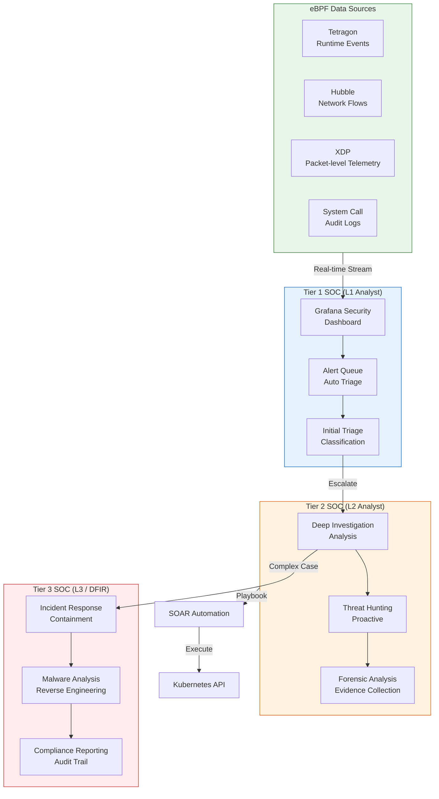

## 9.2 Grafana Security Dashboard Configuration

```yaml
# File: grafana-security-dashboard.yaml
# Grafana Security Operations Dashboard
# Displays: real-time alerts, DDoS protection status, container security metrics

apiVersion: v1
kind: ConfigMap
metadata:
  name: grafana-security-dashboard
  namespace: monitoring
  labels:
    grafana_dashboard: "1"
data:
  ebpf-security-dashboard.json: |
    {
      "title": "eBPF Security Operations Center (SOC)",
      "uid": "ebpf-soc-2026",
      "tags": ["security", "ebpf", "soc"],
      "refresh": "10s",
      "panels": [
        {
          "id": 1,
          "title": "🚨 Real-time Security Alerts",
          "type": "stat",
          "gridPos": {"h": 4, "w": 6, "x": 0, "y": 0},
          "targets": [{
            "expr": "sum(increase(tetragon_policy_events_total{action=\"Sigkill\"}[5m]))",
            "legendFormat": "Threats Blocked"
          }],
          "options": {
            "colorMode": "background",
            "thresholds": {
              "steps": [
                {"color": "green", "value": 0},
                {"color": "yellow", "value": 10},
                {"color": "red", "value": 100}
              ]
            }
          }
        },
        {
          "id": 2,
          "title": "🛡️ XDP DDoS Protection Statistics",
          "type": "timeseries",
          "gridPos": {"h": 8, "w": 12, "x": 6, "y": 0},
          "targets": [
            {
              "expr": "rate(xdp_packets_dropped_total[1m])",
              "legendFormat": "Drop Rate (pps)"
            },
            {
              "expr": "rate(xdp_syn_flood_blocked_total[1m])",
              "legendFormat": "SYN Flood Blocked"
            },
            {
              "expr": "rate(xdp_port_scan_blocked_total[1m])",
              "legendFormat": "Port Scan Blocked"
            }
          ]
        },
        {
          "id": 3,
          "title": "🔒 Container Security Event Distribution",
          "type": "piechart",
          "gridPos": {"h": 8, "w": 8, "x": 0, "y": 8},
          "targets": [{
            "expr": "sum by (alert_type) (increase(tetragon_policy_events_total[1h]))",
            "legendFormat": "{{alert_type}}"
          }]
        },
        {
          "id": 4,
          "title": "🌐 Network Traffic Anomaly Detection",
          "type": "timeseries",
          "gridPos": {"h": 8, "w": 16, "x": 8, "y": 8},
          "targets": [
            {
              "expr": "rate(hubble_drop_total[1m])",
              "legendFormat": "Network Drop Rate"
            },
            {
              "expr": "rate(hubble_flows_processed_total[1m])",
              "legendFormat": "Processed Flows"
            }
          ]
        },
        {
          "id": 5,
          "title": "📋 Top 10 Security Events (Last 24h)",
          "type": "table",
          "gridPos": {"h": 10, "w": 24, "x": 0, "y": 16},
          "targets": [{
            "expr": "topk(10, sum by (namespace, pod, alert_type) (increase(tetragon_policy_events_total[24h])))",
            "format": "table",
            "instant": true
          }],
          "transformations": [
            {"id": "sortBy", "options": {"fields": [{"desc": true, "displayName": "Value"}]}}
          ]
        },
        {
          "id": 6,
          "title": "🗺️ Attacker IP Geographic Distribution",
          "type": "geomap",
          "gridPos": {"h": 12, "w": 12, "x": 0, "y": 26},
          "targets": [{
            "expr": "sum by (src_country) (increase(xdp_blocked_ips_total[1h]))",
            "legendFormat": "{{src_country}}"
          }]
        },
        {
          "id": 7,
          "title": "⚡ eBPF Program Performance",
          "type": "timeseries",
          "gridPos": {"h": 12, "w": 12, "x": 12, "y": 26},
          "targets": [
            {
              "expr": "rate(ebpf_prog_run_time_ns_total[1m]) / rate(ebpf_prog_run_cnt_total[1m])",
              "legendFormat": "Avg Execution Time (ns)"
            },
            {
              "expr": "rate(ebpf_map_ops_total[1m])",
              "legendFormat": "Map Operation Rate"
            }
          ]
        }
      ]
    }
```

## 9.3 SOC Alert Triage Policy

```yaml
# File: alert-triage-rules.yaml
# SOC alert triage based on Prometheus Alertmanager

groups:
  - name: ebpf-security-critical
    rules:
      # P0: Container escape - immediate response
      - alert: ContainerEscapeDetected
        expr: |
          increase(tetragon_policy_events_total{
            policy="container-escape-detection",
            action="Sigkill"
          }[5m]) > 0
        for: 0m
        labels:
          severity: critical
          team: security
          pagerduty: "true"
          sla_response: "15m"
        annotations:
          summary: "Container escape detected - immediate response!"
          description: |
            Pod {{ $labels.pod }} in namespace {{ $labels.namespace }}
            detected container escape behavior, automatically blocked.
            Please log in to SOC dashboard immediately for investigation.
          runbook_url: "https://wiki.kudig.io/soc/container-escape-runbook"
          dashboard: "https://grafana/d/ebpf-soc-2026"

      # P0: Privilege escalation to root
      - alert: PrivilegeEscalationToRoot
        expr: |
          increase(tetragon_policy_events_total{
            policy="process-behavior-ids",
            alert_type="SETUID_TO_ROOT"
          }[1m]) > 0
        for: 0m
        labels:
          severity: critical
          team: security
          pagerduty: "true"
          sla_response: "15m"

      # P1: SYN Flood attack
      - alert: SYNFloodAttack
        expr: |
          rate(xdp_syn_flood_blocked_total[1m]) > 1000
        for: 1m
        labels:
          severity: high
          team: network-security
          sla_response: "30m"
        annotations:
          summary: "SYN Flood DDoS attack detected"
          description: "SYN Flood packets blocked per minute exceeds 1000, current value: {{ $value | humanize }}/min"

      # P1: Port scan
      - alert: PortScanDetected
        expr: |
          rate(xdp_port_scan_blocked_total[5m]) > 10
        for: 2m
        labels:
          severity: high
          team: security
          sla_response: "1h"

      # P2: File integrity violation
      - alert: FileIntegrityViolation
        expr: |
          increase(tetragon_policy_events_total{
            policy="file-integrity-monitoring"
          }[10m]) > 5
        for: 5m
        labels:
          severity: medium
          team: security
          sla_response: "4h"

  - name: ebpf-compliance
    rules:
      # Compliance: audit log dropped (Ring Buffer overflow)
      - alert: AuditLogDropped
        expr: |
          rate(ebpf_ringbuf_lost_total[5m]) > 0
        for: 1m
        labels:
          severity: warning
          team: compliance
        annotations:
          summary: "eBPF audit log dropped - compliance risk"
          description: "Ring Buffer overflow causing audit event loss, may impact PCI-DSS/SOC2 compliance."

      # Compliance: eBPF program load failure
      - alert: EBPFProgramLoadFailed
        expr: |
          increase(ebpf_program_load_errors_total[5m]) > 0
        for: 0m
        labels:
          severity: critical
          team: security-engineering
```

## 9.4 Tetragon Helm Production Deployment Configuration

```yaml
# File: tetragon-soc-values.yaml
# Tetragon Helm Values - production-grade configuration for SOC

tetragon:
  image:
    repository: quay.io/cilium/tetragon
    tag: v1.2.0
    pullPolicy: IfNotPresent

  # High-performance Ring Buffer configuration
  settings:
    ringBufQueueSize: 65536      # 64K event buffer
    eventQueueSize: 10000        # Event queue
    cpuRequest: "500m"
    cpuLimit: "2000m"
    memoryRequest: "256Mi"
    memoryLimit: "1Gi"

  # Export configuration (SIEM integration)
  export:
    stdout:
      enabled: true
    fileSink:
      enabled: true
      path: /var/log/tetragon/tetragon.log
      maxBackups: 10
      maxSize: 200  # 200MB per file

  # gRPC service (for SOAR subscription)
  grpc:
    enabled: true
    address: "localhost:54321"

  # Prometheus metrics
  prometheus:
    enabled: true
    port: 2112
    serviceMonitor:
      enabled: true
      namespace: monitoring
      labels:
        release: prometheus-stack

  # Production security policies (preloaded)
  tracingPolicies:
    - name: container-escape-detection
      namespace: kube-system
    - name: file-integrity-monitoring
      namespace: kube-system
    - name: process-behavior-ids
      namespace: kube-system
    - name: compliance-audit-pci-soc2
      namespace: kube-system
    - name: automated-threat-response
      namespace: kube-system

tetragonOperator:
  enabled: true
  resources:
    requests:
      cpu: 100m
      memory: 64Mi
    limits:
      cpu: 500m
      memory: 256Mi

# DaemonSet node tolerations (deploy to all nodes including master)
tolerations:
  - operator: Exists
    effect: NoSchedule
  - operator: Exists
    effect: NoExecute
  - key: node-role.kubernetes.io/control-plane
    operator: Exists

# Node affinity (prioritize core workload nodes)
affinity:
  nodeAffinity:
    preferredDuringSchedulingIgnoredDuringExecution:
      - weight: 100
        preference:
          matchExpressions:
            - key: node-role.kubernetes.io/worker
              operator: Exists
```

---

<!-- chunk: 10. Enterprise Security Architecture Best Practices -->
## 10. Enterprise Security Architecture Best Practices

## 10.1 Enterprise eBPF Security Architecture

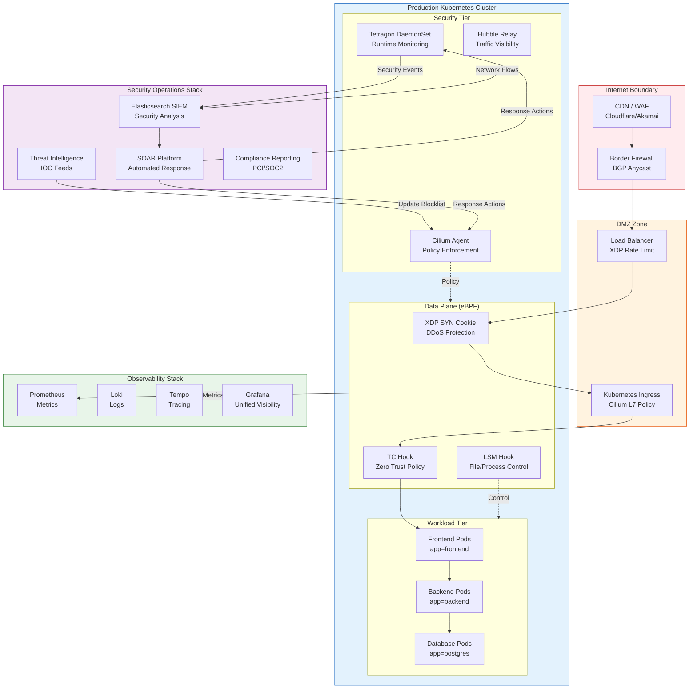

## 10.2 Security Maturity Model

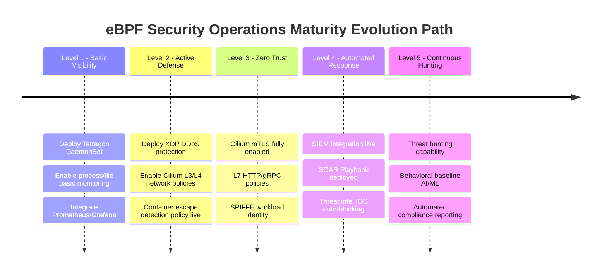

## 10.3 Key Performance Indicators and SLA

| Metric Category | Specific Metric | Target Value | eBPF Implementation |
|-----------------|-----------------|--------------|---------------------|
| **Detection** | Threat Detection Rate (TDR) | ≥99% | Tetragon kprobe coverage |
| **Detection** | False Positive Rate (FPR) | ≤1% | Fine-grained TracingPolicy |
| **Detection** | Mean Time To Detect (MTTD) | ≤1s | Ring Buffer real-time push |
| **Response** | Mean Time To Respond (MTTR) | ≤5min | SOAR automated Playbook |
| **Protection** | DDoS Mitigation Rate | 100 Gbps+ | XDP line-rate processing |
| **Performance** | CPU Overhead | ≤3% | eBPF JIT optimization |
| **Performance** | Latency Increase | ≤100μs | Kernel-space direct execution |
| **Audit Compliance** | Log Integrity | 99.99% | Ring Buffer + persistence |
| **Visibility** | Network Flow Coverage | 100% | Hubble full-path |
| **Visibility** | System Call Coverage | 100% | Tracepoint full coverage |

## 10.4 eBPF Security Deployment Best Practices Checklist

```yaml
# File: ebpf-security-deployment-checklist.yaml
# eBPF security deployment best practices checklist

ebpf_security_checklist:
  # ===== Infrastructure requirements =====
  infrastructure:
    kernel_version:
      minimum: "5.15"
      recommended: "6.1+"
      reason: "Support BTF CO-RE, LSM eBPF, improved Ring Buffer"

    kernel_config:
      required:
        - CONFIG_BPF=y
        - CONFIG_BPF_SYSCALL=y
        - CONFIG_BPF_JIT=y
        - CONFIG_DEBUG_INFO_BTF=y
        - CONFIG_BPF_LSM=y
      verify_cmd: |
        zcat /proc/config.gz | grep -E "^CONFIG_BPF"

    node_settings:
      - sysctl: "net.core.bpf_jit_enable=1"
        reason: "Enable JIT compilation for performance"
      - sysctl: "kernel.unprivileged_bpf_disabled=1"
        reason: "Disable unprivileged user eBPF loading (security hardening)"
      - sysctl: "net.core.rmem_max=134217728"
        reason: "Large capacity Ring Buffer support"
      - ulimit: "memlock=unlimited"
        reason: "eBPF Map memory locking"

  # ===== Cilium configuration =====
  cilium_deployment:
    required_features:
      - feature: "kube-proxy-replacement"
        value: "strict"
        reason: "Complete eBPF replacement of kube-proxy"
      - feature: "enable-bandwidth-manager"
        value: "true"
        reason: "eBPF-based bandwidth management"
      - feature: "enable-bbr"
        value: "true"
        reason: "BBR congestion control (requires kernel 5.18+)"
      - feature: "encryption"
        value: "wireguard"
        reason: "Transparent node-to-node encryption"

    security_features:
      - policy-enforcement: "always"
      - enable-l7-proxy: "true"
      - tls-min-version: "TLSv1.2"
      - enable-endpoint-health-checking: "true"

  # ===== Tetragon configuration =====
  tetragon_deployment:
    policies_priority:
      p0_critical:
        - container-escape-detection
        - privilege-escalation-monitor
      p1_high:
        - file-integrity-monitoring
        - process-behavior-ids
        - automated-threat-response
      p2_compliance:
        - compliance-audit-pci-soc2
        - namespace-isolation-verification

    performance_tuning:
      ring_buf_size: "64MB"      # High-traffic environment
      event_queue_size: 10000
      cpu_limit: "2"
      memory_limit: "1Gi"
      # Avoid full syscall tracing on high-load nodes
      selective_syscall_audit: true

  # ===== Monitoring and alerting =====
  monitoring:
    sla_targets:
      critical_alert_response: "15m"
      high_alert_response: "1h"
      medium_alert_response: "4h"

    mandatory_dashboards:
      - "eBPF SOC Real-time Overview"
      - "DDoS Protection Status"
      - "Container Security Events"
      - "Compliance Audit Report"
      - "eBPF Program Performance"

    audit_log_retention:
      hot_storage: "30d"    # Elasticsearch
      warm_storage: "90d"   # S3/OSS compressed
      cold_storage: "1y"    # Archive (PCI-DSS requirement)

  # ===== Security operations =====
  security_operations:
    threat_intelligence:
      - feed: "Abuse.ch URLhaus"
        update_interval: "1h"
        action: "update_xdp_blocklist"
      - feed: "Emerging Threats"
        update_interval: "6h"
        action: "update_cilium_policy"
      - feed: "Internal IOC Database"
        update_interval: "15m"
        action: "update_all"

    incident_response:
      - severity: CRITICAL
        auto_actions:
          - "Isolate affected Pod"
          - "Block attacker IP"
          - "Trigger PagerDuty"
          - "Create Jira P1 ticket"
        manual_required: true
        sla: "15m"
      - severity: HIGH
        auto_actions:
          - "Send Slack alert"
          - "Create Jira P2 ticket"
          - "Trigger forensic data collection"
        sla: "1h"
```

## 10.5 Common Security Scenarios

### Scenario 1: CVE Exploit Mitigation (Virtual Patching)

```c
// File: virtual_patch_cve.c
// eBPF virtual patch: mitigate CVE through eBPF before kernel patch release
// Example: eBPF mitigation for DirtyPipe-class vulnerabilities

#include <linux/bpf.h>
#include <linux/ptrace.h>
#include <bpf/bpf_helpers.h>
#include <bpf/bpf_tracing.h>

// Virtual patch: prevent pipe write to read-only files
// DirtyPipe (CVE-2022-0847) exploit chain mitigation
SEC("kprobe/copy_page_to_iter_pipe")
int BPF_KPROBE(mitigate_dirtypipe,
               struct page *page,
               size_t offset, size_t bytes,
               struct iov_iter *i)
{
    __u32 uid = bpf_get_current_uid_gid() & 0xFFFFFFFF;

    // Non-root user attempting pipe write: log and block
    if (uid != 0) {
        __u32 pid = bpf_get_current_pid_tgid() >> 32;
        char comm[16];
        bpf_get_current_comm(&comm, sizeof(comm));
        bpf_printk("VIRTUAL_PATCH: pipe_write uid=%d pid=%d comm=%s\n",
                   uid, pid, comm);
        // Return non-zero to block operation (kprobe override mode)
        // Note: requires CONFIG_BPF_KPROBE_OVERRIDE enabled
        bpf_override_return(ctx, -EPERM);
    }
    return 0;
}

char LICENSE[] SEC("license") = "GPL";
```

### Scenario 2: Supply Chain Security - Container Image Runtime Verification

```yaml
# File: policy-supply-chain-security.yaml
# Supply chain security: verify container image source legitimacy
# Prevent: unsigned image execution, known malicious image execution

apiVersion: cilium.io/v1alpha1
kind: TracingPolicy
metadata:
  name: supply-chain-security
  namespace: kube-system
spec:
  kprobes:
    # Monitor new container processes: verify parent process is legitimate container runtime
    - call: "security_bprm_check"
      syscall: false
      args:
        - index: 0
          type: "linux_binprm"
      selectors:
        # First process in container (PID=1) must come from legitimate runtime
        - matchNamespaces:
            - namespace: Pid
              operator: NotIn
              values:
                - "host"
          matchCapabilities:
            - type: Permitted
              operator: In
              values:
                - "CAP_SYS_ADMIN"
          matchActions:
            - action: Post
              rateLimit: "10/minute"

    # Detect runtime image layer tampering (write to overlay upper directory)
    - call: "vfs_write"
      syscall: false
      args:
        - index: 0
          type: "file"
      selectors:
        - matchArgs:
            - index: 0
              operator: "Prefix"
              values:
                - "/var/lib/containerd/io.containerd.snapshotter.v1.overlayfs"
                - "/var/lib/docker/overlay2"
          matchActions:
            - action: Post
            - action: Sigkill
```

## 10.6 Troubleshooting and Performance Tuning

``` bash
# 🟢 Low risk: Read-only/information gathering, typically no side effects
#!/bin/bash
# File: ebpf-security-health-check.sh
# eBPF security component health check script

set -euo pipefail
RED='\033[0;31m' GREEN='\033[0;32m' YELLOW='\033[1;33m' NC='\033[0m'

echo "======================================"
echo " eBPF Security Health Check - $(date)"
echo "======================================"

# 1. Kernel version check
KERNEL=$(uname -r)
KERNEL_MAJOR=$(echo $KERNEL | cut -d. -f1)
KERNEL_MINOR=$(echo $KERNEL | cut -d. -f2)
echo -e "\n[1] Kernel version: $KERNEL"
if [ $KERNEL_MAJOR -gt 5 ] || [ $KERNEL_MAJOR -eq 5 -a $KERNEL_MINOR -ge 15 ]; then
    echo -e "    ${GREEN}✓ Kernel version meets requirements (>=5.15)${NC}"
else
    echo -e "    ${RED}✗ Kernel version insufficient, recommend upgrade to 5.15+${NC}"
fi

# 2. BTF support check
echo -e "\n[2] BTF support check"
if [ -f /sys/kernel/btf/vmlinux ]; then
    echo -e "    ${GREEN}✓ BTF available (/sys/kernel/btf/vmlinux)${NC}"
else
    echo -e "    ${RED}✗ BTF unavailable, CO-RE features limited${NC}"
fi

# 3. eBPF program check
echo -e "\n[3] Loaded eBPF programs"
PROG_COUNT=$(bpftool prog list 2>/dev/null | grep -c "^[0-9]" || echo "0")
echo "    Loaded programs: $PROG_COUNT"
echo "    XDP programs:"
bpftool prog list | grep xdp | awk '{print "      ",$0}' || echo "      (No XDP programs)"
echo "    Kprobe programs:"
bpftool prog list | grep kprobe | wc -l | xargs -I{} echo "      {} kprobe programs"

# 4. eBPF Map health check
echo -e "\n[4] eBPF Map usage"
for map_name in ip_stats_map blocklist_map conntrack_map; do
    MAP_ID=$(bpftool map list 2>/dev/null | grep "$map_name" | awk '{print $1}' | tr -d ':' | head -1)
    if [ -n "$MAP_ID" ]; then
        ENTRIES=$(bpftool map dump id $MAP_ID 2>/dev/null | grep -c "key" || echo "0")
        echo -e "    ${GREEN}✓${NC} $map_name: $ENTRIES entries"
    else
        echo -e "    ${YELLOW}!${NC} $map_name: not found"
    fi
done

# 5. Ring Buffer overflow check
echo -e "\n[5] Ring Buffer status"
RB_DROPS=$(cat /sys/fs/bpf/events_rb/stats 2>/dev/null | grep lost || echo "unavailable")
echo "    Ring Buffer lost events: $RB_DROPS"

# 6. Tetragon health check
echo -e "\n[6] Tetragon status"
if kubectl get pods -n kube-system -l app=tetragon 2>/dev/null | grep -q Running; then
    echo -e "    ${GREEN}✓ Tetragon DaemonSet running normally${NC}"
    POLICY_COUNT=$(kubectl get tracingpolicy --all-namespaces 2>/dev/null | grep -c "^" || echo "0")
    echo "    Deployed TracingPolicy: $((POLICY_COUNT-1)) policies"
else
    echo -e "    ${RED}✗ Tetragon not running${NC}"
fi

# 7. Cilium health check
echo -e "\n[7] Cilium status"
if cilium status 2>/dev/null | grep -q "OK"; then
    echo -e "    ${GREEN}✓ Cilium running normally${NC}"
    POLICY_COUNT=$(cilium policy get 2>/dev/null | grep -c "IngressRule|EgressRule" || echo "0")
    echo "    Applied policy rules: $POLICY_COUNT rules"
else
    echo -e "    ${RED}✗ Cilium status abnormal${NC}"
fi

# 8. CPU/Memory overhead
echo -e "\n[8] eBPF component resource consumption"
for component in tetragon cilium-agent hubble-relay; do
    CPU=$(kubectl top pod -l app=$component -n kube-system 2>/dev/null | awk 'NR==2{print $2}' || echo "N/A")
    MEM=$(kubectl top pod -l app=$component -n kube-system 2>/dev/null | awk 'NR==2{print $3}' || echo "N/A")
    echo "    $component: CPU=$CPU MEM=$MEM"
done

echo -e "\n======================================"
echo " Health check complete"
echo "======================================"
```
## 10.7 Learning Path and References

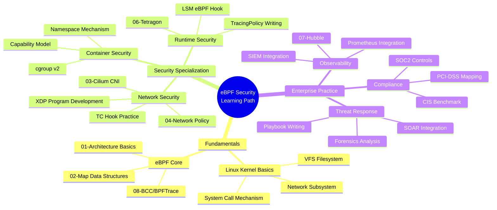

## Recommended References

| Resource Type | Name | Description |
|---------|------|------|
| Official Docs | [Tetragon Docs](https://tetragon.io/docs/) | Complete TracingPolicy reference |
| Official Docs | [Cilium Docs](https://docs.cilium.io/) | Network policy and security features |
| Paper | [eBPF - Rethinking the Linux Kernel](https://dl.acm.org/doi/10.1145/3495012) | eBPF design paper |
| Tool | [bpftool](https://github.com/libbpf/bpftool) | eBPF program debugging and inspection |
| Tool | [tetragon-cli](https://github.com/cilium/tetragon) | Real-time security event viewing |
| Community | [eBPF Slack](https://ebpf.io/slack) | Official eBPF community |
| Course | [Linux Foundation eBPF Fundamentals](https://training.linuxfoundation.org/) | Systematic learning |
| Book | "Learning eBPF" - Liz Rice (O'Reilly 2023) | Best introductory book |
| Repository | [Cilium Tetragon Examples](https://github.com/cilium/tetragon/tree/main/examples) | Complete policy example library |

---

<!-- chunk: Summary -->## Summary

```mermaid
graph LR
    subgraph Core["eBPF Security Core Value"]
        V1[⚡ Performance<br/>Line-rate Processing No Overhead]
        V2[🔒 Security<br/>Kernel Verifier Sandbox]
        V3[👁️ Visibility<br/>Full-stack Transparent Observability]
        V4[🛡️ Enforcement<br/>Kernel-level Real-time Blocking]
    end

    subgraph Applications["Key Security Applications"]
        A1[IDS Intrusion Detection]
        A2[DDoS Protection]
        A3[Container Security]
        A4[Zero Trust Network]
        A5[Compliance Auditing]
        A6[Threat Hunting]
    end

    subgraph Outcomes["Security Operations Results"]
        O1[MTTD ≤1s]
        O2[MTTR ≤5min]
        O3[DDoS Mitigation 100G+]
        O4[Compliance Coverage PCI/SOC2]
        O5[CPU Overhead ≤3%]
    end

    Core --> Applications --> Outcomes

    style Core fill:#e3f2fd,stroke:#1565c0
    style Applications fill:#e8f5e9,stroke:#2e7d32
    style Outcomes fill:#f3e5f5,stroke:#7b1fa2
```

eBPF technology is profoundly reshaping enterprise security operations:

1. **From Passive Detection to Active Protection**: XDP/TC Hook achieves line-rate DDoS mitigation, completing security decisions before packets enter the kernel protocol stack
2. **From Userspace to Kernel Space**: Tetragon's kprobe/tracepoint makes security monitoring impossible to bypass by userspace processes
3. **From Static Rules to Dynamic Response**: TracingPolicy + SOAR enables second-level automated threat response
4. **From Isolated Tools to Unified Platform**: Cilium + Tetragon + Hubble builds a trinity security platform of network/runtime/observability
5. **From Compliance Pressure to Compliance Automation**: eBPF audit logs naturally satisfy PCI-DSS/SOC2 requirements, reducing compliance costs

> **Key Insight**: eBPF security is not a "silver bullet," it is a **kernel-level enhancement** to existing security systems. Best practice is to tightly integrate eBPF capabilities with SIEM, SOAR, threat intelligence, and human analysis to build a modern security operations system with defense-in-depth capabilities.

---

*This document is authored by the eBPF security domain expert team, based on 2026 latest practices and open source community best practices. Applicable to Linux Kernel 5.15+, Tetragon 1.2+, Cilium 1.15+.*

> **Related Documents**:
> - [06-Tetragon Runtime Security](./06-tetragon-runtime-security.md) - TracingPolicy deep dive
> - [04-Cilium Network Policy](./04-cilium-network-policy.md) - L3/L4/L7 policy configuration
> - [09-eBPF Performance Optimization](./09-ebpf-performance-optimization.md) - Large-scale deployment performance tuning
> - [07-Hubble Network Observability](./07-hubble-network-observability.md) - Network traffic analysis

---

<!-- chunk: Obsidian Related Documents -->## Obsidian Related Documents

- domain-35-ebpf-technology MOC
- [[domain-03-networking-traffic/README.md|Domain 03: eBPF Technology Stack]]
- Domain-35 eBPF Technology — Open Source Project Index
- eBPF Architecture Fundamentals and Program Types
- eBPF Map Types and Data Structures
- Cilium CNI Architecture and Deployment
- Cilium Network Policy L3/L4/L7
- Cilium Service Mesh Sidecarless Architecture
- Tetragon Runtime Security
- Hubble Network Observability
- bcc and bpftrace Tools
- eBPF Performance Optimization Practice

## See Also

- 08-bcc-bpftrace-tools
- 09-ebpf-performance-optimization
- 01-ebpf-architecture-fundamentals
- 02-ebpf-map-types-data-structures


<!-- risk-assessed -->
