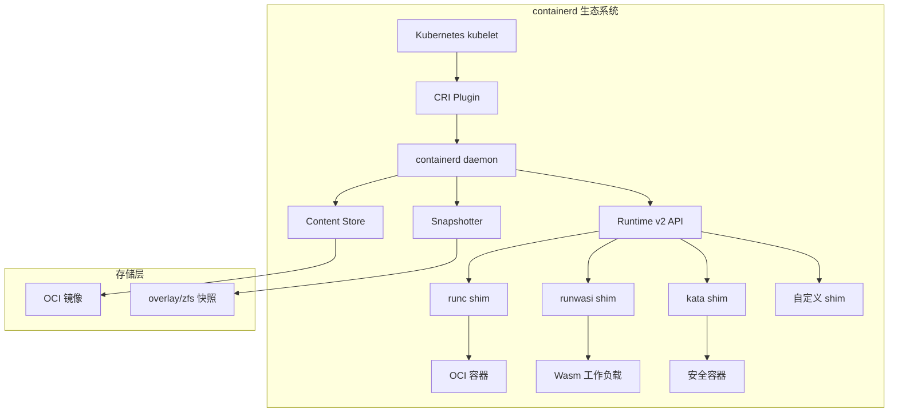
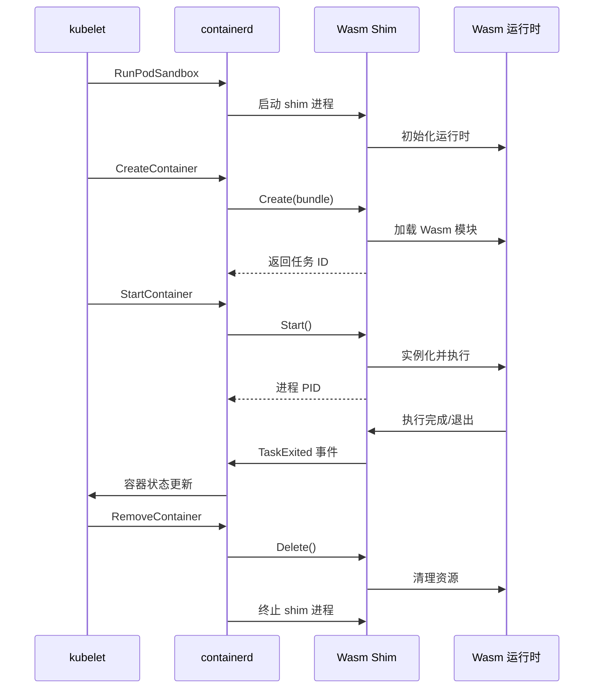
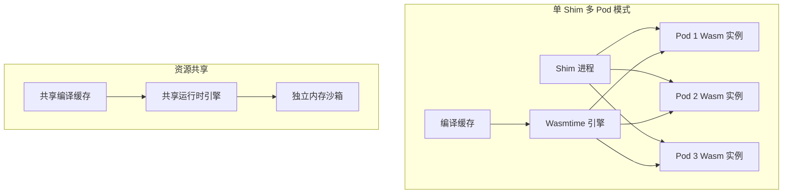
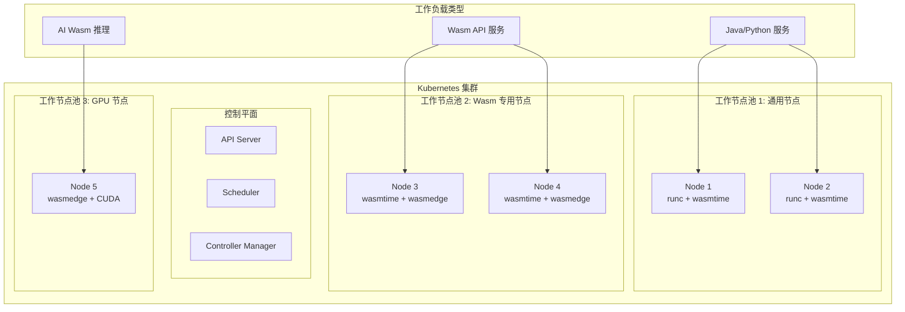

> **生产环境安全提示**
>
> 本文档包含可直接执行的运维命令。执行前请确认：当前目标集群与 Namespace 是否正确；是否具备足够的 RBAC 权限；是否已在非生产环境验证。命令风险等级标注：🔴 高风险（可能造成数据丢失或服务中断）、🟡 中风险（会修改集群状态，但通常可回滚）、🟢 低风险/只读（信息收集，无副作用）。


# [[containerd|containerd]] Wasm 运行时
# containerd Wasm Runtime

<!-- chunk: 目录 / Table of Contents -->## 目录 / Table of Contents

1. [containerd 架构回顾](#1-containerd-架构回顾)
2. [runwasi 项目](#2-runwasi-项目)
3. [Wasm Shim 实现原理](#3-wasm-shim-实现原理)
4. [安装与配置](#4-安装与配置)
5. [RuntimeClass 配置](#5-runtimeclass-配置)
6. [[entities/kubernetes.md|Kubernetes]] 集成](#6-kubernetes-集成)
7. [多运行时部署](#7-多运行时部署)
8. [OCI Wasm 工件](#8-oci-wasm-工件)
9. [性能调优](#9-性能调优)
10. [监控与可观测性](#10-监控与可观测性)
11. [问题排除](#11-问题排除)
12. [生产最佳实践](#12-生产最佳实践)

---

<!-- chunk: 1. containerd 架构回顾 -->## 1. containerd 架构回顾

## 1.1 containerd 整体架构 / Overall Architecture



## 1.2 Runtime v2 Shim 接口 / Runtime v2 Interface

containerd 使用 Runtime v2 (也称为 shim v2) 接口与容器运行时通信：

```
Runtime v2 通信协议
                                               
  containerd                    shim 进程
  ─────────                     ──────────
       │                              │
       │── ttrpc (unix socket) ──────▶│
       │                              │
       │   TaskService.Create()       │
       │   TaskService.Start()        │
       │   TaskService.Kill()         │
       │   TaskService.Delete()       │
       │   TaskService.Wait()         │
       │                              │
       │◀─ 事件流 (Events) ──────────│
       │   TaskStarted                │
       │   TaskExited                 │
       │   TaskDeleted                │
                                      
  ttrpc: 基于 gRPC 的二进制协议
         适合低内存环境
```

```protobuf
// Runtime v2 TaskService 核心接口（简化）
service TaskService {
  // 创建容器/任务
  rpc Create(CreateTaskRequest) returns (CreateTaskResponse);
  
  // 启动任务
  rpc Start(StartRequest) returns (StartResponse);
  
  // 删除任务
  rpc Delete(DeleteRequest) returns (DeleteResponse);
  
  // 杀死任务
  rpc Kill(KillRequest) returns (google.protobuf.Empty);
  
  // 等待任务退出
  rpc Wait(WaitRequest) returns (WaitResponse);
  
  // 获取任务状态
  rpc State(StateRequest) returns (StateResponse);
  
  // 暂停/恢复
  rpc Pause(PauseRequest) returns (google.protobuf.Empty);
  rpc Resume(ResumeRequest) returns (google.protobuf.Empty);
}
```

## 1.3 Shim 生命周期 / Shim Lifecycle



---

<!-- chunk: 2. runwasi 项目 -->## 2. runwasi 项目

## 2.1 项目概述 / Project Overview

runwasi 是 containerd 社区维护的项目，提供在 containerd 中运行 WebAssembly 工作负载的框架：

```
runwasi 项目结构
github.com/containerd/runwasi
│
├── crates/
│   ├── containerd-shim-wasm/        # Shim 框架库（核心）
│   │   ├── src/
│   │   │   ├── container/           # 容器生命周期管理
│   │   │   ├── sandbox/             # 沙箱模型
│   │   │   └── testing/             # 测试工具
│   │   └── Cargo.toml
│   │
│   ├── containerd-shim-wasmtime/    # Wasmtime shim
│   │   └── src/main.rs
│   │
│   ├── containerd-shim-wasmedge/    # WasmEdge shim
│   │   └── src/main.rs
│   │
│   └── containerd-shim-wasmer/      # Wasmer shim
│       └── src/main.rs
│
├── scripts/                         # 安装脚本
├── Makefile
└── README.md
```

## 2.2 核心组件 / Core Components

```rust
// containerd-shim-wasm 框架核心 trait 定义
// crates/containerd-shim-wasm/src/container/engine.rs

use std::path::PathBuf;
use anyhow::Result;

/// Wasm 引擎 trait - 每个运行时必须实现
pub trait Engine: Clone + Send + Sync + 'static {
    /// 引擎名称（用于日志）
    fn name() -> &'static str;
    
    /// 从 OCI bundle 运行 Wasm 模块
    fn run_wasi(&self, ctx: &impl RuntimeContext, stdio: Stdio) -> Result<i32>;
    
    /// 检查 Wasm 模块是否可被此引擎运行
    fn can_handle(&self, ctx: &impl RuntimeContext) -> Result<bool>;
    
    /// 创建引擎实例
    fn new() -> Result<Self>;
}

/// 运行时上下文 - 提供容器信息
pub trait RuntimeContext {
    /// OCI bundle 路径
    fn bundle(&self) -> PathBuf;
    
    /// OCI 配置
    fn config(&self) -> &oci_spec::runtime::Spec;
    
    /// 环境变量
    fn envs(&self) -> Vec<(String, String)>;
    
    /// Wasm 模块路径
    fn wasm_entrypoint(&self) -> Result<PathBuf>;
}
```

## 2.3 Wasmtime Shim 实现 / Wasmtime Shim Implementation

```rust
// crates/containerd-shim-wasmtime/src/main.rs
use containerd_shim_wasm::container::{
    Engine, RuntimeContext, Stdio,
};
use wasmtime::{Config, Engine as WasmtimeEngine, Linker, Module, Store};
use wasmtime_wasi::WasiCtxBuilder;
use anyhow::Result;
use std::path::PathBuf;

/// Wasmtime 引擎实现
#[derive(Clone)]
pub struct WasmtimeEngine {
    engine: wasmtime::Engine,
}

impl Engine for WasmtimeEngine {
    fn name() -> &'static str {
        "wasmtime"
    }
    
    fn new() -> Result<Self> {
        let mut config = Config::new();
        
        // 启用 WASI
        config.wasm_component_model(true);
        
        // 性能优化
        config.cranelift_opt_level(wasmtime::OptLevel::Speed);
        config.parallel_compilation(true);
        
        // 安全配置
        config.epoch_interruption(true);
        
        Ok(Self {
            engine: wasmtime::Engine::new(&config)?,
        })
    }
    
    fn run_wasi(&self, ctx: &impl RuntimeContext, stdio: Stdio) -> Result<i32> {
        let wasm_path = ctx.wasm_entrypoint()?;
        
        // 创建 Linker 并注册 WASI
        let mut linker: Linker<wasmtime_wasi::WasiCtx> = 
            Linker::new(&self.engine);
        wasmtime_wasi::add_to_linker(&mut linker, |s| s)?;
        
        // 构建 WASI 上下文
        let mut wasi_builder = WasiCtxBuilder::new();
        
        // 设置标准 IO
        wasi_builder.stdout(Box::new(stdio.stdout.take()));
        wasi_builder.stderr(Box::new(stdio.stderr.take()));
        wasi_builder.stdin(Box::new(stdio.stdin.take()));
        
        // 注入环境变量
        for (key, val) in ctx.envs() {
            wasi_builder.env(&key, &val)?;
        }
        
        // 挂载目录（来自 OCI 挂载配置）
        for mount in ctx.config().mounts().iter().flatten() {
            let host_path = mount.source().as_deref().unwrap_or("/tmp");
            let guest_path = mount.destination().display().to_string();
            
            let preopened = wasmtime_wasi::Dir::open_ambient_dir(
                host_path,
                wasmtime_wasi::ambient_authority(),
            )?;
            wasi_builder.preopened_dir(preopened, guest_path)?;
        }
        
        let wasi = wasi_builder.build();
        
        // 编译并运行模块
        let module = Module::from_file(&self.engine, &wasm_path)?;
        let mut store = Store::new(&self.engine, wasi);
        
        // 实例化
        let instance = linker.instantiate(&mut store, &module)?;
        
        // 查找并调用 _start 函数
        let start = instance.get_typed_func::<(), ()>(&mut store, "_start");
        
        match start {
            Ok(func) => {
                match func.call(&mut store, ()) {
                    Ok(_) => Ok(0),
                    Err(e) => {
                        // 检查是否是正常退出
                        if let Some(exit) = e.downcast_ref::<wasmtime_wasi::I32Exit>() {
                            Ok(exit.0)
                        } else {
                            Err(e.into())
                        }
                    }
                }
            }
            Err(_) => {
                // 尝试运行默认导出
                Ok(1)
            }
        }
    }
    
    fn can_handle(&self, ctx: &impl RuntimeContext) -> Result<bool> {
        let path = ctx.wasm_entrypoint()?;
        // 检查是否是有效的 Wasm 文件（magic bytes）
        let bytes = std::fs::read(&path)?;
        Ok(bytes.starts_with(b"\0asm"))
    }
}

// 主入口点
fn main() {
    containerd_shim_wasm::sandbox::ShimCli::<WasmtimeEngine>::new().run();
}
```

---

<!-- chunk: 3. Wasm Shim 实现原理 -->## 3. Wasm Shim 实现原理

## 3.1 Shim 进程模型 / Shim Process Model

```
Wasm Shim 进程架构
                                        
  ┌────────────────────────────────────┐
  │  containerd-shim-wasmtime 进程     │
  │                                    │
  │  ┌──────────────────────────────┐ │
  │  │   ttrpc 服务器               │ │
  │  │   (TaskService 实现)         │ │
  │  └──────────────────────────────┘ │
  │                │                  │
  │  ┌─────────────▼────────────────┐ │
  │  │   沙箱管理器                 │ │
  │  │   (SandboxManager)          │ │
  │  └─────────────┬────────────────┘ │
  │                │                  │
  │  ┌─────────────▼────────────────┐ │
  │  │   Wasm 任务管理              │ │
  │  │   ┌──────┐  ┌──────┐        │ │
  │  │   │Task 1│  │Task 2│  ...   │ │
  │  │   └──────┘  └──────┘        │ │
  │  └──────────────────────────────┘ │
  │                │                  │
  │  ┌─────────────▼────────────────┐ │
  │  │   Wasmtime 引擎              │ │
  │  │   (Engine Pool)              │ │
  │  └──────────────────────────────┘ │
  └────────────────────────────────────┘
```

## 3.2 Bundle 结构 / OCI Bundle Structure

```
OCI Bundle 目录结构
/run/containerd/io.containerd.runtime.v2.task/
└── k8s.io/
    └── <container-id>/
        ├── config.json         # OCI Runtime Spec
        ├── rootfs/             # 容器根文件系统
        │   └── app.wasm        # Wasm 模块文件
        ├── work/               # 工作目录
        │   ├── init.pid        # 进程 PID
        │   └── shim.pid        # Shim PID
        └── log                 # Shim 日志
```

```json
// config.json - OCI Runtime Spec 示例（Wasm 模块）
{
  "ociVersion": "1.0.2",
  "process": {
    "args": ["/app.wasm"],
    "env": [
      "PATH=/usr/local/sbin:/usr/local/bin:/usr/sbin:/usr/bin:/sbin:/bin",
      "SPIN_HTTP_LISTEN_ADDR=0.0.0.0:80"
    ],
    "cwd": "/",
    "capabilities": {}
  },
  "root": {
    "path": "rootfs",
    "readonly": true
  },
  "mounts": [
    {
      "destination": "/tmp",
      "type": "tmpfs",
      "source": "tmpfs",
      "options": ["nosuid", "strictatime", "mode=755", "size=65536k"]
    },
    {
      "destination": "/data",
      "type": "bind",
      "source": "/host/data",
      "options": ["rbind", "rprivate"]
    }
  ],
  "annotations": {
    "module.wasm.image/variant": "compat",
    "run.oci.handler": "spin"
  }
}
```

## 3.3 多实例模型 / Multi-instance Model



```rust
// Shim 引擎池实现
use std::sync::Arc;
use wasmtime::{Engine, Module};
use std::collections::HashMap;
use tokio::sync::RwLock;

pub struct EnginePool {
    engine: Engine,
    // 编译缓存：模块 hash -> 编译后 Module
    module_cache: Arc<RwLock<HashMap<String, Module>>>,
}

impl EnginePool {
    pub async fn get_or_compile(&self, wasm_bytes: &[u8]) -> anyhow::Result<Module> {
        // 计算模块 hash
        let hash = sha256(wasm_bytes);
        
        // 检查缓存
        {
            let cache = self.module_cache.read().await;
            if let Some(module) = cache.get(&hash) {
                return Ok(module.clone());
            }
        }
        
        // 编译（可能耗时）
        let engine = self.engine.clone();
        let bytes = wasm_bytes.to_vec();
        let module = tokio::task::spawn_blocking(move || {
            Module::new(&engine, &bytes)
        }).await??;
        
        // 存入缓存
        {
            let mut cache = self.module_cache.write().await;
            cache.insert(hash, module.clone());
        }
        
        Ok(module)
    }
}

fn sha256(data: &[u8]) -> String {
    use sha2::{Sha256, Digest};
    let mut hasher = Sha256::new();
    hasher.update(data);
    format!("{:x}", hasher.finalize())
}
```

---

<!-- chunk: 4. 安装与配置 -->## 4. 安装与配置

## 4.1 前置要求 / Prerequisites

``` bash
# 🟢 低风险：只读/信息收集，通常无副作用
# 检查 containerd 版本（需要 1.7+）
containerd --version
# containerd containerd.io 1.7.x

# 检查 Kubernetes 版本（需要 1.24+）
kubectl version --client
# Client Version: v1.29.x

# 检查节点架构
uname -m
# x86_64 或 aarch64
```
## 4.2 安装 runwasi Shim / Install runwasi Shim

```bash
# 方法 1: 使用官方脚本安装

# 安装 containerd-shim-wasmtime
RUNWASI_VERSION="v0.5.0"
ARCH=$(uname -m)
case $ARCH in
  x86_64)  ARCH="x86_64" ;;
  aarch64) ARCH="aarch64" ;;
  *)       echo "不支持的架构: $ARCH"; exit 1 ;;
esac

# 下载并安装 shim
wget "https://github.com/containerd/runwasi/releases/download/${RUNWASI_VERSION}/containerd-shim-wasmtime-${ARCH}.tar.gz"
tar -xzf "containerd-shim-wasmtime-${ARCH}.tar.gz"
sudo install -m 755 containerd-shim-wasmtime-v1 /usr/local/bin/

# 安装 WasmEdge shim（可选）
wget "https://github.com/containerd/runwasi/releases/download/${RUNWASI_VERSION}/containerd-shim-wasmedge-${ARCH}.tar.gz"
tar -xzf "containerd-shim-wasmedge-${ARCH}.tar.gz"
sudo install -m 755 containerd-shim-wasmedge-v1 /usr/local/bin/

# 验证安装
ls -la /usr/local/bin/containerd-shim-wasm*
# -rwxr-xr-x containerd-shim-wasmtime-v1
# -rwxr-xr-x containerd-shim-wasmedge-v1
```

```bash
# 方法 2: 从源码构建
git clone https://github.com/containerd/runwasi.git
cd runwasi

# 安装 Rust（如未安装）
curl --proto '=https' --tlsv1.2 -sSf https://sh.rustup.rs | sh

# 构建所有 shim
make build

# 安装到系统
sudo make install

# 验证
containerd-shim-wasmtime-v1 --version
```

## 4.3 配置 containerd / Configure containerd

```toml
# /etc/containerd/config.toml
# containerd 主配置文件

version = 2

[plugins."io.containerd.grpc.v1.cri"]
  # 启用 Wasm 运行时支持
  [plugins."io.containerd.grpc.v1.cri".containerd]
    [plugins."io.containerd.grpc.v1.cri".containerd.runtimes]
      # 默认 runc 运行时（保持不变）
      [plugins."io.containerd.grpc.v1.cri".containerd.runtimes.runc]
        runtime_type = "io.containerd.runc.v2"
        [plugins."io.containerd.grpc.v1.cri".containerd.runtimes.runc.options]
          SystemdCgroup = true
      
      # Wasmtime 运行时
      [plugins."io.containerd.grpc.v1.cri".containerd.runtimes.wasmtime]
        runtime_type = "io.containerd.wasmtime.v1"
        runtime_path = "/usr/local/bin/containerd-shim-wasmtime-v1"
        [plugins."io.containerd.grpc.v1.cri".containerd.runtimes.wasmtime.options]
          # Wasmtime 特定配置
          
      # WasmEdge 运行时
      [plugins."io.containerd.grpc.v1.cri".containerd.runtimes.wasmedge]
        runtime_type = "io.containerd.wasmedge.v1"
        runtime_path = "/usr/local/bin/containerd-shim-wasmedge-v1"
      
      # Spin 运行时（需要单独安装）
      [plugins."io.containerd.grpc.v1.cri".containerd.runtimes.spin]
        runtime_type = "io.containerd.spin.v2"
        runtime_path = "/usr/local/bin/containerd-shim-spin-v2"

# Snapshotter 配置
[plugins."io.containerd.snapshotter.v1.overlayfs"]
  # 为 Wasm 镜像使用 overlay
  root_path = "/var/lib/containerd/io.containerd.snapshotter.v1.overlayfs"
```

> ⚠️ **🟠 高危操作** — 影响业务流量或节点状态，需变更工单+影响评估+计划回滚
> - `systemctl stop/restart`：停止/重启系统服务，影响节点上所有容器

> **🔴 高风险操作警告**
>
> 下方命令属于不可逆或高影响操作，执行前请确认：
> - 已备份关键数据与配置
> - 处于批准的变更窗口期
> - 已获得相关责任人授权
> - 已准备回滚或恢复方案
> - 目标集群、Namespace、节点/资源名称正确无误

``` bash
# 🔴 高风险：可能造成数据丢失或服务中断，执行前需备份、变更审批与回滚方案
# 重启 containerd 使配置生效
sudo systemctl restart containerd

# 验证运行时注册
sudo ctr plugins ls | grep runtime
# io.containerd.runtime.v1.linux        linux/amd64    ok
# io.containerd.runtime.v2.task         linux/amd64    ok

# 测试 Wasm 运行时（使用 ctr）
sudo ctr run \
  --rm \
  --runtime=io.containerd.wasmtime.v1 \
  ghcr.io/containerd/runwasi/wasi-demo-app:latest \
  wasm-demo-test
```
## 4.4 安装 Spin Shim（可选）/ Install Spin Shim

```bash
# 安装 Fermyon Spin shim
SPIN_SHIM_VERSION="v0.15.1"

wget "https://github.com/fermyon/containerd-shim-spin/releases/download/${SPIN_SHIM_VERSION}/containerd-shim-spin-${ARCH}.tar.gz"
tar -xzf "containerd-shim-spin-${ARCH}.tar.gz"
sudo install -m 755 containerd-shim-spin-v2 /usr/local/bin/

# 验证
/usr/local/bin/containerd-shim-spin-v2 --help
```

---

<!-- chunk: 5. RuntimeClass 配置 -->## 5. RuntimeClass 配置

## 5.1 基础 RuntimeClass / Basic RuntimeClass

```yaml
# Wasmtime RuntimeClass
apiVersion: node.k8s.io/v1
kind: RuntimeClass
metadata:
  name: wasmtime
handler: wasmtime   # 对应 containerd 中配置的运行时名称
scheduling:
  nodeClassification:
    tolerations:
    - key: "kubernetes.io/arch"
      operator: "Equal"
      value: "wasm32"
      effect: "NoSchedule"
  nodeClassification:
    nodeSelector:
      matchLabels:
        runtime.wasm/enabled: "true"

---
# WasmEdge RuntimeClass
apiVersion: node.k8s.io/v1
kind: RuntimeClass
metadata:
  name: wasmedge
handler: wasmedge
scheduling:
  nodeClassification:
    tolerations:
    - key: "runtime.wasm/wasmedge"
      operator: "Exists"
      effect: "NoSchedule"

---
# Spin RuntimeClass（高性能 Serverless）
apiVersion: node.k8s.io/v1
kind: RuntimeClass
metadata:
  name: wasmtime-spin
handler: spin
overhead:
  podFixed:
    memory: "8Mi"
    cpu: "5m"
scheduling:
  nodeClassification:
    nodeSelector:
      matchLabels:
        spin.fermyon.com/enabled: "true"
    tolerations:
    - effect: NoSchedule
      key: spin.fermyon.com/enabled
      operator: Exists
```

## 5.2 节点标签与污点 / Node Labels and Taints

> ⚠️ **🟡 中危变更** — 变更集群资源状态，建议先 --dry-run 或 diff 确认
> - `kubectl label/annotate`：改元数据可能影响选择器/控制器

> **🔴 高风险操作警告**
>
> 下方命令属于不可逆或高影响操作，执行前请确认：
> - 已备份关键数据与配置
> - 处于批准的变更窗口期
> - 已获得相关责任人授权
> - 已准备回滚或恢复方案
> - 目标集群、Namespace、节点/资源名称正确无误

``` bash
# 🔴 高风险：可能造成数据丢失或服务中断，执行前需备份、变更审批与回滚方案
# 为 Wasm 节点添加标签
kubectl label node worker-node-1 runtime.wasm/enabled=true
kubectl label node worker-node-1 spin.fermyon.com/enabled=true

# 为 Wasm 专用节点添加污点（可选，用于专用节点）
kubectl taint node worker-node-1 \
  runtime.wasm/enabled=true:NoSchedule

# 验证节点标签
kubectl get nodes --show-labels | grep wasm

# 查看节点详情
kubectl describe node worker-node-1 | grep -A5 "Labels:"
```
## 5.3 多运行时 RuntimeClass / Multi-runtime RuntimeClass

```yaml
# 完整的多运行时配置
---
# 默认 runc（传统容器）
apiVersion: node.k8s.io/v1
kind: RuntimeClass
metadata:
  name: runc
handler: runc

---
# 轻量 Wasm（wasmtime，适合计算密集型）
apiVersion: node.k8s.io/v1
kind: RuntimeClass
metadata:
  name: wasm-compute
handler: wasmtime
overhead:
  podFixed:
    memory: "4Mi"
    cpu: "2m"

---
# Serverless Wasm（Spin，适合 HTTP 服务）
apiVersion: node.k8s.io/v1
kind: RuntimeClass
metadata:
  name: wasm-http
handler: spin
overhead:
  podFixed:
    memory: "8Mi"
    cpu: "5m"

---
# AI 推理 Wasm（WasmEdge + WASI-NN）
apiVersion: node.k8s.io/v1
kind: RuntimeClass
metadata:
  name: wasm-ai
handler: wasmedge
overhead:
  podFixed:
    memory: "32Mi"
    cpu: "100m"
scheduling:
  nodeClassification:
    nodeSelector:
      matchLabels:
        hardware.accelerator/gpu: "true"
```

---

<!-- chunk: 6. Kubernetes 集成 -->## 6. Kubernetes 集成

## 6.1 部署 Wasm 工作负载 / Deploying Wasm Workloads

```yaml
# 简单 Wasm Pod
apiVersion: v1
kind: Pod
metadata:
  name: wasm-hello
  annotations:
    # 标记为 Wasm 工作负载
    module.wasm.image/variant: compat-smart
spec:
  runtimeClassName: wasmtime  # 指定 Wasm 运行时
  containers:
  - name: hello
    image: ghcr.io/containerd/runwasi/wasi-demo-app:latest
    # Wasm 容器不需要 command（由模块内部决定）
    resources:
      requests:
        memory: "4Mi"
        cpu: "10m"
      limits:
        memory: "32Mi"
        cpu: "100m"
  
  # Wasm Pod 通常不需要 initContainers
  restartPolicy: OnFailure
```

```yaml
# Wasm Deployment（HTTP 服务）
apiVersion: apps/v1
kind: Deployment
metadata:
  name: wasm-api-server
  namespace: production
  labels:
    app: wasm-api
    runtime: wasm
    version: v1.2.0
spec:
  replicas: 5
  selector:
    matchLabels:
      app: wasm-api
  strategy:
    type: RollingUpdate
    rollingUpdate:
      maxSurge: 2
      maxUnavailable: 1
  template:
    metadata:
      labels:
        app: wasm-api
        runtime: wasm
      annotations:
        module.wasm.image/variant: compat-smart
        prometheus.io/scrape: "true"
        prometheus.io/port: "9090"
    spec:
      runtimeClassName: wasmtime-spin
      
      # 安全上下文
      securityContext:
        runAsNonRoot: true
        seccompProfile:
          type: RuntimeDefault
      
      containers:
      - name: api
        image: ghcr.io/myorg/wasm-api:v1.2.0
        ports:
        - name: http
          containerPort: 80
          protocol: TCP
        - name: metrics
          containerPort: 9090
          protocol: TCP
        
        env:
        - name: SPIN_HTTP_LISTEN_ADDR
          value: "0.0.0.0:80"
        - name: DB_URL
          valueFrom:
            secretKeyRef:
              name: db-credentials
              key: url
        - name: LOG_LEVEL
          value: "info"
        
        resources:
          requests:
            memory: "16Mi"
            cpu: "50m"
          limits:
            memory: "128Mi"
            cpu: "500m"
        
        # 健康检查
        livenessProbe:
          httpGet:
            path: /health
            port: 80
          initialDelaySeconds: 5
          periodSeconds: 10
          failureThreshold: 3
        
        readinessProbe:
          httpGet:
            path: /ready
            port: 80
          initialDelaySeconds: 2
          periodSeconds: 5
        
        # 启动探针（Wasm 启动极快，无需长等待）
        startupProbe:
          httpGet:
            path: /health
            port: 80
          failureThreshold: 3
          periodSeconds: 2
      
      # 拓扑分散约束（高可用）
      topologySpreadConstraints:
      - maxSkew: 1
        topologyKey: kubernetes.io/hostname
        whenUnsatisfiable: DoNotSchedule
        labelSelector:
          matchLabels:
            app: wasm-api
      
      # 节点亲和性（仅调度到支持 Wasm 的节点）
      affinity:
        nodeAffinity:
          requiredDuringSchedulingIgnoredDuringExecution:
            nodeSelectorTerms:
            - matchExpressions:
              - key: runtime.wasm/enabled
                operator: In
                values:
                - "true"
```

## 6.2 Service 与 Ingress / Service and Ingress

```yaml
# Wasm 服务
apiVersion: v1
kind: Service
metadata:
  name: wasm-api-service
  namespace: production
  labels:
    app: wasm-api
spec:
  selector:
    app: wasm-api
  ports:
  - name: http
    port: 80
    targetPort: 80
    protocol: TCP
  type: ClusterIP

---
# Ingress 配置
apiVersion: networking.k8s.io/v1
kind: Ingress
metadata:
  name: wasm-api-ingress
  namespace: production
  annotations:
    nginx.ingress.kubernetes.io/rewrite-target: /
    nginx.ingress.kubernetes.io/proxy-body-size: "1m"
    # Wasm 响应极快，降低超时
    nginx.ingress.kubernetes.io/proxy-read-timeout: "10"
    nginx.ingress.kubernetes.io/proxy-send-timeout: "10"
spec:
  ingressClassName: nginx
  tls:
  - hosts:
    - api.example.com
    secretName: api-tls-secret
  rules:
  - host: api.example.com
    http:
      paths:
      - path: /api
        pathType: Prefix
        backend:
          service:
            name: wasm-api-service
            port:
              number: 80
```

## 6.3 KEDA 自动伸缩 / KEDA Autoscaling

```yaml
# KEDA ScaledObject - 基于 HTTP 流量伸缩
apiVersion: keda.sh/v1alpha1
kind: ScaledObject
metadata:
  name: wasm-api-scaler
  namespace: production
spec:
  scaleTargetRef:
    apiVersion: apps/v1
    kind: Deployment
    name: wasm-api-server
  
  # 闲置时缩到 0（scale-to-zero）
  minReplicaCount: 0
  maxReplicaCount: 100
  
  # 伸缩策略
  pollingInterval: 15  # 每 15 秒检查一次
  cooldownPeriod: 300  # 5 分钟后缩容
  
  triggers:
  # HTTP 触发器
  - type: prometheus
    metadata:
      serverAddress: http://prometheus.monitoring.svc:9090
      metricName: http_requests_per_second
      query: |
        sum(rate(http_server_requests_total{app="wasm-api"}[1m]))
      threshold: "100"   # 每 100 RPS 扩容 1 个实例
  
  # 也可以基于队列长度伸缩
  - type: rabbitmq
    metadata:
      host: amqp://rabbitmq.default.svc
      queueName: task-queue
      queueLength: "50"  # 队列超过 50 条消息时扩容

---
# HTTP ScaledObject（使用 KEDA HTTP Add-on）
apiVersion: http.keda.sh/v1alpha1
kind: HTTPScaledObject
metadata:
  name: wasm-http-scaler
  namespace: production
spec:
  hosts:
  - api.example.com
  
  targetPendingRequests: 100  # 每实例最多处理 100 个挂起请求
  
  scaleTargetRef:
    deployment: wasm-api-server
    service: wasm-api-service
    port: 80
  
  replicas:
    min: 0
    max: 50
```

---

<!-- chunk: 7. 多运行时部署 -->## 7. 多运行时部署

## 7.1 混合工作负载集群 / Hybrid Workload Cluster



## 7.2 节点池配置 / Node Pool Configuration

```yaml
# 通用工作节点（containerd 配置）
# /etc/containerd/config.toml on general nodes

version = 2

[plugins."io.containerd.grpc.v1.cri".containerd]
  [plugins."io.containerd.grpc.v1.cri".containerd.runtimes]
    # 标准容器运行时
    [plugins."io.containerd.grpc.v1.cri".containerd.runtimes.runc]
      runtime_type = "io.containerd.runc.v2"
    
    # 基础 Wasm 支持
    [plugins."io.containerd.grpc.v1.cri".containerd.runtimes.wasmtime]
      runtime_type = "io.containerd.wasmtime.v1"
      runtime_path = "/usr/local/bin/containerd-shim-wasmtime-v1"
```

```yaml
# Wasm 专用节点（containerd 配置）
# 额外安装了更多 Wasm 运行时

version = 2

[plugins."io.containerd.grpc.v1.cri".containerd]
  # 设置默认运行时为 wasmtime
  default_runtime_name = "wasmtime"
  
  [plugins."io.containerd.grpc.v1.cri".containerd.runtimes]
    [plugins."io.containerd.grpc.v1.cri".containerd.runtimes.wasmtime]
      runtime_type = "io.containerd.wasmtime.v1"
    
    [plugins."io.containerd.grpc.v1.cri".containerd.runtimes.wasmedge]
      runtime_type = "io.containerd.wasmedge.v1"
    
    [plugins."io.containerd.grpc.v1.cri".containerd.runtimes.spin]
      runtime_type = "io.containerd.spin.v2"
    
    # 保留 runc 作为回退
    [plugins."io.containerd.grpc.v1.cri".containerd.runtimes.runc]
      runtime_type = "io.containerd.runc.v2"
```

## 7.3 调度策略 / Scheduling Policies

```yaml
# 使用 PriorityClass 优先调度 Wasm 工作负载
apiVersion: scheduling.k8s.io/v1
kind: PriorityClass
metadata:
  name: wasm-high-priority
value: 1000
globalDefault: false
description: "高优先级 Wasm 工作负载"

---
# 调度 Wasm 工作负载的策略
apiVersion: v1
kind: Pod
metadata:
  name: wasm-workload
spec:
  runtimeClassName: wasmtime
  priorityClassName: wasm-high-priority  # 高优先级
  
  # 节点亲和性（偏好 Wasm 专用节点）
  affinity:
    nodeAffinity:
      preferredDuringSchedulingIgnoredDuringExecution:
      - weight: 100
        preference:
          matchExpressions:
          - key: node-type
            operator: In
            values:
            - wasm-optimized
      
      # 如果没有优化节点，也可以在通用节点运行
      requiredDuringSchedulingIgnoredDuringExecution:
        nodeSelectorTerms:
        - matchExpressions:
          - key: runtime.wasm/enabled
            operator: Exists
  
  # 容忍 Wasm 节点污点
  tolerations:
  - key: "runtime.wasm/enabled"
    operator: "Exists"
    effect: "NoSchedule"
  
  containers:
  - name: app
    image: ghcr.io/myorg/myapp:latest
    resources:
      requests:
        memory: "8Mi"
        cpu: "50m"
```

---

<!-- chunk: 8. OCI Wasm 工件 -->## 8. OCI Wasm 工件

## 8.1 Wasm OCI 规范 / Wasm OCI Specification

```
OCI Wasm 工件格式

OCI Image Manifest:
{
  "schemaVersion": 2,
  "mediaType": "application/vnd.oci.image.manifest.v1+json",
  "config": {
    "mediaType": "application/vnd.wasm.config.v1+json",
    "digest": "sha256:...",
    "size": 123
  },
  "layers": [
    {
      "mediaType": "application/vnd.wasm.content.layer.v1+wasm",
      "digest": "sha256:...",
      "size": 98765,
      "annotations": {
        "org.opencontainers.image.title": "app.wasm"
      }
    },
    {
      "mediaType": "application/vnd.spin.manifest.v2+json",
      "digest": "sha256:...",
      "size": 456,
      "annotations": {
        "org.opencontainers.image.title": "spin.toml"
      }
    }
  ],
  "annotations": {
    "module.wasm.image/variant": "spin",
    "org.opencontainers.image.created": "2025-03-04T00:00:00Z",
    "org.opencontainers.image.revision": "abc123"
  }
}
```

## 8.2 构建 Wasm OCI 镜像 / Build Wasm OCI Image

```dockerfile
# Dockerfile - 多阶段构建 Wasm 镜像
FROM rust:1.75 AS builder

WORKDIR /build

# 安装 Wasm 目标
RUN rustup target add wasm32-wasi

# 复制源码
COPY Cargo.toml Cargo.lock ./
COPY src/ ./src/

# 编译 Wasm
RUN cargo build --target wasm32-wasi --release

# 优化 Wasm 大小
RUN cargo install wasm-opt && \
    wasm-opt -Os \
      target/wasm32-wasi/release/myapp.wasm \
      -o /app.wasm

# 最终镜像（空基础镜像）
FROM scratch

# 复制 Wasm 模块
COPY --from=builder /app.wasm /app.wasm

# 如果有配置文件
COPY spin.toml /spin.toml

ENTRYPOINT ["/app.wasm"]
```

``` bash
# 🟢 低风险：只读/信息收集，通常无副作用
# 构建并推送 Wasm OCI 镜像
# 构建
docker build -t ghcr.io/myorg/myapp:v1.0.0 .

# 添加 Wasm 变体 annotation
docker manifest annotate \
  ghcr.io/myorg/myapp:v1.0.0 \
  --os wasi \
  --arch wasm

# 推送
docker push ghcr.io/myorg/myapp:v1.0.0

# 验证
docker manifest inspect ghcr.io/myorg/myapp:v1.0.0
```
## 8.3 使用 spin registry / Spin Registry Push

```bash
# 使用 Spin CLI 构建并推送
spin build

# 推送到 OCI 仓库
spin registry push ghcr.io/myorg/myapp:v1.0.0

# 拉取
spin registry pull ghcr.io/myorg/myapp:v1.0.0

# 本地运行
spin up --from ghcr.io/myorg/myapp:v1.0.0
```

---

<!-- chunk: 9. 性能调优 -->## 9. 性能调优

## 9.1 Shim 性能参数 / Shim Performance Parameters

```toml
# /etc/containerd/config.toml - 性能优化配置

version = 2

# 增加并发处理能力
[grpc]
  max_recv_message_size = 16777216  # 16MB
  max_send_message_size = 16777216

[plugins."io.containerd.grpc.v1.cri".containerd.runtimes.wasmtime]
  runtime_type = "io.containerd.wasmtime.v1"
  
  [plugins."io.containerd.grpc.v1.cri".containerd.runtimes.wasmtime.options]
    # 启用 AOT 缓存（跨重启保持编译缓存）
    # 需要 shim 支持
    CacheDir = "/var/cache/containerd/wasmtime"
    
    # 并行编译线程数
    CompileThreads = "4"
```

```bash
# 创建 AOT 缓存目录
sudo mkdir -p /var/cache/containerd/wasmtime
sudo chmod 755 /var/cache/containerd/wasmtime

# 预编译常用 Wasm 模块（减少首次冷启动时间）
wasmtime compile \
  --target x86_64-linux \
  /app/modules/api-server.wasm \
  -o /var/cache/containerd/wasmtime/api-server.cwasm
```

## 9.2 内存优化 / Memory Optimization

```yaml
# 为 Wasm 工作负载优化资源限制
apiVersion: v1
kind: Pod
spec:
  containers:
  - name: wasm-app
    image: ghcr.io/myorg/myapp:latest
    resources:
      requests:
        # Wasm 通常只需要很少内存
        memory: "8Mi"
        cpu: "25m"
      limits:
        memory: "64Mi"
        cpu: "250m"
    
    # 启用内存 hugepages（对某些 Wasm 工作负载有益）
    # resources:
    #   limits:
    #     hugepages-2Mi: "64Mi"
    
    # 容器安全上下文
    securityContext:
      readOnlyRootFilesystem: true   # Wasm 通常不需要写根文件系统
      allowPrivilegeEscalation: false
      capabilities:
        drop:
        - ALL
```

## 9.3 网络性能 / Network Performance

```yaml
# 为 Wasm 服务使用高性能网络策略
apiVersion: networking.k8s.io/v1
kind: NetworkPolicy
metadata:
  name: wasm-api-netpol
  namespace: production
spec:
  podSelector:
    matchLabels:
      app: wasm-api
  policyTypes:
  - Ingress
  - Egress
  
  # 允许来自 Ingress Controller 的流量
  ingress:
  - from:
    - namespaceSelector:
        matchLabels:
          name: ingress-nginx
    ports:
    - port: 80
      protocol: TCP
  
  # 允许访问数据库
  egress:
  - to:
    - podSelector:
        matchLabels:
          app: postgres
    ports:
    - port: 5432
  
  # 允许 DNS
  - to:
    - namespaceSelector: {}
    ports:
    - port: 53
      protocol: UDP
```

---

<!-- chunk: 10. 监控与可观测性 -->## 10. 监控与可观测性

## 10.1 Metrics 暴露 / Metrics Exposure

```rust
// Wasm 应用内置 Prometheus Metrics
use spin_sdk::http::{IntoResponse, Request, Response};
use spin_sdk::http_component;
use std::sync::atomic::{AtomicU64, Ordering};

static REQUEST_COUNT: AtomicU64 = AtomicU64::new(0);
static ERROR_COUNT: AtomicU64 = AtomicU64::new(0);

#[http_component]
fn handle_request(req: Request) -> anyhow::Result<impl IntoResponse> {
    // 如果是 metrics 端点
    if req.uri().path() == "/metrics" {
        let metrics = format!(
            "# HELP wasm_requests_total Total requests\n\
             # TYPE wasm_requests_total counter\n\
             wasm_requests_total {}\n\
             # HELP wasm_errors_total Total errors\n\
             # TYPE wasm_errors_total counter\n\
             wasm_errors_total {}\n",
            REQUEST_COUNT.load(Ordering::Relaxed),
            ERROR_COUNT.load(Ordering::Relaxed),
        );
        
        return Ok(Response::builder()
            .status(200)
            .header("Content-Type", "text/plain; version=0.0.4")
            .body(metrics)
            .build());
    }
    
    // 计数请求
    REQUEST_COUNT.fetch_add(1, Ordering::Relaxed);
    
    // 处理正常请求
    Ok(Response::builder()
        .status(200)
        .body("OK")
        .build())
}
```

## 10.2 Prometheus 监控配置 / Prometheus Monitoring

```yaml
# ServiceMonitor for Prometheus Operator
apiVersion: monitoring.coreos.com/v1
kind: ServiceMonitor
metadata:
  name: wasm-apps-monitor
  namespace: monitoring
  labels:
    team: platform
spec:
  selector:
    matchLabels:
      app: wasm-api
  namespaceSelector:
    matchNames:
    - production
  endpoints:
  - port: metrics
    interval: 15s
    path: /metrics
    scrapeTimeout: 10s

---
# 告警规则
apiVersion: monitoring.coreos.com/v1
kind: PrometheusRule
metadata:
  name: wasm-alerts
  namespace: monitoring
spec:
  groups:
  - name: wasm.rules
    rules:
    # Wasm 冷启动时间过长
    - alert: WasmColdStartHigh
      expr: |
        histogram_quantile(0.95,
          rate(container_start_duration_seconds_bucket{
            runtimeclass="wasmtime"
          }[5m])
        ) > 0.01  # > 10ms 告警
      for: 2m
      labels:
        severity: warning
      annotations:
        summary: "Wasm 冷启动时间异常"
        description: "P95 冷启动时间超过 10ms"
    
    # Wasm 错误率过高
    - alert: WasmHighErrorRate
      expr: |
        rate(wasm_errors_total[5m]) 
        / rate(wasm_requests_total[5m]) > 0.05
      for: 1m
      labels:
        severity: critical
      annotations:
        summary: "Wasm 应用错误率过高"
```

## 10.3 分布式追踪 / Distributed Tracing

```rust
// Wasm 应用 OpenTelemetry 追踪
use opentelemetry::{global, trace::{Tracer, SpanKind}};
use spin_sdk::http::{IntoResponse, Request, Response};
use spin_sdk::http_component;

#[http_component]
fn handle_request(req: Request) -> anyhow::Result<impl IntoResponse> {
    let tracer = global::tracer("wasm-api");
    
    // 从请求头提取 trace 上下文
    let parent_cx = extract_trace_context(&req);
    
    let span = tracer
        .span_builder("handle_request")
        .with_kind(SpanKind::Server)
        .start_with_context(&tracer, &parent_cx);
    
    let cx = opentelemetry::Context::current_with_span(span);
    
    // 业务逻辑
    let result = process_request(&req, &cx);
    
    // span 自动结束
    Ok(result)
}

fn extract_trace_context(req: &Request) -> opentelemetry::Context {
    // 从 traceparent 头部提取
    let headers: std::collections::HashMap<String, String> = req
        .headers()
        .iter()
        .map(|(k, v)| (k.to_string(), v.to_str().unwrap_or("").to_string()))
        .collect();
    
    // 使用 propagator 提取
    opentelemetry::global::get_text_map_propagator(|propagator| {
        propagator.extract(&headers)
    })
}
```

---

<!-- chunk: 11. 问题排除 -->## 11. 问题排除

## 11.1 常见问题 / Common Issues

> ⚠️ **🟠 高危操作** — 影响业务流量或节点状态，需变更工单+影响评估+计划回滚
> - `systemctl stop/restart`：停止/重启系统服务，影响节点上所有容器

> **🔴 高风险操作警告**
>
> 下方命令属于不可逆或高影响操作，执行前请确认：
> - 已备份关键数据与配置
> - 处于批准的变更窗口期
> - 已获得相关责任人授权
> - 已准备回滚或恢复方案
> - 目标集群、Namespace、节点/资源名称正确无误

``` bash
# 🔴 高风险：可能造成数据丢失或服务中断，执行前需备份、变更审批与回滚方案
# 问题 1: containerd 无法找到 shim
# 错误: failed to run containerd-shim-wasmtime-v1: executable not found

# 检查 shim 是否安装
which containerd-shim-wasmtime-v1
ls -la /usr/local/bin/containerd-shim-wasm*

# 检查权限
sudo chmod +x /usr/local/bin/containerd-shim-wasmtime-v1

# 检查 containerd 配置
sudo cat /etc/containerd/config.toml | grep -A5 wasmtime

# 重启 containerd
sudo systemctl restart containerd
sudo systemctl status containerd

# 问题 2: Pod 无法调度到 Wasm 节点
# 检查节点标签
kubectl get nodes --show-labels | grep wasm

# 检查 RuntimeClass
kubectl get runtimeclass
kubectl describe runtimeclass wasmtime

# 检查 Pod 事件
kubectl describe pod <pod-name> | grep -A10 Events

# 问题 3: Wasm 模块运行失败
# 查看 containerd 日志
sudo journalctl -u containerd -f --since "5 minutes ago"

# 查看 shim 日志
sudo cat /var/log/containerd/shim.log

# 直接运行测试
sudo ctr run \
  --rm \
  --runtime=io.containerd.wasmtime.v1 \
  --env "TEST=1" \
  <image> test-run

# 问题 4: 内存限制导致 OOM
# 检查 OOM 事件
kubectl get events --field-selector reason=OOMKilling
dmesg | grep -i oom
```
``` bash
# 🟢 低风险：只读/信息收集，通常无副作用
# 调试工具脚本
#!/bin/bash
# debug-wasm.sh - Wasm 工作负载调试脚本

set -euo pipefail

NAMESPACE=${1:-default}
POD=${2:-}

echo "=== 检查 Wasm 运行时支持 ==="
for shim in wasmtime wasmedge wasmer spin; do
  if which "containerd-shim-${shim}-v1" &>/dev/null || \
     which "containerd-shim-${shim}-v2" &>/dev/null; then
    echo "✅ ${shim} shim 已安装"
  else
    echo "❌ ${shim} shim 未安装"
  fi
done

echo ""
echo "=== 检查 RuntimeClass ==="
kubectl get runtimeclass -o wide

echo ""
echo "=== 检查 Wasm 节点 ==="
kubectl get nodes -l runtime.wasm/enabled=true -o wide

echo ""
echo "=== containerd 运行时状态 ==="
sudo systemctl is-active containerd

if [ -n "$POD" ]; then
  echo ""
  echo "=== Pod 调试信息: $POD ==="
  kubectl describe pod "$POD" -n "$NAMESPACE"
  echo ""
  echo "=== Pod 日志 ==="
  kubectl logs "$POD" -n "$NAMESPACE" --previous 2>/dev/null || \
  kubectl logs "$POD" -n "$NAMESPACE"
fi
```
## 11.2 性能分析 / Performance Profiling

```bash
# 使用 perf 分析 Wasm shim 性能
sudo perf stat -e cycles,instructions,cache-misses \
  -p $(pidof containerd-shim-wasmtime-v1) \
  sleep 10

# 火焰图分析
sudo perf record -g \
  -p $(pidof containerd-shim-wasmtime-v1) \
  sleep 30

sudo perf script | \
  stackcollapse-perf.pl | \
  flamegraph.pl > shim-flamegraph.svg

# 内存分析
valgrind --tool=massif \
  containerd-shim-wasmtime-v1 --test-run \
  /path/to/test.wasm
```

---

<!-- chunk: 12. 生产最佳实践 -->## 12. 生产最佳实践

## 12.1 镜像安全 / Image Security

```yaml
# 使用 cosign 签名 Wasm 镜像
# CI/CD 中签名
- name: Sign Wasm image
  run: |
    cosign sign \
      --key cosign.key \
      ghcr.io/myorg/myapp:${{ github.sha }}

# Kubernetes 准入控制验证签名
apiVersion: admissionregistration.k8s.io/v1
kind: ValidatingAdmissionPolicy
metadata:
  name: require-signed-wasm-images
spec:
  failurePolicy: Fail
  matchConstraints:
    resourceRules:
    - apiGroups: [""]
      apiVersions: ["v1"]
      resources: ["pods"]
      operations: ["CREATE"]
  
  # 验证 Wasm 工作负载的镜像签名
  validations:
  - expression: |
      object.spec.runtimeClassName == null ||
      !object.spec.runtimeClassName.contains("wasm") ||
      object.spec.containers.all(c, 
        c.image.contains("@sha256:"))
    message: "Wasm 工作负载必须使用摘要引用镜像"
```

## 12.2 资源配额 / Resource Quotas

```yaml
# 为 Wasm 工作负载命名空间设置配额
apiVersion: v1
kind: ResourceQuota
metadata:
  name: wasm-namespace-quota
  namespace: wasm-production
spec:
  hard:
    # Pod 数量限制
    count/pods: "500"
    
    # 资源限制（Wasm 通常占用更少资源）
    requests.cpu: "100"
    requests.memory: "50Gi"
    limits.cpu: "200"
    limits.memory: "100Gi"
    
    # 限制只能使用 Wasm 运行时
    count/runtimeclasses.node.k8s.io: "5"

---
# LimitRange - 设置 Wasm Pod 默认资源
apiVersion: v1
kind: LimitRange
metadata:
  name: wasm-limits
  namespace: wasm-production
spec:
  limits:
  - type: Container
    defaultRequest:
      cpu: "25m"
      memory: "16Mi"
    default:
      cpu: "250m"
      memory: "128Mi"
    max:
      cpu: "2"
      memory: "1Gi"
    min:
      cpu: "5m"
      memory: "4Mi"
```

## 12.3 高可用部署 / High Availability Deployment

```yaml
# 生产级 Wasm 高可用配置
apiVersion: apps/v1
kind: Deployment
metadata:
  name: wasm-ha-service
  namespace: production
spec:
  replicas: 6       # 至少 6 副本
  
  # 滚动更新策略
  strategy:
    type: RollingUpdate
    rollingUpdate:
      maxSurge: 3
      maxUnavailable: 0  # 零停机更新
  
  template:
    spec:
      runtimeClassName: wasmtime
      
      # 反亲和性：副本分散到不同节点
      affinity:
        podAntiAffinity:
          requiredDuringSchedulingIgnoredDuringExecution:
          - labelSelector:
              matchLabels:
                app: wasm-ha-service
            topologyKey: kubernetes.io/hostname
        
        # 首选不同可用区
        podAntiAffinity:
          preferredDuringSchedulingIgnoredDuringExecution:
          - weight: 100
            podAffinityTerm:
              labelSelector:
                matchLabels:
                  app: wasm-ha-service
              topologyKey: topology.kubernetes.io/zone
      
      # PodDisruptionBudget 中配置
      containers:
      - name: app
        image: ghcr.io/myorg/wasm-ha:latest
        resources:
          requests:
            memory: "16Mi"
            cpu: "50m"
          limits:
            memory: "128Mi"
            cpu: "500m"

---
# PDB 保证高可用
apiVersion: policy/v1
kind: PodDisruptionBudget
metadata:
  name: wasm-pdb
  namespace: production
spec:
  minAvailable: "75%"  # 至少 75% 副本可用
  selector:
    matchLabels:
      app: wasm-ha-service
```

## 12.4 GitOps 部署流程 / GitOps Deployment Flow

```yaml
# ArgoCD Application for Wasm 服务
apiVersion: argoproj.io/v1alpha1
kind: Application
metadata:
  name: wasm-services
  namespace: argocd
  finalizers:
  - resources-finalizer.argocd.argoproj.io
spec:
  project: production
  
  source:
    repoURL: https://github.com/myorg/k8s-manifests
    targetRevision: main
    path: apps/wasm-services
    
    # Helm 值（如果使用 Helm）
    helm:
      values: |
        runtime:
          className: wasmtime
        image:
          tag: v1.5.2
        replicas: 6
  
  destination:
    server: https://kubernetes.default.svc
    namespace: production
  
  syncPolicy:
    automated:
      prune: true
      selfHeal: true
    syncOptions:
    - CreateNamespace=true
    - PrunePropagationPolicy=foreground
    
    retry:
      limit: 3
      backoff:
        duration: 5s
        factor: 2
        maxDuration: 3m
```

---

<!-- chunk: 参考资料 / References -->## 参考资料 / References

## 官方文档 / Official Documentation
- [containerd 官方文档](https://containerd.io/docs/)
- [runwasi GitHub](https://github.com/containerd/runwasi)
- [containerd Runtime v2 规范](https://github.com/containerd/containerd/blob/main/runtime/v2/README.md)

## CNCF 相关 / CNCF Related
- [CNCF Wasm 白皮书](https://tag-runtime.cncf.io/wgs/wasm/whitepapers/wasm-cncf-whitepaper/)
- [WasmEdge CNCF Sandbox](https://www.cncf.io/projects/wasmedge-runtime/)

## 工具与项目 / Tools & Projects
- [wasmtime](https://wasmtime.dev/)
- [Fermyon Spin](https://developer.fermyon.com/)
- [wasm-tools](https://github.com/bytecodealliance/wasm-tools)

---

*最后更新 / Last Updated: 2025-03-04*
*版本 / Version: 1.0.0*

---

<!-- chunk: Obsidian 相关文档 -->## Obsidian 相关文档

- domain-38-webassembly-cloud-native MOC
- [[domain-15-specialized-tech/README.md|Domain 15: WebAssembly 云原生 (WebAssembly Cloud Native)]]
- Domain-38 WebAssembly 云原生 — 开源项目索引
- WebAssembly 云原生基础
- SpinKube 框架实践
- wasmCloud 平台
- WasmEdge 运行时
- Wasm 组件模型 (Wasm Component Model)
- Wasm 插件系统 (Wasm Plugin System)
- Wasm AI 推理 (Wasm AI Inference)
- Wasm Serverless (Wasm Serverless)
- Wasm 安全与沙箱 (Wasm Security and Sandbox)

## See Also

- 99-wasmedge-cloud-native-guide
- 01-wasm-fundamentals-cloud-native
- 03-spinkube-framework
- 04-wasmcloud-platform


<!-- risk-assessed -->
