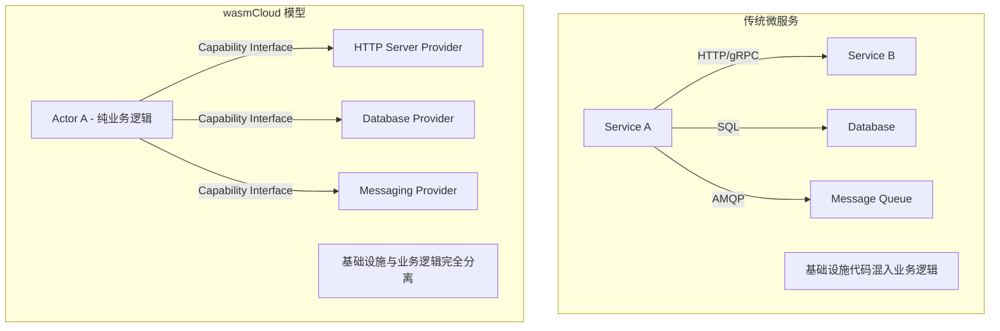
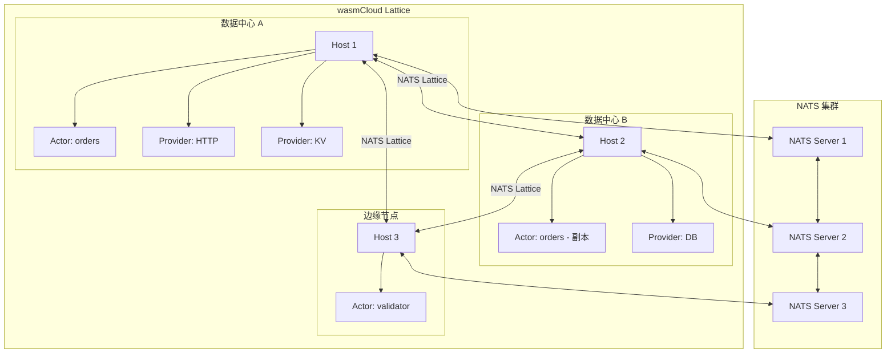
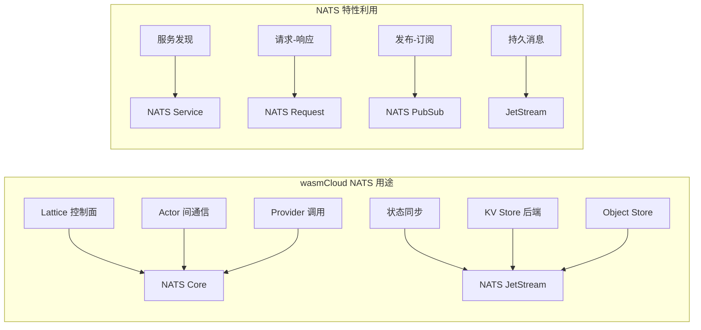
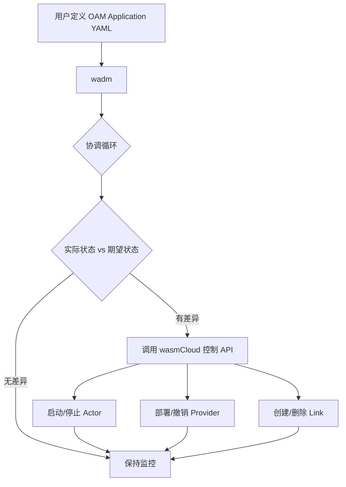
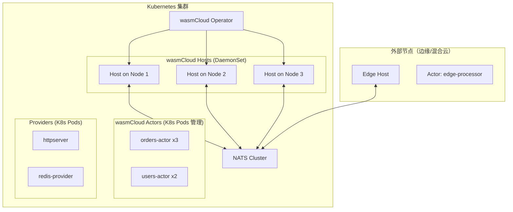

> **生产环境安全提示**
>
> 本文档包含可直接执行的运维命令。执行前请确认：当前目标集群与 Namespace 是否正确；是否具备足够的 RBAC 权限；是否已在非生产环境验证。命令风险等级标注：🔴 高风险（可能造成数据丢失或服务中断）、🟡 中风险（会修改集群状态，但通常可回滚）、🟢 低风险/只读（信息收集，无副作用）。


title: [[wasmCloud|wasmCloud]] 平台
description: 1. [wasmCloud 概述](#1-wasmcloud-概述)
category: webassembly-cloud-native
tags:
- k8s
- wasm
- webassembly
- cloud-native
- [[Prometheus|prometheus]]
- grafana
- [[Jaeger|jaeger]]
- [[Helm|helm]]
- docker
- opa
last_updated: 2026-05
difficulty: advanced
reading_level: advanced
audience:
- 架构师
- 开发工程师
- SRE
estimated_read_time: 5min
intent_queries:
- wasmCloud 平台 是什么
- 如何 wasmCloud 平台
- Kubernetes 38 webassembly cloud native 最佳实践
trigger_keywords:
- wasmCloud
- 平台
- webassembly
- cloud
- native
authors:
- name: KUDIG Team
  role: contributor
k8s_versions:
- '1.28'
- '1.29'
- '1.30'
- '1.31'
- '1.32'
---

# wasmCloud 平台
# wasmCloud Platform

<!-- chunk: 目录 / Table of Contents -->## 目录 / Table of Contents

1. [wasmCloud 概述](#1-wasmcloud-概述)
2. [Actor 模型与组件](#2-actor-模型与组件)
3. [Capability Providers](#3-capability-providers)
4. [Lattice 网络](#4-lattice-网络)
5. [NATS 消息系统](#5-nats-消息系统)
6. [wadm 应用模型](#6-wadm-应用模型)
7. [Kubernetes 集成](#7-kubernetes-集成)
8. [分布式部署](#8-分布式部署)
9. [开发实践](#9-开发实践)
10. [安全模型](#10-安全模型)
11. [监控与可观测性](#11-监控与可观测性)
12. [生产运维](#12-生产运维)

---

<!-- chunk: 1. wasmCloud 概述 -->## 1. wasmCloud 概述

## 1.1 什么是 wasmCloud / What is wasmCloud

wasmCloud 是一个 CNCF 孵化项目，构建在 WebAssembly 和 NATS 之上的分布式应用平台。它采用 Actor 模型，使开发者可以构建跨云、跨边缘的分布式 Wasm 应用：

```
wasmCloud 核心价值观

"编写一次，在任何地方安全运行"
Write once, run anywhere — securely

1. 分布式优先 (Distributed-First)
   - 应用天然支持多节点、多云、多边缘
   
2. 关注业务逻辑 (Concern Separation)
   - Actor 只包含业务逻辑
   - 基础设施能力由 Provider 提供
   
3. 零信任安全 (Zero-Trust Security)
   - 每个 Actor 声明所需能力
   - 运行时强制执行权限
   
4. 可观测性内建 (Built-in Observability)
   - OpenTelemetry 原生支持
```

## 1.2 wasmCloud vs 传统微服务 / Comparison



## 1.3 核心概念速览 / Key Concepts

| 概念 | 说明 |
|------|------|
| **Actor/Component** | Wasm 组件，包含纯业务逻辑，无系统调用 |
| **Capability Provider** | 提供基础设施能力（HTTP、数据库、消息队列等）|
| **Lattice** | wasmCloud 分布式网络，基于 NATS |
| **Host** | 运行 Actor 和 Provider 的进程 |
| **Link** | Actor 与 Provider 之间的运行时绑定 |
| **wadm** | wasmCloud Application Deployment Manager |
| **wash** | wasmCloud Shell - 命令行工具 |

---

<!-- chunk: 2. Actor 模型与组件 -->## 2. Actor 模型与组件

## 2.1 Actor/Component 概述 / Overview

在 wasmCloud 中，Actor（新版本称为 Component）是最小的可部署单元：

```
wasmCloud Actor 特性

✅ Actor 可以做的事：
  - 执行业务逻辑（计算、数据转换）
  - 通过 WIT 接口调用 Capability Provider
  - 处理入站请求（HTTP、消息等）
  - 调用其他 Actor

❌ Actor 不能做的事：
  - 直接进行系统调用（文件IO、网络）
  - 访问环境变量（通过 Provider 获取）
  - 持有长期状态（需通过 Provider 持久化）
  - 直接操作数据库

这种设计确保了：
  - 强大的安全隔离
  - 真正的可移植性
  - 清晰的依赖关系
```

## 2.2 Actor 开发（Rust）/ Actor Development in Rust

```toml
# Cargo.toml - wasmCloud Actor
[package]
name = "orders-actor"
version = "0.1.0"
edition = "2021"

[lib]
crate-type = ["cdylib"]

[dependencies]
# wasmCloud 绑定库
wasmcloud-component = "0.1"
wit-bindgen = "0.20"
serde = { version = "1", features = ["derive"] }
serde_json = "1"
anyhow = "1"
uuid = { version = "1", features = ["v4"] }
```

```rust
// src/lib.rs - 订单管理 Actor
use wasmcloud_component::wasi::keyvalue::*;
use wasmcloud_component::wasi::logging::logging::*;
use wasmcloud_component::wasmcloud::bus::lattice::*;
use wasmcloud_component::wasmcloud::messaging::consumer::*;
use serde::{Deserialize, Serialize};
use anyhow::Result;

// WIT 接口绑定（通过 wit-bindgen 自动生成）
wit_bindgen::generate!({
    world: "orders-world",
    exports: {
        "wasmcloud:http/incoming-handler": HttpHandler,
    },
});

#[derive(Debug, Serialize, Deserialize, Clone)]
struct Order {
    id: String,
    user_id: u64,
    items: Vec<OrderItem>,
    total: f64,
    status: OrderStatus,
    created_at: String,
}

#[derive(Debug, Serialize, Deserialize, Clone)]
struct OrderItem {
    product_id: String,
    quantity: u32,
    price: f64,
}

#[derive(Debug, Serialize, Deserialize, Clone, PartialEq)]
#[serde(rename_all = "lowercase")]
enum OrderStatus {
    Pending,
    Processing,
    Shipped,
    Delivered,
    Cancelled,
}

struct HttpHandler;

impl exports::wasmcloud::http::incoming_handler::Guest for HttpHandler {
    fn handle(
        request: wasmcloud_component::wasi::http::types::IncomingRequest,
        response_out: wasmcloud_component::wasi::http::types::ResponseOutparam,
    ) {
        let response = handle_request(request).unwrap_or_else(|e| {
            log(Level::Error, "orders-actor", &format!("处理请求失败: {}", e));
            error_response(500, &e.to_string())
        });
        
        wasmcloud_component::wasi::http::types::ResponseOutparam::set(
            response_out,
            Ok(response),
        );
    }
}

fn handle_request(
    req: wasmcloud_component::wasi::http::types::IncomingRequest,
) -> Result<wasmcloud_component::wasi::http::types::OutgoingResponse> {
    let method = req.method();
    let path = req.path_with_query().unwrap_or_default();
    
    log(Level::Info, "orders-actor", &format!("处理请求: {:?} {}", method, path));
    
    match (method, path.as_str()) {
        (wasmcloud_component::wasi::http::types::Method::Get, path) 
            if path.starts_with("/orders/") => 
        {
            let id = &path["/orders/".len()..];
            get_order(id)
        }
        (wasmcloud_component::wasi::http::types::Method::Post, "/orders") => {
            let body = read_body(&req)?;
            create_order(&body)
        }
        (wasmcloud_component::wasi::http::types::Method::Put, path)
            if path.starts_with("/orders/") =>
        {
            let parts: Vec<&str> = path.split('/').collect();
            if parts.len() >= 4 {
                let id = parts[2];
                let status_str = parts[3];
                update_order_status(id, status_str)
            } else {
                Err(anyhow::anyhow!("无效路径"))
            }
        }
        _ => Ok(not_found_response()),
    }
}

fn get_order(id: &str) -> Result<wasmcloud_component::wasi::http::types::OutgoingResponse> {
    // 从 KV Store 获取订单（通过 Capability Provider）
    let bucket = store::open("orders")
        .map_err(|e| anyhow::anyhow!("打开 KV Store 失败: {:?}", e))?;
    
    match get(&bucket, id) {
        Ok(Some(data)) => {
            let order: Order = serde_json::from_slice(&data)?;
            json_response(200, &order)
        }
        Ok(None) => Ok(not_found_response()),
        Err(e) => Err(anyhow::anyhow!("获取订单失败: {:?}", e)),
    }
}

fn create_order(body: &[u8]) -> Result<wasmcloud_component::wasi::http::types::OutgoingResponse> {
    // 解析请求
    #[derive(Deserialize)]
    struct CreateOrderReq {
        user_id: u64,
        items: Vec<OrderItem>,
    }
    
    let req: CreateOrderReq = serde_json::from_slice(body)?;
    
    // 计算总价
    let total: f64 = req.items.iter()
        .map(|item| item.price * item.quantity as f64)
        .sum();
    
    let order = Order {
        id: generate_id(),
        user_id: req.user_id,
        items: req.items,
        total,
        status: OrderStatus::Pending,
        created_at: "2025-03-04T00:00:00Z".to_string(),
    };
    
    // 保存到 KV Store
    let bucket = store::open("orders")
        .map_err(|e| anyhow::anyhow!("打开 KV Store 失败: {:?}", e))?;
    
    let data = serde_json::to_vec(&order)?;
    set(&bucket, &order.id, &data)
        .map_err(|e| anyhow::anyhow!("保存订单失败: {:?}", e))?;
    
    // 发送消息到消息队列（通知库存系统）
    let message_body = serde_json::to_vec(&order)?;
    publish(&RequestMessage {
        subject: "orders.created".to_string(),
        body: message_body,
        headers: None,
    }).map_err(|e| anyhow::anyhow!("发布消息失败: {:?}", e))?;
    
    log(Level::Info, "orders-actor", &format!("创建订单: {}", order.id));
    
    json_response(201, &order)
}

fn update_order_status(id: &str, status_str: &str) 
    -> Result<wasmcloud_component::wasi::http::types::OutgoingResponse> 
{
    let status = match status_str {
        "processing" => OrderStatus::Processing,
        "shipped" => OrderStatus::Shipped,
        "delivered" => OrderStatus::Delivered,
        "cancelled" => OrderStatus::Cancelled,
        _ => return Ok(bad_request_response("无效的状态")),
    };
    
    let bucket = store::open("orders")
        .map_err(|e| anyhow::anyhow!("打开 KV Store 失败: {:?}", e))?;
    
    match get(&bucket, id) {
        Ok(Some(data)) => {
            let mut order: Order = serde_json::from_slice(&data)?;
            order.status = status.clone();
            
            let updated_data = serde_json::to_vec(&order)?;
            set(&bucket, id, &updated_data)
                .map_err(|e| anyhow::anyhow!("更新订单失败: {:?}", e))?;
            
            json_response(200, &order)
        }
        Ok(None) => Ok(not_found_response()),
        Err(e) => Err(anyhow::anyhow!("获取订单失败: {:?}", e)),
    }
}

// 辅助函数
fn json_response<T: Serialize>(
    status: u16, 
    body: &T,
) -> Result<wasmcloud_component::wasi::http::types::OutgoingResponse> {
    let json = serde_json::to_vec(body)?;
    let response = wasmcloud_component::wasi::http::types::OutgoingResponse::new(
        wasmcloud_component::wasi::http::types::Fields::new()
    );
    response.set_status_code(status).map_err(|_| anyhow::anyhow!("设置状态码失败"))?;
    
    let resp_body = response.body().map_err(|_| anyhow::anyhow!("获取响应体失败"))?;
    let stream = resp_body.write().map_err(|_| anyhow::anyhow!("写入流失败"))?;
    stream.write(&json).map_err(|_| anyhow::anyhow!("写入失败"))?;
    
    Ok(response)
}

fn error_response(status: u16, msg: &str) 
    -> wasmcloud_component::wasi::http::types::OutgoingResponse 
{
    let body = format!(r#"{{"error":"{}"}}"#, msg);
    json_response(status, &body).unwrap()
}

fn not_found_response() -> wasmcloud_component::wasi::http::types::OutgoingResponse {
    error_response(404, "未找到")
}

fn bad_request_response(msg: &str) -> wasmcloud_component::wasi::http::types::OutgoingResponse {
    error_response(400, msg)
}

fn read_body(req: &wasmcloud_component::wasi::http::types::IncomingRequest) -> Result<Vec<u8>> {
    let body = req.consume().map_err(|_| anyhow::anyhow!("消费请求体失败"))?;
    let stream = body.stream().map_err(|_| anyhow::anyhow!("获取流失败"))?;
    
    let mut bytes = Vec::new();
    loop {
        match stream.read(8192) {
            Ok(chunk) if chunk.is_empty() => break,
            Ok(chunk) => bytes.extend_from_slice(&chunk),
            Err(_) => break,
        }
    }
    
    Ok(bytes)
}

fn generate_id() -> String {
    format!("order-{}", "unique-id")  // 实际应使用 UUID
}
```

## 2.3 Go Actor 开发 / Go Actor Development

```go
// main.go - Go wasmCloud Actor
//go:build wasip2

package main

import (
    "encoding/json"
    "fmt"
    
    "go.wasmcloud.dev/component/gen/wasi/http/incoming_handler"
    "go.wasmcloud.dev/component/gen/wasi/http/types"
    "go.wasmcloud.dev/component/gen/wasi/keyvalue/store"
    "go.wasmcloud.dev/component/gen/wasi/logging/logging"
)

func init() {
    incoming_handler.Exports.Handle = handleRequest
}

type Product struct {
    ID    string  `json:"id"`
    Name  string  `json:"name"`
    Price float64 `json:"price"`
    Stock int     `json:"stock"`
}

func handleRequest(req types.IncomingRequest, resp types.ResponseOutparam) {
    method := req.Method()
    path, _ := req.PathWithQuery()
    
    logging.Log(
        logging.LevelInfo,
        "inventory-actor",
        fmt.Sprintf("收到请求: %v %s", method, path),
    )
    
    var response types.OutgoingResponse
    var err error
    
    switch {
    case method == types.MethodGet() && path == "/products":
        response, err = listProducts()
    case method == types.MethodPost() && path == "/products":
        body, _ := readBody(req)
        response, err = createProduct(body)
    case method == types.MethodGet() && len(path) > 10:
        id := path[len("/products/"):]
        response, err = getProduct(id)
    default:
        response = notFoundResponse()
    }
    
    if err != nil {
        logging.Log(logging.LevelError, "inventory-actor", err.Error())
        response = errorResponse(500, err.Error())
    }
    
    types.ResponseOutparamSet(resp, types.Ok[types.OutgoingResponse](response))
}

func listProducts() (types.OutgoingResponse, error) {
    bucket, err := store.Open("products")
    if err != nil {
        return types.OutgoingResponse{}, fmt.Errorf("打开存储失败: %w", err)
    }
    
    keys, err := store.ListKeys(bucket, None[string]())
    if err != nil {
        return types.OutgoingResponse{}, fmt.Errorf("列出键失败: %w", err)
    }
    
    var products []Product
    for _, key := range keys.Keys {
        data, err := store.Get(bucket, key)
        if err != nil || data.IsNone() {
            continue
        }
        
        var product Product
        if err := json.Unmarshal(data.Unwrap(), &product); err != nil {
            continue
        }
        products = append(products, product)
    }
    
    return jsonResponse(200, products)
}

func createProduct(body []byte) (types.OutgoingResponse, error) {
    var product Product
    if err := json.Unmarshal(body, &product); err != nil {
        return types.OutgoingResponse{}, fmt.Errorf("解析请求失败: %w", err)
    }
    
    if product.ID == "" {
        product.ID = fmt.Sprintf("prod-%d", 12345)  // 实际应生成唯一 ID
    }
    
    bucket, err := store.Open("products")
    if err != nil {
        return types.OutgoingResponse{}, err
    }
    
    data, _ := json.Marshal(product)
    if err := store.Set(bucket, product.ID, data); err != nil {
        return types.OutgoingResponse{}, fmt.Errorf("保存产品失败: %w", err)
    }
    
    return jsonResponse(201, product)
}

func getProduct(id string) (types.OutgoingResponse, error) {
    bucket, err := store.Open("products")
    if err != nil {
        return types.OutgoingResponse{}, err
    }
    
    data, err := store.Get(bucket, id)
    if err != nil {
        return types.OutgoingResponse{}, err
    }
    
    if data.IsNone() {
        return notFoundResponse(), nil
    }
    
    var product Product
    if err := json.Unmarshal(data.Unwrap(), &product); err != nil {
        return types.OutgoingResponse{}, err
    }
    
    return jsonResponse(200, product)
}

func jsonResponse(status uint16, body interface{}) (types.OutgoingResponse, error) {
    data, err := json.Marshal(body)
    if err != nil {
        return types.OutgoingResponse{}, err
    }
    
    headers := types.NewFields()
    _ = headers.Append("content-type", []byte("application/json"))
    
    resp := types.NewOutgoingResponse(headers)
    resp.SetStatusCode(status)
    
    respBody, _ := resp.Body()
    stream, _ := respBody.Write()
    stream.Write(data)
    
    return resp, nil
}

func notFoundResponse() types.OutgoingResponse {
    resp, _ := jsonResponse(404, map[string]string{"error": "未找到"})
    return resp
}

func errorResponse(status uint16, msg string) types.OutgoingResponse {
    resp, _ := jsonResponse(status, map[string]string{"error": msg})
    return resp
}

func readBody(req types.IncomingRequest) ([]byte, error) {
    body, err := req.Consume()
    if err != nil {
        return nil, err
    }
    
    stream, err := body.Stream()
    if err != nil {
        return nil, err
    }
    
    var result []byte
    for {
        chunk, err := stream.Read(8192)
        if len(chunk) > 0 {
            result = append(result, chunk...)
        }
        if err != nil {
            break
        }
        if len(chunk) == 0 {
            break
        }
    }
    
    return result, nil
}

type Option[T any] struct {
    value *T
}

func None[T any]() Option[T] {
    return Option[T]{}
}

func (o Option[T]) IsNone() bool { return o.value == nil }
func (o Option[T]) Unwrap() T    { return *o.value }

func main() {}
```

---

<!-- chunk: 3. Capability Providers -->## 3. Capability Providers

## 3.1 内置 Capability Providers / Built-in Providers

```
# 🟢 低风险：只读/信息收集，通常无副作用
wasmCloud 内置 Capability Providers

HTTP 服务器
  wasmcloud:httpserver
  - 提供 HTTP/HTTPS 服务
  - 支持 TLS 终止
  - 可配置端口、绑定地址

HTTP 客户端  
  wasmcloud:httpclient
  - 出站 HTTP 请求
  - 支持认证、重试
  
键值存储
  wasmcloud:keyvalue:redis    - Redis 后端
  wasmcloud:keyvalue:nats     - NATS KV 后端
  wasmcloud:keyvalue:vault    - HashiCorp Vault
  
消息队列
  wasmcloud:messaging:nats    - NATS 消息
  wasmcloud:messaging:kafka   - Apache Kafka
  
SQL 数据库
  wasmcloud:sqldb:postgres    - PostgreSQL
  wasmcloud:sqldb:sqlite      - SQLite
  
Blob 存储
  wasmcloud:blobstore:s3      - AWS S3
  wasmcloud:blobstore:azure   - Azure Blob
  wasmcloud:blobstore:fs      - 本地文件系统

日志
  wasmcloud:logging           - 结构化日志
  
机密管理
  wasmcloud:secrets:nats-kv   - NATS KV 加密
  wasmcloud:secrets:vault     - Vault 集成
```
## 3.2 自定义 Capability Provider / Custom Provider

```rust
// 自定义 Capability Provider - 支付处理
// providers/payment/src/main.rs

use wasmcloud_provider_sdk::{
    provider_main,
    interfaces::*,
    Context, ProviderHandler,
};
use std::collections::HashMap;
use tokio::sync::RwLock;
use std::sync::Arc;

#[derive(Clone)]
struct PaymentProvider {
    // Provider 内部状态
    configs: Arc<RwLock<HashMap<String, LinkConfig>>>,
    stripe_client: Arc<StripeClient>,
}

struct StripeClient {
    api_key: String,
}

impl StripeClient {
    async fn charge(&self, amount: u64, currency: &str, source: &str) 
        -> Result<PaymentResult, PaymentError> 
    {
        // 调用 Stripe API（Provider 可以直接进行网络调用）
        let client = reqwest::Client::new();
        let response = client
            .post("https://api.stripe.com/v1/charges")
            .header("Authorization", format!("Bearer {}", self.api_key))
            .form(&[
                ("amount", amount.to_string()),
                ("currency", currency.to_string()),
                ("source", source.to_string()),
            ])
            .send()
            .await
            .map_err(|e| PaymentError::NetworkError(e.to_string()))?;
        
        let result: StripeResponse = response.json().await
            .map_err(|e| PaymentError::ParseError(e.to_string()))?;
        
        Ok(PaymentResult {
            charge_id: result.id,
            status: result.status,
        })
    }
}

// Provider 处理器
#[async_trait::async_trait]
impl ProviderHandler for PaymentProvider {
    // 当 Actor 链接到此 Provider 时调用
    async fn put_link(&self, ld: &LinkDefinition) -> bool {
        let config = LinkConfig {
            actor_id: ld.actor_id.clone(),
            values: ld.values.clone(),
        };
        
        let mut configs = self.configs.write().await;
        configs.insert(ld.actor_id.clone(), config);
        
        println!("Actor {} 已链接到支付 Provider", ld.actor_id);
        true
    }
    
    // 当 Actor 取消链接时调用
    async fn delete_link(&self, actor_id: &str) {
        let mut configs = self.configs.write().await;
        configs.remove(actor_id);
        println!("Actor {} 已取消链接", actor_id);
    }
}

#[derive(Debug)]
struct PaymentResult {
    charge_id: String,
    status: String,
}

#[derive(Debug)]
enum PaymentError {
    NetworkError(String),
    ParseError(String),
    AuthError(String),
}

#[derive(Debug)]
struct LinkConfig {
    actor_id: String,
    values: HashMap<String, String>,
}

#[derive(Debug, serde::Deserialize)]
struct StripeResponse {
    id: String,
    status: String,
}

#[tokio::main]
async fn main() {
    // 从环境变量获取 Stripe API Key
    let stripe_api_key = std::env::var("STRIPE_API_KEY")
        .expect("需要 STRIPE_API_KEY 环境变量");
    
    let provider = PaymentProvider {
        configs: Arc::new(RwLock::new(HashMap::new())),
        stripe_client: Arc::new(StripeClient {
            api_key: stripe_api_key,
        }),
    };
    
    // 启动 Provider（连接到 NATS/Lattice）
    provider_main(provider, Some("Payment Provider".to_string()))
        .await
        .expect("Provider 启动失败");
}
```

## 3.3 Provider 配置 / Provider Configuration

```yaml
# wasmCloud Provider 部署配置
apiVersion: core.oam.dev/v1beta1
kind: Application
metadata:
  name: payment-provider-app
  namespace: default
  annotations:
    version: "1.0.0"
    description: "支付处理 Provider 部署"
spec:
  components:
  # 支付 Provider
  - name: payment-provider
    type: capability
    properties:
      image: ghcr.io/myorg/payment-provider:latest
      id: payment-provider
    traits:
    - type: wasmcloud.dev/spreadscaler
      properties:
        replicas: 2
        spread:
        - name: us-east
          requirements:
            region: us-east-1
          weight: 60
        - name: us-west
          requirements:
            region: us-west-2
          weight: 40
    
    # Provider 链接配置
    - type: link
      properties:
        target: orders-actor
        namespace: wasmcloud
        package: messaging
        interfaces: [consumer]
        target_config:
        - name: nats-config
          properties:
            url: nats://nats.default.svc:4222
```

---

<!-- chunk: 4. Lattice 网络 -->## 4. Lattice 网络

## 4.1 Lattice 架构 / Lattice Architecture



## 4.2 Lattice 通信模式 / Communication Patterns

```
wasmCloud Lattice 消息主题命名规范

Actor 调用：
  wasmbus.rpc.<lattice-id>.<actor-public-key>.<operation>

Provider 调用：
  wasmbus.rpc.<lattice-id>.<provider-public-key>.<link-name>.<operation>

Actor 注册：
  wasmbus.ctl.<lattice-id>.actor.start
  wasmbus.ctl.<lattice-id>.actor.stop
  wasmbus.ctl.<lattice-id>.actor.scale

Host 健康检查：
  wasmbus.ctl.<lattice-id>.ping.hosts

链接管理：
  wasmbus.ctl.<lattice-id>.link.put
  wasmbus.ctl.<lattice-id>.link.del

配置更新：
  wasmbus.ctl.<lattice-id>.config.put
  wasmbus.ctl.<lattice-id>.config.del
```

## 4.3 Lattice 配置 / Lattice Configuration

```toml
# wasmCloud Host 配置 (wasmcloud.toml)
[host]
# Lattice ID（同一 Lattice 中的 Host 使用相同 ID）
lattice = "default"

# Host 标签（用于调度和路由）
[host.labels]
region = "us-east-1"
zone = "us-east-1a"
provider = "aws"
environment = "production"
tier = "premium"

# NATS 连接配置
[nats]
url = "nats://nats-cluster.default.svc:4222"
credentials_file = "/etc/wasmcloud/nats.creds"
timeout = "5s"

# 如果使用 NATS JetStream（推荐生产环境）
[nats.js]
domain = "hub"
api_prefix = "$JS.API"

# 可观测性
[otel]
traces_exporter = "otlp"
metrics_exporter = "prometheus"
exporter_otlp_endpoint = "http://otel-collector.monitoring.svc:4317"
```

---

<!-- chunk: 5. NATS 消息系统 -->## 5. NATS 消息系统

## 5.1 NATS 在 wasmCloud 中的角色 / NATS Role



## 5.2 部署 NATS 集群 / Deploy NATS Cluster

```yaml
# NATS Helm 安装配置
# helm install nats nats/nats -f values.yaml

# values.yaml
config:
  cluster:
    enabled: true
    replicas: 3
  
  jetstream:
    enabled: true
    memStorage:
      enabled: true
      size: 1Gi
    fileStorage:
      enabled: true
      size: 10Gi
      storageDirectory: /data
  
  leafnodes:
    enabled: true
    port: 7422
  
  websocket:
    enabled: true
    port: 8080
  
  resolver:
    enabled: true
    type: full
    dir: /config/accounts

natsBox:
  enabled: true

statefulSet:
  merge:
    spec:
      template:
        spec:
          affinity:
            podAntiAffinity:
              requiredDuringSchedulingIgnoredDuringExecution:
              - labelSelector:
                  matchLabels:
                    app.kubernetes.io/name: nats
                topologyKey: kubernetes.io/hostname
```

> ⚠️ **🟡 中危变更** — 变更集群资源状态，建议先 --dry-run 或 diff 确认
> - `helm upgrade/install`：部署/升级 release

``` bash
# 🟡 中风险：会修改集群/资源状态，执行前请确认目标、影响范围与授权
# 安装 NATS
helm repo add nats https://nats-io.github.io/k8s/helm/charts/
helm repo update

helm install nats nats/nats \
  --namespace wasmcloud \
  --create-namespace \
  -f nats-values.yaml

# 验证
kubectl -n wasmcloud get pods -l app.kubernetes.io/name=nats
kubectl -n wasmcloud exec -it nats-box -- nats server list

# 创建 wasmCloud 专用账户
kubectl -n wasmcloud exec -it nats-box -- nats account add wasmcloud
```
## 5.3 Actor 消息通信 / Actor Messaging

```rust
// Actor 使用 NATS Provider 进行消息通信
use wasmcloud_component::wasmcloud::messaging::consumer::*;
use serde::{Deserialize, Serialize};

#[derive(Serialize, Deserialize)]
struct OrderCreatedEvent {
    order_id: String,
    user_id: u64,
    total: f64,
    timestamp: String,
}

// 发布事件（Actor -> NATS -> 其他服务）
fn publish_order_event(order_id: &str, user_id: u64, total: f64) -> Result<(), String> {
    let event = OrderCreatedEvent {
        order_id: order_id.to_string(),
        user_id,
        total,
        timestamp: "2025-03-04T00:00:00Z".to_string(),
    };
    
    let body = serde_json::to_vec(&event).map_err(|e| e.to_string())?;
    
    // 通过 Messaging Provider 发布
    publish(&RequestMessage {
        subject: "orders.events.created".to_string(),
        body,
        headers: Some(vec![
            ("Content-Type".to_string(), "application/json".to_string()),
            ("X-Order-ID".to_string(), order_id.to_string()),
        ]),
    }).map_err(|e| format!("发布失败: {:?}", e))?;
    
    Ok(())
}

// 请求-响应模式（向其他 Actor 发送请求）
fn validate_user(user_id: u64) -> Result<bool, String> {
    let request = serde_json::json!({
        "user_id": user_id
    });
    
    let response = request_msg(&RequestMessage {
        subject: format!("users.validate.{}", user_id),
        body: serde_json::to_vec(&request).unwrap(),
        headers: None,
    }).map_err(|e| format!("请求失败: {:?}", e))?;
    
    #[derive(Deserialize)]
    struct ValidationResponse {
        valid: bool,
    }
    
    let result: ValidationResponse = serde_json::from_slice(&response.body)
        .map_err(|e| e.to_string())?;
    
    Ok(result.valid)
}
```

---

<!-- chunk: 6. wadm 应用模型 -->## 6. wadm 应用模型

## 6.1 wadm 概述 / wadm Overview

wadm (wasmCloud Application Deployment Manager) 使用 OAM (Open Application Model) 规范管理 wasmCloud 应用的期望状态：



## 6.2 完整 OAM Application 示例 / Full OAM Application

```yaml
# ecommerce-app.yaml - 完整电商应用
apiVersion: core.oam.dev/v1beta1
kind: Application
metadata:
  name: ecommerce-platform
  namespace: default
  annotations:
    version: "2.0.0"
    description: "云原生电商平台 - WebAssembly 实现"
    authors: "platform-team@example.com"

spec:
  components:
  
  # ===== Actor 组件 =====
  
  # 1. 订单管理 Actor
  - name: orders-actor
    type: actor
    properties:
      image: ghcr.io/myorg/orders-actor:v2.0.0
      id: orders-actor
    traits:
    # 副本数和分布策略
    - type: wasmcloud.dev/spreadscaler
      properties:
        replicas: 6
        spread:
        - name: us-east
          requirements:
            region: us-east-1
          weight: 50
        - name: us-west
          requirements:
            region: us-west-2
          weight: 30
        - name: eu-west
          requirements:
            region: eu-west-1
          weight: 20
    
    # 链接到 HTTP Server Provider
    - type: link
      properties:
        target: httpserver
        namespace: wasi
        package: http
        interfaces: [incoming-handler]
        source_config:
        - name: http-listen-config
          properties:
            address: "0.0.0.0:8080"
    
    # 链接到 KV Store Provider
    - type: link
      properties:
        target: redis-provider
        namespace: wasi
        package: keyvalue
        interfaces: [atomics, store]
        target_config:
        - name: redis-config
          properties:
            url: "redis://redis.default.svc:6379"
    
    # 链接到 Messaging Provider
    - type: link
      properties:
        target: nats-messaging
        namespace: wasmcloud
        package: messaging
        interfaces: [consumer]
        target_config:
        - name: nats-subscriptions
          properties:
            subscriptions: "orders.events.*"
  
  # 2. 用户管理 Actor
  - name: users-actor
    type: actor
    properties:
      image: ghcr.io/myorg/users-actor:v1.5.0
    traits:
    - type: wasmcloud.dev/spreadscaler
      properties:
        replicas: 4
        spread:
        - name: all-regions
          requirements: {}
          weight: 100
    - type: link
      properties:
        target: httpserver
        namespace: wasi
        package: http
        interfaces: [incoming-handler]
        source_config:
        - name: http-users-config
          properties:
            address: "0.0.0.0:8081"
    - type: link
      properties:
        target: postgres-provider
        namespace: wasmcloud
        package: sqldb
        interfaces: [query]
        target_config:
        - name: postgres-config
          properties:
            url: "postgresql://db.default.svc:5432/users"
  
  # 3. 库存管理 Actor
  - name: inventory-actor
    type: actor
    properties:
      image: ghcr.io/myorg/inventory-actor:v1.0.0
    traits:
    - type: wasmcloud.dev/spreadscaler
      properties:
        replicas: 3
    - type: link
      properties:
        target: nats-messaging
        namespace: wasmcloud
        package: messaging
        interfaces: [consumer]
        target_config:
        - name: inventory-subs
          properties:
            subscriptions: "orders.events.created,inventory.requests.*"
    - type: link
      properties:
        target: redis-provider
        namespace: wasi
        package: keyvalue
        interfaces: [atomics, store]
        target_config:
        - name: inventory-redis
          properties:
            url: "redis://redis.default.svc:6379/1"
  
  # ===== Capability Provider 组件 =====
  
  # HTTP Server Provider
  - name: httpserver
    type: capability
    properties:
      image: ghcr.io/wasmcloud/http-server:0.22.0
      id: httpserver
    traits:
    - type: wasmcloud.dev/daemonscaler
      properties:
        replicas: 1  # 每个 Host 一个
  
  # Redis KV Provider
  - name: redis-provider
    type: capability
    properties:
      image: ghcr.io/wasmcloud/keyvalue-redis:0.28.0
    traits:
    - type: wasmcloud.dev/spreadscaler
      properties:
        replicas: 2
  
  # NATS Messaging Provider
  - name: nats-messaging
    type: capability
    properties:
      image: ghcr.io/wasmcloud/messaging-nats:0.22.0
    traits:
    - type: wasmcloud.dev/spreadscaler
      properties:
        replicas: 2
  
  # PostgreSQL Provider
  - name: postgres-provider
    type: capability
    properties:
      image: ghcr.io/wasmcloud/sqldb-postgres:0.3.0
    traits:
    - type: wasmcloud.dev/spreadscaler
      properties:
        replicas: 2
```

## 6.3 wadm 操作命令 / wadm Operations

```bash
# 安装 wash (wasmCloud Shell)
curl -s https://packagecloud.io/AtomicJar/wash/script.deb.sh | sudo bash
sudo apt install wash

# 或者使用 Homebrew
brew install wasmcloud/wasmcloud/wash

# 部署应用
wash app deploy ecommerce-app.yaml

# 查看应用状态
wash app list
# NAME                  VERSION    STATUS    DESCRIPTION
# ecommerce-platform    2.0.0      Deployed  云原生电商平台

# 查看详细状态
wash app get ecommerce-platform

# 查看所有 Actor 实例
wash get actors
# HOST                     COMPONENT                   INSTANCES
# host-abc123             orders-actor                6
# host-def456             users-actor                 4

# 查看 Provider
wash get providers
# HOST         PROVIDER                        LINK
# host-abc123  wasmcloud:httpserver:0.22.0     httpserver

# 查看链接
wash get links

# 扩容 Actor
wash scale actor \
  --host-id <host-id> \
  --actor-ref ghcr.io/myorg/orders-actor:v2.0.0 \
  --count 10

# 更新应用（更新镜像版本）
sed -i 's/v2.0.0/v2.1.0/g' ecommerce-app.yaml
wash app deploy ecommerce-app.yaml --replace

# 删除应用
wash app undeploy ecommerce-platform
wash app delete ecommerce-platform
```

---

<!-- chunk: 7. Kubernetes 集成 -->## 7. Kubernetes 集成

## 7.1 wasmCloud Operator / Kubernetes Operator

> ⚠️ **🟡 中危变更** — 变更集群资源状态，建议先 --dry-run 或 diff 确认
> - `helm upgrade/install`：部署/升级 release

``` bash
# 🟡 中风险：会修改集群/资源状态，执行前请确认目标、影响范围与授权
# 安装 wasmCloud Operator
helm repo add wasmcloud https://wasmcloud.github.io/wasmcloud-operator
helm repo update

helm install wasmcloud-operator wasmcloud/wasmcloud-operator \
  --namespace wasmcloud \
  --create-namespace \
  --version 0.3.0

# 验证安装
kubectl -n wasmcloud get pods
kubectl get crd | grep wasmcloud
# wasmcloudhostconfigs.k8s.wasmcloud.dev
```
```yaml
# WasmCloudHostConfig - 配置 wasmCloud Host
apiVersion: k8s.wasmcloud.dev/v1alpha1
kind: WasmCloudHostConfig
metadata:
  name: wasmcloud-host-config
  namespace: wasmcloud
spec:
  # Host 副本数（Kubernetes 节点数）
  hostReplicas: 3
  
  # NATS 连接配置
  natsLeafUrl: "nats://nats.wasmcloud.svc:7422"
  
  # Lattice ID
  lattice: default
  
  # Host 标签（用于 wadm 调度）
  hostLabels:
    environment: production
    region: us-east-1
    provider: aws
    kubernetes: "true"
    node-type: wasm-optimized
  
  # 镜像拉取策略
  image: "ghcr.io/wasmcloud/wasmcloud:1.2.0"
  
  # 策略服务（OPA 集成，可选）
  policyService:
    topic: "wasmcloud.policy.default"
  
  # OpenTelemetry
  otelExporterOtlpEndpoint: "http://otel-collector.monitoring.svc:4317"
  
  # 可观测性
  enableStructuredLogging: true
  logLevel: info
  
  # 资源限制
  resources:
    requests:
      memory: "64Mi"
      cpu: "100m"
    limits:
      memory: "256Mi"
      cpu: "500m"
  
  # NATS 凭证
  secretName: wasmcloud-nats-creds
```

## 7.2 wasmCloud + Kubernetes 混合部署 / Hybrid Deployment



## 7.3 与 Kubernetes 服务集成 / K8s Service Integration

```yaml
# 暴露 wasmCloud HTTP Server 为 K8s Service
apiVersion: v1
kind: Service
metadata:
  name: wasmcloud-http
  namespace: wasmcloud
  labels:
    app: wasmcloud-httpserver
spec:
  selector:
    app.kubernetes.io/name: wasmcloud-host
  ports:
  - name: orders-api
    port: 8080
    targetPort: 8080
    protocol: TCP
  - name: users-api
    port: 8081
    targetPort: 8081
    protocol: TCP
  type: ClusterIP

---
# Ingress 路由到 wasmCloud
apiVersion: networking.k8s.io/v1
kind: Ingress
metadata:
  name: wasmcloud-ingress
  namespace: wasmcloud
  annotations:
    nginx.ingress.kubernetes.io/rewrite-target: /$2
spec:
  ingressClassName: nginx
  rules:
  - host: api.example.com
    http:
      paths:
      - path: /orders(/|$)(.*)
        pathType: ImplementationSpecific
        backend:
          service:
            name: wasmcloud-http
            port:
              number: 8080
      - path: /users(/|$)(.*)
        pathType: ImplementationSpecific
        backend:
          service:
            name: wasmcloud-http
            port:
              number: 8081
```

---

<!-- chunk: 8. 分布式部署 -->## 8. 分布式部署

## 8.1 多集群 Lattice / Multi-cluster Lattice

```
# 🟢 低风险：只读/信息收集，通常无副作用
wasmCloud 多集群分布式部署架构

  ┌─────────────────────────────────────────────────────┐
  │                  NATS 全球集群                       │
  │  ┌──────────┐  ┌──────────┐  ┌──────────────────┐  │
  │  │ NATS Hub │  │ NATS Hub │  │  NATS Hub        │  │
  │  │ (US-East)│  │ (EU-West)│  │  (AP-Southeast)  │  │
  │  └──────────┘  └──────────┘  └──────────────────┘  │
  └─────────────────────────────────────────────────────┘
           ▲                ▲                ▲
  ┌────────┘                │                └────────┐
  │                         │                         │
  ▼                         ▼                         ▼
AWS EKS                 Azure AKS                 阿里云 ACK
  │                         │                         │
  ├── wasmCloud Host x3     ├── wasmCloud Host x3    ├── wasmCloud Host x2
  ├── orders-actor x6       ├── orders-actor x3      ├── orders-actor x3
  ├── users-actor x4        ├── users-actor x2       ├── users-actor x2
  └── Providers             └── Providers            └── Providers
                                     │
                          边缘节点 (Leaf Nodes)
                           ├── 工厂网关 x5
                           ├── edge-actor
                           └── sensor-collector
```
## 8.2 NATS Leaf Node 配置 / Leaf Node Configuration

```yaml
# 边缘节点 NATS Leaf Node 配置
# nats-leaf.conf
port: 4222

leafnodes {
  # 连接到中心 NATS 集群
  remotes = [
    {
      url: "nats://nats-hub.cloud.example.com:7422"
      credentials: "/etc/nats/nats.creds"
      # 流量控制
      deny_imports: []
      deny_exports: []
    }
  ]
}

# 本地 JetStream（离线容错）
jetstream {
  store_dir: /data/nats
  max_memory_store: 128M
  max_file_store: 1G
  domain: edge-device-001
}
```

```yaml
# 边缘 wasmCloud Host 配置
apiVersion: k8s.wasmcloud.dev/v1alpha1
kind: WasmCloudHostConfig
metadata:
  name: edge-host-config
spec:
  hostReplicas: 1
  
  # 连接到本地 Leaf Node
  natsLeafUrl: "nats://localhost:4222"
  
  lattice: default
  
  hostLabels:
    environment: edge
    location: factory-floor-001
    tier: edge
    hardware: arm64
  
  # 边缘节点运行 AI 推理 Actor
  extraEnvVars:
  - name: WASMCLOUD_ALLOW_LATEST
    value: "true"
```

## 8.3 跨 Lattice 路由 / Cross-lattice Routing

```rust
// Actor 调用跨 Lattice 的 Actor（通过 NATS）
use wasmcloud_component::wasmcloud::bus::lattice::*;

fn call_remote_actor(actor_id: &str, operation: &str, payload: &[u8]) 
    -> Result<Vec<u8>, String> 
{
    // 通过 NATS Request 调用远程 Lattice 中的 Actor
    // wasmcloud 运行时负责路由和序列化
    
    let response = call_actor(CallActorRequest {
        actor: actor_id.to_string(),
        operation: operation.to_string(),
        payload: payload.to_vec(),
    }).map_err(|e| format!("调用失败: {:?}", e))?;
    
    Ok(response.payload)
}

// 示例：从 US-East 的 orders-actor 调用 EU-West 的 users-actor
fn create_order_with_user_validation(
    user_id: u64, 
    items: Vec<String>
) -> Result<String, String> {
    // 1. 验证用户（调用 users-actor，可能在不同地区）
    let validation_payload = serde_json::json!({
        "user_id": user_id,
        "action": "validate"
    }).to_string().into_bytes();
    
    let validation_result = call_remote_actor(
        "USERS_ACTOR_PUBLIC_KEY",
        "UsersActor.ValidateUser",
        &validation_payload,
    )?;
    
    // 2. 创建订单
    // ...
    
    Ok("order-123".to_string())
}
```

---

<!-- chunk: 9. 开发实践 -->## 9. 开发实践

## 9.1 WIT 接口定义 / WIT Interface Definition

```wit
// wit/world.wit - 订单服务 WIT 接口
package myorg:orders@1.0.0;

// 类型定义
interface types {
  record order-item {
    product-id: string,
    quantity: u32,
    price: f64,
  }
  
  enum order-status {
    pending,
    processing,
    shipped,
    delivered,
    cancelled,
  }
  
  record order {
    id: string,
    user-id: u64,
    items: list<order-item>,
    total: f64,
    status: order-status,
  }
  
  variant order-error {
    not-found(string),
    invalid-input(string),
    storage-error(string),
    validation-error(string),
  }
}

// 订单服务接口
interface orders {
  use types.{order, order-item, order-status, order-error};
  
  // 创建订单
  create-order: func(
    user-id: u64,
    items: list<order-item>,
  ) -> result<order, order-error>;
  
  // 获取订单
  get-order: func(id: string) -> result<order, order-error>;
  
  // 更新订单状态
  update-status: func(
    id: string,
    status: order-status,
  ) -> result<order, order-error>;
  
  // 取消订单
  cancel-order: func(id: string) -> result<bool, order-error>;
  
  // 搜索订单
  search-orders: func(
    user-id: option<u64>,
    status: option<order-status>,
    limit: u32,
    offset: u32,
  ) -> result<list<order>, order-error>;
}

// Actor 世界定义
world orders-actor {
  // 导入 wasmCloud 内置接口
  import wasi:keyvalue/store@0.2.0-draft;
  import wasi:keyvalue/atomics@0.2.0-draft;
  import wasmcloud:messaging/consumer@0.2.0;
  import wasi:logging/logging@0.1.0-draft;
  import wasi:clocks/wall-clock@0.2.0;
  
  // 导出 HTTP 处理器
  export wasi:http/incoming-handler@0.2.0;
  
  // 导出订单服务（供其他 Actor 调用）
  export orders;
}
```

## 9.2 测试策略 / Testing Strategy

```rust
// Actor 单元测试
#[cfg(test)]
mod tests {
    use super::*;
    use wasmcloud_test_util::*;
    
    #[test]
    fn test_order_creation() {
        // 使用 mock Provider
        let mock_kv = MockKeyValueStore::new();
        let mock_messaging = MockMessaging::new();
        
        // 注入 mock
        let actor = OrdersActor::new_with_deps(
            Box::new(mock_kv.clone()),
            Box::new(mock_messaging.clone()),
        );
        
        // 执行
        let request = CreateOrderRequest {
            user_id: 12345,
            items: vec![
                OrderItem {
                    product_id: "prod-001".to_string(),
                    quantity: 2,
                    price: 29.99,
                }
            ],
        };
        
        let result = actor.create_order(request);
        
        // 断言
        assert!(result.is_ok());
        let order = result.unwrap();
        assert_eq!(order.user_id, 12345);
        assert!(!order.id.is_empty());
        assert_eq!(order.status, OrderStatus::Pending);
        
        // 验证 KV Store 调用
        assert!(mock_kv.was_called_with_key(&format!("order:{}", order.id)));
        
        // 验证消息发布
        assert!(mock_messaging.was_message_published("orders.events.created"));
    }
    
    #[test]
    fn test_order_not_found() {
        let mock_kv = MockKeyValueStore::new(); // 空存储
        
        let actor = OrdersActor::new_with_deps(
            Box::new(mock_kv),
            Box::new(MockMessaging::new()),
        );
        
        let result = actor.get_order("non-existent-id");
        
        assert!(result.is_err());
        match result.unwrap_err() {
            OrderError::NotFound(msg) => assert!(msg.contains("non-existent-id")),
            _ => panic!("期望 NotFound 错误"),
        }
    }
    
    #[tokio::test]
    async fn test_integration_with_real_nats() {
        // 集成测试（需要 NATS 服务器）
        let nats_url = std::env::var("NATS_URL")
            .unwrap_or("nats://localhost:4222".to_string());
        
        let client = async_nats::connect(&nats_url).await.unwrap();
        
        // 发布测试消息
        client.publish("orders.test", "test payload".into()).await.unwrap();
        
        // 验证订阅
        let mut subscriber = client.subscribe("orders.test").await.unwrap();
        let msg = tokio::time::timeout(
            std::time::Duration::from_secs(5),
            subscriber.next(),
        ).await.unwrap().unwrap();
        
        assert_eq!(msg.payload, "test payload".as_bytes());
    }
}
```

## 9.3 本地开发环境 / Local Development

``` bash
# 🟢 低风险：只读/信息收集，通常无副作用
# 启动本地 wasmCloud 开发环境
# 方法 1: 使用 wash up
wash up --detached

# 查看运行状态
wash get hosts
# HOST ID                                          FRIENDLY NAME
# NBLABCD1234567890ABCDEF1234567890ABCDEF1234   wasmcloud-host-laptop

# 方法 2: 使用 Docker Compose
cat > docker-compose.yml << 'EOF'
version: '3.8'

services:
  nats:
    image: nats:2.10-alpine
    ports:
    - "4222:4222"
    command: "-js -m 8222"
  
  wasmcloud:
    image: ghcr.io/wasmcloud/wasmcloud:1.2.0
    environment:
      WASMCLOUD_NATS_HOST: nats
      WASMCLOUD_NATS_PORT: "4222"
      WASMCLOUD_LATTICE_PREFIX: default
      WASMCLOUD_LOG_LEVEL: debug
    depends_on:
    - nats
  
  wadm:
    image: ghcr.io/wasmcloud/wadm:0.12.0
    environment:
      WADM_NATS_SERVER: nats://nats:4222
    depends_on:
    - nats
EOF

docker-compose up -d

# 开发工作流
# 1. 编写 Actor 代码
wash build   # 编译 Wasm

# 2. 部署应用
wash app deploy myapp.wadm.yaml

# 3. 测试
curl http://localhost:8080/api/orders

# 4. 查看日志
wash logs --follow
```
---

<!-- chunk: 10. 安全模型 -->## 10. 安全模型

## 10.1 Actor 权限声明 / Actor Permissions Declaration

```
wasmCloud 零信任安全模型

每个 Actor 必须在 WIT 接口中声明所需能力：

world my-actor {
  // 明确声明需要的接口
  import wasi:keyvalue/store;      // 需要 KV 存储
  import wasmcloud:messaging;      // 需要消息队列
  // 未声明 = 无权限访问
}

运行时强制执行：
1. Actor 只能访问在 WIT world 中声明的接口
2. Provider 链接必须与声明匹配
3. 运行时拒绝任何未授权的能力调用
```

```yaml
# wasmCloud 策略配置（基于 OPA）
# policy.rego - 开放策略代理规则

package wasmcloud.authz

# 允许 Actor 启动的规则
allow_start_actor {
  # 检查 Actor 镜像来源
  input.actor.claims.issuer == "myorg-official-signer"
  
  # 检查 Actor 声明的能力
  required_caps := {"wasi:keyvalue", "wasmcloud:messaging"}
  allowed_caps := {cap | cap := input.actor.claims.capabilities[_]}
  required_caps & allowed_caps == required_caps
}

# 允许 Provider 调用的规则
allow_invocation {
  # 检查调用链
  input.actor != ""
  input.operation != ""
  
  # 检查白名单
  allowed_operations[input.operation]
}

allowed_operations := {
  "HttpServer.HandleRequest",
  "KeyValueStore.Get",
  "KeyValueStore.Set",
  "Messaging.Publish",
}
```

## 10.2 密钥管理 / Secret Management

```yaml
# wasmCloud Secrets Provider 配置（HashiCorp Vault）
apiVersion: core.oam.dev/v1beta1
kind: Application
metadata:
  name: secrets-demo
spec:
  components:
  - name: secrets-provider
    type: capability
    properties:
      image: ghcr.io/wasmcloud/secrets-vault:0.1.0
    
  - name: my-actor
    type: actor
    properties:
      image: ghcr.io/myorg/my-actor:latest
    traits:
    # 链接到 Secrets Provider
    - type: link
      properties:
        target: secrets-provider
        namespace: wasmcloud
        package: secrets
        interfaces: [reveal]
        target_config:
        - name: vault-config
          properties:
            vault_address: "https://vault.default.svc:8200"
            vault_token:
              secretKeyRef:
                name: vault-token
                key: token
            secret_path: "secret/myapp"
```

```rust
// Actor 访问密钥
use wasmcloud_component::wasmcloud::secrets::reveal::*;

fn get_api_key() -> Result<String, String> {
    // 通过 Secrets Provider 获取密钥
    // Actor 不直接接触密钥值，由 Provider 安全管理
    let secret = get("api-key")
        .map_err(|e| format!("获取密钥失败: {:?}", e))?;
    
    match secret.reveal_string() {
        Some(key) => Ok(key),
        None => Err("密钥不存在".to_string()),
    }
}
```

---

<!-- chunk: 11. 监控与可观测性 -->## 11. 监控与可观测性

## 11.1 OpenTelemetry 集成 / OpenTelemetry Integration

```yaml
# wasmCloud OpenTelemetry 配置
apiVersion: k8s.wasmcloud.dev/v1alpha1
kind: WasmCloudHostConfig
metadata:
  name: prod-host-config
spec:
  # OTel 配置
  otelExporterOtlpEndpoint: "http://otel-collector.monitoring.svc:4317"
  enableStructuredLogging: true
  logLevel: info
  
  # 额外 OTel 配置通过环境变量
  extraEnvVars:
  - name: OTEL_SERVICE_NAME
    value: wasmcloud-host
  - name: OTEL_RESOURCE_ATTRIBUTES
    value: "deployment.environment=production,k8s.cluster.name=prod-cluster"
  - name: OTEL_TRACES_SAMPLER
    value: traceidratio
  - name: OTEL_TRACES_SAMPLER_ARG
    value: "0.1"  # 10% 采样率
```

```yaml
# OpenTelemetry Collector 配置
apiVersion: v1
kind: ConfigMap
metadata:
  name: otel-collector-config
data:
  config.yaml: |
    receivers:
      otlp:
        protocols:
          grpc:
            endpoint: 0.0.0.0:4317
          http:
            endpoint: 0.0.0.0:4318
    
    processors:
      batch:
        send_batch_size: 1000
        timeout: 30s
      
      # 添加 wasmCloud 相关属性
      resource:
        attributes:
        - key: wasmcloud.lattice
          value: default
          action: upsert
    
    exporters:
      # 发送到 Jaeger
      jaeger:
        endpoint: jaeger.monitoring.svc:14250
      
      # 发送到 Prometheus
      prometheus:
        endpoint: 0.0.0.0:8889
      
      # 发送到日志
      logging:
        loglevel: debug
    
    service:
      pipelines:
        traces:
          receivers: [otlp]
          processors: [batch, resource]
          exporters: [jaeger]
        
        metrics:
          receivers: [otlp]
          processors: [batch, resource]
          exporters: [prometheus]
```

## 11.2 Grafana Dashboard / Dashboards

```json
{
  "title": "wasmCloud 平台监控",
  "uid": "wasmcloud-overview",
  "panels": [
    {
      "title": "Actor 实例总数",
      "type": "stat",
      "gridPos": {"h": 4, "w": 6},
      "targets": [{
        "expr": "sum(wasmcloud_actor_instances)",
        "legendFormat": "总实例数"
      }]
    },
    {
      "title": "Provider 实例总数",
      "type": "stat", 
      "targets": [{
        "expr": "sum(wasmcloud_provider_instances)"
      }]
    },
    {
      "title": "Host 健康状态",
      "type": "table",
      "targets": [{
        "expr": "wasmcloud_host_heartbeat",
        "legendFormat": "{{host_id}}"
      }]
    },
    {
      "title": "Actor 调用速率",
      "type": "graph",
      "targets": [{
        "expr": "rate(wasmcloud_actor_invocations_total[1m])",
        "legendFormat": "{{actor_id}} - {{operation}}"
      }]
    },
    {
      "title": "P99 调用延迟",
      "type": "graph",
      "targets": [{
        "expr": "histogram_quantile(0.99, rate(wasmcloud_invocation_duration_seconds_bucket[5m]))"
      }]
    },
    {
      "title": "调用错误率",
      "type": "graph",
      "targets": [{
        "expr": "rate(wasmcloud_actor_invocation_errors_total[1m]) / rate(wasmcloud_actor_invocations_total[1m])"
      }]
    },
    {
      "title": "NATS 消息速率",
      "type": "graph",
      "targets": [{
        "expr": "rate(nats_msgs_received_total[1m])",
        "legendFormat": "接收"
      }, {
        "expr": "rate(nats_msgs_sent_total[1m])",
        "legendFormat": "发送"
      }]
    }
  ]
}
```

---

<!-- chunk: 12. 生产运维 -->## 12. 生产运维

## 12.1 生产部署清单 / Production Checklist

``` bash
# 🟢 低风险：只读/信息收集，通常无副作用
# wasmCloud 生产部署检查清单

echo "=== 1. 检查 NATS 集群健康 ==="
kubectl -n wasmcloud exec -it nats-box -- \
  nats server check cluster

echo "=== 2. 检查 wasmCloud Host 状态 ==="
wash get hosts --output json | jq '.hosts | length'

echo "=== 3. 检查 Actor 副本数 ==="
wash get actors --output json | \
  jq '[.actors[] | {name: .name, instances: .instances}]'

echo "=== 4. 检查链接健康 ==="
wash get links

echo "=== 5. 检查 Provider 状态 ==="
wash get providers --output json

echo "=== 6. 检查 NATS JetStream ==="
kubectl -n wasmcloud exec -it nats-box -- \
  nats stream ls

echo "=== 7. 检查证书有效期 ==="
# wasmCloud Actor 签名证书
wash inspect \
  ghcr.io/myorg/orders-actor:v2.0.0 | grep -i expiry

echo "=== 8. 检查 OTel 数据流 ==="
kubectl -n monitoring get pods -l app=otel-collector

echo "=== 生产部署检查完成 ==="
```
## 12.2 滚动更新 / Rolling Updates

```bash
# 更新 Actor 版本（零停机）
# 1. 先扩容新版本
wash app deploy - << 'EOF'
apiVersion: core.oam.dev/v1beta1
kind: Application
metadata:
  name: orders-update
spec:
  components:
  - name: orders-actor
    type: actor
    properties:
      image: ghcr.io/myorg/orders-actor:v2.1.0  # 新版本
    traits:
    - type: wasmcloud.dev/spreadscaler
      properties:
        replicas: 6  # 保持总副本数
EOF

# 2. 验证新版本健康
watch -n 2 'wash get actors | grep orders'

# 3. wadm 自动处理滚动更新
# 不需要手动操作，wadm 会逐步替换旧版本 Actor

# 4. 监控更新过程
wash app status orders-update
```

## 12.3 故障恢复 / Disaster Recovery

``` bash
# 🟢 低风险：只读/信息收集，通常无副作用
# 场景：Host 问题后自动恢复

# wasmCloud 自动恢复机制：
# 1. wadm 检测到 Host 离线（心跳超时）
# 2. wadm 在其他 Host 上重新调度 Actor
# 3. Provider 自动重建链接
# 4. Lattice 状态自动同步

# 手动触发故障恢复
wash app reconcile ecommerce-platform

# 强制重新部署所有组件
wash app undeploy ecommerce-platform && \
  wash app deploy ecommerce-platform.yaml

# NATS JetStream 数据备份
kubectl -n wasmcloud exec -it nats-box -- \
  nats stream backup WASMCLOUD_EVENTS \
  /backup/wasmcloud-events-$(date +%Y%m%d).tar.gz
```
---

<!-- chunk: 参考资料 / References -->## 参考资料 / References

## 官方文档 / Official Documentation
- [wasmCloud 官方文档](https://wasmcloud.com/docs/)
- [wasmCloud GitHub](https://github.com/wasmcloud/wasmcloud)
- [wadm GitHub](https://github.com/wasmcloud/wadm)
- [wash CLI 文档](https://github.com/wasmcloud/wash)

## CNCF 相关 / CNCF Related
- [wasmCloud CNCF 孵化项目](https://www.cncf.io/projects/wasmcloud/)
- [OAM 规范](https://oam.dev/)

## 标准 / Standards
- [WASI 0.2 规范](https://github.com/WebAssembly/WASI)
- [WebAssembly 组件模型](https://github.com/WebAssembly/component-model)
- [WIT 格式规范](https://github.com/WebAssembly/component-model/blob/main/design/mvp/WIT.md)

---

*最后更新 / Last Updated: 2025-03-04*
*版本 / Version: 1.0.0*

---

<!-- chunk: Obsidian 相关文档 -->## Obsidian 相关文档

- domain-38-webassembly-cloud-native MOC
- [[domain-15-specialized-tech/README.md|Domain 15: WebAssembly 云原生 (WebAssembly Cloud Native)]]
- Domain-38 WebAssembly 云原生 — 开源项目索引
- WebAssembly 云原生基础
- containerd Wasm 运行时
- SpinKube 框架实践
- WasmEdge 运行时
- Wasm 组件模型 (Wasm Component Model)
- Wasm 插件系统 (Wasm Plugin System)
- Wasm AI 推理 (Wasm AI Inference)
- Wasm Serverless (Wasm Serverless)
- Wasm 安全与沙箱 (Wasm Security and Sandbox)

## See Also

- 02-containerd-wasm-shim
- 03-spinkube-framework
- 05-wasmedge-runtime
- 06-wasm-component-model


<!-- risk-assessed -->
