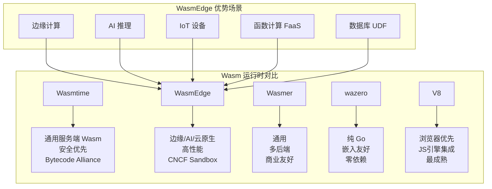
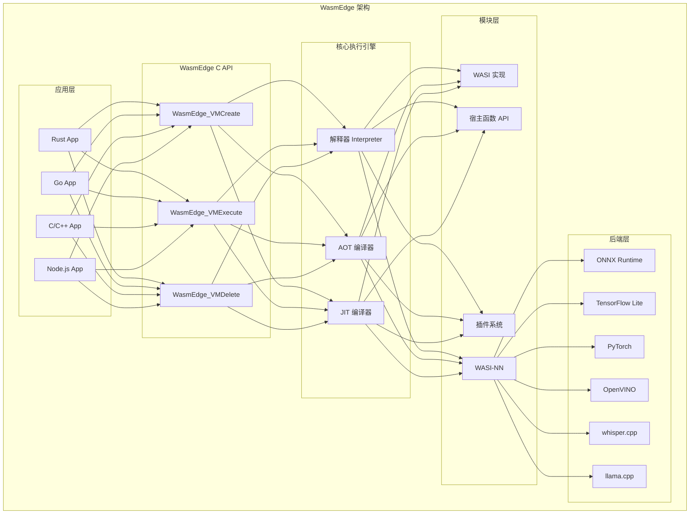
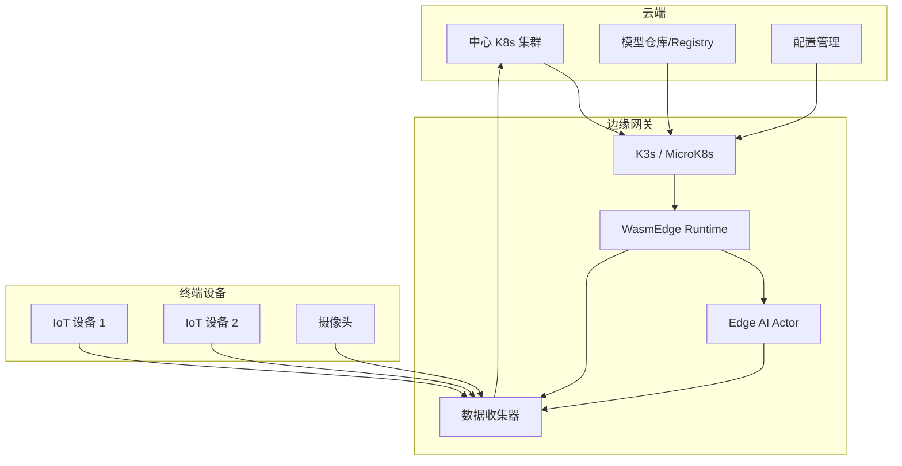
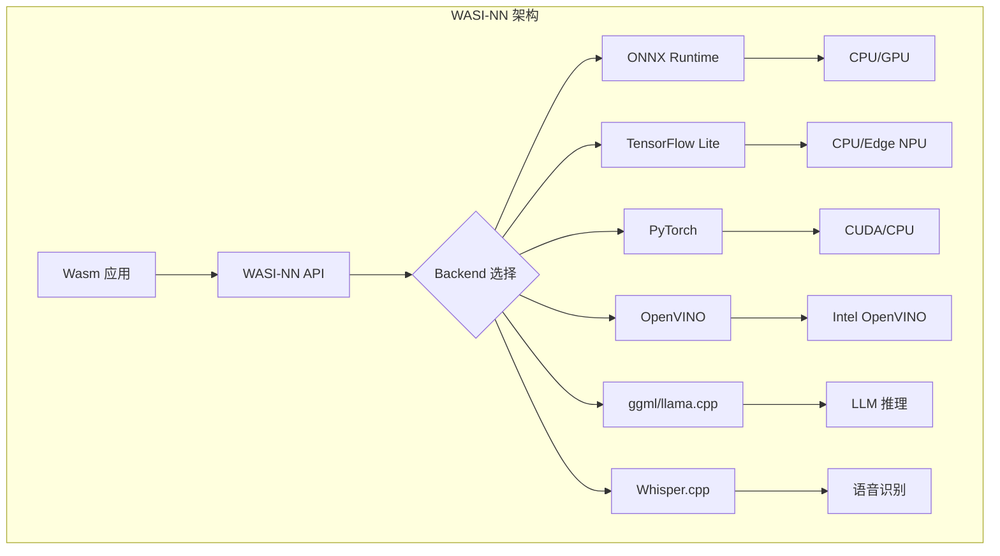

> **生产环境安全提示**
>
> 本文档包含可直接执行的运维命令。执行前请确认：当前目标集群与 Namespace 是否正确；是否具备足够的 RBAC 权限；是否已在非生产环境验证。命令风险等级标注：🔴 高风险（可能造成数据丢失或服务中断）、🟡 中风险（会修改集群状态，但通常可回滚）、🟢 低风险/只读（信息收集，无副作用）。


# [[WasmEdge|WasmEdge]] 运行时
# WasmEdge Runtime

<!-- chunk: 目录 / Table of Contents -->## 目录 / Table of Contents

1. [WasmEdge 概述](#1-wasmedge-概述)
2. [架构与核心组件](#2-架构与核心组件)
3. [WASI 支持与扩展](#3-wasi-支持与扩展)
4. [[entities/kubernetes.md|Kubernetes]] 集成](#4-kubernetes-集成)
5. [边缘部署](#5-边缘部署)
6. 网络插件](#6-网络插件)
7. [AI 推理支持](#7-ai-推理支持)
8. [ONNX 集成](#8-onnx-集成)
9. [TensorFlow Lite 集成](#9-tensorflow-lite-集成)
10. [LLM 推理](#10-llm-推理)
11. [性能优化](#11-性能优化)
12. [生产实践](#12-生产实践)

---

<!-- chunk: 1. WasmEdge 概述 -->## 1. WasmEdge 概述

## 1.1 什么是 WasmEdge / What is WasmEdge

WasmEdge 是一个轻量级、高性能、可扩展的 WebAssembly 运行时，专为云原生、边缘计算和分布式应用设计。它是 CNCF 的沙箱项目（2021年加入）：

```
# 🟢 低风险：只读/信息收集，通常无副作用
WasmEdge 核心特性

┌─────────────────────────────────────────────────────────────┐
│  高性能 (High Performance)                                   │
│  - AOT (Ahead-of-Time) 编译                                  │
│  - SIMD 支持                                                 │
│  - 接近原生速度                                              │
├─────────────────────────────────────────────────────────────┤
│  云原生集成 (Cloud-Native Integration)                       │
│  - containerd shim (WasmEdge-containerd)                    │
│  - Kubernetes RuntimeClass                                   │
│  - Docker Desktop 插件                                       │
├─────────────────────────────────────────────────────────────┤
│  AI/ML 推理 (AI/ML Inference)                                │
│  - WASI-NN 标准接口                                          │
│  - ONNX Runtime 后端                                         │
│  - TensorFlow Lite 后端                                      │
│  - PyTorch 后端                                              │
│  - OpenVINO 后端                                             │
├─────────────────────────────────────────────────────────────┤
│  网络能力 (Networking)                                        │
│  - WASI-Socket 支持                                          │
│  - HTTP/1.1 + HTTP/2                                         │
│  - 异步网络 (Tokio 风格)                                     │
├─────────────────────────────────────────────────────────────┤
│  扩展性 (Extensibility)                                       │
│  - 宿主函数 (Host Functions)                                 │
│  - 插件系统                                                  │
│  - 自定义 WASI 实现                                          │
└─────────────────────────────────────────────────────────────┘
```
## 1.2 WasmEdge vs 其他运行时 / Runtime Comparison



## 1.3 版本历史与路线图 / History & Roadmap

```
WasmEdge 版本历程

0.8.x (2021)  - 基础 WASI 支持，containerd 集成
0.9.x (2022)  - WASI-NN 初始支持，networking 增强
0.10.x (2022) - AOT 优化，SIMD 支持
0.11.x (2023) - WASI Preview 2 初始支持，LLM 推理
0.12.x (2023) - 组件模型支持，WasmEdge-LLMC
0.13.x (2024) - WASI 0.2 完整支持，GGUF 格式支持
0.14.x (2025) - 生产级 AI 推理，多模态支持

路线图 2025-2026:
- RISC-V 全面支持
- 分布式 AI 推理
- WebGPU 支持
- 更强的 JIT 优化
```

---

<!-- chunk: 2. 架构与核心组件 -->## 2. 架构与核心组件

## 2.1 整体架构 / Overall Architecture



## 2.2 核心 C API / Core C API

```c
// WasmEdge C API 使用示例
#include <wasmedge/wasmedge.h>
#include <stdio.h>

int main(int argc, char *argv[]) {
    // 初始化配置
    WasmEdge_ConfigureContext *ConfCxt = WasmEdge_ConfigureCreate();
    
    // 启用 WASI
    WasmEdge_ConfigureAddHostRegistration(
        ConfCxt,
        WasmEdge_HostRegistration_Wasi
    );
    
    // 启用 AOT 编译（提升性能）
    WasmEdge_ConfigureSetAOTCompilerOptimizationLevel(
        ConfCxt,
        WasmEdge_CompilerOptimizationLevel_O3
    );
    
    // 创建 VM
    WasmEdge_VMContext *VMCxt = WasmEdge_VMCreate(ConfCxt, NULL);
    
    // 创建 WASI 导入对象
    WasmEdge_ImportObjectContext *WasiObj = WasmEdge_ImportObjectCreateWASI(
        /* 命令行参数 */ (const char *[]){argv[0], "--test"}, 2,
        /* 环境变量 */ (const char *[]){"LOG_LEVEL=debug"}, 1,
        /* 预打开目录 */ (const char *[]){"."}, 1
    );
    
    // 注册 WASI
    WasmEdge_VMRegisterModuleFromImport(VMCxt, WasiObj);
    
    // 加载并执行 Wasm 模块
    WasmEdge_String ModName = WasmEdge_StringCreateByCString("app");
    WasmEdge_Result Res = WasmEdge_VMRunWasmFromFile(
        VMCxt,
        "app.wasm",
        WasmEdge_StringCreateByCString("_start"),
        NULL, 0,  // 参数
        NULL, 0   // 返回值
    );
    
    if (!WasmEdge_ResultOK(Res)) {
        printf("执行失败: %s\n", WasmEdge_ResultGetMessage(Res));
    }
    
    // 清理
    WasmEdge_ImportObjectDelete(WasiObj);
    WasmEdge_VMDelete(VMCxt);
    WasmEdge_ConfigureDelete(ConfCxt);
    
    return 0;
}
```

## 2.3 Rust 绑定 / Rust Bindings

```rust
// Cargo.toml
[dependencies]
wasmedge-sdk = "0.14"

[features]
default = ["aot"]
aot = ["wasmedge-sdk/aot"]
```

```rust
// WasmEdge Rust SDK 使用示例
use wasmedge_sdk::{
    config::{CommonConfigOptions, ConfigBuilder, HostRegistrationConfigOptions},
    params, Vm, WasmVal,
};
use std::collections::HashMap;

fn main() -> Result<(), Box<dyn std::error::Error>> {
    // 配置 WasmEdge VM
    let config = ConfigBuilder::new(CommonConfigOptions::default())
        .with_host_registration_config(
            HostRegistrationConfigOptions::default().wasi(true)
        )
        .build()?;
    
    // 创建 VM
    let vm = Vm::new(Some(config))?;
    
    // 配置 WASI
    let mut wasi_module = vm.wasi_module_mut()?;
    wasi_module.initialize(
        Some(vec!["app", "--verbose"]),   // 命令行参数
        Some(vec![("LOG_LEVEL", "info")]), // 环境变量
        Some(vec![(".", ".")]),            // 预打开目录: (宿主路径, 客户路径)
    );
    
    // 从文件加载 Wasm 模块
    let vm = vm.register_module_from_file("app", "app.wasm")?;
    
    // 调用导出函数
    let result = vm.run_func(
        Some("app"),  // 模块名
        "add",        // 函数名
        params!(42i32, 58i32),  // 参数
    )?;
    
    println!("结果: {:?}", result);
    
    Ok(())
}
```

## 2.4 Go 绑定 / Go Bindings

```go
// go.mod
// require github.com/second-state/WasmEdge-go v0.14.0

package main

import (
    "fmt"
    "os"
    
    wasmedge "github.com/second-state/WasmEdge-go/wasmedge"
)

func main() {
    // 初始化配置
    conf := wasmedge.NewConfigure(wasmedge.WASI)
    defer conf.Release()
    
    // 创建 VM
    vm := wasmedge.NewVMWithConfig(conf)
    defer vm.Release()
    
    // 配置 WASI
    var wasi = vm.GetImportModule(wasmedge.WASI)
    wasi.InitWasi(
        os.Args[1:],                        // 命令行参数
        os.Environ(),                       // 环境变量
        []string{".:."})                    // 目录映射
    
    // 加载并验证 Wasm 模块
    err := vm.LoadWasmFile("app.wasm")
    if err != nil {
        fmt.Printf("加载失败: %v\n", err)
        return
    }
    
    err = vm.Validate()
    if err != nil {
        fmt.Printf("验证失败: %v\n", err)
        return
    }
    
    // 实例化
    err = vm.Instantiate()
    if err != nil {
        fmt.Printf("实例化失败: %v\n", err)
        return
    }
    
    // 调用函数
    result, err := vm.Execute("fibonacci", int32(30))
    if err != nil {
        fmt.Printf("执行失败: %v\n", err)
        return
    }
    
    fmt.Printf("fibonacci(30) = %v\n", result[0])
    
    // 宿主函数注册
    mod := wasmedge.NewModule("host")
    defer mod.Release()
    
    // 注册日志函数
    logFunc := wasmedge.NewFunction(
        wasmedge.NewFunctionType(
            []wasmedge.ValType{wasmedge.ValType_I32, wasmedge.ValType_I32}, // ptr, len
            []wasmedge.ValType{},
        ),
        func(callFrame *wasmedge.CallingFrame, params []interface{}) ([]interface{}, wasmedge.Result) {
            ptr := params[0].(int32)
            length := params[1].(int32)
            
            // 从 Wasm 内存读取字符串
            mem := callFrame.GetMemoryByIndex(0)
            data, _ := mem.GetData(uint(ptr), uint(length))
            fmt.Printf("[Wasm 日志] %s\n", string(data))
            
            return nil, wasmedge.Result_Success
        },
        nil,
    )
    mod.AddFunction("log", logFunc)
    
    vm.RegisterModule(mod)
}
```

---

<!-- chunk: 3. WASI 支持与扩展 -->## 3. WASI 支持与扩展

## 3.1 WASI 实现概述 / WASI Implementation

```mermaid
graph LR
    subgraph "WasmEdge WASI 支持"
        A[wasi_snapshot_preview1] --> B[文件系统]
        A --> C[随机数]
        A --> D[时钟/时间]
        A --> E[环境变量]
        A --> F[参数]
        A --> G[进程退出]
        A --> H[套接字 socket]
        
        I[wasi:http@0.2.0] --> J[HTTP 客户端]
        I --> K[HTTP 服务器]
        
        L[wasi:nn@0.1.0] --> M[神经网络推理]
        
        N[wasi:crypto@0.2.1] --> O[加密操作]
        N --> P[哈希]
        N --> Q[HMAC]
        N --> R[签名]
    end
```

## 3.2 WASI Socket 扩展 / WASI Socket

```rust
// WasmEdge 异步网络 - HTTP 服务器
use wasmedge_http_req::request;
use std::io::Write;

fn main() {
    // 发起 HTTP 请求（WasmEdge 网络扩展）
    let uri = "https://httpbin.org/json".parse().unwrap();
    
    let mut body = Vec::new();
    let res = request::get(uri, &mut body).unwrap();
    
    println!("状态: {}", res.status_code());
    println!("响应: {}", String::from_utf8_lossy(&body));
}
```

```rust
// WasmEdge 异步 HTTP 服务器（使用 tokio）
use hyper::service::{make_service_fn, service_fn};
use hyper::{Body, Request, Response, Server};
use std::convert::Infallible;
use std::net::SocketAddr;

async fn handle_request(req: Request<Body>) -> Result<Response<Body>, Infallible> {
    let path = req.uri().path().to_string();
    
    match path.as_str() {
        "/health" => Ok(Response::builder()
            .status(200)
            .body(Body::from(r#"{"status":"healthy"}"#))
            .unwrap()),
        "/echo" => {
            let body_bytes = hyper::body::to_bytes(req.into_body()).await.unwrap();
            Ok(Response::new(Body::from(body_bytes)))
        }
        _ => Ok(Response::builder()
            .status(404)
            .body(Body::from("Not Found"))
            .unwrap()),
    }
}

#[tokio::main(flavor = "current_thread")]
async fn main() {
    let addr = SocketAddr::from(([0, 0, 0, 0], 8080));
    
    let make_svc = make_service_fn(|_| async {
        Ok::<_, Infallible>(service_fn(handle_request))
    });
    
    let server = Server::bind(&addr).serve(make_svc);
    
    println!("WasmEdge HTTP 服务器监听在: {}", addr);
    
    if let Err(e) = server.await {
        eprintln!("服务器错误: {}", e);
    }
}
```

## 3.3 WASI Crypto 扩展 / Crypto Extension

```rust
// WasmEdge WASI-Crypto 使用示例
use wasi_crypto::*;

fn sign_and_verify(message: &[u8]) -> Result<(), String> {
    // 生成 Ed25519 密钥对
    let key_pair = keypair_generate(
        AlgorithmType::Signatures,
        "Ed25519",
        None,
    ).map_err(|e| format!("生成密钥对失败: {:?}", e))?;
    
    // 签名
    let sig_state = signature_state_open(key_pair)
        .map_err(|e| format!("打开签名状态失败: {:?}", e))?;
    
    signature_state_update(sig_state, message)
        .map_err(|e| format!("更新签名失败: {:?}", e))?;
    
    let signature = signature_state_sign(sig_state)
        .map_err(|e| format!("签名失败: {:?}", e))?;
    
    // 获取公钥
    let public_key = keypair_publickey(key_pair)
        .map_err(|e| format!("获取公钥失败: {:?}", e))?;
    
    // 验证
    let verification_state = signature_verification_state_open(public_key)
        .map_err(|e| format!("打开验证状态失败: {:?}", e))?;
    
    signature_verification_state_update(verification_state, message)
        .map_err(|e| format!("更新验证状态失败: {:?}", e))?;
    
    signature_verification_state_verify(verification_state, signature)
        .map_err(|e| format!("验证失败: {:?}", e))?;
    
    println!("签名验证成功！");
    
    // 清理
    signatures_close(signature).ok();
    publickey_close(public_key).ok();
    keypair_close(key_pair).ok();
    
    Ok(())
}

fn hash_data(data: &[u8]) -> Vec<u8> {
    // SHA-256 哈希
    let state = hash_open("SHA-256")
        .expect("打开哈希状态失败");
    
    hash_update(state, data)
        .expect("更新哈希失败");
    
    let digest = hash_digest(state)
        .expect("获取摘要失败");
    
    let mut result = vec![0u8; 32];
    array_output_pull(digest, &mut result)
        .expect("获取输出失败");
    
    result
}
```

---

<!-- chunk: 4. Kubernetes 集成 -->## 4. Kubernetes 集成

## 4.1 WasmEdge containerd shim / containerd Integration

```bash
# 安装 WasmEdge containerd shim
# 方法 1: 使用官方安装脚本

WASMEDGE_VERSION="0.14.0"
CONTAINERD_WASM_VERSION="0.5.0"

# 安装 WasmEdge 运行时
curl -sSf https://raw.githubusercontent.com/WasmEdge/WasmEdge/master/utils/install.sh | \
  bash -s -- \
  --version="${WASMEDGE_VERSION}" \
  --tf-version="${WASMEDGE_VERSION}" \  # TensorFlow 插件
  --image-classification-extension      # 图像分类扩展

# 设置环境变量
export LD_LIBRARY_PATH="/root/.wasmedge/lib:$LD_LIBRARY_PATH"

# 安装 containerd-shim-wasmedge
wget "https://github.com/containerd/runwasi/releases/download/v${CONTAINERD_WASM_VERSION}/containerd-shim-wasmedge-$(uname -m).tar.gz"
tar -xzf "containerd-shim-wasmedge-$(uname -m).tar.gz"
sudo install -m 755 containerd-shim-wasmedge-v1 /usr/local/bin/

# 验证安装
/usr/local/bin/containerd-shim-wasmedge-v1 --version
wasmedge --version
```

```toml
# /etc/containerd/config.toml - 添加 WasmEdge 运行时
version = 2

[plugins."io.containerd.grpc.v1.cri".containerd.runtimes]
  # 标准 runc
  [plugins."io.containerd.grpc.v1.cri".containerd.runtimes.runc]
    runtime_type = "io.containerd.runc.v2"
  
  # WasmEdge 运行时
  [plugins."io.containerd.grpc.v1.cri".containerd.runtimes.wasmedge]
    runtime_type = "io.containerd.wasmedge.v1"
    runtime_path = "/usr/local/bin/containerd-shim-wasmedge-v1"
    
  # WasmEdge AI 运行时（带 AI 插件）
  [plugins."io.containerd.grpc.v1.cri".containerd.runtimes.wasmedge-ai]
    runtime_type = "io.containerd.wasmedge.v1"
    runtime_path = "/usr/local/bin/containerd-shim-wasmedge-v1"
    [plugins."io.containerd.grpc.v1.cri".containerd.runtimes.wasmedge-ai.options]
      # 启用 WASI-NN 插件
      WasmEdgePluginDir = "/root/.wasmedge/plugin"
```

## 4.2 RuntimeClass 配置 / RuntimeClass Configuration

```yaml
# WasmEdge RuntimeClass
apiVersion: node.k8s.io/v1
kind: RuntimeClass
metadata:
  name: wasmedge
handler: wasmedge
scheduling:
  nodeClassification:
    tolerations:
    - key: "wasmedge.io/enabled"
      operator: "Exists"
      effect: "NoSchedule"
    nodeSelector:
      matchLabels:
        wasmedge.io/enabled: "true"
overhead:
  podFixed:
    memory: "8Mi"
    cpu: "10m"

---
# WasmEdge AI RuntimeClass（带 GPU 加速）
apiVersion: node.k8s.io/v1
kind: RuntimeClass
metadata:
  name: wasmedge-ai
handler: wasmedge-ai
scheduling:
  nodeClassification:
    tolerations:
    - key: "wasmedge.io/ai"
      operator: "Exists"
      effect: "NoSchedule"
    nodeSelector:
      matchLabels:
        wasmedge.io/ai: "true"
        hardware.accelerator/type: gpu
overhead:
  podFixed:
    memory: "256Mi"
    cpu: "500m"
```

## 4.3 Kubernetes 部署示例 / Kubernetes Deployment

```yaml
# WasmEdge HTTP 服务 Deployment
apiVersion: apps/v1
kind: Deployment
metadata:
  name: wasmedge-http-service
  namespace: production
  labels:
    app: wasmedge-http
    runtime: wasmedge
spec:
  replicas: 5
  selector:
    matchLabels:
      app: wasmedge-http
  template:
    metadata:
      labels:
        app: wasmedge-http
      annotations:
        module.wasm.image/variant: compat-smart
    spec:
      runtimeClassName: wasmedge
      
      containers:
      - name: http-service
        image: ghcr.io/myorg/wasmedge-http:latest
        ports:
        - containerPort: 8080
          name: http
        env:
        - name: WASMEDGE_PLUGIN_PATH
          value: "/root/.wasmedge/plugin"
        - name: LISTEN_ADDR
          value: "0.0.0.0:8080"
        resources:
          requests:
            memory: "16Mi"
            cpu: "50m"
          limits:
            memory: "64Mi"
            cpu: "200m"
        livenessProbe:
          httpGet:
            path: /health
            port: 8080
          initialDelaySeconds: 2
          periodSeconds: 10
        readinessProbe:
          httpGet:
            path: /ready
            port: 8080
          initialDelaySeconds: 1
          periodSeconds: 5
      
      affinity:
        nodeAffinity:
          requiredDuringSchedulingIgnoredDuringExecution:
            nodeSelectorTerms:
            - matchExpressions:
              - key: wasmedge.io/enabled
                operator: Exists

---
# WasmEdge AI 推理服务
apiVersion: apps/v1
kind: Deployment
metadata:
  name: wasmedge-ai-inference
  namespace: production
spec:
  replicas: 2
  selector:
    matchLabels:
      app: wasmedge-ai
  template:
    metadata:
      labels:
        app: wasmedge-ai
    spec:
      runtimeClassName: wasmedge-ai
      
      containers:
      - name: ai-service
        image: ghcr.io/myorg/wasmedge-image-classifier:latest
        ports:
        - containerPort: 8090
        env:
        - name: MODEL_PATH
          value: "/models/mobilenet_v2.onnx"
        - name: WASI_NN_BACKEND
          value: "ONNX"
        resources:
          requests:
            memory: "512Mi"
            cpu: "500m"
          limits:
            memory: "2Gi"
            cpu: "2"
            # GPU 资源（如果有）
            # nvidia.com/gpu: "1"
        
        volumeMounts:
        - name: models
          mountPath: /models
          readOnly: true
      
      volumes:
      - name: models
        persistentVolumeClaim:
          claimName: ai-models-pvc
      
      nodeSelector:
        wasmedge.io/ai: "true"
```

---

<!-- chunk: 5. 边缘部署 -->## 5. 边缘部署

## 5.1 边缘架构 / Edge Architecture



## 5.2 边缘节点安装 / Edge Node Installation

```bash
# 在 ARM64 边缘设备上安装 WasmEdge

# 方法 1: 使用官方安装脚本（ARM64）
curl -sSf https://raw.githubusercontent.com/WasmEdge/WasmEdge/master/utils/install.sh | \
  bash -s -- \
  --platform=manylinux2014_aarch64 \
  --version=0.14.0

# 方法 2: 手动下载
ARCH="aarch64"
VERSION="0.14.0"

wget "https://github.com/WasmEdge/WasmEdge/releases/download/${VERSION}/WasmEdge-${VERSION}-manylinux2014_${ARCH}.tar.gz"
tar -xzf "WasmEdge-${VERSION}-manylinux2014_${ARCH}.tar.gz"
sudo cp -r WasmEdge-${VERSION}-Linux/* /usr/local/

# 安装 WASI-NN 插件（用于边缘 AI）
wget "https://github.com/WasmEdge/WasmEdge/releases/download/${VERSION}/WasmEdge-plugin-wasi_nn-ggml-${VERSION}-manylinux2014_${ARCH}.tar.gz"
tar -xzf "WasmEdge-plugin-wasi_nn-ggml-${VERSION}-manylinux2014_${ARCH}.tar.gz"
sudo mkdir -p /usr/local/lib/wasmedge/
sudo cp libwasmedgePluginWasiNN.so /usr/local/lib/wasmedge/

# 验证
wasmedge --version
wasmedge --dir .:. hello.wasm

# 安装 K3s（轻量 Kubernetes）
curl -sfL https://get.k3s.io | \
  INSTALL_K3S_EXEC="--container-runtime-endpoint /run/containerd/containerd.sock" \
  sh -
```

## 5.3 边缘 Wasm 应用示例 / Edge Wasm App

```rust
// 边缘传感器数据处理 Wasm 应用
use serde::{Deserialize, Serialize};
use std::collections::VecDeque;

#[derive(Debug, Deserialize, Serialize, Clone)]
struct SensorReading {
    sensor_id: String,
    timestamp: u64,
    temperature: f32,
    humidity: f32,
    pressure: f32,
    vibration: f32,
}

#[derive(Debug, Serialize)]
struct ProcessedData {
    sensor_id: String,
    window_avg_temp: f32,
    window_avg_humidity: f32,
    anomaly_detected: bool,
    anomaly_type: Option<String>,
    alert_level: AlertLevel,
}

#[derive(Debug, Serialize)]
enum AlertLevel {
    Normal,
    Warning,
    Critical,
}

struct SensorProcessor {
    window_size: usize,
    readings: VecDeque<SensorReading>,
    
    // 阈值配置
    temp_max: f32,
    temp_min: f32,
    humidity_max: f32,
    vibration_max: f32,
}

impl SensorProcessor {
    fn new(window_size: usize) -> Self {
        Self {
            window_size,
            readings: VecDeque::new(),
            temp_max: 85.0,
            temp_min: -20.0,
            humidity_max: 95.0,
            vibration_max: 10.0,
        }
    }
    
    fn process(&mut self, reading: SensorReading) -> ProcessedData {
        // 更新滑动窗口
        self.readings.push_back(reading.clone());
        if self.readings.len() > self.window_size {
            self.readings.pop_front();
        }
        
        // 计算窗口统计
        let avg_temp = self.readings.iter()
            .map(|r| r.temperature)
            .sum::<f32>() / self.readings.len() as f32;
        
        let avg_humidity = self.readings.iter()
            .map(|r| r.humidity)
            .sum::<f32>() / self.readings.len() as f32;
        
        // 异常检测
        let mut anomaly = false;
        let mut anomaly_type = None;
        let mut alert_level = AlertLevel::Normal;
        
        if reading.temperature > self.temp_max {
            anomaly = true;
            anomaly_type = Some(format!("高温: {}°C", reading.temperature));
            alert_level = AlertLevel::Critical;
        } else if reading.temperature < self.temp_min {
            anomaly = true;
            anomaly_type = Some(format!("低温: {}°C", reading.temperature));
            alert_level = AlertLevel::Warning;
        }
        
        if reading.humidity > self.humidity_max {
            anomaly = true;
            anomaly_type = Some(format!("湿度过高: {}%", reading.humidity));
            alert_level = AlertLevel::Warning;
        }
        
        if reading.vibration > self.vibration_max {
            anomaly = true;
            anomaly_type = Some(format!("振动过强: {}g", reading.vibration));
            alert_level = AlertLevel::Critical;
        }
        
        // Z-score 异常检测
        let temp_std = self.calc_std_dev(
            self.readings.iter().map(|r| r.temperature).collect()
        );
        let z_score = (reading.temperature - avg_temp).abs() / (temp_std + 0.001);
        if z_score > 3.0 {
            anomaly = true;
            anomaly_type = Some(format!("统计异常 (Z={:.2}): {}°C", z_score, reading.temperature));
            if matches!(alert_level, AlertLevel::Normal) {
                alert_level = AlertLevel::Warning;
            }
        }
        
        ProcessedData {
            sensor_id: reading.sensor_id,
            window_avg_temp: avg_temp,
            window_avg_humidity: avg_humidity,
            anomaly_detected: anomaly,
            anomaly_type,
            alert_level,
        }
    }
    
    fn calc_std_dev(&self, values: Vec<f32>) -> f32 {
        if values.is_empty() {
            return 0.0;
        }
        let mean = values.iter().sum::<f32>() / values.len() as f32;
        let variance = values.iter()
            .map(|v| (v - mean).powi(2))
            .sum::<f32>() / values.len() as f32;
        variance.sqrt()
    }
}

fn main() {
    let mut processor = SensorProcessor::new(100);  // 100 个读数的滑动窗口
    
    // 模拟传感器数据处理
    let readings = vec![
        SensorReading {
            sensor_id: "sensor-001".to_string(),
            timestamp: 1000,
            temperature: 72.5,
            humidity: 45.0,
            pressure: 1013.0,
            vibration: 0.5,
        },
        SensorReading {
            sensor_id: "sensor-001".to_string(),
            timestamp: 1001,
            temperature: 95.0,  // 温度异常
            humidity: 45.0,
            pressure: 1013.0,
            vibration: 0.5,
        },
    ];
    
    for reading in readings {
        let result = processor.process(reading);
        let json = serde_json::to_string_pretty(&result).unwrap();
        println!("{}", json);
        
        // 如果检测到严重异常，上报到云端（通过 WASI 网络）
        if matches!(result.alert_level, AlertLevel::Critical) {
            eprintln!("⚠️  严重告警: {:?}", result.anomaly_type);
        }
    }
}
```

---

<!-- chunk: 6. 网络插件 -->## 6. 网络插件

## 6.1 WasmEdge 网络能力 / Networking Capabilities

```
WasmEdge 网络插件层次

┌──────────────────────────────────────────────────────┐
│  应用层                                               │
│  Rust hyper / reqwest                                 │
│  Go net/http                                          │
├──────────────────────────────────────────────────────┤
│  异步运行时层                                         │
│  tokio-wasmedge / async-std-wasmedge                  │
├──────────────────────────────────────────────────────┤
│  WASI Socket 层                                       │
│  WASI Preview 2: wasi:sockets                        │
│  WasmEdge 扩展: wasmedge_wasi_socket                  │
├──────────────────────────────────────────────────────┤
│  OS 层                                               │
│  TCP/UDP Socket                                       │
│  TLS (通过 native-tls/rustls)                        │
└──────────────────────────────────────────────────────┘
```

## 6.2 异步 HTTP 服务器 / Async HTTP Server

```rust
// 使用 WasmEdge 异步运行时构建高性能 HTTP 服务器
use hyper::{Body, Request, Response, Server};
use hyper::service::{make_service_fn, service_fn};
use std::convert::Infallible;
use std::net::SocketAddr;
use std::sync::Arc;
use tokio::sync::RwLock;
use serde::{Deserialize, Serialize};

#[derive(Clone)]
struct AppState {
    request_count: Arc<RwLock<u64>>,
    cache: Arc<RwLock<std::collections::HashMap<String, String>>>,
}

async fn handle(
    state: AppState,
    req: Request<Body>,
) -> Result<Response<Body>, Infallible> {
    // 更新请求计数
    {
        let mut count = state.request_count.write().await;
        *count += 1;
    }
    
    let path = req.uri().path();
    let method = req.method();
    
    let response = match (method, path) {
        (&hyper::Method::GET, "/") => {
            let count = state.request_count.read().await;
            Response::new(Body::from(format!(
                "WasmEdge HTTP 服务器\n请求总数: {}",
                *count
            )))
        }
        
        (&hyper::Method::GET, "/cache") => {
            let key = req.uri().query()
                .and_then(|q| q.split('=').nth(1))
                .unwrap_or("");
            
            let cache = state.cache.read().await;
            match cache.get(key) {
                Some(val) => Response::new(Body::from(val.clone())),
                None => Response::builder()
                    .status(404)
                    .body(Body::from("缓存未命中"))
                    .unwrap(),
            }
        }
        
        (&hyper::Method::POST, "/cache") => {
            let body = hyper::body::to_bytes(req.into_body()).await.unwrap();
            
            #[derive(Deserialize)]
            struct CacheEntry {
                key: String,
                value: String,
            }
            
            if let Ok(entry) = serde_json::from_slice::<CacheEntry>(&body) {
                let mut cache = state.cache.write().await;
                cache.insert(entry.key.clone(), entry.value);
                
                Response::builder()
                    .status(201)
                    .body(Body::from(format!("已缓存: {}", entry.key)))
                    .unwrap()
            } else {
                Response::builder()
                    .status(400)
                    .body(Body::from("无效的请求体"))
                    .unwrap()
            }
        }
        
        (&hyper::Method::GET, "/metrics") => {
            let count = state.request_count.read().await;
            let cache = state.cache.read().await;
            
            let metrics = format!(
                "# HELP requests_total 总请求数\n\
                 # TYPE requests_total counter\n\
                 requests_total {}\n\
                 # HELP cache_entries 缓存条目数\n\
                 # TYPE cache_entries gauge\n\
                 cache_entries {}\n",
                *count,
                cache.len()
            );
            
            Response::builder()
                .header("Content-Type", "text/plain; version=0.0.4")
                .body(Body::from(metrics))
                .unwrap()
        }
        
        _ => Response::builder()
            .status(404)
            .body(Body::from("Not Found"))
            .unwrap(),
    };
    
    Ok(response)
}

#[tokio::main(flavor = "current_thread")]
async fn main() {
    let addr: SocketAddr = ([0, 0, 0, 0], 8080).into();
    
    let state = AppState {
        request_count: Arc::new(RwLock::new(0)),
        cache: Arc::new(RwLock::new(std::collections::HashMap::new())),
    };
    
    let make_svc = make_service_fn(move |_conn| {
        let state = state.clone();
        async move {
            Ok::<_, Infallible>(service_fn(move |req| {
                handle(state.clone(), req)
            }))
        }
    });
    
    let server = Server::bind(&addr).serve(make_svc);
    
    println!("WasmEdge 异步 HTTP 服务器运行在: http://{}", addr);
    
    server.await.expect("服务器错误");
}
```

---

<!-- chunk: 7. AI 推理支持 -->## 7. AI 推理支持

## 7.1 WASI-NN 标准 / WASI-NN Standard



```
WASI-NN 核心 API

// 加载模型
load: func(
    builder: list<graph-builder-array>,
    encoding: graph-encoding,
    target: execution-target
) -> result<graph, error>

// 初始化执行上下文
init-execution-context: func(graph: graph) -> result<graph-execution-context, error>

// 设置输入
set-input: func(
    ctx: graph-execution-context,
    index: u32,
    tensor: tensor
) -> result<_, error>

// 执行推理
compute: func(ctx: graph-execution-context) -> result<_, error>

// 获取输出
get-output: func(
    ctx: graph-execution-context,
    index: u32
) -> result<tensor, error>
```

## 7.2 图像分类完整示例 / Image Classification Example

```rust
// 使用 WasmEdge WASI-NN 进行图像分类
use wasi_nn::{
    ExecutionTarget, Graph, GraphEncoding, GraphExecutionContext, 
    TensorType,
};
use std::fs;
use std::io::Read;
use serde_json;

struct ImageClassifier {
    graph: Graph,
    labels: Vec<String>,
}

impl ImageClassifier {
    fn new(model_path: &str, labels_path: &str) -> Result<Self, String> {
        // 加载模型权重
        let model_weights = fs::read(model_path)
            .map_err(|e| format!("读取模型失败: {}", e))?;
        
        // 加载模型到 WASI-NN
        let graph = unsafe {
            wasi_nn::load(
                &[&model_weights],
                GraphEncoding::Onnx,
                ExecutionTarget::CPU,
            )
        }.map_err(|e| format!("加载图失败: {:?}", e))?;
        
        // 加载类别标签
        let labels_content = fs::read_to_string(labels_path)
            .map_err(|e| format!("读取标签失败: {}", e))?;
        
        let labels: Vec<String> = labels_content
            .lines()
            .map(|s| s.to_string())
            .collect();
        
        Ok(Self { graph, labels })
    }
    
    fn preprocess_image(&self, image_data: &[u8], width: u32, height: u32) -> Vec<f32> {
        // 将图像数据转换为模型输入格式
        // 假设输入格式: [batch, channels, height, width] = [1, 3, H, W]
        // 像素值归一化到 [0, 1]，然后标准化
        
        let mean = [0.485f32, 0.456, 0.406];  // ImageNet 均值
        let std = [0.229f32, 0.224, 0.225];    // ImageNet 标准差
        
        let size = (width * height) as usize;
        let mut tensor = vec![0f32; 3 * size];
        
        for i in 0..size {
            let r = image_data[i * 4] as f32 / 255.0;
            let g = image_data[i * 4 + 1] as f32 / 255.0;
            let b = image_data[i * 4 + 2] as f32 / 255.0;
            
            tensor[i] = (r - mean[0]) / std[0];
            tensor[size + i] = (g - mean[1]) / std[1];
            tensor[2 * size + i] = (b - mean[2]) / std[2];
        }
        
        tensor
    }
    
    fn classify(&self, image_data: &[u8], width: u32, height: u32) 
        -> Result<Vec<(String, f32)>, String> 
    {
        // 创建执行上下文
        let ctx = unsafe {
            wasi_nn::init_execution_context(self.graph)
        }.map_err(|e| format!("初始化上下文失败: {:?}", e))?;
        
        // 预处理图像
        let input = self.preprocess_image(image_data, width, height);
        
        // 设置输入张量
        unsafe {
            wasi_nn::set_input(
                ctx,
                0,
                wasi_nn::Tensor {
                    dimensions: &[1, 3, height, width],
                    r#type: TensorType::F32,
                    data: bytemuck::cast_slice(&input),
                },
            )
        }.map_err(|e| format!("设置输入失败: {:?}", e))?;
        
        // 执行推理
        unsafe {
            wasi_nn::compute(ctx)
        }.map_err(|e| format!("推理失败: {:?}", e))?;
        
        // 获取输出
        let mut output = vec![0f32; 1000];  // ImageNet 1000 类
        unsafe {
            wasi_nn::get_output(
                ctx,
                0,
                &mut output as *mut _ as *mut u8,
                (output.len() * 4) as u32,
            )
        }.map_err(|e| format!("获取输出失败: {:?}", e))?;
        
        // Softmax
        let max = output.iter().cloned().fold(f32::NEG_INFINITY, f32::max);
        let exp: Vec<f32> = output.iter().map(|&x| (x - max).exp()).collect();
        let sum: f32 = exp.iter().sum();
        let probs: Vec<f32> = exp.iter().map(|&x| x / sum).collect();
        
        // 获取 Top-5 结果
        let mut indexed_probs: Vec<(usize, f32)> = probs.iter()
            .enumerate()
            .map(|(i, &p)| (i, p))
            .collect();
        
        indexed_probs.sort_by(|a, b| b.1.partial_cmp(&a.1).unwrap());
        
        let results: Vec<(String, f32)> = indexed_probs[..5]
            .iter()
            .map(|(idx, prob)| {
                let label = self.labels.get(*idx)
                    .cloned()
                    .unwrap_or_else(|| format!("class_{}", idx));
                (label, *prob)
            })
            .collect();
        
        Ok(results)
    }
}

fn main() {
    // 初始化分类器
    let classifier = ImageClassifier::new(
        "/models/mobilenet_v2.onnx",
        "/models/imagenet_labels.txt",
    ).expect("初始化分类器失败");
    
    // 处理 HTTP 请求
    use hyper::{Body, Request, Response, Server};
    // ... HTTP 服务器代码
    println!("图像分类服务启动");
}
```

---

<!-- chunk: 8. ONNX 集成 -->## 8. ONNX 集成

## 8.1 ONNX 模型准备 / ONNX Model Preparation

```python
# Python: 将 PyTorch 模型导出为 ONNX
import torch
import torchvision.models as models
import torch.onnx

# 加载预训练模型
model = models.resnet50(pretrained=True)
model.eval()

# 示例输入
dummy_input = torch.randn(1, 3, 224, 224)

# 导出为 ONNX
torch.onnx.export(
    model,
    dummy_input,
    "resnet50.onnx",
    export_params=True,
    opset_version=17,
    input_names=['input'],
    output_names=['output'],
    dynamic_axes={
        'input': {0: 'batch_size'},
        'output': {0: 'batch_size'}
    }
)

print("模型已导出为 resnet50.onnx")

# 验证 ONNX 模型
import onnx
model_onnx = onnx.load("resnet50.onnx")
onnx.checker.check_model(model_onnx)
print("ONNX 模型验证通过")
```

```bash
# 优化 ONNX 模型（减小大小，提升性能）
pip install onnxoptimizer onnxruntime

python3 << 'EOF'
import onnxoptimizer
import onnx

# 加载
model = onnx.load("resnet50.onnx")

# 优化
passes = [
    "eliminate_identity",
    "eliminate_nop_dropout",
    "fuse_add_bias_into_conv",
    "fuse_bn_into_conv",
    "fuse_consecutive_squeezes",
    "fuse_consecutive_transposes",
    "fuse_matmul_add_bias_into_gemm",
    "fuse_pad_into_conv",
    "fuse_transpose_into_gemm",
]

optimized_model = onnxoptimizer.optimize(model, passes)
onnx.save(optimized_model, "resnet50_optimized.onnx")
print("优化后模型大小:", 
      sum(1 for _ in optimized_model.graph.node), "个算子节点")
EOF
```

## 8.2 Rust ONNX 推理 / Rust ONNX Inference

```rust
// Rust ONNX 推理（使用 WasmEdge WASI-NN ONNX 后端）
use wasi_nn::{ExecutionTarget, GraphEncoding, TensorType};
use std::fs;

const MODEL_PATH: &str = "/models/resnet50_optimized.onnx";
const INPUT_SIZE: usize = 1 * 3 * 224 * 224;  // batch * channels * H * W
const OUTPUT_SIZE: usize = 1000;  // ImageNet 类别数

fn run_onnx_inference(input_data: &[f32]) -> Result<Vec<f32>, String> {
    // 读取模型
    let model = fs::read(MODEL_PATH)
        .map_err(|e| format!("读取模型失败: {}", e))?;
    
    // 加载图
    let graph = unsafe {
        wasi_nn::load(
            &[model.as_slice()],
            GraphEncoding::Onnx,
            ExecutionTarget::CPU,
        )
    }.map_err(|e| format!("加载图失败: {:?}", e))?;
    
    // 初始化执行上下文
    let ctx = unsafe {
        wasi_nn::init_execution_context(graph)
    }.map_err(|e| format!("初始化失败: {:?}", e))?;
    
    // 设置输入
    let input_bytes: &[u8] = bytemuck::cast_slice(input_data);
    unsafe {
        wasi_nn::set_input(
            ctx,
            0,
            wasi_nn::Tensor {
                dimensions: &[1u32, 3, 224, 224],
                r#type: TensorType::F32,
                data: input_bytes,
            },
        )
    }.map_err(|e| format!("设置输入失败: {:?}", e))?;
    
    // 推理
    unsafe {
        wasi_nn::compute(ctx)
    }.map_err(|e| format!("推理失败: {:?}", e))?;
    
    // 获取输出
    let mut output = vec![0f32; OUTPUT_SIZE];
    unsafe {
        wasi_nn::get_output(
            ctx,
            0,
            output.as_mut_ptr() as *mut u8,
            (OUTPUT_SIZE * 4) as u32,
        )
    }.map_err(|e| format!("获取输出失败: {:?}", e))?;
    
    Ok(output)
}

// 批量推理
fn batch_inference(images: Vec<Vec<f32>>) -> Vec<Vec<f32>> {
    images.iter()
        .map(|img| {
            run_onnx_inference(img)
                .unwrap_or_else(|e| {
                    eprintln!("推理失败: {}", e);
                    vec![0.0f32; OUTPUT_SIZE]
                })
        })
        .collect()
}
```

---

<!-- chunk: 9. TensorFlow Lite 集成 -->## 9. TensorFlow Lite 集成

## 9.1 TFLite 模型推理 / TFLite Inference

```rust
// TensorFlow Lite 推理（WasmEdge TFLite 后端）
use wasi_nn::{ExecutionTarget, GraphEncoding, TensorType};
use std::fs;

struct TFLiteClassifier {
    graph: wasi_nn::Graph,
    input_width: u32,
    input_height: u32,
    num_classes: usize,
}

impl TFLiteClassifier {
    fn new(model_path: &str, width: u32, height: u32, classes: usize) 
        -> Result<Self, String> 
    {
        let model_bytes = fs::read(model_path)
            .map_err(|e| format!("读取 TFLite 模型失败: {}", e))?;
        
        // 加载 TensorFlow Lite 模型
        let graph = unsafe {
            wasi_nn::load(
                &[model_bytes.as_slice()],
                GraphEncoding::TfLite,  // TFLite 格式
                ExecutionTarget::CPU,
            )
        }.map_err(|e| format!("加载 TFLite 图失败: {:?}", e))?;
        
        Ok(Self {
            graph,
            input_width: width,
            input_height: height,
            num_classes: classes,
        })
    }
    
    fn predict(&self, input: &[u8]) -> Result<Vec<(usize, f32)>, String> {
        let ctx = unsafe {
            wasi_nn::init_execution_context(self.graph)
        }.map_err(|e| format!("初始化上下文失败: {:?}", e))?;
        
        // TFLite MobileNet 输入格式: [1, H, W, 3] (NHWC)
        // 像素值范围: [0, 255] 或 [-1, 1]
        
        // 归一化处理
        let normalized: Vec<f32> = input.iter()
            .map(|&p| (p as f32 - 127.5) / 127.5)  // 归一化到 [-1, 1]
            .collect();
        
        let input_bytes: &[u8] = bytemuck::cast_slice(&normalized);
        
        unsafe {
            wasi_nn::set_input(
                ctx,
                0,
                wasi_nn::Tensor {
                    dimensions: &[1, self.input_height, self.input_width, 3],
                    r#type: TensorType::F32,
                    data: input_bytes,
                },
            )
        }.map_err(|e| format!("设置输入失败: {:?}", e))?;
        
        // 推理
        unsafe {
            wasi_nn::compute(ctx)
        }.map_err(|e| format!("推理失败: {:?}", e))?;
        
        // 获取输出概率
        let mut output = vec![0f32; self.num_classes];
        unsafe {
            wasi_nn::get_output(
                ctx,
                0,
                output.as_mut_ptr() as *mut u8,
                (self.num_classes * 4) as u32,
            )
        }.map_err(|e| format!("获取输出失败: {:?}", e))?;
        
        // 排序并返回 Top-5
        let mut scored: Vec<(usize, f32)> = output.iter()
            .enumerate()
            .map(|(i, &s)| (i, s))
            .collect();
        
        scored.sort_by(|a, b| b.1.partial_cmp(&a.1).unwrap());
        scored.truncate(5);
        
        Ok(scored)
    }
}
```

## 9.2 目标检测 / Object Detection

```rust
// YOLO 目标检测（使用 TFLite）
struct YoloDetector {
    graph: wasi_nn::Graph,
    confidence_threshold: f32,
    nms_threshold: f32,
}

#[derive(Debug, Clone)]
struct Detection {
    class_id: usize,
    class_name: String,
    confidence: f32,
    bbox: [f32; 4],  // [x1, y1, x2, y2] 归一化坐标
}

impl YoloDetector {
    fn detect(&self, image: &[f32], width: u32, height: u32) 
        -> Result<Vec<Detection>, String> 
    {
        let ctx = unsafe {
            wasi_nn::init_execution_context(self.graph)
        }.map_err(|e| format!("初始化失败: {:?}", e))?;
        
        let input_bytes: &[u8] = bytemuck::cast_slice(image);
        unsafe {
            wasi_nn::set_input(
                ctx,
                0,
                wasi_nn::Tensor {
                    dimensions: &[1, height, width, 3],
                    r#type: TensorType::F32,
                    data: input_bytes,
                },
            )
        }.map_err(|e| format!("设置输入失败: {:?}", e))?;
        
        unsafe {
            wasi_nn::compute(ctx)
        }.map_err(|e| format!("推理失败: {:?}", e))?;
        
        // YOLO 输出格式处理
        // 输出: [batch, num_boxes, 5 + num_classes]
        // 每个框: [x_center, y_center, width, height, confidence, class_probs...]
        
        let num_boxes = 2535usize;  // YOLOv5s 输出框数
        let num_classes = 80usize;  // COCO 数据集
        let output_size = num_boxes * (5 + num_classes);
        
        let mut raw_output = vec![0f32; output_size];
        unsafe {
            wasi_nn::get_output(
                ctx,
                0,
                raw_output.as_mut_ptr() as *mut u8,
                (output_size * 4) as u32,
            )
        }.map_err(|e| format!("获取输出失败: {:?}", e))?;
        
        // 解析检测结果
        let mut detections = Vec::new();
        
        for i in 0..num_boxes {
            let offset = i * (5 + num_classes);
            let confidence = raw_output[offset + 4];
            
            if confidence < self.confidence_threshold {
                continue;
            }
            
            let x_center = raw_output[offset];
            let y_center = raw_output[offset + 1];
            let box_width = raw_output[offset + 2];
            let box_height = raw_output[offset + 3];
            
            // 找到最大类别概率
            let (class_id, class_prob) = raw_output[offset + 5..offset + 5 + num_classes]
                .iter()
                .enumerate()
                .max_by(|a, b| a.1.partial_cmp(b.1).unwrap())
                .map(|(i, &p)| (i, p))
                .unwrap_or((0, 0.0));
            
            let final_confidence = confidence * class_prob;
            
            if final_confidence >= self.confidence_threshold {
                detections.push(Detection {
                    class_id,
                    class_name: format!("class_{}", class_id),
                    confidence: final_confidence,
                    bbox: [
                        x_center - box_width / 2.0,  // x1
                        y_center - box_height / 2.0, // y1
                        x_center + box_width / 2.0,  // x2
                        y_center + box_height / 2.0, // y2
                    ],
                });
            }
        }
        
        // NMS（非极大值抑制）
        let final_detections = self.apply_nms(detections);
        
        Ok(final_detections)
    }
    
    fn apply_nms(&self, mut detections: Vec<Detection>) -> Vec<Detection> {
        // 按置信度排序
        detections.sort_by(|a, b| b.confidence.partial_cmp(&a.confidence).unwrap());
        
        let mut result = Vec::new();
        let mut suppressed = vec![false; detections.len()];
        
        for i in 0..detections.len() {
            if suppressed[i] { continue; }
            result.push(detections[i].clone());
            
            for j in (i + 1)..detections.len() {
                if suppressed[j] { continue; }
                if detections[i].class_id != detections[j].class_id { continue; }
                
                let iou = self.calc_iou(&detections[i].bbox, &detections[j].bbox);
                if iou > self.nms_threshold {
                    suppressed[j] = true;
                }
            }
        }
        
        result
    }
    
    fn calc_iou(&self, bbox1: &[f32; 4], bbox2: &[f32; 4]) -> f32 {
        let x1 = bbox1[0].max(bbox2[0]);
        let y1 = bbox1[1].max(bbox2[1]);
        let x2 = bbox1[2].min(bbox2[2]);
        let y2 = bbox1[3].min(bbox2[3]);
        
        if x2 <= x1 || y2 <= y1 {
            return 0.0;
        }
        
        let intersection = (x2 - x1) * (y2 - y1);
        let area1 = (bbox1[2] - bbox1[0]) * (bbox1[3] - bbox1[1]);
        let area2 = (bbox2[2] - bbox2[0]) * (bbox2[3] - bbox2[1]);
        let union = area1 + area2 - intersection;
        
        intersection / union
    }
}
```

---

<!-- chunk: 10. LLM 推理 -->## 10. LLM 推理

## 10.1 WasmEdge LLM 支持 / LLM Support

```
WasmEdge LLM 推理方案

方案 1: llama.cpp 插件
  支持格式: GGUF
  支持模型: Llama 2/3, Mistral, Qwen, Yi 等
  后端: CPU, CUDA, Metal

方案 2: WASI-NN + GGML 后端
  标准 WASI-NN 接口
  GGML 模型格式
  
方案 3: LlamaEdge
  完整 LLM 推理框架
  支持多轮对话
  支持 OpenAI 兼容 API
```

## 10.2 LlamaEdge API 服务 / LlamaEdge API Server

```bash
# 安装 WasmEdge 及 GGML 插件
curl -sSf https://raw.githubusercontent.com/WasmEdge/WasmEdge/master/utils/install.sh | \
  bash -s -- \
  --plugins wasi_nn-ggml

# 下载 LLM 模型（Llama-3.1-8B-Instruct GGUF 格式）
wget "https://huggingface.co/bartowski/Meta-Llama-3.1-8B-Instruct-GGUF/resolve/main/Meta-Llama-3.1-8B-Instruct-Q4_K_M.gguf"

# 下载 LlamaEdge API 服务
wget "https://github.com/LlamaEdge/LlamaEdge/releases/latest/download/llama-api-server.wasm"

# 启动 LLM API 服务器（兼容 OpenAI API）
wasmedge --dir .:. \
  --nn-preload default:GGML:AUTO:Meta-Llama-3.1-8B-Instruct-Q4_K_M.gguf \
  llama-api-server.wasm \
  --model-name "Llama-3.1-8B" \
  --ctx-size 4096 \
  --socket-addr "0.0.0.0:8080" \
  --log-prompts \
  --log-stat
```

```rust
// WasmEdge LLM 推理 - Rust 客户端
use wasi_nn::{ExecutionTarget, GraphEncoding, TensorType};
use serde_json::{json, Value};

async fn chat_completion(
    prompt: &str,
    system_prompt: &str,
    max_tokens: u32,
) -> Result<String, String> {
    // 构建 prompt（Llama-3 格式）
    let full_prompt = format!(
        "<|begin_of_text|><|start_header_id|>system<|end_header_id|>\n\
         {system}\n\
         <|eot_id|><|start_header_id|>user<|end_header_id|>\n\
         {user}\n\
         <|eot_id|><|start_header_id|>assistant<|end_header_id|>\n",
        system = system_prompt,
        user = prompt,
    );
    
    // 将 prompt 转换为 token 索引（简化）
    let prompt_bytes = full_prompt.as_bytes();
    
    // 加载 LLM 图（使用 GGML 后端）
    let graph = unsafe {
        wasi_nn::load_by_name("default")
    }.map_err(|e| format!("加载 LLM 失败: {:?}", e))?;
    
    let ctx = unsafe {
        wasi_nn::init_execution_context(graph)
    }.map_err(|e| format!("初始化上下文失败: {:?}", e))?;
    
    // 设置推理参数
    let params = json!({
        "stream_stdout": false,
        "n-predict": max_tokens,
        "ctx-size": 4096,
        "temperature": 0.7,
        "top-p": 0.9,
        "repeat-penalty": 1.1,
    });
    
    let params_bytes = params.to_string();
    unsafe {
        wasi_nn::set_input(
            ctx,
            1,  // 参数输入索引
            wasi_nn::Tensor {
                dimensions: &[1],
                r#type: TensorType::U8,
                data: params_bytes.as_bytes(),
            },
        )
    }.map_err(|e| format!("设置参数失败: {:?}", e))?;
    
    // 设置 prompt 输入
    unsafe {
        wasi_nn::set_input(
            ctx,
            0,  // 提示词输入索引
            wasi_nn::Tensor {
                dimensions: &[1],
                r#type: TensorType::U8,
                data: prompt_bytes,
            },
        )
    }.map_err(|e| format!("设置 prompt 失败: {:?}", e))?;
    
    // 执行推理
    unsafe {
        wasi_nn::compute(ctx)
    }.map_err(|e| format!("推理失败: {:?}", e))?;
    
    // 获取生成的文本
    let mut output_buf = vec![0u8; 4096 * 4];  // 最大 4096 token
    let output_size = unsafe {
        wasi_nn::get_output(
            ctx,
            0,
            output_buf.as_mut_ptr(),
            output_buf.len() as u32,
        )
    }.map_err(|e| format!("获取输出失败: {:?}", e))?;
    
    let response = String::from_utf8_lossy(&output_buf[..output_size as usize])
        .to_string();
    
    Ok(response)
}
```

## 10.3 Kubernetes LLM 推理部署 / K8s LLM Deployment

```yaml
# WasmEdge LLM 推理服务
apiVersion: apps/v1
kind: Deployment
metadata:
  name: wasmedge-llm-service
  namespace: ai-inference
spec:
  replicas: 2
  selector:
    matchLabels:
      app: wasmedge-llm
  template:
    metadata:
      labels:
        app: wasmedge-llm
    spec:
      runtimeClassName: wasmedge-ai
      
      initContainers:
      # 下载模型（只在 PVC 为空时执行）
      - name: model-downloader
        image: curlimages/curl:latest
        command:
        - sh
        - -c
        - |
          if [ ! -f /models/llama-3.1-8b-q4.gguf ]; then
            echo "下载 LLM 模型..."
            curl -L -o /models/llama-3.1-8b-q4.gguf \
              "https://huggingface.co/.../llama-3.1-8b-q4.gguf"
            echo "下载完成"
          else
            echo "模型已存在，跳过下载"
          fi
        volumeMounts:
        - name: models
          mountPath: /models
      
      containers:
      - name: llm-server
        image: ghcr.io/myorg/wasmedge-llm-server:latest
        ports:
        - containerPort: 8080
          name: http
        env:
        - name: MODEL_PATH
          value: "/models/llama-3.1-8b-q4.gguf"
        - name: MODEL_NAME
          value: "Llama-3.1-8B"
        - name: CTX_SIZE
          value: "4096"
        - name: GPU_LAYERS
          value: "35"  # 使用 GPU 加速的层数
        resources:
          requests:
            memory: "8Gi"
            cpu: "2"
          limits:
            memory: "16Gi"
            cpu: "8"
            # nvidia.com/gpu: "1"  # 启用 GPU
        volumeMounts:
        - name: models
          mountPath: /models
          readOnly: true
        livenessProbe:
          httpGet:
            path: /health
            port: 8080
          initialDelaySeconds: 60  # LLM 加载需要时间
          periodSeconds: 30
      
      volumes:
      - name: models
        persistentVolumeClaim:
          claimName: llm-models-pvc

---
# PVC 用于模型存储
apiVersion: v1
kind: PersistentVolumeClaim
metadata:
  name: llm-models-pvc
  namespace: ai-inference
spec:
  accessModes:
  - ReadWriteOnce
  resources:
    requests:
      storage: 50Gi
  storageClassName: fast-ssd
```

---

<!-- chunk: 11. 性能优化 -->## 11. 性能优化

## 11.1 AOT 编译优化 / AOT Compilation

```bash
# WasmEdge AOT 编译
wasmedge compile \
  --optimize 3 \          # 优化级别 0-3
  --output app.so \       # 输出 AOT 共享库
  app.wasm

# 运行 AOT 编译的模块
wasmedge app.so

# 针对特定 CPU 特性优化
wasmedge compile \
  --cpu-features avx512f,avx2 \  # 启用 AVX-512 和 AVX2
  --optimize 3 \
  --output app.so \
  app.wasm

# ARM64 优化
wasmedge compile \
  --cpu-features neon \           # 启用 ARM NEON
  --optimize 3 \
  --output app-arm64.so \
  app.wasm
```

```rust
// WasmEdge SDK 中启用 AOT
use wasmedge_sdk::{
    config::{
        CommonConfigOptions, ConfigBuilder, CompilerConfigOptions,
        CompilerOptimizationLevel,
    },
    Compiler, Vm,
};

fn compile_wasm_to_aot(wasm_path: &str, output_path: &str) -> Result<(), Box<dyn std::error::Error>> {
    let config = ConfigBuilder::new(CommonConfigOptions::default())
        .with_compiler_config(
            CompilerConfigOptions::default()
                .optimization_level(CompilerOptimizationLevel::O3)
                .output_format(wasmedge_sdk::config::CompilerOutputFormat::Native)
                .generic_binary(false)  // 针对当前 CPU 优化
                .interruptible(true),   // 支持中断
        )
        .build()?;
    
    let compiler = Compiler::new(Some(&config))?;
    compiler.compile_from_file(wasm_path, output_path)?;
    
    println!("AOT 编译完成: {} -> {}", wasm_path, output_path);
    Ok(())
}
```

## 11.2 SIMD 加速 / SIMD Acceleration

```rust
// 利用 WasmEdge SIMD128 进行向量加速
// 需要编译时启用: --target-feature +simd128

#[cfg(target_arch = "wasm32")]
use std::arch::wasm32::*;

#[cfg(target_arch = "wasm32")]
#[target_feature(enable = "simd128")]
pub unsafe fn dot_product_simd(a: &[f32], b: &[f32]) -> f32 {
    assert_eq!(a.len(), b.len());
    
    let n = a.len();
    let chunks = n / 4;
    let mut sum = f32x4_splat(0.0);
    
    for i in 0..chunks {
        let va = v128_load(a[i*4..].as_ptr() as *const v128);
        let vb = v128_load(b[i*4..].as_ptr() as *const v128);
        let product = f32x4_mul(va, vb);
        sum = f32x4_add(sum, product);
    }
    
    // 水平求和
    let sum_arr = [
        f32x4_extract_lane::<0>(sum),
        f32x4_extract_lane::<1>(sum),
        f32x4_extract_lane::<2>(sum),
        f32x4_extract_lane::<3>(sum),
    ];
    
    let mut result = sum_arr.iter().sum::<f32>();
    
    // 处理剩余元素
    for i in (chunks * 4)..n {
        result += a[i] * b[i];
    }
    
    result
}

// 非 SIMD 回退
#[cfg(not(target_arch = "wasm32"))]
pub fn dot_product_simd(a: &[f32], b: &[f32]) -> f32 {
    a.iter().zip(b.iter()).map(|(x, y)| x * y).sum()
}

// 矩阵乘法 SIMD 优化
#[cfg(target_arch = "wasm32")]
#[target_feature(enable = "simd128")]
pub unsafe fn matrix_multiply_simd(
    a: &[f32], b: &[f32], c: &mut [f32],
    m: usize, n: usize, k: usize,
) {
    for i in 0..m {
        for j in 0..n {
            let mut sum = f32x4_splat(0.0);
            let chunks = k / 4;
            
            for l in 0..chunks {
                let va = v128_load(a[i * k + l * 4..].as_ptr() as *const v128);
                let vb = v128_load(b[l * 4 * n + j..].as_ptr() as *const v128);
                sum = f32x4_add(sum, f32x4_mul(va, vb));
            }
            
            let mut result = f32x4_extract_lane::<0>(sum) +
                             f32x4_extract_lane::<1>(sum) +
                             f32x4_extract_lane::<2>(sum) +
                             f32x4_extract_lane::<3>(sum);
            
            // 处理剩余
            for l in (chunks * 4)..k {
                result += a[i * k + l] * b[l * n + j];
            }
            
            c[i * n + j] = result;
        }
    }
}
```

## 11.3 内存优化 / Memory Optimization

```bash
# WasmEdge 内存配置优化
wasmedge \
  --max-memory-page 1024 \  # 最大内存: 1024 * 64KB = 64MB
  --memory-init-page 16 \   # 初始内存: 16 * 64KB = 1MB
  app.wasm

# 限制栈大小
wasmedge \
  --force-interpreter \     # 使用解释模式（低内存，慢速度）
  --max-memory-page 64 \    # 限制在 4MB
  app.wasm
```

---

<!-- chunk: 12. 生产实践 -->## 12. 生产实践

## 12.1 生产部署架构 / Production Deployment

```yaml
# 完整生产级 WasmEdge 部署
apiVersion: apps/v1
kind: Deployment
metadata:
  name: wasmedge-prod
  namespace: production
  annotations:
    kubernetes.io/change-cause: "部署 WasmEdge AI 推理服务 v1.5.0"
spec:
  replicas: 5
  selector:
    matchLabels:
      app: wasmedge-prod
  
  strategy:
    type: RollingUpdate
    rollingUpdate:
      maxSurge: 2
      maxUnavailable: 0  # 零停机更新
  
  template:
    metadata:
      labels:
        app: wasmedge-prod
        version: "v1.5.0"
      annotations:
        module.wasm.image/variant: compat-smart
        prometheus.io/scrape: "true"
        prometheus.io/port: "9090"
    
    spec:
      runtimeClassName: wasmedge-ai
      
      # 优先级
      priorityClassName: production-critical
      
      # 安全上下文
      securityContext:
        runAsNonRoot: true
        runAsUser: 65534
        seccompProfile:
          type: RuntimeDefault
      
      containers:
      - name: inference
        image: ghcr.io/myorg/wasmedge-inference:v1.5.0
        
        ports:
        - containerPort: 8080
          name: http
        - containerPort: 9090
          name: metrics
        
        env:
        - name: WASMEDGE_PLUGIN_PATH
          value: "/usr/lib/wasmedge"
        - name: MODEL_PATH
          value: "/models/mobilenet_v3.onnx"
        - name: BATCH_SIZE
          value: "8"
        - name: NUM_THREADS
          value: "4"
        
        resources:
          requests:
            memory: "256Mi"
            cpu: "500m"
          limits:
            memory: "1Gi"
            cpu: "2"
        
        livenessProbe:
          httpGet:
            path: /health
            port: 8080
          initialDelaySeconds: 10
          periodSeconds: 15
          failureThreshold: 3
        
        readinessProbe:
          httpGet:
            path: /ready
            port: 8080
          initialDelaySeconds: 5
          periodSeconds: 5
        
        startupProbe:
          httpGet:
            path: /health
            port: 8080
          failureThreshold: 30
          periodSeconds: 3
        
        securityContext:
          allowPrivilegeEscalation: false
          readOnlyRootFilesystem: true
          capabilities:
            drop: [ALL]
        
        volumeMounts:
        - name: models
          mountPath: /models
          readOnly: true
        - name: tmp
          mountPath: /tmp
        - name: cache
          mountPath: /cache
      
      volumes:
      - name: models
        persistentVolumeClaim:
          claimName: ai-models-pvc
      - name: tmp
        emptyDir: {}
      - name: cache
        emptyDir:
          sizeLimit: 256Mi
      
      # 拓扑分散
      topologySpreadConstraints:
      - maxSkew: 1
        topologyKey: kubernetes.io/hostname
        whenUnsatisfiable: DoNotSchedule
        labelSelector:
          matchLabels:
            app: wasmedge-prod
      - maxSkew: 2
        topologyKey: topology.kubernetes.io/zone
        whenUnsatisfiable: ScheduleAnyway
        labelSelector:
          matchLabels:
            app: wasmedge-prod
      
      # 节点亲和性
      affinity:
        nodeAffinity:
          requiredDuringSchedulingIgnoredDuringExecution:
            nodeSelectorTerms:
            - matchExpressions:
              - key: wasmedge.io/ai
                operator: Exists
      
      tolerations:
      - key: wasmedge.io/ai
        operator: Exists
        effect: NoSchedule
```

## 12.2 CI/CD 流水线 / CI/CD Pipeline

```yaml
# .github/workflows/wasmedge-deploy.yml
name: WasmEdge Build and Deploy

on:
  push:
    branches: [main]
  pull_request:

env:
  REGISTRY: ghcr.io
  IMAGE_NAME: ${{ github.repository }}

jobs:
  build:
    runs-on: ubuntu-latest
    steps:
    - uses: actions/checkout@v4
    
    - name: 安装 Rust 工具链
      uses: dtolnay/rust-toolchain@stable
      with:
        targets: wasm32-wasi
    
    - name: 安装 WasmEdge
      run: |
        curl -sSf https://raw.githubusercontent.com/WasmEdge/WasmEdge/master/utils/install.sh | \
          bash -s -- --version 0.14.0
        echo "$HOME/.wasmedge/bin" >> $GITHUB_PATH
    
    - name: 编译 Wasm 模块
      run: |
        cargo build --target wasm32-wasi --release
        ls -lh target/wasm32-wasi/release/*.wasm
    
    - name: AOT 编译优化
      run: |
        wasmedge compile \
          --optimize 3 \
          target/wasm32-wasi/release/app.wasm \
          target/app.aot.wasm
        echo "AOT 模块大小: $(du -sh target/app.aot.wasm)"
    
    - name: 运行 Wasm 测试
      run: |
        wasmedge --dir .:. target/wasm32-wasi/release/tests.wasm
    
    - name: 构建 OCI 镜像
      run: |
        docker build \
          --label "org.opencontainers.image.revision=${{ github.sha }}" \
          -t ${{ env.REGISTRY }}/${{ env.IMAGE_NAME }}:${{ github.sha }} \
          -t ${{ env.REGISTRY }}/${{ env.IMAGE_NAME }}:latest \
          .
    
    - name: 推送镜像
      if: github.event_name == 'push'
      run: |
        echo ${{ secrets.GITHUB_TOKEN }} | docker login ${{ env.REGISTRY }} -u ${{ github.actor }} --password-stdin
        docker push ${{ env.REGISTRY }}/${{ env.IMAGE_NAME }}:${{ github.sha }}
        docker push ${{ env.REGISTRY }}/${{ env.IMAGE_NAME }}:latest
    
    - name: 部署到 Kubernetes
      if: github.ref == 'refs/heads/main'
      uses: azure/k8s-set-context@v3
      with:
        kubeconfig: ${{ secrets.KUBECONFIG }}
      
    - run: |
        kubectl set image deployment/wasmedge-prod \
          inference=${{ env.REGISTRY }}/${{ env.IMAGE_NAME }}:${{ github.sha }} \
          -n production
        kubectl rollout status deployment/wasmedge-prod -n production
```

## 12.3 监控告警 / Monitoring Alerts

```yaml
# WasmEdge 生产告警规则
apiVersion: monitoring.coreos.com/v1
kind: PrometheusRule
metadata:
  name: wasmedge-production-alerts
  namespace: monitoring
spec:
  groups:
  - name: wasmedge.critical
    rules:
    # 推理延迟过高
    - alert: WasmEdgeInferenceLatencyHigh
      expr: |
        histogram_quantile(0.99,
          rate(wasmedge_inference_duration_seconds_bucket[5m])
        ) > 0.5
      for: 3m
      labels:
        severity: critical
        team: ai-platform
      annotations:
        summary: "WasmEdge 推理 P99 延迟超过 500ms"
        description: "当前 P99 延迟: {{ $value }}s"
    
    # 内存使用过高
    - alert: WasmEdgeHighMemory
      expr: |
        container_memory_usage_bytes{container="inference"} /
        container_spec_memory_limit_bytes{container="inference"} > 0.9
      for: 5m
      labels:
        severity: warning
      annotations:
        summary: "WasmEdge 容器内存使用超过 90%"
    
    # 推理错误率过高
    - alert: WasmEdgeHighErrorRate
      expr: |
        rate(wasmedge_inference_errors_total[5m]) /
        rate(wasmedge_inference_total[5m]) > 0.01
      for: 2m
      labels:
        severity: critical
      annotations:
        summary: "WasmEdge 推理错误率超过 1%"
    
    # Pod 重启频繁
    - alert: WasmEdgePodRestartHigh
      expr: |
        increase(kube_pod_container_status_restarts_total{
          container="inference"
        }[1h]) > 3
      labels:
        severity: warning
      annotations:
        summary: "WasmEdge Pod 1 小时内重启超过 3 次"
```

---

<!-- chunk: 参考资料 / References -->## 参考资料 / References

## 官方资源 / Official Resources
- [WasmEdge 官方文档](https://wasmedge.org/docs/)
- [WasmEdge GitHub](https://github.com/WasmEdge/WasmEdge)
- [WasmEdge 插件](https://wasmedge.org/docs/start/install#wasmedge-plug-ins)

## AI 推理 / AI Inference
- [WASI-NN 规范](https://github.com/WebAssembly/wasi-nn)
- [LlamaEdge](https://github.com/LlamaEdge/LlamaEdge)
- [WasmEdge AI Examples](https://github.com/second-state/WasmEdge-WASINN-examples)

## CNCF 相关 / CNCF Related
- [WasmEdge CNCF Sandbox](https://www.cncf.io/projects/wasmedge-runtime/)
- [containerd runwasi](https://github.com/containerd/runwasi)

## 学习资源 / Learning Resources
- [WasmEdge Book](https://wasmedge.org/docs/)
- [WasmEdge Rust SDK](https://github.com/second-state/wasmedge-rust-sdk)
- [Second State 博客](https://www.secondstate.io/articles/)

---

*最后更新 / Last Updated: 2025-03-04*
*版本 / Version: 1.0.0*

---

<!-- chunk: Obsidian 相关文档 -->## Obsidian 相关文档

- domain-38-webassembly-cloud-native MOC
- [[domain-15-specialized-tech/README.md|Domain 15: WebAssembly 云原生 (WebAssembly Cloud Native)]]
- Domain-38 WebAssembly 云原生 — 开源项目索引
- WebAssembly 云原生基础
- containerd Wasm 运行时
- SpinKube 框架实践
- wasmCloud 平台
- Wasm 组件模型 (Wasm Component Model)
- Wasm 插件系统 (Wasm Plugin System)
- Wasm AI 推理 (Wasm AI Inference)
- Wasm Serverless (Wasm Serverless)
- Wasm 安全与沙箱 (Wasm Security and Sandbox)

## See Also

- 03-spinkube-framework
- 04-wasmcloud-platform
- 06-wasm-component-model
- 07-wasm-plugin-system


<!-- risk-assessed -->
