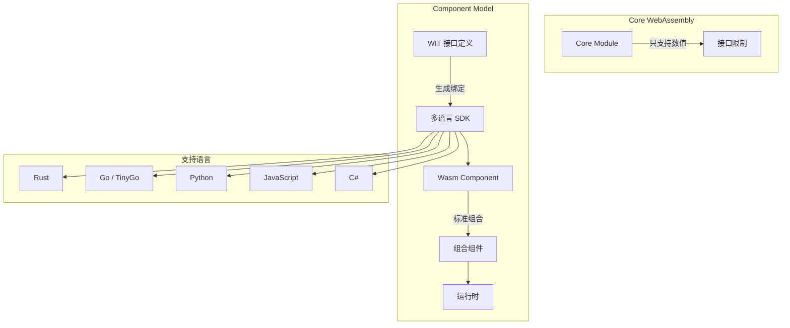
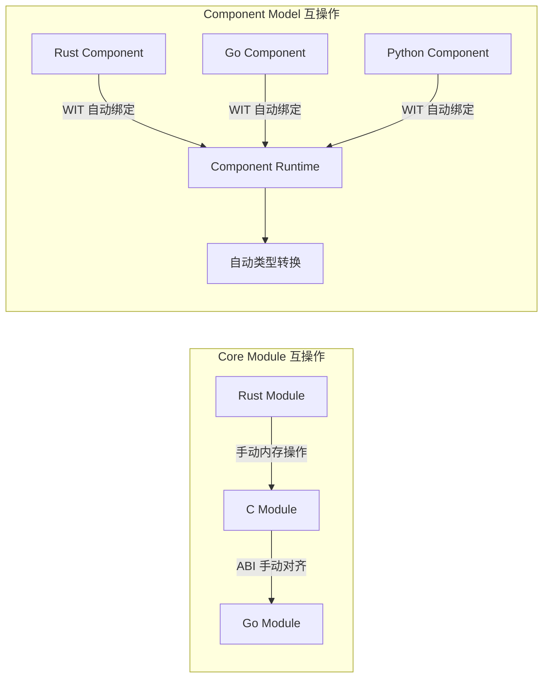
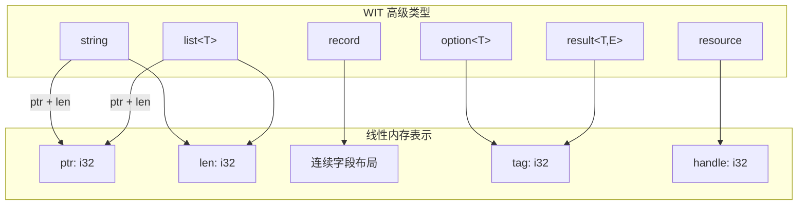
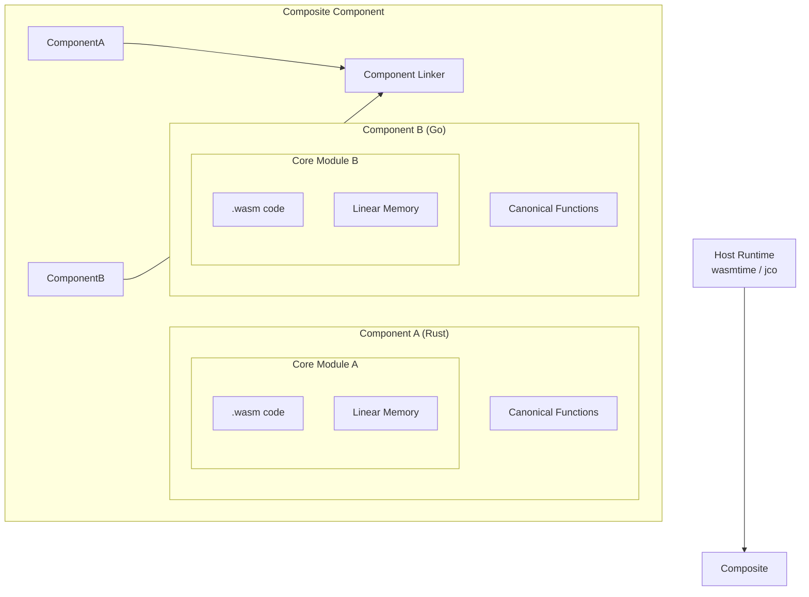
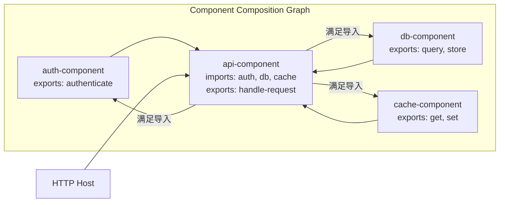
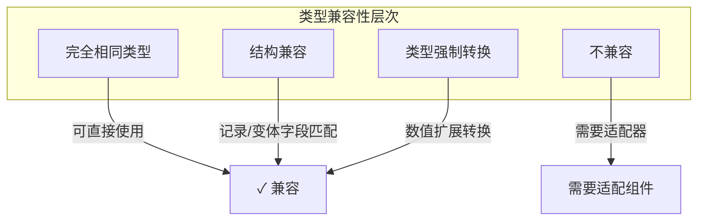
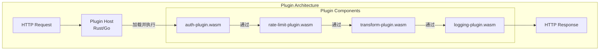

> **生产环境安全提示**
>
> 本文档包含可直接执行的运维命令。执行前请确认：当前目标集群与 Namespace 是否正确；是否具备足够的 RBAC 权限；是否已在非生产环境验证。命令风险等级标注：🔴 高风险（可能造成数据丢失或服务中断）、🟡 中风险（会修改集群状态，但通常可回滚）、🟢 低风险/只读（信息收集，无副作用）。


# Wasm 组件模型 (Wasm Component Model)

> WebAssembly Component Model 是下一代 Wasm 模块化标准，通过 WIT 接口定义实现跨语言组件组合与复用。

---

<!-- chunk: 目录 -->## 目录

1. [组件模型概述](#1-组件模型概述)
2. [WIT 接口定义语言](#2-wit-接口定义语言)
3. [组件结构与编码](#3-组件结构与编码)
4. [组件组合机制](#4-组件组合机制)
5. [wasm-tools 工具链](#5-wasm-tools-工具链)
6. [cargo-component 开发](#6-cargo-component-开发)
7. Go 语言组件开发](#7-go-语言组件开发)
8. [接口类型系统](#8-接口类型系统)
9. [WASI 标准接口](#9-wasi-标准接口)
10. [组件注册与分发](#10-组件注册与分发)
11. [运行时适配层](#11-运行时适配层)
12. [生产实践案例](#12-生产实践案例)
13. [性能调优](#13-性能调优)
14. [常见问题与排错](#14-常见问题与排错)

---

<!-- chunk: 1. 组件模型概述 -->## 1. 组件模型概述

## 1.1 为什么需要组件模型

传统 WebAssembly 模块（Core Module）存在以下局限性：

- **接口粒度粗糙**：只能传递数值类型（i32/i64/f32/f64），无法直接传递字符串、列表、结构体等复杂类型。
- **互操作困难**：不同语言编写的模块之间需要手动处理内存布局，胶水代码繁杂。
- **组合能力弱**：模块之间缺乏标准化的依赖声明与组合机制。
- **版本管理缺失**：没有标准化的接口版本控制体系。

Component Model 通过引入 **WIT（WebAssembly Interface Types）** 和 **Canonical ABI** 解决上述问题。



## 1.2 组件模型核心概念

| 概念 | 说明 |
|------|------|
| **Component** | 封装了 Core Module 的高级单元，包含类型安全的接口 |
| **WIT** | WebAssembly Interface Types，接口定义语言 |
| **World** | 一组 imports + exports 的集合，描述组件能力边界 |
| **Interface** | 一组函数、类型的集合，类似 trait/interface |
| **Canonical ABI** | 规范化应用二进制接口，定义高级类型如何映射到线性内存 |
| **Linking** | 组件之间的静态或动态组合机制 |

## 1.3 规范发展历程

```
2019  Interface Types 提案发布
2020  Module Linking 提案合并
2021  Component Model MVP 草案
2022  WIT 语法稳定化
2023  WASI Preview 2 基于 Component Model
2024  主流语言工具链支持（Rust/Go/Python/JS）
2025  Component Model 进入 Phase 3
```

## 1.4 与传统模块对比



---

<!-- chunk: 2. WIT 接口定义语言 -->## 2. WIT 接口定义语言

## 2.1 WIT 基本语法

WIT（WebAssembly Interface Types）是一种专为 Wasm 接口设计的 IDL。

```wit
// calculator.wit

package example:calculator@1.0.0;

/// 计算器接口
interface calculate {
    /// 加法操作
    add: func(a: f64, b: f64) -> f64;
    
    /// 减法操作
    subtract: func(a: f64, b: f64) -> f64;
    
    /// 除法操作，可能失败
    divide: func(a: f64, b: f64) -> result<f64, divide-error>;
    
    /// 错误类型
    variant divide-error {
        division-by-zero,
        overflow,
    }
}

/// 高级数学接口
interface advanced-math {
    use calculate.{divide-error};
    
    /// 矩阵乘法
    matrix-multiply: func(
        a: list<list<f64>>, 
        b: list<list<f64>>
    ) -> result<list<list<f64>>, math-error>;
    
    /// 统计接口
    statistics: func(data: list<f64>) -> stats-result;
    
    record stats-result {
        mean: f64,
        median: f64,
        std-dev: f64,
        min: f64,
        max: f64,
    }
    
    variant math-error {
        dimension-mismatch(string),
        empty-input,
        numerical-error(string),
    }
}

/// 计算器 World，定义组件的完整能力
world calculator-world {
    export calculate;
    export advanced-math;
    import wasi:io/streams@0.2.0;
}
```

## 2.2 WIT 类型系统

```wit
// types-showcase.wit

package example:types@0.1.0;

interface type-demo {
    // ---- 基础类型 ----
    use-bool: func(v: bool) -> bool;
    use-u8: func(v: u8) -> u8;
    use-u16: func(v: u16) -> u16;
    use-u32: func(v: u32) -> u32;
    use-u64: func(v: u64) -> u64;
    use-s8: func(v: s8) -> s8;
    use-s16: func(v: s16) -> s16;
    use-s32: func(v: s32) -> s32;
    use-s64: func(v: s64) -> s64;
    use-f32: func(v: f32) -> f32;
    use-f64: func(v: f64) -> f64;
    use-char: func(v: char) -> char;
    use-string: func(v: string) -> string;

    // ---- 复合类型 ----
    
    // 记录类型（类似 struct）
    record user {
        id: u64,
        name: string,
        email: string,
        age: option<u8>,
        roles: list<string>,
        metadata: option<list<tuple<string, string>>>,
    }
    
    // 枚举（无数据）
    enum direction {
        north,
        south,
        east,
        west,
    }
    
    // 变体（带数据）
    variant shape {
        circle(f64),                    // radius
        rectangle(tuple<f64, f64>),    // width, height
        triangle(tuple<f64, f64, f64>), // sides
        point,                          // 无数据
    }
    
    // Flags（位标志）
    flags permissions {
        read,
        write,
        execute,
        admin,
    }
    
    // Option 类型
    find-user: func(id: u64) -> option<user>;
    
    // Result 类型
    create-user: func(user: user) -> result<u64, string>;
    
    // 元组类型
    swap: func(pair: tuple<string, u32>) -> tuple<u32, string>;
    
    // 列表类型
    process-batch: func(items: list<user>) -> list<result<u64, string>>;

    // ---- 资源类型 ----
    resource database-connection {
        constructor(url: string, pool-size: u32);
        query: func(sql: string, params: list<string>) -> result<list<list<string>>, string>;
        execute: func(sql: string, params: list<string>) -> result<u64, string>;
        close: func();
    }
    
    open-connection: func(url: string) -> result<database-connection, string>;
}
```

## 2.3 WIT 包管理与版本控制

```wit
// 包声明格式: <namespace>:<name>@<semver>
package my-org:my-lib@2.1.0;

// 导入其他包的接口
interface http-client {
    use wasi:http/types@0.2.0.{
        request, 
        response, 
        method,
        headers,
    };
    
    // 扩展 WASI http 功能
    send-with-retry: func(
        req: request,
        max-retries: u32,
        backoff-ms: u64,
    ) -> result<response, http-error>;
    
    variant http-error {
        network-error(string),
        timeout,
        too-many-retries,
        server-error(u16),
    }
}

world enhanced-http-world {
    // 导入 WASI 标准接口
    import wasi:http/outgoing-handler@0.2.0;
    import wasi:clocks/wall-clock@0.2.0;
    import wasi:logging/logging@0.1.0;
    
    // 导出我们的增强接口
    export http-client;
}
```

## 2.4 接口继承与组合

```wit
package example:service@0.1.0;

// 基础健康检查接口
interface health {
    record health-status {
        healthy: bool,
        message: string,
        checks: list<tuple<string, bool>>,
    }
    
    check: func() -> health-status;
    ready: func() -> bool;
}

// 可观测性接口
interface observable {
    record metric {
        name: string,
        value: f64,
        labels: list<tuple<string, string>>,
        timestamp: u64,
    }
    
    get-metrics: func() -> list<metric>;
    get-traces: func(since: u64) -> list<string>;
}

// 组合 World
world microservice-world {
    import wasi:io/streams@0.2.0;
    import wasi:http/incoming-handler@0.2.0;
    import wasi:keyvalue/store@0.1.0;
    
    // 导出业务接口
    export health;
    export observable;
    
    // 导出主要服务
    export handle: func(request: string) -> string;
}
```

---

<!-- chunk: 3. 组件结构与编码 -->## 3. 组件结构与编码

## 3.1 组件二进制格式

WebAssembly Component 是对 Core Module 的封装，其二进制格式如下：

```
Component Binary Format:
┌─────────────────────────────────────────┐
│  Magic: \0asm (0x00 0x61 0x73 0x6D)    │
│  Version: 0x0D 0x00 0x01 0x00           │  ← Component 版本标识
├─────────────────────────────────────────┤
│  Section: component-type               │  ← 类型定义
│  Section: canon                        │  ← Canonical 函数
│  Section: core-module                  │  ← 嵌入的 Core Module
│  Section: core-instance                │  ← Core 模块实例
│  Section: alias                        │  ← 别名声明
│  Section: component-instance           │  ← 组件实例
│  Section: component-export             │  ← 导出声明
│  Section: component-import             │  ← 导入声明
└─────────────────────────────────────────┘
```

## 3.2 Canonical ABI 类型映射



**字符串传递示例（Canonical ABI）：**

```rust
// Rust 组件内部 - 字符串传递的底层实现
// cargo-component 自动生成，无需手动编写

// WIT: greet: func(name: string) -> string;
// 对应的 Canonical ABI 实现

// 调用者视角（host 或其他组件）:
// 1. 在组件的线性内存中分配空间
// 2. 写入 UTF-8 字节
// 3. 传递 (ptr, len) 给函数
// 4. 接收返回 (ptr, len)
// 5. 读取结果字节
// 6. 释放分配的内存

// 被调用者视角（组件内部）:
// 1. 接收 (ptr, len)
// 2. 从内存读取 UTF-8 字节
// 3. 构造语言原生字符串
// 4. 执行业务逻辑
// 5. 分配输出内存
// 6. 写入结果字符串
// 7. 返回 (ptr, len)
```

## 3.3 组件嵌套结构



---

<!-- chunk: 4. 组件组合机制 -->## 4. 组件组合机制

## 4.1 静态组合（Composition）

使用 `wac` 或 `wasm-compose` 进行静态组合：

```bash
# 安装 wac 工具
cargo install wac-cli

# 组合两个组件
wac compose \
  --dep calculator=./calculator.wasm \
  --dep logger=./logger.wasm \
  -o composed-app.wasm \
  app.wac
```

```
# app.wac - 组合描述文件
package example:app;

let calc = new example:calculator { ... };
let log = new example:logger { ... };

let app = new example:main {
    calculate: calc.calculate,
    logger: log.logging,
};

export app...;
```

## 4.2 组合拓扑示例



## 4.3 动态组合（Runtime Linking）

```rust
// 使用 wasmtime 进行动态组件组合
use wasmtime::component::{Component, Linker, Val};
use wasmtime::{Config, Engine, Store};

fn main() -> anyhow::Result<()> {
    // 配置 Component Model 支持
    let mut config = Config::new();
    config.wasm_component_model(true);
    config.async_support(false);
    
    let engine = Engine::new(&config)?;
    let mut store = Store::new(&engine, ());
    
    // 加载组件
    let auth_component = Component::from_file(&engine, "auth.wasm")?;
    let db_component = Component::from_file(&engine, "db.wasm")?;
    let main_component = Component::from_file(&engine, "main.wasm")?;
    
    // 构建链接器
    let mut linker = Linker::new(&engine);
    
    // 注册 WASI 接口
    wasmtime_wasi::add_to_linker_sync(&mut linker)?;
    
    // 实例化子组件
    let auth_instance = linker.instantiate(&mut store, &auth_component)?;
    let db_instance = linker.instantiate(&mut store, &db_component)?;
    
    // 将子组件的导出注入主组件的导入
    // ... (复杂的链接逻辑)
    
    // 实例化主组件
    let main_instance = linker.instantiate(&mut store, &main_component)?;
    
    // 调用导出函数
    let func = main_instance.get_func(&mut store, "handle-request")
        .expect("handle-request export not found");
    
    let mut results = vec![Val::String(Default::default())];
    func.call(&mut store, &[Val::String("GET /health".into())], &mut results)?;
    
    if let Val::String(response) = &results[0] {
        println!("Response: {}", response);
    }
    
    Ok(())
}
```

## 4.4 接口适配器（Adapter）

```wit
// 当组件接口不完全匹配时，使用适配器组件

// 旧接口（v1）
interface old-storage {
    put: func(key: string, value: list<u8>) -> bool;
    get: func(key: string) -> option<list<u8>>;
}

// 新接口（v2）
interface new-storage {
    store: func(key: string, value: list<u8>) -> result<_, string>;
    fetch: func(key: string) -> result<list<u8>, string>;
    delete: func(key: string) -> result<_, string>;
}

// 适配器 World
world storage-adapter {
    import old-storage;
    export new-storage;
}
```

```rust
// 适配器实现
use crate::bindings::exports::new_storage::Guest;
use crate::bindings::imports::old_storage;

struct Adapter;

impl Guest for Adapter {
    fn store(key: String, value: Vec<u8>) -> Result<(), String> {
        if old_storage::put(&key, &value) {
            Ok(())
        } else {
            Err(format!("Failed to store key: {}", key))
        }
    }
    
    fn fetch(key: String) -> Result<Vec<u8>, String> {
        old_storage::get(&key)
            .ok_or_else(|| format!("Key not found: {}", key))
    }
    
    fn delete(_key: String) -> Result<(), String> {
        // 旧接口不支持删除，返回错误
        Err("Delete not supported by underlying storage".to_string())
    }
}
```

---

<!-- chunk: 5. wasm-tools 工具链 -->## 5. wasm-tools 工具链

## 5.1 安装与基本使用

```bash
# 安装 wasm-tools
cargo install wasm-tools

# 验证安装
wasm-tools --version

# 主要子命令
wasm-tools help
```

## 5.2 WIT 操作命令

```bash
# 验证 WIT 文件语法
wasm-tools component wit validate ./wit/

# 打印 WIT 接口文档
wasm-tools component wit ./component.wasm

# 从 WIT 生成 JSON schema
wasm-tools component wit ./wit/ --json

# 解析并打印 WIT
wasm-tools component wit ./wit/world.wit --document

# 合并 WIT 包
wasm-tools wit-smith wit/  # 模糊测试生成
```

## 5.3 组件操作命令

```bash
# 将 Core Module 转换为 Component
wasm-tools component new \
  ./target/wasm32-wasi/release/my_lib.wasm \
  --adapt wasi_snapshot_preview1=./wasi_snapshot_preview1.wasm \
  -o my_component.wasm

# 验证组件
wasm-tools validate --features component-model my_component.wasm

# 打印组件信息
wasm-tools print my_component.wasm

# 提取组件中的 WIT
wasm-tools component wit my_component.wasm

# 解析组件为文本格式 WAT
wasm-tools print my_component.wasm -o my_component.wat

# 分析组件大小
wasm-tools objdump my_component.wasm
```

## 5.4 组件组合命令

```bash
# 使用 wasm-compose 合并组件
cargo install wasm-compose

wasm-compose \
  --config compose-config.yml \
  -o composed.wasm

# compose-config.yml 示例
# components:
#   - path: auth.wasm
#     name: auth
#   - path: db.wasm
#     name: database
# instantiations:
#   - component: main
#     arguments:
#       authenticate: auth.authenticate
#       query: database.query
```

## 5.5 优化命令

```bash
# 使用 wasm-opt 优化（需要安装 binaryen）
wasm-opt -O3 \
  -o optimized.wasm \
  input.wasm

# 剥离调试信息
wasm-tools strip input.wasm -o stripped.wasm

# 移除自定义 section
wasm-tools strip \
  --delete producers \
  input.wasm \
  -o clean.wasm

# 内联导入模块
wasm-tools component embed \
  --world my-world \
  --encoding utf16 \
  ./wit \
  target/wasm32-wasi/release/my_lib.wasm \
  -o embedded.wasm
```

## 5.6 调试与检测命令

```bash
# 检测 wasm 文件信息
wasm-tools stats my_component.wasm

# 验证语义正确性
wasm-tools validate my_component.wasm \
  --features component-model,multi-value

# 生成模糊测试输入
wasm-tools smith \
  --fuel 100 \
  -o random.wasm

# 差异化测试
wasm-tools differential \
  --first-fuel 100 \
  --second-fuel 200 \
  random.wasm

# 打印导入导出
wasm-tools print my_component.wasm | grep -E "(import|export)"
```

---

<!-- chunk: 6. cargo-component 开发 -->## 6. cargo-component 开发

## 6.1 环境搭建

```bash
# 安装 cargo-component
cargo install cargo-component

# 安装 wasm32-wasi 目标
rustup target add wasm32-wasi
rustup target add wasm32-unknown-unknown

# 安装组件 SDK 依赖
cargo install wit-bindgen-cli
cargo install wac-cli

# 验证安装
cargo component --version
```

## 6.2 创建新组件项目

```bash
# 创建新的组件项目
cargo component new --reactor my-component
cd my-component

# 项目结构
# my-component/
# ├── Cargo.toml
# ├── src/
# │   └── lib.rs
# └── wit/
#     └── world.wit
```

```toml
# Cargo.toml
[package]
name = "my-component"
version = "0.1.0"
edition = "2021"

[lib]
crate-type = ["cdylib"]

[dependencies]
wit-bindgen = "0.24"
wasi = "0.13"

[package.metadata.component]
package = "example:my-component"

[package.metadata.component.target]
world = "my-world"

[package.metadata.component.dependencies]
"wasi:clocks" = { registry = "wasi" }
"wasi:filesystem" = { registry = "wasi" }
"wasi:http" = { path = "./wit/deps/http" }
```

## 6.3 完整业务组件示例

```wit
// wit/world.wit
package example:order-service@1.0.0;

interface order-management {
    record order {
        id: string,
        customer-id: string,
        items: list<order-item>,
        status: order-status,
        total: f64,
        created-at: u64,
        updated-at: u64,
    }
    
    record order-item {
        product-id: string,
        quantity: u32,
        unit-price: f64,
    }
    
    enum order-status {
        pending,
        confirmed,
        shipped,
        delivered,
        cancelled,
    }
    
    variant order-error {
        not-found(string),
        invalid-item(string),
        payment-failed(string),
        inventory-error(string),
    }
    
    create-order: func(
        customer-id: string,
        items: list<order-item>
    ) -> result<order, order-error>;
    
    get-order: func(id: string) -> result<order, order-error>;
    
    update-status: func(
        id: string,
        status: order-status
    ) -> result<order, order-error>;
    
    list-orders: func(
        customer-id: option<string>,
        limit: u32,
        offset: u32,
    ) -> list<order>;
    
    cancel-order: func(id: string) -> result<_, order-error>;
}

world order-service-world {
    import wasi:clocks/wall-clock@0.2.0;
    import wasi:keyvalue/store@0.1.0;
    import wasi:logging/logging@0.1.0;
    
    export order-management;
}
```

```rust
// src/lib.rs
use crate::bindings::exports::example::order_service::order_management::{
    Guest, Order, OrderError, OrderItem, OrderStatus,
};
use crate::bindings::wasi::clocks::wall_clock;
use crate::bindings::wasi::keyvalue::store;
use crate::bindings::wasi::logging::logging;

mod bindings {
    wit_bindgen::generate!({
        world: "order-service-world",
        path: "wit",
    });
}

use bindings::export;

struct OrderService;

impl Guest for OrderService {
    fn create_order(
        customer_id: String,
        items: Vec<OrderItem>,
    ) -> Result<Order, OrderError> {
        // 输入验证
        if items.is_empty() {
            return Err(OrderError::InvalidItem(
                "Order must have at least one item".to_string()
            ));
        }
        
        for item in &items {
            if item.quantity == 0 {
                return Err(OrderError::InvalidItem(
                    format!("Invalid quantity for product {}", item.product_id)
                ));
            }
            if item.unit_price < 0.0 {
                return Err(OrderError::InvalidItem(
                    format!("Invalid price for product {}", item.product_id)
                ));
            }
        }
        
        // 生成订单 ID
        let now = wall_clock::now();
        let order_id = format!("ORD-{}-{}", customer_id, now.seconds);
        
        // 计算总价
        let total: f64 = items.iter()
            .map(|i| i.quantity as f64 * i.unit_price)
            .sum();
        
        let order = Order {
            id: order_id.clone(),
            customer_id,
            items,
            status: OrderStatus::Pending,
            total,
            created_at: now.seconds,
            updated_at: now.seconds,
        };
        
        // 序列化并存储
        let serialized = serialize_order(&order);
        let bucket = store::open("orders")
            .map_err(|e| OrderError::InventoryError(e.to_string()))?;
        bucket.set(&order_id, &serialized.into_bytes())
            .map_err(|e| OrderError::InventoryError(e.to_string()))?;
        
        logging::log(
            logging::Level::Info,
            "order-service",
            &format!("Created order: {}", order_id),
        );
        
        Ok(order)
    }
    
    fn get_order(id: String) -> Result<Order, OrderError> {
        let bucket = store::open("orders")
            .map_err(|e| OrderError::InventoryError(e.to_string()))?;
        
        match bucket.get(&id)
            .map_err(|e| OrderError::InventoryError(e.to_string()))? 
        {
            Some(bytes) => {
                let s = String::from_utf8(bytes)
                    .map_err(|e| OrderError::InventoryError(e.to_string()))?;
                deserialize_order(&s)
                    .ok_or_else(|| OrderError::InventoryError("Deserialization failed".to_string()))
            }
            None => Err(OrderError::NotFound(id)),
        }
    }
    
    fn update_status(
        id: String,
        status: OrderStatus,
    ) -> Result<Order, OrderError> {
        let mut order = Self::get_order(id.clone())?;
        
        // 验证状态转换合法性
        validate_status_transition(&order.status, &status)?;
        
        let now = wall_clock::now();
        order.status = status;
        order.updated_at = now.seconds;
        
        let bucket = store::open("orders")
            .map_err(|e| OrderError::InventoryError(e.to_string()))?;
        let serialized = serialize_order(&order);
        bucket.set(&id, &serialized.into_bytes())
            .map_err(|e| OrderError::InventoryError(e.to_string()))?;
        
        Ok(order)
    }
    
    fn list_orders(
        customer_id: Option<String>,
        limit: u32,
        offset: u32,
    ) -> Vec<Order> {
        // 简化实现：实际应使用索引
        let bucket = match store::open("orders") {
            Ok(b) => b,
            Err(_) => return vec![],
        };
        
        let keys = match bucket.list_keys(None) {
            Ok(k) => k,
            Err(_) => return vec![],
        };
        
        keys.into_iter()
            .skip(offset as usize)
            .take(limit as usize)
            .filter_map(|key| {
                bucket.get(&key).ok().flatten()
                    .and_then(|bytes| String::from_utf8(bytes).ok())
                    .and_then(|s| deserialize_order(&s))
                    .filter(|order| {
                        customer_id.as_ref()
                            .map(|cid| &order.customer_id == cid)
                            .unwrap_or(true)
                    })
            })
            .collect()
    }
    
    fn cancel_order(id: String) -> Result<(), OrderError> {
        Self::update_status(id, OrderStatus::Cancelled)?;
        Ok(())
    }
}

fn validate_status_transition(
    from: &OrderStatus,
    to: &OrderStatus,
) -> Result<(), OrderError> {
    use OrderStatus::*;
    let valid = matches!(
        (from, to),
        (Pending, Confirmed)
        | (Confirmed, Shipped)
        | (Shipped, Delivered)
        | (Pending, Cancelled)
        | (Confirmed, Cancelled)
    );
    
    if valid {
        Ok(())
    } else {
        Err(OrderError::InvalidItem(
            format!("Invalid status transition: {:?} -> {:?}", from, to)
        ))
    }
}

fn serialize_order(order: &Order) -> String {
    // 实际项目使用 serde_json
    format!(
        "{{\"id\":\"{}\",\"customer_id\":\"{}\",\"total\":{},\"status\":\"{}\"}}",
        order.id, order.customer_id, order.total,
        match order.status {
            OrderStatus::Pending => "pending",
            OrderStatus::Confirmed => "confirmed",
            OrderStatus::Shipped => "shipped",
            OrderStatus::Delivered => "delivered",
            OrderStatus::Cancelled => "cancelled",
        }
    )
}

fn deserialize_order(_s: &str) -> Option<Order> {
    // 简化实现，实际使用 serde_json
    None
}

export!(OrderService);
```

## 6.4 构建与测试

```bash
# 构建组件
cargo component build --release

# 输出文件
ls target/wasm32-wasi/release/*.wasm

# 验证生成的组件
wasm-tools component wit target/wasm32-wasi/release/my_component.wasm

# 运行单元测试
cargo test

# 运行组件集成测试
cargo component test

# 检查组件大小
ls -lh target/wasm32-wasi/release/my_component.wasm

# 优化组件大小
wasm-opt -Oz \
  -o target/wasm32-wasi/release/my_component_opt.wasm \
  target/wasm32-wasi/release/my_component.wasm
```

---

<!-- chunk: 7. Go 语言组件开发 -->## 7. Go 语言组件开发

## 7.1 使用 TinyGo 构建组件

```bash
# 安装 TinyGo
brew install tinygo  # macOS
# 或下载预编译版本: https://tinygo.org/getting-started/install/

# 安装 wit-bindgen-go
go install github.com/bytecodealliance/wit-bindgen-go/cmd/wit-bindgen-go@latest

# 创建 Go 组件项目
mkdir go-component && cd go-component
go mod init example.com/go-component
```

```go
// main.go - Go 组件实现
package main

import (
    "fmt"
    "strings"
    
    // wit-bindgen-go 生成的绑定
    "example.com/go-component/gen/example/greeter"
)

// 确保实现接口
func init() {
    greeter.SetExports(greeterImpl{})
}

type greeterImpl struct{}

func (g greeterImpl) Greet(name string) string {
    return fmt.Sprintf("Hello, %s! From Go Component.", name)
}

func (g greeterImpl) GreetAll(names []string) []string {
    results := make([]string, len(names))
    for i, name := range names {
        results[i] = g.Greet(strings.TrimSpace(name))
    }
    return results
}

func (g greeterImpl) GreetWithLocale(name string, locale string) (string, error) {
    switch locale {
    case "zh-CN":
        return fmt.Sprintf("你好，%s！来自 Go 组件。", name), nil
    case "ja-JP":
        return fmt.Sprintf("こんにちは、%s！Goコンポーネントから。", name), nil
    case "en-US":
        return fmt.Sprintf("Hello, %s! From Go Component.", name), nil
    default:
        return "", fmt.Errorf("unsupported locale: %s", locale)
    }
}

func main() {}
```

```bash
# 构建 Go 组件
tinygo build \
  -target=wasi \
  -o greeter.wasm \
  .

# 将 Core Module 适配为 Component
wasm-tools component new greeter.wasm \
  --adapt wasi_snapshot_preview1=wasi_snapshot_preview1.reactor.wasm \
  -o greeter-component.wasm

# 验证
wasm-tools component wit greeter-component.wasm
```

## 7.2 使用 wazero 运行组件

```go
// host/main.go - 使用 wazero 运行 Wasm 组件
package main

import (
    "context"
    "fmt"
    "log"
    "os"
    
    "github.com/tetratelabs/wazero"
    "github.com/tetratelabs/wazero/api"
    "github.com/tetratelabs/wazero/imports/wasi_snapshot_preview1"
)

func main() {
    ctx := context.Background()
    
    // 创建运行时（启用 Component Model 支持）
    r := wazero.NewRuntimeWithConfig(ctx,
        wazero.NewRuntimeConfig().
            WithCoreFeatures(api.CoreFeaturesV2).
            WithCustomSections(true),
    )
    defer r.Close(ctx)
    
    // 初始化 WASI
    wasi_snapshot_preview1.MustInstantiate(ctx, r)
    
    // 读取组件文件
    componentBytes, err := os.ReadFile("greeter-component.wasm")
    if err != nil {
        log.Fatal(err)
    }
    
    // 编译组件
    compiled, err := r.CompileModule(ctx, componentBytes)
    if err != nil {
        log.Fatal(err)
    }
    
    // 实例化组件
    mod, err := r.InstantiateModule(ctx, compiled,
        wazero.NewModuleConfig().WithStdout(os.Stdout))
    if err != nil {
        log.Fatal(err)
    }
    
    // 调用导出函数
    greet := mod.ExportedFunction("greet")
    if greet == nil {
        log.Fatal("greet function not found")
    }
    
    // 分配内存并传递字符串
    // 注意：实际 Component Model 需要更复杂的 ABI 处理
    nameBytes := []byte("World")
    ptr, err := allocateString(ctx, mod, nameBytes)
    if err != nil {
        log.Fatal(err)
    }
    
    results, err := greet.Call(ctx, uint64(ptr), uint64(len(nameBytes)))
    if err != nil {
        log.Fatal(err)
    }
    
    // 读取结果字符串
    resultStr := readString(mod, uint32(results[0]), uint32(results[1]))
    fmt.Printf("Result: %s\n", resultStr)
}

func allocateString(ctx context.Context, mod api.Module, data []byte) (uint32, error) {
    malloc := mod.ExportedFunction("cabi_realloc")
    results, err := malloc.Call(ctx, 0, 0, 1, uint64(len(data)))
    if err != nil {
        return 0, err
    }
    ptr := uint32(results[0])
    
    mem := mod.Memory()
    if !mem.Write(ptr, data) {
        return 0, fmt.Errorf("failed to write to memory")
    }
    return ptr, nil
}

func readString(mod api.Module, ptr, length uint32) string {
    mem := mod.Memory()
    data, ok := mem.Read(ptr, length)
    if !ok {
        return ""
    }
    return string(data)
}
```

---

<!-- chunk: 8. 接口类型系统 -->## 8. 接口类型系统

## 8.1 Resource 类型详解

Resource 是 Component Model 中用于管理带状态对象生命周期的特殊类型：

```wit
// resource-demo.wit
package example:resources@0.1.0;

interface file-system {
    // 资源类型：文件句柄
    resource file-handle {
        // 构造函数
        constructor(path: string, mode: open-mode);
        
        // 方法
        read: func(max-bytes: u64) -> result<list<u8>, io-error>;
        write: func(data: list<u8>) -> result<u64, io-error>;
        seek: func(offset: s64, whence: seek-from) -> result<u64, io-error>;
        flush: func() -> result<_, io-error>;
        size: func() -> result<u64, io-error>;
        
        // 静态方法
        %static exists: func(path: string) -> bool;
    }
    
    enum open-mode {
        read-only,
        write-only,
        read-write,
        create-new,
        append,
    }
    
    enum seek-from {
        start,
        current,
        end,
    }
    
    variant io-error {
        not-found,
        permission-denied,
        already-exists,
        broken-pipe,
        other(string),
    }
    
    // 工厂函数
    open: func(path: string, mode: open-mode) -> result<file-handle, io-error>;
    
    // 目录操作
    resource directory {
        constructor(path: string);
        list: func() -> result<list<dir-entry>, io-error>;
        create-file: func(name: string) -> result<file-handle, io-error>;
    }
    
    record dir-entry {
        name: string,
        is-dir: bool,
        size: option<u64>,
    }
}

world file-system-world {
    export file-system;
    import wasi:filesystem/preopens@0.2.0;
}
```

```rust
// 实现 Resource 类型
use std::fs;
use std::io::{Read, Write, Seek, SeekFrom};

use crate::bindings::exports::example::resources::file_system::{
    Guest, GuestFileHandle, GuestDirectory,
    OpenMode, SeekFrom as WitSeekFrom, IoError,
    DirEntry,
};

pub struct FileHandleResource {
    file: std::fs::File,
    path: String,
}

impl GuestFileHandle for FileHandleResource {
    fn new(path: String, mode: OpenMode) -> Result<Self, IoError> {
        let file = match mode {
            OpenMode::ReadOnly => fs::File::open(&path),
            OpenMode::WriteOnly => fs::File::create(&path),
            OpenMode::ReadWrite => fs::OpenOptions::new()
                .read(true).write(true).open(&path),
            OpenMode::CreateNew => fs::OpenOptions::new()
                .write(true).create_new(true).open(&path),
            OpenMode::Append => fs::OpenOptions::new()
                .append(true).open(&path),
        }.map_err(|e| match e.kind() {
            std::io::ErrorKind::NotFound => IoError::NotFound,
            std::io::ErrorKind::PermissionDenied => IoError::PermissionDenied,
            std::io::ErrorKind::AlreadyExists => IoError::AlreadyExists,
            _ => IoError::Other(e.to_string()),
        })?;
        
        Ok(FileHandleResource { file, path })
    }
    
    fn read(&self, max_bytes: u64) -> Result<Vec<u8>, IoError> {
        let mut buf = vec![0u8; max_bytes as usize];
        // Note: need mut reference - in practice use RefCell or Mutex
        let n = (&self.file).read(&mut buf)
            .map_err(|e| IoError::Other(e.to_string()))?;
        buf.truncate(n);
        Ok(buf)
    }
    
    fn write(&self, data: Vec<u8>) -> Result<u64, IoError> {
        let n = (&self.file).write(&data)
            .map_err(|e| IoError::Other(e.to_string()))?;
        Ok(n as u64)
    }
    
    fn seek(&self, offset: i64, whence: WitSeekFrom) -> Result<u64, IoError> {
        let seek_from = match whence {
            WitSeekFrom::Start => SeekFrom::Start(offset as u64),
            WitSeekFrom::Current => SeekFrom::Current(offset),
            WitSeekFrom::End => SeekFrom::End(offset),
        };
        (&self.file).seek(seek_from)
            .map_err(|e| IoError::Other(e.to_string()))
    }
    
    fn flush(&self) -> Result<(), IoError> {
        (&self.file).flush()
            .map_err(|e| IoError::Other(e.to_string()))
    }
    
    fn size(&self) -> Result<u64, IoError> {
        self.file.metadata()
            .map(|m| m.len())
            .map_err(|e| IoError::Other(e.to_string()))
    }
    
    fn exists(path: String) -> bool {
        std::path::Path::new(&path).exists()
    }
}
```

## 8.2 类型兼容性规则



---

<!-- chunk: 9. WASI 标准接口 -->## 9. WASI 标准接口

## 9.1 WASI Preview 2 接口列表

```
WASI Preview 2 (基于 Component Model) 接口：

wasi:clocks
  ├── wall-clock      # 系统时间
  └── monotonic-clock # 单调时钟

wasi:filesystem
  ├── types           # 文件系统类型
  └── preopens        # 预开放目录

wasi:http
  ├── types           # HTTP 类型定义
  ├── outgoing-handler # 发送 HTTP 请求
  └── incoming-handler # 接收 HTTP 请求

wasi:io
  ├── error           # 错误类型
  ├── poll            # 轮询机制
  └── streams         # 字节流

wasi:random
  └── random          # 随机数生成

wasi:sockets
  ├── network         # 网络类型
  ├── instance-network # 网络实例
  ├── tcp             # TCP 套接字
  ├── tcp-create-socket # TCP 创建
  ├── udp             # UDP 套接字
  ├── udp-create-socket # UDP 创建
  └── ip-name-lookup  # DNS 解析

wasi:keyvalue (提案中)
  ├── store           # KV 存储
  ├── atomics         # 原子操作
  └── batch           # 批量操作

wasi:logging (提案中)
  └── logging         # 日志接口

wasi:nn (神经网络)
  └── inference       # AI 推理接口
```

## 9.2 使用 WASI HTTP 接口

```rust
// 使用 WASI HTTP 构建 HTTP 服务器组件
use crate::bindings::wasi::http::types::{
    IncomingRequest, ResponseOutparam, OutgoingResponse,
    Fields, OutgoingBody, StatusCode,
};
use crate::bindings::exports::wasi::http::incoming_handler::Guest;

struct HttpHandler;

impl Guest for HttpHandler {
    fn handle(request: IncomingRequest, response_out: ResponseOutparam) {
        let method = request.method();
        let path = request.path_with_query().unwrap_or_default();
        
        let (status, body) = match (method.as_str(), path.as_str()) {
            ("GET", "/health") => (200, r#"{"status":"healthy"}"#.to_string()),
            ("GET", p) if p.starts_with("/api/") => {
                handle_api_request(&request)
            }
            _ => (404, r#"{"error":"not found"}"#.to_string()),
        };
        
        // 构建响应
        let headers = Fields::new();
        headers.append(
            &"content-type".to_string(),
            &b"application/json".to_vec(),
        ).unwrap();
        headers.append(
            &"x-powered-by".to_string(),
            &b"wasm-component".to_vec(),
        ).unwrap();
        
        let response = OutgoingResponse::new(headers);
        response.set_status_code(status as StatusCode).unwrap();
        
        let response_body = response.body().unwrap();
        {
            let stream = response_body.write().unwrap();
            stream.write(body.as_bytes()).unwrap();
            stream.flush().unwrap();
        }
        OutgoingBody::finish(response_body, None).unwrap();
        
        ResponseOutparam::set(response_out, Ok(response));
    }
}

fn handle_api_request(request: &IncomingRequest) -> (u16, String) {
    let path = request.path_with_query().unwrap_or_default();
    
    // 读取请求体
    let body = match request.consume() {
        Ok(incoming_body) => {
            let stream = incoming_body.stream().unwrap();
            let mut data = Vec::new();
            loop {
                match stream.read(4096) {
                    Ok(bytes) if bytes.is_empty() => break,
                    Ok(bytes) => data.extend_from_slice(&bytes),
                    Err(_) => break,
                }
            }
            String::from_utf8(data).unwrap_or_default()
        }
        Err(_) => String::new(),
    };
    
    (200, format!(r#"{{"path":"{}","body_length":{}}}"#, path, body.len()))
}
```

---

<!-- chunk: 10. 组件注册与分发 -->## 10. 组件注册与分发

## 10.1 OCI 注册表存储

```bash
# 将 Wasm 组件推送到 OCI 注册表
# 使用 wkg (wasm package registry) 工具

cargo install wkg

# 配置注册表
wkg config set registry ghcr.io

# 认证
wkg login ghcr.io \
  --username $GITHUB_USER \
  --password $GITHUB_TOKEN

# 推送组件
wkg push \
  my-component.wasm \
  ghcr.io/my-org/my-component:1.0.0

# 拉取组件
wkg pull \
  ghcr.io/my-org/my-component:1.0.0 \
  -o my-component-pulled.wasm
```

## 10.2 WARG 协议注册表

```bash
# 安装 warg 客户端
cargo install warg-cli

# 配置 warg 服务器
cat > warg-config.json << 'EOF'
{
  "default_registry": "https://registry.example.com",
  "keys": {
    "registry.example.com": "ecdsa-p256:..."
  }
}
EOF

# 发布包
warg publish \
  --registry https://registry.example.com \
  --name "example:my-component" \
  --version "1.0.0" \
  my-component.wasm

# 安装依赖
warg install example:my-component@1.0.0

# 在 Cargo.toml 中声明依赖
# [package.metadata.component.dependencies]
# "example:my-component" = "1.0.0"
```

## 10.3 Wasmtime 远程加载

```rust
// 从远程加载并缓存组件
use wasmtime::component::Component;
use wasmtime::Engine;

async fn load_component_from_registry(
    engine: &Engine,
    registry_url: &str,
    package: &str,
    version: &str,
) -> anyhow::Result<Component> {
    let cache_key = format!("{}-{}", package, version);
    let cache_path = format!("/tmp/wasm-cache/{}.wasm", cache_key);
    
    // 检查本地缓存
    if std::path::Path::new(&cache_path).exists() {
        println!("Loading from cache: {}", cache_path);
        return Component::from_file(engine, &cache_path);
    }
    
    // 从注册表下载
    println!("Downloading {}/{} from {}", package, version, registry_url);
    let url = format!("{}/v1/components/{}/{}", registry_url, package, version);
    
    let client = reqwest::Client::new();
    let bytes = client.get(&url)
        .send().await?
        .bytes().await?;
    
    // 保存到缓存
    std::fs::create_dir_all("/tmp/wasm-cache")?;
    std::fs::write(&cache_path, &bytes)?;
    
    Component::from_binary(engine, &bytes)
}
```

---

<!-- chunk: 11. 运行时适配层 -->## 11. 运行时适配层

## 11.1 wasmtime 组件运行时

```rust
// 完整的 wasmtime 组件运行时示例
use anyhow::Result;
use wasmtime::{Config, Engine, Store};
use wasmtime::component::{Component, Linker};
use wasmtime_wasi::{WasiCtx, WasiCtxBuilder, WasiView};

// 自定义 Store 数据
struct MyState {
    wasi: WasiCtx,
    // 其他自定义状态
    request_id: String,
}

impl WasiView for MyState {
    fn ctx(&mut self) -> &mut WasiCtx { &mut self.wasi }
    fn table(&mut self) -> &mut wasmtime_wasi::ResourceTable {
        unimplemented!()
    }
}

// 使用 bindgen 宏生成类型安全的调用接口
wasmtime::component::bindgen!({
    world: "calculator-world",
    path: "wit",
    async: false,
});

fn main() -> Result<()> {
    // 配置引擎
    let mut config = Config::new();
    config.wasm_component_model(true);
    config.debug_info(false);
    config.optimize_for_latency(true);
    
    let engine = Engine::new(&config)?;
    
    // 构建 WASI 上下文
    let wasi = WasiCtxBuilder::new()
        .inherit_stdio()
        .inherit_env()
        .build();
    
    let state = MyState {
        wasi,
        request_id: "req-001".to_string(),
    };
    
    let mut store = Store::new(&engine, state);
    
    // 加载并编译组件（可缓存）
    let component = Component::from_file(&engine, "calculator.wasm")?;
    
    // 构建链接器
    let mut linker = Linker::new(&engine);
    wasmtime_wasi::add_to_linker_sync(&mut linker)?;
    
    // 添加自定义主机函数
    linker.root().func_wrap("log-message", |
        _store: wasmtime::StoreContextMut<MyState>,
        (level, msg): (String, String),
    | -> Result<()> {
        eprintln!("[{}] {}", level, msg);
        Ok(())
    })?;
    
    // 实例化并调用
    let (calculator, _) = CalculatorWorld::instantiate(
        &mut store, &component, &linker
    )?;
    
    // 类型安全的调用
    let result = calculator.example_calculator_calculate()
        .call_add(&mut store, 3.14, 2.72)?;
    println!("3.14 + 2.72 = {}", result);
    
    let result = calculator.example_calculator_calculate()
        .call_divide(&mut store, 10.0, 0.0)?;
    match result {
        Ok(v) => println!("Result: {}", v),
        Err(e) => println!("Error: {:?}", e),
    }
    
    Ok(())
}
```

## 11.2 jco (JavaScript Component 工具)

```bash
# 安装 jco
npm install -g @bytecodealliance/jco

# 将 Wasm Component 转译为 JavaScript
jco transpile my-component.wasm \
  --out-dir ./dist \
  --map wasi:http/types@0.2.0=@bytecodealliance/preview2-shim/http \
  --map wasi:io/streams@0.2.0=@bytecodealliance/preview2-shim/io

# 生成文件结构
# dist/
# ├── my-component.js          # 主入口
# ├── my-component.core.wasm   # Core module
# └── interfaces/              # 接口定义
```

```javascript
// 使用转译后的组件
import { calculate } from './dist/my-component.js';

// 调用组件接口
const result = calculate.add(3.14, 2.72);
console.log('Sum:', result);  // 5.86

// 处理 result 类型
const divResult = calculate.divide(10, 0);
if (divResult.tag === 'ok') {
    console.log('Result:', divResult.val);
} else {
    console.error('Error:', divResult.val);
}
```

```typescript
// TypeScript 类型定义（jco 自动生成）
// dist/interfaces/example-calculator-calculate.d.ts

export type DivideError = 
    | { tag: 'division-by-zero' }
    | { tag: 'overflow' };

export function add(a: number, b: number): number;
export function subtract(a: number, b: number): number;
export function divide(a: number, b: number): 
    | { tag: 'ok', val: number }
    | { tag: 'err', val: DivideError };
```

---

<!-- chunk: 12. 生产实践案例 -->## 12. 生产实践案例

## 12.1 微服务插件系统



```rust
// 插件系统主机实现
use wasmtime::component::{Component, Linker, Val};
use std::collections::HashMap;

pub struct PluginSystem {
    engine: wasmtime::Engine,
    plugins: HashMap<String, LoadedPlugin>,
    pipeline: Vec<String>,
}

pub struct LoadedPlugin {
    component: Component,
    name: String,
    version: String,
}

impl PluginSystem {
    pub fn new() -> anyhow::Result<Self> {
        let mut config = wasmtime::Config::new();
        config.wasm_component_model(true);
        config.async_support(true);
        
        Ok(Self {
            engine: wasmtime::Engine::new(&config)?,
            plugins: HashMap::new(),
            pipeline: Vec::new(),
        })
    }
    
    pub async fn load_plugin(
        &mut self,
        name: &str,
        path: &str,
    ) -> anyhow::Result<()> {
        let component = Component::from_file(&self.engine, path)?;
        
        // 验证插件接口兼容性
        self.validate_plugin_interface(&component)?;
        
        self.plugins.insert(name.to_string(), LoadedPlugin {
            component,
            name: name.to_string(),
            version: "1.0.0".to_string(),
        });
        
        println!("Loaded plugin: {} v{}", name, "1.0.0");
        Ok(())
    }
    
    pub fn add_to_pipeline(&mut self, plugin_name: &str) {
        self.pipeline.push(plugin_name.to_string());
    }
    
    pub async fn process_request(
        &self,
        request: &str,
    ) -> anyhow::Result<String> {
        let mut current = request.to_string();
        
        for plugin_name in &self.pipeline {
            let plugin = self.plugins.get(plugin_name)
                .ok_or_else(|| anyhow::anyhow!("Plugin not found: {}", plugin_name))?;
            
            current = self.invoke_plugin(plugin, &current).await?;
        }
        
        Ok(current)
    }
    
    async fn invoke_plugin(
        &self,
        plugin: &LoadedPlugin,
        input: &str,
    ) -> anyhow::Result<String> {
        let mut store = wasmtime::Store::new(&self.engine, ());
        let linker = Linker::new(&self.engine);
        
        let instance = linker.instantiate_async(&mut store, &plugin.component).await?;
        
        let process_fn = instance
            .get_func(&mut store, "process")
            .ok_or_else(|| anyhow::anyhow!("process function not found"))?;
        
        let mut results = vec![Val::String(Default::default())];
        process_fn.call_async(
            &mut store,
            &[Val::String(input.to_string().into())],
            &mut results,
        ).await?;
        
        if let Val::String(output) = &results[0] {
            Ok(output.to_string())
        } else {
            anyhow::bail!("Unexpected return type")
        }
    }
    
    fn validate_plugin_interface(&self, component: &Component) -> anyhow::Result<()> {
        // 检查组件是否导出必要的 process 函数
        // 实际实现需要检查 WIT 类型兼容性
        Ok(())
    }
}

// 使用示例
#[tokio::main]
async fn main() -> anyhow::Result<()> {
    let mut system = PluginSystem::new()?;
    
    // 加载插件
    system.load_plugin("auth", "plugins/auth.wasm").await?;
    system.load_plugin("rate-limit", "plugins/rate-limit.wasm").await?;
    system.load_plugin("transform", "plugins/transform.wasm").await?;
    
    // 配置处理管道
    system.add_to_pipeline("auth");
    system.add_to_pipeline("rate-limit");
    system.add_to_pipeline("transform");
    
    // 处理请求
    let response = system.process_request(r#"{"method":"GET","path":"/api/users"}"#).await?;
    println!("Final response: {}", response);
    
    Ok(())
}
```

## 12.2 多语言数据处理管道

```yaml
# 数据处理管道配置
# pipeline.yaml
name: data-processing-pipeline
version: "1.0"

components:
  - name: json-parser
    wasm: components/json-parser.wasm
    language: rust
    
  - name: data-validator
    wasm: components/validator.wasm
    language: go
    
  - name: data-transformer
    wasm: components/transformer.wasm
    language: python
    
  - name: data-formatter
    wasm: components/formatter.wasm
    language: javascript

pipeline:
  - step: parse
    component: json-parser
    input: raw-data
    output: parsed-data
    
  - step: validate
    component: data-validator
    input: parsed-data
    output: validated-data
    on-error: stop
    
  - step: transform
    component: data-transformer
    input: validated-data
    output: transformed-data
    
  - step: format
    component: data-formatter
    input: transformed-data
    output: final-output
```

---

<!-- chunk: 13. 性能调优 -->## 13. 性能调优

## 13.1 组件编译缓存

```rust
use wasmtime::{Engine, Config};
use wasmtime::component::Component;
use std::path::Path;

fn create_cached_engine() -> anyhow::Result<Engine> {
    let mut config = Config::new();
    config.wasm_component_model(true);
    
    // 启用编译缓存
    config.cache_config_load_default()?;
    
    // 配置优化级别
    config.cranelift_opt_level(wasmtime::OptLevel::Speed);
    
    // 启用并行编译
    config.parallel_compilation(true);
    
    Engine::new(&config)
}

fn load_component_with_cache(
    engine: &Engine,
    path: &str,
) -> anyhow::Result<Component> {
    let cache_path = format!("{}.cwasm", path);
    
    // 检查预编译缓存
    if Path::new(&cache_path).exists() {
        let mtime_wasm = std::fs::metadata(path)?.modified()?;
        let mtime_cache = std::fs::metadata(&cache_path)?.modified()?;
        
        if mtime_cache > mtime_wasm {
            // 使用预编译缓存（不安全：需要验证来源）
            unsafe {
                return Component::deserialize_file(engine, &cache_path);
            }
        }
    }
    
    // 重新编译
    let component = Component::from_file(engine, path)?;
    
    // 保存预编译结果
    let bytes = component.serialize()?;
    std::fs::write(&cache_path, &bytes)?;
    
    Ok(component)
}
```

## 13.2 Store 复用与池化

```rust
use std::sync::{Arc, Mutex};
use wasmtime::{Engine, Store};
use wasmtime::component::{Component, Linker};

pub struct ComponentPool {
    engine: Arc<Engine>,
    component: Arc<Component>,
    pool: Mutex<Vec<Store<StoreState>>>,
    max_size: usize,
}

struct StoreState {
    wasi: wasmtime_wasi::WasiCtx,
}

impl ComponentPool {
    pub fn new(engine: Arc<Engine>, component: Arc<Component>, max_size: usize) -> Self {
        Self {
            engine,
            component,
            pool: Mutex::new(Vec::with_capacity(max_size)),
            max_size,
        }
    }
    
    pub fn acquire(&self) -> Store<StoreState> {
        let mut pool = self.pool.lock().unwrap();
        if let Some(mut store) = pool.pop() {
            // 重置 store 状态
            store.set_fuel(u64::MAX).ok();
            store
        } else {
            // 创建新的 store
            let wasi = wasmtime_wasi::WasiCtxBuilder::new()
                .build();
            Store::new(&self.engine, StoreState { wasi })
        }
    }
    
    pub fn release(&self, store: Store<StoreState>) {
        let mut pool = self.pool.lock().unwrap();
        if pool.len() < self.max_size {
            pool.push(store);
        }
        // 超出最大大小则丢弃
    }
}
```

## 13.3 性能基准数据

```
Component Model 性能指标（典型场景）：

┌─────────────────────────────────────────────────────┐
│ 操作                  │ 延迟        │ 备注           │
├─────────────────────────────────────────────────────┤
│ 组件编译（首次）       │ 50-200ms    │ 可预编译缓存   │
│ 组件实例化            │ 0.1-1ms     │ 依赖导入数量   │
│ 函数调用（简单）       │ <1μs        │ 数值类型       │
│ 函数调用（字符串）     │ 1-10μs      │ 含内存分配     │
│ 组件间调用            │ 5-20μs      │ ABI 转换开销   │
│ 跨语言组合调用        │ 10-50μs     │ Canonical ABI  │
└─────────────────────────────────────────────────────┘

优化建议：
1. 预编译组件并持久化 .cwasm 文件
2. 复用 Store 对象，避免频繁重建
3. 批量操作代替多次单次调用
4. 使用 list<T> 减少跨组件调用次数
5. 对热路径使用 fuel 限制
```

---

<!-- chunk: 14. 常见问题与排错 -->## 14. 常见问题与排错

## 14.1 常见错误与解决方案

**错误 1：WIT 类型不匹配**
```
Error: component imports function `calculate#add` but the
expected type `[func (param "a" float64) (param "b" float64) (result float64)]`
does not match the actual type `[func (param "x" f32) (param "y" f32) (result f32)]`
```
**解决**：检查 WIT 文件中参数名称和类型是否与宿主期望完全匹配。

**错误 2：缺少适配器**
```
Error: module requires an import of `wasi_snapshot_preview1::proc_exit`
```
**解决**：
```bash
wasm-tools component new my.wasm \
  --adapt wasi_snapshot_preview1=wasi_snapshot_preview1.wasm \
  -o my_component.wasm
```

**错误 3：Resource 生命周期错误**
```
Error: attempted to use a resource after it was dropped
```
**解决**：确保 Resource handle 在使用期间未被 drop，Rust 中使用 `ManuallyDrop` 或正确的生命周期标注。

## 14.2 调试工具使用

```bash
# 详细错误输出
WASMTIME_LOG=debug wasmtime run --component my-component.wasm

# 打印组件类型信息
wasm-tools print my-component.wasm | head -100

# 检查 WIT 接口
wasm-tools component wit my-component.wasm

# 验证组件格式
wasm-tools validate \
  --features component-model \
  my-component.wasm \
  && echo "Valid!" || echo "Invalid!"

# 分析组件大小分布
wasm-tools objdump my-component.wasm \
  | sort -k2 -rn \
  | head -20
```

## 14.3 版本兼容性矩阵

```
工具链版本兼容性（2025年）：

cargo-component  0.13+  → wasmtime 22+  → WIT/CM 1.0
wit-bindgen      0.28+  → 支持 resource 完整特性
wasm-tools       1.210+ → 支持所有 WIT 特性
TinyGo           0.32+  → 完整 WASI Preview 2
jco              1.3+   → 完整组件转译
```

---

<!-- chunk: 总结 -->## 总结

Wasm Component Model 通过 WIT 接口定义、Canonical ABI 和组件组合机制，极大地提升了 WebAssembly 的模块化与互操作能力。

**核心要点**：
- **WIT** 是语言无关的接口定义语言，支持丰富的类型系统
- **Canonical ABI** 定义了高级类型在线性内存中的规范化表示
- **cargo-component** 和 **TinyGo** 是最成熟的组件开发工具链
- **wasm-tools** 提供了全套的组件操作工具
- **组件组合** 支持静态（编译时）和动态（运行时）两种模式

**最佳实践**：
1. 设计稳定的 WIT 接口，使用语义化版本控制
2. 充分利用 Resource 类型管理有状态对象
3. 预编译并缓存组件以降低启动延迟
4. 使用适配器组件实现接口版本迁移
5. 通过 OCI 注册表或 WARG 协议管理组件分发

---

*参考资料：*
- [WebAssembly Component Model Specification](https://github.com/WebAssembly/component-model)
- [WIT IDL Specification](https://component-model.bytecodealliance.org/design/wit.html)
- [cargo-component GitHub](https://github.com/bytecodealliance/cargo-component)
- [wasm-tools GitHub](https://github.com/bytecodealliance/wasm-tools)
- [Bytecode Alliance Blog](https://bytecodealliance.org/articles/)

---

<!-- chunk: Obsidian 相关文档 -->## Obsidian 相关文档

- domain-38-webassembly-cloud-native KUDIG Database — Global MOC
- [[domain-15-specialized-tech/README.md|[[Domain 38: WebAssembly 云原生 (WebAssembly Cloud Native)|Domain 38: WebAssembly 云原生 (WebAssembly Cloud Native)]]]]
- index.md|Domain-38 WebAssembly 云原生 — 开源项目索引]]
- WebAssembly 云原生基础
- containerd Wasm 运行时
- SpinKube 框架实践
- wasmCloud 平台
- WasmEdge 运行时
- Wasm 插件系统 (Wasm Plugin System)
- Wasm AI 推理 (Wasm AI Inference)
- Wasm Serverless (Wasm Serverless)
- Wasm 安全与沙箱 (Wasm Security and Sandbox)

## See Also

- 04-wasmcloud-platform
- 05-wasmedge-runtime
- 07-wasm-plugin-system
- 08-wasm-ai-inference


<!-- risk-assessed -->
