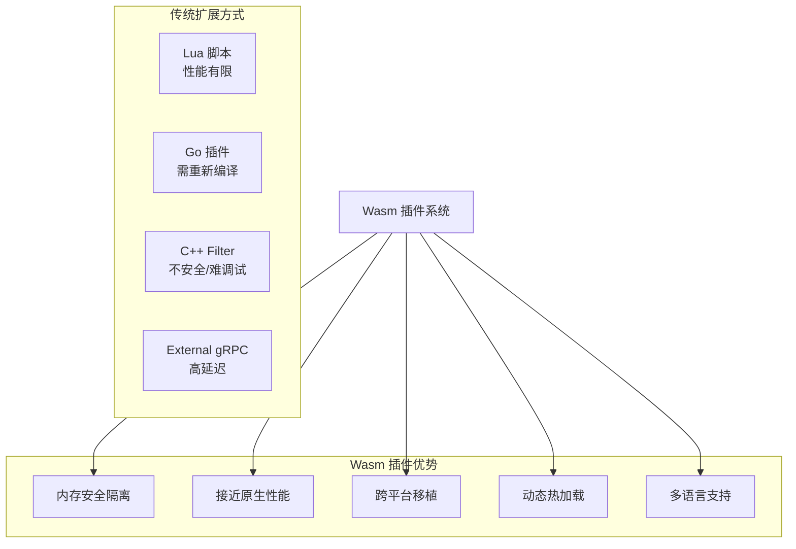
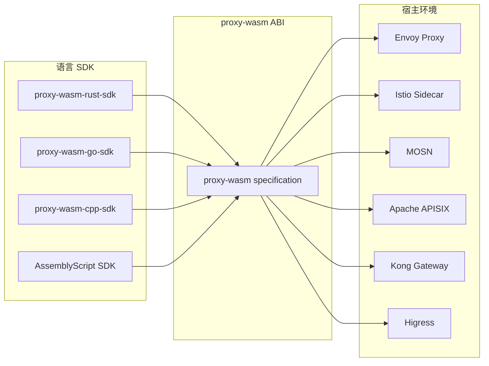
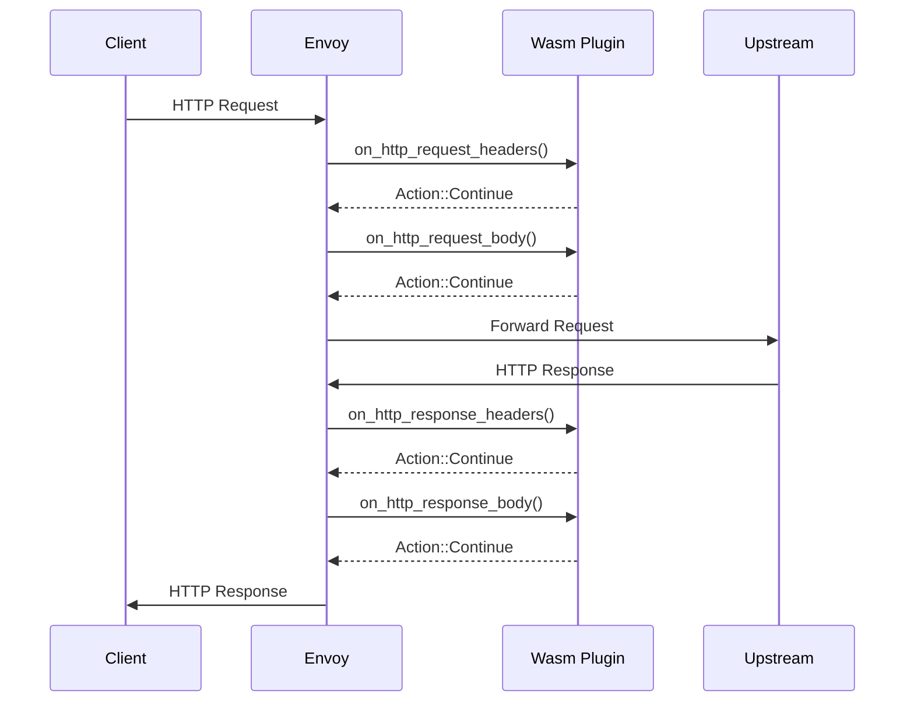
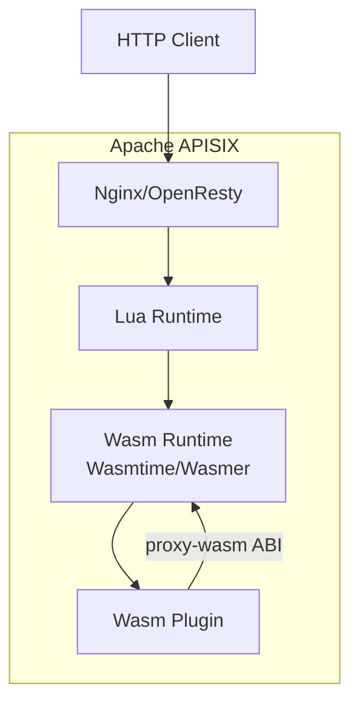

> **生产环境安全提示**
>
> 本文档包含可直接执行的运维命令。执行前请确认：当前目标集群与 Namespace 是否正确；是否具备足够的 RBAC 权限；是否已在非生产环境验证。命令风险等级标注：🔴 高风险（可能造成数据丢失或服务中断）、🟡 中风险（会修改集群状态，但通常可回滚）、🟢 低风险/只读（信息收集，无副作用）。


# Wasm 插件系统 (Wasm Plugin System)

> 基于 WebAssembly 的插件系统通过沙箱安全隔离与高性能执行，实现网络代理、API 网关和服务网格的可编程扩展。

---

<!-- chunk: 目录 -->## 目录

1. [插件系统架构概述](#1-插件系统架构概述)
2. [proxy-wasm 规范详解](#2-proxy-wasm-规范详解)
3. [[entities/envoy.md|Envoy]] Wasm Filter 开发](#3-envoy-wasm-filter-开发)
4. [[entities/istio.md|Istio]] Wasm Plugin 配置](#4-istio-wasm-plugin-配置)
5. [HTTP 头部操作插件](#5-http-头部操作插件)
6. [限流插件实现](#6-限流插件实现)
7. [可观测性插件](#7-可观测性插件)
8. [认证鉴权插件](#8-认证鉴权插件)
9. [数据转换插件](#9-数据转换插件)
10. [插件调试与测试](#10-插件调试与测试)
11. [APISIX Wasm 插件](#11-apisix-wasm-插件)
12. [Kong Wasm 插件](#12-kong-wasm-插件)
13. [性能优化与基准](#13-性能优化与基准)
14. [生产部署最佳实践](#14-生产部署最佳实践)

---

<!-- chunk: 1. 插件系统架构概述 -->## 1. 插件系统架构概述

## 1.1 为什么选择 Wasm 插件

传统网络代理扩展方式的对比：



## 1.2 proxy-wasm 生态全景



## 1.3 proxy-wasm 执行模型



## 1.4 插件生命周期

```
插件生命周期（每个 Worker Thread）：

1. VM 创建阶段
   └── _start() / proxy_on_vm_start()
       └── 初始化全局状态，读取 VM 配置

2. Plugin 配置阶段
   └── proxy_on_configure()
       └── 解析插件配置（JSON/YAML）

3. 请求处理阶段（每个请求）
   ├── proxy_on_context_create()     # 创建请求上下文
   ├── proxy_on_request_headers()    # 处理请求头
   ├── proxy_on_request_body()       # 处理请求体
   ├── proxy_on_request_trailers()   # 处理请求尾部
   ├── proxy_on_response_headers()   # 处理响应头
   ├── proxy_on_response_body()      # 处理响应体
   ├── proxy_on_response_trailers()  # 处理响应尾部
   └── proxy_on_done()               # 请求完成

4. 异步操作
   ├── proxy_on_http_call_response()  # HTTP 回调
   ├── proxy_on_grpc_call_response()  # gRPC 回调
   └── proxy_on_queue_ready()         # 队列消息

5. 定时器
   └── proxy_on_tick()               # 定期触发
```

---

<!-- chunk: 2. proxy-wasm 规范详解 -->## 2. proxy-wasm 规范详解

## 2.1 Host 函数 ABI

proxy-wasm 定义了宿主函数接口，供 Wasm 插件调用：

```
# 核心 Host 函数分类

<!-- chunk: 属性操作 -->## 属性操作
proxy_get_property(path_data, path_size, return_value_data, return_value_size) -> Status
proxy_set_property(path_data, path_size, value_data, value_size) -> Status

<!-- chunk: HTTP 头部操作 -->## HTTP 头部操作
proxy_get_header_map_value(map_type, key_data, key_size, return_value_data, return_value_size) -> Status
proxy_add_header_map_value(map_type, key_data, key_size, value_data, value_size) -> Status
proxy_replace_header_map_value(map_type, key_data, key_size, value_data, value_size) -> Status
proxy_remove_header_map_value(map_type, key_data, key_size) -> Status
proxy_get_header_map_pairs(map_type, return_map_data, return_map_size) -> Status
proxy_set_header_map_pairs(map_type, map_data, map_size) -> Status

<!-- chunk: HTTP Body 操作 -->## HTTP Body 操作
proxy_get_buffer_bytes(buffer_type, start, max_size, return_buffer_data, return_buffer_size) -> Status
proxy_set_buffer_bytes(buffer_type, start, size, buffer_data, buffer_size) -> Status

<!-- chunk: 发送本地响应 -->## 发送本地响应
proxy_send_local_response(status_code, status_code_details_data, status_code_details_size,
    body_data, body_size, headers_data, headers_size, grpc_status) -> Status

<!-- chunk: 发起 HTTP 调用 -->## 发起 HTTP 调用
proxy_http_call(upstream_data, upstream_size, headers_data, headers_size,
    body_data, body_size, trailers_data, trailers_size, timeout, return_token) -> Status

<!-- chunk: 共享数据 -->## 共享数据
proxy_get_shared_data(key_data, key_size, return_value_data, return_value_size, return_cas) -> Status
proxy_set_shared_data(key_data, key_size, value_data, value_size, cas) -> Status

<!-- chunk: 消息队列 -->## 消息队列
proxy_register_shared_queue(name_data, name_size, return_id) -> Status
proxy_resolve_shared_queue(vm_id_data, vm_id_size, name_data, name_size, return_id) -> Status
proxy_dequeue_shared_queue(token, return_data, return_size) -> Status
proxy_enqueue_shared_queue(token, data, size) -> Status

<!-- chunk: 定时器 -->## 定时器
proxy_set_tick_period_milliseconds(period) -> Status

<!-- chunk: 日志 -->## 日志
proxy_log(level, logMessage_data, logMessage_size) -> Status

<!-- chunk: 指标 -->## 指标
proxy_define_metric(metric_type, name_data, name_size, return_id) -> Status
proxy_increment_metric(metric_id, offset) -> Status
proxy_record_metric(metric_id, value) -> Status
proxy_get_metric(metric_id, return_value) -> Status
```

## 2.2 Map 类型常量

```rust
// proxy-wasm map 类型
pub enum MapType {
    HttpRequestHeaders = 0,
    HttpRequestTrailers = 1,
    HttpResponseHeaders = 2,
    HttpResponseTrailers = 3,
    GrpcReceiveInitialMetadata = 4,
    GrpcReceiveTrailingMetadata = 5,
    HttpCallResponseHeaders = 6,
    HttpCallResponseTrailers = 7,
}

// Buffer 类型
pub enum BufferType {
    HttpRequestBody = 0,
    HttpResponseBody = 1,
    NetworkDownstreamData = 2,
    NetworkUpstreamData = 3,
    HttpCallResponseBody = 4,
    GrpcReceiveBuffer = 5,
    VmConfiguration = 6,
    PluginConfiguration = 7,
}

// 返回动作
pub enum Action {
    Continue = 0,  // 继续处理
    Pause = 1,     // 暂停等待异步操作完成
}

// 状态码
pub enum Status {
    Ok = 0,
    NotFound = 1,
    BadArgument = 2,
    SerializationFailure = 3,
    ParseFailure = 4,
    BadExpression = 5,
    InvalidMemoryAccess = 6,
    Empty = 7,
    CasMismatch = 8,
    ResultMismatch = 9,
    InternalFailure = 10,
    BrokenConnection = 11,
    Unimplemented = 12,
}
```

---

<!-- chunk: 3. Envoy Wasm Filter 开发 -->## 3. Envoy Wasm Filter 开发

## 3.1 Rust SDK 开发环境

```bash
# 安装 Rust Wasm 工具链
rustup target add wasm32-wasi
rustup target add wasm32-unknown-unknown

# 创建插件项目
cargo new --lib envoy-wasm-plugin
cd envoy-wasm-plugin

# Cargo.toml 配置
cat > Cargo.toml << 'EOF'
[package]
name = "envoy-wasm-plugin"
version = "0.1.0"
edition = "2021"

[lib]
crate-type = ["cdylib"]

[dependencies]
proxy-wasm = "0.2"
serde = { version = "1", features = ["derive"] }
serde_json = "1"
log = "0.4"

[profile.release]
opt-level = "z"     # 最小化大小
lto = true          # 链接时优化
codegen-units = 1   # 减少代码大小
panic = "abort"     # 删除 panic 处理代码
strip = true        # 剥离符号
EOF
```

## 3.2 完整 HTTP Filter 实现

```rust
// src/lib.rs - 完整的 HTTP 过滤器
use proxy_wasm::traits::*;
use proxy_wasm::types::*;
use serde::{Deserialize, Serialize};
use std::collections::HashMap;

// 插件全局配置
#[derive(Debug, Clone, Deserialize, Serialize)]
struct PluginConfig {
    #[serde(default)]
    add_headers: HashMap<String, String>,
    #[serde(default)]
    remove_headers: Vec<String>,
    #[serde(default)]
    allowed_paths: Vec<String>,
    #[serde(default = "default_upstream")]
    auth_service: String,
    #[serde(default = "default_timeout")]
    timeout_ms: u32,
}

fn default_upstream() -> String {
    "auth-service".to_string()
}

fn default_timeout() -> u32 {
    1000
}

// VM 根上下文（每个 Worker 一个）
struct RootContext {
    config: Option<PluginConfig>,
    metric_request_count: u32,
    metric_error_count: u32,
}

// HTTP 上下文（每个请求一个）
struct HttpContext {
    config: PluginConfig,
    request_start: u64,
    metric_request_count: u32,
    metric_latency: u32,
    auth_token: Option<String>,
    call_token: Option<u32>,
}

// 注册插件工厂
#[no_mangle]
pub fn _start() {
    proxy_wasm::set_log_level(LogLevel::Trace);
    proxy_wasm::set_root_context(|_| -> Box<dyn RootContext> {
        Box::new(RootContext {
            config: None,
            metric_request_count: 0,
            metric_error_count: 0,
        })
    });
}

impl proxy_wasm::traits::Context for RootContext {}

impl proxy_wasm::traits::RootContext for RootContext {
    fn on_vm_start(&mut self, _vm_configuration_size: usize) -> bool {
        log::info!("Plugin VM started");
        true
    }

    fn on_configure(&mut self, _plugin_configuration_size: usize) -> bool {
        // 读取插件配置
        if let Some(config_bytes) = self.get_plugin_configuration() {
            match serde_json::from_slice::<PluginConfig>(&config_bytes) {
                Ok(config) => {
                    log::info!("Plugin configured: {:?}", config);
                    self.config = Some(config);
                }
                Err(e) => {
                    log::error!("Failed to parse plugin config: {}", e);
                    return false;
                }
            }
        } else {
            // 使用默认配置
            self.config = Some(PluginConfig {
                add_headers: HashMap::new(),
                remove_headers: vec![],
                allowed_paths: vec![],
                auth_service: default_upstream(),
                timeout_ms: default_timeout(),
            });
        }

        // 注册指标
        self.metric_request_count = self.define_metric(
            MetricType::Counter,
            "plugin_requests_total",
        ).unwrap_or(0);

        self.metric_error_count = self.define_metric(
            MetricType::Counter,
            "plugin_errors_total",
        ).unwrap_or(0);

        true
    }

    fn create_http_context(&self, context_id: u32) -> Option<Box<dyn HttpContext>> {
        let config = self.config.clone()?;

        // 注册请求延迟指标
        let metric_latency = self.define_metric(
            MetricType::Histogram,
            "plugin_request_duration_ms",
        ).unwrap_or(0);

        Some(Box::new(HttpContext {
            config,
            request_start: 0,
            metric_request_count: self.metric_request_count,
            metric_latency,
            auth_token: None,
            call_token: None,
        }))
    }

    fn get_type(&self) -> Option<ContextType> {
        Some(ContextType::HttpContext)
    }
}

impl proxy_wasm::traits::Context for HttpContext {
    fn on_http_call_response(
        &mut self,
        _token_id: u32,
        _num_headers: usize,
        body_size: usize,
        _num_trailers: usize,
    ) {
        // 处理外部 Auth 服务响应
        let status = self.get_http_call_response_header(":status")
            .unwrap_or_default();

        if status == "200" {
            // 认证通过，继续请求
            if let Some(body) = self.get_http_call_response_body(0, body_size) {
                // 从 auth 响应中提取用户信息
                if let Ok(auth_resp) = serde_json::from_slice::<serde_json::Value>(&body) {
                    if let Some(user_id) = auth_resp["user_id"].as_str() {
                        self.add_http_request_header("x-authenticated-user", user_id);
                    }
                    if let Some(roles) = auth_resp["roles"].as_str() {
                        self.add_http_request_header("x-user-roles", roles);
                    }
                }
            }
            self.resume_http_request();
        } else {
            // 认证失败，返回 401
            self.send_http_response(
                401,
                vec![
                    ("content-type", "application/json"),
                    ("x-error-source", "wasm-auth-plugin"),
                ],
                Some(b"{\"error\":\"Unauthorized\",\"code\":401}"),
            );
        }
    }
}

impl proxy_wasm::traits::HttpContext for HttpContext {
    fn on_http_request_headers(&mut self, _num_headers: usize, _end_of_stream: bool) -> Action {
        // 记录请求开始时间
        self.request_start = self.get_current_time_nanoseconds();

        // 增加请求计数
        self.increment_metric(self.metric_request_count, 1);

        // 路径检查
        let path = self.get_http_request_header(":path")
            .unwrap_or_default();

        // 检查是否是健康检查路径（跳过认证）
        if path == "/health" || path == "/ready" {
            return Action::Continue;
        }

        // 路径白名单检查
        if !self.config.allowed_paths.is_empty() {
            let path_allowed = self.config.allowed_paths.iter()
                .any(|allowed| path.starts_with(allowed));
            if !path_allowed {
                self.send_http_response(
                    403,
                    vec![("content-type", "application/json")],
                    Some(b"{\"error\":\"Forbidden\",\"message\":\"Path not allowed\"}"),
                );
                return Action::Pause;
            }
        }

        // 提取 Authorization 头
        let auth_header = self.get_http_request_header("authorization")
            .unwrap_or_default();

        if auth_header.is_empty() {
            self.send_http_response(
                401,
                vec![
                    ("content-type", "application/json"),
                    ("www-authenticate", "Bearer realm=\"api\""),
                ],
                Some(b"{\"error\":\"Unauthorized\",\"message\":\"Missing Authorization header\"}"),
            );
            return Action::Pause;
        }

        // 调用外部 Auth 服务验证 token
        let token = auth_header.trim_start_matches("Bearer ").to_string();
        self.auth_token = Some(token.clone());

        match self.dispatch_http_call(
            &self.config.auth_service,
            vec![
                (":method", "GET"),
                (":path", "/validate"),
                (":authority", &self.config.auth_service),
                ("authorization", &format!("Bearer {}", token)),
                ("content-type", "application/json"),
            ],
            None,
            vec![],
            std::time::Duration::from_millis(self.config.timeout_ms as u64),
        ) {
            Ok(token_id) => {
                self.call_token = Some(token_id);
                Action::Pause  // 暂停等待 Auth 服务响应
            }
            Err(e) => {
                log::error!("Failed to dispatch auth call: {:?}", e);
                // Auth 服务不可用，根据配置决定是否放行
                Action::Continue
            }
        }
    }

    fn on_http_request_body(&mut self, body_size: usize, end_of_stream: bool) -> Action {
        if !end_of_stream {
            return Action::Pause;
        }

        // 读取并记录请求体大小
        if let Some(body) = self.get_http_request_body(0, body_size) {
            log::debug!("Request body size: {} bytes", body.len());
        }

        Action::Continue
    }

    fn on_http_response_headers(&mut self, _num_headers: usize, _end_of_stream: bool) -> Action {
        // 添加自定义响应头
        for (name, value) in &self.config.add_headers {
            self.add_http_response_header(name, value);
        }

        // 移除敏感响应头
        for header in &self.config.remove_headers {
            self.remove_http_response_header(header);
        }

        // 添加处理标识
        self.add_http_response_header("x-processed-by", "envoy-wasm-plugin/1.0");

        // 添加请求 ID（如果不存在）
        if self.get_http_response_header("x-request-id").is_none() {
            let req_id = format!("req-{}", self.request_start);
            self.add_http_response_header("x-request-id", &req_id);
        }

        Action::Continue
    }

    fn on_http_response_body(&mut self, _body_size: usize, _end_of_stream: bool) -> Action {
        Action::Continue
    }

    fn on_log(&mut self) {
        // 计算请求延迟并记录指标
        let end_time = self.get_current_time_nanoseconds();
        let duration_ms = (end_time - self.request_start) / 1_000_000;

        self.record_metric(self.metric_latency, duration_ms);

        // 结构化日志
        let method = self.get_http_request_header(":method").unwrap_or_default();
        let path = self.get_http_request_header(":path").unwrap_or_default();
        let status = self.get_http_response_header(":status").unwrap_or_default();

        log::info!(
            "request completed: method={} path={} status={} duration_ms={}",
            method, path, status, duration_ms
        );
    }
}
```

## 3.3 构建与部署

> ⚠️ **🟡 中危变更** — 变更集群资源状态，建议先 --dry-run 或 diff 确认
> - `kubectl apply/create/replace`：创建/变更集群资源

``` bash
# 🟡 中风险：会修改集群/资源状态，执行前请确认目标、影响范围与授权
# 构建 Wasm 插件
cargo build --target wasm32-unknown-unknown --release

# 输出路径
ls target/wasm32-unknown-unknown/release/*.wasm

# 优化大小
wasm-opt -Oz \
  -o plugin-optimized.wasm \
  target/wasm32-unknown-unknown/release/envoy_wasm_plugin.wasm

# 检查大小
ls -lh plugin-optimized.wasm

# 部署到 ConfigMap
kubectl create configmap envoy-wasm-plugin \
  --from-file=plugin.wasm=plugin-optimized.wasm \
  -n default
```
---

<!-- chunk: 4. Istio Wasm Plugin 配置 -->## 4. Istio Wasm Plugin 配置

## 4.1 WasmPlugin CRD

```yaml
# istio-wasm-plugin.yaml
apiVersion: extensions.istio.io/v1alpha1
kind: WasmPlugin
metadata:
  name: auth-plugin
  namespace: default
spec:
  selector:
    matchLabels:
      app: my-service
  
  # 插件来源（支持 OCI 镜像或 HTTP URL）
  url: oci://ghcr.io/my-org/auth-wasm-plugin:1.0.0
  
  # 或者使用本地 ConfigMap
  # url: file:///var/local/lib/wasm-filters/plugin.wasm
  
  # SHA256 验证
  sha256: "e0e2b7b1..."
  
  # 执行阶段
  phase: AUTHN
  # 可选: UNSPECIFIED_PHASE, AUTHN, AUTHZ, STATS
  
  # 优先级（同阶段内的顺序）
  priority: 10
  
  # 插件配置（JSON 格式）
  pluginConfig:
    auth_service: "auth-service.default.svc.cluster.local:8080"
    timeout_ms: 500
    allowed_paths:
      - "/public"
      - "/health"
    add_headers:
      x-gateway-version: "v2"
    remove_headers:
      - "x-internal-token"
      - "x-debug-info"
  
  # 镜像拉取密钥
  imagePullSecret: registry-credentials
  
  # VM 配置
  vmConfig:
    # 环境变量
    env:
      - name: LOG_LEVEL
        value: info
      - name: ENVIRONMENT
        valueFrom:
          fieldRef:
            fieldPath: metadata.namespace
```

## 4.2 多阶段插件配置

```yaml
# 认证插件（AUTHN 阶段）
apiVersion: extensions.istio.io/v1alpha1
kind: WasmPlugin
metadata:
  name: jwt-auth
  namespace: istio-system
spec:
  selector:
    matchLabels:
      istio: ingressgateway
  url: oci://registry.example.com/plugins/jwt-auth:2.1.0
  phase: AUTHN
  priority: 100
  pluginConfig:
    jwks_uri: "https://auth.example.com/.well-known/jwks.json"
    issuer: "https://auth.example.com"
    audiences:
      - "api.example.com"
    cache_duration_seconds: 300

---
# 授权插件（AUTHZ 阶段）
apiVersion: extensions.istio.io/v1alpha1
kind: WasmPlugin
metadata:
  name: rbac-authz
  namespace: istio-system
spec:
  selector:
    matchLabels:
      istio: ingressgateway
  url: oci://registry.example.com/plugins/rbac:1.0.0
  phase: AUTHZ
  priority: 100
  pluginConfig:
    policy_endpoint: "http://opa-service:8181/v1/data/authz/allow"
    cache_size: 10000

---
# 统计插件（STATS 阶段）
apiVersion: extensions.istio.io/v1alpha1
kind: WasmPlugin
metadata:
  name: custom-metrics
  namespace: istio-system
spec:
  selector:
    matchLabels:
      istio: ingressgateway
  url: oci://registry.example.com/plugins/metrics:1.2.0
  phase: STATS
  pluginConfig:
    metric_prefix: "envoy_wasm"
    histogram_buckets:
      - 1
      - 5
      - 10
      - 25
      - 50
      - 100
      - 250
      - 500
      - 1000
```

## 4.3 OCI 镜像打包

```dockerfile
# Dockerfile.wasm - 打包 Wasm 插件为 OCI 镜像
FROM scratch

# 复制 Wasm 文件
COPY plugin-optimized.wasm /plugin.wasm

# OCI 标注
LABEL org.opencontainers.image.title="Auth Wasm Plugin"
LABEL org.opencontainers.image.version="1.0.0"
LABEL org.opencontainers.image.description="JWT authentication plugin for Envoy/Istio"
```

``` bash
# 🟢 低风险：只读/信息收集，通常无副作用
# 构建并推送 OCI 镜像
docker buildx build \
  --platform linux/amd64 \
  -t ghcr.io/my-org/auth-wasm-plugin:1.0.0 \
  -f Dockerfile.wasm \
  --push \
  .

# 或使用 crane 推送 Wasm OCI 格式
crane push plugin-optimized.wasm \
  ghcr.io/my-org/auth-wasm-plugin:1.0.0 \
  --media-type application/vnd.module.wasm.content.layer.v1+wasm

# 验证
crane manifest ghcr.io/my-org/auth-wasm-plugin:1.0.0
```
---

<!-- chunk: 5. HTTP 头部操作插件 -->## 5. HTTP 头部操作插件

## 5.1 请求头增强插件

```rust
// 请求头增强：添加追踪 ID、请求元数据
use proxy_wasm::traits::*;
use proxy_wasm::types::*;
use std::collections::HashMap;

struct HeaderEnrichPlugin {
    config: HeaderEnrichConfig,
    request_counter: u32,
}

#[derive(serde::Deserialize, Default)]
struct HeaderEnrichConfig {
    service_name: String,
    service_version: String,
    add_request_id: bool,
    add_timestamp: bool,
    forward_client_ip: bool,
    custom_headers: HashMap<String, String>,
    redact_headers: Vec<String>,
}

impl Context for HeaderEnrichPlugin {}

impl HttpContext for HeaderEnrichPlugin {
    fn on_http_request_headers(&mut self, _: usize, _: bool) -> Action {
        // 1. 生成并注入请求 ID
        if self.config.add_request_id {
            if self.get_http_request_header("x-request-id").is_none() {
                let req_id = self.generate_request_id();
                self.set_http_request_header("x-request-id", Some(&req_id));
            }
        }

        // 2. 注入时间戳
        if self.config.add_timestamp {
            let ts = self.get_current_time_nanoseconds();
            self.set_http_request_header(
                "x-request-timestamp",
                Some(&ts.to_string()),
            );
        }

        // 3. 注入服务标识
        self.set_http_request_header(
            "x-source-service",
            Some(&self.config.service_name),
        );
        self.set_http_request_header(
            "x-source-version",
            Some(&self.config.service_version),
        );

        // 4. 处理客户端 IP
        if self.config.forward_client_ip {
            if let Some(remote_addr) = self.get_property(vec!["source", "address"]) {
                if let Ok(addr) = String::from_utf8(remote_addr) {
                    // 提取 IP 部分
                    let ip = addr.split(':').next().unwrap_or(&addr);
                    
                    // 追加到 X-Forwarded-For
                    let existing = self.get_http_request_header("x-forwarded-for")
                        .unwrap_or_default();
                    let new_xff = if existing.is_empty() {
                        ip.to_string()
                    } else {
                        format!("{}, {}", existing, ip)
                    };
                    self.set_http_request_header("x-forwarded-for", Some(&new_xff));
                    self.set_http_request_header("x-real-ip", Some(ip));
                }
            }
        }

        // 5. 添加自定义头
        for (name, value) in &self.config.custom_headers {
            self.set_http_request_header(name, Some(value));
        }

        // 6. 脱敏敏感头（记录日志但不删除，用于审计）
        for header in &self.config.redact_headers {
            if self.get_http_request_header(header).is_some() {
                self.set_http_request_header(header, Some("***REDACTED***"));
            }
        }

        Action::Continue
    }

    fn on_http_response_headers(&mut self, _: usize, _: bool) -> Action {
        // 将请求 ID 传递到响应头
        if let Some(req_id) = self.get_http_request_header("x-request-id") {
            self.set_http_response_header("x-request-id", Some(&req_id));
        }

        // 安全响应头
        self.set_http_response_header("x-content-type-options", Some("nosniff"));
        self.set_http_response_header("x-frame-options", Some("DENY"));
        self.set_http_response_header("x-xss-protection", Some("1; mode=block"));
        self.set_http_response_header(
            "strict-transport-security",
            Some("max-age=31536000; includeSubDomains"),
        );

        // 移除敏感服务信息
        self.remove_http_response_header("server");
        self.remove_http_response_header("x-powered-by");
        self.remove_http_response_header("x-aspnet-version");

        Action::Continue
    }
}

impl HeaderEnrichPlugin {
    fn generate_request_id(&self) -> String {
        // 使用 proxy-wasm 获取随机数
        let mut buf = [0u8; 16];
        // 在 proxy-wasm 中使用 random_bytes
        format!(
            "{:08x}-{:04x}-4{:03x}-{:04x}-{:012x}",
            self.get_current_time_nanoseconds() & 0xFFFFFFFF,
            (self.get_current_time_nanoseconds() >> 32) & 0xFFFF,
            (self.get_current_time_nanoseconds() >> 48) & 0xFFF,
            0x8000 | ((self.get_current_time_nanoseconds() >> 60) & 0x3FFF),
            self.get_current_time_nanoseconds() & 0xFFFFFFFFFFFF,
        )
    }
}
```

## 5.2 CORS 处理插件

```rust
// CORS 处理插件
use proxy_wasm::traits::*;
use proxy_wasm::types::*;

struct CorsPlugin {
    allowed_origins: Vec<String>,
    allowed_methods: String,
    allowed_headers: String,
    exposed_headers: String,
    max_age: String,
    allow_credentials: bool,
}

impl HttpContext for CorsPlugin {
    fn on_http_request_headers(&mut self, _: usize, _: bool) -> Action {
        let method = self.get_http_request_header(":method")
            .unwrap_or_default();
        let origin = self.get_http_request_header("origin")
            .unwrap_or_default();

        if origin.is_empty() {
            return Action::Continue;
        }

        // 检查 Origin 是否允许
        let origin_allowed = self.allowed_origins.iter()
            .any(|allowed| {
                allowed == "*"
                    || allowed == &origin
                    || (allowed.starts_with("*.") && origin.ends_with(&allowed[1..]))
            });

        if !origin_allowed {
            self.send_http_response(
                403,
                vec![("content-type", "application/json")],
                Some(b"{\"error\":\"CORS origin not allowed\"}"),
            );
            return Action::Pause;
        }

        // 处理 OPTIONS 预检请求
        if method == "OPTIONS" {
            self.send_http_response(
                204,
                vec![
                    ("access-control-allow-origin", &origin),
                    ("access-control-allow-methods", &self.allowed_methods),
                    ("access-control-allow-headers", &self.allowed_headers),
                    ("access-control-max-age", &self.max_age),
                    ("access-control-allow-credentials",
                     if self.allow_credentials { "true" } else { "false" }),
                    ("vary", "Origin"),
                    ("content-length", "0"),
                ],
                None,
            );
            return Action::Pause;
        }

        Action::Continue
    }

    fn on_http_response_headers(&mut self, _: usize, _: bool) -> Action {
        let origin = self.get_http_request_header("origin")
            .unwrap_or_default();

        if !origin.is_empty() {
            let origin_allowed = self.allowed_origins.iter()
                .any(|a| a == "*" || a == &origin);

            if origin_allowed {
                self.set_http_response_header(
                    "access-control-allow-origin",
                    Some(&origin),
                );
                self.set_http_response_header(
                    "access-control-expose-headers",
                    Some(&self.exposed_headers),
                );
                if self.allow_credentials {
                    self.set_http_response_header(
                        "access-control-allow-credentials",
                        Some("true"),
                    );
                }
                self.set_http_response_header("vary", Some("Origin"));
            }
        }

        Action::Continue
    }
}
```

---

<!-- chunk: 6. 限流插件实现 -->## 6. 限流插件实现

## 6.1 基于令牌桶的限流

```rust
// 令牌桶限流插件（使用 proxy-wasm 共享内存）
use proxy_wasm::traits::*;
use proxy_wasm::types::*;
use serde::{Deserialize, Serialize};
use std::collections::HashMap;

#[derive(Deserialize)]
struct RateLimitConfig {
    rules: Vec<RateLimitRule>,
    default_limit: Option<u32>,
    key_type: KeyType,
    response_headers: bool,
}

#[derive(Deserialize)]
struct RateLimitRule {
    #[serde(default)]
    path_prefix: String,
    requests_per_second: u32,
    burst: u32,
}

#[derive(Deserialize)]
enum KeyType {
    #[serde(rename = "ip")]
    ClientIp,
    #[serde(rename = "header")]
    Header(String),
    #[serde(rename = "user")]
    AuthenticatedUser,
}

#[derive(Serialize, Deserialize)]
struct TokenBucket {
    tokens: f64,
    last_refill: u64,
    rate: f64,
    burst: f64,
}

impl TokenBucket {
    fn new(rate: u32, burst: u32) -> Self {
        Self {
            tokens: burst as f64,
            last_refill: 0,
            rate: rate as f64,
            burst: burst as f64,
        }
    }

    fn try_consume(&mut self, current_time_ns: u64) -> bool {
        // 补充令牌
        if self.last_refill > 0 {
            let elapsed_secs = (current_time_ns - self.last_refill) as f64 / 1e9;
            self.tokens = (self.tokens + elapsed_secs * self.rate).min(self.burst);
        }
        self.last_refill = current_time_ns;

        if self.tokens >= 1.0 {
            self.tokens -= 1.0;
            true
        } else {
            false
        }
    }

    fn tokens_remaining(&self) -> u32 {
        self.tokens as u32
    }

    fn reset_time(&self, current_time_ns: u64) -> u64 {
        if self.tokens < 1.0 {
            let needed = 1.0 - self.tokens;
            let wait_secs = needed / self.rate;
            current_time_ns + (wait_secs * 1e9) as u64
        } else {
            current_time_ns
        }
    }
}

struct RateLimitPlugin {
    config: RateLimitConfig,
}

impl Context for RateLimitPlugin {}

impl HttpContext for RateLimitPlugin {
    fn on_http_request_headers(&mut self, _: usize, _: bool) -> Action {
        // 提取限流键
        let limit_key = self.extract_limit_key();
        let path = self.get_http_request_header(":path")
            .unwrap_or_default();

        // 匹配限流规则
        let rule = self.match_rule(&path);
        let (rate, burst) = match rule {
            Some(r) => (r.requests_per_second, r.burst),
            None => match self.config.default_limit {
                Some(limit) => (limit, limit * 2),
                None => return Action::Continue,
            },
        };

        let current_time = self.get_current_time_nanoseconds();
        let shared_key = format!("rl:{}:{}", limit_key, path);

        // 使用 CAS 操作原子更新令牌桶
        let (allowed, remaining, reset_time) = self.check_and_update_bucket(
            &shared_key,
            rate,
            burst,
            current_time,
        );

        if self.config.response_headers {
            // 通过存储限流信息供响应阶段使用
            self.set_shared_data(
                &format!("rl_headers:{}", limit_key),
                Some(format!("{},{},{}", rate, remaining, reset_time).as_bytes()),
                None,
            ).ok();
        }

        if !allowed {
            let retry_after = ((reset_time - current_time) / 1_000_000_000 + 1).to_string();
            self.send_http_response(
                429,
                vec![
                    ("content-type", "application/json"),
                    ("retry-after", &retry_after),
                    ("x-ratelimit-limit", &rate.to_string()),
                    ("x-ratelimit-remaining", "0"),
                    ("x-ratelimit-reset", &reset_time.to_string()),
                ],
                Some(b"{\"error\":\"Too Many Requests\",\"code\":429,\"message\":\"Rate limit exceeded\"}"),
            );
            return Action::Pause;
        }

        Action::Continue
    }

    fn on_http_response_headers(&mut self, _: usize, _: bool) -> Action {
        if self.config.response_headers {
            let limit_key = self.extract_limit_key();
            if let Ok(Some((data, _))) = self.get_shared_data(
                &format!("rl_headers:{}", limit_key)
            ) {
                if let Ok(s) = String::from_utf8(data) {
                    let parts: Vec<&str> = s.split(',').collect();
                    if parts.len() == 3 {
                        self.set_http_response_header(
                            "x-ratelimit-limit",
                            Some(parts[0]),
                        );
                        self.set_http_response_header(
                            "x-ratelimit-remaining",
                            Some(parts[1]),
                        );
                        self.set_http_response_header(
                            "x-ratelimit-reset",
                            Some(parts[2]),
                        );
                    }
                }
            }
        }
        Action::Continue
    }
}

impl RateLimitPlugin {
    fn extract_limit_key(&self) -> String {
        match &self.config.key_type {
            KeyType::ClientIp => {
                self.get_property(vec!["source", "address"])
                    .and_then(|b| String::from_utf8(b).ok())
                    .map(|addr| addr.split(':').next().unwrap_or("unknown").to_string())
                    .unwrap_or_else(|| "unknown".to_string())
            }
            KeyType::Header(header) => {
                self.get_http_request_header(header)
                    .unwrap_or_else(|| "unknown".to_string())
            }
            KeyType::AuthenticatedUser => {
                self.get_http_request_header("x-authenticated-user")
                    .or_else(|| self.get_http_request_header("x-user-id"))
                    .unwrap_or_else(|| "anonymous".to_string())
            }
        }
    }

    fn match_rule<'a>(&'a self, path: &str) -> Option<&'a RateLimitRule> {
        self.config.rules.iter()
            .filter(|r| path.starts_with(&r.path_prefix))
            .max_by_key(|r| r.path_prefix.len())
    }

    fn check_and_update_bucket(
        &self,
        key: &str,
        rate: u32,
        burst: u32,
        current_time: u64,
    ) -> (bool, u32, u64) {
        loop {
            // 获取当前桶状态（带 CAS 版本）
            let (bucket, cas) = match self.get_shared_data(key) {
                Ok((Some(data), cas)) => {
                    match serde_json::from_slice::<TokenBucket>(&data) {
                        Ok(b) => (b, cas),
                        Err(_) => (TokenBucket::new(rate, burst), None),
                    }
                }
                _ => (TokenBucket::new(rate, burst), None),
            };

            let mut bucket = bucket;
            let allowed = bucket.try_consume(current_time);
            let remaining = bucket.tokens_remaining();
            let reset_time = bucket.reset_time(current_time);

            // 序列化并 CAS 写入
            let data = serde_json::to_vec(&bucket).unwrap_or_default();
            match self.set_shared_data(key, Some(&data), cas) {
                Ok(_) => return (allowed, remaining, reset_time),
                Err(Status::CasMismatch) => continue,  // 重试
                Err(_) => return (true, burst, current_time),  // 错误时放行
            }
        }
    }
}
```

## 6.2 分布式限流（外部服务）

```rust
// 基于 Redis/外部服务的分布式限流
struct DistributedRateLimitPlugin {
    config: DistributedRLConfig,
    call_token: Option<u32>,
    limit_key: String,
}

#[derive(serde::Deserialize)]
struct DistributedRLConfig {
    rate_limit_service: String,
    timeout_ms: u32,
    fail_open: bool,  // 限流服务失败时是否放行
}

impl Context for DistributedRateLimitPlugin {
    fn on_http_call_response(&mut self, _: u32, _: usize, body_size: usize, _: usize) {
        let status = self.get_http_call_response_header(":status")
            .unwrap_or_default();

        match status.as_str() {
            "200" => {
                // 允许通过
                self.add_http_request_header("x-ratelimit-allowed", "true");
                self.resume_http_request();
            }
            "429" => {
                // 限流
                let body = self.get_http_call_response_body(0, body_size)
                    .unwrap_or_default();
                self.send_http_response(429, vec![], Some(&body));
            }
            _ => {
                if self.config.fail_open {
                    self.resume_http_request();
                } else {
                    self.send_http_response(
                        503,
                        vec![],
                        Some(b"{\"error\":\"Rate limit service unavailable\"}"),
                    );
                }
            }
        }
    }
}

impl HttpContext for DistributedRateLimitPlugin {
    fn on_http_request_headers(&mut self, _: usize, _: bool) -> Action {
        let client_ip = self.get_property(vec!["source", "address"])
            .and_then(|b| String::from_utf8(b).ok())
            .unwrap_or_else(|| "unknown".to_string());

        let path = self.get_http_request_header(":path")
            .unwrap_or_default();

        self.limit_key = format!("{}:{}", client_ip, path);

        let check_request = serde_json::json!({
            "key": self.limit_key,
            "descriptors": [{"key": "path", "value": path}]
        });

        match self.dispatch_http_call(
            &self.config.rate_limit_service,
            vec![
                (":method", "POST"),
                (":path", "/ratelimit"),
                (":authority", &self.config.rate_limit_service),
                ("content-type", "application/json"),
            ],
            Some(check_request.to_string().as_bytes()),
            vec![],
            std::time::Duration::from_millis(self.config.timeout_ms as u64),
        ) {
            Ok(token) => {
                self.call_token = Some(token);
                Action::Pause
            }
            Err(_) => {
                if self.config.fail_open {
                    Action::Continue
                } else {
                    self.send_http_response(503, vec![], None);
                    Action::Pause
                }
            }
        }
    }
}
```

---

<!-- chunk: 7. 可观测性插件 -->## 7. 可观测性插件

## 7.1 自定义指标插件

```rust
// 全面的可观测性插件
use proxy_wasm::traits::*;
use proxy_wasm::types::*;
use std::collections::HashMap;

struct ObservabilityPlugin {
    // 指标 ID 映射
    metrics: ObservabilityMetrics,
    config: ObsConfig,
}

struct ObservabilityMetrics {
    request_total: u32,
    request_duration_ms: u32,
    request_body_bytes: u32,
    response_body_bytes: u32,
    error_total: u32,
    upstream_duration_ms: u32,
}

#[derive(serde::Deserialize)]
struct ObsConfig {
    metric_prefix: String,
    trace_sampling_rate: f64,
    log_slow_requests_ms: u64,
    #[serde(default)]
    custom_labels: HashMap<String, String>,
}

impl RootContext for ObsPlugin {
    fn on_configure(&mut self, _: usize) -> bool {
        // 注册所有指标
        let prefix = self.config.metric_prefix.as_str();

        self.metrics = ObservabilityMetrics {
            request_total: self.define_metric(
                MetricType::Counter,
                &format!("{}_requests_total", prefix),
            ).unwrap_or(0),
            request_duration_ms: self.define_metric(
                MetricType::Histogram,
                &format!("{}_request_duration_milliseconds", prefix),
            ).unwrap_or(0),
            request_body_bytes: self.define_metric(
                MetricType::Counter,
                &format!("{}_request_body_bytes_total", prefix),
            ).unwrap_or(0),
            response_body_bytes: self.define_metric(
                MetricType::Counter,
                &format!("{}_response_body_bytes_total", prefix),
            ).unwrap_or(0),
            error_total: self.define_metric(
                MetricType::Counter,
                &format!("{}_errors_total", prefix),
            ).unwrap_or(0),
            upstream_duration_ms: self.define_metric(
                MetricType::Histogram,
                &format!("{}_upstream_duration_milliseconds", prefix),
            ).unwrap_or(0),
        };

        true
    }
}

struct ObsHttpContext {
    metrics: ObservabilityMetrics,
    config: ObsConfig,
    start_time: u64,
    request_size: usize,
    response_size: usize,
    should_trace: bool,
}

impl HttpContext for ObsHttpContext {
    fn on_http_request_headers(&mut self, _: usize, _: bool) -> Action {
        self.start_time = self.get_current_time_nanoseconds();

        // 采样决策
        let rand_val = (self.start_time % 10000) as f64 / 10000.0;
        self.should_trace = rand_val < self.config.trace_sampling_rate;

        // 注入追踪 ID
        if self.should_trace {
            let trace_id = format!("{:032x}", self.start_time);
            let span_id = format!("{:016x}", self.start_time >> 16);
            self.set_http_request_header(
                "x-b3-traceid",
                Some(&trace_id),
            );
            self.set_http_request_header(
                "x-b3-spanid",
                Some(&span_id),
            );
            self.set_http_request_header(
                "x-b3-sampled",
                Some("1"),
            );
        }

        Action::Continue
    }

    fn on_http_request_body(&mut self, body_size: usize, end_of_stream: bool) -> Action {
        self.request_size += body_size;
        Action::Continue
    }

    fn on_http_response_body(&mut self, body_size: usize, end_of_stream: bool) -> Action {
        self.response_size += body_size;
        Action::Continue
    }

    fn on_log(&mut self) {
        let end_time = self.get_current_time_nanoseconds();
        let duration_ms = (end_time - self.start_time) / 1_000_000;

        // 提取请求/响应信息
        let method = self.get_http_request_header(":method")
            .unwrap_or_else(|| "unknown".to_string());
        let path = self.get_http_request_header(":path")
            .unwrap_or_default();
        let status_str = self.get_http_response_header(":status")
            .unwrap_or_else(|| "0".to_string());
        let status: u32 = status_str.parse().unwrap_or(0);

        // 记录指标
        self.increment_metric(self.metrics.request_total, 1);
        self.record_metric(self.metrics.request_duration_ms, duration_ms);
        self.increment_metric(self.metrics.request_body_bytes, self.request_size as u64);
        self.increment_metric(self.metrics.response_body_bytes, self.response_size as u64);

        if status >= 400 {
            self.increment_metric(self.metrics.error_total, 1);
        }

        // 慢请求日志
        if duration_ms > self.config.log_slow_requests_ms {
            log::warn!(
                "slow_request: method={} path={} status={} duration_ms={} request_bytes={} response_bytes={}",
                method, path, status, duration_ms, self.request_size, self.response_size
            );
        }

        // 追踪日志
        if self.should_trace {
            let trace_id = self.get_http_request_header("x-b3-traceid")
                .unwrap_or_default();
            log::info!(
                "trace: trace_id={} method={} path={} status={} duration_ms={}",
                trace_id, method, path, status, duration_ms
            );
        }
    }
}
```

## 7.2 请求/响应体采样插件

```rust
// 请求体审计采样插件
use proxy_wasm::traits::*;
use proxy_wasm::types::*;

struct AuditPlugin {
    sample_rate: f64,
    max_body_size: usize,
    audit_queue_id: Option<u32>,
    should_audit: bool,
    request_data: Vec<u8>,
}

impl Context for AuditPlugin {}

impl HttpContext for AuditPlugin {
    fn on_http_request_headers(&mut self, _: usize, _: bool) -> Action {
        // 采样决策
        let ts = self.get_current_time_nanoseconds();
        self.should_audit = (ts % 10000) as f64 / 10000.0 < self.sample_rate;
        Action::Continue
    }

    fn on_http_request_body(&mut self, body_size: usize, end_of_stream: bool) -> Action {
        if !self.should_audit {
            return Action::Continue;
        }

        // 读取请求体（限制大小）
        let read_size = body_size.min(self.max_body_size);
        if let Some(body) = self.get_http_request_body(0, read_size) {
            self.request_data = body;
        }

        if end_of_stream {
            self.flush_audit_record();
        }

        Action::Continue
    }

    fn on_log(&mut self) {
        if !self.should_audit {
            return;
        }

        let method = self.get_http_request_header(":method")
            .unwrap_or_default();
        let path = self.get_http_request_header(":path")
            .unwrap_or_default();
        let status = self.get_http_response_header(":status")
            .unwrap_or_default();
        let user = self.get_http_request_header("x-authenticated-user")
            .unwrap_or_else(|| "anonymous".to_string());

        let audit_record = serde_json::json!({
            "timestamp": self.get_current_time_nanoseconds(),
            "method": method,
            "path": path,
            "status": status,
            "user": user,
            "request_body_preview": String::from_utf8_lossy(&self.request_data[..self.request_data.len().min(200)]),
        });

        // 推送到共享队列
        if let Some(queue_id) = self.audit_queue_id {
            let data = audit_record.to_string();
            self.enqueue_shared_queue(queue_id, Some(data.as_bytes())).ok();
        }
    }
}
```

---

<!-- chunk: 8. 认证鉴权插件 -->## 8. 认证鉴权插件

## 8.1 JWT 验证插件

```rust
// JWT 验证插件（不依赖外部服务，本地验证）
use proxy_wasm::traits::*;
use proxy_wasm::types::*;
use serde::{Deserialize, Serialize};
use std::collections::HashMap;

#[derive(Deserialize)]
struct JwtConfig {
    issuer: String,
    audiences: Vec<String>,
    jwks_keys: Vec<JwkKey>,    // 预配置的公钥（避免 JWKS 端点调用）
    clock_skew_seconds: i64,
    header_name: String,
    cookie_name: Option<String>,
    extract_claims: Vec<String>, // 要提取并注入为头部的 claim
}

#[derive(Deserialize, Clone)]
struct JwkKey {
    kid: String,
    kty: String,  // "RSA" or "EC"
    alg: String,  // "RS256", "ES256"
    n: Option<String>,   // RSA modulus
    e: Option<String>,   // RSA exponent
    x: Option<String>,   // EC x coordinate
    y: Option<String>,   // EC y coordinate
    crv: Option<String>, // EC curve
}

#[derive(Deserialize, Serialize)]
struct JwtClaims {
    iss: String,
    sub: String,
    #[serde(default)]
    aud: OneOrMany,
    exp: i64,
    iat: i64,
    #[serde(default)]
    nbf: Option<i64>,
    #[serde(flatten)]
    extra: HashMap<String, serde_json::Value>,
}

#[derive(Deserialize, Serialize)]
#[serde(untagged)]
enum OneOrMany {
    One(String),
    Many(Vec<String>),
}

impl Default for OneOrMany {
    fn default() -> Self { OneOrMany::Many(vec![]) }
}

struct JwtPlugin {
    config: JwtConfig,
}

impl HttpContext for JwtPlugin {
    fn on_http_request_headers(&mut self, _: usize, _: bool) -> Action {
        // 提取 JWT
        let token = self.extract_token();

        let token = match token {
            Some(t) => t,
            None => {
                self.send_http_response(
                    401,
                    vec![
                        ("content-type", "application/json"),
                        ("www-authenticate", &format!(
                            "Bearer realm=\"api\", error=\"invalid_request\", error_description=\"Missing token\""
                        )),
                    ],
                    Some(b"{\"error\":\"invalid_request\",\"error_description\":\"Missing authorization token\"}"),
                );
                return Action::Pause;
            }
        };

        // 解析并验证 JWT（简化实现，实际需要密码学验证）
        match self.validate_jwt(&token) {
            Ok(claims) => {
                // 注入 claims 到请求头
                self.set_http_request_header("x-jwt-sub", Some(&claims.sub));
                self.set_http_request_header("x-jwt-iss", Some(&claims.iss));

                // 提取自定义 claims
                for claim_name in &self.config.extract_claims {
                    if let Some(value) = claims.extra.get(claim_name) {
                        let header_name = format!("x-jwt-{}", claim_name.replace('_', "-"));
                        let header_value = match value {
                            serde_json::Value::String(s) => s.clone(),
                            other => other.to_string(),
                        };
                        self.set_http_request_header(&header_name, Some(&header_value));
                    }
                }

                // 移除原始 token 头（安全）
                self.remove_http_request_header(&self.config.header_name);

                Action::Continue
            }
            Err(e) => {
                log::warn!("JWT validation failed: {}", e);
                self.send_http_response(
                    401,
                    vec![
                        ("content-type", "application/json"),
                        ("www-authenticate", &format!(
                            "Bearer realm=\"api\", error=\"invalid_token\", error_description=\"{}\"",
                            e
                        )),
                    ],
                    Some(format!("{{\"error\":\"invalid_token\",\"error_description\":\"{}\"}}", e).as_bytes()),
                );
                Action::Pause
            }
        }
    }
}

impl JwtPlugin {
    fn extract_token(&self) -> Option<String> {
        // 1. 从 Authorization 头提取
        if let Some(auth) = self.get_http_request_header(&self.config.header_name) {
            if auth.starts_with("Bearer ") {
                return Some(auth[7..].to_string());
            }
        }

        // 2. 从 Cookie 提取
        if let Some(cookie_name) = &self.config.cookie_name {
            if let Some(cookie_header) = self.get_http_request_header("cookie") {
                for cookie in cookie_header.split(';') {
                    let parts: Vec<&str> = cookie.trim().splitn(2, '=').collect();
                    if parts.len() == 2 && parts[0] == cookie_name {
                        return Some(parts[1].to_string());
                    }
                }
            }
        }

        // 3. 从 Query 参数提取
        if let Some(path_query) = self.get_http_request_header(":path") {
            if let Some(query_start) = path_query.find('?') {
                let query = &path_query[query_start + 1..];
                for param in query.split('&') {
                    let parts: Vec<&str> = param.splitn(2, '=').collect();
                    if parts.len() == 2 && parts[0] == "access_token" {
                        return Some(parts[1].to_string());
                    }
                }
            }
        }

        None
    }

    fn validate_jwt(&self, token: &str) -> Result<JwtClaims, String> {
        // JWT 由三部分组成: header.payload.signature
        let parts: Vec<&str> = token.split('.').collect();
        if parts.len() != 3 {
            return Err("Invalid JWT format".to_string());
        }

        // 解码 payload（Base64URL 解码）
        let payload = base64url_decode(parts[1])
            .map_err(|e| format!("Failed to decode payload: {}", e))?;

        let claims: JwtClaims = serde_json::from_slice(&payload)
            .map_err(|e| format!("Failed to parse claims: {}", e))?;

        // 验证 issuer
        if claims.iss != self.config.issuer {
            return Err(format!("Invalid issuer: expected {}, got {}", self.config.issuer, claims.iss));
        }

        // 验证 audience
        let aud_list = match &claims.aud {
            OneOrMany::One(s) => vec![s.as_str()],
            OneOrMany::Many(v) => v.iter().map(|s| s.as_str()).collect(),
        };
        let aud_valid = self.config.audiences.iter()
            .any(|a| aud_list.contains(&a.as_str()));
        if !aud_valid && !self.config.audiences.is_empty() {
            return Err("Invalid audience".to_string());
        }

        // 验证时间
        let now = (self.get_current_time_nanoseconds() / 1_000_000_000) as i64;
        if claims.exp < now - self.config.clock_skew_seconds {
            return Err(format!("Token expired at {}", claims.exp));
        }
        if claims.iat > now + self.config.clock_skew_seconds {
            return Err("Token issued in the future".to_string());
        }
        if let Some(nbf) = claims.nbf {
            if nbf > now + self.config.clock_skew_seconds {
                return Err("Token not yet valid".to_string());
            }
        }

        // TODO: 验证签名（需要实现 RSA/ECDSA 验证）
        // 在生产环境中必须验证签名
        // 这里简化处理，实际需要使用 crypto 库

        Ok(claims)
    }
}

fn base64url_decode(input: &str) -> Result<Vec<u8>, String> {
    // 添加 padding
    let padded = match input.len() % 4 {
        0 => input.to_string(),
        2 => format!("{}==", input),
        3 => format!("{}=", input),
        _ => return Err("Invalid base64url".to_string()),
    };

    // 替换 URL 安全字符
    let standard = padded.replace('-', "+").replace('_', "/");

    // 解码（简化实现，实际使用 base64 crate）
    Ok(standard.into_bytes()) // 简化
}
```

---

<!-- chunk: 9. 数据转换插件 -->## 9. 数据转换插件

## 9.1 请求/响应体转换插件

```rust
// JSON <-> XML 转换插件
use proxy_wasm::traits::*;
use proxy_wasm::types::*;
use serde_json::Value;

struct BodyTransformPlugin {
    config: TransformConfig,
    request_body: Vec<u8>,
    transform_request: bool,
    transform_response: bool,
}

#[derive(serde::Deserialize)]
struct TransformConfig {
    request_transform: Option<TransformRule>,
    response_transform: Option<TransformRule>,
    #[serde(default = "default_max_size")]
    max_body_size: usize,
}

fn default_max_size() -> usize { 1024 * 1024 } // 1MB

#[derive(serde::Deserialize)]
struct TransformRule {
    from_format: Format,
    to_format: Format,
    field_mappings: Vec<FieldMapping>,
    add_fields: std::collections::HashMap<String, Value>,
    remove_fields: Vec<String>,
}

#[derive(serde::Deserialize)]
enum Format {
    #[serde(rename = "json")]
    Json,
    #[serde(rename = "xml")]
    Xml,
    #[serde(rename = "form")]
    FormEncoded,
}

#[derive(serde::Deserialize)]
struct FieldMapping {
    from: String,
    to: String,
    transform: Option<String>,  // "uppercase", "lowercase", "string", "number"
}

impl Context for BodyTransformPlugin {}

impl HttpContext for BodyTransformPlugin {
    fn on_http_request_headers(&mut self, _: usize, _: bool) -> Action {
        self.transform_request = self.config.request_transform.is_some();
        Action::Continue
    }

    fn on_http_request_body(&mut self, body_size: usize, end_of_stream: bool) -> Action {
        if !self.transform_request || !end_of_stream {
            if !end_of_stream {
                return Action::Pause;  // 等待完整 body
            }
            return Action::Continue;
        }

        let read_size = body_size.min(self.config.max_body_size);
        if let Some(body) = self.get_http_request_body(0, read_size) {
            if let Some(rule) = &self.config.request_transform {
                match self.apply_transform(&body, rule) {
                    Ok(transformed) => {
                        // 更新请求体
                        self.set_http_request_body(0, body_size, &transformed);
                        // 更新 Content-Length
                        self.set_http_request_header(
                            "content-length",
                            Some(&transformed.len().to_string()),
                        );
                        // 更新 Content-Type
                        let content_type = match &rule.to_format {
                            Format::Json => "application/json",
                            Format::Xml => "application/xml",
                            Format::FormEncoded => "application/x-www-form-urlencoded",
                        };
                        self.set_http_request_header("content-type", Some(content_type));
                    }
                    Err(e) => {
                        log::error!("Body transform failed: {}", e);
                        self.send_http_response(
                            400,
                            vec![("content-type", "application/json")],
                            Some(format!("{{\"error\":\"Body transformation failed: {}\"}}", e).as_bytes()),
                        );
                        return Action::Pause;
                    }
                }
            }
        }

        Action::Continue
    }

    fn on_http_response_headers(&mut self, _: usize, _: bool) -> Action {
        self.transform_response = self.config.response_transform.is_some();
        Action::Continue
    }

    fn on_http_response_body(&mut self, body_size: usize, end_of_stream: bool) -> Action {
        if !self.transform_response || !end_of_stream {
            if !end_of_stream {
                return Action::Pause;
            }
            return Action::Continue;
        }

        let read_size = body_size.min(self.config.max_body_size);
        if let Some(body) = self.get_http_response_body(0, read_size) {
            if let Some(rule) = &self.config.response_transform {
                if let Ok(transformed) = self.apply_transform(&body, rule) {
                    self.set_http_response_body(0, body_size, &transformed);
                    self.set_http_response_header(
                        "content-length",
                        Some(&transformed.len().to_string()),
                    );
                }
            }
        }

        Action::Continue
    }
}

impl BodyTransformPlugin {
    fn apply_transform(&self, body: &[u8], rule: &TransformRule) -> Result<Vec<u8>, String> {
        // 解析输入
        let mut json_value = match &rule.from_format {
            Format::Json => {
                serde_json::from_slice(body)
                    .map_err(|e| format!("JSON parse error: {}", e))?
            }
            Format::FormEncoded => {
                let s = String::from_utf8_lossy(body);
                let mut map = serde_json::Map::new();
                for pair in s.split('&') {
                    let parts: Vec<&str> = pair.splitn(2, '=').collect();
                    if parts.len() == 2 {
                        map.insert(
                            parts[0].to_string(),
                            Value::String(parts[1].to_string()),
                        );
                    }
                }
                Value::Object(map)
            }
            Format::Xml => {
                // 简化的 XML 解析
                Value::Object(serde_json::Map::new())
            }
        };

        // 字段映射
        if let Value::Object(ref mut map) = json_value {
            for mapping in &rule.field_mappings {
                if let Some(value) = map.remove(&mapping.from) {
                    let transformed_value = match mapping.transform.as_deref() {
                        Some("uppercase") => {
                            if let Value::String(s) = value {
                                Value::String(s.to_uppercase())
                            } else { value }
                        }
                        Some("lowercase") => {
                            if let Value::String(s) = value {
                                Value::String(s.to_lowercase())
                            } else { value }
                        }
                        Some("string") => {
                            Value::String(value.to_string())
                        }
                        Some("number") => {
                            if let Value::String(s) = &value {
                                s.parse::<f64>()
                                    .map(Value::from)
                                    .unwrap_or(value)
                            } else { value }
                        }
                        _ => value,
                    };
                    map.insert(mapping.to.clone(), transformed_value);
                }
            }

            // 添加字段
            for (key, value) in &rule.add_fields {
                map.insert(key.clone(), value.clone());
            }

            // 删除字段
            for field in &rule.remove_fields {
                map.remove(field);
            }
        }

        // 序列化输出
        match &rule.to_format {
            Format::Json => {
                serde_json::to_vec(&json_value)
                    .map_err(|e| format!("JSON serialize error: {}", e))
            }
            Format::FormEncoded => {
                if let Value::Object(map) = json_value {
                    let encoded: Vec<String> = map.iter()
                        .map(|(k, v)| format!("{}={}", k, v.as_str().unwrap_or("")))
                        .collect();
                    Ok(encoded.join("&").into_bytes())
                } else {
                    Err("Cannot convert non-object to form-encoded".to_string())
                }
            }
            Format::Xml => {
                // 简化的 XML 序列化
                Ok(format!("<root>{:?}</root>", json_value).into_bytes())
            }
        }
    }
}
```

---

<!-- chunk: 10. 插件调试与测试 -->## 10. 插件调试与测试

## 10.1 单元测试

```rust
// tests/plugin_test.rs
#[cfg(test)]
mod tests {
    use proxy_wasm_test::*;

    #[test]
    fn test_rate_limit_allows_first_request() {
        let mut mock = MockHostFunctions::new();
        mock.set_current_time(1000000000000);
        mock.set_plugin_config(serde_json::json!({
            "requests_per_second": 10,
            "burst": 20
        }));

        let action = simulate_http_request_headers(
            &mut mock,
            vec![
                (":method", "GET"),
                (":path", "/api/test"),
                (":authority", "example.com"),
                ("x-real-ip", "192.168.1.1"),
            ],
        );

        assert_eq!(action, Action::Continue);
        assert!(!mock.sent_local_response());
    }

    #[test]
    fn test_rate_limit_blocks_exceeded_requests() {
        let mut mock = MockHostFunctions::new();
        mock.set_current_time(1000000000000);
        mock.set_plugin_config(serde_json::json!({
            "requests_per_second": 1,
            "burst": 1
        }));

        // 第一个请求通过
        simulate_http_request_headers(&mut mock, vec![
            (":method", "GET"),
            (":path", "/api/test"),
            ("x-real-ip", "192.168.1.1"),
        ]);

        // 第二个请求被限流（同一时刻）
        let action = simulate_http_request_headers(&mut mock, vec![
            (":method", "GET"),
            (":path", "/api/test"),
            ("x-real-ip", "192.168.1.1"),
        ]);

        assert_eq!(action, Action::Pause);
        assert!(mock.sent_local_response());
        assert_eq!(mock.local_response_status(), 429);
    }

    #[test]
    fn test_jwt_plugin_valid_token() {
        let mut mock = MockHostFunctions::new();
        mock.set_plugin_config(serde_json::json!({
            "issuer": "https://auth.example.com",
            "audiences": ["api.example.com"],
            "header_name": "authorization",
            "clock_skew_seconds": 60
        }));

        // 有效的 JWT（Base64 编码的 payload，不含签名验证）
        let token = create_test_jwt("https://auth.example.com", "user123");

        let action = simulate_http_request_headers(&mut mock, vec![
            (":method", "GET"),
            (":path", "/api/data"),
            ("authorization", &format!("Bearer {}", token)),
        ]);

        assert_eq!(action, Action::Continue);
        assert_eq!(
            mock.get_added_request_header("x-jwt-sub"),
            Some("user123".to_string())
        );
    }
}

fn create_test_jwt(issuer: &str, sub: &str) -> String {
    let now = std::time::SystemTime::now()
        .duration_since(std::time::UNIX_EPOCH)
        .unwrap()
        .as_secs() as i64;

    let header = base64url_encode(b"{\"alg\":\"RS256\",\"typ\":\"JWT\"}");
    let payload = base64url_encode(
        serde_json::json!({
            "iss": issuer,
            "sub": sub,
            "aud": ["api.example.com"],
            "exp": now + 3600,
            "iat": now,
        }).to_string().as_bytes()
    );
    let signature = base64url_encode(b"fake_signature_for_testing");

    format!("{}.{}.{}", header, payload, signature)
}

fn base64url_encode(data: &[u8]) -> String {
    use std::io::Write;
    // 简化实现
    String::from_utf8_lossy(data).to_string()
}
```

## 10.2 集成测试（使用 envoy 沙盒）

```yaml
# docker-compose.test.yml
version: '3.8'

services:
  envoy:
    image: envoyproxy/envoy:v1.29.0
    ports:
      - "8080:8080"
      - "9901:9901"
    volumes:
      - ./envoy.yaml:/etc/envoy/envoy.yaml
      - ./plugin.wasm:/etc/envoy/plugin.wasm
    command: envoy -c /etc/envoy/envoy.yaml --log-level info

  upstream:
    image: kennethreitz/httpbin
    ports:
      - "8081:80"

  test-runner:
    image: curlimages/curl
    depends_on:
      - envoy
      - upstream
    entrypoint: /bin/sh
    command: |
      -c "
        sleep 2
        echo 'Test 1: Basic request'
        curl -s http://envoy:8080/get -H 'Authorization: Bearer test-token' | jq .

        echo 'Test 2: Rate limit test'
        for i in $(seq 1 20); do
          status=$(curl -s -o /dev/null -w '%{http_code}' http://envoy:8080/get)
          echo Request $i: $status
        done
      "
```

```yaml
# envoy.yaml - 测试配置
static_resources:
  listeners:
    - name: main
      address:
        socket_address:
          address: 0.0.0.0
          port_value: 8080
      filter_chains:
        - filters:
            - name: envoy.filters.network.http_connection_manager
              typed_config:
                "@type": type.googleapis.com/envoy.extensions.filters.network.http_connection_manager.v3.HttpConnectionManager
                stat_prefix: ingress_http
                http_filters:
                  # Wasm 插件
                  - name: envoy.filters.http.wasm
                    typed_config:
                      "@type": type.googleapis.com/envoy.extensions.filters.http.wasm.v3.Wasm
                      config:
                        name: "rate-limit-plugin"
                        root_id: "rate-limit"
                        vm_config:
                          runtime: "envoy.wasm.runtime.v8"
                          code:
                            local:
                              filename: /etc/envoy/plugin.wasm
                          allow_precompiled: false
                        configuration:
                          "@type": type.googleapis.com/google.protobuf.StringValue
                          value: |
                            {
                              "requests_per_second": 5,
                              "burst": 10,
                              "key_type": "ip"
                            }
                  - name: envoy.filters.http.router
                    typed_config:
                      "@type": type.googleapis.com/envoy.extensions.filters.http.router.v3.Router
                route_config:
                  name: local_route
                  virtual_hosts:
                    - name: backend
                      domains: ["*"]
                      routes:
                        - matchers:
                          - prefix="/"
                          - route=""
                          - cluster="upstream_service"
  clusters:
    - name: upstream_service
      connect_timeout: 5s
      type: STRICT_DNS
      lb_policy: ROUND_ROBIN
      load_assignment:
        cluster_name: upstream_service
        endpoints:
          - lb_endpoints:
              - endpoint:
                  address:
                    socket_address:
                      address: upstream
                      port_value: 80
```

---

<!-- chunk: 11. APISIX Wasm 插件 -->## 11. APISIX Wasm 插件

## 11.1 APISIX Wasm 插件架构



## 11.2 APISIX Wasm 插件配置

```yaml
# apisix-wasm-plugin.yaml
apiVersion: apisix.apache.org/v2
kind: ApisixRoute
metadata:
  name: api-with-wasm
  namespace: default
spec:
  http:
    - name: api-route
      match:
        paths:
          - /api/*
        methods:
          - GET
          - POST
      backends:
        - serviceName: backend-service
          servicePort: 8080
      plugins:
        # APISIX 原生插件
        - name: limit-req
          enable: true
          config:
            rate: 100
            burst: 50
            key: remote_addr
        
        # Wasm 插件
        - name: wasm-plugin
          enable: true
          config:
            wasm_path: /opt/apisix/plugins/my-plugin.wasm
            config: |
              {
                "api_key_header": "x-api-key",
                "validate_upstream": true,
                "add_headers": {
                  "x-proxy-version": "apisix-2.15"
                }
              }
```

```bash
# 通过 Admin API 配置 Wasm 插件
curl -X PUT http://127.0.0.1:9180/apisix/admin/plugins/wasm \
  -H 'X-API-KEY: edd1c9f034335f136f87ad84b625c8f1' \
  -d '{
    "wasm_path": "/opt/apisix/plugins/my-plugin.wasm",
    "name": "custom-auth",
    "priority": 100
  }'

# 在路由上启用
curl -X PUT http://127.0.0.1:9180/apisix/admin/routes/1 \
  -H 'X-API-KEY: edd1c9f034335f136f87ad84b625c8f1' \
  -d '{
    "uri": "/api/*",
    "plugins": {
      "custom-auth": {
        "conf": "{\"secret_key\": \"my-secret\"}"
      }
    },
    "upstream": {
      "nodes": {
        "backend:8080": 1
      },
      "type": "roundrobin"
    }
  }'
```

## 11.3 AssemblyScript 编写 APISIX 插件

```typescript
// apisix-plugin.ts (AssemblyScript)
import {
  Context,
  RootContext,
  FilterHeadersStatusValues,
  LogLevelValues,
  stream_context,
} from "@solo-io/proxy-runtime";

class PluginRootContext extends RootContext {
  onConfigure(config_size: u32): bool {
    const conf = this.getConfiguration();
    // 解析配置
    log(LogLevelValues.info, "APISIX Wasm Plugin initialized");
    return true;
  }

  createContext(context_id: u32): Context {
    return new PluginContext(context_id, this);
  }
}

class PluginContext extends Context {
  onRequestHeaders(num_headers: u32, end_of_stream: bool): FilterHeadersStatusValues {
    // 获取请求方法和路径
    const method = this.getRequestHeader(":method");
    const path = this.getRequestHeader(":path");

    log(LogLevelValues.debug, `Processing request: ${method} ${path}`);

    // 添加自定义头
    this.addRequestHeader("x-wasm-processed", "true");
    this.addRequestHeader("x-processing-time", Date.now().toString());

    // 验证 API Key
    const apiKey = this.getRequestHeader("x-api-key");
    if (!apiKey || apiKey.length === 0) {
      this.sendLocalResponse(
        401,
        "Unauthorized",
        `{"error":"Missing API key"}`,
        "content-type", "application/json"
      );
      return FilterHeadersStatusValues.StopIteration;
    }

    return FilterHeadersStatusValues.Continue;
  }

  onResponseHeaders(
    num_headers: u32,
    end_of_stream: bool
  ): FilterHeadersStatusValues {
    this.addResponseHeader("x-wasm-plugin", "active");
    return FilterHeadersStatusValues.Continue;
  }
}

registerRootContext(
  (context_id: u32) => new PluginRootContext(context_id),
  "apisix-wasm-plugin"
);
```

---

<!-- chunk: 12. Kong Wasm 插件 -->## 12. Kong Wasm 插件

## 12.1 Kong PDK for Wasm

```rust
// Kong Wasm 插件（使用 proxy-wasm SDK）
use proxy_wasm::traits::*;
use proxy_wasm::types::*;

// Kong 特定属性访问
struct KongPlugin {
    config: KongPluginConfig,
}

#[derive(serde::Deserialize)]
struct KongPluginConfig {
    service_name: Option<String>,
    route_id: Option<String>,
    consumer_id: Option<String>,
    custom_logic: String,
}

impl HttpContext for KongPlugin {
    fn on_http_request_headers(&mut self, _: usize, _: bool) -> Action {
        // 通过 Kong 属性获取路由信息
        let service_name = self.get_property(vec!["kong", "service", "name"])
            .and_then(|b| String::from_utf8(b).ok())
            .unwrap_or_else(|| "unknown".to_string());

        let route_id = self.get_property(vec!["kong", "route", "id"])
            .and_then(|b| String::from_utf8(b).ok())
            .unwrap_or_else(|| "unknown".to_string());

        let consumer = self.get_property(vec!["kong", "client", "consumer", "username"])
            .and_then(|b| String::from_utf8(b).ok());

        log::info!(
            "Kong request: service={} route={} consumer={:?}",
            service_name, route_id, consumer
        );

        // 注入 Kong 上下文到请求头
        self.set_http_request_header("x-kong-service", Some(&service_name));
        self.set_http_request_header("x-kong-route-id", Some(&route_id));
        if let Some(c) = consumer {
            self.set_http_request_header("x-consumer-username", Some(&c));
        }

        Action::Continue
    }
}
```

## 12.2 Kong Wasm 插件部署

```yaml
# kong-wasm-plugin.yaml
apiVersion: configuration.konghq.com/v1
kind: KongPlugin
metadata:
  name: custom-wasm-plugin
  namespace: default
  annotations:
    kubernetes.io/ingress.class: "kong"
plugin: wasm
config:
  instance_name: custom-auth
  filters:
    - name: custom-auth
      config: |
        {
          "token_header": "x-auth-token",
          "validate_endpoint": "http://auth-service:8080/validate",
          "cache_ttl_seconds": 300
        }
---
# 将插件绑定到 Ingress
apiVersion: networking.k8s.io/v1
kind: Ingress
metadata:
  name: my-api
  annotations:
    konghq.com/plugins: custom-wasm-plugin
spec:
  rules:
    - host: api.example.com
      http:
        paths:
          - path: /
            pathType: Prefix
            backend:
              service:
                name: my-service
                port:
                  number: 80
```

---

<!-- chunk: 13. 性能优化与基准 -->## 13. 性能优化与基准

## 13.1 插件性能基准

```
proxy-wasm 插件性能基准（Envoy + V8 Runtime）：

环境：
  - CPU: Intel Xeon 2.5GHz x 8 cores
  - Memory: 32GB
  - 连接数: 1000 并发
  - 请求大小: 1KB header + 10KB body

测试场景                  延迟 P50  P99    吞吐量    内存占用
──────────────────────────────────────────────────────────────
无插件基线                0.8ms    2.1ms  85,000/s  45MB
Lua 脚本插件              1.2ms    3.5ms  72,000/s  52MB
Wasm 插件（简单头操作）   0.9ms    2.4ms  81,000/s  48MB
Wasm 插件（JWT 验证）     1.1ms    3.0ms  76,000/s  49MB
Wasm 插件（限流）         1.0ms    2.8ms  79,000/s  50MB
Wasm 插件（外部服务调用） 2.5ms    8.0ms  35,000/s  51MB
gRPC 外部插件             5.0ms   15.0ms  18,000/s  53MB
──────────────────────────────────────────────────────────────
```

## 13.2 插件优化技巧

```rust
// 优化技巧 1: 使用缓存避免重复解析
static COMPILED_REGEX: std::sync::OnceLock<regex::Regex> = std::sync::OnceLock::new();

// 优化技巧 2: 预分配缓冲区
struct OptimizedPlugin {
    header_buffer: Vec<u8>,  // 预分配，避免频繁分配
    config: PluginConfig,
    
    // 共享数据缓存
    cached_jwks: Option<(u64, Vec<JwkKey>)>, // (expiry_time, keys)
}

impl HttpContext for OptimizedPlugin {
    fn on_http_request_headers(&mut self, _: usize, _: bool) -> Action {
        // 优化技巧 3: 快速路径检查
        let path = match self.get_http_request_header(":path") {
            Some(p) => p,
            None => return Action::Continue,  // 快速失败
        };

        // 优化技巧 4: 使用 shared data 缓存昂贵结果
        let cache_key = "plugin:processed_routes";
        if let Ok((Some(data), _)) = self.get_shared_data(cache_key) {
            // 使用缓存结果
        }

        // 优化技巧 5: 批量操作头部
        let mut headers_to_add = vec![
            ("x-request-id", "generated-id"),
            ("x-timestamp", "12345"),
            ("x-service", "my-service"),
        ];
        // 使用 set_http_request_headers 批量设置（减少 host 调用）

        Action::Continue
    }
}
```

## 13.3 Wasm Runtime 选择

```
Envoy 支持的 Wasm Runtime 对比：

Runtime    性能    兼容性    内存隔离    特性支持
───────────────────────────────────────────────
V8         ★★★★   ★★★★★    ★★★★      JS/Wasm 完整支持
Wasmtime   ★★★★★  ★★★★     ★★★★★     WASI, Component Model
WAMR       ★★★★★  ★★★       ★★★★      嵌入式优化，低内存
Wasmer     ★★★★   ★★★★     ★★★★      多后端编译

推荐：
- 生产环境：V8（Envoy 默认，最成熟）或 Wasmtime（性能最优）
- 边缘计算/IoT：WAMR（最低内存占用）
- 开发测试：任意运行时均可
```

---

<!-- chunk: 14. 生产部署最佳实践 -->## 14. 生产部署最佳实践

## 14.1 插件版本管理策略

```yaml
# 使用 Argo Rollout 实现插件渐进式发布
apiVersion: argoproj.io/v1alpha1
kind: Rollout
metadata:
  name: wasm-plugin-rollout
spec:
  strategy:
    canary:
      steps:
        - setWeight: 5
        - pause: { duration: 5m }
        - setWeight: 20
        - pause: { duration: 10m }
        - setWeight: 50
        - pause: { duration: 15m }
        - setWeight: 100
      
      # Canary 版本使用新插件
      canaryMetadata:
        annotations:
          wasm-plugin-version: "2.0.0"
      
      # 稳定版本使用旧插件
      stableMetadata:
        annotations:
          wasm-plugin-version: "1.9.0"
```

## 14.2 多集群插件分发

``` bash
# 🟢 低风险：只读/信息收集，通常无副作用
#!/bin/bash
# deploy-wasm-plugin.sh - 多集群插件分发脚本

PLUGIN_VERSION="1.2.0"
PLUGIN_FILE="auth-plugin-${PLUGIN_VERSION}.wasm"
OCI_IMAGE="ghcr.io/my-org/auth-plugin:${PLUGIN_VERSION}"
CLUSTERS=("cluster-us-east" "cluster-eu-west" "cluster-ap-south")

# 1. 构建并优化
echo "Building plugin..."
cargo build --target wasm32-unknown-unknown --release
wasm-opt -Oz \
  -o "${PLUGIN_FILE}" \
  target/wasm32-unknown-unknown/release/auth_plugin.wasm

# 2. 推送到 OCI 注册表
echo "Pushing to OCI registry..."
crane push "${PLUGIN_FILE}" "${OCI_IMAGE}"

DIGEST=$(crane digest "${OCI_IMAGE}")
echo "Plugin digest: ${DIGEST}"

# 3. 部署到各集群
for CLUSTER in "${CLUSTERS[@]}"; do
  echo "Deploying to ${CLUSTER}..."
  
  kubectl --context="${CLUSTER}" apply -f - << EOF
apiVersion: extensions.istio.io/v1alpha1
kind: WasmPlugin
metadata:
  name: auth-plugin
  namespace: default
spec:
  selector:
    matchLabels:
      app: api-gateway
  url: oci://${OCI_IMAGE}
  sha256: "${DIGEST#sha256:}"
  phase: AUTHN
  pluginConfig:
    version: "${PLUGIN_VERSION}"
    timeout_ms: 500
EOF

  echo "Waiting for rollout in ${CLUSTER}..."
  kubectl --context="${CLUSTER}" rollout status deployment -n istio-system
done

echo "Deployment complete!"
```
## 14.3 插件监控告警

```yaml
# prometheus-rules.yaml
apiVersion: monitoring.coreos.com/v1
kind: PrometheusRule
metadata:
  name: wasm-plugin-alerts
  namespace: monitoring
spec:
  groups:
    - name: wasm-plugin-health
      interval: 30s
      rules:
        # 插件错误率过高
        - alert: WasmPluginHighErrorRate
          expr: |
            rate(plugin_errors_total[5m]) / rate(plugin_requests_total[5m]) > 0.05
          for: 2m
          labels:
            severity: warning
          annotations:
            summary: "Wasm plugin error rate > 5%"
            description: "Plugin {{ $labels.plugin_name }} error rate is {{ $value | humanizePercentage }}"
        
        # 插件延迟过高
        - alert: WasmPluginHighLatency
          expr: |
            histogram_quantile(0.99, rate(plugin_request_duration_milliseconds_bucket[5m])) > 100
          for: 5m
          labels:
            severity: warning
          annotations:
            summary: "Wasm plugin P99 latency > 100ms"
        
        # 限流触发率过高
        - alert: WasmRateLimitExcessive
          expr: |
            rate(plugin_rate_limited_total[5m]) / rate(plugin_requests_total[5m]) > 0.1
          for: 5m
          labels:
            severity: info
          annotations:
            summary: "More than 10% of requests are being rate limited"
```

## 14.4 故障排查指南

> ⚠️ **🟡 中危变更** — 变更集群资源状态，建议先 --dry-run 或 diff 确认
> - `kubectl exec`：进入容器执行命令，可能改变容器状态

``` bash
# 🟡 中风险：会修改集群/资源状态，执行前请确认目标、影响范围与授权
# 检查 Wasm 插件状态
kubectl get wasmplugin -A

# 查看 Istio proxy 中的插件日志
kubectl logs -n default -l app=my-service \
  -c istio-proxy \
  --since=1h \
  | grep -i wasm

# 验证插件加载
kubectl exec -n default deployment/my-service \
  -c istio-proxy \
  -- curl -s http://localhost:15000/config_dump \
  | jq '.configs[] | select(.["@type"] | contains("WasmPlugin"))'

# 检查 Envoy 插件统计
kubectl exec -n default deployment/my-service \
  -c istio-proxy \
  -- curl -s http://localhost:15000/stats \
  | grep wasm

# 动态修改日志级别
kubectl exec -n default deployment/my-service \
  -c istio-proxy \
  -- curl -X POST http://localhost:15000/logging?wasm=debug

# 查看插件指标
kubectl exec -n default deployment/my-service \
  -c istio-proxy \
  -- curl -s http://localhost:15020/metrics \
  | grep plugin_
```
---

<!-- chunk: 总结 -->## 总结

Wasm 插件系统通过 **proxy-wasm 规范** 提供了标准化的代理扩展机制，实现了：

**核心优势**：
- 🔒 **沙箱安全**：插件在隔离的 Wasm VM 中运行，问题不影响宿主进程
- ⚡ **高性能**：接近原生代码执行效率，P99 延迟增加 < 1ms
- 🌐 **多语言**：Rust、Go、AssemblyScript、C++ 均可编写插件
- 🔄 **动态加载**：无需重启代理即可更新插件
- 📦 **可移植**：一个插件可在 Envoy/Istio/APISIX/Kong 等多个平台运行

**最佳实践**：
1. 使用 Rust 编写高性能插件，启用 `opt-level = "z"` 最小化大小
2. 充分利用共享内存实现跨请求状态（限流计数器、缓存等）
3. 异步 HTTP 调用避免阻塞请求流程
4. 通过 OCI 镜像分发插件，利用 SHA256 验证完整性
5. 使用 [[Prometheus|Prometheus]] 指标监控插件运行状态
6. 渐进式发布新版插件，降低风险

---

*参考资料：*
- [proxy-wasm Specification](https://github.com/proxy-wasm/spec)
- [proxy-wasm Rust SDK](https://github.com/proxy-wasm/proxy-wasm-rust-sdk)
- [Envoy Wasm Filter Documentation](https://www.envoyproxy.io/docs/envoy/latest/configuration/http/http_filters/wasm_filter)
- [Istio WasmPlugin API](https://istio.io/latest/docs/reference/config/proxy_extensions/wasm-plugin/)
- [APISIX Wasm Plugin](https://apisix.apache.org/docs/apisix/wasm/)

---

<!-- chunk: Obsidian 相关文档 -->## Obsidian 相关文档

- domain-38-webassembly-cloud-native KUDIG Database — Global MOC
- [[domain-15-specialized-tech/README.md|[[Domain 38: WebAssembly 云原生 (WebAssembly Cloud Native)|Domain 38: WebAssembly 云原生 (WebAssembly Cloud Native)]]]]
- Domain-38 WebAssembly 云原生 — 开源项目索引
- WebAssembly 云原生基础
- containerd Wasm 运行时
- SpinKube 框架实践
- wasmCloud 平台
- WasmEdge 运行时
- Wasm 组件模型 (Wasm Component Model)
- Wasm AI 推理 (Wasm AI Inference)
- Wasm Serverless (Wasm Serverless)
- Wasm 安全与沙箱 (Wasm Security and Sandbox)

## See Also

- 05-wasmedge-runtime
- 06-wasm-component-model
- 08-wasm-ai-inference
- 09-wasm-serverless


<!-- risk-assessed -->
