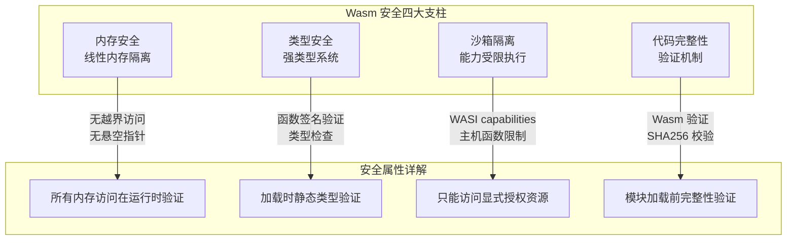
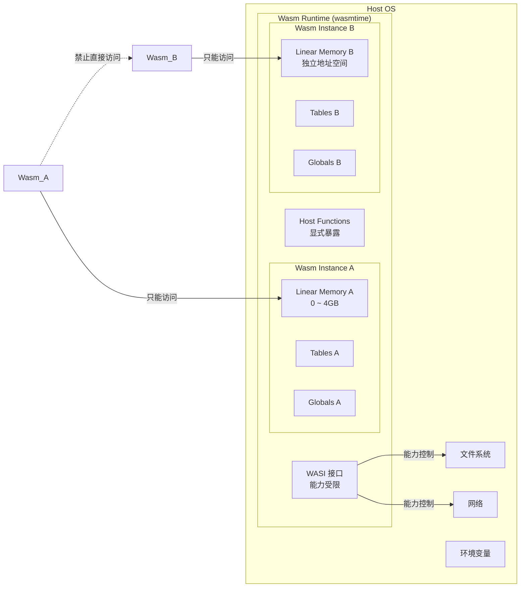
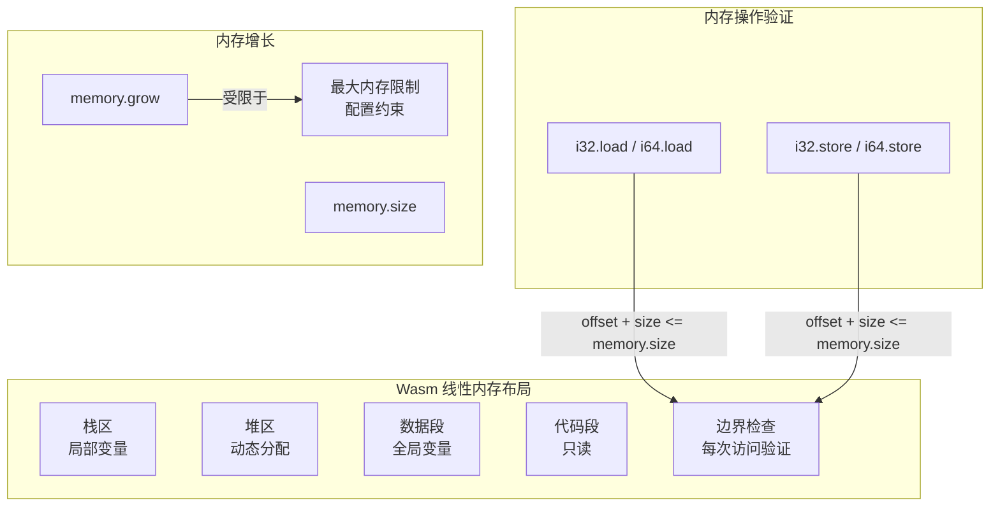
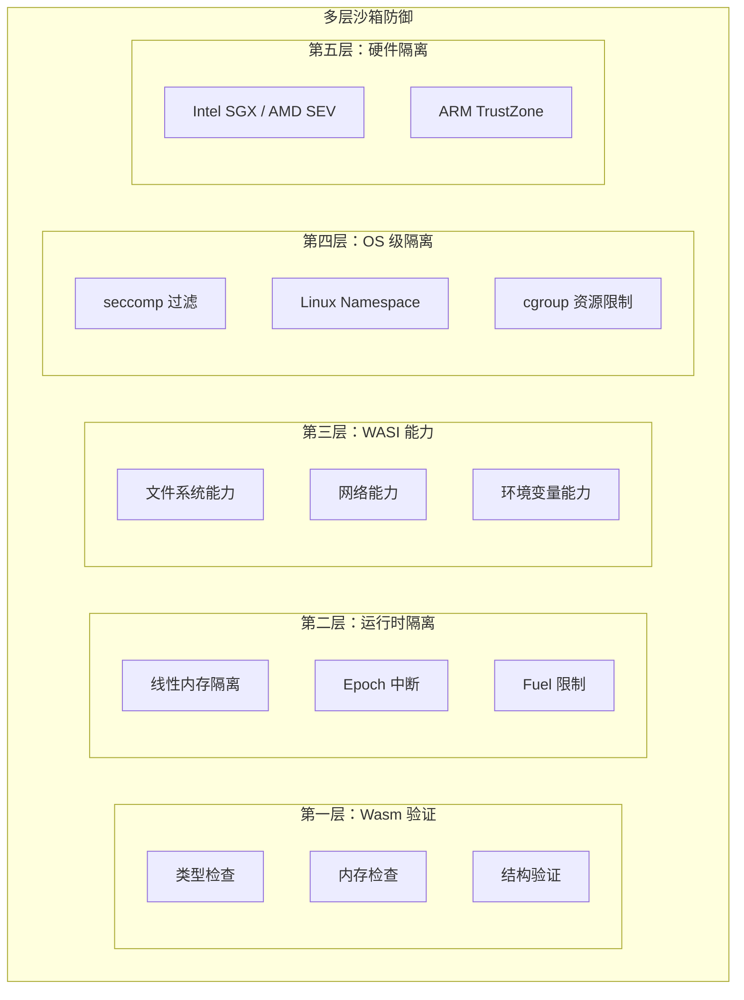
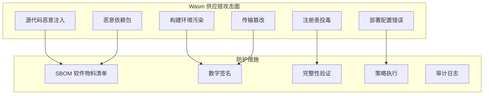
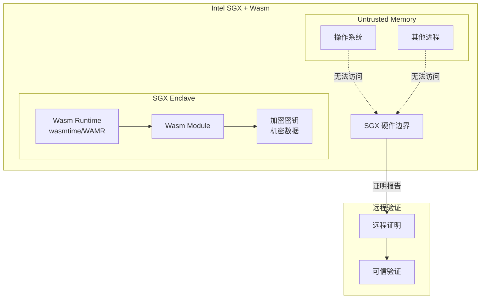
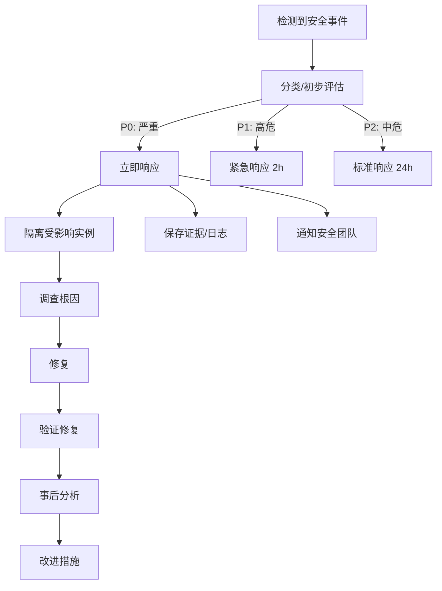

> **生产环境安全提示**
>
> 本文档包含可直接执行的运维命令。执行前请确认：当前目标集群与 Namespace 是否正确；是否具备足够的 RBAC 权限；是否已在非生产环境验证。命令风险等级标注：🔴 高风险（可能造成数据丢失或服务中断）、🟡 中风险（会修改集群状态，但通常可回滚）、🟢 低风险/只读（信息收集，无副作用）。


# Wasm 安全与沙箱 (Wasm Security and Sandbox)

> WebAssembly 的安全沙箱模型、基于能力的安全机制和供应链安全实践，构建云原生环境中的安全执行边界。

---

<!-- chunk: 目录 -->## 目录

1. [Wasm 安全模型概述](#1-wasm-安全模型概述)
2. [内存安全机制](#2-内存安全机制)
3. [WASI 能力模型](#3-wasi-能力模型)
4. [基于能力的访问控制](#4-基于能力的访问控制)
5. [沙箱隔离实现](#5-沙箱隔离实现)
6. [Wasm 供应链安全](#6-wasm-供应链安全)
7. [运行时安全加固](#7-运行时安全加固)
8. [安全策略引擎](#8-安全策略引擎)
9. [Wasm 漏洞防护](#9-wasm-漏洞防护)
10. [机密计算与 TEE](#10-机密计算与-tee)
11. [合规与审计](#11-合规与审计)
12. [安全测试与模糊测试](#12-安全测试与模糊测试)
13. [生产安全最佳实践](#13-生产安全最佳实践)
14. [安全事件响应](#14-安全事件响应)

---

<!-- chunk: 1. Wasm 安全模型概述 -->## 1. Wasm 安全模型概述

## 1.1 Wasm 核心安全属性

WebAssembly 从设计之初就将安全作为第一原则，具备四大核心安全属性：



## 1.2 安全边界模型



## 1.3 与传统安全技术对比

```
安全技术对比：

┌─────────────────────────────────────────────────────────────┐
│ 技术         │ 内存隔离 │ 类型安全 │ 启动开销 │ 细粒度控制 │
├─────────────────────────────────────────────────────────────┤
│ 进程隔离     │ ★★★★★   │ ✗        │ 高       │ 中          │
│ 容器         │ ★★★★    │ ✗        │ 中       │ 中          │
│ VM/Hypervisor│ ★★★★★   │ ✗        │ 很高     │ 低          │
│ Wasm         │ ★★★★★   │ ★★★★★   │ 极低     │ 高          │
│ eBPF         │ ★★★★    │ ★★★★    │ 极低     │ 高          │
│ WASM+eBPF    │ ★★★★★   │ ★★★★★   │ 极低     │ 极高        │
└─────────────────────────────────────────────────────────────┘
```

---

<!-- chunk: 2. 内存安全机制 -->## 2. 内存安全机制

## 2.1 线性内存模型



## 2.2 内存访问验证实现

```rust
// wasmtime 内存边界检查原理
// 这是运行时的内部实现示意

struct LinearMemory {
    data: *mut u8,
    current_size: usize,   // 当前大小（字节）
    maximum_size: usize,   // 最大大小
    protection: MemoryProtection,
}

struct MemoryProtection {
    accessible: *mut u8,     // 可访问区域起始
    accessible_size: usize,  // 可访问区域大小
    // 访问区域之外是受保护的内存页（SIGSEGV）
}

// 内存访问的运行时检查（伪代码）
fn check_memory_access(
    mem: &LinearMemory,
    offset: u32,
    size: u32,
) -> Result<(), TrapCode> {
    let end = (offset as u64) + (size as u64);
    
    if end > mem.current_size as u64 {
        return Err(TrapCode::MemoryOutOfBounds);
    }
    
    Ok(())
}

// 实际在编译阶段生成的边界检查代码（Cranelift IR 示例）
// i32.load offset=0 align=4
// 等价于：
// bounds_check(ptr, 4)
// result = *(ptr as *const i32)
```

## 2.3 内存访问配置

```rust
// wasmtime 内存安全配置
use wasmtime::{Config, Engine, MemoryCreator};

fn create_secure_engine() -> anyhow::Result<Engine> {
    let mut config = Config::new();
    
    // === 内存安全配置 ===
    
    // 最大内存大小（防止 DoS）
    config.max_wasm_stack(512 * 1024);  // 512KB 栈限制
    
    // 线性内存限制
    config.static_memory_maximum_size(100 * 1024 * 1024);  // 100MB 最大
    config.static_memory_guard_size(2 * 1024 * 1024);      // 2MB guard page
    config.dynamic_memory_guard_size(64 * 1024);            // 64KB 动态 guard
    
    // 使用 guard pages 实现越界陷阱（比运行时检查更快）
    config.guard_before_linear_memory(true);
    
    // 内存初始化（CoW 优化）
    config.memory_init_cow(true);
    
    // 禁用多内存提案（如不需要）
    // config.wasm_multi_memory(false);
    
    // === 执行安全配置 ===
    
    // 启用 epoch 中断（防止无限循环）
    config.epoch_interruption(true);
    
    // 配置 fuel（限制指令数）
    // config.consume_fuel(true);
    
    // 禁用不安全特性
    config.wasm_simd(true);    // SIMD 是安全的
    config.wasm_threads(false); // 禁用共享内存（防止 Spectre）
    
    Engine::new(&config)
}
```

## 2.4 内存隔离验证测试

```rust
// 验证 Wasm 内存隔离的测试
#[cfg(test)]
mod memory_safety_tests {
    use wasmtime::*;
    
    #[test]
    fn test_out_of_bounds_access_trapped() {
        let engine = Engine::default();
        let wat = r#"
            (module
                (memory 1)
                (func (export "oob-read") (result i32)
                    ;; 尝试读取 65536 页（超出内存边界）
                    i32.const 65536
                    i32.load
                )
            )
        "#;
        
        let module = Module::new(&engine, wat).unwrap();
        let mut store = Store::new(&engine, ());
        let instance = Instance::new(&mut store, &module, &[]).unwrap();
        
        let oob_read = instance
            .get_typed_func::<(), i32>(&mut store, "oob-read")
            .unwrap();
        
        // 应该触发 trap，而不是内存损坏
        let result = oob_read.call(&mut store, ());
        assert!(result.is_err(), "Out of bounds access should trap");
        
        let err = result.unwrap_err();
        assert!(
            err.to_string().contains("out of bounds"),
            "Error should indicate out of bounds: {}",
            err
        );
    }
    
    #[test]
    fn test_instance_memory_isolation() {
        let engine = Engine::default();
        let wat = r#"
            (module
                (memory 1)
                (global $magic_value (mut i32) (i32.const 0xDEADBEEF))
                (func (export "get-magic") (result i32)
                    global.get $magic_value
                )
                (func (export "set-magic") (param i32)
                    local.get 0
                    global.set $magic_value
                )
            )
        "#;
        
        let module = Module::new(&engine, wat).unwrap();
        let mut store = Store::new(&engine, ());
        
        // 创建两个独立实例
        let instance1 = Instance::new(&mut store, &module, &[]).unwrap();
        let instance2 = Instance::new(&mut store, &module, &[]).unwrap();
        
        let get1 = instance1.get_typed_func::<(), i32>(&mut store, "get-magic").unwrap();
        let set1 = instance1.get_typed_func::<i32, ()>(&mut store, "set-magic").unwrap();
        let get2 = instance2.get_typed_func::<(), i32>(&mut store, "get-magic").unwrap();
        
        // 修改 instance1 的值
        set1.call(&mut store, 0x12345678).unwrap();
        
        let val1 = get1.call(&mut store, ()).unwrap();
        let val2 = get2.call(&mut store, ()).unwrap();
        
        // 两个实例的内存完全隔离
        assert_eq!(val1, 0x12345678);
        assert_eq!(val2, 0xDEADBEEFu32 as i32, "Instance 2 should not be affected");
    }
    
    #[test]
    fn test_memory_growth_limit() {
        let mut config = Config::new();
        config.static_memory_maximum_size(10 * 1024 * 1024);  // 10MB 限制
        let engine = Engine::new(&config).unwrap();
        
        let wat = r#"
            (module
                (memory 1 160)  ;; 最大 160 页 = 10MB
                (func (export "grow") (param i32) (result i32)
                    local.get 0
                    memory.grow
                )
            )
        "#;
        
        let module = Module::new(&engine, wat).unwrap();
        let mut store = Store::new(&engine, ());
        let instance = Instance::new(&mut store, &module, &[]).unwrap();
        
        let grow = instance.get_typed_func::<i32, i32>(&mut store, "grow").unwrap();
        
        // 合法增长
        let result = grow.call(&mut store, 10).unwrap();
        assert!(result >= 0, "Should succeed within limit");
        
        // 超出限制
        let result = grow.call(&mut store, 1000).unwrap();
        assert_eq!(result, -1, "Should fail when exceeding limit");
    }
}
```

---

<!-- chunk: 3. WASI 能力模型 -->## 3. WASI 能力模型

## 3.1 WASI 零权限原则

```
WASI 权限模型：默认拒绝一切（Deny by Default）

启动时赋予能力 > 执行代码 > 访问授权资源

传统进程权限模型：
  进程继承父进程权限
  可通过 syscall 请求更多权限
  
WASI 能力模型：
  运行时决定授予哪些能力
  Wasm 模块不能自行扩展权限
  所有资源访问必须通过能力句柄
```

```mermaid
graph TD
    subgraph "WASI 能力传递"
        Runtime[Wasm Runtime<br/>能力授予者]
        
        subgraph "预开放资源"
            Dir1[/allowed/path 目录]
            Dir2[/tmp 目录]
            Stdin[标准输入]
            Stdout[标准输出]
        end
        
        subgraph "Wasm 模块"
            Module[Module Code]
            FD1[文件描述符 3<br/>→ /allowed/path]
            FD2[文件描述符 4<br/>→ /tmp]
            FD0[FD 0 → stdin]
            FD1_out[FD 1 → stdout]
        end
        
        Runtime --> |"preopened_dirs"| FD1
        Runtime --> |"preopened_dirs"| FD2
        Runtime --> FD0
        Runtime --> FD1_out
        
        Module --> FD1
        Module --> FD2
        Module -.-> |禁止访问| HostFS[主机其他文件]
    end
```

## 3.2 WASI 能力配置

```rust
// 精细化 WASI 能力配置
use wasmtime_wasi::{WasiCtxBuilder, ambient_authority};
use std::path::Path;

fn build_restricted_wasi_ctx(
    allowed_dirs: &[(&str, &str)],  // (host_path, guest_path)
    allowed_envs: &[(&str, &str)],  // (key, value)
    inherit_stdio: bool,
    allow_network: bool,
) -> anyhow::Result<wasmtime_wasi::WasiCtx> {
    let mut builder = WasiCtxBuilder::new();
    
    // === 文件系统能力 ===
    for (host_path, guest_path) in allowed_dirs {
        // 只允许访问指定目录（不允许目录穿越）
        let dir = wasmtime_wasi::Dir::open_ambient_dir(
            host_path,
            ambient_authority(),
        )?;
        builder.preopened_dir(dir, guest_path)?;
    }
    
    // === 环境变量能力 ===
    // 不继承主机环境变量，只暴露显式允许的变量
    for (key, value) in allowed_envs {
        builder.env(key, value)?;
    }
    
    // === 标准 IO 能力 ===
    if inherit_stdio {
        builder.inherit_stdin()
                .inherit_stdout()
                .inherit_stderr();
    } else {
        // 重定向到 /dev/null
        builder.stdin(wasmtime_wasi::pipe::ReadPipe::from(""))
               .stdout(wasmtime_wasi::pipe::WritePipe::new_in_memory())
               .stderr(wasmtime_wasi::pipe::WritePipe::new_in_memory());
    }
    
    // === 网络能力（WASI Preview 2）===
    if allow_network {
        // 允许 TCP 连接
        // 注意：当前 WASI 网络能力控制粒度有限
        builder.socket_addr_check(|addr, socket_type| {
            // 仅允许连接特定地址
            let allowed_hosts = ["10.0.0.0/8", "192.168.0.0/16"];
            // 实际实现需要 IP 地址匹配逻辑
            true
        });
    }
    
    // === 时间能力 ===
    // 允许读取时钟（默认允许）
    
    // === 随机数能力 ===
    // 允许使用随机数生成器（默认允许）
    
    // === 进程退出能力 ===
    // 控制是否允许 proc_exit
    builder.allow_blocking_current_thread(false);
    
    Ok(builder.build())
}

// 生产环境推荐配置
fn production_wasi_config(
    app_name: &str,
    data_dir: &str,
) -> anyhow::Result<wasmtime_wasi::WasiCtx> {
    build_restricted_wasi_ctx(
        &[
            (data_dir, "/data"),               // 数据目录（读写）
            ("/etc/ssl/certs", "/etc/ssl/certs"), // CA 证书（只读）
        ],
        &[
            ("RUST_LOG", "info"),
            ("APP_NAME", app_name),
            ("TZ", "UTC"),
        ],
        false,  // 不继承 stdio
        false,  // 不允许网络（通过 host functions 代理）
    )
}
```

## 3.3 自定义能力接口

```rust
// 实现自定义能力接口（受控主机函数）
use wasmtime::{Engine, Linker, Store};

struct SecureCapabilities {
    allowed_http_hosts: Vec<String>,
    allowed_db_tables: Vec<String>,
    rate_limit: u32,
    request_count: u32,
}

impl SecureCapabilities {
    fn new(
        allowed_http_hosts: Vec<String>,
        allowed_db_tables: Vec<String>,
        rate_limit: u32,
    ) -> Self {
        Self {
            allowed_http_hosts,
            allowed_db_tables,
            rate_limit,
            request_count: 0,
        }
    }
    
    fn check_http_allowed(&self, url: &str) -> bool {
        self.allowed_http_hosts.iter().any(|host| {
            url.starts_with(&format!("https://{}", host))
                || url.starts_with(&format!("http://{}", host))
        })
    }
    
    fn check_rate_limit(&mut self) -> bool {
        if self.request_count >= self.rate_limit {
            return false;
        }
        self.request_count += 1;
        true
    }
}

fn register_secure_capabilities(
    linker: &mut Linker<SecureCapabilities>,
) -> anyhow::Result<()> {
    // HTTP 请求（受控）
    linker.func_wrap(
        "secure-caps",
        "http-get",
        |mut caller: wasmtime::Caller<SecureCapabilities>,
         url_ptr: u32,
         url_len: u32,
         result_ptr: u32| -> i32 {
            // 读取 URL
            let url = {
                let mem = caller.get_export("memory")
                    .and_then(|e| e.into_memory())
                    .expect("memory export required");
                
                let data = mem.data(&caller);
                let bytes = &data[url_ptr as usize..(url_ptr + url_len) as usize];
                String::from_utf8_lossy(bytes).to_string()
            };
            
            // 检查 URL 白名单
            if !caller.data().check_http_allowed(&url) {
                eprintln!("SECURITY: HTTP request to blocked host: {}", url);
                return -1;  // 拒绝
            }
            
            // 检查速率限制
            if !caller.data_mut().check_rate_limit() {
                eprintln!("SECURITY: Rate limit exceeded");
                return -2;  // 限流
            }
            
            // 执行实际 HTTP 请求（使用 reqwest 等）
            // ... 实际实现
            0
        }
    )?;
    
    // 数据库访问（受控）
    linker.func_wrap(
        "secure-caps",
        "db-query",
        |mut caller: wasmtime::Caller<SecureCapabilities>,
         table_ptr: u32,
         table_len: u32,
         query_ptr: u32,
         query_len: u32| -> i32 {
            let table = {
                let mem = caller.get_export("memory")
                    .and_then(|e| e.into_memory())
                    .expect("memory export required");
                let data = mem.data(&caller);
                String::from_utf8_lossy(
                    &data[table_ptr as usize..(table_ptr + table_len) as usize]
                ).to_string()
            };
            
            // 检查表白名单
            if !caller.data().allowed_db_tables.contains(&table) {
                eprintln!("SECURITY: Access to unauthorized table: {}", table);
                return -1;
            }
            
            // 执行查询
            0
        }
    )?;
    
    // 日志记录（始终允许，但强制前缀）
    linker.func_wrap(
        "secure-caps",
        "log",
        |caller: wasmtime::Caller<SecureCapabilities>,
         level: i32,
         msg_ptr: u32,
         msg_len: u32| {
            let mem = caller.get_export("memory")
                .and_then(|e| e.into_memory())
                .expect("memory export required");
            let data = mem.data(&caller);
            let msg = String::from_utf8_lossy(
                &data[msg_ptr as usize..(msg_ptr + msg_len) as usize]
            );
            
            let level_str = match level {
                0 => "ERROR",
                1 => "WARN",
                2 => "INFO",
                3 => "DEBUG",
                _ => "UNKNOWN",
            };
            
            // 所有日志都加上 [wasm] 前缀，便于审计
            println!("[wasm][{}] {}", level_str, msg);
        }
    )?;
    
    Ok(())
}
```

---

<!-- chunk: 4. 基于能力的访问控制 -->## 4. 基于能力的访问控制

## 4.1 WASI 能力树

```
WASI 能力层次结构：

根能力（Runtime 持有）
├── 文件系统能力
│   ├── preopened_dir("/data") → FD 3
│   │   ├── path_open("file.txt") → FD 5
│   │   ├── path_read_dir(".") → FD 6
│   │   └── fd_read(FD 5) 
│   └── preopened_dir("/tmp") → FD 4
│
├── 网络能力（WASI Preview 2）
│   ├── TCP listen
│   ├── TCP connect（受限主机）
│   └── UDP socket
│
├── 时间能力
│   ├── clock_time_get(REALTIME)
│   └── clock_time_get(MONOTONIC)
│
├── 随机数能力
│   └── random_get()
│
└── 进程能力
    ├── proc_exit()
    └── args_get() / environ_get()
```

## 4.2 细粒度文件系统能力控制

```rust
// 实现只读文件系统访问控制
use wasmtime_wasi::{WasiCtx, WasiCtxBuilder};
use cap_std::fs::Dir;

fn create_readonly_fs_ctx(base_dir: &str) -> anyhow::Result<WasiCtx> {
    let dir = Dir::open_ambient_dir(base_dir, cap_std::ambient_authority())?;
    
    // 创建只读包装（通过权限位控制）
    let readonly_dir = cap_std::fs::Dir::from_std_file(
        dir.open(".")?.into_std()
    );
    
    let ctx = WasiCtxBuilder::new()
        .preopened_dir(readonly_dir, "/")?
        .build();
    
    Ok(ctx)
}

// 路径沙箱化（防止目录穿越攻击）
fn sanitize_path(base: &str, user_path: &str) -> anyhow::Result<std::path::PathBuf> {
    use std::path::Path;
    
    let base = Path::new(base).canonicalize()?;
    let requested = base.join(user_path);
    
    // 防止 .. 目录穿越
    let canonical = requested.canonicalize()
        .unwrap_or_else(|_| requested.clone());
    
    if !canonical.starts_with(&base) {
        anyhow::bail!(
            "Path traversal detected: {} is outside {}", 
            user_path, base.display()
        );
    }
    
    Ok(canonical)
}

// 文件访问策略执行器
struct FileAccessPolicy {
    allowed_extensions: Vec<String>,
    max_file_size_bytes: u64,
    allow_create: bool,
    allow_delete: bool,
    read_only_paths: Vec<String>,
}

impl FileAccessPolicy {
    fn check_access(
        &self,
        path: &str,
        operation: &str,
    ) -> Result<(), String> {
        // 检查扩展名
        let ext = std::path::Path::new(path)
            .extension()
            .and_then(|e| e.to_str())
            .unwrap_or("");
        
        if !self.allowed_extensions.is_empty()
            && !self.allowed_extensions.contains(&ext.to_string())
        {
            return Err(format!(
                "File extension '{}' not allowed", ext
            ));
        }
        
        // 检查只读路径
        let is_readonly = self.read_only_paths.iter()
            .any(|p| path.starts_with(p));
        
        if is_readonly && (operation == "write" || operation == "delete") {
            return Err(format!("Write access denied to readonly path: {}", path));
        }
        
        // 检查创建/删除权限
        if operation == "create" && !self.allow_create {
            return Err("File creation not allowed".to_string());
        }
        if operation == "delete" && !self.allow_delete {
            return Err("File deletion not allowed".to_string());
        }
        
        Ok(())
    }
}
```

## 4.3 OPA/Rego 策略集成

```rego
# wasm-access-policy.rego
package wasm.access

import future.keywords.if
import future.keywords.in

# 默认拒绝所有访问
default allow = false

# 允许规则
allow if {
    # 检查主体
    valid_principal
    # 检查资源
    allowed_resource
    # 检查操作
    allowed_operation
}

# 验证 Wasm 模块签名
valid_principal if {
    signature := input.module.signature
    signature.issuer in data.trusted_issuers
    not signature.revoked
    signature.expiry > time.now_ns()
}

# 资源访问控制
allowed_resource if {
    # 文件系统：只允许特定路径
    input.resource.type == "filesystem"
    path := input.resource.path
    some allowed_path in data.policies.filesystem.allowed_paths
    startswith(path, allowed_path)
}

allowed_resource if {
    # 网络：只允许白名单主机
    input.resource.type == "network"
    host := input.resource.host
    host in data.policies.network.allowed_hosts
}

allowed_resource if {
    # 环境变量：只允许白名单变量
    input.resource.type == "env"
    key := input.resource.key
    key in data.policies.env.allowed_keys
}

# 操作权限
allowed_operation if {
    input.resource.type == "filesystem"
    input.operation in {"read", "readdir", "stat"}
}

allowed_operation if {
    input.resource.type == "filesystem"
    input.operation in {"write", "create", "delete"}
    # 写操作需要额外授权
    input.module.labels["write-access"] == "true"
}

# 速率限制规则
rate_limit_ok if {
    current_rate := data.metrics.current_rps[input.module.id]
    max_rate := data.policies.rate_limits[input.module.labels["tier"]]
    current_rate <= max_rate
}
```

```rust
// Rust 中集成 OPA 策略评估
use serde_json::{json, Value};

struct OpaEnforcer {
    opa_endpoint: String,
    policy_package: String,
}

impl OpaEnforcer {
    async fn evaluate(
        &self,
        module_id: &str,
        resource_type: &str,
        resource: &Value,
        operation: &str,
    ) -> anyhow::Result<bool> {
        let input = json!({
            "module": {
                "id": module_id,
                "labels": {},
                "signature": {
                    "issuer": "trusted-ca",
                    "revoked": false,
                    "expiry": u64::MAX,
                }
            },
            "resource": {
                "type": resource_type,
                ..resource.as_object().cloned().unwrap_or_default()
            },
            "operation": operation,
        });
        
        let url = format!(
            "{}/v1/data/{}/allow",
            self.opa_endpoint,
            self.policy_package.replace('.', "/")
        );
        
        let client = reqwest::Client::new();
        let resp: Value = client.post(&url)
            .json(&json!({"input": input}))
            .send().await?
            .json().await?;
        
        Ok(resp["result"].as_bool().unwrap_or(false))
    }
}
```

---

<!-- chunk: 5. 沙箱隔离实现 -->## 5. 沙箱隔离实现

## 5.1 多层沙箱架构



## 5.2 seccomp 加固

```rust
// 使用 seccomp 进一步限制 Wasm 运行时的 syscall
use seccompiler::{
    BpfProgram, SeccompAction, SeccompCmpArgLen, SeccompCmpOp,
    SeccompCondition, SeccompFilter, SeccompRule,
};

fn create_wasm_runtime_seccomp() -> anyhow::Result<BpfProgram> {
    // 只允许 Wasm 运行时需要的 syscall
    let allowed_syscalls = vec![
        // 内存管理
        "mmap", "mprotect", "munmap", "mremap",
        "madvise", "brk",
        
        // 文件 IO（只允许操作预开放的 FD）
        "read", "write", "pread64", "pwrite64",
        "readv", "writev",
        "close", "fstat", "lseek",
        
        // 时间
        "clock_gettime", "gettimeofday",
        
        // 随机数
        "getrandom",
        
        // 线程（wasmtime 使用）
        "futex", "clone3",
        
        // 进程
        "exit", "exit_group",
        
        // 信号（用于超时）
        "rt_sigaction", "rt_sigreturn",
        "sigaltstack",
    ];
    
    let filter = SeccompFilter::new(
        // 默认动作：杀死进程
        SeccompAction::KillProcess,
        // 规则集
        allowed_syscalls.into_iter().map(|name| {
            (name.to_string(), vec![SeccompRule::new(vec![])])
        }).collect(),
        // 目标架构
        seccompiler::TargetArch::x86_64,
    )?;
    
    filter.try_into()
}

fn apply_wasm_sandbox_restrictions() -> anyhow::Result<()> {
    // 应用 seccomp 过滤
    let bpf = create_wasm_runtime_seccomp()?;
    seccompiler::apply_filter(&bpf)?;
    
    println!("Seccomp filter applied");
    Ok(())
}
```

## 5.3 资源限制配置

```rust
// 完整的资源限制配置
use wasmtime::{Config, Engine, Store};

struct ResourceLimits {
    max_memory_bytes: usize,
    max_wasm_stack_bytes: usize,
    max_instances: usize,
    max_tables: usize,
    max_table_elements: u32,
    max_memories: u32,
    cpu_time_limit_ns: u64,
    max_fuel: u64,
}

impl Default for ResourceLimits {
    fn default() -> Self {
        Self {
            max_memory_bytes: 64 * 1024 * 1024,   // 64MB
            max_wasm_stack_bytes: 512 * 1024,      // 512KB
            max_instances: 100,
            max_tables: 10,
            max_table_elements: 100_000,
            max_memories: 1,
            cpu_time_limit_ns: 10_000_000_000,    // 10 seconds
            max_fuel: 1_000_000_000,              // 10亿条指令
        }
    }
}

struct LimitedStore {
    limits: ResourceLimits,
    wasi: wasmtime_wasi::WasiCtx,
}

impl wasmtime::ResourceLimiter for LimitedStore {
    fn memory_growing(
        &mut self,
        current: usize,
        desired: usize,
        maximum: Option<usize>,
    ) -> anyhow::Result<bool> {
        if desired > self.limits.max_memory_bytes {
            eprintln!(
                "Memory growth blocked: {} > {} bytes",
                desired, self.limits.max_memory_bytes
            );
            return Ok(false);
        }
        Ok(true)
    }
    
    fn table_growing(
        &mut self,
        current: u32,
        desired: u32,
        maximum: Option<u32>,
    ) -> anyhow::Result<bool> {
        if desired > self.limits.max_table_elements {
            return Ok(false);
        }
        Ok(true)
    }
    
    fn instances(&self) -> usize { self.limits.max_instances }
    fn tables(&self) -> usize { self.limits.max_tables }
    fn memories(&self) -> usize { self.limits.max_memories as usize }
}

fn create_limited_store(
    engine: &Engine,
    limits: ResourceLimits,
    wasi: wasmtime_wasi::WasiCtx,
) -> Store<LimitedStore> {
    let mut store = Store::new(engine, LimitedStore { limits, wasi });
    
    // 设置资源限制器
    store.limiter(|state| state);
    
    // 设置 fuel（指令计数限制）
    let max_fuel = store.data().limits.max_fuel;
    store.set_fuel(max_fuel).unwrap();
    
    // 设置 epoch 中断
    store.set_epoch_deadline(100);  // 100 个 epoch ticks
    
    store
}
```

---

<!-- chunk: 6. Wasm 供应链安全 -->## 6. Wasm 供应链安全

## 6.1 供应链攻击威胁模型



## 6.2 Wasm 模块签名

```rust
// Wasm 模块签名与验证
use ring::{
    signature::{Ed25519KeyPair, KeyPair, Signature, UnparsedPublicKey, ED25519},
    rand::SystemRandom,
};
use serde::{Deserialize, Serialize};

#[derive(Debug, Serialize, Deserialize)]
struct WasmModuleMetadata {
    module_id: String,
    name: String,
    version: String,
    author: String,
    description: String,
    sha256: String,
    capabilities: Vec<String>,
    created_at: u64,
}

#[derive(Debug, Serialize, Deserialize)]
struct SignedWasmModule {
    metadata: WasmModuleMetadata,
    signature: String,    // Base64 encoded signature
    public_key: String,   // Base64 encoded public key
    wasm_base64: String,  // Base64 encoded wasm bytes
}

fn sign_wasm_module(
    wasm_bytes: &[u8],
    metadata: WasmModuleMetadata,
    private_key_pkcs8: &[u8],
) -> anyhow::Result<SignedWasmModule> {
    use base64::Engine;
    use sha2::Digest;
    
    // 计算 SHA256
    let sha256 = format!("{:x}", sha2::Sha256::digest(wasm_bytes));
    
    // 序列化元数据（包含 SHA256）
    let mut meta = metadata;
    meta.sha256 = sha256;
    let metadata_json = serde_json::to_string(&meta)?;
    
    // 创建签名内容（metadata + wasm hash）
    let sign_content = format!(
        "{}\n{}",
        metadata_json,
        meta.sha256
    );
    
    // 使用 Ed25519 签名
    let key_pair = Ed25519KeyPair::from_pkcs8(private_key_pkcs8)
        .map_err(|e| anyhow::anyhow!("Invalid private key: {:?}", e))?;
    
    let signature = key_pair.sign(sign_content.as_bytes());
    let public_key = key_pair.public_key().as_ref().to_vec();
    
    Ok(SignedWasmModule {
        metadata: meta,
        signature: base64::engine::general_purpose::STANDARD.encode(signature.as_ref()),
        public_key: base64::engine::general_purpose::STANDARD.encode(&public_key),
        wasm_base64: base64::engine::general_purpose::STANDARD.encode(wasm_bytes),
    })
}

fn verify_wasm_module(
    signed_module: &SignedWasmModule,
    trusted_public_keys: &[Vec<u8>],
) -> anyhow::Result<Vec<u8>> {
    use base64::Engine;
    use sha2::Digest;
    
    // 1. 解码数据
    let wasm_bytes = base64::engine::general_purpose::STANDARD
        .decode(&signed_module.wasm_base64)?;
    let signature = base64::engine::general_purpose::STANDARD
        .decode(&signed_module.signature)?;
    let public_key = base64::engine::general_purpose::STANDARD
        .decode(&signed_module.public_key)?;
    
    // 2. 验证公钥是否可信
    if !trusted_public_keys.contains(&public_key) {
        anyhow::bail!("Untrusted public key");
    }
    
    // 3. 验证内容完整性
    let actual_sha256 = format!("{:x}", sha2::Sha256::digest(&wasm_bytes));
    if actual_sha256 != signed_module.metadata.sha256 {
        anyhow::bail!(
            "SHA256 mismatch: expected {}, got {}",
            signed_module.metadata.sha256,
            actual_sha256
        );
    }
    
    // 4. 验证签名
    let metadata_json = serde_json::to_string(&signed_module.metadata)?;
    let sign_content = format!(
        "{}\n{}",
        metadata_json,
        signed_module.metadata.sha256
    );
    
    let unparsed_key = UnparsedPublicKey::new(&ED25519, &public_key);
    unparsed_key.verify(sign_content.as_bytes(), &signature)
        .map_err(|_| anyhow::anyhow!("Signature verification failed"))?;
    
    println!("✅ Module {} v{} verified successfully",
        signed_module.metadata.name, signed_module.metadata.version);
    
    Ok(wasm_bytes)
}
```

## 6.3 SBOM 生成与验证

```rust
// 生成 Wasm 软件物料清单（SBOM）
use serde::{Deserialize, Serialize};

#[derive(Debug, Serialize, Deserialize)]
struct WasmSBOM {
    format: String,      // "CycloneDX" or "SPDX"
    version: String,
    metadata: SBOMMetadata,
    components: Vec<SBOMComponent>,
    dependencies: Vec<Dependency>,
    vulnerabilities: Vec<Vulnerability>,
}

#[derive(Debug, Serialize, Deserialize)]
struct SBOMMetadata {
    timestamp: String,
    tools: Vec<String>,
    component: SBOMComponent,
}

#[derive(Debug, Serialize, Deserialize)]
struct SBOMComponent {
    component_type: String,
    name: String,
    version: String,
    purl: String,         // Package URL
    hashes: Vec<Hash>,
    licenses: Vec<String>,
    supplier: Option<String>,
}

#[derive(Debug, Serialize, Deserialize)]
struct Hash {
    algorithm: String,   // "SHA-256", "SHA-512"
    value: String,
}

#[derive(Debug, Serialize, Deserialize)]
struct Dependency {
    r#ref: String,
    depends_on: Vec<String>,
}

#[derive(Debug, Serialize, Deserialize)]
struct Vulnerability {
    id: String,           // CVE-XXXX-XXXXX
    source: String,
    severity: String,
    affected: Vec<String>,
    recommendation: String,
}

fn generate_sbom(
    module_name: &str,
    module_version: &str,
    wasm_bytes: &[u8],
    cargo_lock: &str,  // Cargo.lock 内容
) -> WasmSBOM {
    use sha2::Digest;
    
    let sha256 = format!("{:x}", sha2::Sha256::digest(wasm_bytes));
    let sha512 = format!("{:x}", sha2::Sha512::digest(wasm_bytes));
    
    // 解析 Cargo.lock 获取依赖
    let components = parse_cargo_lock_to_sbom_components(cargo_lock);
    
    WasmSBOM {
        format: "CycloneDX".to_string(),
        version: "1.5".to_string(),
        metadata: SBOMMetadata {
            timestamp: chrono::Utc::now().to_rfc3339(),
            tools: vec!["wasm-sbom-generator/1.0.0".to_string()],
            component: SBOMComponent {
                component_type: "application".to_string(),
                name: module_name.to_string(),
                version: module_version.to_string(),
                purl: format!(
                    "pkg:wasm/{}/{}@{}",
                    "my-org", module_name, module_version
                ),
                hashes: vec![
                    Hash { algorithm: "SHA-256".to_string(), value: sha256 },
                    Hash { algorithm: "SHA-512".to_string(), value: sha512 },
                ],
                licenses: vec!["Apache-2.0".to_string()],
                supplier: Some("My Organization".to_string()),
            },
        },
        components,
        dependencies: vec![],
        vulnerabilities: vec![],
    }
}

fn parse_cargo_lock_to_sbom_components(_cargo_lock: &str) -> Vec<SBOMComponent> {
    // 解析 Cargo.lock 中的依赖
    // 实际实现使用 cargo_lock crate
    vec![]
}
```

## 6.4 OCI 镜像签名（Cosign）

> ⚠️ **🟡 中危变更** — 变更集群资源状态，建议先 --dry-run 或 diff 确认
> - `kubectl apply/create/replace`：创建/变更集群资源

``` bash
# 🟡 中风险：会修改集群/资源状态，执行前请确认目标、影响范围与授权
#!/bin/bash
# sign-and-verify-wasm.sh

WASM_FILE="my-plugin.wasm"
OCI_IMAGE="ghcr.io/my-org/my-plugin:1.0.0"
KEYLESS=true  # 使用 Sigstore 无密钥签名

# === 构建并推送 OCI 镜像 ===
echo "Pushing Wasm OCI image..."
crane push "${WASM_FILE}" "${OCI_IMAGE}" \
  --media-type "application/vnd.module.wasm.content.layer.v1+wasm"

# === 生成 SBOM ===
syft "${OCI_IMAGE}" -o cyclonedx-json > sbom.json
echo "SBOM generated"

# === 使用 Cosign 签名（无密钥模式）===
if [ "$KEYLESS" = true ]; then
  echo "Signing with Sigstore (keyless)..."
  COSIGN_EXPERIMENTAL=1 cosign sign \
    --annotations "module.name=my-plugin" \
    --annotations "module.version=1.0.0" \
    "${OCI_IMAGE}"
  
  # 附加 SBOM
  COSIGN_EXPERIMENTAL=1 cosign attach sbom \
    --sbom sbom.json \
    --type cyclonedx \
    "${OCI_IMAGE}"
else
  # 使用密钥签名
  cosign sign \
    --key cosign.key \
    "${OCI_IMAGE}"
fi

echo "Image signed successfully"

# === 验证签名 ===
echo "Verifying signature..."
if [ "$KEYLESS" = true ]; then
  COSIGN_EXPERIMENTAL=1 cosign verify \
    --certificate-identity "https://github.com/my-org/my-repo/.github/workflows/build.yml@refs/heads/main" \
    --certificate-oidc-issuer "https://token.actions.githubusercontent.com" \
    "${OCI_IMAGE}"
else
  cosign verify \
    --key cosign.pub \
    "${OCI_IMAGE}"
fi

echo "✅ Signature verified"

# === 在 K8s 中使用 Kyverno 策略验证 ===
cat > kyverno-wasm-policy.yaml << 'EOF'
apiVersion: kyverno.io/v1
kind: ClusterPolicy
metadata:
  name: verify-wasm-images
spec:
  validationFailureAction: enforce
  rules:
    - name: verify-wasm-signature
      match:
        any:
          - resources:
              kinds: ["WasmPlugin"]
      verifyImages:
        - imageReferences:
            - "ghcr.io/my-org/*"
          attestors:
            - count: 1
              entries:
                - keyless:
                    subject: "https://github.com/my-org/my-repo/*"
                    issuer: "https://token.actions.githubusercontent.com"
                    rekor:
                      url: "https://rekor.sigstore.dev"
          attestations:
            - predicateType: "https://cyclonedx.org/bom"
              conditions:
                - all:
                    - key: "{{ components[] | length(@) }}"
                      operator: GreaterThanOrEquals
                      value: 1
EOF

kubectl apply -f kyverno-wasm-policy.yaml
```
---

<!-- chunk: 7. 运行时安全加固 -->## 7. 运行时安全加固

## 7.1 全面安全配置

```rust
// 生产级 Wasm 运行时安全配置
use wasmtime::{Config, Engine, OptLevel};

fn create_hardened_engine() -> anyhow::Result<Engine> {
    let mut config = Config::new();
    
    // === 内存安全 ===
    config.max_wasm_stack(512 * 1024);              // 512KB 栈
    config.static_memory_maximum_size(256 * 1024 * 1024); // 256MB 最大内存
    config.static_memory_guard_size(4 * 1024 * 1024);     // 4MB guard page
    config.dynamic_memory_guard_size(64 * 1024);
    config.guard_before_linear_memory(true);
    config.memory_init_cow(true);
    
    // === 执行安全 ===
    config.epoch_interruption(true);   // 支持超时中断
    config.consume_fuel(true);         // 支持指令计数
    config.debug_info(false);          // 生产环境关闭调试信息
    
    // === Wasm 特性控制 ===
    config.wasm_threads(false);        // 禁用多线程（防 Spectre）
    config.wasm_simd(true);            // SIMD 是安全的
    config.wasm_bulk_memory(true);     // 安全特性
    config.wasm_reference_types(true); // 安全特性
    config.wasm_multi_memory(false);   // 除非必要，禁用多内存
    
    // === 编译安全 ===
    config.cranelift_opt_level(OptLevel::Speed);
    config.parallel_compilation(true);
    
    // === 缓存（安全考虑）===
    // 不使用共享缓存（避免缓存投毒）
    // config.cache_config_load_default()?;  // 生产中慎用
    
    Engine::new(&config)
}

// 执行超时控制
struct TimeoutController {
    engine: Engine,
    epoch_deadline_multiplier: u64,
}

impl TimeoutController {
    fn new(engine: Engine) -> Self {
        // 启动 epoch 增加线程
        let engine_clone = engine.clone();
        std::thread::spawn(move || {
            loop {
                std::thread::sleep(std::time::Duration::from_millis(1));
                engine_clone.increment_epoch();
            }
        });
        
        Self {
            engine,
            epoch_deadline_multiplier: 1000,  // 1000ms per unit
        }
    }
    
    fn create_store_with_timeout<T>(
        &self,
        data: T,
        timeout_ms: u64,
    ) -> wasmtime::Store<T> {
        let mut store = wasmtime::Store::new(&self.engine, data);
        
        // 设置 epoch 截止时间（timeout_ms 毫秒后中断）
        let deadline = timeout_ms / self.epoch_deadline_multiplier;
        store.set_epoch_deadline(deadline.max(1));
        
        // 设置超时回调
        store.epoch_deadline_callback(|_| {
            anyhow::bail!("Execution timed out")
        });
        
        store
    }
}
```

## 7.2 异常检测与防护

```rust
// Wasm 运行时异常行为检测
use std::sync::atomic::{AtomicU64, Ordering};
use std::sync::Arc;

struct AnomalyDetector {
    memory_growth_count: AtomicU64,
    fuel_consumed: AtomicU64,
    host_call_count: AtomicU64,
    error_count: AtomicU64,
    
    thresholds: AnomalyThresholds,
}

struct AnomalyThresholds {
    max_memory_growths_per_minute: u64,
    max_fuel_per_request: u64,
    max_host_calls_per_request: u64,
    max_errors_per_minute: u64,
}

impl AnomalyDetector {
    fn record_memory_growth(&self) {
        let count = self.memory_growth_count.fetch_add(1, Ordering::Relaxed) + 1;
        if count > self.thresholds.max_memory_growths_per_minute {
            eprintln!("ANOMALY: Excessive memory growth detected");
            // 触发告警
        }
    }
    
    fn record_fuel_consumption(&self, fuel: u64) {
        let total = self.fuel_consumed.fetch_add(fuel, Ordering::Relaxed) + fuel;
        if total > self.thresholds.max_fuel_per_request {
            eprintln!("ANOMALY: Fuel consumption limit exceeded: {}", total);
        }
    }
    
    fn record_host_call(&self, function_name: &str) {
        let count = self.host_call_count.fetch_add(1, Ordering::Relaxed) + 1;
        if count > self.thresholds.max_host_calls_per_request {
            eprintln!(
                "ANOMALY: Too many host calls ({}): {}",
                count, function_name
            );
        }
    }
    
    fn generate_report(&self) -> AnomalyReport {
        AnomalyReport {
            memory_growths: self.memory_growth_count.load(Ordering::Relaxed),
            fuel_consumed: self.fuel_consumed.load(Ordering::Relaxed),
            host_calls: self.host_call_count.load(Ordering::Relaxed),
            errors: self.error_count.load(Ordering::Relaxed),
        }
    }
}

#[derive(Debug, serde::Serialize)]
struct AnomalyReport {
    memory_growths: u64,
    fuel_consumed: u64,
    host_calls: u64,
    errors: u64,
}
```

---

<!-- chunk: 8. 安全策略引擎 -->## 8. 安全策略引擎

## 8.1 内置策略执行

```rust
// Wasm 安全策略引擎
use std::collections::HashMap;

#[derive(Debug, Clone, serde::Deserialize)]
pub struct SecurityPolicy {
    pub name: String,
    pub rules: Vec<PolicyRule>,
    pub enforcement: EnforcementMode,
}

#[derive(Debug, Clone, serde::Deserialize)]
pub enum EnforcementMode {
    Enforce,  // 强制执行，拒绝违规
    Audit,    // 审计模式，记录但不阻止
    Permissive, // 宽松模式，仅警告
}

#[derive(Debug, Clone, serde::Deserialize)]
pub struct PolicyRule {
    pub name: String,
    pub resource_type: ResourceType,
    pub operations: Vec<Operation>,
    pub action: PolicyAction,
    pub conditions: Vec<Condition>,
}

#[derive(Debug, Clone, serde::Deserialize)]
pub enum ResourceType {
    Memory,
    File,
    Network,
    Env,
    Clock,
    Random,
    Process,
}

#[derive(Debug, Clone, serde::Deserialize)]
pub enum Operation {
    Read,
    Write,
    Execute,
    Delete,
    Create,
    Connect,
    Listen,
    Grow,
}

#[derive(Debug, Clone, serde::Deserialize)]
pub enum PolicyAction {
    Allow,
    Deny,
    Audit,
    Alert(AlertLevel),
}

#[derive(Debug, Clone, serde::Deserialize)]
pub enum AlertLevel {
    Info,
    Warning,
    Critical,
}

#[derive(Debug, Clone, serde::Deserialize)]
pub struct Condition {
    pub field: String,
    pub operator: ConditionOperator,
    pub value: serde_json::Value,
}

#[derive(Debug, Clone, serde::Deserialize)]
pub enum ConditionOperator {
    Equals,
    NotEquals,
    Contains,
    StartsWith,
    GreaterThan,
    LessThan,
    Matches,  // 正则
}

pub struct PolicyEngine {
    policies: Vec<SecurityPolicy>,
    audit_log: Vec<AuditEntry>,
}

#[derive(Debug)]
struct AuditEntry {
    timestamp: std::time::SystemTime,
    module_id: String,
    resource_type: String,
    operation: String,
    resource: String,
    decision: String,
    matched_rule: Option<String>,
}

impl PolicyEngine {
    pub fn new(policies: Vec<SecurityPolicy>) -> Self {
        Self {
            policies,
            audit_log: Vec::new(),
        }
    }
    
    pub fn evaluate(
        &mut self,
        module_id: &str,
        resource_type: &ResourceType,
        operation: &Operation,
        resource: &str,
        context: &HashMap<String, serde_json::Value>,
    ) -> PolicyDecision {
        for policy in &self.policies {
            for rule in &policy.rules {
                // 检查资源类型匹配
                if !self.resource_type_matches(&rule.resource_type, resource_type) {
                    continue;
                }
                
                // 检查操作匹配
                if !rule.operations.iter().any(|op| self.operation_matches(op, operation)) {
                    continue;
                }
                
                // 检查条件
                if !self.evaluate_conditions(&rule.conditions, context) {
                    continue;
                }
                
                // 规则匹配，应用动作
                let decision = match &rule.action {
                    PolicyAction::Allow => PolicyDecision::Allow,
                    PolicyAction::Deny => PolicyDecision::Deny(rule.name.clone()),
                    PolicyAction::Audit => {
                        self.log_audit(module_id, resource_type, operation, resource, 
                            "ALLOW_WITH_AUDIT", Some(&rule.name));
                        PolicyDecision::Allow
                    }
                    PolicyAction::Alert(level) => {
                        self.trigger_alert(module_id, &rule.name, resource, level);
                        PolicyDecision::Allow
                    }
                };
                
                // 记录审计日志
                self.log_audit(
                    module_id,
                    resource_type,
                    operation,
                    resource,
                    &format!("{:?}", decision),
                    Some(&rule.name),
                );
                
                return decision;
            }
        }
        
        // 没有匹配规则，默认拒绝
        self.log_audit(module_id, resource_type, operation, resource, "DENY_DEFAULT", None);
        PolicyDecision::Deny("default-deny".to_string())
    }
    
    fn resource_type_matches(&self, rule_type: &ResourceType, actual: &ResourceType) -> bool {
        matches!(
            (rule_type, actual),
            (ResourceType::Memory, ResourceType::Memory)
            | (ResourceType::File, ResourceType::File)
            | (ResourceType::Network, ResourceType::Network)
            | (ResourceType::Env, ResourceType::Env)
            | _ => false
        )
    }
    
    fn operation_matches(&self, rule_op: &Operation, actual: &Operation) -> bool {
        matches!(
            (rule_op, actual),
            (Operation::Read, Operation::Read)
            | (Operation::Write, Operation::Write)
            | (Operation::Execute, Operation::Execute)
            | _ => false
        )
    }
    
    fn evaluate_conditions(
        &self,
        conditions: &[Condition],
        context: &HashMap<String, serde_json::Value>,
    ) -> bool {
        conditions.iter().all(|cond| {
            let value = context.get(&cond.field);
            match (&cond.operator, value) {
                (ConditionOperator::Equals, Some(v)) => v == &cond.value,
                (ConditionOperator::NotEquals, Some(v)) => v != &cond.value,
                (ConditionOperator::Contains, Some(serde_json::Value::String(s))) => {
                    cond.value.as_str().map(|p| s.contains(p)).unwrap_or(false)
                }
                (ConditionOperator::StartsWith, Some(serde_json::Value::String(s))) => {
                    cond.value.as_str().map(|p| s.starts_with(p)).unwrap_or(false)
                }
                _ => false,
            }
        })
    }
    
    fn log_audit(
        &mut self,
        module_id: &str,
        _resource_type: &ResourceType,
        _operation: &Operation,
        resource: &str,
        decision: &str,
        matched_rule: Option<&str>,
    ) {
        self.audit_log.push(AuditEntry {
            timestamp: std::time::SystemTime::now(),
            module_id: module_id.to_string(),
            resource_type: "unknown".to_string(),
            operation: "unknown".to_string(),
            resource: resource.to_string(),
            decision: decision.to_string(),
            matched_rule: matched_rule.map(|r| r.to_string()),
        });
    }
    
    fn trigger_alert(
        &self,
        module_id: &str,
        rule_name: &str,
        resource: &str,
        level: &AlertLevel,
    ) {
        eprintln!(
            "[{:?}] Security Alert: module={} rule={} resource={}",
            level, module_id, rule_name, resource
        );
        // TODO: 发送到 SIEM 系统
    }
    
    pub fn get_audit_log(&self) -> &[AuditEntry] {
        &self.audit_log
    }
}

#[derive(Debug, PartialEq)]
pub enum PolicyDecision {
    Allow,
    Deny(String),  // 拒绝原因
}
```

---

<!-- chunk: 9. Wasm 漏洞防护 -->## 9. Wasm 漏洞防护

## 9.1 已知 Wasm 漏洞防护

```
Wasm 已知安全问题与防护：

1. Spectre/Meltdown（投机执行攻击）
   ✅ 防护：
   - 禁用 SharedArrayBuffer（wasm_threads = false）
   - 使用时间抖动（time jitter）
   - 定期 flush speculation buffers
   
2. 整数溢出/截断
   ✅ 防护：
   - 使用 checked arithmetic
   - Rust 默认 debug 模式检测溢出
   - 生产环境显式处理溢出
   
3. 类型混淆（Type Confusion）
   ✅ 防护：
   - Wasm 类型系统自动防护
   - 运行时类型检查
   
4. Denial of Service（DoS）
   ✅ 防护：
   - Fuel/Epoch 限制执行时间
   - 内存上限约束
   - 速率限制
   
5. Host Function 注入
   ✅ 防护：
   - 最小化暴露的 host functions
   - 输入验证
   - 能力最小化原则
   
6. 任意代码执行（Wasm → Host）
   ✅ 防护：
   - 严格的 host function 审查
   - 不暴露 eval/exec 类函数
   - 禁止 Wasm 访问运行时内存
```

## 9.2 安全编码实践

```rust
// Wasm 安全编码示例

// ❌ 不安全：未验证的用户输入
fn process_user_data_unsafe(ptr: u32, len: u32) -> u32 {
    // 危险：未检查边界
    let slice = unsafe {
        std::slice::from_raw_parts(ptr as *const u8, len as usize)
    };
    // 处理数据...
    0
}

// ✅ 安全：验证输入并使用安全 API
fn process_user_data_safe(data: &[u8]) -> Result<Vec<u8>, String> {
    // 输入大小限制
    const MAX_INPUT_SIZE: usize = 10 * 1024 * 1024;  // 10MB
    if data.len() > MAX_INPUT_SIZE {
        return Err(format!("Input too large: {} bytes", data.len()));
    }
    
    // UTF-8 验证
    let text = std::str::from_utf8(data)
        .map_err(|e| format!("Invalid UTF-8: {}", e))?;
    
    // 业务验证
    if text.contains('\0') {
        return Err("Null bytes not allowed".to_string());
    }
    
    // 安全处理
    Ok(text.to_uppercase().into_bytes())
}

// ❌ 不安全：整数溢出
fn calculate_offset_unsafe(base: u32, offset: u32) -> u32 {
    base + offset  // 可能溢出
}

// ✅ 安全：检查算术
fn calculate_offset_safe(base: u32, offset: u32) -> Result<u32, String> {
    base.checked_add(offset)
        .ok_or_else(|| format!("Integer overflow: {} + {}", base, offset))
}

// ❌ 不安全：忽略错误
fn write_to_file_unsafe(path: &str, data: &[u8]) {
    std::fs::write(path, data).ok();  // 忽略错误
}

// ✅ 安全：正确处理错误并验证路径
fn write_to_file_safe(
    base_dir: &str,
    relative_path: &str,
    data: &[u8],
) -> Result<(), String> {
    // 防止路径穿越
    if relative_path.contains("..") || relative_path.starts_with('/') {
        return Err(format!("Invalid path: {}", relative_path));
    }
    
    let full_path = std::path::Path::new(base_dir).join(relative_path);
    
    // 验证路径在允许的目录内
    let canonical = full_path.canonicalize()
        .or_else(|_| full_path.parent()
            .and_then(|p| p.canonicalize().ok())
            .map(|p| p.join(full_path.file_name().unwrap_or_default()))
            .ok_or_else(|| std::io::Error::new(std::io::ErrorKind::NotFound, "invalid path"))
        )
        .map_err(|e| e.to_string())?;
    
    if !canonical.starts_with(base_dir) {
        return Err("Path traversal detected".to_string());
    }
    
    // 大小限制
    const MAX_FILE_SIZE: usize = 100 * 1024 * 1024;  // 100MB
    if data.len() > MAX_FILE_SIZE {
        return Err(format!("File too large: {} bytes", data.len()));
    }
    
    std::fs::write(&canonical, data)
        .map_err(|e| format!("Write failed: {}", e))
}
```

---

<!-- chunk: 10. 机密计算与 TEE -->## 10. 机密计算与 TEE

## 10.1 Wasm + Intel SGX



```rust
// Enarx 框架：在 TEE 中运行 Wasm
// https://github.com/enarx/enarx

// Enarx 支持多种 TEE 后端：
// - Intel SGX
// - AMD SEV
// - ARM TrustZone

// 使用 Enarx 部署
// enarx deploy --wasmcfg keep.yaml my-module.wasm

// keep.yaml
// --------
// # keep.yaml - Enarx 部署配置
// files:
//   - path: "wasmtime"
//     kind: "stdin"
//   - path: "wasmtime"
//     kind: "stdout"
// 
// args:
//   - name: "my-module"
//     value: "/dev/stdin"

// Wasm 模块中访问 TEE 特性
#[cfg(target_arch = "wasm32")]
mod tee_features {
    // 获取远程证明报告
    extern "C" {
        fn get_attestation_report(
            user_data: *const u8,
            user_data_len: u32,
            report: *mut u8,
            report_len: *mut u32,
        ) -> i32;
        
        fn seal_data(
            data: *const u8,
            data_len: u32,
            sealed: *mut u8,
            sealed_len: *mut u32,
        ) -> i32;
        
        fn unseal_data(
            sealed: *const u8,
            sealed_len: u32,
            data: *mut u8,
            data_len: *mut u32,
        ) -> i32;
    }
    
    pub fn attest(user_data: &[u8]) -> Result<Vec<u8>, i32> {
        let mut report = vec![0u8; 4096];
        let mut report_len = report.len() as u32;
        
        let result = unsafe {
            get_attestation_report(
                user_data.as_ptr(),
                user_data.len() as u32,
                report.as_mut_ptr(),
                &mut report_len,
            )
        };
        
        if result != 0 {
            return Err(result);
        }
        
        report.truncate(report_len as usize);
        Ok(report)
    }
}
```

## 10.2 机密计算工作流

```yaml
# confidential-computing-deployment.yaml
# 使用 Confidential Containers (CoCo) 运行 Wasm

apiVersion: v1
kind: Pod
metadata:
  name: confidential-wasm-pod
  namespace: confidential
  annotations:
    io.containerd.cri.runtime-handler: "kata-containers"
spec:
  runtimeClassName: kata-cc  # Confidential Containers 运行时
  
  containers:
    - name: wasm-service
      image: ghcr.io/my-org/confidential-service:1.0.0
      
      # 机密配置通过密封存储注入
      env:
        - name: SECRET_KEY
          valueFrom:
            secretKeyRef:
              name: encrypted-secrets
              key: service-key
      
      resources:
        limits:
          memory: "256Mi"
          cpu: "1"
          # 申请 SGX/SEV 资源
          # sgx.intel.com/epc: "128Mi"

---
# 使用 Constellation 运行机密 K8s 集群
# constellation create --attestation azure-sev-snp
# constellation apply
```

---

<!-- chunk: 11. 合规与审计 -->## 11. 合规与审计

## 11.1 审计日志系统

```rust
// 全面的审计日志实现
use serde::{Deserialize, Serialize};
use std::io::Write;

#[derive(Debug, Serialize, Deserialize)]
pub struct AuditEvent {
    pub event_id: String,
    pub timestamp: String,
    pub module_id: String,
    pub module_version: String,
    pub event_type: AuditEventType,
    pub resource: Option<AuditResource>,
    pub outcome: AuditOutcome,
    pub user_context: Option<UserContext>,
    pub metadata: serde_json::Value,
}

#[derive(Debug, Serialize, Deserialize)]
pub enum AuditEventType {
    ModuleLoaded,
    ModuleUnloaded,
    FunctionCalled,
    ResourceAccessed,
    PolicyViolation,
    SecurityAlert,
    Configuration,
}

#[derive(Debug, Serialize, Deserialize)]
pub struct AuditResource {
    pub resource_type: String,
    pub resource_id: String,
    pub operation: String,
}

#[derive(Debug, Serialize, Deserialize)]
pub enum AuditOutcome {
    Success,
    Failure(String),
    Blocked(String),
}

#[derive(Debug, Serialize, Deserialize)]
pub struct UserContext {
    pub user_id: Option<String>,
    pub session_id: Option<String>,
    pub request_id: String,
    pub source_ip: Option<String>,
}

pub struct AuditLogger {
    output: Box<dyn Write + Send>,
    filter: AuditFilter,
}

pub struct AuditFilter {
    include_types: Vec<AuditEventType>,
    min_severity: SeverityLevel,
}

#[derive(PartialOrd, Ord, PartialEq, Eq)]
pub enum SeverityLevel {
    Debug,
    Info,
    Warning,
    Error,
    Critical,
}

impl AuditLogger {
    pub fn new_syslog() -> Self {
        Self {
            output: Box::new(std::io::stderr()),
            filter: AuditFilter {
                include_types: vec![
                    AuditEventType::PolicyViolation,
                    AuditEventType::SecurityAlert,
                    AuditEventType::ResourceAccessed,
                ],
                min_severity: SeverityLevel::Info,
            },
        }
    }
    
    pub fn log(&mut self, event: AuditEvent) {
        // 序列化为 JSON Lines 格式
        if let Ok(json) = serde_json::to_string(&event) {
            writeln!(self.output, "{}", json).ok();
        }
    }
    
    pub fn log_module_loaded(
        &mut self,
        module_id: &str,
        module_version: &str,
        sha256: &str,
    ) {
        self.log(AuditEvent {
            event_id: uuid_v4(),
            timestamp: now_rfc3339(),
            module_id: module_id.to_string(),
            module_version: module_version.to_string(),
            event_type: AuditEventType::ModuleLoaded,
            resource: None,
            outcome: AuditOutcome::Success,
            user_context: None,
            metadata: serde_json::json!({
                "sha256": sha256,
                "loaded_at": now_rfc3339(),
            }),
        });
    }
    
    pub fn log_policy_violation(
        &mut self,
        module_id: &str,
        resource: &str,
        operation: &str,
        rule: &str,
    ) {
        self.log(AuditEvent {
            event_id: uuid_v4(),
            timestamp: now_rfc3339(),
            module_id: module_id.to_string(),
            module_version: "unknown".to_string(),
            event_type: AuditEventType::PolicyViolation,
            resource: Some(AuditResource {
                resource_type: "file".to_string(),
                resource_id: resource.to_string(),
                operation: operation.to_string(),
            }),
            outcome: AuditOutcome::Blocked(rule.to_string()),
            user_context: None,
            metadata: serde_json::json!({
                "violated_rule": rule,
            }),
        });
    }
}

fn uuid_v4() -> String {
    format!("{:032x}", std::time::SystemTime::now()
        .duration_since(std::time::UNIX_EPOCH)
        .unwrap_or_default()
        .as_nanos())
}

fn now_rfc3339() -> String {
    chrono::Utc::now().to_rfc3339()
}
```

## 11.2 合规性检查清单

```yaml
# compliance-checklist.yaml
# Wasm 部署合规检查

security_controls:
  
  # === 模块完整性 ===
  module_integrity:
    - name: "SHA256 校验"
      required: true
      check: "module_sha256_verified"
      
    - name: "数字签名验证"
      required: true
      check: "module_signature_valid"
      
    - name: "SBOM 存在"
      required: true
      check: "sbom_present"
  
  # === 运行时安全 ===
  runtime_security:
    - name: "内存限制配置"
      required: true
      check: "memory_limit_configured"
      
    - name: "CPU 时间限制"
      required: true
      check: "cpu_time_limit_configured"
      
    - name: "Fuel 限制"
      required: true
      check: "fuel_limit_configured"
      
    - name: "网络访问白名单"
      required: true
      check: "network_allowlist_configured"
      
    - name: "文件系统访问限制"
      required: true
      check: "filesystem_access_restricted"
  
  # === 审计 ===
  audit:
    - name: "审计日志启用"
      required: true
      check: "audit_logging_enabled"
      
    - name: "安全事件告警"
      required: true
      check: "security_alerting_configured"
      
    - name: "日志保留 90 天"
      required: true
      check: "log_retention_90_days"
  
  # === 供应链 ===
  supply_chain:
    - name: "依赖漏洞扫描"
      required: true
      check: "dependency_scan_clean"
      
    - name: "构建环境隔离"
      required: true
      check: "build_env_isolated"
      
    - name: "Cosign 签名"
      required: true
      check: "cosign_signature_present"
```

---

<!-- chunk: 12. 安全测试与模糊测试 -->## 12. 安全测试与模糊测试

## 12.1 Wasm 模糊测试

```rust
// 使用 cargo-fuzz 进行 Wasm 解析器模糊测试
// fuzz/fuzz_targets/fuzz_wasm_parser.rs

#![no_main]
use libfuzzer_sys::fuzz_target;
use wasmtime::{Config, Engine, Module};

fuzz_target!(|data: &[u8]| {
    let mut config = Config::new();
    config.wasm_component_model(true);
    
    let engine = Engine::new(&config).unwrap();
    
    // 尝试解析任意字节为 Wasm 模块
    // 运行时应该安全地拒绝无效输入，而不是崩溃
    let _ = Module::new(&engine, data);
});

// 模糊测试 WASI 接口
fuzz_target!(|data: &[u8]| {
    use wasmtime_wasi::WasiCtxBuilder;
    
    if data.len() < 4 { return; }
    
    let engine = Engine::default();
    
    // 使用模糊输入作为文件路径
    let path_len = (data[0] as usize % 64).min(data.len() - 1);
    let path = String::from_utf8_lossy(&data[1..=path_len]).to_string();
    
    // 测试路径处理是否安全
    let _ = sanitize_path("/safe/base", &path);
});

fn sanitize_path(base: &str, user_path: &str) -> Result<std::path::PathBuf, String> {
    let base = std::path::Path::new(base);
    let requested = base.join(user_path);
    
    // 防止路径穿越
    if user_path.contains("..") {
        return Err("Path traversal".to_string());
    }
    
    Ok(requested)
}
```

## 12.2 安全扫描集成

```bash
#!/bin/bash
# security-scan.sh - Wasm 安全扫描流程

set -euo pipefail

WASM_FILE="${1:-target/wasm32-wasi/release/my_module.wasm}"
REPORT_DIR="security-reports"

mkdir -p "${REPORT_DIR}"

echo "=== Wasm Security Scan ==="
echo "File: ${WASM_FILE}"

# 1. 基本验证
echo ""
echo "Step 1: Wasm Validation"
wasm-tools validate \
  --features component-model \
  "${WASM_FILE}" \
  && echo "✅ Wasm validation passed" \
  || echo "❌ Wasm validation failed"

# 2. 依赖漏洞扫描
echo ""
echo "Step 2: Dependency Vulnerability Scan"
if command -v cargo-audit &>/dev/null; then
  cargo audit \
    --json > "${REPORT_DIR}/cargo-audit.json" 2>&1 \
    && echo "✅ No known vulnerabilities" \
    || echo "⚠️  Vulnerabilities found, check ${REPORT_DIR}/cargo-audit.json"
fi

# 3. SBOM 生成
echo ""
echo "Step 3: SBOM Generation"
if command -v syft &>/dev/null; then
  syft . -o cyclonedx-json > "${REPORT_DIR}/sbom.json" 2>&1
  echo "✅ SBOM generated: ${REPORT_DIR}/sbom.json"
fi

# 4. 静态分析（检查不安全代码模式）
echo ""
echo "Step 4: Static Analysis"
if command -v cargo-geiger &>/dev/null; then
  cargo geiger \
    --output-format json \
    2>/dev/null > "${REPORT_DIR}/unsafe-code.json" \
    && echo "✅ Unsafe code analysis complete" \
    || true
fi

# 5. Wasm 结构分析
echo ""
echo "Step 5: Wasm Structure Analysis"
wasm-tools print "${WASM_FILE}" | \
  grep -E "(import|export)" > "${REPORT_DIR}/imports-exports.txt"
echo "✅ Imports/exports analyzed: ${REPORT_DIR}/imports-exports.txt"

# 输出导入的 host 函数（安全审查点）
echo ""
echo "=== Imported Host Functions ==="
wasm-tools print "${WASM_FILE}" | \
  grep "import" | \
  grep -v "wasi:" || echo "(none)"

# 6. 内存限制验证
echo ""
echo "Step 6: Memory Configuration Check"
MAX_MEM=$(wasm-tools print "${WASM_FILE}" | \
  grep "memory" | \
  head -1)
echo "Memory config: ${MAX_MEM}"

# 7. 大小分析
echo ""
echo "Step 7: Size Analysis"
ORIGINAL_SIZE=$(wc -c < "${WASM_FILE}")
echo "Module size: ${ORIGINAL_SIZE} bytes ($(echo "scale=1; ${ORIGINAL_SIZE}/1024/1024" | bc)MB)"

# 8. 签名验证（如果存在）
echo ""
echo "Step 8: Signature Verification"
if [ -f "${WASM_FILE}.sig" ]; then
  echo "Verifying signature..."
  openssl dgst -sha256 -verify "${WASM_FILE}.pub.pem" \
    -signature "${WASM_FILE}.sig" \
    "${WASM_FILE}" \
    && echo "✅ Signature valid" \
    || echo "❌ Signature invalid"
else
  echo "⚠️  No signature file found"
fi

# 生成摘要报告
echo ""
echo "=== Security Scan Summary ==="
echo "Reports saved to: ${REPORT_DIR}/"
echo "  - cargo-audit.json: Dependency vulnerabilities"
echo "  - sbom.json: Software Bill of Materials"
echo "  - unsafe-code.json: Unsafe Rust code usage"
echo "  - imports-exports.txt: Module interface analysis"
```

---

<!-- chunk: 13. 生产安全最佳实践 -->## 13. 生产安全最佳实践

## 13.1 安全加固检查清单

```markdown
<!-- chunk: Wasm 生产安全加固检查清单 -->## Wasm 生产安全加固检查清单

## 构建阶段
- [x] 使用 Rust 编写，最小化 unsafe 代码
- [x] 启用所有 clippy 警告并修复
- [x] 运行 cargo-audit 检查已知 CVE
- [x] 生成并附加 SBOM
- [x] 使用 Cosign 对 OCI 镜像签名
- [x] 在 CI 中验证 wasm-tools validate

## 运行时配置
- [x] 设置内存上限（建议: 64-256MB）
- [x] 配置 Fuel 或 Epoch 中断（防 DoS）
- [x] 禁用 wasm_threads（防 Spectre）
- [x] 启用 guard pages
- [x] 最小化 WASI 能力（只授予必要权限）
- [x] 配置网络访问白名单
- [x] 限制文件系统访问路径

## 供应链安全
- [x] 验证所有依赖的 SHA256
- [x] 在部署前验证 Cosign 签名
- [x] 通过 Kyverno/OPA 强制执行签名策略
- [x] 定期更新依赖并重新扫描

## 运行时监控
- [x] 启用审计日志
- [x] 配置安全告警（高错误率、内存增长异常）
- [x] 监控冷启动时间（异常可能表明被篡改）
- [x] 设置资源使用告警

## 合规
- [x] 审计日志保留 ≥ 90 天
- [x] 所有策略违规有告警
- [x] 定期进行安全评审
- [x] 维护模块清单（版本、SHA256、部署时间）
```

## 13.2 零信任 [[domain-15-specialized-tech/02-webassembly/11-wasm-production-deployment.md|Wasm 部署]]

```yaml
# zero-trust-wasm-deployment.yaml
# 每个 Wasm 实例都需要独立验证

apiVersion: apps/v1
kind: Deployment
metadata:
  name: zero-trust-wasm-service
  namespace: production
spec:
  template:
    metadata:
      annotations:
        # 每次部署都需要重新验证
        security.k8s.io/wasm-module-hash: "sha256:e3b0c44..."
        security.k8s.io/wasm-signed-by: "cosign"
        security.k8s.io/wasm-policy: "strict"
    spec:
      # 服务账号最小权限
      serviceAccountName: wasm-minimal-sa
      automountServiceAccountToken: false
      
      # 安全上下文
      securityContext:
        runAsNonRoot: true
        runAsUser: 65534  # nobody
        runAsGroup: 65534
        fsGroup: 65534
        seccompProfile:
          type: RuntimeDefault  # 或自定义 seccomp profile
      
      containers:
        - name: wasm-service
          image: ghcr.io/my-org/wasm-service:1.0.0
          
          securityContext:
            allowPrivilegeEscalation: false
            readOnlyRootFilesystem: true
            capabilities:
              drop: ["ALL"]
          
          resources:
            requests:
              cpu: "50m"
              memory: "64Mi"
            limits:
              cpu: "500m"
              memory: "256Mi"
          
          # 只读文件系统 + 临时写目录
          volumeMounts:
            - name: tmp
              mountPath: /tmp
            - name: data
              mountPath: /data
              readOnly: true  # 数据只读
      
      volumes:
        - name: tmp
          emptyDir:
            medium: Memory
            sizeLimit: 10Mi
        - name: data
          configMap:
            name: app-data
```

---

<!-- chunk: 14. 安全事件响应 -->## 14. 安全事件响应

## 14.1 事件响应流程



## 14.2 事件响应脚本

> ⚠️ **🟡 中危变更** — 变更集群资源状态，建议先 --dry-run 或 diff 确认
> - `kubectl apply/create/replace`：创建/变更集群资源
> - `kubectl exec`：进入容器执行命令，可能改变容器状态

``` bash
# 🟡 中风险：会修改集群/资源状态，执行前请确认目标、影响范围与授权
#!/bin/bash
# incident-response.sh - Wasm 安全事件响应

INCIDENT_ID="${1:-INC-$(date +%Y%m%d-%H%M%S)}"
AFFECTED_NAMESPACE="${2:-default}"
AFFECTED_SERVICE="${3:-}"

echo "=== Security Incident Response: ${INCIDENT_ID} ==="
echo "Timestamp: $(date -u +%Y-%m-%dT%H:%M:%SZ)"
echo "Namespace: ${AFFECTED_NAMESPACE}"
echo "Service: ${AFFECTED_SERVICE}"

# 1. 保存当前状态
echo ""
echo "Step 1: Capturing current state..."
mkdir -p "incident-${INCIDENT_ID}"

# 保存 Pod 状态
kubectl get pods -n "${AFFECTED_NAMESPACE}" -o json \
  > "incident-${INCIDENT_ID}/pods.json"

# 保存 Wasm Plugin 配置
kubectl get wasmplugins -A -o json \
  > "incident-${INCIDENT_ID}/wasm-plugins.json"

# 保存最近日志
if [ -n "${AFFECTED_SERVICE}" ]; then
  kubectl logs \
    -n "${AFFECTED_NAMESPACE}" \
    -l "app=${AFFECTED_SERVICE}" \
    --since=1h \
    --all-containers \
    > "incident-${INCIDENT_ID}/recent-logs.txt"
fi

echo "✅ State captured"

# 2. 隔离受影响的 Pod（根据需要）
echo ""
read -p "Step 2: Isolate affected pods? (y/n): " ISOLATE
if [ "${ISOLATE}" = "y" ]; then
  # 使用 NetworkPolicy 隔离
  kubectl apply -f - << EOF
apiVersion: networking.k8s.io/v1
kind: NetworkPolicy
metadata:
  name: incident-isolation-${INCIDENT_ID}
  namespace: ${AFFECTED_NAMESPACE}
spec:
  podSelector:
    matchLabels:
      app: ${AFFECTED_SERVICE}
  policyTypes:
    - Ingress
    - Egress
  # 拒绝所有流量
EOF
  echo "✅ Network isolation applied"
fi

# 3. 收集取证数据
echo ""
echo "Step 3: Collecting forensic data..."

# 收集 Wasm 审计日志
kubectl exec -n "${AFFECTED_NAMESPACE}" \
  -l "app=${AFFECTED_SERVICE}" \
  -- cat /var/log/wasm-audit.log 2>/dev/null \
  > "incident-${INCIDENT_ID}/audit-log.txt" || true

# 收集 Envoy/Istio 日志
kubectl logs \
  -n "${AFFECTED_NAMESPACE}" \
  -l "app=${AFFECTED_SERVICE}" \
  -c istio-proxy \
  --since=2h \
  > "incident-${INCIDENT_ID}/proxy-logs.txt" 2>/dev/null || true

echo "✅ Forensic data collected"

# 4. 验证 Wasm 模块完整性
echo ""
echo "Step 4: Verifying Wasm module integrity..."

# 获取当前使用的镜像
CURRENT_IMAGE=$(kubectl get pod -n "${AFFECTED_NAMESPACE}" \
  -l "app=${AFFECTED_SERVICE}" \
  -o jsonpath='{.items[0].spec.containers[0].image}' 2>/dev/null)

if [ -n "${CURRENT_IMAGE}" ]; then
  echo "Current image: ${CURRENT_IMAGE}"
  
  # 验证 Cosign 签名
  COSIGN_EXPERIMENTAL=1 cosign verify \
    --certificate-identity-regexp ".*" \
    --certificate-oidc-issuer "https://token.actions.githubusercontent.com" \
    "${CURRENT_IMAGE}" \
    && echo "✅ Image signature valid" \
    || echo "❌ Image signature INVALID - possible compromise!"
fi

# 5. 生成事件报告
echo ""
echo "Step 5: Generating incident report..."
cat > "incident-${INCIDENT_ID}/report.md" << EOF
# Security Incident Report: ${INCIDENT_ID}

**Date:** $(date -u +%Y-%m-%dT%H:%M:%SZ)
**Severity:** [TBD]
**Status:** In Progress
**Affected Service:** ${AFFECTED_NAMESPACE}/${AFFECTED_SERVICE}

<!-- chunk: Summary -->## Summary
[Add incident summary here]

<!-- chunk: Timeline -->## Timeline
- $(date -u +%H:%M): Incident detected
- $(date -u +%H:%M): Response initiated

<!-- chunk: Impact -->## Impact
- [Describe user impact]
- [Describe data exposure risk]

<!-- chunk: Root Cause -->## Root Cause
[To be determined]

<!-- chunk: Remediation -->## Remediation
[Steps taken/planned]

<!-- chunk: Evidence Files -->## Evidence Files
- pods.json: Pod state at incident time
- wasm-plugins.json: WasmPlugin configurations
- recent-logs.txt: Service logs (1 hour)
- audit-log.txt: Wasm audit log
- proxy-logs.txt: Istio proxy logs

<!-- chunk: Lessons Learned -->## Lessons Learned
[Post-incident analysis]
EOF

echo "✅ Incident report template created"
echo ""
echo "=== Response Complete ==="
echo "Evidence saved to: incident-${INCIDENT_ID}/"
echo "Next: Fill in incident-${INCIDENT_ID}/report.md"
```
---

<!-- chunk: 总结 -->## 总结

Wasm 安全沙箱通过多层防护构建了业界领先的安全执行环境：

**安全架构层次**：

```
Layer 1: Wasm 规范验证    → 类型安全、内存边界检查
Layer 2: 运行时资源限制    → Fuel/Epoch、内存上限
Layer 3: WASI 能力控制    → 零权限默认、最小授权
Layer 4: 策略执行引擎     → OPA/Rego 细粒度控制
Layer 5: 供应链安全       → SBOM、签名、验证
Layer 6: OS 级加固       → seccomp、namespace、cgroup
Layer 7: 机密计算（可选）  → SGX/SEV/TrustZone
```

**核心安全原则**：
1. **最小权限**：只授予 Wasm 模块完成任务所需的最小能力
2. **深度防御**：多层安全控制，单层失效不导致全局破坏
3. **供应链信任**：从源码到运行时全程验证完整性
4. **持续监控**：审计日志、异常检测、安全告警
5. **快速响应**：预定义的事件响应流程和自动化工具

**与传统安全方法的关键差异**：
- Wasm 的安全隔离是**语言和运行时层面**的，而非仅依赖 OS 权限
- WASI 能力模型实现了**细粒度资源访问控制**，超越传统进程权限
- Wasm 模块的**可验证性**使供应链安全更容易实现

---

*参考资料：*
- [WebAssembly Security Overview](https://webassembly.org/docs/security/)
- [WASI Security Model](https://github.com/WebAssembly/WASI/blob/main/docs/security-model.md)
- [wasmtime Security](https://docs.wasmtime.dev/security.html)
- [Bytecode Alliance Security](https://bytecodealliance.org/security)
- [OWASP WebAssembly Security](https://cheatsheetseries.owasp.org/cheatsheets/WebAssembly_Security_Cheat_Sheet.html)
- [Sigstore/Cosign](https://docs.sigstore.dev/)
- [Confidential Containers](https://confidentialcontainers.org/)

---

<!-- chunk: Obsidian 相关文档 -->## Obsidian 相关文档

- domain-38-webassembly-cloud-native KUDIG Database — Global MOC
- [[domain-15-specialized-tech/README.md|[[Domain 38: WebAssembly 云原生 (WebAssembly Cloud Native)|Domain 38: WebAssembly 云原生 (WebAssembly Cloud Native)]]]]
- index.md|Domain-38 WebAssembly 云原生 — 开源项目索引]]
- WebAssembly 云原生基础
- containerd Wasm 运行时
- SpinKube 框架实践
- wasmCloud 平台
- WasmEdge 运行时
- Wasm 组件模型 (Wasm Component Model)
- Wasm 插件系统 (Wasm Plugin System)
- Wasm AI 推理 (Wasm AI Inference)
- Wasm Serverless (Wasm Serverless)

## See Also

- 08-wasm-ai-inference
- 09-wasm-serverless
- 99-wasmedge-cloud-native-guide
- 01-wasm-fundamentals-cloud-native


<!-- risk-assessed -->
