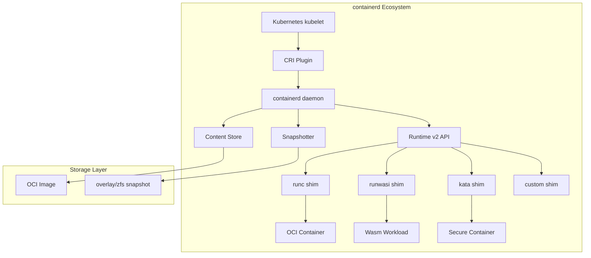
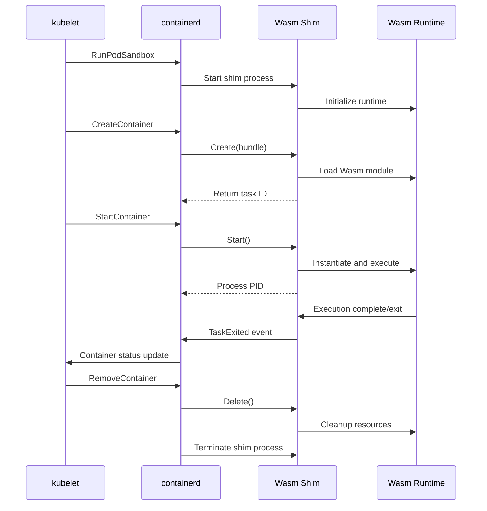
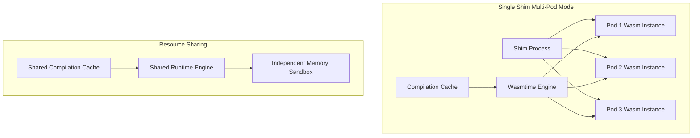
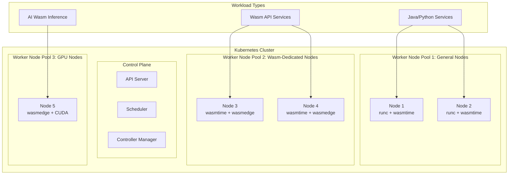

> **Production Safety Notice**
>
> This document contains directly executable operational commands. Before execution, confirm: whether the current target cluster and Namespace are correct; whether you have sufficient RBAC permissions; whether verification has been completed in a non-production environment. Command risk level marking: 🔴 High risk (may cause data loss or service interruption), 🟡 Medium risk (will modify cluster state but usually reversible), 🟢 Low risk/Read-only (information gathering, no side effects).

# [[containerd|containerd]] Wasm Runtime

<!-- chunk: Table of Contents -->## Table of Contents

1. [containerd Architecture Overview](#1-containerd-architecture-overview)
2. [runwasi Project](#2-runwasi-project)
3. [Wasm Shim Implementation](#3-wasm-shim-implementation)
4. [Installation and Configuration](#4-installation-and-configuration)
5. [RuntimeClass Configuration](#5-runtimeclass-configuration)
6. [[entities/kubernetes.md|Kubernetes]] Integration](#6-kubernetes-integration)
7. [Multi-Runtime Deployment](#7-multi-runtime-deployment)
8. [OCI Wasm Artifacts](#8-oci-wasm-artifacts)
9. [Performance Tuning](#9-performance-tuning)
10. [Monitoring and Observability](#10-monitoring-and-observability)
11. [Troubleshooting](#11-troubleshooting)
12. [Production Best Practices](#12-production-best-practices)

---

<!-- chunk: 1. containerd Architecture Overview -->## 1. containerd Architecture Overview

## 1.1 Overall Architecture



## 1.2 Runtime v2 Shim Interface

containerd uses the Runtime v2 (also called shim v2) interface to communicate with container runtimes:

```
Runtime v2 Communication Protocol
                                               
  containerd                    shim process
  ---------                     ------------
       |                              |
       |── ttrpc (unix socket) ──────>|
       |                              |
       |   TaskService.Create()       |
       |   TaskService.Start()        |
       |   TaskService.Kill()         |
       |   TaskService.Delete()       |
       |   TaskService.Wait()         |
       |                              |
       |<─ Event stream (Events) ────|
       |   TaskStarted                |
       |   TaskExited                 |
       |   TaskDeleted                |
                                      
  ttrpc: Binary protocol based on gRPC
         Suitable for low-memory environments
```

```protobuf
// Runtime v2 TaskService core interface (simplified)
service TaskService {
  // Create container/task
  rpc Create(CreateTaskRequest) returns (CreateTaskResponse);
  
  // Start task
  rpc Start(StartRequest) returns (StartResponse);
  
  // Delete task
  rpc Delete(DeleteRequest) returns (DeleteResponse);
  
  // Kill task
  rpc Kill(KillRequest) returns (google.protobuf.Empty);
  
  // Wait for task exit
  rpc Wait(WaitRequest) returns (WaitResponse);
  
  // Get task state
  rpc State(StateRequest) returns (StateResponse);
  
  // Pause/resume
  rpc Pause(PauseRequest) returns (google.protobuf.Empty);
  rpc Resume(ResumeRequest) returns (google.protobuf.Empty);
}
```

## 1.3 Shim Lifecycle



---

<!-- chunk: 2. runwasi Project -->## 2. runwasi Project

## 2.1 Project Overview

runwasi is a containerd community-maintained project that provides a framework for running WebAssembly workloads in containerd:

```
runwasi Project Structure
github.com/containerd/runwasi
│
├── crates/
│   ├── containerd-shim-wasm/        # Shim framework library (core)
│   │   ├── src/
│   │   │   ├── container/           # Container lifecycle management
│   │   │   ├── sandbox/             # Sandbox model
│   │   │   └── testing/             # Testing tools
│   │   └── Cargo.toml
│   │
│   ├── containerd-shim-wasmtime/    # Wasmtime shim
│   │   └── src/main.rs
│   │
│   ├── containerd-shim-wasmedge/    # WasmEdge shim
│   │   └── src/main.rs
│   │
│   └── containerd-shim-wasmer/      # Wasmer shim
│       └── src/main.rs
│
├── scripts/                         # Installation scripts
├── Makefile
└── README.md
```

## 2.2 Core Components

```rust
// containerd-shim-wasm framework core trait definition
// crates/containerd-shim-wasm/src/container/engine.rs

use std::path::PathBuf;
use anyhow::Result;

/// Wasm engine trait - each runtime must implement
pub trait Engine: Clone + Send + Sync + 'static {
    /// Engine name (for logging)
    fn name() -> &'static str;
    
    /// Run Wasm module from OCI bundle
    fn run_wasi(&self, ctx: &impl RuntimeContext, stdio: Stdio) -> Result<i32>;
    
    /// Check if Wasm module can be handled by this engine
    fn can_handle(&self, ctx: &impl RuntimeContext) -> Result<bool>;
    
    /// Create engine instance
    fn new() -> Result<Self>;
}

/// Runtime context - provides container information
pub trait RuntimeContext {
    /// OCI bundle path
    fn bundle(&self) -> PathBuf;
    
    /// OCI configuration
    fn config(&self) -> &oci_spec::runtime::Spec;
    
    /// Environment variables
    fn envs(&self) -> Vec<(String, String)>;
    
    /// Wasm module path
    fn wasm_entrypoint(&self) -> Result<PathBuf>;
}
```

## 2.3 Wasmtime Shim Implementation

```rust
// crates/containerd-shim-wasmtime/src/main.rs
use containerd_shim_wasm::container::{
    Engine, RuntimeContext, Stdio,
};
use wasmtime::{Config, Engine as WasmtimeEngine, Linker, Module, Store};
use wasmtime_wasi::WasiCtxBuilder;
use anyhow::Result;
use std::path::PathBuf;

/// Wasmtime engine implementation
#[derive(Clone)]
pub struct WasmtimeEngine {
    engine: wasmtime::Engine,
}

impl Engine for WasmtimeEngine {
    fn name() -> &'static str {
        "wasmtime"
    }
    
    fn new() -> Result<Self> {
        let mut config = Config::new();
        
        // Enable WASI
        config.wasm_component_model(true);
        
        // Performance optimization
        config.cranelift_opt_level(wasmtime::OptLevel::Speed);
        config.parallel_compilation(true);
        
        // Security configuration
        config.epoch_interruption(true);
        
        Ok(Self {
            engine: wasmtime::Engine::new(&config)?,
        })
    }
    
    fn run_wasi(&self, ctx: &impl RuntimeContext, stdio: Stdio) -> Result<i32> {
        let wasm_path = ctx.wasm_entrypoint()?;
        
        // Create Linker and register WASI
        let mut linker: Linker<wasmtime_wasi::WasiCtx> = 
            Linker::new(&self.engine);
        wasmtime_wasi::add_to_linker(&mut linker, |s| s)?;
        
        // Build WASI context
        let mut wasi_builder = WasiCtxBuilder::new();
        
        // Set standard IO
        wasi_builder.stdout(Box::new(stdio.stdout.take()));
        wasi_builder.stderr(Box::new(stdio.stderr.take()));
        wasi_builder.stdin(Box::new(stdio.stdin.take()));
        
        // Inject environment variables
        for (key, val) in ctx.envs() {
            wasi_builder.env(&key, &val)?;
        }
        
        // Mount directories (from OCI mount configuration)
        for mount in ctx.config().mounts().iter().flatten() {
            let host_path = mount.source().as_deref().unwrap_or("/tmp");
            let guest_path = mount.destination().display().to_string();
            
            let preopened = wasmtime_wasi::Dir::open_ambient_dir(
                host_path,
                wasmtime_wasi::ambient_authority(),
            )?;
            wasi_builder.preopened_dir(preopened, guest_path)?;
        }
        
        let wasi = wasi_builder.build();
        
        // Compile and run module
        let module = Module::from_file(&self.engine, &wasm_path)?;
        let mut store = Store::new(&self.engine, wasi);
        
        // Instantiate
        let instance = linker.instantiate(&mut store, &module)?;
        
        // Find and call _start function
        let start = instance.get_typed_func::<(), ()>(&mut store, "_start");
        
        match start {
            Ok(func) => {
                match func.call(&mut store, ()) {
                    Ok(_) => Ok(0),
                    Err(e) => {
                        // Check if it's a normal exit
                        if let Some(exit) = e.downcast_ref::<wasmtime_wasi::I32Exit>() {
                            Ok(exit.0)
                        } else {
                            Err(e.into())
                        }
                    }
                }
            }
            Err(_) => {
                // Try running default export
                Ok(1)
            }
        }
    }
    
    fn can_handle(&self, ctx: &impl RuntimeContext) -> Result<bool> {
        let path = ctx.wasm_entrypoint()?;
        // Check if it's a valid Wasm file (magic bytes)
        let bytes = std::fs::read(&path)?;
        Ok(bytes.starts_with(b"\0asm"))
    }
}

// Main entry point
fn main() {
    containerd_shim_wasm::sandbox::ShimCli::<WasmtimeEngine>::new().run();
}
```

---

<!-- chunk: 3. Wasm Shim Implementation -->## 3. Wasm Shim Implementation

## 3.1 Shim Process Model

```
Wasm Shim Process Architecture
                                        
  ┌────────────────────────────────────┐
  │  containerd-shim-wasmtime process  │
  │                                    │
  │  ┌──────────────────────────────┐ │
  │  │   ttrpc server               │ │
  │  │   (TaskService implementation)│ │
  │  └──────────────────────────────┘ │
  │                │                  │
  │  ┌─────────────▼────────────────┐ │
  │  │   Sandbox Manager            │ │
  │  │   (SandboxManager)           │ │
  │  └─────────────┬────────────────┘ │
  │                │                  │
  │  ┌─────────────▼────────────────┐ │
  │  │   Wasm Task Management       │ │
  │  │   ┌──────┐  ┌──────┐         │ │
  │  │   │Task 1│  │Task 2│  ...    │ │
  │  │   └──────┘  └──────┘         │ │
  │  └──────────────────────────────┘ │
  │                │                  │
  │  ┌─────────────▼────────────────┐ │
  │  │   Wasmtime Engine            │ │
  │  │   (Engine Pool)              │ │
  │  └──────────────────────────────┘ │
  └────────────────────────────────────┘
```

## 3.2 OCI Bundle Structure

```
OCI Bundle Directory Structure
/run/containerd/io.containerd.runtime.v2.task/
└── k8s.io/
    └── <container-id>/
        ├── config.json         # OCI Runtime Spec
        ├── rootfs/             # Container root filesystem
        │   └── app.wasm        # Wasm module file
        ├── work/               # Working directory
        │   ├── init.pid        # Process PID
        │   └── shim.pid        # Shim PID
        └── log                 # Shim log
```

```json
// config.json - OCI Runtime Spec example (Wasm module)
{
  "ociVersion": "1.0.2",
  "process": {
    "args": ["/app.wasm"],
    "env": [
      "PATH=/usr/local/sbin:/usr/local/bin:/usr/sbin:/usr/bin:/sbin:/bin",
      "SPIN_HTTP_LISTEN_ADDR=0.0.0.0:80"
    ],
    "cwd": "/",
    "capabilities": {}
  },
  "root": {
    "path": "rootfs",
    "readonly": true
  },
  "mounts": [
    {
      "destination": "/tmp",
      "type": "tmpfs",
      "source": "tmpfs",
      "options": ["nosuid", "strictatime", "mode=755", "size=65536k"]
    },
    {
      "destination": "/data",
      "type": "bind",
      "source": "/host/data",
      "options": ["rbind", "rprivate"]
    }
  ],
  "annotations": {
    "module.wasm.image/variant": "compat",
    "run.oci.handler": "spin"
  }
}
```

## 3.3 Multi-instance Model



```rust
// Shim engine pool implementation
use std::sync::Arc;
use wasmtime::{Engine, Module};
use std::collections::HashMap;
use tokio::sync::RwLock;

pub struct EnginePool {
    engine: Engine,
    // Compilation cache: module hash -> compiled Module
    module_cache: Arc<RwLock<HashMap<String, Module>>>,
}

impl EnginePool {
    pub async fn get_or_compile(&self, wasm_bytes: &[u8]) -> anyhow::Result<Module> {
        // Calculate module hash
        let hash = sha256(wasm_bytes);
        
        // Check cache
        {
            let cache = self.module_cache.read().await;
            if let Some(module) = cache.get(&hash) {
                return Ok(module.clone());
            }
        }
        
        // Compile (may be time-consuming)
        let engine = self.engine.clone();
        let bytes = wasm_bytes.to_vec();
        let module = tokio::task::spawn_blocking(move || {
            Module::new(&engine, &bytes)
        }).await??;
        
        // Store in cache
        {
            let mut cache = self.module_cache.write().await;
            cache.insert(hash, module.clone());
        }
        
        Ok(module)
    }
}

fn sha256(data: &[u8]) -> String {
    use sha2::{Sha256, Digest};
    let mut hasher = Sha256::new();
    hasher.update(data);
    format!("{:x}", hasher.finalize())
}
```

---

<!-- chunk: 4. Installation and Configuration -->## 4. Installation and Configuration

## 4.1 Prerequisites

```bash
# 🟢 Low risk: Read-only/information gathering, typically no side effects
# Check containerd version (requires 1.7+)
containerd --version
# containerd containerd.io 1.7.x

# Check Kubernetes version (requires 1.24+)
kubectl version --client
# Client Version: v1.29.x

# Check node architecture
uname -m
# x86_64 or aarch64
```

## 4.2 Install runwasi Shim

```bash
# Method 1: Install using official script

# Install containerd-shim-wasmtime
RUNWASI_VERSION="v0.5.0"
ARCH=$(uname -m)
case $ARCH in
  x86_64)  ARCH="x86_64" ;;
  aarch64) ARCH="aarch64" ;;
  *)       echo "Unsupported architecture: $ARCH"; exit 1 ;;
esac

# Download and install shim
wget "https://github.com/containerd/runwasi/releases/download/${RUNWASI_VERSION}/containerd-shim-wasmtime-${ARCH}.tar.gz"
tar -xzf "containerd-shim-wasmtime-${ARCH}.tar.gz"
sudo install -m 755 containerd-shim-wasmtime-v1 /usr/local/bin/

# Install WasmEdge shim (optional)
wget "https://github.com/containerd/runwasi/releases/download/${RUNWASI_VERSION}/containerd-shim-wasmedge-${ARCH}.tar.gz"
tar -xzf "containerd-shim-wasmedge-${ARCH}.tar.gz"
sudo install -m 755 containerd-shim-wasmedge-v1 /usr/local/bin/

# Verify installation
ls -la /usr/local/bin/containerd-shim-wasm*
# -rwxr-xr-x containerd-shim-wasmtime-v1
# -rwxr-xr-x containerd-shim-wasmedge-v1
```

```bash
# Method 2: Build from source
git clone https://github.com/containerd/runwasi.git
cd runwasi

# Install Rust (if not installed)
curl --proto '=https' --tlsv1.2 -sSf https://sh.rustup.rs | sh

# Build all shims
make build

# Install to system
sudo make install

# Verify
containerd-shim-wasmtime-v1 --version
```

## 4.3 Configure containerd

```toml
# /etc/containerd/config.toml
# containerd main configuration file

version = 2

[plugins."io.containerd.grpc.v1.cri"]
  # Enable Wasm runtime support
  [plugins."io.containerd.grpc.v1.cri".containerd]
    [plugins."io.containerd.grpc.v1.cri".containerd.runtimes]
      # Default runc runtime (keep unchanged)
      [plugins."io.containerd.grpc.v1.cri".containerd.runtimes.runc]
        runtime_type = "io.containerd.runc.v2"
        [plugins."io.containerd.grpc.v1.cri".containerd.runtimes.runc.options]
          SystemdCgroup = true
      
      # Wasmtime runtime
      [plugins."io.containerd.grpc.v1.cri".containerd.runtimes.wasmtime]
        runtime_type = "io.containerd.wasmtime.v1"
        runtime_path = "/usr/local/bin/containerd-shim-wasmtime-v1"
        [plugins."io.containerd.grpc.v1.cri".containerd.runtimes.wasmtime.options]
          # Wasmtime-specific configuration
          
      # WasmEdge runtime
      [plugins."io.containerd.grpc.v1.cri".containerd.runtimes.wasmedge]
        runtime_type = "io.containerd.wasmedge.v1"
        runtime_path = "/usr/local/bin/containerd-shim-wasmedge-v1"
      
      # Spin runtime (requires separate installation)
      [plugins."io.containerd.grpc.v1.cri".containerd.runtimes.spin]
        runtime_type = "io.containerd.spin.v2"
        runtime_path = "/usr/local/bin/containerd-shim-spin-v2"

# Snapshotter configuration
[plugins."io.containerd.snapshotter.v1.overlayfs"]
  # Use overlay for Wasm images
  root_path = "/var/lib/containerd/io.containerd.snapshotter.v1.overlayfs"
```

> ⚠️ **🟠 High-risk operation** — Affects business traffic or node state, requires change order + impact assessment + rollback plan
> - `systemctl stop/restart`: Stop/restart system service, affects all containers on the node

> **🔴 High Risk Operation Warning**
>
> The following commands are irreversible or high-impact operations. Before execution, confirm:
> - Critical data and configurations are backed up
> - Within an approved change window
> - Obtained authorization from relevant stakeholders
> - Prepared rollback or recovery plan
> - Target cluster, Namespace, node/resource names are correct

```bash
# 🔴 High risk: May cause data loss or service interruption, requires backup, change approval, and rollback plan
# Restart containerd to apply configuration
sudo systemctl restart containerd

# Verify runtime registration
sudo ctr plugins ls | grep runtime
# io.containerd.runtime.v1.linux        linux/amd64    ok
# io.containerd.runtime.v2.task         linux/amd64    ok

# Test Wasm runtime (using ctr)
sudo ctr run \
  --rm \
  --runtime=io.containerd.wasmtime.v1 \
  ghcr.io/containerd/runwasi/wasi-demo-app:latest \
  wasm-demo-test
```

## 4.4 Install Spin Shim (Optional)

```bash
# Install Fermyon Spin shim
SPIN_SHIM_VERSION="v0.15.1"

wget "https://github.com/fermyon/containerd-shim-spin/releases/download/${SPIN_SHIM_VERSION}/containerd-shim-spin-${ARCH}.tar.gz"
tar -xzf "containerd-shim-spin-${ARCH}.tar.gz"
sudo install -m 755 containerd-shim-spin-v2 /usr/local/bin/

# Verify
/usr/local/bin/containerd-shim-spin-v2 --help
```

---

<!-- chunk: 5. RuntimeClass Configuration -->## 5. RuntimeClass Configuration

## 5.1 Basic RuntimeClass

```yaml
# Wasmtime RuntimeClass
apiVersion: node.k8s.io/v1
kind: RuntimeClass
metadata:
  name: wasmtime
handler: wasmtime   # Corresponds to runtime name configured in containerd
scheduling:
  nodeClassification:
    tolerations:
    - key: "kubernetes.io/arch"
      operator: "Equal"
      value: "wasm32"
      effect: "NoSchedule"
  nodeClassification:
    nodeSelector:
      matchLabels:
        runtime.wasm/enabled: "true"

---
# WasmEdge RuntimeClass
apiVersion: node.k8s.io/v1
kind: RuntimeClass
metadata:
  name: wasmedge
handler: wasmedge
scheduling:
  nodeClassification:
    tolerations:
    - key: "runtime.wasm/wasmedge"
      operator: "Exists"
      effect: "NoSchedule"

---
# Spin RuntimeClass (high-performance Serverless)
apiVersion: node.k8s.io/v1
kind: RuntimeClass
metadata:
  name: wasmtime-spin
handler: spin
overhead:
  podFixed:
    memory: "8Mi"
    cpu: "5m"
scheduling:
  nodeClassification:
    nodeSelector:
      matchLabels:
        spin.fermyon.com/enabled: "true"
    tolerations:
    - effect: NoSchedule
      key: spin.fermyon.com/enabled
      operator: Exists
```

## 5.2 Node Labels and Taints

> ⚠️ **🟡 Medium-risk change** — Modifies cluster resource state, recommend --dry-run or diff confirmation first
> - `kubectl label/annotate`: Changing metadata may affect selectors/controllers

> **🔴 High Risk Operation Warning**
>
> The following commands are irreversible or high-impact operations. Before execution, confirm:
> - Critical data and configurations are backed up
> - Within an approved change window
> - Obtained authorization from relevant stakeholders
> - Prepared rollback or recovery plan
> - Target cluster, Namespace, node/resource names are correct

```bash
# 🔴 High risk: May cause data loss or service interruption, requires backup, change approval, and rollback plan
# Add labels to Wasm nodes
kubectl label node worker-node-1 runtime.wasm/enabled=true
kubectl label node worker-node-1 spin.fermyon.com/enabled=true

# Add taint to Wasm-dedicated nodes (optional, for dedicated nodes)
kubectl taint node worker-node-1 \
  runtime.wasm/enabled=true:NoSchedule

# Verify node labels
kubectl get nodes --show-labels | grep wasm

# View node details
kubectl describe node worker-node-1 | grep -A5 "Labels:"
```

## 5.3 Multi-runtime RuntimeClass

```yaml
# Complete multi-runtime configuration
---
# Default runc (traditional containers)
apiVersion: node.k8s.io/v1
kind: RuntimeClass
metadata:
  name: runc
handler: runc

---
# Lightweight Wasm (wasmtime, suitable for compute-intensive)
apiVersion: node.k8s.io/v1
kind: RuntimeClass
metadata:
  name: wasm-compute
handler: wasmtime
overhead:
  podFixed:
    memory: "4Mi"
    cpu: "2m"

---
# Serverless Wasm (Spin, suitable for HTTP services)
apiVersion: node.k8s.io/v1
kind: RuntimeClass
metadata:
  name: wasm-http
handler: spin
overhead:
  podFixed:
    memory: "8Mi"
    cpu: "5m"

---
# AI Inference Wasm (WasmEdge + WASI-NN)
apiVersion: node.k8s.io/v1
kind: RuntimeClass
metadata:
  name: wasm-ai
handler: wasmedge
overhead:
  podFixed:
    memory: "32Mi"
    cpu: "100m"
scheduling:
  nodeClassification:
    nodeSelector:
      matchLabels:
        hardware.accelerator/gpu: "true"
```

---

<!-- chunk: 6. Kubernetes Integration -->## 6. Kubernetes Integration

## 6.1 Deploying Wasm Workloads

```yaml
# Simple Wasm Pod
apiVersion: v1
kind: Pod
metadata:
  name: wasm-hello
  annotations:
    # Mark as Wasm workload
    module.wasm.image/variant: compat-smart
spec:
  runtimeClassName: wasmtime  # Specify Wasm runtime
  containers:
  - name: hello
    image: ghcr.io/containerd/runwasi/wasi-demo-app:latest
    # Wasm containers don't need command (determined internally by module)
    resources:
      requests:
        memory: "4Mi"
        cpu: "10m"
      limits:
        memory: "32Mi"
        cpu: "100m"
  
  # Wasm Pods typically don't need initContainers
  restartPolicy: OnFailure
```

```yaml
# Wasm Deployment (HTTP service)
apiVersion: apps/v1
kind: Deployment
metadata:
  name: wasm-api-server
  namespace: production
  labels:
    app: wasm-api
    runtime: wasm
    version: v1.2.0
spec:
  replicas: 5
  selector:
    matchLabels:
      app: wasm-api
  strategy:
    type: RollingUpdate
    rollingUpdate:
      maxSurge: 2
      maxUnavailable: 1
  template:
    metadata:
      labels:
        app: wasm-api
        runtime: wasm
      annotations:
        module.wasm.image/variant: compat-smart
        prometheus.io/scrape: "true"
        prometheus.io/port: "9090"
    spec:
      runtimeClassName: wasmtime-spin
      
      # Security context
      securityContext:
        runAsNonRoot: true
        seccompProfile:
          type: RuntimeDefault
      
      containers:
      - name: api
        image: ghcr.io/myorg/wasm-api:v1.2.0
        ports:
        - name: http
          containerPort: 80
          protocol: TCP
        - name: metrics
          containerPort: 9090
          protocol: TCP
        
        env:
        - name: SPIN_HTTP_LISTEN_ADDR
          value: "0.0.0.0:80"
        - name: DB_URL
          valueFrom:
            secretKeyRef:
              name: db-credentials
              key: url
        - name: LOG_LEVEL
          value: "info"
        
        resources:
          requests:
            memory: "16Mi"
            cpu: "50m"
          limits:
            memory: "128Mi"
            cpu: "500m"
        
        # Health checks
        livenessProbe:
          httpGet:
            path: /health
            port: 80
          initialDelaySeconds: 5
          periodSeconds: 10
          failureThreshold: 3
        
        readinessProbe:
          httpGet:
            path: /ready
            port: 80
          initialDelaySeconds: 2
          periodSeconds: 5
        
        # Startup probe (Wasm starts very fast, no need for long wait)
        startupProbe:
          httpGet:
            path: /health
            port: 80
          failureThreshold: 3
          periodSeconds: 2
      
      # Topology spread constraints (high availability)
      topologySpreadConstraints:
      - maxSkew: 1
        topologyKey: kubernetes.io/hostname
        whenUnsatisfiable: DoNotSchedule
        labelSelector:
          matchLabels:
            app: wasm-api
      
      # Node affinity (only schedule to Wasm-enabled nodes)
      affinity:
        nodeAffinity:
          requiredDuringSchedulingIgnoredDuringExecution:
            nodeSelectorTerms:
            - matchExpressions:
              - key: runtime.wasm/enabled
                operator: In
                values:
                - "true"
```

## 6.2 Service and Ingress

```yaml
# Wasm Service
apiVersion: v1
kind: Service
metadata:
  name: wasm-api-service
  namespace: production
  labels:
    app: wasm-api
spec:
  selector:
    app: wasm-api
  ports:
  - name: http
    port: 80
    targetPort: 80
    protocol: TCP
  type: ClusterIP

---
# Ingress configuration
apiVersion: networking.k8s.io/v1
kind: Ingress
metadata:
  name: wasm-api-ingress
  namespace: production
  annotations:
    nginx.ingress.kubernetes.io/rewrite-target: /
    nginx.ingress.kubernetes.io/proxy-body-size: "1m"
    # Wasm responds extremely fast, reduce timeout
    nginx.ingress.kubernetes.io/proxy-read-timeout: "10"
    nginx.ingress.kubernetes.io/proxy-send-timeout: "10"
spec:
  ingressClassName: nginx
  tls:
  - hosts:
    - api.example.com
    secretName: api-tls-secret
  rules:
  - host: api.example.com
    http:
      paths:
      - path: /api
        pathType: Prefix
        backend:
          service:
            name: wasm-api-service
            port:
              number: 80
```

## 6.3 KEDA Autoscaling

```yaml
# KEDA ScaledObject - HTTP traffic-based scaling
apiVersion: keda.sh/v1alpha1
kind: ScaledObject
metadata:
  name: wasm-api-scaler
  namespace: production
spec:
  scaleTargetRef:
    apiVersion: apps/v1
    kind: Deployment
    name: wasm-api-server
  
  # Scale to 0 when idle
  minReplicaCount: 0
  maxReplicaCount: 100
  
  # Scaling strategy
  pollingInterval: 15  # Check every 15 seconds
  cooldownPeriod: 300  # Scale down after 5 minutes
  
  triggers:
  # HTTP trigger
  - type: prometheus
    metadata:
      serverAddress: http://prometheus.monitoring.svc:9090
      metricName: http_requests_per_second
      query: |
        sum(rate(http_server_requests_total{app="wasm-api"}[1m]))
      threshold: "100"   # Scale up 1 instance per 100 RPS
  
  # Can also scale based on queue length
  - type: rabbitmq
    metadata:
      host: amqp://rabbitmq.default.svc
      queueName: task-queue
      queueLength: "50"  # Scale up when queue exceeds 50 messages

---
# HTTP ScaledObject (using KEDA HTTP Add-on)
apiVersion: http.keda.sh/v1alpha1
kind: HTTPScaledObject
metadata:
  name: wasm-http-scaler
  namespace: production
spec:
  hosts:
  - api.example.com
  
  targetPendingRequests: 100  # Max 100 pending requests per instance
  
  scaleTargetRef:
    deployment: wasm-api-server
    service: wasm-api-service
    port: 80
  
  replicas:
    min: 0
    max: 50
```

---

<!-- chunk: 7. Multi-Runtime Deployment -->## 7. Multi-Runtime Deployment

## 7.1 Hybrid Workload Cluster



## 7.2 Node Pool Configuration

```yaml
# General worker nodes (containerd configuration)
# /etc/containerd/config.toml on general nodes

version = 2

[plugins."io.containerd.grpc.v1.cri".containerd]
  [plugins."io.containerd.grpc.v1.cri".containerd.runtimes]
    # Standard container runtime
    [plugins."io.containerd.grpc.v1.cri".containerd.runtimes.runc]
      runtime_type = "io.containerd.runc.v2"
    
    # Basic Wasm support
    [plugins."io.containerd.grpc.v1.cri".containerd.runtimes.wasmtime]
      runtime_type = "io.containerd.wasmtime.v1"
      runtime_path = "/usr/local/bin/containerd-shim-wasmtime-v1"
```

```yaml
# Wasm-dedicated nodes (containerd configuration)
# Additional Wasm runtimes installed

version = 2

[plugins."io.containerd.grpc.v1.cri".containerd]
  # Set default runtime to wasmtime
  default_runtime_name = "wasmtime"
  
  [plugins."io.containerd.grpc.v1.cri".containerd.runtimes]
    [plugins."io.containerd.grpc.v1.cri".containerd.runtimes.wasmtime]
      runtime_type = "io.containerd.wasmtime.v1"
    
    [plugins."io.containerd.grpc.v1.cri".containerd.runtimes.wasmedge]
      runtime_type = "io.containerd.wasmedge.v1"
    
    [plugins."io.containerd.grpc.v1.cri".containerd.runtimes.spin]
      runtime_type = "io.containerd.spin.v2"
    
    # Keep runc as fallback
    [plugins."io.containerd.grpc.v1.cri".containerd.runtimes.runc]
      runtime_type = "io.containerd.runc.v2"
```

## 7.3 Scheduling Policies

```yaml
# Use PriorityClass to prioritize Wasm workloads
apiVersion: scheduling.k8s.io/v1
kind: PriorityClass
metadata:
  name: wasm-high-priority
value: 1000
globalDefault: false
description: "High-priority Wasm workloads"

---
# Scheduling policy for Wasm workloads
apiVersion: v1
kind: Pod
metadata:
  name: wasm-workload
spec:
  runtimeClassName: wasmtime
  priorityClassName: wasm-high-priority  # High priority
  
  # Node affinity (prefer Wasm-dedicated nodes)
  affinity:
    nodeAffinity:
      preferredDuringSchedulingIgnoredDuringExecution:
      - weight: 100
        preference:
          matchExpressions:
          - key: node-type
            operator: In
            values:
            - wasm-optimized
      
      # If no optimized nodes, can run on general nodes
      requiredDuringSchedulingIgnoredDuringExecution:
        nodeSelectorTerms:
        - matchExpressions:
          - key: runtime.wasm/enabled
            operator: Exists
  
  # Tolerate Wasm node taints
  tolerations:
  - key: "runtime.wasm/enabled"
    operator: "Exists"
    effect: "NoSchedule"
  
  containers:
  - name: app
    image: ghcr.io/myorg/myapp:latest
    resources:
      requests:
        memory: "8Mi"
        cpu: "50m"
```

---

<!-- chunk: 8. OCI Wasm Artifacts -->## 8. OCI Wasm Artifacts

## 8.1 Wasm OCI Specification

```
OCI Wasm Artifact Format

OCI Image Manifest:
{
  "schemaVersion": 2,
  "mediaType": "application/vnd.oci.image.manifest.v1+json",
  "config": {
    "mediaType": "application/vnd.wasm.config.v1+json",
    "digest": "sha256:...",
    "size": 123
  },
  "layers": [
    {
      "mediaType": "application/vnd.wasm.content.layer.v1+wasm",
      "digest": "sha256:...",
      "size": 98765,
      "annotations": {
        "org.opencontainers.image.title": "app.wasm"
      }
    },
    {
      "mediaType": "application/vnd.spin.manifest.v2+json",
      "digest": "sha256:...",
      "size": 456,
      "annotations": {
        "org.opencontainers.image.title": "spin.toml"
      }
    }
  ],
  "annotations": {
    "module.wasm.image/variant": "spin",
    "org.opencontainers.image.created": "2025-03-04T00:00:00Z",
    "org.opencontainers.image.revision": "abc123"
  }
}
```

## 8.2 Build Wasm OCI Image

```dockerfile
# Dockerfile - Multi-stage build for Wasm image
FROM rust:1.75 AS builder

WORKDIR /build

# Install Wasm target
RUN rustup target add wasm32-wasi

# Copy source code
COPY Cargo.toml Cargo.lock ./
COPY src/ ./src/

# Compile Wasm
RUN cargo build --target wasm32-wasi --release

# Optimize Wasm size
RUN cargo install wasm-opt && \
    wasm-opt -Os \
      target/wasm32-wasi/release/myapp.wasm \
      -o /app.wasm

# Final image (scratch base)
FROM scratch

# Copy Wasm module
COPY --from=builder /app.wasm /app.wasm

# If there's a config file
COPY spin.toml /spin.toml

ENTRYPOINT ["/app.wasm"]
```

```bash
# 🟢 Low risk: Read-only/information gathering, typically no side effects
# Build and push Wasm OCI image
# Build
docker build -t ghcr.io/myorg/myapp:v1.0.0 .

# Add Wasm variant annotation
docker manifest annotate \
  ghcr.io/myorg/myapp:v1.0.0 \
  --os wasi \
  --arch wasm

# Push
docker push ghcr.io/myorg/myapp:v1.0.0

# Verify
docker manifest inspect ghcr.io/myorg/myapp:v1.0.0
```

## 8.3 Using Spin Registry

```bash
# Build and push using Spin CLI
spin build

# Push to OCI registry
spin registry push ghcr.io/myorg/myapp:v1.0.0

# Pull
spin registry pull ghcr.io/myorg/myapp:v1.0.0

# Run locally
spin up --from ghcr.io/myorg/myapp:v1.0.0
```

---

<!-- chunk: 9. Performance Tuning -->## 9. Performance Tuning

## 9.1 Shim Performance Parameters

```toml
# /etc/containerd/config.toml - Performance optimization configuration

version = 2

# Increase concurrency processing capability
[grpc]
  max_recv_message_size = 16777216  # 16MB
  max_send_message_size = 16777216

[plugins."io.containerd.grpc.v1.cri".containerd.runtimes.wasmtime]
  runtime_type = "io.containerd.wasmtime.v1"
  
  [plugins."io.containerd.grpc.v1.cri".containerd.runtimes.wasmtime.options]
    # Enable AOT cache (persist compiled cache across restarts)
    # Requires shim support
    CacheDir = "/var/cache/containerd/wasmtime"
    
    # Number of parallel compilation threads
    CompileThreads = "4"
```

```bash
# Create AOT cache directory
sudo mkdir -p /var/cache/containerd/wasmtime
sudo chmod 755 /var/cache/containerd/wasmtime

# Precompile common Wasm modules (reduce first cold start time)
wasmtime compile \
  --target x86_64-linux \
  /app/modules/api-server.wasm \
  -o /var/cache/containerd/wasmtime/api-server.cwasm
```

## 9.2 Memory Optimization

```yaml
# Optimize resource limits for Wasm workloads
apiVersion: v1
kind: Pod
spec:
  containers:
  - name: wasm-app
    image: ghcr.io/myorg/myapp:latest
    resources:
      requests:
        # Wasm typically requires very little memory
        memory: "8Mi"
        cpu: "25m"
      limits:
        memory: "64Mi"
        cpu: "250m"
    
    # Enable memory hugepages (beneficial for some Wasm workloads)
    # resources:
    #   limits:
    #     hugepages-2Mi: "64Mi"
    
    # Container security context
    securityContext:
      readOnlyRootFilesystem: true   # Wasm typically doesn't need to write to root filesystem
      allowPrivilegeEscalation: false
      capabilities:
        drop:
        - ALL
```

## 9.3 Network Performance

```yaml
# Use high-performance network policy for Wasm services
apiVersion: networking.k8s.io/v1
kind: NetworkPolicy
metadata:
  name: wasm-api-netpol
  namespace: production
spec:
  podSelector:
    matchLabels:
      app: wasm-api
  policyTypes:
  - Ingress
  - Egress
  
  # Allow traffic from Ingress Controller
  ingress:
  - from:
    - namespaceSelector:
        matchLabels:
          name: ingress-nginx
    ports:
    - port: 80
      protocol: TCP
  
  # Allow access to database
  egress:
  - to:
    - podSelector:
        matchLabels:
          app: postgres
    ports:
    - port: 5432
  
  # Allow DNS
  - to:
    - namespaceSelector: {}
    ports:
    - port: 53
      protocol: UDP
```

---

<!-- chunk: 10. Monitoring and Observability -->## 10. Monitoring and Observability

## 10.1 Metrics Exposure

```rust
// Built-in Prometheus Metrics in Wasm application
use spin_sdk::http::{IntoResponse, Request, Response};
use spin_sdk::http_component;
use std::sync::atomic::{AtomicU64, Ordering};

static REQUEST_COUNT: AtomicU64 = AtomicU64::new(0);
static ERROR_COUNT: AtomicU64 = AtomicU64::new(0);

#[http_component]
fn handle_request(req: Request) -> anyhow::Result<impl IntoResponse> {
    // If it's metrics endpoint
    if req.uri().path() == "/metrics" {
        let metrics = format!(
            "# HELP wasm_requests_total Total requests\n\
             # TYPE wasm_requests_total counter\n\
             wasm_requests_total {}\n\
             # HELP wasm_errors_total Total errors\n\
             # TYPE wasm_errors_total counter\n\
             wasm_errors_total {}\n",
            REQUEST_COUNT.load(Ordering::Relaxed),
            ERROR_COUNT.load(Ordering::Relaxed),
        );
        
        return Ok(Response::builder()
            .status(200)
            .header("Content-Type", "text/plain; version=0.0.4")
            .body(metrics)
            .build());
    }
    
    // Count requests
    REQUEST_COUNT.fetch_add(1, Ordering::Relaxed);
    
    // Handle normal requests
    Ok(Response::builder()
        .status(200)
        .body("OK")
        .build())
}
```

## 10.2 Prometheus Monitoring Configuration

```yaml
# ServiceMonitor for Prometheus Operator
apiVersion: monitoring.coreos.com/v1
kind: ServiceMonitor
metadata:
  name: wasm-apps-monitor
  namespace: monitoring
  labels:
    team: platform
spec:
  selector:
    matchLabels:
      app: wasm-api
  namespaceSelector:
    matchNames:
    - production
  endpoints:
  - port: metrics
    interval: 15s
    path: /metrics
    scrapeTimeout: 10s

---
# Alert rules
apiVersion: monitoring.coreos.com/v1
kind: PrometheusRule
metadata:
  name: wasm-alerts
  namespace: monitoring
spec:
  groups:
  - name: wasm.rules
    rules:
    # Wasm cold start time too long
    - alert: WasmColdStartHigh
      expr: |
        histogram_quantile(0.95,
          rate(container_start_duration_seconds_bucket{
            runtimeclass="wasmtime"
          }[5m])
        ) > 0.01  # Alert if > 10ms
      for: 2m
      labels:
        severity: warning
      annotations:
        summary: "Wasm cold start time anomaly"
        description: "P95 cold start time exceeds 10ms"
    
    # Wasm error rate too high
    - alert: WasmHighErrorRate
      expr: |
        rate(wasm_errors_total[5m]) 
        / rate(wasm_requests_total[5m]) > 0.05
      for: 1m
      labels:
        severity: critical
      annotations:
        summary: "Wasm application error rate too high"
```

## 10.3 Distributed Tracing

```rust
// OpenTelemetry tracing in Wasm application
use opentelemetry::{global, trace::{Tracer, SpanKind}};
use spin_sdk::http::{IntoResponse, Request, Response};
use spin_sdk::http_component;

#[http_component]
fn handle_request(req: Request) -> anyhow::Result<impl IntoResponse> {
    let tracer = global::tracer("wasm-api");
    
    // Extract trace context from request headers
    let parent_cx = extract_trace_context(&req);
    
    let span = tracer
        .span_builder("handle_request")
        .with_kind(SpanKind::Server)
        .start_with_context(&tracer, &parent_cx);
    
    let cx = opentelemetry::Context::current_with_span(span);
    
    // Business logic
    let result = process_request(&req, &cx);
    
    // Span automatically ends
    Ok(result)
}

fn extract_trace_context(req: &Request) -> opentelemetry::Context {
    // Extract from traceparent header
    let headers: std::collections::HashMap<String, String> = req
        .headers()
        .iter()
        .map(|(k, v)| (k.to_string(), v.to_str().unwrap_or("").to_string()))
        .collect();
    
    // Use propagator to extract
    opentelemetry::global::get_text_map_propagator(|propagator| {
        propagator.extract(&headers)
    })
}
```

---

<!-- chunk: 11. Troubleshooting -->## 11. Troubleshooting

## 11.1 Common Issues

> ⚠️ **🟠 High-risk operation** — Affects business traffic or node state, requires change order + impact assessment + rollback plan
> - `systemctl stop/restart`: Stop/restart system service, affects all containers on the node

> **🔴 High Risk Operation Warning**
>
> The following commands are irreversible or high-impact operations. Before execution, confirm:
> - Critical data and configurations are backed up
> - Within an approved change window
> - Obtained authorization from relevant stakeholders
> - Prepared rollback or recovery plan
> - Target cluster, Namespace, node/resource names are correct

```bash
# 🔴 High risk: May cause data loss or service interruption, requires backup, change approval, and rollback plan
# Issue 1: containerd cannot find shim
# Error: failed to run containerd-shim-wasmtime-v1: executable not found

# Check if shim is installed
which containerd-shim-wasmtime-v1
ls -la /usr/local/bin/containerd-shim-wasm*

# Check permissions
sudo chmod +x /usr/local/bin/containerd-shim-wasmtime-v1

# Check containerd configuration
sudo cat /etc/containerd/config.toml | grep -A5 wasmtime

# Restart containerd
sudo systemctl restart containerd
sudo systemctl status containerd

# Issue 2: Pod cannot be scheduled to Wasm nodes
# Check node labels
kubectl get nodes --show-labels | grep wasm

# Check RuntimeClass
kubectl get runtimeclass
kubectl describe runtimeclass wasmtime

# Check Pod events
kubectl describe pod <pod-name> | grep -A10 Events

# Issue 3: Wasm module execution failure
# View containerd logs
sudo journalctl -u containerd -f --since "5 minutes ago"

# View shim logs
sudo cat /var/log/containerd/shim.log

# Direct run test
sudo ctr run \
  --rm \
  --runtime=io.containerd.wasmtime.v1 \
  --env "TEST=1" \
  <image> test-run

# Issue 4: Memory limit causing OOM
# Check OOM events
kubectl get events --field-selector reason=OOMKilling
dmesg | grep -i oom
```

```bash
# 🟢 Low risk: Read-only/information gathering, typically no side effects
# Debug tool script
#!/bin/bash
# debug-wasm.sh - Wasm workload debug script

set -euo pipefail

NAMESPACE=${1:-default}
POD=${2:-}

echo "=== Check Wasm Runtime Support ==="
for shim in wasmtime wasmedge wasmer spin; do
  if which "containerd-shim-${shim}-v1" &>/dev/null || \
     which "containerd-shim-${shim}-v2" &>/dev/null; then
    echo "✅ ${shim} shim installed"
  else
    echo "❌ ${shim} shim not installed"
  fi
done

echo ""
echo "=== Check RuntimeClass ==="
kubectl get runtimeclass -o wide

echo ""
echo "=== Check Wasm Nodes ==="
kubectl get nodes -l runtime.wasm/enabled=true -o wide

echo ""
echo "=== containerd Runtime Status ==="
sudo systemctl is-active containerd

if [ -n "$POD" ]; then
  echo ""
  echo "=== Pod Debug Info: $POD ==="
  kubectl describe pod "$POD" -n "$NAMESPACE"
  echo ""
  echo "=== Pod Logs ==="
  kubectl logs "$POD" -n "$NAMESPACE" --previous 2>/dev/null || \
  kubectl logs "$POD" -n "$NAMESPACE"
fi
```

## 11.2 Performance Profiling

```bash
# Use perf to analyze Wasm shim performance
sudo perf stat -e cycles,instructions,cache-misses \
  -p $(pidof containerd-shim-wasmtime-v1) \
  sleep 10

# Flame graph analysis
sudo perf record -g \
  -p $(pidof containerd-shim-wasmtime-v1) \
  sleep 30

sudo perf script | \
  stackcollapse-perf.pl | \
  flamegraph.pl > shim-flamegraph.svg

# Memory analysis
valgrind --tool=massif \
  containerd-shim-wasmtime-v1 --test-run \
  /path/to/test.wasm
```

---

<!-- chunk: 12. Production Best Practices -->## 12. Production Best Practices

## 12.1 Image Security

```yaml
# Sign Wasm images with cosign
# Sign in CI/CD
- name: Sign Wasm image
  run: |
    cosign sign \
      --key cosign.key \
      ghcr.io/myorg/myapp:${{ github.sha }}

# Kubernetes admission control verify signature
apiVersion: admissionregistration.k8s.io/v1
kind: ValidatingAdmissionPolicy
metadata:
  name: require-signed-wasm-images
spec:
  failurePolicy: Fail
  matchConstraints:
    resourceRules:
    - apiGroups: [""]
      apiVersions: ["v1"]
      resources: ["pods"]
      operations: ["CREATE"]
  
  # Verify Wasm workload image signatures
  validations:
  - expression: |
      object.spec.runtimeClassName == null ||
      !object.spec.runtimeClassName.contains("wasm") ||
      object.spec.containers.all(c, 
        c.image.contains("@sha256:"))
    message: "Wasm workloads must use digest-referenced images"
```

## 12.2 Resource Quotas

```yaml
# Set quotas for Wasm workload namespace
apiVersion: v1
kind: ResourceQuota
metadata:
  name: wasm-namespace-quota
  namespace: wasm-production
spec:
  hard:
    # Pod count limit
    count/pods: "500"
    
    # Resource limits (Wasm typically uses fewer resources)
    requests.cpu: "100"
    requests.memory: "50Gi"
    limits.cpu: "200"
    limits.memory: "100Gi"
    
    # Limit to Wasm runtimes only
    count/runtimeclasses.node.k8s.io: "5"

---
# LimitRange - Set default resources for Wasm Pods
apiVersion: v1
kind: LimitRange
metadata:
  name: wasm-limits
  namespace: wasm-production
spec:
  limits:
  - type: Container
    defaultRequest:
      cpu: "25m"
      memory: "16Mi"
    default:
      cpu: "250m"
      memory: "128Mi"
    max:
      cpu: "2"
      memory: "1Gi"
    min:
      cpu: "5m"
      memory: "4Mi"
```

## 12.3 High Availability Deployment

```yaml
# Production-grade Wasm high availability configuration
apiVersion: apps/v1
kind: Deployment
metadata:
  name: wasm-ha-service
  namespace: production
spec:
  replicas: 6       # At least 6 replicas
  
  # Rolling update strategy
  strategy:
    type: RollingUpdate
    rollingUpdate:
      maxSurge: 3
      maxUnavailable: 0  # Zero-downtime updates
  
  template:
    spec:
      runtimeClassName: wasmtime
      
      # Anti-affinity: spread replicas across different nodes
      affinity:
        podAntiAffinity:
          requiredDuringSchedulingIgnoredDuringExecution:
          - labelSelector:
              matchLabels:
                app: wasm-ha-service
            topologyKey: kubernetes.io/hostname
        
        # Prefer different availability zones
        podAntiAffinity:
          preferredDuringSchedulingIgnoredDuringExecution:
          - weight: 100
            podAffinityTerm:
              labelSelector:
                matchLabels:
                  app: wasm-ha-service
              topologyKey: topology.kubernetes.io/zone
      
      # Configured in PodDisruptionBudget
      containers:
      - name: app
        image: ghcr.io/myorg/wasm-ha:latest
        resources:
          requests:
            memory: "16Mi"
            cpu: "50m"
          limits:
            memory: "128Mi"
            cpu: "500m"

---
# PDB ensures high availability
apiVersion: policy/v1
kind: PodDisruptionBudget
metadata:
  name: wasm-pdb
  namespace: production
spec:
  minAvailable: "75%"  # At least 75% replicas available
  selector:
    matchLabels:
      app: wasm-ha-service
```

## 12.4 GitOps Deployment Flow

```yaml
# ArgoCD Application for Wasm services
apiVersion: argoproj.io/v1alpha1
kind: Application
metadata:
  name: wasm-services
  namespace: argocd
  finalizers:
  - resources-finalizer.argocd.argoproj.io
spec:
  project: production
  
  source:
    repoURL: https://github.com/myorg/k8s-manifests
    targetRevision: main
    path: apps/wasm-services
    
    # Helm values (if using Helm)
    helm:
      values: |
        runtime:
          className: wasmtime
        image:
          tag: v1.5.2
        replicas: 6
  
  destination:
    server: https://kubernetes.default.svc
    namespace: production
  
  syncPolicy:
    automated:
      prune: true
      selfHeal: true
    syncOptions:
    - CreateNamespace=true
    - PrunePropagationPolicy=foreground
    
    retry:
      limit: 3
      backoff:
        duration: 5s
        factor: 2
        maxDuration: 3m
```

---

<!-- chunk: References -->## References

## Official Documentation
- [containerd Official Documentation](https://containerd.io/docs/)
- [runwasi GitHub](https://github.com/containerd/runwasi)
- [containerd Runtime v2 Specification](https://github.com/containerd/containerd/blob/main/runtime/v2/README.md)

## CNCF Related
- [CNCF Wasm Whitepaper](https://tag-runtime.cncf.io/wgs/wasm/whitepapers/wasm-cncf-whitepaper/)
- [WasmEdge CNCF Sandbox](https://www.cncf.io/projects/wasmedge-runtime/)

## Tools & Projects
- [wasmtime](https://wasmtime.dev/)
- [Fermyon Spin](https://developer.fermyon.com/)
- [wasm-tools](https://github.com/bytecodealliance/wasm-tools)

---

*Last Updated: 2025-03-04*
*Version: 1.0.0*

---

<!-- chunk: Obsidian Related Documents -->## Obsidian Related Documents

- Domain 38: WebAssembly Cloud Native - MOC
- [[domain-15-specialized-tech/README.md|Domain 15: WebAssembly Cloud Native]]
- Domain-38 WebAssembly Cloud Native — Open Source Project Index
- WebAssembly Cloud Native Fundamentals
- SpinKube Framework Practice
- wasmCloud Platform
- WasmEdge Runtime
- Wasm Component Model
- Wasm Plugin System
- Wasm AI Inference
- Wasm Serverless
- Wasm Security and Sandbox

## See Also

- 99-wasmedge-cloud-native-guide
- 01-wasm-fundamentals-cloud-native
- 03-spinkube-framework
- 04-wasmcloud-platform

<!-- risk-assessed -->
