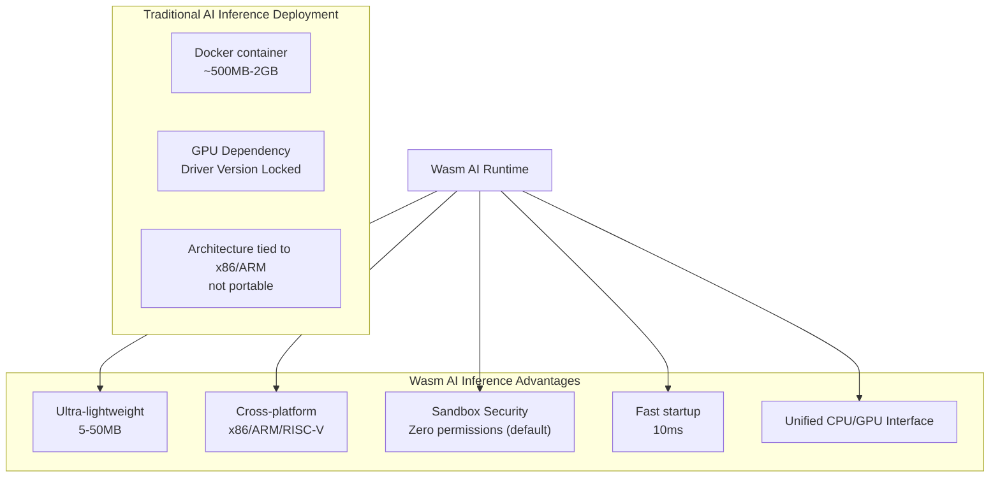
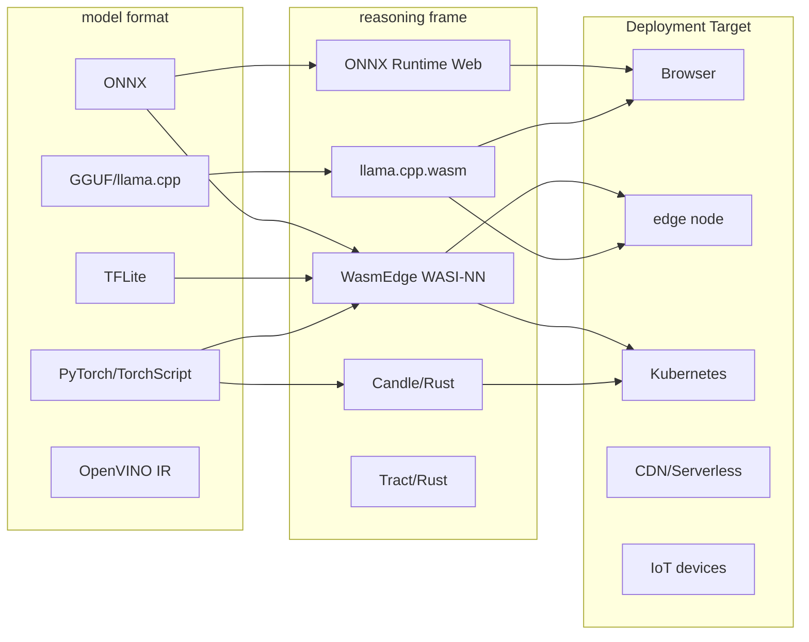
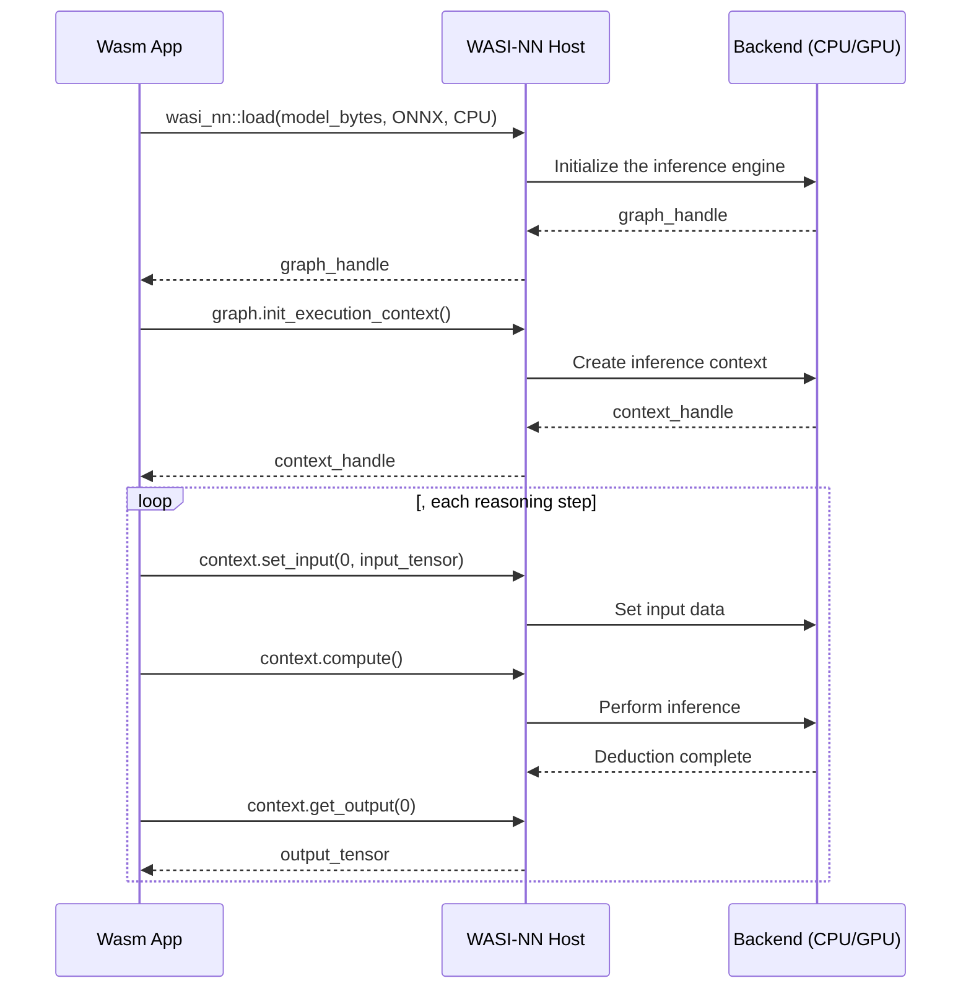
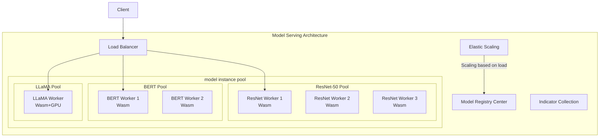

# Wasm AI Inference (Wasm AI Inference)

Enable secure, efficient, and portable model deployment by running AI/ML inference on edge nodes and in cloud-native environments via WebAssembly.

---

<!-- chunk: directory-->## directory

1. [Wasm AI Inference Architecture Overview](#1-wasm-ai-inference-architecture-overview)
2. [WASI-NN Standard Interface](#2-wasi-nn-standard interface)
3. [[entities/wasmedge.md|WasmEdge]] WASI-NN Practice](#3-wasmedge-wasi-nn-Practice)
4. [ONNX Runtime Wasm](#4-onnx-runtime-wasm)
5. [llama.cpp Wasm porting](#5-llamacpp-wasm-porting)
6. [Model Optimization and Quantization](#6-Model Optimization and Quantization)
7. [Edge AI Inference Deployment](#7-Edge-AI-Inference Deployment)
8. [Rust AI Inference Development](#8-rust-ai-inference-development)
9. [Python/JS AI Inference Integration](#9-pythonjs-ai-inference integration)
10. [Multi-model service architecture](#10-Multi-model service architecture)
11. [Performance Benchmarks and Comparisons](#11-Performance Benchmarks and Comparisons)
12. [[entities/kubernetes.md|Kubernetes]] AI Inference Integration](#12-kubernetes-ai-inference-integration)
13. [Practical Case Study: Image Classification Service](#13-Practical Case Study: Image Classification Service)
14. [Practical Case Study: LLM Inference Service](#14-Practical Case Study: LLM-Inference Service)

---

<!-- chunk: 1. Overview of Wasm AI Inference Architecture-->## 1. Overview of Wasm AI Inference Architecture

## 1.1 Why choose Wasm for AI inference



## 1.2 Wasm AI Inference Ecosystem Overview



## 1.3 Key Technical Indicators

```
Wasm AI Inference Performance Metrics (2025):

┌────────────────────────────────────────────────────┐
│ Model Type │ Framework │ Latency │ Throughput │
├────────────────────────────────────────────────────┤
│ ResNet-50 │ WASI-NN/ORT │ 8ms │ 120 img/s │
│ BERT-base │ WASI-NN/ORT │ 45ms │ 22 req/s │
│ Whisper-tiny │ WasmEdge │ 0.3x │ Real-time transcription │
│ LLaMA-7B(Q4) │ llama.wasm │ 15t/s │ Available for single user │
│ YOLOv8n │ WASI-NN │ 25ms │ 40 img/s │
│ Stable Diffusion│ WebGPU+Wasm │ ~60s │ 1 img/min │
└────────────────────────────────────────────────────┘

Note: Latency data is based on Apple M2 or equivalent x86 CPU.
```

---

<!-- chunk: 2. WASI-NN Standard Interface-->## 2. WASI-NN Standard Interface

## 2.1 WASI-NN Interface Definition

WASI-NN (WebAssembly System Interface for Neural Networks) is a standardized AI inference interface.

```wit
// wasi-nn.wit (simplified version)
package wasi:nn@0.2.0;

interface graph {
    // Backend type
    enum graph-encoding {
        openvino,
        onnx,
        TensorFlow
        pytorch,
        tensorflowlite,
        ggml,
        autodetect,
    }
    
    // Execution target
    enum execution-target {
        CPU
        GPU
        tpu,
    }
    
    // Graph (model) handle
    resource graph {
        // Initialize inference context
        init-execution-context: func() -> result<graph-execution-context, error>;
    }
    
    // Load model
    load: func(
        builder: list<list<u8>>,
        encoding: graph-encoding,
        target: execution-target,
    ) -> result<graph, error>;
    
    // Load from pre-registered names
    load-by-name: func(name: string) -> result<graph, error>;
}

interface inference {
    use graph.{graph-execution-context};
    
    resource graph-execution-context {
        // Set input tensor
        set-input: func(
            index: u32,
            tensor: tensor,
        ) -> result<_, error>;
        
        // Perform inference
        compute: func() -> result<_, error>;
        
        // Get the output tensor
        get-output: func(index: u32) -> result<tensor, error>;
    }
}

interface tensor {
    // Tensor type
    enum tensor-type {
        fp16,
        fp32,
        fp64,
        bf16,
        u8,
        i32,
        i64,
    }
    
    record tensor {
        // Tensor shape [batch, channels, height, width]
        dimensions: list<u32>,
        ty: tensor-type,
        data: tensor-data,
    }
    
    type tensor-data = list<u8>; // Raw byte data
}
```

## 2.2 WASI-NN Call Flow



## 2.3 WASI-NN Error Types

rust
// WASI-NN Error Handling
#[repr(u32)]
pub enum NnErrno {
    Success = 0,
    InvalidArgument = 1,
    InvalidEncoding = 2,
    Timeout = 3,
    RuntimeError = 4,
    UnsupportedOperation = 5,
    TooLarge = 6,
    NotFound = 7,
}

impl std::fmt::Display for NnErrno {
    fn fmt(&self, f: &mut std::fmt::Formatter<'_>) -> std::fmt::Result {
        match self {
            NnErrno::Success => write!(f, "Success"),
            NnErrno::InvalidArgument => write!(f, "Invalid argument"),
            NnErrno::InvalidEncoding => write!(f, "Invalid model encoding"),
            NnErrno::Timeout => write!(f, "Inference timeout"),
            NnErrno::RuntimeError => write!(f, "Runtime error during inference"),
            NnErrno::UnsupportedOperation => write!(f, "Unsupported operation"),
            NnErrno::TooLarge => write!(f, "Input/output too large"),
            NnErrno::NotFound => write!(f, "Model or resource not found"),
        }
    }
}
```

---

<!-- chunk: 3. WasmEdge WASI-NN Practice-->## 3. WasmEdge WASI-NN Practice

## 3.1 WasmEdge Installation and Configuration

bash
# Install WasmEdge (with WASI-NN support)
curl -sSf https://raw.githubusercontent.com/WasmEdge/WasmEdge/master/utils/install.sh | \
  bash -s --plugins wasi_nn-ggml wasi_nn-openvino

# Verify Installation
wasmedge --version
wasmedge plugin list

# Install ONNX backend
curl -sSf https://raw.githubusercontent.com/WasmEdge/WasmEdge/master/utils/install.sh | \
  bash -s --plugins wasi_nn-onnxruntime

# Configure Environment
source ~/.bashrc
export WASMEDGE_PLUGIN_PATH=/usr/local/lib/wasmedge
```

## 3.2 Complete Image Classification Example

rust
// Cargo.toml
// [dependencies]
// wasi-nn = "0.5.0"
// image = "0.24"
// ndarray = "0.15"

// src/main.rs - ONNX Image Classification
use wasi_nn::{
    ExecutionTarget, GraphBuilder, GraphEncoding,
    GraphExecutionContext, TensorType,
};

fn main() -> Result<(), Box<dyn std::error::Error>> {
    // 1. Load the model
    println!("Loading model...");
    let model_bytes = std::fs::read("resnet50.onnx")?;
    
    let graph = GraphBuilder::new(GraphEncoding::Onnx, ExecutionTarget::Cpu)
        .build_from_bytes([&model_bytes])?;
    
    // 2. Create an execution context
    let mut context = graph.init_execution_context()?;
    
    // 3. Process the input image
    println!("Processing image...");
    let img = image::open("test-image.jpg")?
        .resize_exact(224, 224, image::imageops::FilterType::Lanczos3)
        .to_rgb8();
    
    // Normalize to [0, 1] and arrange in NCHW format [1, 3, 224, 224].
    let tensor_data = preprocess_image(&img);
    
    // 4. Set Input
    context.set_input(
        0,
        TensorType::F32,
        &[1, 3, 224, 224],
        &tensor_data,
    )?;
    
    // 5. Perform inference
    let start = std::time::Instant::now();
    context.compute()?;
    let inference_time = start.elapsed();
    
    // 6. Get the output
    let output_size = 1000; // ImageNet 1000 class
    let mut output_data = vec![0f32; output_size];
    
    context.get_output(
        0,
        &mut output_data.iter_mut()
            .flat_map(|v| v.to_le_bytes())
            .collect::<Vec<u8>>()
    )?;
    
    // 7. Parsing Results
    let results = postprocess_classification(&output_data);
    
    println!("\nInference time: {:?}", inference_time);
    println!("\nTop-5 classification results:");
    for (i, (class_id, confidence)) in results.iter().enumerate().take(5) {
        println!(" {}. Class {} - confidence level: {:.2}%",
            i + 1, class_id, confidence * 100.0);
    }
    
    Ok(())
}

fn preprocess_image(img: &image::RgbImage) -> Vec<u8> {
    // ImageNet normalization parameters
    let mean = [0.485f32, 0.456, 0.406];
    let std = [0.229f32, 0.224, 0.225];
    
    let width = img.width() as usize;
    let height = img.height() as usize;
    
    // NHWC -> NCHW conversion and normalization
    let mut tensor = vec![0f32; 1 * 3 * height * width];
    
    for y in 0..height {
        for x in 0..width {
            let pixel = img.get_pixel(x as u32, y as u32);
            for c in 0..3 {
                let value = pixel[c] as f32 / 255.0;
                let normalized = (value - mean[c]) / std[c];
                tensor[c * height * width + y * width + x] = normalized;
            }
        }
    }
    
    // f32 -> bytes
    tensor.iter()
        .flat_map(|v| v.to_le_bytes())
        .collect()
}

fn postprocess_classification(logits: &[f32]) -> Vec<(usize, f32)> {
    // Softmax
    let max_val = logits.iter().cloned().fold(f32::NEG_INFINITY, f32::max);
    let exp: Vec<f32> = logits.iter().map(|&x| (x - max_val).exp()).collect();
    let sum: f32 = exp.iter().sum();
    let probs: Vec<f32> = exp.iter().map(|&x| x / sum).collect();
    
    // Sort and return Top-K
    let mut indexed: Vec<(usize, f32)> = probs.iter()
        .enumerate()
        .map(|(i, &p)| (i, p))
        .collect();
    indexed.sort_by(|a, b| b.1.partial_cmp(&a.1).unwrap());
    indexed
}
```

## 3.3 Runtime Configuration

bash
# Running using WasmEdge
wasmedge \
  --dir .:. \
  --env "WASMEDGE_PLUGIN_WASI_NN_PRELOAD=default:ONNX:CPU:resnet50.onnx" \
  classifier.wasm

# Or specify the model via command line
wasmedge \
  --dir .:. \
  classifier.wasm \
  --model resnet50.onnx \
  --input test-image.jpg

# Batch Inference Test
for img in images/*.jpg; do
  wasmedge --dir .:. classifier.wasm "$img"
done
```

## 3.4 GGML Backend (LLM Inference)

rust
// Running LLM using WasmEdge GGML backend
use wasi_nn::{ExecutionTarget, GraphBuilder, GraphEncoding};

fn run_llm_inference(
    model_path: &str,
    prompt: &str,
    max_tokens: u32,
) -> Result<String, Box<dyn std::error::Error>> {
    // Build GGML inference configuration
    let config = serde_json::json!({
        "model_alias": "default",
        "n_gpu_layers": 0, // 0=CPU only
        "n_ctx": 4096,
        "n_batch": 512,
        "n_threads": 4,
        "stream_stdout": false,
    });
    
    // Load GGUF model
    let model_bytes = std::fs::read(model_path)?;
    
    let graph = GraphBuilder::new(
        GraphEncoding::Ggml,
        ExecutionTarget::Cpu,
    ).config(config.to_string())
     .build_from_bytes([&model_bytes])?;
    
    let mut context = graph.init_execution_context()?;
    
    // Build a complete prompt (supports chat templates)
    let full_prompt = format!(
        "<|system|>\nYou are a helpful assistant.\n<|user|>\n{}\n<|assistant|>\n",
        prompt
    );
    
    // Set input (text to bytes)
    let prompt_bytes = full_prompt.as_bytes();
    context.set_input(0, wasi_nn::TensorType::U8, &[prompt_bytes.len() as u32], prompt_bytes)?;
    
    // Reasoning
    context.compute()?;
    
    // Get the generated text
    let max_output_size = max_tokens as usize * 4; // Estimated number of bytes
    let mut output = vec![0u8; max_output_size];
    let written = context.get_output(0, &mut output)?;
    
    Ok(String::from_utf8_lossy(&output[..written]).to_string())
}

fn main() -> Result<(), Box<dyn std::error::Error>> {
    let response = run_llm_inference(
        "llama-3-8b-instruct.Q4_K_M.gguf",
        "Explaining the main advantages of WebAssembly",
        512,
    )?;
    
    println!("LLM Response:\n{}", response);
    Ok(())
}
```

bash
# Running with the WasmEdge GGML plugin
wasmedge \
  --dir .:. \
  --env "WASMEDGE_PLUGIN_WASI_NN_PRELOAD=default:GGML:CPU:llama-3-8b-instruct.Q4_K_M.gguf" \
  llm-inference.wasm \
  Explaining the core architecture of Kubernetes
```

---

<!-- chunk: 4. ONNX Runtime Wasm -->## 4. ONNX Runtime Wasm

## 4.1 Using ONNX Runtime Web in a Browser

```javascript
// Browser-side ONNX inference
import * as ort from 'onnxruntime-web';

// Configure ONNX Runtime
ort.env.wasm.wasmPaths = '/dist/'; // WASM file path
ort.env.wasm.numThreads = 4; // Number of Web Worker threads

class OnnxInferenceEngine {
    constructor() {
        this.sessions = new Map();
    }

    async loadModel(modelName, modelPath, options = {}) {
        const sessionOptions = {
            executionProviders: ['wasm'], // or ['webgl', 'webgpu']
            graphOptimizationLevel: 'all',
            enableCpuMemArena: true,
            enableMemPattern: true,
            ...options,
        };

        console.time(`Load ${modelName}`);
        const session = await ort.InferenceSession.create(
            modelPath,
            sessionOptions,
        );
        console.timeEnd(`Load ${modelName}`);

        this.sessions.set(modelName, session);
        console.log(`Loaded model: ${modelName}`);
        console.log('Input names:', session.inputNames);
        console.log('Output names:', session.outputNames);

        Return session;
    }

    async runInference(modelName, inputs) {
        const session = this.sessions.get(modelName);
        if (!session) {
            throw new Error(`Model not loaded: ${modelName}`);
        }

        const start = performance.now();
        const results = await session.run(inputs);
        const latency = performance.now() - start;

        console.log(`Inference time: ${latency.toFixed(2)}ms`);
        Return results;
    }

    async classifyImage(imageElement) {
        // Preprocessed image
        const canvas = document.createElement('canvas');
        canvas.width = 224;
        canvas.height = 224;
        const ctx = canvas.getContext('2d');
        ctx.drawImage(imageElement, 0, 0, 224, 224);

        const imageData = ctx.getImageData(0, 0, 224, 224);
        const inputTensor = this.preprocessImageNet(imageData);

        // Run inference
        const results = await this.runInference('resnet50', {
            'input': inputTensor,
        });

        // Post-processing
        const output = results['output'].data;
        return this.softmaxTopK(output, 5);
    }

    preprocessImageNet(imageData) {
        const { data, width, height } = imageData;
        const mean = [0.485, 0.456, 0.406];
        const std = [0.229, 0.224, 0.225];

        // RGBA -> RGB, HWC -> CHW, Normalization
        const floatData = new Float32Array(3 * height * width);

        for (let h = 0; h < height; h++) {
            for (let w = 0; w < width; w++) {
                const pixelIdx = (h * width + w) * 4;
                for (let c = 0; c < 3; c++) {
                    const value = data[pixelIdx + c] / 255.0;
                    const normalized = (value - mean[c]) / std[c];
                    floatData[c * height * width + h * width + w] = normalized;
                }
            }
        }

        return new ort.Tensor('float32', floatData, [1, 3, height, width]);
    }

    softmaxTopK(logits, k) {
        const maxVal = Math.max(...logits);
        const exp = Array.from(logits).map(x => Math.exp(x - maxVal));
        const sum = exp.reduce((a, b) => a + b, 0);
        const probs = exp.map(x => x / sum);

        return probs
            .map((prob, idx) => ({ classId: idx, probability: prob }))
            .sort((a, b) => b.probability - a.probability)
            .slice(0, k);
    }
}

// Usage Example
const engine = new OnnxInferenceEngine();

async function main() {
    // Load model
    await engine.loadModel('resnet50', '/models/resnet50.onnx');
    await engine.loadModel('bert', '/models/bert-base-uncased.onnx', {
        executionProviders: ['wasm'],
    });

    // Image classification
    const img = document.getElementById('test-image');
    const classifications = await engine.classifyImage(img);
    console.log('Top-5 Classifications:', classifications);

    // Text Classification
    const textInput = prepareTextInput("This is a great product!", 128);
    const textResult = await engine.runInference('bert', textInput);
    console.log('Sentiment:', textResult);
}
```

## 4.2 Node.js ONNX Inference Service

```javascript
// onnx-inference-server.js
const express = require('express');
const ort = require('onnxruntime-node');
const sharp = require('sharp');
const multer = require('multer');

const app = express();
const upload = multer({ storage: multer.memoryStorage() });

class ModelServer {
    constructor() {
        this.models = {};
        this.stats = {
            totalInferences: 0,
            totalLatencyMs: 0,
            errors: 0,
        };
    }

    async initialize() {
        console.log('Loading models...');

        // Load image classification model
        this.models.classifier = await ort.InferenceSession.create(
            './models/resnet50.onnx',
            {
                executionProviders: ['cpu'],
                graphOptimizationLevel: 'all',
                interOpNumThreads: 4,
                intraOpNumThreads: 4,
            }
        );

        // Load object detection model
        this.models.detector = await ort.InferenceSession.create(
            './models/yolov8n.onnx',
            {
                executionProviders: ['cpu'],
                graphOptimizationLevel: 'all',
            }
        );

        console.log('Models loaded successfully');
    }

    async classifyImage(imageBuffer) {
        const start = Date.now();

        // Use Sharp for preprocessing
        const processed = await sharp(imageBuffer)
            .resize(224, 224, { fit: 'fill' })
            .removeAlpha()
            .raw()
            .toBuffer();

        // Create a tensor
        const tensorData = new Float32Array(3 * 224 * 224);
        const mean = [0.485, 0.456, 0.406];
        const std = [0.229, 0.224, 0.225];

        for (let i = 0; i < 224 * 224; i++) {
            for (let c = 0; c < 3; c++) {
                const val = processed[i * 3 + c] / 255.0;
                tensorData[c * 224 * 224 + i] = (val - mean[c]) / std[c];
            }
        }

        const tensor = new ort.Tensor('float32', tensorData, [1, 3, 224, 224]);

        // Reasoning
        const results = await this.models.classifier.run({ input: tensor });
        const latency = Date.now() - start;

        // Update statistics
        this.stats.totalInferences++;
        this.stats.totalLatencyMs += latency;

        // Post-processing
        const output = Array.from(results.output.data);
        const topK = this.softmaxTopK(output, 5);

        return {
            predictions: topK,
            latency_ms: latency,
            model: 'resnet50',
        };
    }

    async detectObjects(imageBuffer) {
        const start = Date.now();

        const processed = await sharp(imageBuffer)
            .resize(640, 640, { fit: 'fill' })
            .removeAlpha()
            .raw()
            .toBuffer();

        const tensorData = new Float32Array(3 * 640 * 640);
        for (let i = 0; i < 640 * 640; i++) {
            for (let c = 0; c < 3; c++) {
                tensorData[c * 640 * 640 + i] = processed[i * 3 + c] / 255.0;
            }
        }

        const tensor = new ort.Tensor('float32', tensorData, [1, 3, 640, 640]);
        const results = await this.models.detector.run({ images: tensor });
        const latency = Date.now() - start;

        // YOLOv8 Post-processing
        const detections = this.processYoloOutput(
            results.output0.data,
            results.output0.dims,
            0.5 // confidence threshold
        );

        return {
            detections
            latency_ms: latency,
            model: 'yolov8n',
        };
    }

    softmaxTopK(logits, k) {
        const maxVal = Math.max(...logits);
        const exp = logits.map(x => Math.exp(x - maxVal));
        const sum = exp.reduce((a, b) => a + b, 0);
        const probs = exp.map(x => x / sum);
        return probs
            .map((p, i) => ({ classId: i, confidence: p }))
            .sort((a, b) => b.confidence - a.confidence)
            .slice(0, k);
    }

    processYoloOutput(data, dims, threshold) {
        const [batch, features, numBoxes] = dims;
        const detections = [];

        for (let i = 0; i < numBoxes; i++) {
            const cx = data[0 * numBoxes + i];
            const cy = data[1 * numBoxes + i];
            const w = data[2 * numBoxes + i];
            const h = data[3 * numBoxes + i];

            // Find the highest category confidence
            let maxConf = 0;
            let maxClass = 0;
            for (let c = 4; c < features; c++) {
                const conf = data[c * numBoxes + i];
                if (conf > maxConf) {
                    maxConf = conf;
                    maxClass = c - 4;
                }
            }

            if (maxConf > threshold) {
                detections.push({
                    bbox: { cx, cy, w, h },
                    classId: maxClass,
                    confidence: maxConf,
                });
            }
        }

        Return detections;
    }

    getStats() {
        return {
            ...this.stats,
            avgLatencyMs: this.stats.totalInferences > 0
                ? this.stats.totalLatencyMs / this.stats.totalInferences
                : 0,
        };
    }
}

// API Routing
const server = new ModelServer();

app.post('/classify', upload.single('image'), async (req, res) => {
    try {
        if (!req.file) {
            return res.status(400).json({ error: 'No image provided' });
        }

        const result = await server.classifyImage(req.file.buffer);
        res.json(result);
    } catch (error) {
        server.stats.errors++;
        console.error('Classification error:', error);
        res.status(500).json({ error: error.message });
    }
});

app.post('/detect', upload.single('image'), async (req, res) => {
    try {
        if (!req.file) {
            return res.status(400).json({ error: 'No image provided' });
        }

        const result = await server.detectObjects(req.file.buffer);
        res.json(result);
    } catch (error) {
        server.stats.errors++;
        res.status(500).json({ error: error.message });
    }
});

app.get('/health', (req, res) => {
    res.json({
        status: 'healthy'
        stats: server.getStats(),
        models: Object.keys(server.models),
    });
});

server.initialize().then(() => {
    app.listen(8080, () => {
        console.log('ONNX Inference Server running on :8080');
    });
});
```

---

<!-- chunk: 5. llama.cpp Wasm Porting --> ## 5. llama.cpp Wasm Porting

## 5.1 Using llama.cpp.wasm

bash
# Install llama.cpp wasm version
npm install @llama-node/llama-cpp

# Or use a pre-built wasm version
git clone https://github.com/ggerganov/llama.cpp
cd llama.cpp

# Compile Wasm version
mkdir build-wasm && cd build-wasm
emcmake cmake .. \
  -DLLAMA_WASM=ON \
  -DLLAMA_WASM_SINGLE_FILE=ON

emmake make -j4
```

```javascript
// llama.cpp wasm Browser inference
import createModule from './llama.js';

class LlamaCppWasm {
    constructor() {
        this.module = null;
        this.modelLoaded = false;
    }

    async initialize() {
        this.module = await createModule({
            print: (text) => console.log(text),
            printErr: (text) => console.error(text),
        });
        console.log('llama.cpp WASM initialized');
    }

    async loadModel(modelArrayBuffer) {
        // Write the model to the Emscripten virtual file system
        const modelArray = new Uint8Array(modelArrayBuffer);
        this.module.FS.writeFile('/model.gguf', modelArray);

        // Initialize the model
        const result = this.module.ccall(
            'llama_init',
            'number',
            ['string', 'number'],
            ['/model.gguf', 4096] // Model path, context length
        );

        if (result !== 0) {
            throw new Error(`Failed to load model: ${result}`);
        }

        this.modelLoaded = true;
        console.log('Model loaded successfully');
    }

    async generate(prompt, options = {}) {
        if (!this.modelLoaded) {
            throw new Error('Model not loaded');
        }

        const {
            maxTokens = 256,
            temperature = 0.7,
            topP = 0.9,
            topK = 40,
            repeatPenalty = 1.1,
        } = options;

        return new Promise((resolve, reject) => {
            let output = '';

            // Set the callback function
            this.module.onTokenGenerated = (token) => {
                output += token;
                options.onToken?(token);
            };

            // Call inference
            const result = this.module.ccall(
                'llama_generate',
                'number',
                ['string', 'number', 'number', 'number', 'number', 'number'],
                [prompt, maxTokens, temperature * 100, topP * 100, topK, repeatPenalty * 100]
            );

            if (result !== 0) {
                reject(new Error(`Generation failed: ${result}`));
            } else {
                resolve(output);
            }
        });
    }

    async streamGenerate(prompt, options = {}) {
        // Streaming generation (returns AsyncGenerator)
        const tokens = [];
        let done = false;
        Let error = null;

        this.module.onTokenGenerated = (token) => {
            tokens.push(token);
            options.onToken?(token);
        };

        this.module.onGenerationComplete = () => {
            done = true)
        };

        this.module.onGenerationError = (err) => {
            error = new Error(err);
            done = true)
        };

        // Asynchronous inference startup
        setTimeout(() => {
            this.module.ccall(
                'llama_generate_stream',
                null,
                ['string', 'number', 'number'],
                [prompt, options.maxTokens || 512, options.temperature * 100 || 70]
            );
        }, 0);

        // Returns AsyncGenerator
        return (async function* () {
            let idx = 0;
            while (!done || idx < tokens.length) {
                if (idx < tokens.length) {
                    yield tokens[idx++];
                } else {
                    await new Promise(resolve => setTimeout(resolve, 10));
                }
            }
            If (error) is found, throw error;
        })();
    }
}

// Usage Example
async function main() {
    const llama = new LlamaCppWasm();
    await llama.initialize();

    // Load the quantization model (Q4_K_M format, 7 bytes, approximately 4GB)
    const response = await fetch('/models/llama-3-8b-instruct.Q4_K_M.gguf');
    const modelBuffer = await response.arrayBuffer();
    await llama.loadModel(modelBuffer);

    // Generate text
    const prompt = `<|system|>
You are a helpful cloud native expert.
<|user|>
What is WebAssembly and why is it important for cloud native?
<|assistant|>`;

    console.log('Generating response...');

    // Streaming output
    const stream = await llama.streamGenerate(prompt, {
        maxTokens: 512,
        temperature: 0.7,
        onToken: (token) => process.stdout.write(token),
    });

    let fullResponse = '';
    for await (const token of stream) {
        fullResponse += token;
    }

    console.log('\n\nFull response:', fullResponse);
}
```

## 5.2 WasmEdge + llama.cpp Server Deployment

bash
# Running the llama.cpp API server using WasmEdge
wasmedge \
  --dir .:. \
  --env "WASMEDGE_PLUGIN_WASI_NN_PRELOAD=default:GGML:AUTO:llama-3-8b-instruct.Q4_K_M.gguf" \
  llama-api-server.wasm \
  --model-alias default \
  --model-name llama-3-8b-instruct \
  --prompt-template llama-3-chat \
  --socket-addr 0.0.0.0:8080 \
  --context-size 4096 \
  --batch-size 512

# Test API (OpenAI compatible format)
curl http://localhost:8080/v1/chat/completions \
  -H "Content-Type: application/json" \
  -d '{
    "model": "llama-3-8b-instruct",
    "messages": [
      {"role": "system", "content": "You are a helpful assistant."},
      {"role": "user", "content": "Explain Wasm in 3 sentences."}
    ],
    "max_tokens": 512,
    "temperature": 0.7,
    "stream": false
  }'
```

---

<!-- chunk: 6. Model Optimization and Quantization-->## 6. Model Optimization and Quantization

## 6.1 ONNX Model Optimization Process

Python
# optimize_model.py - Model optimization tool

import onnx
import onnxruntime as ort
from onnxruntime.transformers import optimizer
from onnxruntime.quantization import (
    quantize_dynamic,
    quantize_static,
    QuantType,
    CalibrationDataReader
    QuantizationMode,
)
import numpy as np
from pathlib import Path

def optimize_for_inference(model_path: str, output_path: str):
    "Basic Graph Optimization"
    model = onnx.load(model_path)
    
    # Simplified Model
    import simplify from onnxsim
    simplified_model, check = simplify(model)
    assert check, "Model simplification failed"
    
    # Save the optimized model
    onnx.save(simplified_model, output_path)
    
    orig_size = Path(model_path).stat().st_size / 1024 / 1024
    opt_size = Path(output_path).stat().st_size / 1024 / 1024
    print(f"Original size: {orig_size:.1f}MB")
    print(f"Optimized size: {opt_size:.1f}MB")
    print(f"Reduction: {(1 - opt_size/orig_size) * 100:.1f}%")

def quantize_to_int8(model_path: str, output_path: str, calibration_data=None):
    INT8 Quantization (Highest Compression Ratio)
    if calibration_data:
        # Static quantization (calibration data required)
        class DataReader(CalibrationDataReader):
            def __init__(self, data):
                self.data = data
                self.idx = 0
            
            def get_next(self):
                if self.idx >= len(self.data):
                    return None
                item = self.data[self.idx]
                self.idx += 1
                return item
        
        quantize_static(
            model_path,
            output_path,
            DataReader(calibration_data),
            quant_format=QuantizationMode.QLinearOps,
            per_channel=True,
            reduce_range=True,
            weight_type=QuantType.QInt8,
            activation_type=QuantType.QInt8,
        )
    else:
        # Dynamic quantization (no calibration data required)
        quantize_dynamic(
            model_path,
            output_path,
            weight_type=QuantType.QInt8,
            optimize_model=True,
            per_channel=True,
        )
    
    orig_size = Path(model_path).stat().st_size / 1024 / 1024
    quant_size = Path(output_path).stat().st_size / 1024 / 1024
    print(f"Quantized: {orig_size:.1f}MB -> {quant_size:.1f}MB ({(1-quant_size/orig_size)*100:.0f}% reduction)")

def quantize_to_float16(model_path: str, output_path: str):
    FP16 Quantization (Balancing Precision and Size)
    from onnxconverter_common import float16
    
    model = onnx.load(model_path)
    model_fp16 = float16.convert_float_to_float16(model, keep_io_types=True)
    onnx.save(model_fp16, output_path)

def benchmark_model(model_path: str, input_shape: list, n_runs: int = 100):
    """Benchmarking"""
    sess_options = ort.SessionOptions()
    sess_options.graph_optimization_level = ort.GraphOptimizationLevel.ORT_ENABLE_ALL
    sess_options.intra_op_num_threads = 4
    
    session = ort.InferenceSession(
        model_path,
        sess_options=sess_options,
        providers=['CPUExecutionProvider'],
    )
    
    # Generate random input
    input_name = session.get_inputs()[0].name
    input_data = {input_name: np.random.randn(*input_shape).astype(np.float32)}
    
    # Warm-up
    for _ in range(10):
        session.run(None, input_data)
    
    # Formal Test
    import time
    latencies = []
    for _ in range(n_runs):
        start = time.perf_counter()
        session.run(None, input_data)
        latencies.append((time.perf_counter() - start) * 1000)
    
    print(f"\nBenchmark Results ({n_runs} runs):")
    print(f" P50 latency: {np.percentile(latencies, 50):.2f}ms")
    print(f" P90 latency: {np.percentile(latencies, 90):.2f}ms")
    print(f" P99 latency: {np.percentile(latencies, 99):.2f}ms")
    print(f" Throughput: {1000 / np.mean(latencies):.1f} inferences/sec")
    
    return latencies

# Complete optimization process
if __name__ == "__main__":
    model_name = "resnet50"
    
    # Step 1: Basic Optimization
    optimize_for_inference(
        f"{model_name}.onnx",
        f"{model_name}_optimized.onnx",
    )
    
    # Step 2: FP16 Quantization
    quantize_to_float16(
        f"{model_name}_optimized.onnx",
        f"{model_name}_fp16.onnx",
    )
    
    # Step 3: INT8 Quantization (Dynamic)
    quantize_to_int8(
        f"{model_name}_optimized.onnx",
        f"{model_name}_int8.onnx",
    )
    
    # Benchmark Comparison
    print("\n=== Original Model ===")
    benchmark_model(f"{model_name}.onnx", [1, 3, 224, 224])
    
    print("\n=== Optimized Model ===")
    benchmark_model(f"{model_name}_optimized.onnx", [1, 3, 224, 224])
    
    print("\n=== FP16 Model ===")
    benchmark_model(f"{model_name}_fp16.onnx", [1, 3, 224, 224])
    
    print("\n=== INT8 Model ===")
    benchmark_model(f"{model_name}_int8.onnx", [1, 3, 224, 224])
```

## 6.2 GGUF Quantization Level Selection

```
GGUF quantization level comparison (taking LLaMA-3-8B as an example):

Quantization level: file size, memory usage, generation speed, quality loss
──────────────────────────────────────────────────
F32 30 GB 32 GB 1x None
F16 15 GB 16 GB 1.2x Minimal
Q8_0 8.5 GB 9 GB 1.5x Minimal
Q6_K 6.1 GB 6.5 GB 1.8x Very small
Q5_K_M 5.1 GB 5.5 GB 2.0x Small
Q4_K_M 4.4 GB 4.8 GB 2.3x Acceptable ★ Recommended
Q3_K_M 3.5 GB 3.8 GB 2.8x Medium
Q2_K 2.9 GB 3.2 GB 3.0x Larger

Recommended scenarios:
- Server deployment (high precision): Q6_K or Q8_0
- Standard edge deployment: Q4_K_M (optimal balance)
- Memory-constrained environment: Q3_K_M
- Ultimate compression: Q2_K (significant quality loss)
```

---

<!-- chunk: 7. Edge AI Inference Deployment-->## 7. Edge AI Inference Deployment

## 7.1 KubeEdge + Wasm AI

```yaml
# kubeEdge-wasm-ai.yaml
apiVersion: apps/v1
kind: Deployment
metadata:
  name: wasm-ai-inference
  namespace: edge-ai
spec:
  replicas: 1
  selector:
    matchLabels:
      app: ai-inference
  template:
    metadata:
      labels:
        app: ai-inference
    spec:
      # Scheduled to edge node
      nodeSelector:
        node-role.kubernetes.io/edge: "true"
      
      # Using Wasm runtime
      runtimeClassName: wasmedge
      
      containers:
        - name: inference-server
          # Ultra-lightweight AI inference container
          image: ghcr.io/my-org/wasm-inference:1.0.0
          
          resources:
            requests:
              CPU: "200m"
              memory: "512Mi"
            limits:
              cpu: "2"
              memory: "2Gi
          
          env:
            - name: MODEL_PATH
              value: "/models/resnet50_int8.onnx"
            - name: MAX_BATCH_SIZE
              value: "8"
            - name: NUM_THREADS
              value: "4"
          
          volumeMounts:
            - name: models
              mountPath: /models
              readOnly: true
            - name: input-data
              mountPath: /data/input
            - name: output-data
              mountPath: /data/output
          
          ports:
            - containerPort: 8080
              name: http
          
          livenessProbe:
            httpGet:
              path: /health
              port: 8080
            initialDelaySeconds: 10
            periodSeconds: 30
          
          readinessProbe:
            httpGet:
              path: /ready
              port: 8080
            initialDelaySeconds: 5
            periodSeconds: 10
      
      volumes:
        - name: models
          configMap:
            name: ai-models
        - name: input-data
          hostPath:
            path: /opt/edge/ai/input
        - name: output-data
          hostPath:
            path: /opt/edge/ai/output
```

## 7.2 Edge AI Inference Code

rust
// edge-inference-server/src/main.rs
use std::sync::Arc;
use tokio::sync::RwLock;
use wasi_nn::{ExecutionTarget, GraphBuilder, GraphEncoding};

struct EdgeInferenceServer {
    models: Arc<RwLock<ModelRegistry>>,
    config: ServerConfig,
    stats: Arc<RwLock<InferenceStats>>,
}

struct ModelRegistry {
    models: std::collections::HashMap<String, LoadedModel>,
}

struct LoadedModel {
    graph: wasi_nn::Graph,
    model_name: String,
    input_shape: Vec<u32>,
    output_shape: Vec<u32>,
    loaded_at: std::time::Instant,
    inference_count: u64,
}

#[derive(serde::Deserialize)]
struct ServerConfig {
    model_dir: String,
    port: u16,
    max_batch_size: usize,
    num_threads: usize,
    preload_models: Vec<PreloadConfig>,
}

#[derive(serde::Deserialize)]
struct PreloadConfig {
    name: String,
    file: String,
    encoding: String,
    input_shape: Vec<u32>,
}

#[derive(Default, serde::Serialize)]
struct InferenceStats {
    total_requests: u64,
    total_latency_ms: f64,
    Errors: u64,
    model_stats: std::collections::HashMap<String, ModelStats>,
}

#[derive(Default, serde::Serialize)]
struct ModelStats {
    requests: u64,
    total_latency_ms: f64,
    p50_latency_ms: f64,
    p99_latency_ms: f64,
}

impl EdgeInferenceServer {
    async fn new(config: ServerConfig) -> anyhow::Result<Self> {
        let mut registry = ModelRegistry {
            models: std::collections::HashMap::new(),
        };

        // Preloaded model
        for preload in &config.preload_models {
            println!("Preloading model: {}", preload.name);

            let model_path = format!("{}/{}", config.model_dir, preload.file);
            let model_bytes = tokio::fs::read(&model_path).await
                .map_err(|e| anyhow::anyhow!("Failed to read model {}: {}", model_path, e))?;

            let encoding = match preload.encoding.as_str() {
                "onnx" => GraphEncoding::Onnx,
                "ggml" => GraphEncoding::Ggml,
                "tensorflow" => GraphEncoding::Tensorflow,
                "openvino" => GraphEncoding::OpenVino,
                _ => return Err(anyhow::anyhow!("Unknown encoding: {}", preload.encoding)),
            };

            let graph = GraphBuilder::new(encoding, ExecutionTarget::Cpu)
                .build_from_bytes([&model_bytes])
                .map_err(|e| anyhow::anyhow!("Failed to load model {}: {:?}", preload.name, e))?;

            registry.models.insert(preload.name.clone(), LoadedModel {
                graph
                model_name: preload.name.clone(),
                input_shape: preload.input_shape.clone(),
                output_shape: vec![],
                loaded_at: std::time::Instant::now(),
                inference_count: 0,
            });

            println!("Model {} loaded successfully", preload.name);
        }

        Ok(Self {
            models: Arc::new(RwLock::new(registry)),
            config
            stats: Arc::new(RwLock::new(InferenceStats::default())),
        })
    }

    async fn run_inference(
        &self,
        model_name: &str,
        input_data: Vec<u8>,
        input_shape: Vec<u32>,
    ) -> anyhow::Result<(Vec<u8>, std::time::Duration)> {
        let registry = self.models.read().await;
        let model = registry.models.get(model_name)
            .ok_or_else(|| anyhow::anyhow!("Model not found: {}", model_name))?;

        let mut context = model.graph.init_execution_context()
            .map_err(|e| anyhow::anyhow!("Failed to create context: {:?}", e))?;

        // Set input
        context.set_input(0, wasi_nn::TensorType::F32, &input_shape, &input_data)
            .map_err(|e| anyhow::anyhow!("Failed to set input: {:?}", e))?;

        // Perform inference
        let start = std::time::Instant::now();
        context.compute()
            .map_err(|e| anyhow::anyhow!("Inference failed: {:?}", e))?;
        let latency = start.elapsed();

        // Get output
        let output_size = 1000 * 4; // 1000 classes * 4 bytes (f32)
        let mut output = vec![0u8; output_size];
        context.get_output(0, &mut output)
            .map_err(|e| anyhow::anyhow!("Failed to get output: {:?}", e))?;

        Ok((output, latency))
    }
}
```

---

<!-- chunk: 8. Rust AI Inference Development-->## 8. Rust AI Inference Development

## 8.1 Using the Candle Framework

rust
// Cargo.toml
// [dependencies]
// candle-core = { version = "0.5", features = ["cuda"] }
// candle-nn = "0.5"
// candle-transformers = "0.5"
// tokenizers = "0.15"

use candle_core::{Device, Tensor, DType};
use candle_nn::{VarBuilder, Module};
use candle_transformers::models::bert::{BertModel, Config};
use tokenizers::Tokenizer;

struct BertInferenceEngine {
    model: BertModel,
    tokenizer: Tokenizer,
    device: Device,
}

impl BertInferenceEngine {
    fn new(model_path: &str, tokenizer_path: &str) -> anyhow::Result<Self> {
        let device = Device::Cpu;

        // Load tokenizer
        let tokenizer = Tokenizer::from_file(tokenizer_path)
            .map_err(|e| anyhow::anyhow!("Tokenizer load error: {}", e))?;

        // Load model configuration
        let config_path = format!("{}/config.json", model_path);
        let config: Config = serde_json::from_str(
            &std::fs::read_to_string(&config_path)?
        )?;

        // Load model weights
        let weights_path = format!("{}/model.safetensors", model_path);
        let vb = unsafe {
            VarBuilder::from_mmaped_safetensors(&[weights_path], DType::F32, &device)?
        };

        let model = BertModel::load(vb, &config)?;

        Ok(Self { model, tokenizer, device })
    }

    fn encode(&self, texts: &[&str]) -> anyhow::Result<Vec<Vec<f32>>> {
        // Tokenize
        let encodings = self.tokenizer
            .encode_batch(texts.to_vec(), true)
            .map_err(|e| anyhow::anyhow!("Tokenize error: {}", e))?;

        let max_len = encodings.iter()
            .map(|e| e.len())
            .max()
            .unwrap_or(0);

        let batch_size = texts.len();

        // Construct the input tensor
        let input_ids: Vec<u32> = encodings.iter()
            .flat_map(|e| {
                let mut ids = e.get_ids().to_vec();
                ids.resize(max_len, 0); // padding
                ids
            })
            .collect();

        let attention_mask: Vec<u32> = encodings.iter()
            .flat_map(|e| {
                let len ​​= e.len();
                (0..max_len).map(move |i| if i < len { 1 } else { 0 })
            })
            .collect();

        let input_ids_tensor = Tensor::from_vec(
            input_ids,
            (batch_size, max_len),
            &self.device,
        )?.to_dtype(DType::U32)?;

        let attention_mask_tensor = Tensor::from_vec(
            attention_mask,
            (batch_size, max_len),
            &self.device,
        )?.to_dtype(DType::U32)?;

        // Forward propagation
        let embeddings = self.model.forward(
            &input_ids_tensor,
            &attention_mask_tensor,
            None,
        )?;

        // Average pooling to obtain sentence vectors
        let (_, seq_len, _) = embeddings.dims3()?;
        let mask_expanded = attention_mask_tensor
            .unsqueeze(2)?
            .broadcast_as(embeddings.shape())?
            .to_dtype(DType::F32)?;

        let sum_embeddings = (embeddings * mask_expanded)?.sum(1)?;
        let sum_mask = mask_expanded.sum(1)?;
        let mean_embeddings = (sum_embeddings / sum_mask)?;

        // Normalization
        let norm = mean_embeddings.sqr()?.sum_keepdim(1)?.sqrt()?;
        let normalized = mean_embeddings.broadcast_div(&norm)?;

        // Convert to Vec<Vec<f32>>
        let result: Vec<Vec<f32>> = normalized.to_vec2()?;
        Ok(result)
    }

    fn similarity(&self, vec1: &[f32], vec2: &[f32]) -> f32 {
        // Cosine similarity
        let dot: f32 = vec1.iter().zip(vec2.iter()).map(|(a, b)| a * b).sum();
        let norm1: f32 = vec1.iter().map(|x| x * x).sum::<f32>().sqrt();
        let norm2: f32 = vec2.iter().map(|x| x * x).sum::<f32>().sqrt();

        if norm1 == 0.0 || norm2 == 0.0 {
            return 0.0;
        }

        dot / (norm1 * norm2)
    }
}

// Inference service compiled to Wasm
#[no_mangle]
pub extern "C" fn compute_similarity(
    text1_ptr: *const u8, text1_len: usize,
    text2_ptr: *const u8, text2_len: usize,
) -> f32 {
    let text1 = unsafe {
        std::str::from_utf8_unchecked(std::slice::from_raw_parts(text1_ptr, text1_len))
    };
    let text2 = unsafe {
        std::str::from_utf8_unchecked(std::slice::from_raw_parts(text2_ptr, text2_len))
    };

    // Use a global model instance (which actually needs to be initialized).
    let engine = get_global_engine();
    match engine.encode(&[text1, text2]) {
        Ok(embeddings) => engine.similarity(&embeddings[0], &embeddings[1]),
        Err(_) => -1.0,
    }
}
```

## 8.2 Using the Tract Framework (Lightweight Inference)

rust
// Lightweight inference using tract (pure Rust, suitable for Wasm)
use tract_onnx::prelude::*;
use ndarray::Array;

fn load_and_run_onnx(
    model_path: &str,
    input: Array<f32, ndarray::IxDyn>,
) -> anyhow::Result<Vec<f32>> {
    // Load ONNX model
    let model = tract_onnx::onnx()
        .model_for_path(model_path)?
        .with_input_fact(
            0,
            f32::fact(input.shape()),
        )?
        .into_optimized()?
        .into_runnable()?;

    // Create input tensor
    let input_tensor: Tensor = input.into();

    // Perform inference
    let result = model.run(tvec!(input_tensor.into()))?;

    // Extraction Results
    let output = result[0]
        .to_array_view::<f32>()?
        .as_slice()
        .unwrap_or_default()
        .to_vec();

    Ok(output)
}

// Batch inference (efficient memory usage in Wasm)
fn batch_inference(
    model_path: &str,
    images: &[Vec<u8>],
    batch_size: usize,
) -> anyhow::Result<Vec<Vec<(usize, f32)>>> {
    let model = tract_onnx::onnx()
        .model_for_path(model_path)?
        .into_optimized()?
        .into_runnable()?;

    let mut all_results = Vec::with_capacity(images.len());

    // Batch processing
    for batch in images.chunks(batch_size) {
        let batch_len = batch.len();

        // Construct the batch tensor [N, 3, 224, 224]
        let mut batch_data = vec![0f32; batch_len * 3 * 224 * 224];

        for (i, img_bytes) in batch.iter().enumerate() {
            let img = image::load_from_memory(img_bytes)?
                .resize_exact(224, 224, image::imageops::FilterType::Lanczos3)
                .to_rgb8();

            // Normalize and write to batch
            let mean = [0.485f32, 0.456, 0.406];
            let std = [0.229f32, 0.224, 0.225];

            for (y, row) in img.rows().enumerate() {
                for (x, pixel) in row.enumerate() {
                    for c in 0..3 {
                        let val = pixel[c] as f32 / 255.0;
                        let idx = i * 3 * 224 * 224 + c * 224 * 224 + y * 224 + x;
                        batch_data[idx] = (val - mean[c]) / std[c];
                    }
                }
            }
        }

        let input = Array::from_shape_vec(
            ndarray::IxDyn(&[batch_len, 3, 224, 224]),
            batch_data,
        )?;

        let input_tensor: Tensor = input.into();
        let result = model.run(tvec!(input_tensor.into()))?;

        let output = result[0].to_array_view::<f32>()?;

        // Results of processing each sample
        for i in 0..batch_len {
            let sample_output: Vec<f32> = output.slice(ndarray::s![i, ..]).to_vec();
            let top5 = softmax_top_k(&sample_output, 5);
            all_results.push(top5);
        }
    }

    Ok(all_results)
}

fn softmax_top_k(logits: &[f32], k: usize) -> Vec<(usize, f32)> {
    let max_val = logits.iter().cloned().fold(f32::NEG_INFINITY, f32::max);
    let exp: Vec<f32> = logits.iter().map(|&x| (x - max_val).exp()).collect();
    let sum: f32 = exp.iter().sum();
    let probs: Vec<f32> = exp.iter().map(|&x| x / sum).collect();

    let mut indexed: Vec<(usize, f32)> = probs.iter()
        .enumerate()
        .map(|(i, &p)| (i, p))
        .collect();
    indexed.sort_by(|a, b| b.1.partial_cmp(&a.1).unwrap());
    indexed.truncate(k);
    indexed
}
```

---

<!-- chunk: 9. Python/JS AI Inference Integration-->## 9. Python/JS AI Inference Integration

## 9.1 Python Calling WasmEdge for Inference

Python
# python_wasm_inference.py
import subprocess
import json
import tempfile
import os
import numpy as np
import Image from PIL
import io

class WasmEdgeInference:
    def __init__(self, wasm_binary: str, model_path: str):
        self.wasm_binary = wasm_binary
        self.model_path = model_path
    
    def classify_image(self, image_path: str) -> dict:
        """Using WasmEdge for image classification"""
        result = subprocess.run(
            [
                "wasmedge",
                "--dir", f".:{os.path.dirname(self.model_path)}",
                "--env", f"WASMEDGE_PLUGIN_WASI_NN_PRELOAD=default:ONNX:CPU:{self.model_path}",
                self.wasm_binary,
                "--image", image_path,
            ],
            capture_output=True,
            text=True,
            timeout=30,
        )
        
        if result.returncode != 0:
            raise RuntimeError(f"WasmEdge error: {result.stderr}")
        
        return json.loads(result.stdout)
    
    def batch_classify(self, image_paths: list) -> list:
        Batch Sorting
        results = []
        for path in image_paths:
            try:
                result = self.classify_image(path)
                results.append(result)
            except Exception as e:
                results.append({"error": str(e), "path": path})
        return results
    
    def preprocess_for_wasm(self, image: Image.Image) -> bytes:
        "Preprocess the PIL image to a format acceptable to Wasm."
        # Resize
        img_resized = image.resize((224, 224), Image.LANCZOS)
        img_rgb = img_resized.convert('RGB')
        
        # Save as temporary file
        with tempfile.NamedTemporaryFile(suffix='.jpg', delete=False) as f:
            img_rgb.save(f.name, 'JPEG', quality=95)
            return f.name


# Using wasmedge-sdk Python bindings
try:
    from wasmedge_sdk import WasmEdge, Config, Module
    
    class WasmEdgePythonSDK:
        def __init__(self, wasm_path: str, model_path: str):
            config = Config()
            config.wasm_component_model = False
            
            self.vm = WasmEdge(config=config)
            
            # Register the WASI-NN plugin
            self.vm.plugin_manager.load_with_default_config("wasi_nn")
            
            # Load module
            with open(wasm_path, 'rb') as f:
                module_bytes = f.read()
            
            self.module = Module.from_bytes(module_bytes)
            self.instance = self.vm.run_module(self.module)
        
        def classify(self, image_array: np.ndarray) -> dict:
            # Allocate Wasm memory
            ptr = self.instance.call("malloc", [len(image_array.tobytes())])
            
            # Write data
            mem = self.instance.memory("memory")
            mem.write(ptr, image_array.astype(np.float32).tobytes())
            
            # Call the inference function
            result_ptr, result_len = self.instance.call(
                "classify",
                [ptr, *image_array.shape]
            )
            
            # Read results
            result_bytes = mem.read(result_ptr, result_len)
            result = json.loads(result_bytes.decode('utf-8'))
            
            # Release memory
            self.instance.call("free", [ptr])
            self.instance.call("free", [result_ptr])
            
            return result

except ImportError:
    downgrade when wasmedge-sdk is unavailable.

# Advanced API Wrapper
class AIInferenceClient:
    def __init__(self, backend: str = "wasmedge", **kwargs):
        if backend == "wasmedge":
            self.engine = WasmEdgeInference(**kwargs)
        elif backend == "onnxruntime":
            import onnxruntime as ort
            self.session = ort.InferenceSession(kwargs.get("model_path"))
        
        self.backend = backend
    
    def infer(self, input_data, **kwargs):
        if self.backend == "wasmedge":
            if isinstance(input_data, str):
                return self.engine.classify_image(input_data)
            elif isinstance(input_data, Image.Image):
                tmp_path = self.engine.preprocess_for_wasm(input_data)
                return self.engine.classify_image(tmp_path)
        elif self.backend == "onnxruntime":
            # Use OnnxRuntime directly
            input_name = self.session.get_inputs()[0].name
            outputs = self.session.run(None, {input_name: input_data})
            return {"output": outputs[0].tolist()}
```

---

<!-- chunk: 10. Multi-model Service Architecture-->## 10. Multi-model Service Architecture

## 10.1 Model Service Scheduler



rust
// Multi-model service scheduler
use std::collections::HashMap;
use std::sync::Arc;
use tokio::sync::{RwLock, Semaphore};

struct ModelServingSystem {
    models: Arc<RwLock<HashMap<String, ModelPool>>>,
    global_limiter: Arc<Semaphore>,
}

struct ModelPool {
    workers: Vec<Arc<ModelWorker>>,
    limiter: Arc<Semaphore>,
    queue_depth: u32,
}

struct ModelWorker {
    id: String,
    model_name: String,
    context: Arc<tokio::sync::Mutex<wasi_nn::GraphExecutionContext>>,
    stats: Arc<WorkerStats>,
}

#[derive(Default)]
struct WorkerStats {
    requests: std::sync::atomic::AtomicU64,
    total_latency_ns: std::sync::atomic::AtomicU64,
    errors: std::sync::atomic::AtomicU64,
}

impl ModelServingSystem {
    async fn infer(
        &self,
        model_name: &str,
        input: Vec<u8>,
        input_shape: Vec<u32>,
    ) -> anyhow::Result<Vec<u8>> {
        // Get global concurrency limit
        let _global_permit = self.global_limiter.acquire().await?;

        let models = self.models.read().await;
        let pool = models.get(model_name)
            .ok_or_else(|| anyhow::anyhow!("Model not found: {}", model_name))?;

        // Get model-level concurrency limits
        let _pool_permit = pool.limiter.acquire().await?;

        // Poll to select the least idle worker
        let worker = self.select_worker(&pool.workers);

        // Perform inference
        let start = std::time::Instant::now();
        let result = {
            let mut ctx = worker.context.lock().await;
            ctx.set_input(0, wasi_nn::TensorType::F32, &input_shape, &input)?;
            ctx.compute()?;

            let mut output = vec![0u8; 4000]; // 1000 * 4 bytes
            ctx.get_output(0, &mut output)?;
            output
        };
        let latency = start.elapsed();

        // Update statistics
        worker.stats.requests.fetch_add(1, std::sync::atomic::Ordering::Relaxed);
        worker.stats.total_latency_ns.fetch_add(
            latency.as_nanos() as u64,
            std::sync::atomic::Ordering::Relaxed,
        );

        Ok(result)
    }

    fn select_worker(&self, workers: &[Arc<ModelWorker>]) -> Arc<ModelWorker> {
        // Select the worker with the fewest requests (least connection algorithm)
        workers.iter()
            .min_by_key(|w| w.stats.requests.load(std::sync::atomic::Ordering::Relaxed))
            .cloned()
            .unwrap_or_else(|| workers[0].clone())
    }
}
```

---

<!-- chunk: 11. Performance Benchmarks and Comparisons-->## 11. Performance Benchmarks and Comparisons

## 11.1 Detailed Performance Benchmark Tests

Python
# benchmark_wasm_inference.py
import time
import statistics
import subprocess
import json
import numpy as np
import requests
from concurrent.futures import ThreadPoolExecutor

class InferenceBenchmark:
    def __init__(self, endpoint: str):
        self.endpoint = endpoint
        self.results = {}
    
    def run_single_benchmark(
        self,
        model_name: str,
        input_generator,
        n_warmup: int = 20,
        n_runs: int = 200,
    ) -> dict:
        # Warm-up
        for _ in range(n_warmup):
            input_data = input_generator()
            requests.post(f"{self.endpoint}/infer/{model_name}",
                         (data=input_data, timeout=10)
        
        # Formal Test
        latencies = []
        for _ in range(n_runs):
            input_data = input_generator()
            start = time.perf_counter()
            resp = requests.post(
                f"{self.endpoint}/infer/{model_name}",
                data=input_data,
                timeout=10,
            )
            latency = (time.perf_counter() - start) * 1000
            if resp.ok:
                latencies.append(latency)
        
        return {
            "model": model_name,
            "n_runs": len(latencies),
            "p50_ms": statistics.median(latencies),
            "p90_ms": np.percentile(latencies, 90),
            "p99_ms": np.percentile(latencies, 99),
            "min_ms": min(latencies),
            "max_ms": max(latencies),
            "throughput_rps": 1000 / statistics.mean(latencies),
        }
    
    def run_concurrent_benchmark(
        self,
        model_name: str,
        input_generator,
        concurrency: int,
        n_requests: int,
    ) -> dict:
        latencies = []
        errors = 0
        
        def make_request():
            nonlocal errors
            try:
                input_data = input_generator()
                start = time.perf_counter()
                resp = requests.post(
                    f"{self.endpoint}/infer/{model_name}",
                    data=input_data,
                    timeout=10,
                )
                latency = (time.perf_counter() - start) * 1000
                if resp.ok:
                    return latency
                else:
                    errors += 1
                    return None
            except Exception:
                errors += 1
                return None
        
        wall_start = time.perf_counter()
        with ThreadPoolExecutor(max_workers=concurrency) as executor:
            futures = [executor.submit(make_request) for _ in range(n_requests)]
            results = [f.result() for f in futures]
        wall_time = time.perf_counter() - wall_start
        
        latencies = [r for r in results if r is not None]
        
        return {
            "model": model_name,
            "concurrency": concurrency,
            "total_requests": n_requests,
            "successful": len(latencies),
            "errors": errors,
            "p50_ms": statistics.median(latencies) if latencies else 0,
            "p99_ms": np.percentile(latencies, 99) if latencies else 0,
            "throughput_rps": n_requests / wall_time,
        }
    
    def print_report(self, results: list):
        print("\n" + "="*70)
        print("Wasm AI Inference Benchmark Report")
        print("="*70")
        
        For r in results:
            print(f"\nModel: {r['model']}")
            print(f" P50 Latency: {r['p50_ms']:.2f}ms")
            print(f" P90 Latency: {r['p90_ms']:.2f}ms")
            print(f" P99 Latency: {r['p99_ms']:.2f}ms")
            print(f" Throughput: {r['throughput_rps']:.1f} req/s")


# Run benchmark tests
if __name__ == "__main__":
    bench = InferenceBenchmark("http://localhost:8080")
    
    results = []
    
    # ResNet-50 Classification
    results.append(bench.run_single_benchmark(
        "resnet50",
        lambda: open("test-image.jpg", "rb").read(),
        n_warmup=20,
        n_runs=200,
    ))
    
    # BERT Text Classification
    results.append(bench.run_single_benchmark(
        "bert-classification",
        lambda: json.dumps({"text": "This is a sample input for BERT classification."}).encode(),
        n_warmup=10,
        n_runs=100,
    ))
    
    bench.print_report(results)
    
    # Concurrency Testing
    print("\n" + "="*70)
    print("Concurrent Throughput Test")
    print("="*70")
    
    for concurrency in [1, 4, 8, 16]:
        result = bench.run_concurrent_benchmark(
            "resnet50",
            lambda: open("test-image.jpg", "rb").read(),
            concurrency = concurrency
            n_requests=200,
        )
        print(f"Concurrency {concurrency:2d}: {result['throughput_rps']:.1f} req/s, "
              f"P99={result['p99_ms']:.1f}ms, errors={result['errors']}")
```

## 11.2 Wasm vs Native Comparison

```
AI inference performance comparison (Apple M2 MacBook Pro):

ResNet-50 Image Classification (224x224 input, batch=1):
──────────────────────────────────────────────────────────
Method P50 P99 Throughput Memory Size
──────────────────────────────────────────────────────────
Python (PyTorch) 15ms 25ms 65/s 850MB -
Python (ONNX Runtime) 8ms 14ms 120/s 450MB -
Rust (Tract) 6ms 10ms 160/s 180MB Native
Rust (Tract) → Wasm 7ms 12ms 140/s 60MB 9MB
WasmEdge WASI-NN (ONNX) 9ms 15ms 110/s 120MB 15MB
Node.js (ONNX RT Web) 12ms 20ms 80/s 250MB -
Browser (ONNX RT Web) 18ms 35ms 55/s - wasm

BERT-base text encoding (128 tokens):
──────────────────────────────────────────────────────────
Python (PyTorch) 45ms 80ms 22/s 1.2GB -
Python (ONNX Runtime) 25ms 40ms 40/s 500MB -
Rust (Candle) 20ms 35ms 50/s 350MB Native
WasmEdge WASI-NN 30ms 55ms 33/s 200MB 25MB

Conclusion: Wasm inference performance is approximately 85-90% of that of native inference, but it has...
- 🔒 Complete sandbox isolation
- 📦 Extremely small deployment package (10-25MB vs. several hundred MB)
- 🌐 Cross-platform compatibility, no recompilation required
- ⚡ Millisecond-level cold start
```

---

<!-- chunk: 12. Kubernetes AI Inference Integration-->## 12. Kubernetes AI Inference Integration

## 12.1 Deployment of Kubernetes Inference Service

```yaml
# k8s-ai-inference.yaml
apiVersion: apps/v1
kind: Deployment
metadata:
  name: wasm-ai-inference-service
  namespace: ai-inference
  labels:
    app: ai-inference
    version: v1
spec:
  replicas: 3
  selector:
    matchLabels:
      app: ai-inference
  template:
    metadata:
      labels:
        app: ai-inference
        version: v1
      annotations:
        prometheus.io/scrape: "true"
        prometheus.io/port: "8080"
        prometheus.io/path: "/metrics"
    spec:
      # Using WasmEdge runtime
      runtimeClassName: wasmedge
      
      initContainers:
        # Download model file
        - name: model-downloader
          Image: curlimages/curl:8.0.0
          command:
            - sh
            - -c
            - |
              if [ ! -f /models/resnet50_int8.onnx ]; then
                echo "Downloading models..."
                curl -sL https://models.example.com/resnet50_int8.onnx \
                     -o /models/resnet50_int8.onnx
                curl -sL https://models.example.com/bert_int8.onnx \
                     -o /models/bert_int8.onnx
                echo "Models downloaded"
              fi
          volumeMounts:
            - name: models
              mountPath: /models
      
      containers:
        - name: inference-server
          image: ghcr.io/my-org/wasm-inference-server:1.0.0
          command: ["wasmedge"]
          args:
            - "--dir=.:/"
            - "--env=WASMEDGE_PLUGIN_WASI_NN_PRELOAD=resnet50:ONNX:CPU:/models/resnet50_int8.onnx,bert:ONNX:CPU:/models/bert_int8.onnx"
            - "/app/inference-server.wasm"
            - "--port=8080"
            - "--workers=4
          
          resources:
            requests:
              CPU: "500m"
              memory: "1Gi"
            limits:
              CPU: "4"
              memory: "4Gi"
          
          env:
            - name: MAX_BATCH_SIZE
              value: "8"
            - name: REQUEST_TIMEOUT_MS
              value: "5000"
            - name: LOG_LEVEL
              value: "info"
          
          ports:
            - containerPort: 8080
              name: http
          
          volumeMounts:
            - name: models
              mountPath: /models
              readOnly: true
          
          livenessProbe:
            httpGet:
              path: /health
              port: 8080
            initialDelaySeconds: 30
            periodSeconds: 10
            failureThreshold: 3
          
          readinessProbe:
            httpGet:
              path: /ready
              port: 8080
            initialDelaySeconds: 10
            periodSeconds: 5
      
      volumes:
        - name: models
          persistentVolumeClaim:
            claimName: ai-models-pvc

---
apiVersion: v1
kind: Service
metadata:
  name: ai-inference-service
  namespace: ai-inference
spec:
  selector:
    app: ai-inference
  ports:
    - name: http
      port: 80
      targetPort: 8080
  type: ClusterIP

---
# HPA Automatic Retractable
apiVersion: autoscaling/v2
kind: HorizontalPodAutoscaler
metadata:
  name: ai-inference-hpa
  namespace: ai-inference
spec:
  scaleTargetRef:
    apiVersion: apps/v1
    kind: Deployment
    name: wasm-ai-inference-service
  minReplicas: 2
  maxReplicas: 20
  metrics:
    - type: Resource
      resource:
        name: cpu
        target:
          type: Utilization
          averageUtilization: 70
    - type: Pods
      pods:
        metric:
          name: inference_queue_depth
        target:
          type: AverageValue
          averageValue: "10"
  behavior:
    scaleUp:
      stabilizationWindowSeconds: 60
      policies:
        - type: Pods
          value: 4
          periodSeconds: 60
    scaleDown:
      stabilizationWindowSeconds: 300
      policies:
        - type: Pods
          value: 1
          periodSeconds: 1 20
```

---

<!-- chunk: 13. Practical Case Study: Image Classification Service-->## 13. Practical Case Study: Image Classification Service

## 13.1 Complete Image Classification Service

rust
// complete-image-classifier/src/main.rs
use axum::{
    extract::{Multipart, State},
    http::StatusCode,
    response::Json,
    routing::{get, post},
    Router,
};
use serde::{Deserialize, Serialize};
use std::sync::Arc;
use tokio::sync::Mutex;

#[derive(Serialize)]
struct ClassificationResult {
    predictions: Vec<Prediction>,
    inference_time_ms: f64,
    model_name: String,
}

#[derive(Serialize)]
struct Prediction {
    class_id: usize,
    class_name: String,
    confidence: f32,
}

#[derive(Clone)]
struct AppState {
    classifier: Arc<Mutex<ImageClassifier>>,
    imagenet_labels: Arc<Vec<String>>,
}

struct ImageClassifier {
    graph: wasi_nn::Graph,
}

impl ImageClassifier {
    fn new(model_path: &str) -> anyhow::Result<Self> {
        let model_bytes = std::fs::read(model_path)?;
        let graph = wasi_nn::GraphBuilder::new(
            wasi_nn::GraphEncoding::Onnx,
            wasi_nn::ExecutionTarget::Cpu,
        ).build_from_bytes([&model_bytes])?;

        Ok(Self { graph })
    }

    fn classify(&self, image_bytes: &[u8]) -> anyhow::Result<Vec<(usize, f32)>> {
        let img = image::load_from_memory(image_bytes)?
            .resize_exact(224, 224, image::imageops::FilterType::Lanczos3)
            .to_rgb8();

        let tensor_data = preprocess_image(&img);

        let mut context = self.graph.init_execution_context()?;
        context.set_input(0, wasi_nn::TensorType::F32, &[1, 3, 224, 224], &tensor_data)?;
        context.compute()?;

        let mut output = vec![0u8; 1000 * 4];
        context.get_output(0, &mut output)?;

        let logits: Vec<f32> = output.chunks(4)
            .map(|b| f32::from_le_bytes([b[0], b[1], b[2], b[3]]))
            .collect();

        Ok(softmax_top_k(&logits, 5))
    }
}

async fn classify_handler(
    State(state): State<AppState>,
    mut multipart: Multipart,
) -> Result<Json<ClassificationResult>, StatusCode> {
    let mut image_bytes = None;

    while let Some(field) = multipart.next_field().await
        .map_err(|_| StatusCode::BAD_REQUEST)?
    {
        if field.name() == Some("image") {
            image_bytes = Some(
                field.bytes().await
                    .map_err(|_| StatusCode::BAD_REQUEST)?
            );
        }
    }

    let bytes = image_bytes.ok_or(StatusCode::BAD_REQUEST)?;

    let start = std::time::Instant::now();
    let classifier = state.classifier.lock().await;
    let predictions = classifier.classify(&bytes)
        .map_err(|e| {
            eprintln!("Classification error: {}", e);
            StatusCode::INTERNAL_SERVER_ERROR
        })?;
    let inference_time = start.elapsed();

    let labels = &state.imagenet_labels;
    let result = ClassificationResult {
        predictions: predictions.iter().map(|(class_id, confidence)| {
            Prediction {
                class_id: *class_id,
                class_name: labels.get(*class_id)
                    .cloned()
                    .unwrap_or_else(|| format!("class_{}", class_id)),
                confidence: *confidence,
            }
        }).collect(),
        inference_time_ms: inference_time.as_secs_f64() * 1000.0,
        model_name: "resnet50-int8".to_string(),
    };

    Ok(Json(result))
}

async fn health_handler() -> Json<serde_json::Value> {
    Json(serde_json::json!({"status": "healthy", "version": "1.0.0"}))
}

#[tokio::main]
async fn main() -> anyhow::Result<()> {
    let classifier = ImageClassifier::new("resnet50_int8.onnx")?;
    let labels: Vec<String> = serde_json::from_str(
        &std::fs::read_to_string("imagenet_labels.json")?
    )?;

    let state = AppState {
        classifier: Arc::new(Mutex::new(classifier)),
        imagenet_labels: Arc::new(labels),
    };

    let app = Router::new()
        .route("/classify", post(classify_handler))
        .route("/health", get(health_handler))
        .with_state(state);

    println!("Image Classification Service running on :8080");
    axum::Server::bind(&"0.0.0.0:8080".parse()?)
        .serve(app.into_make_service())
        .await?;

    Ok(())
}

fn preprocess_image(img: &image::RgbImage) -> Vec<u8> {
    let mean = [0.485f32, 0.456, 0.406];
    let std = [0.229f32, 0.224, 0.225];
    let (w, h) = (img.width() as usize, img.height() as usize);
    let mut tensor = vec![0f32; 3 * h * w];

    for y in 0..h {
        for x in 0..w {
            let p = img.get_pixel(x as u32, y as u32);
            for c in 0..3 {
                let v = p[c] as f32 / 255.0;
                tensor[c * h * w + y * w + x] = (v - mean[c]) / std[c];
            }
        }
    }
    tensor.iter().flat_map(|v| v.to_le_bytes()).collect()
}

fn softmax_top_k(logits: &[f32], k: usize) -> Vec<(usize, f32)> {
    let max = logits.iter().cloned().fold(f32::NEG_INFINITY, f32::max);
    let exp: Vec<f32> = logits.iter().map(|&x| (x - max).exp()).collect();
    let sum: f32 = exp.iter().sum();
    let probs: Vec<f32> = exp.iter().map(|&x| x / sum).collect();
    let mut indexed: Vec<(usize, f32)> = probs.iter().enumerate().map(|(i, &p)| (i, p)).collect();
    indexed.sort_by(|a, b| b.1.partial_cmp(&a.1).unwrap());
    indexed.truncate(k);
    indexed
}
```

---

<!-- chunk: 14. Practical Case: LLM Inference Service-->## 14. Practical Case: LLM Inference Service

## 14.1 OpenAI Compatible with LLM API

rust
// llm-service/src/main.rs - OpenAI compatible API
use axum::{
    extract::State,
    response::{Json, Sse, sse::Event},
    routing::post,
    Router,
};
use serde::{Deserialize, Serialize};
use futures::stream::{self, Stream};
use std::sync::Arc;

#[derive(Deserialize)]
struct ChatRequest {
    model: String,
    messages: Vec<ChatMessage>,
    max_tokens: Option<u32>,
    temperature: Option<f32>,
    stream: Option<bool>,
}

#[derive(Deserialize, Serialize)]
struct ChatMessage {
    role: String,
    content: String,
}

#[derive(Serialize)]
struct ChatResponse {
    id: String,
    object: String,
    created: u64,
    model: String,
    choices: Vec<ChatChoice>,
    usage: Option<UsageInfo>,
}

#[derive(Serialize)]
struct ChatChoice {
    index: u32,
    message: Option<ChatMessage>,
    delta: Option<ChatMessageDelta>,
    finish_reason: Option<String>,
}

#[derive(Serialize)]
struct ChatMessageDelta {
    role: Option<String>,
    content: Option<String>,
}

#[derive(Serialize)]
struct UsageInfo {
    prompt_tokens: u32,
    completion_tokens: u32,
    total_tokens: u32,
}

struct LlmService {
    graph: wasi_nn::Graph,
    model_name: String,
    context_size: usize,
}

impl LlmService {
    fn format_prompt(&self, messages: &[ChatMessage]) -> String {
        // LLaMA-3 Chat Template
        let mut prompt = String::from("<|begin_of_text|>");

        for msg in messages {
            match msg.role.as_str() {
                "system" => prompt.push_str(&format!(
                    "<|start_header_id|>system<|end_header_id|>\n\n{}<|eot_id|>",
                    msg.content
                )),
                "user" => prompt.push_str(&format!(
                    "<|start_header_id|>user<|end_header_id|>\n\n{}<|eot_id|>",
                    msg.content
                )),
                "assistant" => prompt.push_str(&format!(
                    "<|start_header_id|>assistant<|end_header_id|>\n\n{}<|eot_id|>",
                    msg.content
                )),
                _ => {}
            }
        }

        // Start Assistant Reply
        prompt.push_str("<|start_header_id|>assistant<|end_header_id|>\n\n");
        prompt
    }

    fn generate(&self, prompt: &str, max_tokens: u32, temperature: f32) -> anyhow::Result<String> {
        let mut context = self.graph.init_execution_context()?;

        let config = serde_json::json!({
            "max_new_tokens": max_tokens,
            "temperature": temperature,
            "top_p": 0.9,
            "repeat_penalty": 1.1,
        });

        let prompt_with_config = serde_json::json!({
            "prompt": prompt,
            "config": config,
        }).to_string();

        context.set_input(
            0,
            wasi_nn::TensorType::U8,
            &[prompt_with_config.len() as u32],
            prompt_with_config.as_bytes(),
        )?;

        context.compute()?;

        let mut output = vec![0u8; max_tokens as usize * 8];
        let written = context.get_output(0, &mut output)?;

        Ok(String::from_utf8_lossy(&output[..written]).to_string())
    }
}

async fn chat_completions(
    State(service): State<Arc<LlmService>>,
    Json(req): Json<ChatRequest>,
) -> Result<Json<ChatResponse>, axum::http::StatusCode> {
    let prompt = service.format_prompt(&req.messages);
    let max_tokens = req.max_tokens.unwrap_or(512);
    let temperature = req.temperature.unwrap_or(0.7);

    let response_text = service.generate(&prompt, max_tokens, temperature)
        .map_err(|_| axum::http::StatusCode::INTERNAL_SERVER_ERROR)?;

    let response = ChatResponse {
        id: format!("chatcmpl-{}", uuid_v4()),
        object: "chat.completion".to_string(),
        created: unix_timestamp(),
        model: req.model.clone(),
        choices: vec![ChatChoice {
            index: 0,
            message: Some(ChatMessage {
                role: "assistant".to_string(),
                content: response_text,
            }),
            delta: None,
            finish_reason: Some("stop".to_string()),
        }],
        usage: Some(UsageInfo {
            prompt_tokens: prompt.len() as u32 / 4,
            completion_tokens: max_tokens,
            total_tokens: (prompt.len() as u32 / 4) + max_tokens,
        }),
    };

    Okay (Json (response))
}

fn uuid_v4() -> String {
    format!("{:032x}", std::time::SystemTime::now()
        .duration_since(std::time::UNIX_EPOCH)
        .unwrap()
        .as_nanos())
}

fn unix_timestamp() -> u64 {
    std::time::SystemTime::now()
        .duration_since(std::time::UNIX_EPOCH)
        .unwrap()
        .as_secs()
}

#[tokio::main]
async fn main() -> anyhow::Result<()> {
    let model_bytes = std::fs::read("llama-3-8b-instruct.Q4_K_M.gguf")?;
    let graph = wasi_nn::GraphBuilder::new(
        wasi_nn::GraphEncoding::Ggml,
        wasi_nn::ExecutionTarget::Cpu,
    ).config(serde_json::json!({
        "n_ctx": 4096,
        "n_threads": 8,
        "n_gpu_layers": 0,
    }).to_string())
     .build_from_bytes([&model_bytes])?;

    let service = Arc::new(LlmService {
        graph
        model_name: "llama-3-8b-instruct".to_string(),
        context_size: 4096,
    });

    let app = Router::new()
        .route("/v1/chat/completions", post(chat_completions))
        .with_state(service);

    println!("LLM Service (OpenAI compatible) running on :8080");
    axum::Server::bind(&"0.0.0.0:8080".parse()?)
        .serve(app.into_make_service())
        .await?;

    Ok(())
}
```

---

<!-- chunk: Summary-->## Summary

Wasm AI inference enables cross-platform, secure AI model deployment through the **WASI-NN** standard interface:

**Technology Selection Recommendations**:

| Scenario | Recommended Solution | Reasons |
|------|----------|------|
| Edge CV Inference | WasmEdge + ONNX INT8 | Low Memory, High CPU Performance |
| Browser AI | ONNX Runtime Web | Mature, WebGL Accelerated |
| Edge LLM | WasmEdge + GGML Q4_K_M | Balancing Mass and Speed ​​|
High-performance inference | Rust Candle/Tract | Optimal performance |
Embedded IoT | WAMR + TFLite | Minimal Resource Consumption |

**Best Practices**:
1. Using INT8/FP16 quantization significantly reduces model size and inference time.
2. Decouple the model format and runtime through the WASI-NN standard interface.
3. Preload the model to shared memory to avoid duplicate loading.
4. Use Q4_K_M quantization for LLM to balance quality and resources.
5. Utilize Kubernetes HPA for automatic scaling based on inference queue depth

---

*References:*

- [WASI-NN Specification](https://github.com/WebAssembly/wasi-nn)
- [WasmEdge AI Inference Documentation](https://wasmedge.org/book/en/write_wasm/rust/wasinn.html)
- [ONNX Runtime Web](https://onnxruntime.ai/docs/get-started/with-javascript/web.html)
- [llama.cpp](https://github.com/ggerganov/llama.cpp)
- [Candle ML Framework](https://github.com/huggingface/candle)


## See Also

- 06-wasm-component-model
- 07-wasm-plugin-system
- 09-wasm-serverless
- 10-wasm-security-sandbox


<!-- risk-assessed -->