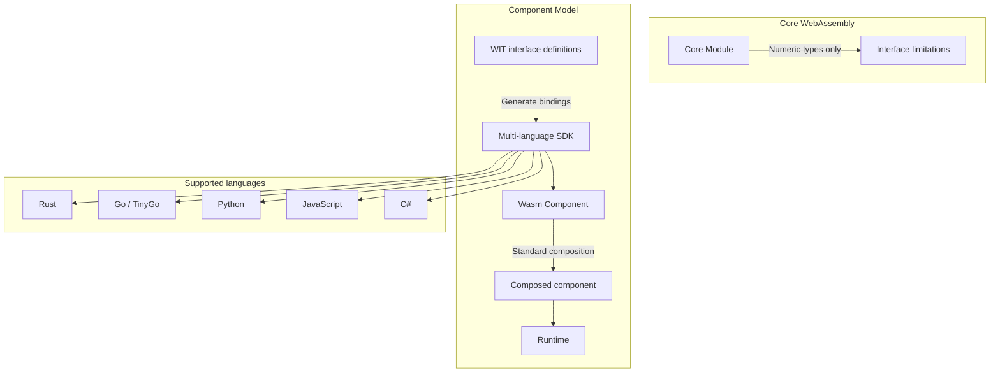
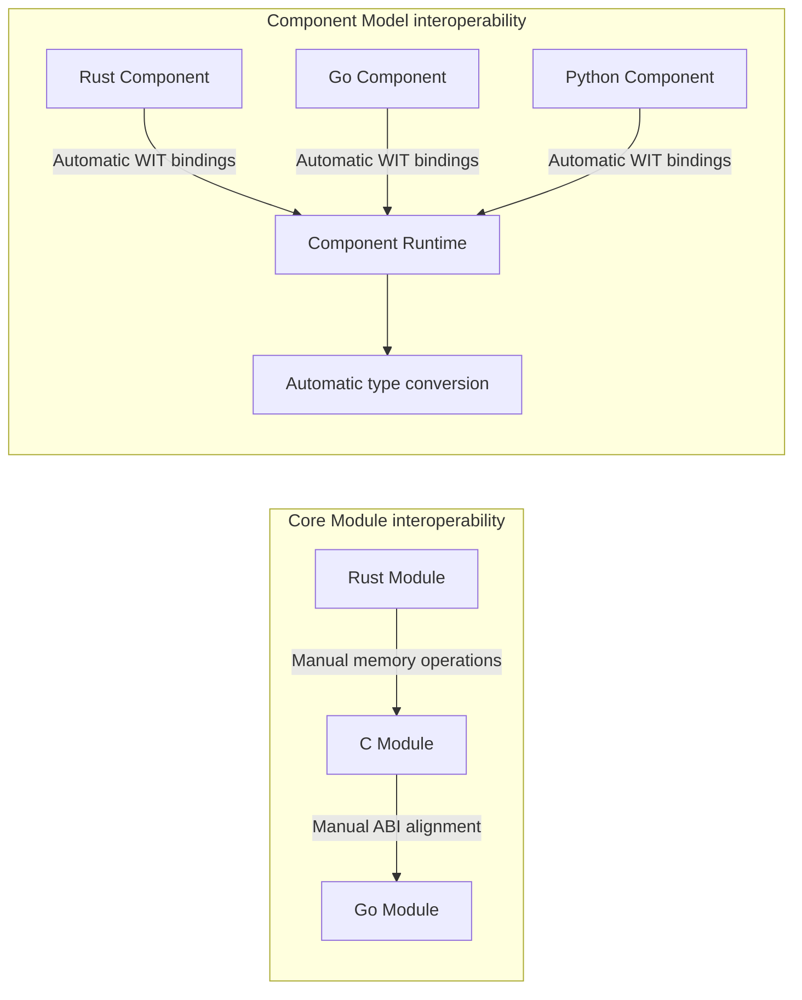
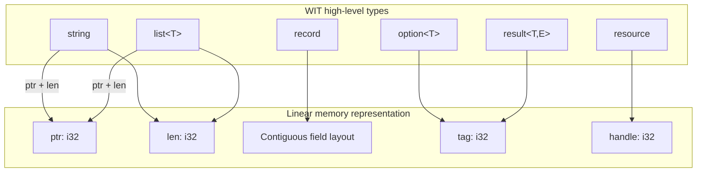
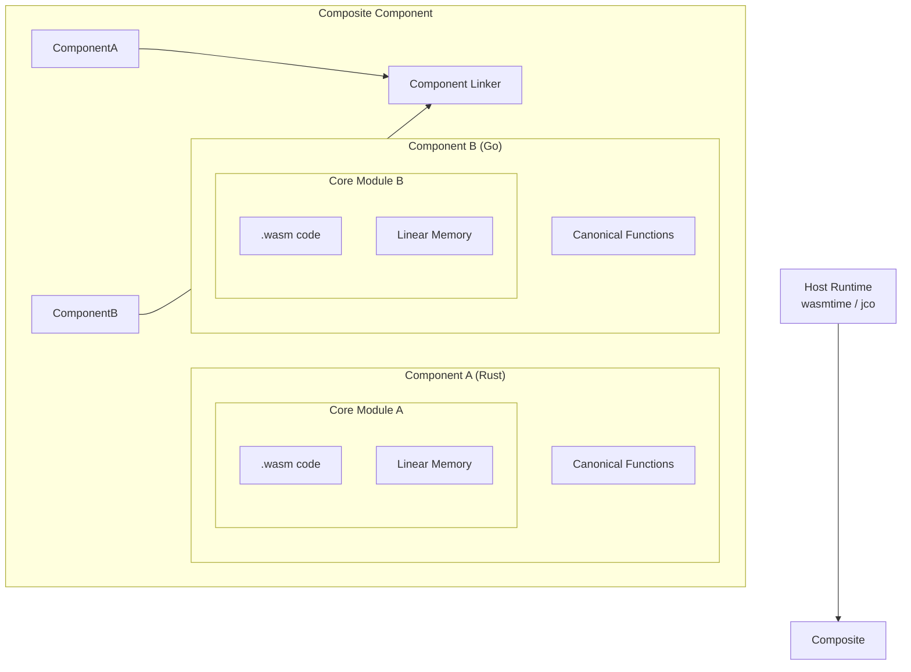
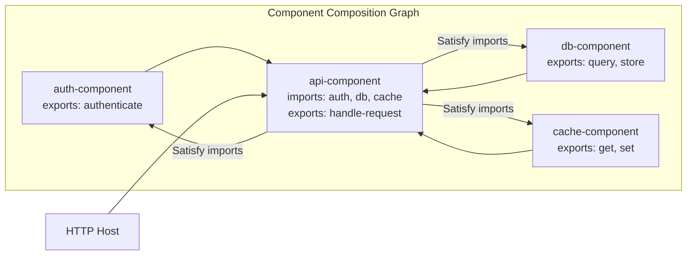
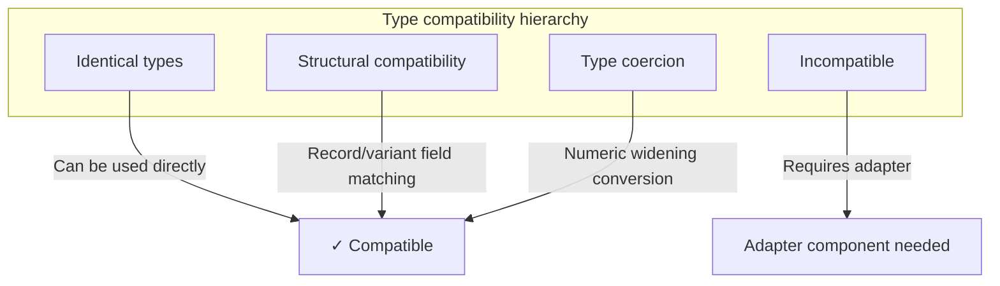
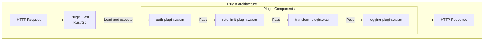

> **Production Safety Notice**
>
> This document contains directly executable operational commands. Before execution, confirm: whether the current target cluster and Namespace are correct; whether you have sufficient RBAC permissions; whether verification has been completed in a non-production environment. Command risk level marking: 🔴 High risk (may cause data loss or service interruption), 🟡 Medium risk (will modify cluster state but usually reversible), 🟢 Low risk/Read-only (information gathering, no side effects).

# Wasm Component Model

> The WebAssembly Component Model is the next-generation Wasm modularity standard, enabling cross-language component composition and reuse through WIT interface definitions.

---

<!-- chunk: Table of Contents -->## Table of Contents

1. [Component Model Overview](#1-component-model-overview)
2. [WIT Interface Definition Language](#2-wit-interface-definition-language)
3. [Component Structure and Encoding](#3-component-structure-and-encoding)
4. [Component Composition](#4-component-composition)
5. [wasm-tools Toolchain](#5-wasm-tools-toolchain)
6. [cargo-component Development](#6-cargo-component-development)
7. [Go Component Development](#7-go-component-development)
8. [Interface Type System](#8-interface-type-system)
9. [WASI Standard Interfaces](#9-wasi-standard-interfaces)
10. [Component Registry and Distribution](#10-component-registry-and-distribution)
11. [Runtime Adaptation Layer](#11-runtime-adaptation-layer)
12. [Production Case Studies](#12-production-case-studies)
13. [Performance Tuning](#13-performance-tuning)
14. [Common Issues and Troubleshooting](#14-common-issues-and-troubleshooting)

---

<!-- chunk: 1. Component Model Overview -->## 1. Component Model Overview

## 1.1 Why We Need the Component Model

Traditional WebAssembly modules (Core Modules) have the following limitations:

- **Coarse interface granularity**: Can only pass numeric types (i32/i64/f32/f64), unable to directly pass complex types like strings, lists, and structs.
- **Difficult interoperability**: Modules written in different languages require manual handling of memory layout, resulting in cumbersome glue code.
- **Weak composition capability**: Lack of standardized dependency declaration and composition mechanisms between modules.
- **Missing version management**: No standardized interface version control system.

The Component Model solves these problems by introducing **WIT (WebAssembly Interface Types)** and **Canonical ABI**.



## 1.2 Component Model Core Concepts

| Concept | Description |
|---------|-------------|
| **Component** | High-level unit that encapsulates Core Module with type-safe interfaces |
| **WIT** | WebAssembly Interface Types, interface definition language |
| **World** | A collection of imports + exports describing component capability boundaries |
| **Interface** | A collection of functions and types, similar to trait/interface |
| **Canonical ABI** | Canonical Application Binary Interface, defines how high-level types map to linear memory |
| **Linking** | Static or dynamic composition mechanism between components |

## 1.3 Specification Evolution Timeline

```
2019  Interface Types proposal published
2020  Module Linking proposal merged
2021  Component Model MVP draft
2022  WIT syntax stabilized
2023  WASI Preview 2 based on Component Model
2024  Mainstream language toolchain support (Rust/Go/Python/JS)
2025  Component Model enters Phase 3
```

## 1.4 Comparison with Traditional Modules



---

<!-- chunk: 2. WIT Interface Definition Language -->## 2. WIT Interface Definition Language

## 2.1 WIT Basic Syntax

WIT (WebAssembly Interface Types) is an IDL specifically designed for Wasm interfaces.

```wit
// calculator.wit

package example:calculator@1.0.0;

/// Calculator interface
interface calculate {
    /// Addition operation
    add: func(a: f64, b: f64) -> f64;
    
    /// Subtraction operation
    subtract: func(a: f64, b: f64) -> f64;
    
    /// Division operation, may fail
    divide: func(a: f64, b: f64) -> result<f64, divide-error>;
    
    /// Error type
    variant divide-error {
        division-by-zero,
        overflow,
    }
}

/// Advanced math interface
interface advanced-math {
    use calculate.{divide-error};
    
    /// Matrix multiplication
    matrix-multiply: func(
        a: list<list<f64>>, 
        b: list<list<f64>>
    ) -> result<list<list<f64>>, math-error>;
    
    /// Statistics interface
    statistics: func(data: list<f64>) -> stats-result;
    
    record stats-result {
        mean: f64,
        median: f64,
        std-dev: f64,
        min: f64,
        max: f64,
    }
    
    variant math-error {
        dimension-mismatch(string),
        empty-input,
        numerical-error(string),
    }
}

/// Calculator World, defines complete component capabilities
world calculator-world {
    export calculate;
    export advanced-math;
    import wasi:io/streams@0.2.0;
}
```

## 2.2 WIT Type System

```wit
// types-showcase.wit

package example:types@0.1.0;

interface type-demo {
    // ---- Primitive types ----
    use-bool: func(v: bool) -> bool;
    use-u8: func(v: u8) -> u8;
    use-u16: func(v: u16) -> u16;
    use-u32: func(v: u32) -> u32;
    use-u64: func(v: u64) -> u64;
    use-s8: func(v: s8) -> s8;
    use-s16: func(v: s16) -> s16;
    use-s32: func(v: s32) -> s32;
    use-s64: func(v: s64) -> s64;
    use-f32: func(v: f32) -> f32;
    use-f64: func(v: f64) -> f64;
    use-char: func(v: char) -> char;
    use-string: func(v: string) -> string;

    // ---- Composite types ----
    
    // Record type (similar to struct)
    record user {
        id: u64,
        name: string,
        email: string,
        age: option<u8>,
        roles: list<string>,
        metadata: option<list<tuple<string, string>>>,
    }
    
    // Enum (no data)
    enum direction {
        north,
        south,
        east,
        west,
    }
    
    // Variant (with data)
    variant shape {
        circle(f64),                    // radius
        rectangle(tuple<f64, f64>),    // width, height
        triangle(tuple<f64, f64, f64>), // sides
        point,                          // no data
    }
    
    // Flags (bit flags)
    flags permissions {
        read,
        write,
        execute,
        admin,
    }
    
    // Option type
    find-user: func(id: u64) -> option<user>;
    
    // Result type
    create-user: func(user: user) -> result<u64, string>;
    
    // Tuple type
    swap: func(pair: tuple<string, u32>) -> tuple<u32, string>;
    
    // List type
    process-batch: func(items: list<user>) -> list<result<u64, string>>;

    // ---- Resource types ----
    resource database-connection {
        constructor(url: string, pool-size: u32);
        query: func(sql: string, params: list<string>) -> result<list<list<string>>, string>;
        execute: func(sql: string, params: list<string>) -> result<u64, string>;
        close: func();
    }
    
    open-connection: func(url: string) -> result<database-connection, string>;
}
```

## 2.3 WIT Package Management and Version Control

```wit
// Package declaration format: <namespace>:<name>@<semver>
package my-org:my-lib@2.1.0;

// Import interfaces from other packages
interface http-client {
    use wasi:http/types@0.2.0.{
        request, 
        response, 
        method,
        headers,
    };
    
    // Extend WASI http functionality
    send-with-retry: func(
        req: request,
        max-retries: u32,
        backoff-ms: u64,
    ) -> result<response, http-error>;
    
    variant http-error {
        network-error(string),
        timeout,
        too-many-retries,
        server-error(u16),
    }
}

world enhanced-http-world {
    // Import WASI standard interfaces
    import wasi:http/outgoing-handler@0.2.0;
    import wasi:clocks/wall-clock@0.2.0;
    import wasi:logging/logging@0.1.0;
    
    // Export our enhanced interface
    export http-client;
}
```

## 2.4 Interface Inheritance and Composition

```wit
package example:service@0.1.0;

// Basic health check interface
interface health {
    record health-status {
        healthy: bool,
        message: string,
        checks: list<tuple<string, bool>>,
    }
    
    check: func() -> health-status;
    ready: func() -> bool;
}

// Observability interface
interface observable {
    record metric {
        name: string,
        value: f64,
        labels: list<tuple<string, string>>,
        timestamp: u64,
    }
    
    get-metrics: func() -> list<metric>;
    get-traces: func(since: u64) -> list<string>;
}

// Composed World
world microservice-world {
    import wasi:io/streams@0.2.0;
    import wasi:http/incoming-handler@0.2.0;
    import wasi:keyvalue/store@0.1.0;
    
    // Export business interfaces
    export health;
    export observable;
    
    // Export main service
    export handle: func(request: string) -> string;
}
```

---

<!-- chunk: 3. Component Structure and Encoding -->## 3. Component Structure and Encoding

## 3.1 Component Binary Format

WebAssembly Component is a wrapper around Core Module with the following binary format:

```
Component Binary Format:
┌─────────────────────────────────────────┐
│  Magic: \0asm (0x00 0x61 0x73 0x6D)    │
│  Version: 0x0D 0x00 0x01 0x00           │  ← Component version identifier
├─────────────────────────────────────────┤
│  Section: component-type               │  ← Type definitions
│  Section: canon                        │  ← Canonical functions
│  Section: core-module                  │  ← Embedded Core Module
│  Section: core-instance                │  ← Core module instance
│  Section: alias                        │  ← Alias declarations
│  Section: component-instance           │  ← Component instance
│  Section: component-export             │  ← Export declarations
│  Section: component-import             │  ← Import declarations
└─────────────────────────────────────────┘
```

## 3.2 Canonical ABI Type Mapping



**String passing example (Canonical ABI):**

```rust
// Inside Rust component - low-level implementation of string passing
// cargo-component auto-generates, no manual writing needed

// WIT: greet: func(name: string) -> string;
// Corresponding Canonical ABI implementation

// Caller perspective (host or other component):
// 1. Allocate space in component's linear memory
// 2. Write UTF-8 bytes
// 3. Pass (ptr, len) to function
// 4. Receive return (ptr, len)
// 5. Read result bytes
// 6. Free allocated memory

// Callee perspective (inside component):
// 1. Receive (ptr, len)
// 2. Read UTF-8 bytes from memory
// 3. Construct language native string
// 4. Execute business logic
// 5. Allocate output memory
// 6. Write result string
// 7. Return (ptr, len)
```

## 3.3 Component Nesting Structure



---

<!-- chunk: 4. Component Composition -->## 4. Component Composition

## 4.1 Static Composition (Composition)

Use `wac` or `wasm-compose` for static composition:

```bash
# Install wac tool
cargo install wac-cli

# Compose two components
wac compose \
  --dep calculator=./calculator.wasm \
  --dep logger=./logger.wasm \
  -o composed-app.wasm \
  app.wac
```

```
# app.wac - composition description file
package example:app;

let calc = new example:calculator { ... };
let log = new example:logger { ... };

let app = new example:main {
    calculate: calc.calculate,
    logger: log.logging,
};

export app...;
```

## 4.2 Composition Topology Example



## 4.3 Dynamic Composition (Runtime Linking)

```rust
// Using wasmtime for dynamic component composition
use wasmtime::component::{Component, Linker, Val};
use wasmtime::{Config, Engine, Store};

fn main() -> anyhow::Result<()> {
    // Configure Component Model support
    let mut config = Config::new();
    config.wasm_component_model(true);
    config.async_support(false);
    
    let engine = Engine::new(&config)?;
    let mut store = Store::new(&engine, ());
    
    // Load components
    let auth_component = Component::from_file(&engine, "auth.wasm")?;
    let db_component = Component::from_file(&engine, "db.wasm")?;
    let main_component = Component::from_file(&engine, "main.wasm")?;
    
    // Build linker
    let mut linker = Linker::new(&engine);
    
    // Register WASI interfaces
    wasmtime_wasi::add_to_linker_sync(&mut linker)?;
    
    // Instantiate child components
    let auth_instance = linker.instantiate(&mut store, &auth_component)?;
    let db_instance = linker.instantiate(&mut store, &db_component)?;
    
    // Inject child component exports into main component imports
    // ... (complex linking logic)
    
    // Instantiate main component
    let main_instance = linker.instantiate(&mut store, &main_component)?;
    
    // Call exported function
    let func = main_instance.get_func(&mut store, "handle-request")
        .expect("handle-request export not found");
    
    let mut results = vec![Val::String(Default::default())];
    func.call(&mut store, &[Val::String("GET /health".into())], &mut results)?;
    
    if let Val::String(response) = &results[0] {
        println!("Response: {}", response);
    }
    
    Ok(())
}
```

## 4.4 Interface Adapter

```wit
// When component interfaces don't match exactly, use adapter components

// Old interface (v1)
interface old-storage {
    put: func(key: string, value: list<u8>) -> bool;
    get: func(key: string) -> option<list<u8>>;
}

// New interface (v2)
interface new-storage {
    store: func(key: string, value: list<u8>) -> result<_, string>;
    fetch: func(key: string) -> result<list<u8>, string>;
    delete: func(key: string) -> result<_, string>;
}

// Adapter World
world storage-adapter {
    import old-storage;
    export new-storage;
}
```

```rust
// Adapter implementation
use crate::bindings::exports::new_storage::Guest;
use crate::bindings::imports::old_storage;

struct Adapter;

impl Guest for Adapter {
    fn store(key: String, value: Vec<u8>) -> Result<(), String> {
        if old_storage::put(&key, &value) {
            Ok(())
        } else {
            Err(format!("Failed to store key: {}", key))
        }
    }
    
    fn fetch(key: String) -> Result<Vec<u8>, String> {
        old_storage::get(&key)
            .ok_or_else(|| format!("Key not found: {}", key))
    }
    
    fn delete(_key: String) -> Result<(), String> {
        // Old interface doesn't support delete, return error
        Err("Delete not supported by underlying storage".to_string())
    }
}
```

---

<!-- chunk: 5. wasm-tools Toolchain -->## 5. wasm-tools Toolchain

## 5.1 Installation and Basic Usage

```bash
# Install wasm-tools
cargo install wasm-tools

# Verify installation
wasm-tools --version

# Main subcommands
wasm-tools help
```

## 5.2 WIT Operation Commands

```bash
# Validate WIT file syntax
wasm-tools component wit validate ./wit/

# Print WIT interface documentation
wasm-tools component wit ./component.wasm

# Generate JSON schema from WIT
wasm-tools component wit ./wit/ --json

# Parse and print WIT
wasm-tools component wit ./wit/world.wit --document

# Merge WIT packages
wasm-tools wit-smith wit/  # Fuzz testing generation
```

## 5.3 Component Operation Commands

```bash
# Convert Core Module to Component
wasm-tools component new \
  ./target/wasm32-wasi/release/my_lib.wasm \
  --adapt wasi_snapshot_preview1=./wasi_snapshot_preview1.wasm \
  -o my_component.wasm

# Validate component
wasm-tools validate --features component-model my_component.wasm

# Print component information
wasm-tools print my_component.wasm

# Extract WIT from component
wasm-tools component wit my_component.wasm

# Parse component to text format WAT
wasm-tools print my_component.wasm -o my_component.wat

# Analyze component size
wasm-tools objdump my_component.wasm
```

## 5.4 Component Composition Commands

```bash
# Use wasm-compose to merge components
cargo install wasm-compose

wasm-compose \
  --config compose-config.yml \
  -o composed.wasm

# compose-config.yml example
# components:
#   - path: auth.wasm
#     name: auth
#   - path: db.wasm
#     name: database
# instantiations:
#   - component: main
#     arguments:
#       authenticate: auth.authenticate
#       query: database.query
```

## 5.5 Optimization Commands

```bash
# Use wasm-opt to optimize (requires binaryen installation)
wasm-opt -O3 \
  -o optimized.wasm \
  input.wasm

# Strip debug information
wasm-tools strip input.wasm -o stripped.wasm

# Remove custom sections
wasm-tools strip \
  --delete producers \
  input.wasm \
  -o clean.wasm

# Inline import modules
wasm-tools component embed \
  --world my-world \
  --encoding utf16 \
  ./wit \
  target/wasm32-wasi/release/my_lib.wasm \
  -o embedded.wasm
```

## 5.6 Debugging and Inspection Commands

```bash
# Inspect wasm file information
wasm-tools stats my_component.wasm

# Validate semantic correctness
wasm-tools validate my_component.wasm \
  --features component-model,multi-value

# Generate fuzz test inputs
wasm-tools smith \
  --fuel 100 \
  -o random.wasm

# Differential testing
wasm-tools differential \
  --first-fuel 100 \
  --second-fuel 200 \
  random.wasm

# Print imports and exports
wasm-tools print my_component.wasm | grep -E "(import|export)"
```

---

<!-- chunk: 6. cargo-component Development -->## 6. cargo-component Development

## 6.1 Environment Setup

```bash
# Install cargo-component
cargo install cargo-component

# Install wasm32-wasi target
rustup target add wasm32-wasi
rustup target add wasm32-unknown-unknown

# Install component SDK dependencies
cargo install wit-bindgen-cli
cargo install wac-cli

# Verify installation
cargo component --version
```

## 6.2 Create New Component Project

```bash
# Create new component project
cargo component new --reactor my-component
cd my-component

# Project structure
# my-component/
# ├── Cargo.toml
# ├── src/
# │   └── lib.rs
# └── wit/
#     └── world.wit
```

```toml
# Cargo.toml
[package]
name = "my-component"
version = "0.1.0"
edition = "2021"

[lib]
crate-type = ["cdylib"]

[dependencies]
wit-bindgen = "0.24"
wasi = "0.13"

[package.metadata.component]
package = "example:my-component"

[package.metadata.component.target]
world = "my-world"

[package.metadata.component.dependencies]
"wasi:clocks" = { registry = "wasi" }
"wasi:filesystem" = { registry = "wasi" }
"wasi:http" = { path = "./wit/deps/http" }
```

## 6.3 Complete Business Component Example

```wit
// wit/world.wit
package example:order-service@1.0.0;

interface order-management {
    record order {
        id: string,
        customer-id: string,
        items: list<order-item>,
        status: order-status,
        total: f64,
        created-at: u64,
        updated-at: u64,
    }
    
    record order-item {
        product-id: string,
        quantity: u32,
        unit-price: f64,
    }
    
    enum order-status {
        pending,
        confirmed,
        shipped,
        delivered,
        cancelled,
    }
    
    variant order-error {
        not-found(string),
        invalid-item(string),
        payment-failed(string),
        inventory-error(string),
    }
    
    create-order: func(
        customer-id: string,
        items: list<order-item>
    ) -> result<order, order-error>;
    
    get-order: func(id: string) -> result<order, order-error>;
    
    update-status: func(
        id: string,
        status: order-status
    ) -> result<order, order-error>;
    
    list-orders: func(
        customer-id: option<string>,
        limit: u32,
        offset: u32,
    ) -> list<order>;
    
    cancel-order: func(id: string) -> result<_, order-error>;
}

world order-service-world {
    import wasi:clocks/wall-clock@0.2.0;
    import wasi:keyvalue/store@0.1.0;
    import wasi:logging/logging@0.1.0;
    
    export order-management;
}
```

```rust
// src/lib.rs
use crate::bindings::exports::example::order_service::order_management::{
    Guest, Order, OrderError, OrderItem, OrderStatus,
};
use crate::bindings::wasi::clocks::wall_clock;
use crate::bindings::wasi::keyvalue::store;
use crate::bindings::wasi::logging::logging;

mod bindings {
    wit_bindgen::generate!({
        world: "order-service-world",
        path: "wit",
    });
}

use bindings::export;

struct OrderService;

impl Guest for OrderService {
    fn create_order(
        customer_id: String,
        items: Vec<OrderItem>,
    ) -> Result<Order, OrderError> {
        // Input validation
        if items.is_empty() {
            return Err(OrderError::InvalidItem(
                "Order must have at least one item".to_string()
            ));
        }
        
        for item in &items {
            if item.quantity == 0 {
                return Err(OrderError::InvalidItem(
                    format!("Invalid quantity for product {}", item.product_id)
                ));
            }
            if item.unit_price < 0.0 {
                return Err(OrderError::InvalidItem(
                    format!("Invalid price for product {}", item.product_id)
                ));
            }
        }
        
        // Generate order ID
        let now = wall_clock::now();
        let order_id = format!("ORD-{}-{}", customer_id, now.seconds);
        
        // Calculate total price
        let total: f64 = items.iter()
            .map(|i| i.quantity as f64 * i.unit_price)
            .sum();
        
        let order = Order {
            id: order_id.clone(),
            customer_id,
            items,
            status: OrderStatus::Pending,
            total,
            created_at: now.seconds,
            updated_at: now.seconds,
        };
        
        // Serialize and store
        let serialized = serialize_order(&order);
        let bucket = store::open("orders")
            .map_err(|e| OrderError::InventoryError(e.to_string()))?;
        bucket.set(&order_id, &serialized.into_bytes())
            .map_err(|e| OrderError::InventoryError(e.to_string()))?;
        
        logging::log(
            logging::Level::Info,
            "order-service",
            &format!("Created order: {}", order_id),
        );
        
        Ok(order)
    }
    
    fn get_order(id: String) -> Result<Order, OrderError> {
        let bucket = store::open("orders")
            .map_err(|e| OrderError::InventoryError(e.to_string()))?;
        
        match bucket.get(&id)
            .map_err(|e| OrderError::InventoryError(e.to_string()))? 
        {
            Some(bytes) => {
                let s = String::from_utf8(bytes)
                    .map_err(|e| OrderError::InventoryError(e.to_string()))?;
                deserialize_order(&s)
                    .ok_or_else(|| OrderError::InventoryError("Deserialization failed".to_string()))
            }
            None => Err(OrderError::NotFound(id)),
        }
    }
    
    fn update_status(
        id: String,
        status: OrderStatus,
    ) -> Result<Order, OrderError> {
        let mut order = Self::get_order(id.clone())?;
        
        // Validate status transition legality
        validate_status_transition(&order.status, &status)?;
        
        let now = wall_clock::now();
        order.status = status;
        order.updated_at = now.seconds;
        
        let bucket = store::open("orders")
            .map_err(|e| OrderError::InventoryError(e.to_string()))?;
        let serialized = serialize_order(&order);
        bucket.set(&id, &serialized.into_bytes())
            .map_err(|e| OrderError::InventoryError(e.to_string()))?;
        
        Ok(order)
    }
    
    fn list_orders(
        customer_id: Option<String>,
        limit: u32,
        offset: u32,
    ) -> Vec<Order> {
        // Simplified implementation: should use indexes in practice
        let bucket = match store::open("orders") {
            Ok(b) => b,
            Err(_) => return vec![],
        };
        
        let keys = match bucket.list_keys(None) {
            Ok(k) => k,
            Err(_) => return vec![],
        };
        
        keys.into_iter()
            .skip(offset as usize)
            .take(limit as usize)
            .filter_map(|key| {
                bucket.get(&key).ok().flatten()
                    .and_then(|bytes| String::from_utf8(bytes).ok())
                    .and_then(|s| deserialize_order(&s))
                    .filter(|order| {
                        customer_id.as_ref()
                            .map(|cid| &order.customer_id == cid)
                            .unwrap_or(true)
                    })
            })
            .collect()
    }
    
    fn cancel_order(id: String) -> Result<(), OrderError> {
        Self::update_status(id, OrderStatus::Cancelled)?;
        Ok(())
    }
}

fn validate_status_transition(
    from: &OrderStatus,
    to: &OrderStatus,
) -> Result<(), OrderError> {
    use OrderStatus::*;
    let valid = matches!(
        (from, to),
        (Pending, Confirmed)
        | (Confirmed, Shipped)
        | (Shipped, Delivered)
        | (Pending, Cancelled)
        | (Confirmed, Cancelled)
    );
    
    if valid {
        Ok(())
    } else {
        Err(OrderError::InvalidItem(
            format!("Invalid status transition: {:?} -> {:?}", from, to)
        ))
    }
}

fn serialize_order(order: &Order) -> String {
    // Actual project should use serde_json
    format!(
        "{{\"id\":\"{}\",\"customer_id\":\"{}\",\"total\":{},\"status\":\"{}\"}}",
        order.id, order.customer_id, order.total,
        match order.status {
            OrderStatus::Pending => "pending",
            OrderStatus::Confirmed => "confirmed",
            OrderStatus::Shipped => "shipped",
            OrderStatus::Delivered => "delivered",
            OrderStatus::Cancelled => "cancelled",
        }
    )
}

fn deserialize_order(_s: &str) -> Option<Order> {
    // Simplified implementation, should use serde_json in practice
    None
}

export!(OrderService);
```

## 6.4 Building and Testing

```bash
# Build component
cargo component build --release

# Output file
ls target/wasm32-wasi/release/*.wasm

# Verify generated component
wasm-tools component wit target/wasm32-wasi/release/my_component.wasm

# Run unit tests
cargo test

# Run component integration tests
cargo component test

# Check component size
ls -lh target/wasm32-wasi/release/my_component.wasm

# Optimize component size
wasm-opt -Oz \
  -o target/wasm32-wasi/release/my_component_opt.wasm \
  target/wasm32-wasi/release/my_component.wasm
```

---

<!-- chunk: 7. Go Component Development -->## 7. Go Component Development

## 7.1 Building Components with TinyGo

```bash
# Install TinyGo
brew install tinygo  # macOS
# Or download precompiled version: https://tinygo.org/getting-started/install/

# Install wit-bindgen-go
go install github.com/bytecodealliance/wit-bindgen-go/cmd/wit-bindgen-go@latest

# Create Go component project
mkdir go-component && cd go-component
go mod init example.com/go-component
```

```go
// main.go - Go component implementation
package main

import (
    "fmt"
    "strings"
    
    // wit-bindgen-go generated bindings
    "example.com/go-component/gen/example/greeter"
)

// Ensure interface implementation
func init() {
    greeter.SetExports(greeterImpl{})
}

type greeterImpl struct{}

func (g greeterImpl) Greet(name string) string {
    return fmt.Sprintf("Hello, %s! From Go Component.", name)
}

func (g greeterImpl) GreetAll(names []string) []string {
    results := make([]string, len(names))
    for i, name := range names {
        results[i] = g.Greet(strings.TrimSpace(name))
    }
    return results
}

func (g greeterImpl) GreetWithLocale(name string, locale string) (string, error) {
    switch locale {
    case "zh-CN":
        return fmt.Sprintf("Hello, %s! From Go component.", name), nil
    case "ja-JP":
        return fmt.Sprintf("Hello, %s! From Go component.", name), nil
    case "en-US":
        return fmt.Sprintf("Hello, %s! From Go Component.", name), nil
    default:
        return "", fmt.Errorf("unsupported locale: %s", locale)
    }
}

func main() {}
```

```bash
# Build Go component
tinygo build \
  -target=wasi \
  -o greeter.wasm \
  .

# Adapt Core Module to Component
wasm-tools component new greeter.wasm \
  --adapt wasi_snapshot_preview1=wasi_snapshot_preview1.reactor.wasm \
  -o greeter-component.wasm

# Verify
wasm-tools component wit greeter-component.wasm
```

## 7.2 Running Components with wazero

```go
// host/main.go - Running Wasm components using wazero
package main

import (
    "context"
    "fmt"
    "log"
    "os"
    
    "github.com/tetratelabs/wazero"
    "github.com/tetratelabs/wazero/api"
    "github.com/tetratelabs/wazero/imports/wasi_snapshot_preview1"
)

func main() {
    ctx := context.Background()
    
    // Create runtime (enable Component Model support)
    r := wazero.NewRuntimeWithConfig(ctx,
        wazero.NewRuntimeConfig().
            WithCoreFeatures(api.CoreFeaturesV2).
            WithCustomSections(true),
    )
    defer r.Close(ctx)
    
    // Initialize WASI
    wasi_snapshot_preview1.MustInstantiate(ctx, r)
    
    // Read component file
    componentBytes, err := os.ReadFile("greeter-component.wasm")
    if err != nil {
        log.Fatal(err)
    }
    
    // Compile component
    compiled, err := r.CompileModule(ctx, componentBytes)
    if err != nil {
        log.Fatal(err)
    }
    
    // Instantiate component
    mod, err := r.InstantiateModule(ctx, compiled,
        wazero.NewModuleConfig().WithStdout(os.Stdout))
    if err != nil {
        log.Fatal(err)
    }
    
    // Call exported function
    greet := mod.ExportedFunction("greet")
    if greet == nil {
        log.Fatal("greet function not found")
    }
    
    // Allocate memory and pass string
    // Note: Actual Component Model requires more complex ABI handling
    nameBytes := []byte("World")
    ptr, err := allocateString(ctx, mod, nameBytes)
    if err != nil {
        log.Fatal(err)
    }
    
    results, err := greet.Call(ctx, uint64(ptr), uint64(len(nameBytes)))
    if err != nil {
        log.Fatal(err)
    }
    
    // Read result string
    resultStr := readString(mod, uint32(results[0]), uint32(results[1]))
    fmt.Printf("Result: %s\n", resultStr)
}

func allocateString(ctx context.Context, mod api.Module, data []byte) (uint32, error) {
    malloc := mod.ExportedFunction("cabi_realloc")
    results, err := malloc.Call(ctx, 0, 0, 1, uint64(len(data)))
    if err != nil {
        return 0, err
    }
    ptr := uint32(results[0])
    
    mem := mod.Memory()
    if !mem.Write(ptr, data) {
        return 0, fmt.Errorf("failed to write to memory")
    }
    return ptr, nil
}

func readString(mod api.Module, ptr, length uint32) string {
    mem := mod.Memory()
    data, ok := mem.Read(ptr, length)
    if !ok {
        return ""
    }
    return string(data)
}
```

---

<!-- chunk: 8. Interface Type System -->## 8. Interface Type System

## 8.1 Resource Type Deep Dive

Resource is a special type in the Component Model for managing the lifecycle of stateful objects:

```wit
// resource-demo.wit
package example:resources@0.1.0;

interface file-system {
    // Resource type: file handle
    resource file-handle {
        // Constructor
        constructor(path: string, mode: open-mode);
        
        // Methods
        read: func(max-bytes: u64) -> result<list<u8>, io-error>;
        write: func(data: list<u8>) -> result<u64, io-error>;
        seek: func(offset: s64, whence: seek-from) -> result<u64, io-error>;
        flush: func() -> result<_, io-error>;
        size: func() -> result<u64, io-error>;
        
        // Static method
        %static exists: func(path: string) -> bool;
    }
    
    enum open-mode {
        read-only,
        write-only,
        read-write,
        create-new,
        append,
    }
    
    enum seek-from {
        start,
        current,
        end,
    }
    
    variant io-error {
        not-found,
        permission-denied,
        already-exists,
        broken-pipe,
        other(string),
    }
    
    // Factory function
    open: func(path: string, mode: open-mode) -> result<file-handle, io-error>;
    
    // Directory operations
    resource directory {
        constructor(path: string);
        list: func() -> result<list<dir-entry>, io-error>;
        create-file: func(name: string) -> result<file-handle, io-error>;
    }
    
    record dir-entry {
        name: string,
        is-dir: bool,
        size: option<u64>,
    }
}

world file-system-world {
    export file-system;
    import wasi:filesystem/preopens@0.2.0;
}
```

```rust
// Implementing Resource types
use std::fs;
use std::io::{Read, Write, Seek, SeekFrom};

use crate::bindings::exports::example::resources::file_system::{
    Guest, GuestFileHandle, GuestDirectory,
    OpenMode, SeekFrom as WitSeekFrom, IoError,
    DirEntry,
};

pub struct FileHandleResource {
    file: std::fs::File,
    path: String,
}

impl GuestFileHandle for FileHandleResource {
    fn new(path: String, mode: OpenMode) -> Result<Self, IoError> {
        let file = match mode {
            OpenMode::ReadOnly => fs::File::open(&path),
            OpenMode::WriteOnly => fs::File::create(&path),
            OpenMode::ReadWrite => fs::OpenOptions::new()
                .read(true).write(true).open(&path),
            OpenMode::CreateNew => fs::OpenOptions::new()
                .write(true).create_new(true).open(&path),
            OpenMode::Append => fs::OpenOptions::new()
                .append(true).open(&path),
        }.map_err(|e| match e.kind() {
            std::io::ErrorKind::NotFound => IoError::NotFound,
            std::io::ErrorKind::PermissionDenied => IoError::PermissionDenied,
            std::io::ErrorKind::AlreadyExists => IoError::AlreadyExists,
            _ => IoError::Other(e.to_string()),
        })?;
        
        Ok(FileHandleResource { file, path })
    }
    
    fn read(&self, max_bytes: u64) -> Result<Vec<u8>, IoError> {
        let mut buf = vec![0u8; max_bytes as usize];
        // Note: need mut reference - in practice use RefCell or Mutex
        let n = (&self.file).read(&mut buf)
            .map_err(|e| IoError::Other(e.to_string()))?;
        buf.truncate(n);
        Ok(buf)
    }
    
    fn write(&self, data: Vec<u8>) -> Result<u64, IoError> {
        let n = (&self.file).write(&data)
            .map_err(|e| IoError::Other(e.to_string()))?;
        Ok(n as u64)
    }
    
    fn seek(&self, offset: i64, whence: WitSeekFrom) -> Result<u64, IoError> {
        let seek_from = match whence {
            WitSeekFrom::Start => SeekFrom::Start(offset as u64),
            WitSeekFrom::Current => SeekFrom::Current(offset),
            WitSeekFrom::End => SeekFrom::End(offset),
        };
        (&self.file).seek(seek_from)
            .map_err(|e| IoError::Other(e.to_string()))
    }
    
    fn flush(&self) -> Result<(), IoError> {
        (&self.file).flush()
            .map_err(|e| IoError::Other(e.to_string()))
    }
    
    fn size(&self) -> Result<u64, IoError> {
        self.file.metadata()
            .map(|m| m.len())
            .map_err(|e| IoError::Other(e.to_string()))
    }
    
    fn exists(path: String) -> bool {
        std::path::Path::new(&path).exists()
    }
}
```

## 8.2 Type Compatibility Rules



---

<!-- chunk: 9. WASI Standard Interfaces -->## 9. WASI Standard Interfaces

## 9.1 WASI Preview 2 Interface List

```
WASI Preview 2 (based on Component Model) interfaces:

wasi:clocks
  ├── wall-clock      # System time
  └── monotonic-clock # Monotonic clock

wasi:filesystem
  ├── types           # Filesystem types
  └── preopens        # Pre-opened directories

wasi:http
  ├── types           # HTTP type definitions
  ├── outgoing-handler # Send HTTP requests
  └── incoming-handler # Receive HTTP requests

wasi:io
  ├── error           # Error types
  ├── poll            # Polling mechanism
  └── streams         # Byte streams

wasi:random
  └── random          # Random number generation

wasi:sockets
  ├── network         # Network types
  ├── instance-network # Network instance
  ├── tcp             # TCP sockets
  ├── tcp-create-socket # TCP creation
  ├── udp             # UDP sockets
  ├── udp-create-socket # UDP creation
  └── ip-name-lookup  # DNS resolution

wasi:keyvalue (proposal)
  ├── store           # KV storage
  ├── atomics         # Atomic operations
  └── batch           # Batch operations

wasi:logging (proposal)
  └── logging         # Logging interface

wasi:nn (neural network)
  └── inference       # AI inference interface
```

## 9.2 Using WASI HTTP Interfaces

```rust
// Building HTTP server component using WASI HTTP
use crate::bindings::wasi::http::types::{
    IncomingRequest, ResponseOutparam, OutgoingResponse,
    Fields, OutgoingBody, StatusCode,
};
use crate::bindings::exports::wasi::http::incoming_handler::Guest;

struct HttpHandler;

impl Guest for HttpHandler {
    fn handle(request: IncomingRequest, response_out: ResponseOutparam) {
        let method = request.method();
        let path = request.path_with_query().unwrap_or_default();
        
        let (status, body) = match (method.as_str(), path.as_str()) {
            ("GET", "/health") => (200, r#"{"status":"healthy"}"#.to_string()),
            ("GET", p) if p.starts_with("/api/") => {
                handle_api_request(&request)
            }
            _ => (404, r#"{"error":"not found"}"#.to_string()),
        };
        
        // Build response
        let headers = Fields::new();
        headers.append(
            &"content-type".to_string(),
            &b"application/json".to_vec(),
        ).unwrap();
        headers.append(
            &"x-powered-by".to_string(),
            &b"wasm-component".to_vec(),
        ).unwrap();
        
        let response = OutgoingResponse::new(headers);
        response.set_status_code(status as StatusCode).unwrap();
        
        let response_body = response.body().unwrap();
        {
            let stream = response_body.write().unwrap();
            stream.write(body.as_bytes()).unwrap();
            stream.flush().unwrap();
        }
        OutgoingBody::finish(response_body, None).unwrap();
        
        ResponseOutparam::set(response_out, Ok(response));
    }
}

fn handle_api_request(request: &IncomingRequest) -> (u16, String) {
    let path = request.path_with_query().unwrap_or_default();
    
    // Read request body
    let body = match request.consume() {
        Ok(incoming_body) => {
            let stream = incoming_body.stream().unwrap();
            let mut data = Vec::new();
            loop {
                match stream.read(4096) {
                    Ok(bytes) if bytes.is_empty() => break,
                    Ok(bytes) => data.extend_from_slice(&bytes),
                    Err(_) => break,
                }
            }
            String::from_utf8(data).unwrap_or_default()
        }
        Err(_) => String::new(),
    };
    
    (200, format!(r#"{{"path":"{}","body_length":{}}}"#, path, body.len()))
}
```

---

<!-- chunk: 10. Component Registry and Distribution -->## 10. Component Registry and Distribution

## 10.1 OCI Registry Storage

```bash
# Push Wasm component to OCI registry
# Using wkg (wasm package registry) tool

cargo install wkg

# Configure registry
wkg config set registry ghcr.io

# Authenticate
wkg login ghcr.io \
  --username $GITHUB_USER \
  --password $GITHUB_TOKEN

# Push component
wkg push \
  my-component.wasm \
  ghcr.io/my-org/my-component:1.0.0

# Pull component
wkg pull \
  ghcr.io/my-org/my-component:1.0.0 \
  -o my-component-pulled.wasm
```

## 10.2 WARG Protocol Registry

```bash
# Install warg client
cargo install warg-cli

# Configure warg server
cat > warg-config.json << 'EOF'
{
  "default_registry": "https://registry.example.com",
  "keys": {
    "registry.example.com": "ecdsa-p256:..."
  }
}
EOF

# Publish package
warg publish \
  --registry https://registry.example.com \
  --name "example:my-component" \
  --version "1.0.0" \
  my-component.wasm

# Install dependencies
warg install example:my-component@1.0.0

# Declare dependencies in Cargo.toml
# [package.metadata.component.dependencies]
# "example:my-component" = "1.0.0"
```

## 10.3 Wasmtime Remote Loading

```rust
// Load and cache components from remote
use wasmtime::component::Component;
use wasmtime::Engine;

async fn load_component_from_registry(
    engine: &Engine,
    registry_url: &str,
    package: &str,
    version: &str,
) -> anyhow::Result<Component> {
    let cache_key = format!("{}-{}", package, version);
    let cache_path = format!("/tmp/wasm-cache/{}.wasm", cache_key);
    
    // Check local cache
    if std::path::Path::new(&cache_path).exists() {
        println!("Loading from cache: {}", cache_path);
        return Component::from_file(engine, &cache_path);
    }
    
    // Download from registry
    println!("Downloading {}/{} from {}", package, version, registry_url);
    let url = format!("{}/v1/components/{}/{}", registry_url, package, version);
    
    let client = reqwest::Client::new();
    let bytes = client.get(&url)
        .send().await?
        .bytes().await?;
    
    // Save to cache
    std::fs::create_dir_all("/tmp/wasm-cache")?;
    std::fs::write(&cache_path, &bytes)?;
    
    Component::from_binary(engine, &bytes)
}
```

---

<!-- chunk: 11. Runtime Adaptation Layer -->## 11. Runtime Adaptation Layer

## 11.1 wasmtime Component Runtime

```rust
// Complete wasmtime component runtime example
use anyhow::Result;
use wasmtime::{Config, Engine, Store};
use wasmtime::component::{Component, Linker};
use wasmtime_wasi::{WasiCtx, WasiCtxBuilder, WasiView};

// Custom Store data
struct MyState {
    wasi: WasiCtx,
    // Other custom state
    request_id: String,
}

impl WasiView for MyState {
    fn ctx(&mut self) -> &mut WasiCtx { &mut self.wasi }
    fn table(&mut self) -> &mut wasmtime_wasi::ResourceTable {
        unimplemented!()
    }
}

// Use bindgen macro to generate type-safe call interface
wasmtime::component::bindgen!({
    world: "calculator-world",
    path: "wit",
    async: false,
});

fn main() -> Result<()> {
    // Configure engine
    let mut config = Config::new();
    config.wasm_component_model(true);
    config.debug_info(false);
    config.optimize_for_latency(true);
    
    let engine = Engine::new(&config)?;
    
    // Build WASI context
    let wasi = WasiCtxBuilder::new()
        .inherit_stdio()
        .inherit_env()
        .build();
    
    let state = MyState {
        wasi,
        request_id: "req-001".to_string(),
    };
    
    let mut store = Store::new(&engine, state);
    
    // Load and compile component (can be cached)
    let component = Component::from_file(&engine, "calculator.wasm")?;
    
    // Build linker
    let mut linker = Linker::new(&engine);
    wasmtime_wasi::add_to_linker_sync(&mut linker)?;
    
    // Add custom host functions
    linker.root().func_wrap("log-message", |
        _store: wasmtime::StoreContextMut<MyState>,
        (level, msg): (String, String),
    | -> Result<()> {
        eprintln!("[{}] {}", level, msg);
        Ok(())
    })?;
    
    // Instantiate and call
    let (calculator, _) = CalculatorWorld::instantiate(
        &mut store, &component, &linker
    )?;
    
    // Type-safe call
    let result = calculator.example_calculator_calculate()
        .call_add(&mut store, 3.14, 2.72)?;
    println!("3.14 + 2.72 = {}", result);
    
    let result = calculator.example_calculator_calculate()
        .call_divide(&mut store, 10.0, 0.0)?;
    match result {
        Ok(v) => println!("Result: {}", v),
        Err(e) => println!("Error: {:?}", e),
    }
    
    Ok(())
}
```

## 11.2 jco (JavaScript Component Tools)

```bash
# Install jco
npm install -g @bytecodealliance/jco

# Transpile Wasm Component to JavaScript
jco transpile my-component.wasm \
  --out-dir ./dist \
  --map wasi:http/types@0.2.0=@bytecodealliance/preview2-shim/http \
  --map wasi:io/streams@0.2.0=@bytecodealliance/preview2-shim/io

# Generated file structure
# dist/
# ├── my-component.js          # Main entry point
# ├── my-component.core.wasm   # Core module
# └── interfaces/              # Interface definitions
```

```javascript
// Using transpiled component
import { calculate } from './dist/my-component.js';

// Call component interface
const result = calculate.add(3.14, 2.72);
console.log('Sum:', result);  // 5.86

// Handle result type
const divResult = calculate.divide(10, 0);
if (divResult.tag === 'ok') {
    console.log('Result:', divResult.val);
} else {
    console.error('Error:', divResult.val);
}
```

```typescript
// TypeScript type definitions (auto-generated by jco)
// dist/interfaces/example-calculator-calculate.d.ts

export type DivideError = 
    | { tag: 'division-by-zero' }
    | { tag: 'overflow' };

export function add(a: number, b: number): number;
export function subtract(a: number, b: number): number;
export function divide(a: number, b: number): 
    | { tag: 'ok', val: number }
    | { tag: 'err', val: DivideError };
```

---

<!-- chunk: 12. Production Case Studies -->## 12. Production Case Studies

## 12.1 Microservice Plugin System



```rust
// Plugin system host implementation
use wasmtime::component::{Component, Linker, Val};
use std::collections::HashMap;

pub struct PluginSystem {
    engine: wasmtime::Engine,
    plugins: HashMap<String, LoadedPlugin>,
    pipeline: Vec<String>,
}

pub struct LoadedPlugin {
    component: Component,
    name: String,
    version: String,
}

impl PluginSystem {
    pub fn new() -> anyhow::Result<Self> {
        let mut config = wasmtime::Config::new();
        config.wasm_component_model(true);
        config.async_support(true);
        
        Ok(Self {
            engine: wasmtime::Engine::new(&config)?,
            plugins: HashMap::new(),
            pipeline: Vec::new(),
        })
    }
    
    pub async fn load_plugin(
        &mut self,
        name: &str,
        path: &str,
    ) -> anyhow::Result<()> {
        let component = Component::from_file(&self.engine, path)?;
        
        // Validate plugin interface compatibility
        self.validate_plugin_interface(&component)?;
        
        self.plugins.insert(name.to_string(), LoadedPlugin {
            component,
            name: name.to_string(),
            version: "1.0.0".to_string(),
        });
        
        println!("Loaded plugin: {} v{}", name, "1.0.0");
        Ok(())
    }
    
    pub fn add_to_pipeline(&mut self, plugin_name: &str) {
        self.pipeline.push(plugin_name.to_string());
    }
    
    pub async fn process_request(
        &self,
        request: &str,
    ) -> anyhow::Result<String> {
        let mut current = request.to_string();
        
        for plugin_name in &self.pipeline {
            let plugin = self.plugins.get(plugin_name)
                .ok_or_else(|| anyhow::anyhow!("Plugin not found: {}", plugin_name))?;
            
            current = self.invoke_plugin(plugin, &current).await?;
        }
        
        Ok(current)
    }
    
    async fn invoke_plugin(
        &self,
        plugin: &LoadedPlugin,
        input: &str,
    ) -> anyhow::Result<String> {
        let mut store = wasmtime::Store::new(&self.engine, ());
        let linker = Linker::new(&self.engine);
        
        let instance = linker.instantiate_async(&mut store, &plugin.component).await?;
        
        let process_fn = instance
            .get_func(&mut store, "process")
            .ok_or_else(|| anyhow::anyhow!("process function not found"))?;
        
        let mut results = vec![Val::String(Default::default())];
        process_fn.call_async(
            &mut store,
            &[Val::String(input.to_string().into())],
            &mut results,
        ).await?;
        
        if let Val::String(output) = &results[0] {
            Ok(output.to_string())
        } else {
            anyhow::bail!("Unexpected return type")
        }
    }
    
    fn validate_plugin_interface(&self, component: &Component) -> anyhow::Result<()> {
        // Check if component exports necessary process function
        // Actual implementation needs to check WIT type compatibility
        Ok(())
    }
}

// Usage example
#[tokio::main]
async fn main() -> anyhow::Result<()> {
    let mut system = PluginSystem::new()?;
    
    // Load plugins
    system.load_plugin("auth", "plugins/auth.wasm").await?;
    system.load_plugin("rate-limit", "plugins/rate-limit.wasm").await?;
    system.load_plugin("transform", "plugins/transform.wasm").await?;
    
    // Configure processing pipeline
    system.add_to_pipeline("auth");
    system.add_to_pipeline("rate-limit");
    system.add_to_pipeline("transform");
    
    // Process request
    let response = system.process_request(r#"{"method":"GET","path":"/api/users"}"#).await?;
    println!("Final response: {}", response);
    
    Ok(())
}
```

## 12.2 Multi-Language Data Processing Pipeline

```yaml
# Data processing pipeline configuration
# pipeline.yaml
name: data-processing-pipeline
version: "1.0"

components:
  - name: json-parser
    wasm: components/json-parser.wasm
    language: rust
    
  - name: data-validator
    wasm: components/validator.wasm
    language: go
    
  - name: data-transformer
    wasm: components/transformer.wasm
    language: python
    
  - name: data-formatter
    wasm: components/formatter.wasm
    language: javascript

pipeline:
  - step: parse
    component: json-parser
    input: raw-data
    output: parsed-data
    
  - step: validate
    component: data-validator
    input: parsed-data
    output: validated-data
    on-error: stop
    
  - step: transform
    component: data-transformer
    input: validated-data
    output: transformed-data
    
  - step: format
    component: data-formatter
    input: transformed-data
    output: final-output
```

---

<!-- chunk: 13. Performance Tuning -->## 13. Performance Tuning

## 13.1 Component Compilation Caching

```rust
use wasmtime::{Engine, Config};
use wasmtime::component::Component;
use std::path::Path;

fn create_cached_engine() -> anyhow::Result<Engine> {
    let mut config = Config::new();
    config.wasm_component_model(true);
    
    // Enable compilation cache
    config.cache_config_load_default()?;
    
    // Configure optimization level
    config.cranelift_opt_level(wasmtime::OptLevel::Speed);
    
    // Enable parallel compilation
    config.parallel_compilation(true);
    
    Engine::new(&config)
}

fn load_component_with_cache(
    engine: &Engine,
    path: &str,
) -> anyhow::Result<Component> {
    let cache_path = format!("{}.cwasm", path);
    
    // Check precompiled cache
    if Path::new(&cache_path).exists() {
        let mtime_wasm = std::fs::metadata(path)?.modified()?;
        let mtime_cache = std::fs::metadata(&cache_path)?.modified()?;
        
        if mtime_cache > mtime_wasm {
            // Use precompiled cache (unsafe: needs source verification)
            unsafe {
                return Component::deserialize_file(engine, &cache_path);
            }
        }
    }
    
    // Recompile
    let component = Component::from_file(engine, path)?;
    
    // Save precompiled result
    let bytes = component.serialize()?;
    std::fs::write(&cache_path, &bytes)?;
    
    Ok(component)
}
```

## 13.2 Store Reuse and Pooling

```rust
use std::sync::{Arc, Mutex};
use wasmtime::{Engine, Store};
use wasmtime::component::{Component, Linker};

pub struct ComponentPool {
    engine: Arc<Engine>,
    component: Arc<Component>,
    pool: Mutex<Vec<Store<StoreState>>>,
    max_size: usize,
}

struct StoreState {
    wasi: wasmtime_wasi::WasiCtx,
}

impl ComponentPool {
    pub fn new(engine: Arc<Engine>, component: Arc<Component>, max_size: usize) -> Self {
        Self {
            engine,
            component,
            pool: Mutex::new(Vec::with_capacity(max_size)),
            max_size,
        }
    }
    
    pub fn acquire(&self) -> Store<StoreState> {
        let mut pool = self.pool.lock().unwrap();
        if let Some(mut store) = pool.pop() {
            // Reset store state
            store.set_fuel(u64::MAX).ok();
            store
        } else {
            // Create new store
            let wasi = wasmtime_wasi::WasiCtxBuilder::new()
                .build();
            Store::new(&self.engine, StoreState { wasi })
        }
    }
    
    pub fn release(&self, store: Store<StoreState>) {
        let mut pool = self.pool.lock().unwrap();
        if pool.len() < self.max_size {
            pool.push(store);
        }
        // Discard if exceeding max size
    }
}
```

## 13.3 Performance Benchmark Data

```
Component Model performance metrics (typical scenarios):

┌─────────────────────────────────────────────────────┐
│ Operation              │ Latency     │ Notes          │
├─────────────────────────────────────────────────────┤
│ Component compilation   │ 50-200ms    │ Can precompile │
│ Component instantiation │ 0.1-1ms     │ Depends on imports │
│ Function call (simple)  │ <1μs        │ Numeric types  │
│ Function call (string)  │ 1-10μs      │ With memory allocation │
│ Inter-component call    │ 5-20μs      │ ABI conversion overhead │
│ Cross-language call     │ 10-50μs     │ Canonical ABI  │
└─────────────────────────────────────────────────────┘

Optimization recommendations:
1. Precompile components and persist .cwasm files
2. Reuse Store objects, avoid frequent rebuilding
3. Batch operations instead of multiple single calls
4. Use list<T> to reduce inter-component call count
5. Use fuel limits for hot paths
```

---

<!-- chunk: 14. Common Issues and Troubleshooting -->## 14. Common Issues and Troubleshooting

## 14.1 Common Errors and Solutions

**Error 1: WIT type mismatch**
```
Error: component imports function `calculate#add` but the
expected type `[func (param "a" float64) (param "b" float64) (result float64)]`
does not match the actual type `[func (param "x" f32) (param "y" f32) (result f32)]`
```
**Solution**: Check if parameter names and types in WIT file match host expectations exactly.

**Error 2: Missing adapter**
```
Error: module requires an import of `wasi_snapshot_preview1::proc_exit`
```
**Solution**:
```bash
wasm-tools component new my.wasm \
  --adapt wasi_snapshot_preview1=wasi_snapshot_preview1.wasm \
  -o my_component.wasm
```

**Error 3: Resource lifecycle error**
```
Error: attempted to use a resource after it was dropped
```
**Solution**: Ensure Resource handle is not dropped during use. In Rust, use `ManuallyDrop` or proper lifetime annotations.

## 14.2 Debugging Tools Usage

```bash
# Verbose error output
WASMTIME_LOG=debug wasmtime run --component my-component.wasm

# Print component type information
wasm-tools print my-component.wasm | head -100

# Check WIT interfaces
wasm-tools component wit my-component.wasm

# Validate component format
wasm-tools validate \
  --features component-model \
  my-component.wasm \
  && echo "Valid!" || echo "Invalid!"

# Analyze component size distribution
wasm-tools objdump my-component.wasm \
  | sort -k2 -rn \
  | head -20
```

## 14.3 Version Compatibility Matrix

```
Toolchain version compatibility (2025):

cargo-component  0.13+  → wasmtime 22+  → WIT/CM 1.0
wit-bindgen      0.28+  → Supports complete resource features
wasm-tools       1.210+ → Supports all WIT features
TinyGo           0.32+  → Complete WASI Preview 2
jco              1.3+   → Complete component transpilation
```

---

<!-- chunk: Summary -->## Summary

The Wasm Component Model significantly enhances WebAssembly's modularity and interoperability capabilities through WIT interface definitions, Canonical ABI, and component composition mechanisms.

**Key Points**:
- **WIT** is a language-agnostic interface definition language supporting a rich type system
- **Canonical ABI** defines canonical representation of high-level types in linear memory
- **cargo-component** and **TinyGo** are the most mature component development toolchains
- **wasm-tools** provides a complete suite of component operation tools
- **Component composition** supports both static (compile-time) and dynamic (runtime) modes

**Best Practices**:
1. Design stable WIT interfaces with semantic version control
2. Fully leverage Resource types to manage stateful objects
3. Precompile and cache components to reduce startup latency
4. Use adapter components for interface version migration
5. Manage component distribution through OCI registry or WARG protocol

---

*References:*
- [WebAssembly Component Model Specification](https://github.com/WebAssembly/component-model)
- [WIT IDL Specification](https://component-model.bytecodealliance.org/design/wit.html)
- [cargo-component GitHub](https://github.com/bytecodealliance/cargo-component)
- [wasm-tools GitHub](https://github.com/bytecodealliance/wasm-tools)
- [Bytecode Alliance Blog](https://bytecodealliance.org/articles/)

---

<!-- chunk: Obsidian Related Documents -->## Obsidian Related Documents

- Domain 38: WebAssembly Cloud Native KUDIG Database — Global MOC
- [[domain-15-specialized-tech/README.md|Domain 38: WebAssembly Cloud Native]]
- Domain-38 WebAssembly Cloud Native — Open Source Project Index
- WebAssembly Cloud Native Fundamentals
- containerd Wasm Runtime
- SpinKube Framework Practice
- wasmCloud Platform
- WasmEdge Runtime
- Wasm Plugin System
- Wasm AI Inference
- Wasm Serverless
- Wasm Security and Sandbox

## See Also

- wasmcloud-platform
- wasmedge-runtime
- wasm-plugin-system
- wasm-ai-inference

<!-- risk-assessed -->
