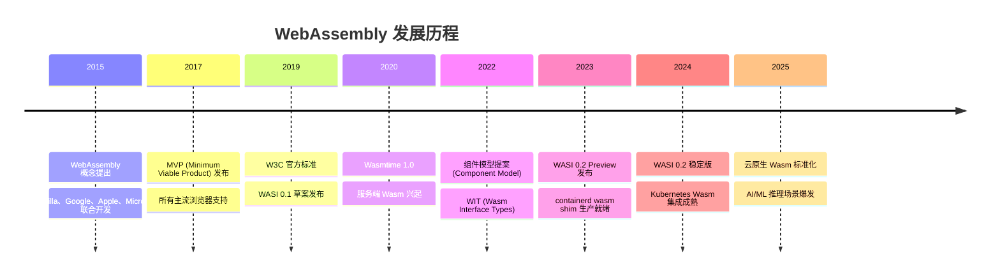
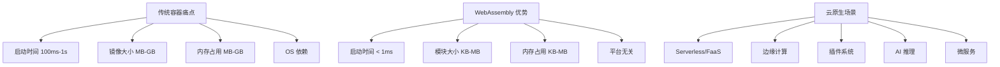
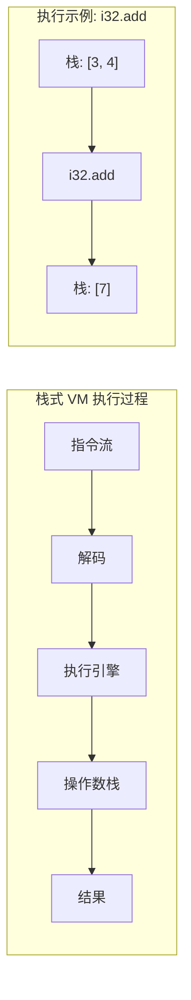
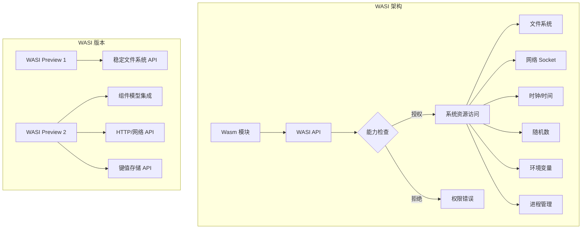
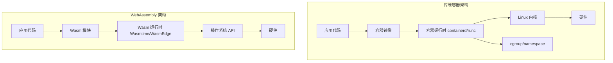
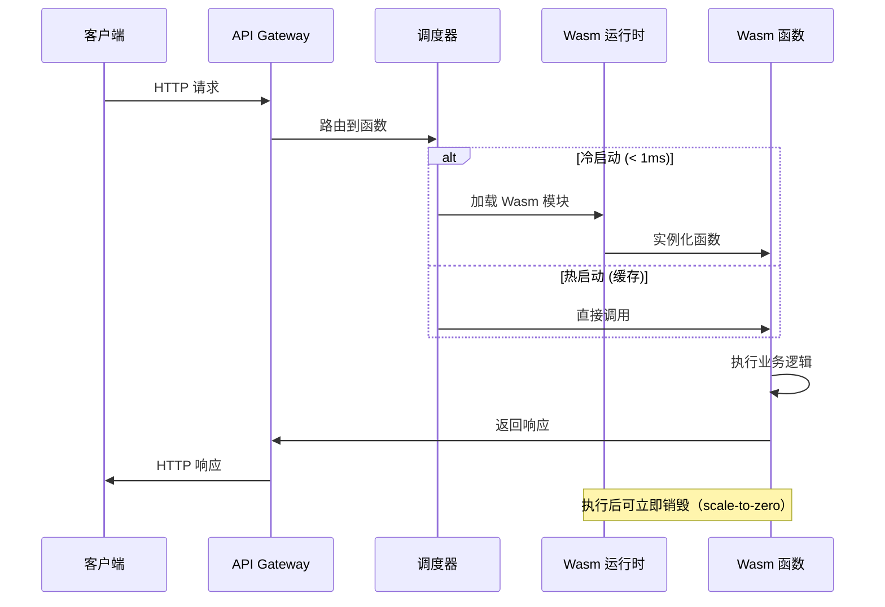
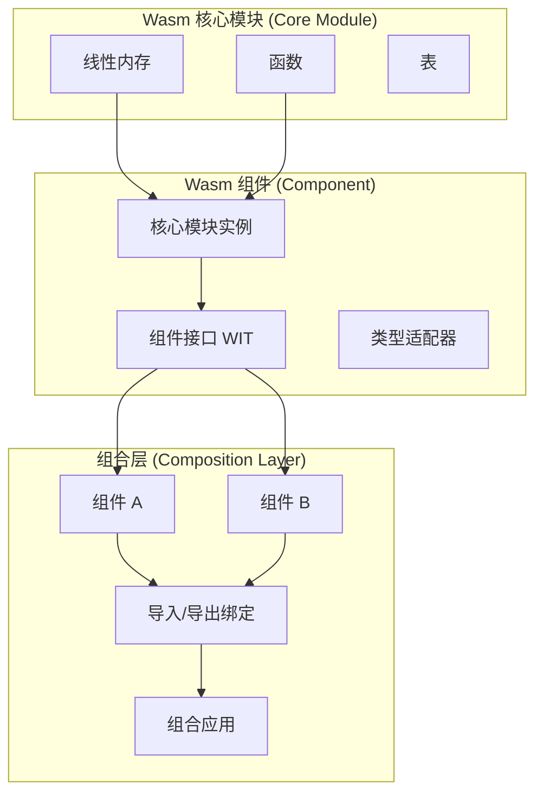
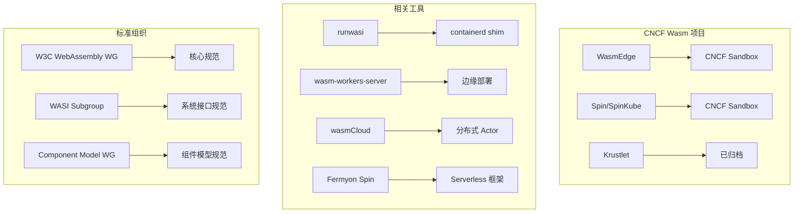

> **Production Environment Security Tips**
>
> This document contains executable operational commands. Execute at your own risk: confirm that the target cluster and namespace are correct; ensure you have sufficient RBAC permissions; verify these commands in a non-production environment. Risk level annotations: 🔴 High Risk (may cause data loss or service disruption), 🟡 Medium Risk (modifies cluster state but usually rollbackable), 🟢 Low Risk/Read-Only (information gathering, no side effects).


# WebAssembly Cloud Native Foundation
# WebAssembly Cloud Native Fundamentals

## Directory / Table of Contents

1. [WebAssembly Overview](#1-overview-of-webassembly)
2. [Wasm Binary Format and Architecture](#2-webassembly-binary-format-and-architecture)
3. [Linear Memory Model](#3-linear-memory-model)
4. [WASI - WebAssembly System Interface](#4-wasi---webassembly-system-interface)
5. [Wasm vs Container Comparison](#5-wasm-vs-container-comparison)
6. [Cloud Native Use Cases](#6-cloud-native-use-cases-cloud-native-use-cases)
7. [Toolchain and Compilation](#7-toolchain-and-compilation)
8. [Component Model](#8-component-model)
9. [Security Model](#9-security-model)
10. [Performance Analysis and Optimization](#10-performance-analysis-and-optimization)
11. [Ecosystem and Runtime](#11-ecosystem-and-runtime)
12. [Example Practices](#12-practical-examples)

---

## 1. Overview of WebAssembly

## 1.1 What is WebAssembly / What is WebAssembly

WebAssembly (abbreviated Wasm) is a binary instruction format based on a stack machine. It is designed to be a portable target for programming languages, allowing deployment of high-performance client and server applications on the web.

```
WebAssembly 核心特性：
┌─────────────────────────────────────────────────────┐
│  快速 (Fast)          │  接近原生的执行速度            │
│  安全 (Safe)          │  内存安全的沙箱执行环境         │
│  开放 (Open)          │  W3C 标准，厂商中立            │
│  可移植 (Portable)    │  跨平台、跨语言                │
└─────────────────────────────────────────────────────┘
```

WebAssembly became an official W3C standard in December 2019 and is supported by all major browsers. Since 2020, its application has grown rapidly in the server-side and cloud-native domains.

## 1.2 Historical Evolution / History & Evolution



## 1.3 Why Focus on Cloud-Native Wasm / Why Cloud Native Wasm



**Core Advantage Comparison:**

| Metric | Traditional Container | Wasm Module | Improvement Ratio |
|------|----------|-----------|----------|
| Cold Startup Time | 100ms ~ 1s | < 1ms | 100x ~ 1000x |
| Image/Module Size | 50MB ~ 1GB | 100KB ~ 10MB | 10x ~ 100x |
| Memory Usage | 50MB ~ 512MB | 1MB ~ 50MB | 10x ~ 50x |
| CPU Overhead | High | Near Native | ~20% Difference |
| Security Isolation | cgroup/namespace | Sandbox + Capability Model | More Fine-Grained |

---

## 2. WebAssembly Binary Format and Architecture

## 2.1 Module Structure / Module Structure

WebAssembly modules are binary-encoded, composed of multiple Sections (segments):

```
WebAssembly 二进制格式结构
┌─────────────────────────────────────────────────────────┐
│  Magic Number: 0x00 0x61 0x73 0x6D  (\0asm)             │
│  Version:      0x01 0x00 0x00 0x00  (1)                 │
├─────────────────────────────────────────────────────────┤
│  Section 1:  Type Section    (函数签名/类型定义)           │
│  Section 2:  Import Section  (导入声明)                  │
│  Section 3:  Function Section(函数索引)                  │
│  Section 4:  Table Section   (函数引用表)                │
│  Section 5:  Memory Section  (线性内存定义)              │
│  Section 6:  Global Section  (全局变量)                  │
│  Section 7:  Export Section  (导出声明)                  │
│  Section 8:  Start Section   (启动函数)                  │
│  Section 9:  Element Section (表元素初始化)              │
│  Section 10: Code Section    (函数代码体)                │
│  Section 11: Data Section    (内存数据初始化)            │
│  Section 12: Custom Section  (自定义扩展数据)            │
└─────────────────────────────────────────────────────────┘
```

## 2.2 WAT - WebAssembly Text Format / Text Format

WAT (WebAssembly Text Format) is a human-readable representation of Wasm binary:

```wat
;; Simple addition function
(module
  ;; Type definition
  (type $add_type (func (param i32 i32) (result i32)))
  
  ;; Function implementation
  (func $add (type $add_type)
    local.get 0    ;; 获取参数 0
    local.get 1    ;; 获取参数 1
    i32.add        ;; 整数加法
  )
  
  ;; Export function
  (export "add" (func $add))
)
```

```wat
;; Example of memory operations
(module
  ;; Declare 1 page of memory (64KB)
  (memory $mem 1)
  
  ;; Write string to memory
  (data (i32.const 0) "Hello, WebAssembly!\00")
  
  ;; Function: return string pointer and length
  (func $get_string (result i32 i32)
    i32.const 0    ;; 指针
    i32.const 19   ;; 长度
  )
  
  (export "memory" (memory $mem))
  (export "get_string" (func $get_string))
)
```

## 2.3 Stack-based Virtual Machine / Stack-based Virtual Machine



**Type System / Type System:**

```
WebAssembly 值类型
├── 数值类型 (Number Types)
│   ├── i32  - 32位整数
│   ├── i64  - 64位整数
│   ├── f32  - 32位浮点数
│   └── f64  - 64位浮点数
├── 向量类型 (Vector Types)
│   └── v128 - 128位 SIMD 向量
└── 引用类型 (Reference Types)
    ├── funcref  - 函数引用
    └── externref - 外部引用
```

## 2.4 Instruction Set Architecture / Instruction Set Architecture

```wat
;; Control flow instructions
(module
  (func $fibonacci (param $n i32) (result i32)
    ;; if-else example
    (if (result i32) (i32.le_s (local.get $n) (i32.const 1))
      (then
        local.get $n
      )
      (else
        ;; Recursive call
        (i32.add
          (call $fibonacci (i32.sub (local.get $n) (i32.const 1)))
          (call $fibonacci (i32.sub (local.get $n) (i32.const 2)))
        )
      )
    )
  )
  (export "fibonacci" (func $fibonacci))
)
```

```wat
;; Loop instructions
(module
  (func $sum (param $n i32) (result i32)
    (local $i i32)
    (local $result i32)
    
    ;; Initialization
    (local.set $i (i32.const 0))
    (local.set $result (i32.const 0))
    
    ;; Loop block
    (block $break
      (loop $continue
        ;; Conditional Evaluation
        (br_if $break (i32.ge_s (local.get $i) (local.get $n)))
        
        ;; result += i
        (local.set $result
          (i32.add (local.get $result) (local.get $i))
        )
        
        ;; i++
        (local.set $i (i32.add (local.get $i) (i32.const 1)))
        
        ;; Continue Looping
        (br $continue)
      )
    )
    
    local.get $result
  )
  (export "sum" (func $sum))
)
```

---

## 3. Linear Memory Model

## 3.1 Memory Concepts / Memory Concepts

WebAssembly's memory model is based on linear memory, which is a continuous array of bytes:

```
线性内存布局
┌──────────────────────────────────────────────────────────┐
│  地址 0                                                   │
│  ┌────────────────────────────────────────────────────┐  │
│  │  数据段 (Data Segment)                              │  │
│  │  - 字符串常量                                       │  │
│  │  - 全局数据                                         │  │
│  ├────────────────────────────────────────────────────┤  │
│  │  堆 (Heap)                                          │  │
│  │  - 动态分配的内存                                   │  │
│  │  - malloc/free 管理                                 │  │
│  ├────────────────────────────────────────────────────┤  │
│  │  栈 (Stack)                                         │  │
│  │  - 函数调用栈                                       │  │
│  │  - 局部变量                                         │  │
│  └────────────────────────────────────────────────────┘  │
│  地址 N * 64KB (N 页)                                     │
└──────────────────────────────────────────────────────────┘

注意：
- 每页大小固定为 64KB (65536 字节)
- 最大内存 4GB (2^32 字节) - 32位地址空间
- Memory64 提案支持 64 位地址空间
```

## 3.2 Memory Operations / Memory Operations

```rust
// Rust Example: Sharing Memory with JS via wasm-bindgen
use wasm_bindgen::prelude::*;

#[wasm_bindgen]
pub fn process_bytes(input: &[u8]) -> Vec<u8> {
    // Directly operate byte slices in WebAssembly's linear memory from Rust
    input.iter().map(|&b| b.wrapping_add(1)).collect()
}

#[wasm_bindgen]
pub fn allocate_buffer(size: usize) -> *mut u8 {
    // Allocate memory and return a pointer
    let mut buf = Vec::with_capacity(size);
    let ptr = buf.as_mut_ptr();
    std::mem::forget(buf); // 防止 Rust 自动释放
    ptr
}

#[wasm_bindgen]
pub fn free_buffer(ptr: *mut u8, size: usize) {
    unsafe {
        // Reclaim ownership and let Rust automatically release it
        let _ = Vec::from_raw_parts(ptr, 0, size);
    }
}
```

```c
// C Example: Manual Memory Management
#include <stdint.h>
#include <string.h>

// Simple Memory Allocator
static uint8_t heap[65536];
static uint32_t heap_top = 0;

void* wasm_malloc(uint32_t size) {
    if (heap_top + size > sizeof(heap)) {
        return 0; // OOM
    }
    void* ptr = &heap[heap_top];
    heap_top += size;
    return ptr;
}

// String Copy Operation
__attribute__((export_name("copy_string")))
uint32_t copy_string(const char* src, uint32_t len) {
    char* dst = (char*)wasm_malloc(len + 1);
    if (!dst) return 0;
    memcpy(dst, src, len);
    dst[len] = '\0';
    return (uint32_t)(uintptr_t)dst;
}
```

## 3.3 Memory Growth / Memory Growth

```wat
;; Dynamic Memory Growth
(module
  (memory $mem 1 10)  ;; 初始 1 页，最大 10 页
  
  (func $grow_memory (param $pages i32) (result i32)
    ;; `memory.grow` returns the old page count, fails with -1
    (memory.grow (local.get $pages))
  )
  
  (func $current_memory (result i32)
    memory.size
  )
  
  (export "grow" (func $grow_memory))
  (export "size" (func $current_memory))
  (export "memory" (memory $mem))
)
```

## 3.4 Shared Memory & Threads / Shared Memory & Threads

```javascript
// Create shared memory in JavaScript
const sharedMemory = new WebAssembly.Memory({
  initial: 10,
  maximum: 100,
  shared: true  // SharedArrayBuffer
});

// Share across multiple Workers
const worker = new Worker('wasm-worker.js');
worker.postMessage({ memory: sharedMemory });

// Atomic Operations
const i32 = new Int32Array(sharedMemory.buffer);
Atomics.add(i32, 0, 1);      // 原子加法
Atomics.store(i32, 1, 42);   // 原子存储
Atomics.load(i32, 1);         // 原子读取
```

---

## 4. WASI - WebAssembly System Interface

## 4.1 WASI Overview

WASI (WebAssembly System Interface) is the standard for a system-level API of WebAssembly, allowing Wasm modules to access system resources securely and portably:



## 4.2 WASI Preview 1 Core APIs

```rust
// Rust uses WASI file system operations
use std::fs;
use std::io::{Read, Write};

fn main() {
    // WASI File Reading
    let mut file = fs::File::open("/data/input.txt")
        .expect("无法打开文件");
    
    let mut content = String::new();
    file.read_to_string(&mut content)
        .expect("读取失败");
    
    println!("文件内容: {}", content);
    
    // WASI File Writing
    let mut output = fs::File::create("/data/output.txt")
        .expect("无法创建文件");
    
    output.write_all(b"Hello from WASI!\n")
        .expect("写入失败");
    
    // WASI Environment Variables
    if let Ok(val) = std::env::var("MY_CONFIG") {
        println!("配置值: {}", val);
    }
    
    // WASI Command Line Arguments
    let args: Vec<String> = std::env::args().collect();
    println!("参数: {:?}", args);
}
```

```toml
# Cargo.toml - Compilation Target Configuration
[package]
name = "wasi-example"
version = "0.1.0"
edition = "2021"

[dependencies]
# WASI Bindings
wasi = "0.11"

bin
name = "wasi-example"

# Build Command: cargo build --target wasm32-wasi
```

## 4.3 WASI Preview 2 and Component Model

```
WASI Preview 2 核心接口 (WIT 格式)

package wasi:io@0.2.0;

interface streams {
  type input-stream = resource;
  type output-stream = resource;
  
  read: func(
    self: borrow<input-stream>,
    len: u64
  ) -> result<list<u8>, stream-error>;
  
  write: func(
    self: borrow<output-stream>,
    contents: list<u8>
  ) -> result<_, stream-error>;
}
```

```rust
// WASI Preview 2 code generated by wit-bindgen
use wasi::http::types::*;

// HTTP Handler Implementation
struct HttpHandler;

impl wasi::exports::http::incoming_handler::Guest for HttpHandler {
    fn handle(request: IncomingRequest, response_out: ResponseOutparam) {
        let response = OutgoingResponse::new(Fields::new());
        response.set_status_code(200).unwrap();
        
        let body = response.body().unwrap();
        let stream = body.write().unwrap();
        stream.write(b"Hello from WASI!").unwrap();
        drop(stream);
        OutgoingBody::finish(body, None).unwrap();
        
        ResponseOutparam::set(response_out, Ok(response));
    }
}

wasi::http::proxy::export!(HttpHandler);
```

## 4.4 Capability Security Model

```
WASI 能力安全 (Capability-based Security)

传统 POSIX 系统：
  进程默认可访问任何文件（受 UID/GID 限制）
  
WASI 能力模型：
  模块默认无任何权限
  只有被显式传递的资源描述符才能被访问
  
示例：
  # Runtime Explicit Authorization Directory Access
  wasmtime run \
    --dir /data/input::/ \      # Mount input directory
    --dir /data/output::/out \  # Mount output directory
    --env FOO=bar \             # Pass environment variable
    my_module.wasm
```

```go
// Go uses wazero to run WASI modules (server-side)
package main

import (
    "context"
    "os"
    
    "github.com/tetratelabs/wazero"
    "github.com/tetratelabs/wazero/imports/wasi_snapshot_preview1"
)

func main() {
    ctx := context.Background()
    
    // Create runtime
    rt := wazero.NewRuntime(ctx)
    defer rt.Close(ctx)
    
    // Load WASI Preview 1
    wasi_snapshot_preview1.MustInstantiate(ctx, rt)
    
    // Configure module
    config := wazero.NewModuleConfig().
        WithStdout(os.Stdout).
        WithStderr(os.Stderr).
        WithArgs("wasm-program", "--verbose").
        WithEnv("LOG_LEVEL", "debug").
        WithFSConfig(
            wazero.NewFSConfig().
                WithDirMount("/host/data", "/"),  // 目录挂载
        )
    
    // Load and run Wasm module
    wasmBytes, _ := os.ReadFile("program.wasm")
    module, _ := rt.InstantiateWithConfig(ctx, wasmBytes, config)
    defer module.Close(ctx)
}
```

## 4.5 WASI Network Interface / Network Interface

```rust
// WASI HTTP Client (Preview 2)
use wasi::http::outgoing_handler;
use wasi::http::types::*;

pub fn fetch_url(url: &str) -> Result<String, String> {
    let request = OutgoingRequest::new(Fields::new());
    request.set_method(&Method::Get).map_err(|_| "设置方法失败")?;
    
    let uri = url.parse::<Uri>().map_err(|e| e.to_string())?;
    request.set_scheme(Some(&Scheme::Https))
        .map_err(|_| "设置 scheme 失败")?;
    request.set_authority(Some(uri.authority()))
        .map_err(|_| "设置 authority 失败")?;
    request.set_path_with_query(uri.path_and_query().map(|pq| pq.as_str()))
        .map_err(|_| "设置路径失败")?;
    
    // Send request
    let future = outgoing_handler::handle(request, None)
        .map_err(|e| format!("发送请求失败: {:?}", e))?;
    
    // Wait for response
    let response = future.get()
        .ok_or("无响应")?
        .map_err(|e| format!("响应错误: {:?}", e))?
        .map_err(|e| format!("HTTP 错误: {:?}", e))?;
    
    // Read response body
    let body = response.consume().map_err(|_| "消费响应体失败")?;
    let stream = body.stream().map_err(|_| "获取流失败")?;
    
    let mut bytes = Vec::new();
    loop {
        match stream.read(8192) {
            Ok(chunk) if chunk.is_empty() => break,
            Ok(chunk) => bytes.extend_from_slice(&chunk),
            Err(_) => break,
        }
    }
    
    String::from_utf8(bytes).map_err(|e| e.to_string())
}
```

---

## 5. Wasm vs Container Comparison

## 5.1 Architecture Comparison / Architecture Comparison



## 5.2 Detailed Comparison Table / Detailed Comparison Table

| Dimension | Docker Container | Wasm Module | Note |
|------|------------|-----------|------|
| **Start Time** | 100ms ~ 1s | < 1ms | Wasm runs 100-1000x faster |
| **Cold Start** | Slow (pulling image) | Fast (small module) | Key metric for serverless |
| **Image/Module Size** | 50MB ~ 2GB | 100KB ~ 10MB | Wasm is 10-100x smaller |
| **Memory Usage** | 50MB ~ 512MB | 1MB ~ 50MB | Significantly reduced |
| **CPU Performance** | Native-like | Native-like (with minor overhead) | 20% difference at most |
| **Security Isolation** | Namespaces + Seccomp | Sandbox + capability model | Wasm has finer-grained isolation |
| **Portability** | Cross Linux Architectures | Across all platforms/architectures | Wasm Stronger |
| **Language Support** | Any Language | C/C++/Rust/Go/... | Container Support Broader |
| **System Calls** | Direct System Calls | Through WASI Interface | Wasm Limited |
| **Network** | Complete Network Stack | WASI Socket (Limited) | Container More Complete |
| **Storage** | Complete File System | Restricted File System | Container More Flexible |
| **Stateful Applications** | Supported | Limited Support | Containers More Suitable |
| **Debugging Tools** | Mature | Developing | Container Ecosystem More Robust |
| **Ecosystem** | Extremely Mature | Rapidly Growing | Container Ecosystem Larger |
| **OCI Compatible** | Yes | Yes (OCI Wasm Artifact) | Unified Distribution |

## 5.3 Use Case Selection / Use Case Selection

```
何时使用 Wasm（而非容器）：

✅ 适合 Wasm 的场景：
  - Serverless/FaaS 函数（关注冷启动）
  - 边缘计算（资源受限节点）
  - 插件/扩展系统（动态加载，沙箱安全）
  - 多租户代码执行（强隔离需求）
  - AI 推理（轻量、可移植）
  - 短生命周期任务（快速启停）

❌ 不适合 Wasm 的场景：
  - 数据库（需完整 IO 访问）
  - 完整 Linux 应用（系统调用依赖）
  - GUI 应用
  - 需要完整网络栈的应用
  - 长运行的有状态服务（容器更成熟）
```

## 5.4 Hybrid Deployment Mode / Hybrid Deployment Mode

```yaml
# Kubernetes Mixed Deployment: Containers + Wasm
apiVersion: v1
kind: Pod
metadata:
  name: hybrid-app
spec:
  containers:
  # Traditional Containers: Databases, message queues, etc.
  - name: redis
    image: redis:7-alpine
    ports:
    - containerPort: 6379
  
  # Wasm Containers: Lightweight Business Logic
  - name: handler
    image: ghcr.io/myorg/handler:latest
    runtimeClassName: wasmtime  # 使用 Wasm 运行时
    resources:
      limits:
        memory: "64Mi"
        cpu: "200m"
```

---

## 6. Cloud Native Use Cases / Cloud Native Use Cases

## 6.1 Serverless / FaaS



```rust
// Serverless Wasm Function Example (Spin Framework)
use spin_sdk::http::{IntoResponse, Request, Response};
use spin_sdk::http_component;

#[http_component]
fn handle_request(req: Request) -> anyhow::Result<impl IntoResponse> {
    println!("收到请求: {} {}", req.method(), req.uri());
    
    // Handle Request Body
    let body = req.body();
    let response_body = format!("Echo: {}", 
        String::from_utf8_lossy(body));
    
    Ok(Response::builder()
        .status(200)
        .header("Content-Type", "text/plain")
        .body(response_body)
        .build())
}
```

## 6.2 Edge Computing / Edge Computing

```
边缘计算 Wasm 部署架构
                                                    
  ┌─────────────┐    ┌─────────────┐    ┌─────────────┐
  │  中心云      │    │  边缘节点1   │    │  边缘节点2   │
  │             │    │             │    │             │
  │  ┌────────┐ │    │  ┌────────┐ │    │  ┌────────┐ │
  │  │ 镜像   │ │───▶│  │  Wasm  │ │    │  │  Wasm  │ │
  │  │ 仓库   │ │    │  │ 模块   │ │    │  │ 模块   │ │
  │  └────────┘ │    │  └────────┘ │    │  └────────┘ │
  │             │    │             │    │             │
  │  配置管理   │    │  ARM/x86    │    │  RISC-V     │
  └─────────────┘    └─────────────┘    └─────────────┘
  
  Wasm 优势：
  - 同一模块文件运行在不同 CPU 架构
  - 模块小，适合低带宽分发
  - 低内存占用，适合资源受限设备
```

## 6.3 Plugin System / Plugin System

```go
// Go Implementation of Wasm Plugin System (Using wazero)
package main

import (
    "context"
    "fmt"
    "os"
    
    "github.com/tetratelabs/wazero"
    "github.com/tetratelabs/wazero/api"
)

// PluginManager manages Wasm plugins
type PluginManager struct {
    runtime wazero.Runtime
    plugins map[string]api.Module
}

func NewPluginManager() *PluginManager {
    ctx := context.Background()
    rt := wazero.NewRuntimeWithConfig(ctx,
        wazero.NewRuntimeConfig().WithCompilationCache(
            wazero.NewCompilationCache(),
        ),
    )
    return &PluginManager{
        runtime: rt,
        plugins: make(map[string]api.Module),
    }
}

func (pm *PluginManager) LoadPlugin(name, path string) error {
    ctx := context.Background()
    
    // Registers host functions (Host Functions)
    _, err := pm.runtime.NewHostModuleBuilder("env").
        NewFunctionBuilder().
        WithFunc(func(ctx context.Context, msg uint32) {
            // Reads a string from Wasm memory
            module := ctx.Value("module").(api.Module)
            mem := module.Memory()
            bytes, _ := mem.Read(msg, 256)
            fmt.Printf("[插件日志] %s\n", bytes)
        }).
        Export("log").
        Instantiate(ctx)
    
    if err != nil {
        return fmt.Errorf("注册主机模块失败: %w", err)
    }
    
    // Loads a plugin
    wasmBytes, err := os.ReadFile(path)
    if err != nil {
        return fmt.Errorf("读取插件文件失败: %w", err)
    }
    
    module, err := pm.runtime.InstantiateWithConfig(ctx, wasmBytes,
        wazero.NewModuleConfig().WithName(name),
    )
    if err != nil {
        return fmt.Errorf("实例化插件失败: %w", err)
    }
    
    pm.plugins[name] = module
    return nil
}

func (pm *PluginManager) CallPlugin(name, funcName string, args ...uint64) ([]uint64, error) {
    ctx := context.Background()
    
    plugin, ok := pm.plugins[name]
    if !ok {
        return nil, fmt.Errorf("插件 %s 未找到", name)
    }
    
    fn := plugin.ExportedFunction(funcName)
    if fn == nil {
        return nil, fmt.Errorf("函数 %s 未导出", funcName)
    }
    
    return fn.Call(ctx, args...)
}
```

## 6.4 AI Inference / AI Inference

```
Wasm AI 推理架构
                                                        
  ┌──────────────────────────────────────────────────┐
  │                  AI 应用层                        │
  │  ┌──────────┐  ┌──────────┐  ┌──────────────┐   │
  │  │  图像识别 │  │  NLP 处理 │  │  推荐系统    │   │
  │  └──────────┘  └──────────┘  └──────────────┘   │
  ├──────────────────────────────────────────────────┤
  │               Wasm AI 运行时层                    │
  │  ┌─────────┐ ┌─────────┐ ┌──────────────────┐   │
  │  │  ONNX   │ │TensorFlow│ │  WasmEdge NN     │   │
  │  │  Runtime│ │  Lite    │ │  (WASI-NN)       │   │
  │  └─────────┘ └─────────┘ └──────────────────┘   │
  ├──────────────────────────────────────────────────┤
  │               Wasm 运行时层                       │
  │  WasmEdge / Wasmtime / Wasmer                    │
  ├──────────────────────────────────────────────────┤
  │               硬件加速层                          │
  │  CPU / GPU / NPU / FPGA                          │
  └──────────────────────────────────────────────────┘
```

```rust
// WASI-NN AI inference example (WasmEdge)
use wasi_nn::{Graph, GraphEncoding, ExecutionTarget, TensorType};

fn run_inference(model_path: &str, input: &[f32]) -> Vec<f32> {
    // Loads an ONNX model
    let graph = Graph::load(
        &[std::fs::read(model_path).expect("读取模型失败")],
        GraphEncoding::Onnx,
        ExecutionTarget::CPU,
    ).expect("加载图失败");
    
    // Creates an execution context
    let mut ctx = graph.init_execution_context()
        .expect("初始化上下文失败");
    
    // Sets input tensor
    ctx.set_input(
        0,
        TensorType::F32,
        &[1, 3, 224, 224],  // batch, channel, height, width
        input,
    ).expect("设置输入失败");
    
    // Performs inference
    ctx.compute().expect("推理失败");
    
    // Gets output
    let output_size = 1000; // ImageNet 1000 类
    let mut output = vec![0f32; output_size];
    ctx.get_output(0, &mut output).expect("获取输出失败");
    
    output
}
```

## 6.5 Data Processing Pipeline / Data Processing Pipeline

```yaml
# Knative + Wasm Data Processing Pipeline
apiVersion: flows.knative.dev/v1
kind: Sequence
metadata:
  name: wasm-data-pipeline
spec:
  steps:
  - ref:
      apiVersion: serving.knative.dev/v1
      kind: Service
      name: wasm-parser       # Wasm: 数据解析
  - ref:
      apiVersion: serving.knative.dev/v1
      kind: Service
      name: wasm-transformer  # Wasm: 数据转换
  - ref:
      apiVersion: serving.knative.dev/v1
      kind: Service
      name: wasm-validator    # Wasm: 数据验证
  channelTemplate:
    apiVersion: messaging.knative.dev/v1
    kind: InMemoryChannel
```

---

## 7. Toolchain and Compilation

## 7.1 Compilation Targets / Compilation Targets

```
主要 Wasm 编译目标
                                
  wasm32-unknown-unknown   - 纯 Wasm（浏览器）
  wasm32-wasi              - WASI Preview 1
  wasm32-wasip1            - WASI Preview 1（新别名）
  wasm32-wasip2            - WASI Preview 2（组件模型）
  wasm32-unknown-emscripten - Emscripten（浏览器 + POSIX）
```

## 7.2 Rust Toolchain / Rust Toolchain

```bash
# Install Rust Wasm toolchain
rustup target add wasm32-wasi
rustup target add wasm32-unknown-unknown

# Install wasm-pack (Web application)
cargo install wasm-pack

# Install cargo-component (Component model)
cargo install cargo-component

# Install wit-bindgen (Interface binding generation)
cargo install wit-bindgen-cli

# Compile WASI Module
cargo build --target wasm32-wasi --release

# Optimize Wasm Size
cargo install wasm-opt
wasm-opt -Os target/wasm32-wasi/release/app.wasm -o app.wasm
```

```toml
# Cargo.toml - Wasm Component Configuration
[package]
name = "my-wasm-component"
version = "0.1.0"
edition = "2021"

[lib]
crate-type = ["cdylib"]

[dependencies]
wit-bindgen = "0.20"
wasi = "0.12"

[profile.release]
opt-level = "s"       # 优化大小
lto = true            # 链接时优化
codegen-units = 1     # 减少代码大小
panic = "abort"       # 避免 panic 处理代码
strip = true          # 剥离符号表
```

## 7.3 Go Toolchain / Go Toolchain

```bash
# TinyGo - Go Compiler for Embedded and Wasm
# Install TinyGo
brew install tinygo  # macOS
# Or download binary

# Compile for WASI
tinygo build -o app.wasm -target=wasi ./main.go

# Standard Go Compilation (Experimental WASI Support)
GOOS=wasip1 GOARCH=wasm go build -o app.wasm .
```

```go
// Go WASI Example
//go:build wasip1

package main

import (
    "fmt"
    "os"
)

func main() {
    // WASI Environment Variables
    fmt.Println("WASI Go 程序启动")
    
    // Read Command Line Parameters
    for i, arg := range os.Args {
        fmt.Printf("参数 %d: %s\n", i, arg)
    }
    
    // Read Files (Requires WASI Directory Permissions)
    data, err := os.ReadFile("/data/config.json")
    if err != nil {
        fmt.Fprintf(os.Stderr, "读取文件错误: %v\n", err)
        os.Exit(1)
    }
    
    fmt.Printf("配置文件内容: %s\n", data)
}
```

## 7.4 AssemblyScript / TypeScript-like

```typescript
// AssemblyScript - Subset of TypeScript, Compiles to Wasm
// assembly/index.ts

export function fibonacci(n: i32): i32 {
  if (n <= 1) return n;
  return fibonacci(n - 1) + fibonacci(n - 2);
}

export function add(a: i32, b: i32): i32 {
  return a + b;
}

// Memory Operations
export function allocate(size: i32): i32 {
  return heap.alloc(size) as i32;
}

export function deallocate(ptr: i32): void {
  heap.free(changetype<usize>(ptr));
}
```

```json
// package.json
{
  "scripts": {
    "build": "asc assembly/index.ts -o build/release.wasm --optimize",
    "build:debug": "asc assembly/index.ts -o build/debug.wasm --debug"
  },
  "devDependencies": {
    "assemblyscript": "^0.27"
  }
}
```

## 7.5 WASM Tools / Tools

```bash
# wabt - WebAssembly Binary Toolkit
brew install wabt

# wat2wasm: Text Format to Binary
wat2wasm example.wat -o example.wasm

# wasm2wat: Binary to Text Format (Disassembly)
wasm2wat example.wasm -o example.wat

# wasm-objdump: View Module Information
wasm-objdump -x example.wasm

# wasm-validate: Validate module legitimacy
wasm-validate example.wasm

# wasm-strip: Strip debug information
wasm-strip example.wasm

# wasm-opt (binaryen): Optimize Wasm module
wasm-opt -O3 -o optimized.wasm input.wasm
```

---

## 8. Component Model

## 8.1 Component Model Overview / Component Model Overview



## 8.2 WIT - Wasm Interface Types / Interface Types

```wit
// world.wit - Define the Component World (interface)
package my:app@1.0.0;

// Define interface
interface types {
  // Resource types
  resource user {
    constructor(id: u64, name: string);
    get-id: func() -> u64;
    get-name: func() -> string;
    set-name: func(name: string);
  }
  
  // Enumerations
  enum status {
    active,
    inactive,
    pending,
  }
  
  // Variants (Tagged Union)
  variant result {
    ok(string),
    err(string),
  }
  
  // Record (Structures)
  record request {
    path: string,
    method: string,
    headers: list<tuple<string, string>>,
    body: option<list<u8>>,
  }
}

// Define HTTP interface
interface http-handler {
  use types.{request, result};
  handle: func(req: request) -> result;
}

// World definition
world http-service {
  // Import system interfaces
  import wasi:http/incoming-handler@0.2.0;
  
  // Export business interfaces
  export http-handler;
}
```

## 8.3 Component Composition

```bash
# Use wasm-tools to combine components
cargo install wasm-tools

# Build multiple components
cargo component build --release

# View component interfaces
wasm-tools component wit my-component.wasm

# Combine Two Components
wasm-tools compose \
  -d database-component.wasm \
  -d cache-component.wasm \
  app-component.wasm \
  -o composed-app.wasm
```

---

## 9. Security Model

## 9.1 WebAssembly Sandbox / WebAssembly Sandbox

```
WebAssembly 安全层次

┌─────────────────────────────────────────────┐
│  应用层安全                                  │
│  - 类型安全 (Type Safety)                   │
│  - 无未定义行为                              │
├─────────────────────────────────────────────┤
│  内存安全                                    │
│  - 线性内存访问边界检查                      │
│  - 无指针算术越界                            │
│  - 无悬挂指针                               │
├─────────────────────────────────────────────┤
│  沙箱隔离                                    │
│  - 默认无主机访问                            │
│  - 能力驱动的资源访问                        │
│  - 函数调用表隔离                            │
├─────────────────────────────────────────────┤
│  运行时安全                                  │
│  - JIT 代码验证                              │
│  - Spectre 缓解措施                         │
│  - 栈溢出保护                               │
└─────────────────────────────────────────────┘
```

## 9.2 Multi-tenant Security / Multi-tenant Security

```rust
// Multi-tenant WebAssembly Execution Engine
use wasmtime::*;
use std::collections::HashMap;

struct MultiTenantRuntime {
    engine: Engine,
    tenants: HashMap<String, (Store<()>, Instance)>,
}

impl MultiTenantRuntime {
    fn new() -> Self {
        let mut config = Config::new();
        // Security Configuration
        config.cranelift_opt_level(OptLevel::Speed);
        config.epoch_interruption(true);  // 支持中断
        config.consume_fuel(true);        // 资源限制
        
        Self {
            engine: Engine::new(&config).unwrap(),
            tenants: HashMap::new(),
        }
    }
    
    fn add_tenant(&mut self, id: &str, wasm_bytes: &[u8]) -> Result<()> {
        let module = Module::new(&self.engine, wasm_bytes)?;
        let mut store = Store::new(&self.engine, ());
        
        // Set Fuel Limit (CPU Quota)
        store.set_fuel(1_000_000)?;
        
        // Set Memory Limit
        store.limiter(|_| {
            let mut limiter = StoreLimitsBuilder::new();
            limiter.memory_size(64 * 1024 * 1024);  // 64MB
            limiter.build()
        });
        
        let instance = Instance::new(&mut store, &module, &[])?;
        self.tenants.insert(id.to_string(), (store, instance));
        
        Ok(())
    }
    
    fn call_tenant(&mut self, id: &str, func: &str, args: &[Val]) 
        -> Result<Vec<Val>> 
    {
        let (store, instance) = self.tenants.get_mut(id)
            .ok_or_else(|| anyhow::anyhow!("租户 {} 不存在", id))?;
        
        let f = instance.get_func(&mut *store, func)
            .ok_or_else(|| anyhow::anyhow!("函数 {} 不存在", func))?;
        
        let mut results = vec![Val::I32(0); f.ty(&*store).results().len()];
        f.call(&mut *store, args, &mut results)?;
        
        Ok(results)
    }
}
```

## 9.3 Spectre Protection / Spectre Mitigation

```
Wasmtime Spectre 防护措施：

1. 线性内存访问防护
   - 使用虚拟内存保护（guard pages）
   - 在 x86 上利用 4GB 地址空间限制

2. 分支目标预测防护
   - 使用 retpoline 技术
   - 限制间接调用目标

3. 内存访问时序防护
   - 加载时边界检查
   - 避免推测性越界访问
```

---

## 10. Performance Analysis and Optimization

## 10.1 Compilation Strategies / Compilation Strategies

```
Wasm 执行引擎编译策略
                                              
  解释执行 (Interpreter)
  - 最快启动
  - 最慢运行
  - 适合：短生命周期、一次性任务
  
  单遍编译 (Single-pass JIT)
  - 较快启动（ms 级）
  - 较慢运行（比 AOT 慢 2-3x）
  - 适合：Serverless 函数
  
  优化编译 (Optimizing JIT/AOT)
  - 慢启动（10ms-1s）
  - 接近原生性能
  - 适合：长运行服务
  
  AOT 预编译 (Ahead-of-Time)
  - 镜像时编译
  - 最快启动 + 最快运行
  - 适合：已知负载的生产环境
```

## 10.2 Performance Benchmarks / Performance Benchmarks

```
WebAssembly vs Native 性能对比（近似值）

数值计算：
  Native C:          1.0x
  Wasm (Wasmtime):   1.05 ~ 1.2x (略慢)
  
内存密集：
  Native C:          1.0x
  Wasm:              1.1 ~ 1.5x (有额外边界检查)
  
IO 密集：
  Native:            1.0x
  Wasm + WASI:       1.2 ~ 2.0x (有 WASI 调用开销)
  
启动时间（对比 JVM）：
  JVM (JIT 预热后):  基准
  Wasm (AOT):        100x 更快启动
  Wasm (JIT):        10x 更快启动
```

## 10.3 Optimization Tips / Optimization Tips

```rust
// Rust WebAssembly Optimization Tips

// 1. Avoid frequent allocation of Box/Vec
// Bad Approach
fn bad_process(data: Vec<u8>) -> Vec<u8> {
    data.into_iter().map(|b| b + 1).collect() // 多次分配
}

// Good Approach
fn good_process(data: &mut [u8]) {
    data.iter_mut().for_each(|b| *b += 1); // 原地修改
}

// 2. Accelerate with SIMD (requires simd128 feature)
#[target_feature(enable = "simd128")]
unsafe fn simd_add(a: &[f32], b: &[f32], out: &mut [f32]) {
    use std::arch::wasm32::*;
    
    let chunks = a.len() / 4;
    for i in 0..chunks {
        let va = v128_load(a[i*4..].as_ptr() as *const v128);
        let vb = v128_load(b[i*4..].as_ptr() as *const v128);
        let vc = f32x4_add(va, vb);
        v128_store(out[i*4..].as_mut_ptr() as *mut v128, vc);
    }
}

// 3. Reduce JS-Wasm Interop Calls
// Each JS↔Wasm call incurs a cost, so batch them
#[no_mangle]
pub extern "C" fn batch_process(ptr: *mut u8, len: usize) -> usize {
    let slice = unsafe { std::slice::from_raw_parts_mut(ptr, len) };
    // One call handles the entire buffer
    let count = slice.iter_mut()
        .filter(|&&mut b| b > 0)
        .map(|b| { *b *= 2; *b })
        .count();
    count
}
```

---

## 11. Ecosystem and Runtime

## 11.1 Main Wasm Runtimes Comparison / Runtime Comparison

| Runtime | Language | License | Features | Main Use Cases |
|--------|------|--------|------|----------|
| **Wasmtime** | Rust | Apache-2.0 | Cranelift JIT, security priority | Server, Kubernetes |
| **WasmEdge** | C++ | Apache-2.0 | AI/ML support, WASI-NN | Edge, AI inference |
| **Wasmer** | Rust | MIT | Multiple backends (LLVM/Cranelift) | General-purpose, embedded |
| **wazero** | Go | Apache-2.0 | Pure Go, zero dependencies | Embedding Go apps |
| **V8** | C++ | BSD | Most mature, JS engine | Browser, Deno |
| **SpiderMonkey** | C++ | MPL-2.0 | Firefox engine | Browser |

## 11.2 Cloud-Native Wasm Projects / Cloud Native Projects



## 11.3 OCI Wasm Artifact Standard / OCI Wasm Artifact

``` bash
# 🟢 Low Risk: ReadOnly/Information Gathering, Usually No Side Effects
# Package a Wasm module as an OCI image
# Use the wasm-to-oci tool
wasm-to-oci push myapp.wasm ghcr.io/myorg/myapp:latest

# View layers of an OCI image
docker manifest inspect ghcr.io/myorg/myapp:latest

# OCI Artifact Format
# {
#   "mediaType": "application/vnd.oci.image.manifest.v1+json",
#   "layers": [{
#     "mediaType": "application/vnd.wasm.content.layer.v1+wasm",
#     "digest": "sha256:...",
#     "size": 1234
#   }],
#   "annotations": {
#     "org.opencontainers.image.created": "2024-01-01T00:00:00Z"
#   }
# }
```
---

## 12. Practical Examples

## 12.1 Complete Rust WASI Application / Complete Rust WASI App

```rust
// src/main.rs - Complete WASI Web server (using Spin)
use anyhow::Result;
use spin_sdk::{
    http::{IntoResponse, Method, Params, Request, Response, Router},
    http_component,
    key_value::Store,
};
use serde::{Deserialize, Serialize};

#[derive(Serialize, Deserialize, Debug)]
struct User {
    id: u64,
    name: String,
    email: String,
}

// Register HTTP routes
#[http_component]
fn handle_request(req: Request) -> Result<impl IntoResponse> {
    let mut router = Router::new();
    
    router.get("/users/:id", get_user);
    router.post("/users", create_user);
    router.delete("/users/:id", delete_user);
    
    Ok(router.handle(req))
}

// GET /users/:id
fn get_user(req: Request, params: Params) -> Result<impl IntoResponse> {
    let id = params.get("id").unwrap_or("0");
    
    // Get user from KV Store
    let store = Store::open_default()?;
    
    match store.get(&format!("user:{}", id))? {
        Some(data) => {
            let user: User = serde_json::from_slice(&data)?;
            Ok(Response::builder()
                .status(200)
                .header("Content-Type", "application/json")
                .body(serde_json::to_vec(&user)?)
                .build())
        }
        None => Ok(Response::builder()
            .status(404)
            .body("用户未找到")
            .build()),
    }
}

// POST /users
fn create_user(req: Request, _params: Params) -> Result<impl IntoResponse> {
    let user: User = serde_json::from_slice(req.body())?;
    
    // Store to KV Store
    let store = Store::open_default()?;
    store.set(
        &format!("user:{}", user.id),
        &serde_json::to_vec(&user)?,
    )?;
    
    Ok(Response::builder()
        .status(201)
        .header("Content-Type", "application/json")
        .header("Location", format!("/users/{}", user.id))
        .body(serde_json::to_vec(&user)?)
        .build())
}

// DELETE /users/:id
fn delete_user(_req: Request, params: Params) -> Result<impl IntoResponse> {
    let id = params.get("id").unwrap_or("0");
    
    let store = Store::open_default()?;
    store.delete(&format!("user:{}", id))?;
    
    Ok(Response::builder()
        .status(204)
        .body(())
        .build())
}
```

## 12.2 Kubernetes Deployment

```yaml
# RuntimeClass Configuration (requires containerd wasm shim)
apiVersion: node.k8s.io/v1
kind: RuntimeClass
metadata:
  name: wasmtime-spin
handler: spin
scheduling:
  nodeClassification:
    nodeSelector:
      matchLabels:
        kubernetes.io/arch: wasm32

---
# Wasm Deployment
apiVersion: apps/v1
kind: Deployment
metadata:
  name: wasm-user-service
  namespace: default
  labels:
    app: wasm-user-service
spec:
  replicas: 3
  selector:
    matchLabels:
      app: wasm-user-service
  template:
    metadata:
      labels:
        app: wasm-user-service
    spec:
      runtimeClassName: wasmtime-spin  # 使用 Wasm 运行时
      containers:
      - name: user-service
        image: ghcr.io/myorg/user-service:v1.0.0
        # Wasm modules do not need command/args
        env:
        - name: SPIN_APP_KV_STORE
          value: redis://redis-service:6379
        resources:
          requests:
            memory: "16Mi"
            cpu: "50m"
          limits:
            memory: "64Mi"
            cpu: "200m"
        ports:
        - containerPort: 80
          name: http

---
# Service
apiVersion: v1
kind: Service
metadata:
  name: wasm-user-service
spec:
  selector:
    app: wasm-user-service
  ports:
  - port: 80
    targetPort: 80
  type: ClusterIP

---
# HPA Auto Scaling
apiVersion: autoscaling/v2
kind: HorizontalPodAutoscaler
metadata:
  name: wasm-user-service-hpa
spec:
  scaleTargetRef:
    apiVersion: apps/v1
    kind: Deployment
    name: wasm-user-service
  minReplicas: 1
  maxReplicas: 50
  metrics:
  - type: Resource
    resource:
      name: cpu
      target:
        type: Utilization
        averageUtilization: 70
```

## 12.3 Complete CI/CD Pipeline

```yaml
# .github/workflows/wasm-build.yml
name: Build and Deploy Wasm

on:
  push:
    branches: [main]
  pull_request:
    branches: [main]

env:
  REGISTRY: ghcr.io
  IMAGE_NAME: ${{ github.repository }}

jobs:
  build-wasm:
    runs-on: ubuntu-latest
    steps:
    - uses: actions/checkout@v4
    
    - name: 安装 Rust 工具链
      uses: dtolnay/rust-toolchain@stable
      with:
        targets: wasm32-wasi
    
    - name: 安装 Spin CLI
      uses: fermyon/actions/spin/setup@v1
      with:
        version: "v3.0.0"
    
    - name: 缓存 Rust 编译缓存
      uses: Swatinem/rust-cache@v2
    
    - name: 编译 Wasm 模块
      run: |
        cargo build --target wasm32-wasi --release
        ls -lh target/wasm32-wasi/release/*.wasm
    
    - name: 优化 Wasm 大小
      run: |
        cargo install wasm-opt
        wasm-opt -Os \
          target/wasm32-wasi/release/app.wasm \
          -o dist/app.wasm
        echo "优化后大小: $(du -sh dist/app.wasm)"
    
    - name: 运行 Wasm 测试
      run: |
        spin test
    
    - name: 构建并推送 OCI 镜像
      uses: docker/build-push-action@v5
      with:
        context: .
        push: ${{ github.event_name == 'push' }}
        tags: |
          ${{ env.REGISTRY }}/${{ env.IMAGE_NAME }}:latest
          ${{ env.REGISTRY }}/${{ env.IMAGE_NAME }}:${{ github.sha }}
    
    - name: 部署到 Kubernetes
      if: github.ref == 'refs/heads/main'
      run: |
        kubectl set image deployment/wasm-app \
          app=${{ env.REGISTRY }}/${{ env.IMAGE_NAME }}:${{ github.sha }}
        kubectl rollout status deployment/wasm-app
```

## 12.4 Performance Testing

```go
// Performance Testing: Wasm vs Native
package benchmark_test

import (
    "context"
    "testing"
    "os"
    
    "github.com/tetratelabs/wazero"
    "github.com/tetratelabs/wazero/imports/wasi_snapshot_preview1"
)

// Test Wasm function call overhead
func BenchmarkWasmFibonacci(b *testing.B) {
    ctx := context.Background()
    rt := wazero.NewRuntime(ctx)
    defer rt.Close(ctx)
    
    wasi_snapshot_preview1.MustInstantiate(ctx, rt)
    
    wasmBytes, _ := os.ReadFile("fibonacci.wasm")
    module, _ := rt.InstantiateWithConfig(ctx, wasmBytes,
        wazero.NewModuleConfig().WithName("fib"))
    defer module.Close(ctx)
    
    fn := module.ExportedFunction("fibonacci")
    
    b.ResetTimer()
    b.RunParallel(func(pb *testing.PB) {
        for pb.Next() {
            fn.Call(ctx, 30)
        }
    })
}

// Compare: Native Go function
func fibonacci(n uint64) uint64 {
    if n <= 1 {
        return n
    }
    return fibonacci(n-1) + fibonacci(n-2)
}

func BenchmarkNativeFibonacci(b *testing.B) {
    b.RunParallel(func(pb *testing.PB) {
        for pb.Next() {
            fibonacci(30)
        }
    })
}
```

---

## References

## Official Specifications
- [WebAssembly Core Specification](https://webassembly.github.io/spec/core/)
- [WASI Preview 2 Specification](https://github.com/WebAssembly/WASI)
- [WebAssembly Component Model](https://github.com/WebAssembly/component-model)
- [W3C WebAssembly Standard](https://www.w3.org/TR/wasm-core-2/)

## Runtime Documentation
- [Wasmtime Official Documentation](https://docs.wasmtime.dev/)
- [WasmEdge Official Documentation](https://wasmedge.org/docs/)
- [Wasmer Official Documentation](https://docs.wasmer.io/)
- [wazero Official Documentation](https://wazero.io/)

## Cloud Native Integration
- [containerd runwasi](https://github.com/containerd/runwasi)
- [Fermyon Spin Documentation](https://developer.fermyon.com/spin/)
- [wasmCloud Documentation](https://wasmcloud.com/docs/)

## Learning Resources
- [Rust Wasm Books](https://rustwasm.github.io/docs/book/)
- [WASI Tutorial](https://github.com/bytecodealliance/wasmtime/blob/main/docs/WASI-tutorial.md)
- [WebAssembly.org](https://webassembly.org/)

---

*last updated: 2025-03-04*
*version: 1.0.0*

---

## Obsidian Related Documentation

- domain-38-webassembly-cloud-native KUDIG Database — Global MOC
- [[domain-15-specialized-tech/README.md|Domain 15: WebAssembly Cloud Native]]
- Domain-38 WebAssembly Cloud Native — Open Source Project Index
- containerd Wasm Runtime
- SpinKube Framework Practice
- wasmCloud Platform
- WasmEdge Runtime
- Wasm Component Model
- Wasm Plugin System
- Wasm AI Inference (Wasm AI Inference)
- Wasm Serverless (Wasm Serverless)
- Wasm Security and Sandbox

## See Also

- 10-wasm-security-sandbox
- 99-wasmedge-cloud-native-guide
- 02-containerd-wasm-shim
- 03-spinkube-framework


<!-- risk-assessed -->
