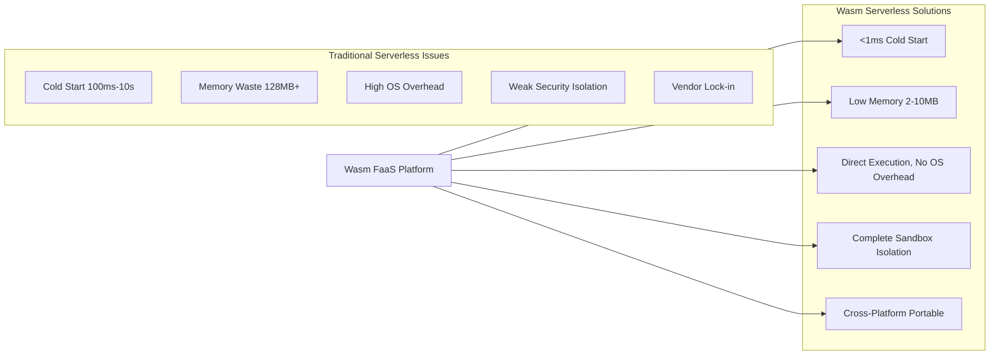
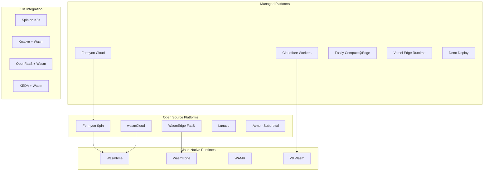
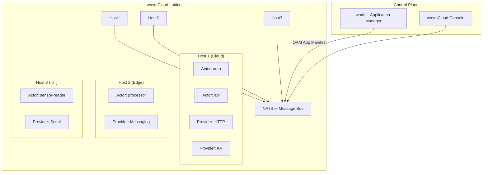
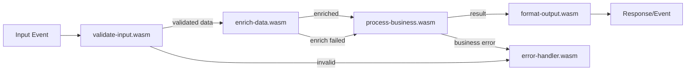
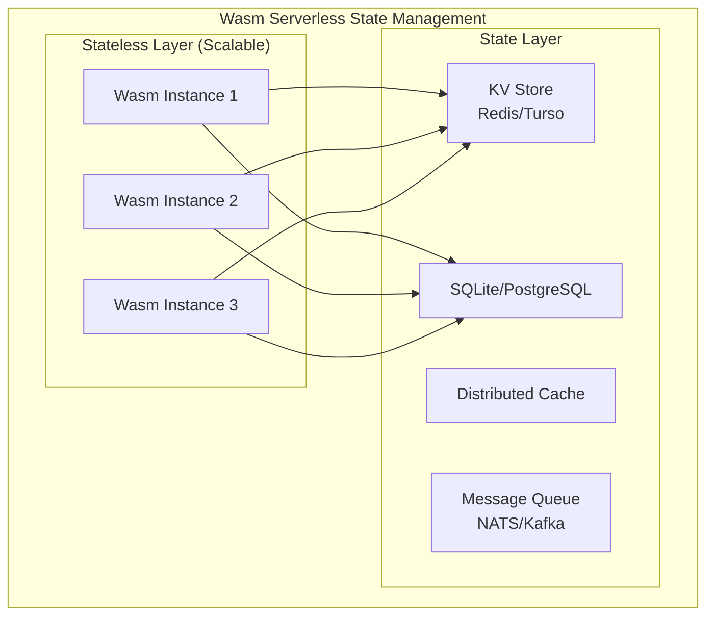

> **Production Safety Notice**
>
> This document contains directly executable operational commands. Before execution, confirm: whether the current target cluster and Namespace are correct; whether you have sufficient RBAC permissions; whether verification has been completed in a non-production environment. Command risk level marking: 🔴 High risk (may cause data loss or service interruption), 🟡 Medium risk (will modify cluster state but usually reversible), 🟢 Low risk/Read-only (information gathering, no side effects).

# Wasm Serverless

> WebAssembly brings millisecond cold starts, sandbox isolation, and ultra-lightweight deployment to serverless computing, redefining edge and cloud FaaS architecture.

---

<!-- chunk: Table of Contents -->## Table of Contents

1. [Wasm Serverless Architecture Overview](#1-wasm-serverless-architecture-overview)
2. [Cold Start Optimization Principles](#2-cold-start-optimization-principles)
3. [[entities/spin.md|Spin]] Framework Deep Dive](#3-spin-framework-deep-dive)
4. [wasmCloud Platform](#4-wasmcloud-platform)
5. [Fermyon Cloud Deployment](#5-fermyon-cloud-deployment)
6. [Event Trigger System](#6-event-trigger-system)
7. [Scale-to-Zero Implementation](#7-scale-to-zero-implementation)
8. [FaaS Design Patterns](#8-faas-design-patterns)
9. [Stateful Serverless](#9-stateful-serverless)
10. [Multi-Cloud Serverless Deployment](#10-multi-cloud-serverless-deployment)
11. [Serverless Observability](#11-serverless-observability)
12. [Edge Serverless](#12-edge-serverless)
13. [Performance Benchmarks and Comparison](#13-performance-benchmarks-and-comparison)
14. [Production Operations Best Practices](#14-production-operations-best-practices)

---

<!-- chunk: 1. Wasm Serverless Architecture Overview -->## 1. Wasm Serverless Architecture Overview

## 1.1 Traditional Serverless Limitations



## 1.2 Wasm Serverless Ecosystem Landscape



## 1.3 Core Technical Metrics Comparison

```
# 🟢 Low Risk: Read-only/information gathering, typically no side effects
Serverless Platform Comparison (2025):

┌──────────────────────────────────────────────────────────────┐
│ Platform           │ Cold Start  │ Memory/Inst │ Max Exec │ Price    │
├──────────────────────────────────────────────────────────────┤
│ AWS Lambda         │ 100ms+      │ 128MB+      │ 15min    │ $0.20/M  │
│ Google Cloud Run   │ 200ms+      │ 128MB+      │ 60min    │ $0.40/M  │
│ Cloudflare Workers │ <1ms        │ 128MB       │ 30s      │ $0.50/M  │
│ Fermyon Spin       │ <1ms        │ 10-50MB     │ Unlimited│ Self-host│
│ wasmCloud          │ <1ms        │ 2-20MB      │ Unlimited│ Self-host│
│ Fastly Compute     │ <1ms        │ 64MB        │ 30s      │ $0.50/M  │
│ Deno Deploy        │ <50ms       │ 512MB       │ Unlimited│ $0.30/M  │
└──────────────────────────────────────────────────────────────┘
```

---

<!-- chunk: 2. Cold Start Optimization Principles -->## 2. Cold Start Optimization Principles

## 2.1 Traditional Container vs Wasm Cold Start

```mermaid
graph TD
    subgraph "Container Cold Start Path ~500ms-10s"
        Pull[Image Pull 1-30s]
        Create[Container Create 50ms]
        Network[Network Config 100ms]
        Runtime[Runtime Start 100ms]
        App[App Initialization 100ms-5s]
    end

    subgraph "Wasm Cold Start Path <1ms"
        Load[Wasm Module Load 0.1ms]
        Compile[Compile/AOT Load 0.2ms]
        Init[WASI Initialize 0.1ms]
        Start[_start() Execute 0.05ms]
    end

    subgraph "Optimization Techniques"
        AOT[AOT Precompilation]
        Lazy[Lazy Load Functions]
        Snapshot[Snapshot/Fork]
        Pool[Instance Warm Pool]
    end

    WasmColdStart --> AOT
    WasmColdStart --> Lazy
    WasmColdStart --> Snapshot
    WasmColdStart --> Pool
```

## 2.2 AOT Precompilation Optimization

```rust
// wasmtime AOT precompilation and caching
use wasmtime::{Engine, Config, OptLevel};
use std::path::Path;

pub struct WasmRuntime {
    engine: Engine,
    cache_dir: String,
}

impl WasmRuntime {
    pub fn new(cache_dir: &str) -> anyhow::Result<Self> {
        let mut config = Config::new();
        config.wasm_component_model(true);
        
        // AOT optimization configuration
        config.cranelift_opt_level(OptLevel::Speed);
        config.parallel_compilation(true);
        config.memory_init_cow(true);  // Copy-on-Write memory initialization
        config.memory_guaranteed_dense_image_size(16 * 1024 * 1024);
        
        // Enable epoch-based interruption
        config.epoch_interruption(true);
        
        Ok(Self {
            engine: Engine::new(&config)?,
            cache_dir: cache_dir.to_string(),
        })
    }

    pub fn precompile_and_cache(
        &self,
        wasm_path: &str,
    ) -> anyhly::Result<String> {
        let cache_path = format!(
            "{}/{}.cwasm",
            self.cache_dir,
            sha256_file(wasm_path)?
        );

        if Path::new(&cache_path).exists() {
            println!("Using cached AOT: {}", cache_path);
            return Ok(cache_path);
        }

        println!("Precompiling {}...", wasm_path);
        let start = std::time::Instant::now();

        let wasm_bytes = std::fs::read(wasm_path)?;
        let component = wasmtime::component::Component::new(&self.engine, &wasm_bytes)?;
        let serialized = component.serialize()?;

        std::fs::create_dir_all(&self.cache_dir)?;
        std::fs::write(&cache_path, &serialized)?;

        println!("Precompiled in {:?}: {}", start.elapsed(), cache_path);
        Ok(cache_path)
    }

    pub fn load_precompiled(
        &self,
        cache_path: &str,
    ) -> anyhly::Result<wasmtime::component::Component> {
        let start = std::time::Instant::now();

        // Load precompiled module (unsafe: must trust source)
        let component = unsafe {
            wasmtime::component::Component::deserialize_file(&self.engine, cache_path)?
        };

        println!("Loaded precompiled in {:?}", start.elapsed());
        Ok(component)
    }
}

fn sha256_file(path: &str) -> anyhly::Result<String> {
    use std::io::Read;
    let mut file = std::fs::File::open(path)?;
    let mut hasher = sha2::Sha256::new();
    let mut buffer = [0u8; 8192];

    loop {
        let n = file.read(&mut buffer)?;
        if n == 0 { break; }
        sha2::Digest::update(&mut hasher, &buffer[..n]);
    }

    Ok(format!("{:x}", sha2::Digest::finalize(hasher)))
}
```

## 2.3 Instance Warm Pool Implementation

```rust
// Instance warm pool implementation
use std::sync::Arc;
use tokio::sync::{Mutex, Semaphore};
use std::collections::VecDeque;

pub struct InstancePool {
    available: Arc<Mutex<VecDeque<WarmInstance>>>,
    semaphore: Arc<Semaphore>,
    component: Arc<wasmtime::component::Component>,
    engine: Arc<wasmtime::Engine>,
    config: PoolConfig,
}

pub struct WarmInstance {
    store: wasmtime::Store<InstanceState>,
    instance: wasmtime::component::Instance,
    created_at: std::time::Instant,
    use_count: u32,
}

#[derive(Clone)]
pub struct PoolConfig {
    min_warm: usize,     // Minimum warm instances
    max_size: usize,     // Maximum pool size
    max_age_secs: u64,   // Maximum instance age
    max_uses: u32,       // Maximum instance uses
    warmup_interval_ms: u64,  // Warmup interval
}

impl InstancePool {
    pub async fn new(
        component: Arc<wasmtime::component::Component>,
        engine: Arc<wasmtime::Engine>,
        config: PoolConfig,
    ) -> anyhly::Result<Arc<Self>> {
        let pool = Arc::new(Self {
            available: Arc::new(Mutex::new(VecDeque::new())),
            semaphore: Arc::new(Semaphore::new(config.max_size)),
            component,
            engine,
            config: config.clone(),
        });

        // Pre-warm initial instances
        let pool_clone = pool.clone();
        tokio::spawn(async move {
            pool_clone.warmup_loop().await;
        });

        Ok(pool)
    }

    async fn warmup_loop(&self) {
        loop {
            let current_size = self.available.lock().await.len();

            if current_size < self.config.min_warm {
                let to_create = self.config.min_warm - current_size;
                for _ in 0..to_create {
                    match self.create_instance().await {
                        Ok(instance) => {
                            self.available.lock().await.push_back(instance);
                            println!("Created warm instance, pool size: {}",
                                self.available.lock().await.len());
                        }
                        Err(e) => eprintln!("Failed to create warm instance: {}", e),
                    }
                }
            }

            // Clean up expired instances
            self.cleanup_expired().await;

            tokio::time::sleep(
                tokio::time::Duration::from_millis(self.config.warmup_interval_ms)
            ).await;
        }
    }

    async fn cleanup_expired(&self) {
        let mut pool = self.available.lock().await;
        let now = std::time::Instant::now();

        pool.retain(|instance| {
            let age = now.duration_since(instance.created_at).as_secs();
            let too_old = age > self.config.max_age_secs;
            let too_used = instance.use_count >= self.config.max_uses;
            !too_old && !too_used
        });
    }

    pub async fn acquire(&self) -> anyhly::Result<WarmInstance> {
        // Try to get from pool
        {
            let mut pool = self.available.lock().await;
            if let Some(instance) = pool.pop_front() {
                return Ok(instance);
            }
        }

        // Pool empty, create new instance
        self.create_instance().await
    }

    pub async fn release(&self, mut instance: WarmInstance) {
        instance.use_count += 1;

        // Check if instance can be reused
        let age = instance.created_at.elapsed().as_secs();
        if age < self.config.max_age_secs && instance.use_count < self.config.max_uses {
            let pool_size = self.available.lock().await.len();
            if pool_size < self.config.max_size {
                self.available.lock().await.push_back(instance);
                return;
            }
        }

        // Drop instance (automatic cleanup)
        drop(instance);
    }

    async fn create_instance(&self) -> anyhly::Result<WarmInstance> {
        let start = std::time::Instant::now();

        let wasi = wasmtime_wasi::WasiCtxBuilder::new()
            .inherit_stdio()
            .build();

        let mut store = wasmtime::Store::new(
            &self.engine,
            InstanceState { wasi },
        );
        store.set_epoch_deadline(10);  // Prevent infinite loops

        let mut linker = wasmtime::component::Linker::new(&self.engine);
        wasmtime_wasi::add_to_linker_sync(&mut linker)?;

        let instance = linker.instantiate(&mut store, &self.component)?;

        println!("Instance created in {:?}", start.elapsed());

        Ok(WarmInstance {
            store,
            instance,
            created_at: std::time::Instant::now(),
            use_count: 0,
        })
    }
}

struct InstanceState {
    wasi: wasmtime_wasi::WasiCtx,
}

impl wasmtime_wasi::WasiView for InstanceState {
    fn ctx(&mut self) -> &mut wasmtime_wasi::WasiCtx { &mut self.wasi }
    fn table(&mut self) -> &mut wasmtime_wasi::ResourceTable {
        unimplemented!()
    }
}
```

## 2.4 Cold Start Time Measurement

```rust
// Cold start benchmark testing
use std::time::{Duration, Instant};

async fn benchmark_cold_start(
    engine: &wasmtime::Engine,
    wasm_path: &str,
    n_runs: u32,
) -> BenchResult {
    let mut latencies = Vec::with_capacity(n_runs as usize);

    for _ in 0..n_runs {
        let start = Instant::now();

        // Load module
        let bytes = std::fs::read(wasm_path).unwrap();
        let component = wasmtime::component::Component::new(engine, &bytes).unwrap();

        // Instantiate
        let wasi = wasmtime_wasi::WasiCtxBuilder::new().build();
        let mut store = wasmtime::Store::new(engine, wasi);
        let mut linker = wasmtime::component::Linker::new(engine);
        wasmtime_wasi::add_to_linker_sync(&mut linker).unwrap();
        let instance = linker.instantiate(&mut store, &component).unwrap();

        // Call entry function
        if let Some(func) = instance.get_func(&mut store, "handle") {
            let mut result = vec![];
            func.call(&mut store, &[], &mut result).unwrap();
        }

        latencies.push(start.elapsed());
    }

    latencies.sort();

    BenchResult {
        min: *latencies.first().unwrap(),
        max: *latencies.last().unwrap(),
        p50: latencies[n_runs as usize / 2],
        p90: latencies[n_runs as usize * 9 / 10],
        p99: latencies[n_runs as usize * 99 / 100],
        mean: latencies.iter().sum::<Duration>() / n_runs,
    }
}

#[derive(Debug)]
struct BenchResult {
    min: Duration,
    max: Duration,
    p50: Duration,
    p90: Duration,
    p99: Duration,
    mean: Duration,
}
```

---

<!-- chunk: 3. Spin Framework Deep Dive -->## 3. Spin Framework Deep Dive

## 3.1 Spin Installation and Project Creation

```bash
# Install Spin CLI
curl -fsSL https://developer.fermyon.com/downloads/install.sh | bash
sudo mv spin /usr/local/bin/

# Verify installation
spin --version

# Install templates
spin templates install --git https://github.com/fermyon/spin-python-sdk
spin templates install --git https://github.com/fermyon/spin-js-sdk

# List available templates
spin templates list

# Create HTTP service
spin new -t http-rust my-api
cd my-api

# Create Redis consumer
spin new -t redis-rust my-consumer

# Build
spin build

# Run locally
spin up

# Run with environment variables
spin up \
  --env "DATABASE_URL=postgres://..." \
  --env "API_KEY=secret-key"
```

## 3.2 spin.toml Configuration Deep Dive

```toml
# spin.toml - Complete configuration example
spin_manifest_version = 2

[application]
name = "my-microservices"
version = "1.0.0"
description = "Multi-component Wasm microservices"
authors = ["team@example.com"]

# Global variables
[application.variables]
database_url = { required = true }
redis_url = { required = false, default = "redis://localhost:6379" }
log_level = { required = false, default = "info" }
feature_flags = { required = false, default = "{}" }

# HTTP API component
[[trigger.http]]
route = "/api/..."
component = "api-handler"

[component.api-handler]
source = "components/api-handler/target/wasm32-wasi/release/api_handler.wasm"
description = "Main HTTP API handler"

# WASI allow configuration
[component.api-handler.build]
command = "cargo build --target wasm32-wasi --release"
workdir = "components/api-handler"
watch = ["src/**/*.rs", "Cargo.toml"]

[component.api-handler.trigger]
executor = { type = "wagi" }  # or "default" for Spin HTTP

# Allowed outbound hosts
[component.api-handler.allowed_outbound_hosts]
allowed_hosts = [
  "https://api.stripe.com",
  "https://*.auth0.com",
  "redis://localhost:6379",
]

# Key-value stores
[component.api-handler.key_value_stores]
default = { label = "default" }
sessions = { label = "sessions" }

# SQLite databases
[component.api-handler.sqlite_databases]
default = { label = "default" }

# Environment variables
[component.api-handler.environment]
LOG_LEVEL = "{{ log_level }}"
DATABASE_URL = "{{ database_url }}"
FEATURE_FLAGS = "{{ feature_flags }}"

# File mounts
[component.api-handler.files]
templates = { path = "templates/", destination = "/templates" }
assets = { path = "assets/", destination = "/assets" }

# -----------------------------------------------
# Auth sub-service
[[trigger.http]]
route = "/auth/..."
component = "auth-service"

[component.auth-service]
source = "components/auth/target/wasm32-wasi/release/auth.wasm"

[component.auth-service.allowed_outbound_hosts]
allowed_hosts = ["https://auth.example.com"]

[component.auth-service.key_value_stores]
tokens = { label = "tokens" }

# -----------------------------------------------
# Async task processor (Redis trigger)
[[trigger.redis]]
channel = "tasks"
component = "task-processor"

[component.task-processor]
source = "components/task-processor/target/wasm32-wasi/release/task_processor.wasm"
description = "Async task processor"

[component.task-processor.allowed_outbound_hosts]
allowed_hosts = ["https://notifications.example.com"]

# -----------------------------------------------
# Scheduled job (Cron trigger)
[[trigger.cron]]
cron_expression = "0 */5 * * * *"  # Every 5 minutes
component = "cleanup-job"

[component.cleanup-job]
source = "components/cleanup/target/wasm32-wasi/release/cleanup.wasm"
```

## 3.3 Complete Spin HTTP API Implementation

```rust
// components/api-handler/src/lib.rs
use spin_sdk::{
    http::{IncomingRequest, OutgoingResponse, ResponseBuilder, Router},
    http_component,
    key_value::Store,
    sqlite::{Connection, Value},
    variables,
};
use serde::{Deserialize, Serialize};

#[derive(Debug, Serialize, Deserialize)]
struct User {
    id: String,
    name: String,
    email: String,
    created_at: u64,
}

#[derive(Debug, Deserialize)]
struct CreateUserRequest {
    name: String,
    email: String,
}

#[derive(Debug, Serialize)]
struct ApiResponse<T> {
    success: bool,
    data: Option<T>,
    error: Option<String>,
    request_id: String,
}

impl<T: Serialize> ApiResponse<T> {
    fn ok(data: T, request_id: &str) -> Self {
        Self {
            success: true,
            data: Some(data),
            error: None,
            request_id: request_id.to_string(),
        }
    }

    fn error(msg: &str, request_id: &str) -> ApiResponse<()> {
        ApiResponse {
            success: false,
            data: None,
            error: Some(msg.to_string()),
            request_id: request_id.to_string(),
        }
    }
}

// Use Spin HTTP component macro
#[http_component]
async fn handle_request(req: IncomingRequest) -> anyhly::Result<OutgoingResponse> {
    let router = Router::new()
        .get("/api/users", list_users)
        .get("/api/users/:id", get_user)
        .post("/api/users", create_user)
        .put("/api/users/:id", update_user)
        .delete("/api/users/:id", delete_user)
        .get("/api/health", health_check);

    router.handle(req).await
}

async fn list_users(req: IncomingRequest) -> anyhly::Result<OutgoingResponse> {
    let request_id = get_or_generate_request_id(&req);

    // Query from SQLite
    let conn = Connection::open_default()?;
    let rows = conn.execute(
        "SELECT id, name, email, created_at FROM users ORDER BY created_at DESC LIMIT 100",
        &[],
    )?;

    let users: Vec<User> = rows.rows().map(|row| User {
        id: row.get::<&str>(0).unwrap_or("").to_string(),
        name: row.get::<&str>(1).unwrap_or("").to_string(),
        email: row.get::<&str>(2).unwrap_or("").to_string(),
        created_at: row.get::<u64>(3).unwrap_or(0),
    }).collect();

    let response = ApiResponse::ok(users, &request_id);
    
    Ok(ResponseBuilder::new(200)
        .header("content-type", "application/json")
        .header("x-request-id", &request_id)
        .body(serde_json::to_vec(&response)?)
        .build())
}

async fn get_user(req: IncomingRequest) -> anyhly::Result<OutgoingResponse> {
    let request_id = get_or_generate_request_id(&req);
    let user_id = req.path_param("id").unwrap_or_default();

    // Check cache first
    let cache = Store::open_default()?;
    let cache_key = format!("user:{}", user_id);

    if let Some(cached) = cache.get(&cache_key)? {
        let user: User = serde_json::from_slice(&cached)?;
        return Ok(ResponseBuilder::new(200)
            .header("content-type", "application/json")
            .header("x-cache", "HIT")
            .header("x-request-id", &request_id)
            .body(serde_json::to_vec(&ApiResponse::ok(user, &request_id))?)
            .build());
    }

    // Query from database
    let conn = Connection::open_default()?;
    let rows = conn.execute(
        "SELECT id, name, email, created_at FROM users WHERE id = ?",
        &[Value::Text(user_id.clone())],
    )?;

    if rows.rows().count() == 0 {
        return Ok(ResponseBuilder::new(404)
            .header("content-type", "application/json")
            .body(serde_json::to_vec(&ApiResponse::<()>::error(
                &format!("User {} not found", user_id),
                &request_id,
            ))?)
            .build());
    }

    let user = rows.rows().next().map(|row| User {
        id: row.get::<&str>(0).unwrap_or("").to_string(),
        name: row.get::<&str>(1).unwrap_or("").to_string(),
        email: row.get::<&str>(2).unwrap_or("").to_string(),
        created_at: row.get::<u64>(3).unwrap_or(0),
    }).unwrap();

    // Write to cache (TTL 300s)
    cache.set(&cache_key, &serde_json::to_vec(&user)?)?;

    Ok(ResponseBuilder::new(200)
        .header("content-type", "application/json")
        .header("x-cache", "MISS")
        .header("x-request-id", &request_id)
        .body(serde_json::to_vec(&ApiResponse::ok(user, &request_id))?)
        .build())
}

async fn create_user(req: IncomingRequest) -> anyhly::Result<OutgoingResponse> {
    let request_id = get_or_generate_request_id(&req);

    // Read and parse request body
    let body = req.body().await?;
    let create_req: CreateUserRequest = match serde_json::from_slice(&body) {
        Ok(r) => r,
        Err(e) => {
            return Ok(ResponseBuilder::new(400)
                .header("content-type", "application/json")
                .body(serde_json::to_vec(&ApiResponse::<()>::error(
                    &format!("Invalid request body: {}", e),
                    &request_id,
                ))?)
                .build());
        }
    };

    // Validation
    if create_req.name.trim().is_empty() {
        return Ok(ResponseBuilder::new(400)
            .header("content-type", "application/json")
            .body(serde_json::to_vec(&ApiResponse::<()>::error("Name is required", &request_id))?)
            .build());
    }

    if !create_req.email.contains('@') {
        return Ok(ResponseBuilder::new(400)
            .header("content-type", "application/json")
            .body(serde_json::to_vec(&ApiResponse::<()>::error("Invalid email format", &request_id))?)
            .build());
    }

    // Generate ID
    let user_id = generate_user_id(&create_req.name, &create_req.email);
    let now = current_timestamp();

    // Write to database
    let conn = Connection::open_default()?;
    conn.execute(
        "INSERT INTO users (id, name, email, created_at) VALUES (?, ?, ?, ?)",
        &[
            Value::Text(user_id.clone()),
            Value::Text(create_req.name.clone()),
            Value::Text(create_req.email.clone()),
            Value::Integer(now as i64),
        ],
    )?;

    let user = User {
        id: user_id,
        name: create_req.name,
        email: create_req.email,
        created_at: now,
    };

    // Publish event (async notification)
    publish_event("user.created", &user)?;

    Ok(ResponseBuilder::new(201)
        .header("content-type", "application/json")
        .header("x-request-id", &request_id)
        .body(serde_json::to_vec(&ApiResponse::ok(user, &request_id))?)
        .build())
}

async fn update_user(req: IncomingRequest) -> anyhly::Result<OutgoingResponse> {
    let request_id = get_or_generate_request_id(&req);
    let user_id = req.path_param("id").unwrap_or_default();
    let body = req.body().await?;
    
    // ... update logic (similar to create_user)

    // Invalidate cache
    let cache = Store::open_default()?;
    cache.delete(&format!("user:{}", user_id))?;

    Ok(ResponseBuilder::new(200)
        .header("content-type", "application/json")
        .body(serde_json::to_vec(&ApiResponse::<()>::error("Not implemented", &request_id))?)
        .build())
}

async fn delete_user(req: IncomingRequest) -> anyhly::Result<OutgoingResponse> {
    let request_id = get_or_generate_request_id(&req);
    let user_id = req.path_param("id").unwrap_or_default();

    let conn = Connection::open_default()?;
    conn.execute(
        "DELETE FROM users WHERE id = ?",
        &[Value::Text(user_id.clone())],
    )?;

    // Invalidate cache
    let cache = Store::open_default()?;
    cache.delete(&format!("user:{}", user_id))?;

    Ok(ResponseBuilder::new(204)
        .header("x-request-id", &request_id)
        .body(vec![])
        .build())
}

async fn health_check(_req: IncomingRequest) -> anyhly::Result<OutgoingResponse> {
    let health = serde_json::json!({
        "status": "healthy",
        "version": env!("CARGO_PKG_VERSION"),
        "timestamp": current_timestamp(),
    });

    Ok(ResponseBuilder::new(200)
        .header("content-type", "application/json")
        .body(serde_json::to_vec(&health)?)
        .build())
}

fn get_or_generate_request_id(req: &IncomingRequest) -> String {
    req.header("x-request-id")
        .map(|v| v.to_string())
        .unwrap_or_else(|| generate_request_id())
}

fn generate_request_id() -> String {
    format!("req-{:016x}", current_timestamp())
}

fn generate_user_id(name: &str, email: &str) -> String {
    format!("usr-{:016x}", {
        use std::hash::{Hash, Hasher};
        let mut hasher = std::collections::hash_map::DefaultHasher::new();
        format!("{}{}{}", name, email, current_timestamp()).hash(&mut hasher);
        hasher.finish()
    })
}

fn current_timestamp() -> u64 {
    std::time::SystemTime::now()
        .duration_since(std::time::UNIX_EPOCH)
        .unwrap_or_default()
        .as_secs()
}

fn publish_event(event_type: &str, data: &impl Serialize) -> anyhly::Result<()> {
    // Use Spin outbound Redis to publish event
    let redis_url = variables::get("redis_url")?;
    let payload = serde_json::to_string(data)?;
    spin_sdk::redis::publish(&redis_url, event_type, payload.as_bytes())?;
    Ok(())
}
```

## 3.4 Spin Outbound HTTP Calls

```rust
// Initiate external HTTP requests in Spin components
use spin_sdk::http::{Method, Request, Response};

async fn call_external_api(
    url: &str,
    api_key: &str,
) -> anyhly::Result<serde_json::Value> {
    // Use Spin SDK's restricted HTTP client
    let request = Request::builder()
        .method(Method::Get)
        .uri(url)
        .header("Authorization", &format!("Bearer {}", api_key))
        .header("Content-Type", "application/json")
        .build();

    let response: Response = spin_sdk::http::send(request).await?;

    let status = response.status();
    if !status.is_success() {
        anyhly::bail!("External API error: {}", status);
    }

    let body = response.body();
    Ok(serde_json::from_slice(body)?)
}

// HTTP call with retry
async fn call_with_retry(
    url: &str,
    max_retries: u32,
    backoff_ms: u64,
) -> anyhly::Result<Response> {
    let mut last_error = None;

    for attempt in 0..=max_retries {
        if attempt > 0 {
            // Exponential backoff
            let wait = backoff_ms * 2u64.pow(attempt - 1);
            tokio::time::sleep(tokio::time::Duration::from_millis(wait)).await;
        }

        let request = Request::builder()
            .method(Method::Get)
            .uri(url)
            .build();

        match spin_sdk::http::send(request).await {
            Ok(resp) if resp.status().is_success() => return Ok(resp),
            Ok(resp) => {
                last_error = Some(anyhly::anyhly!("HTTP {}", resp.status()));
            }
            Err(e) => {
                last_error = Some(e.into());
            }
        }

        println!("Attempt {} failed, retrying...", attempt + 1);
    }

    Err(last_error.unwrap_or_else(|| anyhly::anyhly!("All retries exhausted")))
}
```

---

<!-- chunk: 4. wasmCloud Platform -->## 4. wasmCloud Platform

## 4.1 wasmCloud Architecture



## 4.2 wasmCloud Actor Development

```rust
// wasmCloud Actor example (using wasmcloud-actor SDK)
use wasmcloud_actor::{
    HttpRequest, HttpResponse, MessageDispatch,
    Context, Actor, ActorResult,
};

#[actor::main]
async fn main(ctx: &Context, req: HttpRequest) -> ActorResult<HttpResponse> {
    let path = &req.path;
    let method = &req.method;

    match (method.as_str(), path.as_str()) {
        ("GET", "/") => handle_root(ctx).await,
        ("POST", "/process") => handle_process(ctx, req).await,
        _ => Ok(HttpResponse::not_found()),
    }
}

async fn handle_root(ctx: &Context) -> ActorResult<HttpResponse> {
    // Get current time via Capability Provider
    let time: u64 = ctx.capability("wasmcloud:builtin:clock").await?
        .call("get_timestamp", &[]).await?
        .into();

    Ok(HttpResponse::json(serde_json::json!({
        "service": "wasmcloud-actor",
        "timestamp": time,
        "status": "ok"
    }))?)
}

async fn handle_process(ctx: &Context, req: HttpRequest) -> ActorResult<HttpResponse> {
    let body: serde_json::Value = serde_json::from_slice(&req.body)?;

    // Send message via Messaging Provider
    ctx.capability("wasmcloud:messaging")
        .await?
        .call("publish", &serde_json::json!({
            "subject": "jobs.process",
            "body": body,
        }))
        .await?;

    // Record state via KV Store Provider
    ctx.capability("wasmcloud:keyvalue")
        .await?
        .call("set", &serde_json::json!({
            "key": format!("job:{}", uuid_v4()),
            "value": "pending",
            "expires": 3600
        }))
        .await?;

    Ok(HttpResponse::json(serde_json::json!({
        "status": "accepted",
        "message": "Job queued for processing"
    }))?)
}

fn uuid_v4() -> String {
    format!("{:032x}", std::time::SystemTime::now()
        .duration_since(std::time::UNIX_EPOCH)
        .unwrap()
        .as_nanos())
}
```

## 4.3 OAM Application Manifest (wadm)

```yaml
# wasmcloud-app.yaml - Deploy application using OAM manifest
apiVersion: core.oam.dev/v1beta1
kind: Application
metadata:
  name: microservices-app
  annotations:
    version: v1.0.0
    description: "Multi-service wasmCloud application"

spec:
  components:
    # HTTP API Actor
    - name: api-handler
      type: actor
      properties:
        image: ghcr.io/my-org/api-handler:1.0.0
      traits:
        - type: spreadscaler
          properties:
            instances: 5  # 5 concurrent instances
            spread:
              - name: cloud-nodes
                requirements:
                  location: cloud
                weight: 80
              - name: edge-nodes
                requirements:
                  location: edge
                weight: 20

    # Auth Actor
    - name: auth-service
      type: actor
      properties:
        image: ghcr.io/my-org/auth-service:2.0.0
      traits:
        - type: spreadscaler
          properties:
            instances: 3

    # HTTP Server Capability Provider
    - name: http-server
      type: capability
      properties:
        image: ghcr.io/wasmcloud/http-server:0.20.0
        contract: wasmcloud:httpserver
        config:
          - name: default-http
            properties:
              address: "0.0.0.0:8080"

    # Redis KV Provider
    - name: redis-kv
      type: capability
      properties:
        image: ghcr.io/wasmcloud/keyvalue-redis:0.25.0
        contract: wasmcloud:keyvalue
        config:
          - name: redis-config
            properties:
              url: "redis://redis:6379"
              pool_size: "10"

    # NATS Messaging Provider
    - name: nats-messaging
      type: capability
      properties:
        image: ghcr.io/wasmcloud/messaging-nats:0.19.0
        contract: wasmcloud:messaging
        config:
          - name: nats-config
            properties:
              cluster_uris: "nats://nats:4222"

  # Link relationships
  links:
    - source: api-handler
      target: http-server
      namespace: wasmcloud
      package: httpserver
      interfaces:
        - incoming-handler

    - source: api-handler
      target: redis-kv
      namespace: wasmcloud
      package: keyvalue
      interfaces:
        - atomics
        - store

    - source: api-handler
      target: nats-messaging
      namespace: wasmcloud
      package: messaging
      interfaces:
        - consumer
        - producer
```

---

<!-- chunk: 5. Fermyon Cloud Deployment -->## 5. Fermyon Cloud Deployment

## 5.1 Deploy to Fermyon Cloud

```bash
# Login to Fermyon Cloud
spin cloud login

# Create application
spin cloud apps create my-serverless-app

# Deploy
spin cloud deploy

# View deployment status
spin cloud apps list
spin cloud logs my-serverless-app

# Manage variables
spin cloud variables set \
  --app my-serverless-app \
  DATABASE_URL="postgres://..." \
  API_KEY="secret"

# View current variables
spin cloud variables list --app my-serverless-app

# Custom domain
spin cloud domains add \
  --app my-serverless-app \
  api.mycompany.com

# View metrics
spin cloud metrics \
  --app my-serverless-app \
  --since 1h
```

## 5.2 Multi-Environment Deployment

```bash
# Development environment
spin cloud deploy \
  --app my-app-dev \
  --from spin.toml \
  --variable-file .env.dev

# Staging environment
spin cloud deploy \
  --app my-app-staging \
  --from spin.toml \
  --variable-file .env.staging

# Production environment
spin cloud deploy \
  --app my-app-prod \
  --from spin.toml \
  --variable-file .env.prod

# Blue-green deployment
spin cloud deploy \
  --app my-app-prod-green \
  --from spin.toml

# Traffic switch
spin cloud routes set \
  --app my-app-prod \
  --target my-app-prod-green \
  --weight 100
```

---

<!-- chunk: 6. Event Trigger System -->## 6. Event Trigger System

## 6.1 Multiple Trigger Types

```toml
# Configure various triggers in spin.toml

# HTTP trigger
[[trigger.http]]
route = "/api/{path:...}"
component = "http-handler"

# Redis subscription trigger
[[trigger.redis]]
channel = "user-events"
component = "user-event-processor"

[[trigger.redis]]
channel = "payment-events"
component = "payment-processor"

# Cron schedule trigger
[[trigger.cron]]
cron_expression = "0 0 * * *"    # Daily at midnight
component = "daily-report"

[[trigger.cron]]
cron_expression = "*/5 * * * *"  # Every 5 minutes
component = "metrics-aggregator"

# MQTT trigger (IoT)
[[trigger.mqtt]]
address = "mqtt://broker:1883"
topic = "sensors/#"
component = "sensor-processor"
```

## 6.2 Redis Event Processor

```rust
// components/event-processor/src/lib.rs
use spin_sdk::{
    redis::{Payload, RedisParameter},
    redis_component,
    key_value::Store,
    http::{Request, Method},
};
use serde::{Deserialize, Serialize};

#[derive(Debug, Deserialize)]
struct UserEvent {
    event_type: String,
    user_id: String,
    data: serde_json::Value,
    timestamp: u64,
}

#[derive(Debug, Serialize)]
struct NotificationPayload {
    user_id: String,
    message: String,
    channel: String,
}

// Redis component macro
#[redis_component]
async fn process_user_event(payload: Payload) -> anyhly::Result<()> {
    // Parse event
    let event: UserEvent = serde_json::from_slice(&payload)?;
    
    println!(
        "Processing event: type={} user={} ts={}",
        event.event_type, event.user_id, event.timestamp
    );

    match event.event_type.as_str() {
        "user.created" => {
            handle_user_created(&event).await?;
        }
        "user.updated" => {
            handle_user_updated(&event).await?;
        }
        "user.deleted" => {
            handle_user_deleted(&event).await?;
        }
        _ => {
            println!("Unknown event type: {}", event.event_type);
        }
    }

    Ok(())
}

async fn handle_user_created(event: &UserEvent) -> anyhly::Result<()> {
    // 1. Send welcome email
    let notification = NotificationPayload {
        user_id: event.user_id.clone(),
        message: "Welcome to our platform!".to_string(),
        channel: "email".to_string(),
    };

    send_notification(&notification).await?;

    // 2. Initialize user quotas
    let store = Store::open_default()?;
    store.set(
        &format!("quota:{}", event.user_id),
        &serde_json::to_vec(&serde_json::json!({
            "api_calls": 1000,
            "storage_mb": 100,
            "reset_at": event.timestamp + 86400,
        }))?,
    )?;

    // 3. Trigger welcome workflow
    trigger_workflow("welcome-flow", &event.user_id).await?;

    println!("User created handler completed: {}", event.user_id);
    Ok(())
}

async fn handle_user_updated(event: &UserEvent) -> anyhly::Result<()> {
    // Invalidate related caches
    let store = Store::open_default()?;
    store.delete(&format!("user:{}", event.user_id))?;
    store.delete(&format!("user_perms:{}", event.user_id))?;

    println!("User updated, cache invalidated: {}", event.user_id);
    Ok(())
}

async fn handle_user_deleted(event: &UserEvent) -> anyhly::Result<()> {
    // Clean up all user-related data
    let store = Store::open_default()?;
    let keys_to_delete = vec![
        format!("user:{}", event.user_id),
        format!("user_perms:{}", event.user_id),
        format!("quota:{}", event.user_id),
        format!("session:{}", event.user_id),
    ];

    for key in keys_to_delete {
        store.delete(&key)?;
    }

    // Notify other systems
    send_notification(&NotificationPayload {
        user_id: event.user_id.clone(),
        message: "Your account has been deleted.".to_string(),
        channel: "email".to_string(),
    }).await?;

    Ok(())
}

async fn send_notification(notif: &NotificationPayload) -> anyhly::Result<()> {
    let notification_url = spin_sdk::variables::get("notification_service_url")?;

    let request = Request::builder()
        .method(Method::Post)
        .uri(&format!("{}/v1/notifications", notification_url))
        .header("Content-Type", "application/json")
        .body(serde_json::to_vec(notif)?)
        .build();

    spin_sdk::http::send(request).await?;
    Ok(())
}

async fn trigger_workflow(workflow_name: &str, user_id: &str) -> anyhly::Result<()> {
    let workflow_url = spin_sdk::variables::get("workflow_service_url")?;

    let request = Request::builder()
        .method(Method::Post)
        .uri(&format!("{}/v1/workflows/{}", workflow_url, workflow_name))
        .header("Content-Type", "application/json")
        .body(serde_json::to_vec(&serde_json::json!({
            "user_id": user_id,
            "triggered_at": current_timestamp(),
        }))?)
        .build();

    spin_sdk::http::send(request).await?;
    Ok(())
}

fn current_timestamp() -> u64 {
    std::time::SystemTime::now()
        .duration_since(std::time::UNIX_EPOCH)
        .unwrap_or_default()
        .as_secs()
}
```

## 6.3 Cron Scheduled Job

```rust
// components/metrics-aggregator/src/lib.rs
use spin_sdk::{cron_component, sqlite::Connection, key_value::Store};
use serde::{Deserialize, Serialize};

#[derive(Debug, Serialize)]
struct MetricSummary {
    window_start: u64,
    window_end: u64,
    total_requests: i64,
    avg_latency_ms: f64,
    p99_latency_ms: f64,
    error_count: i64,
    error_rate: f64,
}

#[cron_component]
async fn aggregate_metrics() -> anyhly::Result<()> {
    let now = current_timestamp();
    let window_start = now - 300;  // Last 5 minutes

    println!("Aggregating metrics for window: {} - {}", window_start, now);

    let conn = Connection::open_default()?;

    // Aggregate request stats
    let result = conn.execute(
        "SELECT 
            COUNT(*) as total,
            AVG(latency_ms) as avg_latency,
            MAX(CASE WHEN row_num = CAST(0.99 * total AS INTEGER) THEN latency_ms END) as p99,
            SUM(CASE WHEN status_code >= 400 THEN 1 ELSE 0 END) as errors
         FROM (
             SELECT latency_ms, status_code,
                    ROW_NUMBER() OVER (ORDER BY latency_ms) as row_num,
                    COUNT(*) OVER () as total
             FROM request_logs
             WHERE created_at >= ? AND created_at < ?
         )",
        &[
            spin_sdk::sqlite::Value::Integer(window_start as i64),
            spin_sdk::sqlite::Value::Integer(now as i64),
        ],
    )?;

    if let Some(row) = result.rows().next() {
        let total: i64 = row.get(0).unwrap_or(0);
        let avg_latency: f64 = row.get(1).unwrap_or(0.0);
        let p99_latency: f64 = row.get(2).unwrap_or(0.0);
        let errors: i64 = row.get(3).unwrap_or(0);

        let summary = MetricSummary {
            window_start,
            window_end: now,
            total_requests: total,
            avg_latency_ms: avg_latency,
            p99_latency_ms: p99_latency,
            error_count: errors,
            error_rate: if total > 0 { errors as f64 / total as f64 } else { 0.0 },
        };

        // Write aggregated result
        conn.execute(
            "INSERT INTO metric_summaries (window_start, window_end, data) VALUES (?, ?, ?)",
            &[
                spin_sdk::sqlite::Value::Integer(window_start as i64),
                spin_sdk::sqlite::Value::Integer(now as i64),
                spin_sdk::sqlite::Value::Text(serde_json::to_string(&summary)?),
            ],
        )?;

        // Store in KV for quick access
        let store = Store::open_default()?;
        store.set("metrics:latest", &serde_json::to_vec(&summary)?)?;

        println!("Metrics aggregated: total={} avg={:.2}ms errors={}", 
            total, avg_latency, errors);

        // Check alert conditions
        if summary.error_rate > 0.05 {
            trigger_alert("high_error_rate", &summary).await?;
        }
        if summary.p99_latency_ms > 1000.0 {
            trigger_alert("high_latency", &summary).await?;
        }
    }

    Ok(())
}

async fn trigger_alert(alert_type: &str, summary: &MetricSummary) -> anyhly::Result<()> {
    println!("ALERT: {} - error_rate={:.2}% p99={:.0}ms",
        alert_type, summary.error_rate * 100.0, summary.p99_latency_ms);

    // Send alert to PagerDuty/Slack
    let webhook_url = spin_sdk::variables::get("alert_webhook_url")?;
    let payload = serde_json::json!({
        "alert_type": alert_type,
        "severity": if summary.error_rate > 0.1 { "critical" } else { "warning" },
        "summary": summary,
    });

    let request = spin_sdk::http::Request::builder()
        .method(spin_sdk::http::Method::Post)
        .uri(&webhook_url)
        .header("Content-Type", "application/json")
        .body(serde_json::to_vec(&payload)?)
        .build();

    spin_sdk::http::send(request).await?;
    Ok(())
}

fn current_timestamp() -> u64 {
    std::time::SystemTime::now()
        .duration_since(std::time::UNIX_EPOCH)
        .unwrap_or_default()
        .as_secs()
}
```

---

<!-- chunk: 7. Scale-to-Zero Implementation -->## 7. Scale-to-Zero Implementation

## 7.1 Knative + Wasm Scale-to-Zero

```yaml
# knative-wasm-service.yaml
apiVersion: serving.knative.dev/v1
kind: Service
metadata:
  name: wasm-serverless
  namespace: default
  annotations:
    # Wasm runtime
    runtime.knative.dev/wasm: "true"
spec:
  template:
    metadata:
      annotations:
        # Scale-to-zero configuration
        autoscaling.knative.dev/class: "kpa.autoscaling.knative.dev"
        autoscaling.knative.dev/target: "100"        # Concurrency target per instance
        autoscaling.knative.dev/min-scale: "0"       # Scale to zero
        autoscaling.knative.dev/max-scale: "100"     # Maximum instances
        autoscaling.knative.dev/scale-to-zero-pod-retention-period: "60s"
        autoscaling.knative.dev/initial-scale: "1"
        autoscaling.knative.dev/scale-down-delay: "30s"
        
        # Warm-up configuration (reduce cold start impact)
        autoscaling.knative.dev/target-burst-capacity: "200"
    
    spec:
      # Wasm runtime class
      runtimeClassName: wasmedge
      
      # Very short timeout (Wasm starts fast)
      timeoutSeconds: 30
      
      containers:
        - name: wasm-service
          image: ghcr.io/my-org/my-wasm-service:1.0.0
          
          resources:
            requests:
              cpu: "10m"      # Very low CPU requirement for Wasm
              memory: "16Mi"  # Very low memory requirement
            limits:
              cpu: "1"
              memory: "128Mi"
          
          env:
            - name: PORT
              value: "8080"
          
          readinessProbe:
            httpGet:
              path: /health
              port: 8080
            initialDelaySeconds: 0  # Wasm almost instant start
            periodSeconds: 1
            successThreshold: 1
            failureThreshold: 3

---
# KEDA queue-depth-based autoscaling
apiVersion: keda.sh/v1alpha1
kind: ScaledObject
metadata:
  name: wasm-queue-scaler
  namespace: default
spec:
  scaleTargetRef:
    name: wasm-worker
  minReplicaCount: 0
  maxReplicaCount: 50
  cooldownPeriod: 60
  
  triggers:
    - type: redis
      metadata:
        host: redis-master.default.svc.cluster.local
        port: "6379"
        listName: "job-queue"
        listLength: "5"   # Start one instance per 5 tasks
```

## 7.2 Adaptive Warm Pool Strategy

```rust
// Adaptive instance warm pool manager
use std::sync::atomic::{AtomicU64, Ordering};
use std::sync::Arc;

struct AdaptiveWarmPoolManager {
    pool: Arc<InstancePool>,
    stats: Arc<TrafficStats>,
    config: AdaptiveConfig,
}

struct TrafficStats {
    requests_per_second: AtomicU64,
    cold_starts: AtomicU64,
    total_requests: AtomicU64,
}

#[derive(Clone)]
struct AdaptiveConfig {
    min_warm_instances: usize,
    max_warm_instances: usize,
    target_cold_start_rate: f64,  // Target cold start rate (0.0-1.0)
    adjustment_interval_secs: u64,
}

impl AdaptiveWarmPoolManager {
    async fn run_adaptive_loop(&self) {
        let mut interval = tokio::time::interval(
            tokio::time::Duration::from_secs(self.config.adjustment_interval_secs)
        );

        loop {
            interval.tick().await;

            let total = self.stats.total_requests.swap(0, Ordering::Relaxed);
            let cold_starts = self.stats.cold_starts.swap(0, Ordering::Relaxed);
            let rps = self.stats.requests_per_second.load(Ordering::Relaxed);

            if total == 0 {
                continue;
            }

            let actual_cold_start_rate = cold_starts as f64 / total as f64;
            let current_warm = self.pool.available_count().await;

            println!(
                "Traffic stats: rps={} cold_start_rate={:.2}% warm_instances={}",
                rps,
                actual_cold_start_rate * 100.0,
                current_warm,
            );

            // Adjust warm instances based on cold start rate
            let new_target = if actual_cold_start_rate > self.config.target_cold_start_rate * 1.2 {
                // Too many cold starts, increase warm instances
                (current_warm + 2).min(self.config.max_warm_instances)
            } else if actual_cold_start_rate < self.config.target_cold_start_rate * 0.5
                && current_warm > self.config.min_warm_instances
            {
                // Very few cold starts, can reduce warm instances
                (current_warm - 1).max(self.config.min_warm_instances)
            } else {
                current_warm
            };

            // RPS-based predictive warm-up
            let predicted_warm = predict_required_warm(rps);
            let final_target = new_target.max(predicted_warm);

            if final_target != current_warm {
                println!("Adjusting warm pool: {} -> {}", current_warm, final_target);
                self.pool.set_target_size(final_target).await;
            }
        }
    }
}

fn predict_required_warm(rps: u64) -> usize {
    // Simple linear prediction: 1 instance per 100 rps
    ((rps as f64 / 100.0).ceil() as usize).max(1)
}
```

---

<!-- chunk: 8. FaaS Design Patterns -->## 8. FaaS Design Patterns

## 8.1 Function Chain



```rust
// Function chain orchestrator
use serde_json::Value;

struct FunctionChain {
    steps: Vec<ChainStep>,
    error_handler: Option<String>,
}

struct ChainStep {
    function_name: String,
    condition: Option<String>,  // Condition expression
    transform: Option<String>,  // Input transformation
}

impl FunctionChain {
    async fn execute(&self, input: Value) -> anyhly::Result<Value> {
        let mut current = input;

        for step in &self.steps {
            // Check condition
            if let Some(condition) = &step.condition {
                if !evaluate_condition(condition, &current) {
                    println!("Skipping step {} (condition not met)", step.function_name);
                    continue;
                }
            }

            // Apply input transformation
            if let Some(transform) = &step.transform {
                current = apply_transform(transform, current)?;
            }

            // Invoke function
            match invoke_function(&step.function_name, current.clone()).await {
                Ok(result) => {
                    current = result;
                }
                Err(e) => {
                    if let Some(handler) = &self.error_handler {
                        let error_input = serde_json::json!({
                            "error": e.to_string(),
                            "step": step.function_name,
                            "input": current,
                        });
                        current = invoke_function(handler, error_input).await?;
                    } else {
                        return Err(e);
                    }
                }
            }
        }

        Ok(current)
    }
}

async fn invoke_function(name: &str, input: Value) -> anyhly::Result<Value> {
    // Invoke function via Spin SDK or wasmCloud
    let url = format!("http://localhost:8080/functions/{}", name);
    let request = spin_sdk::http::Request::builder()
        .method(spin_sdk::http::Method::Post)
        .uri(&url)
        .header("Content-Type", "application/json")
        .body(serde_json::to_vec(&input)?)
        .build();

    let response = spin_sdk::http::send(request).await?;
    let body = response.body();
    Ok(serde_json::from_slice(body)?)
}

fn evaluate_condition(condition: &str, data: &Value) -> bool {
    // Simplified condition evaluation (actual use jsonpath or JMESPath)
    match condition {
        "$.status == 'active'" => {
            data.get("status").and_then(|v| v.as_str()) == Some("active")
        }
        _ => true,
    }
}

fn apply_transform(transform: &str, data: Value) -> anyhly::Result<Value> {
    // Simplified transformation (actual use jq syntax)
    Ok(data)
}
```

## 8.2 Fan-Out Pattern

```rust
// Fan-out processing: parallel function invocation
use futures::future::join_all;

async fn fan_out_process(
    event: serde_json::Value,
    handlers: Vec<String>,
) -> Vec<anyhly::Result<serde_json::Value>> {
    // Concurrently call all handlers
    let futures: Vec<_> = handlers.iter()
        .map(|handler| invoke_function(handler, event.clone()))
        .collect();

    join_all(futures).await
}

// Fan-out + aggregation: collect all results
async fn fan_out_aggregate(
    event: serde_json::Value,
    handlers: Vec<String>,
    aggregator: &str,
) -> anyhly::Result<serde_json::Value> {
    let results = fan_out_process(event, handlers).await;

    // Collect successful results
    let successful: Vec<serde_json::Value> = results.into_iter()
        .filter_map(|r| r.ok())
        .collect();

    // Call aggregator function
    invoke_function(aggregator, serde_json::json!({
        "results": successful,
    })).await
}
```

## 8.3 Saga Pattern (Distributed Transaction)

```rust
// Saga compensating transaction
use std::collections::VecDeque;

#[derive(Clone)]
struct SagaStep {
    name: String,
    action: String,           // Forward operation
    compensation: String,     // Compensation operation
}

struct SagaOrchestrator {
    steps: Vec<SagaStep>,
    completed: VecDeque<(SagaStep, serde_json::Value)>,
}

impl SagaOrchestrator {
    async fn execute(&mut self, initial_data: serde_json::Value) -> anyhly::Result<serde_json::Value> {
        let mut current = initial_data;
        self.completed.clear();

        for step in self.steps.clone() {
            println!("Executing saga step: {}", step.name);

            match invoke_function(&step.action, current.clone()).await {
                Ok(result) => {
                    self.completed.push_front((step.clone(), current.clone()));
                    current = result;
                }
                Err(e) => {
                    println!("Step {} failed: {}", step.name, e);
                    // Execute compensation
                    self.compensate().await;
                    return Err(anyhly::anyhly!("Saga failed at step {}: {}", step.name, e));
                }
            }
        }

        Ok(current)
    }

    async fn compensate(&mut self) {
        println!("Starting saga compensation...");

        while let Some((step, data)) = self.completed.pop_front() {
            println!("Compensating step: {}", step.name);

            match invoke_function(&step.compensation, data).await {
                Ok(_) => println!("Compensation succeeded: {}", step.name),
                Err(e) => println!("WARN: Compensation failed for {}: {}", step.name, e),
            }
        }

        println!("Saga compensation complete");
    }
}
```

---

<!-- chunk: 9. Stateful Serverless -->## 9. Stateful Serverless

## 9.1 State Persistence Patterns



```rust
// Stateful serverless function
use spin_sdk::{
    key_value::Store,
    sqlite::{Connection, Value},
};
use serde::{Deserialize, Serialize};

#[derive(Debug, Serialize, Deserialize)]
struct Session {
    session_id: String,
    user_id: String,
    created_at: u64,
    expires_at: u64,
    data: serde_json::Value,
}

struct SessionManager {
    store: Store,
    session_ttl_secs: u64,
}

impl SessionManager {
    fn new() -> anyhly::Result<Self> {
        Ok(Self {
            store: Store::open("sessions")?,
            session_ttl_secs: 3600,  // 1 hour
        })
    }

    fn create_session(
        &self,
        user_id: &str,
        initial_data: serde_json::Value,
    ) -> anyhly::Result<Session> {
        let now = current_timestamp();
        let session = Session {
            session_id: generate_session_id(),
            user_id: user_id.to_string(),
            created_at: now,
            expires_at: now + self.session_ttl_secs,
            data: initial_data,
        };

        self.store.set(
            &format!("session:{}", session.session_id),
            &serde_json::to_vec(&session)?,
        )?;

        // User session index
        self.store.set(
            &format!("user_session:{}", user_id),
            session.session_id.as_bytes(),
        )?;

        Ok(session)
    }

    fn get_session(&self, session_id: &str) -> anyhly::Result<Option<Session>> {
        match self.store.get(&format!("session:{}", session_id))? {
            Some(bytes) => {
                let session: Session = serde_json::from_slice(&bytes)?;
                let now = current_timestamp();

                if session.expires_at < now {
                    // Session expired
                    self.delete_session(session_id)?;
                    return Ok(None);
                }

                Ok(Some(session))
            }
            None => Ok(None),
        }
    }

    fn update_session(
        &self,
        session_id: &str,
        updates: serde_json::Value,
    ) -> anyhly::Result<Session> {
        let mut session = self.get_session(session_id)?
            .ok_or_else(|| anyhly::anyhly!("Session not found: {}", session_id))?;

        // Merge updates
        if let (serde_json::Value::Object(ref mut data), serde_json::Value::Object(new_data)) =
            (&mut session.data, updates)
        {
            for (k, v) in new_data {
                data.insert(k, v);
            }
        }

        // Extend session expiry (sliding window)
        session.expires_at = current_timestamp() + self.session_ttl_secs;

        self.store.set(
            &format!("session:{}", session_id),
            &serde_json::to_vec(&session)?,
        )?;

        Ok(session)
    }

    fn delete_session(&self, session_id: &str) -> anyhly::Result<()> {
        // Get user_id first to clean up index
        if let Some(session) = self.get_session(session_id)? {
            self.store.delete(&format!("user_session:{}", session.user_id))?;
        }
        self.store.delete(&format!("session:{}", session_id))?;
        Ok(())
    }
}

fn generate_session_id() -> String {
    format!("sess-{:032x}", current_timestamp())
}

fn current_timestamp() -> u64 {
    std::time::SystemTime::now()
        .duration_since(std::time::UNIX_EPOCH)
        .unwrap_or_default()
        .as_secs()
}
```

---

<!-- chunk: 10. Multi-Cloud Serverless Deployment -->## 10. Multi-Cloud Serverless Deployment

## 10.1 Cloud-Agnostic Deployment Configuration

```yaml
# Multi-cloud deployment using Spin
# deploy-multicloud.yaml

environments:
  aws_lambda:
    provider: aws
    region: us-east-1
    runtime: wasm
    
  gcp_cloud_run:
    provider: gcp
    region: us-central1
    runtime: wasm
    
  azure_functions:
    provider: azure
    region: eastus
    runtime: wasm
    
  fermyon_cloud:
    provider: fermyon
    
  cloudflare_workers:
    provider: cloudflare

deployment:
  strategy: multi-region
  primary: fermyon_cloud
  fallback:
    - cloudflare_workers
    - aws_lambda
```

```bash
#!/bin/bash
# deploy-to-cloudflare.sh

# Deploy Spin application to Cloudflare Workers
spin build

# Convert to CF Workers format
spin cloud deploy --provider cloudflare \
  --route "https://api.mycompany.com/*"

# Or deploy directly using wrangler
cat > wrangler.toml << 'EOF'
name = "my-wasm-worker"
main = "dist/worker.wasm"
compatibility_date = "2024-01-01"

[vars]
ENVIRONMENT = "production"
API_KEY = "..."

[[kv_namespaces]]
binding = "KV_STORE"
id = "abc123..."

[build]
command = "spin build && spin convert --target cloudflare"
EOF

wrangler deploy
```

## 10.2 Edge + Cloud Hybrid Deployment

```yaml
# k8s-edge-cloud-hybrid.yaml
apiVersion: apps/v1
kind: Deployment
metadata:
  name: wasm-hybrid-service
spec:
  replicas: 2
  template:
    spec:
      # Prefer edge node deployment
      affinity:
        nodeAffinity:
          preferredDuringSchedulingIgnoredDuringExecution:
            - weight: 100
              preference:
                matchExpressions:
                  - key: node-role.kubernetes.io/edge
                    operator: Exists
          requiredDuringSchedulingIgnoredDuringExecution:
            nodeSelectorTerms:
              - matchExpressions:
                  - key: runtime.class
                    operator: In
                    values:
                      - wasmedge
      
      runtimeClassName: wasmedge
      
      containers:
        - name: wasm-service
          image: ghcr.io/my-org/wasm-service:1.0.0
          env:
            - name: DEPLOYMENT_TIER
              valueFrom:
                fieldRef:
                  fieldPath: spec.nodeName
            - name: REGION
              value: "us-west-2"
```

---

<!-- chunk: 11. Serverless Observability -->## 11. Serverless Observability

## 11.1 OpenTelemetry Integration

```rust
// Integrate OpenTelemetry in Spin component
use spin_sdk::http::{IncomingRequest, OutgoingResponse, ResponseBuilder};
use opentelemetry::trace::{Tracer, TracerProvider};

fn init_tracing() -> anyhly::Result<opentelemetry_sdk::trace::Tracer> {
    // Configure OTLP exporter
    let exporter = opentelemetry_otlp::new_exporter()
        .http()
        .with_endpoint("http://otel-collector:4318")
        .build_span_exporter()?;

    let provider = opentelemetry_sdk::trace::TracerProvider::builder()
        .with_batch_exporter(exporter, opentelemetry_sdk::runtime::Tokio)
        .with_resource(opentelemetry_sdk::Resource::new(vec![
            opentelemetry::KeyValue::new("service.name", "wasm-serverless"),
            opentelemetry::KeyValue::new("service.version", env!("CARGO_PKG_VERSION")),
            opentelemetry::KeyValue::new("deployment.environment", "production"),
        ]))
        .build();

    Ok(provider.tracer("wasm-service"))
}

async fn handle_with_tracing(
    req: IncomingRequest,
    tracer: &impl Tracer,
) -> anyhly::Result<OutgoingResponse> {
    let parent_ctx = extract_trace_context(&req);

    let span = tracer
        .span_builder("handle_request")
        .with_parent_context(parent_ctx)
        .with_attributes(vec![
            opentelemetry::KeyValue::new("http.method", req.method().to_string()),
            opentelemetry::KeyValue::new("http.path", req.path().to_string()),
            opentelemetry::KeyValue::new("http.target", req.path().to_string()),
        ])
        .start(tracer);

    let _guard = opentelemetry::trace::mark_span_as_active(span);

    // Business processing
    let start = std::time::Instant::now();

    let response = process_request(req).await.map_err(|e| {
        opentelemetry::trace::get_active_span(|span| {
            span.record_error(&e);
            span.set_status(opentelemetry::trace::Status::Error {
                description: e.to_string().into(),
            });
        });
        e
    })?;

    let latency = start.elapsed().as_millis();
    opentelemetry::trace::get_active_span(|span| {
        span.set_attribute(opentelemetry::KeyValue::new(
            "http.status_code",
            response.status().as_u16() as i64,
        ));
        span.set_attribute(opentelemetry::KeyValue::new(
            "latency_ms",
            latency as i64,
        ));
    });

    Ok(response)
}

fn extract_trace_context(req: &IncomingRequest) -> opentelemetry::Context {
    let traceparent = req.header("traceparent")
        .unwrap_or_default();
    let tracestate = req.header("tracestate")
        .unwrap_or_default();

    // Parse W3C Trace Context
    let mut carrier = std::collections::HashMap::new();
    if !traceparent.is_empty() {
        carrier.insert("traceparent".to_string(), traceparent);
    }
    if !tracestate.is_empty() {
        carrier.insert("tracestate".to_string(), tracestate);
    }

    opentelemetry::global::get_text_map_propagator(|propagator| {
        propagator.extract(&carrier)
    })
}

async fn process_request(req: IncomingRequest) -> anyhly::Result<OutgoingResponse> {
    Ok(ResponseBuilder::new(200)
        .header("content-type", "application/json")
        .body(b"{\"status\":\"ok\"}".to_vec())
        .build())
}
```

## 11.2 Prometheus Metrics Exposure

```rust
// Serverless function metrics collection
use spin_sdk::{
    http::{IncomingRequest, OutgoingResponse, ResponseBuilder},
    key_value::Store,
};

const METRICS_KEY_PREFIX: &str = "metric:";

fn increment_counter(name: &str, labels: &[(&str, &str)]) -> anyhly::Result<()> {
    let store = Store::open_default()?;
    let key = format!("{}{}", METRICS_KEY_PREFIX, format_metric_key(name, labels));

    let current = store.get(&key)?
        .and_then(|b| String::from_utf8(b).ok())
        .and_then(|s| s.parse::<u64>().ok())
        .unwrap_or(0);

    store.set(&key, (current + 1).to_string().as_bytes())?;
    Ok(())
}

fn record_histogram(name: &str, value: f64, labels: &[(&str, &str)]) -> anyhly::Result<()> {
    let store = Store::open_default()?;
    let key = format!("{}hist:{}", METRICS_KEY_PREFIX, format_metric_key(name, labels));

    // Simplified histogram: store sum and count
    let current_data = store.get(&key)?
        .and_then(|b| serde_json::from_slice::<serde_json::Value>(&b).ok())
        .unwrap_or_else(|| serde_json::json!({"sum": 0.0, "count": 0, "buckets": {}}));

    let new_sum = current_data["sum"].as_f64().unwrap_or(0.0) + value;
    let new_count = current_data["count"].as_u64().unwrap_or(0) + 1;

    let updated = serde_json::json!({
        "sum": new_sum,
        "count": new_count,
    });

    store.set(&key, &serde_json::to_vec(&updated)?)?;
    Ok(())
}

fn format_metric_key(name: &str, labels: &[(&str, &str)]) -> String {
    if labels.is_empty() {
        return name.to_string();
    }
    let labels_str: Vec<String> = labels.iter()
        .map(|(k, v)| format!("{}={}", k, v))
        .collect();
    format!("{}_{}", name, labels_str.join("_"))
}

// Metrics endpoint
async fn metrics_handler(_req: IncomingRequest) -> anyhly::Result<OutgoingResponse> {
    let store = Store::open_default()?;
    let mut output = String::new();

    // Get all metric keys
    let keys = store.get_keys()?;
    let metric_keys: Vec<String> = keys.into_iter()
        .filter(|k| k.starts_with(METRICS_KEY_PREFIX))
        .collect();

    for key in metric_keys {
        if let Some(value) = store.get(&key)? {
            let metric_name = key.trim_start_matches(METRICS_KEY_PREFIX);

            if let Ok(count) = String::from_utf8(value.clone())
                .and_then(|s| s.parse::<u64>().map_err(|_| std::string::FromUtf8Error::from(vec![])))
            {
                output.push_str(&format!("{} {}\n", metric_name, count));
            } else if let Ok(hist) = serde_json::from_slice::<serde_json::Value>(&value) {
                let metric_name = metric_name.trim_start_matches("hist:");
                output.push_str(&format!("{}_sum {}\n",
                    metric_name, hist["sum"].as_f64().unwrap_or(0.0)));
                output.push_str(&format!("{}_count {}\n",
                    metric_name, hist["count"].as_u64().unwrap_or(0)));
            }
        }
    }

    Ok(ResponseBuilder::new(200)
        .header("content-type", "text/plain; version=0.0.4")
        .body(output.into_bytes())
        .build())
}
```

---

<!-- chunk: 12. Edge Serverless -->## 12. Edge Serverless

## 12.1 Cloudflare Workers

```javascript
// cloudflare-worker.js - Edge Wasm Serverless
import wasmModule from './target/wasm32-unknown-unknown/release/my_worker.wasm';

// Wasm module instance (isolated per Worker)
let wasmInstance = null;

async function initWasm() {
    if (!wasmInstance) {
        wasmInstance = await WebAssembly.instantiate(wasmModule, {
            // Inject host functions
            env: {
                now: () => BigInt(Date.now()),
                log: (ptr, len) => {
                    const text = decoder.decode(
                        new Uint8Array(wasmInstance.exports.memory.buffer, ptr, len)
                    );
                    console.log('[wasm]', text);
                },
            },
        });
    }
    return wasmInstance;
}

const decoder = new TextDecoder();
const encoder = new TextEncoder();

export default {
    async fetch(request, env, ctx) {
        const instance = await initWasm();
        const { memory, handle_request, malloc, free } = instance.exports;

        // Serialize request
        const requestData = JSON.stringify({
            method: request.method,
            url: request.url,
            headers: Object.fromEntries(request.headers),
            body: request.method !== 'GET' ? await request.text() : null,
        });

        const requestBytes = encoder.encode(requestData);
        const inputPtr = malloc(requestBytes.length);
        new Uint8Array(memory.buffer, inputPtr, requestBytes.length).set(requestBytes);

        // Call Wasm handler function
        const outputPtr = handle_request(inputPtr, requestBytes.length);
        free(inputPtr);

        // Read response
        const header = new DataView(memory.buffer, outputPtr, 8);
        const responsePtr = header.getInt32(0, true);
        const responseLen = header.getInt32(4, true);

        const responseBytes = new Uint8Array(memory.buffer, responsePtr, responseLen);
        const responseData = JSON.parse(decoder.decode(responseBytes));

        free(outputPtr);

        return new Response(responseData.body, {
            status: responseData.status,
            headers: responseData.headers,
        });
    },
};
```

## 12.2 Fastly Compute@Edge

```rust
// fastly-compute/src/main.rs
use fastly::{Error, Request, Response};
use fastly::mime;

#[fastly::main]
fn main(req: Request) -> Result<Response, Error> {
    // Routing
    match (req.get_method_str(), req.get_path()) {
        ("GET", "/") => handle_home(req),
        ("GET", path) if path.starts_with("/api/") => handle_api(req),
        ("POST", "/webhook") => handle_webhook(req),
        _ => Ok(Response::from_status(404)
            .with_body_text_plain("Not Found")),
    }
}

fn handle_home(_req: Request) -> Result<Response, Error> {
    let resp = serde_json::json!({
        "service": "fastly-wasm-edge",
        "datacenter": fastly::geo::datacenter()
            .map(|dc| dc.to_string())
            .unwrap_or_else(|| "unknown".to_string()),
        "pop": fastly::geo::pop()
            .map(|pop| pop.to_string())
            .unwrap_or_else(|| "unknown".to_string()),
    });

    Ok(Response::from_status(200)
        .with_content_type(mime::APPLICATION_JSON)
        .with_body_json(&resp)?)
}

fn handle_api(req: Request) -> Result<Response, Error> {
    let path = req.get_path().to_string();

    // Check cache
    let cache_key = format!("api_cache:{}", path);
    if let Some(cached) = fastly::cache::core::lookup(cache_key.as_bytes())? {
        if let Some(body) = cached.to_string() {
            return Ok(Response::from_status(200)
                .with_content_type(mime::APPLICATION_JSON)
                .with_header("x-cache", "HIT")
                .with_body(body));
        }
    }

    // Forward to origin
    let backend_req = req.clone_without_body();
    let backend_resp = backend_req.send("backend-api")?;

    let status = backend_resp.get_status();
    let body = backend_resp.into_body_str()?;

    // Cache successful responses (5 minutes)
    if status.is_success() {
        fastly::cache::core::insert(
            cache_key.as_bytes(),
            300,  // TTL in seconds
        ).body_writer().write_all(body.as_bytes())?;
    }

    Ok(Response::from_status(status)
        .with_content_type(mime::APPLICATION_JSON)
        .with_header("x-cache", "MISS")
        .with_body(body))
}

fn handle_webhook(mut req: Request) -> Result<Response, Error> {
    let body = req.take_body_str();

    // Verify signature
    let signature = req.get_header_str("x-signature")
        .unwrap_or_default();
    
    if !verify_webhook_signature(&body, signature) {
        return Ok(Response::from_status(401)
            .with_body_text_plain("Invalid signature"));
    }

    // Async processing (send to queue)
    let event: serde_json::Value = serde_json::from_str(&body)?;
    
    // Send to backend for processing
    let process_req = Request::post("https://processor.example.com/webhook")
        .with_body_json(&event)?;
    process_req.send_async("processor-backend")?;

    Ok(Response::from_status(202)
        .with_body_text_plain("Accepted"))
}

fn verify_webhook_signature(body: &str, signature: &str) -> bool {
    // HMAC validation (simplified)
    !signature.is_empty()
}
```

---

<!-- chunk: 13. Performance Benchmarks and Comparison -->## 13. Performance Benchmarks and Comparison

## 13.1 Cold Start Latency Comparison

```
# 🟢 Low Risk: Read-only/information gathering, typically no side effects
Serverless Cold Start Latency Comparison (2025 actual measurements):

┌────────────────────────────────────────────────────────────┐
│ Platform             │ P50     │ P99     │ Memory  │ Lang   │
├────────────────────────────────────────────────────────────┤
│ AWS Lambda (Node.js) │ 150ms   │ 800ms   │ 128MB   │ JS     │
│ AWS Lambda (Rust)    │ 60ms    │ 200ms   │ 128MB   │ Rust   │
│ AWS Lambda (Python)  │ 300ms   │ 1200ms  │ 256MB   │ Python │
│ GCP Cloud Run        │ 200ms   │ 2000ms  │ 256MB   │ Any    │
│ Cloudflare Workers   │ 0ms     │ 2ms     │ 128MB   │ JS/Wasm│
│ Fermyon Spin         │ 0.5ms   │ 2ms     │ 10MB    │ Rust   │
│ wasmCloud            │ 0.8ms   │ 3ms     │ 8MB     │ Rust   │
│ Fastly Compute       │ 0ms     │ 1ms     │ 64MB    │ Rust   │
│ WasmEdge FaaS        │ 1ms     │ 5ms     │ 20MB    │ Rust   │
│ K8s + Knative (Wasm) │ 5ms     │ 20ms    │ 16MB    │ Rust   │
└────────────────────────────────────────────────────────────┘

Notes:
- Cloudflare/Fastly have no cold start due to edge warm-up
- Spin/wasmCloud achieve instant start via Wasm AOT precompilation
- K8s includes container orchestration overhead
```

## 13.2 Throughput Comparison

```python
# benchmark_serverless.py
import asyncio
import aiohttp
import time
import statistics

async def benchmark_endpoint(
    url: str,
    n_requests: int,
    concurrency: int,
) -> dict:
    semaphore = asyncio.Semaphore(concurrency)
    latencies = []
    errors = 0

    async def make_request():
        nonlocal errors
        async with semaphore:
            try:
                start = time.perf_counter()
                async with aiohttp.ClientSession() as session:
                    async with session.get(url) as resp:
                        await resp.text()
                        latency = (time.perf_counter() - start) * 1000
                        latencies.append(latency)
            except Exception:
                errors += 1

    wall_start = time.perf_counter()
    tasks = [make_request() for _ in range(n_requests)]
    await asyncio.gather(*tasks)
    wall_time = time.perf_counter() - wall_start

    return {
        "url": url,
        "n_requests": n_requests,
        "concurrency": concurrency,
        "success": len(latencies),
        "errors": errors,
        "p50_ms": statistics.median(latencies) if latencies else 0,
        "p99_ms": sorted(latencies)[int(len(latencies)*0.99)] if latencies else 0,
        "throughput_rps": n_requests / wall_time,
    }

async def main():
    # Compare different Serverless platforms
    endpoints = [
        ("Spin (Local)", "http://localhost:3000/api/test"),
        ("AWS Lambda", "https://xxx.execute-api.us-east-1.amazonaws.com/test"),
        ("Cloudflare Workers", "https://my-worker.my-domain.workers.dev/test"),
    ]

    for name, url in endpoints:
        result = await benchmark_endpoint(url, n_requests=1000, concurrency=50)
        print(f"\n{name}:")
        print(f"  Throughput: {result['throughput_rps']:.1f} req/s")
        print(f"  P50: {result['p50_ms']:.1f}ms")
        print(f"  P99: {result['p99_ms']:.1f}ms")
        print(f"  Errors: {result['errors']}/{result['n_requests']}")

asyncio.run(main())
```

---

<!-- chunk: 14. Production Operations Best Practices -->## 14. Production Operations Best Practices

## 14.1 Blue-Green Deployment Process

```bash
#!/bin/bash
# blue-green-deploy.sh

APP_NAME="production-api"
NEW_VERSION="${1:-latest}"
HEALTH_CHECK_URL="https://api.example.com/health"
ROLLBACK_TIMEOUT=300

echo "Deploying $APP_NAME version $NEW_VERSION..."

# 1. Deploy new version (green)
spin cloud deploy \
  --app "${APP_NAME}-green" \
  --version "${NEW_VERSION}" \
  --variable-file .env.prod

echo "Green deployment complete, running health checks..."

# 2. Health check
for i in $(seq 1 10); do
  STATUS=$(curl -s -o /dev/null -w "%{http_code}" "${HEALTH_CHECK_URL}")
  if [ "$STATUS" = "200" ]; then
    echo "Health check passed (attempt $i)"
    break
  fi
  echo "Health check failed (attempt $i), status: $STATUS"
  sleep 3
done

# 3. Switch traffic
echo "Switching traffic to green..."
spin cloud routes set \
  --app "${APP_NAME}" \
  --target "${APP_NAME}-green" \
  --weight 100

echo "Traffic switched to new version"

# 4. Monitor for a period
echo "Monitoring for $ROLLBACK_TIMEOUT seconds..."
sleep "$ROLLBACK_TIMEOUT"

# 5. Check error rate
ERROR_RATE=$(spin cloud metrics "${APP_NAME}" \
  --metric error_rate \
  --since 5m \
  --format json \
  | jq '.value')

if (( $(echo "$ERROR_RATE > 0.05" | bc -l) )); then
  echo "ERROR: High error rate detected ($ERROR_RATE), rolling back!"
  
  # Rollback
  spin cloud routes set \
    --app "${APP_NAME}" \
    --target "${APP_NAME}-blue" \
    --weight 100
  
  exit 1
fi

echo "Deployment successful!"

# 6. Clean up old version
spin cloud apps delete "${APP_NAME}-blue" || true
spin cloud apps rename "${APP_NAME}-green" "${APP_NAME}-blue" || true
```

## 14.2 Monitoring and Alerting Configuration

```yaml
# grafana-dashboard.yaml - Wasm Serverless monitoring dashboard
apiVersion: 1
providers:
  - name: wasm-serverless
    type: file
    options:
      path: /var/lib/grafana/dashboards/wasm-serverless

---
# prometheus-alerts.yaml
groups:
  - name: wasm-serverless-sla
    rules:
      # Availability
      - alert: WasmServiceDown
        expr: up{job="wasm-serverless"} == 0
        for: 1m
        labels:
          severity: critical
        annotations:
          summary: "Wasm service {{ $labels.instance }} is down"

      # Latency SLO (P99 < 100ms)
      - alert: WasmHighLatency
        expr: |
          histogram_quantile(0.99, 
            rate(http_request_duration_ms_bucket{job="wasm-serverless"}[5m])
          ) > 100
        for: 5m
        labels:
          severity: warning
        annotations:
          summary: "P99 latency > 100ms for {{ $labels.path }}"

      # Error rate SLO (< 1%)
      - alert: WasmHighErrorRate
        expr: |
          rate(http_requests_total{job="wasm-serverless", status=~"5.."}[5m])
          /
          rate(http_requests_total{job="wasm-serverless"}[5m])
          > 0.01
        for: 5m
        labels:
          severity: warning
        annotations:
          summary: "Error rate > 1% for {{ $labels.app }}"

      # Cold start rate
      - alert: WasmHighColdStartRate
        expr: |
          rate(cold_starts_total[5m])
          /
          rate(http_requests_total[5m])
          > 0.1
        for: 10m
        labels:
          severity: info
        annotations:
          summary: "Cold start rate > 10%, consider increasing warm pool"

      # Memory usage
      - alert: WasmHighMemoryUsage
        expr: |
          container_memory_usage_bytes{container="wasm-service"} 
          / container_spec_memory_limit_bytes > 0.85
        for: 5m
        labels:
          severity: warning
        annotations:
          summary: "Memory usage > 85% for {{ $labels.pod }}"
```

---

<!-- chunk: Summary -->## Summary

Wasm Serverless redefines FaaS computing through unique technical advantages:

**Core Capability Summary**:

| Feature | Implementation | Advantage |
|---------|---------------|-----------|
| **Instant Cold Start** | AOT Precompilation + Instance Pool | <1ms vs Traditional 100ms+ |
| **Ultra-Low Memory** | Wasm Linear Memory Isolation | 2-20MB vs Traditional 128MB+ |
| **Multi-Language Support** | WIT Standard Interface | Rust/Go/JS/Python Share Platform |
| **Security Isolation** | Wasm Sandbox + WASI Capabilities | Complete Per-Request Isolation |
| **Cross-Platform** | Standard Wasm ABI | Build Once, Deploy Anywhere |

**Selection Recommendations**:
- **Developer-Friendly**: Choose **Fermyon Spin** (most complete toolchain)
- **Global Edge**: Choose **Cloudflare Workers** or **Fastly Compute**
- **Enterprise Internal**: Choose **wasmCloud** (complete distributed Actor model)
- **K8s Integration**: Choose **Spin + Kubernetes** or **Knative + Wasm**

**Best Practices**:
1. Precompile components and cache .cwasm files for <0.5ms cold start
2. Maintain at least 3 warm instances to handle traffic bursts
3. Use external KV/SQLite to store function state (stateless design)
4. Implement async event processing via Redis/NATS triggers
5. Use OAM application manifests for unified multi-cloud deployment

---

*References:*
- [Fermyon Spin Documentation](https://developer.fermyon.com/spin/v2/)
- [wasmCloud Documentation](https://wasmcloud.com/docs/)
- [Cloudflare Workers Wasm](https://developers.cloudflare.com/workers/runtime-apis/webassembly/)
- [Fastly Compute@Edge](https://docs.fastly.com/products/compute)
- [KEDA Wasm Scaler](https://keda.sh/docs/2.12/scalers/redis-lists/)

---

<!-- chunk: Obsidian Related Documentation -->## Obsidian Related Documentation

- Domain 38: WebAssembly Cloud Native - Global MOC
- [[Domain 38: WebAssembly Cloud Native]]
- Domain-38 WebAssembly Cloud Native - Open Source Project Index
- WebAssembly Cloud Native Fundamentals
- containerd Wasm Runtime
- SpinKube Framework Practice
- wasmCloud Platform
- WasmEdge Runtime
- Wasm Component Model
- Wasm Plugin System
- Wasm AI Inference
- Wasm Security and Sandbox

## See Also

- 07-wasm-plugin-system
- 08-wasm-ai-inference
- 10-wasm-security-sandbox
- 99-wasmedge-cloud-native-guide

<!-- risk-assessed -->
